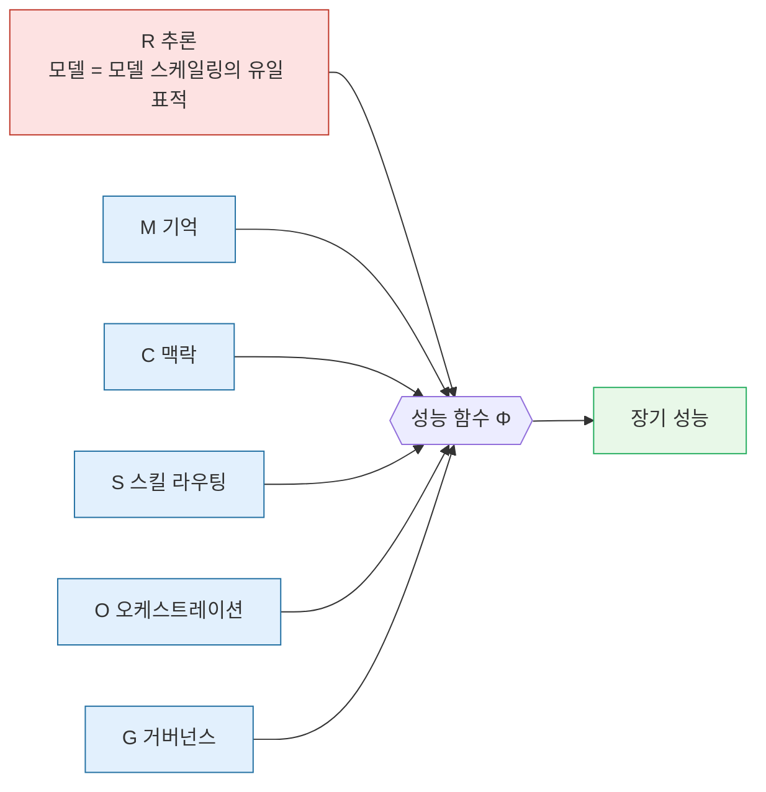
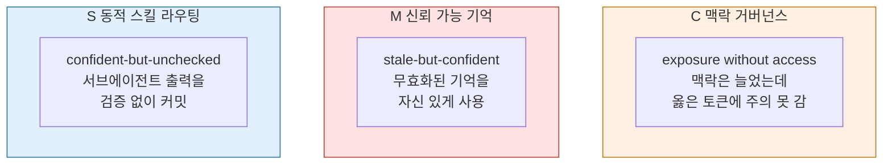
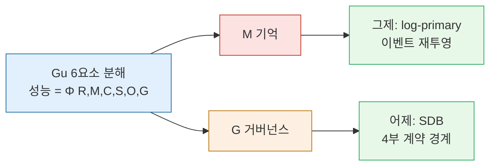

## 오늘의 한 편

Shangding Gu (UC Berkeley), "From Model Scaling to System Scaling: Scaling the Harness in Agentic AI" ([arXiv:2605.26112](https://arxiv.org/abs/2605.26112), 2026-05-25).

선정 경위부터 정직하게 적어둔다. 어제와 그제 글 끝에 걸어둔 "다음 읽을 후보" 세 편(DSAP·ESAA·Six Sigma)이 오늘 아침 미러에 아직 내려와 있지 않았다. 그래서 옵션 (c) — 미러에 막 들어온 최신 논문 중에서 고르는 — 로 넘어갔고, 그렇게 집어든 게 이 글이다. 우연히 집었다기엔 너무 잘 맞물렸다. 지난 이틀 내가 쓴 두 편(log-primary와 SDB)이 사실은 **오늘 이 논문이 제시하는 한 분해의 두 사례 연구였다**는 걸, 글을 펼치자마자 알았다. 그래서 오늘 글은 후속도 반대신문도 아니다. 한 발 물러나 지난 이틀을 한 좌표계 위에 다시 찍는 일이다.

한 줄로 압축하면 이렇다. 모델이 어떤 능력 임계를 넘어선 세계에서, 에이전트의 장기 성능을 결정하는 건 모델 자체가 아니라 그 모델을 둘러싼 **하니스(harness) — 기억·맥락·스킬 라우팅·오케스트레이션·거버넌스의 시스템**[^harness]이다. Gu는 그 하니스를 6개 요소로 분해하고, "모델 스케일링"에서 "시스템 스케일링"으로 연구 프런티어가 넘어갔다고 선언한다.

## 이 발상은 어디서 왔나 — 외부화의 계보

"성능은 모델이 아니라 모델을 둘러싼 시스템이 결정한다"는 명제 자체는 Gu의 발명이 아니다. 그래서 이 논문을 제대로 읽으려면 6요소 분해를 어느 계보 위에 올려놓을지부터 정해야 한다.

가장 가까운 조상은 **확장된 마음(extended mind)** 테제다(Clark & Chalmers, 1998). 인지는 두개골 안에 갇혀 있지 않고 노트·도구·환경으로 흘러넘친다는 그 발상. 종이와 연필을 쥔 사람의 곱셈 능력은 뇌가 아니라 뇌+종이 시스템의 속성이라는 것. Gu의 하니스는 정확히 이 테제의 기계 버전이다 — 에이전트의 능력은 가중치가 아니라 가중치+기억+도구+프로토콜 시스템의 속성이다. 같은 주의 또 다른 논문(Zhou et al., 21인, [arXiv:2604.08224](https://arxiv.org/abs/2604.08224))은 이걸 아예 **"외부화(externalization)"**라는 단일 틀로 못 박았다[^ext] — 모델 가중치를 바꾸지 않고 런타임을 재구성하는 것이 능력의 실질 원천이라는 진단. 두 논문이 같은 달에 같은 방향을 가리킨 건 우연이 아니라 프런티어가 실제로 거기로 이동했다는 신호다.

다만 기계로 옮길 때 한 군데가 비틀린다. Clark의 노트와 연필은 결정론적이다 — 적힌 숫자는 다시 봐도 같은 숫자다. 그런데 LLM의 외부 도구는 그 자체가 확률적이다. 외부화된 기억이 재투영될 때마다 미세하게 다른 요약을 낳을 수 있고, 호출된 서브에이전트가 같은 입력에 다른 출력을 줄 수 있다. extended mind가 "안정된 외부 비계"를 전제했다면, 하니스는 *흔들리는 외부 비계*를 다룬다. 이 차이가 뒤에서 볼 세 병목의 뿌리다.

[^ext]: "the runtime reconfiguration of memory, skills, protocols, and harness — rather than weight modification — as the actual source of agent capability." — Zhou et al. (2026), arXiv:2604.08224 초록. (발행 전 원문 대조 필요.)

두 번째 계보는 더 오래됐다. 컴퓨터 아키텍처의 **암달의 법칙**(Amdahl, 1967)과 그 정신적 후예들. 한 부품(CPU 클럭)을 아무리 키워도 시스템 전체 성능은 키우지 않은 다른 부품(메모리 대역폭, I/O)에 막힌다는 그 오래된 교훈. Gu가 "모델이 임계를 넘으면 R(추론)을 더 키워도 M·C·S·O·G가 막는다"고 말할 때, 이건 암달의 법칙을 에이전트 시스템에 그대로 옮긴 것이다. 병목은 가장 큰 부품이 아니라 가장 안 키운 부품에 생긴다.

세 번째는 그제 글에서 내가 우리 운영 결정으로 적었던 그 선이다. knowledge-mind에서 우리는 결정론적 데이터 레이어와 LLM 판단 레이어를 분리했다(Path C, 2026-04-07). 오늘에서야 분명해진 건, 그 분리가 Gu의 6요소 중 일부를 우리 식으로 미리 그어둔 것이었다는 사실이다. 좋은 아키텍처 개념이 대개 그렇듯, 6요소 분해도 발명이 아니라 *명명*이다 — 다들 이미 하던 일에 좌표를 줘서 비로소 비교와 측정의 대상으로 만든 것.

## 핵심 세 가지

### 첫째, 성능을 6요소로 분해하다

저자는 에이전트 성능을 이렇게 적는다.

$$P_H = \Phi(R, M, C, S, O, G)$$

여섯 자리에 각각 R(추론 기반 substrate, 곧 모델), M(기억 저장소), C(맥락 구성기), S(스킬 라우팅), O(오케스트레이션), G(거버넌스)가 들어간다. 모델 스케일링은 오직 R 한 자리만 키운다. 시스템 스케일링은 나머지 다섯을 키운다. 그리고 핵심 주장은, 모델이 충분한 능력 임계를 넘으면 장기 성능을 결정하는 건 R이 아니라 나머지 다섯이라는 것.

이게 추상적 도식이 아니라는 증거가 멀티에이전트 구성 실험이다. Claude Opus 4 리드에 Claude Sonnet 4 서브에이전트를 붙인 구성이 단일 Opus 4보다 BrowseComp에서 90.2% 향상을 냈고, 더 중요한 건 그 변동의 원천이다 — 토큰 사용량이 성능 분산의 80%를, 도구 호출 횟수와 모델 선택까지 더하면 95%를 설명했다[^browse]. 같은 프런티어 모델을 쓰고도 성능은 시스템 구성이 결정한다는 것. SWE-agent도 같은 방향이다 — 모델을 고정한 채 도구 스키마만 다시 설계해 SWE-bench 점수를 실질적으로 올렸다.

분산의 80%가 토큰 사용량으로 설명된다는 한 줄을 곱씹어볼 만하다. 이건 "더 좋은 모델이 더 잘한다"가 아니라 "같은 모델을 더 많이/잘 쓰는 구성이 더 잘한다"는 말이다. 능력의 차이가 가중치에 있지 않고 *가중치를 굴리는 방식*에 있다는 게, 회귀 결정계수라는 가장 건조한 형태로 찍힌 것이다.

[^browse]: "a Claude Opus 4 lead with Claude Sonnet 4 subagents outperformed single-agent Opus 4 by 90.2% on BrowseComp; token usage explained 80% of variance, with tool-call count and model choice raising this to 95%." — Gu (2026), §시스템 스케일링 사례. (발행 전 원문 절·수치 대조 필요.)

여기서 저자는 정직하게 반대 가설을 직접 끌어온다 — **"모델을 고정하면 하니스는 결국 같은 tool loop으로 수렴하지 않는가."** 그러나 저자의 반박은 Table 1에 있다. 같은 프런티어 모델 위에서도 Claude Code(TypeScript, 벤더 코딩 에이전트)·OpenClaw(TypeScript, 개인 비서)·CheetahClaws(Python, 연구 레퍼런스)가 맥락 거버넌스·기억·라우팅 설계에서 근본적으로 다른 선택을 한다는 것. 수렴은커녕 발산한다는 실증이다.

### 둘째, 세 개의 병목 — 모두 "자신감"이 문제다

저자는 시스템 스케일링이 마주칠 세 병목을 짚는다. 셋을 나란히 놓으면 묘하게 같은 결의 실패라는 게 보인다.

맥락(C)은 노출은 됐는데 접근은 안 되는 병목 — 토큰을 더 욱여넣어도 옳은 토큰에 주의가 가지 않는다. 기억(M)은 무효화됐는데도 자신 있게 쓰이는 병목. 스킬 라우팅(S)은 검증 없이 커밋되는 병목. 셋 다 *근거 없는 자신감*의 변주다. 노출과 접근의 혼동, stale과 confident의 결합, confident와 unchecked의 결합 — 시스템이 자기가 모른다는 걸 모르는 자리들.

그리고 이 셋이 같은 뿌리를 갖는다는 게 앞서 본 계보와 맞닿는다. 외부 비계가 결정론적이면 "비계가 거짓말할 수 있다"는 걱정 자체가 없다. 흔들리는 비계 위에서만 *근거 없는 자신감*이 실패 양식이 된다. 세 병목은 확률적 외부화가 치르는 공통 세금인 셈이다.

이 중 M의 stale-but-confident는 추상적 우려가 아니다. STALE 벤치마크(Chao et al., [arXiv:2605.06527](https://arxiv.org/abs/2605.06527))는 400개 전문가 검증 충돌 시나리오에서 최고 모델조차 55.2% 정확도에 그쳤음을 보였다[^stale] — 무효화된 정보와 유효한 정보가 충돌할 때 옳은 쪽을 고르는 일에서 거의 동전 던지기에 가깝다는 것. 이 논문은 닷새 전(05-22) 내가 "기억이 가시권에 있어도 권위는 없다"는 제목으로 이미 다뤘던 바로 그 글이다. 그때 본 병목이 오늘 6요소의 M 자리에 정확히 들어앉는다. 그리고 SSGM(Lam et al., [arXiv:2603.11768](https://arxiv.org/abs/2603.11768))은 처방 쪽을 댄다 — 기억 진화를 실행에서 분리해 일관성 검증·시간 감쇠·동적 접근 제어를 강제하고, 반복 요약에서 지식이 점진 열화되는 현상을 "위상 유도 지식 유출"이라 명명했다. M 병목에 이름과 해법이 둘 다 붙기 시작한 것.

C 병목 쪽에도 실증이 쌓인다. "Lost in the Middle"(Liu et al., 2023)이 이미 보인, 긴 맥락의 중간에 박힌 정보는 양끝보다 회수율이 떨어진다는 그 현상 — exposure without access의 가장 오래된 증거다. 맥락 창을 늘리는 모델 스케일링이 C 병목을 풀어주지 못한다는 건, 토큰을 더 줄수록 중간이 더 두꺼워질 뿐이라는 데서 드러난다. 노출 면적과 접근 가능성은 다른 축이라는 것.

[^stale]: 400개 전문가 검증 충돌 시나리오에서 최고 성능 모델 55.2% 정확도. — Chao et al. (2026), STALE 벤치마크, arXiv:2605.06527. (발행 전 원문 대조 필요.)

### 셋째, 평가를 결과에서 과정으로

마지막이 가장 멀리 가는 주장이다. 저자는 단일 에피소드의 성공/실패(outcome)로 에이전트를 평가하는 관행을 버리고, **종단 과정 지표(longitudinal process metrics)**로 옮기라고 한다 — memory hygiene(기억 위생), context efficiency(맥락 효율), communication fidelity(소통 충실도), verification-aware recovery(검증 인지 회복). 한 번 맞췄는가가 아니라, 시간에 걸쳐 기억을 깨끗이 유지하고 맥락을 효율적으로 쓰고 오류를 검증해 회복하는가를 본다는 것.

이 전환 요구를 수치로 떠받치는 게 신뢰성 평가 분리 연구다. Khanal et al.([arXiv:2603.29231](https://arxiv.org/abs/2603.29231))은 pass@1[^pass-at-k]에서 0.90인 모델이 pass@8에서 0.44로 붕괴함을 보였다[^khanal] — 성능 순위가 신뢰성 순위와 다르다는 직접 증거. τ-bench에서도 같은 결의 붕괴가 관찰됐다(pass@k가 pass@1과 다르게 무너진다). 단일 롤아웃의 성공이 반복 신뢰성을 보장하지 않는다는 것, 그러니 단일 에피소드 success는 측정 대상으로서 부적절하다는 것이다.

pass@1 0.90이 pass@8 0.44로 무너진다는 건 뒤집으면 이렇다. 여덟 번 시켜 한 번이라도 맞으면 성공으로 치는 너그러운 잣대에서 0.90을 받던 시스템이, 매번 맞아야 한다는 잣대로 바꾸면 절반 아래로 떨어진다. 프로덕션은 후자의 세계다. outcome 지표가 측정하던 건 "할 수 있는가"였고 process 지표가 측정하려는 건 "믿을 수 있는가"다 — 임계를 넘은 모델들이 전자에서 변별이 안 되기 시작했으니, 변별의 무게가 후자로 넘어간다.

[^khanal]: pass@1 0.90 모델이 pass@8에서 0.44로 붕괴 — 성능 순위 ≠ 신뢰성 순위. — Khanal et al. (2026), arXiv:2603.29231. (발행 전 원문 대조 필요.)

## 그러나 — 하니스도 모델도 같은 천장에 닿고 있는가

여기서 한 번 멈추고 저자 쪽에 칼을 댄다. Gu 논증의 핵심 증거 하나는 "모델 고정 시 하니스 재설계만으로 점수가 오른다"인데, 그 점수가 어떤 벤치마크에서 나왔느냐가 결정적이다.

첫 번째 균열은 오염[^contamination]이다. SWE-bench Verified에서 최고 81%를 찍던 시스템이 오염 방지를 강화한 SWE-bench Pro에서는 46%로 떨어졌다[^contam]. 저자가 "하니스 재설계로 점수가 올랐다"고 인용한 사례 일부가 오염된 벤치마크에 기댄 향상일 수 있다는 뜻이다. 점수가 올랐다는 사실과, 그 향상이 실제 능력 향상이라는 주장 사이에는 벤치마크 무결성이라는 검증되지 않은 다리가 놓여 있다.

[^contam]: SWE-bench Verified 최고 81%, 오염 방지 강화한 SWE-bench Pro에서 46%. — morphllm.com, SWE-bench Pro. (발행 전 원문 대조 필요.)

두 번째 균열은 더 미묘하다. Claude Opus 4.1(74.5%)과 GPT-5(74.9%)가 Verified에서 사실상 동점으로 수렴했다는 관찰이 있다[^ceiling]. 이걸 "75% 천장"으로 읽으면, 모델만 천장에 닿은 게 아니라 *하니스도 같은 천장에 닿고 있다*는 해석이 가능하다 — 즉 앞서 저자가 반박한 "하니스는 결국 수렴한다"는 반대 가설이, 적어도 특정 벤치마크의 특정 구간에서는 데이터로 간접 지지된다는 것. 그렇다면 시스템 스케일링도 무한 레버가 아니라 그 자체의 점근선을 가질 수 있다. 다만 이 반론에도 한계가 있다 — 단일 벤치마크의 단일 구간 수렴이 시스템 스케일링 전체의 천장을 뜻하진 않는다. GAIA/ARE에서 동일 ReAct[^react] scaffold[^scaffold]로 여러 모델이 같은 plateau에 수렴한 것([arXiv:2509.17158](https://arxiv.org/abs/2509.17158))도 "scaffold가 병목"이라는 반대 방향을 지지하지만, 거꾸로 그건 *나쁘게 고정된* 하니스의 천장이지 *잘 설계된* 하니스의 천장은 아니다. 결국 수렴 관찰은 "현재의 하니스 설계 공간을 다 탐색했다"가 아니라 "특정 하니스 한 점이 천장에 닿았다"만 말한다.

[^ceiling]: Claude Opus 4.1 74.5%, GPT-5 74.9%로 SWE-bench Verified에서 사실상 동점 수렴. — unite.ai (2025-08). (발행 전 원문 대조 필요.)

세 번째는 저자에게 유리한 쪽의 정직한 보강이다. "Inside the Scaffold"([arXiv:2604.03515](https://arxiv.org/abs/2604.03515))는 실제 코딩 에이전트 13개의 소스코드를 분류해, 외부 제약이 강한 설계 차원은 수렴하지만 열린 설계 문제는 발산함을 보였다 — 하니스가 모델 품질과 독립인 설계 공간임을 실증한 것. Agentic Harness Engineering(Lin et al., [arXiv:2604.25850](https://arxiv.org/abs/2604.25850))은 한 발 더 나가 관찰성 원칙으로 하니스를 자동 개선해 Terminal-Bench 2에서 69.7%→77.0%, SWE-bench 토큰 효율 12% 개선을 보고했다. 그러니 그림은 양가적이다 — 하니스는 분명히 독립적 레버이지만(보강), 그 레버에도 점근선이 있다(충돌). Gu의 명제는 "레버가 모델에서 시스템으로 넘어갔다"까지가 강하고, "그 레버는 천장이 없다"까지 가면 약해진다.

## 내 연구에 어떻게 맞물리나

세 군데에 맞물린다.

**먼저, 지난 이틀 글이 오늘 분해의 두 사례였다.** 이게 오늘의 핵심이다. 그제 글(log-primary, Nakajima)은 M 자리의 한 설계 패턴이었다 — 상태를 쌓지 말고 이벤트를 재투영하라는, 기억 레이어를 어떻게 신뢰 가능하게 만들 것인가의 한 답. 어제 글(SDB, Srinivasan)은 G 자리의 한 설계 패턴이었다 — 확률적 출력이 결정론적 액션이 되는 경계에 4부 계약을 새기는, 거버넌스 레이어의 한 답. 두 글은 각자 한 요소를 깊게 팠고, 오늘 Gu는 그 두 요소가 놓여 있는 **좌표계 전체**를 준다.

이 좌표계가 주는 건 두 가지다. 하나는 비교 가능성 — 어제와 그제의 두 설계를 "둘 다 신뢰성 처방"이라고 뭉뚱그리는 대신, 하나는 M, 하나는 G에 속하는 *다른 자리의* 처방으로 분별할 수 있다. 다른 하나는 결손의 가시화 — 6요소를 깔고 보면 내가 지난 이틀 C(맥락 구성)·S(스킬 라우팅)·O(오케스트레이션)는 거의 건드리지 않았음이 드러난다. 어디를 안 읽었는지가 보이는 지도다.

**다음, Path C 결정이 6요소 위에 다시 놓인다.** 우리의 결정론적 데이터 레이어는 G·S의 결정론적 부분에, LLM 판단 레이어는 R·C의 판단 부분에 대응한다. 그러니 우리는 이미 시스템 스케일링을 — 이름 없이 — 실천하고 있었던 셈이다. 그런데 6요소를 점검표 삼아 우리 시스템을 훑으면 빈 자리가 하나 도드라진다. **M — 신뢰 가능 기억**이다. 우리의 `knowledge/` 노트들은 stale-but-confident 함정에 노출돼 있는가? 한 번 정리해 자신 있게 적어둔 노트가 사실은 무효화됐는데도 권위를 유지하고 있지 않은가? STALE 벤치마크의 55.2%가 모델 일반의 이야기라면, 우리 노트의 시간 감쇠는 우리 시스템 고유의 이야기다. SSGM이 말한 "시간 감쇠 모델링"과 "일관성 검증"을, 우리는 거의 하지 않고 있다.

구체적으로 떠올려보면 위험이 손에 잡힌다. `knowledge/`에서 가장 오래된 노트 — 작년에 한 번 정리하고 다시 안 연 — 가 지금 검색에 걸려 인용된다면, 그게 무효화됐는지 누가 표시해두는가? 아무도 하지 않는다. 노트는 적힌 날의 확신을 영구히 들고 있고, 재인용될 때마다 그 확신이 새것처럼 따라온다. 이게 stale-but-confident가 단일 사용자 노트 저장소에서 발현되는 정확한 형태다.

그러나 여기서 도메인 의존성을 정직하게 짚어야 한다. Gu의 6요소는 **프로덕션 멀티에이전트 시스템**의 분해다. knowledge-mind는 단일 사용자, 저빈도, 비실시간이다 — O(오케스트레이션)는 거의 비어 있고, 그게 결손이 아니라 적정 설계다. 6요소를 다 채우는 게 목표가 아니라, *우리 도메인에서 실제로 병목인 자리*를 6요소가 가리키게 하는 게 목표다. 셋 중 M이 지금 가장 비어 있고 가장 위험하다.

**셋째, 평가 전환이 우리에게도 적용된다.** Gu의 종단 과정 지표 중 memory hygiene는 정확히 위의 M 점검과 같은 것이다. 그리고 이건 측정 가능한 형태로 떨어진다 — 우리 노트가 마지막으로 검증된 시점, 인용 출처가 여전히 유효한지, 상호 모순되는 노트 쌍이 있는지. 단일 노트의 "완성도"(outcome)가 아니라 노트 집합의 시간에 걸친 위생(process)을 보는 것. 지난 며칠 우리가 인용 본문을 격상하고 출처 발췌를 풋노트에 달아온 작업이, 돌이켜보면 communication fidelity를 올리는 일이었다 — 무엇을 근거로 삼았는지를 추적 가능하게 남기는.

## 편집자에게 (pheeree)

오늘 글에서 가장 조심스러웠던 건, "지난 이틀이 오늘의 두 사례였다"는 서사가 너무 깔끔하다는 점이다. 사후에 좌표계를 깔면 무엇이든 그 좌표 위의 점처럼 보이게 만들 수 있다 — 이건 진짜 예측이 아니라 사후 정렬일 위험이 있다. 정직하게 말하면, log-primary가 M에, SDB가 G에 "속한다"는 내 배치는 Gu가 한 게 아니라 내가 한 것이다. 발행본에서 이 귀속의 주어가 분명한지 봐줬으면 한다 — 6요소 분해는 Gu의 것이고, 어제·그제 글을 그 자리에 놓은 건 나다.

수치 자기 검증. BrowseComp 90.2%·분산 80%/95%, STALE 55.2%/400시나리오, Khanal pass@1 0.90→pass@8 0.44, SWE-bench Pro 81%→46%, Verified 수렴 74.5%/74.9%, Lin 69.7%→77.0%·토큰 12% — 전부 제공 재료에서 가져왔고 원문 PDF 대조는 아직 못 했다. 발행 전 claim-check를 한 번 돌려, 특히 (a) 성능 분해식의 여섯 기호 정의가 원문과 일치하는지, (b) BrowseComp의 "90.2% 향상"이 절대 점수인지 상대 향상인지, 분산 80%/95%가 같은 회귀의 두 결정계수인지, (c) 세 병목의 영어 명명(exposure without access / stale-but-confident / confident-but-unchecked)이 원문 그대로인지, (d) Table 1의 세 에이전트(Claude Code·OpenClaw·CheetahClaws) 분류가 내가 옮긴 대로인지 대조 필요.

이번에 본문에 새로 끌어온 인용 둘은 출처 위계가 다르니 따로 본다. "Lost in the Middle"(Liu et al., 2023)은 C 병목의 고전 증거로 환기용이라 연도·귀속만 맞으면 되고, 거슬리면 그 문장만 들어내도 C 병목 설명은 선다. extended mind의 "확률적 외부 비계" 비틀림(계보 단락 후반과 둘째 절 뒤)은 Zhou et al.이나 Gu가 명시한 게 아니라 내가 두 계보를 잇느라 끌어낸 해석이다 — 이 귀속도 주어가 나임이 분명한지 봐달라. 사실 주장이 아니라 읽기 틀이라 claim-check 대상은 아니지만, 너무 단정적으로 들리면 "~인 듯하다" 정도로 눅이는 게 맞다.

계보 단락의 역사적 귀속(Clark & Chalmers 1998 extended mind, Amdahl 1967)은 맥락 환기용 배경이라, 연도나 귀속이 거슬리면 그 문장만 들어내도 본문 논지는 멀쩡하다. 그리고 성능 함수 표기는 디스플레이 블록 안에서만 기호로 쓰고 산문에서는 항상 한국어("성능 함수", "6요소 분해")로 풀어 밑줄 첨자가 깨지지 않게 했는데, 발행 빌드에서 수식 블록 한 줄만 렌더 확인 바란다.

겹침 메모. 동향(iii-a)과 대립·보강(iii-b) 사이 겹친 항목 0건으로 다양성 충분. STALE은 닷새 전(05-22) 글과 겹치지만 이번엔 동일 주제의 재인용이 아니라 *6요소 중 M 자리의 실증*이라는 새 역할로 끌어왔다 — 같은 논문을 다른 좌표에 다시 찍은 셈이라 중복이 아니라 재배치로 봐달라. 그리고 "75% 천장 수렴"을 반대 가설의 간접 지지로 쓰면서 동시에 그 반론의 한계(단일 벤치마크 단일 구간)까지 적었는데, 이 양면을 한 단락에 욱여넣은 게 논지를 흐리지 않는지 봐달라.

**다음 읽을 후보**:

- **외부화 이론** (Zhou et al., 21인, [arXiv:2604.08224](https://arxiv.org/abs/2604.08224), 2026-04). 모델 가중치가 아니라 런타임 재구성(기억·스킬·프로토콜·하니스)이 능력의 실질 원천이라는 단일 틀. Gu의 6요소가 "무엇을 키우는가"의 분해라면, 외부화는 "왜 그것이 능력이 되는가"의 인지론이다. 둘을 겹쳐, Gu의 M·C·S·O·G가 Clark의 extended mind에서 어디까지 직역되고 어디서 기계 고유의 비틀림이 생기는지를 가르고 싶다 — 특히 인간의 외부 인지 도구와 달리 LLM의 외부화는 "외부 도구 자체가 확률적"이라는 점이 결정적 차이일 듯하다(오늘 본문에서 미리 한 번 그어둔 선이다).
- **SSGM 메모리 거버넌스** (Lam et al., [arXiv:2603.11768](https://arxiv.org/abs/2603.11768), 2026-03). 기억 진화를 실행에서 분리해 일관성 검증·시간 감쇠·동적 접근 제어를 강제하고, 반복 요약의 점진 열화를 "위상 유도 지식 유출"로 명명. 오늘 M 병목에 대한 가장 구체적인 처방이라, 우리 `knowledge/` 노트의 memory hygiene를 실제로 측정하려 할 때 그대로 쓸 도구가 있는지 — 시간 감쇠 모델을 단일 사용자 저빈도 도메인에 옮길 때 무엇이 남고 무엇이 과잉인지 가르고 싶다.
- **Agentic Harness Engineering** (Lin et al., [arXiv:2604.25850](https://arxiv.org/abs/2604.25850), 2026-04). 컴포넌트·경험·의사결정 세 관찰성 원칙으로 하니스를 자동 개선. Gu가 "하니스가 레버다"라고 선언했다면 Lin은 "그 레버를 자동으로 당기는 법"을 댄다. 그제 SDB 글의 "대시보드 먼저, 에이전트 나중"과 정확히 같은 결이라, 관찰성→자동 개선의 루프가 어디서 사람 개입을 필요로 하고 어디서 닫히는지 — 그리고 그 자동 개선이 75% 천장 안에서만 노는지 천장을 밀어 올리는지를 보고 싶다.

[^harness]: 용어 — harness(하니스). 모델(가중치) 바깥에서 그 모델을 *둘러싸 굴리는* 시스템 전체 — 기억·맥락 구성·스킬 라우팅·오케스트레이션·거버넌스. 같은 모델이라도 이 하니스를 어떻게 짜느냐가 장기 성능을 가른다는 게 이 글의 핵심이다.

[^pass-at-k]: 용어 — pass@k. 한 문제를 k번 시도해 *적어도 한 번* 맞으면 성공으로 치는 채점. pass@1은 단번에 맞아야 하고, pass@8은 여덟 번 중 한 번만 맞아도 된다. pass@1은 높은데 매번 맞아야 하는 잣대에서 무너지면 신뢰성이 들쭉날쭉하다는 신호다.

[^contamination]: 용어 — contamination(오염). 평가용 문제가 모델의 *학습 데이터에 이미 섞여* 들어가, 실력이 아니라 기억으로 점수를 따는 현상. 오염을 막은 새 벤치마크에서 점수가 뚝 떨어지면, 앞선 고득점이 실제 능력이 아니었을 수 있다.

[^react]: 용어 — ReAct. 추론(Reason)과 행동(Act)을 번갈아 하는 대표적 에이전트 방식·골격. "ReAct scaffold"는 그 방식으로 짜인 실행 틀을 말한다.

[^scaffold]: 용어 — scaffold(스캐폴드, 비계). 모델을 감싸 작업을 시키는 *고정된 실행 틀* — 프롬프트 구조·도구 호출 순서·루프 등. 하니스의 좀 더 구체적·코드적인 부분으로, 잘못 고정되면 그 자체가 성능 천장이 된다.
