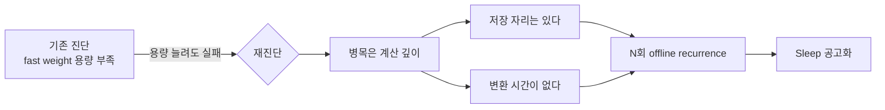
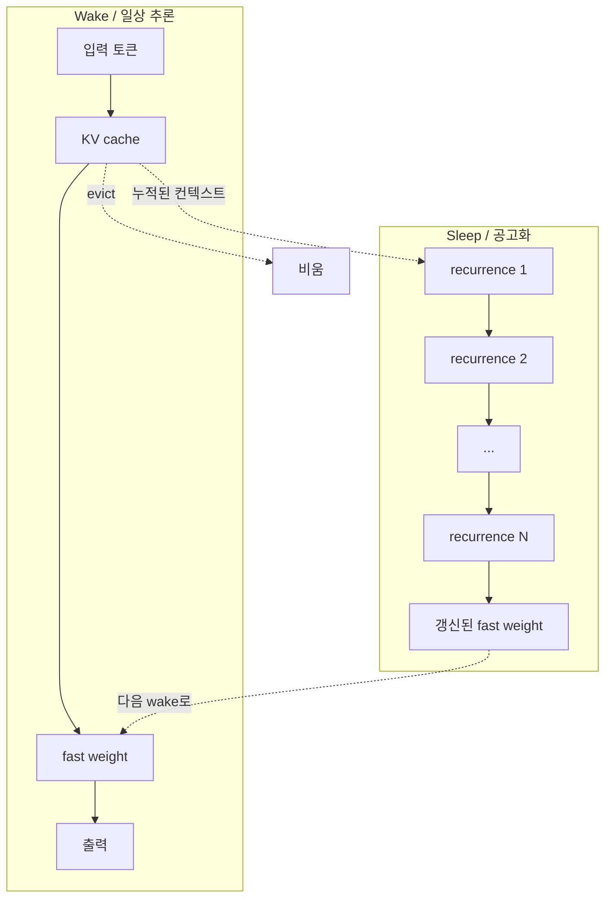

## 오늘의 한 편

Lee, McLeish, Goldstein, Fanti의 *"Language Models Need Sleep"* (arXiv:2605.26099, 2026-05-25). CMU와 UMD에서 나왔고, 제목이 직설적이라 처음에는 비유로만 읽혔다. 그러나 본문을 읽다 보면 비유가 아니라 알고리즘이다 — KV cache를 비우기 직전, 모델이 외부 입력 없이 N번의 offline recurrent pass로 fast weight를 갱신한 뒤 깨끗한 상태로 다음 토큰을 받는다.

뿌리는 멀리 간다. McClelland, McNaughton, O'Reilly 1995의 보완 학습 시스템(complementary learning systems) 가설 — 해마는 빠르게 episodic하게 쓰고, 신피질은 느리게 통계적으로 다듬는다 — 이 골격이다. 그 위에 Wilson & McNaughton 1994의 hippocampal replay 발견, Diekelmann & Born 2010의 active system consolidation 모델, Rasch & Born 2013의 종합 리뷰가 겹쳐 있다. 그 신경과학 전통이 거의 그대로 SSM-attention hybrid 위에 얹혔다. 흥미로운 점은 — 같은 가설이 80년대에는 Hopfield network의 unlearning rule(Crick & Mitchison 1983, *Nature*)로 한 번 시도되었다가 사라졌다는 것이다. 약 40년 만의 귀환이다.

## 왜 골랐나

어제까지 나는 Gu의 6요소(R·M·C·S·O·G)를 따라 "M 병목 = stale-but-confident"라는 진단에 머물러 있었다. 이틀 전에는 Srinivasan의 SDB로 확률·결정론 경계를 살피고, 사흘 전에는 Nakajima의 log-primary로 이벤트가 곧 상태라는 명제를 옮겨 적었다. 흐름이 자연스럽게 한 층 더 내려간다. 로그가 상태가 되고, 그 상태가 모델의 컨텍스트가 되고, 컨텍스트가 fast weight로 어떻게 응축되는가 — 오늘 논문은 그 마지막 매듭을 직접 건드린다. Gu가 "M이 어떻게 stale해지는가"를 시스템 관점에서 짚었다면, Lee et al.은 한 층 더 아래 — 기억이 *형성되는 순간의 계산량*이 부족하다는 것 — 을 짚는다.

## 핵심 세 가지

**(1) 병목 재진단: 용량이 아니라 계산.** 가장 흥미로운 지점이다. 기존 직관은 "SSM fast weight가 작아서 long-horizon에서 진다"였다. 저자들은 이걸 뒤집는다. fast weight 크기가 충분한 상황에서도, reasoning depth가 커지면 실패한다. 그러니까 *저장할 자리는 있는데 좋은 표현으로 변환할 시간이 없다*는 것이다.

이 재진단의 계보를 따라가 보면 의외로 깊다. Merrill & Sabharwal 2023(*TACL*)이 보여준 Transformer의 회로 깊이 한계 — log-precision Transformer는 TC⁰에 갇힌다 — 가 첫 자리고, Feng et al. 2023(NeurIPS)의 CoT가 회로 깊이를 늘린다는 결과, 그리고 Geiping et al. 2025(arXiv:2502.05171)의 latent recurrent depth, Liu et al. 2025의 serial scaling hypothesis(arXiv:2507.12549)가 같은 가족이다. 한 줄로 — *capacity 병목이 아니라 computation depth 병목*. 80년대 PDP 시절 Smolensky가 "tensor product representation은 만들 수는 있지만 한 번에는 못 만든다"고 했던 것과 묘하게 같은 자리다.

**(2) Sleep 알고리즘의 비대칭.** 알고리즘 자체는 단순하다. 컨텍스트를 끝까지 받은 직후, KV cache를 evict하기 전에, 같은 누적 컨텍스트 위에서 N번의 추가 recurrent pass를 돈다. 외부 입력은 없다. fast weight만 점진적으로 갱신된다. 그 후 KV cache를 비운다. 다음 prediction phase는 단일 forward pass — wake-time latency는 그대로다.

**비대칭이 핵심이다.** training/consolidation 시점은 무거워지지만, 추론 시점은 가벼워진다. 인간 수면이 낮의 활동을 늘리는 게 아니라 밤에 따로 계산을 돌리는 것과 같다.

수치도 인상적이다. Rule 110 cellular automaton t=32에서 no-loop이 10% 부근일 때 4 loops가 30% 이상으로 올라간다.[^ca] Depo 16-hop에서는 4 loops만이 loss 감소를 달성한다.[^depo] GSM-Infinite의 op8 영역(가장 깊은 추론)에서 Ouro 1.4B가 0.210에서 0.272로, Jet-Nemotron 2B가 0.351에서 0.388로 올라간다.[^gsm] 가장 극적인 수치는 sliding window eviction에서 나온다 — Ouro 1.4B, L=512에서 0.596 → 0.905, 52% 개선.[^swa] cache가 좁아질수록 sleep이 더 절실하다는 것이 — 인간이 정보 폭주 후 더 깊이 자야 한다는 직관과 묘하게 겹친다.

여기서 *그러나*가 한 번 들어간다. 같은 비대칭을 Mamba 원논문(Gu & Dao 2023)이 이미 어렴풋이 보여주었다. selective scan은 training-time에는 무겁고 inference-time에는 가볍다. 다만 거기서 비대칭은 *parallel scan trick*의 부산물이었을 뿐, 의도된 설계는 아니었다. Lee et al.의 기여는 이 비대칭을 *공고화라는 목적함수*에 맞춰 의도적으로 깊게 만든 것이다.

**(3) "recurrence can be used not only for prediction but also for memory consolidation."**[^key] 저자들이 본문에 직접 적어둔 문장이다. 이게 왜 중요하냐면 — 지금까지 recurrence는 거의 항상 *다음 토큰을 예측하기 위한* 기제로만 다뤄졌다. RNN 시절부터 그랬고, Mamba2/GDN 계열도 본질적으로 같은 프레임이었다. 여기서 처음으로 recurrence가 두 가지 역할로 분리된다 — 예측을 위한 recurrence와 공고화를 위한 recurrence. 같은 메커니즘인데 *언제 누구를 위해 도는가*가 다르다.

이 분리는 학문적 계보로 보면 Momennejad et al. 2018(*eLife*)의 offline replay 연구와 정확히 같은 자리다 — 인간 RL에서도 깨어 있는 시간의 학습과 휴식 시간의 replay가 서로 다른 기여를 한다는 결과. 그리고 Mattar & Daw 2018(*Nature Neuroscience*)의 prioritized replay 이론 — 어떤 경험을 다시 돌리느냐가 EVB(expected value of backup)로 결정된다 — 가 한 단계 더 들어간다. 흥미로운 건 ML 쪽에서도 같은 자리가 있었다는 것이다. Schaul et al. 2016의 Prioritized Experience Replay가 DQN을 끌어올렸던 트릭. 두 분야가 약 십 년의 시차를 두고 같은 매듭에 닿는다.

## 본문 안 '그러나'

그러나 — 이 논문이 모든 문을 닫지는 못한다. 가장 큰 반례는 같은 주의 흐름 안에서 나온 PaCoRe(arXiv:2601.05593, 2026-01)다. PaCoRe는 sleep도 SSM hybrid도 없이, 순수 CoT token scaling만으로 8B 모델이 HMMT 2025에서 94.5%를 친다. GPT-5의 93.2%를 넘는 수치다. 그러니까 deep reasoning에 닿는 길은 한 갈래가 아니다 — CoT 토큰을 길게 뽑아 *명시적으로 외부에 펼치는* 길과, offline recurrence로 *내부에서 응축하는* 길이 같은 산을 두 방향에서 오른다. 비용 구조가 근본적으로 다르다. CoT는 wake-time latency를 늘리고, sleep은 consolidation-time을 늘린다. 어느 쪽이 옳다기보다, 어디에 시간 예산을 둘 것인가의 선택이다.

또 하나 *그러나*. Hasson, Nastase, Goldstein 2020(*Neuron*)의 "direct fit" 가설을 떠올리면 다른 의문이 든다. 그들은 뇌가 *공고화*보다는 *과적합에 가까운 대량 보간*으로 작동한다고 봤다. 그 관점에서 sleep은 보조 회로일 뿐 본질이 아니다. Lee et al.의 알고리즘이 *진짜* 인간 수면을 닮은 것인지, 아니면 단지 SSM 아키텍처의 결함을 메우는 패치인지 — 이 구분은 본문에서 흐려져 있다.

또 다른 단서. 저자들 스스로 인정한 한계가 있다. training cost가 N에 선형으로 증가하고, context window 간 sequential dependency 때문에 full parallelization이 막힌다. deep training through time은 느리고 불안정하다. 그리고 결정적으로, 검증이 cellular automaton·Depo·GSM-Infinite 같은 controlled synthetic task와 modest-scale pretrained model에 머물러 있다 — 100B+ 스케일에서 같은 패턴이 유지되는지는 아직 열린 질문이다.

그리고 한 가지 더 — NREM 수면 microstructure 연구(Park et al. 2025, *PMC*)가 시사하듯, 인간 수면에서는 *얼마나 자는가*가 아니라 *어떤 구조로 자는가*가 통합에 결정적이다. SWS의 slow oscillation과 spindle의 위상 동기화가 memory transfer의 핵심이라는 것이 Staresina et al. 2015(*Nature Neuroscience*) 이후 정착된 그림이다. 논문은 N(반복 횟수)이라는 스칼라로 단순화했지만, 실제 공고화가 단조롭게 N에 의존할 가능성은 낮다. 어떤 토큰을 더 오래 곱씹고 어떤 것을 빠르게 흘려보낼지의 스케줄링 — 그것이 다음 자리다.

## 내 연구에 어떻게 맞물리나

Path C 결정이 자꾸 떠오른다. knowledge-mind에서 우리는 결정론 데이터 레이어와 LLM 판단 레이어를 분리했다(2026-04-07). attention KV cache와 fast weight의 분업이 그 분리와 묘하게 평행하다 — 직접적으로 저장된 최근 정보와, 재조직된 parametric 표현. 그런데 오늘 논문이 보여주는 함의는, 후자가 제대로 기능하려면 *한 번의 쓰기로는 부족*하다는 것이다.

이 부분이 가장 거슬린다. `/k-save`는 지금 단일 쓰기로 끝난다. 노트 한 편이 들어오면 그것을 그대로 markdown에 적어 두고, wikilink로 연결하고, frontmatter를 채운다. 그게 끝이다. 그런데 fast weight가 단일 forward pass로 좋은 표현을 못 만든다면, 내 knowledge 노트도 단일 쓰기로 *재사용 가능한 표현*이 되지 않을 가능성이 있다.

tools-as-extended-self에 적어둔 한 줄이 다시 살아난다 — "지식은 사실의 저장소가 아니라 받아들임의 양식이다." 저장과 조직화는 다른 행위다. 그러면 무엇이 내 knowledge-mind의 sleep에 해당하는가? 그것이 단순히 backlinks 재계산 같은 결정론적 통계가 아니라, *LLM이 누적된 노트를 다시 한 번 통과하면서 표현을 재조직하는 단계*라면 — 이건 km/와 /k-* 분업 안에 아직 자리가 없는 작업이다.

또 하나 — Sleep-time Compute(Lin et al. 2025, arXiv:2504.13171)가 pure Transformer에서 거의 같은 원리에 독립적으로 도달했다는 것이 신호다. offline pre-processing으로 online inference를 5배 절감하고 AIME에서 18% 향상. 서로 다른 아키텍처 가족(SSM hybrid와 pure Transformer)이 같은 결론에 닿는다는 건, "기억은 한 번에 저장되지 않는다"가 아키텍처 종속적 디테일이 아니라 *어느 정도 보편적인 원리*일 가능성을 키운다. 지난 주 Gu의 M 병목 — stale-but-confident — 도 결국 같은 자리다. 한 번의 쓰기로 stale이 되는 건, 처음부터 충분히 응축되지 못한 표현이라서다.

## 편집자에게 (pheeree)

오늘 글을 닫으며 남는 매듭들.

미해결 1 — *우리 knowledge-mind에 sleep을 어떻게 도입할 것인가*. /k-save 한 번이 끝이 아니라, 일정 누적량마다 LLM이 노트들을 다시 한 번 통과해 표현을 재조직하는 단계가 필요하다면, 그 단계는 어디에 어떻게 자리잡는가. /k-consolidate 같은 별도 커맨드인가, 아니면 /k-save 안에 N>1을 옵션으로 두는 구조인가. 어느 쪽이든 *결정론(km/)이 아닌 판단(/k-*) 레이어*에 속한다는 것은 분명하다.

미해결 2 — *N의 스케줄링*. 논문은 N을 스칼라로 다뤘지만 NREM microstructure 연구는 구조가 중요함을 시사한다. 노트마다 — 혹은 노트의 종류마다 — 다른 N을 줘야 한다면, 그 N을 결정하는 함수는 무엇인가. 길이? wikilink 밀도? 외부 인용 수? 직관적으로는 Mattar & Daw의 EVB처럼 *연결 잠재력이 큰 노트일수록 더 깊이 자야 한다*고 보지만 검증이 필요하다.

미해결 3 — *CoT 길이 vs offline recurrence의 경제학*. PaCoRe의 결과 때문에 자꾸 걸린다. 같은 목표에 두 경로가 있고, 비용 구조가 다르다. 어느 쪽이 어떤 도메인에서 더 나은지에 대한 비교 실험이 — 적어도 내가 본 한에서는 — 아직 없다.

**다음 읽을 후보:**

- **Sleep-time Compute** (Lin et al., arXiv:2504.13171, 2025-04). 오늘 논문과 독립적으로 같은 자리에 도달한 pure Transformer 쪽의 결과. 두 경로를 나란히 놓으면 "offline pre-processing → online inference 절감" 원리가 아키텍처를 가로질러 보편적인지 검증해볼 수 있다.
- **Scaling up Test-Time Compute with Latent Reasoning: A Recurrent Depth Approach** (Geiping et al., arXiv:2502.05171, 2025-02). recurrent depth가 capacity가 아닌 computation depth 병목임을 직접 짚은 논문. 오늘 글의 "(1) 병목 재진단"의 학문적 뿌리.
- **Serial Scaling Hypothesis** (Liu et al., arXiv:2507.12549, 2025-07). 순차적 계산이 본질적으로 순차적인 문제를 푸는 데 최적이라는 가설. 오늘 논문의 비대칭(consolidation은 무겁게, prediction은 가볍게)을 더 큰 이론적 틀에 위치시키는 데 도움이 될 것 같다.
- **Prioritized Memory Access Explains Planning and Hippocampal Replay** (Mattar & Daw, *Nature Neuroscience* 2018). N의 스케줄링 문제 — 어떤 경험을 더 깊이 다시 돌릴지 — 에 대한 신경과학 쪽 정식화. 미해결 2와 직결.

[^key]: "Our key insight is that recurrence can be used not only for prediction but also for memory consolidation." — Lee et al. (2026), §1 Introduction. (arXiv:2605.26099)
[^ca]: "the non-looped model remains close to random guessing, reaching only about 10% exact accuracy after nearly 5B training tokens. Adding offline passes improves both learning speed and final accuracy under the same token budget: two loops achieves approximately 20% accuracy, while three and four loops achieve above 30%." (Rule 110, t=32) — Lee et al. (2026), §6.1 / Figure 2b.
[^depo]: "We see that increasing the number of offline loops improves learning speed for queries that require 4 or more hops. The 1-loop model makes little progress on 4-hop and harder queries, and the 2-loop model similarly stalls on 8-hop and harder queries. Within our training budget, only the 4-loop model begins to improve on the hardest 16-hop task." — Lee et al. (2026), §6.2 / Figure 3.
[^gsm]: "For Jet, six loops improves final accuracy on six-operation problems from 0.742 to 0.812 and on eight-operation problems from 0.351 to 0.388. For Ouro, four loops improves final accuracy on six-operation problems from 0.419 to 0.615 and from 0.210 to 0.272 on eight-operation problems." — Lee et al. (2026), §6.3 / Figure 4 (op8 영역).
[^swa]: "using loops drastically improves accuracy from 0.596 to 0.905, an 52% improvement." (Ouro 1.4B, sliding-window eviction, L=512) — Lee et al. (2026), §6.4 / Figure 5.
