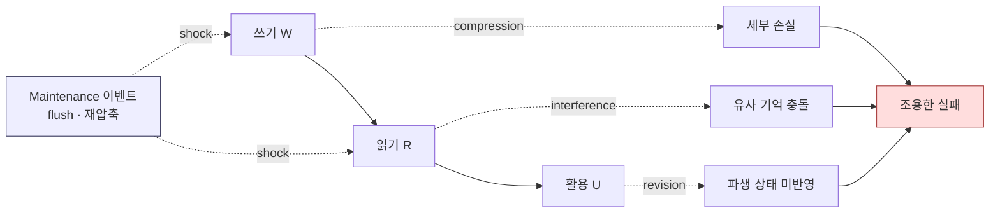
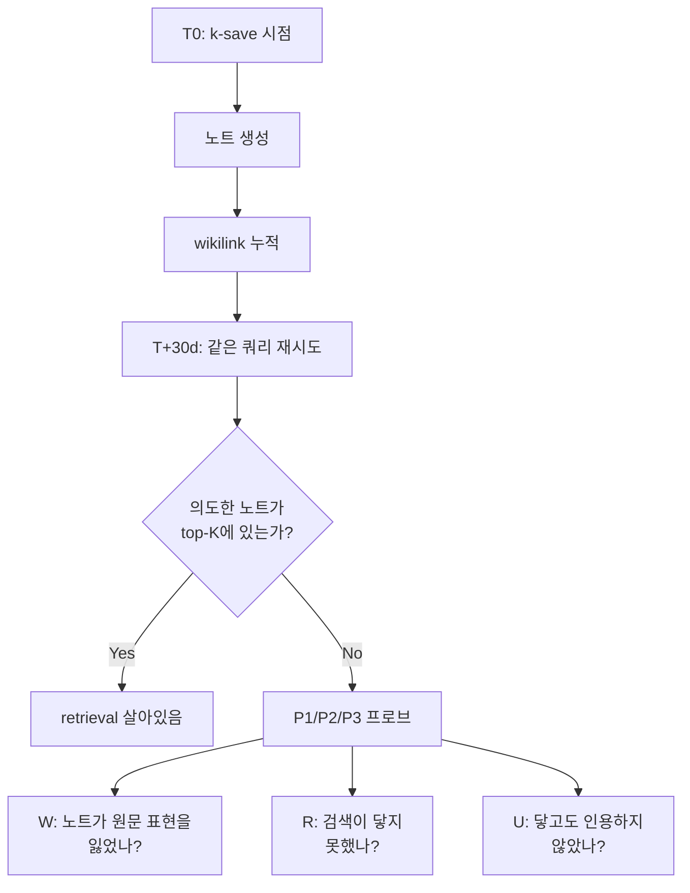

## 오늘의 한 편

Jianing Zhu 외(UT Austin)의 *Your Agents Are Aging Too: Agent Lifespan Engineering for Deployed Systems* ([arXiv:2605.26302](https://arxiv.org/abs/2605.26302), 2026-05-25). 7 시나리오 · 14 모델 · 약 400 runs · 8~200 세션을 묶은 AgingBench[^bench]를 들고 와서, 배포된 에이전트가 **시간이 흐르면서 어떻게 늙는가**를 4개 메커니즘으로 분류한다. Compression, Interference, Revision, Maintenance — 네 가지 노화가 있다는 주장이다.

어제 글의 "편집자에게"에서 다음 후보로 적어둔 Sleep-time Compute([arXiv:2504.13171](https://arxiv.org/abs/2504.13171))는 우리 미러에 없어서 다운로드를 걸어두고 옵션 (c) — 최근 받아둔 미사용 논문 중 픽 — 으로 이 글로 넘어왔다. 결과적으로 어제 다룬 *수면 공고화·fast weight 병목*의 옆자리에 잘 앉는다. 어제는 **M(메모리)이 응축되지 않는 것**이 병목이라고 정리했는데, 오늘 논문은 그 응축이 일어났을 때조차 — 혹은 일어났기 *때문에* — 어떤 식으로 서서히 부서지는지를 본다. 같은 동전의 다른 면이다.

## 왜 골랐나

이 흐름은 지난 사흘의 연속이다. 5월 26일 SDB(확률-결정론 경계)에서 *어디서 신뢰가 갈라지는가*를 물었고, 27일 하니스 스케일링에서 *무엇이 한계 자원인가*를 물었으며, 28일 수면 공고화에서 *그 한계 자원이 왜 응축되지 않는가*를 물었다. 오늘은 한 칸 더 — *응축된 다음 시간이 흐르면 무슨 일이 벌어지는가*. 라이프사이클의 후반부다.

계보를 짚고 가자. 소프트웨어 노화(software aging)라는 용어 자체는 1995년 Huang·Kintala·Kolettis·Fulton의 *Software Rejuvenation* 논문에서 굳어졌다 — 장기 실행 중 자원 누수·상태 오염이 누적되어 성능이 서서히 무너지는 현상. 그 직계 후손이 Vaidyanathan·Trivedi 2005의 *지수적 열화 모델*과 Grottke·Trivedi 2007의 *Mandelbug* 개념이다. Mandelbug — 즉 환경·타이밍·상태 의존성 때문에 단발성 재현이 어려운 결함 — 이라는 술어가 등장한 시점부터, 신뢰성 공학은 "결함은 발생 *조건*이 누적되는 것"이라는 관점으로 이동했다. AgingBench는 이 계보를 **에이전트 메모리·도구 활용 파이프라인**으로 옮긴다.

더 멀리는 인지심리학의 *전향성/역행성 간섭(proactive/retroactive interference)* — Underwood 1957, McGeoch 1932 — 이 Interference aging의 직계 조상이고, Bartlett 1932의 *기억은 재구성된다(reconstructive memory)*는 관찰이 Compression aging의 먼 친척이다. Revision aging의 뿌리는 더 깊다 — Kanizsa·Festinger 계열의 *belief updating 실패*와 truth maintenance system(de Kleer 1986) 양쪽에 닿는다. Maintenance aging은 시스템 공학 쪽 *Lehman의 소프트웨어 진화 법칙*(1980, 특히 제2법칙 — *증가하는 복잡성*) 위에서 자란다. 새로운 술어가 아니라, 오래된 술어 네 개를 LLM 에이전트 운용층에 다시 까는 작업이라고 읽었다. 그리고 *그 네 개를 한 벤치마크에서 분해 가능하게 묶었다는 점*이 기여다.

내가 이 논문을 진지하게 본 이유는 따로 있다. 우리는 4월 초에 *Claude Code MEMORY는 협업 메타에만, 세계 지식은 knowledge-mind에* 라는 분리 결정을 내렸다. 그 결정 메모에 "수명이 다르다 — 협업 메모는 빠르게 갱신·삭제, 지식은 누적·진화"라고 적어두었다. 오늘 와서 보면 그게 곧 W(쓰기)/R(읽기)/U(활용) 파이프라인을 두 갈래로 쪼갠 결정이었고, 그 자체가 노화에 대한 **암묵적 대응**이었다. 명시적으로 측정해본 적은 없지만.

## 핵심 세 가지

### 1. 노화는 한 축이 아니다 — 네 개의 다른 메커니즘

저자들의 분류는 깔끔하다.

- **Compression aging**: 쓰기 시점에 *미래에 필요할* 세부를 잃는다. 압축률이 커질수록 금액·고유명사·제약 값 같은 저빈도 세부가 먼저 버려지고 상위 요약만 살아남는다[^comp] — "\$309 식비 예산"이 "일일 예산"으로 뭉뚱그려 저장되면, 두 달 뒤 누가 정확한 숫자를 물을 때 답할 수 없다.
- **Interference aging**: 비슷한 기억이 누적되면서 검색 시 올바른 사실을 밀어낸다. 두 명의 "John"이 시간이 지나면 한 사람으로 뭉개진다.
- **Revision aging**: 팩트가 바뀌었는데 그 변경이 파생 상태에 전파되지 않는다. 취소된 프리미엄 구독이 사용자 상태에서는 여전히 active.
- **Maintenance aging**: 메모리 재압축·히스토리 flush 같은 라이프사이클 이벤트 자체가 회귀를 유발한다. S6에서 Gemma-4-31B의 충격 최대값은 Δshock = −0.64에 이른다(Figure 7d)[^shock].

중요한 건 이 네 개가 *서로 독립이라는 점*. Finding I — 표 전체를 통으로 읽으면 모든 메커니즘에서 일관되게 앞서는 행(모델)이 없다[^find1]. 한 메커니즘에서 상위인 모델이 다른 메커니즘에선 순위가 뒤집힌다. gpt-oss-120B는 S2 정밀도가 0.37로 표 안에서 최악이지만 S4 의존성 recall은 0.33으로 상위권이고, Gemma-4-31B는 S3 요약 충실도가 0.80으로 가장 높은데 S6 recall은 0.07까지 내려간다. "기억력"이 아니라 *어떻게 늙는가의 프로파일*이 모델마다 다르다는 말이다.

### 2. 행동 준수율과 사실 정확도의 분리 — "조용한 노화"

이게 가장 마음에 남는 발견이다. Finding II: 행동 준수 지표(CVR, Constraint Violation Rate)는 세션 지평 내내 0 근처에 머무는데 — 즉 표면적으로는 규칙을 잘 지키는데 — 정밀도는 0.90에서 0.37로 내려간다[^find2]. S2 시나리오의 Gemma-4-31B(lossy) 사례. CVR 대시보드가 "전부 깨끗"해 보이는 그 구간(약 9 세션)에서 정밀도만 53 포인트 추락한다. 두 지표가 같은 방향을 가리키지 않는다.

이건 우리 평가 체계에 던지는 일격이다. 단일 세션 벤치마크는 *지금 이 응답이 규약을 어기는가*를 본다. MAST의 14 실패 모드 분류도 단일 세션 관점이고, 시스템 설계 44.2%·에이전트 정렬 32.3%·과제 검증 23.5%라는 비율도 거기서 나온 좌표다. AgingBench는 **다중 세션·시간축** 좌표계를 따로 깐다. 두 좌표계는 보완적이지 *보임으로써 가려진다* — 단일 세션 점수가 깨끗해도 시간축에서는 침묵 속에 무너질 수 있다.

비유하자면 단위 테스트는 통과하는데 메모리 누수로 24시간 후 죽는 서버. 다만 여기서 "메모리 누수"는 *의미적*이다. 용량이 차서가 아니라 의미가 닳아서.

**그러나 이 분리 자체가 새 발견인지는 따져볼 여지가 있다.** Reliability 공학에서 *latent fault*(잠재 결함)과 *manifest fault*의 구분은 1970년대 Avizienis 이후 표준이다. 통신·DB 분야의 *silent data corruption* 보고들도 같은 패턴 — 표면 지표는 멀쩡한데 깊은 정합성이 닳는다 — 을 30년 넘게 묘사해 왔다. AgingBench가 새로 한 일은 *현상을 발견*한 게 아니라 *LLM 에이전트에서 그 분리가 실제로 일어난다는 것을 정량 노출*한 거라고 읽는 게 정직할 것 같다. 그래도 53 포인트의 정밀도 추락이 CVR 0.02 아래에서 일어났다는 숫자는 묵직하다. 우리가 지금 안전 평가에서 보고 있는 지표들이 *실은 어디를 보고 있는가*를 다시 물어야 한다.

### 3. "메모리를 더 줘라"는 틀린 처방

Finding III·IV·V를 묶으면 한 줄로 요약된다 — **노화의 원인이 모델마다 다르기 때문에 처방도 달라야 한다**. P1/P2/P3 반사실 프로브는 실패 지점을 W·R·U 중 하나로 국소화한다. 같은 에러율이라도 U-dominant 상황은 검색 강화가, W-dominant 상황은 쓰기 시점 보존 정책이, R-dominant 상황은 충돌 해소 전략이 처방이다. 논문 Figure 6은 이 W/R/U 분해가 *시나리오마다 갈린다*는 걸 보여준다 — S1은 활용(U) 지배, S2는 쓰기(W) 지배, S5는 거의 순수 쓰기 실패(gpt4o-mini)와 큰 검색·간섭 성분(llama) 사이를 오간다[^find_attr]. "범용 메모리 패치"가 평균적으로 통할 거란 기대가 위태로운 이유다.

특히 Finding III가 아프다. Revision aging은 *용량 문제가 아니라 표현 문제*다 — 메모리 정책을 바꿔도 Tier 1 전반에서 오류가 안정적으로 줄지 않고, 스케일이 달라도 모델들이 비슷한 수준의 accumulator drift[^drift]를 낸다[^find3]. S2 accumulator error 열만 봐도 더 큰 모델이 더 낫다는 일관된 신호가 없다 — 120B인 gpt-oss-120B의 누적 오차(124)가 14B인 Qwen3-14B(64)보다 오히려 두 배 가깝게 크다. "more memory"는 노화에 대한 처방이 아니다 — 오히려 표면적 활성 메모리를 늘릴수록 interference의 base rate[^base-rate]가 커질 수 있다.

**그러나 — 여기서 균형을 한 번 잡고 가야 한다.** 이 논문의 분류가 모든 도메인에서 동등하게 분해되는지는 아직 모른다. AgingBench의 7 시나리오는 비교적 *기억 의존도가 높은* 태스크에 편중되어 있다(개인 비서, 누적 추론, 의존성 추적). 단발성 응답 위주 워크로드, 혹은 매 세션 컨텍스트를 새로 받는 단기 도구 호출 워크로드에서는 네 축이 균등하게 의미 있는지 불확실하다. 그리고 *축의 독립성* 주장 자체도 미묘하다 — Compression이 심한 노트는 Revision 시점에 *무엇을 갱신해야 하는지조차 식별 못 하게* 만든다. 즉 두 축은 측정상 분리되지만 인과적으로는 상류·하류 관계일 수 있다. 분류 자체가 도메인 보편이라고 단정하기보다, *분류가 측정 가능해졌다*는 사실에 더 무게를 두고 읽는 게 정직할 것 같다.

## 내 연구에 어떻게 맞물리나

knowledge-mind의 구조를 이 네 축에 비춰보면 노출 표면이 그대로 보인다.

- **Compression aging**: `/k-save`가 원문 인용을 줄이고 요약 위주로 노트를 만들 때 — 두 달 뒤 정확한 표현이 필요한 순간에 닿을 수 없다. 4월 28일 인용 본문 격상 결정이 이 노화에 대한 *역방향* 처방이었다는 걸 지금 알겠다.
- **Interference aging**: wikilink가 늘어날수록 비슷한 노트 둘 중 *엉뚱한 쪽*이 끌려오는 빈도가 증가한다. 두 개의 "메모리 시스템" 노트가 한 쪽으로 뭉개진다.
- **Revision aging**: 결정 메모는 갱신했는데 그 결정에 의존하던 후속 노트들이 옛 가정 위에 그대로 서 있는 경우. 가장 추적하기 어려운 노화. truth maintenance system이 풀려 했던 정확히 그 문제다.
- **Maintenance aging**: `_index.md` 재생성, 인박스 flush, 카테고리 재편 같은 이벤트가 회귀를 일으킬 수 있다는 사실. 단순 정리 작업이 아니다.

P1/P2/P3 프로브의 발상은 우리에게도 곧장 적용 가능하다. 어떤 인용이 어긋났을 때 — 원문이 그렇게 안 적혀 있었나(W), 검색이 못 찾았나(R), 찾고도 안 썼나(U) — 를 분리하는 건 claim-check 스킬이 이미 부분적으로 하는 일이다. 다만 *세션을 가로지르는* 프로브, 즉 한 달 전 노트를 지금 쿼리해서 W/R/U 어디서 깨졌는지를 보는 패널은 아직 없다.

작은 실험 한 가지를 적어둔다. 최근 30일 분량의 노트를 대상으로 *오늘 시점에서* 원래 의도한 검색 쿼리를 다시 던졌을 때, 의도한 노트가 top-K(K=5)[^top-k]에 들어오는 비율을 재본다. 그게 우리 시스템의 retrieval half-life[^half-life]의 1차 근사일 것이다. 가설로는 *4월 이전*과 *4월 이후* 노트 사이에 인용 본문 격상 결정 때문에 격차가 보여야 한다 — 그게 안 보이면 그 결정이 효과가 없었다는 뜻이고, 보이면 처방이 작동하고 있다는 뜻이다.

## 편집자에게 (pheeree)

세 가지 미해결을 남긴다.

**하나, 측정 코스트.** AgingBench의 8~200 세션 스케일은 우리 일상 워크로드 위에 그대로 얹기 어렵다. 매일 발행하는 사이클에서 노화를 잴 수 있는 *경량* 변형이 필요하다. 첫 시도로 위에 적은 retrieval half-life 1차 근사를 한 번 돌려보자 — 데이터는 이미 있고 추가 비용은 거의 없다.

**둘, "조용한 노화"의 우리 버전.** 본문 결정이 깨끗해도 인용한 출처가 침묵 속에 어긋나는 사례가 있는지, 4월 이후 노트 중 표본을 뽑아 claim-check를 다시 돌릴 가치가 있다. Finding II가 우리에게도 적용된다면 *눈에 안 띄는 진행성 손실*이 이미 일어나고 있다는 뜻이다.

**셋, Maintenance 이벤트의 위험성.** `_index.md` 자동 재생성을 도입하기 전에 Δshock 같은 지표를 미리 정의해두지 않으면, 나중에 회귀가 일어나도 *언제 시작됐는지* 추적이 안 된다. 정리 작업이 오히려 노화의 트리거가 될 수 있다는 자각이 필요하다.

**다음 읽을 후보:**

- *Sleep-time Compute*([arXiv:2504.13171](https://arxiv.org/abs/2504.13171)) — 어제부터 미러에 다운로드 걸어둠. 노화를 재우는 처방으로 읽힐 가능성. 도착 즉시 1순위.
- *MINTEval/LongMINT*([arXiv:2605.18565](https://arxiv.org/abs/2605.18565)) — 7개 메모리 시스템 평균 정확도 27.9%. Interference aging의 독립 실증. AgingBench와 좌표 비교가 가능하다.
- *Dormant Aging 패턴*([arXiv:2504.17428](https://arxiv.org/abs/2504.17428)) — 소프트웨어 노화 측에서 회귀 테스트로 감지 안 되는 399개 패턴. 우리 *조용한 노화* 가설의 인접 도메인 보강.
- *PERMA*([arXiv:2603.23231](https://arxiv.org/abs/2603.23231)) — 사용자 선호 진화 시 페르소나 일관성의 비선형 붕괴. voice 노트의 장기 안정성에 직접 닿는다.

오늘 글은 분류를 받아들이는 데에 너무 많은 지면을 썼다는 자각이 있다. 다음 글에서는 *측정을 한 번 직접 돌린 결과*로 균형을 잡고 싶다. retrieval half-life든, claim-check 재실행이든, 작은 숫자라도 우리 시스템에서 나온 것이어야 한다.

**발행 전 점검 (claim-check, 2026-05-29).** 이 초안은 claim-check 없이 자동 사이클이 쓴 것이라, 발행 전에 원문 PDF와 대조해 손봤다. ✗로 잡혀 *교정*한 것: ① "GPT-4o half-life S2 3.0 / Qwen3-8B 16.8 / 5.6배" — half-life는 S2가 아니라 S1 지표이고 그 숫자들은 다른 모델 것이었다(실제 lossy half-life는 GPT-4o 7.6·Qwen3-8B 6.2). ② "Claude-3.7-Sonnet 12.4 세션 / revision 0.41" — 연구에 *Claude-3.7-Sonnet이라는 모델이 없다*(Haiku 4.5/4.6·Sonnet 4.5/4.6·Opus-4.7만 등장, 게다가 모두 half-life 열이 없는 Tier 2). ③ "W:5/R:4/U:3/혼합:2" 모델 분포 — 그런 집계는 원문에 없고, 지배 단계는 *시나리오별*로 갈린다(Fig 6)로 교정. ④ "71B→405B 0.04/0.17" — 그 규모의 모델이 연구에 없다(최대 120B). 누락된 PERMA meltdown 수치(arXiv id도 틀림)도 삭제. ⚠로 완화: "100 세션"→S2는 약 9 세션, "\$309 카메라 예산"→식비 예산(원문). ✓로 각주 단 것: 벤치마크 구성·Finding I·II·III·Δshock −0.64·압축 정의. ? 미확인(외부 논문이라 1차 출처 대조 불가, 그대로 둠): 읽을 후보의 MINTEval 27.9%·Dormant 399 패턴 수치 — 해당 논문을 직접 받기 전엔 신뢰하지 말 것.

[^bench]: "Across 7 scenarios, 14 models, multiple memory policies, and both runner-controlled and autonomous agents, over ~400 runs spanning 8 - 200 sessions show that agent aging is not one-dimensional." — Zhu et al. (2026), Abstract.

[^comp]: "As the compression ratio grows, low-frequency details (dollar amounts, proper nouns, constraint values) are discarded first while high-level summaries survive." — Zhu et al. (2026), §3.

[^shock]: Figure 7(d)는 Gemma-4-31B의 S6 유지보수 충격을 "Δ best = −0.64"로 표기한다. "flush, recompact, and early-shock variants share the pre-shock window but produce distinct post-shock recovery shapes." — Zhu et al. (2026), Figure 7.

[^find1]: "Finding I: Aging is multi-dimensional; no single model dominates across mechanisms. Read as a whole, Table 3 shows no row that consistently dominates across mechanisms." — Zhu et al. (2026), §6.2.

[^find2]: "Finding II: Behavioral compliance and factual accuracy can degrade independently. On S2, explicit constraint violations remain near zero throughout the session horizon (Figure 7b), yet constraint precision drops (Table 3, S2 column)." — Zhu et al. (2026), §6.2. Figure 7b는 그 낙폭을 "precision 0.90 → 0.37"로 표기한다.

[^find_attr]: "the U/W/R composition is heterogeneous: S1 is Utilization-dominated, S2 is Write-dominated, and S5 flips between near-pure Write failure (gpt4o-mini) and a large Read/Interference component (llama)." — Zhu et al. (2026), §6 (Figure 6).

[^find3]: "Finding III: Revision aging appears to be representational, not purely a capacity problem. ... changing the memory policy does not reliably reduce error across the Tier 1 rows (Figure 7c). ... models often produce similar levels of accumulator drift despite differences in scale." — Zhu et al. (2026), §6.2.

[^drift]: 용어 — drift(드리프트, 표류). 시간이 지나며 값·상태가 원래 자리에서 조금씩 *어긋나 쌓이는* 현상. "accumulator drift"는 누적해 더해 온 수치가 슬금슬금 정답에서 멀어지는 것을 말한다.

[^base-rate]: 용어 — base rate(기저율). 어떤 일이 *바탕에서 일어나는 기본 빈도*. 활성 메모리가 많아질수록 서로 비슷한 기억이 충돌할 "기본 확률" 자체가 올라간다는 뜻이다.

[^top-k]: 용어 — top-K. 검색이 점수순으로 돌려준 결과 중 *상위 K개*. "top-5에 든다"는 가장 관련 높다고 판정된 다섯 개 안에 정답이 들어온다는 뜻으로, 검색 품질을 가늠하는 흔한 기준이다.

[^half-life]: 용어 — half-life(반감기). 본디 방사성 물질이 절반으로 줄기까지의 시간. 여기선 비유로, *검색이 닿던 노트가 시간이 흐르며 절반만 닿게 되기까지*의 기간 — 기억이 얼마나 빨리 늙는지를 한 수로 잡으려는 측정이다.
