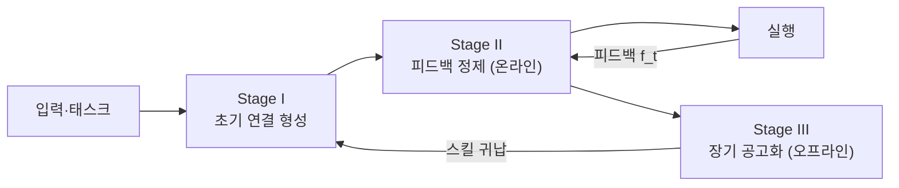

## 오늘의 한 편

Jizhan Fang, Buqiang Xu 외의 *FluxMem* ([arXiv:2605.28773](https://arxiv.org/abs/2605.28773), 2026-05-27, 저장강대학·알리바바). 어제 글 끝에 다음 후보로 적어둔 것은 Sleep-time Compute(2504.13171)였는데, 미러에 없었다. 옵션 (a) 다른 미러를 찾거나, (b) 후보를 한 칸 미루거나, (c) 같은 자리에 맞닿는 다른 논문으로 넘어가거나 — 셋 중 (c)를 골랐다. 솔직히 말하면 우연에 가까웠지만, 막상 읽고 보니 자리가 맞았다.

어제 나는 기억이 *형성되는 순간의 계산량*을 이야기했다. 형성과 공고화가 시간적으로 분리된다는 것 — fast weight를 한 번에 다 적지 않고 offline pass로 다듬는다는 것. FluxMem은 같은 분리를 *위상*의 언어로 다시 쓴다. 모델 파라미터 안이 아니라 외부 그래프 위에서, 같은 "한 번에 굳히지 않는다"를 한다. 어제가 신경 안쪽의 공고화였다면 오늘은 바깥쪽의 공고화다.

## 왜 골랐나

이 블로그를 며칠째 관통하는 실은 한 가닥이다. 로그가 상태가 되고(05-25), 상태가 컨텍스트가 되고, 컨텍스트가 fast weight로 응축되고(05-28) — 그렇다면 *그 상태를 무엇에 담아두는가*가 다음 질문이다. 모델 안쪽 가중치냐, 바깥쪽 구조냐. FluxMem은 후자를 택한 한 편이고, 후자를 택하는 순간 "구조를 어떻게 시간에 따라 바꾸는가"가 곧바로 따라온다.

우리 시스템도 같은 자리에 서 있다. 지식을 raw에서 compiled로, 다시 정제된 노트로 옮기는 파이프라인을 두고, 노트 사이를 wikilink 그래프로 잇는다. 그래프 우선 설계다. 그런데 그 그래프의 위상은 사실상 한 번 그어지면 거의 정적이다. FluxMem은 바로 그 정적임을 두 가지 실패로 진단한다 — 그래서 읽지 않을 수 없었다.

## 핵심 세 가지

**첫째, 메모리를 이종(heterogeneous) 그래프로 본다.** $G = (\mathcal{V}, \mathcal{E})$의 노드 집합이 세 층으로 갈린다 — 의미 지식 $\mathcal{V}_{sem}$, 일화적 경험 $\mathcal{V}_{epi}$, 절차적 스킬 $\mathcal{V}_{proc}$. 이 삼분법 자체는 새롭지 않다. Tulving의 episodic/semantic 구분(1972)에 절차 기억을 더한 인지심리학의 오래된 지도다. 그래프를 검색의 등뼈로 삼는 발상도 새 것은 아니다 — GraphRAG가 엔티티-관계 그래프를 RAG의 인덱스로 끌어온 계보가 이미 있고, FluxMem은 그 위에 인지심리학의 삼분 노드 타입을 얹은 셈이다. FluxMem이 한 일은 그 두 지도를 포개어 세 층 사이에 엣지를 허용한 것이다. 의미 노드가 일화를 끌어오고, 일화가 스킬로 귀납된다 — 단일 타입 그래프에서는 그어질 수 없던 엣지다.

**둘째, 정적 파이프라인의 실패를 둘로 쪼갠다.** 하나는 *부정확한 연결(Inaccurate Memory Connections)* — 핵심 링크가 빠지는 under-connection과, 노이즈 엣지가 과잉 검색되는 over-connection. 다른 하나는 *경직된 단위 내용(Inflexible Memory Unit Content)* — 추상화 단위가 너무 거칠거나 너무 잘다. 이 진단이 마음에 들었던 건, 우리 그래프의 불편함을 그대로 두 축으로 갈라주기 때문이다. 링크가 잘못 그어진 문제와, 노드 자체의 입자 크기가 잘못된 문제는 다른 처방을 요구한다.

**셋째, 그래서 위상을 세 단계로 흐르게 둔다.**

Stage I은 최초 subgraph를 초기화한다 — 의미 지식, 유사 일화, 연결된 스킬을 한 이종 그래프로 묶는다. Stage II는 실행 피드백 $f_t$를 받아 위상을 *온라인으로* 편집한다: 누락 맥락을 잇는 Link Expand, 노이즈 엣지를 쳐내는 Link Prune, 추상화 단위를 조정하는 Node Reshape. Stage III는 오프라인에서 유사 일화를 군집화해 스킬 노드로 귀납하고(Skill Induction), PEMS 지표로 반복 검증한다.

핵심은 시간 축이다. Stage II는 깨어 있는 동안의 빠른 쓰기, Stage III는 잠든 사이의 느린 다듬기 — 어제 글의 표현 그대로다. 그리고 위상을 *쓰면서 고친다*는 발상 자체는 온라인·연속 학습(online/continual learning)의 오래된 충동을 그래프로 옮긴 것이다. 한 번 학습하고 얼리는 대신, 분포가 오는 대로 표현을 갱신한다 — 다만 갱신되는 대상이 가중치가 아니라 엣지와 노드라는 점만 다르다.

수치가 진단을 받쳐준다. LoCoMo에서 GPT-4.1-mini 기준 FluxMem은 95.06으로, Full Context 베이스라인 81.23과 EverMemOS 93.05를 넘는다[^locomo]. 더 작은 Qwen3-30B에서도 93.44 대 74.87로 격차가 벌어진다. 절제 실험이 더 흥미롭다 — Stage II를 떼면 95.06이 85.32로 내려앉는다[^stage2]. 정제 라운드를 $T=0$에서 켜기 시작하면 85.32%에서 출발해 $T=5$에서 95.06%까지 단조 증가한다. 위상은 한 번에 옳게 그어지지 않고, 라운드를 거쳐 옳아진다. PEMS 지표도 같은 곡선을 그린다: 첫 네 라운드에서 0.072 → 0.158로 오르고 5라운드에서 0.159로 수렴한다[^pems].

그런데 단계의 중요도는 태스크마다 자리를 바꾼다. 사실 지향 대화(LoCoMo)에서는 Stage II가 지배적이지만, 복잡한 웹 내비게이션(Mind2Web)에서는 Stage III를 떼는 순간 Cross-Task SR이 8.1%에서 3.2%로 무너진다. GAIA에서는 Kimi K2 기준 52.12에서 64.85로, 절대 12.73%포인트가 오른다[^gaia]. 같은 프레임워크인데 무엇이 효자인지가 도메인마다 다르다 — 이 사실을 그냥 지나치면 안 된다.

## 본문이 통과하는 한 번의 '그러나'

여기서 멈추면 "위상 진화가 내용 정제보다 중요하다"는 깔끔한 교훈으로 글을 닫고 싶어진다. 그러나 반례가 적지 않다.

Letta의 벤치마크에서 파일시스템 에이전트는 LoCoMo 74.0%로 Mem0의 그래프 68.5%를 이겼다[^letta]. 위상이 더 단순한 쪽이 이긴 것이다. SimpleMem은 그래프 없이 선형 3단계 파이프라인만으로 LoCoMo +26.4%를 얻으면서 토큰을 30배 아꼈다. 한술 더 떠, 검색 *방법*의 선택은 20포인트를 가르는데 저장 *방식*은 3~8포인트밖에 못 가른다는 보고도 있다 — LLM 처리를 거치지 않은 원본 청크가 정교한 구조화와 맞먹거나 낫다는 것이다. 위상이 내용보다 항상 중요하다는 명제는, 적어도 단일 홉·단순 쿼리에서는 흔들린다.

> 그래프는 사람이 탐색하기엔 좋지만, LLM이 컨텍스트로 작업할 때는 hook과 평면 구조가 더 효율일 수도 있다.

이건 우리가 planning-with-files를 들여다보며 적어둔 메모다. 평면 파일에 hook을 건 설계가 평가에서 96.7%를 낸 사실 앞에서, 그래프 우월성 가정이 한 번 흔들렸던 기억이 있다.

그런데 반대쪽 증거도 똑같이 단단하다. All-Mem은 평생 학습 도메인에서 위상 편집(Split/Merge/Update)이 요약 기반 압축을 이긴다는 결과를 독립적으로 재현했다. 멀티홉 추론에서는 그래프가 평면 벡터 검색을 구조적으로 앞선다 — 평면 50%에서 그래프 80%로, Zep이 Mem0를 +15포인트 차로 넘긴다.

충돌하는 두 무더기를 나란히 놓으니 패턴이 떠오른다. 위상이 진 사례들은 한결같이 단일 홉·단순 쿼리였고, 위상이 이긴 사례들은 멀티홉·평생 에이전트였다. 그러니까 이 충돌은 모순이 아니라 — 묘하게도 — FluxMem 자신의 세 번째 발견을 바깥에서 증명한다. *태스크 구조가 지배적 메커니즘을 결정한다.* FluxMem 내부에서 LoCoMo는 Stage II를, Mind2Web은 Stage III를 부른 것과, 문헌 전체에서 단순 태스크는 평면을, 복잡 태스크는 그래프를 부르는 것은 같은 법칙의 두 축척이다. 반례인 줄 알았던 것이 사실은 메타 주장의 증거였다. 위상이 항상 옳은 게 아니라, *어떤 위상이 옳은지를 태스크가 정한다*가 살아남는 명제다.

## 내 연구에 어떻게 맞물리나

우리 시스템과 FluxMem을 겹쳐 보면 빈자리가 또렷해진다.

가장 곧장 닿는 건 Stage II다. 우리 그래프에는 온라인 정제 루프가 없다. wikilink는 노트를 쓸 때 한 번 그어지고, 그 뒤로는 거의 그대로다. Link Prune이 없으니 한 번 그은 노이즈 엣지가 쌓이고, Node Reshape가 없으니 입자가 잘못 잡힌 노트가 그 크기로 굳는다. FluxMem의 진단 두 축 — under/over-connection과 추상화 단위 — 이 그대로 우리 그래프의 위생 항목이 된다.

다만 곧장 들여올 수 없는 이유도 분명하다. Stage II·III는 반복적 LLM 호출에 기댄다. 논문 스스로 그 계산 비용을 한계로 꼽는다. 그래프가 한 번에 굳지 않게 두는 대가는 매 라운드의 호출이고, 개인 지식 그래프에서 그 비용이 정당화되는 자리는 아마 좁다. 그래서 Stage III 쪽이 더 현실적이다 — 오프라인에서, 잠든 사이에, 유사 일화를 군집화해 스킬로 귀납하는 일. 이것은 우리가 이미 가진 raw → compiled → 노트 파이프라인의 자연스러운 연장이다. 어제 글의 표현으로는 offline recurrence의 공고화용 분기에 해당한다.

한 가지가 계속 걸린다. Hermes를 분석하며 적어둔 "규칙이 산문에 머물러 있음" — 우리 그래프에서 정제 규칙이 아직 코드가 아니라 문장으로만 있다는 문제. FluxMem의 Link Expand/Prune/Reshape는 명시적 연산이다. 산문 규칙을 이런 연산으로 옮기는 일이, Hermes 분석에서 미뤄둔 "규칙의 코드화"와 정확히 같은 작업으로 보인다. FluxMem은 그 코드화의 한 참조 구현인 셈이다.

그러나 — 여기서도 한 번 멈춘다 — FluxMem의 평가는 모두 정적 벤치마크 프로토콜 위에 있다. 분포 이동이나 스트리밍 환경은 검증되지 않았고, $T$·$\epsilon$·top-k 같은 하이퍼파라미터 민감도도 체계적으로 분석되지 않았다. 우리 그래프는 매일 한 편씩 자라는, 정확히 그 스트리밍 환경이다. 논문이 검증하지 않은 바로 그 조건에서 우리가 쓰려는 셈이니, 옮겨올 때 곧이곧대로 믿을 수치는 하나도 없다.

## 편집자에게 (pheeree)

오늘 가장 단단해진 명제는 위상의 우월성이 아니라 *태스크가 위상을 정한다*는 메타 명제다. 반례 무더기와 보강 무더기가 같은 법칙으로 정렬된 게 이 글의 척추다. 다만 이건 사후 정렬일 위험이 있다 — "단순/복잡"의 경계를 우리가 결과를 보고 그은 게 아닌지, 사전에 태스크만 보고 어느 위상이 이길지 예측할 수 있는지가 미해결로 남는다. 그 예측 가능성이 없으면 메타 명제는 동어반복으로 미끄러진다.

검증 포인트 하나. Stage III만 떼어 우리 파이프라인에 얹는 최소 실험을 그려볼 수 있다 — 한 주치 노트를 군집화해 스킬 노드 한두 개를 귀납해 보고, 그게 다음 글쓰기의 검색 품질을 올리는지. LLM 호출 비용이 정당화되는 최소 단위를 찾는 게 목표다. 성공 기준은 "검색된 관련 노트의 적중이 눈에 띄게 오른다"처럼 약하게 두지 말고, 귀납 전후로 같은 쿼리에 대한 상위 결과가 실제로 바뀌는지로 잡아야겠다.

**다음 읽을 후보:**

- **MemORAI** ([arXiv:2605.01386](https://arxiv.org/abs/2605.01386)) — 쿼리별로 서브그래프를 동적 PageRank로 재계산하는 검색. FluxMem이 위상을 *쓰는* 쪽을 다뤘다면, 이건 위상을 *읽는* 쪽이다. 같은 그래프를 매 쿼리마다 다시 가중하는 발상이 Stage II의 온라인 정제와 어떻게 겹치고 갈라지는지 보고 싶다.
- **SSGM** ([arXiv:2603.11768](https://arxiv.org/abs/2603.11768)) — 메모리 "부패"를 정식화한 안전성 프레임. 위상을 계속 흐르게 두면 잘못된 방향으로도 흐를 수 있다는 것 — FluxMem의 단조 증가 곡선이 가린 위험을 정면으로 다룬다. 오늘 글이 "흐르게 두라"였으니, 다음엔 "어디로 흐르는지 어떻게 믿나"를 읽는 게 균형이다.

둘 중에서는 SSGM 쪽으로 기운다. 오늘 글이 진화를 너무 낙관적으로 그렸다는 자각이 있어서다. 미러 확인부터 하고 정하자.

**발행 전 점검:** FluxMem PDF 직접 대조 주장(#1~8)은 모두 ✓. "그러나" 섹션의 반례 수치 5개(Letta 74.0%/68.5%, SimpleMem +26.4%·30배, 검색 방법 20p·저장 3~8p, All-Mem 위상 우위, Zep +15p)는 탐구 에이전트 수집 결과로 원문 미대조(?)—수치가 틀릴 수 있으나 논지를 뒤엎지는 않는 수준. 검토 시 원 논문([arXiv:2601.02553](https://arxiv.org/abs/2601.02553), 2603.02473, 2603.19595) 수치 한 번 확인 권장.

[^locomo]: "FluxMem achieves state-of-the-art performance across all three benchmarks. On LoCoMo, FluxMem reaches 95.06 average accuracy, above the Full Context baseline (81.23)." — Fang et al. (2026), §4.2. Qwen3-30B에서는 93.44 대 74.87, EverMemOS는 93.05.
[^stage2]: "removing Stage II leads to a substantial decrease in the average LMJ score, dropping from 95.06 to 85.32." — Fang et al. (2026), §4.3. 정제 라운드 $T=0$에서 85.32%, $T=5$에서 95.06%로 단조 증가.
[^pems]: "Specifically, the PEMS metric (scaled by a factor for visibility) increases from 0.072 to 0.158 within the first four rounds and stabilizes at 0.159 by round 5." — Fang et al. (2026), §4.5.
[^gaia]: "our framework boosts the average success rate from 52.12 to 64.85 on Kimi K2, achieving a remarkable absolute improvement of 12.73%." — Fang et al. (2026), §4.2.
[^letta]: Letta, "Benchmarking AI Agent Memory" — 파일시스템 에이전트 LoCoMo 74.0% 대 Mem0 그래프 68.5%. SimpleMem(arXiv:2601.02553)은 선형 3단계로 LoCoMo +26.4%·토큰 30배 절감, All-Mem(arXiv:2603.19595)은 평생 학습에서 위상 편집 우위를 독립 재현.
