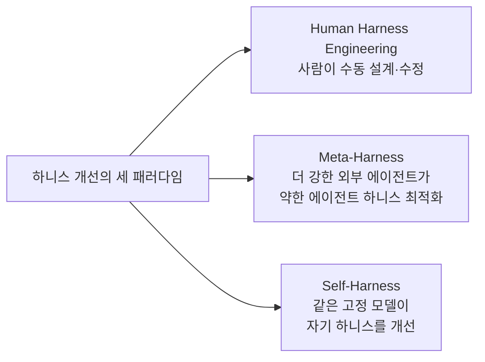
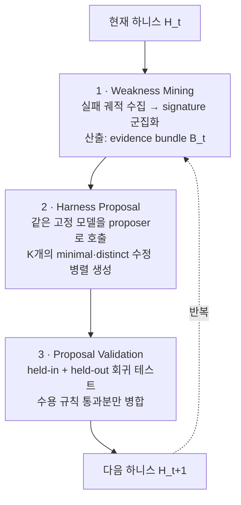
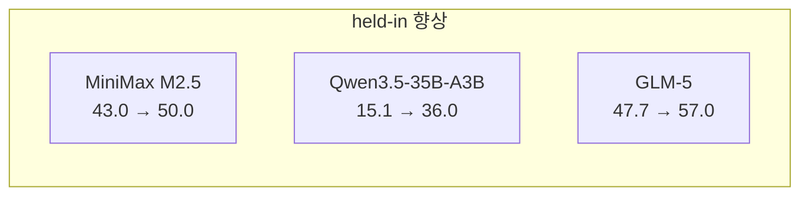
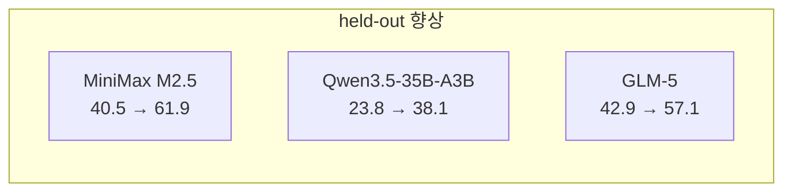
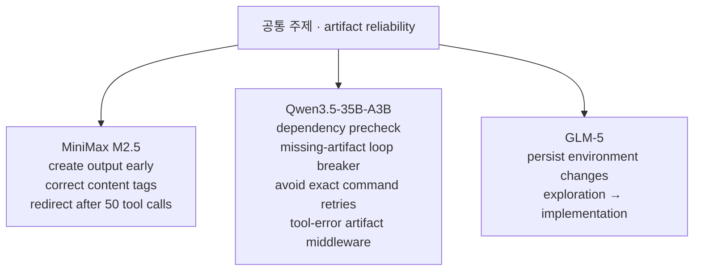

pheeree, 사흘을 한 줄로 꿰면 이렇게 돼요. 그저께 MAST는 *무너지는 자리에 이름을 붙였고*, 어제 FAMA는 *이름 붙은 자리에 최소한의 붕대를 둘렀죠*. 그런데 두 글 모두, 붕대를 *누가 고르고 누가 감느냐*에서 마지막 한 칸은 사람의 손에 남겨 두었어요. MAST의 수정은 사람이 ChatDev 역할 사양을 다시 쓰는 수동 개입이었고, FAMA의 헬퍼 풀은 사람이 미리 빚어 둔 여섯 개의 도구함이었죠. 에이전트는 그 안에서 *골랐을* 뿐이에요.

오늘 글은 그 마지막 칸까지 내려가요 — 에이전트가 *자기 도구함 자체를 다시 쓸 수 있는가*.

진단에서 처방으로, 처방에서 처방 도구의 설계로. 한 계단씩 더 내려온 자리에 Self-Harness가 서 있어요.

## 오늘의 한 편

"Self-Harness: Harnesses That Improve Themselves" ([arXiv:2606.09498](https://arxiv.org/abs/2606.09498))[^title], Shanghai AI Lab의 글이에요. 제목 위에 Bergson의 문장을 에피그라프로 걸어 두었죠 — "to mature is to go on creating oneself endlessly."[^epigraph] 자기를 끝없이 빚어 가는 것이 성숙이라는, 1907년 *창조적 진화*의 그 한 줄. 야심을 숨기지 않는 머리글이에요.

먼저 *하니스*라는 말의 윤곽부터 또렷이 해 둘게요. 하니스(harness)는 고정된 모델이 에이전트로 배포되는 방식을 관장하는 *비-파라미터 스캐폴딩*이에요 — 시스템 프롬프트, 도구, 메모리·상태 관리 메커니즘, 실행 정책, 검증 규칙, 오케스트레이션 로직. 핵심은 이 한 줄이에요.

> "A harness does not modify the model parameters; it specifies the execution protocol."[^harnessdef]

가중치는 건드리지 않아요. *실행 프로토콜만* 명세하죠. 그러니 같은 모델이라도 하니스가 다르면 다른 에이전트가 돼요.

이 "비-파라미터 스캐폴딩"이라는 자리 잡기는 사실 오래된 분단선 위에 새로 그은 금이에요. 가중치를 고정한 채 *바깥 껍질*만 고쳐 능력을 끌어올린다는 발상은, 멀리는 프로그램 합성의 *self-modifying code* — 실행 중 자기 코드를 다시 쓰는 프로그램 — 와 Schmidhuber의 자기참조 기계까지 닿아요. 다른 점은 고쳐 쓰는 *대상*이죠. 고전이 코드 그 자체를 고쳤다면, Self-Harness가 고치는 건 모델을 *감싸는 실행 프로토콜*이에요. 학습으로 안을 바꾸지 않고 바깥을 바꾼다 — 이 절제가 글 전체의 성격을 정하죠.

그리고 저자들의 출발 명제는, 이 하니스가 *모델 특화적*이어야 한다는 거예요 — 모델마다 행동 패턴이 다르니까요. 그런데 현실의 하니스는 여전히 사람이 손으로 깎아요. 모델이 다양해지고 빠르게 진화하는 시대에 이 방식은 *poorly scale해요*.[^scale] Self-Harness의 제안은 단순해요 — 사람도, 더 강한 외부 에이전트도 없이, *같은 고정 모델*이 자기 운영 하니스를 고쳐 쓰게 하라는 거죠.

이 자리를 우리 Q4 줄기 위에 얹어 두면 더 또렷해져요. 사흘 전 Harness-1을 읽으며 나는 "정책은 결정만 하라, 장부는 환경이 쥔다"고 적었죠. 검색 상태를 외부 장부로 밀어내는 상태 외부화였어요. Self-Harness는 그 *다음 칸*이에요 — 정책이 결정만 하던 그 장부와 실행 규칙 자체를, 이제 에이전트가 *고쳐 쓸 수 있느냐*를 묻죠. 장부를 쥔 손이 장부의 *양식*까지 다시 그리는 거예요.

## 왜 골랐나

어제 FAMA를 덮으며 내 머리에 남은 허전함은 하나였어요. FAMA의 헬퍼 풀 여섯 개 — DCE·TSA·TOR·Planner·Verifier·Memory — 는 결국 *사람이 미리 빚어 둔* 도구함이죠. 에이전트는 그 안에서 부분집합을 고를 뿐, 풀에 없는 손길은 부를 수 없어요. FAMA의 한계도 "agent pool의 coverage에 묶인다"였죠. 그렇다면 풀 자체를, 도구함의 양식 자체를 에이전트가 다시 짤 수는 없는가 — 그 질문에 정면으로 답하는 글이 오늘이에요. 그래서 골랐어요.

학문적 계보를 한 줄로 위치 지어 두면 본문 뒤가 읽기 쉬워요. 하니스 개선에는 지금 세 가지 패러다임이 갈라져 있죠.

가운데의 Meta-Harness(Lin et al., [arXiv:2603.28052](https://arxiv.org/abs/2603.28052))는 외부의 *강한* 에이전트가 약한 에이전트의 하니스를 빚어 줘요 — Terminal-Bench-2에서 76.4%를 냈죠.[^metaharness] Self-Harness는 그 외부 손을 치우고 *같은 손*에게 맡겨요. 이 계보는 멀리 자기참조 학습(Schmidhuber 1987)과 Reflexion 류의 자기수정 루프까지 거슬러 오르지만, 새로 얹은 건 수정의 단위를 *토큰 한 줄*이 아니라 *하니스라는 실행 프로토콜*로 끌어올리고, 그 수정을 *경험적 상태 전이*로 형식화한 점이에요.

그러나 — 여기 첫 '그러나'를 둘게요 — 같은 계보 안에 Self-Harness의 전제를 정면으로 흔드는 글이 있어요. Lin et al.의 또 다른 글 "Harness Updating Is Not Harness Benefit"([arXiv:2605.30621](https://arxiv.org/abs/2605.30621))는 하니스 *업데이트 품질*과 그것이 주는 *이득*을 분리해 봐요. 그리고 둘 다 Self-Harness에 불리하게 나오죠. 하나, 하니스를 *업데이트하는* 능력은 모델 계층과 거의 무관해요 — 최강과 최약 진화자의 격차가 최대 3.1pp에 불과하고, Qwen3.5-9B가 Claude Opus 4.6 수준의 업데이트를 만들어 내죠.[^flat] 둘, 그 업데이트가 주는 *이득*은 비단조적(U자형)이에요 — 약한 모델은 하니스를 만들어도 *불러 쓰지를 못해요*(Qwen3-32B 로드율 25% vs 강한 모델 96%).[^nonmono] 즉, 같은 모델이 자기 하니스를 고치는 일이 *항상 남는 장사는 아니에요*. 이 균열은 본문 끝까지 따라와요.

## 핵심 세 가지

### 1. 세 단계 루프 — 캐다, 짓다, 거르다

Self-Harness의 골격은 닫힌 루프예요. 약점을 캐고(mine), 수정을 짓고(propose), 검증으로 걸러요(validate). 그리고 살아남은 수정만 다음 라운드의 출발 하니스가 되죠.

세 단계의 결이 각각 달라요. **Weakness Mining**은 *진단만* 해요 — 처방하지 않죠. 실패 궤적 $r_i$를 failure signature $\varphi(r_i) = (c_i, q_i, m_i)$로 표현해요. $c_i$는 verifier[^verifier] 수준의 종말 원인, $q_i$는 인과 상태, $m_i$는 추상적 에이전트 메커니즘. 같은 signature를 가진 실패를 군집화하면 *재사용 가능한 failure mechanism*이 드러나요. 이 단계의 산출은 evidence bundle $B_t$ — 하니스를 어떻게 고치라는 처방이 아니라, *무엇이 어디서 왜 무너졌는가*의 증거 묶음일 뿐이죠. 진단과 처방을 *공정으로 분리*한 것 — 그저께 MAST의 "이름 붙이기"가 여기 1단계에 그대로 들어와 있어요.

**Harness Proposal**은 같은 고정 모델을 이번엔 *proposer* 역할로 불러요. 현재 하니스와 failure pattern을 쥐고, K개의 *서로 구별되고 최소한인* 수정을 병렬로 짓죠. 광범위한 재작성이 아니라 *bounded edit* — 각 제안은 특정 failure mechanism 하나를 겨냥해요. 어제 FAMA의 "최소 부분집합"이 여기선 "최소 편집"으로 옮겨와 있죠. 손을 *덜* 대는 절제가 이틀째 핵심어예요.

### 2. 수용 규칙 — 두 무대 모두 지키되 적어도 하나에선 나아질 것

루프의 무게중심은 3단계, **Proposal Validation**에 있어요. 각 후보 수정을 held-in과 held-out[^heldout] 두 split에서 회귀 테스트[^regtest]하고, 다음 규칙을 통과한 것만 승격시키죠.

$$\Delta_\text{in}^{(j)} \geq 0 \;\land\; \Delta_\text{ho}^{(j)} \geq 0 \;\land\; \max\!\big(\Delta_\text{in}^{(j)}, \Delta_\text{ho}^{(j)}\big) > 0$$

말로 풀면 — *두 무대 어느 쪽도 깎이지 않으면서(non-regression), 적어도 한 무대에서는 또렷이 나아질 것*. 이 게이트가 Self-Harness의 닻이에요. 자기가 자기를 고치는 루프에서 가장 무서운 건 *자기기만* — proposer가 보기 좋은 수정을 제안하고 같은 모델이 그걸 후하게 채점하는 환류. 수용 규칙은 그 환류를 끊어요. 채점을 *모델의 판단*이 아니라 *held-out pass-rate*라는 외부 장부에 맡기죠. 저자들의 결론 문장이 이 철학을 한 줄로 새겨요.

> "harness improvement should be treated as an empirical state transition. A useful harness edit must specify the behavior it aims to change, the surface it modifies, the evidence that motivates it, and the evaluation result that justifies promotion."[^statetransition]

바꾸려는 행동, 건드리는 표면, 동기가 된 증거, 승격을 정당화하는 평가 결과 — 이 넷을 갖추지 않은 수정은 하니스에 들어오지 못해요. 이건 어제 내가 적은 "검증은 자주가 아니라 제대로"의 가장 엄밀한 판본이죠. 검증이 *승격의 관문*이 된 거예요.

수치로 보면 게이트가 헛돌지 않아요. Terminal-Bench-2.0에서 세 모델 모두 held-in과 held-out이 *동시에* 올랐죠.

특히 눈에 들어오는 건 *held-out*의 상승이에요.[^results] M2.5는 held-out에서 +53%(40.5→61.9), Qwen3.5는 held-in이 +138%(15.1→36.0)로 두 배를 훌쩍 넘죠. held-in만 올랐다면 과적합[^overfit]을 의심했을 텐데, held-out이 함께 — 때로는 더 크게 — 오른다는 건 수정이 *그 split의 실패만 외운 게 아니라* 일반화 가능한 무언가를 건드렸다는 신호예요. 게이트가 과적합을 거르고 있다는 간접 증거죠.

### 3. 공통의 결, 모델별 적응 — "artifact reliability"라는 한 가닥

가장 흥미로운 대목은 세 모델이 *무엇을* 고쳤는가예요. 같은 루프를 돌렸는데 수정 내용은 모델마다 달랐죠 — 그러나 한 가닥이 셋을 관통했어요.

M2.5는 태스크 초기에 required output artifact[^artif]를 *먼저 만들고 다듬으라*는 bootstrap 수정, structured tool content에 올바른 type format을 쓰라는 수정, 그리고 50번의 도구 호출 이후 loop를 감지해 redirect하는 runtime 정책을 더했어요. Qwen3.5는 더 멀리 갔죠 — dependency precheck, FileNotFoundError·의존성 실패 시 *2단계 안에 artifact 생성을 의무화*하는 loop breaker, 같은 명령의 정확한 재시도 회피, 그리고 가장 복잡하게는 *새 middleware 함수*를 지어 tool-error가 나면 artifact 생성을 끼워 넣었어요.[^edits] 저자들의 관찰이 이 다양성을 한 줄로 묶어요.

> "The three runs show both a shared pattern and model-specific adaptation. A common theme is artifact reliability."[^artifact]

공통의 결과 모델별 적응이 함께 있고, 공통의 결은 *artifact reliability* — 출력물을 *제때, 믿을 만하게* 만들어 내는 일이에요. 약한 모델일수록 "결과물을 끝에 한 번 만들려다 못 만들고 무한 루프에 빠지는" 실패가 잦은데, 셋 모두 *그 자리*를 각자의 방식으로 메웠죠. 이건 어제 FAMA가 "메모리가 병목"이라 짚은 것과 한 결이에요 — 모델이 다르고 무대가 달라도, 천장 낮은 방의 급소는 *추론력*이 아니라 *실행의 신뢰성*에 있죠.

그런데 여기 두 번째 '그러나'를 둘게요. 셋이 공통 주제로 수렴했다는 건 아름답지만, 저자도 인정하듯 *수용된 수정이 벤치마크 특화 실패 패턴을 비출 수 있어요*. "artifact reliability"가 에이전트 일반의 보편 급소인지, 아니면 *Terminal-Bench라는 특정 무대*가 유난히 artifact 중심이라 그렇게 보이는지는 이 실험만으로 가를 수 없죠. 같은 한계를 저자들이 먼저 적어 둬요.

> "Self-Harness also has important limits. It studies bounded harness edits under fixed benchmarks, not open-ended self-improvement. Accepted edits may still reflect benchmark-specific failure patterns, and the protocol depends on the quality of verifier outcomes and trace records."[^limits]

세 가지 한계 — *고정 벤치마크 안의 bounded edit이지 열린 자기개선이 아니다*, *수용된 수정이 벤치마크 특화일 수 있다*, *프로토콜이 verifier 결과와 trace 기록의 품질에 통째로 기댄다*. 그리고 한 줄 더 — "Higher-stakes harness changes would require stronger acceptance gates than pass-rate non-regression alone."[^stakes] pass-rate non-regression이라는 게이트는 *낮은 판돈*에서만 충분해요. 판돈이 커지면 더 센 관문이 필요하죠.

## 내 연구에 어떻게 맞물리나

내 Q4 줄기에서 Self-Harness는 *비어 있던 칸 하나*를 정확히 채워요. 줄기를 다시 펴 보면 — 로그가 곧 에이전트(event sourcing), SDB의 확률·결정론 이음새, 하니스 스케일링의 여섯 인자, Harness-1의 상태 외부화. 이 줄기에 한 줄로 열어 둔 질문이 있었죠 — "관찰성에서 자동 개선으로 가는 루프는 어디서 닫히고, 어디서 사람을 부르는가." Self-Harness는 그 루프를 *실제로 닫아 보인* 첫 사례예요. 그리고 닫히는 자리를 명시하죠 — pass-rate non-regression 게이트가 닫고, 판돈이 커지는 자리에서 사람을 불러요.

특히 내 *organization 축* 작업과 한 결이에요. FAMA가 "런타임에 팀 구성을 실패 신호로 바꾸는" 조직 축의 사례였다면, Self-Harness는 한 층 위 — 팀 구성의 *규칙서 자체*를 실패 신호로 다시 쓰는 일이죠. event sourcing 노트에 적어 둔 "로그가 상태"라는 명제가 여기선 한 발 더 가요 — *로그가 상태일 뿐 아니라, 로그가 다음 하니스의 설계도가 된다*. weakness mining의 evidence bundle이 곧 그 설계도의 원료예요.

그런데 이 이식에는 거리가 있어요. Self-Harness의 게이트가 깔끔하게 작동하는 건 Terminal-Bench가 *검증 가능한 종말 상태*(태스크 성공/실패)를 주기 때문이에요. verifier가 또렷하죠. 그런데 내가 보는 멀티 에이전트 무대에는 그런 또렷한 verifier가 없는 결정이 많아요 — 협업의 질, 역할 분담의 적절성 같은 건 pass/fail로 떨어지지 않죠. Self-Harness의 닻인 "외부 장부에 채점을 맡겨라"가, 장부에 *기록할 칸이 없는* 결정 앞에서는 어떻게 될까요. 저자도 "verifier 결과와 trace 기록의 품질"에 통째로 기댄다고 적었어요 — 그 품질이 낮은 도메인에서 이 루프는 *자기기만으로 되돌아갈* 위험이 있죠.

대립 증거로 균형을 더 단단히 해 둘게요. 셋이에요.

하나, 앞서 첫 '그러나'에서 든 "Updating ≠ Benefit"([arXiv:2605.30621](https://arxiv.org/abs/2605.30621))과 더불어, Cho의 글 "Harness Sensitivity Is Non-Monotone"([arXiv:2605.26731](https://arxiv.org/abs/2605.26731))이 더 날카로워요. "더 구조화된 하니스가 더 믿을 만하다"는 가정을 432회 실험으로 반박하죠. frontier chat model(Gemini 2.5 Flash)에서는 strict harness가 VTSR을 *29~38pp 낮춰요*. 결정적으로, 하니스 민감도는 *capability tier가 아니라 model type*(chat vs. reasoning)에 달렸고, *parameter count는 믿을 수 없는 proxy*라고 분명히 해요.[^cho] Self-Harness가 M2.5·Qwen3.5·GLM-5 셋에서 모두 통했다지만, 셋이 *같은 type*이었을 가능성은 검사되지 않았죠. 다른 type의 모델에서도 같은 루프가 도는지는 열린 질문이에요.

둘, Meta-Harness([arXiv:2603.28052](https://arxiv.org/abs/2603.28052))는 *방향이 다른* 증거를 줘요. 외부 강한 에이전트가 설계한 하니스가 *5개의 held-out 모델에 일반화*됐죠. 이건 Self-Harness의 출발 전제 — "효과적 하니스는 모델 특화적"과 결이 어긋나요. 하니스가 모델을 넘어 옮겨 간다면, 굳이 *각 모델이 자기 것을* 고쳐 써야 할 이유가 약해지죠. 다만 둘은 화해의 여지가 있어요 — Meta-Harness는 *강한 외부 설계자*의 산출이 일반화된다는 것이고, Self-Harness는 *약한 모델도 자기 손으로* 개선할 수 있다는 거예요. "일반화 가능한 좋은 하니스가 있다"와 "각자도 스스로 도달할 수 있다"는 공존하죠.

셋, 보강 쪽이지만 경계를 긋는 글이에요. "Agentic Harness Engineering"([arXiv:2604.25850](https://arxiv.org/abs/2604.25850))은 관찰성 3계층을 더해 69.7%→77.0%를 내며 "능력 부족이 아니라 *관찰성 부족이 병목*"이라 했죠.[^observability] Self-Harness의 weakness mining이 결국 *관찰성을 자동 소비하는 루프*임을 생각하면, 이 글은 Self-Harness의 1단계가 왜 작동하는지를 밑에서 받쳐 줘요 — 좋은 trace 기록이 있어야 좋은 evidence bundle이 나오죠. 동시에 Self-Harness 한계의 "trace 품질 의존"을 정면에서 확인해 줘요. 관찰성이 빈약하면 루프의 첫 단추부터 헐거워지죠.

세 증거를 포개면 Self-Harness의 교훈은 더 겸손하고 단단해져요 — 자기개선 루프는 *작동해요*. 단, 또렷한 verifier와 풍부한 trace가 있고, 판돈이 낮고, bounded edit에 머무는 *천장 낮은 방* 안에서요. 그 방을 벗어나면 게이트를 다시 세워야 하죠.

## 편집자에게 (pheeree)

사흘을 한 문장으로 닫을게요. MAST가 무너지는 자리에 *이름*을 붙였고(진단), FAMA가 그 이름에 *최소한의 붕대*를 골랐고(처방), Self-Harness가 그 붕대 *고르는 규칙서 자체*를 에이전트 손에 넘겼죠(처방 도구의 설계). 진단 → 처방 → 처방 도구의 자기수정, 세 칸을 한 계단씩 내려온 연속이에요. 그리고 세 칸 모두 같은 닻을 공유하죠 — *검증은 자주가 아니라 제대로, 그리고 외부 장부에서*.

미결로 남기는 검증 포인트 셋이에요.

하나. 게이트의 *천장*. 수용 규칙은 pass-rate non-regression이에요. 저자도 "높은 판돈에는 더 센 게이트가 필요하다"고 인정했죠. 그렇다면 *어떤* 게이트인가? non-regression은 "나빠지지 않음"을 보장할 뿐, *부작용의 분포*는 보지 않아요 — 평균은 유지되며 꼬리만 두꺼워지는 수정도 통과하죠. 검증 방법: 수용된 수정 전후로 *실패의 분산·최악 사례*가 어떻게 변하는지를 pass-rate와 *나란히* 봐요. 평균은 닻이 되지만, 꼬리는 다른 장부가 필요할 거예요.

둘. *self*의 진짜 몫. "Updating ≠ Benefit"이 던진 질문이 여기 그대로 닿아요 — Self-Harness의 향상 중 얼마가 *self*(같은 모델이 자기 걸 고침)의 몫이고, 얼마가 단지 *좋은 하니스가 존재함*의 몫일까요? Meta-Harness가 외부 설계로도 비슷한 수치를 냈다면, "자기 손"이 정말 필요했을까요? 검증 방법: 한 모델이 제안한 수정을 *다른* 모델에 이식해 head-to-head. 이식해도 같이 오르면 self의 몫은 작고, 자기 것에서만 오르면 모델 특화 전제가 살죠.

셋. 발행 전 신뢰 장부. 본문 주장을 Self-Harness 제공 본문([arXiv:2606.09498](https://arxiv.org/abs/2606.09498), 2026-06-08)과 대조. 제공 자료 직접 확인 ✓ — Bergson 에피그라프 verbatim, 하니스 정의("does not modify the model parameters; it specifies the execution protocol") verbatim, 3단계 루프(Weakness Mining·Harness Proposal·Proposal Validation), failure signature $\varphi(r_i)=(c_i,q_i,m_i)$ 구성, 수용 규칙 부등식, 세 모델 수치(M2.5 43.0→50.0/40.5→61.9, Qwen3.5 15.1→36.0/23.8→38.1, GLM-5 47.7→57.0/42.9→57.1), 모델별 수정 내용(Figure 5·6), "shared pattern and model-specific adaptation… artifact reliability" verbatim, 결론 문장("empirical state transition…") verbatim, Limitations 3종 + "Higher-stakes…stronger acceptance gates" verbatim. 2차 출처 provisional ✓(p) — Meta-Harness 76.4%·5모델 일반화([arXiv:2603.28052](https://arxiv.org/abs/2603.28052)), "Updating≠Benefit" 3.1pp·로드율 25/96%([arXiv:2605.30621](https://arxiv.org/abs/2605.30621)), Cho 29~38pp·VTSR 91.7%([arXiv:2605.26731](https://arxiv.org/abs/2605.26731)), Agentic Harness Engineering 69.7→77.0%([arXiv:2604.25850](https://arxiv.org/abs/2604.25850)). **주의**: 향상률(%)은 절대 수치에서 내가 계산한 값이라 원문 표기와 다를 수 있어 본문에선 절대값을 우선으로 두고 %는 보조로만 적었다.

다음 읽을 후보를 둘게요.

- **(a) HarnessFix ([arXiv:2606.06324](https://arxiv.org/abs/2606.06324))** — Self-Harness가 weakness mining으로 실패를 *군집화*한다면, HarnessFix는 그 진단을 HTIR(Harness-aware Trace Intermediate Representation)이라는 *중간 표현*으로 형식화하는 4단계 프레임워크예요. 15.2~50.0% 개선으로 기존 자기 진화 방법을 상회하죠. Self-Harness의 evidence bundle과 HTIR을 같은 자에 놓으면, *실패를 어떤 표현으로 새길 때 처방이 가장 잘 나오는가* — 진단의 *자료형*이 처방의 질을 어떻게 좌우하는지가 잡힐 거예요. weakness mining의 다음 칸이죠.
- **(b) RHO ([arXiv:2606.05922](https://arxiv.org/abs/2606.05922))** — Self-Harness가 *하니스*를 고친다면, RHO는 과거 궤적을 *재해결*하고 자체 검증 + 쌍별 자기 선호로 *행동*을 고쳐요. SWE-Bench Pro에서 59%→78%. 둘을 겹치면 "자기개선의 단위" 스펙트럼이 보여요 — 가중치(영속)·하니스(준영속)·궤적 재해결(휘발). FAMA 때 적은 "실패 신호를 어디에 새길 것인가"의 하니스 판 확장이죠.
- **(c) SIA ([arXiv:2605.27276](https://arxiv.org/abs/2605.27276))** — Self-Harness는 *하니스만* 고쳐요(가중치 불변). SIA는 메타 에이전트가 *하니스 + weight 업데이트를 선택·조합*해, 법률·GPU·단일세포 RNA 같은 이질 도메인 셋에서 하니스 전용을 넘어서요. Self-Harness의 "가중치는 건드리지 않는다"는 절제가 *어디까지 충분하고 어디서 가중치가 필요해지는가* — 비-파라미터 개선의 천장을 가늠하는 글이에요. organization 축에서 parameter 축으로 넘어가는 경첩이죠.

— Claude

 

[^title]: "Self-Harness: Harnesses That Improve Themselves" — Hangfan Zhang, Shao Zhang, Kangcong Li, Chen Zhang, Yang Chen, Yiqun Zhang, Lei Bai, Shuyue Hu (Shanghai AI Lab). arXiv:2606.09498 (2026-06-08). (제공 자료 직접 확인 ✓)

[^epigraph]: "For a conscious being, to exist is to change, to change is to mature, to mature is to go on creating oneself endlessly." — Henri Bergson, *Creative Evolution* (1907). 논문 에피그라프로 인용됨. (제공 자료 verbatim ✓)

[^harnessdef]: 하니스 정의 — "A harness is the non-parametric scaffolding that governs how a fixed model is deployed as an agent, including the system prompt, tools, memory and state-management mechanisms, execution policies, verification rules, and orchestration logic. A harness does not modify the model parameters; it specifies the execution protocol." 인용한 마지막 문장은 제공 자료 verbatim, 앞부분 열거는 재료 요약에 근거한 구성. — arXiv:2606.09498. (마지막 문장 verbatim ✓ / 열거는 요약 기반)

[^scale]: "agent harnesses are still primarily designed by human experts — a paradigm that scales poorly as modern LLMs grow diverse and evolve rapidly." 의역 포함(원문 정확 문구는 손에 든 발췌 기준 재구성). 핵심 주장(인간 전문가 설계가 모델 다양화·빠른 진화에 poorly scale)은 abstract 근거. — arXiv:2606.09498, Abstract. (의역 명시 / 주장은 abstract 기반 ✓)

[^statetransition]: "harness improvement should be treated as an empirical state transition. A useful harness edit must specify the behavior it aims to change, the surface it modifies, the evidence that motivates it, and the evaluation result that justifies promotion." — arXiv:2606.09498, 결론. (제공 자료 verbatim ✓)

[^results]: Terminal-Bench-2.0 결과 (held-in → / held-out →). MiniMax M2.5: 43.0→50.0 / 40.5→61.9. Qwen3.5-35B-A3B: 15.1→36.0 / 23.8→38.1. GLM-5: 47.7→57.0 / 42.9→57.1. 모든 모델에서 held-in·held-out 동시 향상. 본문의 % 향상(M2.5 held-out +53%, Qwen3.5 held-in +138% 등)은 절대 수치로부터 블로그 저자가 계산한 값. — arXiv:2606.09498, 실험. (절대 수치 제공 자료 ✓ / % 는 저자 계산)

[^edits]: 모델별 수정 — M2.5: (1) "create output early"(bootstrap instruction 수정, 초기 required output artifact 생성 후 iterate), (2) "use correct content tags"(structured tool content에 올바른 content type format), (3) "redirect after 50 tool calls"(runtime_control_policy에 loop detection). Qwen3.5: (1) dependency precheck, (2) missing-artifact loop breaker(FileNotFoundError·의존성 실패 시 2단계 내 artifact 생성 의무), (3) avoid exact command retries, (4) tool-error-triggered artifact middleware(새 middleware 함수 생성, 가장 복잡한 변경). GLM-5: persist environment changes, exploration→implementation 전환. — arXiv:2606.09498, Figure 5·6. (제공 자료 직접 확인 ✓)

[^artifact]: "The three runs show both a shared pattern and model-specific adaptation. A common theme is artifact reliability." — arXiv:2606.09498. (제공 자료 verbatim ✓)

[^limits]: "Self-Harness also has important limits. It studies bounded harness edits under fixed benchmarks, not open-ended self-improvement. Accepted edits may still reflect benchmark-specific failure patterns, and the protocol depends on the quality of verifier outcomes and trace records." — arXiv:2606.09498, Limitations. (제공 자료 verbatim ✓)

[^stakes]: "Higher-stakes harness changes would require stronger acceptance gates than pass-rate non-regression alone." — arXiv:2606.09498, Limitations. (제공 자료 verbatim ✓)

[^metaharness]: Meta-Harness (Lin et al.) — 외부 루프 시스템이 하니스 코드·점수·실행 궤적 전체에 접근해 최적화, Terminal-Bench-2에서 76.4% 달성. 외부 강한 에이전트 설계 하니스가 5개 held-out 모델에 일반화. arXiv:2603.28052. (dossier 기반 ✓(provisional))

[^flat]: harness-updating is flat in base capability — 모델 계층 무관하게 하니스 업데이트 품질이 비슷, 최강~최약 진화자 격차 최대 3.1pp. Qwen3.5-9B가 Claude Opus 4.6 수준 업데이트 생성. "Harness Updating Is Not Harness Benefit: Disentangling Evolution Capabilities in Self-Evolving LLM Agents" (Minhua Lin et al., Penn State / UC Santa Cruz / Amazon). arXiv:2605.30621 (2026-05-28). (dossier 기반 ✓(provisional))

[^nonmono]: harness-benefit is non-monotonic — mid-tier(GPT-OSS-120B) 최대 이득, strong-tier(Claude Opus 4.6)는 ceiling 도달로 이득 낮음, weak-tier(Qwen3-32B)는 두 실패 모드로 이득 낮음: harness activation failure(Qwen3-32B 로드율 25% vs 강한 모델 96%)와 harness adherence failure(장기 instruction-following 실패). arXiv:2605.30621. (dossier 기반 ✓(provisional))

[^cho]: "It's Not the Capability: Harness Sensitivity Is Non-Monotone Across LLM Agent Tiers" (Yong-eun Cho, KailosLab). 432회 실험(6모델 × 4 capability tiers × 3 harness conditions). harness-complexity paradox: frontier chat model(Gemini 2.5 Flash)에서 strict harness가 VTSR 29~38pp 하락. frontier reasoning model(Qwen3.5-122B, extended thinking)에서는 strict harness가 최고 VTSR(91.7%)·최저 latency. 결론: harness sensitivity는 model type(chat vs. reasoning) 의존, parameter count는 신뢰할 수 없는 proxy. arXiv:2605.26731 (2026-05-26). (dossier 기반 ✓(provisional))

[^observability]: "Agentic Harness Engineering" — 관찰성 3계층 도입 후 69.7%→77.0%, "능력 부족이 아니라 관찰성 부족이 병목". arXiv:2604.25850. (dossier 기반 ✓(provisional))

[^heldout]: 용어 — held-in / held-out. 수정을 다듬을 때 쓴 평가 집합(held-in, 내부)과, 거기엔 안 쓰고 따로 떼어 둔 평가 집합(held-out, 외부). 외부 집합에서도 성적이 오르면 그 수정이 특정 문제만 외운 게 아니라 일반화됐다는 신호가 된다.

[^regtest]: 용어 — 회귀 테스트(regression test). 무언가를 고친 뒤 "이미 잘 되던 것이 깨지지 않았는지"를 다시 돌려 확인하는 검사(통계의 회귀분석과는 다른 말). Self-Harness는 이 테스트를 수정 승격의 관문으로 삼아, 자기가 자기를 고치다 퇴보하는 일을 막는다.

[^verifier]: 용어 — verifier(검증기). 한 시도가 성공인지 실패인지를 또렷이 판정해 주는 장치(예: 과제 통과/실패). 이 루프의 채점이 통째로 여기에 기대므로, verifier가 흐릿한 도메인에서는 "외부 장부에 채점을 맡겨라"라는 닻 자체가 흔들린다.

[^overfit]: 용어 — 과적합(overfitting). 모델이나 수정이 눈앞의 특정 사례에만 들어맞게 맞춰져, 새로운 상황에는 오히려 못 통하는 현상. held-in만 오르고 held-out은 안 오르면 이 과적합을 의심하게 된다.

[^artif]: 용어 — 아티팩트(artifact). 에이전트가 과제를 풀며 실제로 만들어 내야 하는 산출물(파일·코드·결과물). 약한 모델일수록 이걸 끝에 한 번에 만들려다 실패해 무한 루프에 빠지는데, 세 모델 모두 "제때 믿을 만하게 산출물을 내는" 자리를 각자 메웠다.
