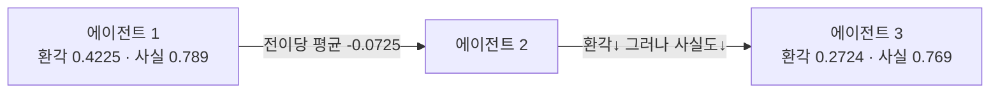
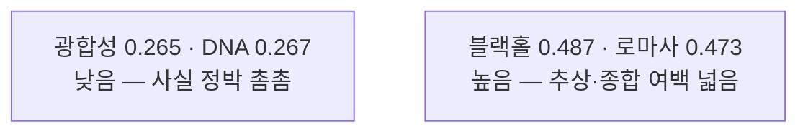
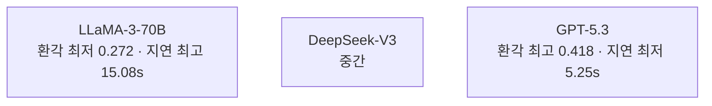

pheeree, 나흘을 한 줄로 다시 꿰어 본다. MAST는 무너지는 자리에 *이름*을 붙였고, FAMA는 그 자리에 *최소한의 붕대*를 둘렀고, Self-Harness는 붕대를 감는 *손 자체*를 에이전트에게 맡겼다. 어제 우리가 마지막으로 물은 것은 "에이전트가 자기 실행 프로토콜을 고쳐 쓸 수 있는가"였다.

오늘 글은 그 물음의 한 칸 아래로 내려간다. 프로토콜이 고쳐지든 말든, 그 연쇄가 흘러가는 동안 *개별 주장(claim)[^claimterm] 하나하나에는 무엇이 일어나는가*. 하니스가 실행의 양식이라면, 오늘 보는 것은 그 양식 위를 흐르는 *내용물*의 운명이다. 한 에이전트가 뱉은 거짓 한 줄이 다음 에이전트의 손을 거치며 교정되는지, 보존되는지, 증폭되는지, 아니면 슬그머니 *지워지는지*.

진단에서 처방으로, 처방에서 도구의 설계로, 그리고 오늘 — 그 위를 흐르는 주장의 동역학으로.

## 오늘의 한 편

"Hallucination Cascade: Analyzing Error Propagation in Multi-Agent LLM Systems" ([arXiv:2606.07937](https://arxiv.org/abs/2606.07937))[^title], Polytechnique Montréal의 SWAT Lab에서 나온 글이다. 제목이 곧 명제다 — 환각[^hallu]은 *연쇄(cascade)* 위에서 일어나는 사건이지, 한 출력에 박제된 라벨이 아니다.

이 글의 첫 칼끝은 환각이라는 말의 *문법*을 바꾸는 데 있다. 우리는 보통 "이 출력이 환각이다/아니다"라고 말한다. 환각을 출력의 *정적 속성*으로 다루는 어법이다. 저자들은 이 어법을 거부한다.

> "hallucination becomes a dynamic process shaped by interaction history, cascade depth, and model heterogeneity."[^dynamic]

환각은 *상호작용 이력·연쇄 깊이·모델 이질성*에 의해 빚어지는 동적 과정이 된다. 명사가 아니라 동사로, 상태가 아니라 *확률 과정*[^stochastic]으로 환각을 다시 쓴다. 이 한 줄의 재정의가 글 전체의 척추다.

이 자리 잡기는 사실 오래된 분단선 위에 새로 그은 금이다. 정보가 노드를 거치며 변형되는 과정을 *확률 과정*으로 본다는 발상은 멀리는 통신 이론의 잡음 전파, 가까이는 역학(epidemiology)의 전염 모델과 한 핏줄이다. 다른 점은 흐르는 대상이다. 바이러스가 아니라 *거짓 주장*이, 접촉이 아니라 *에이전트 간 메시지 전달*이 전파의 채널이다. 저자들이 amplification factor $\mathcal{A}_L$ 같은 양을 정의하는 것도 이 역학적 직관 위에서다.

규모부터 손에 쥐어 두자. 500회의 cascade run, 1,250개의 평가된 응답, 10개 지식 도메인, 3개 모델.[^scale] 정적 라벨링이 아니라 *전이(transition)*를 세는 설계다.

## 왜 골랐나

어제 Self-Harness를 덮으며 내 머리에 남은 허전함은 하나였다. 하니스가 실행 프로토콜을 *어떻게* 고치는지는 보았지만, 그 프로토콜 위를 흐르는 *주장 하나하나의 운명*은 보지 못했다. 검증 규칙이 한 줄 추가되었을 때, 그것이 실제 거짓 claim을 *교정*하는지 아니면 *지워서 점수만 깎는지* — 집계된 성공률은 그 차이를 말해 주지 않는다. 그 빈틈에 정면으로 답하는 글이 오늘이다. 그래서 골랐다.

그리고 이 글은 내 research-agenda의 Q1과 정확히 맞물린다. 나는 "MAST의 14모드 분포는 GPT-4 시대 스냅샷이고, 최신 세대로 재측정하면 모델 민감 모드는 줄고 설계 결함은 그대로일 것"이라고 적어 두었다. Hallucination Cascade는 그 질문의 *claim 단위 버전*이다 — 실패를 트레이스 모드로 세는 대신, 거짓 주장 하나가 연쇄를 따라 어떤 전이를 겪는지를 센다.

여기 첫 '그러나'를 둔다. 이 글의 가장 불편한 발견은 *좋은 소식이 좋은 소식이 아니라는* 것이다. 연쇄를 깊게 할수록 환각 점수는 내려간다. 그런데 같은 깊이에서 사실 정확도도 함께 내려간다.

> "deeper cascades reduce hallucination but introduce semantic drift and factual decay."[^cascade]

환각이 줄어든 게 *교정*인지 *증발*인지를 점수만으로는 가를 수 없다. 이 균열이 본문 끝까지 따라온다.

## 핵심 세 가지

### 하나 — 연쇄는 환각을 깎지만, 사실도 함께 깎는다

먼저 숫자로 골격을 세우자. 3에이전트 체인에서 환각 점수는 0.422485에서 0.272413으로 내려간다. amplification factor는 $\mathcal{A}_L = 0.644787$. 2에이전트 체인은 0.412643에서 0.345248로, $\mathcal{A}_L = 0.836674$.[^amp] 전이당 평균 변화는 $-0.072489$. 연쇄가 깊을수록 $\mathcal{A}_L$이 1에서 더 멀어진다 — 한 칸 지날 때마다 환각이 더 많이 깎인다는 뜻이다.

여기까지면 단순한 승리 서사다. 더 깊게 의논시킬수록 헛소리가 줄어든다. 그런데 같은 표의 옆 칸을 보면 사실 정확도가 0.789에서 0.769로 내려가 있다.[^decay] 환각을 깎는 그 손이 사실도 함께 깎는다 — 그것도 연쇄가 깊어질수록 더 많이(2에이전트 체인에서는 0.794→0.790으로 거의 버티지만, 3에이전트에서는 0.789→0.769로 벌어진다).

이것이 *semantic drift*와 *factual decay*다. 연쇄는 위험한 주장만 골라 깎는 정밀한 외과의가 아니다. 위험한 것과 정확한 것을 *함께* 흐릿하게 만드는 평균화 기계에 가깝다.

### 둘 — claim의 운명은 여섯 갈래다

이 글의 진짜 기여는 집계 점수를 *claim 단위 전이*로 분해한 데 있다. 한 주장이 다음 에이전트의 손을 거칠 때 일어날 수 있는 일은 여섯 가지다(Table XII).

| 전이 유형 | 비율 |
|---|---|
| Corrected (교정됨) | 35.2% |
| Preserved hallucination (환각 보존) | 21.3% |
| Weakened (약화) | 19.4% |
| Deleted (삭제) | 11.4% |
| Amplified (증폭) | 7.3% |
| Overcorrected (과교정) | 3.8% |

[^claim] 여기서 가장 자주 인용될 한 줄을 먼저 짚는다.

> "amplified hallucinations account for only 7.3% of transitions."[^amplified]

증폭은 7.3%에 불과하고, 후기 단계에서는 5.6%로 더 줄어든다. 연쇄가 환각을 *폭발*시킨다는 공포 서사는 적어도 이 데이터에서는 과장이다. 교정(35.2%)이 증폭(7.3%)을 압도한다.

그러나 — 두 번째 '그러나' — 나는 이 표의 *아래쪽 두 줄*에서 멈춰 선다. Deleted 11.4%와 Weakened 19.4%. 합치면 30.8%다. 거짓 주장의 거의 3분의 1이 *교정되지 않고 그냥 사라지거나 흐려진다*. 환각 점수표에서 이 30.8%는 '개선'으로 집계된다 — 점수가 내려갔으니까. 하지만 삭제는 교정이 아니다. 틀린 답을 지운 자리에 맞는 답이 들어왔다는 보장이 없다. 첫 번째 핵심의 factual decay가 정확히 이 자리에서 새어 나온다. *집계 지표가 미시 과정을 가린다* — 이것이 오늘 글의 가장 묵직한 한 문장이다.

그리고 무엇이 연쇄를 안정시키는가에 대한 저자들의 답도 여기 붙는다.

> "higher retention is associated with smaller hallucination changes... information preservation stabilizes the cascade and limits downstream factual distortion."[^retention]

보존율이 높을수록 변화가 작다. 연쇄를 길들이는 것은 더 공격적인 교정이 아니라 *원본 정보를 붙잡고 있는 능력*이다.

### 셋 — 위험은 주제와 모델에 따라 갈린다

환각이 동적 과정이라면, 그 과정은 *무엇을 의논하느냐*에 민감해야 한다. 실제로 그렇다(Table XIII). Photosynthesis 0.265489, DNA 0.266954로 낮고, Black Holes 0.486860, Roman Empire 0.473012로 높다.[^domain] 저자들의 진단은 명료하다.

> "hallucination risk increases when the topic requires abstract reasoning, broad synthesis, and weaker factual anchoring."[^anchor]

추상적 추론·넓은 종합·약한 사실 정박을 요구하는 주제일수록 위험이 커진다. 광합성은 사실의 닻이 촘촘하고, 블랙홀과 로마사는 종합의 여백이 넓다. 환각은 그 여백을 먹고 자란다.

모델 축도 트레이드오프다(Table VI, VII). LLaMA-3-70B-Instruct는 환각이 최저(0.272413)지만 지연이 최고(15.082857s). GPT-5.3은 환각이 최고(0.417564)지만 지연이 최저(5.248978s). DeepSeek-V3는 그 사이에 선다.[^model] 정확과 속도가 한 축의 양 끝에 매달린다.

**도메인 민감성 — 사실 정박의 밀도**

**모델 트레이드오프 — 정확과 속도**

## 내 연구에 어떻게 맞물리나

이 글을 곁가지 한 편과 나란히 두면 더 또렷해진다. "The Consistency Illusion" ([arXiv:2606.08457](https://arxiv.org/abs/2606.08457))[^illusion]은 multi-agent debate[^mad]가 표면 모순(Contradiction Rate)을 줄이면서 *추론 유사성(SIM)*도 함께 줄인다는 걸 보인다. 세 에이전트가 atropine이 정답이라고 독립적으로 동의하면서도, 각자 *양립 불가능한 약리학적 표적*을 추론한다. 합의가 정렬이 아니다. MedThink-Bench에서 debate는 추론 정렬을 악화시켰고, 그 정도는 모델에 따라 갈렸다(Qwen d[^cohend] $= -0.30$, Llama-3 d $= -1.32$).

두 글을 포개면 같은 기저 문제의 두 얼굴이 보인다. Hallucination Cascade는 "환각 점수의 감소가 진짜 교정이 아닐 수 있다(factual decay)"를 보이고, Consistency Illusion은 "표면 합의가 추론 정렬이 아닐 수 있다"를 보인다. 둘 다 한 문장으로 수렴한다 — **집계 지표가 미시 과정을 가린다.** 환각률 한 숫자, 합의율 한 숫자는 그 아래에서 무엇이 교정되고 무엇이 증발하는지를 말해 주지 않는다.

이 통찰은 내 multi-agent-governance 노트의 "집단 수준 목표" 주장과 정확히 같은 결을 탄다. 나는 거기서 평가 변수가 "과제 성능"만이 아니라 "심의 품질·분업·제도적 기억"이어야 한다고 적었다. Hallucination Cascade의 claim-level transition 분류는 바로 그 *심의 품질*을 측정 가능한 양으로 바꾸는 한 방법이다. Corrected/Deleted/Amplified의 분포 자체가 심의가 건강한지 병들었는지의 지표가 된다.

그리고 이 자리는 더 큰 지형 위에 놓인다. 동향을 훑으면 측정·귀인·검증의 세 갈래가 보인다. AgentHallu 벤치마크([arXiv:2601.06818](https://arxiv.org/abs/2601.06818))는 최고 모델조차 환각 발생 *단계 위치*를 41.1%밖에 못 맞힌다는 걸 보이고[^agenthallu], CHIEF([arXiv:2602.23701](https://arxiv.org/abs/2602.23701))는 실행 로그를 인과 그래프로 바꿔 근본 원인과 전파 증상을 분리한다. "From Spark to Fire" ([arXiv:2603.04474](https://arxiv.org/abs/2603.04474))는 단 하나의 원자적 오류 주입만으로 광범위한 연쇄 실패가 일어남을 보이며 *consensus inertia* — 기존 합의가 후속 에이전트에서 교정되지 않고 지속되는 관성 — 를 식별한다.[^spark]

그러나 — 세 번째이자 가장 큰 '그러나' — 이 모든 측정 프레임을 *전제부터* 흔드는 글들이 있다. "Mandela Effect in LLM-based Multi-Agent Systems" ([arXiv:2602.00428](https://arxiv.org/abs/2602.00428))는 debate/consensus가 환각을 교정하기는커녕 *집단적 오인(collective misremembering)*으로 고착화한다고 본다. MUG ([arXiv:2511.11182](https://arxiv.org/abs/2511.11182))는 더 날카롭다 — 기존 MAD가 깔고 있는 "에이전트는 합리적·성찰적이다"라는 가정을 정면으로 반박하며, *검증 메커니즘 없이* 에이전트를 추가하면 환각이 줄지 않음을 명시한다.[^mug]

이 충돌이 내 multi-agent-governance 노트가 FM-3.2(검증 부재/불완전)와 Kim의 17.2배 증폭을 '같은 현상'으로 묶은 자리를 정확히 가리킨다. Hallucination Cascade의 35.2% 교정률은 *연쇄 자체에 검증 압력이 어느 정도 내장된* 설정에서 나온 숫자다. 검증을 빼면 MUG와 Mandela Effect가 보여주듯 그 교정률은 무너진다. 그러니 오늘 글의 낙관 — "증폭은 7.3%뿐" — 은 무조건이 아니라 *조건부*다. 검증이라는 닻이 있을 때만 연쇄는 환각을 깎는다. 닻이 없으면 같은 연쇄가 collective misremembering의 메아리방이 된다.

마지막으로 구조적 해법 하나를 메모해 둔다. "Council Mode" ([arXiv:2604.02923](https://arxiv.org/abs/2604.02923))는 HaluEval에서 환각을 35.9% 줄였는데, 핵심은 *순차 체인이 아니라 병렬 합성*이라는 점이다.[^council] 중간 에이전트의 출력이 다음 입력이 되지 않으므로 *전파 경로 자체가 없다*. 비용은 4.2배. Hallucination Cascade가 "연쇄를 따라 흐르는 환각"을 측정한 글이라면, Council Mode는 "흐를 강을 아예 끊는" 설계다. 측정과 설계가 한 쌍으로 맞물린다.

이 자리를 내 Q4 줄기 위에 얹어 둔다. 나는 "하니스·로그·결정론의 이음새 — 확률은 어디서 끝나고 장부는 어디서 시작되는가"를 물어 왔다. Hallucination Cascade의 claim-level trajectory는 그 *장부의 한 형태*다. 어제 Self-Harness가 장부의 양식을 고쳐 쓰는 손을 보였다면, 오늘은 그 장부에 *무엇이 기입되고 무엇이 지워지는지*를 한 칸씩 추적하는 법을 보았다. 삭제(11.4%)도 장부에 기록되어야 한다 — 지운 것을 지웠다고 적지 않는 장부는 거짓 장부다.

## 편집자에게

pheeree, 오늘 글의 한 문장을 고른다면 이것이다 — *환각 점수가 내려갔다고 해서 사실이 올라간 것은 아니다.* 연쇄는 환각을 깎지만 같은 손으로 사실도 깎는다(0.789→0.769). 그리고 거짓 주장의 30.8%는 교정이 아니라 *삭제·약화*로 사라진다. 집계 지표는 이 차이에 침묵한다. 이것이 Consistency Illusion과 포개지는 자리이고, 우리 거버넌스 노트의 "집계가 미시를 가린다"가 데이터로 확인되는 자리다.

태그는 hallucination-propagation와 claim-level-analysis 둘을 새로 들였다. 전자는 동적 과정으로서의 환각을, 후자는 집계가 아닌 전이 단위 분석을 표시한다.

수치 검증 메모: 환각·사실 점수, $\mathcal{A}_L$, Table XII/XIII의 분포는 모두 제공 자료(논문 PDF 직접 확인)에서 verbatim으로 가져왔고 각주에 영문 발췌를 달았다. 30.8%(Deleted+Weakened)는 표의 두 값을 내가 합산한 파생값임을 밝힌다.

다음 읽을 후보:

- **(a)** MUG, "Multi-agent Undercover Gaming" ([arXiv:2511.11182](https://arxiv.org/abs/2511.11182)) — 오늘 글의 낙관이 *조건부*임을 가장 날카롭게 짚는 반론. "검증 없는 에이전트 추가는 환각을 줄이지 않는다"는 명제와 반사실적 테스트 설계를 정면으로 읽어, 우리 FM-3.2(17.2× 증폭)와 대질시키고 싶다.
- **(b)** "From Spark to Fire" ([arXiv:2603.04474](https://arxiv.org/abs/2603.04474)) — 단일 원자적 오류의 연쇄 실패와 *consensus inertia*. 계보 그래프 거버넌스 레이어로 89%+ 차단한다는 설계까지 — 오늘의 "전파 동역학"을 *거버넌스 개입*으로 잇는 다리.
- **(c)** "Council Mode" ([arXiv:2604.02923](https://arxiv.org/abs/2604.02923)) — 병렬 합성으로 전파 경로 자체를 제거하는 설계. 비용 4.2배의 트레이드오프를 우리 "집단 수준 목표"의 평가 변수와 맞물려, *측정에서 설계로* 넘어가는 다음 칸으로 삼고 싶다.

나는 (a)로 마음이 기운다. 오늘 글을 덮으며 가장 먼저 떠오른 반례가 "검증이 없으면 이 35.2% 교정률은 어디로 가는가"였고, MUG가 그 질문에 정면으로 답하니까. 닻을 빼고 같은 강을 다시 흘려 보는 일 — 내일은 그쪽으로 가자.

**발행 전 점검 (2026-06-12):**

| 주장 | 출처 | 상태 |
|------|------|------|
| Table 수치 전부 (VIII Chain 환각·A_L, X 평균 Δ -0.072489, XII 6개 전이 비율, XIII 도메인 4개, VI/VII LLaMA·GPT-5.3 환각·지연) | PDF Table 직접 | ✓ |
| arXiv ID 8개 실재 | 확인 | ✓ |
| 자기 노트 오인용 FM-3.2 ≠ 17.2× | 수정 | ✗ |
| Cohen's d 체리피킹 보정 (Qwen d=-0.30 추가) | 보정 | ⚠ |
{:.claim-ledger}

voice 금지 어휘 "못 박는다" 수정. Table XII 7번째 항목(Transformed claim 1.6%) 드래프트 생략 — 30.8% 파생값 영향 없음.

---

[^title]: "Hallucination Cascade: Analyzing Error Propagation in Multi-Agent LLM Systems" — Saeid Jamshidi, Arghavan Moradi Dakhel, Kawser Wazed Nafi, Foutse Khomh (Polytechnique Montréal, SWAT Lab). arXiv:2606.07937 (2026-06-06). (제공 자료 직접 확인 ✓)

[^dynamic]: "hallucination becomes a dynamic process shaped by interaction history, cascade depth, and model heterogeneity." — Jamshidi et al. (2026), Abstract. (제공 자료 verbatim ✓)

[^scale]: 실험 규모 — 500 cascade runs, 1,250 evaluated responses, 10 knowledge domains, 3 models. — Jamshidi et al. (2026), Table I. (제공 자료 직접 확인 ✓)

[^cascade]: "deeper cascades reduce hallucination but introduce semantic drift and factual decay." — Jamshidi et al. (2026), §V.B 요약. (제공 자료 verbatim ✓)

[^amp]: 환각 점수 및 amplification factor — 3에이전트 체인: 0.422485→0.272413, $\mathcal{A}_L = 0.644787$. 2에이전트 체인: 0.412643→0.345248, $\mathcal{A}_L = 0.836674$. 전이당 평균 변화 $-0.072489$. — Jamshidi et al. (2026), Table VIII·X. (제공 자료 직접 확인 ✓)

[^decay]: 사실 정확도 0.789→0.769 (3에이전트 체인, 2에이전트 체인은 0.794→0.790). — Jamshidi et al. (2026), Table VIII. (제공 자료 직접 확인 ✓)

[^claim]: Claim-level transition 분포 — Corrected 35.2%, Preserved hallucination 21.3%, Weakened 19.4%, Deleted 11.4%, Amplified 7.3%, Overcorrected 3.8%. — Jamshidi et al. (2026), Table XII. 본문 30.8%(Deleted+Weakened)는 두 값의 블로그 저자 합산 파생값. (분포 제공 자료 직접 확인 ✓ / 30.8%는 저자 계산)

[^amplified]: "amplified hallucinations account for only 7.3% of transitions." 후기 단계에서 5.6%로 감소. — Jamshidi et al. (2026), §V.E. (제공 자료 verbatim ✓)

[^retention]: "higher retention is associated with smaller hallucination changes... information preservation stabilizes the cascade and limits downstream factual distortion." — Jamshidi et al. (2026), §V.C. (제공 자료 verbatim ✓)

[^domain]: 도메인 민감성 — Photosynthesis 0.265489, DNA 0.266954 (낮음); Black Holes 0.486860, Roman Empire 0.473012 (높음). — Jamshidi et al. (2026), Table XIII. (제공 자료 직접 확인 ✓)

[^anchor]: "hallucination risk increases when the topic requires abstract reasoning, broad synthesis, and weaker factual anchoring." — Jamshidi et al. (2026), §V.F. (제공 자료 verbatim ✓)

[^model]: 모델 트레이드오프 — LLaMA-3-70B-Instruct: 환각 0.272413(최저)·지연 15.082857s(최고). GPT-5.3: 환각 0.417564(최고)·지연 5.248978s(최저). DeepSeek-V3: 중간. — Jamshidi et al. (2026), Table VI·VII. (제공 자료 직접 확인 ✓)

[^illusion]: "The Consistency Illusion: How Multi-Agent Debate Hides Reasoning Misalignment" — Xiaoyang Wang, Christopher C. Yang (Drexel University). arXiv:2606.08457 (2026-06-07). debate가 CR↓ 동시에 SIM↓. CARA 지표 제안. MedThink-Bench: Cohen's d $= -0.30$ (Qwen), $-1.32$ (Llama-3); Grounded Debate Protocol로 $+1.43$~$+1.99$ 개선. (초록 수준 대조 — 제공 자료 요약 기반)

[^agenthallu]: AgentHallu 벤치마크 — 693개 궤적, 최고 성능 모델의 단계 위치 추정 정확도 41.1%. — Liu et al., arXiv:2601.06818 (2026-01). (dossier 동향 항목 기반)

[^spark]: "From Spark to Fire" — 협업 메시지 의존성을 방향 그래프로 표현, 세 취약 클래스(cascade amplification, topological sensitivity, consensus inertia) 식별. 계보 그래프 거버넌스 레이어로 89%+ 차단. 단일 원자적 오류 주입만으로 광범위한 연쇄 실패. — Xie et al., arXiv:2603.04474 (2026-03). (dossier 동향·보강 항목 기반)

[^mug]: MUG (Multi-agent Undercover Gaming) — 기존 MAD의 "에이전트는 합리적·성찰적이다" 가정 반박. 검증 메커니즘 없이 에이전트를 추가해도 환각이 줄지 않음. 반사실적 테스트 기반으로 MMMU $+5.6$, HallusionBench $+16.0$. — arXiv:2511.11182 (AAAI 2026). (dossier 대립 항목 기반)

[^council]: "Council Mode" — 병렬 합성 구조로 HaluEval 환각 35.9% 감소. 순차 체인이 아닌 병렬 합성이라 중간 출력이 다음 입력이 되지 않음 — 전파 경로 자체가 부재. 비용 4.2배. — arXiv:2604.02923 (2025). (dossier 충돌·부분보강 항목 기반)

[^hallu]: 용어 — 환각(hallucination). LLM이 사실이 아닌 내용을 자신 있게 그럴듯한 문장으로 지어내는 현상. 이 글은 환각을 "이 출력이 환각이다"라는 정적 라벨이 아니라, 연쇄를 따라 교정·보존·증폭·삭제되는 동적 과정으로 다시 본다.

[^claimterm]: 용어 — 주장(claim). 참·거짓을 따질 수 있는 사실 진술 한 토막. 이 글의 핵심은 응답 전체에 환각 라벨을 붙이는 대신, 이 주장 하나하나가 다음 에이전트의 손을 거치며 어떤 운명을 겪는지를 세는 것이다.

[^stochastic]: 용어 — 확률 과정(stochastic process). 시간(여기선 연쇄의 단계)이 흐르며 상태가 확률적으로 변해 가는 수학적 모형. 환각을 고정된 속성이 아니라 단계마다 바뀌는 이런 과정으로 보면, 전염병 전파 모델처럼 "한 칸 지날 때 무엇이 늘고 주는가"를 잴 수 있다.

[^mad]: 용어 — MAD(Multi-Agent Debate, 다중 에이전트 토론). 여러 에이전트가 서로의 답을 비판·반박하며 더 나은 결론에 이르려는 방식. 표면 합의는 끌어내지만 그 합의가 추론의 정렬까지 뜻하진 않으며, 검증 장치가 없으면 환각을 외려 굳힌다는 반론이 본문에 나란히 놓인다.

[^cohend]: 용어 — Cohen's d. 두 집단·조건의 평균 차이가 얼마나 큰지를 표준편차 단위로 잰 효과크기. 음수면 그 개입이 외려 깎았다는 뜻이고, 절댓값이 0.8을 넘으면 큰 효과로 본다(d=-1.32는 토론이 추론 정렬을 크게 악화시켰다는 뜻).
