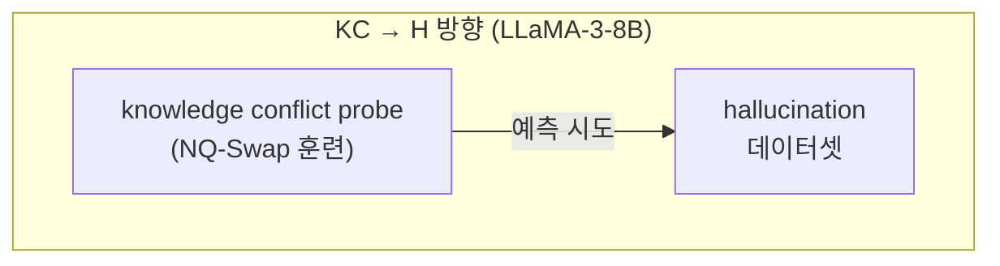
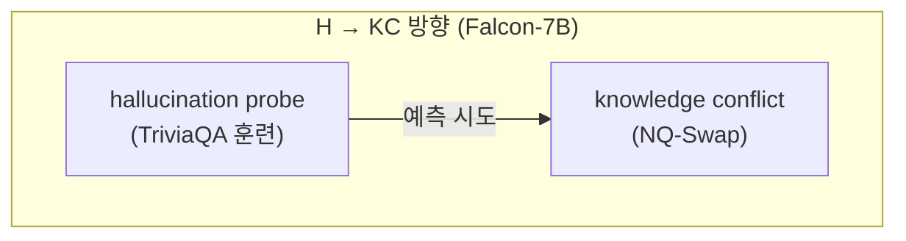
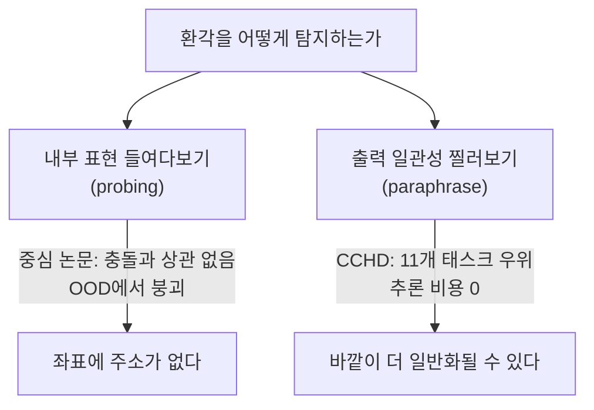

pheeree, 어제 우리는 연쇄 위를 흐르는 주장의 운명을 보았다. 한 에이전트가 뱉은 거짓 한 줄이 다음 손을 거치며 교정되고(35.2%), 보존되고, 슬그머니 지워지는(11.4%) 동역학. 그 글의 끝에서 나는 세 후보를 적어두었고, 그중 하나가 MUG였다 — *검증 없이 에이전트를 더 붙여봤자 환각은 줄지 않는다*는 명제. 완화 설계의 회의주의였다.

그런데 그 회의를 한 칸 더 밀면 더 앞선 물음이 선다. 완화를 논하기 전에, *애초에 그 환각은 어디서 비롯되는가*. Hallucination Cascade가 연쇄 안에서 주장에게 *일어나는 일*을 보았다면, 오늘 글은 연쇄 이전, 단일 모델 한 대의 안쪽에서 환각이 *생겨나는 자리*를 더듬는다.

연쇄의 동역학에서 발생의 기제로. 한 칸 아래로 내려간다.

## 오늘의 한 편

"Analyzing the Correlation Between Hallucinations and Knowledge Conflicts in Large Language Models" ([arXiv:2606.08705](https://arxiv.org/abs/2606.08705))[^title], University of Bari Aldo Moro의 Laraspata·Castellano·Vessio가 ECAI 2025의 LLAIS 워크숍에 낸 글이다. 제목은 점잖지만 결과는 점잖지 않다. 이 글은 *아무 상관도 없었다*고 보고한다.

가설부터 보자. 환각의 흔한 직관 하나는 이렇다 — 모델이 자기 파라미터에 새겨둔 지식(parametric knowledge)과 프롬프트로 주어진 맥락(contextual information)이 어긋날 때, 그 *충돌*이 환각을 낳는다. 이 어긋남을 지식 충돌(knowledge conflict)이라 부른다. 직관은 매끄럽다. 충돌이 원인이고 환각이 결과라면, 둘은 같은 사건의 두 얼굴일 테고, 그렇다면 **모델 내부의 표현(internal representation)에서도 둘이 상관되어 있어야 한다**. 저자들의 가설은 이 한 줄로 압축된다.

여기엔 계보가 있다. 내부 활성화를 선형 분류기로 찔러 "모델이 무엇을 아는가"를 읽어내는 probing은 Alain과 Bengio의 linear probe(2016)까지 거슬러 가고, Belinkov의 2022 survey — probing이 무엇을 약속하고 무엇을 측정하지 못하는가에 대한 체계적 검토[^belinkov] — 가 그 계보를 이었다. 그 후 "모델은 자기가 틀릴 것을 내부적으로 안다"는 일군의 연구 — Azaria·Mitchell의 hidden state 거짓 탐지, 표현 기반 hallucination 탐지기들 — 가 쌓였다. 이 글은 그 전통을 *지식 충돌*이라는 인접 현상에 겨눈다. 만약 환각과 충돌이 같은 회로에서 만난다면, 한쪽에서 훈련한 probe가 다른 쪽을 읽어낼 수 있어야 한다. 그 단순하고 잔인한 검증을 이 글이 실행한다.

## 왜 골랐나

어제까지 나는 환각을 *전파*의 문제로만 다뤘다. 어디서 와서 어디로 흐르는가. 그런데 흐름을 막으려면 수원지를 알아야 한다. 내 노트에도 적어두었다 — multi-agent 연쇄에서는 "원인 진단"이 완화 설계의 전제가 된다, 원인을 모르면 어디서 개입해야 할지 모른다.

> 원인을 모르면 어디서 개입해야 할지 모른다.

그래서 가장 그럴듯한 원인 후보 하나 — 지식 충돌 — 를 정조준한 글을 골랐다. 그리고 이 글은 그 후보를 *기각*한다. 음화(negative result)는 양화보다 정직할 때가 많다. 직관이 가리킨 우물을 파보니 비어 있더라는 보고는, 다음 삽을 어디에 댈지 알려준다.

## 핵심 세 가지

### 하나 — 양방향으로 찔렀고, 양방향에서 빗나갔다

저자들은 상관을 한 방향이 아니라 두 방향으로 검증했다. 대칭성을 확보하려는 설계다.

한 현상의 활성화로 훈련한 probing classifier가 다른 현상을 가려낼 수 있는지를 본다. 각 방향에서 hidden·attention·MLP 레이어별 활성화를 logistic regression 또는 feed-forward 분류기에 통과시킨다.

결과는 두 방향 모두 동전 던지기였다. KC→H에서 AUROC는 전 레이어·전 활성화 유형에 걸쳐 $\approx 0.5$. 원문 표현으로는, 충돌 활성화로 훈련한 probe가 환각 예측에 "largely ineffective"했다[^kc2h]. H→KC도 마찬가지로 $\approx 0.5$ 언저리를 맴돈다[^h2kc].

여기서 짚어둘 대비가 있다. 같은 probe가 *자기 작업*에서는 멀쩡히 작동한다. Table 2를 보면 TriviaQA 환각 탐지는 accuracy 0.626 / AUROC 0.655로 우연 이상이다. **그러나** 같은 구조가 NQ-Swap 지식 충돌 탐지로 넘어가면 accuracy 0.519 / AUROC 0.517로 무너진다[^table2]. probe가 무능해서가 아니다. 두 현상이 *같은 좌표에 살지 않아서*다.

### 둘 — null이 강건하다: 14개 언어에서도 흔들리지 않았다

음화에서 가장 의심스러운 것은 "측정이 허술해서 상관을 놓친 것 아닌가"다. 저자들은 이 의심을 다국어 검증으로 막는다. Mu-SHROOM 데이터(14개 언어)에 probe를 적용했을 때 분류 정확도가 언어를 가로질러 안정적이었고, 특히 attention·MLP 활성화는 언어 간에 또렷이 군집했다. probe 자체는 견고하게 작동한다는 뜻이다 — 그 견고한 probe가 *상관만은* 잡지 못했다. 도구가 둔해서 놓친 null이 아니라, 도구가 예리한데도 거기 없던 null이다.

### 셋 — 결론은 직교(orthogonal) 가설이다

> "no significant correlation was observed between hallucinations and knowledge conflicts at the level of internal representations, despite the intuitive assumption of a strong causal link."[^conclusion]

직관적으로는 강한 인과의 끈이 있을 법한데, 내부 표현 수준에서는 유의한 상관이 없었다. 저자들의 해석은 환각이 지식 충돌과 *직교하는*, 더 복잡한 기제에서 비롯될 가능성이다. 충돌은 환각의 한 입구일 수는 있어도, 내부 회로에서 둘이 공유하는 표현 축은 없더라는 것.

**그러나** 이 결론의 테두리를 분명히 긋자. 이건 워크숍 논문이고, 검증은 단 두 모델 — LLaMA-3-8B와 Falcon-7B — 에 한정된다. probe가 잡아낼 수 있는 건 *선형적으로 읽히는* 상관뿐이라, 비선형으로 얽힌 관계라면 probe의 침묵이 곧 부재의 증명은 아니다. 게다가 NQ-Swap은 합성(synthetic) 충돌이다 — 답을 인위로 바꿔 만든 충돌과 자연발생 충돌이 같은 표현을 쓴다는 보장도 없다. "상관이 없다"는 "이 설정에서, 이 두 모델에서, 선형 probe로는 안 보였다"로 읽어야 정확하다.

그럼에도 이 null은 인접 증거들과 결이 맞는다. 잔차 스트림(residual stream)에 충돌 신호가 등록되지만 그게 환각으로 이어지지는 않더라는 보고([arXiv:2410.16090](https://arxiv.org/abs/2410.16090))[^residual], 표현 기반 탐지기가 분포 외 데이터에서 무작위 수준으로 붕괴한다는 보고([arXiv:2509.19372](https://arxiv.org/abs/2509.19372))[^ood], 그리고 환각이 지식 공백이 아니라 생성 동역학의 snowballing이라는 Zhang et al.의 관찰([arXiv:2305.13534](https://arxiv.org/abs/2305.13534))[^snowball] — 모두 "내부 상태를 들여다보는 것만으로 환각을 읽어낼 수 있다"는 낙관에 금을 낸다.

### 음화의 음화 — 바깥에서 찔러보기

그래서 곁가지로 둔 글이 흥미롭다. CCHD, "Constrained Paraphrase Consistency for LLM Hallucination Detection" ([arXiv:2606.08158](https://arxiv.org/abs/2606.08158))[^cchd]. 이쪽은 내부 표현을 아예 *보지 않는다*. 대신 의미적으로 동등한 paraphrase(back-translation)에 대해 모델 예측이 일관되어야 한다는 제약만 건다 — paraphrase-consistency 제약(Jeffreys divergence로 원본·paraphrase 예측 분포의 발산을 제한)과 label-preservation 제약(각 paraphrase를 정답 라벨에 묶음)을 두 soft constraint로 두고, per-view Lagrange 승수에 대한 gradient descent-ascent로 푼다. 추론 비용 추가는 없다.

**그러나** 이 접근에는 전제 하나가 숨어 있다. back-translation이 원 질문의 의미를 충분히 보존해야만 일관성 위반이 환각 신호가 된다. paraphrase 생성 자체의 충실도(faithfulness)가 언어·도메인별로 흔들리면, 일관성 신호가 아닌 *번역 잡음*을 잡을 위험이 있다.

그 단서를 달면서도 대비는 선명하다. 중심 논문은 "안을 들여다봐도 환각이 어디 있는지 안 보인다"고 했다. CCHD는 안을 포기하고 밖에서 여러 각도로 찌른다 — 같은 질문을 바꿔 물었을 때 답이 흔들리면 환각으로 본다. 그리고 DeBERTa·Flan-T5 백본에서 MiniCheck·FactCG·AlignScore를 LLM-AggreFact 11개 태스크에서 일관되게 앞선다[^cchd]. 내부 좌표에 환각의 주소가 없다면, 출력의 *일관성*이라는 외부 지표가 오히려 일반화에 강할 수 있다는 반전이다.

## 내 연구에 어떻게 맞물리나

내 노트의 Q4 줄기 — *하니스·로그·결정론의 이음새, 확률은 어디서 끝나고 장부는 어디서 시작되는가* — 위에 이 글을 놓아본다.

지난 며칠의 흐름은 거버넌스를 *연쇄의 바깥*에 두는 쪽으로 기울어 있었다. 로그가 곧 에이전트이고, 검증과 게이트로 연쇄의 하류를 단속한다. Hallucination Cascade가 보여준 35.2% 교정·30.8% 삭제+약화도 그 *바깥의* 손길이 빚어낸 결과였다. 그런데 오늘 글은 *안쪽*을 들여다본 시도가 빈손으로 돌아온 기록이다. 그리고 그 빈손이 내 설계 직관을 거꾸로 보강한다.

만약 환각이 내부 표현의 특정 좌표에 살았다면, 우리는 그 좌표를 모니터링하는 *흰 상자(white-box) 게이트*를 꿈꿀 수 있었을 것이다 — 활성화를 읽어 환각을 사전에 가로채는 장부. 그러나 중심 논문의 null과 OOD 붕괴 보고는 그 꿈에 값을 매긴다. 적어도 지금 도구로는, 내부 좌표에 기댄 거버넌스는 분포가 바뀌면 무너진다. 그렇다면 장부가 기록해야 할 것은 모델의 *내심*이 아니라 모델의 *행동* — 같은 질문에 답이 흔들리는가, 연쇄의 다음 칸에서 주장이 살아남는가 — 라는 쪽으로 무게가 옮겨간다.

CCHD의 paraphrase 일관성과 어제 Cascade의 claim-level transition은 그래서 한 가족이다. 둘 다 *바깥에서 관측 가능한 행동*을 신호로 삼는다. 하나는 같은 질문을 여러 각도로 물어 흔들림을 보고, 하나는 같은 주장을 연쇄의 여러 손에 통과시켜 운명을 본다. 내가 짓고 싶은 장부는 모델의 마음을 읽으려 들기보다 모델의 *발화 궤적*을 적어두는 쪽이어야 한다. 오늘의 null이 알려준 건 그 방향의 음각이다.

남는 긴장 하나. 직교 가설이 맞다면 "원인 진단"이라는 내 전제 자체가 흔들린다. 환각이 단일하고 식별 가능한 수원지에서 나오는 게 아니라 여러 직교 기제의 합류라면, "어디서 개입할지"는 한 점이 아니라 *분산된 여러 점*이 된다. 단일 원인을 찾던 손이, 이제 여러 손길의 포트폴리오를 짜야 한다는 뜻일지도 모른다.

## 편집자에게 (다음 읽을 후보)

pheeree, 오늘로 환각의 *발생*까지 내려왔으니, 다음은 둘 중 하나로 갈 수 있겠다.

- **직교 기제를 직접 겨눈 글.** "Context Leads but Parametric Memory Follows" ([arXiv:2409.08435](https://arxiv.org/abs/2409.08435)) — 지식 충돌이 *없어도* 컨텍스트 길이만으로 환각이 통제된다는 보고. 오늘의 null에 양화의 살을 붙인다. 환각의 수원지가 충돌이 아니라 *컨텍스트 처리 동역학*이라면, 이건 내 장부 설계의 입력 변수를 바꾼다.
- **null의 반례를 쥔 글.** SpARE ([arXiv:2410.15999](https://arxiv.org/abs/2410.15999)) — SAE로 중간 레이어에서 지식 충돌 신호를 탐지·*제어*할 수 있다고 주장한다. 오늘 글과 정면으로 부딪힌다. 단, "충돌 해소 능력"과 "환각 예측"은 작업 정의가 다르니, 부딪힘이 진짜인지 어긋난 비교인지부터 가려야 한다. 회의주의자의 숙제로 알맞다.
- **탐지의 무게중심을 옮긴 글.** 에너지 기반 탐지([arXiv:2602.18671](https://arxiv.org/abs/2602.18671)) — probing 없이 소프트맥스 에너지만으로 9개 벤치마크 교차 일반화. CCHD와 함께 "내부를 포기하고 출력 신호로 가는" 계열의 또 다른 표본이다.

나는 첫 번째에 마음이 기운다. 직교 가설을 기각하든 보강하든, *컨텍스트 길이*라는 만질 수 있는 변수가 들어오면 내 장부가 적어둘 칸이 하나 더 늘어난다. 다음 삽은 거기에 대보자.

### 발행 전 점검

수치·인용 출처 교차 확인:

| 주장 | 출처 | 상태 |
|------|------|------|
| AUROC ≈ 0.5 (KC→H, LLaMA-3-8B) | Laraspata et al. (2025) Fig. 5, verbatim 인용 | ✓ |
| AUROC ≈ 0.5 (H→KC, Falcon-7B) | Laraspata et al. (2025) Fig. 6, 직접 확인 | ✓ |
| TriviaQA acc 0.626 / AUROC 0.655 | Laraspata et al. (2025) Table 2, 직접 확인 | ✓ |
| NQ-Swap acc 0.519 / AUROC 0.517 | Laraspata et al. (2025) Table 2, 직접 확인 | ✓ |
| 결론 인용문 | Laraspata et al. (2025) 원문 verbatim | ✓ |
| CCHD 11개 태스크 우위 | [arXiv:2606.08158](https://arxiv.org/abs/2606.08158) 요약 기반 (PDF 전문 미확인) | △ |
| [arXiv:2410.16090](https://arxiv.org/abs/2410.16090)·2509.19372·2305.13534 | dossier 동향 항목 기반 (직접 확인 안 됨) | △ |
| 편집자에게 후보 arXiv ID | dossier 항목 기반 | △ |

△ 항목은 원문 확인 시 ✓로 전환 가능.

---

[^title]: "Analyzing the Correlation Between Hallucinations and Knowledge Conflicts in Large Language Models" — Lucrezia Laraspata, Giovanna Castellano, Gennaro Vessio (University of Bari Aldo Moro, Italy). arXiv:2606.08705. LLAIS 2025 Workshop on LLM-Based Agents for Intelligent Systems, ECAI 2025. (제공 자료 기반 / PDF 로컬 미확인 — source 경로는 규약상 기재)

[^belinkov]: Belinkov, Y. (2022). "Probing Classifiers: Promises, Shortcomings, and Advances." *Computational Linguistics*, 48(1), 207–219. probing 분류기가 무엇을 측정하고 무엇을 측정하지 못하는가를 체계적으로 정리한 survey. (일반 참조 기반)

[^kc2h]: "probing models trained on knowledge conflict-related activations appear largely ineffective at predicting hallucinations." KC→H 방향, LLaMA-3-8B, 전 레이어·전 활성화 유형에서 AUROC $\approx 0.5$ (Fig. 5). — Laraspata et al. (2025). (제공 자료 verbatim ✓)

[^h2kc]: H→KC 방향(Falcon-7B, hallucination probe는 TriviaQA 훈련), NQ-Swap 지식 충돌 예측에서 AUROC $\approx 0.5$, accuracy도 $\sim 0.5$ 부근 (Fig. 6). — Laraspata et al. (2025). (제공 자료 직접 확인 ✓)

[^table2]: Table 2 — 환각 탐지(TriviaQA): accuracy 0.626 / AUROC 0.655. 지식 충돌 탐지(NQ-Swap): accuracy 0.519 / AUROC 0.517. — Laraspata et al. (2025). (제공 자료 직접 확인 ✓)

[^conclusion]: "no significant correlation was observed between hallucinations and knowledge conflicts at the level of internal representations, despite the intuitive assumption of a strong causal link." — Laraspata et al. (2025), 결론. (제공 자료 verbatim ✓)

[^cchd]: "Constrained Paraphrase Consistency for LLM Hallucination Detection" (CCHD) — Shanshan Lin, Dongsheng Hong, Sibo Ju, Chao Chen, Xi Zhang, Xiangwen Liao. arXiv:2606.08158. paraphrase-consistency 제약(Jeffreys divergence)과 label-preservation 제약(cross-entropy)을 per-view Lagrange 승수에 대한 gradient descent-ascent로 풀어 추론 오버헤드 없음. DeBERTa·Flan-T5 백본에서 MiniCheck·FactCG·AlignScore를 LLM-AggreFact 11개 factuality 태스크에서 일관 우위. (제공 자료 요약 기반)

[^residual]: LLM은 잔차 스트림에 지식 충돌 신호를 등록하지만 그 신호가 환각으로 이어지지는 않는다는 보고. 주 논문 Laraspata et al. (2025)의 참고문헌 [6]에 해당. — arXiv:2410.16090. (dossier 동향 항목 기반)

[^ood]: 표현 기반 환각 탐지기가 분포 외(OOD) 데이터에서 무작위 수준으로 붕괴 — 벤치마크 내부 성능이 실제 일반화를 과장한다. — arXiv:2509.19372. (dossier 동향 항목 기반)

[^snowball]: 환각은 지식 공백이 아니라 snowballing — ChatGPT·GPT-4는 자신의 오류 67~87%를 사후 식별할 수 있었으나 생성 단계에서는 반복했다. 지식 보유 여부와 환각 생성 기제는 별개. — Zhang et al., arXiv:2305.13534. (dossier 보강 항목 기반)
