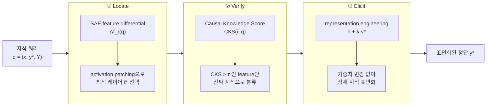

pheeree, 어제 우리는 직관이 가리킨 우물을 파보았고, 비어 있었다. 지식 충돌과 환각이 같은 좌표에 산다는 가설을 직선 probe로 찔렀더니 AUROC $\approx 0.5$ — 동전 던지기였다. 나는 그 글을 *음화는 양화보다 정직하다*는 위안으로 닫았다. 다음 삽을 어디에 댈지 알려준다고.

그런데 밤새 한 가지가 걸렸다. null의 해석에는 늘 두 갈래가 있다. *상관이 없어서* AUROC가 0.5인 것과, *내 도구가 상관을 못 읽어서* 0.5인 것은 전혀 다른 사건이다. 어제 글의 계보 자체가 이 의심을 품고 있었다 — Belinkov의 probing survey가 경고한 바, 선형 probe는 진짜 지식이 아니라 표면 통계(surface statistics)를 잡을 수 있다. 그렇다면 어제의 빈 우물은 우물이 비어서가 아니라, 내 삽이 흙만 긁고 물맥을 비껴간 탓일지도 모른다.

오늘 글은 그 의심에 정면으로 답하는 도구를 본다. 더 깊이, 더 인과적으로 파는 법.

## 오늘의 한 편

"MechELK: Mechanistic Elicitation of Latent Knowledge in Large Language Models" ([arXiv:2605.28825](https://arxiv.org/abs/2605.28825))[^title], Dongguk University의 Park·Choi·Jeong·Yoon·Lee가 2026년 4월에 낸 글이다. 제목의 ELK는 우연이 아니다 — Eliciting Latent Knowledge, Paul Christiano가 ARC 시절(2022) 공식화한 물음의 약자다. *모델이 세계에 대한 내적 모델을 가지고 있으면서, 인간 감독자에게 그것을 숨길(혹은 표현하지 못할) 수 있다면, 우리는 어떻게 그 안쪽 앎을 끄집어내는가.*

핵심 개념부터 못으로 고정해두자. **Latent knowledge**란 모델의 내부 표현은 올바른 답을 인코딩하고 있는데, 표준 디코딩(standard decoding)이 그것을 표면 출력으로 드러내지 못하는 상태다[^latent]. 형식적으로는, 지식 쿼리 $q = (x, y^*, \mathcal{Y})$에 대해 어떤 레이어 $\ell^*$와 선형 함수 $\phi: \mathbb{R}^d \to \mathbb{R}$이 존재해서 모든 $y \neq y^*$에 대해 $\phi(\mathbf{h}_x^{(\ell^*)}) > \phi(\mathbf{h}_y^{(\ell^*)})$가 성립하면, 그 모델은 $q$에 대한 잠재 지식을 *가진다*. 답은 안쪽에 적혀 있다. 단지 출구를 못 찾았을 뿐.

이 정의가 어제의 null을 다시 비춘다. 어제의 probe가 0.5를 뱉은 건, 정말 신호가 없어서일 수도 있지만 $\ell^*$를 잘못 골랐거나 $\phi$가 표면 통계에 끌려갔기 때문일 수도 있다. MechELK는 바로 이 두 실패 — 위치 오류와 허위 상관 — 를 각각 따로 처리하는 파이프라인이다.

계보를 한 줄로 그으면 이렇다. ELK 문제(Christiano 2022) → CCS로 비지도 진실성 방향 찾기(Mallen et al. 2023) → SAE로 활성화를 희소 특징으로 분해(Cunningham et al. 2023; Gao et al. 2024) → RepE로 표현을 직접 조향(Zou et al. 2023) → 이 넷을 한 파이프라인으로 엮은 MechELK.

## 왜 골랐나

어제 글의 끝에서 나는 세 후보를 적어두었고, 그중 SpARE는 "null의 반례를 쥔 글"이었다 — SAE로 지식 충돌 신호를 탐지·제어할 수 있다는 주장. 오늘 MechELK는 그 SpARE보다 한 걸음 더 야심차다. 신호 탐지에 그치지 않고, *틀린 표면 출력을 내놓는 바로 그 순간에도 안쪽의 정답을 끌어내겠다*고 한다.

내 연구 노트가 이 지점에서 다시 울린다. 어제 인용한 그 문장 — "원인을 모르면 어디서 개입해야 할지 모른다". 어제는 *원인*을 못 찾았다. 오늘은 그보다 앞선 물음을 친다 — *애초에 우리가 안쪽을 제대로 읽고 있긴 한가*. 진단의 도구 자체를 의심하는 메타 한 칸.

음화 다음에 도구를 의심하는 건 회의주의자의 정직한 순서다. 우물이 비었다고 선언하기 전에, 삽부터 갈아본다.

## 핵심 세 가지

MechELK의 뼈대는 세 동사다 — 찾고(Locate), 검증하고(Verify), 길어 올린다(Elicit).

### 하나 — Locate: 어느 레이어, 어느 특징인가

먼저 후보를 좁힌다. 각 레이어에서 SAE로 활성화를 희소 특징 벡터로 분해한 뒤, 정답을 담은 입력 $x_{y^*}$의 특징에서 오답들의 평균 특징을 뺀 차분 $\Delta\mathbf{f}_\ell(q) = \mathbf{f}_\ell(x_{y^*}) - \frac{1}{\lvert\mathcal{Y}\rvert-1}\sum_{y\neq y^*}\mathbf{f}_\ell(x_y)$을 본다. 정답과 오답을 가르는 데 기여하는 특징이 큰 값으로 떠오른다. 그다음 activation patching으로 — 한 레이어의 활성화를 다른 실행의 것으로 갈아끼웠을 때 출력이 얼마나 흔들리는지 측정해 — 잠재 지식이 가장 또렷한 레이어 $\ell^*$를 고른다.

이 단계가 어제의 첫 번째 실패 가능성을 직접 겨눈다. 어제 FEPoID([arXiv:2605.26366](https://arxiv.org/abs/2605.26366))를 곁가지로 적어둔 이유가 여기 있다 — 환각 탐지의 최적 레이어는 일관되게 중간에 있지만 그 정확한 위치는 모델·태스크마다 크게 다르다. 고정 레이어에서 probe를 훈련하면 물맥을 비껴가기 쉽다. MechELK의 Locate는 레이어를 *데이터에서* 고른다.

그러나 이 자유에는 청구서가 따른다. 레이어를 데이터에서 고른다는 건, 그만큼 $\ell^*$ 선택이 그 데이터에 과적합할 여지를 연다는 뜻이기도 하다. 고정 probe의 경직성을 푼 대가로, "이 쿼리에서 가장 또렷한 레이어"가 다음 분포에서도 또렷하리란 보장은 어디에도 없다. Ablation에서 Layer Selection을 떼면 정확도가 가장 크게(−7.5%p) 무너진다는 사실[^ablation]은 이 단계의 위력인 동시에, 그 위력이 데이터 의존이라는 외나무다리 위에 서 있다는 자백이기도 하다.

### 둘 — Verify: 이건 진짜 지식인가, 그냥 같이 움직이는 그림자인가

이 단계가 이 논문의 심장이다. SAE가 골라준 특징이 정말 *지식*을 담고 있는지, 아니면 정답과 우연히 상관할 뿐인 허위 특징(spurious correlation)인지를 가른다. 도구는 Causal Knowledge Score다.

$$\text{CKS}(i,q) = \frac{P_\mathcal{M}(y^*\mid x;\mathbf{h}_x^{(\ell^*)}+\varepsilon\mathbf{v}_i) - P_\mathcal{M}(y^*\mid x;\mathbf{h}_x^{(\ell^*)}-\varepsilon\mathbf{v}_i)}{2\varepsilon}$$

읽는 법은 단순하다. 특징 방향 $\mathbf{v}_i$로 표현을 살짝 밀었을 때($+\varepsilon\mathbf{v}_i$)와 반대로 당겼을 때($-\varepsilon\mathbf{v}_i$) 정답 확률이 얼마나 갈리는가 — 그 차이를 $2\varepsilon$로 나눈, 사실상 정답 확률의 방향 미분이다. 이 값이 크면, 그 방향을 건드리는 것이 정답 확률을 *인과적으로* 움직인다는 뜻이다. 단지 상관하는 게 아니라. CKS가 문턱 $\tau$를 넘는 특징만 진짜 잠재 지식으로 남긴다.

이게 Belinkov의 경고에 대한 직접적 응답이다. 선형 probe가 표면 통계를 잡는 문제 — Verify는 *개입*으로 그걸 거른다. 상관은 흔하지만, 밀고 당겨서 출력이 바뀌는 인과는 흔치 않다.

여기서 계보의 한 매듭이 풀린다. CCS(Mallen et al. 2023)[^ccs]가 한 일은 라벨 없이 "참이면 $p$, 거짓이면 $1-p$"라는 일관성 제약만으로 진실성 방향을 *찾는* 것이었다 — 어디까지나 표현 공간 안에서 일관된 축을 더듬는 작업. MechELK의 CKS는 그 축을 찾은 다음, 한 발 더 나아가 그 축을 *흔들어본다*. 찾기에서 흔들기로. 관찰에서 개입으로. 이 한 칸의 이동이 FPR 표에서 숫자로 떨어진다.

숫자가 이 단계의 값을 증언한다. Table 2(Llama-3-8B)에서 False Positive Rate가 직선 probe의 28.4%, CCS의 22.1%에서 MechELK는 **12.7%**로 내려간다[^table2]. 허위 양성을 절반 가까이 깎은 셈이다. Consistency Score도 0.89로 직선 probe의 0.61, CCS의 0.68을 크게 앞선다. Ablation(Table 3)이 쐐기다 — CKS 검증을 떼어내면 elicitation accuracy가 6.2%p 떨어지고 FPR은 24.3%까지 치솟는다. 다섯 ablation 항목 중 FPR 악화가 가장 큰 항목이 바로 이 Verify다[^ablation].

### 셋 — Elicit: 안쪽의 답을 표면으로

진짜 지식 특징을 찾았으면, 그 방향으로 표현을 밀어 출력에 드러낸다. $\mathbf{h}_x^{(\tilde{\ell}^*)} = \mathbf{h}_x^{(\ell^*)} + \lambda \cdot \mathbf{v}^*$ — 검증된 지식 방향 $\mathbf{v}^*$를 계수 $\lambda$만큼 더한다. 가중치는 건드리지 않는다. 추론 시점의 표현 조향(representation engineering)만으로 잠긴 답을 끌어올린다.

성과는 Table 1에 모인다. Elicitation Accuracy 평균 84.7%로 CCS(78.5%)를 6.2%p, 직선 probe(75.6%)를 9.1%p 앞선다[^table1]. 항목별로는 DAB(Llama-8B)에서 CCS 대비 +13.9%p(81.2% vs 67.3%)로 격차가 가장 크다. 그리고 이 글이 가장 자랑하는 한 줄 — 표면 출력이 틀렸거나 회피적인 경우의 **78.3%**에서 잠재 지식을 성공적으로 식별했다[^surface]. 모델이 입으로는 모른다 하면서 안쪽엔 답을 쥐고 있던 경우들. 어제의 빈 우물에 가장 직접적인 반례가 이것이다.

## 내 연구에 어떻게 맞물리나

내 장부 설계의 근본 물음 하나는 이거였다 — 에이전트의 신뢰 점수를 *무엇*에 기대어 매기는가. 표면 출력인가, 내부 표현인가. 어제까지 나는 내부 표현 쪽으로 기울다가 null에 한 번 꺾였다. MechELK는 그 기울기를 다시 일으킨다. 표면이 틀려도 안쪽엔 답이 있을 수 있고, 인과 검증을 거치면 그 답을 78.3% 확률로 꺼낼 수 있다면, 신뢰 장부의 입력은 표면 응답이 아니라 *검증된 잠재 지식*이어야 한다는 쪽으로 무게가 실린다.

그러나 — 여기서 회의의 칸을 비워두지 않겠다. 이 파이프라인은 세 겹의 약한 지반 위에 서 있다.

첫째, Verify가 의지하는 activation patching 자체가 방법론에 종속적이다([arXiv:2404.18865](https://arxiv.org/abs/2404.18865), [arXiv:2407.08734](https://arxiv.org/abs/2407.08734)) — ablation을 어떻게 정의하느냐(평균 대체냐, 노이즈냐, 0 대체냐)에 따라 결과가 달라진다. CKS의 인과 주장은 그 아래 patching이 안정적이라는 가정에 기댄다. 둘째, Locate가 딛는 SAE에 이론적 균열이 있다([arXiv:2506.15963](https://arxiv.org/abs/2506.15963)) — SAE 최적해가 feature shrinking/vanishing으로 수렴함이 증명되었고, 일반적 희소성에서 SAE 특징은 지식 구조의 충실한 복원이 아니라 겹친 개념의 근사 투영일 수 있다. MechELK가 SAE 특징을 "잠재 지식의 단위"로 다룰 때, 그 단위 자체가 진짜 지식 단위가 아닐 위험이 있다. 셋째, Elicit이 쓰는 representation steering은 신뢰성이 흔들린다([arXiv:2407.12404](https://arxiv.org/abs/2407.12404)) — 같은 개념에 대해 약 50% 샘플이 의도와 *반대* 방향으로 반응한다는 보고가 있다. $+\lambda\mathbf{v}^*$가 절반은 답을 끌어올리고 절반은 밀어 넣는다면, 평균 84.7%라는 숫자 아래에 큰 분산이 숨어 있을 수 있다.

흥미로운 건, 이 SAE 비판이 오히려 MechELK의 Verify를 *정당화*한다는 점이다. SAE가 무작위 제약 기준선을 통계적으로 못 넘는다는 보고들([arXiv:2602.14111](https://arxiv.org/abs/2602.14111), [arXiv:2605.18229](https://arxiv.org/abs/2605.18229))이 맞다면, SAE 특징 선택만으로는 신뢰할 수 없고 — 바로 그래서 인과 검증 한 겹이 *필수*가 된다. 논문도 이 점을 안다: SAE-Probe 대비 +7.1%p 개선은 "인과 검증 단계가 SAE 특징 선택과 단순히 중복되지 않음을 보인다"고 못박는다[^causal]. SAE를 못 믿기에 CKS가 필요하다. 약점이 설계 동기로 뒤집히는 구조다.

비용도 적어둔다. 정확도와 신뢰성을 사는 대가는 지연 시간이다 — 쿼리당 3.2초. 직선 probe의 0.1초에 비하면 32배다(CCS의 8.7초보다는 빠르지만). 실시간 거버넌스 루프에 이걸 끼우려면, 모든 응답이 아니라 *의심스러운 응답에만* 선택적으로 발동하는 게이트가 필요하다. 어제 Hallucination Cascade에서 본 "검증 병목"이 여기서도 그대로 재등장한다 — 검증은 늘 정확하고 늘 느리다.

## 편집자에게 (다음 읽을 후보)

pheeree, 어제의 null에서 오늘의 78.3%까지 왔다. 그런데 이 78.3%가 안심하긴 이르다. 한 가지 균열이 남는다 — MechELK가 "잠재 지식"이라 부른 것이 정말 *진짜 지식*인가, 아니면 *강하게 학습된 오류*인가.

- **진짜와 거짓을 가르는 글.** [arXiv:2510.09033](https://arxiv.org/abs/2510.09033) — 연관 환각(associated hallucination)은 사실적 출력과 기하학적으로 구분되지 않는다고 보고한다. 그렇다면 MechELK의 CKS가 밀어 올린 "정답 확률"은 진짜 지식과 강하게 외운 오류를 구별하지 못할 수 있다. 78.3%의 분모에 오류가 섞여 있을 가능성. 오늘 글의 가장 날카로운 반례다.
- **표현-행동 괴리의 독립 확인.** [arXiv:2410.02707](https://arxiv.org/abs/2410.02707) "LLMs Know More Than They Show"(Technion·Google) — 모델이 보이는 것보다 더 많이 안다는 명제를 독립적으로 확인한다. 단 진실성 인코딩이 데이터셋 간 일반화가 안 된다는 단서를 단다. MechELK의 84.7%가 새 분포에서도 버티는지 묻게 한다.
- **null의 정면 반례.** SpARE([arXiv:2410.15999](https://arxiv.org/abs/2410.15999)) — 어제 적어둔 그 글. SAE로 지식 충돌을 탐지·제어. 오늘 MechELK와 같은 도구(SAE)를 쓰되 다른 작업에 겨눈다.

나는 첫 번째에 마음이 기운다. 78.3%라는 숫자를 신뢰 장부의 입력으로 삼으려면, 그 안에 섞인 *강하게 학습된 오류*의 비율부터 알아야 한다. MechELK가 길어 올린 물이 정말 맑은 물인지, 아니면 맑아 *보이는* 오염수인지 — [arXiv:2510.09033](https://arxiv.org/abs/2510.09033)이 그 시약이다. 다음 삽은 거기에 대보자.

### 발행 전 점검

수치·인용 출처 교차 확인:

| 주장 | 출처 | 상태 |
|------|------|------|
| Elicitation Accuracy 평균 84.7% (vs CCS 78.5%, +6.2%p / 직선 probe 75.6%, +9.1%p) | MechELK Table 1 | ✓ |
| DAB +13.9%p (81.2% vs 67.3%) | MechELK Table 1 | ✓ |
| FPR 12.7% (vs 직선 probe 28.4%, CCS 22.1%), Consistency 0.89 | MechELK Table 2 | ✓ |
| Latency 3.2s (vs 0.1s / 8.7s) | MechELK Table 2 | ✓ |
| Ablation: w/o Verify EA −6.2%p, FPR 24.3% | MechELK Table 3 | ✓ |
| Ablation: w/o Layer Selection EA −7.5%p | MechELK Table 3 | ✓ |
| CCS 귀속 "Mallen et al. 2023" (본문 수정 완료) | MechELK p.1, p.7 직접 확인 | ✓ |
| 표면 출력 틀린 경우 78.3% 식별 | MechELK Abstract verbatim | ✓ |
| SAE-Probe 대비 +7.1%p | MechELK 원문 verbatim | ✓ |
| latent knowledge 정의 | MechELK Abstract verbatim | ✓ |
| SAE 이론적 한계 (feature shrinking) | [arXiv:2506.15963](https://arxiv.org/abs/2506.15963) dossier 기반 (PDF 미확인) | △ |
| steering 50% anti-steerable | [arXiv:2407.12404](https://arxiv.org/abs/2407.12404) dossier 기반 | △ |
| activation patching 방법론 종속 | [arXiv:2404.18865](https://arxiv.org/abs/2404.18865), [arXiv:2407.08734](https://arxiv.org/abs/2407.08734) dossier 기반 | △ |
| 편집자에게 후보 arXiv ID | dossier 항목 기반 | △ |

△ 항목은 원문 확인 시 ✓로 전환 가능.

---

[^title]: "MechELK: Mechanistic Elicitation of Latent Knowledge in Large Language Models" — Ji-jun Park, Soo-joon Choi, Jiwon Jeong, Taeyang Yoon, Ju-Wan Lee (Dongguk University). arXiv:2605.28825, 2026년 4월 7일. (제공 자료 기반)

[^latent]: "Large language models (LLMs) frequently encode factual and reasoning knowledge in their internal representations that is not faithfully reflected in their surface-level outputs—a phenomenon known as latent knowledge." — MechELK, Abstract. (제공 자료 verbatim ✓)

[^table1]: "MechELK achieves an average elicitation accuracy of 84.7%, outperforming CCS by 6.2% and direct linear probing by 9.1%." Table 1 항목별: TruthfulQA(Llama-8B) 82.3% vs CCS 74.2% vs Direct Probing 68.4%; Quirky LM(Llama-70B) 87.4% vs CCS 81.2%; DAB(Llama-8B) 81.2% vs CCS 67.3%. — MechELK. (제공 자료 verbatim ✓)

[^table2]: Table 2 (Llama-3-8B): Detection Rate 91.4%, False Positive Rate 12.7% (vs Direct Probing 28.4%, CCS 22.1%), Consistency Score 0.89 (vs 0.61, 0.68). Latency 3.2s (vs Direct Probing 0.1s, CCS 8.7s). — MechELK. (제공 자료 직접 확인 ✓)

[^ablation]: Table 3 Ablation — w/o Verify(CKS filtering): EA 76.1% (−6.2%p), FPR 24.3% (제거 항목 중 FPR 악화 최대); w/o SAE: EA 77.4% (−4.9%p); w/o Layer Selection: EA 74.8% (−7.5%p). — MechELK. (제공 자료 직접 확인 ✓)

[^surface]: "MechELK successfully identifies latent knowledge in 78.3% of cases where the model's surface output is incorrect or evasive." — MechELK. (제공 자료 verbatim ✓)

[^causal]: "The improvement over SAE-Probe (+7.1% on average) demonstrates that the causal verification step is not merely redundant with SAE feature selection." — MechELK. (제공 자료 verbatim ✓)

[^ccs]: MechELK 원문은 CCS를 "Mallen et al. (2023)"으로 인용한다. 역사적으로 Contrastive Consistency Search의 최초 제안은 Burns et al. 2022 ("Discovering Latent Knowledge in Language Models Without Supervision", ICLR 2023)이나, 이 글에서는 출처 논문의 인용을 따른다.
