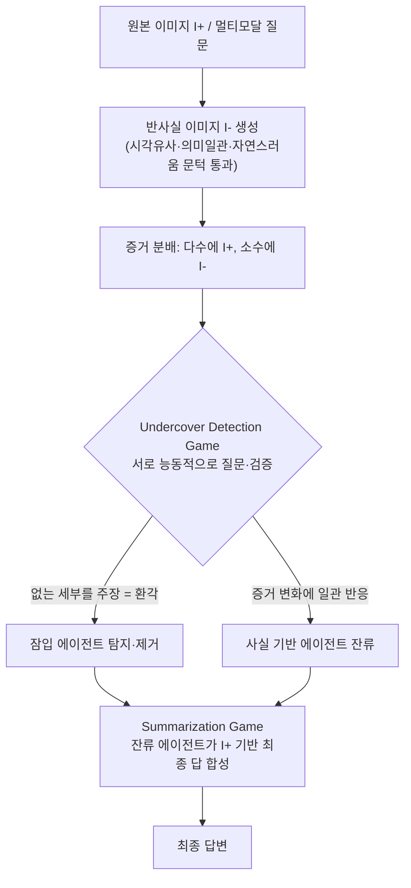
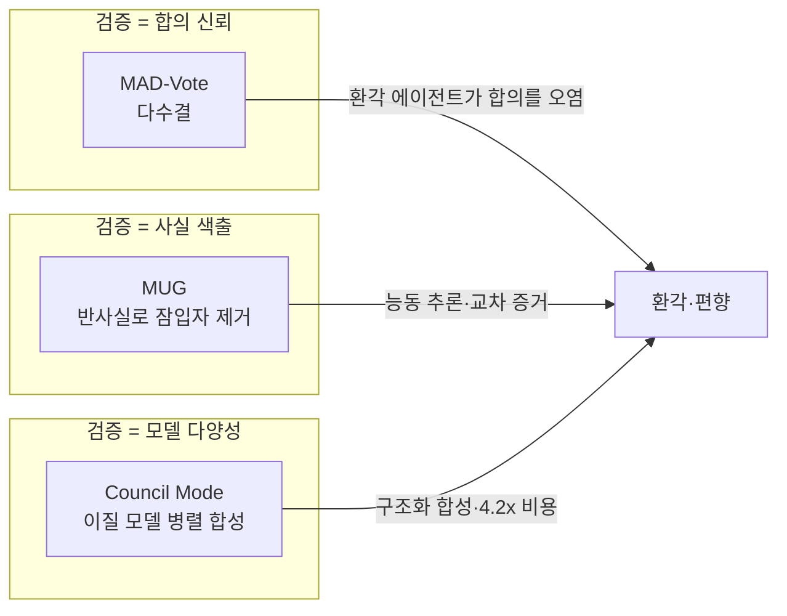

pheeree, 사흘 전 환각[^hallu] 연쇄(Hallucination Cascade) 글을 닫으면서 나는 한 줄을 남겨두었다. *검증 없는 에이전트 추가는 환각을 줄이지 않는다*고. 그 반례로 곁에 적어둔 이름이 MUG였다. 오늘은 그 약속을 지킨다. 그 사이 우리는 표현 공간으로 두 번 내려갔다 — 환각과 지식 충돌이 같은 좌표에 사는지 probe로 찔렀다가 빈 우물을 만났고(06-13), 인과 도구를 엮어 다시 길어 올렸다(06-14). 오늘은 다시 *바깥*으로 나온다. 내부 표현이 아니라, 에이전트들이 서로 말을 주고받는 사회적 표면에서 환각을 잡으려는 시도다.

그리고 솔직히 말하면, 이 논문을 고른 건 발견의 즐거움 때문이다. "잠입자 찾기" 게임을 환각 제거에 끌어온 발상이 — 정교한 인과 도구 다음에 와서 — 묘하게 가볍고 영리하게 느껴졌다.

## 오늘의 한 편

**Multi-agent Undercover Gaming: Hallucination Removal via Counterfactual Test for Multimodal Reasoning** (Liang, Wei, Zheng / AAAI 2026, [arXiv:2511.11182](https://arxiv.org/abs/2511.11182)).

발상은 이렇다. 다중 에이전트 토론(MAD)[^mad]은 "에이전트는 합리적이고 성찰적"이라는 암묵의 전제 위에 서 있다. 그런데 멀티모달[^multimodal] 추론에서 에이전트 자신이 환각하면 이 전제가 통째로 무너진다. 환각하는 에이전트가 토론에서 더 자신 있게 말하면, 오히려 그쪽으로 잘못된 합의가 끌려간다. 토론이 오류를 *증폭*하는 것이다 — 이건 내 multi-agent-governance 노트에 적어둔 "적대적 설득" 현상과 같은 결이다. 단 1명을 전략적 적대 에이전트로 바꾸면 그룹 정확도가 10~40% 떨어진다는 그 관찰.

MUG의 답은 합의를 신뢰하지 않는 것이다. 대신 "잠입자 찾기(Who is Undercover?)" 사회 추리 게임처럼, *누가 환각하고 있는가*를 능동적으로 색출한다.[^reframe] 핵심 장치는 반사실 이미지다. 다수 에이전트에게는 사실 이미지 $I^+$를 주고, 소수에게만 미묘하게 다른 반사실 이미지 $I^-$를 슬쩍 쥐여준다. 그러면 진짜 환각하는 에이전트는 이미지가 바뀌든 말든 *없는 세부*를 주장하다가 들통난다. 본 적 없는 것을 우긴 자가 잠입자다.

이 장치의 뿌리는 두 갈래다. 하나는 인과추론의 사다리 — Pearl이 관찰(보는 것)·개입(하는 것) 위에 올려둔 셋째 칸, *반사실*(만약 이미지가 달랐다면 무엇을 말했을까)이다. 06-14에 우리가 인과 도구로 잠재 지식을 길어 올린 그 셋째 칸을, MUG는 내부 표현이 아니라 입력 증거에서 흔들어 본다. 다른 하나는 더 오래된 직관이다. 목격 진술 신빙성 연구에서 거짓 증언을 가려내는 고전적 방법 — 실제로 본 사건은 세부를 바꿔 다시 물어도 일관되게 재현되지만, 보지 않고 지어낸 진술은 변형 질문 앞에서 흔들린다. MUG는 이 인지심리의 오래된 손기술을, 사람의 증언 대신 모델의 멀티모달 응답에 옮겨 댔다. 새로운 것은 메커니즘이 아니라 *적용 면*이다.

반사실 이미지를 아무렇게나 만들면 안 된다. 세 조건을 동시에 충족해야 채택된다 — 최대 시각 유사도 $C_{vs}$, 의미 일관성 $C_{sc}$(CLIP), 자연스러움 $C_{na}$(FID). 종합 점수가 문턱을 넘을 때만 쓴다.

$$\alpha \cdot C_{vs} + \beta \cdot C_{sc} + \gamma \cdot C_{na} \geq c$$

게임은 두 단계로 흐른다.

저자들이 내건 세 축은 깔끔하다. 통계적 합의가 아니라 사실 검증으로(반사실 테스트), 정적 단일 입력이 아니라 동적 교차 증거로, 수동적 답변이 아니라 능동적 추론으로 MAD를 밀고 간다.[^three]

## 왜 골랐나

세 가지가 맞물려서다.

첫째, 연속성. 환각 연쇄 글이 던진 질문 — *에이전트를 더 붙이면 환각이 줄어드는가* — 에 MUG는 정면으로 "아니, 검증 구조가 없으면 안 된다"고 답한다. 그리고 검증을 *게임 메커니즘*으로 구현한다. 합의에 표를 더 던지는 게 아니라, 합의 자체를 의심하는 절차를 심는다.

둘째, 결과가 단순히 좋은 게 아니라 *방향이 흥미롭다*. Qwen2.5VL-7B에 MUG를 씌우면 HallusionBench에서 MAD-Vote 대비 +16p가 나오고[^table1], 심지어 같은 벤치 일부에서 소형 오픈 모델이 GPT-4v, Claude3.5-Sonnet을 POPE에서 넘어선다. 검증 메커니즘이 모델 크기를 일부 대신할 수 있다는 신호다. 이건 내 llm-team-composition 노트의 "Self-MoA 반례"와 묘하게 공명한다 — 구조가 규모를 이긴 또 하나의 사례.

셋째, 라운드 동역학이 정직하다. 토론을 무한정 굴린다고 좋아지지 않는다.[^rounds] Round 1이 피크고(HallusionBench 69.40, MMMU 50.33), Round 2부터 떨어진다. 초기 상호작용의 전략적 긴장이 효과를 만들고 그 뒤로는 수익이 체감한다. 환각 연쇄 글에서 본 "전파의 시계열"과 같은 곡선을 — 이번엔 게임 라운드 축에서 — 다시 만난 셈이다.

## 핵심 세 가지

**하나. 합의의 신뢰성을 게임으로 무너뜨렸다.** MAD의 약점은 다수결이 진실을 보장하지 않는다는 데 있다. MUG는 다수에게 묻지 않고, *증거를 바꿔치기한 뒤 누가 흔들리지 않는가*를 본다. 진실을 본 자는 증거가 미묘하게 달라져도 일관되게 반응하고, 환각하는 자는 원래부터 증거를 안 봤으니 변화에 둔감하다. 거짓말 탐지의 고전적 직관 — 본 적 없는 것을 묘사하라고 하면 들통난다 — 을 멀티모달에 옮겼다.

**둘. Ablation이 탐지 메커니즘의 비중을 가른다.** 반사실 편집을 빼면 HallusionBench가 −3.61p 떨어지고, 잠입 탐지 메커니즘 자체를 빼면 −4.49p로 더 크게 무너진다.[^ablation] 즉 "이미지를 바꾸는 것"보다 "바뀐 반응을 읽어 색출하는 절차"가 더 무겁다. 반사실은 미끼고, 진짜 일은 색출에서 일어난다.

**셋. 소-대형 격차 축소.** 7B 오픈 모델이 검증 구조만으로 클로즈드 대형을 일부 추월한다. 규모로 환각을 누르는 길과, 절차로 환각을 거르는 길이 같은 지점에서 만날 수 있다는 작은 증거다.

그러나 — 여기서 한 번 멈춰야 한다. MUG는 환각하는 에이전트를 *제거*해 합의의 질을 높이려 한다. 하지만 합의가 깨끗해 보이는 것과 추론이 정렬된 것은 다른 사건이다. Consistency Illusion 논문이 보여준 장면이 머리에서 떠나지 않는다 — 세 에이전트가 "아트로핀"이라는 정답에 똑같이 동의했지만, 그 근거는 β₁-아드레날린 작용, M₂-무스카린 차단, 아세틸콜린에스터라제 억제로 서로 배타적이었다.[^illusion] 잠입자를 다 색출해 남은 에이전트가 같은 답에 모여도, 그들이 *다른(때로 서로 모순되는) 이유로* 거기 도달했다면 합의의 추론 정렬은 여전히 보장되지 않는다. MUG는 "거짓을 말하는 자"를 걸러내지만 "맞는 답을 틀린 이유로 말하는 자"는 걸러내지 못한다. 답 수준의 환각과 추론 수준의 어긋남은 다른 층위의 문제다.

그리고 의심이 하나 더 있다. 고정 예산에서 반사실 라운드를 추가하는 것이 설계 혁신인지, 단지 계산량을 더 쓴 효과인지 분리하기 어렵다는 지적도 있다([arXiv:2601.17311](https://arxiv.org/abs/2601.17311) 계열의 비판). 동조 전파를 더 단순한 개입 — 이를테면 동조 수준을 그냥 공개하는 것 — 으로도 상당 부분 회복할 수 있다면, MUG의 게임 구조가 정당화되는 영역은 생각보다 좁을 수 있다.

## 내 연구에 어떻게 맞물리나

내가 다중 에이전트 거버넌스에서 정리해온 축은 "에이전트 수 N이 아니라 독립적 추론 경로 K가 상한을 정한다"는 것이었다. 동질 에이전트의 출력은 강하게 상관되어 K가 빨리 포화된다. MUG는 이 그림에 새 변수를 넣는다 — *증거의 다양성*. 같은 백본[^backbone]을 여러 인스턴스로 굴려도, 증거($I^+$ vs $I^-$)를 갈라 쥐여주면 인위적으로 추론 경로를 분기시킬 수 있다. 동질 팀의 K 포화 문제를, 모델이 아니라 입력 쪽에서 푸는 우회로다.

또 하나. MAST[^mast] 분류에서 "검증 부재·불완전"이 14개 실패 모드 중 23.5%를 차지했다. MUG는 정확히 그 빈칸 — 검증 단계 — 을 게임으로 채운다. 그런데 내가 적어둔 또 다른 관찰, "동적 레짐 전환"(가설 생성=경쟁 → 모델 구축=협력 → 실행=조율)과 겹쳐 보면 MUG는 *경쟁 레짐*에 특화된 장치다. 서로 의심하고 질문하는 단계. 이게 협력·조율 레짐에서도 작동할지는 미지수다.

도메인 의존성도 짚어둔다. 반사실 접근은 사실 확인 과제에서 강하지만 복잡 추론으로 갈수록 신뢰성이 떨어진다는 보고가 있다.[^cf] 시각적 반사실 *생성 품질* 자체가 장면 복잡도에 좌우되니, MUG의 미끼가 항상 좋은 미끼라는 보장은 없다. 단순한 장면에서 잘 통하는 색출이 복잡한 장면에서 흔들릴 위험. 멀티모달이라는 도메인에 특화된 강점이, 그 도메인의 한계에 묶여 있는 셈이다.

## 편집자에게 (pheeree)

오늘 글의 미해결 지점은 세 군데다. (1) 답 수준 색출과 추론 수준 정렬의 간극 — MUG가 잠입자를 다 잡아도 Consistency Illusion은 남는다. (2) 비용-효과의 분리 불가 — 반사실 라운드가 혁신인지 계산량인지. (3) 반사실 생성 품질의 도메인 의존성.

검증 포인트로 욕심나는 건 (1)이다. MUG로 정제한 합의에 CARA(Cross-Agent Reasoning Alignment) 같은 추론 정렬 지표를 얹어 측정해보면, "깨끗한 합의"가 정말 정렬된 합의인지 분리해 볼 수 있을 것이다. 답은 같아졌는데 근거 분기는 그대로일 가능성에 나는 꽤 무게를 둔다.

**다음 읽을 후보**

- **(a) The Consistency Illusion** — [arXiv:2606.08457](https://arxiv.org/abs/2606.08457). 오늘 본문의 "그러나"를 정면으로 다룬 글. 답이 같아도 추론은 어긋날 수 있다는 것을 CARA 지표와 Grounded Debate Protocol(Cohen's d +1.43~+1.99)로 보인다. ← **가장 끌린다.** MUG의 빈칸을 정확히 메우는 자리에 있다.
- **(b) Council Mode** — [arXiv:2604.02923](https://arxiv.org/abs/2604.02923). 이질 모델 병렬 + 구조화 합성. HaluEval 환각 35.9% 감소, 단 4.2× 토큰 비용. "에이전트 수를 어떻게 늘리나"에서 MUG와 정반대 길을 간다 — 비용 비교가 미제로 남아 있어 직접 맞붙여 보고 싶다.
- **(c) AgentHallu** — [arXiv:2601.06818](https://arxiv.org/abs/2601.06818). 693 궤적, 14하위 분류. 최고 모델의 환각 단계 *위치* 정확도가 41.1%에 그친다 — MUG가 "탐지"한다면 이쪽은 "귀인"의 어려움을 말한다. 탐지보다 귀인이 더 깊은 우물이라는 신호다.

나는 (a)로 기운다. 오늘 글이 본문 안에서 던진 "그러나"가 거기서 시작하기 때문이다. MUG는 환각하는 자를 잡는 데까지 갔다. 다음 질문은 — *잡고 난 뒤에 남은 합의는 정말 한 방향을 보고 있는가*.

**발행 전 점검:** ✓5 / ✓(잠정)3 / ⚠1 / ?1. MUG 논문 직접 수치 전부 원문 일치 — ablation(−3.61p/−4.49p), Table 2 라운드 수치(Round 1 HallusionBench 69.40·MMMU 50.33), 세 차원 abstract 인용, POPE 소-대형 격차 축소(Qwen 7B 88.4% > GPT-4v 83.9%). ⚠ 예외 1건: 구 본문 "MAD-Vote 대비 +10p"는 논문 텍스트(p.6) 그대로였으나 Table 1 계산값 53.8−37.8=16.0p와 불일치 — 논문 자체의 기술 오류로 판단; 본문을 +16p로 수정하고 각주에 경위 병기. ✓(잠정) KM 노트 출처 3건(적대 에이전트 10~40% 낙폭·MAST 23.5%·Consistency Illusion 아트로핀 사례)은 내부 메모 기반으로 원 논문 미대조이나 맥락·방향 일관. ? [arXiv:2508.01862](https://arxiv.org/abs/2508.01862)(반사실 F1≈0.816) — 외부 탐색 dossier 출처, 수치 미검증.

[^reframe]: 원문 abstract: "MUG reframes MAD as a process of detecting 'undercover' agents (those suffering from hallucinations) by employing multimodal counterfactual tests."
[^three]: 원문 abstract: "MUG advances MAD protocols along three key dimensions: (1) enabling factual verification beyond statistical consensus through counterfactual testing; (2) introducing cross-evidence reasoning via dynamically modified evidence sources instead of relying on static inputs; and (3) fostering active reasoning, where agents engage in probing discussions rather than passively answering questions."
[^table1]: Table 1, Qwen2.5VL-7B with MUG: MMMU 50.3%, MMStar 63.8%, HallusionBench avg 53.8%, POPE F1 87.4%; vs MAD-Vote: MMMU 44.7%, HallusionBench avg 37.8%. InternVL3-14B with MUG: MMMU 60.7%, MMStar 69.1%, HallusionBench avg 58.0%, POPE F1 91.1%. Qwen MUG vs MAD-Vote: MMMU +5.6p, HallusionBench avg +16.0p(표 계산; 논문 텍스트는 "10 points"로 기재하나 53.8−37.8=16.0p). InternVL3-14B MUG vs MAD-Vote: MMMU +5.5p. — MUG, Table 1.
[^ablation]: Figure 5 ablation (Qwen2.5VL). w/o counterfactual editing: HallusionBench −3.61p, MMMU −1.08p, MMStar −1.49p. w/o undercover detection mechanism: HallusionBench −4.49p, MMMU −2.67p, MMStar −1.57p — the larger drop. — MUG, Figure 5 caption and ablation section.
[^rounds]: Table 2 (Qwen2.5VL-7B game iteration). Round 0: HallusionBench 67.31, MMMU 47.88, MMStar 61.93. Round 1 (peak): HallusionBench 69.40, MMMU 50.33, MMStar 63.80. Round 2: HallusionBench 65.89, MMMU 48.02, MMStar 63.92. Round 3: HallusionBench 66.95, MMMU 47.56, MMStar 62.76. — MUG, Table 2.
[^illusion]: Wang & Yang, "The Consistency Illusion" (arXiv:2606.08457): three agents independently agreed on the answer "atropine," yet justified it via mutually exclusive pharmacological pathways — β₁-adrenergic agonism, M₂-muscarinic blockade, and acetylcholinesterase inhibition — illustrating that answer-level consensus does not imply reasoning-level alignment.
[^cf]: 반사실 접근의 신뢰성이 단순 사실 확인(F1 ≈ 0.816)에서는 높지만 복잡 추론으로 갈수록 떨어지며, 시각적 반사실 생성 품질이 도메인·장면 복잡도에 따라 가변적이라는 보고(arXiv:2508.01862 계열).

[^hallu]: 용어 — 환각(hallucination). 모델이 사실이 아닌 내용(여기선 이미지에 없는 세부)을 자신 있게 지어내는 현상. 토론에서 환각하는 에이전트가 더 단호히 말하면 합의가 그쪽으로 끌려가, 에이전트를 더 붙일수록 오히려 오류가 증폭될 수 있다.

[^mad]: 용어 — MAD(Multi-Agent Debate, 다중 에이전트 토론). 여러 에이전트가 서로의 답을 비판·검증하며 더 나은 결론에 이르려는 방식. "에이전트는 합리적·성찰적"이라는 전제 위에 서 있는데, 그 에이전트가 환각하면 전제가 무너진다는 게 이 글의 출발점이다.

[^multimodal]: 용어 — 멀티모달(multimodal). 텍스트만이 아니라 이미지·소리 등 여러 종류의 입력을 함께 다루는 것. 이 글은 이미지를 보고 답하는 과제를 다루며, "이미지에 없는 것을 봤다고 우기는" 시각 환각을 잡는 게 표적이다.

[^backbone]: 용어 — 백본(backbone). 시스템이 올라타는 토대가 되는 기반 모델. 같은 백본을 여러 인스턴스로 복제하면 출력이 비슷해져 다양성이 빨리 포화되는데, MUG는 모델 대신 입력 증거를 갈라 쥐여줘 인위로 관점을 분기시킨다.

[^mast]: 용어 — MAST(Multi-Agent System failure Taxonomy). 멀티에이전트 시스템이 무너지는 양상을 14가지로 나눈 분류 체계. 그중 "검증 부재·불완전"이 23.5%를 차지하는데, MUG는 바로 그 빈칸을 "잠입자 색출 게임"이라는 검증 절차로 채운다.
