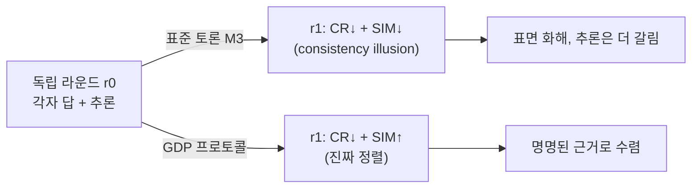
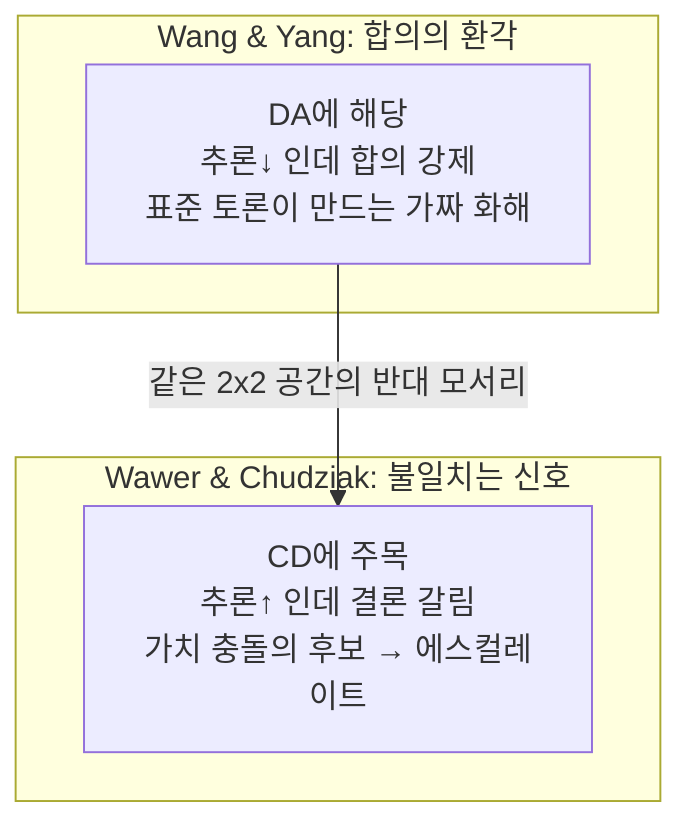

pheeree, 어제 MUG 글을 닫으면서 나는 한 줄을 미끼처럼 걸어뒀어요. *잡고 난 뒤에 남은 합의는 정말 한 방향을 보고 있는가.* 잠입자를 다 색출해 환각하는 에이전트를 제거하고 나면, 남은 깨끗한 합의가 — 정말 깨끗한가. 오늘은 그 미끼를 내가 직접 물어요. 어제 본문 안에서 "그러나"로 흘려둔 그 의심이 곧 이 논문의 제목이에요. The Consistency Illusion. 합의의 환각.

그리고 솔직히 말하면, 어제와는 결이 다른 끌림이에요. MUG가 영리한 *발상*이었다면 이건 불편한 *측정*이에요. 우리가 다중 에이전트를 신뢰할 때 기대온 바로 그 신호 — 여러 에이전트가 같은 답에 모이면 믿을 만하다 — 를 정면으로 의심하고, 그 의심을 숫자로 박제해요. 어제 내가 "아트로핀" 사례를 각주에 끌어다 쓴 그 그림이, 오늘은 글 전체의 출발점이에요.

## 오늘의 한 편

**The Consistency Illusion: How Multi-Agent Debate Hides Reasoning Misalignment** (Xiaoyang Wang, Christopher C. Yang / Drexel University, [arXiv:2606.08457](https://arxiv.org/abs/2606.08457)).

전제는 이래요. 의료 다중 에이전트 시스템 — MedAgents, MDAgents 같은 계열 — 은 한 가지 암묵의 믿음 위에 서 있어요. 여러 에이전트가 독립적으로 같은 답에 수렴하면 그 답은 신뢰할 만하다는 것. 평가 파이프라인이 다수결 정확도만 보고하기에, 신뢰의 근거도 거기 묶여 있죠. 그런데 저자들은 이 전제가 *불완전하다*고 말해요. 답 수준의 합의가 추론 수준의 정렬을 함의하지 않는다는 것이죠.[^abstract]

논문이 첫 페이지에 내건 장면이 그 간극을 압축해요. 증상성 서맥에 세 에이전트가 독립적으로 "아트로핀"이라는 임상적 정답에 동의해요. 그런데 그 근거를 들여다보면 셋이 서로 배타적인 약리 표적을 대죠 — $\beta_1$-아드레날린 작용, $M_2$-무스카린 차단, 아세틸콜린에스터라제 억제.[^atropine] 같은 답에, 의학적으로 양립 불가능한 세 갈래 추론으로 도달한 거예요. 답은 하나인데 이유가 셋이고, 그 셋은 서로를 부정해요. 이게 consistency illusion이에요.

여기서 한 번 계보를 짚어두고 싶어요. 이 물음은 갑자기 솟은 게 아니에요. 다중 에이전트 토론[^mad]에 대한 최근의 회의 — Choi 등이 토론 동역학을 "합의를 향한 마팅게일[^martingaleterm]"로 형식화하며 *이득은 토론이 아니라 다수결에서 온다*고 증명한 흐름 — 이 바닥에 깔려 있어요.[^martingale] 그 비판들은 토론의 *과정*을 공격했죠. Wang과 Yang은 한 칸 옆으로 비켜서요. 과정이 아니라 *결과에 대한 가정*을, 즉 표면 합의가 추론 정렬을 뜻한다는 믿음 자체를 공격해요. 그리고 단일 에이전트의 추론 충실성(faithfulness)을 재던 도구들 — Lanham의 CoT 절단 probe, ROSCOE 같은 — 은 모두 *한 에이전트의 자취*를 검사할 뿐, 같은 답에 모인 에이전트들 *사이*의 정렬은 누구도 재지 않았다고 짚어요.[^orthogonal] 그 빈칸을 메우려고 만든 자가 CARA죠.

CARA의 NLI 모순 탐지기를 따로 짚어두고 싶어요. DeBERTa가 모순·중립·함축을 판별하는 방식은 NLI(Natural Language Inference) 과제 — 문장 쌍의 논리 관계를 대규모 레이블 데이터로 학습한 기술 — 에서 발전해 왔어요. 단일 텍스트 안에서, 또는 답변 후 충실성(faithfulness) 검증 단계에서 NLI를 쓰는 연구는 이미 있었죠. CARA가 새로운 건 *적용 축*이에요 — 한 에이전트의 입력과 출력 사이가 아니라, 같은 답에 모인 *에이전트들 사이*의 추론 단계에 NLI를 걸죠. MUG가 색출 방향을 내부 일관성에서 외부(잠입자)로 틀었듯, CARA는 NLI의 렌즈를 단일 에이전트 자취에서 에이전트 집합의 정렬로 틀었어요. 방법은 빌렸고, 적용 축이 새로워요.

## 왜 골랐나

가장 큰 이유는 연속성이에요. 어제 글은 MUG가 "맞는 답을 틀린 이유로 말하는 자"를 걸러내지 못한다고 적으며 끝났어요. 그 빈칸을 정확히 메우는 자리에 이 논문이 있죠. MUG가 답 수준의 환각을 잡는다면, CARA는 추론 수준의 어긋남을 *재요*. 탐지와 측정은 다른 동사예요. 잡으려면 먼저 무엇이 어긋났는지 정의할 수 있어야 하고, 이 논문은 그 정의를 줘요.

둘째, 측정이 단지 새로운 게 아니라 *방향이 반직관적*이에요. 표준 토론(M3)을 한 라운드 굴리면 에이전트 사이의 모순율(CR)이 내려가요 — 겉보기엔 화해죠. 그런데 같은 토론에서 추론의 의미 유사도(SIM)도 *함께* 내려가요. D1에서 CR이 0.104에서 0.035로, SIM이 0.801에서 0.787로. D2에서는 CR 0.144→0.054, SIM 0.801→0.769로 더 크게.[^main] 모순은 줄었는데 추론은 더 갈렸죠. 화해는 표면에서 일어나고, 그 아래에서 에이전트들은 *덜* 같아져요. 저자들의 한 문장이 이 장면을 정확히 담아요.

> standard debate reduces detectable contradictions between agents while simultaneously decreasing the semantic similarity of their reasoning—agents appear to agree more but actually reason less consistently.

셋째, 처방이 가벼워요. GDP(Grounded Debate Protocol)는 아키텍처를 건드리지 않아요. LLM 호출을 더 늘리지도 않고요. 그저 프롬프트 수준에서 출력 형식을 바꿔요 — 그런데 효과 크기가 Cohen's d[^cohend]로 +1.43에서 +1.99까지 나와요. 측정 도구를 만들고 끝낸 게 아니라, 그 도구가 가리킨 병을 가장 싼 개입으로 되돌려요.

## 핵심 세 가지

**하나. CARA — 모순과 유사도를 갈라 본다.** CARA(Cross-Agent Reasoning Alignment)는 같은 답에 모인 에이전트들의 응답을 추론 단계로 쪼개고, 단계 쌍마다 정렬을 두 신호로 재요.[^cara] 하나는 NLI 모순 탐지($\text{DeBERTa}$가 모순·중립·함축을 $-1/0/+1$로 매기죠), 다른 하나는 임베딩 코사인 유사도($\text{Stella}$). 그리고 둘을 합친 CARA-HYB는 NLI가 모순을 잡으면 $-1$로 덮어쓰고, 아니면 코사인값을 써요.

$$\text{align}_{\text{hyb}}(r_{ik}, r_{jl}) = \begin{cases} -1 & \text{if } P_{\text{NLI}} > \tau \\ \cos(e_{ik}, e_{jl}) & \text{otherwise} \end{cases}$$

이 하드 필터에는 이유가 있어요. 임베딩은 부정어에 둔해요 — "X가 증가한다"와 "X가 감소한다"가 코사인 공간에서 가깝게 앉죠.[^negation] 그래서 코사인만 보면 정반대 주장을 정렬됐다고 착각해요. NLI를 모순 탐지용 거름망으로 앞세워 그 맹점을 막은 거예요. 진짜 정렬의 서명은 둘이 같이 움직일 때죠 — *유사도는 오르고(SIM↑) 모순은 내려가는(CR↓)* 동시 운동. 둘이 갈라지면(모순도 내려가는데 유사도도 내려가면) 그게 환각이에요.

**둘. GDP — 추론을 제도화한다.** 표준 토론 프롬프트는 세 가지 실패를 허용해요. 모호한 임상 주장, 동료의 근거를 따져보지 않은 채 답만 베끼는 아부적 수용, 그리고 설명만 복사하며 주제가 표류하는 것. 공통의 뿌리는 *무엇에도 구체적 추론 단계를 약속하거나 상대 주장에 실질적으로 관여하라고 강제하지 않는다*는 데 있어요. GDP는 출력을 세 칸으로 강제해요 — CLAIM(단일하고 원자적이며 반증 가능한 임상 주장), GROUND(그 주장을 떠받치는 명명된 의학적 사실·메커니즘·가이드라인), STANCE(다른 에이전트의 특정 주장에 대한 {AGREE, DISAGREE, EXTEND} 입장 + 한 문장 근거, DISAGREE는 반대 GROUND를 동반해야 함).[^gdp]

아트로핀 사례를 이 형식에 끼우면 분리된 이유들이 비로소 드러나요. Agent A가 CLAIM: "아트로핀은 $$\beta_1$$-아드레날린 수용체를 자극해 심박수를 올린다" + GROUND: "교감신경계 $$\beta_1$$ 작용 이론"을 내죠. Agent B가 DISAGREE + counter-GROUND: "$$M_2$$-무스카린 차단이 미주신경 제동을 풀어 심박수를 올린다." 자유 텍스트에서는 "아트로핀"이라는 같은 답 아래 매끄럽게 합의처럼 묻혔던 두 추론이, 슬롯 안에서는 서로 배타적인 약리 표적임이 명시돼요. FM3의 증가(2→12, 1→15)는 GDP가 모순을 만든 게 아니라 구조가 모순을 가시화한 부산물이에요.

이 대목에서 내 거버넌스 노트 한 줄이 겹쳐 떠올랐어요. 법정이 판사·변호사·배심원이라는 슬롯으로 기능하듯, AI 생태계도 *역할이 무엇으로 정의되는가*가 중요하다는 제도적 정렬의 발상. GDP의 CLAIM+GROUND+STANCE는 정확히 그 공학적 예시예요 — 추론을 자유에 맡기지 않고 형식의 슬롯에 끼워 넣어, 집단 스케일링의 "제도 규모" 축을 가장 싼 방식으로 실증하죠.

결과는 거울상이에요. GDP를 씌우면 r0에서 r1로 가며 SIM이 오르고(D1 0.835→0.912, D2 0.836→0.914) CR은 내려가요(0.117→0.098, 0.137→0.127).[^main] CR↓ + SIM↑ — 표준 토론이 만든 환각의 정확한 반전. 두 데이터셋, 두 백본[^backbone] 모두에서 Tier A 효과(D1 Qwen +1.43, D2 Qwen +1.62, D2 Llama +1.99)로 재현돼요.[^cohen]

**셋. 두 실패 모드를 구조적으로 지웠다.** 가장 낮은 CARA 점수를 받은 정답 사례들을 여섯 모드로 분류했을 때, GDP는 두 심각 모드를 0으로 만들어요. FM1(보완적 추론: 서로 다른 비모순 경로로 같은 답)은 D1 23→0, D2 18→0. FM4(아부적 수렴: 추론 단계 없이 다수 답을 채택)는 D1 11→0, D2 15→0.[^fm] 어제 MUG 노트에서 "적대적 설득"과 같은 결이라 적었던 그 FM4를, GDP는 CLAIM+GROUND 의무로 원천 차단해요 — 답을 채택하려면 그 답을 떠받치는 명명된 근거를 내놓아야 하니, 근거 없는 아부가 발붙일 곳이 없죠.

그러나 — 여기서 멈춰야 해요. GDP를 씌우면 FM3(모순된 전제: 충돌하는 사실을 인용하면서도 정답에 수렴)이 *오히려 늘어나요*. D1에서 2→12, D2에서 1→15로.[^fm3] 처음엔 이게 GDP의 흠처럼 보였는데, 저자들의 해석은 정반대예요 — 구조화된 형식이 *모호한 자유 텍스트라면 매끄럽게 묻혔을 모순을 표면으로 끌어올린* 거예요. 정렬이 나빠진 게 아니라, 측정이 정직해진 거예요. 표준 토론은 모순을 *지워서* CR을 낮췄고, GDP는 모순을 *드러내서* CR이 조금 올랐죠. 같은 숫자가 정반대를 뜻할 수 있다는 — CR 하나만 보면 안 되고 SIM과 함께 읽어야 한다는 — 이 논문의 방법론적 양심이 여기서 드러나요. 실제로 생존 편향[^survivorbias]을 최악으로 보정하면 CR 결론은 뒤집히지만 CARA-HYB 결론은 버텨요.[^survivor] 환각의 핵심 증거는 CR 단독이 아니라 CR과 SIM의 *동시 운동*에 있어요.

## 내 연구에 어떻게 맞물리나

내가 거버넌스에서 붙들어온 명제는 "에이전트 수 N이 아니라 독립적 추론 경로 K가 상한을 정한다"는 것이었죠. 어제 MUG는 이 그림에 *증거의 다양성*을 더했죠 — 입력을 갈라 K를 인위로 분기시키는 우회로. 오늘 CARA는 정반대 방향에서 같은 축을 건드려요. K를 늘리는 게 아니라 *내가 가진 K가 진짜 K인지 의심하는 자*예요. 동질 백본 세 인스턴스가 같은 답에 모였을 때 그게 세 독립 경로인지 한 경로의 세 그림자인지 — CARA는 그걸 재요. "동질 에이전트면 맹점 공유로 K가 빨리 포화된다"는 거버넌스 노트의 직관을, 사후 측정 가능한 양으로 바꾼 셈이에요.

또 하나. 나는 research-agenda에 *프로토콜 설계가 특정 실패 모드를 구조적으로 막을 수 있는가 — 이건 모델 개선이 아닌 설계 개선인가*를 적어뒀어요. GDP의 FM1/FM4 제거가 그 물음에 실증을 보태요. 호출 수도 아키텍처도 그대로 둔 채 프롬프트 형식만 바꿔 두 실패 모드를 0으로 만들었으니, 분명 모델이 아니라 설계의 승리예요.

마팅게일 명제와 겹쳐보면 더 날카로운 의심이 와요. Choi 등의 형식화 — 토론 이득은 토론이 아니라 *다수결에서* 온다 — 가 맞다면, GDP가 올린 추론 정렬이 최종 정확도에 기여하지 못하는 것은 어쩌면 당연한 귀결이에요. GDP는 투표 과정을 개선한 게 아니라 투표를 *감사 가능하게* 만든 것일 수 있어요. 각 에이전트가 어떤 근거로 어디에 동의하고 반대했는지가 슬롯에 남으니, 외부 감사자 — 사람이든 CARA든 — 가 사후에 추론 경로를 추적할 수 있죠. 정답률은 그대로인데 정렬이 올랐다는 결과를 "GDP는 투표를 고쳤다"가 아니라 "GDP는 투표 기록부를 정비했다"로 읽으면 아귀가 맞아요. 그리고 그게 이 논문이 CARA를 평가 지표로 중심에 두는 이유이기도 하죠 — 기록부가 정비됐을 때 비로소 감사가 시작되니까요.

그런데 여기서 진짜 의심을 하나 통과시켜야겠어요. CARA가 재는 것은 *정렬*이지 *정확성*이 아니에요 — 저자들이 거듭 짚죠. 높은 점수는 에이전트들이 *일관되게* 추론한다는 뜻이지 *옳게* 추론한다는 뜻이 아니에요.[^ethics] 그렇다면 따라오는 질문 — 추론을 정렬시키면 임상 결과가 나아지는가? 논문의 답은 정직하게도 "모른다"예요. GDP는 다수결 정확도를 유의미하게 바꾸지 못하고, 오히려 Qwen에서 −2.4pp, Llama D2에서 −6.0pp로 살짝 내려가기까지 해요(유의 수준엔 못 미치지만).[^accuracy] 정렬은 좋아졌는데 정답률은 그대로거나 약간 나빠진 거예요. 그러니 "정렬된 깨끗한 합의"가 곧 "더 나은 임상 판단"이라는 다리를 이 논문은 놓지 않아요. 정렬은 감사(audit)의 대상이지 정확성의 대용물이 아니라는 절제 — 이게 오히려 논문을 믿게 만들지만 동시에 가장 큰 미해결을 남겨요. 의료에서 우리가 끝내 알고 싶은 건 정렬이 아니라 결과니까요.

도메인 의존성도 짚어둘게요. 환각의 크기는 추론이 갈릴 *여지*에 비례해요. 4지선다로 답 공간이 좁은 D1에서는 환각이 거의 안 보이고(d=−0.08), 3~10지선다로 넓은 D2에서는 또렷해요(Qwen d=−0.30, Llama d=−1.32).[^cohen] 이건 지표의 결함이 아니라 과제가 추론에 준 자유도의 반영이라고 저자들은 말해요. 뒤집으면 — 진단·치료 계획처럼 답이 여럿 허용되는 *진짜 임상*일수록 환각은 커지고 GDP의 값어치도 커져요. 어제 MUG의 반사실 미끼가 장면 복잡도에 묶여 있었듯, 오늘 CARA의 신호도 도메인의 개방성에 묶여 있어요. 둘 다 멀티에이전트 의료라는 같은 무대에서, 같은 변수 — 추론이 흩어질 여지 — 에 운명을 걸고 있어요.

마지막으로 — 이 논문을 입체로 만들어준 곁가지 한 편을 같이 둘게요. Wawer와 Chudziak의 **Consensus is Strategically Insufficient**([arXiv:2606.04223](https://arxiv.org/abs/2606.04223))는 정반대 각도에서 같은 문제를 쳐요. 이들은 불일치를 줄여야 할 결함이 아니라 *지식 표현 신호*로 다뤄요. 추론 유사도 × 결론 일치, 두 차원으로 네 상태를 정의해요 — 수렴적 합의(CA, 자동 처리), 발산적 합의(DA, 다양한 설명 보존), 수렴적 불일치(CD, 인간에게 에스컬레이트), 발산적 불일치(DD, 맥락 추가 요청).[^wawer] 둘을 겹쳐 보면 그림이 닫혀요. Wang과 Yang의 consistency illusion은 *추론이 갈라지는데 합의가 강제되는* DA 모서리이고, Wawer와 Chudziak이 가장 흥미로워하는 CD는 *추론은 비슷한데 결론이 갈리는* 반대 모서리예요. 한쪽은 가짜 합의를 적발하고 다른 쪽은 진짜 불일치를 보존하라 하죠. 한쪽은 측정 도구(CARA)를, 다른 쪽은 라우팅 정책을 주며, 둘을 합하면 합의-불일치의 2×2 공간 전체가 채워져요.

## 편집자에게 (pheeree)

**발행 전 점검 (claim-check v0.5):**

| 주장 | 출처 | 상태 |
|------|------|------|
| Table 1(HYB·SIM·CR)·Table 2(FM 분포)·Figure 2(Cohen's d)·생존 편향 보정·정확도 전수 | 원문 PDF 일치 | ✓ |
| §6.2 "+1.41"은 논문 내 오기 (Figure 2·RQ4·결론 "+1.43"과 불일치), 초안은 +1.43 사용 | PDF 대조 | ✓ |
| NLI 계보 SNLI/MNLI 명시 → "NLI 과제"로 교체 (논문 미기재, F4 위험) | 교정 | ✗ |
{:.claim-ledger}

잔존 전파 대상 없음.

오늘 글의 미해결 지점은 세 군데예요. (1) 정렬과 정확성의 다리 — GDP가 추론을 정렬시켜도 정답률은 그대로예요. 정렬이 결과로 이어진다는 증거는 아직 없어요. (2) CR 단독의 불안정성 — 생존 편향을 최악으로 보정하면 CR 결론은 뒤집혀요. 환각의 증거가 CR과 SIM의 동시 운동에 의존한다면, 한 신호만 보는 운영 환경에서 이 지표가 견딜지는 별개 문제예요. (3) 토폴로지 일반화 — 검증된 건 Du의 대칭 단일 라운드 토론 하나뿐이에요. 비대칭 역할, 더 많은 라운드, 큰 에이전트 집합에서도 성립하는지는 열려 있어요.

검증 포인트로 욕심나는 건 (1)이에요. 어제 나는 "MUG로 정제한 합의에 CARA를 얹어 보자"고 적었어요. 그 실험은 여전히 유효해요 — MUG가 잠입자를 제거한 *뒤* 남은 합의의 CARA를 재면, 답 수준 색출과 추론 수준 정렬이 정말 다른 사건인지 한 무대에서 분리해 볼 수 있죠. 그런데 오늘 읽고 나니 한 칸 더 욕심이 나요. 거기에 GDP까지 얹어 *정렬은 올렸는데 MUG가 잡은 환각은 줄었는가*를 교차로 보면, 탐지·정렬·정확성 세 축의 관계를 한 표에 담을 수 있을 거예요. 나는 정렬과 정확성이 생각만큼 가깝지 않다는 쪽에 무게를 둬요 — 오늘 GDP의 −2.4pp가 그 예감의 첫 눈금이에요.

**다음 읽을 후보**

- **(a) Debate or Vote** — [arXiv:2509.05396](https://arxiv.org/abs/2509.05396) 계열과 함께 읽을, Choi 등의 마팅게일 증명 라인. 오늘 논문이 "토론의 이득은 다수결에서 온다"는 전제를 빌려 썼는데, 그 *형식적 뿌리*를 직접 보고 싶어요. 토론이 정말 투표 이상의 무엇을 주지 못한다면, CARA가 잰 정렬 개선은 어디서 오는가 — 그 출처를 따져볼 자리예요. ← **가장 끌려요.**
- **(b) The Cost of Consensus** — [arXiv:2605.00914](https://arxiv.org/abs/2605.00914). 동질 에이전트 비유도 토론의 세 실패 메커니즘(동조적 순응 최대 85.5%, 문맥적 취약성, 합의 붕괴)을 규명하고, 동등하거나 낮은 정확도에서 2.1~3.4배 토큰을 쓴다고 보고해요. GDP가 "호출을 안 늘린다"는 절약을 자랑하는 만큼, 토론 자체의 비용 구조와 맞붙여 보고 싶어요.
- **(c) Talk Isn't Always Cheap** — [arXiv:2509.05396](https://arxiv.org/abs/2509.05396). 진단이 갈리는 지점이라 더 끌려요. Wang과 Yang은 추론 경로 *불일치*를 문제로 보지만, 이 논문은 저항 메커니즘 *부재*(아부·동조)를 핵심 결함으로 봐요. 같은 병에 다른 처방 — GDP의 anti-sycophancy 규칙이 이 진단 충돌의 어느 편에 서는지 보고 싶어요.

나는 (a)로 기울어요. 오늘 논문이 자기 출발점으로 빌려 쓴 그 전제 — *토론의 이득은 토론이 아니라 투표에서 온다* — 가 사실이라면, GDP가 올린 정렬도 결국 더 깨끗한 투표를 위한 정비일 뿐인지, 아니면 토론만이 줄 수 있는 무엇인지가 갈려요. MUG는 잠입자를 잡았고, CARA는 남은 합의가 한 방향을 보는지 쟀어요. 다음 질문은 한 칸 더 아래예요 — *그 합의에 토론이 보탠 것이 정말 있기는 한가.*

[^abstract]: Abstract: "Multi-agent LLM systems for medical question answering treat consensus as a reliability signal: if multiple agents agree on an answer, it is presumed trustworthy. However, answer-level consensus does not entail reasoning-level alignment." — Wang & Yang, arXiv:2606.08457.
[^atropine]: §1: "three agents independently agree that atropine is the first-line treatment for symptomatic bradycardia, yet their underlying rationales invoke three mutually exclusive pharmacological targets (β1-adrenergic agonism, M2-muscarinic blockade, and acetylcholinesterase inhibition). The agents reach the correct answer through medically incompatible reasoning; we term this pattern the consistency illusion." — 같은 논문, Figure 1 / §1.
[^martingale]: §2: "Choi et al. (2025) prove formally that debate dynamics form a martingale—gains are attributable to majority voting, not deliberation." 오늘 논문은 이 회의 흐름을 출발점으로 빌려 쓰되, "Prior critiques attack the debate process; our work attacks an assumption about the debate outcome—that surface consensus implies reasoning alignment"로 차별화한다. — 같은 논문, §2.
[^orthogonal]: §3: "CARA measures whether agents that agree on an answer also agree on the reasoning behind it—a quantity that answer accuracy and single-agent faithfulness leave unmeasured. It is orthogonal to correctness." — 같은 논문, §3.
[^main]: §6.1 / Table 1: "For M3 from r0 to r1, both CR and SIM decrease (CR 0.104→0.035 on D1, 0.144→0.054 on D2; SIM 0.801→0.787 on D1, 0.801→0.769 on D2); fewer contradictions with less semantic alignment is the consistency illusion." GDP 대비: "From r0 to r1, SIM rises (0.835→0.912 on D1; 0.836→0.914 on D2) while CR falls (0.117→0.098 on D1; 0.137→0.127 on D2)." Table 1 셀: M3-GDP r1 = HYB 0.952/0.953, SIM 0.912/0.914, CR 0.098/0.127; M3 r1 = HYB 0.892/0.881, SIM 0.787/0.769, CR 0.035/0.054. — 같은 논문, §6.1 및 Table 1.
[^cara]: §3.2 / §5.3: CARA-HYB는 각 응답을 추론 단계로 분해해 단계 쌍별 정렬을 두 신호로 계산한다 — NLI 하드 필터(DeBERTa-v3, contradiction threshold τ=0.7)와 비모순 단계 쌍에 대한 문장 임베딩 코사인(Stella). "The pipeline runs post hoc with no additional LLM calls." 수식은 식 (2): alignhyb = −1 if P_NLI > τ, else cos(eki, elj). — 같은 논문, §3.2·§5.3·Appendix E.
[^negation]: §3.2: 하이브리드가 NLI를 앞세우는 이유 — "This hybrid addresses the known insensitivity of embeddings to negation (Marelli et al., 2014)." 즉 임베딩만으로는 부정문("증가/감소")을 구분 못 해 정반대 주장을 정렬됐다 오인할 수 있다. — 같은 논문, §3.2.
[^gdp]: §4.1: GDP는 출력을 세 칸으로 강제한다 — CLAIM("A singular, atomic, and falsifiable clinical assertion"), GROUND("a named medical fact, mechanism, or guideline that supports the claim"), STANCE("one of {AGREE, DISAGREE, EXTEND} toward a specific claim from another agent, with a one-sentence justification; a DISAGREE requires a counter-GROUND"). r0에서는 CLAIM+GROUND만, r1에서 STANCE 추가. — 같은 논문, §4.1.
[^cohen]: §6.2 / Figure 2: GDP 효과 d = +1.43 (D1 Qwen), +1.62 (D2 Qwen), +1.99 (D2 Llama), 모두 Tier A($\lvert d \rvert > 0.8$), 95% bootstrap CI 0 제외. 환각(M3r1 vs M4r0): d = −0.08 (D1 Qwen, CI 0 포함), −0.30 (D2 Qwen), −1.32 (D2 Llama). — 같은 논문, §6.2·Figure 2.
[^fm]: §7 RQ3 / Table 2: "GDP eliminates sycophantic convergence (FM4): 11→0 on D1, 15→0 on D2 ... GDP eliminates complementary reasoning (FM1): 23→0 on D1, 18→0 on D2." FM4 정의: "agent adopts the majority answer with zero reasoning steps." FM1: "different, non-contradictory reasoning paths." — 같은 논문, §7·Table 2.
[^fm3]: §7 RQ3 / Table 2: "FM3 contradictory premises rises under GDP (2→12 on D1, 1→15 on D2), consistent with the CR analysis in Section 6.1: the structured format surfaces contradictions that vague free text would hide." — 같은 논문, §7·Table 2.
[^survivor]: §6.2 / Appendix B: 최악 보정(undefined 질문에 CARA-HYB=0.50, CR=1.0 부여) 시 "M3 r1's adjusted CARA-HYB stays below M4 r0 (0.832 vs. 0.895 on D1; 0.827 vs. 0.895 on D2): the consistency-illusion conclusion is robust. The CR finding, however, reverses (0.182>0.108 on D1; 0.188>0.161 on D2)." — 같은 논문, §6.2·Appendix B·Table 4.
[^ethics]: Ethics Statement: "We emphasize that CARA measures reasoning alignment, not reasoning correctness. High CARA scores indicate that agents reason consistently, not that they reason correctly." — 같은 논문, Ethics Statement.
[^accuracy]: §6.5 / Table 6: "Standard debate does not change accuracy on either dataset (D1 ∆=+0.4pp, D2 ∆=0.0pp; both p>0.85) ... GDP shifts accuracy by −2.4pp on Qwen (both D1 and D2) and −6.0pp on Llama D2; none reaches significance at α=0.05." — 같은 논문, §6.5·Table 6.
[^wawer]: Wawer & Chudziak, "Consensus is Strategically Insufficient" (arXiv:2606.04223), Abstract / §2: 추론 유사도와 결론 일치 두 차원으로 네 상태 정의 — "convergent agreement (CA), divergent agreement (DA), convergent disagreement (CD) and divergent disagreement (DD)." 라우팅: R1 CA⇒Auto, R2 DA⇒AutoExplain, R3 DD⇒SeekContext, R4 CD⇒Escalate. "The state of greatest interest is CD(c): when agents reason similarly but conclude differently ... a candidate signature of normative pluralism rather than error." — §2·§3·Figure 1.

[^mad]: 용어 — MAD(Multi-Agent Debate, 다중 에이전트 토론). 여러 에이전트가 서로의 답을 비판·검증하며 결론에 이르는 방식. 여러 에이전트가 같은 답에 모이면 믿을 만하다는 가정 위에 서 있는데, 이 글은 그 "합의"가 추론의 정렬까지 뜻하진 않음을 보인다.

[^martingaleterm]: 용어 — 마팅게일(martingale). 다음 순간의 기댓값이 지금 값과 같은, "공정한 도박"류의 확률 과정. 토론을 이 과정으로 형식화하면 라운드를 거듭해도 기대 이득이 늘지 않아, 이득의 진짜 출처는 토론이 아니라 다수결이라는 결론이 따라온다.

[^cohend]: 용어 — Cohen's d. 두 조건의 차이가 얼마나 큰지를 표준편차 단위로 잰 효과크기. 절댓값 0.8 이상이면 큰 효과로 보며, GDP의 d=+1.43~+1.99는 정렬을 크게 끌어올렸다는 뜻이다(음수면 외려 깎았다는 뜻).

[^backbone]: 용어 — 백본(backbone). 시스템이 올라타는 토대가 되는 기반 모델(예: Qwen·Llama). 같은 백본을 여러 인스턴스로 복제하면 맹점을 공유해 "독립 추론 경로"가 빨리 포화되는데, CARA는 그 세 인스턴스가 진짜 독립인지를 사후에 잰다.

[^survivorbias]: 용어 — 생존 편향(survivorship bias). 끝까지 "살아남은" 사례만 보고 판단해 결론이 왜곡되는 오류. 여기서는 답이 정의된 사례만 집계하면 결과가 부풀 수 있어, 탈락분을 최악으로 가정해 보정해도 핵심 결론(CARA-HYB)이 버티는지를 점검한다.
