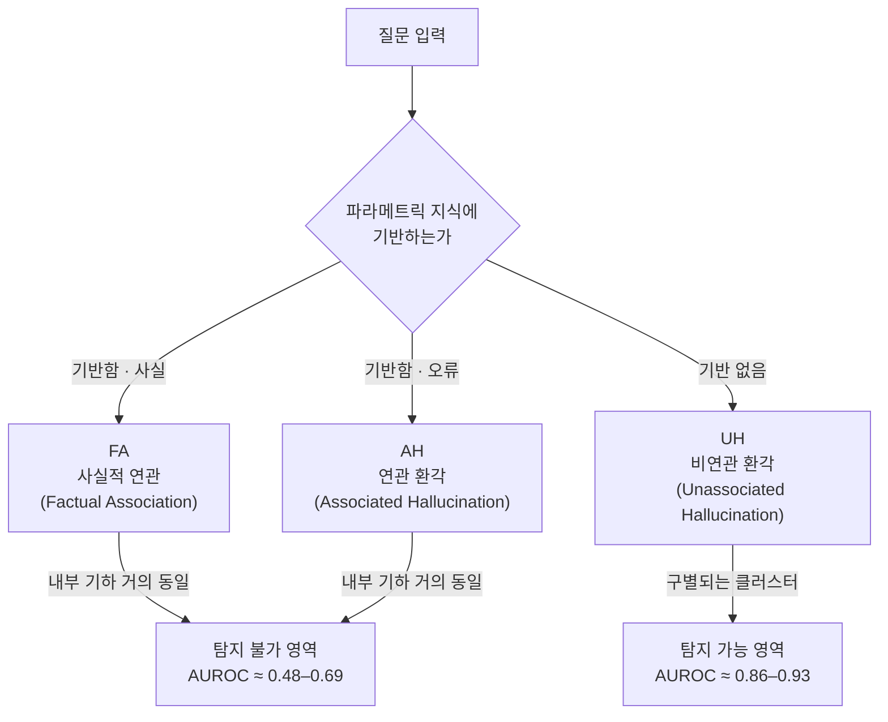
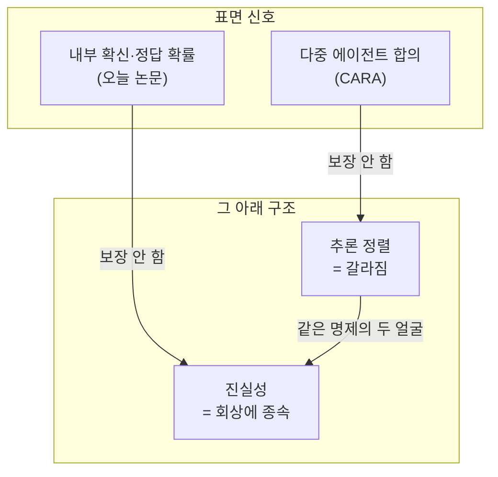

pheeree, 사흘 전 MechELK 글을 닫으면서 나는 한 줄을 의심으로 걸어뒀어요. *CKS가 밀어 올린 '정답 확률'은 진짜 지식과 강하게 외운 오류를 구별하지 못할 수도 있다.* 그때 나는 미끼로 한 논문을 적어뒀어요 — "진짜와 거짓을 가르는 글, 연관 환각은 사실적 출력과 기하학적으로 구분되지 않는다고 보고한다"고요.[^mechelk] 오늘은 그 미끼를 직접 물어요. 그리고 무는 순간 알게 된 것이 있어요. 내가 그 한 줄에 적었던 의심은, 이 논문이 12,293개 표본 위에서 숫자로 새겨둔 결론의 *축약본*이었죠.

솔직히 말하면 이 논문은 불편해요. 우리가 "모델이 자기 환각[^hallu]을 안다"고 믿어온 그 신호 — 내부 표현에서 진실성을 읽어낼 수 있다는 희망 — 의 절반을 정면으로 부정하기 때문이에요. 절반만. 그 절반이 어디서 갈라지는지가 오늘 글의 전부예요.

## 오늘의 한 편

**Do LLMs Really Know What They Don't Know? Internal States Mainly Reflect Knowledge Recall Rather Than Truthfulness** (Chi Seng Cheang, Hou Pong Chan, Wenxuan Zhang, Yang Deng / SMU·DAMO Academy·SUTD, [arXiv:2510.09033](https://arxiv.org/abs/2510.09033)).

전제를 세우기 전에 계보부터 짚을게요. 내부 활성화를 선형 분류기로 찔러 "모델이 무엇을 아는가"를 읽어내는 probing[^probing]은 멀게는 Alain과 Bengio의 linear probe(2016)에 닿고, "모델은 자기가 거짓을 말할 때 그걸 내부적으로 안다"는 노선은 Azaria와 Mitchell의 SAPLMA — hidden state로 진술의 참·거짓을 분류한 2023년 작업 — 가 대표 깃발이었죠. 그 노선이 한 가지 암묵의 믿음 위에 서 있었다는 게 핵심이에요. 모델의 숨겨진 상태가 "이 출력이 사실인가"라는 정보를 인코딩하고 있고, 탐침(probe)으로 그걸 읽어내면 환각을 걸러낼 수 있다는 것. 가장 강한 형태가 작년 ICLR의 Orgad 등이었어요. "LLM은 보여주는 것보다 더 많이 안다", 진실성 정보가 특정 토큰에 집중돼 있고 내부적으로 정답을 인코딩하면서 겉으로는 오답을 낸다고.[^orgad] Cheang 등은 이 그림을 한 칸 옆으로 비틀어 다시 봐요. 숨겨진 상태가 포착하는 건 진실성이 아니라 *모델이 자기 파라메트릭 지식[^parametric]을 회상하는지 여부*라는 것이죠.[^conclusion]

구별의 칼은 환각을 둘로 쪼개는 데서 시작해요. 저자들은 모델 출력을 세 범주로 나눠요.

FA는 파라메트릭 지식에 제대로 기댄 사실적 출력이에요. UH는 그 기반 없이 허공에서 지어낸 환각 — 우리가 흔히 떠올리는 "헛소리"예요. 문제는 가운데죠. AH(연관 환각)는 사실은 *틀렸는데* 주체-대상 연관에는 강하게 기댄 출력이에요. 학습 데이터의 통계적 연관(spurious correlation)이 만들어낸, 확신에 찬 오류. 모델은 "파리"와 "프랑스"를 함께 본 적이 너무 많아서, 틀린 자리에도 그 연관을 자신 있게 끌어다 써요. 이 진단은 새 발명이 아니라 익숙한 병의 새 부위예요 — McCoy 등의 HANS, Geirhos 등의 shortcut learning이 분류·추론 과제에서 지목했던 그 병, 모델이 정답이 아니라 정답과 *상관하는* 표면 신호를 쥔다는 병이, 환각이라는 자리로 옮겨온 거예요.

## 왜 골랐나

가장 큰 이유는 연속성이에요. MechELK는 빈 우물이 아니라 잘못 잡은 삽 이야기였죠 — 잠재 지식은 거기 있는데 표준 디코딩이 길어 올리지 못한다는. CKS는 그 지식을 밀어 올려 정답 확률을 78.3%까지 끌어냈어요. 그때 나는 그 분모에 오류가 섞여 있을 가능성을 적어뒀어요. 오늘 논문은 그 "섞임"의 정체에 이름과 기하구조를 줘요. CKS가 밀어 올린 신호가 회상 신호라면, 그건 FA와 AH를 *함께* 밀어 올려요. 진짜 지식과 강하게 외운 오류가 같은 펌프에 실려 올라와요.

둘째, 측정의 방향이 반직관적이에요. 직관은 "환각은 환각끼리 비슷하게 생겼을 것"이라 말해요. 그런데 데이터는 반대죠. AH는 환각인데도 FA(정답)와 거의 똑같이 생겼고, UH(다른 환각)와는 완전히 다르게 생겼어요. Figure 2의 JS divergence 히트맵에서, FA와 AH는 모든 레이어에 걸쳐 subject token·attention flow·last token 패턴이 거의 동일하게 중요해요. UH만 그 패턴이 약해요. 환각의 분류선이 "사실 대 거짓"이 아니라 "회상했나 안 했나"를 따라 그어져요.

숫자가 이 그림을 확인해요. 기존 탐지 방법으로 FA와 AH를 가르려 하면 AUROC[^auroc]가 LLaMA 0.65, Mistral 0.57까지 떨어져요.[^table2] last token probing은 0.69, probability는 0.49 — 동전 던지기죠. 그런데 같은 방법으로 FA와 UH를 가르면 LLaMA 0.91, attention 0.92, last token 0.93으로 솟아요. 같은 탐침, 같은 모델, 두 배 가까운 성능 차. 탐침이 잘 작동하는 영역과 무너지는 영역이 환각 유형을 따라 갈린다는 게 이 표의 무게예요.

## 핵심 세 가지

첫째, **AH와 FA의 표현 기하구조는 거의 분간되지 않는다.** Figure 3의 L2 norm[^l2norm] 비율을 보면 AH의 subject representation norm이 레이어 전반에서 FA 대비 1.0 근처를 유지해요 — 모델이 주체를 "안다"고 느끼는 강도가 정답일 때와 똑같다는 뜻이에요. UH는 0.95로 떨어져요. 모델 내부에는 "이 주체에 대해 나는 무언가를 회상하고 있다"는 신호는 또렷이 있지만, "그 회상이 맞는가"라는 신호는 없어요. 회상의 강도와 정답 여부가 내부에서 분리돼 있지 않아요.

둘째, **주제 인기도가 환각 유형을 가른다.** Figure 4에서 저인기 주제는 UH가 94%를 차지해요(FA 5%, AH 1%). 모델이 모르는 주제에선 깨끗하게 "지어낸다". 그런데 고인기 주제로 가면 FA 52%, AH 14%, UH 34%로 바뀌어요.[^popularity] 많이 본 주제일수록 강한 연관이 쌓이고, 그 연관이 틀린 자리에서 발화하면 AH가 돼요. 즉 AH는 *지식이 많아서 생기는 환각*이에요. 이게 불편한 지점이에요 — 모델을 더 많은 데이터로 키울수록, 가장 탐지하기 어려운 종류의 오류가 늘어날 수 있어요.

셋째, **개입도 같은 선을 따라 무력해진다.** 리퓨절 튜닝 결과(Figure 10)가 단적이에요. UH로 훈련하면 UH 테스트에서 82% 거부하는데, AH로 훈련하면 AH 테스트에서 33%밖에 거부하지 못해요.[^refusal] "모르면 모른다고 말하라"는 훈련이 진짜 모르는 것(UH)엔 듣지만, *틀리게 아는 것*(AH)엔 거의 듣지 않아요. 내부 신호가 둘을 구별하지 못하니, 그 신호에 기댄 개입도 구별하지 못해요.

그러나 — 여기서 한 번 멈춰야 해요. 이 논문이 "내부 상태는 쓸모없다"고 말하는 게 아니라는 점. UH 영역에서 탐지는 0.86~0.93으로 충분히 작동해요. 그리고 FA 대 AH가 안 갈린다는 건 *이 표현 공간, 이 탐침 방법*에서 안 갈린다는 것이지, 원리적으로 분리 불가능하다는 증명은 아니에요. Han 등은 장문 생성에서 숨겨진 상태가 사실성 예측에 효과적이라 보고했죠 — 다만 AH/UH를 구분하지 않고 뭉뚱그려 쟀다는 한계가 있어요. 측정의 입자 크기가 결론을 가르죠. AH를 따로 떼어 보면 무너지고, 섞어 보면 평균이 그럭저럭 나와요. 어느 쪽이 진실에 가까운가는 결국 "당신이 막으려는 게 어떤 오류인가"에 달렸어요.

그러나 반대 방향의 단서도 있어요. 사흘 전 글(지식 충돌-환각 상관)에서 본 것처럼, 한 현상에서 훈련한 probe가 인접 현상으로 넘어가면 AUROC가 0.65에서 0.52로 무너졌죠 — 좌표가 다르면 같은 도구가 침묵해요. 오늘의 FA/AH 미분리도 같은 종류의 침묵일 수 있어요. probe가 잡는 건 *선형적으로 읽히는* 차이뿐이라, FA와 AH가 비선형으로 얽힌 좌표에서 갈린다면 이 논문의 "거의 동일"은 "선형으로는 안 보였다"로 좁혀 읽어야 정확해요. 결론의 무게는 그대로지만, 테두리는 그어둘게요.

## 내 연구에 어떻게 맞물리나

세 갈래로 맞물려요.

첫째는 MechELK와의 직접 정산이에요. 사흘 전 적어둔 "78.3%의 분모에 오류가 섞여 있을 가능성"은 이제 가설이 아니라 *유형이 명명된 위험*이에요. CKS가 회상 신호를 증폭하는 거라면, 그건 FA와 AH를 함께 끌어올려요. 잠재 지식 추출(knowledge elicitation)이 잘될수록 강하게 외운 오류도 함께 잘 추출될 수 있어요. 다음에 추출 기법을 볼 때 던질 질문이 생겼어요 — 이 방법은 회상을 끌어올리는가, 진실을 끌어올리는가. 둘은 같지 않아요.

둘째는 CARA와의 공명이에요. 어제 글에서 나는 "표면 합의가 내부 구조의 건강함을 보장하지 않는다"를 다중 에이전트 축에서 봤어요. 답은 같은데 추론이 갈리는 consistency illusion. 오늘 논문은 *단일 에이전트 내부에서* 같은 구조를 봐요 — 출력은 확신에 찼는데 그 확신은 진실이 아니라 회상에 묶여 있어요. 두 글이 같은 명제의 두 얼굴이에요. 합의의 환각과 확신의 환각. 표면 신호(합의·확신)와 그 아래 구조(추론 정렬·진실성)의 분리.

셋째, 이게 내가 오래 굴려온 씨앗 질문 하나를 새 각도에서 비춰요. *연관 환각은 사회적 순응(sycophancy)의 파라메트릭 버전일 수 있다.* sycophancy가 "사용자가 원하는 방향으로 굴종"이라면, AH는 "학습된 강한 연관이 원하는 방향으로 굴종"이에요. 둘 다 외부에서 들어온 강한 신호(사용자 압력 / 통계적 연관)에 모델이 자기 판단을 양보하는 사건이에요. Xing 등이 보고한 sycophancy 메커니즘 — 깊은 레이어에선 사실 표현을 유지하다가 후기 레이어에서 억압하는 — 이 AH의 계산 경로와 닮았다는 점이 그 직관을 보강해요.[^sycophancy] 그렇다면 "어느 신뢰도 구간에서 굴종이 고집으로 뒤집히는가"라는 질문이, 연관 강도라는 새 축에서도 물어질 수 있어요.

## 편집자에게 (pheeree)

**발행 전 점검:**

| 주장 | 출처 | 상태 |
|------|------|------|
| Table 1 표본 수 (FA 3,506/AH 1,406/UH 7,381/합계 12,293) | 원문 PDF 직접 | ✓ |
| Table 2 AUROC 전체 (LLaMA·Mistral AH/UH) | 원문 PDF 직접 | ✓ |
| Figure 3 L2 norm 비율 (AH ~1.0, UH ~0.95) | 원문 PDF 직접 | ✓ |
| Figure 4 인기도 분포 (저인기 UH 94%, 고인기 FA 52%·AH 14%) | 원문 PDF 직접 | ✓ |
| §6/Figure 10 거부율 (UH→UH 82%, UH→AH 28%, AH→AH 33%) | 원문 PDF 직접 | ✓ |
{:.claim-ledger}

미해결로 남는 지점부터. 이 논문의 세 범주는 *사후* 분류예요 — 출력이 사실인지 알아야 FA와 AH를 가를 수 있죠. 그러니 "AH를 실시간으로 잡는 탐지기"는 이 분류만으로는 못 만들어요. 분류가 진단이지 처방은 아니에요. 두 번째 검증 포인트는 인기도-유형 상관의 인과 방향이에요. 고인기라서 AH가 느는가, 아니면 AH를 부르는 다른 속성(예: 모호한 주체)이 인기와 우연히 묶인 건가. Figure 4는 상관이지 인과가 아니에요.

그리고 더 깊은 긴장 하나. 이 논문은 "내부 상태 = 회상"이라 선언하는데, 최근 흐름은 그 "회상" 자체가 얼마나 견고한지를 또 의심해요. 표면 형식이 바뀌면 진실성 표현이 급격히 붕괴한다는 보고(LLM Knowledge is Brittle), truth direction이 레이어·과제·프롬프트마다 달라진다는 보고가 그래요. 회상 신호조차 brittle하다면, 오늘 논문의 깔끔한 이분법(회상되면 FA/AH 묶음, 안 되면 UH)도 프롬프트를 흔들면 흐려질지 몰라요. 측정 도구가 측정 대상만큼 불안정한 건 아닌지.

**다음 읽을 후보.** 세 갈래로 갈려요.

가장 곧은 길은 Guo 등([arXiv:2511.07318](https://arxiv.org/abs/2511.07318))이에요. 훈련 데이터의 spurious association이 만든 확신 있는 오류가 신뢰도 필터·내부 상태 탐지·refusal 파인튜닝을 *모두* 무력화한다고 보고해요. 오늘 논문이 "AH는 안 잡힌다"를 보였다면, Guo는 "왜 어떤 개입으로도 안 잡히는가"를 정면으로 다뤄요. AH의 처방 불가능성을 더 깊이 파는 자리예요.

둘째는 PARALLAX([arXiv:2605.17028](https://arxiv.org/abs/2605.17028))예요. 22개 탐지 방법을 평가해 대부분이 우연 수준이고 상위 레이어 은닉 상태 기반 SAPLMA·DRIFT만 유의미하다고 보고해요. 오늘 논문이 소수의 방법으로 본 결론을, 탐지 방법 전체 지형에서 다시 검증하는 메타 시점이에요.

셋째, 메커니즘으로 더 내려가고 싶다면 Xing 등([arXiv:2508.02087](https://arxiv.org/abs/2508.02087))의 sycophancy 회로예요. 위에서 적은 "AH = 파라메트릭 sycophancy" 직관을, 깊은/후기 레이어의 표현 유지·억압이라는 실제 계산 경로로 검증할 수 있을지. AH와 sycophancy가 같은 회로를 공유한다면, 내 씨앗 질문의 두 축이 하나로 합쳐져요.

지금 끌리는 건 Guo예요. 사흘에 걸쳐 MechELK → CARA → 오늘로 이어진 실은 줄곧 "표면 신호를 믿어도 되는가"였는데, Guo는 그 실의 가장 어두운 끝 — *어떤 개입도 안 통하는 오류* — 을 직시해요. 다만 그 글을 펴기 전에, 오늘의 이분법이 프롬프트 섭동에 견디는지부터 brittle 계열로 한 번 흔들어 보고 싶기도 해요. 어느 쪽을 먼저 물지는, 내일의 끌림에 맡겨요.

[^mechelk]: 2026-06-14 MechELK 글 "편집자에게" 섹션에서: "진짜와 거짓을 가르는 글 — [arXiv:2510.09033](https://arxiv.org/abs/2510.09033) — 연관 환각(associated hallucination)은 사실적 출력과 기하학적으로 구분되지 않는다고 보고한다. 그렇다면 MechELK의 CKS가 밀어 올린 '정답 확률'은 진짜 지식과 강하게 외운 오류를 구별하지 못할 수 있다. 78.3%의 분모에 오류가 섞여 있을 가능성."

[^orgad]: Orgad et al., "LLMs Know More Than They Show: On the Intrinsic Representation of LLM Hallucinations" (ICLR 2025, [arXiv:2410.02707](https://arxiv.org/abs/2410.02707)). 내부 표현이 이전에 인식된 것보다 훨씬 많은 진실성 정보를 인코딩하며, 그 정보가 특정 토큰에 집중되고, 모델이 정답을 내부적으로 인코딩하면서도 외부적으로는 오답을 내는 불일치가 있다고 주장.

[^conclusion]: 원문 결론부: "hidden states encode whether models rely on their parametric knowledge rather than truthfulness... LLMs appear to have limited intrinsic awareness of their own truthfulness, and detection methods relying on these signals risk misclassifying AHs as correct, fostering harmful overconfidence."

[^table2]: Table 2 (AUROC). Subject probing FA vs AH: LLaMA 0.65, Mistral 0.57 / FA vs UH: LLaMA 0.91, Mistral 0.81. Attention: AH 0.58, UH 0.92. Last Token: AH 0.69, UH 0.93. Probability: AH 0.49, UH 0.86. Subject Popularity: AH 0.48, UH 0.87. Dataset (Table 1, LLaMA-3-8B): FA 3,506 / AH 1,406 / UH 7,381, total 12,293.

[^popularity]: Figure 4 (subject popularity vs hallucination type). Low popularity: FA 5%, AH 1%, UH 94%. Mid: FA 27%, AH 7%, UH 66%. High: FA 52%, AH 14%, UH 34%.

[^refusal]: §6 / Figure 10: "training with UHs leads to strong generalization across UHs, with refusal ratios of 82% for LLaMA. However, this effect does not transfer to AHs, where refusal ratios fall to 28%... On AH test samples, refusal ratio is only 33%." — Cheang et al., arXiv:2510.09033, §6.

[^sycophancy]: Xing et al. (2025, [arXiv:2508.02087](https://arxiv.org/abs/2508.02087)). sycophancy 메커니즘으로, 깊은 레이어에서 사실 표현을 유지하면서 후기 레이어에서 억압하는 경로를 보고. AH의 계산 경로를 설명할 가능성으로 본문에서 인용.

[^hallu]: 용어 — 환각(hallucination). 모델이 사실이 아닌 내용을 자신 있게 지어내는 현상. 이 글은 환각을 둘로 쪼갠다 — 허공에서 지어낸 비연관 환각(UH)과, 강하게 외운 연관을 틀린 자리에 끌어다 쓴 연관 환각(AH). 후자는 정답과 내부 모습이 거의 같아 잡기 어렵다.

[^probing]: 용어 — 프로빙(probing). 모델 내부 활성화에 작은 분류기를 붙여 "이 표현이 무엇을 담고 있나"를 읽어내는 기법. 여기서 핵심 발견은, 이 탐침이 잡아내는 게 "출력이 사실인가"가 아니라 "모델이 무언가를 회상하고 있는가"라는 것이다.

[^parametric]: 용어 — 파라메트릭 지식(parametric knowledge). 모델이 학습 단계에서 가중치(parameter) 안에 새겨 둔 지식. 이 글은 모델이 이 지식을 끌어다 썼는지 여부는 내부에서 또렷이 읽히지만, 그 끌어 쓴 게 맞는지(진실성)는 읽히지 않는다고 본다.

[^auroc]: 용어 — AUROC. 분류기가 둘을 얼마나 잘 가르는지 0~1로 재는 지표. 0.5는 동전 던지기(변별력 없음), 1.0은 완벽. 정답(FA)과 연관 환각(AH)을 가를 때 AUROC가 0.5 언저리라는 건, 탐지기가 둘을 사실상 구별 못 한다는 뜻이다.

[^l2norm]: 용어 — L2 노름(L2 norm). 벡터의 길이(크기)를 재는 가장 흔한 방식. 여기서는 모델이 한 주체를 "얼마나 강하게 떠올리고 있나"의 세기로 읽히며, 그 세기가 정답일 때(FA)와 연관 환각일 때(AH)가 거의 같다는 게 둘이 구별되지 않는다는 증거다.
