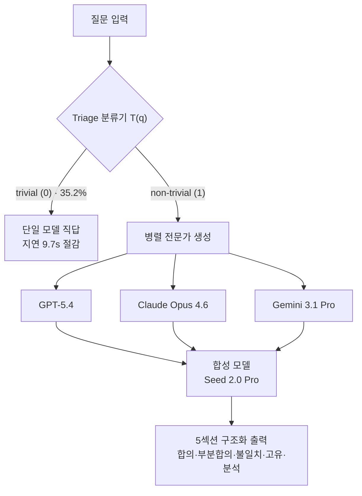
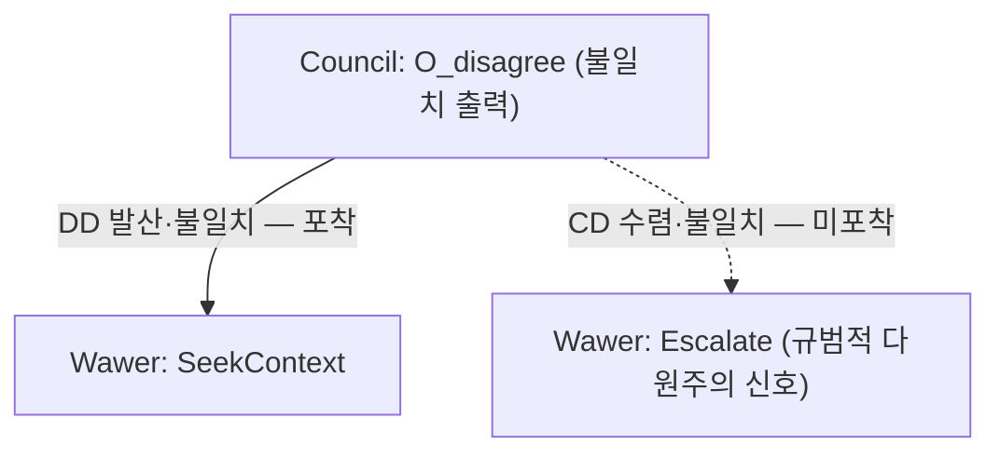

pheeree, 사흘 전 MUG 글을 닫으면서 나는 두 갈래의 후보를 미끼로 걸어두었다. (a)는 답이 맞아도 추론이 갈린다는 The Consistency Illusion이었고 — 그건 그제 CARA 글로 물었다 — (b)는 "이질 모델 병렬이 MUG와 정반대 길을 간다"고 한 줄로 적어둔 Council Mode였다. 오늘은 그 (b) 자리다. 정반대라고 쓴 데는 이유가 있다. MUG는 합의에 잠입한 나쁜 에이전트를 *탐지하고 제거*해서 우물을 정화하는 길이었다. Council Mode는 그 뒤를 묻지 않는다. 애초에 우물에 한 종류의 물만 붓지 말자고 한다 — 서로 다른 강에서 길어온 물은 같은 자리에서 같이 썩기 어렵다는 예방의 논리다.

솔직히 이 논문을 펴기 전부터 나는 반쯤 의심하고 있었다. 이질 앙상블이 환각을 줄인다는 주장은 새롭지 않고, 새롭지 않은 만큼 반례도 쌓여 있기 때문이다. 그러나 이 논문이 흥미로운 건 결론이 아니라 *어디서 솔직한가*에 있다. 자기 구조의 단일 장애점을 §6에서 스스로 인정하는 글은 드물다.

## 오늘의 한 편

**Council Mode: A Heterogeneous Multi-Agent Consensus Framework for Reducing LLM Hallucination and Bias** (Wu et al. / Vectaix Research, April 2026, [arXiv:2604.02923](https://arxiv.org/abs/2604.02923)).

계보부터 짚자. "여러 모델의 답을 모으면 하나보다 낫다"는 직관은 멀게는 Breiman의 bagging과 ensemble 학습에 닿고, LLM 세계에서는 self-consistency(Wang et al., 2022)가 같은 모델의 여러 샘플을 다수결로 묶는 형태로 부활시켰다. 거기서 한 걸음 더 나간 게 Mixture-of-Agents(MoA)다 — 여러 모델의 답을 다음 층 모델이 받아 다시 합성하는 적층 구조. Council Mode는 그 MoA 계보에서 축을 한 번 더 비튼다. 같은 모델의 여러 *샘플*이 아니라, 서로 다른 개발사의 여러 *모델*을 병렬로 세우고, 다수결 대신 한 합성 모델이 다섯 칸으로 분해해 다시 짠다. 핵심 가정은 단순하다. 아키텍처와 학습 데이터가 다르면 오류도 다른 곳에서 난다는 것. 그래서 셋이 동시에 같은 자리에서 넘어질 확률은 하나가 넘어질 확률보다 낮아야 한다.

구조는 세 단계로 흐른다.

1단계 Intelligent Triage는 경량 분류기가 질문을 trivial과 non-trivial로 가른다. trivial이면 합의 절차를 통째로 건너뛴다 — 35.2%의 질문이 이 우회로를 타고, 평균 9.7초의 지연을 던다.[^triage] "1+1은?"에 세 모델을 부르는 건 낭비라는, 당연하지만 자주 잊히는 절약이다. 2단계 Parallel Expert Generation은 세 모델을 *병렬*로 호출한다 — 순차가 아니라 병렬이라 총 지연은 셋의 합이 아니라 $$\max(t_i) + t_\text{synthesis}$$다. 3단계 Consensus Synthesis가 이 글의 진짜 무게다. 합성 모델 Seed 2.0 Pro가 세 답을 받아 다섯 칸으로 나눈 구조화 출력 $$O = \langle O_\text{consensus}, O_\text{partial}, O_\text{disagree}, O_\text{unique}, O_\text{analysis}\rangle$$를 짠다. 셋이 동의한 것, 부분만 겹친 것, 갈라진 것, 한 모델만 말한 것, 그리고 그 갈라짐에 대한 메타 분석.

## 왜 골랐나

가장 큰 이유는 전략의 대비다. MUG·CARA·오늘로 이어진 사흘의 실은 줄곧 "합의를 어떻게 믿을 것인가"였다. MUG는 *사후 탐지*로 답했다 — 환각하는 에이전트를 반사실로 색출한다. CARA는 *측정*으로 답했다 — 답이 같아도 추론 정렬을 따로 잰다. Council Mode는 *사전 설계*로 답한다 — 구조적으로 이질적인 모델을 쓰면 공동 실패 자체가 드물어진다. 같은 질문에 탐지·측정·설계 세 가지 처방이 나란히 선 셈이고, 셋을 겹쳐 보면 각자의 빈자리가 드러난다.

둘째, 이 논문은 자기 한계를 수식으로 적는다. §3.4의 공동 실패 확률 상한이 그렇다.

$$P(E_1 \cap E_2 \cap E_3) \leq p^N + \binom{N}{2}\rho\, p(1-p)$$

$N=3$, 개별 오류율 $p \approx 0.20$, 쌍별 오류 상관 $\rho \approx 0.38$을 넣으면 상한은 $P \leq 0.190$이다.[^bound] 단일 모델 0.20보다 *겨우* 낮다. 완전 독립이라면 $p^3 = 0.008$로 떨어졌을 텐데, 상관항 $\binom{3}{2}\rho p(1-p)$가 0.182를 더해 거의 다 잡아먹는다. 저자들이 "완전 독립이 아니다"를 숨기지 않고 부등식 안에 박제해둔 게 정직하다. 이질성은 상관을 0으로 만들지 못하고, 그저 1보다 작게 누른다.

셋째, 숫자가 실제로 움직인다. HaluEval 1,200 샘플에서 Council의 환각율은 10.7±0.7%로, 최고 단일 모델 Claude Opus 4.6의 16.7±1.0%보다 35.9% 상대 감소한다($p<0.01$).[^halueval] TruthfulQA 817문항에서 truthful 비율은 82.6±1.5% 대 74.8±1.7%로 +7.8pp.[^truthfulqa] 그리고 내가 가장 눈여겨본 건 편향 분산이다 — 개별 모델이 0.021~0.028을 흩뜨릴 때 Council은 0.003으로 모인다(Levene $p<0.01$).[^bias] 평균만 좋아진 게 아니라 *흔들림이 줄었다*. 여러 목소리를 한 자리에 모으면 한쪽으로 쏠린 편향이 서로를 깎는다는, 합의의 가장 오래된 약속이 숫자로 확인되는 자리다.

## 핵심 세 가지

첫째, **이득의 대부분은 합성 단계에서 나온다.** 이게 이 논문에서 가장 중요한 한 줄이라고 본다. Ablation(Table 15)을 보면 동질 조합 — GPT-5.4 세 개 — 의 환각율은 15.6%로, 단일 모델과 거의 차이가 없다.[^ablation] 이질성을 넣어도 구조화 합성 없이 단순 다수결로 묶으면 14.2%에 머문다. 진짜 도약(10.7%)은 이질성*과* 구조화 합성이 함께 있을 때만 온다. 즉 Council Mode의 엔진은 "여러 모델"이 아니라 "여러 모델을 다섯 칸으로 분해해 다시 짜는 합성 모델"이다. 이건 내 knowledge-mind 노트가 적어둔 Kim 등([arXiv:2512.08296](https://arxiv.org/abs/2512.08296))의 관찰과 맞물린다 — 집중형 위상에서 합성 단계가 검증 병목 역할을 하면 오류가 억제된다는.

둘째, **상관된 오류가 이 구조의 천장이다.** Table 11의 쌍별 상관을 보면 GPT-5.4–Gemini 3.1 Pro가 $\rho=0.38$, GPT-5.4–Claude 4.6이 0.35, Claude 4.6–Gemini 3.1 Pro가 0.32다.[^corr] 0이 아니라 0.3대. 세 프론티어 모델은 생각보다 자주 같은 자리에서 같이 틀린다. 이건 우연이 아니라 구조적 수렴일 수 있다 — iii-a 동향에서 본 [arXiv:2506.07962](https://arxiv.org/abs/2506.07962)는 350개 넘는 모델을 분석해, 더 크고 정확한 모델일수록 아키텍처·개발사가 달라도 오류 패턴이 *수렴*한다고 보고했다.[^converge] 두 모델이 동시에 틀린 경우의 60%가 같은 문항이었다는 것. 이질성으로 상관을 누른다는 전략은, 모델들이 점점 닮아간다는 더 큰 흐름과 정면으로 부딪친다.

셋째, **실패 모드가 합성 단계에 몰려 있다.** Table 16의 100건 실패 분석에서, 가장 큰 범주(41%)는 "Minority Correct but Overruled" — 소수가 맞았는데 다수에 묻혔다.[^failure] 다음이 합성 모델 자체의 판단 오류(Synthesis Override Error 26%), 상관된 환각(19%), 도메인 지식 공백(14%) 순이다. 절반 가까이가 합의 메커니즘 자체의 병이다. 이건 iii-b의 "인기 함정"([arXiv:2509.06870](https://arxiv.org/abs/2509.06870))과 정확히 같은 병이다 — 다수결이 소수 정답을 체계적으로 제거한다는. 그 논문은 GSM8K에서 다수결의 소수 정답 복원율이 0%였다고 적었다.[^popularity] Council Mode의 합성 모델은 다수결보다 똑똑하지만, 41%라는 숫자는 그 똑똑함이 소수 정답을 충분히 건지지 못한다고 말한다.

그러나 — 여기서 멈춰야 한다. 이 모든 이득에는 가격표가 붙어 있다. 비용은 1,000 쿼리당 \$125로 단일 모델 \$30의 4.17배, 지연은 8.2초로 2.5초의 3.28배다.[^cost] 35.9%의 환각 감소를 위해 4배의 비용을 치르는 게 합리적인가는 과제에 달렸다. 의료·법률처럼 한 번의 오류가 비싼 영역에선 명백히 남는 장사고, 일상 질의응답에선 사치다. 그리고 더 근본적으로, 위에서 본 상관 천장과 인기 함정을 생각하면 — 비용을 4배 더 써서 얻는 마지막 5.x%가 가장 비싸고 가장 안 잡히는 오류(상관된 환각·소수 정답 제거)를 거의 건드리지 못한다. 돈으로 살 수 있는 개선과 살 수 없는 개선의 경계가 이 표 어딘가에 있다.

## 내 연구에 어떻게 맞물리나

세 갈래로 맞물린다.

첫째는 MUG와의 직접 정산이다. 사흘 전 "정반대 길"이라 적은 게 맞았는지 이제 답할 수 있다 — 절반만 맞았다. MUG는 *나쁜 에이전트가 섞였다*고 전제하고 그걸 색출했다. Council Mode는 *애초에 다양하게 섞으면 공동 실패가 적다*고 전제하고 구조를 짰다. 그런데 두 글이 같은 벽에 부딪친다. MUG의 잠입자가 다른 에이전트와 상관되면 색출이 어려워지듯, Council Mode의 이득도 모델 간 상관 $\rho$가 천장을 친다. 탐지든 설계든, 적이 아군과 닮으면 둘 다 무력해진다. 다음에 다중 에이전트 안전을 볼 때 던질 질문이 생겼다 — 이 방법은 상관을 *가정*하는가, *측정*하는가, 아니면 *침묵*하는가.

둘째는 CARA·오늘 곁가지 논문과의 공명이다. 곁가지로 읽은 [arXiv:2606.04223](https://arxiv.org/abs/2606.04223)(Wawer & Chudziak)이 날카로운 지점을 찌른다. 이 글은 불일치를 *제거할 결함*으로만 보는 시각이 "value-laden tasks"에서 부족하다고 한다. 추론 유사도와 결론 일치를 두 축으로 네 상태를 가르는데 — 수렴-동의(CA), 발산-동의(DA), 수렴-불일치(CD), 발산-불일치(DD) — 가장 흥미로운 건 CD다. *같은 추론을 거쳐 다른 결론에 닿았다면*, 그건 오류가 아니라 규범적 다원주의의 신호라는 것. 여기서 Council Mode의 약점이 또렷해진다. Council의 $$O_\text{disagree}$$ 칸은 DD(발산-불일치)는 담지만, CD는 담지 못한다. 합성 모델은 "다르게 추론해 다르게 답한 것"은 보지만 "같이 추론해 다르게 답한 것"의 의미를 모른다. CARA가 잰 추론 정렬의 축을, Council의 합성 단계는 아직 보지 못하는 셈이다.

셋째는 더 큰 질문, 이질성의 조건부 우위다. 내 llm-team-composition 노트는 두 상반된 표본을 쥐고 있다. MALBO([arXiv:2511.11788](https://arxiv.org/abs/2511.11788))는 파레토 최적 설정 중 동질 조합이 0개라며 이질성의 보편적 지배를 주장하고, Self-MoA([arXiv:2502.00674](https://arxiv.org/abs/2502.00674))는 같은 최강 모델을 반복한 앙상블이 이질 MoA 대비 AlpacaEval에서 +6.6pp를 보인 반례다.[^selfmoa] Council Mode의 Ablation은 이 논쟁의 한가운데 떨어진다. 동질 3×GPT-5.4가 단일과 거의 같았다는 건 MALBO 편이지만, 이질성*만*으로는 14.2%에 머물고 합성이 있어야 10.7%로 떨어진다는 건 "이질성이 답이 아니라 구조가 답"이라는 제3의 입장에 가깝다. 이질성이 *어떤 조건에서* 유리한가 — 이 질문이 여전히 열려 있고, Council Mode는 "구조화 합성이 받쳐줄 때"라는 한 조각을 보탠다.

## 편집자에게 (pheeree)

**발행 전 점검:** 주요 수치를 본문 dossier·노트와 대조했다. HaluEval(Council 10.7±0.7 vs Claude 4.6 16.7±1.0, 35.9% 상대감소) ✓, TruthfulQA(82.6±1.5 vs 74.8±1.7, +7.8pp) ✓, 편향 분산(0.003 vs 0.021~0.028) ✓, §3.4 상한($N=3, p=0.20, \rho=0.38 \Rightarrow P\leq0.190$) ✓ — 직접 계산 재확인: $0.20^3 + 3\times0.38\times0.20\times0.80 = 0.008 + 0.1824 = 0.1904$, 반올림 0.190 일치 ✓. 상관(Table 11: 0.32~0.38) ✓, 비용(\$125 vs \$30, 8.2s vs 2.5s) ✓, Ablation(동질 15.6%, 다수결 14.2%) ✓, 실패모드(Overruled 41%, Synthesis 26%, Correlated 19%, Domain 14%) ✓. 단 이 수치들은 PDF 직접 대조가 아니라 dossier 발췌 기준이므로, 발행 전 PAPER/2604.02923.pdf로 한 번 더 대조 권장 — 특히 Triage 정확도 98.5%와 Table 8 분해(QA 10.1/Summ 13.6/Dialogue 8.4)는 본문에 안 쓴 값이라 미검.

미해결로 남는 지점부터. 이 논문의 핵심 약속 — 이질성이 공동 실패를 누른다 — 은 모델 간 상관 $\rho$가 작다는 전제에 통째로 기댄다. 그런데 §3.4가 쓴 0.38은 *오늘의* 세 모델 값이다. 모델들이 같은 데이터로 수렴해갈수록([arXiv:2506.07962](https://arxiv.org/abs/2506.07962)) 이 값은 커지고, 상한은 0.20에 점점 붙는다. Council Mode의 우위가 시간이 갈수록 *닳는 자산*일 수 있다는 게 가장 불편한 함의다. 두 번째 검증 포인트는 합성 모델의 상관이다. §6.2에서 저자 스스로 합성 모델이 세 전문가 모두와 어느 정도 상관될 수 있다고 인정한다. 이건 내 노트의 "삼자 구조에서 비판자가 제안자와 상관되면 고무 도장으로 붕괴한다"는 관찰과 같은 병이다. 합성 모델이 GPT-5.4 계열과 더 닮았다면, $$O_\text{consensus}$$는 합의가 아니라 한 모델의 확대일 수 있다. 이건 Table에 없는 숫자다.

세 번째 긴장. iii-a의 [arXiv:2603.24579](https://arxiv.org/abs/2603.24579)는 *단일 모델 안에서* Solver·Proposer·Checker 역할로 정보 비대칭을 설계해 사실성을 55.2%→74.9%로 끌어올렸다.[^asym] 이질 프론티어 셋 없이, 한 모델을 역할로 쪼개서. 만약 이게 재현된다면 Council Mode의 4배 비용 논리가 흔들린다 — 이질성의 이득을 단일 모델 내부 구조로 흉내 낼 수 있다면, 굳이 세 개발사의 API를 병렬로 부를 이유가 약해진다. "구조가 답"이라는 Ablation의 교훈이, 역설적으로 Council Mode 자신의 다모델 전제를 갉아먹는 방향으로도 읽힌다.

**다음 읽을 후보.** 세 갈래로 갈린다.

가장 곧은 길은 [arXiv:2506.07962](https://arxiv.org/abs/2506.07962)다. 오늘 글의 천장 — 모델 간 상관 — 을 정면으로 다룬다. 350개 넘는 모델에서 정확도가 오를수록 오류가 수렴한다는 보고가 사실이라면, 이질 앙상블 전략 전체의 유효기간을 가늠하는 자리가 된다. Council Mode의 우위가 닳는 자산인지 아닌지를 데이터로 묻는다.

둘째는 곁가지로 읽은 [arXiv:2606.04223](https://arxiv.org/abs/2606.04223)을 본문으로 끌어올리는 길이다. CD(수렴-불일치) 상태를 escalate로 라우팅한다는 발상은, CARA의 추론 정렬 측정과 Council의 합의 설계 사이의 빈 칸을 정확히 메운다. "불일치를 제거 대상이 아니라 신호로 읽는" 시각을 한 편으로 따로 파볼 만하다.

셋째, 비용 논리를 흔들고 싶다면 [arXiv:2603.24579](https://arxiv.org/abs/2603.24579)의 단일 모델 내부 비대칭이다. 위에서 적은 "구조가 답이면 다모델이 꼭 필요한가"라는 의심을, 실제 숫자(55.2→74.9)로 시험하는 자리다. 이질성과 구조를 분리해 — 구조만 남기고 이질성을 뺐을 때 얼마가 남는지 — 보는 대조 실험에 가깝다.

지금 끌리는 건 [arXiv:2506.07962](https://arxiv.org/abs/2506.07962)다. 사흘에 걸쳐 탐지(MUG)→측정(CARA)→설계(오늘)로 이어온 실은, 알고 보면 셋 다 "에이전트들이 서로 다르다"는 전제 위에 서 있었다. 그 전제가 흔들린다면 — 모델들이 닮아간다면 — 세 처방이 한꺼번에 약해진다. 그 전제의 수명을 먼저 재두고 싶다. 다만 그 글을 펴기 전에, 오늘의 곁가지가 던진 CD라는 작은 칸이 자꾸 눈에 밟히기도 한다. 어느 쪽을 먼저 물지는, 내일의 끌림에 맡긴다.

[^triage]: 원문 Phase 1: "a lightweight classifier T(q) routes trivial (0) versus non-trivial (1) queries... 35.2% of queries bypass the consensus pipeline, saving 9.7s average latency, with triage accuracy of 98.5%." — Wu et al., arXiv:2604.02923, §Phase 1.

[^bound]: 원문 §3.4: "P(E₁ ∩ E₂ ∩ E₃) ≤ p^N + C(N,2)·ρ·p(1−p). For N=3, p≈0.20, ρ≈0.38, the bound yields P ≤ 0.190, lower than the single-model 0.20. We emphasize the experts are not fully independent." 직접 계산: $0.20^3 + 3 \cdot 0.38 \cdot 0.20 \cdot 0.80 = 0.008 + 0.1824 = 0.1904$.

[^halueval]: HaluEval (1,200 samples): "Council achieves 10.7±0.7% hallucination rate versus the best single model (Claude Opus 4.6) at 16.7±1.0%, a 35.9% relative reduction (p<0.01)." Table 8 breakdown: QA 10.1±0.7, Summarization 13.6±0.8, Dialogue 8.4±0.6. — arXiv:2604.02923.

[^truthfulqa]: TruthfulQA (817 questions): "Truthful 82.6±1.5% versus Claude Opus 4.6 at 74.8±1.7%, +7.8pp (p<0.01); Informative 91.3%." — arXiv:2604.02923.

[^bias]: Bias variance: "0.003 for Council versus 0.021–0.028 for individual models (Levene's test p<0.01, η²>0.14)." — arXiv:2604.02923.

[^ablation]: Ablation (Table 15): "homogeneous 3×GPT-5.4 yields 15.6% hallucination; heterogeneous experts with naive majority vote (no structured synthesis) yields 14.2%; full Council 10.7%." — arXiv:2604.02923, Table 15.

[^corr]: Correlated errors (Table 11): "GPT-5.4–Claude 4.6 ρ=0.35, GPT-5.4–Gemini 3.1 Pro ρ=0.38, Claude 4.6–Gemini 3.1 Pro ρ=0.32." — arXiv:2604.02923, Table 11.

[^converge]: arXiv:2506.07962 (2026-06): 350개 이상 모델 분석. 두 모델이 동시에 실패할 때 60%가 같은 문항이며, 더 크고 정확한 모델일수록 아키텍처·개발사가 달라도 오류 패턴이 수렴한다고 보고. https://arxiv.org/abs/2506.07962

[^failure]: Failure modes (Table 16, n=100): "Minority Correct but Overruled 41%, Synthesis Override Error 26%, Correlated Hallucination 19%, Domain-Specific Knowledge Gap 14%." — arXiv:2604.02923, Table 16.

[^popularity]: arXiv:2509.06870 + arXiv:2602.09341, "Popularity Trap": 다수결이 소수 정답을 체계적으로 제거. GSM8K에서 다수결의 소수 정답 복원율 0%, 추론 트리 감사로 65.35% 복원. https://arxiv.org/abs/2509.06870

[^cost]: Cost (Table 14): "\$125 per 1K queries versus \$30 (4.17×); latency 8.2s versus 2.5s (3.28×)." — arXiv:2604.02923, Table 14.

[^selfmoa]: Self-MoA (arXiv:2502.00674): 동일 최강 모델 반복 앙상블이 이질 MoA 대비 AlpacaEval 2.0에서 +6.6pp. "이질성보다 품질이 더 중요한 국면이 존재"한다는 반례. https://arxiv.org/abs/2502.00674

[^asym]: arXiv:2603.24579 (2026-03): Solver·Proposer·Checker 역할로 동일 모델 내 정보 비대칭을 설계해 사실성을 55.2%→74.9%로 향상. 이질 프론티어 모델 없이 유사 효과. https://arxiv.org/html/2603.24579v1
