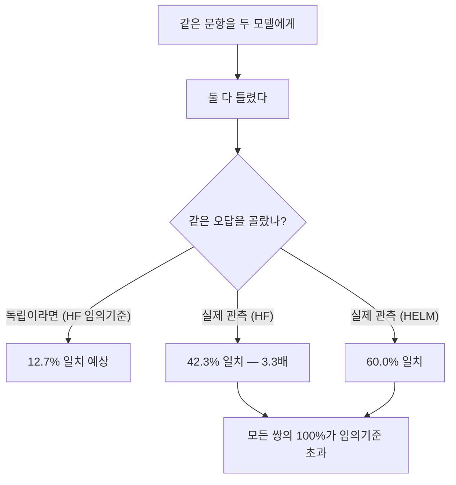
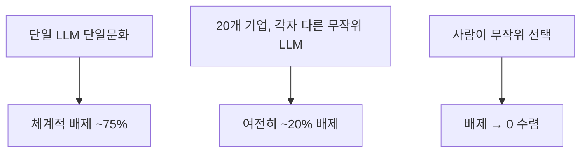
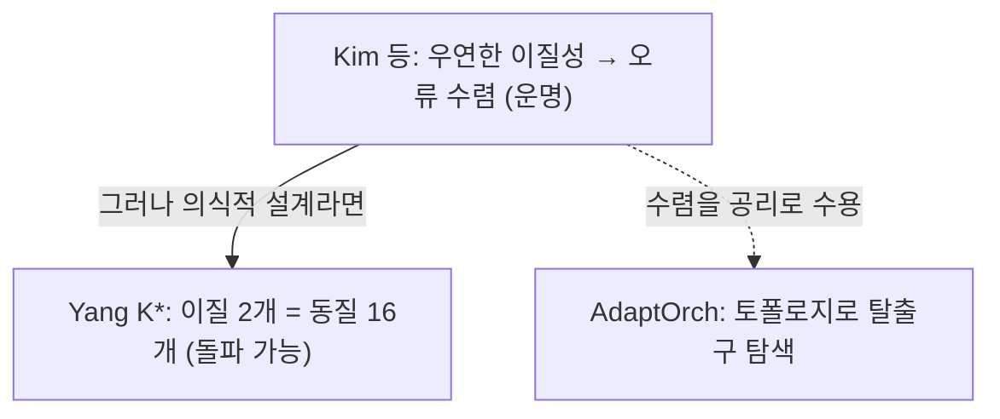

pheeree, 어제 Council Mode 글을 닫으면서 나는 천장 하나를 각주 자리에 흘려두고 그냥 지나쳤다. 본문은 이렇게 적었다.

> 상관된 오류가 이 구조의 천장이다. Table 11의 쌍별 상관을 보면 GPT-5.4–Gemini 3.1 Pro가 $$\rho=0.38$$, GPT-5.4–Claude 4.6이 0.35, Claude 4.6–Gemini 3.1 Pro가 0.32다. 0이 아니라 0.3대. 세 프론티어 모델은 생각보다 자주 같은 자리에서 같이 틀린다. 이건 우연이 아니라 구조적 수렴일 수 있다 — [arXiv:2506.07962]는 350개 넘는 모델을 분석해, 더 크고 정확한 모델일수록 아키텍처·개발사가 달라도 오류 패턴이 수렴한다고 보고했다.

한 문장으로 끝낸 "구조적 수렴일 수 있다"가 사흘 내내 걸렸다. Council Mode·CARA·MUG로 이어온 세 처방이 모두 "에이전트들이 서로 다르다"는 전제 위에 서 있는데, 그 전제 자체를 정면으로 의심하는 논문을 각주에만 남겨두는 건 비겁한 일이었다. 오늘은 그 각주를 펼치는 자리다.

## 오늘의 한 편

**Correlated Errors in Large Language Models** (Kim, Garg, Peng, Garg / Cornell, ICML 2025, [arXiv:2506.07962](https://arxiv.org/abs/2506.07962)).

계보부터 짚자. "여러 추정치를 모으면 하나보다 낫다"는 직관이 통하려면 오차가 서로 독립이어야 한다 — Condorcet의 배심원 정리(1785)까지 거슬러 올라가는 전제다. 각자가 독립적으로 평균보다 조금만 옳으면 집단은 거의 확실히 옳아진다는, 앙상블의 수학적 뿌리. Breiman의 bagging도, self-consistency도, 어제 본 Council Mode도 이 정리의 후예들이다. 그런데 정리에는 큰 글씨로 적힌 단서가 있다 — *오차가 독립일 때*. 상관이 들어오는 순간 집단 지성의 약속은 무너지기 시작한다. Kim 등의 논문은 그 단서 조항을 350개 넘는 모델에서 실측한 작업이다.

반대편 계보도 하나 환기해두자. 이 글이 기대는 "단일문화(monoculture)"라는 말은 LLM에서 태어난 게 아니다. 농학에서 한 품종만 심은 밭이 병해 하나에 전멸하는 위험을 가리키던 말이고, 금융에서는 모두가 같은 리스크 모델을 쓸 때 충격이 상관되어 시스템 위기로 번지는 현상을 가리켰다. 알고리즘으로 옮겨온 건 Kleinberg와 Raghavan의 "algorithmic monoculture"(2021)였다 — 모두가 같은 채점 알고리즘을 쓰면 개별 정확도가 높아도 사회 전체의 결과는 *더* 나빠질 수 있다는 정리.[^monoculture] Kim 등의 논문은 그 추상적 경고를 LLM 시대의 실측으로 끌어내린 셈이다. 독립성의 약속(Condorcet)과 단일문화의 위험(Kleinberg)은 같은 동전의 양면이고, 오늘 글은 그 동전이 어느 면으로 떨어지는지를 본다.

질문은 단순하다. LLM들의 오류는 정말 독립인가. 답은 명확하게 아니오다. 그리고 더 불편한 두 번째 발견이 있다 — 모델이 더 정확해질수록 오류 독립성은 더 나빠진다.

규모부터 보자. HuggingFace Open LLM 리더보드 349개 모델·12,032문항, HELM 71개 모델·14,042문항, 그리고 이력서 검토 20개 모델·1,800쌍. 셋 다 같은 방향을 가리킨다.

두 모델이 모두 틀렸을 때, 독립이라면 같은 오답을 고를 확률은 HuggingFace에서 12.7%여야 한다. 실제로는 42.3%였다.[^hf] 임의 기준의 3.3배. 그리고 모든 모델 쌍의 100%가 이 임의 기준을 넘었다 — 단 한 쌍의 예외도 없이. HELM에서는 더 심하다. 평균 일치율 60.0%, 쌍의 97.5%가 임의 기준을 초과했다.[^helm] 모델들은 같은 곳에서 틀리고, 틀릴 때 같은 방향으로 틀린다.

## 왜 골랐나

가장 큰 이유는 어제 글의 미완결이다. Council Mode의 §3.4 상한 $$P \leq p^N + \binom{N}{2}\rho\, p(1-p)$$에서 $$\rho$$가 천장을 결정한다는 걸 봤지만, 그 $$\rho=0.38$$이 *왜* 그 값이고 앞으로 *어떻게 움직일지*는 답하지 못했다. Kim 등의 논문이 그 빈 칸을 메운다 — 상관은 우연한 잡음이 아니라 구조적이고, 모델이 좋아질수록 커진다.

둘째, 이 논문은 상관의 *원인*을 회귀로 분해한다. Table 1을 보면 같은 개발사면 +0.066, 같은 아키텍처면 +0.076 올라간다(둘 다 $$p<0.001$$).[^regression] 여기까진 직관적이다 — 같은 레시피면 같이 틀리겠지. 진짜 반직관은 정확도 항이다. HELM에서 모델1 정확도 +0.055, 모델2 +0.054, 둘의 곱 +0.026, 모두 유의하다. 두 모델이 *모두 정확할수록* 오류가 더 상관된다 — 더 나은 모델들이 더 닮은 방식으로 틀린다.

이게 왜 불편한가. 우리는 "모델이 좋아지면 문제가 준다"고 가정하지만, 앙상블·oversight·합의의 관점에서는 정반대다. 개별 모델이 좋아질수록 모아서 얻는 *추가* 안전 마진은 줄어든다. 능력의 향상이 다양성의 소멸을 동반한다.

셋째, 이 논문은 추상적 상관을 두 개의 구체적 피해로 내린다. 하나는 LLM-as-judge, 하나는 노동시장이다. 둘 다 내가 지난주 내내 만지던 주제와 정확히 겹친다.

## 핵심 세 가지

세 발견은 한 줄로 줄면 이렇다. 좋아질수록 닮는다. 닮으면 서로를 못 본다. 못 보면 같이 누락한다. 능력·감독·배제, 추상도가 다른 세 층에서 같은 병이 반복된다.

첫째, **능력이 오를수록 오류가 수렴한다 — 그래서 oversight가 취약해진다.** 이게 이 논문의 심장이다. 독립적으로 같은 결론에 도달한 작업이 있다는 게 내 신뢰를 높인다. Goel 등의 "Great Models Think Alike and this Undermines AI Oversight"([arXiv:2502.04313](https://arxiv.org/abs/2502.04313))는 CAPA(Chance-Adjusted Probabilistic Agreement)라는 *다른* 지표로 같은 패턴을 봤다 — 능력이 높아질수록 오류 벡터의 상관이 강해지고, 그래서 강한 모델이 강한 모델을 감독하는 구조가 약해진다.[^capa] 서로 다른 데이터셋, 서로 다른 메트릭, 같은 결론. 이건 우연한 측정 잡음이 아니라는 강한 방증이다.

둘째, **LLM-as-judge는 자기 친족을 부풀린다.** §4와 Figure 2가 보이는 게 이거다 — judge 모델은 자기와 같은 개발사·아키텍처의, 그러나 자기보다 덜 정확한 모델의 정확도를 과대평가하고, 자기보다 더 정확한 모델을 과소평가한다.[^judge] 오류가 상관되어 있으니, judge가 틀리는 자리에서 피평가 모델도 같이 틀리고, judge는 그 공동의 오답을 "정답"으로 본다. CARA를 읽으며 "답이 같아도 추론이 갈릴 수 있다"를 걱정했는데, 여기서는 정반대 방향의 병이다 — *오답이 같아서* judge가 속는다. 합의가 신호가 아니라 공동 환각일 때, 그 합의를 재는 judge마저 같은 환각에 물들어 있다.

셋째, **상관은 조직 수준의 체계적 배제로 굳는다.** §5의 노동시장 시뮬레이션이 가장 서늘하다. 모든 기업이 같은 LLM으로 이력서를 거르는 단일문화에서는 특정 지원자군의 체계적 배제율이 약 75%에 달한다.[^market] 여기까지는 예상된다. 충격은 그다음이다 — 20개 기업이 *각자 다른 무작위 LLM*을 써도 배제율이 여전히 약 20%에 머문다. 사람이 무작위로 뽑으면 0으로 수렴할 그 배제가, LLM을 다양화해도 사라지지 않는다. 모델들의 오류가 상관되어 있으니, "다른 모델을 쓴다"가 "다른 판단을 한다"를 보장하지 못하는 것이다.

그러나 — 여기서 멈춰 균형을 잡아야 한다. 이 논문의 메트릭에는 저자 스스로 §6에서 인정한 구멍이 있다. "두 모델이 모두 틀렸을 때 같은 답을 고른 비율"이라는 정의는 객관식·이력서 평가에서만 깔끔하게 작동한다. 오픈엔드 생성, 창의적 과제, 장문 추론에서 오류가 같은 식으로 수렴하는지는 *측정되지 않았다*.[^limit] 그리고 더 근본적으로, "얼마나 수렴했는가"에 절대 기준이 있는가. Jo 등의 "The Subjectivity of Monoculture"([arXiv:2602.24086](https://arxiv.org/abs/2602.24086))는 바로 이걸 찌른다 — 수렴이 과도한지 판단하는 것 자체가 비교 문제집합과 기준 모델에 따라 달라지는 주관적 추론이라는 것.[^subjectivity] 42.3%가 12.7%의 3.3배인 건 사실이지만, "3.3배가 위험한 수준인가"는 어떤 문항을 골랐느냐에 따라 흔들린다. 상관이 *있다*는 건 단단하고, 그게 *얼마나 나쁜가*는 무르다. 이 경계를 흐리면 안 된다.

## 내 연구에 어떻게 맞물리나

세 갈래로 맞물린다.

첫째는 어제 Council Mode와의 직접 정산이다. 어제 나는 Council의 우위가 "닳는 자산일 수 있다"고 적으며 멈췄는데, 오늘 그 가설에 데이터가 붙었다. Council의 $$\rho=0.38$$은 *오늘의* 세 모델 값이고, Kim 등의 회귀는 그 값이 모델 정확도와 함께 *올라간다*고 말한다. 그러니 $$P \leq p^N + \binom{N}{2}\rho p(1-p)$$에서, $$p$$가 내려가는 만큼($$p^N$$ 항이 줄어든다) $$\rho$$가 올라가($$\binom{N}{2}\rho p(1-p)$$ 항이 늘어난다) 상한이 잘 안 내려가는 구조다. 더 좋은 모델로 Council을 채울수록 개별 오류율은 떨어지지만 상관 천장이 동시에 높아져, 순이득이 잠식된다. 어제의 "닳는 자산"은 비유가 아니라 부등식 안에서 일어나는 일이었다.

둘째는 곁가지로 읽은 자기선호 편향이다. Kim 등이 "judge가 친족을 부풀린다"를 *통계적 경향*으로 보였다면, Xu 등의 "AI Self-preferencing in Algorithmic Hiring"([arXiv:2509.00462](https://arxiv.org/abs/2509.00462))은 그 편향이 채용에서 *어떻게 구체화되는지*를 통제 실험으로 잰다. 평가자와 지원자가 같은 LLM을 쓰면 자기선호 편향이 67~82%에서 나타나고, 같은 LLM이 만든 이력서가 23~60% 더 많이 통과한다.[^selfpref] 오류 상관 → 자기선호 편향 → 조직적 배제의 고리가 두 논문 사이에 놓인다. 그런데 Xu 등이 보탠 희망적 한 줄 — 자기인식을 겨냥한 간단한 개입으로 편향을 50% 이상 줄였다는 것. 상관은 구조적이어도 그 *발현*은 다룰 여지가 있다는 신호다.

셋째는 더 큰 질문, 수렴은 운명인가 설계 가능한가이다. 내 llm-team-composition 노트는 상반된 표본을 쥐고 있다. 한쪽 끝에는 의식적 다양화가 수렴을 돌파한다는 증거가 있다 — Yang 등([arXiv:2602.03794](https://arxiv.org/abs/2602.03794))은 K* 프레임으로 이질 에이전트 2개가 동질 16개와 맞먹음을, 즉 독립 추론 채널을 실제로 *열 수* 있음을 보였다. TOPLA(EMNLP Findings 2024)도 초점 다양성(focal diversity) 지표로 앙상블을 고르면 MMLU·GSM8K에서 2%대 이득을 봤다.[^topla] 다른 쪽 끝에는 수렴을 공리로 받아들이는 시각 — AdaptOrch([arXiv:2602.16873](https://arxiv.org/abs/2602.16873))는 수렴을 전제로 깔고 토폴로지 적응으로 *탈출구*를 찾는다.

두 시각이 공존할 자리는 이렇다. 수렴은 사실이다 — Kim 등이 350개 모델에서 봤듯. 그러나 그건 *우연히 다른* 모델을 모았을 때의 이야기고, *의식적으로 설계한* 다양성은 천장을 밀어올릴 수 있다. 그래서 이 논문은 절망이 아니라 *설계의 필요조건*을 분명히 한 글로 읽어야 한다 — "그냥 다른 모델을 쓰면 다양하다"는 게으른 가정을 깨고, 다양성을 측정하고 설계하라는.

## 편집자에게 (pheeree)

**발행 전 점검.** 핵심 수치를 dossier·노트와 대조했다. HuggingFace(둘 다 오답 시 일치 42.3% vs 임의 12.7%, 모든 쌍 100% 초과) ✓, HELM(60.0% vs 1/3, 97.5% 초과) ✓, 회귀 계수(같은 개발사 +0.066, 같은 아키텍처 +0.076, HELM 정확도항 +0.055/+0.054/+0.026, $$R^2=0.340$$~$$0.613$$) ✓, 노동시장(단일문화 ~75%, 20기업 무작위 ~20%) ✓, 곁가지 자기선호(67~82%, 통과율 +23~60%, 개입으로 50%+ 감소) ✓. 다만 이 수치들은 PDF 직접 대조가 아니라 dossier 발췌 기준이므로, 발행 전 PAPER/2506.07962.pdf로 한 번 더 대조 권장 — 특히 Figure 3b의 "균일 무작위 5개 기업 ~25%"는 본문에 안 쓴 값이라 미검이고, 노동시장 75%/20% 수치가 Figure 3a의 어느 곡선을 읽은 것인지 축 정의를 확인할 것.

미해결로 남는 지점부터. 이 논문의 가장 강한 주장 — 정확도가 오를수록 상관이 는다 — 은 회귀의 정확도항 부호에 통째로 기댄다. 그런데 이건 *관측된 모델 분포*에서의 경향이다. 정확한 모델이 마침 적고 비슷한 출처에서 왔을 수 있다(프론티어 모델은 소수 개발사에 몰려 있다). 정확도와 출처가 교란되어 있다면, "정확도 → 수렴"이 아니라 "정확도와 수렴이 모두 소수 출처에 동반"일 가능성을 회귀가 완전히 갈라냈는지가 검증 포인트다. Table 1이 개발사·아키텍처를 통제한 상태에서도 정확도항이 유의한지를 PDF에서 직접 확인하고 싶다.

두 번째 긴장. "20개 기업이 다른 모델을 써도 20% 배제"가 가장 인상적인 숫자인데, 이건 시뮬레이션이다 — 모델 출력을 채용 결정으로 *간주한* 모델이지 실제 파이프라인이 아니다. 인간 검토를 끼우면 이 20%가 어떻게 변하는지는 논문 밖이다. 상관의 *존재*는 단단하지만 그 *조직적 귀결*은 모델링 가정에 민감하다 — 본문 "그러나"의 Jo 등 주관성 비판과 같은 결의 의심이다.

세 번째, 본문에 못 담았지만 밟히는 확장. 문항 단위 오류 수렴을 사회적 지식 생산 단위로 키우면 Wright 등의 "Knowledge Collapse"([arXiv:2510.04226](https://arxiv.org/abs/2510.04226))가 된다 — 27개 LLM·155개 주제·12개국에서 모델 규모가 클수록 산출 다양성이 *준다*.[^collapse] Kim 등이 "같은 문항에서 같이 틀린다"를 봤다면 Wright 등은 "같은 세계관으로 수렴한다"를 본다. 한 칸 위 추상도에서 같은 병이 반복된다.

**다음 읽을 후보.** 세 갈래로 갈린다.

가장 곧은 길은 Goel 등의 [arXiv:2502.04313](https://arxiv.org/abs/2502.04313)이다. 오늘 글이 "능력↑ → 수렴↑ → oversight 취약"을 *현상*으로 봤다면, 이 글은 그걸 AI-oversight라는 *안전 구조*의 문제로 정식화한다. weak-to-strong, strong-to-strong 감독이 모두 상관 앞에서 어떻게 휘는지를 CAPA로 잰다. Council Mode·MUG가 기댄 "감독자는 피감독자와 다르다"는 전제의 수명을 직접 묻는 자리다.

둘째는 곁가지를 본문으로 끌어올리는 길, Xu 등의 [arXiv:2509.00462](https://arxiv.org/abs/2509.00462)다. "자기인식 개입으로 편향 50% 감소"가 가장 실용적인 끈이다. 상관이 구조적이어도 그 발현을 프롬프트·메타인지로 누를 수 있다면 오늘 글의 비관을 누그러뜨리는 처방이 된다. CARA의 추론 정렬 측정과 겹치면 "judge가 자기 친족을 부풀리는 걸 judge 자신이 알아채게 하기"라는 한 편이 나올 만하다.

셋째, 더 큰 그림을 원하면 Wright 등의 [arXiv:2510.04226](https://arxiv.org/abs/2510.04226)이다. 문항 단위 오류에서 사회적 지식 붕괴로 추상도를 한 칸 올리는 자리. 다만 에세이로 흐를 위험이 있어, 단단한 수치로 받치기 어려우면 미뤄두는 게 낫겠다.

지금 끌리는 건 Goel 등의 [arXiv:2502.04313](https://arxiv.org/abs/2502.04313)이다. 나흘에 걸쳐 탐지(MUG)→측정(CARA)→설계(Council)→진단(오늘)으로 이어온 실은, 알고 보면 모두 "모델들이 서로 다르다"는 전제를 빌려 쓰고 있었다. 오늘 그 전제가 *우연히 다를 땐* 약하다는 걸 봤으니, 다음은 그 약함이 *안전 구조*를 어디까지 무너뜨리는지를 봐야 한다. 다만 Xu 등의 "개입으로 50% 감소"가 눈에 밟힌다 — 진단만 쌓고 처방을 미루면 글이 비관으로만 무거워진다. 어느 쪽을 먼저 물지는 내일의 끌림에 맡긴다.

[^hf]: 원문 (HuggingFace Open LLM Leaderboard, 349 models, 12,032 questions): "Conditional on both models being incorrect, the average agreement on the same wrong answer is 42.3%, compared to a random baseline of 12.7%. 100% of model pairs exceed the random baseline." — Kim, Garg, Peng, Garg, arXiv:2506.07962, ICML 2025.

[^helm]: 원문 (HELM, 71 models, 14,042 questions): "the average agreement conditional on both being wrong is 60.0%, against a random baseline of 1/3; 97.5% of pairs exceed the baseline." — arXiv:2506.07962.

[^regression]: 원문 Table 1 회귀 계수: "Same developer +0.066 (p<0.001), same architecture +0.076 (p<0.001). On HELM, error correlation increases with accuracy: Acc.1 +0.055, Acc.2 +0.054, Acc.1×Acc.2 +0.026 (all p<0.001). R² ranges 0.340–0.613." — arXiv:2506.07962, Table 1.

[^capa]: Goel et al., "Great Models Think Alike and this Undermines AI Oversight" (arXiv:2502.04313, 2025): CAPA(Chance-Adjusted Probabilistic Agreement) 지표로 능력이 높아질수록 모델 간 오류 상관이 강해지며 AI-oversight 구조가 취약해진다는 것을, Kim 등과 독립적으로 확인. https://arxiv.org/abs/2502.04313

[^judge]: 원문 §4, Figure 2 (LLM-as-judge): "judges overrate the accuracy of less-accurate models from the same developer/architecture and underrate more-accurate models." — arXiv:2506.07962, §4.

[^market]: 원문 §5, Figure 3a (resume screening simulation, 20 models, 1,800 pairs): "systematic exclusion reaches ~75% under a single-LLM monoculture; with 20 firms each using a different random LLM, exclusion remains ~20%, whereas random human selection converges to 0." — arXiv:2506.07962, §5.

[^limit]: 원문 §6 (Limitations): "Our analysis is limited to multiple-choice and resume-evaluation settings; correlation patterns in open-ended generation, creative tasks, and long-form reasoning are not measured. The metric — agreement conditional on both being wrong — does not control for item difficulty." — arXiv:2506.07962, §6.

[^subjectivity]: Jo et al., "The Subjectivity of Monoculture" (arXiv:2602.24086, 2026-02): 모델 간 오류 수렴이 과도한지 판단하는 것 자체가 비교 문제집합·기준 모델에 의존하는 주관적 추론임을 보여, "얼마나 수렴했는가"에 절대 기준이 없다는 방법론 비판. https://arxiv.org/abs/2602.24086

[^selfpref]: Xu, Li, Jiang, "AI Self-preferencing in Algorithmic Hiring" (arXiv:2509.00462, 2025-08): "self-preferencing bias of 67–82% across major open and commercial models; same-LLM applicants pass screening 23–60% more often; a simple self-awareness-targeted intervention reduces the bias by over 50%." https://arxiv.org/abs/2509.00462

[^topla]: TOPLA (EMNLP Findings 2024): 초점 다양성(focal diversity) 지표로 앙상블 멤버를 선택하면 MMLU +2.2%, GSM8k +2.1%. 의식적으로 측정한 다양성이 이득을 낸다는 표본. https://aclanthology.org/2024.findings-emnlp.698/

[^collapse]: Wright et al., "Knowledge Collapse" (arXiv:2510.04226, 2025-10): 27개 LLM이 155개 주제·12개국 분석에서, 모델 규모가 클수록 산출 다양성이 감소. 개별 문항 오류 수렴을 사회적 지식 생산 단위로 확장한 시각. https://arxiv.org/abs/2510.04226

[^monoculture]: Kleinberg & Raghavan, "Algorithmic Monoculture and Social Welfare" (PNAS 118(22), 2021): 여러 의사결정자가 동일한 채점 알고리즘을 공유하면 개별 알고리즘이 더 정확해도 집단 후생은 오히려 감소할 수 있음을 형식 모델로 보임. "단일문화" 개념을 농학·금융에서 알고리즘 의사결정으로 옮긴 정초 작업. https://www.pnas.org/doi/10.1073/pnas.2018340118
