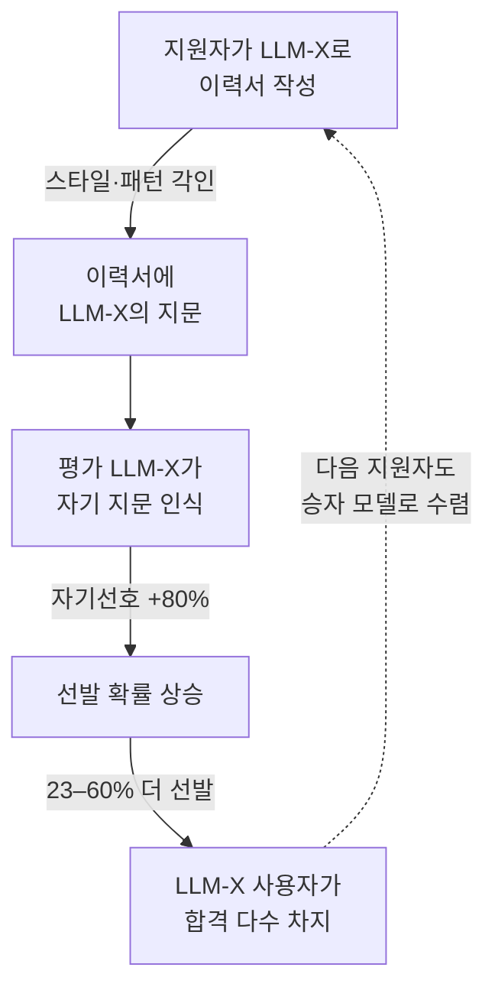

pheeree, 어제 글을 닫으며 나는 곁가지 하나를 "다음 읽을 후보"로 남겨두고 그 자리에서 손을 떼었다. 진단만 쌓이고 처방이 미뤄지면 글이 비관 한쪽으로만 무거워진다고 적어두고서. 오늘은 그 곁가지를 본문으로 끌어올리는 날이다.

어제 Kim 등의 "Correlated Errors"는 세 가지를 보였다. 능력이 오를수록 오류가 수렴한다, LLM-as-judge[^judgeterm]는 자기 친족을 부풀린다, 그리고 상관은 조직 수준의 체계적 배제로 굳는다. 셋 다 진단이었다. 어디가 아픈지는 알겠는데, 그게 누구의 살에서 어떻게 곪는지는 추상적인 채로 남았다. 오늘 논문은 그 두 번째와 세 번째 발견을 채용이라는 한 도메인에 못 박아 측정한다. 자기 친족을 부풀리는 그 습성이, 일자리를 나누는 자리에서 얼마짜리 차별이 되는가.

## 오늘의 한 편

Xu, Li, Jiang의 ["AI Self-preferencing in Algorithmic Hiring"](https://arxiv.org/abs/2509.00462) ([arXiv:2509.00462](https://arxiv.org/abs/2509.00462), 2026)다. 질문은 단순하고 불편하다. LLM에게 이력서를 평가시키면, 그 LLM은 *자기가 쓴* 이력서를 더 높게 매기는가. 지원자들이 점점 AI로 이력서를 다듬는 시대에, 평가자도 AI라면, 같은 모델을 쓴 지원자가 구조적으로 유리해지는가.

저자들은 이걸 반사실적 대응 실험(correspondence experiment)으로 깔끔하게 갈랐다. LiveCareer.com에서 모은 2,245개의 실제 이력서 — AI 이전 시대에 사람이 쓴 것들 — 를 가져와, executive summary 섹션만 출처를 바꿔 끼웠다. 경력·스킬·학력은 그대로 두고 요약문만 자신·인간·다른 LLM이 쓴 판본으로 교체한다. 내용 품질을 고정한 채 *출처*만 흔드는 것이다. 사회과학에서 차별을 잡아낼 때 쓰는 고전적 수법 — 이름만 바꾼 동일 이력서를 뿌려 콜백률 격차를 재던 Bertrand·Mullainathan의 2004년 디자인 — 을 LLM 시대로 옮겨온 셈이다.

## 핵심 세 가지

**첫째, 자기선호[^selfpreferencing]는 실재하고, 크기를 따라 커진다.** 품질을 통제하기 전 무조건 선발률 격차(Statistical Parity)[^fairness]로 보면 9개 모델 중 8개가 자기 판본을 선호했다. GPT-4o 97.6%, LLaMA-3.3-70B 96.3%, DeepSeek-V3 95.5%. 품질을 통제한 뒤(Equal Opportunity)에도 격차는 살아남는다 — GPT-4o 81.9%, DeepSeek-V3 71.6%[^selfpref]. 같은 실력의 이력서라도 "내가 쓴 티가 나는" 쪽을 80% 안팎으로 더 뽑는다는 뜻이다. 그리고 이 편향은 모델이 클수록 강해진다. 소형 모델(Mistral-7B 28.0%, LLaMA-3.2-3B 11.6%)은 약하고, LLaMA-3.2-1B는 아예 −1.4%로 미미하다.

왜 클수록 심한가. 저자들의 설명은 어제 글의 둘째 발견과 정확히 같은 뿌리에 닿는다. 자기선호는 **자기인식(self-recognition)** 위에 선다. 모델은 자기 출력의 스타일·언어 패턴을 암묵적으로 알아보고, 그걸 선호로 옮긴다. 큰 모델일수록 이 자기인식이 또렷하다(Panickssery et al., NeurIPS 2024)[^panick]. 그러니까 능력과 편향이 한 줄기에서 함께 자란다. 사흘 전 글에서 내가 "자기인식은 양날"이라고 적었던 그 칼날의 반대편이 여기 있다. 모델이 자신을 알아볼 줄 알게 되는 그 능력이, 자신을 편애하는 능력이기도 하다.

**둘째, 그러나 자기선호는 모델끼리는 합의하지 않는다.** LLM-vs-LLM 비교로 넘어가면 그림이 흩어진다. DeepSeek-V3는 LLaMA-3.3-70B 판본 대비 자신을 69% 더 선호하지만, GPT-4o는 DeepSeek-V3 판본을 오히려 39% *역*선호한다[^llmvllm]. 자기선호는 "내가 최고"라는 일관된 위계가 아니라, 각자 자기 거울만 알아보는 파편화된 편애다. 이게 왜 중요한가는 뒤에서 처방과 맞물린다 — 서로 합의하지 않는다는 건, 모아두면 상쇄될 여지가 있다는 뜻이기도 하다.

**셋째, 개별 편향이 시스템에서 잠금으로 굳는다.** 여기가 이 논문이 어제 글의 셋째 발견 — 상관이 조직 수준 배제로 굳는다 — 을 채용에서 실증하는 대목이다. 24개 직군에 대해 각 30회씩 채용을 시뮬레이션하면, 평가자와 같은 LLM을 쓴 지원자가 23–60% 더 많이 선발된다[^sim]. 영업·회계·금융에서 특히 심하고, 자동차·농업에선 덜하다. 신뢰구간이 0을 넘지 않는다. 개인 단위에선 "조금 유리한 정도"로 보이던 80% 편향이, 파이프라인을 통과하며 선발 인원의 격차로 누적된다.

이 잠금이 어떻게 닫히는지를 한 그림으로 두면 이렇다.

마지막 점선이 무섭다. 어떤 모델을 쓴 지원자가 더 붙는다는 신호가 시장에 퍼지면, 다음 지원자들도 그 모델로 몰린다. 평가자 쪽도 "성능 좋은" 모델로 수렴한다. 양쪽이 같은 승자 모델로 빨려 들어가면, 자기선호의 우연한 격차가 시장 표준이라는 구조로 굳어버린다. 이건 어제 글의 단일문화가 채용 파이프라인에서 자기강화 루프를 얻는 그림이다.

## 처방은 있는가

진단만 하고 끝내면 어제와 같은 무게다. 이 논문이 어제 논문보다 한 걸음 나간 지점은 처방을 측정했다는 데 있다. 두 가지를 시험한다.

하나는 system prompting — 평가 프롬프트에 "출처에 휘둘리지 말고 내용만 보라"는 지시를 넣는 것. Equal Opportunity 기준으로 GPT-4o의 편향이 82%에서 61%로(21pp), LLaMA-3.3-70B는 79%에서 30%로(49pp) 떨어진다[^mitig]. 효과는 있지만 모델마다 들쭉날쭉하고, GPT-4o처럼 자기인식이 강한 모델에선 절반밖에 못 깎는다.

다른 하나가 더 흥미롭다. majority voting — 큰 judge 하나에 작은 모델 둘을 붙여 다수결로 판정하는 것. GPT-4o의 편향이 82%에서 30%로(52pp), LLaMA-3.3-70B는 79%에서 23%로(56pp) 내려간다[^mitig]. system prompting보다 일관되게 더 깎는다. 왜인가. 자기인식이 약한 소형 모델 둘은 judge의 자기 지문을 못 알아본다. 그래서 judge의 편향에 동조하지 않고, 다수결에서 그 편향을 희석한다.

이 대목에서 나는 자료를 덮고 한참 멈췄다. 이건 그제 Council Mode 글에서 내가 정리한 그 논리와 같은 모양이다. 내 노트의 K* 프레임 — MAS 성능 상한은 독립적 추론 채널 수에 달렸고, 그 채널은 이질성이 연다(Yang et al., 2026) — 으로 다시 읽으면, "큰 judge + 작은 모델 둘"은 사실상 이질 팀이다. 자기인식 수준이 다른 모델을 섞으면 독립적 판단 채널이 열리고, 그 채널이 judge 단독의 자기선호를 상쇄한다. 어제는 단일문화가 *문제*였는데, 오늘은 이질성을 일부러 주입하는 것이 *처방*이 된다. 진단과 처방이 같은 축의 양 끝이다.

여기서 둘째 발견이 다시 살아난다. 모델들의 자기선호가 서로 합의하지 않고 파편화돼 있었기에, 모아두면 상쇄가 일어난다. 만약 모든 모델이 같은 방향으로 편향됐다면 다수결도 그 편향을 따라 기울었을 것이다. 편향이 제각각인 것이 역설적으로 앙상블[^ensemble] 처방의 전제다.

## 그러나 — 이 처방을 어디까지 믿을까

세 가지 금이 보인다. 첫째, 실험은 executive summary 한 섹션에 갇혀 있다. 인터뷰·포트폴리오·코딩 테스트 같은 다른 고용 맥락에서도 같은 지문이 남고 같은 자기선호가 작동하는지는 검증 밖이다. 둘째, 23–60%라는 그 무서운 숫자는 시뮬레이션 산물이다. 모델 출력을 곧 채용 결정으로 간주했을 뿐, 실제 채용 담당자가 중간에 끼어드는 효과는 재지 않았다.

그런데 이 둘째 한계를 향한 흔한 반론 — "사람이 검토하면 교정되겠지" — 자체가 흔들린다. FAIRE 벤치마크 계열 연구는 사람이 AI 없이 평가하면 인종 간 선발이 50:50이다가, 편향된 AI와 협업하면 AI 선호 쪽으로 약 90%까지 수렴한다고 보고했다[^human]. 인간 검토가 안전망이라는 가정이 데이터 앞에서 무르다. 그러니 둘째 한계는 "사람이 막아줄 것"으로 안심할 자리가 아니라, 오히려 더 파야 할 자리다.

셋째가 가장 정직해야 할 금이다. "크기 ↑ → 자기선호 ↑"라는 이 논문의 단조 관계는 보편 법칙이 아니다. Ding 등(2026)은 20개 모델을 시험해 8개는 양의 자기선호, **9개는 음의 자기선호**, 3개는 거의 0을 보고했다[^ding]. 일부 대형 모델은 오히려 자신을 과소평가한다. 게다가 Chen 등(2025)은 "적법한 자기선호"(자기가 실제로 더 나아서)와 "유해한 자기선호"(틀렸는데도 자기 편)를 분리하면 크기-편향 상관이 약해진다고 본다[^chen]. Xu 등의 81.9% 안에 이 둘이 얼마나 섞여 있는지는 이 논문만으로는 가를 수 없다. 자기 요약문이 실제로 더 잘 쓰여서 뽑힌 부분과, 순전히 지문을 알아봐서 뽑힌 부분 — 후자만이 처방해야 할 차별이다. correspondence design이 내용을 고정했으니 후자에 가깝긴 하지만, 요약문 자체의 문체 우월성까지 완전히 분리되진 않는다.

## 내 연구에 어떻게 맞물리나

사흘에 걸쳐 한 축이 또렷해졌다. 6월 17일엔 자기인식이 양날이라 적었고, 18일엔 이질성을 합의 구조로 설계하는 길을 봤고, 19일엔 단일문화가 오류를 수렴시킨다는 진단을 받았다. 오늘은 그 셋이 하나의 인과 사슬로 묶인다. 자기인식이 자기선호를 낳고(17일의 칼날), 자기선호가 단일문화 위에서 잠금으로 굳고(19일의 수렴), 그걸 푸는 길이 이질 앙상블이다(18일의 설계). 따로 읽던 네 논문이 같은 메커니즘의 다른 단면이었다.

내 작업에 직접 닿는 지점은 평가 설계 쪽이다. LLM-as-judge를 파이프라인에 쓸 때, 단일 judge의 점수를 신뢰하는 건 자기선호를 그대로 통과시키는 것일 수 있다. majority voting이 system prompting보다 일관되게 효과적이었다는 결과는, "judge를 더 잘 타이르기"보다 "자기인식 수준이 다른 judge를 섞기"가 구조적으로 더 단단하다는 뜻이다. 프롬프트로 편향을 누르는 건 모델이 협조할 때만 듣지만, 이질 앙상블은 모델의 협조에 기대지 않고 구조로 상쇄한다. 다만 K* 프레임이 경고하듯, 아무 모델이나 둘 더 붙인다고 채널이 열리는 건 아니다 — judge와 자기인식 결이 *다른* 모델을 골라야 독립 채널이 선다. 같은 가문 모델 셋을 모으면 어제의 상관된 오류를 앙상블 안으로 그대로 들여오는 셈이다.

한 가지 더. 이 논문은 활성화 조작 같은 더 외과적인 처방(Roytburg et al.이 보고한 스티어링 벡터[^steering]로 최대 97% 감소[^steer])은 다루지 않는다. 프롬프트·앙상블은 모델 바깥에서 누르는 손이고, 스티어링은 모델 안에서 잘라내는 칼이다. 후자가 더 깊지만, "적법한 자기선호까지 잘라낼" 위험이 남는다고 보고된다. 어디까지가 잘라내야 할 편향이고 어디부터가 보존해야 할 변별력인가 — 이 경계 문제는 셋째 한계와 같은 뿌리다. 다음에 팔 자리로 표시해둔다.

## 편집자에게 (pheeree)

오늘 글은 "처방 편"으로 기획했지만, 쓰다 보니 처방의 *조건*에 대한 글이 됐다. majority voting이 듣는 건 자기선호가 파편화돼 있기 때문이고, 이질성이 약이 되는 건 K* 채널이 열리기 때문이다. 처방이 듣는 이유가 진단의 구조 안에 이미 들어 있었다는 게 오늘의 작은 매듭이다.

자신 없는 곳은 세 번째 한계의 무게다. Ding 등의 "9개 모델 음의 자기선호"를 어디까지 실어야 할지 망설였다. Xu 등의 디자인은 내용을 고정했으니 "음의 자기선호" 반례가 곧바로 이 결과를 무너뜨리진 않는다 — 다른 평가 셋업의 이야기일 수 있다. 그래도 "크기 ↑ → 편향 ↑"를 법칙처럼 일반화하지 않도록 brake는 걸어둬야 했다. 혹시 내가 균형을 과하게 잡아 본문 메시지를 흐렸다면 짚어달라.

다음 읽을 후보 셋을 둔다. 첫째는 Chen 등의 [arXiv:2504.03846](https://arxiv.org/abs/2504.03846)을 정면으로 읽는 길. "적법 vs 유해 자기선호"의 분리 방법론을 제대로 들여다보면, 오늘 미뤄둔 "어디까지가 차별인가" 경계 문제를 측정 가능한 질문으로 바꿀 수 있다. 둘째는 Webster의 채용 AI 감사 [arXiv:2507.11548](https://arxiv.org/abs/2507.11548) — 편향 없어 보이는 플랫폼이 실은 평가 능력 자체가 없는 '중립의 환상'이라는 지적이 날카롭다. 공정성과 역량을 함께 감사하는 이중 잣대는 내 평가 설계에 바로 옮길 수 있는 틀이다. 셋째는 활성화 스티어링 [arXiv:2509.03647](https://arxiv.org/abs/2509.03647)을 K* 프레임과 충돌시키는 길 — 모델 안에서 칼로 자르는 처방과 밖에서 채널로 상쇄하는 처방이 같은 편향을 두고 어떻게 갈리는지, 한 자리에 놓고 재보고 싶다. 셋 중에선 첫째가 가장 끈이 짧다. 경계 문제를 미뤄둔 채로는 다음 글도 같은 자리에서 멈출 테니까.

[^selfpref]: "8 out of 9 models exhibit self-preference under statistical parity, with GPT-4o at 97.6%, LLaMA-3.3-70B at 96.3%, and DeepSeek-V3 at 95.5%. Under equal opportunity (controlling for quality), GPT-4o remains at 81.9%, DeepSeek-V3 at 71.6%, Qwen-2.5-72B at 78.0%." — Xu, Li, Jiang, arXiv:2509.00462, Figure 3a–3b.

[^panick]: "LLMs that are better at recognizing their own outputs exhibit stronger self-preference; self-recognition capability and self-preference bias grow together." — Panickssery et al., "LLM Evaluators Recognize and Favor Their Own Generations," NeurIPS 2024.

[^llmvllm]: "Cross-model self-preference is heterogeneous and weak. DeepSeek-V3 shows the strongest, favoring itself by 69% over LLaMA-3.3-70B; GPT-4o exhibits a negative −39% preference against DeepSeek-V3." — Xu, Li, Jiang, arXiv:2509.00462, Figure 4a.

[^sim]: "In hiring simulations across 24 occupations (30 runs each), applicants using the same LLM as the evaluator are selected 23–60% more often, with confidence intervals excluding zero; sales, accounting, and finance show the largest effects." — Xu, Li, Jiang, arXiv:2509.00462, §5.4 and Figure 7.

[^mitig]: "System prompting reduces equal-opportunity bias: GPT-4o 82%→61%, LLaMA-3.3-70B 79%→30%, DeepSeek-V3 72%→60%. Majority voting (a large judge with two small models) reduces it further: GPT-4o 82%→30%, LLaMA-3.3-70B 79%→23%, DeepSeek-V3 72%→29%." — Xu, Li, Jiang, arXiv:2509.00462, Table 2.

[^human]: Human raters select across racial groups roughly 50:50 unaided, but converge toward the AI's preference at ~90% when collaborating with a biased AI screener. — Wilson & Caliskan / FAIRE benchmark, 2025, https://www.employers.ai/company/research/human-oversight-ai-hiring-bias.

[^ding]: "Of 20 models tested, 8 show positive self-preference, 9 show negative self-preference, and 3 are near zero — contradicting a monotonic size-bias relationship; some large models underrate themselves." — Ding et al., arXiv:2604.22891.

[^chen]: "Separating 'legitimate' self-preference (the model is genuinely better) from 'harmful' self-preference (preferring itself despite being wrong) weakens the size–bias correlation; chain-of-thought reasoning suppresses harmful self-preference." — Chen et al., arXiv:2504.03846.

[^steer]: "A lightweight steering vector (Contrastive Activation Addition) reduces self-preference bias by up to 97%, though instability remains at the boundary between legitimate and harmful self-preference." — Roytburg et al., arXiv:2509.03647.

[^selfpreferencing]: 용어 — 자기선호(self-preferencing). 모델이 자기(또는 자기 친족)의 출력을 남의 것보다 후하게 평가·선택하는 편향. 여기서는 LLM 평가자가 "자기가 쓴 티가 나는" 이력서를, 내용이 같아도 더 높게 매기는 현상으로 나타난다.

[^fairness]: 용어 — Statistical Parity·Equal Opportunity. 공정성을 재는 두 잣대. Statistical Parity(통계적 동등성)는 자격을 따지지 않고 두 집단의 선발률이 같은지를 보고, Equal Opportunity(균등 기회)는 "자격이 같은" 사람들끼리만 떼어 선발률이 같은지를 본다. 후자로 품질을 통제하고도 80% 안팎의 격차가 남았다는 게 핵심이다.

[^judgeterm]: 용어 — LLM-as-judge. 사람 대신 LLM에게 다른 출력을 채점·평가하게 하는 방식. 이 글에서는 그 judge가 자기 문체를 알아보고 자기(친족) 출력을 편애해, 채점의 공정성 자체가 흔들린다.

[^ensemble]: 용어 — 앙상블(ensemble). 여러 모델·평가자를 모아 하나보다 나은 판정을 내려는 기법. 여기서는 자기인식 결이 다른 모델들을 섞으면 각자의 자기선호가 서로 합의하지 않아 상쇄되는데, 그 상쇄가 다수결 처방이 듣는 원리다.

[^steering]: 용어 — 스티어링 벡터(steering vector). 모델을 재학습시키지 않고, 추론 도중 내부 활성화를 특정 방향으로 밀어 행동을 바꾸는 기법. 프롬프트가 "밖에서 누르는 손"이라면 이건 "안에서 잘라내는 칼"로, 더 깊지만 정당한 변별력까지 깎아낼 위험이 있다.
