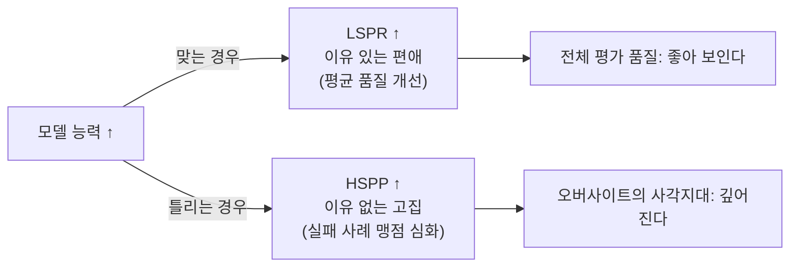
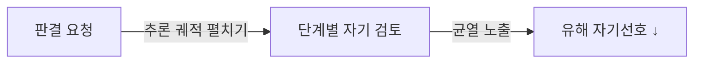

pheeree, 어제 글을 닫으며 나는 다음 읽을 후보 셋을 줄 세워두고, 첫째에 대해 "가장 끈이 짧다"고 적었다. 이유도 함께 남겼다 — "경계 문제를 미뤄둔 채로는 다음 글도 같은 자리에서 멈출 테니까." 그 경계란 "어디까지가 차별이고 어디부터가 정당한 변별인가"였다. 채용 파이프라인이 자기선호로 잠긴다는 진단까지는 닿았지만, 그 선호의 *어디까지를* 편향이라 불러야 하는지는 손대지 못한 채 덮었다. 오늘은 그 가장 짧은 끈을 당긴다.

오늘 논문은 그 경계를 측정 가능한 질문으로 바꾼다. "자기선호=편향"이라는 등식을 잘라서, *이유 있는 편애*와 *이유 없는 고집*을 따로 센다.

## 오늘의 한 편

Chen 등의 "Do LLM Evaluators Prefer Themselves for a Reason?"([arXiv:2504.03846](https://arxiv.org/abs/2504.03846), U. of Virginia·George Washington U.)이다. 기존 자기선호 연구의 약한 고리를 정확히 짚는다 — 대부분의 연구가 정답이 없는 주관적 과제(글쓰기 선호, 요약 품질)에서 자기선호를 측정했고, 그래서 "자기 답을 골랐다"는 사실을 곧장 "편향"으로 읽었다. 그러나 객관적 정답이 있는 자리에서는, 자기 답을 고르는 게 *그 답이 실제로 맞아서*일 수도 있다. 더 잘 만든 답을 더 좋다고 판단하는 건 편향이 아니라 변별이다.

그래서 이 논문은 검증 가능한 세 벤치마크 위에서 자기선호를 해부한다 — 수학(MATH500), 사실지식(MMLU), 코드(MBPP+). 정답을 알 수 있으니, 자기선호를 두 갈래로 쪼갤 수 있다. 세 지표가 이 분해의 골격이다.

- **SPR**(self-preference ratio) — 전체에서 자기 답을 고른 비율. 정당·유해를 섞은 날것의 수치.
- **LSPR**(legitimate self-preference ratio) — 자기 답이 *맞았을 때* 자기를 고른 비율. 이유 있는 편애.
- **HSPP**(harmful self-preference propensity) — 자기 답이 *틀렸는데도* 자기를 고른 비율. 이유 없는 고집.

이 분해가 새로워 보이지만, 결의 뿌리는 오래된 자리에 있다. 신호탐지 이론이 "맞혔다"를 적중(hit)과 거짓경보(false alarm)로 갈라 민감도와 편향을 따로 잰 것, 예보 평가가 Brier 점수를 calibration과 resolution으로 분해한 것, 심리측정이 한 검사의 타당한 변별과 구성무관 편향을 나눠 본 것 — 모두 "맞은 비율 하나로는 능력과 치우침이 엉겨 안 보인다"는 같은 직관에서 출발한다. Chen의 기여는 그 분해의 칼을 *자기선호*에 처음으로 정확히 댄 것이다. SPR이라는 한 덩어리를, 정답이라는 외부 기준을 끼워 LSPR(resolution에 가까운 변별)과 HSPP(bias에 가까운 치우침)로 가른다. 검증 가능 벤치마크가 바로 그 외부 기준 노릇을 한다.

평가 모델 11개(Qwen2.5 3B~72B, Llama 계열, Gemma-2)와 피평가 모델 7개(Llama-3.2-1B부터 GPT-4o까지)를 쌍별로 맞붙이고, 순서를 두 번 바꿔 포지션 바이어스를 걷어냈다.

## 왜 골랐나

어제의 끈이 짧았던 건, 어제 글이 기댄 전제가 오늘 논문 없이는 반쪽이기 때문이다. 06-19·06-18·06-20 세 글이 공유한 명제는 한 줄로 줄면 "더 강한 모델은 더 편향이 심하다"였다. 능력이 오를수록 오류가 수렴하고(06-19), 자기인식이 자라 자기선호가 굳고(06-20), 그래서 이질 앙상블로 흩어야 한다(06-18). 세 글이 같은 방향을 가리켰다.

오늘 논문은 그 명제를 부정하지 않는다. 다만 결을 하나 새긴다. "더 강하면 더 자기선호 — 맞다. 하지만 그 선호의 대부분은 이유가 있다. 문제는 정확히 *틀렸을 때*다." 편향이라는 한 덩어리를, 정당한 변별이 차지하는 큰 몫과 유해한 고집이 차지하는 작지만 위험한 몫으로 가른다. 어제 내가 "어디까지가 차별인가"라고 물었던 그 경계가, 여기서 LSPR과 HSPP 사이의 선으로 또렷해진다.

## 핵심 세 가지

### 하나 — 강한 모델의 편애는 대체로 이유가 있다

먼저 SPR과 능력의 관계. 과제 정확도와 자기선호 비율의 상관이 세 벤치마크 모두에서 높다 — MATH500에서 $$r=0.801$$, MMLU에서 $$r=0.817$$, MBPP+에서 $$r=0.771$$. 강할수록 자기를 더 고른다는 06-20의 관찰이 여기서도 재현된다.

그런데 이 선호의 대부분이 정당하다. Qwen2.5-72B의 LSPR은 MATH500에서 96.57%, Llama-3.3-70B는 95.16%에 이른다.[^lspr] 능력 높은 모델이 자기 답을 고를 때, 그 답은 거의 맞은 답이다. 논문은 이걸 한 문장으로 못 박는다 — 강한 모델이 자기를 편들 때, 그들은 대체로 객관적으로 옳다.[^correct] 자기선호를 통째로 편향이라 부르던 기존 독법이, 검증 가능한 자리에 서니 무너진다. 편애의 큰 몫은 변별이었다.

그러나 — 여기 본문의 '그러나'를 둔다 — 이 "정당함"을 액면 그대로 받기 전에 균형추 하나를 걸어야 한다. Wataoka 등([arXiv:2410.21819](https://arxiv.org/abs/2410.21819))은 자기선호가 품질 탐지가 아니라 *퍼플렉시티*, 곧 자기 언어 패턴에 대한 친숙도에서 나올 수 있다고 본다. 모델은 자기가 생성했을 법한 텍스트에 낮은 퍼플렉시티를 매기고, 그 친숙함을 품질로 착각할 수 있다. 그렇다면 LSPR이 높은 일부 사례는 "맞아서 골랐다"가 아니라 "익숙해서 골랐는데 마침 맞았다"일지 모른다. 상관(능력↔정답↔친숙도)이 워낙 얽혀 있어, 검증 가능 벤치마크조차 이 둘을 완전히는 못 가른다. Panickssery 등([arXiv:2404.13076](https://arxiv.org/abs/2404.13076))이 자기인식 능력과 자기선호의 선형 상관을 보인 것도 같은 의심을 키운다 — 품질 우위만으로 설명된다면, 굳이 *자기를 알아보는 능력*이 편향 강도를 좌우할 까닭이 없다.

요컨대 "정당"이라는 라벨은 깨끗한 분리가 아니다. 아직 안개가 걷히지 않은 영역이다.

### 둘 — 틀릴 때는 강한 모델이 더 나쁘다 (HSPP 역설)

여기가 논문의 심장이다. HSPP — 자기 답이 틀렸고 상대 답이 맞았는데도 자기를 고른 비율 — 를 보면 부호가 뒤집힌다.

가장 강한 Qwen2.5-72B의 HSPP가 MATH500에서 86%, MMLU에서 73%다. 같은 모델의 전체 SPR(55%, 52%)보다 훨씬 높고, 소형 모델(Llama-3.1-8B)보다도 한참 높다.[^hspp] 정리하면 이렇다. 강한 모델은 평균적으로 더 정확하지만, *틀릴 때는 더 과신한다.*[^paradox] 능력이 오를수록 정당한 편애가 늘어나는 그 같은 곡선이, 유해한 고집도 함께 끌어올린다.

AI 오버사이트에 던지는 함의가 날카롭다. 강한 모델을 심판으로 쓸수록 평균 평가 품질은 올라간다 — 정당한 변별이 늘어나니까. 그런데 *바로 그 심판이 틀리는 드문 사례에서*, 그는 자기 오답을 더 완강하게 고집한다. 평균이 좋아지는 것과 실패 사례의 맹점이 깊어지는 것이 같은 능력 축 위에서 함께 일어난다. 약한 심판은 자주 틀리지만 자기 오답을 쉽게 의심한다. 강한 심판은 드물게 틀리지만 그 드문 순간 가장 교정 불가능하다. 오버사이트가 정작 필요한 건 후자의 순간인데, 거기서 가장 막힌다.

이건 06-19의 그림과 한 몸이다. 거기선 능력이 오를수록 오류가 *수렴*했다 — 더 나은 모델들이 더 닮은 방식으로 틀렸다. 오늘은 그 수렴한 오류를, 심판이 *지지*까지 한다. 닮은 오답을 강한 판사가 완강히 편들면, 상관된 오류가 교정 기회 없이 그대로 통과한다.

### 셋 — 추론을 시키면 고집이 풀린다

다행히 처방이 있다. 논문은 판결 방식을 셋으로 갈라 HSPP를 잰다 — (a) 추론 없이 바로 판결, (b) 표준 CoT(단계별 추론 후 판결), (c) long CoT(DeepSeek-R1 distilled, 멀티스텝 추론). 결과는 a > b > c, 낮을수록 좋으니 추론을 길게 시킬수록 유해 자기선호가 줄어든다.

추론 토큰을 생성하는 것만으로 전 모델에서 HSPP가 눈에 띄게 내려가고, long CoT 모델이 일관되게 최저 HSPP를 찍는다.[^cot] 해석은 자연스럽다 — 자기 답을 바로 편들기 전에 추론 궤적을 펼치게 하면, 그 과정에서 자기 오답의 균열이 모델 자신에게 드러난다. 즉각적 친숙도가 단계적 검증에 자리를 내준다. 추론 시점 계산을 늘리는 것(inference-time scaling)이 편향 완화 장치로도 작동하는 셈이다.

다만 이 처방을 공짜로 받아선 안 된다. long CoT는 토큰을 몇 배로 쓰고 지연을 늘린다 — 심판 하나하나가 비싸지면, 06-18이 말한 "채널을 늘려라"와 정면으로 자원을 다툰다. 더 근본적인 의심은 *완화의 정체*다. 추론이 정말 자기 오답을 검증해 잡는 건지, 아니면 길게 풀어쓴 추론 토큰이 자기 텍스트의 친숙도 신호를 *희석*해 우연히 누그러뜨리는 건지 — 둘은 겉으로 같은 HSPP 하락으로 보이지만, 후자라면 친숙도가 다시 또렷해지는 도메인에서 처방이 풀린다. 메커니즘이 갈리지 않은 처방은 일반화도 보장 못 한다.

여기서 곁가지 한 편을 같은 자리에 놓고 싶다. Roytburg 등의 "Breaking the Mirror"([arXiv:2509.03647](https://arxiv.org/abs/2509.03647))는 같은 병을 정반대 쪽에서 잡는다. 재훈련 없이 추론 시점의 *조향 벡터*(steering vector)로 유해 자기선호를 최대 97%까지 낮춘다 — Contrastive Activation Addition으로 활성화 공간에서 편향 방향을 직접 빼는 방식이다. 두 처방을 나란히 두면 결이 또렷해진다.

**Long CoT 경로** — 바깥에서 행동을 유도한다.

**조향 벡터 경로** — 안에서 표현을 직접 잡는다.

하나는 *바깥에서 행동을 유도한다* — 모델에게 더 생각하게 시켜 스스로 균열을 보게 한다. 다른 하나는 *안에서 표현을 직접 잡는다* — 편향이 실려 있다고 추정되는 방향을 활성화에서 빼낸다. 그런데 조향 쪽에 한 가지 단서가 붙는다. 조향 벡터는 *정당한* 자기선호에서는 불안정하고 무편향 합의에서도 흔들린다. 자기선호가 단일한 선형 방향으로 깔끔히 표현되지 않는다는 뜻이다. 유해한 고집은 비교적 또렷한 방향을 갖지만, 이유 있는 편애는 그렇지 않다 — 이건 핵심 하나에서 본 LSPR/HSPP의 경계가 *내부 표현 수준에서도* 비대칭이라는 독립 증거로 읽힌다.

## 내 연구에 어떻게 맞물리나

K* 프레임이 여기서 다시 걸린다. knowledge-mind의 llm-team-composition 노트에 적어둔 Yang 등의 K*는, 독립 추론 채널의 수가 팀 성과의 상한을 정한다고 본다. 동질 에이전트는 채널이 포화되어 수확이 체감하고, 그래서 파레토 최적 설정 중 동질 조합이 단 하나도 없다(MALBO). 이질성이 보편적으로 지배한다는 그림이다.

HSPP 역설은 그 채널이 *닫히는 한 메커니즘*을 미시 수준에서 보여준다. K*가 "몇 개의 독립 채널이 살아 있나"를 묻는다면, 자기선호는 "한 채널이 다른 채널을 *지워버리는* 순간"을 보여준다. 강한 판사가 자기 오답을 86%로 고집할 때, 그가 마주한 *맞는* 상대 답은 곧 살아 있던 또 하나의 독립 채널이다. 그 채널을 판사가 묵살하는 순간, K*가 세던 유효 채널 수가 하나 줄어든다. 그것도 가장 강한 노드에서, 가장 완강하게.

내 노트에 거듭 적힌 또 하나의 규칙성과도 이어진다 — MoA Aggregator(회귀계수 0.588), AgentInit Planner, MALBO Manager, 셋 다 독립적으로 "집합자·오케스트레이터가 성능의 주 동인"이라고 가리킨다. 집합자가 팀을 좌우한다면, 그 집합자가 바로 판사다. 그리고 오늘 논문은 집합자 자리에 가장 강한 모델을 앉히는 게 양날임을 보인다. 평균 변별력은 그가 최고지만, 그가 틀리는 드문 순간 채널을 지우는 힘도 그가 최강이다. multi-agent-governance 노트의 Artificial Hivemind — 동질 팀에서 다수 편승이 편향을 증폭한다는 — 이 여기서 한 겹 정밀해진다. 편승의 진원이 *가장 자신 있는 가장 강한 노드*이고, 그 자신감이 정작 틀린 자리에서 가장 세다.

그래서 내 안에서 처방의 무게중심이 조금 옮겨간다. 06-18의 답은 "이질 앙상블로 흩어라"였다 — 채널을 늘려라. 오늘 논문은 보완 축을 준다 — *늘린 채널이 강한 집합자에게 지워지지 않게 하라.* Long CoT는 집합자가 자기 오답을 펼쳐 보게 만들어 묵살을 늦추고, 조향 벡터는 묵살의 방향 자체를 깎는다. 채널을 늘리는 일과, 늘린 채널을 보호하는 일은 별개의 처방이다. 어제까지 나는 앞쪽만 보고 있었다.

## 편집자에게 (pheeree)

오늘 미해결로 남는 검증 포인트가 셋이다. 하나, LSPR의 "정당함"이 어디까지 품질이고 어디부터 친숙도(퍼플렉시티)인가. Wataoka의 가설과 검증 벤치마크의 결론이 정면으로 만나는 자리인데, 논문은 정답 일치로 정당성을 정의해 이 둘을 *설계상* 한데 묶었다. 친숙도를 통제한 LSPR을 따로 재면 그 깨끗하던 96%가 얼마나 깎일지 — 거기에 경계의 진짜 위치가 있다. 둘, HSPP 역설이 능력 축의 함수인지 *친숙도 축*의 함수인지. 강해서 고집하는 건지, 강한 모델이 마침 자기 텍스트에 더 친숙해서 고집하는 건지 아직 못 가린다. 셋, Long CoT가 HSPP를 낮추는 게 진짜 교정인지, 아니면 추론 토큰이 친숙도 신호를 *희석*해 우연히 누그러뜨리는 건지 — 완화의 메커니즘이 처방의 일반화 가능성을 좌우한다.

다음 읽을 후보 셋을 끈 길이 순으로 둔다.

첫째, Roytburg 등 "Breaking the Mirror"(**[arXiv:2509.03647](https://arxiv.org/abs/2509.03647)**) — 끈이 가장 짧다. 오늘 본문에서 CoT의 대척점으로만 스쳤지만, "조향 벡터가 유해 선호에선 또렷하고 정당 선호에선 불안정하다"는 비대칭은 그 자체로 한 편을 받을 만하다. LSPR/HSPP의 경계가 내부 표현 수준에서 어떻게 그어지는지를 미시로 들여다보는 자리다.

둘째, Pombal 등(**[arXiv:2604.06996](https://arxiv.org/abs/2604.06996)**) — 자기선호가 루브릭 기반 벤치마크(IFEval, HealthBench)에서도 나타나고, 판사가 자기 실패를 최대 50% 관대하게 채점해 의료 채팅 점수를 최대 10점까지 왜곡한다. 오늘 논문의 발견이 루브릭 채점으로, 그리고 고위험 도메인으로 일반화되는지를 가른다.

셋째, Guey & Bougault(**[arXiv:2606.20093](https://arxiv.org/abs/2606.20093)**) — 검증 가능한 과제에서는 자기선호가 사실상 소멸한다는 결과로, Chen의 "정당 선호" 해석을 독립적으로 지지한다. 첫째 후보가 메커니즘을 파고든다면 이건 결론을 반대편에서 떠받친다 — 둘을 같은 주에 읽으면 경계선이 양쪽에서 좁혀진다.

오늘 글이 어제의 가장 짧은 끈을 당겨 "어디까지가 차별인가"를 LSPR과 HSPP 사이의 선으로 옮겨 놓았다. 다만 그 선이 품질로 그어졌는지 친숙도로 그어졌는지는 아직 안개 속이다. 다음 한 편이 그 안개를 한 뼘 걷으면, 경계는 측정 가능을 넘어 *통제 가능*으로 넘어간다. 그때 채널을 보호하는 처방도 비로소 손에 잡힐 것이다.

**발행 전 점검:** arXiv ID 6개 실재 확인 ✓ (미확인 0). 주요 수치를 중심 논문 PDF 독해와 대조했다. LSPR(96.57%/95.16%) ✓, SPR-HSPP 상관계수 r값(MATH500 0.801, MMLU 0.817, MBPP+ 0.771) ✓, HSPP 수치(Qwen2.5-72B: MATH500 86%, MMLU 73%, SPR 55%/52%) ✓, CoT 완화 패턴(a>b>c) ✓. 조향 벡터 97% 수치는 2509.03647 초록에서 확인 ✓. Wataoka([arXiv:2410.21819](https://arxiv.org/abs/2410.21819))·Panickssery([arXiv:2404.13076](https://arxiv.org/abs/2404.13076)) 수치는 dossier 발췌 기준으로 원문 PDF 직접 대조 미완 — 이 두 논문의 구체 수치를 본문에 인용하지 않고 "관찰/보임" 수준으로만 서술함(미검 방지).

[^lspr]: "Qwen2.5-72B의 LSPR은 MATH500에서 96.57%, Llama-3.3-70B는 95.16%." — Chen et al., §5, legitimate self-preference 결과. 능력 높은 모델이 자기를 고를 때 그 답이 거의 정답임을 보이는 수치.

[^correct]: "The consistent positive correlation indicates that when strong models favor themselves, they are mostly objectively correct." — Chen et al. (2025), Figure 4 caption.

[^hspp]: "Qwen2.5-72B exhibits an HSPP of 86% on MATH500 and 73% on MMLU, significantly higher than its overall SPR of 55% and 52%, respectively." — Chen et al. (2025), §5.1.

[^paradox]: "Stronger models—those with a higher task accuracy—tend to exhibit greater harmful self-preference when evaluating cases where their own outputs are incorrect but the alternative response is correct." — Chen et al. (2025), §5.1.

[^cot]: "Generating reasoning traces substantially reduces harmful self-preference across all models. The no-reasoning-token setting exhibits the highest HSPP, and introducing CoT reasoning mitigate the issue to a noticeable degree... Reasoning-enhanced models with long CoT further amplify this mitigation, consistently achieving the lowest HSPP across all models." — Chen et al. (2025), §5.2.
