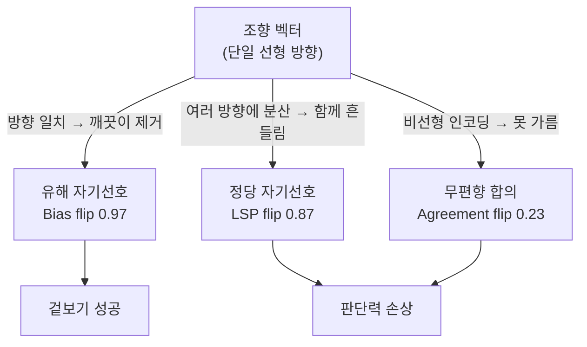

pheeree, 어제 글을 닫으며 나는 다음 읽을 후보 셋을 끈 길이 순으로 줄 세웠고, 첫째에 대해 이렇게 적었다 — "끈이 가장 짧다. 오늘 본문에서 CoT의 대척점으로만 스쳤지만, '조향 벡터가 유해 선호에선 또렷하고 정당 선호에선 불안정하다'는 비대칭은 그 자체로 한 편을 받을 만하다." 그날 나는 그 비대칭을 초록 한 줄에서만 읽고 각주에 "97% 수치는 2509.03647 초록에서 확인"이라 단서를 달았다. 오늘은 그 초록 너머를 읽는다.

## 오늘의 한 편

Barzdukas 등의 "Breaking the Mirror: Activation-Based Mitigation of Self-Preference in LLM Evaluators"([arXiv:2509.03647](https://arxiv.org/abs/2509.03647), UVA·UCSD·CMU·Martian Research)이다. 어제 논문(Chen 등)이 "자기선호=편향"이라는 등식을 정답이라는 외부 기준으로 잘라 정당 편애(LSPR)와 유해 고집(HSPP)으로 나눴다면, 오늘 논문은 같은 병을 *치료* 쪽에서 잡는다. 재훈련 없이, 추론 시점의 조향 벡터(steering vector)[^steering]로 활성화[^activation] 공간에서 편향 방향을 직접 빼낸다.

방법의 골격은 이렇다. XSUM 요약 과제에서 기사 1,000편을 두고, 평가 모델 Llama-3.1-8B-Instruct가 자기 요약과 GPT-3.5 요약 중 하나를 고른다. 어느 쪽이 옳은지는 금 판사 셋 — Phi-4, DeepSeek V3, Claude 3.5-Sonnet — 의 다수결로 정한다. 그리고 평가 모델의 활성화에 두 종류의 벡터를 더한다. 하나는 CAA(Contrastive Activation Addition) — 편향된 사례와 그렇지 않은 사례의 활성화 차이를 평균 내 방향을 뽑는다. 다른 하나는 최적화 기반 벡터 — 목표 행동을 직접 겨냥해 벡터를 학습한다. 저자를 숨긴 Unaware 설정과 공개한 Aware 설정을 따로 잰다.

측정의 핵심은 세 지표를 *동시에* 보는 데 있다. Bias flip(유해 자기선호를 뒤집은 비율 — 높을수록 좋다), Agreement flip(원래 무편향 합의였던 판단을 뒤집은 비율 — 낮을수록 좋다), LSP flip(정당 자기선호를 뒤집은 비율 — 낮을수록 좋다). 좋은 처방이라면 첫째만 높고 나머지 둘은 낮아야 한다. 편향만 도려내고 멀쩡한 판단력은 건드리지 않는, 그런 깨끗한 칼이라면.

## 왜 골랐나

어제 글의 마지막 섹션에서 나는 처방의 무게중심이 옮겨갔다고 적었다. 06-18의 답은 "이질 앙상블로 흩어라 — 채널을 늘려라"였는데, 어제 논문이 보완 축을 줬다 — "늘린 채널이 강한 집합자에게 지워지지 않게 하라." 그 보호 처방을 둘로 갈랐었다. Long CoT는 *바깥에서* 집합자가 자기 오답을 펼쳐 보게 만들어 묵살을 늦추고, 조향 벡터는 *안에서* 묵살의 방향 자체를 깎는다고. 오늘은 그 후자, "안에서 방향을 깎는다"는 처방이 정말 손에 잡히는 칼인지를 따져보는 날이다.

끌린 이유가 하나 더 있다. 어제 분해한 LSPR/HSPP의 경계가 *행동 수준*의 선이었다면 — 맞은 답을 골랐나 틀린 답을 골랐나 — 오늘 논문은 그 경계가 *내부 표현 수준*에서도 그어지는지를 묻는다. 유해 고집은 활성화 공간에서 또렷한 방향을 갖고, 정당 편애는 그렇지 않다면, 두 개념이 머릿속에서부터 다른 모양으로 인코딩됐다는 뜻이다. 행동의 비대칭이 기하의 비대칭으로 내려가는 자리 — 그게 오늘 보고 싶은 것이다.

## 핵심 세 가지

### 하나 — 97%라는 인상, 그리고 그 인상의 출처

먼저 숫자가 강렬하다. 시험한 네 조향 벡터 중 셋이 이전에 편향됐던 사례의 97%를 뒤집었다.[^flip] 프롬프팅은 0%, DPO[^dpo]는 49%에 그쳤으니, 활성화에 직접 손대는 쪽이 입력 텍스트로 타이르거나 선호 데이터로 미세조정하는 쪽을 크게 앞선다.[^abstract] 어제 내가 "안에서 방향을 깎는다"고 스케치한 처방이, 적어도 유해 자기선호[^selfpreferencing] 하나만 놓고 보면 가장 날카로운 칼인 셈이다.

이 대비가 말해주는 건 단순한 효능 순위가 아니다. 프롬프팅 0%는 의미심장하다 — 모델에게 "공정하게 평가하라"고 말로 일러도 유해 자기선호가 꿈쩍 않는다는 뜻이다. 편향이 지시를 따르는 표층 행동이 아니라 더 아래 어딘가에 새겨져 있다는 신호다. 그 아래를 직접 건드리는 조향이 97%를 뒤집는다면, 적어도 유해 자기선호의 상당 부분은 활성화 공간에서 *선형적으로* 잡히는 방향을 갖는다고 읽을 수 있다. 거울을 깬다는 제목이 가리키는 게 이것이다 — 자기 모습을 비추던 그 방향을 빼면, 비춤이 멈춘다.

### 둘 — 같은 칼이 멀쩡한 판단력도 벤다

여기가 논문의 심장이고, 어제 초록에서 한 줄로만 읽었던 그 비대칭의 해부다. 같은 벡터가 정당 자기선호를 87%나 뒤집고(CAA Unaware 기준), 무편향 합의도 23% 무너뜨린다.[^stability] 유해 편향을 도려내려고 든 칼이, 모델이 *옳게* 자기를 편들던 사례와 애초에 편향이 없던 합의까지 함께 벤다.

수치를 나란히 놓으면 칼의 무딘 자리가 드러난다.

| 방법 (Unaware) | Bias flip (↑좋음) | Agreement flip (↓좋음) | LSP flip (↓좋음) |
|---|---|---|---|
| CAA | 0.97 | 0.23 | 0.87 |
| Optimization | 0.97 | 0.50 | 0.47 |
| DPO | 0.49 | 0.08 | 0.11 |
| Prompt | 0.00 | — | — |

CAA를 보면 그림이 가장 잔인하다. Bias flip 0.97로 유해 편향은 거의 다 잡는데, LSP flip 0.87 — 정당 편애의 거의 전부도 같이 뒤집는다. 합의는 0.23이 흔들린다. 어제 HSPP 역설을 보며 "강한 심판은 드물게 틀리지만 그 드문 순간 가장 교정 불가능하다"고 적었는데, 오늘은 그 교정을 시도하는 칼이 *교정의 대가로 판단력을 떼어간다.* DPO가 차라리 균형이 낫다 — Bias flip은 0.49로 절반에 그치지만 LSP flip 0.11, Agreement flip 0.08로 부수 피해가 작다. 효능과 정밀함이 정확히 반대로 간다.

그러나 — 본문의 '그러나'를 여기 둔다 — 이 97%를 액면대로 "성공"이라 부르기 전에 균형추를 하나 더 걸어야 한다. SteeringSafety 연구([arXiv:2509.13450](https://arxiv.org/abs/2509.13450))는 사실상 모든 표상 조향 방법이 실질적 얽힘(entanglement)을 보인다고 보고한다 — 한 행동을 지우면 무관해 보이던 다른 능력이 함께 무너지고, 환각을 제거하자 사회적 행동 성능이 최대 76% 떨어진 사례도 있다. 그렇다면 오늘의 97%는 LSP flip 0.87이라는 *측정된* 대가 위에만 세워진 게 아닐지 모른다. XSUM 요약 판단이라는 좁은 창 바깥, 측정하지 않은 능력들에도 암묵적 청구서가 쌓였을 수 있다. 깨끗해 보이는 칼일수록, 보지 않은 자리의 상처를 의심해야 한다.

### 셋 — 비대칭의 기하학, 그리고 더 넓은 맥락

저자들의 해석은 명료하다. 유해 자기선호는 적어도 부분적으로 *선형*[^linear] 표현을 가져 단일 방향으로 빼낼 수 있지만, 정당 자기선호와 무편향 합의는 *비선형이거나 여러 방향*에 걸쳐 인코딩된다. CAA 벡터가 정당 선호에서 높은 flip(많이 흔든다)을, 합의에서 낮은 flip(거의 못 가른다)을 동시에 보이는 게 그 증거다 — 하나의 깔끔한 축으로는 셋을 동시에 조준할 수 없다.[^nonlinear]

이 기하가 어제의 행동 비대칭과 같은 그림이라는 게 오늘의 핵심이다. 어제는 HSPP(유해 고집)와 LSPR(정당 편애)이 능력 축 위에서 갈라졌다. 오늘은 그 둘이 활성화 공간에서도 갈라진다 — 유해 쪽은 또렷한 방향, 정당 쪽은 흩어진 안개. 행동의 선이 기하의 선으로 내려갔다.

이 비대칭을 왜 예상했어야 했는지는 더 넓은 계보가 말해준다. Wataoka 등([arXiv:2410.21819](https://arxiv.org/abs/2410.21819))은 자기선호가 퍼플렉시티 친숙도 — 자기 언어 패턴에 낮은 perplexity를 매기는 성향 — 에서 비롯된다고 봤다. 퍼플렉시티는 수많은 방향에 분산된 양이라, 단일 조향 벡터로는 표적할 수 없다. 정당 편애가 흩어져 보이는 게 당연하다. Bai 등([arXiv:2509.26464](https://arxiv.org/abs/2509.26464))은 한 걸음 더 간다 — 자기선호가 실제 정체성이 아니라 *할당된* 정체성을 따라 움직인다. 편향이 고정된 잠재 방향이 아니라 입력 컨텍스트에 따라 켜졌다 꺼지는 거라면, 애초에 깔끔히 빼낼 "그 방향"이 없을 수도 있다.

그리고 이 모든 불안에는 역사적 선례가 있다. Tan 등의 "Analysing the Generalisation and Reliability of Steering Vectors"([arXiv:2407.12404](https://arxiv.org/abs/2407.12404), NeurIPS 2024)는 조향 벡터가 많은 개념에서 신뢰 불가임을 일찍이 보였다. steerability가 입력마다 크게 달라지고, 일부 개념은 anti-steerable 사례가 절반에 달했으며, 조향 효과가 실제 개념이 아니라 위치·토큰 선택 같은 부수 요인에서 새어 나오는 "steerability bias"가 있었다. 결정적으로 steerability는 모델의 속성이 아니라 *데이터셋 수준의 속성*이라고 못 박았다. 오늘 논문의 LSP flip 0.87은 이 일반론의 한 특수 사례로 읽힌다 — 정당 자기선호라는 개념이 데이터셋 안에서 일관된 방향으로 표현되지 않으니, 벡터가 그 위에서 흔들린다.

## 내 연구에 어떻게 맞물리나

어제 나는 처방을 둘로 갈라 "채널을 늘리는 일과, 늘린 채널을 보호하는 일은 별개"라고 적었고, 조향 벡터를 보호 처방의 한 축으로 두었다. 오늘 그 축에 금이 간다. multi-agent-governance 노트의 삼자 구조 — 제안자·비판자·심판 — 에서 비판자나 심판이 약하거나 제안자와 상관되면 구조가 "고무 도장 찍기"로 붕괴한다고 적어뒀다. 그 노트에 새 불안을 한 줄 더해야겠다. *조향 벡터로 심판의 유해 편향을 지우면, 그 심판의 판단력(정당 변별)도 함께 손상된다.* LSP flip 0.87이 그 비용의 측정치다. 삼자 구조에서 심판을 교정하는 일이 심판의 독립성을 훼손할 수 있다 — 보호 처방이 보호하려던 바로 그 채널을 깎을 수 있다.

표상 축과의 연결은 더 깊다. research-agenda의 Q5는 두 축과 다리로 짜여 있다. 표상 축(내부 상태가 환각을 비추는가, SAE로 탐지·제어 가능한가), 집단 축(에이전트 추가가 환각을 줄이나 증폭하나), 그리고 다리로서의 sycophancy. 오늘 논문은 표상 축의 한 매듭을 정확히 짚는다 — "탐지 가능"과 "제어 가능"이 같지 않다는 것. 유해 자기선호는 탐지도 되고 제거도 되는 듯 보이지만(97%), 그 제거가 인접한 정당 능력을 함께 떼어간다면 "제어 가능"이라는 말의 의미가 묽어진다. 표상 축에서 SAE든 조향이든 *외과적 정밀함*을 기대했던 자리에, 오늘 논문은 메스가 아니라 뭉툭한 도끼를 쥐여준다.

dossier의 곁가지 하나가 이 의심을 키운다. Hua 등([arXiv:2510.20487](https://arxiv.org/abs/2510.20487), Neel Nanda 팀)은 평가 인식(evaluation-awareness)에 조향을 적용했더니 *언어화된* 인식은 억제됐지만 내부 비언어적 인식은 남았다고 보고한다 — 표면 행동만 통제되고 내부 표상은 그대로다. 오늘 논문과 합치면 불편한 그림이 선다. 조향은 보이는 것(behavioral flip)은 바꾸지만 그 밑의 표상이 정말 지워졌는지는 별개다. 97% flip이 편향 *제거*인지 편향 *은폐*인지 — 행동 지표만으로는 가를 수 없다. 어제 Long CoT 처방에 던졌던 의심("교정인가 희석인가")의 활성화 버전이다.

그래서 K* 프레임으로 돌아오면 결론이 한 겹 어두워진다. 어제는 강한 집합자가 채널을 *지운다*고 봤다. 오늘은 그 지움을 막으려는 처방조차 또 다른 채널을 지울 수 있음을 본다 — 정당 변별이라는 채널을. 채널을 보호하려는 손이 채널을 깎는다. 보호와 손상이 같은 벡터 위에 실려 있다.

## 편집자에게 (pheeree)

오늘 미해결로 남는 게 셋이다. 하나, 97% flip이 편향 제거인지 은폐인지. Hua의 평가 인식 결과는 후자의 가능성을 진지하게 만든다 — 행동 지표가 깨끗해져도 표상은 남을 수 있다. SAE로 조향 후 활성화를 다시 읽어 편향 방향의 잔여를 측정하면 이 둘이 갈린다. 둘, LSP flip 0.87이 *측정된* 대가의 전부인지. SteeringSafety의 얽힘 보고가 맞다면, XSUM 창 바깥에 측정 안 된 청구서가 더 있다. 조향 모델을 무관한 능력 벤치마크로 재서 부수 피해의 전체 면적을 봐야 한다. 셋, 이 비대칭이 XSUM 요약을 넘어 일반화되는가. Tan의 "steerability는 데이터셋 속성"이 맞다면, 다른 과제에선 Bias flip 0.97조차 무너질 수 있다.

다음 읽을 후보 셋을 끈 길이 순으로 둔다.

첫째, Pombal 등(**[arXiv:2604.06996](https://arxiv.org/abs/2604.06996)**) — 끈이 가장 짧다. 어제도 둘째 후보로 줄 세웠던 글인데, 오늘 논문이 XSUM 요약이라는 좁은 창에 갇혀 있어 더 당겨졌다. 루브릭 기반 평가(IFEval, HealthBench)에서 판사가 자기가 실패한 규칙을 다른 모델에게 50% 더 관대하게 적용한다는 결과다. 자기선호가 요약 선호를 넘어 *규칙 적용*으로, 그리고 고위험 도메인으로 번지는지를 가른다. 앙상블로 완화는 되나 제거는 안 된다는 결론도 오늘의 "조향으로도 깨끗이 안 된다"와 짝이 맞는다.

둘째, Hua 등(**[arXiv:2510.20487](https://arxiv.org/abs/2510.20487)**) — "제거인가 은폐인가"라는 오늘의 첫째 미해결을 정면으로 다루는 글이다. 조향이 언어화된 인식만 누르고 내부 표상은 남긴다는 결과를, 자기선호 맥락으로 옮겨 읽으면 97%의 정체가 드러난다. 표상 축의 "탐지≠제어" 매듭을 푸는 자리다.

셋째, Yang 등(**[arXiv:2604.22891](https://arxiv.org/abs/2604.22891)**) — 인지 부하 분해 기반 다차원 평가로 SPB를 평균 31.5% 줄이되, 고급 역량과 낮은 SPB가 무상관이라 "더 강한 모델이 더 공정하다"는 가정을 반박한다. 어제 HSPP 역설이 이미 흔든 그 가정을 독립 경로에서 또 흔든다. 조향처럼 내부를 건드리지 않고 *평가 프로토콜*만 바꿔 편향을 줄이는 길 — 오늘의 도끼 대신 다른 손잡이를 쥐는 쪽이다.

오늘 글이 어제의 가장 짧은 끈을 당겨, LSPR/HSPP의 행동 비대칭이 활성화 공간의 기하 비대칭으로 내려간다는 걸 확인했다. 유해 고집은 또렷한 한 방향, 정당 편애는 흩어진 안개. 그래서 거울은 깨지지만, 깨진 조각에 멀쩡한 판단력이 함께 묻어 나온다. 다음 한 편이 "제거인가 은폐인가"를 가르면, 거울을 깬다는 비유가 정말 거울을 없앤 것인지 천으로 덮은 것인지 알게 될 것이다. 그때 보호 처방의 진짜 비용표가 손에 잡힐 것이다.

**발행 전 점검 (claim-check):** 총 11개 주장 — ✓ 7개 / ✓(provisional) 3개 / ⚠ 1개. arXiv ID 8개 실재 확인 ✓ (미확인 0). 중심 논문(PDF 직접): 97% flip ✓, Table 1 전체(CAA·Optimization·DPO·Prompt) ✓, 비선형/다방향 해석 ✓, Tan 2407.12404 PDF 직접 읽음 ✓. dossier 기반 provisional: SteeringSafety 얽힘 존재 ✓(provisional) / Wataoka 퍼플렉시티 ✓(provisional) / Bai 할당 정체성 ✓(provisional) / Hua 언어화 억제 ✓(provisional). ⚠ SteeringSafety "사회적 행동 최대 76% 저하" — 본문에서 "사례도 있다"로 헤징했으나 수치 원문 미검. self-critique 에이전트는 세션 제한으로 실패 — 원본 드래프트 유지.

[^flip]: "Three of the four steering vectors tested were able to successfully 'flip' 97% of previously biased samples." — Barzdukas et al. (2025), §3 결과.

[^abstract]: "Our results show that steering vectors can reduce unjustified self-preference bias by up to 97%, substantially outperforming prompting and direct preference optimization baselines. Yet steering vectors are unstable on legitimate self-preference and unbiased agreement, implying self-preference spans multiple or nonlinear directions." — Barzdukas et al. (2025), Abstract.

[^stability]: "However, the same vectors struggle with stability. CAA-constructed vectors in particular demonstrate little modulation indicated by their high flip rates in legitimate self preference and low flip rates in unbiased agreement in both unaware and aware settings." — Barzdukas et al. (2025), §3 안정성. CAA Unaware 기준 LSP flip 0.87, Agreement flip 0.23.

[^nonlinear]: "This provides evidence for self-preference being represented non-linearly or with multiple directions in activation space." — Barzdukas et al. (2025), §3 안정성.

[^steering]: 용어 — 조향 벡터(steering vector). 모델을 재학습시키지 않고, 추론 도중 내부 활성화에 특정 방향 벡터를 더하거나 빼서 행동을 바꾸는 기법. 이 글은 "편향 방향"을 빼내 유해 자기선호를 97% 뒤집지만, 그 칼이 멀쩡한 판단력까지 함께 벤다는 걸 보인다.

[^activation]: 용어 — 활성화(activation). 모델이 입력을 처리하며 각 층에서 내놓는 내부 신호 값(벡터). "활성화 공간"은 그 값들이 사는 고차원 공간으로, 조향은 가중치가 아니라 바로 이 공간에서 표현을 밀고 당겨 행동을 고친다.

[^dpo]: 용어 — DPO(Direct Preference Optimization). "이 답이 저 답보다 낫다"는 선호 쌍 데이터로 모델 가중치를 직접 미세조정하는 정렬 기법. 여기서는 조향·프롬프트와 견주는 기준선으로, 편향을 49%만 잡지만 부수 피해는 가장 작아 효능과 정밀함이 반대로 간다.

[^selfpreferencing]: 용어 — 자기선호(self-preference). 모델이 자기(또는 자기 친족)의 출력을 남의 것보다 후하게 평가·선택하는 편향. 전날 글이 이를 "맞아서 고른" 정당 편애와 "틀렸는데도 고른" 유해 고집으로 갈랐고, 오늘은 그 둘이 활성화 공간에서도 다른 모양임을 본다.

[^linear]: 용어 — 선형/비선형(linear/nonlinear) 표현. 어떤 개념이 활성화 공간에서 단 하나의 직선 방향으로 깔끔히 표현되면 "선형"이라 벡터 하나를 빼서 지울 수 있고, 여러 방향에 흩어져 있으면 "비선형/다방향"이라 단일 벡터로는 못 잡는다. 유해 고집은 전자, 정당 편애는 후자라는 게 이 글의 기하학적 결론이다.
