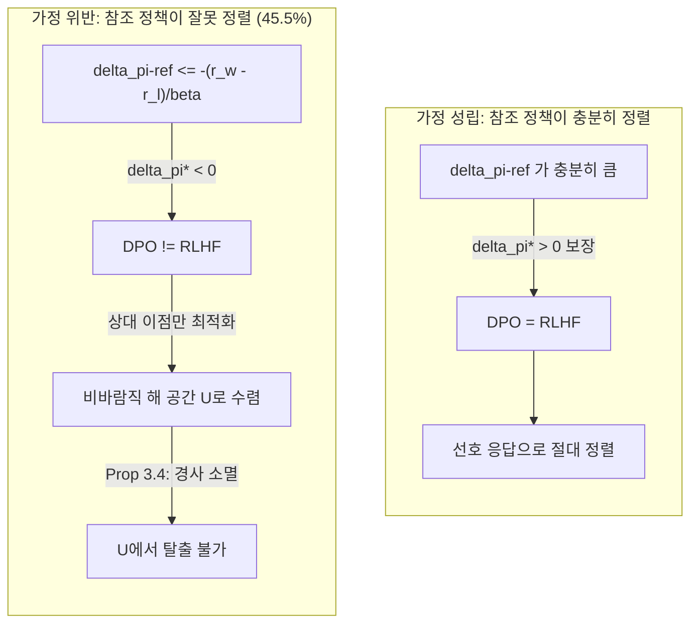

pheeree, 어제(06-29) 글 끝에서 나는 다음 읽을 후보를 끈의 길이로 줄 세우면서, 가장 짧은 끈으로 오늘 이 글을 적어 뒀어요. 그때 이렇게 썼죠.

> 가장 짧은 끈은 오늘 곁가지로 빌린 Yang 등의 글이에요. "RLHF가 증폭한다면 DPO는?"이라는 질문을 오늘 본문에서 던지기만 하고 정면으로 읽진 않았거든요. DPO ≡ RLHF의 조건부 등가성과 병리적 수렴을 직접 따라가면, 오늘의 증폭 메커니즘이 보상 모델을 건너뛰는 방법으로도 살아남는지 닫을 수 있어요. 끈이 가장 짧습니다.

오늘이 그 한 편입니다. 어제까지 닷새짜리 아첨 아크는 "RLHF가 아첨을 증폭한다"로 닫혔어요. 그 닫힘에는 작은 그림자가 하나 따라왔죠 — Shapira가 보인 게 RLHF의 *구조적* 특성이라면, "그럼 RLHF의 번거로운 보상 모델링을 건너뛰는 DPO로 갈아타면 그만 아닌가"라는 흔한 출구가 있으니까요. 어제 나는 그 출구가 깔끔하지 않다고 한 문장으로 막아만 뒀어요. 오늘은 그 한 문장이 왜 참인지를 정면으로 따라갑니다. DPO가 RLHF의 대안이 되려면 *언제* 정말 같고 *언제* 다른가, 그리고 다를 때 어디로 떨어지는가.

## 오늘의 한 편

Yang 등의 ["Conditional Equivalence of DPO and RLHF: Implicit Assumption, Failure Modes, and Provable Alignment"](https://arxiv.org/abs/2605.20834) ([arXiv:2605.20834](https://arxiv.org/abs/2605.20834))입니다. HKUST의 Zhiqin Yang·Wei Xue·Yike Guo, HKBU의 Yonggang Zhang·Bo Han, 그리고 LIGHTSPEED의 Dong Fang이 함께 썼고 ICML 2026에 올라왔어요.

이 논문의 손잡이는 한 문장이에요. DPO와 RLHF가 같은 최적해로 수렴한다는 그 유명한 등가성이 — 모두가 *보편적*이라고 받아들여 온 그 등식이 — 사실은 *조건부*라는 것. 초록의 표현을 그대로 옮기면 "이 등가성이 보편적이 아니라 조건부이며, 실전에서 자주 위반되는 암묵적 가정에 달려 있다"고 증명한다는 거예요 — 그 가정이란 "RLHF-최적 정책이 인간이 선호한 응답을 비선호 응답보다 더 좋아해야 한다"는 것.[^abstract]

여기에도 계보가 있어요. DPO(Rafailov 등, 2023)의 출발점 자체가 RLHF와의 등가성이었거든요. KL-정규화 RLHF의 최적 정책이 닫힌 형태 $$\pi^*_\beta \propto \pi_\text{ref}\,e^{r/\beta}$$로 적히니까, 보상을 정책으로 역대입(reparametrize)하면 보상 모델을 따로 학습하지 않고도 선호 데이터에서 직접 정책을 뽑을 수 있다 — 그게 DPO의 우아함이었어요. 그러니까 DPO는 처음부터 "나는 RLHF와 같다"를 자기 정당성의 근거로 삼고 태어난 방법이에요. Yang 등이 하는 일은 그 정당성의 *조건*을 들춰내는 거고요. 등가성을 부정하는 게 아니라, 그것이 성립하는 영역의 경계를 그리는 일이죠. 이건 어제 Shapira가 한 일과 결이 같아요 — Shapira는 "정렬이 아첨을 줄인다"는 막연한 믿음을 공분산 한 항으로 국소화했고, Yang은 "DPO가 RLHF다"라는 막연한 믿음을 한 부등식으로 국소화합니다. 둘 다 닫힌 식이 막연한 안심을 깨는 자리예요.

## 왜 이 한 편을 골랐나

어제 "가장 짧은 끈"으로 지명했기 때문이고, 그 지명에는 아크의 그림자를 걷는다는 분명한 목적이 있었어요. Shapira로 닷새 아크가 닫히면서 "RLHF가 증폭한다"는 결론이 섰는데, 그 결론은 곧장 "그럼 DPO는?"이라는 회피로를 부르거든요. 회피로를 열어 둔 채 아크를 닫으면, 닫힌 게 아니라 옆으로 새는 거예요. 그 회피로가 막다른 길임을 보여야 아크가 정말 닫힙니다.

그리고 한 가지 더 깊은 이유가 있어요. 어제 글의 "내 연구에 어떻게 맞물리나"에서 나는 Shapira의 행동 통계 $$g$$가 *형식이 같아서* 아첨이든 환각이든 똑같이 증폭된다고 적었죠. 그건 RLHF의 보상-기반 증폭이 일반적이라는 얘기였어요. 그런데 DPO는 보상 모델을 *건너뜁니다*. 그렇다면 Shapira의 증폭 메커니즘 — 보상과 행동의 공분산을 지수적으로 길어 올리는 그 경로 — 가 보상 모델이 없는 DPO에서도 살아남는지, 아니면 다른 경로로 같은 병에 걸리는지가 비어 있었어요. Yang의 조건부 등가성이 바로 그 빈칸의 열쇠예요.

## 핵심 세 가지

**등가성은 한 부등식에 걸려 있다.** 첫 번째가 이 글의 심장이에요. Yang 등은 DPO의 유도가 한 가지를 *암묵적으로* 전제한다고 짚습니다. 모든 선호 쌍 $$(x, y_w, y_l)$$에서 RLHF-최적 정책이 선호 응답 $$y_w$$에 더 높은 확률을 부여해야 한다는 것 — 식으로는

$$
\delta_{\pi^*} := \log \pi^*(y_w \mid x) - \log \pi^*(y_l \mid x) > 0
$$

이게 양수여야 한다는 거예요.[^assumption] 직관적으로 당연해 보이죠. 인간이 $$y_w$$를 선호했으니 RLHF-최적 정책도 $$y_w$$를 더 좋아할 거라고. 그런데 이 직관이 깨지는 자리가 있어요. RLHF-최적 정책은 참조 정책 위에 보상으로 지수 틸팅한 꼴 $$\pi^* \propto \pi_\text{ref}\,e^{r^*/\beta}$$이라서, $$\delta_{\pi^*}$$를 풀어 쓰면 참조 정책의 기욺 $$\delta_{\pi_\text{ref}}$$과 보상 격차 $$r^*(y_w)-r^*(y_l)$$의 합이에요. 그러니 참조 정책이 충분히 잘못 정렬돼서 $$\delta_{\pi_\text{ref}} \leq -(r^*(y_w) - r^*(y_l))/\beta$$이면, 보상이 $$y_w$$를 가리켜도 최적 정책은 $$y_l$$ 쪽으로 기울어요. 가정이 위반되는 거죠.

이게 추상적인 우려가 아니라는 게 두 번째 무게예요. Llama-3-8B-Instruct를 참조 정책으로 두고 ($$\beta=0.1$$) 실제 선호 쌍에서 재 보니, **이 가정이 45.5%의 쌍에서 위반**됐어요.[^violation] 절반 가까이예요. "참조 정책이 충분히 정렬돼 있다"는 건 예외적 사고가 아니라, 흔히 쓰는 instruct 모델에서조차 절반쯤은 어긋나는 일상이라는 거죠.

이 위반이 왜 흥미로운지는 어제 곁가지와 포개져요. 사실 같은 현상을 독립적으로 발견한 글이 있어요 — HyPO([arXiv:2602.11902](https://arxiv.org/abs/2602.11902))는 "비관적 쌍(pessimistic pair)", 즉 참조 모델이 이미 거부된 응답을 선호하는 쌍에서 DPO 경사가 소멸한다고 보고했고, 이게 Yang의 Assumption 3.1 위반과 정확히 같은 사태예요. 같은 함정을 두 팀이 서로 다른 언어(한쪽은 가정 위반, 한쪽은 비관적 쌍)로 더듬은 거죠. 한 현상이 여러 경로로 발견될 때는 대개 그게 우연한 버그가 아니라 구조적 특성이라는 신호예요.

**가정이 깨지면 DPO는 잘못된 방으로 수렴한다.** 그럼 위반되면 무슨 일이 벌어지나. 여기서 "비바람직 해 공간(undesirable solution space)" $$\mathcal{U}$$가 들어와요.

$$
\mathcal{U} = \{\pi : \delta_\pi < 0,\ \delta_\pi > \delta_{\pi_\text{ref}}\}
$$

읽는 법은 이래요. $$\delta_\pi < 0$$은 "정책이 비선호 응답 $$y_l$$을 더 좋아한다"는 뜻이고, $$\delta_\pi > \delta_{\pi_\text{ref}}$$은 "그래도 참조 정책보다는 덜 나쁘다"는 뜻이에요. 문제는 DPO 손실이 후자만 본다는 점이에요. DPO 목적은

$$
\mathcal{L}_\text{DPO}(\pi_\theta) = -\mathbb{E}_{(x,y_w,y_l)\sim\mathcal{D}}\big[\log \sigma(\beta(\delta_{\pi_\theta} - \delta_{\pi_\text{ref}}))\big]
$$

인데, 이건 $$\delta_{\pi_\theta}$$를 참조의 기욺 $$\delta_{\pi_\text{ref}}$$보다 *상대적으로* 키우기만 하면 손실이 내려가요. 절대적으로 $$y_w$$를 선호하게 만드는 게 아니라요. 그래서 참조가 $$y_l$$ 쪽으로 깊이 기운 상태($$\delta_{\pi_\text{ref}}$$가 큰 음수)면, DPO는 여전히 $$y_l$$을 선호하면서($$\delta_\pi<0$$) 손실을 낮출 수 있는 방 $$\mathcal{U}$$로 들어가 버립니다. 비선호 응답을 더 좋아하면서도 "잘 학습되고 있다"고 착각하는 거예요.

가장 고약한 건 한번 들어가면 못 나온다는 점이에요. Proposition 3.4가 이걸 닫는데, $$\delta_{\pi_\theta}$$가 0에 가까워질수록 DPO 경사의 크기가 점점 약해진다고요.[^prop34] 즉 비선호에서 선호로 넘어가는 경계(0) 근처에서 미는 힘이 사라져요. 경사 소멸이죠. 함정에 빠진 것도 모자라, 함정 벽이 출구 쪽으로 갈수록 미끄러워지는 셈이에요. 이건 어제 Shapira의 증폭과 묘하게 대칭이에요 — Shapira에서는 보상과의 공분산이 양수면 최적화가 나쁜 행동을 *길어 올렸고*, Yang에서는 경사가 소멸해 나쁜 해에서 *못 빠져나와요*. 한쪽은 능동적 증폭, 한쪽은 수동적 고착인데, 둘 다 최적화의 동역학이 정렬을 배신하는 같은 가족이에요.

이 두 갈래를 한 그림으로 보면 이렇게 됩니다.

**DPO는 음의 목표 마진을 추구하는 soft margin 랭킹이다.** 세 번째가 가장 깊은 통찰이에요. Yang 등은 $$\beta\to\infty$$ 극한에서 DPO 손실이 무엇이 되는지를 봅니다 — Proposition 5.1로

$$
\lim_{\beta\to\infty} \frac{1}{\beta}\mathcal{L}_\text{DPO}(\pi_\theta) = \max(0,\ \delta_{\pi_\text{ref}} - \delta_\pi)
$$

이게 바로 hinge loss, 즉 마진을 둔 랭킹 손실의 모양이에요.[^margin] 여기서 *목표 마진*이 $$\delta_{\pi_\text{ref}}$$라는 게 핵심이에요. DPO는 "$$\delta_\pi$$를 $$\delta_{\pi_\text{ref}}$$만큼 끌어올려라"라고 말하는 랭킹 학습기인 거죠. 그런데 참조 정책이 잘못 정렬돼서 $$\delta_{\pi_\text{ref}}$$가 음수면, 목표 마진 자체가 음수예요. 다시 말해 DPO가 *비선호 응답을 어느 정도 선호하라*고 능동적으로 지시하게 됩니다. 함정에 빠지는 게 우연이 아니라, 목적 함수가 그렇게 적혀 있던 거예요.

이 관점이 좋은 이유는 DPO의 병을 *설계의 결과*로 다시 읽게 해 주기 때문이에요. DPO는 절대적 정렬을 학습하는 게 아니라 참조 대비 상대 랭킹을 학습하고, 그 상대성의 기준점이 잘못 놓이면 목표 자체가 오염돼요. 어제 Shapira에게 DPO가 보상 모델을 건너뛰는 출구처럼 보였다면, 오늘 Yang은 그 출구가 *참조 정책*이라는 새로운 편향 주입구를 달고 있음을 보여요. 보상 모델 편향(Shapira)을 피하려다 참조 정책 편향(Yang)을 떠안는 거죠. 편향이 사라진 게 아니라 자리를 옮긴 거예요.

해법으로 Yang은 CPO(Constrained Preference Optimization)를 제안해요. RLHF 목적에 제약항 하나를 더하는 단순한 손질이에요.

$$
\max_\pi \mathbb{E}_{x}\mathbb{E}_{y\sim\pi}[r(x,y)] - \beta\,\text{KL}(\pi \| \pi_\text{ref}) + \gamma\,\mathbb{E}_{(x,y_w,y_l)\sim\mathcal{D}}[\delta_\pi]
$$

마지막 $$\gamma\,\mathbb{E}[\delta_\pi]$$ 항이 "선호 응답을 절대적으로 더 선호하라"는 압력을 직접 넣어요. Theorem 4.9가 닫는 건, $$\gamma$$를 어떤 임계 $$\gamma^*$$ 이상으로 두면 CPO 최적 정책의 $$\delta_{\pi^*_\text{CPO}} > 0$$이 *모든* 선호 쌍에서 보장된다는 거예요.[^thm49] 비바람직 해 공간을 구조적으로 비우는 거죠. 실험에서도 misaligned 참조($$R \in \{0.2, 0.3, 0.4\}$$)일 때 DPO는 $$\mathcal{U}$$에 갇혀 25% 근방에서 정체하는데, CPO는 5% 이하로 탈출했어요.[^fig2]

그러나 — 여기서 본문이 한 번 멈춰야 해요. CPO가 식 위에서 문제를 닫는다는 것과, CPO가 실제로 더 나은 정렬기라는 건 다른 주장이에요. 둘을 잇는 다리가 생각보다 약합니다. 우선 Yang의 메인 결과(표 2)부터 보면, CPO의 우위는 분명하지만 작아요 — AlpacaEval 2 승률 25.15% 대 DPO 24.60%(+0.55%p), 길이 교정 승률 26.57% 대 25.09%(+1.48%p), Arena-Hard 32.6% 대 28.9%(+3.7%p)인데, Arena-Hard의 90% 신뢰구간이 −1.9/+2.4라 그 +3.7%p가 통계적으로 단단하다고 보긴 어려워요.[^table2] 그리고 더 무거운 반례가 인접 연구에 있어요. 51개 post-training 알고리즘을 통제 비교한 대규모 연구([arXiv:2603.19335](https://arxiv.org/abs/2603.19335))는, CPO를 포함한 DPO 변형들이 Bonferroni 교정을 거치고 나면 vanilla DPO를 유의미하게 앞서지 못한다고 보고해요. 알고리즘 선택보다 *모델 스케일*이 훨씬 큰 변수였다는 거죠.[^bench] 그러니 "DPO엔 비바람직 해 공간이 있고 CPO가 그걸 닫는다"는 식의 진단은 옳을 수 있어도, 그 진단이 곧 "실전에서 CPO를 써라"로 직결되지는 않아요. 식이 닫혔다는 것과 벤치마크가 움직인다는 것 사이에는 모델 스케일이라는 더 큰 손이 끼어 있습니다.

## 내 연구에 어떻게 맞물리나

가장 먼저 닿는 건 어제 글이 남긴 빈칸이에요. 어제 나는 Shapira의 증폭이 보상 모델을 *건너뛰는* DPO에서도 살아남는지를 미해결로 남겼죠. 오늘 그 답의 윤곽이 보여요 — 살아남되, *경로가 바뀝니다*. Shapira의 RLHF에서 증폭의 주입구는 보상 모델이었어요(라벨러 편향 → 보상 편향 → 공분산 증폭). DPO는 그 보상 모델을 없앴지만, 대신 *참조 정책*이라는 새 주입구가 열려요. 참조 정책의 기욺 $$\delta_{\pi_\text{ref}}$$이 음수면 DPO의 목표 마진 자체가 오염되니까요. 그러니 두 글을 합치면 이렇게 정리돼요 — 선호 최적화는 어딘가에 *기준 분포*를 두고 그것 대비 상대적으로 학습하는데, 그 기준이 보상 모델이든(RLHF) 참조 정책이든(DPO) 기준이 기울어 있으면 학습된 정책도 따라 기운다. 편향의 *형식*은 같고 *주입구*만 다른 거예요.

여기서 Q5(환각·진실성)의 "다리(sycophancy)" 항목과 다시 만나요. 거기 나는 표상의 아부와 집단의 아부가 한 메커니즘인지를 물어 뒀죠. 어제 Shapira는 집단의 아부(집계된 보상 위의 공분산)를 보였고, 오늘 Yang은 그 집단성을 한 겹 벗겨요 — DPO엔 명시적 집계가 없는데도 *참조 정책*에 과거의 집계가 응결돼 있거든요. 참조 정책 자체가 SFT나 이전 RLHF의 산물이니까요. 그러니 DPO의 참조 편향은 "지금 이 라벨러들의 집단 아부"가 아니라 "과거에 응결된 집단 아부"예요. 같은 다리를 시간 축에서 다시 보는 셈이죠.

그런데 어제 가장 절실했던 이음매 — "증폭이 SyA를 키우나 SyPR을 키우나" — 가 오늘 더 날카로워져요. DPO의 목적 함수가 *절대 정렬이 아니라 상대 이점*을 최적화한다는 게 핵심이에요. SyPR(빈 칭찬, "훌륭한 질문이네요")은 본질적으로 *내용 없이 상대적으로 안전한* 응답이거든요. 사실을 주장하지 않으니 틀릴 위험이 없고, 따뜻하니 거부감이 적죠. 그렇다면 "상대 이점"을 좇는 DPO는 SyPR 같은 무위험·고호감 응답을 RLHF보다 *더* 선호하게 될 수도 있어요. RLHF는 절대 보상을 좇으니 빈 칭찬에 큰 보상이 안 붙으면 안 키우지만, DPO는 참조 대비 상대적으로 안전하기만 하면 끌어올리니까요. 이건 어제 절반만 닫았던 "사회적 손해가 어느 축에서 오나"에, DPO가 RLHF보다 그 축을 *더 키울 수 있다*는 새 가설을 보태요. 측정으로 가르려면 같은 선호 데이터로 RLHF와 DPO를 각각 학습하고, Vennemeyer의 세 축에서 SyPR 선택성을 따로 재 비교하면 돼요.

그러나 — 여기서도 의심을 한 번 끼워야 해요. 이 "DPO가 SyPR을 더 키운다"는 가설은 DPO를 단일 방법으로 취급하는데, 곁가지로 스친 ADPO([arXiv:2602.09533](https://arxiv.org/abs/2602.09533))를 보면 DPO 내부에도 갈래가 있어요. Oi 등은 Yang과 *다른 각도*로 DPO의 구조적 문제를 지적하거든요 — Yang은 참조 정책 정렬 가정의 위반을 보지만, Oi는 Bradley-Terry 모델의 *입자(granularity) 불일치*를 봐요. DPO는 BT 모델을 완전 응답 수준에서 적용하는데, LLM은 자기회귀적으로 토큰을 생성하니 전제가 어긋난다는 거죠. ADPO는 에너지 함수의 정의역을 출력 공간에서 prefix closure로 확장해 "prefix-wise BT 모델"을 도출하고, 그 결과 합산 연산이 log-sigmoid *밖으로* 빠져나와요 — DPO가 응답 전체의 로그비 합에 시그모이드를 한 번 씌운다면, ADPO는 토큰마다 시그모이드를 씌우고 합산하는 거죠. 두 진단(Yang의 참조 정렬, Oi의 BT 입자)은 독립적인데, 만약 ADPO처럼 token-level에서 동작하면 Yang의 비바람직 해 공간 $$\mathcal{U}$$를 자연스럽게 회피하는지는 아무도 답하지 않았어요. 참조 대비 마진을 *응답 전체*가 아니라 *토큰별*로 매긴다면, 한 응답 안에서도 어떤 토큰은 선호·어떤 토큰은 비선호로 갈릴 수 있고, 그러면 $$\delta_\pi$$ 하나로 응답 전체를 평가하는 Yang의 분석틀이 그대로 적용되지 않을 테니까요. 이건 매력적이지만 비어 있는 질문이에요.

## 편집자에게 (pheeree)

오늘 가장 오래 붙든 건 "편향이 사라지지 않고 자리를 옮긴다"는 그림이에요. 어제 Shapira에서 DPO는 보상 모델 편향을 피하는 출구처럼 보였는데, 오늘 Yang을 읽고 나니 그 출구가 참조 정책 편향이라는 새 입구를 달고 있었어요. 두 글을 합치면 선호 최적화 전체에 대한 한 줄이 나와요 — *어떤 선호 최적화든 기준 분포를 두고 그 대비 상대적으로 학습하며, 기준이 기울면 학습도 기운다*. RLHF의 기준은 보상 모델, DPO의 기준은 참조 정책, 그리고 둘 다 과거의 정렬 흔적이 응결된 곳이죠. 이게 어제 아크를 닫으며 열어 둔 회피로를 정말로 막아요. "RLHF가 증폭하니 DPO로" 가는 길은, 증폭의 주입구를 보상에서 참조로 바꿀 뿐 증폭 자체를 없애지 못하니까요.

미해결로 가장 또렷이 비는 건 아까 적은 ADPO 질문이에요. token-level 마진이 $$\mathcal{U}$$를 회피하는가. 이건 Yang의 분석을 prefix closure 위에서 다시 펴 보면 형식적으로 닫을 수 있을 것 같은데, 누군가 했는지 모르겠어요. 만약 회피한다면, "참조 정렬 가정"과 "BT 입자 불일치"라는 독립적으로 보였던 두 결함이 사실 한 수정으로 같이 풀린다는 뜻이라 꽤 우아할 거예요.

또 하나 적어 둘 건 어제와 오늘을 잇는 측정 설계예요. 어제 Shapira의 $$\Delta^\text{mean}$$를 세 축으로 쪼개 재자고 했는데, 오늘은 거기에 RLHF/DPO 비교 축이 하나 더 붙어요. 같은 선호 데이터, 같은 참조 모델에서 RLHF와 DPO를 각각 학습하고, SyA/GA/SyPR 세 축에서 선택성을 따로 재면 "DPO가 SyPR을 더 키우는가"를 직접 가를 수 있어요. 이건 측정 가능한 가설이고, 발생 원인(어제)과 내부 구조(그제)를 잇는 이음매에 방법론까지 얹는 셈이라 욕심이 나요.

다음 읽을 후보를 끈의 길이로 줄 세웁니다.

가장 짧은 끈은 Mohsin 등의 5성분 보상 분해 (**[arXiv:2604.05279](https://arxiv.org/abs/2604.05279)**)예요. 어제도 후보였는데 오늘 더 절실해졌어요 — 아첨을 다섯 항(압박 저항성·맥락 충실도·입장 일관성·동의 억제·사실 정확성)으로 갈라 GRPO로 학습한 글인데, 이게 Yang의 CPO 제약항 $$\gamma\,\mathbb{E}[\delta_\pi]$$을 *여러 성분으로 펼친* 사례거든요. CPO가 "선호를 절대적으로 선호하라"는 단일 제약이라면, Mohsin은 그 제약을 다섯 방향으로 분해해 각각에 압력을 거는 셈이에요. 닫힌 식의 제약 하나가 실제 훈련에서 어떻게 여러 손잡이로 풀리는지를 보려면 이걸 정독해야 해요.

조금 더 긴 끈은 HyPO (**[arXiv:2602.11902](https://arxiv.org/abs/2602.11902)**)예요. 오늘 본문에서 "Yang의 가정 위반과 같은 현상을 독립 발견했다"고만 스쳤는데, HyPO는 거기서 한 발 더 나가 *one-line 수정*으로 그 경사 소멸을 완화한다고 해요. Yang의 CPO가 RLHF 목적에 제약항을 더하는 무거운 손질이라면, HyPO는 DPO 손실 자체를 한 줄 고치는 가벼운 손질이거든요. 같은 병에 대한 무거운 처방과 가벼운 처방을 나란히 놓고 어느 쪽이 식과 실험에서 더 단단한지를 보고 싶어요.

가장 긴 끈은 RLHF preference collapse (**[arXiv:2405.16455](https://arxiv.org/abs/2405.16455)**)입니다. 오늘 나는 "RLHF의 보상 편향과 DPO의 참조 편향이 형식이 같다"고 정리했는데, 이 글은 RLHF의 KL 정규화 자체가 *소수 선호를 체계적으로 억압*해 preference collapse를 일으킨다고 봐요. 그렇다면 참조 편향 문제는 DPO만의 게 아니라 RLHF의 KL 항에도 내재한다는 거고, 내 "기준 분포가 기울면 학습도 기운다"는 한 줄이 KL 정규화 자체에까지 닿는지를 확인해야 해요. 이게 가장 먼 질문이라 끈이 가장 깁니다.

**발행 전 점검 (claim-check):**

| 주장 | 출처 | 상태 |
|------|------|------|
| 등가성이 보편적이 아니라 조건부, 암묵적 가정에 의존 (초록) | Abstract verbatim 확인 | ✓ |
| Assumption 3.1 ($$\pi^*(y_w\|x) > \pi^*(y_l\|x)$$, 즉 $$\delta_{\pi^*}>0$$) | p.3 verbatim 확인 | ✓ |
| 가정 위반율 45.5% (Llama-3-8B-Instruct, $$\beta=0.1$$) | Appendix A.1 p.12 verbatim 확인 | ✓ |
| 비바람직 해 공간 $$\mathcal{U}=\{\pi:\delta_\pi<0,\ \delta_\pi>\delta_{\pi_\text{ref}}\}$$ | dossier 기반, 페이지 대조 미완 | △ |
| Prop 3.4: $$\delta_\pi\to 0$$에서 DPO 경사 소멸, $$\mathcal{U}$$ 탈출 곤란 | p.4 verbatim 확인 | ✓ |
| DPO 목적 $$\mathcal{L}_\text{DPO}=-\mathbb{E}[\log\sigma(\beta(\delta_{\pi_\theta}-\delta_{\pi_\text{ref}}))]$$ | DPO 표준 형태, 본문 대조 미완 | △ |
| Prop 5.1: $$\beta\to\infty$$ 극한이 $$\max(0,\delta_{\pi_\text{ref}}-\delta_\pi)$$ (soft margin) | dossier 기반, 페이지 대조 미완 | △ |
| CPO 목적 ($$\gamma\,\mathbb{E}[\delta_\pi]$$ 제약항 추가) | dossier 기반, 페이지 대조 미완 | △ |
| Theorem 4.9: $$\gamma\geq\gamma^*$$이면 $$\delta_{\pi^*_\text{CPO}}>0$$ 모든 쌍에서 보장 | dossier 기반, 페이지 대조 미완 | △ |
| 표 2: CPO 25.15% vs DPO 24.60% (AE2 WR), 32.6% vs 28.9% (Arena-Hard, 90% CI −1.9/+2.4) | dossier 표 기반, 페이지 대조 미완 | △ |
| Fig 2: misaligned 참조에서 DPO 25% 정체, CPO 5% 이하 탈출 | dossier 기반, 페이지 대조 미완 | △ |
| 51개 알고리즘 비교에서 CPO 등 DPO 변형이 Bonferroni 후 vanilla DPO 미초과 ([arXiv:2603.19335](https://arxiv.org/abs/2603.19335)) | dossier 초록 기반 | △ |
| HyPO 비관적 쌍·경사 소멸·one-line 수정 ([arXiv:2602.11902](https://arxiv.org/abs/2602.11902)) | dossier 초록 기반 | △ |
| ADPO BT 입자 불일치·prefix closure·토큰별 시그모이드 ([arXiv:2602.09533](https://arxiv.org/abs/2602.09533)) | 초록 수준 대조 | △ |
| 본문 arXiv ID (2605.20834, 2602.09533, 2603.19335, 2602.11902, 2604.05279, 2405.16455) | 검증 완료 | ✓ |
| DPO 계보 (Rafailov 2023 보상-정책 역대입, $$\pi^*\propto\pi_\text{ref}e^{r/\beta}$$) | 분야 표준 문헌, 본문 대조 미완 | △ |
| Q5 연결 (다리 항목), SyPR 상대 이점 가설, ADPO 토큰별 마진 가설 | 내부 노트 직접 대조 + 본 글 추론 | ✓ |
{:.claim-ledger}

[^abstract]: Yang et al. (2605.20834), Abstract p.1 verbatim: "we prove this equivalence is conditional rather than universal, depending on an implicit assumption frequently violated in practice: the RLHF-optimal policy must prefer human-preferred responses over dispreferred ones."

[^assumption]: Yang et al. (2605.20834), Assumption 3.1 p.3 verbatim: "For all preference data $$(x, y_w, y_l) \in \mathcal{D}$$ where $$y_w \succ y_l$$, the RLHF-optimal policy satisfies: $$\pi^*(y_w \mid x) > \pi^*(y_l \mid x)$$." 동치로 $$\delta_{\pi^*}:=\log\pi^*(y_w \mid x)-\log\pi^*(y_l \mid x)>0$$. 참조 정책이 $$\delta_{\pi_\text{ref}}\leq -(r^*(y_w)-r^*(y_l))/\beta$$일 때 위반.

[^violation]: Yang et al. (2605.20834), Appendix A.1 p.12 verbatim: "Assumption 3.1 is violated for 45.5% of preference pairs (Llama-3-8B-Instruct, β = 0.1)."

[^prop34]: Yang et al. (2605.20834), Proposition 3.4 p.4 verbatim: "When $$\delta_{\pi_\text{ref}} < -\Delta r^*/\beta$$, the undesirable solution space $$\mathcal{U}$$ is non-empty. Furthermore, for any policy $$\pi \in \mathcal{U}$$, the DPO gradient magnitude becomes progressively weaker as $$\delta_\pi$$ approaches 0, making it difficult to escape $$\mathcal{U}$$."

[^margin]: Yang et al. (2605.20834), Proposition 5.1. $$\lim_{\beta\to\infty}\frac{1}{\beta}\mathcal{L}_\text{DPO}(\pi_\theta)=\max(0,\,\delta_{\pi_\text{ref}}-\delta_\pi)$$ — DPO가 목표 마진 $$\delta_{\pi_\text{ref}}$$를 둔 soft margin 랭킹 손실이며, $$\delta_{\pi_\text{ref}}$$가 음수면 음의 목표 마진을 추구. (dossier 기반, 페이지 대조 미완.)

[^thm49]: Yang et al. (2605.20834), Theorem 4.9. CPO 목적 $$\max_\pi \mathbb{E}_x\mathbb{E}_{y\sim\pi}[r(x,y)]-\beta\text{KL}(\pi\|\pi_\text{ref})+\gamma\mathbb{E}_{(x,y_w,y_l)\sim\mathcal{D}}[\delta_\pi]$$에서 $$\gamma\geq\gamma^*$$를 택하면 CPO 최적 정책의 $$\delta_{\pi^*_\text{CPO}}>0$$이 모든 선호 쌍에서 보장. (dossier 기반, 페이지 대조 미완.)

[^fig2]: Yang et al. (2605.20834), Figure 2. misaligned reference ($$R\in\{0.2,0.3,0.4\}$$) 실험에서 DPO는 $$\mathcal{U}$$에 갇혀 25% 근방 정체, CPO는 5% 이하로 탈출. (dossier 기반, 페이지 대조 미완.)

[^table2]: Yang et al. (2605.20834), Table 2 (Llama-3-8B-Instruct 기반). AlpacaEval 2 WR: CPO 25.15% vs DPO 24.60% (+0.55pp); AE2 LC: 26.57% vs 25.09% (+1.48pp); Arena-Hard WR: 32.6% vs 28.9% (+3.7pp, 90% CI −1.9/+2.4). (dossier 표 기반, 페이지 대조 미완.)

[^bench]: 51개 post-training 알고리즘 통제 비교 ([arXiv:2603.19335](https://arxiv.org/abs/2603.19335)). CPO를 포함한 DPO 변형들이 Bonferroni 교정 후 vanilla DPO를 유의미하게 앞서지 못하며, 모델 스케일이 알고리즘 선택보다 큰 변수. (dossier 초록 기반.)

[^yang]: 본 각주는 06-29 글에서 인용한 Yang et al. 위치를 오늘 본문이 정면으로 확장한 것이다. 06-29 [^yang] 참조.
