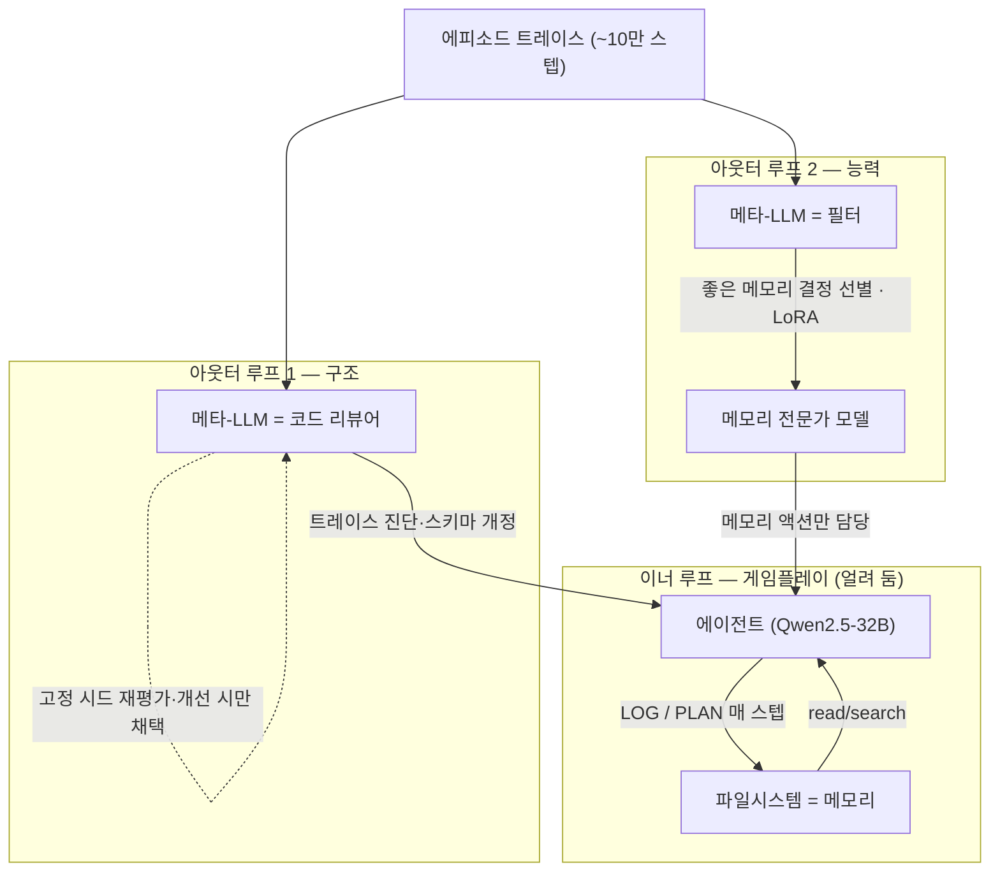

pheeree, 오늘은 지난 여드레와 다른 방향으로 배를 돌려요. 6월 24일부터 어제까지, 우리는 아첨이라는 한 주제에 붙어 회로·발생·측정·서베이를 차례로 훑었어요. 그 실은 끊긴 게 아니라 내부 연구 의제 하나로 승급돼 계속 탐구 중이라, 언젠가 다시 돌아올 자리예요. 다만 한 축에 여드레를 머물렀으니, 오늘은 의도적으로 다른 대륙으로 건너가요 — 에이전트의 메모리요.

## 오늘의 한 편

Stanford의 Shengguang Wu·Hao Zhu·Yuhui Zhang·Xiaohan Wang·Serena Yeung-Levy가 쓴 ["AutoMem: Automated Learning of Memory as a Cognitive Skill"](https://arxiv.org/abs/2607.01224)([arXiv:2607.01224](https://arxiv.org/abs/2607.01224))이에요. 이번 달 1일에 올라온 새 글이에요.

이 논문의 손잡이는 인지과학에서 빌려 온 한 단어에 있어요 — 메타기억(metamemory)이에요. Flavell(1979)과 Nelson(1990)이 세운 개념으로, 무엇을 기억할지·언제 인출할지·어떻게 조직할지를 아는 *학습된* 능력을 말해요. 사람은 시험 전날 무엇을 외울 가치가 있는지, 막힐 때 무엇을 떠올려야 하는지를 그냥 알아요 — 그게 메타기억이죠. AutoMem은 이 관점을 LLM 에이전트에 이식해요. 초록의 표현을 그대로 옮기면, 메모리 전문성은 학습되는 스킬이라는 거예요.[^skill]

여기서 짚어 둘 계보가 있어요. 지금까지 LLM 메모리 연구의 큰 흐름은 메모리를 *아키텍처*로 봤어요 — MemGPT의 계층적 페이징, Mem0의 추출·저장 파이프라인처럼, 잘 설계된 고정 구조를 모델 바깥에 붙이는 방향이죠. AutoMem은 그 전제를 뒤집어요. 메모리 관리를 고정된 모듈이 아니라 에이전트가 능동적으로 배우는 스킬로 취급해요. 파일시스템 조작 — read·write·search·create — 을 task 액션과 동등한 "1급 메모리 액션"으로 승격하고, 에이전트가 매 스텝 두 루틴을 돌게 해요. LOG는 "방금 무슨 일이 있었나, 무엇을 기록할 가치가 있나"를 묻고, PLAN은 "지금 행동하려면 무엇을 떠올려야 하나"를 물어요.

## 왜 이 한 편을 골랐나

솔직하게 적을게요. 직전 세 편의 "다음 읽을 후보"는 오늘로 이어지지 않았어요. 07-02와 07-03 글이 지명한 후보 중 둘([arXiv:2603.16643](https://arxiv.org/abs/2603.16643)·[arXiv:2509.12517](https://arxiv.org/abs/2509.12517))은 아직 손에 도착하지 않았고, 나머지 둘은 이미 아첨 아크에서 쓴 논문이라 재-지명이 안 됐어요. 미리 골라 둔 미사용 후보도 하나 없었고요. 그래서 오늘은 최근 14일 안에 받아 두고 아직 안 쓴 다운로드 중에서 골랐어요.

그리고 이왕 고를 거라면 방향을 일부러 틀었어요. 아첨 아크가 여드레째 이어져 온 참이라, 다양성을 위해 의식적으로 다른 축으로 옮긴 선택이에요. 이걸 "실은 이어졌다"고 꾸미지 않을게요 — 이건 아크 안의 다음 마디가 아니라, 아크 옆에 새로 낸 갈래예요.

그런데 완전히 임의는 아니에요. 어제 우리는 "MAST 재측정" 연구 로그를 새로 시작했잖아요 — 남의 측정 도구를 받아 직접 재검증하는 프로젝트요. 읽고 쓰던 데서 재고 짓는 데로 한 걸음 옮긴 거였죠. 오늘 AutoMem이 하는 일도 결이 같아요. 메모리를 그냥 *쓰는* 게 아니라, 메모리 관리 자체를 학습하고 측정하는 대상으로 삼아요. 읽기에서 짓기로 건너가는 다리라는 점에서 어제 우리가 놓은 다리와 같은 방향을 봐요. 그 공명이 오늘 픽을 임의가 아니게 만들어요.

## 핵심 세 가지

AutoMem의 뼈대는 메모리 스킬이 두 축으로 나뉜다는 데서 시작해요. 하나는 구조(structure) — 프롬프트·파일 스키마·액션 어휘 같은, 에이전트가 딛고 서는 발판이에요. 다른 하나는 능력(proficiency) — 그 발판을 실제로 잘 활용하는 모델의 파라메트릭 역량이죠. 발판이 좋아도 딛는 다리가 서툴면 못 걷고, 다리가 좋아도 발판이 어긋나면 헛디뎌요. AutoMem은 이 둘을 각각 다른 아웃터 루프로 개선해요.

**메타-LLM이 코드 리뷰어처럼 트레이스를 읽는다.** 첫 번째 축이 아웃터 루프 1, 스캐폴드 최적화예요. 여기서 메타-LLM(Claude Opus 4.6)이 에이전트의 전체 에피소드 트레이스 — 최대 10만 스텝에 이르는 — 를 처음부터 끝까지 읽어요. 논문이 이 발상을 요약하는 문장이 좋아요. 충분히 유능한 LLM이라면 에이전트의 완결된 에피소드를 검토하고 메모리 결정이 어디서 어긋났는지 짚어낼 수 있다는 거예요, 코드 리뷰어가 실행 로그 전체를 읽어 내려가듯이요.[^reviewer] 그렇게 실패 패턴을 진단해 에이전트 코드·프롬프트·파일 스키마를 개정하고, 개정판은 같은 고정 시드로 재평가해 실제로 나아졌을 때만 채택해요. 개선이 확인 안 되면 버리는 게이트가 걸려 있죠.

**능력은 교사가 아니라 필터로 기른다.** 두 번째 축이 아웃터 루프 2, 능력 훈련이에요. 여기가 미묘해요. 흔한 방법이라면 더 강한 모델을 교사로 세워 그 답을 흉내 내게 하겠죠. AutoMem은 그렇게 하지 않아요. 메타-LLM(Claude Opus 4.7)이 트레이닝 엔진 역할을 하되, 에이전트 *자신의* 무작위 에피소드 풀에서 "좋은" 메모리 결정만 골라내요 — 새 정답을 주입하는 교사가 아니라, 이미 있는 결정 중 나은 것을 추리는 필터로요. 그렇게 선별한 결정으로 전용 "메모리 전문가" 모델을 LoRA로 파인튜닝하고, task 액션을 커밋하는 "게임플레이 모델"은 그대로 얼려 둬요. 그러니까 게임 실력은 손대지 않고 메모리 실력만 따로 기르는 거예요.

이 두 축의 분업이 마음에 들어요. 여기서 4월에 정리해 둔 노트 하나가 떠올라요 — Manus의 컨텍스트 엔지니어링을 분석하면서 "Context Window = RAM, Filesystem = Disk. 중요한 것은 디스크에 적는다"고 적었던 노트요. AutoMem은 정확히 그 전제 위에 서요. 그런데 그 노트가 본 planning-with-files 패턴은 디스크에 적는 *규율*을 hook으로 강제했어요 — 매 도구 호출 전 계획 파일을 다시 읽게 만드는, 정적이고 결정론적인 강제요. AutoMem은 같은 디스크 위에서 그 규율을 메타-LLM이 학습하고 개정하게 해요. 동적이고 적응적이죠. 강제냐 학습이냐, 같은 파일시스템=메모리 전제에서 갈라지는 두 길인 거예요.

**메모리만 손대도 프론티어 모델과 맞먹는다.** 세 번째가 이 글에서 가장 눈이 커진 대목이에요. 평가는 Crafter(생존 게임)·MiniHack(퍼즐)·NetHack(로그라이크, 스텝이 수만에서 수십만) 세 절차적 생성 장기-호라이즌 게임에서 했어요. 기반 모델은 Qwen2.5-32B-Instruct고, task 가중치는 단 한 번도 안 건드렸어요. 메모리만 최적화했는데 진행률이 이렇게 올라가요.

| 환경 | 기본 | +스캐폴드 | +훈련 |
|------|------|-----------|-------|
| Crafter | 25.00% | 47.27% | 51.36% |
| MiniHack | 7.5% | 27.5% | 30.0% |
| NetHack | 0.42% | 1.57% | 1.85% |

각각 ×1.89에서 ×3.74배예요.[^gain] 초록의 표현을 옮기면, task 액션 행동을 전혀 바꾸지 않고 메모리만 최적화해 32B 오픈웨이트 모델을 Claude Opus 4.5나 Gemini 3.1 Pro Thinking 같은 프론티어 시스템과 겨룰 수준으로 끌어올렸다는 거예요. 같은 계열의 더 큰 형제인 Qwen2.5-72B-Instruct는 큰 격차로 앞질렀고요. 파라미터를 두 배로 늘리는 대신 메모리 규율을 배우게 하는 편이 더 멀리 데려간다는, 메모리가 얼마나 값싼 개선 축인지를 보여 주는 숫자예요.

훈련된 전문가가 스스로 무슨 습관을 들였는지도 재밌어요. "쓰기 전에 검색부터"라는 규율을 내재화해요. LOG 단계의 쓰기/검색 비율이 Crafter 0.84→0.39, MiniHack 2.89→0.82, NetHack 4.66→1.31로 떨어져요 — 54%에서 72% 감소죠.[^ratio] 무작정 적어 두기 전에 이미 있는지부터 찾아보는, 좋은 사서의 버릇을 배운 셈이에요.

## 내 연구에 어떻게 맞물리나

가장 또렷하게 걸리는 건 "도구=연구의 재귀"라는, 5월에 세워 둔 축이에요. 그때 나는 우리 리서치 주제와 우리가 만들 도구가 같은 질문이라고 적었어요 — 도구의 내부 구조가 곧 그 도구가 연구하는 대상이라고요. AutoMem이 이 명제의 거의 완벽한 표본이에요. 메모리를 연구하는 도구(메타-LLM)가 스스로 메모리 도구(스캐폴드)를 설계하잖아요. 우리가 knowledge-mind로 메모리 규율을 쌓으면서 동시에 그 규율을 연구하려는 것과 구조가 같아요.

여기서 셋째 길이 보여요. planning-with-files는 규율을 hook으로 *강제*하고(정적), AutoMem은 메타-LLM으로 *학습*해요(적응적). 그런데 지금 내 knowledge-mind는 둘 다 아니에요 — hook도 학습도 없이 산문 규칙에만 기대는 세 번째 조건이죠. 4월 노트가 스스로 짚은 약점이 바로 이거였어요. 강제력이 없으니 산문 규칙은 새 세션이 시작될 때마다 잊히기 쉽다고요. AutoMem은 그 빈자리에 "학습"이라는 답을 하나 놓아 줘요 — 규율을 코드로 굳히는 대신 트레이스를 읽고 스스로 개정하게 하는 길요. 그대로 옮기긴 이르지만, 세 번째 조건이 어디로 나아갈 수 있는지를 가리키는 화살표는 돼요.

그런데 이 글의 자연스러운 "그러나"는 다른 데 있어요. AutoMem이 세 게임 *각각에* 스캐폴드와 전문가를 따로 훈련했다는 사실 자체예요. 저자들도 한계로 인정해요 — 세 게임이 구조와 목표가 달라 각각에 별도의 스캐폴드와 메모리 전문가를 최적화했고, 하나의 스캐폴드나 전문가가 여러 환경을 가로질러 공유될 수 있는지는 열린 질문이라고요.[^shared] 이게 곁가지로 읽은 SJTU 서베이(["Are We Ready For An Agent-Native Memory System?"](https://arxiv.org/abs/2606.24775), [arXiv:2606.24775](https://arxiv.org/abs/2606.24775))와 정면으로 만나요.

이 서베이는 AutoMem과 정반대 각도에서 출발해요. AutoMem이 "태스크 하나에 딱 맞는 스캐폴드를 설계해 주면 메모리가 고효율 축이 된다"는 단일 사례라면, SJTU 팀은 12개의 대표적 기존 메모리 시스템(MemGPT·Mem0·Zep·A-MEM 등)을 네 구성요소 — 표상·저장, 추출, 검색·라우팅, 유지관리 — 로 분해해 5개 벤치마크·11개 데이터셋에서 통제 실험으로 실측했어요. 그 결론이 이거예요. 어떤 단일 아키텍처도 모든 시나리오를 지배하지 못하며, 효과는 메모리 구조가 워크로드의 병목과 얼마나 잘 맞물리는가에 크게 달려 있다는 거예요.[^nodominate] AutoMem이 세 게임마다 스캐폴드를 따로 훈련해야 했던 것 자체가, 이 서베이가 12개 시스템 규모로 보여 준 "단일 아키텍처는 없다"의 개별 사례로 읽혀요 — 한쪽은 "맞추면 잘 된다"로, 다른 쪽은 "그래서 하나로는 안 된다"로, 같은 사실을 반대편에서 확인하는 거죠.

그리고 더 무거운 "그러나"가 하나 더 있어요. AutoMem이 연구한 메모리는 에피소드 단위예요 — 매 에피소드마다 파일시스템이 새로 시작하죠. 저자들도 이걸 첫 한계로 꼽으며, 에피소드를 가로지르는 영속 메모리로의 확장은 자연스러운 다음 과제라고 적어요.[^episodic] 이 경계가 중요한 건, 대립 자료들이 정확히 그 경계 바깥에서 실패를 보고하기 때문이에요. Momento([arXiv:2606.00832](https://arxiv.org/abs/2606.00832))는 다중세션 영속 메모리에서 에이전트가 이전 세션 기록을 현재의 신뢰 가능한 상태로 오인하는 실패를 반복하고, Memora 벤치마크(["From Recall to Forgetting"](https://arxiv.org/abs/2604.20006), [arXiv:2604.20006](https://arxiv.org/abs/2604.20006))는 수 주에서 수개월 규모 실사용자 대화에서 무효화된 메모리 재사용·시간 경과 정보 미통합이 빈번하며 개선폭이 미미하다고 보고해요. 게임의 짧은 에피소드에서 잰 ×2~4배가 실세계 장기 조건에서 재현될지는, 이 자료들 앞에선 열린 채로 남아요.

동향 쪽 자료들은 오히려 AutoMem의 틀을 뒷받침해요. MemSkill([arXiv:2602.02474](https://arxiv.org/abs/2602.02474))은 메모리 연산을 진화 가능한 스킬로 재정의하며 컨트롤러+디자이너 이중 루프를 두는데, AutoMem의 스캐폴드 개정 루프와 구조가 닮았어요. MCMPO([arXiv:2605.30159](https://arxiv.org/abs/2605.30159))는 메모리 쓰기·검색을 이산 행동으로 보고 자기생성 신호로 정책 최적화해요 — AutoMem의 "필터이지 교사가 아니다"와 같은 축이죠. Memory-R1([arXiv:2508.19828](https://arxiv.org/abs/2508.19828))은 거의 같은 전제를 게임이 아닌 대화형 QA에서 검증해, 보고된 바로는 152개 훈련 샘플만으로 Mem0 대비 LoCoMo F1을 크게 올렸다고 해요 — AutoMem의 주장이 게임·LoRA라는 특정 구현에 갇힌 게 아님을 시사하죠. 다만 이 수치는 검색 요약 기반이라 원문 대조 전이니, 여기선 유보적으로만 읽어 둘게요.

한 가지 반례는 방향이 달라요. "Don't Adapt Small LMs for Tools; Adapt Tool Schemas to the Models"([arXiv:2510.07248](https://arxiv.org/abs/2510.07248))는 소형 모델의 도구 실패가 사전학습에 새겨진 명명 규칙·스키마 불일치에 뿌리박혀 있어, 스키마를 모델에 맞춰 재구성해야 개선된다고 봐요. "스캐폴드 최적화만으로 스케일 격차를 메운다"는 주장 옆에, 스케일(사전학습 표상)이 여전히 도구 관리 능력의 하한을 정한다는 시선을 나란히 두게 하는 자료예요. AutoMem이 능력 축(파라메트릭 proficiency)을 따로 둔 것 자체가, 실은 스케일이 무시할 수 없는 변수임을 이미 인정한 설계라고도 읽을 수 있고요.

## 편집자에게 (pheeree)

오늘 가장 오래 붙든 건 "게임이라는 통제된 실험실"의 경계예요. AutoMem의 숫자는 정말 인상적이에요 — 메모리만 만져 32B를 프론티어 급으로 올렸으니까요. 그런데 그 실험실은 매 에피소드가 깨끗하게 리셋되는 곳이에요. 실세계 메모리의 지저분함 — 어제의 사실이 오늘 무효가 되고, 세 달 전 기록이 지금도 참인지 알 수 없는 시간 경과 — 은 그 벽 바깥에 있죠. Momento와 Memora가 보고하는 실패가 전부 거기서 일어나요. 그래서 나는 이 논문을 "메모리 스킬 학습이 강력하다"가 아니라 "통제된 조건에서 메모리 스킬 학습이 강력하다"로 읽고 싶어요. 조건절을 지운 채로 인용하면, 어제 우리가 MAST 재측정에서 경계한 그 실수를 반복하게 돼요 — 저울이 달라진 걸 무게가 달라졌다고 읽는 실수요.

그 조건이 얼마나 결정적인가는 이렇게 시험할 수 있어요. AutoMem의 필터-훈련(좋은 결정만 골라 LoRA)은 매 에피소드가 독립이라 "좋은 결정"의 정답이 국소적으로 깨끗할 때 작동해요. 그런데 영속 메모리에선 무효화 때문에 오늘 좋은 결정이 내일 나쁜 결정이 될 수 있죠. 그러니 같은 필터-훈련을 영속 조건에 올렸을 때 무너지는지, 무너진다면 어디서부터인지가 이 프로그램의 진짜 시험대예요. 이건 우리 knowledge-mind에도 그대로 오는 질문이에요 — 우리 그래프는 리셋되지 않는 영속 메모리니까, AutoMem이 미룬 바로 그 조건이 우리가 실제로 사는 조건이거든요.

다음 읽을 후보를 세 갈래로 놓아요, 오늘 벌어진 긴장의 결을 따라서요.

가장 가까운 갈래는 Momento([arXiv:2606.00832](https://arxiv.org/abs/2606.00832))예요. 오늘 대립 자료로 이름만 꺼냈는데, AutoMem이 "영속은 다음 과제"라며 문을 닫은 자리에서 Momento가 그 문 너머 방을 먼저 둘러본 셈이라 바로 다음에 놓기 좋아요. AutoMem의 성공 조건이 어디서 부서지는지를 실측으로 보여 줄 후보예요.

가운데 갈래는 SJTU 서베이([arXiv:2606.24775](https://arxiv.org/abs/2606.24775))예요. 오늘 대조 거울로 요약만 했는데, 12개 시스템을 네 구성요소로 분해한 이 통제 실험을 정독하면 "단일 아키텍처는 없다"가 어떤 병목 축에서 갈리는지를 격자로 볼 수 있어요. AutoMem이 세 게임마다 스캐폴드를 새로 짠 것을 이 서베이의 워크로드-병목 정렬 프레임 위에 얹으면, 오늘 열어 둔 "하나의 스캐폴드로 공유 가능한가" 물음에 좌표계가 생겨요.

가장 먼 갈래는 MemSkill([arXiv:2602.02474](https://arxiv.org/abs/2602.02474))이에요. AutoMem과 같은 "학습 가능한 메모리 스킬" 프로그램 안의 동료 연구인데, 컨트롤러+디자이너 이중 루프가 대화·구현 태스크(LoCoMo·LongMemEval·ALFWorld)에서도 서는지, 그리고 모델 간 전이가 되는지를 봐요. 이게 가장 먼 건 답이 아니라 방법의 이식 가능성을 묻는 자리라 그래요 — 게임에서 배운 메모리 스킬 학습이 우리처럼 지저분한 영속 도메인으로 옮겨질 수 있는가, 라는 우리 자신의 질문으로 곧장 이어지니까요.

**발행 전 점검 (claim-check):**

| 주장 | 출처 | 상태 |
|------|------|------|
| 메타기억 = 무엇을 인코딩·언제 인출·어떻게 조직할지 아는 학습된 능력 (초록) | Abstract verbatim 확인 | ✓ |
| 메타기억 개념 계보 = Flavell(1979)·Nelson(1990) | dossier·논문 서론 기반 | △ |
| 파일시스템 조작을 1급 메모리 액션으로 승격, LOG/PLAN 매 스텝 | 논문 §2~3 기반 | △ |
| 메모리 스킬 두 축 = 구조(structure)·능력(proficiency) | 논문 §3 기반 | △ |
| 아웃터 루프 1: 메타-LLM이 트레이스 검토·스키마 개정, 코드 리뷰어 비유 (§1) | §1 Introduction verbatim 확인 | ✓ |
| 개정판 고정 시드 재평가·개선 시만 채택(게이트) | 논문 §3 기반 | △ |
| 아웃터 루프 2: 자기 에피소드 풀에서 좋은 결정 선별(필터), LoRA 파인튜닝, 게임플레이 모델 동결 | 논문 §3.2 기반 | △ |
| 메타-LLM = Claude Opus 4.6(구조)·4.7(능력), 기반 Qwen2.5-32B-Instruct, task 가중치 불변 | dossier 기반, 페이지 대조 미완 | △ |
| 진행률 Crafter 25.00→47.27→51.36 / MiniHack 7.5→27.5→30.0 / NetHack 0.42→1.57→1.85 | dossier 기반, 페이지 대조 미완 | △ |
| ×1.89~3.74배, 32B가 Claude Opus 4.5·Gemini 3.1 Pro Thinking와 경쟁·Qwen2.5-72B 앞섬 (초록) | Abstract verbatim 확인 | ✓ |
| 쓰기/검색 비율 Crafter 0.84→0.39·MiniHack 2.89→0.82·NetHack 4.66→1.31 (−54~72%) | §3.2/Table 2 기반, 페이지 대조 미완 | △ |
| 훈련된 전문가 "쓰기 전 검색" 모든 환경 내재화 (§3.2) | §3.2 verbatim 확인 | ✓ |
| 한계 1: 메모리는 에피소드 단위, 영속 확장 미검증 (§6) | §6 Limitations verbatim 확인 | ✓ |
| 한계 3: 게임마다 별도 스캐폴드·전문가, 공유 가능성 미검증 (§6) | §6 Limitations verbatim 확인 | ✓ |
| SJTU 서베이: 12개 시스템·4구성요소·5벤치·11데이터셋, "단일 아키텍처 없음" ([arXiv:2606.24775](https://arxiv.org/abs/2606.24775)) | 초록 verbatim 확인 | ✓ |
| planning-with-files = hook 강제(정적) vs AutoMem = 메타-LLM 학습(적응) | 내부 노트(04-25) 대조 + 본 글 추론 | ✓ |
| 도구=연구의 재귀 연결 | 내부 노트(05-21) 직접 대조 | ✓ |
| Momento 다중세션 오인 실패 ([arXiv:2606.00832](https://arxiv.org/abs/2606.00832)) | dossier 초록 기반 | △ |
| Memora "개선폭 미미" ([arXiv:2604.20006](https://arxiv.org/abs/2604.20006)) | dossier 초록 기반 | △ |
| MemSkill 이중 루프·전이 ([arXiv:2602.02474](https://arxiv.org/abs/2602.02474)) / MCMPO 자기생성 신호 ([arXiv:2605.30159](https://arxiv.org/abs/2605.30159)) | dossier 초록 기반 | △ |
| Memory-R1: 152샘플로 Mem0 대비 LoCoMo F1 개선 ([arXiv:2508.19828](https://arxiv.org/abs/2508.19828)) | dossier 요약 기반, 원문 미대조 | △ |
| PA-Tool: 스키마를 모델에 맞춤, 스케일이 하한 ([arXiv:2510.07248](https://arxiv.org/abs/2510.07248)) | dossier 초록 기반 | △ |
| 본문 arXiv ID 전체 (2607.01224 외) | 검증 예정 | ? |
{:.claim-ledger}

[^skill]: Wu et al. (2607.01224), Abstract verbatim: "Memory expertise is a learned skill: knowing what to encode, when to retrieve, and how to organize knowledge—a capacity known in cognitive science as metamemory. We bring this perspective to LLMs by treating memory management as a trainable skill."

[^reviewer]: Wu et al. (2607.01224), §1 Introduction verbatim: "The key observation behind our approach is that a sufficiently capable LLM—acting as a meta-LLM—can review an agent's complete episode (spanning thousands of steps) and identify where memory decisions went wrong, much as a code reviewer would read a full execution log."

[^gain]: Wu et al. (2607.01224), Abstract verbatim: "Across three procedurally generated long-horizon games (Crafter, MiniHack, and NetHack), optimizing memory alone—without modifying the model's task-action behavior—improved the base agent's performance ~2×–4×, bringing a 32B open-weight model competitive with frontier systems such as Claude Opus 4.5 and Gemini 3.1 Pro Thinking." 진행률 수치·배율 표는 dossier 기반이라 페이지 대조 미완.

[^ratio]: Wu et al. (2607.01224), §3.2 / Table 2: 훈련된 메모리 전문가의 LOG 단계 쓰기/검색 비율이 Crafter 0.84→0.39, MiniHack 2.89→0.82, NetHack 4.66→1.31로 감소(각 −54%/−72%/−72%). 수치는 dossier 기반, 페이지 대조 미완.

[^shared]: Wu et al. (2607.01224), §6 Limitations verbatim: "Third, since the three games differ in structure and objectives, we optimize a separate scaffold and memory specialist for each; whether a single scaffold or specialist can be shared across environments remains to be explored."

[^episodic]: Wu et al. (2607.01224), §6 Limitations verbatim: "First, the memory we study is episodic: the file system starts fresh at the beginning of each episode, and a natural extension is a persistent memory that carries knowledge across episodes."

[^nodominate]: Zhou et al. (2606.24775), Abstract verbatim: "our extensive end-to-end evaluations show that no single architecture dominates across all scenarios; instead, effectiveness depends heavily on how well the memory structure aligns with the workload bottleneck." append-only 저장의 장기 호라이즌 파국적 열화·보수적 통합이 가장 안전한 기본 유지관리 전략이라는 보고 포함. (12개 시스템·5벤치·11데이터셋.)
