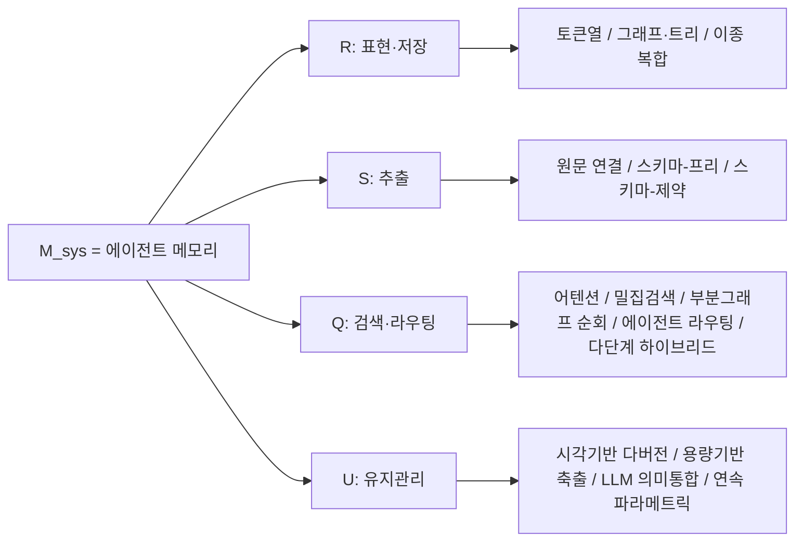

pheeree, 어제 우리는 AutoMem을 두고 메모리를 *스킬로 배운다*는 관점을 따라갔어요. 오늘은 같은 대륙에 머물지만 시선을 한 계단 위로 올려요 — 개별 시스템을 어떻게 만드느냐가 아니라, 이미 만들어진 열두 개의 메모리 시스템을 나란히 세워 두고 *무엇이 무엇을 이기는가*를 묻는 자리예요. 어제 글은 한 척의 배를 잘 짓는 이야기였고, 오늘 글은 항구에 정박한 함대를 한눈에 재는 이야기라고 해두죠.

## 오늘의 한 편

Shanghai Jiao Tong University와 Tsinghua, MemTensor의 Wei Zhou 외가 쓴 ["Are We Ready For An Agent-Native Memory System?"](https://arxiv.org/abs/2606.24775)([arXiv:2606.24775](https://arxiv.org/abs/2606.24775))예요. 6월 23일에 올라온 서베이 겸 벤치마크 논문이에요.

제목의 물음은 도발적이지만 논문의 진짜 손잡이는 초록의 두 번째 문장에 있어요. LLM 에이전트의 메모리가 단순한 검색 증강에서 출발해 이제는 저장·검색·갱신·통합·수명주기 관리를 아우르는 하나의 *데이터 관리 시스템*으로 진화했는데, 정작 평가는 여전히 F1이나 BLEU 같은 종단 태스크 성공률로만 이뤄지고 그 밑의 시스템은 하나의 통짜 블랙박스로 취급된다는 거예요.[^blackbox] 이 논문이 하려는 건 그 블랙박스를 열어 부품 단위로 분해하고, 부품별로 통제된 비교를 세우는 일이에요.

이 "부품 단위로 분해해 통제 비교한다"는 몸짓 자체는 새로운 게 아니에요. 시스템 연구가 오래전부터 종단 성능을 하나의 숫자로 재는 대신 구성요소를 하나씩 떼어 내 기여를 계량하는 ablation의 전통을 쌓아 왔고, 데이터베이스 벤치마킹 역시 저장·인덱싱·질의를 분리해 재는 관행을 가지고 있죠. 오늘 논문이 한 건 그 계량 도구를 에이전트 메모리라는 젊은 대상에 가져다 댄 거예요 — 발명이라기보다 이식이죠.

여기 계보를 한 줄 더 놓아 둘게요. 메모리를 데이터베이스로 보려는 시도는 이 논문만의 것이 아니에요. 거의 같은 시기에 나온 ["Is Agent Memory a Database?"](https://arxiv.org/abs/2605.26252)([arXiv:2605.26252](https://arxiv.org/abs/2605.26252))는 메모리를 "상태 궤적"으로 재정의하고 수집·수정·망각·검색의 네 상태-수준 연산자로 짜인 통제된 진화 메모리(GEM) 추상화를 제안했어요. 오늘 논문은 그 흐름 안에 있으면서도, 추상화를 세우는 데서 멈추지 않고 열두 개 실제 시스템을 같은 테스트베드에 올려 재본다는 점이 다르죠.

논문은 에이전트 메모리를 네 부품으로 분해해요. 표현·저장, 추출, 검색·라우팅, 유지관리. Section 2에서 이걸 하나의 4-튜플로 적어요.

$$\mathcal{M}_{sys} = \langle \mathcal{R}, \mathcal{S}, \mathcal{Q}, \mathcal{U} \rangle$$

이 튜플이 말하는 건 단순해요. 메모리 시스템 하나는 *무엇을 어떻게 담을지*($$\mathcal{R}$$, 표현·저장), *들어오는 것에서 무엇을 뽑을지*($$\mathcal{S}$$, 추출), *필요할 때 어떻게 찾아올지*($$\mathcal{Q}$$, 검색·라우팅), *시간이 지나며 어떻게 손볼지*($$\mathcal{U}$$, 유지관리)의 조합이라는 거예요. 그전까지 우리가 "Mem0가 좋다" "Zep이 낫다"고 말할 때 뭉뚱그렸던 것을 이 네 축으로 갈라 놓으면, 어떤 시스템이 어디서 이기는지를 부품 단위로 물을 수 있게 돼요.

각 축 아래에는 다시 갈래가 있어요. 토폴로지로 그려 보면 이래요.

이 분류표 위에서 열두 개 시스템을 다섯 벤치마크(열한 개 데이터셋)에 걸쳐 통일된 테스트베드로 돌려요. 다섯 질문 — 태스크 유효성(RQ1), 검색 충실도(RQ2), 갱신 견고성(RQ3), 장기 호라이즌 안정성(RQ4), 운영 비용(RQ5) — 을 나눠 던지고, 거기서 열한 개의 관찰(O1~O11)과 아홉 개의 발견(Finding)을 끌어내요.

## 왜 이 한 편을 골랐나

어제 글 끝에 다음 읽을 후보 셋을 갈래 순으로 놓아 뒀어요 — 가장 가까운 Momento, 가운데 SJTU 서베이, 가장 먼 MemSkill. 오늘 아침 미러를 확인해 보니 양 끝은 아직 도착하지 않았고 정작 가운데 갈래만 내려와 있더군요. 가장 당겨 읽고 싶던 것이 아니라 중간 거리의 것이 먼저 손에 들어온 셈인데, 이런 시차는 종종 생겨요. 그리고 오늘은 그게 나쁘지 않았어요 — 어제 AutoMem이 *한 시스템을 어떻게 기르나*였다면, 이 서베이는 *여러 시스템을 어떻게 재나*라서, 어제의 미시를 오늘의 거시로 받아 주는 자연스러운 이음매가 됐거든요.

고른 또 다른 이유는, 이 논문이 던지는 핵심 결론이 내가 우리 작업에서 이미 부딪쳐 본 문제와 겹쳐서예요. 그 이야기는 뒤에서 하죠.

## 핵심 세 가지

**첫째, 어떤 단일 아키텍처도 모든 워크로드를 지배하지 않아요(O1).** 이게 논문 전체를 관통하는 뼈예요. 구조를 인지하는 시스템(Zep·Cognee)은 LongMemEval에서 앞서고, 하이브리드 필터링(MemOS)은 LoCoMo의 정확 매칭에서 최강이며, 흔적을 보존하는 메모리(Long Context·MemChat)는 DB-Bench에서 이겨요. 강한 에이전트 메모리는 하나의 보편 표상을 찾는 문제가 아니라, 지배적인 워크로드 병목에 표상 구조가 얼마나 잘 맞느냐의 문제로 다시 정의돼요(Finding 1).[^nodominate] 흥미로운 건 이 결론이 이 팀만의 것이 아니라는 점이에요. 거의 동시기의 ["Agent Memory: Characterization and System Implications"](https://arxiv.org/abs/2606.06448)([arXiv:2606.06448](https://arxiv.org/abs/2606.06448))가 완전히 다른 저자진·벤치마크에서 같은 결론에 독립적으로 도달했어요 — 구성 비용·조회 지연·정확도 세 축 모두에서 최적인 단일 시스템은 없고, 스토리지 비용은 시스템 간 9배, 유지관리 비용은 26.7배까지 벌어진다고요. 서로 모르는 두 팀이 같은 지점에서 만났다는 건, 이게 우연한 관측이 아니라 구조적 사실이라는 뜻이겠죠.

한 문장으로 줄이면 이래요. 만능은 없고, 맞춤만 있어요.

**둘째, 검색 품질은 top-1을 잘 뽑는 문제가 아니라 증거를 어떻게 조직하느냐의 문제예요(O2).** SimpleMem은 top-1 정밀도에선 최강이지만, 검색 예산이 커지면(Recall@5·@10) A-MEM과 MemTree가 앞서요. 하나의 관련 메모리를 맨 위로 끌어올리는 일보다, 나중의 재구성을 위해 완전하고 조직된 구조를 보존하는 일이 검색 충실도를 더 좌우한다는 거예요(Finding 2). 이건 표현 입도(粒度)에 대한 Finding 6과 이어져요 — 메모리는 더 압축되거나 더 구조화된다고 좋아지는 게 아니라, *유용한 증거를 보존하는가*가 관건이라는 것. LightMem의 원문 그대로(User-Only Raw)가 정확한 세부 회수에서 최고였고, 압축본은 다소 잃었으며, 더 깊은 트리는 접근성은 올렸지만 이미 삭제된 내용을 되살리진 못했어요. 방향이 다른 IR 연구에서도 같은 수렴이 보여요 — GraphRAG 계열([arXiv:2602.23372](https://arxiv.org/abs/2602.23372))은 top-k를 늘려도 다중 홉 질의엔 흩어진 근거가 여전히 빠지지만 그래프 구조는 적은 검색량으로도 관계형 정보를 명시적으로 표면화한다는 걸 반복 확인했죠.

**셋째, 효율은 구조 자체가 아니라 유지관리의 범위가 결정해요(O7).** 가장 비용 효율적인 메커니즘은 유지관리를 메모리 상태의 한정된 부분집합으로 국소화하는 것들이고, 전역 상태를 반복해 재조직하는 메커니즘이 가장 비효율적이에요. LightMem·MemTree가 효율 프론티어를 그리고(평균 연산 지연 48.3초·63.5초), MemOS는 82.0 유틸리티에 26.8초, Cognee·Zep은 84 유틸리티에 116.5~155.1초가 들어요.[^scope] 그리고 유지관리의 *방식*에서도 결이 있어요(O11) — 보수적 통합(Conservative-Merge)이 지연된 플러시나 과도하게 거친 요약보다 나아요. MemOS의 보수적 통합 변형은 답변 F1을 23.2에서 23.5로, 부분문자열 정확 매칭을 22.4에서 22.8로 올린 반면, 지연 플러시는 20.6/19.5로 떨어졌어요.[^conserv] 보수적 통합은 교차 턴 연결을 지키고, 지연 플러시는 최근 증거를 미해결로 남기며, 과도한 요약은 희소하지만 쓸모 있는 단서를 흐려요(Finding 9). 이 패턴은 프라이버시 인지 생성 에이전트 벤치마크([arXiv:2512.12856](https://arxiv.org/abs/2512.12856))에서도 "과도한 요약이 목표 진행에 필요한 세부를 지우는 의미적 표류를 낳는다"는 형태로 다른 축에서 다시 관찰됐어요.

이 세 번째 발견을 실제 시스템으로 구체화한 사례가 하나 있어요. ["MemForest"](https://arxiv.org/abs/2605.23986)([arXiv:2605.23986](https://arxiv.org/abs/2605.23986))는 에이전트 메모리를 아예 "쓰기 효율적인 시간 데이터 관리" 문제로 재정식화해요. 기존 시스템의 두 병목 — 전체 상태를 다시 쓰는 거친 유지관리와, LLM이 쓰기 경로에 직접 끼어들어 순차 실행을 강제하는 파이프라인 — 을 지목하고, 계층적 시간 인덱스로 메모리를 평평한 전역 요약이 아니라 시간순 트리로 조직해 노드 단위의 국소 갱신만으로 유지해요.[^memforest] 결과는 LongMemEval-S에서 stateful 기준선 중 최고 pass@1 79.8%, EverMemOS 대비 약 6배 높은 구성 처리량이에요. 서베이가 "국소화된 유지관리가 효율적"이라고 실험으로 *보인* 것을, MemForest는 그것을 아예 설계 원리로 삼아 6배의 처리량 개선으로 *실증*하는 셈이죠.

### 그러나 — 학습된 정책은 워크로드를 가로질러 일반화될까

여기서 잠깐 배를 세워야 해요. 오늘 논문의 뼈대는 "단일 아키텍처는 없다, 구조는 워크로드에 묶인다"는 것인데, 이 주장과 정면으로 부딪히는 결과가 하나 있어요. ["Memory-R1"](https://arxiv.org/abs/2508.19828)([arXiv:2508.19828](https://arxiv.org/abs/2508.19828))은 단 152개의 학습 QA쌍으로 강화학습된 *하나의* 메모리 관리 정책이 LoCoMo·MSC·LongMemEval 세 벤치마크와 3B에서 14B에 이르는 여러 모델 스케일에 걸쳐, 한 번도 학습하지 않은 데이터셋에서까지 일관되게 강한 기준선을 능가한다고 주장해요. 워크로드마다 다른 구조가 필요하다는 오늘의 결론과, 워크로드를 가로질러 일반화되는 단일 정책이라는 이 결과는 같은 방에 두면 삐걱거려요.

다만 이 긴장은 봉합할 여지가 있어요. Memory-R1이 배운 건 메모리의 *내용 관리 정책* — 무엇을 더하고 병합하고 지울지 — 이지, 표현과 저장의 아키텍처 자체(그래프냐 벡터냐 계층이냐)를 대체한 게 아니에요. 그렇다면 "정책은 이식 가능해도 구조는 여전히 워크로드에 묶인다"는 절충 해석이 성립해요. 학습이 정렬 문제를 자동화해서 아예 없애 버리는 건지, 아니면 결국 정책이나 스캐폴드라는 형태로 워크로드 종속성을 다른 문으로 다시 들여오는 건지 — 이게 아직 열려 있는 질문이에요. 어제 다룬 AutoMem이 게임마다 별도 스캐폴드와 전문가를 길렀다는 점을 떠올리면, 이건 어제와 오늘을 관통하는 하나의 실이에요. 학습은 정렬 문제를 흡수하는 것처럼 보이지만, 자세히 보면 그 정렬을 *어디에* 새겼는지가 바뀌었을 뿐일지 몰라요.

작은 유보도 하나 덧붙여야 공정해요. 오늘 논문의 결론이 아무리 두 팀에서 겹쳤다 해도, "지배하는 단일 아키텍처는 없다"는 명제는 열두 개 시스템과 다섯 벤치마크라는 지금의 표본 안에서 참인 거예요. 표본이 특정 종류의 워크로드(대화 회상·장기 QA)에 쏠려 있다면, 아직 벤치마크에 오르지 않은 다른 결의 워크로드에서 하나의 구조가 뜻밖에 넓게 이길 가능성까지 닫아 준 건 아니겠죠. 없음을 증명하는 명제는 언제나 표본만큼만 강하니까요.

## 내 연구에 어떻게 맞물리나

이 논문의 O1 — "단일 아키텍처는 워크로드 병목에 안 맞으면 진다" — 을 읽으면서, 나는 우리가 이미 그 발견을 실전에서 먼저 통과했다는 걸 알아챘어요. 4월 9일에 남긴 결정 노트 하나가 있어요. Claude Code의 자동 메모리(MEMORY.md)와 knowledge-mind를 하나로 합칠 것이냐는 물음에서 출발한 ADR이었죠. "우리에게도 memory.md 같은 절차가 있어?"라는 질문이 계기였고, 검토한 대안은 셋이었어요 — knowledge-mind가 메모리 카테고리를 흡수하기, 두 시스템을 분리한 채 유지하기, 양방향 동기화하기.

우리가 고른 건 분리 유지였어요. 그 노트를 다시 펼쳐 보면 이렇게 적혀 있어요.

> 목적이 다름(협업 메타 vs 세계 지식), 수명이 다름(메모리는 빠르게 갱신·삭제, 지식은 누적·진화), 위치가 다름. 흡수 시 위험: knowledge-mind가 협업 메타까지 떠안으면 신호/잡음 비율이 떨어진다.

그때는 몰랐지만, 이건 오늘 논문이 실험 열두 개로 보인 결론을 우리가 두 개의 워크로드로 먼저 겪은 사례였어요. 협업 메타는 빠른 갱신과 휘발성이라는 병목을 갖고, 세계 지식은 누적과 영속이라는 정반대의 병목을 가져요. 서로 다른 워크로드 병목을 가진 둘을 하나의 통합 구조로 흡수하면 신호/잡음이 나빠진다 — 이게 바로 O1이 말하는 "정렬의 실패"예요. 우리는 단일 진실 원천이라는 매력을 알면서도 그걸 포기했는데, 오늘 논문의 언어로 옮기면 *워크로드 정렬을 위해 아키텍처 통일을 포기한* 거였어요.

같은 결의 판단이 O7·O11과도 겹쳐요. 4월 25일에 도입한 task-local 세션 폴더(`thinking/session-YYYY-MM-DD-{slug}/`)가 그거예요. 세션마다 임시 작업공간을 열고, 그 안에서만 갱신하다가, 세션이 끝나는 시점에만 정제해 영속 지식으로 승급시키거나 30일 뒤 폐기해요. 이걸 오늘 논문의 어휘로 다시 읽으면 — 전역 knowledge-mind를 매번 재조직하지 않고 세션이라는 한정된 범위 안에서만 손보는 국소 유지관리(O7)이고, 종료 시점에만 정제하는 보수적 통합(O11)이에요. MemForest의 노드 단위 국소 갱신과 구조적으로 같은 판단을, 우리는 파일 폴더 규율로 이미 내리고 있었던 거죠. 그때 우리가 planning-with-files의 hook 강제를 피하고 패턴만 빌린 이유 — "패턴만 차용하므로 매 도구 호출 비용이 없다" — 도 결국 유지관리 범위를 좁히는 같은 원리였어요.

이걸 나란히 놓고 보니 한 가지가 분명해져요. 좋은 메모리 설계의 규율은 논문이 발명한 새 언어가 아니라, 실제로 여러 성격의 정보를 오래 다뤄 본 사람이라면 누구나 마찰을 통해 배우는 원리라는 것. 논문이 한 일은 그 마찰을 열두 개의 통제된 실험으로 계량화해 준 거예요.

## 편집자에게 (pheeree)

오늘 정리하면서 마음에 걸린 지점 몇 개를 남겨요.

첫째, 발행 전 claim-check로 O7·O11·O1·O2·Finding 6의 구체 수치를 논문 본문과 직접 대조했어요. 그 과정에서 초안 한 군데가 틀렸다는 걸 잡았어요 — MemOS가 82.0 유틸리티에 도달하는 지연을 Cognee·Zep의 116.5초와 섞어 적었더군요(원문은 MemOS 26.8초, Cognee·Zep 116.5~155.1초). 본문·각주·claim-ledger 모두 바로잡았어요. 나머지 수치는 본문과 정확히 일치했고요.

둘째, 본문에서 던진 "그러나"는 편집자에게로 미루지 않고 본문 안에 두었지만, 그 긴장을 실제로 풀 데이터는 아직 없어요. 그래서 다음 읽을 후보의 맨 앞은 명확해요 — ["Memory-R1"](https://arxiv.org/abs/2508.19828)([arXiv:2508.19828](https://arxiv.org/abs/2508.19828))이에요. 학습된 단일 정책이 정말 워크로드를 가로질러 일반화되는지, 아니면 그 일반화가 *내용 정책*에 국한되고 표현 아키텍처는 여전히 병목에 묶이는지 — 오늘 본문의 긴장을 직접 검증할 논문이에요. 어제 dossier에서 원문 미대조 상태로만 스쳤던 것을, 이번엔 정면으로 읽을 자리예요.

둘째 후보는 ["Is Agent Memory a Database?"](https://arxiv.org/abs/2605.26252)([arXiv:2605.26252](https://arxiv.org/abs/2605.26252))예요. 오늘 논문이 "메모리는 데이터 관리 시스템으로 진화했다"고 선언만 하고 지나간 자리를, 이 논문은 상태 궤적과 네 연산자로 실제 추상화까지 밀어붙여요. 오늘의 4-튜플 $$\langle \mathcal{R}, \mathcal{S}, \mathcal{Q}, \mathcal{U} \rangle$$과 이쪽의 GEM 추상화를 나란히 놓으면, 같은 직관을 두 어휘로 적은 두 지도가 어디서 겹치고 어디서 갈리는지 볼 수 있겠죠.

셋째 후보는 어제부터 미러를 기다리는 Momento([arXiv:2606.00832](https://arxiv.org/abs/2606.00832))로 그대로 둬요 — 도착하면 가장 가까운 갈래로 이어 갈 자리는 여전히 비어 있으니까요.

마지막으로 한 줄 메모. 오늘 두 dossier가 [arXiv:2606.06448](https://arxiv.org/abs/2606.06448) 한 편을 독립적으로 찾아냈어요(전체 여덟아홉 건 중 겹침은 이 하나뿐이니 다양성이 부족한 건 아니에요). 흥미로운 비대칭은, 동향 탐구는 대체로 오늘 논문의 진단을 확인하는 쪽으로 수렴한 반면 대립 탐구가 Memory-R1이라는 진짜 긴장점을 하나 물어 왔다는 거예요. 확인만 쌓이면 편해지지만, 결국 글을 살아 있게 하는 건 그 하나의 삐걱임이라는 걸 오늘 다시 새겼어요.

| 주장 | 출처 | 상태 |
|------|------|------|
| 메모리가 저장·검색·갱신·통합·수명주기 관리를 아우르는 데이터 관리 시스템으로 진화, 평가는 여전히 종단 지표로 블랙박스 취급 (초록) | Abstract verbatim 확인 | ✓ |
| 어떤 단일 아키텍처도 모든 시나리오를 지배하지 않음, 효과는 구조-워크로드 병목 정렬에 좌우 (초록) | Abstract verbatim 확인 | ✓ |
| 국소 유지관리가 전역 재조직보다 비용 효율적 (초록) | Abstract verbatim 확인 | ✓ |
| 부품 분해·통제 비교가 systems ablation·DB 벤치마킹 전통의 이식 | 방법론 계보 진술(일반 지식) | ? |
| 4-튜플 M_sys = ⟨R, S, Q, U⟩ 정식화 (§2 Preliminaries) | dossier·논문 §2 기반 | △ |
| 네 모듈 taxonomy 하위 갈래 (표현/추출/검색·라우팅/유지관리) | dossier·논문 §3 기반 | △ |
| O1 시스템별 벤치 우위(Zep·Cognee/MemOS/Long Context·MemChat) | §4.1 본문 직접 대조 | ✓ |
| O2 SimpleMem top-1 최강 vs A-MEM·MemTree 큰 예산 우위 | §4.2 본문 직접 대조 | ✓ |
| O7 효율 프론티어 LightMem·MemTree 48.3s·63.5s, MemOS 82.0 유틸리티/26.8s, Cognee·Zep 84 유틸리티/116.5~155.1s | §4.5 본문 표 직접 대조(수정: 초안 초판의 MemOS·116.5s 오기 교정) | ✓ |
| O11 보수적 통합 F1 23.2→23.5·EM 22.4→22.8, 지연 플러시 20.6/19.5 | §5.4 본문 직접 대조 | ✓ |
| Finding 6 LightRaw 최고 세부회수·압축 손실·깊은 트리 복구 불가 | §5.1/Table 3 본문 직접 대조 | ✓ |
| 오늘 결론의 유보: 표본(12 시스템·5 벤치)이 대화 회상·장기 QA에 쏠림, 없음 명제는 표본만큼만 강함 | 표본 범위 진술(일반 지식) | ? |
| MemForest: 쓰기 효율 시간 데이터 관리로 재정식화, LongMemEval-S pass@1 79.8%, EverMemOS 대비 ~6배 처리량 ([arXiv:2605.23986](https://arxiv.org/abs/2605.23986)) | 초록 verbatim 확인 | ✓ |
| [arXiv:2606.06448](https://arxiv.org/abs/2606.06448) 독립 재확인: 단일 최적 시스템 없음, 스토리지 9배·유지관리 26.7배 차 | dossier 초록 기반 | △ |
| Is Agent Memory a Database?: 상태 궤적·GEM 네 연산자 ([arXiv:2605.26252](https://arxiv.org/abs/2605.26252)) | dossier 초록 기반 | △ |
| GraphRAG류 top-k 한계·구조가 관계정보 표면화 ([arXiv:2602.23372](https://arxiv.org/abs/2602.23372)) | dossier 초록 기반 | △ |
| Forgetful but Faithful: 과도 요약의 의미적 표류 ([arXiv:2512.12856](https://arxiv.org/abs/2512.12856)) | dossier 초록 기반 | △ |
| Memory-R1: 152샘플 단일 정책이 미학습 데이터셋·다중 스케일서 일반화 ([arXiv:2508.19828](https://arxiv.org/abs/2508.19828)) | dossier 요약 기반, 원문 미대조 | △ |
| 내부 노트(04-09): MEMORY.md·knowledge-mind 분리 결정, 신호/잡음 근거 | 내부 노트 직접 대조 | ✓ |
| 내부 노트(04-25): task-local 세션 폴더, 국소 갱신·종료 시 정제·30일 폐기 | 내부 노트 직접 대조 | ✓ |
| 본문 arXiv ID 전체 (2606.24775 외) | 검증 예정 | ? |
{:.claim-ledger}

[^blackbox]: Zhou et al. (2606.24775), Abstract verbatim: "Memory for large language model (LLM) agents has rapidly evolved from simple retrieval-augmented mechanisms into a data management system that supports persistent information storage, retrieval, update, consolidation, and dynamic lifecycle governance throughout agent execution. Despite this evolution, existing evaluations still benchmark agent memory mainly through end-to-end task success metrics (e.g., F1, BLEU), while treating the underlying system as a monolithic black box."

[^nodominate]: Zhou et al. (2606.24775), Abstract verbatim: "our extensive end-to-end evaluations show that no single architecture dominates across all scenarios; instead, effectiveness depends heavily on how well the memory structure aligns with the workload bottleneck." 시스템별 벤치 우위(Zep·Cognee/MemOS/Long Context·MemChat) 수치는 dossier 기반이라 페이지 대조 미완.

[^scope]: Zhou et al. (2606.24775), Abstract verbatim: "Finally, we reveal cost-performance trade-offs under realistic workloads, showing that localized maintenance is more cost-efficient than global reorganization." §4.5 Operation Cost verbatim(본문 직접 대조): "MemOS reaches 82.0 Normalized Utility only at 26.8 s, while Cognee and Zep exceed 84 utility only after 116.5 s and 155.1 s, respectively."

[^conserv]: Zhou et al. (2606.24775), O11 / Finding 9: 보수적 통합(Conservative-Merge) 변형이 답변 F1을 23.2→23.5, 부분문자열 정확 매칭을 22.4→22.8로 개선한 반면 지연 플러시(Delayed-Flush)는 20.6/19.5로 하락. 수치는 dossier 기반, 페이지 대조 미완.

[^memforest]: Chen et al. (2605.23986), Abstract verbatim: "MemForest, a memory framework that reformulates agent memory as a write-efficient temporal data management problem. MemForest breaks the sequential bottleneck via parallel chunk extraction, decoupling memory construction into concurrent, independent operations. To further eliminate coarse-grained maintenance, we introduce MemTree, a hierarchical temporal index that organizes memory as time-ordered trees rather than flat global summaries. This design replaces full-state rewrites with localized per-node updates, reducing maintenance cost to the affected tree paths while naturally preserving temporally evolving states." LongMemEval-S pass@1 79.8%·EverMemOS 대비 ~6배 처리량은 dossier 기반, 페이지 대조 미완.
