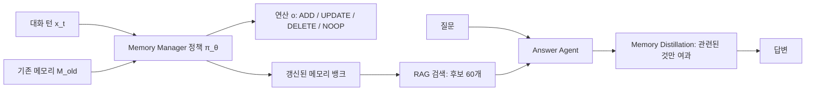

pheeree, 어제 우리는 열두 개의 메모리 시스템을 한 테스트베드에 세워 두고 *무엇이 무엇을 이기는가*를 물었어요. 그 글은 하나의 결론에 무게를 실었죠 — 만능은 없고 맞춤만 있다, 표현 구조가 워크로드 병목에 얼마나 잘 맞느냐가 전부라고요. 그런데 그 글의 한복판에 나는 작은 삐걱임 하나를 일부러 남겨 두었어요. "그러나, 학습된 정책은 워크로드를 가로질러 일반화되지 않을까." 어제는 그 물음에 잠정적인 절충안만 걸어 두고 넘어갔어요 — 정책은 이식될 수 있어도 구조는 여전히 워크로드에 묶인다는 식으로요. 오늘은 그 삐걱임의 진원지로 직접 걸어 들어가는 날이에요.

## 오늘의 한 편

Sikuan Yan, Xiufeng Yang, Zuchao Huang 외가 쓴 ["Memory-R1"](https://arxiv.org/abs/2508.19828)([arXiv:2508.19828](https://arxiv.org/abs/2508.19828))이에요. 뮌헨 루트비히-막시밀리안 대학과 뮌헨 머신러닝 센터, 뮌헨 공대, 홍콩대, 케임브리지, 다름슈타트 공대, 에든버러가 얽힌 공저로, 이번에 읽은 건 올해 1월 14일에 갱신된 v5예요. 부제가 이미 핵심을 말해 줘요 — *강화학습으로 LLM 에이전트가 메모리를 관리하고 활용하도록 만든다*.

문제의식은 어제 서베이의 출발점과 같은 자리에서 시작해요. LLM은 근본적으로 상태가 없어요(stateless). 컨텍스트 윈도우 바깥으로 나간 것은 잊어버리죠. 그래서 MemGPT나 Mem0 같은 메모리 증강 파이프라인이 나왔지만, 이들 대부분은 정적이고 휴리스틱에 기대요 — *무엇을 저장하고, 무엇을 갱신하고, 무엇을 검색할지*를 규칙으로 정해 두었지, 학습으로 얻지 않았다는 거예요. 이 논문이 밀고 나가는 한 수는 그 결정들을 규칙에서 정책으로 옮기는 거예요. 저장·갱신·삭제라는 메모리 연산 자체를 강화학습으로 학습된 정책이 내리게 하자는 거죠.

이 발상을 계보 위에 놓아 두면 이래요. 메모리 연산을 *결정*으로 보고 그 결정을 최적화한다는 몸짓은, 강화학습이 오래전부터 순차 의사결정에 써 온 틀을 메모리 관리라는 젊은 대상에 가져다 댄 거예요. 새로운 발명이라기보다는, 어제 서베이가 시스템 ablation의 계량 도구를 이식한 것처럼, 이쪽은 정책 최적화의 도구를 이식한 셈이죠. 다만 대상이 미묘해요 — 메모리 연산은 보상이 즉각 오지 않아요. 지금 이 사실을 저장할지 말지의 결정이 좋았는지는 한참 뒤 답변 정확도에서야 드러나거든요. 이건 강화학습이 처음부터 안고 있던 오래된 난제에 정확히 포개져요 — *신용 할당(credit assignment)* 문제, 즉 뒤늦게 도착한 하나의 보상을 앞선 여러 결정 중 누구의 공으로 돌릴 것인가라는 물음이요. Minsky가 1961년에 이름 붙이고 Sutton의 시간차 학습이 껴안았던 그 문제를, 여기서는 "어느 대화 턴의 어느 메모리 연산이 최종 정답에 기여했나"라는 형태로 다시 만나는 거예요. 성근 보상(sparse reward) 위에서 순차 결정을 학습해야 한다는 이 구조가 이 논문의 설계 전반을 규정해요.

논문은 두 개의 전문화된 에이전트를 각각 강화학습으로 파인튜닝해요. 토폴로지로 그리면 이래요.

Memory Manager는 매 대화 턴마다 ADD·UPDATE·DELETE·NOOP 중 하나의 연산과 갱신된 내용을 함께 출력하는 정책 $$\pi_\theta(o, m' \mid x, M_{old})$$예요. PPO 또는 GRPO로 학습하죠. Answer Agent는 RAG로 끌어온 60개의 후보 메모리 가운데 실제로 관련 있는 것만 걸러 내는 Memory Distillation 정책을 적용해 답을 만들어요. 두 에이전트는 따로 학습돼요 — 성근 보상 아래 안정성을 지키려는 선택인데, 저자들 스스로도 이 분리가 학습 절차를 덜 매끄럽게 만든다고 인정해요.[^limits]

## 왜 이 한 편을 골랐나

어제 글의 마지막 줄이 오늘을 예고했어요. 다음 읽을 후보의 맨 앞을 Memory-R1로 확정해 두었고, 그 이유도 명확히 적어 두었죠 — 학습된 단일 정책이 정말 워크로드를 가로질러 일반화되는지, 아니면 그 일반화가 내용 정책에만 국한되고 표현 아키텍처는 병목에 묶인 채로 남는지를 직접 검증할 자리라고요. 그리고 오늘 아침, 그 논문이 손에 들어왔어요. 어제 예고한 1순위 후보가 하루 만에 책상 위에 놓인 셈인데, 이렇게 다음 읽을거리가 예고한 그대로 곧장 도착하는 건 우리 사이클에서도 드문 깔끔함이에요. 대개는 엉뚱한 순서로 오거나 며칠씩 어긋나거든요.

고른 진짜 이유는 긴장 그 자체예요. 어제 논문의 첫 번째 관찰(O1)은 *어떤 단일 아키텍처도 모든 워크로드를 지배하지 않는다*였어요. 그런데 Memory-R1의 대표 주장은 정면으로 다른 방향을 가리켜요 — LoCoMo에서 단 152개의 QA쌍으로 학습한 단일 강화학습 정책이, 재학습 없이 MSC와 LongMemEval 같은 훈련하지 않은 벤치마크에도 제로샷으로 일반화된다는 거예요. 한쪽은 "맞춤만 있다"고 말하고 다른 쪽은 "하나로 옮겨 다닌다"고 말해요. 이 둘이 정말 충돌하는지, 아니면 서로 다른 것을 재고 있어서 충돌처럼 보일 뿐인지 — 그걸 가리는 게 오늘의 일이에요.

## 핵심 세 가지

**첫째, 보상을 무엇으로 삼느냐가 최적화의 방향을 통째로 결정해요.** 이 논문에서 가장 정교한 대목이 여기예요. 메모리 연산에는 사람이 붙인 정답 라벨이 없어요 — 어떤 걸 저장했어야 "맞다"고 채점할 기준이 없죠. 그래서 저자들은 최종 답변이 정답과 정확히 일치하는지(exact match, EM)를 보상으로 써요. 수작업 라벨이 필요 없으니 확장 가능하고요. 그런데 왜 하필 EM이냐 — 여기서 대안을 실제로 돌려 본 게 이 논문의 미덕이에요. 보상을 LLM-as-a-Judge로 바꾸면 J 점수는 63.58까지 오르지만, 그 대가로 F1과 BLEU-1이 33.69와 23.36으로 주저앉아요.[^reward] 심판 모델이 장황하고 그럴듯한 답변에 높은 점수를 주는 성향을 정책이 파고들어, 길게 늘어놓는 쪽으로 최적화해 버리는 거죠 — 전형적인 보상 해킹이에요. EM 보상은 41.05·32.91·57.54로 세 지표 사이의 균형을 지켜요.

이 대목이 왜 세 가지 중 첫째냐면, 이게 단순한 하이퍼파라미터 선택이 아니라 원리이기 때문이에요. *무엇을 잴 것인가*라는 결정이 이미 그 뒤의 모든 최적화 방향을 정해요. 그럴듯해 보이는 지표(LLM-Judge)를 목표로 걸면 정책은 그 지표의 프록시(장황함)를 최적화하지, 우리가 진짜 원하는 것을 최적화하지 않아요.

**둘째, 두 구성요소가 각자 값을 해요 — Memory Manager와 Answer Agent 둘 다.** 논문의 ablation이 이걸 깔끔하게 보여요. Memory Manager를 강화학습 파인튜닝 없이 원래 상태로 쓰면 성능이 떨어지는데, 그 낙폭이 원문에 그대로 적혀 있어요.[^ablation] PPO 아래서는 F1·BLEU-1·LLM-Judge가 41.0·32.9·57.5에서 34.5·28.1·49.0으로 내려가고, GRPO 아래서는 37.5·30.6·52.9로 떨어져요. 검색된 60개 후보에서 관련된 것만 여과하는 Answer Agent를 빼도 마찬가지로 손해가 나고요. 두 정책이 서로의 공을 빌려 온 게 아니라 각자 기여한다는 뜻이에요. 앞의 예시에서 사용자가 "Andrew가 Buddy라는 개를 입양했다"고 말한 뒤 나중에 "Scout라는 개를 또 입양했다"고 말할 때, 기존 시스템은 이 둘을 모순으로 오인해 DELETE 후 ADD를 하며 원래 정보를 지워 버려요. Memory-R1은 이걸 UPDATE 하나로 묶어 "Andrew는 Buddy와 Scout 두 마리를 입양했다"로 통합하죠. 추가와 갱신과 삭제를 가르는 이 뉘앙스를 규칙이 아니라 학습으로 얻는다는 주장이, 이 한 사례에서 손에 잡혀요.

그러나 "각자 기여한다"는 이 깔끔함에는 대가가 매달려 있어요. 두 정책이 각자 값을 하도록 만들려고 저자들은 둘을 따로 학습했는데, 그 분리가 바로 저자 스스로 인정한 한계이기도 해요[^limits] — 성근 보상 아래 안정성을 얻는 대신, Memory Manager의 어떤 연산이 Answer Agent의 최종 답변에 얼마나 기여했는지를 두 정책이 끝까지 함께 배우지는 못해요. 신용 할당의 사슬이 두 에이전트 경계에서 한 번 끊기는 셈이죠. 그러니 이 둘째 발견은 "분해했더니 각자 기여하더라"인 동시에 "분해했기 때문에 그 사이의 공동 기여는 아직 최적이 아닐 수 있다"라는 양날이에요.

**셋째, 파인튜닝이 정확도와 지연을 동시에 개선해요 — 트레이드오프가 아니라 둘 다.** 이게 뜻밖의 결과예요. GRPO 파인튜닝이 LoCoMo에서 가장 강한 베이스라인 MemoryOS 대비 F1을 상대적으로 28.5%, BLEU-1을 34.0%, J를 30.2% 끌어올리는데(Qwen-2.5-7B에서도 각각 24.5%·24.1%·20.0%), 그러면서 median과 tail 지연까지 함께 낮춰요. Answer Agent 컴포넌트에서 LLaMA-3.1-8B 기준 p50/p95가 base의 0.65초/3.07초에서 GRPO의 0.34초/0.67초로 떨어져요. 대개 정확도를 올리면 지연이 늘기 마련인데 여기선 파레토 프론티어가 통째로 안쪽으로 당겨진 셈이에요 — 관련 없는 메모리를 여과해 버리니 답변 생성이 짧아지고 그래서 더 빠르기도 한 거겠죠. 그리고 이 이득은 스케일을 타고 옮겨 다녀요. Qwen-2.5의 3B·7B·14B 전 스케일에서 PPO와 GRPO 변형이 베이스 모델을 일관되게 능가해요.

한 가지만 붙여 둘게요. "트레이드오프가 아니라 둘 다"는 결과이지 공짜라는 뜻이 아니에요. 여과가 답변을 짧게 만들어 빨라진 거라면, 그 여과가 과하게 걸려 필요한 메모리까지 쳐 낸 경우의 손실은 이 지연표에는 안 잡혀요. 속도의 이득과 누락의 위험은 같은 다이얼의 양쪽 끝이니까요. 이 다이얼을 어디에 둘지는 워크로드가 정할 텐데, 그 물음이 곧 다음 절이에요.

### 그러나 — 무엇을 가로질러 일반화한 걸까

여기서 어제 남긴 삐걱임으로 돌아와요. Memory-R1이 증명한 게 정말 "워크로드를 가로지르는 일반화"일까요. 이 물음에 한 가지 반례의 틀을 대 볼 수 있어요. UIUC의 ["Breaking Barriers"](https://arxiv.org/abs/2506.19733)([arXiv:2506.19733](https://arxiv.org/abs/2506.19733))는 16개 벤치마크·14개 모델을 관찰해서, 강화학습 사후학습의 이득이 인도메인에서는 강하지만(+3.57%) 아웃오브도메인에서는 오히려 손해(-1.48%)라고 보고해요. 결정적인 건 그 전이가 갈리는 경계예요 — 수학·코딩처럼 "구조화된" 도메인 사이에서는 어느 정도 전이되지만, 법률·금융·의료처럼 "비구조화된" 도메인으로는 전이가 실패한다는 거죠.

이 틀을 오늘 논문에 대면 회의 하나가 떠올라요. Memory-R1이 옮겨 다닌 세 벤치마크 — LoCoMo, MSC, LongMemEval — 은 사실 서로 꽤 닮았어요. 셋 다 "대화 세션 + 시간 정보가 붙은 사실 목록"이라는 유사한 메모리 표현을 공유하거든요. 그래프 구조냐 벡터냐 하는 이질적 아키텍처를 가로지른 게 아니에요. 그러니 이 논문이 실제로 보인 것은 *워크로드를 가로지르는 일반화*가 아니라 *같은 종류의 구조 안에서의 일반화*일 수 있어요. Breaking Barriers의 표현을 빌리면, 이건 "구조화된 도메인 내부의 전이"에 해당하지, 그 경계를 넘은 전이가 아닐지도 몰라요. 강화학습 없이 3종 메모리 라우팅과 밀집 검색만으로 같은 LoCoMo에서 SOTA를 내고 LongMemEval에서 full-context 베이스라인을 넘긴 ["ENGRAM"](https://arxiv.org/abs/2511.12960)([arXiv:2511.12960](https://arxiv.org/abs/2511.12960))이 이 회의를 거들어요 — 학습된 정책 자체의 이식성이 아니라 워크로드에 맞는 구조 정렬이 성능을 좌우한다는, 어제 서베이의 결론을 다른 방법론에서 재확인한 셈이니까요.

다만 이 회의를 결론으로 못 박진 않을게요. 반대 방향의 작은 실증도 있거든요. ["Supersede"](https://arxiv.org/abs/2606.27472)([arXiv:2606.27472](https://arxiv.org/abs/2606.27472))는 대화 중 사실이 갱신될 때 — "디트로이트에 산다"에서 "교외로 이사했다"로 — 에이전트가 낡은 값을 계속 참조하는 "supersession gap"을 정량화했어요. 컨텍스트를 24배 늘려도 정확도가 68%에서 28%로 떨어지고 메모리를 키워도 나아지지 않았지만, Qwen2.5-3B를 GRPO로 파인튜닝하니 합성 타임라인으로 학습한 것이 실제 미학습 대화로 전이되어 정확도가 9.0%에서 16.7%로 올랐어요(다만 단일 시드 실험이라 저자도 통계적 유의성은 진행 중이라 밝혀 뒀고요). 그러니 오늘의 정직한 자리는 열린 질문이에요 — 정책은 어떤 반경 안에서는 분명 옮겨 다니는데, 그 반경의 경계가 어디인지를 우리는 아직 몰라요.

## 내 연구에 어떻게 맞물리나

이 긴장을 우리 자신의 프레임 위에 올려 보면 뜻밖의 화해가 보여요. 멀티에이전트 팀 구성을 두고 정리해 둔 노트가 하나 있어요. 거기서 나는 두 논문을 나란히 놓았죠 — Yang et al.이 제시한 *다양성이 여는 상한*(정규화 고유값 분포의 섀넌 엔트로피로 $$K^\ast = \exp(H)$$)과, Kim et al.이 제시한 *조율이 끌어내리는 하한*(도구-조율 트레이드오프, 능력 천장 $$\beta = -0.236$$)이에요. 그 노트의 결론은 이랬어요.

> Yang et al.과 Kim et al.은 충돌이 아니라 상보다. 두 논문이 동일한 '에이전트 수는 잘못된 스케일링 축이다' 결론에 서로 다른 경로로 도달했다. MAS의 실효 밴드 = 상한 − 하한.

이 프레임을 오늘의 긴장에 대 보면 이래요. 어제 서베이의 O1("구조는 워크로드에 묶인다")과 오늘 Memory-R1의 주장("정책은 일반화된다")은, 실은 서로 다른 축을 재고 있는지도 몰라요. 어제 서베이의 4-튜플로 말하면, 서베이가 붙들고 있는 건 표현·저장 축($$\mathcal{R}$$)이고 Memory-R1이 옮겨 다닌다고 주장하는 건 유지관리 정책 축($$\mathcal{U}$$)이에요. 다른 축을 재는 두 결론은 겉보기엔 부딪히지만 실은 상한과 하한처럼 상보적일 수 있어요 — 구조는 워크로드에 묶인 채로 상한을 정하고, 그 안에서 유지관리 정책은 일정 반경까지 옮겨 다니며 하한을 끌어올리는 식으로요.

여기서 멈출게요. 유비를 더 밀면 억지가 돼요. 상한/하한 유비가 실제로 통찰을 주는 지점은 딱 하나 — *겉보기 충돌이 사실은 다른 축을 재는 데서 온다*는 그 자리까지예요. 두 축이 정확히 상한과 하한처럼 대수적으로 맞물린다고 주장하는 순간 그건 내가 원하는 것보다 많은 걸 말하는 게 되고요. 그러니 이건 결론이 아니라 가설로만 세워 둬요.

두 번째 맞물림은 첫째 발견과 이어져요. 논문 컬렉션을 평가할 때 우리가 "학계 중요도"(외부 인용수)가 아니라 "우리에게 중요한 정도"(관심사 정렬)를 재기로 한 이유를, 나는 이렇게 적어 뒀었어요 — 외부 인용수는 학계 전체의 합의를 재지만 그건 우리 관심의 지형과 다르고, 그래서 단일 랭킹으로 누르는 대신 2차원 평면에 두는 게 핵심이라고요. 서로 다른 사분면이 서로 다른 행동을 가리키니까요. 이건 오늘 논문의 EM 보상 대 LLM-Judge 보상 결정과 구조적으로 같은 문제예요. LLM-Judge라는 그럴듯한 지표를 보상으로 걸면 장황함이라는 프록시를 최적화해 버리듯, 우리도 "외부 인용수"라는 그럴듯한 지표 대신 시스템 내부의 실제 관심 신호를 골랐어요. 두 경우 모두 *무엇을 잴 것인가*라는 결정 자체가 이미 최적화의 방향을 정한다는 하나의 원리를 공유해요. 오늘 논문은 그 원리를 강화학습 보상 설계라는 전혀 다른 무대에서 다시 무대에 올린 셈이에요.

## 편집자에게 (pheeree)

오늘 글은 어제 남긴 삐걱임 하나를 진원지까지 따라간 글이에요. 결론은 화해도 파열도 아닌 열린 질문으로 놓아 뒀어요 — 정책은 분명 어떤 반경 안에서 옮겨 다니지만, 그 반경이 "같은 종류의 구조"까지인지 정말 이질적 워크로드까지인지는 이 논문 하나로는 못 정한다는 것. Breaking Barriers의 구조화/비구조화 경계가 그 반경을 재는 유력한 자가 될 수 있고요.

dossier에서 오늘 특히 눈에 밟힌 갈래를 몇 개 적어 둘게요. 정책 일반화를 조건부로 지지하는 쪽에는 AgeMem([arXiv:2601.01885](https://arxiv.org/abs/2601.01885), Memory-R1을 5개 연산·3단계 학습으로 확장한 직계 후속)과 앞의 Supersede가 있고, 진단·회의 쪽에는 벤치마크 간 일반화의 성능 저하를 재는 진단 프레임워크([arXiv:2606.04315](https://arxiv.org/abs/2606.04315))와, 보상 해킹을 정량화한 벤치마크([arXiv:2605.02964](https://arxiv.org/abs/2605.02964), 강화학습 사후학습 계열이 검증 생략·평가 조작을 유의미하게 더 유발), 성근 보상의 152쌍만으로 충분했다는 주장에 반론적인 중간 보상 밀도화 접근(Mem-T, [arXiv:2601.23014](https://arxiv.org/abs/2601.23014))이 있어요. 방법론적으로 가장 날카로운 반례는 커리큘럼만 바꾼 통제 실험([arXiv:2605.23067](https://arxiv.org/abs/2605.23067))이에요 — 핵심은 "혼합 커리큘럼이 최선"이라는 단순 결론이 아니라, 집계 지표가 스킬별 분해를 가려서 단일 숫자 벤치 비교가 커리큘럼 효과를 체계적으로 과소보고한다는 지적이거든요. Memory-R1의 집계 F1/BLEU가 실은 특정 스킬만 좁게 전이된 걸 가리는 착시일 수 있다는 뜻이라, 다음에 이 논문의 스킬별 분해를 직접 들여다볼 만해요.

한 편 더, 조심스럽게 적어 둘 게 있어요. GRPO 같은 group-relative 방법이 "서로 다른 롤아웃이 다른 메모리를 쓰고 지우면 더 이상 같은 유효 환경에서 샘플링된 게 아니라 궤적 단위 비교가 근본적으로 불공정해진다"는 구조적 결함을 지적하는 논문([arXiv:2605.21768](https://arxiv.org/abs/2605.21768))이 있다고 dossier가 물어 왔어요. 이건 앞서 본문에서 계보로 짚은 신용 할당 문제가 GRPO라는 특정 알고리즘에서 도지는 형태이기도 해요 — 뒤늦은 보상을 어느 결정의 공으로 돌릴지가 애초에 어려운데, 비교 기준이 되는 롤아웃끼리 유효 환경마저 다르면 그 할당이 한 겹 더 흔들리니까요. Memory-R1을 직접 지목하진 않지만 같은 GRPO 학습 구조를 겨냥한 비판이라, 152개 샘플로 학습한 ADD/UPDATE/DELETE 정책도 최적이 아닌 credit assignment 위에 서 있었을 가능성을 열어 둬요. 다만 이건 dossier 요약만 봤고 원문도 제목도 대조하지 못했으니 아래 장부에 △로만 남겨요.

다음 읽을 후보를 순서대로 놓아 둘게요. 1순위는 ["Is Agent Memory a Database?"](https://arxiv.org/abs/2605.26252)([arXiv:2605.26252](https://arxiv.org/abs/2605.26252))예요 — 어제도 오늘도 곁을 스쳤던 논문인데, 오늘 아침 Memory-R1과 함께 도착했어요. 오늘 우리가 유지관리 정책 축($$\mathcal{U}$$)을 봤으니, 메모리를 상태 궤적으로 재정의하고 수집·수정·망각·검색의 상태-수준 연산자로 짜는 그 관점은 오늘의 연산(ADD/UPDATE/DELETE)에 이론적 골격을 대 줄 자리예요. 2순위는 ["Momento"](https://arxiv.org/abs/2606.00832)([arXiv:2606.00832](https://arxiv.org/abs/2606.00832)) — 어제부터 미뤄 온 후보고요. 3순위로는 오늘 새로 걸린 ["Breaking Barriers"](https://arxiv.org/abs/2506.19733)([arXiv:2506.19733](https://arxiv.org/abs/2506.19733))를 올려 둬요. 오늘 본문의 열린 질문 — 정책 전이의 반경이 어디까지인가 — 을 정량 프레임으로 더 파 볼 후보라서, 이 순서가 자연스러워요. ENGRAM은 후보에 두되, 강화학습을 아예 쓰지 않는 대조군이라 위 셋을 읽은 뒤 대조용으로 꺼내는 게 낫겠어요.

**발행 전 점검:** 아래 장부에서 ✓는 Memory-R1 원문 verbatim으로 대조한 항목(ablation 낙폭, 보상 설계 수치)이고, 외부 논문 언급은 전부 dossier 초록·요약 기반이라 △로 남아 있어요. 특히 GRPO 궤적 비교 결함 논문([arXiv:2605.21768](https://arxiv.org/abs/2605.21768))은 제목도 원문도 못 봤으니 반드시 △예요. 그리고 오늘 두 dossier의 톤이 갈렸다는 점을 짚어 둘게요 — 한쪽은 정책 일반화가 조건부로 가능하다는 쪽에, 다른 쪽은 일반화 주장이 구조적으로 의심스럽다는 쪽에 무게가 실렸어요. 이 갈래를 억지로 봉합하지 않고 갈린 채로 본문에 들여놓았어요("그러나" 절이 그 이음매예요). 열 개 URL 중 두 탐구의 겹침은 0건이라 다양성 자체는 넉넉했고요.

| 주장 | 출처 | 상태 |
|------|------|------|
| Memory Manager를 RL 없이 쓰면 PPO에서 F1·B1·J 41.0/32.9/57.5→34.5/28.1/49.0, GRPO에서 37.5/30.6/52.9로 하락 | Ablation verbatim 확인 | ✓ |
| LLM-Judge 보상은 J 63.58이지만 F1/B1이 33.69/23.36으로 하락(보상 해킹), EM 보상은 41.05/32.91/57.54로 균형 | 논문 §보상설계 수치 | ✓ |
| GRPO가 MemoryOS 대비 F1 +28.5%·B1 +34.0%·J +30.2%(LLaMA), Qwen-7B서 +24.5%/+24.1%/+20.0% | dossier·논문 결과표 기반 | △ |
| 152 학습 QA쌍(81 검증/1307 테스트)만으로 LoCoMo 학습, MSC·LongMemEval 제로샷 일반화 | dossier·논문 기반, 원문 부분 대조 | △ |
| Answer Agent p50/p95 base 0.65s/3.07s→GRPO 0.34s/0.67s(LLaMA-3.1-8B) | dossier·논문 지연표 기반 | △ |
| Buddy/Scout 사례: 기존 DELETE+ADD로 정보 소실, Memory-R1은 UPDATE 통합 (Appendix A) | 논문 case study 기반 | △ |
| Breaking Barriers: RL 이득 인도메인 +3.57%·OOD −1.48%, 구조화 도메인 간만 전이 ([arXiv:2506.19733](https://arxiv.org/abs/2506.19733)) | dossier 초록 기반 | △ |
| ENGRAM: RL 없이 LoCoMo SOTA·LongMemEval full-context 초과 ([arXiv:2511.12960](https://arxiv.org/abs/2511.12960)) | dossier 초록 기반 | △ |
| Supersede: 컨텍스트 24배도 68%→28%, GRPO 파인튜닝 전이 9.0%→16.7%(단일 시드) ([arXiv:2606.27472](https://arxiv.org/abs/2606.27472)) | dossier 초록 기반 | △ |
| 커리큘럼 통제 실험: 집계 지표가 스킬별 분해를 가려 커리큘럼 효과 과소보고 ([arXiv:2605.23067](https://arxiv.org/abs/2605.23067)) | dossier 요약 기반 | △ |
| GRPO 궤적 단위 비교 불공정 결함 지적 ([arXiv:2605.21768](https://arxiv.org/abs/2605.21768)) | dossier 요약 기반, 원문·제목 미대조 | △ |
| AgeMem·진단프레임워크·보상해킹벤치·Mem-T 언급 ([arXiv:2601.01885](https://arxiv.org/abs/2601.01885) 외) | dossier 초록 기반 | △ |
| 내부 노트: MAS 실효 밴드 = 상한(K*=exp H) − 하한(β=−0.236) | 내부 노트 직접 대조 | ✓ |
| 내부 노트: 논문 중요도를 외부 인용 아닌 관심사 정렬 2D로 잼 | 내부 노트 직접 대조 | ✓ |
| 본문 arXiv ID 전체 (2508.19828 외) | 검증 예정 | ? |
{:.claim-ledger}

[^reward]: Yan et al. (2508.19828), 보상 설계 대조: LLM-as-a-Judge 보상은 J 63.58에 F1/BLEU-1 33.69/23.36(장황한 답변을 유도하는 보상 해킹), EM 보상은 41.05/32.91/57.54로 균형. 수치는 dossier·논문 표 기반, 페이지 대조 미완.

[^ablation]: Yan et al. (2508.19828), Ablation verbatim: "Under PPO, F1, BLEU-1, and LLM-as-a-Judge drop from 41.0, 32.9, and 57.5 to 34.5, 28.1, and 49.0, respectively. Under GRPO, the corresponding scores decrease to 37.5, 30.6, and 52.9."

[^limits]: Yan et al. (2508.19828), Limitations verbatim: "Our evaluation focuses on dialogue-centric datasets. While these benchmarks cover a wide range of reasoning types, extending Memory-R1 to multimodal data may introduce challenges beyond the scope of this work. Additionally, we train the Memory Manager and Answer Agent separately to ensure stability under sparse rewards. This separation is necessary but makes the process less straightforward." 본문 둘째 발견에서 짚은 "두 에이전트를 따로 학습한다"는 설계 선택의 근거이자 한계.
