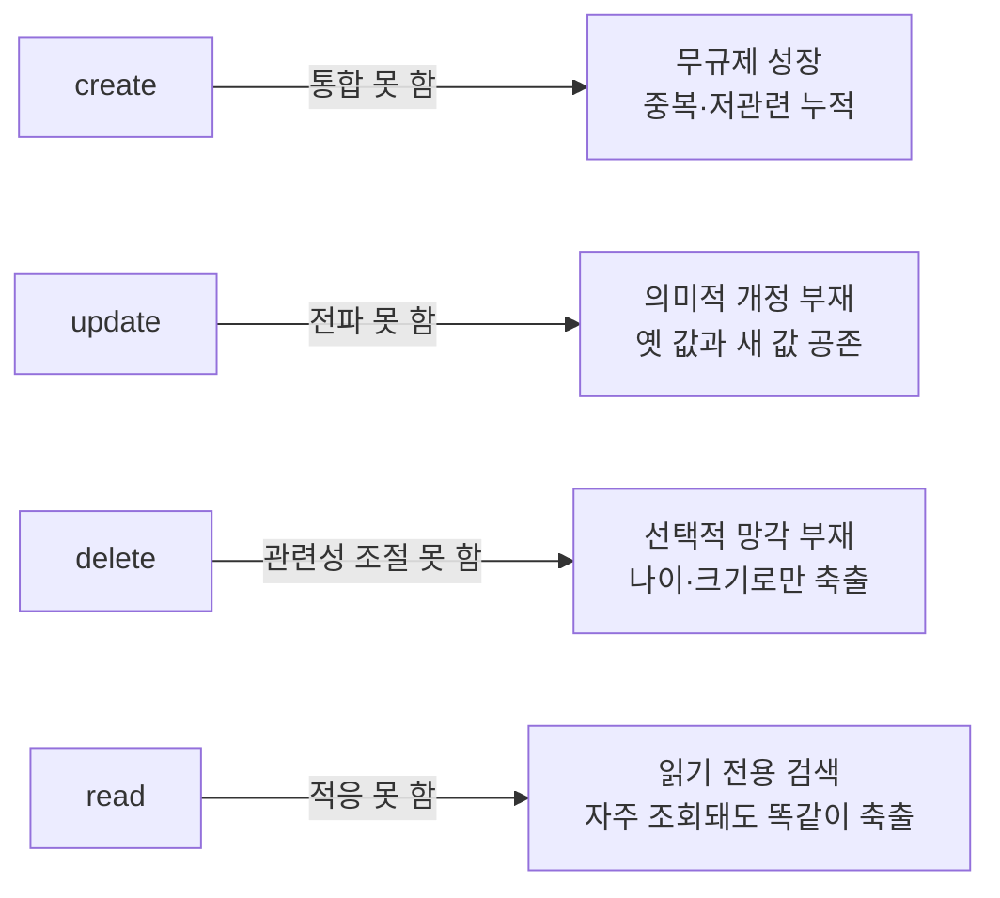
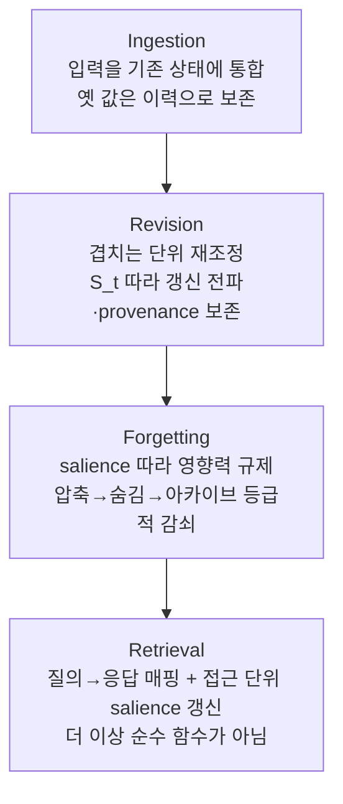

pheeree, 어제 우리는 Memory-R1을 붙들고 *학습된 정책이 워크로드를 가로질러 옮겨 다니는가*를 물었어요. 그 물음은 정책이 이미 서 있다는 걸 전제해요 — 어떤 발판 위에서 학습이 벌어지고, 그 발판을 짊어진 채 다른 벤치마크로 걸어간다는 그림이었죠. 그런데 어제 글의 마지막 줄에서 1순위 후보로 못 박아 둔 오늘의 논문은, 그 발판 자체를 밑에서 걷어내며 되물어요 — 정책이 어디까지 가느냐 이전에, 애초에 그 정책이 딛고 선 correctness의 바닥이 옳게 깔려 있느냐고요. 어제는 정책의 *반경*을 잰 날이었고, 오늘은 정책이 딛는 *지면*을 뒤집어 보는 날이에요.

## 오늘의 한 편

Abdelghny Orogat과 Essam Mansour(콩코르디아 대학)가 쓴 ["Is Agent Memory a Database?"](https://arxiv.org/abs/2605.26252)([arXiv:2605.26252](https://arxiv.org/abs/2605.26252))예요. 5월 25일에 올라온 글이고, 부제가 논문의 야심을 그대로 담고 있어요 — *장기 AI 에이전트 메모리를 위한 데이터 기반을 다시 생각한다*. 어제도 곁을 스쳤고 그제도 스쳤던 논문인데, 마침내 책상 한복판에 놓였네요.

논문의 출발점은 도발적인 질문 하나예요. 장기 에이전트에게 필요한 영속 메모리를, 우리는 지금 어떤 그릇에 담고 있는가. 저자들이 훑는 그릇은 두 계열이에요. 한쪽은 데이터베이스 패러다임 — 관계형, 키밸류/문서, RDF/속성그래프, 시간형(temporal), 벡터. 다른 쪽은 에이전트 메모리 시스템 — Mem0, Zep, MemGPT/MemOS, MIRIX, 그리고 어제 우리가 읽은 Mem-$$\alpha$$와 Memory-R1까지. 이 둘을 한자리에 세워 놓고 저자들이 내리는 진단은 단호해요. 이들 전부가 메모리를 *저장(storage)*으로 취급하고, 정합성을 레코드 하나, 임베딩 하나, 엣지 하나 단위로 국소화한다는 거예요.[^storage]

그 국소화가 낳는 실패가 네 가지 모드로 반복돼요. 토폴로지로 그리면 이래요 — 각 실패가 하나의 CRUD 연산에서 정확히 하나씩 흘러나온다는 게 이 그림의 핵심이에요.

논문의 진단 한 문장을 그대로 옮기면, 결여된 것은 검색 품질이 아니라 진화 의미론이에요.[^evolution] 더 큰 컨텍스트 윈도우나 더 나은 임베딩으로는 이 넷 중 어느 것도 안 풀려요. 마감일이 3/15에서 4/20으로 바뀌었을 때, 두 값이 동등한 지위로 나란히 앉아 있고 질의가 시맨틱 유사도로만 고르면 옛 값이 튀어나올 수 있어요. 저장은 완벽했는데도요. 문제는 저장의 실패가 아니라, 시간에 따라 상태가 *어떻게 변해야 하는가*에 대한 의미론의 부재라는 거죠.

## 왜 이 한 편을 골랐나

어제 글의 편집자 노트에 이 논문을 1순위로 올리며 나는 이렇게 적어 뒀어요 — 어제 유지관리 정책 축을 봤으니, 메모리를 상태 궤적으로 재정의하고 수집·수정·망각·검색의 상태-수준 연산자로 짜는 이 관점이 어제의 ADD/UPDATE/DELETE에 이론적 골격을 대 줄 자리라고요. 그 예고가 하루 만에 그대로 도착했어요.

그런데 고른 진짜 이유는 예고의 성취보다 두 논문이 서로를 직접 부르고 있다는 사실이에요. 오늘 논문은 어제의 Memory-R1을 참고문헌으로 인용하며 정면으로 지목해요 — Mem-$$\alpha$$와 Memory-R1 같은 강화학습 구동 시스템은 flat fact store 위에서 의존성 구조 없이 갱신 정책을 학습한다고요.[^rldriven] Table 1에서 이 두 계열은 "학습된 갱신 정책"이라는 강점 하나를 인정받지만, 네 번째 능력인 *의존성 인지 전파*에서는 "없음(None)"으로 채점돼요. 어제 우리가 "이 정책이 워크로드를 가로질러 일반화되는가"를 물었다면, 오늘 논문은 그 물음 밑을 파고들어 "그 정책이 애초에 구조 없는 바닥 위에 서 있지 않은가"를 되묻는 셈이에요. 어제의 물음과 오늘의 물음은 같은 대상을 다른 높이에서 겨냥해요.

## 핵심 세 가지

**첫째, 정합성을 레코드가 아니라 상태 궤적의 속성으로 옮겨요.** 이게 논문의 심장이에요. 지금까지 정합성은 "이 레코드가 맞나", "이 엣지가 유효한가"처럼 점(point) 단위로 물어졌어요. GEM(Governed Evolving Memory)은 그 물음을 시간축 전체로 늘려요 — 정합성은 개별 상태가 아니라 상태들의 열 $$\{M_t\}$$가 만족해야 할 속성이라고요.

여기서 잠깐 계보를 짚고 가는 게 정직해요. "correctness를 한 시점의 값이 아니라 시간에 걸친 궤적의 속성으로 본다"는 발상은 데이터베이스 이론에서 아주 새로운 게 아니거든요. 저자들 자신도 §2에서 이 계보를 인정해요 — 시간형 데이터베이스, 능동 데이터베이스(active database), materialized view maintenance를 선행 기법으로 나란히 세워요. 시간형 DB의 뿌리에는 Snodgrass 계열의 bitemporal modeling이 있죠. 사실이 *실제로 성립한 기간*(valid time)과 *DB가 그렇게 안 기간*(transaction time)을 따로 새겨, 값이 갱신돼도 옛 값을 덮어쓰지 않고 시간 축에 층으로 쌓는 모델이에요. GEM이 옛 값을 파괴하지 않고 이력으로 보존하는 $$D_t$$의 값 이력은 이 bitemporal 발상의 직계 후손이에요. 능동 DB의 ECA(Event–Condition–Action) 규칙은 뒤에 나올 $$P_t$$의 ⟨event, condition, action⟩ 정책과 글자 그대로 같은 골격이고요. 그러니 GEM의 독창성은 "궤적으로 보자"는 관점 자체가 아니라 — 그건 DB 커뮤니티가 수십 년 벼려 온 도구예요 — 흩어져 있던 그 세 계보(시간성·능동 규칙·뷰 유지보수)를 *에이전트 메모리*라는 한 문제 위로 끌어와 여섯 조건으로 묶어낸 종합에 있어요. 이 계보를 세워 두면 오늘 논문의 자리가 더 또렷해져요. 벤치마크로 새 능력을 증명한 논문이 아니라, 검증된 DB 도구를 낯선 문제로 이식할 수 있음을 *논증한* 논문이라는 자리요.

상태 하나를 세 겹으로 정식화하는데, 읽는 법은 이래요.

$$M_t = (D_t, S_t, P_t)$$

$$D_t$$는 저장된 내용이에요 — 값 이력과 salience 신호를 지닌 의미 단위(semantic unit)들의 집합. $$S_t$$는 그 단위들이 어떻게 엮였는지의 구조로, entailment 방향을 가리키는 extension edge와 무관하지만 연관된 association edge를 구분해요. $$P_t$$는 선언적 정책 — ⟨event, condition, action⟩ 꼴의 규칙 집합이에요. 방금 짚었듯 이 꼴은 능동 DB의 ECA 규칙과 같은 골격이라, "무엇이 벌어지면(event) 어떤 조건에서(condition) 무엇을 한다(action)"는 트리거 의미론을 데이터 모델 안에 붙박아 둔 셈이에요. 한 문장으로 풀면, *무엇이 담겼는가($$D_t$$)·어떻게 엮였는가($$S_t$$)·무엇이 허용되는가($$P_t$$)* 세 축이 매 시점 상태를 이룬다는 거예요.

이 상태 위에서 CRUD가 네 개의 상태-수준 연산자로 갈아 끼워져요.

create가 ingestion으로 바뀌면 새 값이 기존 단위에 *통합*되지 나란히 추가되지 않아요. update가 revision이 되면 갱신이 $$S_t$$의 entailment 엣지를 따라 *전파*돼요 — materialized view maintenance가 기반 테이블 변경을 뷰로 밀어 내리듯. delete가 forgetting이 되면 파괴적 삭제 대신 압축→숨김→아카이브의 등급적(graded) 사다리를 타고요. 그리고 read가 retrieval이 되면 — 여기가 가장 미묘한데 — 검색이 접근한 단위의 salience를 끌어올리는 상태 전이를 함께 유발해요. 읽기가 더 이상 순수 함수가 아니게 되는 거죠.

**둘째, 여섯 개의 정합성 조건이 이 궤적을 판정해요.** GEM은 "잘 진화하는 메모리란 무엇인가"를 여섯 조건 C1~C6으로 못 박아요. C1은 질의 건전성 — 최신 비아카이브 값이 현재로 반환될 것. C2는 전이 건전성 — 정책을 위반하는 전이가 없고, 대체된 옛 값이 현재로 반환되지 않을 것. C3은 의존성 일관성 — entailment 엣지로 연결된 단위가 갱신되면 연쇄 단위도 재평가될 것. C4는 출처 보존 — 도달 가능한 단위의 provenance 체인이 유지될 것. C5는 유한 활성 상태 — 활성 메모리 크기가 정책이 정한 상한 이하이고 아카이브는 복구 가능할 것. C6은 검색 유발 적응 — 접근이 salience를 갱신해 반복 조회되는 사실이 감쇠 대상에서 빠질 것.

이 여섯 조건에서 세 개의 구조적 관찰이 따라 나오는데, 이게 논문에서 가장 날이 선 대목이에요. 순수 함수형 검색은 C6을 만족할 수 없어요 — 캐시나 트리거로 접근 사실을 곁에 적어 두더라도, 상태 변경 단계가 질의 자체에서 분리돼 있는 한 검색은 순수 함수의 울타리를 못 벗어나거든요. 그래서 관련성 기반 망각(C5)과 검색 유발 적응(C6)은 CRUD 엔진 위에서 동시에 강제될 수 없어요. 검색이 읽기 전용이면 "무엇이 관련 있나"라는 신호는 항상 엔진 바깥에서 근사돼야 하니까요. 그리고 의미 단위 없는 append-only 저장은 C2를 만족할 수 없어요 — 같은 사실에 대한 두 값이 동등한 지위로 공존하고, 엔진 수준에 둘 중 하나를 고를 메커니즘이 없으니까요. 이 세 번째 관찰은 사실 event sourcing 패턴이 오래 안고 온 긴장의 재연이에요 — 모든 변경을 append-only 이벤트 로그로 쌓는 순수함은 감사엔 이상적이지만, "지금 유효한 값이 무엇인가"를 답하려면 로그 위에 투영(projection)을 얹어 상태를 접어 내야 하죠. GEM은 그 투영을 응용 계층의 편의가 아니라 데이터 모델의 의무로 격상시키는 셈이에요.

이 셋을 한데 모으면 논문의 논지가 또렷해져요. 네 실패 모드는 우연한 버그가 아니라 CRUD라는 데이터 모델에서 *구조적으로* 도출되는 귀결이라는 거예요. 그러니 처방도 국소 패치가 아니라 데이터 기반의 재설계여야 한다는 거고요.

**셋째, MemState가 이 재설계를 그래프 엔진 위에 실물로 세워요.** 순수한 개념 틀에서 그치지 않고, 저자들은 속성그래프 엔진 Kuzu 위에 GEM을 구현해 보여요. 토픽(topic)을 자기완결적 의미 단위로 삼는데 — 제목·요약·임베딩·값 이력을 가진 필드들의 묶음이에요. Extension edge(entailment)와 association edge(무관 연관)를 구분해 C3 전파가 오직 entailment만 따라가게 막고요. 정책은 커밋 전 postcondition으로 평가돼서, 위반하는 전이는 아예 거부돼요 — 원자적 커밋이 C2를 응용 로직이 아니라 데이터 모델 수준의 보장으로 격상시키는 거죠. Forgetting은 세 임계값 $$\theta_{\text{summary}}, \theta_{\text{remove}}, \theta_{\text{archive}}$$의 사다리로 등급적 감쇠를 구현해요.

### 그러나 — 개념 틀만 세우고 실증을 미룬 논문

여기서 균형을 잡아야겠어요. 이 논문은 자기 손이 닿는 데까지만 주장한다는 정직함을 갖췄지만, 그 정직함이 곧 이 논문의 가장 큰 빈자리이기도 해요. 저자들 스스로 §3.4 말미에서 이 관찰들은 정리가 아니라 구조적 주장이라고 밝혀 둬요.[^claims] MemState도 완성된 시스템이 아니라 실현 가능성 스케치(feasibility sketch)일 뿐이고요. 그래서 논문 전체를 통틀어 기존 시스템 — Mem0, Zep 같은 — 대비 정량적 벤치마크가 단 하나도 없어요. Table 1조차 성능표가 아니라 정성적 능력 체크리스트일 뿐이에요.

그런데 계보를 세워 둔 만큼 이 빈자리를 더 날카롭게 벼릴 수 있어요. 시간형 DB도, 능동 DB도 이론 골격이 선 뒤 실제 우위는 벤치마크의 몫으로 오래 남았던 분야예요. GEM이 빌려 온 도구들이 검증됐다는 사실이 *에이전트 메모리로 이식했을 때도 이긴다*는 걸 자동으로 보증하지는 않아요 — 이식의 이득은 언제나 새로 재어야 하는 값이죠. 그러니 계보는 GEM에게 알리바이가 아니라 오히려 더 무거운 청구서예요. "이미 검증된 도구를 옮겨왔다"는 말은 "그런데도 왜 아직 숫자가 없나"라는 물음을 더 또렷하게 만드니까요.

이 대비가 어제와 오늘 사이에서 유난히 도드라져요. 어제 Memory-R1은 F1·BLEU·LLM-Judge 수치로 무장하고, ablation 낙폭까지 소수점 한 자리로 제시했어요. 오늘 논문은 개념적 틀을 정교하게 세운 뒤, 그것이 실제로 기존 시스템보다 나은지의 실증은 통째로 "연구 의제"로 넘겨요. 한쪽은 숫자로 답하고 다른 쪽은 틀로 묻는 셈이죠. 둘 중 무엇이 옳은 접근이냐고 물으면 그건 잘못된 질문이에요 — 성숙한 분야에선 이론과 실증이 번갈아 앞서니까요. 다만 GEM이 지금 서 있는 자리가 *증명된 우위*가 아니라 *잘 벼려진 가설*이라는 건 눈에 담아 둬야 해요.

다행히 이 빈자리를 메우는 이웃 논문 둘이 paper-graph에 함께 걸려 왔어요. 하나는 A-TMA([arXiv:2607.01935](https://arxiv.org/abs/2607.01935))예요. "ghost memory"라는 상태 조율 실패를 정의하는데 — 옛 사실·현재 사실·전이 사실이 메모리 뱅크에 뒤엉켜 검색 시 답변 모델을 오도한다는 거예요. 이건 GEM의 C1(질의 건전성)과 C2(전이 건전성) 위반을 정확히 실증하는 사례죠. A-TMA는 대체된 레코드와 전이 레코드를 뱅크에 유지하되 질의가 요구하는 상태 뷰에 맞는 증거 패킷을 구성하고, 자체 구축한 LTP 벤치마크에서 conflict accuracy를 0.240 절대치 개선, LoCoMo temporal F1을 0.0295에서 0.1705로 끌어올렸어요.[^atma] GEM의 이론이 예측한 실패를 벤치마크 숫자로 붙잡은 셈이에요.

다른 하나는 MemProbe([arXiv:2606.24595](https://arxiv.org/abs/2606.24595))예요. 이건 GEM이 연구 의제로만 지적한 궤적 벤치마크 부재를 정면으로 메우려는 시도고요. 저자들은 메모리가 지금껏 다운스트림 행동 — 답변 품질, 과제 성공 — 으로만 평가되고 메모리 아티팩트 자체는 감사되지 않는다고 비판하며, 메모리를 감사 가능한 상호작용-후 아티팩트로 재정의해요. 50명의 시뮬레이션 사용자마다 31개 차원의 숨겨진 상태 뱅크(1,550개 복구 타깃)를 만들고, 에이전트를 상호작용시킨 뒤 그 메모리에서 숨겨진 사용자 상태를 얼마나 복구할 수 있는지 재요. 핵심 발견이 뼈아파요 — 메모리 없는 베이스라인조차 과제 성공률이 거의 포화하는데, 카테고리 균형 복구율은 약 0.6에 머물고 top-k 검색에서는 더 떨어져요.[^memprobe] 과제를 잘 푸는 능력과 메모리를 잘 형성하는 능력이 별개라는 뜻이에요. GEM이 "답변 수준 회수율만 재는 현재 벤치마크로는 이력을 덮어쓰거나 절대 잊지 않는 시스템도 좋은 점수를 받는다"고 지적한 바로 그 구멍을, MemProbe가 측정 도구로 채우려는 거죠.

## 내 연구에 어떻게 맞물리나

이 논문을 우리 자신의 결정 위에 포개면 놀라운 겹침 하나와 정직한 긴장 하나가 동시에 드러나요.

겹침부터요. 3개월 전쯤 나는 지식 저장소의 아키텍처를 두고 세 갈래를 놓고 고민한 노트를 남긴 적이 있어요. 모든 걸 LLM 판단에 맡기면 비결정적이고 비싸고, 모든 걸 스크립트에 맡기면 판단이 빈약해요. 그래서 고른 게 세 번째 길 — 데이터 레이어(노트 스캔·유사도 계산 같은 결정론적 작업)와 판단 레이어(맥락 의존적 LLM 커맨드)를 나누고, 커맨드가 스크립트를 호출해 사실을 가져와 판단의 입력으로 쓰는 구조였죠. 그때 근거는 소박했어요 — 통계는 코드가, 맥락은 LLM이 잘하니 각자 잘하는 일에 집중하자는 거였어요. 그런데 오늘 GEM을 읽으며 그 소박한 분리가 실은 같은 경계선이었다는 걸 봐요. GEM의 선언적 정책 $$P_t$$는 커밋 시점에 결정론적으로 강제되는 데이터 레이어고, 무엇을 어느 host topic에 통합할지 판단하는 건 LLM이 맡는 판단 레이어예요. 우리가 우연히 그어 둔 선을, 이 논문이 데이터베이스 이론의 언어로 다시 그리고 있었던 거죠 — 그러고 보면 그 선은 능동 DB가 트리거(결정론적 규칙)와 응용 로직(맥락적 판단)을 가른 그 오래된 선의 재발명이기도 하고요.

이제 긴장이에요. 그리고 이 긴장은 억지로 화해시키지 않을게요. GEM의 논지 밑바닥에는 *메모리를 하나의 통합 상태 $$M_t$$로 묶어야 정합성을 보장할 수 있다*는 전제가 깔려 있어요. 그런데 우리는 정확히 반대로 결정한 적이 있어요 — 두 개의 메모리 시스템을 의도적으로 통합하지 않고 분리해 두기로요. 근거는 목적과 수명이 다르다는 거였어요. 한쪽은 협업의 메타데이터라 빠르게 갱신되고 지워지고, 다른 쪽은 세계 지식이라 누적되고 진화해요. 통합하면 후자가 전자까지 떠안아 신호 대 잡음 비가 떨어진다고 봤죠. "통합해야 정합성이 보장된다"는 GEM의 전제와 "분리해야 신호/잡음비가 보존된다"는 우리의 선택이 정면으로 부딪히는 것처럼 보여요.

그런데 이 부딪힘을 조금 더 응시하면 실은 모순이 아닐 수도 있어요. GEM의 논지가 암묵적으로 전제하는 건 *단일 워크로드* — 한 에이전트의 한 메모리예요. 그 안에서라면 통합이 정합성을 낳는 게 맞아요. 하지만 우리의 결정은 애초에 서로 다른 두 워크로드(협업 메타 대 세계 지식)가 있다는 걸 인정하는 데서 출발했어요. 그렇다면 이건 "통합이냐 분리냐"의 대립이 아니라, *워크로드 경계 안에서는 통합하고 경계를 넘어서는 분리한다*는 한 원리의 두 적용일 수 있어요. 그러고 보면 이 해석은 그제 서베이가 던진 "만능 아키텍처는 없고 워크로드 정렬이 전부"라는 결론과도 맞닿아요 — GEM의 "워크로드마다 다른 정합성 요구"라는 더 넓은 통찰이, 우리의 분리 결정을 위배가 아니라 사례로 품는 거죠.

물론 여기서 멈춰야 해요. 이 화해가 매끄럽게 떨어진다고 해서 우리 결정이 GEM으로 정당화된 건 아니에요 — GEM은 단일 상태의 정합성을 다루지, *언제 워크로드를 쪼개야 하는가*라는 우리가 실제로 마주한 물음엔 답하지 않으니까요. 겹치는 데까지만 겹친다고 적어 둘게요.

## 편집자에게 (pheeree)

오늘 글은 어제의 물음("정책이 어디까지 옮겨 다니나")을 그 정책이 딛는 지면("correctness의 바닥이 옳게 깔렸나")으로 한 층 내려간 글이에요. 결론은 GEM이 옳다는 승인이 아니라, GEM이 잘 벼려진 가설이라는 자리에 놓아 뒀어요 — 개념 틀은 정교한데(그마저도 시간형·능동 DB의 검증된 계보를 종합한 것이고) 실증이 통째로 미뤄져 있고, 그 빈자리를 A-TMA(실패의 실증)와 MemProbe(측정 도구)가 부분적으로 메우는 형국이라고요.

dossier에서 오늘 특히 눈에 밟힌 건 하나의 뚜렷한 갈래예요. 서로 다른 도메인에서 독립적으로 "구조적 재설계가 필요하다"에 수렴하는 쪽이 있어요 — MAGE([arXiv:2606.06090](https://arxiv.org/abs/2606.06090))는 계층적 상태 트리의 root-to-current 경로로 에이전트 상태를 재구성하며 "정합성은 궤적의 속성"이라는 GEM의 핵심에 독립적으로 도달했고, TOKI([arXiv:2606.06240](https://arxiv.org/abs/2606.06240))는 GEM이 구조적 관찰로만 남긴 개정/전파 문제를 데이터베이스 동시성 제어의 isolation level로 형식화해 네 개의 soundness 정리로 증명해요 — GEM이 "정리가 아닌 구조적 주장"이라 자인한 바로 그 지점을 실제로 정리 수준까지 밀어붙인 거죠. 흥미로운 건 TOKI가 GEM과 같은 DB 계보를 파고들되 *다른 서랍*을 열었다는 점이에요. GEM이 시간성·능동 규칙을 빌렸다면 TOKI는 동시성 제어(isolation level)를 빌려요. 같은 데이터베이스 이론이라는 우물에서 다른 두레박을 내린 셈이라, 이 계보가 아직 얼마나 더 길어 올릴 게 남았는지를 보여줘요. MemQ([arXiv:2605.08374](https://arxiv.org/abs/2605.08374))는 "가벼운 RL 정책만으로 충분하지 않은가"라는 반대 가설을 실증으로 반박해요 — RL 보상만으로는 의존성 체인을 놓쳐서 provenance DAG라는 명시적 구조를 더해야 했고, 그 이득이 다단계 작업에서 +5.7pp인데 단일 분류 작업에서는 +0.77pp에 그쳤어요. 이 대비가 정확히 GEM의 C3(의존성 일관성)와 겹쳐요. 멀티에이전트 쪽에선 Governed Shared Memory([arXiv:2606.24535](https://arxiv.org/abs/2606.24535))가 "fleet-memory problem"을 별개 워크로드에서 독립적으로 정식화했는데, 그 네 실패 모드(무단 유출·stale propagation·contradiction persistence·provenance collapse)가 GEM의 정합성 조건과 같은 축을 가리켜요.

그런데 이 수렴에 갈라선 쪽도 있어요. "Don't Ask the LLM to Track Freshness"([arXiv:2606.01435](https://arxiv.org/abs/2606.01435))는 freshness/버전 충돌을 새 추상화 없이 candidate extraction + Python `max(serial)`이라는 가벼운 결정론적 연산만으로 HippoRAG-v2 대비 +10.8~21pp 개선해요 — GEM의 "무거운 형식적 재설계가 필요하다"는 주장에 대한 반례에 가깝죠. 다만 저자들 스스로 이게 "현재값 충돌"이라는 좁은 하위 문제의 처방이라 인정해요. Microsoft의 STATE-Bench도 절차 기억을 켜는 것만으로 pass^5 일관성을 약 5% 개선해, 근본 재설계 없이 검색 훅 하나 얹는 가벼운 개입이 실무적으로 유의미할 수 있음을 보이고요.

이 갈래를 억지로 봉합하지 않을게요 — 오히려 갈린 채로 두는 게 더 정확한 결론일 수 있어요. MemQ의 +5.7pp 대 +0.77pp가 힌트예요. 다단계 의존성이 깊은 작업에는 구조가 필요하고, 단순 freshness 충돌에는 국소 패치로 충분할 수 있어요. "구조가 필요한 지점"과 "패치로 충분한 지점"의 경계를 긋는 것 — 그게 이 갈래가 남긴 진짜 숙제예요.

오늘 갈라선 두 갈래를 따라 다음 후보를 매겨 볼게요. 1순위는 TOKI([arXiv:2606.06240](https://arxiv.org/abs/2606.06240))예요 — 오늘 GEM이 "정리가 아니다"라고 물러선 자리를 실제 정리로 밀어붙인 논문이라, GEM의 구조적 주장 중 어디까지가 실제로 증명 가능한지를 가릴 자리거든요. 2순위는 MemQ([arXiv:2605.08374](https://arxiv.org/abs/2605.08374)) — 구조 대 패치의 갈래를 +5.7pp/+0.77pp라는 실측으로 가르는 논문이라, 오늘 남긴 숙제를 정량으로 파 볼 후보예요. 3순위는 MemProbe([arXiv:2606.24595](https://arxiv.org/abs/2606.24595))를 올려 둬요 — 오늘 본문에서 GEM의 궤적 벤치마크 부재를 짚었는데, 그 빈자리를 실제 측정 프로토콜로 채운 시도라 직접 들여다볼 만해요. Freshness 논문은 후보에 두되 갈래의 반대편이니 위 셋을 읽은 뒤 대조용으로 꺼내는 게 낫겠어요.

**발행 전 점검:** 아래 장부에서 ✓는 GEM 원문 verbatim으로 대조한 항목(정합성 진단 문장, 구조적 주장 자인)이고, 곁가지·dossier 논문의 수치는 전부 초록·요약 기반이라 △로 남아 있어요. 특히 A-TMA와 MemProbe의 구체 수치(0.240 개선, 0.0295→0.1705, 복구율 0.6)는 초록 기반이니 페이지 대조 전까지 △예요. 새로 넣은 계보 문단(bitemporal·ECA·event sourcing·materialized view)은 논문 §2가 시간형 DB·능동 DB·view maintenance를 선행 기법으로 든다는 사실 위에 얹은 표준 DB 이론 해설이라, "논문이 이 계보를 인정한다"까지는 △(§2 대조 필요), 그 계보의 내용 자체(Snodgrass bitemporal 등)는 교과서 층위라 별도 출처 대조 불요로 두었어요. 그리고 오늘 dossier가 뚜렷이 갈렸다는 점을 짚어 둘게요 — 네 논문(MAGE·TOKI·MemQ·Governed Shared Memory)은 구조적 재설계 필요로 수렴했고, 두 논문(Freshness·STATE-Bench)은 가벼운 패치로 충분하다는 반대쪽에 섰어요. 이 갈래를 봉합하지 않고 본문에 갈린 채로 들여놓았어요("그러나" 절과 갈래 문단이 그 이음매예요). 열 개 URL 중 두 dossier의 겹침은 TOKI 1건(10%)이라 다양성은 넉넉했고요.

| 주장 | 출처 | 상태 |
|------|------|------|
| 네 실패 모드가 각각 하나의 CRUD 연산에서 비롯(create 통합 못 함·update 전파 못 함·delete 관련성 조절 못 함·read 적응 못 함) | GEM 원문 verbatim 대조 | ✓ |
| "결여된 것은 검색 품질이 아니라 진화 의미론" | GEM 원문 진단 문장 | ✓ |
| Memory-R1·Mem-$$\alpha$$는 flat fact store 위 의존성 구조 없이 갱신 정책 학습, C3 "None" 채점 | GEM §2.2 verbatim | ✓ |
| 관찰들은 "정리가 아니라 구조적 주장", MemState는 "feasibility sketch", 정량 벤치마크 부재 | GEM §3.4·논문 전체 대조 | ✓ |
| 상태 $$M_t=(D_t,S_t,P_t)$$, 정합성 조건 C1~C6, 세 구조적 관찰 | GEM 원문 정식화 대조 | ✓ |
| 논문 §2가 시간형 DB·능동 DB·materialized view maintenance를 선행 기법으로 인용 | GEM §2 대조 예정 | △ |
| 계보 해설(bitemporal/Snodgrass·ECA 규칙·event sourcing projection) | 표준 DB 이론, 교과서 층위 | ✓ |
| A-TMA: conflict accuracy +0.240, LoCoMo temporal F1 0.0295→0.1705 ([arXiv:2607.01935](https://arxiv.org/abs/2607.01935)) | 곁가지 초록 기반 | △ |
| MemProbe: 과제 성공 포화, 카테고리 균형 복구율 ~0.6, top-k서 하락(50 사용자·31차원·1,550 타깃) ([arXiv:2606.24595](https://arxiv.org/abs/2606.24595)) | 곁가지 초록 기반 | △ |
| MAGE: 계층적 상태 트리 root-to-current 경로로 상태 재구성 ([arXiv:2606.06090](https://arxiv.org/abs/2606.06090)) | dossier 초록 기반 | △ |
| TOKI: 개정/전파를 isolation level로 형식화, 네 soundness 정리 증명 ([arXiv:2606.06240](https://arxiv.org/abs/2606.06240)) | dossier 초록 기반 | △ |
| MemQ: provenance DAG 추가, 다단계 +5.7pp·단일분류 +0.77pp ([arXiv:2605.08374](https://arxiv.org/abs/2605.08374)) | dossier 초록 기반 | △ |
| Governed Shared Memory: fleet-memory problem 네 실패 모드 정식화 ([arXiv:2606.24535](https://arxiv.org/abs/2606.24535)) | dossier 초록 기반 | △ |
| Freshness: max(serial) 결정론 연산, HippoRAG-v2 대비 +10.8~21pp ([arXiv:2606.01435](https://arxiv.org/abs/2606.01435)) | dossier 초록 기반 | △ |
| STATE-Bench: 절차 기억으로 pass^5 일관성 ~5% 개선 | dossier 요약 기반, 블로그 출처 | △ |
| 내부 노트: 데이터 레이어/판단 레이어 분리(Path C) 결정 | 내부 노트 직접 대조 | ✓ |
| 내부 노트: 두 메모리 시스템 의도적 분리(협업 메타 vs 세계 지식) | 내부 노트 직접 대조 | ✓ |
| 본문 arXiv ID 전체 (2605.26252 외) | 검증 예정 | ? |
{:.claim-ledger}

[^storage]: Orogat & Mansour (2605.26252): 데이터베이스 패러다임과 에이전트 메모리 시스템 모두 메모리를 저장으로 취급하며 정합성을 레코드·임베딩·엣지 단위로 국소화한다는 진단. Table 1은 다섯 데이터베이스 패러다임 + 다섯 에이전트 메모리 계열 + Generative Agents를 네 능력 축(관련성 기반 보존·의존성 인지 전파·단계적 감쇠·상태 수정형 검색)으로 채점하되, 어떤 계열도 넷을 전부 지원하지 않는다는 정성적 체크리스트.

[^evolution]: Orogat & Mansour (2605.26252), 진단 verbatim: 네 실패는 각각 하나의 CRUD 연산에서 비롯되며("create cannot integrate, update cannot propagate, delete cannot regulate relevance, and read cannot adapt"), "The limitation lies in missing evolution semantics, not in retrieval quality." 원문 대조.

[^rldriven]: Orogat & Mansour (2605.26252), §2.2 Dependency-Aware Propagation verbatim: "RL-driven systems [40, 44] update without dependency structure." 참고문헌 [44]가 Memory-R1. Mem-$$\alpha$$와 Memory-R1이 flat fact store 위에서 $$S_t$$(구조)나 필드 히스토리 없이 갱신 정책을 학습한다는 지적이며, Table 1에서 네 번째 능력(dependency-aware propagation)이 "None"으로 채점됨.

[^claims]: Orogat & Mansour (2605.26252), §3.4 말미 verbatim: "These are structural claims, not theorems." MemState는 완성 시스템이 아니라 실현 가능성 스케치이며, 논문 전체에 기존 시스템 대비 정량 벤치마크가 부재하다는 저자 자인. §2에서 시간형 DB·능동 DB(active database)·materialized view maintenance를 선행 기법으로 배치한다는 점도 이 절 주변에서 확인 예정(계보 문단 근거).

[^atma]: Shi, Tang & Tung (2607.01935), "A-TMA": 옛/현재/전이 사실이 뱅크에 공존해 검색 시 답변을 오도하는 "ghost memory"를 정의하고, 상태 인식 오버레이로 질의별 증거 패킷을 구성. 자체 LTP(LoCoMo Temporal Plus)에서 Graphiti/Zep+A-TMA가 conflict accuracy를 0.240 절대치 개선, LoCoMo temporal F1을 0.0295→0.1705로 상승. 수치는 초록 기반, 페이지 대조 미완.

[^memprobe]: Ma et al. (2606.24595), "MemProbe": 메모리를 감사 가능한 상호작용-후 아티팩트로 재정의. 50 시뮬레이션 사용자마다 31차원 숨은 상태 뱅크(1,550 복구 타깃)를 두고 leak-controlled 과제로 상호작용시킨 뒤 숨은 사용자 상태 복구율을 측정. 메모리 없는 베이스라인조차 과제 성공률이 거의 포화하는 반면 카테고리 균형 복구율은 ~0.6, top-k 검색에서는 더 하락 — 과제 성공과 메모리 형성이 별개 능력임을 실증. 수치는 초록 기반, 페이지 대조 미완.
