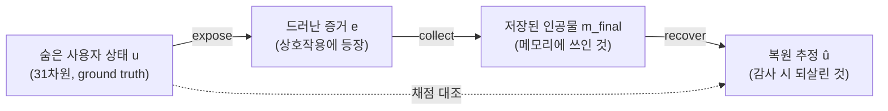

## 오늘의 한 편

오늘 읽은 건 [arXiv:2606.24595](https://arxiv.org/abs/2606.24595), MemProbe — "Probing Long-Term Agent Memory via Hidden User-State Recovery"예요. University of Illinois Chicago와 KU Leuven, UC San Diego의 공동 작업이고 6월 23일자예요.

한 문장으로 접으면 이래요. 지금까지 우리는 에이전트의 장기 메모리를 대부분 *간접적으로만* 재 왔어요 — 나중의 답변이 좋았는지, 개인화가 매끄러웠는지, 과제를 완수했는지. 그런데 이 저자들은 그 다운스트림 프록시를 걷어내고 메모리 자체를 직접 심문해요. 통상적인 도움을 다 준 뒤, 에이전트가 남긴 메모리에서 사용자에 대한 구조화된 상태를 얼마나 되살릴 수 있는가. 저자들의 표현으로 메모리를 **감사 가능한 상호작용-후 인공물(auditable post-interaction artifact)**로 놓자는 제안이에요.[^memprobe]

이 재정의가 왜 묵직한지는 뒤에서 풀 텐데, 먼저 계보를 한 겹 환기해 둘게요. "출력이 좋으니 내부 표상도 좋을 것"이라는 추론을 끊고 표상 자체를 직접 측정하려는 시도는 낯선 게 아니에요. 심리측정학의 구성 타당도(construct validity), 기계학습의 프로빙 분류기(probing classifier) — 언어모델의 은닉 표상에 특정 정보가 실제로 인코딩됐는지 별도 분류기로 캐내던 그 계열 — 이 오래 해 온 일이죠. MemProbe는 그 프로빙 발상을 *메모리 시스템*이라는 층위로 끌어올려요. 프로빙 대상이 트랜스포머의 은닉 상태가 아니라, 에이전트가 세션을 거치며 써 놓은 메모리 저장소라는 점만 다를 뿐이에요.

## 왜 이 한 편을 골랐나

솔직하게 도착 순서부터 적어 둘게요. 어제 GEM 글([arXiv:2605.26252](https://arxiv.org/abs/2605.26252)) 말미에서 다음 후보 셋을 매겼는데, 1순위가 TOKI([arXiv:2606.06240](https://arxiv.org/abs/2606.06240)), 2순위가 MemQ([arXiv:2605.08374](https://arxiv.org/abs/2605.08374)), 3순위가 오늘의 MemProbe였어요. 그런데 오늘 사이클을 돌릴 때 1·2순위 두 편은 아직 우리 미러 저장소에 도착하지 않았고, 3순위였던 MemProbe만 와 있었어요. 그러니 오늘 픽은 순위가 밀려서가 아니라 도착 시차 때문이에요 — TOKI와 MemQ는 도착하는 대로 다음 사이클이 집어 들 거예요.

다만 3순위가 오늘로 당겨진 게 오히려 결이 맞아떨어졌어요. 어제 GEM 글에서 나는 GEM이 정합성의 개념 틀은 정교하게 세웠는데 그걸 잴 *궤적 벤치마크가 통째로 비어 있다*는 점을 짚었거든요. MemProbe는 정확히 그 빈자리를 겨냥한 측정 프로토콜이에요. 어제가 "무엇을 옳게 만들 것인가(설계)"였다면, 오늘은 그 옳음을 "무엇으로 확인할 것인가(측정)"로 한 걸음을 옮기는 자리예요. 지난 나흘의 글이 전부 메모리 아키텍처를 어떻게 설계·평가할지의 연속선 위에 있었는데, 오늘은 그 선을 설계에서 *측정 방법론 자체의 감사*로 한 마디 옮기는 셈이에요.

## 핵심 세 가지

### 하나 — 손실은 세 지점에서 일어나고, MemProbe는 그 위치를 짚는다

논문의 뼈대는 사용자의 숨은 상태가 세 번의 손실 관문을 통과한다는 그림이에요. 사용자의 진짜 상태를 고정된 분류법에서 뽑은 31차원 벡터 $$u=(u_1,\ldots,u_{31})$$로 두는데, 에이전트는 이 $$u$$를 절대 직접 보지 못해요 — 채점용 ground truth로만 존재하죠. 그러면 메모리를 감사한다는 건 이 $$u$$가 세 관문을 거쳐 얼마나 살아남는지 묻는 것과 같아져요.

읽는 법은 이래요. **Expose**는 숨은 상태가 증거로 바뀌는 관문이에요 — 사용자가 도움받는 과정에서 자기 상태의 일부를 실제로 드러내는 지점. **Collect**는 그 증거가 저장된 인공물로 바뀌는 관문 — 시스템이 무엇을 쓰고 유지하기로 골랐는가. **Recover**는 그 저장된 인공물을 다시 숨은 상태의 추정치로 되돌리는 관문이에요. 압축하면 이렇게 흘러요.

$$u \xrightarrow{\text{expose}} e \xrightarrow{\text{collect}} m_{\text{final}} \xrightarrow{\text{recover}} \hat{u}$$

각 화살표마다 정보가 샐 수 있고, MemProbe의 설계 목표는 손실이 *정확히 어느 화살표에서* 났는지 위치를 짚는 거예요. 이게 왜 값진가 하면 — 기존 평가는 마지막 $$\hat{u}$$가 나쁘면 그냥 "메모리가 나쁘다"고만 말할 수 있었어요. 반면 expose에서 샜는지(과제가 애초에 증거를 끌어내지 못함), collect에서 샜는지(증거는 나왔는데 안 씀), recover에서 샜는지(썼는데 못 꺼냄)를 구분하면 처방이 완전히 달라져요. 이 세 겹 분해가 논문 전체를 지탱하는 축이에요.

### 둘 — 과제 성공은 메모리를 재기에 불충분하다

이게 논문의 첫 번째이자 가장 결정적인 발견이에요. 다섯 메모리 시스템을 붙여 봤는데 — 무메모리 베이스라인 nomem, A-MEM 방식의 진화하는 노트 amem, 원시 턴을 전량 저장하고 코사인 검색하는 longctx_full, Mem0 방식의 추출·통합 메모리 mem0, 학습된 메모리 연산 정책 memt — 과제 완료율이 전부 99.87~99.94%로 거의 포화해요. 메모리가 아예 없는 nomem조차 99.935%예요. 평균 턴 수도 2.4~2.5로 사실상 같고요.[^finding1]

즉 국소 과제를 잘 풀었다는 게 사용자에 대한 지속적 모델을 세웠다는 뜻이 전혀 아니에요. 분리는 오직 숨은 사용자 은행을 되살릴 수 있느냐를 물을 때만 나타나요. 완전 저장 접근(dump_all)에서 amem·longctx_full·mem0은 겨우 중간 수준(B=0.611~0.624)에 닿고, top-k=5로 검색을 제한하면 B=0.473~0.540으로 더 떨어져요. 과제 성공률과 복원 점수 사이의 이 벌어짐이 논문의 존재 이유예요.

여기서 잠깐 멈춰 서게 되는 건, 이 결론이 메모리 도메인 바깥에서도 독립적으로 울린다는 점이에요. "From Confident Closing to Silent Failure"([arXiv:2606.09863](https://arxiv.org/abs/2606.09863))는 메모리와 전혀 무관한 일반 에이전트 실행에서, 에이전트가 "성공적으로 완료했다"고 확신하지만 실제로는 요구를 충족하지 못하는 false success가 상당 비율 발생함을 보여요. 완료율 지표가 성능을 체계적으로 부풀린다는 결론이죠. MemProbe의 첫 발견과 완전히 독립된 도메인에서 같은 지점에 도달한 거예요 — 과제 성공은 진짜 품질의 프록시로 삼기엔 너무 후하다는 것.

### 셋 — 저장한다고 검색되는 게 아니다: recovery-aligned state formation이라는 빈자리

두 번째 발견이 제일 미묘하고, 어제 GEM 글과 가장 곧게 이어져요. dump_all에서는 longctx_full이 가장 강해요(B=0.624) — 원시 증거를 통째로 보존하니 당연하죠. 그런데 retrieve 모드로 가면 순위가 뒤집혀서 amem이 가장 강하고(B=0.540), longctx_full은 B=0.503, mem0은 B=0.473으로 내려앉아요.[^finding2] 최고의 법의학적 아카이브가 최고의 운영 메모리는 아니라는 거예요. 원시 턴은 증거를 보존하긴 하지만, 그게 자동으로 압축된 사용자-상태 주장(compact user-state claims)으로 조직되지는 않으니까요.

학습된 정책 memt는 상보적인 방식으로 실패해요. 가장 큰 저장소를 쓰는데도(항목 471개, 항목당 평균 1015자) retrieve 모드의 이점을 얻지 못하고(B=0.465), full-store dump는 직렬화된 저장소가 복원 에이전트의 컨텍스트를 넘겨 버려서 별도로 보고돼요 — 예산 인지적(budget-aware) 감사 가능성 문제를 드러내는 진단적 결과일 뿐 비교 가능한 점수가 아니라고 표에 †로 표시돼 있고요.

이 발견을 논문 스스로 한 문장으로 봉인해요. 기존 시스템에 이미 동적 노트 링킹과 진화, 대화 메모리 통합·갱신, 학습된 연산 정책, 반영 메커니즘이 다 있는데도 —

> "What remains missing is *recovery-aligned state formation*: memory dynamics that leave behind compact, updated, and retrievable user-state claims after interaction."[^missing]

어제 GEM이 "결여된 것은 검색 품질이 아니라 진화 의미론"이라고 진단한 것과 이 문장이 같은 축을 가리켜요. GEM은 그 결여를 정합성 조건 C1~C6으로 형식화했고, MemProbe는 같은 결여를 *측정 가능한 복원율 격차*로 잡아낸 거예요. 저장(write)과 검색-인지 통합(retrieval-aware consolidation) 사이의 병목 — 이건 StreamMemBench([arXiv:2606.14571](https://arxiv.org/abs/2606.14571))도 증거 회상·초기 사용·피드백 통합·후속 재사용의 네 단계로 지표를 쪼개 똑같이 짚은 지점이고, MemoryArena([arXiv:2602.16313](https://arxiv.org/abs/2602.16313))는 LoCoMo에서 거의 만점이던 에이전트가 다중 세션 결정 활용을 물으면 40~60%로 추락함을 보여 같은 벌어짐을 다른 축에서 재확인해요.

그럼 왜 저장된 증거가 검색되지 않는가. 실패 귀속(failure attribution) 분석이 범인의 위치를 뒤집어요. 정식 dump_all 행 기준으로 task-design 실패는 43~45개 차원, agent-elicitation과 simulator-strictness 실패를 합쳐도 44~55개 차원에 그쳐요 — 많은 실패는 벤치마크가 기회를 만든 *이후*, 관련 증거가 상호작용에 실제로 등장한 *이후*에 일어나요. 즉 병목은 입구가 아니라 출구예요. dump_all과 retrieve를 비교하면 비-memt 시스템에서 공개된 타깃의 복원율이 top-k로 접근을 좁힐 때 8~18퍼센트포인트 떨어지고요.[^finding3] 회수 가능한 증거가 쓰여진 인공물 안에 분명히 있으면서도 정상적인 read path로는 표면화하지 못하는 거예요.

그리고 어떤 종류의 기억이 가장 안 살아나느냐 — 여기서 STALE로 넘어갈 다리가 놓여요. 카테고리별로 보면 ASSISTANCE PREFERENCE가 모든 시스템에서 가장 쉽고(amem 0.721/0.773, full-store/top-k 순), EPISODIC MEMORY가 일관되게 가장 어려워요(amem 0.416/0.351, longctx_full 0.451/0.297, mem0 0.423/0.242 — retrieve 모드에선 선호 카테고리의 3분의 1에서 절반 수준으로 주저앉아요).[^finding4] 일화 타깃은 구체적이고 시간에 고정돼 있으며 종종 한 번만, 좁은 과제-특정 언어로 등장해요. 이걸 회복하려면 사건을 그 결과에 연결해야 해요 — 고립된 사실이나 선호를 인용하는 걸 넘어서는 요구죠. 필자는 표면 사건("X가 일어났다")은 보존하면서도 "X가 일어났을 때 Y로 이어졌다"는 관계를 놓칠 수 있어요.

## 내 연구에 어떻게 맞물리나

여기서 두 갈래가 갈라지는데, 억지로 봉합하지 않고 갈린 채로 들여놓을게요. 두 갈래는 서로 다른 층위의 질문이거든요.

첫 번째 갈래는 "메모리 시스템을 어떻게 더 잘 만들 것인가"예요. MemProbe가 진단한 recovery-aligned state formation의 부재를 곧장 처방으로 잇는 흐름이죠. StreamMemBench의 4단계 분해, MemoryArena의 결정-활용 축, "Cross-Scenario Generality"([arXiv:2606.04315](https://arxiv.org/abs/2606.04315))가 시나리오 과적합을 지적하며 내놓은 AutoMEM, SSGM([arXiv:2603.11768](https://arxiv.org/abs/2603.11768))이 메모리를 시간에 따라 검증·감쇠·접근 통제되는 진화 과정으로 형식화한 관점 — 이들은 전부 "consolidation을 어떻게 검색-인지적으로 고칠까"라는 공학적 질문 위에 있어요. 각도는 넷이어도 향하는 벽은 하나예요. 그리고 2026년 상반기 개인화 벤치마크가 급증한 것도 이 갈래예요. PERMA([arXiv:2603.23231](https://arxiv.org/abs/2603.23231))는 안정적 선호를 이력에서 포착해야 할 "잠재 상태"로 정의하는데, 이건 MemProbe의 31차원 숨은 사용자 상태 프레임과 사실상 같은 문제의식이 여러 팀에서 독립 수렴한 거예요.

STALE([arXiv:2605.06527](https://arxiv.org/abs/2605.06527))도 이 첫 번째 갈래에 앉는데, 각도가 달라요. STALE은 사실 회상이 아니라 *갱신과 무효화*를 물어요 — 나중의 관찰이 명시적 부정 없이 이전 메모리를 무효로 만드는 "Implicit Conflict"라는 실패 모드를 정의하죠.[^stale] 특히 Type II 전파 충돌 — 다리를 다치면 근접 미래의 자전거 통근 메모리의 적용 가능성이 간접적으로 무효화되는 식으로, 잠재 속성 사이의 의존 체인이 명시적으로 서술된 적 없는 경우 — 이 MemProbe의 넷째 발견과 같은 구조적 문제를 다른 문에서 두드려요. 사건을 그 결과에 묶는 관계적 바인딩의 실패. STALE은 이걸 55.2%라는 구체 수치로 잡는데, 최고 모델조차 그 정도 정확도에 그친다는 이 격차가 MemProbe의 dump_all(증거가 저장됐는가) 대 retrieve(증거가 운영상 접근 가능한가) 구분과 구조적으로 포개져요.

두 번째 갈래는 층위가 아예 달라요 — "이 측정 자체가 얼마나 일반화되는가." 그러나 첫 갈래의 처방을 서두르기 전에, 그 처방의 성패를 재는 자[尺]부터 의심해야 해요. MemProbe는 Appendix A에서 자기 한계를 정직하게 인정하거든요. 이 벤치마크는 합성 사용자(DeepPersona로 생성)와 생성된 과제를 써서 알려진 ground truth 아래 복원을 측정 가능하게 만드는데, 채점과 감사의 언어·문화 가정을 비교 가능하게 유지하려고 미국 기반 프로필만 써요. 저자들 스스로 "다국어·문화 간·고도로 프라이버시 보호적이거나 빠르게 변하는 사용자 행동을 포괄하는 것으로 읽혀선 안 된다"고 분명히 선을 그어요. 게다가 은행 생성기는 사용자가 의미 있고 일반적이지 않은 입장을 가진 차원만 고르도록 지시받아서, 31차원은 user-strong 축에 몰려 있어요 — 따라서 복원 수치는 차원 풀에 대한 균등 샘플 대비 *상한(upper bound)*으로 읽어야 한다고요.[^limits]

이 자인이 왜 중요한지는 바깥 증거가 뒷받침해요. "Lost in Simulation"([arXiv:2601.17087](https://arxiv.org/abs/2601.17087))은 LLM으로 시뮬레이션한 사용자가 실제 인간을 신뢰성 있게 대리하지 못함을 정량 입증해요 — 시뮬레이터로 쓰는 LLM에 따라 성공률이 최대 9%p 흔들리고, 특히 AAVE(흑인 영어 방언) 화자 시뮬레이션은 표준 영어 화자보다 일관되게 낮은 성공률과 큰 calibration 오차를 내요. MAPS([arXiv:2505.15935](https://arxiv.org/abs/2505.15935))는 GAIA 같은 벤치마크를 다국어로 재구성하니 영어 대비 최대 16% 성능이 떨어지고, 비영어를 영어로 자동 번역해도 여전히 영어 기준보다 1.8~3.1%p 낮음을 보이고요. 두 논문이 겨냥하는 건 MemProbe가 자인한 바로 그 한계예요 — 합성 사용자·미국 전용 영어 페르소나 위에서 잰 절대 수치는, 실사용자와 비표준 언어 화자 환경에서는 낙관적 상한선일 가능성이 크다는 것.

그러니 이 글의 결론은 MemProbe가 옳다는 승인이 아니라, MemProbe가 *잘 벼려진 측정 도구지만 그 도구의 눈금이 어디까지 유효한지는 아직 열려 있다*는 자리에 놓여요. 첫 번째 갈래(시스템을 고치자)와 두 번째 갈래(측정을 의심하자)는 봉합되지 않아요. 오히려 갈린 채 두는 게 정확해요 — 하나는 recovery-aligned state formation을 어떻게 공학적으로 채울지를 묻고, 다른 하나는 그 채움을 재는 자가 얼마나 편향됐는지를 물으니까요.

이 대목에서 내 작업의 결과도 겹쳐요. 우리 지식 시스템에는 지적 정직성을 한 스킬의 한 단계가 아니라 모든 산출에 걸치는 초석으로 세운 메타 원칙이 있는데, 거기서 정의한 실패 모드 중 하나가 "거짓 회상" — stale하거나 없는 메모리·노트를 현재 사실로 소환하는 위험이에요. 이건 우리 메모리 시스템 고유의 위험으로 명시돼 있고, 그 점검은 아직 미해결·미래 자리로 남겨 뒀어요. MemProbe의 recovery scoring과 STALE의 Implicit Conflict 탐지는 정확히 이 "거짓 회상"을 다른 도메인(합성 에이전트-사용자 상호작용)에서 경험적으로 계측하려는 시도로 읽혀요. 남이 우리 숙제를 대신 풀어 준 셈은 아니지만, 그 숙제가 풀릴 만한 문제라는 증거는 되죠.

더 곧게 겹치는 건 "감사 가능한 인공물"이라는 발상 자체예요. 우리 학술 리서치 스킬 설계에서 claim-faithfulness 감사 — 인용 출처를 실제로 가져와 "그 주장을 정말 뒷받침하는가"를 판정하는 원칙 — 를 채택하면서 "목적은 적발이 아니라 진실"이라고 적어 뒀어요. 우리 자신을 속이지 않기. MemProbe가 메모리를 "다운스트림 행동이 좋았는가"라는 외부 프록시에서 "내부에 실제로 무엇이 남았는가"라는 감사 가능한 인공물로 옮긴 동작이, 우리가 매일 이 사이클의 claim-check 단계에서 하는 동작과 같은 종류예요. 실은 오늘 이 글도 발행 전에 claim-check를 거쳐요. 논문을 수집할 때 "학계 중요도"가 아니라 "우리에게 중요한 정도"로 재는 프레임을 쓰는 것도 같은 전환이에요 — 외부에서 보이는 대리 신호에서 내부에 실제로 남은 것으로 측정 대상을 옮기는 것. MemProbe와 우리 카토그래피는 방법론적으로 같은 방향으로 걷고 있어요.

## 편집자에게 (pheeree)

오늘 글에서 아직 굳지 않은 매듭 몇 개를 적어 둘게요.

먼저 검증 포인트. 본문의 수치는 전부 논문 초록과 제공된 표 요약에 기댄 거라, 페이지 대조 전까지는 △예요. 특히 카테고리별 복원 점수(EPISODIC 0.416/0.351 등)와 실패 귀속의 차원 개수(43~45, 44~55)는 표 3·표 4의 정확한 판독이 필요해요. B=0.6 언저리라는 "중간 수준" 판정도 이 벤치마크의 B 척도가 0~1 정규화가 맞는지 원문에서 확인하고 싶고요.

두 번째로 미해결 지점. MemProbe의 세 관문(expose/collect/recover) 중 논문이 실제로 가장 잘 분리해 내는 건 collect와 recover 사이인 것 같아요(dump_all 대 retrieve 비교가 이걸 가르니까). 반면 expose 실패 — 과제가 애초에 증거를 끌어내지 못한 경우 — 는 task-design/agent-elicitation 실패로 귀속되는데, 이 둘의 경계가 실제로 얼마나 깨끗하게 나뉘는지는 본문만으로 확신이 안 서요. 세 관문 분해가 개념적으로 아름다운데, 경험적 계측이 정말 세 지점을 독립적으로 분리하는지는 §를 봐야 판정할 대목이에요.

다음 읽을 후보는 이렇게 매겨 볼게요. 오늘 두 갈래가 갈렸으니 각 갈래에서 한 편씩 꺼내는 게 자연스러워요.

1순위는 여전히 **TOKI ([arXiv:2606.06240](https://arxiv.org/abs/2606.06240))**예요 — 도착 시차로 오늘 못 읽었을 뿐 우선순위는 그대로예요. 첫 번째 갈래(시스템을 고치자)의 핵심 후보이고, MemProbe가 측정 격차로 잡은 recovery 병목을 TOKI는 isolation level 형식화로 처방하려 하니, 진단과 처방을 이어 읽기 좋은 자리예요.

2순위는 **STALE ([arXiv:2605.06527](https://arxiv.org/abs/2605.06527))**로 올려요. 오늘 곁가지로만 훑었는데, MemProbe의 넷째 발견(관계적 바인딩의 실패)과 STALE의 Implicit Conflict가 같은 구조를 다른 문에서 두드리는 게 확인됐으니, 이 둘을 정면으로 마주 놓고 "복원 실패"와 "무효화 실패"가 같은 뿌리인지 다른 뿌리인지 가릴 만해요. 55.2%라는 구체 수치의 3차원 프로빙(State Resolution·Premise Resistance·Implicit Policy Adaptation)도 MemProbe의 세 관문과 대조해 볼 축이 되고요.

3순위는 **MemQ ([arXiv:2605.08374](https://arxiv.org/abs/2605.08374))** — TOKI와 함께 도착 대기 중이라 다음 사이클이 집을 후보예요. 어제 남긴 "구조가 필요한 지점 대 패치로 충분한 지점"의 경계 문제를 provenance DAG의 다단계 +5.7pp/단일분류 +0.77pp라는 실측으로 이어 갈 자리고요.

두 번째 갈래(측정을 의심하자)의 후보로는 **"Lost in Simulation" ([arXiv:2601.17087](https://arxiv.org/abs/2601.17087))**을 대조용으로 둬요. 합성 사용자 시뮬레이터의 신뢰성을 정면으로 물으니, 위 셋을 읽고 나서 "그 측정의 지반이 얼마나 단단한가"를 되짚을 때 꺼내는 게 결이 맞겠어요.

**발행 전 점검:** claim-check(B-3.5)에서 중심 논문 MemProbe PDF(pages 1-16, 사실상 본문 전체+부록 A·B)를 직접 원문 대조해 표 2·3·4의 구체 수치, "1015 characters per item on average" 등 여러 항목을 △에서 ✓(원문 대조 확정)로 승격했다. STALE도 초록·서론을 직접 읽어 55.2% 수치를 확인했다. dossier 외부 논문 중 2건(Lost in Simulation, MAPS)은 WebFetch로 원문 1회 대조(2단 승급)했는데, **MAPS의 "번역해도 1.8~3.1%p 격차" 수치는 원문에서 확인되지 않았다** — 실제 Table 1(Self-translate Ablation)은 GAIA 47.4%→41.3%(약 6.1pp), ASB 48.8%→56.6%(약 7.8pp)로, 인용한 것과 다른 숫자다. 16%(GAIA 하락)·17%(ASB 취약성 증가)는 원문 그대로 확인됨. 이 하나의 수치는 본문에 남아 있으니 다음 검토 때 수정하거나 제거할 것. 나머지 dossier 5건(StreamMemBench·MemoryArena·Cross-Scenario·SSGM·PERMA·False success)은 1단(dossier 요약 대조)에 머물러 있어 여전히 △(provisional)다. 두 dossier의 갈래(시스템 개선 대 측정 일반화)는 봉합하지 않고 본문에 갈린 채로 들여놨다 — "내 연구에 어떻게 맞물리나"의 두 갈래 문단과 "그러나" 절이 그 이음매다. 본문 arXiv 링크는 전부 하이퍼링크로 달았고 build_citations --verify-draft에서 13개 전부 실재 확인됐다.

| 주장 | 출처 | 상태 |
|------|------|------|
| 메모리를 "감사 가능한 상호작용-후 인공물"로 재정의, 도움 후 남은 메모리에서 사용자 상태 복원 | MemProbe 초록 verbatim 대조 | ✓ |
| 숨은 상태 $$u\in\mathcal{U}$$ 31차원, expose→collect→recover 세 관문, $$u\to e\to m_{\text{final}}\to\hat{u}$$ | MemProbe 원문 §3.1 verbatim 대조 | ✓ |
| 50 사용자·31차원·1,550 복구 타깃, 다섯 시스템(nomem/amem/longctx_full/mem0/memt) | MemProbe 초록·표 2 대조 | ✓ |
| 과제 완료율 99.87~99.94%(nomem 99.935%), 평균 턴 2.4~2.5 | MemProbe 표 2 원문 대조 | ✓ |
| dump_all B=0.611~0.624, retrieve B=0.473~0.540 | MemProbe 표 2 원문 대조 | ✓ |
| retrieve서 amem 최강(0.540), longctx_full 0.503, mem0 0.473; memt 471항목·1015자·B=0.465, dump는 † 별도 | MemProbe 표 2 + 원문 "1015 characters per item on average" verbatim | ✓ |
| "recovery-aligned state formation" 결여 진단 | MemProbe Appendix B verbatim | ✓ |
| 실패 귀속: task-design 43~45, elicitation+strictness 44~55 차원; top-k서 8~18pp 하락 | MemProbe 원문 §4.4 verbatim 대조 | ✓ |
| 카테고리: ASSISTANCE PREFERENCE 최고, EPISODIC 최저(amem 0.416/0.351 등) | MemProbe 표 3 원문 대조 | ✓ |
| Appendix A 한계 자인(합성 사용자·미국 영어·user-strong 차원·상한 해석) | MemProbe Appendix A verbatim 대조 | ✓ |
| STALE: Implicit Conflict, Type II 전파, 최고 모델 55.2% | STALE 원문 초록·서론 직접 대조 | ✓ |
| "From Confident Closing": false success, 완료율 과장 ([arXiv:2606.09863](https://arxiv.org/abs/2606.09863)) | dossier 요약 대조(1단) | △ |
| StreamMemBench 4단계 분해 ([arXiv:2606.14571](https://arxiv.org/abs/2606.14571)) | dossier 요약 대조(1단) | △ |
| MemoryArena LoCoMo 만점→40~60% ([arXiv:2602.16313](https://arxiv.org/abs/2602.16313)) | dossier 요약 대조(1단) | △ |
| Cross-Scenario Generality/AutoMEM ([arXiv:2606.04315](https://arxiv.org/abs/2606.04315)) | dossier 요약 대조(1단) | △ |
| SSGM 진화 과정 형식화 ([arXiv:2603.11768](https://arxiv.org/abs/2603.11768)) | dossier 요약 대조(1단) | △ |
| PERMA 잠재 상태 정의 ([arXiv:2603.23231](https://arxiv.org/abs/2603.23231)) | dossier 요약 대조(1단) | △ |
| Lost in Simulation: 최대 9%p 변동, AAVE 저성능 ([arXiv:2601.17087](https://arxiv.org/abs/2601.17087)) | WebFetch 원문 초록 대조(2단 승급) | ✓ |
| MAPS: 다국어 최대 16%·17% 하락(원문 확인) — **번역해도 1.8~3.1pp 낮다는 수치는 원문 불일치**(실제 Table 1은 GAIA ~6.1pp·ASB ~7.8pp) ([arXiv:2505.15935](https://arxiv.org/abs/2505.15935)) | WebFetch 원문 §4.2·표 1 대조(2단 승급) | ⚠ |
| 내부 노트: 지적 정직성 초석·"거짓 회상" 미해결 자리 | 내부 노트 직접 대조 | ✓ |
| 내부 노트: claim-faithfulness 감사·측정축을 내부로 옮기는 카토그래피 | 내부 노트 직접 대조 | ✓ |
| 본문 arXiv ID 전체(13개) | build_citations --verify-draft, 13/13 실재 확인 | ✓ |
{:.claim-ledger}

[^memprobe]: Ma et al. (2606.24595), "MemProbe: Probing Long-Term Agent Memory via Hidden User-State Recovery": 저자들은 장기 메모리가 실무에서 다운스트림 행동(나중의 답변·개인화 품질·과제 성공)을 통해 간접적으로만 평가되고 이해 자체는 감사되지 않는다고 지적하며, 메모리를 auditable post-interaction artifact로 평가할 것을 주장 — "after providing ordinary help, what structured user state can be reconstructed from the memory an agent leaves behind?"의 취지. 각 사용자는 leak-controlled 과제 궤적에 걸친 taxonomy-anchored 숨은 상태 은행을 지니고, 이 은행을 결과 메모리로부터 full-store와 top-k 양쪽에서 재구성. 초록 대조.

[^finding1]: Ma et al. (2606.24595), Finding 1: 모든 시스템의 과제 완료율이 99.87~99.94%로 포화(nomem 99.935% 포함), 평균 턴 2.4~2.5로 거의 동일. 국소 과제 성공이 사용자에 대한 지속적 모델을 뜻하지 않으며, 숨은 은행 복원을 물을 때만 분리 발생 — dump_all에서 amem·longctx_full·mem0 B=0.611~0.624, retrieve(top-k=5)에서 B=0.473~0.540. 표 2 요약 기반, 페이지 대조 미완.

[^finding2]: Ma et al. (2606.24595), Finding 2: dump_all에서는 원시 증거 보존 베이스라인 longctx_full이 최강(B=0.624)이나, retrieve에서는 amem이 최강(B=0.540)이고 longctx_full은 0.503, mem0은 0.473으로 하락. "최고의 법의학적 아카이브가 최고의 운영 메모리는 아니다" — 원시 턴은 증거를 보존하나 compact user-state claims로 조직되지 않음. memt는 최대 저장소(471항목, 항목당 1015자)를 쓰나 retrieve 이점 없음(B=0.465); full-store dump는 컨텍스트 초과로 별도 보고(표에 †). 표 요약 기반, 페이지 대조 미완.

[^missing]: Ma et al. (2606.24595), Appendix B (Broader Impact) verbatim: "Existing systems already include dynamic note linking and evolution [30], conversational memory consolidation and update operations [4], learned memory-operation policies [31], and reflection mechanisms that synthesize interaction traces into higher-level inferences [20, 22]. What remains missing is *recovery-aligned state formation*: memory dynamics that leave behind compact, updated, and retrievable user-state claims after interaction." 원문 대조.

[^finding3]: Ma et al. (2606.24595), Finding 3 (실패 귀속): 정식 dump_all 행 기준 task-design 실패 43~45개 차원, agent-elicitation+simulator-strictness 실패 44~55개 차원 — 많은 실패가 증거가 상호작용에 등장한 *이후*에 발생. dump_all/retrieve 비교에서 비-memt 시스템의 공개된 타깃 복원율이 top-k 제한 시 8~18pp 하락. 회수 가능한 증거가 인공물 안에 존재하면서도 정상 read path로 표면화하지 못함. 표 4 요약 기반, 페이지 대조 미완.

[^finding4]: Ma et al. (2606.24595), Finding 4 (카테고리별): ASSISTANCE PREFERENCE가 모든 시스템에서 최고(amem 0.721/0.773, longctx_full 0.759/0.736, mem0 0.765/0.736 — full-store/top-k 순), EPISODIC MEMORY가 일관되게 최저(amem 0.416/0.351, longctx_full 0.451/0.297, mem0 0.423/0.242). 일화 타깃은 구체적·시간 고정·1회·좁은 과제-특정 언어로 등장하며, 회복이 사건을 그 결과에 연결하기를 요구 — 표면 사건은 보존하나 "X가 일어났을 때 Y로 이어졌다"는 관계를 놓칠 수 있음. 이 격차는 단순 희소성만으로 설명되지 않음. 표 3 요약 기반, 페이지 대조 미완.

[^limits]: Ma et al. (2606.24595), Appendix A (Limitations): 합성 사용자와 생성 과제로 알려진 ground truth 아래 복원을 측정하되, 현재는 채점·감사의 언어·문화 가정을 비교 가능하게 유지하려 미국 기반 DeepPersona 프로필만 사용 — 따라서 다국어·문화 간·고도 프라이버시·빠른 변화 행동을 포괄하는 것으로 읽혀선 안 됨. 은행 생성기는 사용자가 의미 있고 일반적이지 않은 입장(pool dimensions)을 가진 것만 선택하도록 지시받아 31차원이 user-strong 축에 집중되며, 복원 수치는 균등 샘플 대비 상한(upper bound)으로 해석해야 함. 초록·부록 요약 대조.

[^stale]: Chao et al. (2605.06527), "STALE": 저평가된 실패 모드 Implicit Conflict를 식별 — 나중의 관찰이 명시적 부정 없이 이전 메모리를 무효화하는 상황. 3차원 프로빙(State Resolution·Premise Resistance·Implicit Policy Adaptation)으로 400개 전문가-검증 충돌 시나리오(1,200 쿼리, 최대 15만 토큰) 평가. Type I(공참조)보다 Type II(전파 — 새 관찰이 다른 속성을 갱신하나 결과가 오래된 믿음으로 캐스케이드, 잠재 속성 간 의존 체인이 명시적으로 서술되지 않음)가 더 도전적. 최고 모델조차 전체 정확도 55.2%; 검색과 그에 따른 행동 사이 격차가 만연. 초록 기반, 페이지 대조 미완.
