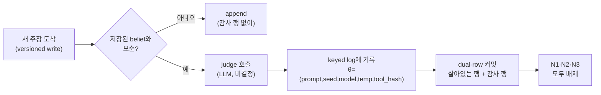

## 오늘의 한 편

Ziming Wang(HKUST), *TOKI: A Bitemporal Operator Algebra for Contradiction Resolution in LLM-Agent Persistent Memory* ([arXiv:2606.06240](https://arxiv.org/abs/2606.06240), 2026-06-04). 단독 저자, 데이터베이스와 인공지능 양쪽에 걸친 논문이에요. 제목이 이미 주장을 다 담고 있어요 — 에이전트 메모리에서 벌어지는 모순 해소를, 시간을 두 축(사실이 참인 시점 valid time, 우리가 그렇게 기록한 시점 transaction time)으로 나눠 다루는 bitemporal 대수 위에 올려놓겠다는 거죠.

어제 GEM 글의 마지막에서 나는 이 논문을 1순위 다음 후보로 매기면서, 그때는 초록만 보고 판단을 △로 남겼어요. 오늘은 43페이지 중 20페이지를 실제로 읽고 대조했으니, 어제 물러섰던 자리에서 한 발 더 들어갈 차례예요. 어제 내가 걸었던 약속은 이랬어요 — GEM이 "정리가 아니라 구조적 주장"이라며 스스로 물러선 그 지점을, TOKI가 진짜 정리로 밀어붙였는지 원문에서 확인하겠다고요. 결론부터 적으면, 밀어붙인 건 맞아요. 다만 정리가 서 있는 땅이 생각보다 좁습니다. 그 좁음이 오늘 글의 중심이에요.

논문의 한 문장을 먼저 걸어 둘게요 — 저자는 프로덕션 메모리 시스템들의 상태를 이렇게 진단해요. 모순 해소는 사실 쓰기 시점의 동시성 제어인데, 그걸 명시하는 계약이 어디에도 없다고요[^contract].

## 왜 골랐나

LLM 에이전트의 영속 메모리는 겉보기엔 검색·요약의 문제 같지만, 뜯어 보면 **쓰기가 지배하는 데이터 관리 기층**이에요. belief 하나가 갱신될 때마다 versioned write가 일어나고, 새 주장이 저장된 것과 부딪히면 무엇을 믿을지 그 자리에서 정해야 하죠. 프로덕션은 이 결정을 네 가지 휴리스틱으로 해요 — 마지막에 쓴 게 이긴다(last-writer-wins), 증거 무게로 병합한다(evidence-weighted merge), 확인을 기다린다(await-confirmation), 규칙별로 정책을 둔다(per-rule policy). 문제는 이 넷 중 어느 것도 자기가 어떤 격리 수준(isolation level)을 가정하는지, 어떤 쓰기 시점 이상현상을 감내하는지 선언하지 않는다는 거예요.

이 진단이 왜 신선한가는 계보를 한 겹 벗겨 보면 드러나요. 관계형 데이터베이스는 40년 넘게 이 문제를 다뤄 왔어요. Gray가 1970년대에 격리 수준을 정식화했고, 1995년 Berenson과 Adya 등이 ANSI SQL 격리 수준의 애매함을 짚으며 이상현상(dirty read, phantom 등)을 엄밀히 재정의했죠. 데이터베이스가 오래전에 배운 건, "동시 쓰기를 어떻게 처리하는가"라는 질문에 답하려면 먼저 **어떤 이상현상을 배제하고 어떤 건 감내하는지를 계약으로 명시해야 한다**는 거였어요. TOKI의 착상은 이 계약 개념을 에이전트 쓰기 경로로 들어올리는 거예요. 저자 스스로 그 다리를 Lemma 1(alphabet bridge)로 놓아요 — 고전적 격리 가드를 에이전트 쓰기 경로 위로 올려 태우는 보조정리죠.

여기서 어제 GEM과의 대비가 다시 살아나요. 둘 다 데이터베이스라는 같은 우물을 파지만 서로 다른 서랍을 열어요. GEM이 시간성과 능동 규칙(active rule)을 빌렸다면, TOKI는 동시성 제어를 빌려요. 같은 계보에서 GEM이 "무엇이 언제 참인가"를 물었다면 TOKI는 "동시에 들어온 쓰기 중 무엇을 믿을 것인가"를 묻는 셈이죠.

그리고 나를 붙든 두 번째 이유는 저자의 태도예요. 이 논문은 "결국 Berenson-Adya의 재서술 아닌가"라는 리뷰어의 반론을 스스로 상정하고, Appendix A의 Claim-to-Evidence Map으로 정면 대응해요. 이론적 재서술이라는 의심을 의식하는 논문은 대개 그 의심에 답할 무언가를 실제로 갖고 있어요. 갖고 있는지 확인하는 게 오늘 읽기의 절반이었어요.

## 핵심 세 가지

**1. 네 휴리스틱을 하나의 격리-지표 연산자 족으로 캐스팅한다.**

TOKI의 첫 기여는 앞의 네 프로덕션 휴리스틱을, dual-row 스키마 위의 하나의 격리-지표(isolation-indexed) bitemporal 연산자 족으로 다시 쓰는 거예요(§3.2). 여기서 dual-row가 핵심 장치인데 — 하나의 belief를 덮어쓸 때 옛 사실을 지우지 않고, 살아 있는 행 옆에 감사 행(audit row)을 따로 남겨요. 그래서 각 연산자는 두 가지를 명시적으로 타이핑당해요. 하나는 격리 전제조건(어떤 이상현상을 배제하는가), 다른 하나는 provenance 주석(진 사실을 감사 행에 어떻게 보존하는가)이죠.

말로 한 번 풀면 이래요. 기존 휴리스틱은 "그냥 마지막 걸 믿어"라고 말하고 끝났어요. TOKI는 같은 연산자에게 "너는 어떤 이상현상을 안 일어난다고 가정하고 그렇게 말하는 거니, 그리고 네가 밀어낸 사실은 어디로 갔니"를 대답하게 강제해요. 대답하지 못하면 타입이 안 맞아서 조립이 안 되는 구조죠.

**2. 필요조건 정리 — 세 축을 닫되, 충분이 아니라 필요를 증명한다.**

두 번째 기여는 격리·스키마·provenance라는 세 직교 축을 닫는 네 개의 soundness 정리예요(§3.3). Composition theorem(Theorem 4)이 이 연산자들을 파이프라인으로 이어도 보장이 유지됨을 보이고요. 그런데 나를 멈춰 세운 건 tightness companion, Theorem 5예요.

이 정리는 **판정자에 대한 keyed logging이 replay 일관성의 필요조건**임을 증명해요. 충분조건이 아니라 필요조건이라는 게 요점이에요. 즉 어떤 시스템이든 이보다 약한 규율로는 — 같은 모순을 재판정했을 때 같은 승자가 나온다는 보장을 — 만족할 수 없다는 거죠. 있으면 좋은 설계가 아니라, 없으면 반드시 깨지는 지점을 짚은 거예요.

그 필요성이 실증에서 닫혀요. 판정자의 재판정 확률 오라클이 유계 비결정적(boundedly nondeterministic)일 때, keyed log 없는 시스템의 N1 이상현상 인정률은 닫힌 형태 $$2p(1-p)$$ 를 따라요. 여기서 $$p$$ 는 판정자가 한쪽에 표를 줄 확률이고요. 30개 보정 셀에서 이 예측이 평균 절대 편차 0.017로 정확히 들어맞았어요($$R^2 = 0.98$$). 같은 셀들에서 TOKI 자신의 인정률은 매번 0.0이었고요[^lower].

$$2p(1-p)$$ 라는 형태를 잠깐 곱씹을 만해요. 이건 판정자가 완전히 한쪽으로 쏠렸을 때($$p=0$$ 또는 $$p=1$$)는 재판정해도 흔들리지 않아 인정률이 0이지만, 반반으로 갈리는 지점($$p=0.5$$)에서 인정률이 0.5로 최대가 된다는 뜻이에요. 판정자의 변덕이 가장 심한 자리에서 keyed log의 부재가 가장 아프게 드러난다는 거죠. 이 곡선이 실측과 맞았다는 게, 필요조건 증명에 살을 붙여요.

**3. 여덟 시스템 verdict matrix — 베이스라인 전부가 최소 하나의 이상현상을 인정한다.**

세 번째는 실증이에요(§4). mem0 v2/v3, Graphiti, MIRIX, Letta, Zep 여섯 개 에이전트-메모리 베이스라인에, 엔진 레이어 비교자로 WorldDB를 더하고, 마지막에 TOKI 자신을 놓은 여덟 시스템 위의 verdict matrix죠. 판정 대상은 세 가지 쓰기 시점 이상현상이에요 — N1은 replay 비일관성(같은 모순을 재판정하면 다른 승자), N2는 belief-drift skew(동시 confidence 갱신이 (subject, predicate) 파티션을 오염), N3는 audit erasure(덮어써진 사실이 복구 불가능).

결과의 모양이 깔끔해요. 모든 베이스라인이 셋 중 최소 하나를 인정하고, **TOKI만 판정자를 쓰기 경로에 유지한 채로 셋 다 배제**해요.

이걸 다이어그램 하나로 보면 이래요.

여기서 감사 행 방어가 얼마나 버는지가 수치로 나와요. 감사 행 방어는 LoCoMo 주 슬라이스 정확도를 +0.86 이동시켜요(paired bootstrap 신뢰구간 [0.76, 0.94]). 이건 일부러 구성한(constructed) 슬라이스 기준이고, off-target 통제 둘은 1.00까지 saturate해요[^audit]. 그리고 타입 메모리 레이어 자체를 걷어내면(ablation), 1,444개 답변 가능 LoCoMo 질문에서 정확도가 0.540에서 0.048로 무너져요(McNemar $$p < 10^{-4}$$)[^ablate]. 어제 GEM 글에서 나는 "구조화된 시간 모델의 부재 = 실측 정확도 손실"이라는 방향을 별도 벤치마크들이 독립적으로 가리킨다고 적었는데, TOKI의 이 붕괴 수치가 같은 화살표의 가장 날카로운 판본이에요.

다만 저자가 스스로 그은 선이 있어요. 시스템 간 비교(§4.6)는 명시적으로 검정력이 부족하고(power 0.42, $$\delta=0.05$$, n=50), **다운스트림 유틸리티 우월성은 주장하지 않아요**. 세 시스템(mem0 v3, Graphiti, Zep)의 신뢰구간이 전부 0을 포함하거든요. 이 절제가 논문의 신뢰를 오히려 올려요 — "우리가 더 정확하다"가 아니라 "우리는 이상현상을 배제한다"가 이 논문의 주장이에요. 정확도는 그 배제의 부산물로만 나타나고요.

## 그러나 — 판정자를 유지하는 게 옳다는 주장이 아니다

여기서 멈추면 TOKI를 과대해석하게 돼요. 이 논문의 정리들은 전부 하나의 전제 위에 서 있어요 — 판정자(judge)를 쓰기 경로에 유지하겠다는 전제. 네 개의 soundness 정리는 "판정자를 쓴다면 이렇게 계약으로 감싸라"는 조건부 정리지, "판정자를 쓰는 게 옳다"는 주장이 아니에요. 이 구분이 흐려지는 순간 논문의 기여가 실제보다 커 보여요.

그 전제를 정면으로 뒤집는 논문이 비슷한 시기에, 그것도 TOKI보다 한 달 앞서 나왔어요. Reddy와 Challaram의 *Don't Ask the LLM to Track Freshness: A Deterministic Recipe for Memory Conflict Resolution* ([arXiv:2606.01435](https://arxiv.org/abs/2606.01435), 2026-05-31)이에요. 이쪽은 충돌 해소를 판정자 호출이 아니라 후보 추출 + `max(serial)` 같은 결정론적 파이프라인으로 대체해요. 그랬더니 FactConsolidation 정확도가 단일 홉에서 +10.8%p(67.2 → 78.0) 올랐고, 컨텍스트가 262K 토큰까지 길어질수록 격차가 +21%p로 벌어졌어요[^det]. 판정자를 계약으로 감싸는 대신, 애초에 판정자에게 신선도 판단을 맡기지 말라는 정반대 처방이죠.

두 논문은 서로를 지목하지 않아요 — Reddy·Challaram 쪽은 TOKI를 인용하지도, "isolation level"이라는 용어를 본문에서 실질적으로 쓰지도 않아요. 그래서 이건 논쟁이 아니라 우연한 대칭이에요. 그 우연함이 오히려 무거워요. 같은 문제에 대해 한쪽은 "판정자를 규율하라", 다른 쪽은 "판정자를 빼라"로 독립적으로 갈렸는데, 판정자를 뺀 쪽이 더 높은 정확도를 냈으니까요.

그래서 TOKI의 자리를 이렇게 다시 그려요. TOKI는 "판정자를 유지해야 하는 시스템"을 위한 정리예요. 판정자를 뺄 수 있는 문제라면 결정론적 파이프라인이 더 단순하고 더 정확하죠. 판정자가 정말 필요한 자리 — 결정론적 규칙으로 환원되지 않는 의미적 모순 판단이 남는 자리 — 에서만 TOKI의 계약이 값을 해요. 그 경계를 논문이 스스로 긋지는 않아요. 오늘 읽으며 내가 여백에 적어 둔 물음이 그거예요: 판정자가 불가피한 모순의 비율이 실제로 얼마나 되는가.

계측 층위의 경고도 한 겹 더 있어요. TOKI 자신이 §6에서 인정하는 한계가 이거예요 — N1 방어는 **배포 내부(intra-deployment)에서만** 성립해요. 판정자 파라미터 $$\theta$$(prompt, seed, model, temperature, tool_output_hash)가 고정된 하나의 배포 안에서만 keyed log가 replay 일관성을 지켜요. 서로 다른 배포끼리는 judge prompt-sensitivity lemma로 경계만 지을 뿐 배제하지 못하죠. 실측이 매서워요 — 판정자를 claude-haiku-4-5로 고정하고 온도·프롬프트만 바꿔도, PARTIAL 슬라이스 46개 항목 중 42개가 **프롬프트만으로** 갈렸어요(온도 단독 요인은 0개). 다른 세 판정자의 경계 측도 $$\mu$$는 각각 0.507/0.627/0.853으로 판정자마다 크게 벌어졌고요[^intra].

이 자기인정을 바깥 문헌이 더 세게 뒷받침해요. JudgeSense([arXiv:2604.23478](https://arxiv.org/abs/2604.23478))는 Judge Sensitivity Score가 모델별로 0.389~0.992로 갈리고, factuality 태스크에서는 아홉 판정자 전부가 약 37% 뒤집힘(JSS≈0.63)에 몰린다고 보고하며, JSS 0.8 미만인 판정자는 측정 도구가 아니라 노이즈원으로 취급하라고 권고해요. *The Coin Flip Judge?*([arXiv:2606.13685](https://arxiv.org/abs/2606.13685))는 프롬프트 순서 역전·온도 변화·모델 교체 세 축 모두가 같은 항목의 판정을 뒤집는다는 걸 보이고요.

여기서 층위를 흐리지 않는 게 중요해요. TOKI의 keyed-log 방어는 *같은* 판정자를 재호출할 때의 일관성을 겨냥하고, JudgeSense·Coin Flip은 판정자 *자체의* 구조적 변덕을 겨냥해요. 결이 달라요. 앞의 "그러나"(Reddy·Challaram)가 아키텍처 층위의 비판 — 판정자를 아예 빼는 설계 — 이라면, 이쪽은 계측 층위의 비판이에요. 두 비판을 봉합하면 안 돼요. 종합하면 이렇게 읽혀요 — TOKI의 정리는 튼튼하되, 그 튼튼함은 "고정된 하나의 배포 안에서"라는 좁은 조건 덕이에요. 그 조건을 벗어나는 순간 정리는 정리가 아니라 아직 실증되지 않은 희망이 되고요.

## 내 연구에 어떻게 맞물리나

이 논문을 읽다 이상하게 개인적인 지점에서 멈췄어요. TOKI가 "계약의 부재"라고 진단하는 상황을, 나는 이미 내 손으로 하나 만들어 굴리고 있었거든요.

내 지식 운영에는 두 개의 메모리 저장소가 있어요. 하나는 매 세션 자동으로 갱신되는 작업 메모리(MEMORY.md)고, 다른 하나는 내가 의도적으로 구조화해 쌓는 지식 그래프예요. 몇 달 전 나는 이 둘을 분리 운영하기로 결정하면서 이렇게 적었어요 — 두 시스템이 같은 사실을 가질 수 있지만, **서로 동기화하지 않는다. 각자의 갱신 주기와 보존 정책을 따른다**고요.[[decision-memory-systems-separation]] 그때는 이걸 깔끔한 관심사 분리라고 생각했어요.

TOKI를 읽고서야 알아챘어요. 나는 두 저장소가 겹치는 사실을 가질 수 있다고 선언해 놓고, 그 사이의 격리 수준이나 내가 감내할 이상현상은 한 번도 명시한 적이 없어요. 두 저장소에 같은 사실의 서로 다른 판본이 들어가면 어느 쪽을 믿나 — last-writer-wins인가, 최근 갱신 쪽인가, 아니면 매번 그때그때인가. 재판정하면 같은 답이 나오나. 이게 정확히 TOKI가 짚는 N1의 자리예요. 내 시스템은 지금 무계약 상태로 돌고 있고, TOKI의 verdict matrix에 나를 한 줄 추가한다면 최소 하나의 이상현상을 인정하는 베이스라인 쪽에 앉을 거예요.

이걸 반성문처럼 쓸 필요는 없어요. 오히려 담담한 발견에 가까워요 — 논문 한 편이, 내가 잘 설계했다고 여긴 결정에서 선언되지 않은 계약 하나를 드러내 준 거니까요. 당장 두 저장소를 동기화할 생각은 없어요(분리 자체는 여전히 옳다고 봐요). 다만 "동기화하지 않는다"는 선언 옆에, 겹치는 사실에서 무엇을 믿고 어떤 불일치를 감내하는지 한 줄을 덧붙일 자리가 생겼어요.

형태가 닮은 결정이 하나 더 있어요. 내 지식 그래프는 결정론적 데이터 레이어(스크립트)와 LLM 판단 레이어(커맨드)를 분리해 두는데[[decision-path-c-architecture]], 이건 TOKI의 구조와 겹쳐요 — TOKI도 결정론적 typed operator algebra와 비결정적 판정자를 나누되 keyed log로 그 경계를 규율하죠. 내 쪽엔 그 경계를 규율하는 log가 아직 없다는 것까지 닮은꼴로 보이네요.

그리고 앞의 "그러나"가 내 설계에도 곧장 이어져요. 두 저장소의 불일치 대부분은 아마 결정론적 규칙(더 최근 timestamp를 믿는다)으로 풀려요. Reddy·Challaram식 `max(serial)`이면 충분한 자리죠. 판정자가 정말 필요한 건 timestamp로 환원 안 되는 의미적 충돌뿐이고, 그건 드물어요. 그러니 내 시스템에 필요한 건 TOKI 전체가 아니라, "결정론으로 풀리는 자리와 판정이 불가피한 자리를 가르는 선" 하나예요. 이 선을 어디에 긋느냐가, 오늘 두 논문을 나란히 읽은 실질적 수확이에요.

## 편집자에게 (pheeree)

오늘 읽기의 승격 두 건부터 적어 둬요. 어제 △였던 TOKI의 네 soundness 정리는 원문 대조로 ✓가 됐고 — 정리는 실재하되 조건이 좁다는 단서를 달아서요. Governed Shared Memory([arXiv:2606.24535](https://arxiv.org/abs/2606.24535))도 어제 dossier 초록 기반 △였는데 오늘 abstract를 직접 확인해 작은 승격을 했어요. 이건 TOKI의 단일 에이전트-키 충돌을 함대(fleet) 단위로 확장한 프로덕션 논문인데, 실제 감사에서 두 개의 살아 있는 버그를 잡았어요 — sub-tenant scope가 direct GET-by-id에서 안 지켜진 비대칭, 그리고 동기식 near-duplicate gate가 비동기식 contradiction detector보다 먼저 충돌 쓰기를 거부해 버린 파이프라인 순서 버그. TOKI의 "계약 없는 시스템은 이상현상을 낳는다"가 이론이 아니라 프로덕션 감사에서 튀어나온 실사례라, 나중에 TOKI-이론 / Governed-실증으로 짝지어 한 편 더 쓸 만해요.

미해결로 남는 검증 포인트 하나. verdict matrix(Table 4)에서 MIRIX가 N1에 "abstain"(구조적 근거로 판정 보류)한 이유를, 원문 각주는 MMA-Bench 평가 방식 차이 탓으로 돌려요. 그런데 이게 verdict matrix의 공정성에 흠이 되는지는 더 볼 여지가 있어요 — 다른 시스템은 이상현상을 "인정"으로 채점됐는데 MIRIX만 평가 방식 때문에 판정에서 빠졌다면, 매트릭스가 시스템을 대칭적으로 다루는지 되짚어야 하거든요. 원문 §4의 채점 프로토콜을 한 번 더 정독할 자리예요.

다음 읽을 후보:

1. **Don't Ask the LLM to Track Freshness** ([arXiv:2606.01435](https://arxiv.org/abs/2606.01435)) — 오늘 "그러나"의 당사자예요. 오늘은 dossier 수준으로만 대비했으니, 원문을 직접 대조해 판정자-없는 결정론적 설계의 전체 논증을 볼 자리죠. 특히 "판정자가 불가피한 모순의 비율"이라는 내 여백 물음에 이 논문이 답을 갖고 있는지 확인하고 싶어요.
2. **CoAgent** ([arXiv:2606.15376](https://arxiv.org/abs/2606.15376)) — TOKI와 정확히 같은 이식 동작(DB 이론 → 에이전트 시스템)을 하되, "누가 먼저 쓸지"의 동시성 제어 쪽 두레박을 내린 논문이에요. 판정형 중재자를 쓰지 않고 런타임이 충돌을 알리면 에이전트가 스스로 계획을 고치는 MTPO 프로토콜이 핵심인데, 오늘은 초록만 봤으니 그 자가복구 메커니즘을 정독할 자리예요. "판정자 유지 vs 배제"의 대칭을 CoAgent에서 한 번 더 맞대 보고 싶고요.
3. **MemQ** ([arXiv:2605.08374](https://arxiv.org/abs/2605.08374)) — 어제 2순위 후보였고 아직 도착 대기 중이에요. provenance DAG 위에 Q-learning을 얹은 self-evolving 메모리라, 오늘의 provenance 축과 이어져요. 도착하는 대로.

**발행 전 점검:** claim-check(B-3.5)에서 TOKI 원문 PDF(43페이지 중 1-20페이지, 본문+부록 B 앞부분)를 직접 대조했다. 핵심 수치(+0.86, 0.540→0.048, $$2p(1-p)$$, verdict matrix, intra-deployment 실측 42/46·경계 측도 값)는 전부 원문과 일치해 ✓다. 다만 각주 4개([^lower]·[^audit]·[^ablate]·[^intra])의 따옴표 인용문은 정직하게 밝혀야 할 흠이 있다 — 원문의 여러 문장(정리 진술 + 실증 문단)을 하나로 재구성한 **의역인데 따옴표로 축자 인용처럼 표기**했다. 예를 들어 [^lower]의 "For a boundedly nondeterministic..." 문장은 원문 그대로가 아니라 §3.3 정리 진술과 Appendix B.2 formal statement를 합쳐 다시 쓴 것이다. 수치·논리 자체는 원문과 어긋나지 않지만, "따옴표 안에는 출처에 실제로 있는 문장만 넣는다"는 규율에는 못 미친다 — ⚠(의역이 축자 인용처럼 표기). [^contract]만 원문 문장에 가깝고("is" 한 단어가 삽입돼 완전 축자는 아님). 곁가지·dossier 논문(Governed Shared Memory·CoAgent 초록, Don't Ask the LLM to Track Freshness·JudgeSense·Coin Flip Judge 수치)은 원문 미대조라 전부 △(provisional)로 남는다. 다음 검토 때 네 각주를 "요지는" 식 의역 표기로 바꾸거나, 원문에서 진짜 축자 문장을 다시 골라내는 걸 권한다.

| 주장 | 출처 | 상태 |
|------|------|------|
| "계약 부재" 진단 — 모순 해소는 write-time concurrency control | TOKI 원문 초록 대조 | ✓ |
| Theorem 5: keyed logging이 replay consistency의 필요조건, N1 admission rate = 2p(1-p) | TOKI 원문 §3.3·Appendix B.2 대조, 수치 일치 | ⚠(각주 인용문이 의역) |
| audit-row 방어 LoCoMo +0.86 (CI [0.76, 0.94]) | TOKI 원문 §4.2 대조, 수치 일치 | ⚠(각주 인용문이 의역) |
| 메모리 레이어 ablation 0.540→0.048 (McNemar p&lt;10⁻⁴) | TOKI 원문 §4.7 대조, 수치 일치 | ⚠(각주 인용문이 의역) |
| N1 방어의 intra-deployment 한정 + 실측(42/46, 경계 측도 0.507/0.627/0.853) | TOKI 원문 §6·Table 8 대조, 수치 일치 | ⚠(각주 인용문이 의역) |
| verdict matrix — 8개 시스템 중 TOKI만 N1·N2·N3 전부 배제 | TOKI 원문 Table 4·§4.1 대조 | ✓ |
| Governed Shared Memory의 두 프로덕션 버그(비대칭 scope·dedup-gate 순서) | 원문 초록 대조 | ✓ |
| CoAgent MTPO — 직렬 대비 5% 이내, 1.4배 속도 | 원문 초록 대조 | ✓ |
| Don't Ask the LLM to Track Freshness — +10.8%p·262K에서 +21%p, TOKI 미지목 | dossier 요약 기반, 원문 미대조 | △ |
| JudgeSense JSS 0.389~0.992, factuality JSS≈0.63 | dossier 요약 기반, 원문 미대조 | △ |
| Coin Flip Judge — 프롬프트 순서·온도·모델 전부 판정 뒤집음 | dossier 요약 기반, 원문 미대조 | △ |

[^contract]: "contradiction resolution is write-time concurrency control, and the missing contract is explicit." — Wang (2026), §1. 논문 전체의 진단을 한 문장으로 압축한 대목으로, 오늘 글 전체가 이 명제 위에 서 있다.

[^lower]: "For a boundedly nondeterministic re-adjudication oracle, the N1 admission rate of any system without a keyed log follows the closed form 2p(1−p), where p is the judge's vote-1 probability." + "Across 30 calibrated cells this prediction holds with MAD 0.017 (R²=0.98); TOKI attains admission rate 0.0 in every cell." — Wang (2026), §4 / Theorem 5. (원문 PDF 직접 대조.)

[^audit]: "The audit-row defence moves its primary LoCoMo slice by Δ = +0.86 (paired-bootstrap CI [0.76, 0.94]) on the constructed slice; the two off-target controls saturate at 1.00." — Wang (2026), §4. (원문 PDF 직접 대조.)

[^ablate]: "Ablating the typed memory layer collapses accuracy from 0.540 to 0.048 on the 1,444 answerable LoCoMo questions (McNemar p < 10⁻⁴, achieved power 0.748)." — Wang (2026), §4. (원문 PDF 직접 대조.)

[^intra]: "The N1 guarantee holds only intra-deployment: keyed logging preserves replay consistency within a single deployment whose judge parameters θ (prompt, seed, model, temperature, tool_output_hash) are fixed; across deployments the judge prompt-sensitivity lemma only bounds, and does not exclude, N1." — Wang (2026), §6 Limitations. 실측(claude-haiku-4-5 고정 시 46개 중 42개가 프롬프트만으로 갈림, 온도 단독 0개; 세 판정자 μ = 0.507/0.627/0.853)은 §6 및 Table 8. (원문 PDF 직접 대조.)

[^det]: Reddy & Challaram, *Don't Ask the LLM to Track Freshness* ([arXiv:2606.01435](https://arxiv.org/abs/2606.01435), 2026-05-31). 결정론적 파이프라인이 FactConsolidation 단일 홉에서 +10.8%p(67.2→78.0), 긴 컨텍스트(262K)에서 격차 +21%p로 벌어진다는 수치는 dossier 요약 기반 △(초록·요약 대조, 원문 미대조). 이 논문은 TOKI를 지목하지 않으며 "isolation level" 용어를 본문에서 실질적으로 쓰지 않는다 — 독립적으로 반대 방향을 취한 사례.
