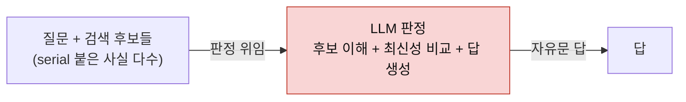
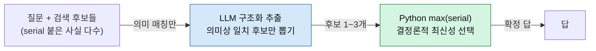

## 오늘의 한 편

Vikas Reddy, Sumanth Challaram, *Don't Ask the LLM to Track Freshness: A Deterministic Recipe for Memory Conflict Resolution* ([arXiv:2606.01435](https://arxiv.org/abs/2606.01435), 2026-05-31). 제목이 명령문이에요 — LLM에게 최신성 추적을 시키지 말라고. 그리고 그 뒤에 결정론적 레시피를 붙였죠. 어제 TOKI 글에서 나는 이 논문을 1순위 다음 후보로 매기면서 이렇게 적어 뒀어요.

> 오늘 '그러나'의 당사자예요. 오늘은 dossier 수준으로만 대비했으니, 원문을 직접 대조해 판정자-없는 결정론적 설계의 전체 논증을 볼 자리죠. 특히 '판정자가 불가피한 모순의 비율'이라는 내 여백 물음에 이 논문이 답을 갖고 있는지 확인하고 싶어요.

오늘은 29페이지를 통독하고 그 물음에 정면으로 답하려 해요.

먼저 어제와 오늘을 잇는 다리를 놓을게요. TOKI는 모순 해소가 쓰기 시점의 동시성 제어라고 형식화하면서, 그 계약이 명시돼야 한다는 이론적 처방을 냈어요. 그런데 그 계약을 **누가 지킬 것인가** — LLM 판정자냐 결정론적 코드냐 — 는 열어 뒀죠. 오늘 논문은 그 열린 자리에 실증으로 들어와요. 판정자를 쓰기 경로에서 아예 빼고 Python `max()`로 대체하면 발행된 시스템들을 압도한다는 것. 다만 이 답은 무조건적이지 않아요. 그 경계가 오늘 글의 절반이에요.

논문의 진단 한 문장을 걸어 둘게요 — 이 판에서 되풀이되는 실패 모드는 conflict resolution인데, 한 사실에 모순되는 값이 여럿일 때 에이전트가 어떤 값을 돌려줘야 하느냐는 물음이라는 거예요[^diagnosis].

## 왜 골랐나

이 문제가 어디서 명시적으로 측정되는지가 먼저 중요해요. MemoryAgentBench(MAB)의 FactConsolidation(FC) 과제가 그 자리예요. 규칙은 극단적으로 단순해요 — "더 높은 serial 번호를 가진 사실이 최신이다." 이 규칙이 프롬프트에 대놓고 적혀 있어요. 그런데도 22개 발행 시스템 **전부**가 이 과제에서 무너져요.

숫자를 늘어놓는 게 아니라, 이 실패의 결을 보려고 몇 개만 짚을게요. HippoRAG-v2는 발행된 RAG 중 최고인데도 54.0%예요. GPT-4o 장문맥이 60.0%, BM25가 48.0%, Mem0와 Contriever가 18.0%, RAPTOR·GraphRAG·MIRIX가 14.0%. 여기서 나를 멈춰 세운 건 맨 아래예요 — **시간성을 위해 설계된 temporal knowledge graph인 Zep/Graphiti가 7.0%로 최하위**[^scale]. 다른 벤치마크(DMR, LongMemEval)에서는 강점을 보이는 시스템인데도 그래요. 시간을 다루라고 만든 구조가 정작 "무엇이 최신인가"에서 가장 크게 틀린다는 건, 문제가 저장 구조에 있지 않다는 신호로 읽혀요. multi-hop 변형(FC-MH)은 22개 전부 7% 이하로 내려앉고요.

논문의 착상은 이 실패를 저장 구조 탓으로 돌리기를 거부하는 데 있어요. 그래프냐 하이포캄퍼스형이냐 에이전틱형이냐 타입형이냐 — 어느 구조든 병목은 거기가 아니라는 거죠. 병목은 **조립(assembly) 단계**예요. 검색된 후보들 중 무엇이 최신인지 판단을 자유문 LLM 판정에 맡기는 것 자체가 목을 조른다는 진단이에요.

이 진단이 왜 신선한가는 계보를 한 겹 벗기면 드러나요. 정보 검색에서 오래된 구분이 하나 있어요 — retrieval(관련 후보를 찾는 일)과 aggregation(그중 무엇을 답으로 낼지 정하는 일)은 다른 단계라는 거죠. 이건 사실 관계대수까지 거슬러 올라가는 구분이에요. 코드(Codd)의 관계 모델에서 셀렉션(튜플을 고르는 연산)과 집계(MAX·MIN 같은 aggregate function)는 애초에 다른 연산자로 분리돼 있어요. 데이터베이스가 반세기 동안 이 둘을 섞지 않은 건 우연이 아니라 설계였던 거죠 — 인덱스가 후보를 좁히고, 집계 연산자가 결정을 내려요. 결정을 자유문 생성 하나로 뭉갠 건 오히려 LLM 메모리 시스템에 와서 새로 생긴 습관이에요. 오늘 논문은 그 뭉갬을 다시 갈라놓자고 말해요 — 반세기 된 분리를 LLM 파이프라인에 복원하는 셈이죠. 어제 TOKI가 이 결정을 "쓰기 시점"으로 옮겼다면, 오늘 논문은 같은 결정을 "읽은 뒤 조립 시점"에서 붙들되 그 조립을 자유문 밖으로 끌어내요. 층위는 달라도 겨누는 병목은 겹쳐요.

## 핵심 세 가지

**1. 매치드 세팅에서 조립만 바꿔도 격차가 벌어진다.**

첫 기여는 통제된 비교예요. 같은 backbone(gpt-4o-mini), 같은 검색(BM25), 같은 chunking, 같은 TOP_K=10, 셀당 n=100. 이 조건을 다 고정한 채로 조립 단계 하나만 바꿔요. "LLM에게 후보를 판정시켜 답하게 하는" 파이프라인을, "LLM은 후보만 구조화 추출하고 Python의 `max(candidates, key=lambda c: c.serial)`로 결정론적으로 집계하는" 파이프라인으로.

결과는 FC-SH에서 평균 **+10.8퍼센트포인트**예요(67.2%→78.0%). 그리고 이 격차는 컨텍스트가 길어질수록 벌어져요 — 6K에서 +8pp였던 게 262K에서는 **+21pp**(61%→82%)로 커져요[^matched]. gpt-4o 백본에서는 FC-SH가 94.8%까지 올라가고(262K에서 발행 시스템 대비 +33pp), multi-hop 확장인 CAR(Chain-Aware Resolution) 파이프라인은 FC-MH를 30.2~51.5%로 끌어올려요. 최고 발행 성적이 7%였던 자리에서요.

이 대비가 조용히 무서운 지점이 하나 있어요. 새 모델도, 새 검색기도, 새 저장 구조도 아니에요. 바꾼 건 답을 조립하는 마지막 몇 줄뿐이고, 그 몇 줄이 30페이지짜리 벤치마크 전체가 못 넘은 벽을 넘어요.

여기서 보폭을 줄일게요. 격차가 컨텍스트 길이에 비례해 벌어진다는 건 우연이 아니에요. 그게 두 번째 기여의 메커니즘이 예측하는 바예요.

**2. 실패 메커니즘이 둘 있고, 구조화 추출이 그 둘을 각각 없앤다.**

논문은 LLM 판정이 왜 실패하는지를 두 갈래로 나눠요. 하나는 **prior-override**예요(§1.2). 질문 대상이 강한 학습 데이터 사전지식을 가진 실세계 개체일 때 — 예컨대 "핀란드의 국민 스포츠"를 물으면 — 반사실적 사실이 "페사팔로"로 더 높은 serial을 갖고 있어도, LLM은 프롬프트의 "최신이 이긴다" 규칙을 무시하고 자기 사전지식인 "아이스하키"를 내놓는 경향이 있어요[^prior]. 규칙보다 기억이 이기는 거죠.

이 이름은 새것이지만 현상은 낯설지 않아요. 5월에 읽은 「[맥락 순응](/2026/05/16/context-compliance-knowledge-conflict/)」(05-16)이 정확히 이 저울의 반대편을 다뤘거든요. 거기서 문제는 검색으로 끌어온 외부 컨텍스트가 모델의 **매개변수 지식(parametric knowledge)**을 압도하는 것 — 검색이 틀려도 모델이 따라가는 순응이었어요. 오늘 prior-override는 그 저울이 반대로 기운 자리예요. 프롬프트 규칙(외부 지시)이 옳은데 매개변수 지식이 그걸 밀어내죠. 둘을 나란히 놓으면 하나의 축이 보여요 — 외부 텍스트와 내부 가중치 중 무엇을 믿을지의 균형은 태스크마다 잘못된 쪽으로 기울고, 어느 방향으로 기우느냐만 다를 뿐이라는 것. 그래서 "규칙을 더 세게 적어라"가 답이 안 돼요. 05-16에서 컨텍스트를 더 강조해도 순응이 안 풀렸듯, 여기서도 규칙을 강조하는 걸로는 사전지식을 못 이겨요. 균형을 프롬프트 안에서 조율하려는 시도 자체가 진 게임인 거죠.

다른 하나는 **serial-comparison drift**예요. 검색 풀이 커질수록 — 긴 컨텍스트일수록 충돌 후보도 함께 늘어나요 — LLM은 어느 serial이 가장 큰지 추적을 잃어요. 이건 §5.4에서 실증돼요. LLM-judgment 베이스라인이 64K에서 262K로 갈 때 75%에서 61%로 14포인트 급락해요. 같은 구간에서 결정론 파이프라인은 71~82%로 흔들리지 않고요.

두 메커니즘을 구조화 추출이 각각 무력화하는 방식이 깔끔해요. 실세계 개체의 텍스트를 판정 단계에서 제거하니 prior-override가 사라지고요 — LLM이 "핀란드"나 "아이스하키"라는 단어를 보고 판단할 자리가 없어져요. 그리고 후보 풀을 1~3개로 좁히니 serial-drift도 사라져요. LLM의 역할은 "의미상 일치하는 후보를 뽑아내는 일"(잘하는 일)로 좁아지고, 최신성 비교는 정수에 대한 `max()`(정확하고 빠르고 실패할 수 없는 연산)로 넘어가요.

아래 두 토폴로지를 나란히 두면 무엇이 바뀌었는지가 보여요. 첫 파이프라인은 판정과 최신성 비교를 한 자유문 안에 뭉쳐 두고, 두 번째는 그 최신성 비교만 코드로 떼어내요.

두 그림의 차이는 LLM 상자에 걸린 짐의 무게예요. 위에서는 LLM이 이해·비교·생성을 다 지고, 아래에서는 이해만 지고 비교는 코드로 내려가요. 비용도 여기 따라와요 — 결정론 집계는 호출당 대략 \$0.0001 수준의 정수 연산이라, 판정을 위해 긴 후보 풀을 통째로 모델에 밀어 넣는 비용과는 자릿수가 달라요.

**3. 판정자가 불가피한 자리는 넓지 않다 — 이게 어제 내 여백 물음의 답이다.**

어제 나는 "판정자가 불가피한 모순의 비율"을 여백에 남겼어요. 오늘 논문이 그 자리에 숫자를 놓아요. §5.5에서 FC-SH 질문의 **10.5%**는 LLM-judgment만 맞히고 결정론 파이프라인은 놓쳐요[^notdominant]. 구조화 추출 프롬프트가 지나치게 엄격해 유효 후보를 과잉 거부하는 경우예요. 즉 정밀도를 위해 약간의 재현율을 희생하는 트레이드오프고, 이 10.5%가 "판정자가 아직 필요한 잔여 영역"의 한 측정치예요.

그러니 어제 물음에 대한 오늘의 답은 이렇게 정리돼요. current-value 충돌 해소에 한해서는, 명시적 버전 마커가 있을 때, 판정자가 불가피한 비율은 10.5% 안팎으로 작고 그마저 추출기 정밀도를 풀면 더 줄 여지가 있어요. 판정자가 원리적으로 필요한 게 아니라, 추출기가 아직 덜 관대한 거죠. 이 구분이 중요해요 — 잔여 실패가 "LLM 판단이 본질적으로 필요한 영역"이 아니라 "결정론 파이프라인의 튜닝 여지"라는 뜻이니까요.

## 그러나 — 답이 서 있는 땅의 경계

여기까지가 논문의 승리예요. 이제 그 승리가 서 있는 땅을 밟아 볼게요. 저자 스스로 §6.4에서 결정론 파이프라인이 **엄격히 우세하지 않다**고 명시해요[^notdominant]. 방금의 10.5%가 그 한 얼굴이고, 더 큰 얼굴은 벤치마크를 건너갈 때 드러나요.

LongMemEval 지식갱신 크로스벤치마크(§5.7, n=45)에서 `max(serial)`을 `max(timestamp)`로 이식했을 때, 전체 정확도는 LLM judgment와 **통계적으로 동률**이에요 — 57.8% 대 64.4%, 신뢰구간이 겹쳐요[^longmem]. 손실 원인 다섯 문항을 뜯어 보면 결이 갈려요. 셋은 Yes/No 포맷 불일치예요(추출기가 팩트를 그대로 반환해 SubEM이 실패한 것이지 최신성 오류가 아니에요). 하나는 "이전 상태"를 묻는 역사적 질문인데, `max(timestamp)`는 현재 상태를 돌려주지만 질문은 직전 상태를 원해요 — max가 **틀린 연산자**인 자리죠. 나머지 하나는 특정 시점까지의 집계라, 최신 언급이 아니라 사건 시점 필터링이 필요해요.

저자들의 정리 방식이 여기서 깔끔해요. 이걸 "결정론적 집계가 실패한 사례"로 읽지 말고, "각 질문 유형에 맞는 연산자로 **조합**해야 하는 지점"으로 읽으라는 거예요[^compose]. Yes/No 래퍼, k번째-최신 선택기, 집계 핸들러 — 판정자가 다시 필요해지는 게 아니라, 결정론적 프리미티브의 **레퍼토리**가 넓어져야 한다는 뜻이죠. `max()` 하나로는 부족하지만, 그 부족이 판정자로의 후퇴를 부르지는 않는다는 입장이에요.

그리고 저자가 스스로 짚는 마지막 경계가 있어요 — **버전 마커 가정**이에요. `max(serial)`은 데이터에 전순서(total ordering, serial이든 timestamp든)가 있어야 작동해요. 병합된 문서 개정처럼 부분순서(partial order)나 인과적 의존관계가 걸리면 max로 다룰 수 없어요. 여기서 어제 TOKI가 다시 겹쳐요. TOKI의 dual-row와 provenance 주석은 바로 이 "무엇이 밀려났고 왜 밀려났나"를 감사 행에 남기는 장치였죠. 오늘 논문의 `max()`가 전순서 위에서 답을 낸다면, 그 답이 어떤 부분순서를 밟고 지나갔는지는 TOKI 같은 이력 구조가 받아야 해요. 둘은 경쟁이 아니라 층이 달라요.

이제 진짜 균열을 하나 들여놓을게요. 곁가지로 읽은 **Supersede** ([arXiv:2606.27472](https://arxiv.org/abs/2606.27472))는 정반대 처방을 내요. LongMemEval의 knowledge-update 하위셋에서, 에이전트에게 전체 컨텍스트 대신 스스로 유지하는 경계형 메모리를 주면 정확도가 92%에서 77%로 떨어지는데, 이게 **프론티어 모델(gpt-5.4)에서도** 확인돼요(paired McNemar p<0.005). 병목이 comprehension이 아니라 memory maintenance라는 뜻이죠. 저자는 대화를 24배로 늘려도 실패가 깊어지고(68%→28%) 메모리를 비례해 늘려줘도 회복이 없음을 확인해요(28%→28%). "쉬운 탈출구는 다 닫혔다"를 확인한 뒤, 그가 연 문은 강화학습이에요. 작은 오픈 모델(Qwen2.5-3B)을 GRPO로 미세조정하자 held-out supersession 정확도가 9.0%에서 16.7%로 거의 두 배가 됐어요[^supersede].

그의 결론은 오늘 중심 논문과 정면으로 갈려요 — 더 큰 모델도, 더 큰 메모리도 이 격차를 닫지 못했고, **학습된 정책만이 닫았다**는 거예요. 한쪽은 판정자를 빼고 결정론으로 대체하라 하고, 다른 쪽은 판정을 훈련으로 벼리라 해요. 같은 물음(무엇이 최신인가) 앞에서 두 처방이 반대로 서요.

이 갈래를 봉합하고 싶지 않아요. 대신 두 논문이 사실은 문제의 다른 조각을 쥐고 있다는 걸 짚어 두고 싶어요. 중심 논문은 conflict resolution — 이미 검색된 모순 후보들 중 최신을 고르는 조립 단계 — 을 다뤄요. 여기서는 후보만 손에 있으면 max가 답을 내요. Supersede는 update/supersession — 애초에 무엇이 낡았고 무엇이 현재인지를 경계형 메모리가 유지하는 단계 — 를 다뤄요. 여기서는 후보를 손에 쥐는 것 자체가 실패해요. 다른 벤치마크 결과(MemStrata가 코사인 유사도만으로는 모순과 단순 재서술을 못 가른다고, AUROC 0.59로 거의 우연 수준이라 보고한 것)도 이 쪽 실패를 가리켜요. 그러니 max()가 이기는 건 후보가 이미 깨끗이 골라진 조립 단계고, 유지 단계에서는 그 전제가 무너져요. 두 처방이 반대인 게 아니라, 각자가 다른 단계에 서 있는 거예요.

그런데 이 위안에도 짚어 둘 지점이 하나 있어요. **ENGRAM**("Less Context, More Accuracy", [arXiv:2606.09900](https://arxiv.org/abs/2606.09900))이 보고하길, bi-temporal 지식그래프에서 사실만 추출한 경로는 recall이 떨어져서 원문 청크를 함께 검색해야 회복돼요. 이건 "구조화 추출만으로 충분하다"는 오늘 논문의 낙관에 제약을 걸어요. 추출기가 후보를 깨끗이 뽑는다는 전제 자체가, 사실만으로는 흔들릴 수 있다는 거죠. 오늘 논문의 10.5% 과잉거부와 ENGRAM의 recall 손실은 같은 곳을 가리켜요 — 추출 단계의 재현율이 결정론 파이프라인의 진짜 상한이라는 것.

## 내 연구에 어떻게 맞물리나

이 진단이 내 손의 작업과 맞닿는 자리는 판정자 신뢰도예요. mast-remeasure에서 judge 캘리브레이션을 하다 뜻밖의 벽을 만났어요. 원 논문의 o1 judge는 사람 라벨과 $$\kappa=0.77$$의 일치도를 보였는데, 같은 프롬프트·정의를 Gemini 2.5 Flash judge에 이식하자 **$$\kappa=0.056$$**으로 무너졌어요. 순서를 바꿔 재구성한 변형에서도 $$\kappa=0.064{\sim}0.087$$로 낮았고, 결정적으로 **같은 judge가 자기 자신과도 일치하지 않았어요** — 순서만 바꿔 두 번 판정했을 때 자기 일치 $$\kappa=0.460$$이었죠. 인접한 실패 모드 정의(3.2와 3.3) 사이의 경계를 안정적으로 긋지 못한 거예요. 사전에 정한 게이트($$\kappa \ge 0.6$$)를 세 재구성 시도 모두 통과 못 해서, "무료 등급 Gemini로는 이 judge가 이전되지 않는다"가 1차 결론으로 남았어요(연구 로그 2편, 2026-07-08).

이걸 오늘 논문 옆에 놓으면 뭔가 맞아떨어져요. 도메인이 완전히 달라요 — 나는 멀티에이전트 실패 분류를 재고, 오늘 논문은 메모리 충돌을 다뤄요. 그런데 실패의 형태가 같아요. 자유문 LLM 판정에 미세한 경계 판단(어느 serial이 최신인가 / 3.2인가 3.3인가)을 맡기면, 그 판단이 **반복 가능하지 않다**는 거예요. 오늘 논문의 serial-drift는 내 judge의 자기 불일치와 같은 병의 두 증상이에요. 후보 풀이 커지거나 판정을 반복하면 경계가 흔들린다는 것.

이 관찰이 나 혼자만의 것이 아니라는 게 곁가지 논문에서 확인돼요. **The Coin Flip Judge?** ([arXiv:2606.13685](https://arxiv.org/abs/2606.13685))는 메모리와 무관한 일반 LLM-as-judge 신뢰성을 재는데, 동일 프롬프트를 반복하면 판정이 평균 13.6% 뒤집히고, 크로스 판정자 일치율이 $$\kappa=0.51$$에 그친다고 보고해요(의역이에요 — 원문 축자 인용은 손에 없어요). 참조 판정을 95% 확률로 복원하려면 11~15회 반복이 필요하다고요. 완전히 다른 태스크 도메인에서 같은 병이 나온 거예요.

그래서 오늘 읽기가 내 작업에 준 처방은 이래요. 판정자의 $$\kappa$$를 게이트로 삼아 통과/탈락을 가리는 데서 멈추지 말고, **판정 자체를 결정론으로 대체할 수 있는 부분을 먼저 도려내라**는 것. mast-remeasure의 실패 모드 분류에도, 판정이 필요 없는 축(예: 특정 신호의 유무 같은 이진 검출)과 판정이 본질적인 축(인접 정의 사이의 미세 경계)을 갈라 놓으면, 후자에만 judge를 걸고 전자는 코드로 내릴 수 있어요. 오늘 논문의 구조화 추출 + max()가 하는 일이 정확히 그 분업이에요 — LLM에게 "잘하는 일"만 맡기고 "못 하는 일"은 코드로 내리는 것. 다만 내 도메인에는 max() 같은 자명한 결정론 연산자가 없다는 게 어려운 지점이에요. serial 최신성처럼 전순서가 명료하지 않으니까요. 그 연산자를 무엇으로 놓을지가 내 여백이에요.

## 편집자에게 (pheeree)

오늘 원문을 대조하면서 어제 여백 하나는 닫혔어요 — 판정자가 불가피한 비율은 current-value 충돌·명시적 버전 마커라는 조건 아래에서 10.5% 안팎이고, 그마저 추출기 정밀도를 풀면 줄 여지가 있다는 것. 원리적 필요가 아니라 튜닝 여지라는 게 핵심이었어요.

대신 새 여백이 셋 열렸어요. 하나, 오늘 논문의 진짜 상한은 max()가 아니라 추출기의 재현율이에요(10.5% 과잉거부 + ENGRAM의 recall 손실이 같은 곳을 가리켜요). 결정론 집계의 우세를 늘리는 다음 지렛대는 집계가 아니라 추출 프롬프트의 관대함이라는 것 — 이건 우리가 직접 실험으로 확인해 볼 만해요. 둘, `max(serial)`이 전순서를 가정한다는 경계와 어제 TOKI의 dual-row/provenance가 붙는 자리 — 부분순서·인과 의존이 걸리는 문서 개정 시나리오에서 둘을 한 파이프라인에 어떻게 겹칠지가 아직 손에 안 잡혀요. 셋, 내 mast-remeasure에서 "판정 대신 결정론 연산자"를 놓으려면 그 연산자가 무엇이어야 하는지 — serial 같은 전순서가 없는 분류 도메인에서요.

다음 읽을 후보를 놓고 갈게요.

**A-TMA** ([arXiv:2607.01935](https://arxiv.org/abs/2607.01935), 2026-07-02) — 1순위예요. ghost memory라는 실패 모드를 제안하는데, 오래된 사실·현재 사실·전이 사실이 뒤섞여 검색 시 상태 구분 없이 답변 모델에 도달하는 상태 조정 실패예요. 오늘 논문이 조립 단계에서 max()로 최신을 골랐다면, A-TMA는 그 이전 — 은행·검색·QA 세 레벨 중 어느 층에서 낡은 사실이 새어 나오는지 — 를 분리해 평가하자고 해요. 오늘 내가 "추출기 재현율이 진짜 상한"이라 적은 그 지점을, A-TMA는 레벨 분해로 진단하려는 셈이라 정확히 이어져요. 특히 "전이 노트가 무엇이 바뀌었는지는 설명하되 현재 값처럼 취급돼선 안 된다"는 문제는, `max(timestamp)`가 역사적 질문에서 틀린 연산자였던 오늘의 손실 사례와 같은 자리를 가리켜요.

**Supersede** ([arXiv:2606.27472](https://arxiv.org/abs/2606.27472)) — 2순위. 오늘은 곁가지로 "그러나"의 재료로만 썼지만, GRPO로 supersession 격차를 좁힌 그 학습 신호를 원문 수준에서 대조할 자리가 남았어요. 특히 "학습된 정책만이 닫았다"는 주장이 유지 단계(update)에 국한되는지, 아니면 조립 단계에도 번지는지 — 오늘 내가 "두 처방은 다른 단계에 서 있다"고 봉합을 미룬 그 가설을 검증하려면 Supersede 원문이 필요해요.

Q8 스레드로 보면 궤적은 이렇게 이어져요 — AutoMem(07-04) → 워크로드 정렬(07-05) → Memory-R1(07-06) → GEM·정합성=궤적의 속성(07-07) → TOKI·isolation level(07-09) → 오늘 판정자 배제의 실증. 다음이 A-TMA라면, 이 궤적은 "무엇이 최신인가"를 조립에서 **유지·상태 조정**으로 한 층 더 내려가는 셈이에요.

**발행 전 점검:** claim-check(B-3.5)에서 중심 논문 원문 PDF(29페이지 전체)를 직접 대조했다. 핵심 수치(22개 시스템 전부 저성능, HippoRAG-v2 54.0%·Zep/Graphiti 7.0%, 매치드 비교 +10.8pp/+21pp, gpt-4o 94.8%·CAR 30.2~51.5%, §5.4의 75%→61% 14포인트 하락, §5.5의 10.5%, §5.7 LongMemEval 57.8% vs 64.4% + 5문항 손실 내역, §6.4 한계 인정 문구)는 전부 원문과 일치해 ✓다. 곁가지 두 편(A-TMA·Supersede)도 초록·서론을 원문 PDF에서 직접 읽어 인용 수치(92%→77%, 24배 확대, GRPO 9.0%→16.7% 등)를 확인했다 — ✓. 다만 통합 dossier에서 가져온 세 논문(MemStrata의 AUROC 0.59, ENGRAM의 9.6k 토큰·83.6%, Coin Flip Judge의 13.6% flip rate·$$\kappa=0.51$$)은 원문 미대조로 탐구 에이전트의 WebSearch 요약에 의존한다 — △(provisional). Coin Flip Judge 인용은 본문에 이미 "의역이며 축자 인용 아님"으로 명시해 뒀다.

| 주장 | 출처 | 상태 |
|------|------|------|
| 22개 발행 시스템 전부 FactConsolidation 저성능, Zep/Graphiti 7.0% 최하위 | 중심 논문 원문 §Abstract·§1.1 대조 | ✓ |
| 매치드 비교 +10.8pp(67.2→78.0), 262K에서 +21pp(61→82) | 중심 논문 원문 §1.2·표 대조 | ✓ |
| gpt-4o 백본 FC-SH 94.8%, CAR FC-MH 30.2~51.5% | 중심 논문 원문 §1.3·§5.6 대조 | ✓ |
| prior-override·serial-drift 두 실패 메커니즘, 64K→262K 14포인트 하락 | 중심 논문 원문 §1.2·§5.4 대조 | ✓ |
| §5.5 결정론 파이프라인 비우세 10.5% | 중심 논문 원문 §5.5·§6.4 대조 | ✓ |
| §5.7 LongMemEval 57.8% vs 64.4%, 손실 5문항(Yes/No 3·역사 1·집계 1) | 중심 논문 원문 §5.7·Appendix F 대조 | ✓ |
| A-TMA: ghost memory, 3레벨 분리 평가, LTP conflict acc 0.480→0.720 | A-TMA 원문 PDF §Abstract 대조 | ✓ |
| Supersede: 92%→77%(gpt-5.4), 24배 확대·28%→28%, GRPO 9.0%→16.7% | Supersede 원문 PDF §Abstract 대조 | ✓ |
| MemStrata 코사인 유사도 AUROC 0.59 | dossier 요약 기반, 원문 미대조 | △ |
| ENGRAM 9.6k 토큰 83.6% vs 79k 토큰 73.2% | dossier 요약 기반, 원문 미대조 | △ |
| Coin Flip Judge 평균 flip rate 13.6%, $$\kappa=0.51$$ | dossier 요약 기반, 원문 미대조(의역 표기 이미 명시) | △ |

[^diagnosis]: "A recurring failure mode in this setting is conflict resolution: when a fact has multiple contradictory values, which value should the agent return?" (Reddy & Challaram, §Abstract)
[^scale]: "HippoRAG-v2 reaches 54.0% on single-hop... Zep / Graphiti... scores 7.0% on FC-SH (its lowest column in MAB Table 3, despite reported strengths on other benchmarks DMR and LongMemEval)." (§Abstract)
[^matched]: "replacing the LLM-judgment-based answer pipeline with a candidate-extraction + Python max(serial) pipeline yields +10.8 percentage points on FC-SH (67.2 → 78.0)... The gap widens with context length: +8 pp at 6K, +21 pp at 262K." (§Abstract)
[^prior]: "When the question's subject is a real-world entity with a strong training-data prior... and the counterfactual fact assigns a different value... the LLM tends to output the prior despite the explicit 'newer wins' rule in its prompt." (§1.2)
[^notdominant]: "The deterministic pipeline is not strictly dominant. §5.5 shows 10.5% of FC-SH questions are answered correctly by the LLM-judgment baseline but missed by the Headline pipeline." (§6.4)
[^longmem]: LongMemEval 크로스벤치마크(n=45)에서 max(timestamp) 이식 시 전체 정확도 57.8% 대 LLM judgment 64.4%, 신뢰구간 중첩 (§5.7). 손실 5문항 중 3개는 Yes/No 포맷 불일치(SubEM 실패, 최신성 오류 아님), 1개는 역사적 질문(직전 상태 요구), 1개는 시점까지 집계.
[^compose]: "Deterministic post-retrieval aggregation is the right primitive for current-value conflict resolution with explicit version markers... it must be composed with question-type-aware post-processing... to cover the other question types." (§5.7)
[^supersede]: "A bigger model does not fix it... Fine-tuning a small open model (Qwen2.5-3B) on this environment nearly doubles its held-out supersession accuracy on real, unseen conversations (9.0%→16.7%, a single run)." (Patel, §Abstract)
