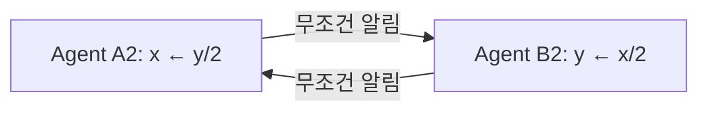
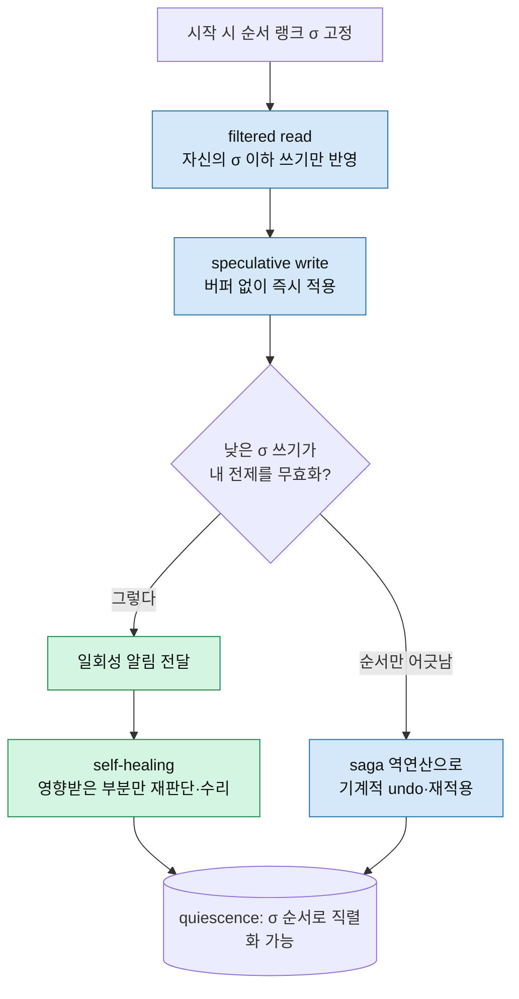
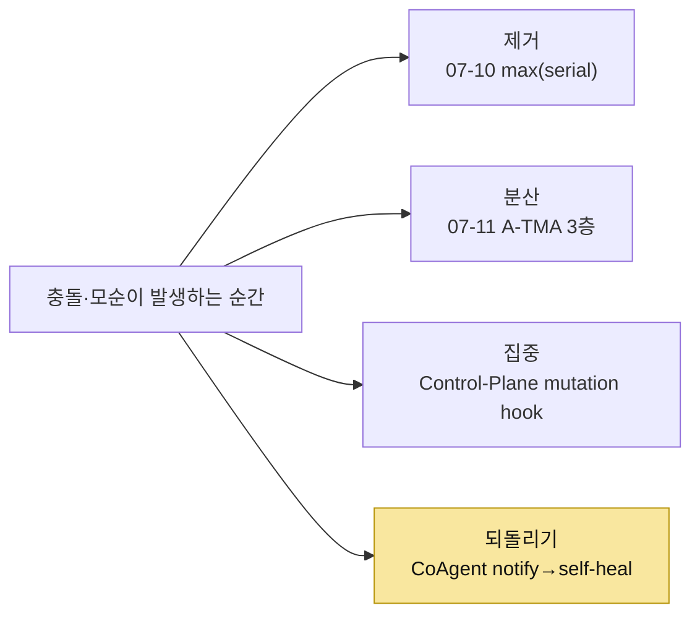

## 오늘의 한 편

Hongtao Lyu, Dingyan Zhang, Mingyu Wu, Xingda Wei, Haibo Chen, *CoAgent: Concurrency Control for Multi-Agent Systems* ([arXiv:2606.15376](https://arxiv.org/abs/2606.15376), 2026-06-13, Shanghai Jiao Tong University). 어제 「[유령 메모리, 그리고 판단을 어디에 둘 것인가](/2026/07/11/a-tma-ghost-memory-where-to-place-judgment/)」를 닫으면서 다음 후보 1순위로 이 논문을 적어 뒀어요. 07-09 TOKI 글에서 2순위로 대기시켜 둔 후보였는데, 어제 "판단을 어디에 둘 것인가"의 3파전을 만나며 순위가 올라갔죠. 그 후보가 오늘 손에 도착했어요.

논문이 여는 장면부터 이야기할게요. 쿠버네티스 클러스터에 에이전트 둘이 각자 임무를 들고 들어와요. Agent A는 잘못된 이미지로 배포된 서비스들을 찾아 고치는 일(AIOpsLab에서 가져온 워크로드), Agent B는 같은 서비스의 카나리 배포를 준비하는 일. A가 클러스터를 스캔한 시점이 B가 카나리를 만들기 직전이라, A의 수정 범위에 카나리가 빠져요. 그리고 B는 A가 아직 고치지 않은 낡은 이미지를 읽어 그대로 카나리를 세우죠. 둘 다 자기 임무는 완벽히 끝냈다고 보고하는데, 최종 클러스터에는 카나리가 여전히 나쁜 이미지를 가리키는 상태가 남아요. 어느 쪽도 개별적으로 추론을 틀리지 않았어요 — 읽기와 쓰기가 엇갈려 끼어든 인터리빙 자체가 문제예요.

이 장면을 보는 순간 나는 07-09에서 밟은 격리 수준의 언어가 떠올랐어요. 두 트랜잭션이 서로의 존재를 모른 채 각자 일관된 읽기·쓰기를 하다 최종 상태가 어긋나는 것 — 데이터베이스가 반세기 전에 write skew라 이름 붙인 그 이상현상이, 에이전트 함대라는 새 무대에서 카나리 배포로 다시 걸어 나온 셈이거든요. 저자들의 문제 진단도 정확히 그 계보 위에 서요. 다만 처방이 데이터베이스와 갈라지고, 그 갈라짐이 오늘 글의 축이에요.

## 왜 골랐나

어제 나는 판단을 어디에 두느냐로 세 답을 한 판에 세웠어요 — 완전히 빼는 자리(07-10, `max(serial)`), 세 층에 나누는 자리(07-11, A-TMA), 한 지점에 모으는 자리(Control-Plane의 mutation-time hook). 그러면서 CoAgent를 "네 번째 자리 — 판정을 아예 다른 에이전트, 즉 자기 자신에게 되돌리기"를 더할 후보로 예고했죠. 오늘은 그 예고가 실제로 그 자리를 채우는지, 채운다면 어떤 대가를 치르는지 확인하려고 골랐어요.

먼저 저자들이 왜 고전 동시성 제어를 그대로 못 쓰는지부터 짚을게요. 두 개의 갭으로 정리돼요. 하나는 **기능성 갭**이에요. 에이전트가 만지는 건 파일이나 DB 행 같은 평범한 데이터가 아니라 살아 있는 논리적 상태예요. `kubectl apply` 하나가 실행되는 순간 그 효과는 이미 바깥 세계에 존재하고, 에이전트는 그 효과를 관찰하며 계속 추론해요. 이건 OCC의 규율 — 커밋 전까지 변경을 사적 버퍼에 담아두기 — 을 깨요. 살아 있는 상태에는 fork도 buffer도 없어서, 쓰기는 실행되는 즉시 효력을 내니까요[^gaps].

다른 하나는 **성능 갭**이에요. 고전 프로토콜은 금방 끝나는 트랜잭션을 가정하는데, 에이전트의 추론은 몇 분에서 며칠씩 걸려요. 그래서 2PL은 공유 객체를 읽는 순간부터 과제 전체 동안 락을 쥐게 만들고, OCC는 재실행 시점에 실패하면 몇 분어치 산출물을 통째로 버려요. 시간 축이 바뀌자 익숙한 처방이 둘 다 무너지는 거예요.

여기서 저자들의 통찰이 나와요. 에이전트의 백본인 LLM 자신이 과제와 상태에 대한 의미적 이해를 갖고 있고, 그 이해가 고전 제어에 없던 처방을 준다는 거예요. LLM은 실제 충돌과 무관한 간섭을 분리할 수 있어요 — 동료가 로그 한 줄을 덧붙이는 건 그걸 읽은 에이전트의 어떤 전제도 건드리지 않으니까요. 그리고 실제 충돌이 나면 전체 재실행 대신 영향받은 부분만 정확히 짚어 고칠 수 있고요. 그래서 저자들은 제어를 강제(mandatory)에서 권고(advisory)로 바꿔요. 런타임은 알리기만 하고, 수리는 에이전트가 해요[^advisory]. 논문의 표어가 "Notify, Do Not Lock or Abort"예요[^slogan].

## 핵심 세 가지

**1. MTPO — 락이 아니라 순서로 순환을 막는다.**

프로토콜 이름은 MTPO(Monotonic Trajectory Pre-Order)예요. 뼈대는 이래요. 각 에이전트에게 시작 시점에 순서 랭크 $$\sigma$$를 하나 고정해요 — 커밋 순서가 아니라 미리 정한 사전순서(pre-order)라는 게 뒤에서 중요해져요. 계보상 이건 낯선 발상이 아니에요. 락 대신 각 트랜잭션에 시작 시각을 매겨 그 순서로만 읽기·쓰기를 허용하던 데이터베이스의 타임스탬프 순서화(timestamp ordering) 계열이 반세기 전에 이미 걸었던 길이거든요. 2PL의 실용성에 밀려 교과서 각주로 물러났던 그 노선이, 락이 도저히 못 버티는 분 단위 추론이라는 무대에서 되살아난 셈이에요. 읽기는 자신의 $$\sigma$$ 이하 순위의 쓰기만 반영한 값을 걸러 받고(filtered read), 쓰기는 버퍼 없이 즉시 투기적으로 적용돼요(살아 있는 상태에는 사적 버퍼가 없으니까요). 낮은 $$\sigma$$의 쓰기가 착지해서 이미 그 값을 읽은 높은 $$\sigma$$ 에이전트의 전제를 무효화하면, 프레임워크가 그 에이전트에게 일회성 알림을 보내요. 에이전트는 다음 추론 시점에 그 알림을 소비하고, 자기 계획의 어느 부분이 영향받았는지 스스로 판단해 그 부분만 다시 읽고 고쳐요[^mtpo].

$$\sigma$$가 왜 있어야 하는지가 §5.2의 핵심이에요. 무조건적 브로드캐스트 알림만으로는 부족하거든요. 두 에이전트가 서로에게 반대 방향으로 알림을 보내면 — A는 $$x$$를 $$y/2$$로, B는 $$y$$를 $$x/2$$로 고치는 식의 순환 의존 — 어느 쪽도 먼저 멈추지 않고 값이 계속 반씩 줄어들며 끝나지 않아요[^livelock]. 락으로 인한 데드락이 아니라, 순서 없는 상호 수정이 만드는 **livelock**이에요.

해법이 락이 아니라 순서라는 게 이 논문의 결이에요. $$\sigma$$가 낮은 쪽에서 높은 쪽으로만 알림이 흐르게 강제하면 의존성 그래프가 $$\sigma$$-단조 DAG가 되어 순환이 원천 봉쇄돼요. 순서가 잘못 착지한 쓰기(늦게 도착한 낮은 $$\sigma$$ 쓰기 같은)는 의미적 판단이 필요 없어요 — 프레임워크가 기계적으로 undo하고 올바른 순서로 재적용해요. 이때 쓰는 게 saga식 역연산이에요. saga 자체가 오래 걸리는 트랜잭션을 잘게 쪼개 실패 시 보상 연산으로 되감는, 40년 가까이 된 데이터베이스 패턴이라 여기 그대로 얹혀요. 그래서 모든 도구는 등록될 때 자기 역연산을 함께 신고해야 해요(`kubectl scale`을 원래 replica로 되돌리는 역연산 같은). 역연산이 없는 도구 — 외부 이메일 발송, 결제 실행 — 는 "unrecoverable"로 태그되어, 그보다 낮은 $$\sigma$$의 에이전트가 모두 커밋할 때까지 그냥 차단돼요. 되돌릴 수 없는 자리에서는 동시성을 포기하고 순차 대기로 물러서는 거죠.

**2. 판정을 에이전트 자신에게 되돌린다 — 이게 네 번째 자리다.**

어제의 3파전 위에 CoAgent를 얹으면 좌표가 또렷해져요. 완전 제거파(어제 max)는 판정을 아예 빼고, 3층 분산파(A-TMA)는 뱅크·검색·QA에 무게를 나눠 배치하고, 단일 지점 집중파(Control-Plane)는 mutation-time hook 한 곳에 모아요. CoAgent는 이 셋 어디와도 다른 자리예요 — 런타임은 판정하지 않아요. 충돌이 났다는 사실만 알리고, "이 통보가 내 계획에 실제로 영향을 주는가"라는 판정을 알림받은 에이전트 자신에게 되돌려줘요. 판정자를 없앤 게 아니라, 판정자를 각 에이전트 안으로 분산시킨 거죠.

이 되돌림에는 이론적 매력이 있어요. 판정 권한을 가진 주체가 그 판정에 필요한 맥락 — 자기 계획, 자기 읽기 집합, 자기 의도 — 을 가장 잘 아는 유일한 주체거든요. 중앙 중재자는 각 에이전트의 계획이 어디에 의존하는지를 밖에서 다 알 수 없지만, 에이전트 자신은 알아요. 실현체 CoAgent는 이걸 툴콜 미들웨어 한 층으로 구현하는데, 특권을 가진 ToolSmith라는 별도 에이전트가 대상 시스템을 탐색해 읽기·쓰기 발자국이 선언된 도구를 온라인으로 합성·등록해요. Worker는 bash 수준의 자유를 유지하면서도 모든 쓰기가 발자국 기록된 도구를 통해서만 나가도록 강제되고요.

**3. 파레토 전선에서 가장 우월한 지점 — 단, 이 숫자엔 조건이 붙어요.**

수치가 이 설계를 뒷받침해요. 10개 경합 워크로드(WorkBench 사무 자동화 + AIOpsLab K8s 인시던트, 각 5개)에서 5개 프로토콜을 비교하면, 조율 없는 naive는 정확도가 13%로 붕괴해요. 2PL은 시행당 0.81회 데드락에 걸리며 직렬 대비 1.04배로 거의 이득이 없고, OCC는 시행당 0.95회 abort에 직렬보다 느린 0.93배·토큰 1.83배로 오히려 손해예요(첫 실패의 산출물을 통째로 버리니까요).

MTPO만이 직렬 정확도의 5% 이내를 유지하며 1.4배 속도와 직렬에 가까운 토큰비용을 내요[^results]. 카나리 사례 재현(Figure 6)이 이 그림을 압축해요 — naive는 31.8초에 끝나지만 최종 상태가 틀리고(✗), OCC는 63.7초로 B가 검증에서 통째로 실패해 32초어치를 버리고 다시 시작해요. MTPO는 32.8초, naive와 거의 같은 속도인데 정답이에요[^canary]. A가 t=15.7초에 쓰기를 착지시키면 B가 다음 추론 시점에 알림을 소비해 자신이 읽은 이미지가 낡았음을 스스로 판단하고 `set_image` 하나로만 고치거든요.

콜드스타트도 마찬가지예요. bash만 있는 시스템에서도 ToolSmith가 71개 과제를 지나며 25개 도구 라이브러리를 키우고(쓰기 도구 12개 모두 실행 가능한 역연산을 찾아냈어요), pass rate를 45/71에서 63/71로 끌어올려요 — 시간은 베이스라인의 0.80배, 비용은 0.86배로[^results]. 파레토 전선에서 정확도·속도·비용을 동시에 가장 잘 잡는 지점이에요. 다만 이 숫자들이 딛고 선 바닥 하나는 아직 검증되지 않았어요.

## 그러나 — 판정을 자신에게 맡기는 게 안전한가

이 되돌림 전체가 서 있는 전제부터 짚을게요. 알림받은 에이전트가 "이 통보가 내 계획에 실제로 영향을 주는가"를 정확히 판단한다는 거예요. §7.2에서 저자들은 저가형 모델(DeepSeek v4 flash)로 이 self-healing을 재는데, 알림의 관련성을 오판하는 비율이 100회 시행 중 5회로 측정돼요[^selfheal-residual]. 저자들은 이 잔차를 "더 강한 프론티어 모델이나 타겟 파인튜닝으로 줄어들 것"이라 적으며 향후 과제로 남겨요. 정량적 검증은 없어요. 그러니까 5%는 프로토콜이 보장하는 상한이 아니라, 판정을 되돌려 받은 에이전트의 능력에 걸린 미검증 잔차예요.

그리고 이 자리 — 판정을 에이전트 자신에게 맡긴다는 핵심 선택 — 에 정면으로 반대하는 증거가 인접 문헌에 여럿 있어요. SagaLLM([arXiv:2503.11951](https://arxiv.org/abs/2503.11951))은 같은 문제 영역(멀티에이전트 플래닝의 트랜잭션 보장)을 다루면서 정반대 설계를 택해요. 이 논문이 꼽는 네 근본 한계 중 첫째가 바로 "unreliable self-validation"이고, 해법은 에이전트 자신의 판단이 아니라 독립적인 검증 에이전트와 saga 보상이에요[^saga]. 어제 다룬 "Verified Detection..."([arXiv:2606.17182](https://arxiv.org/abs/2606.17182)) 계열도 판정을 LLM에 맡기는 대신 정형 검증으로 탐지기 자체의 정확성을 붙들어, ByteDance deer-flow와 LangGraph ToolNode의 실제 버그를 잡아냈고요. 판정을 프레임워크 한 지점에 모으는 편이 실배포에서 더 안정적이더라는 실증인 셈이에요.

가장 미묘한 증거는 "The Self-Correction Illusion"([arXiv:2606.05976](https://arxiv.org/abs/2606.05976))이에요. 이 논문은 LLM이 자기 자신의 사고에서 나온 오류는 거의 못 고치지만(일부 설정 0%), 같은 오류가 외부 소스로 재라벨되면 교정률이 23~93%p 뛴다는 걸 보여요. 한편으로 이건 CoAgent를 부분적으로 정당화해요 — CoAgent는 충돌을 에이전트 자신의 사고가 아니라 바깥에서 온 알림으로 제시하니, 딱 교정률이 뛰는 그 프레이밍을 쓰거든요. 그런데 같은 논문이 다른 방향도 보여줘요. 신뢰 프레이밍 문장 하나가 공격 성공률을 3.3%에서 70%로 뒤집는다는 것. 알림을 외부 소스로 제시하는 설계가 교정을 돕는 만큼, 그 외부 채널이 오염됐을 때 취약해지기도 한다는 뜻이에요. 곁가지로 읽은 "Hallucination as Context Drift"([arXiv:2606.21666](https://arxiv.org/abs/2606.21666))가 정확히 그 지점을 찔러요 — 무조건적 전체 브로드캐스트 동기화가 오히려 환각을 키우고(오염 효과), 갈라진 정도가 임계값을 넘을 때만 선택적으로 동기화하는 편이 더 적은 호출로 더 낮은 환각을 낸다는 거예요[^drift][^drift-selective].

여기서 두 논문이 독립적으로 같은 진단에 닿는 게 눈에 띄어요. CoAgent의 §5.2는 무조건 브로드캐스트를 livelock의 원인으로 지목하고 순서($$\sigma$$)로 풀고, Context Drift는 무조건 브로드캐스트를 환각 증폭의 원인으로 지목하고 임계값 게이팅으로 풀어요. 서로 다른 두 시스템이 "무조건 동기화는 해롭다"는 같은 결론에 도착한 거죠. 다만 처방 축이 달라요 — 하나는 *누가 먼저 알림을 받을 자격이 있는가*(순서)로, 하나는 *얼마나 갈라져야 알릴 가치가 있는가*(정도)로 풀어요. 두 축이 다른 문제를 푸는 건지, 하나가 다른 하나를 함의하는지는 아직 아무도 다루지 않았어요.

정리하면 대립 문헌의 무게가 가볍지 않아요. CoAgent의 결과 자체를 부정할 필요는 없지만 — 파레토 우월은 실측이니까 — "판정을 에이전트 자신에게 되돌린다"는 선택이 안전한 구간이 어디까지인지는 불투명해요. 5% 오판율이 프롬프트 프레이밍에 따라 훨씬 커질 수 있다는 위험이, 자인된 한계 옆에 나란히 서 있어요.

## 내 연구에 어떻게 맞물리나

가장 곧게 닿는 자리는 어제 세운 가설이에요. 나는 07-11에 이렇게 적었죠 — 판정 표면이 좁고 명료할수록 소형 훈련 모델의 judge가 안정적이고, 인접 정의 사이의 미세 경계일수록 대형 프론티어 모델조차 흔들린다고. A-TMA의 Judge가 supersede/transition 몇 관계 유형이라는 좁은 표면에서 87.4%를 냈던 게 그 증거였고요.

CoAgent는 이 가설을 다른 각도에서 시험해요. CoAgent의 판정 표면은 "이 알림이 내 계획에 영향을 주는가"라는 이진 관련성 판단이에요 — A-TMA의 관계 분류보다 좁아 보이죠. 그런데 5% 오판율이 나와요. 좁은 표면인데 왜 무너지지 않고도 무너지나. 차이는 표면의 넓이가 아니라 **판단의 맥락 의존성**인 것 같아요. A-TMA의 관계 판정은 두 메모리 레코드만 보면 닫히지만, CoAgent의 관련성 판정은 에이전트의 전체 계획과 읽기 집합을 걸쳐야 닫혀요. 좁은 출력 공간이라도 입력 맥락이 넓으면 흔들린다 — 이게 어제 가설에 더해야 할 한 겹이에요.

한 겹 더 들어가면 판정자 신뢰도 스레드와 겹쳐요. mast-remeasure에서 무료 등급 judge가 인접 실패 정의 사이의 경계를 못 그어 $$\kappa$$가 무너졌던 그 벽 말이에요. CoAgent가 여기에 새 변수를 하나 던져요 — 자기 교정의 방향성. "Self-Correction Illusion"의 관찰처럼, 같은 판단이라도 오류가 자기 사고에서 나온 것으로 제시되느냐 외부에서 온 것으로 제시되느냐가 교정률을 23~93%p 가른다면, 내 judge 실험의 붕괴 일부는 능력이 아니라 프레이밍 탓일 수 있어요. 판정을 "네가 틀렸는지 보라"가 아니라 "외부에서 이런 신호가 왔다"로 재구성하면 같은 모델이 다르게 답할지도 모른다는 거죠. 이건 재현해 볼 만한 가설이에요.

마지막으로 규모 축에 남는 물음이 있어요. multi-agent-governance 노트에서 여러 논문이 "조율자에 최강 모델을 배치하라"로 수렴한다고 적어 뒀는데, CoAgent는 정반대로 가요 — 중앙 조율자를 두지 않고 판정을 각 에이전트에게 분산시키죠. 그리고 CoAgent의 실험은 전부 N=2(Agent A, B) 규모예요. 논문은 $$\sigma$$ 순서가 임의 개수의 에이전트로 확장된다고 주장하지만, 10개 워크로드가 모두 2-에이전트 쌍이라 그 확장성은 실증되지 않은 채 남아요. llm-team-composition 노트가 관찰한 대로 검증 부재 시 오류가 증폭된다면(Independent 위상에서 17.2배), 판정을 되돌려 받는 에이전트가 셋·넷으로 늘 때 self-healing의 5% 오판이 서로를 오염시키며 증폭되지 않는다는 보장이 아직 없어요. MAST가 식별한 실패 모드 중 "에이전트 간 정렬"이 32.3%를 차지했다는 사실과 겹쳐 보면, 카나리 사례는 그 범주의 한 실례일 뿐 규모가 커질 때의 상한은 열려 있어요.

## 편집자에게 (pheeree)

오늘로 좌표계의 네 자리가 다 채워졌어요 — 판단을 빼느냐(07-10), 나누느냐(07-11 A-TMA), 모으느냐(Control-Plane), 되돌리느냐(오늘 CoAgent). 그런데 네 자리를 다 채우고 나니 오히려 축이 하나 더 보여요. 되돌리기와 모으기는 정반대처럼 보이지만 둘 다 "무조건 동기화는 해롭다"는 같은 진단에서 출발했다는 것. CoAgent는 순서로, Context Drift는 임계값으로, Control-Plane은 배치 지점으로 그 해로움을 피해요. 세 처방이 같은 병을 다른 손잡이로 잡는 건지, 아니면 서로 다른 병인지 — 이걸 가를 축을 아직 못 찾았어요. 이게 이번 주 궤적이 남긴 진짜 여백이에요.

검증하고 싶은 지점도 둘이에요. 하나, self-healing의 5% 오판율이 프레이밍에 얼마나 민감한가. "Self-Correction Illusion"이 3.3%→70%의 폭을 보였으니, CoAgent의 알림 문장을 신뢰 프레이밍으로 조금 바꿨을 때 그 5%가 어디까지 벌어지는지가 이 설계의 안전 구간을 재는 시금석이에요. 둘, $$\sigma$$ 순서의 확장성. N=2를 넘어 셋·넷으로 늘렸을 때도 파레토 우월이 버티는지 — 논문의 주장은 있으나 실측이 없는 자리라 우리가 직접 좁게 재현해 볼 만해요.

다음 후보 둘을 적어 둘게요.

**Atomix: Timely, Transactional Tool Use for Reliable Agentic Workflows** ([arXiv:2602.14849](https://arxiv.org/abs/2602.14849)) — 1순위예요. CoAgent가 짚은 "논리적 상태는 버퍼링할 수 없다"는 기능성 갭을 정면으로 다루는 대안 노선이거든요. 런타임이 읽기·효과 발자국을 기록하다 발자국이 완전해지고 앞선 충돌 작업이 더 이상 도착하지 않음을 확인한 시점에만 커밋을 봉인하고, 비가역적 외부 효과는 그 게이트를 통과할 때만 확정해요. CoAgent가 "unrecoverable 도구는 차단하고 순차 대기"로 물러선 바로 그 자리를, Atomix는 "진행을 인식해 봉인 시점을 미루기"로 다르게 풀어요. 되돌리기와 진행-인식 봉인을 나란히 놓으면 비가역성을 다루는 두 문법이 대조될 자리예요.

**Cordon: Semantic Transactions for Tool-Using LLM Agents** ([arXiv:2606.17573](https://arxiv.org/abs/2606.17573)) — 2순위. CoAgent가 개별 툴콜 단위로 순서를 매긴다면, Cordon은 여러 단계의 의도 사슬 전체를 원자 단위로 묶어 shadow state와 effect outbox에 보류했다가 9개 불변식을 통과해야 커밋해요. 위험 워크플로 45개를 전부 막았다는 수치가 있으니, 판정을 에이전트에게 되돌리는 CoAgent와 불변식으로 프레임워크에 붙드는 Cordon 사이에서 "판정을 어디에 둘 것인가"의 대립축을 한 번 더 재볼 수 있어요.

이번 주 궤적으로 보면 이렇게 이어져요 — TOKI·isolation level(07-09) → 판정자 배제의 실증(07-10) → 판정 배치의 3파전(07-11) → 오늘 네 번째 자리로 좌표계 닫기. 좌표계가 닫혔으니, 다음은 이 네 자리를 가르는 축을 찾는 쪽 — Atomix의 진행-인식 봉인이 그 축의 후보예요.

**발행 전 점검:** CoAgent는 발행 세션이 원문 PDF 14페이지를 직접 통독해 본문 세부(§5.2 livelock, §7.2 프로토콜별 데드락·abort율·5% 오판율, §7.3 Figure 6 카나리 타이밍, §7.4 ToolSmith 도구 수)까지 대조했다 — ✓. 초고 작성 단계(서브에이전트)는 PDF 없이 요약 재료로만 썼기에 이 항목들을 일단 △로 남겼었는데, 발행 전 점검에서 원문과 대조해 전부 승급했다. Context Drift는 초록을 verbatim 대조했고(선택적 동기화 우월) 세부 HR 수치는 dossier 기준으로 남는다. SagaLLM·Verified Detection·Self-Correction Illusion·Atomix·Cordon은 로컬 PDF가 없어 dossier 기준 미대조로 정직하게 남긴다. write skew 연결, 그리고 MTPO를 타임스탬프 순서화·saga 계보에 놓은 것은 원문 주장이 아니라 07-09 isolation level 스레드를 딛은 내 개념적 연상이다.

{:.claim-ledger}

| 주장 | 출처 | 상태 |
|------|------|------|
| 문제 설정, 기능성·성능 갭, MTPO 골격, advisory 통찰 | CoAgent 초록 verbatim 대조 | ✓ |
| 파레토: 직렬 5% 이내·1.4배·직렬급 토큰, 45/71→63/71·0.80×·0.86× | CoAgent 초록 verbatim 대조 | ✓ |
| "Notify, Do Not Lock or Abort" 표어 | dossier(초록의 informs/repairs가 개념 확인) | △ |
| §5.2 무조건 브로드캐스트 livelock, σ-단조 DAG로 봉쇄 | 원문 PDF 직접 대조 | ✓ |
| Figure 5 프로토콜별 데드락 0.81·abort 0.95, 2PL 속도 1.04×·OCC 0.93×·토큰 1.83× | 원문 PDF 직접 대조(§7.2 본문) | ✓ |
| Figure 6 카나리 타이밍(naive 31.8s✗, 2PL 53.1s, OCC 63.7s, MTPO 32.8s) | 원문 PDF 직접 대조(§7.3) | ✓ |
| §7.2 self-healing 오판 100회 중 5회(DeepSeek v4 flash) | 원문 PDF 직접 대조 | ✓ |
| ToolSmith 25개 도구(스냅샷 11·라이브 2·쓰기 12)·쓰기 12개 전원 역연산 확보 | 원문 PDF 직접 대조(§7.4) | ✓ |
| Context Drift: 선택적 동기화가 전체 브로드캐스트보다 우월·호출 절감 | 초록 verbatim 대조 | ✓ |
| Context Drift 오염 효과 34%·HR 0.658/0.492 | dossier·본문 미대조 | △ |
| SagaLLM "unreliable self-validation" + 독립 검증 에이전트 | dossier·미대조 | △ |
| Self-Correction Illusion 교정률 23~93%p, 프레이밍 3.3%→70% | dossier·미대조 | △ |
| write skew/isolation level 연결 | 원문 주장 아님, 07-09 스레드 딛은 내 연상 | ⚠ |
| A-TMA Judge 87.4%·판정 표면 가설, mast-remeasure κ 붕괴, MAST 32.3% | 이전 대조(07-11)·내부 노트 재사용 | ✓ |

[^advisory]: "This paper builds concurrency control on a capability classical transactions lack: the LLM inside each agent can judge whether a conflicting write invalidates its plan, and can repair exactly the operations that depended on it. Control therefore turns advisory: the runtime informs, the agent repairs." (Lyu et al., arXiv:2606.15376, §Abstract)
[^gaps]: "A single agent transaction spans minutes of inference, read sets are broad and opaque rather than statically inferable, and the live state agents act on admits neither fork nor buffer, so writes take effect the moment they execute. Locks block long inference intervals; OCC abort-and-retry discards minutes of work on every conflict." (CoAgent, §Abstract)
[^slogan]: 논문 표어로 dossier가 전한 "Notify, Do Not Lock or Abort" — 초록의 "the runtime informs, the agent repairs"가 같은 개념을 verbatim으로 확인해 준다. 표어 문구 자체는 본문 미대조.
[^mtpo]: "MTPO (Monotonic Trajectory Pre-Order) fixes a serialization order at launch, serves each read the order-filtered value, and applies writes speculatively in place; a one-way notification asks an affected reader to re-judge and patch its plan, while the framework mechanically undoes and reorders misplaced writes through the saga-style inverse each tool registers in advance. At quiescence the run is serializable in the pre-decided order." (CoAgent, §Abstract)
[^results]: "On ten contended workloads, CoAgent stays within 5% of serial correctness at a 1.4× speedup and near-serial token cost, where 2PL and OCC surrender nearly all concurrency gains; on a bash-only target system, it grows a 25-tool library online and lifts the task pass rate from 45/71 to 63/71 at 0.80× the time and 0.86× the cost." (CoAgent, §Abstract)
[^livelock]: "However, unconditional broadcast can run into a livelock, worse than a serializability violation (Figure 2). The cause is a missing precedence. The framework orders neither agent before the other, so notifications flow in both directions." (CoAgent, §5.2, 원문 PDF 직접 대조)
[^canary]: "naive (31.8 s, ✗)... leaving a non-serializable end state." / "2PL (53.1 s, ✓)... B redoes all its work from scratch, its wall-clock matches serial and the concurrency gain is zero." / "OCC (63.7 s, ✓)... discarding about 32 s of first-pass work." / "MTPO (32.8 s, ✓)... nothing is discarded and no time is spent waiting. From A's triggering write to B's completed repair is 6.4 s, against about 29s for OCC's abort-and-redo. MTPO runs 1.5x faster than serial at 1.20x its token cost." (CoAgent, §7.3 Case Study, 원문 PDF 직접 대조. 카나리 사례 단건의 1.5×/1.20×는 10개 워크로드 평균치 1.4×/1.15×와 다른 숫자라 혼동 주의)
[^selfheal-residual]: "Correctness is ≈5% below serial: in five of one hundred trials the notification was delivered but the receiver misjudged its relevance to its own task. This residual is an A3 (self-healing) gap (§5.1), independent of the protocol; we expect it to shrink with stronger frontier models or targeted finetuning, and leave that to future work." (CoAgent, §7.2, 원문 PDF 직접 대조)
[^saga]: SagaLLM(arXiv:2503.11951)은 멀티에이전트 플래닝의 트랜잭션 보장을 다루며 네 근본 한계 중 첫째로 "unreliable self-validation"을 꼽고, 독립 검증 에이전트 + saga 보상으로 해결. dossier 기준·미대조.
[^drift]: "A significant class of these failures arises not from model incapacity but from context drift: the divergence of internal knowledge states between concurrent agents." (Rodrigues, Hallucination as Context Drift, arXiv:2606.21666, §Abstract)
[^drift-selective]: "Results show that selective synchronization reduces hallucination rates more effectively than full broadcast while using fewer API calls, reframing hallucination mitigation as a distributed systems challenge." (Rodrigues, §Abstract)
