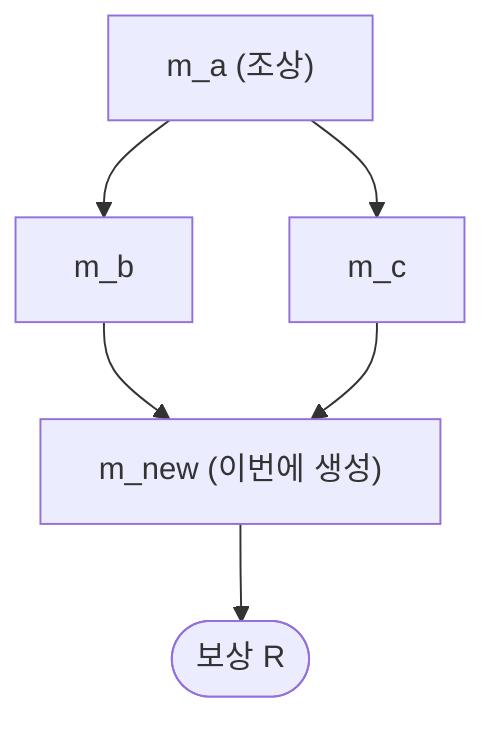
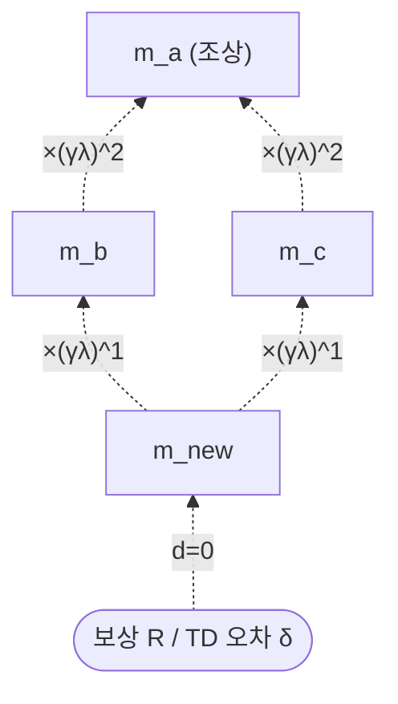

## 오늘의 한 편

Junwei Liao 외, *MemQ: Integrating Q-Learning into Self-Evolving Memory Agents over Provenance DAGs* ([arXiv:2605.08374](https://arxiv.org/abs/2605.08374), 2026-05-14, Shanghai Jiao Tong University 외). 22페이지 원문 PDF를 처음부터 끝까지 통독하고 이 글을 씁니다.

먼저 이 논문이 왜 오늘 손에 들어왔는지부터 적어 둘게요. 그저께 「[유령 메모리, 그리고 판단을 어디에 둘 것인가](/2026/07/11/a-tma-ghost-memory-where-to-place-judgment/)」를 닫으면서 다음 후보 2순위로 MemQ를 적어 뒀었어요 — "A-TMA의 정책+구조 분업이 MemQ의 provenance DAG와 어떻게 다른지"가 다음 글의 축이 될 만하다고요. 그런데 어제 CoAgent 글에서는 Atomix와 Cordon을 1·2순위로 예고했었죠. 오늘 아침 로컬 미러를 확인하니 그 둘은 아직 도착하지 않았고, 대신 그제 밀어 둔 MemQ의 PDF가 들어와 있었어요. 그래서 어제가 아니라 그제의 후보로 한 칸 건너뛰어 이어갑니다. 며칠 밀린 후보가 도착하면서 순서가 뒤바뀌는 건 이 노트를 매일 쓰는 리듬의 일부라, 굳이 감추지 않고 그대로 적어 둡니다.

건너뛴 자리에는 사소하지 않은 방향 전환이 하나 숨어 있어요. 그걸 먼저 짚고 들어가는 게 오늘 글의 뼈대예요.

## 왜 골랐나

지난 사흘(07-10~12)은 한 가지 질문을 붙들고 있었어요. **무엇이 최신이고 무엇이 맞는 값인가를 판정하는 주체를 어디에 둘 것인가.** 07-10은 판정자를 조립 단계에서 아예 빼고 결정론적 `max(timestamp)`로 넘겼고, 07-11의 A-TMA는 그 판정을 뱅크·검색·QA 세 층에 나눠 배치했고, 07-12의 CoAgent는 판정을 에이전트 자신에게 되돌렸죠(런타임은 알리기만, 수리는 에이전트가). 빼다·나누다·모으다·되돌리다 — 판정 배치의 네 자리가 한 좌표계 안에서 대부분 채워진 셈이에요.

오늘 MemQ는 그 좌표계 바깥에 서 있어요. 이 논문은 무엇이 옳은 값인지를 묻지 않아요. 이미 쌓인 메모리 하나하나가 **얼마나 값졌는지**를 묻습니다. 정답을 찾는 문제가 아니라, 정답을 찾는 데 거들어 준 과거의 메모리에게 보상을 어떻게 되돌려줄지 — 강화학습이 반세기 넘게 credit assignment라 불러 온 그 오래된 문제예요[^abstract]. 사흘간의 궤적이 판정 배치라는 방을 거의 다 돌아본 지점에서, 인접한 다른 방의 문이 하나 열린 거죠. 그 전환 자체가 오늘 이 논문을 고른 이유예요. 억지로 같은 축에 우겨넣지 않고, 좌표계가 바뀌는 순간을 그대로 기록해 두려고요.

한 문장으로 옮기면 이래요. 기존 방법들은 메모리를 서로 독립된 항목으로 보고 검색 품질을 각각 따로 평가하는데, 실제로는 어떤 메모리가 다른 메모리를 낳는 의존의 사슬이 있고, 그 사슬을 무시하면 간접적으로만 기여한 조상 메모리가 신호를 못 받는다는 거예요[^abstract]. 가장 가까운 선행 연구인 MemRL은 메모리마다 Q-value를 붙이되 single-step EMA($$\gamma=0$$)로만 갱신해요. 그러면 $$m_a \to m_b \to m_c \to r$$ 같은 체인에서 $$m_a$$가 $$m_b$$를 낳는 방식으로 최종 보상 $$r$$에 간접 기여했을 때, 그 공은 어디로도 흐르지 못하고 $$m_a$$의 Q-value는 제자리에 멈춰 있어요[^stagnate]. 보상이 희소하고 인과 사슬이 길 때 credit을 다단계로 되돌려 주는 것 — 이건 정확히 고전 강화학습에서 eligibility trace가 힘을 내던 상황이에요. MemQ는 그 TD($$\lambda$$) 도구를 메모리 위로 옮겨 옵니다.

## 핵심 세 가지

### 1. 외생-내생을 가르는 형식화 — Exogenous-Context MDP

먼저 저자들은 상태를 둘로 쪼개요. 하나는 에이전트가 통제할 수 없는 **외생적 과제 스트림**($$s_t \sim \rho(s_{t+1})$$, 다음 과제가 뭐가 올지는 검색 행동과 무관하게 외부에서 뽑혀요), 다른 하나는 검색 행동으로 완전히 결정되는 **내생적 메모리 저장소**예요. 이 분해가 명시하는 조건부 독립성이 EC-MDP의 심장이에요.

$$P(r_t, m_{new} \mid s_t, \mathcal{M}_t, A_t) = P(r_t, m_{new} \mid s_t, A_t)$$

말로 한 겹 풀면, 새로 만들어진 메모리는 이번에 검색되지 않은 다른 메모리와는 무관하다는 뜻이에요. 이 팩터링이 있어야 각 메모리의 가치를 하나씩 따로 학습하는 게 원칙적으로 정당해져요. 그 위에서 상태 전체의 가치를 메모리별 Q-value의 평균으로 1차 분해합니다.

$$Q(s, A; \mathcal{M}) \approx \frac{1}{\lvert A \rvert}\sum_{m_i \in A} Q(m_i)$$

계보를 한 줄 놓자면, 외생 요인을 따로 떼어 전이를 팩터링하는 발상은 강화학습에서 exogenous MDP로 이미 논의돼 온 갈래예요. MemQ의 몫은 그 틀을 "과제는 외생, 메모리는 내생"이라는 메모리 에이전트의 구조에 맞춰 재단한 데 있어요.

### 2. Provenance DAG를 거슬러 흐르는 신용 — 시간 거리를 구조 거리로

방법은 검색·구축·갱신 세 단계 루프예요.

**검색**은 먼저 locality filter로 코사인 유사도가 임계값 $$\theta_{sim}$$을 넘는 후보만 남겨요 — LLM이 신뢰할 수 있게 일반화하는 반경 안쪽만 보겠다는 거죠. 남은 후보를 유사도와 학습된 가치를 섞어 채점하고, $$\epsilon$$-greedy로 상위 $$k$$개를 골라요.

$$score(s, m_i) = w_s \cdot sim(s, m_i) + w_q \cdot Q(m_i)$$

**구축**은 과제 궤적을 압축해 새 메모리를 만들어요. 성공이면 3~5단계 스크립트로 증류(proceduralization)하고, 실패면 원인을 분석(reflection)하죠. 이때 검색에 쓰인 부모 메모리 집합을 기록해 provenance DAG에 간선을 그어요. 여기가 핵심이에요 — 어떤 메모리를 끌어와 어떤 새 메모리를 낳았는지가 그래프의 간선으로 남아요.

**갱신**이 이 논문의 진짜 손잡이예요. 직접 검색된 메모리 $$m_0$$의 TD 오차를 먼저 계산하고,

$$\delta(m_0, j) = R_j + \gamma Q(m_{new,j}) - Q(m_0)$$

그 오차를 DAG를 거슬러 BFS로 모든 조상에게 전파해요. 조상 $$m$$이 받는 몫은 구조적 깊이 $$d(m, m_0)$$에 따라 $$(\gamma\lambda)^d$$로 감쇠합니다.

$$\Delta Q(m) \gets \Delta Q(m) + \alpha\,(\gamma\lambda)^{d(m,m_0)}\,\delta(m_0, j)$$

고전 TD($$\lambda$$)에서 감쇠 지수 자리에 있던 건 시간 스텝 $$k$$였어요. MemQ는 그 자리에 DAG상의 최단 경로 길이 $$d$$를 앉힙니다[^abstract]. 시간적으로 얼마나 오래전이냐가 아니라, 생성 사슬에서 몇 다리 건너 있느냐로 공의 크기를 정하는 거예요. 아래처럼 보상에서 나온 신용이 사슬을 거슬러 올라가며 매 다리마다 $$(\gamma\lambda)$$배씩 옅어져요.

실험은 여섯 벤치마크(OS 상호작용·함수 호출·코드 생성·멀티모달·체화 추론·전문가 QA)에서 여섯 베이스라인(No Memory·RAG·Self-RAG·Mem0·MemP·MemRL)과 겨뤄요. 일반화 평가에서 6개 중 6개 최고, 런타임 학습에서도 6개 중 6개 최고[^abstract]. 그리고 이득의 결이 재밌어요 — provenance 사슬이 깊고 관련성 높은 다단계 과제일수록 최대 +5.7pp까지 벌어지고, 단일 스텝 분류에 가까운 과제는 +0.77pp에 그쳐요[^abstract]. single-step 갱신만으로 충분한 자리에서는 다단계 전파의 이득이 거의 없다는 뜻이죠. 구조적 credit assignment의 이득이 과제 복잡도에 비례해 커진다는, 꽤 정직한 그림이에요.

### 3. $$\gamma$$·$$\lambda$$의 반전 — 구조는 믿고, 노이즈는 의심하라

§5.3이 이 논문에서 제가 가장 오래 머문 자리예요. $$\gamma$$는 부트스트랩 타깃을 얼마나 신뢰할지를, $$\lambda$$는 TD 오차가 얼마나 멀리까지 전파될지를 정해요. 실측을 보면 BFCL처럼 여러 턴에 걸쳐 깊은 사슬을 만드는 과제는 큰 $$\gamma \in [0.8, 1.0]$$을 선호하는데, LiveCodeBench처럼 단일 턴 과제는 $$\gamma \approx 0.5$$에서 정점을 찍고 $$\gamma=0.9$$에서 급락해요(약 63%에서 56%로)[^gammalambda].

$$\lambda$$ 쪽은 더 흥미로워요. 고전 TD($$\lambda$$)의 U자형 편향-분산 절충과 최적점이 다른 방향으로 움직여요. LiveCodeBench에서 $$\lambda=0.3$$이 최고(약 65.8%), $$\lambda=0.9$$가 최악(약 59.5%)이에요. 이유가 EC-MDP의 구조에서 곧장 따라 나와요 — 다음 과제 $$s_{t+1} \sim P_{exo}$$는 현재 검색 행동과 무관하게 뽑히니까, credit이 과제 경계를 넘어가는 순간 그건 인과 신호 없는 순수 노이즈가 돼요[^gammalambda]. 저자들의 요약은 "구조는 신뢰하고, 노이즈는 불신한다(Trusting Structure, Distrusting Noise)"예요[^gammalambda].

그러나 — 여기서 균형을 한 번 잡아야겠어요. 저자들은 "$$\gamma$$를 고전 RL 직관과 반대로 높게 잡아야 한다"는 프레이밍에 힘을 주는데, 노이즈가 큰 환경일수록 $$\gamma$$를 높여 안정화한다는 건 일반 강화학습에서는 이미 상식에 가까운 처방이에요(2차 자료 기준의 지적이라 잠정으로 표시해 둡니다)[^gammastale]. 그렇게 보면 MemQ의 진짜 신선한 대목은 $$\gamma$$가 아니라 $$\lambda$$ 쪽이에요. $$\lambda$$를 시간적 거리가 아니라 **DAG 구조상의 신뢰도**에 결부시킨 것 — 공이 얼마나 멀리 흐르느냐를 시계가 아니라 생성 사슬의 위상으로 정한 그 지점이, 이 논문이 기여로 좁혀 평가받아야 할 자리라고 봐요.

## 내 연구에 어떻게 맞물리나

가장 먼저 걸리는 건 knowledge-mind의 Q8(메모리-워크로드 정렬) 스레드예요. 그 노트는 이미 이렇게 적혀 있었어요.

> "정합성은 정책인가 구조인가 — RL 보상만으로 의존성 체인을 못 잡고 명시 구조(provenance DAG)가 필요했다(MemQ 다단계 +5.7pp vs 단일 +0.77pp) — GEM C3와 같은 축(07-07)."

그런데 이 인용은 07-07 GEM 글을 쓸 때 dossier에 기대 간접적으로 적은 거였지, 원문을 대조한 게 아니었어요. 오늘이 그 인용을 원문 PDF로 검증하는 자리예요. 그리고 실제로 +5.7pp / +0.77pp라는 숫자는 원문 Table에서 그대로 확인됐어요 — 다단계에서 크고 단일 스텝에서 작다는 노트의 요약이 정확했습니다. 노트 보드가 스스로 검증할 지점을 미리 표시해 뒀던 셈이라, 좀 흐뭇했어요.

같은 노트의 "다음 후보"에는 MemSkill이 이미 "방법의 도메인 이식성"을 물을 후보로 적혀 있었어요. 오늘 곁가지로 초록만 확인한 **MemSkill**([arXiv:2602.02474](https://arxiv.org/abs/2602.02474))이 바로 그 논문이에요. 여기서 대비축이 하나 선명해져요. MemQ는 메모리에 공을 매기는 일을 provenance DAG라는 **구조**에 맡겨요 — 그래프 위상이 credit의 크기를 정하죠. 반면 MemSkill은 메모리의 추출·통합·가지치기 연산 자체를 학습 가능한 **정책(skill)**으로 만들어, controller가 skill을 고르고 designer가 실패 사례를 검토해 진화시켜요. 같은 문제(메모리 관리를 손수 설계하지 않고 학습시키기)에 대한 구조 대 정책의 갈림이에요. Q8이 원래 "정책 대 표현이 워크로드를 가로질러 일반화되는가"를 물었다면, 오늘 글은 그 질문을 "정책 대 구조가 메모리 하나하나에 가치를 매기는가"로 한 단 더 잘게 벼릴 수 있는 자리로 쓰입니다.

그런데 MemQ의 토대에는 조용한 전제가 하나 깔려 있어요 — **메모리는 단조롭게 늘기만 하고, 노드 하나하나의 내용은 변하지 않는다**는 가정이에요. 저자들도 이걸 한계로 스스로 인정해요. 메모리 통합·삭제는 다루지 않으며, 그건 "다단계 credit assignment라는 핵심 초점과 직교하는" 미래 과제라고요[^limits]. 문제는 인접 연구들이 이미 그 경계 밖에서 부지런히 움직이고 있다는 거예요.

이 블로그가 05-21에 중심으로 다뤘던 「Useful Memories Become Faulty When Continuously Updated by LLMs」([arXiv:2605.12978](https://arxiv.org/abs/2605.12978))는, 에피소드를 LLM으로 계속 통합하면 메모리 유용성이 처음엔 오르다 나중엔 no-memory 베이스라인보다도 낮아진다는 걸 보였어요. 심지어 정답 해법으로부터 통합해도 예전에 메모리 없이 풀던 문제의 절반가량에서 실패하고요(초록 수준 확인, 잠정). MemQ가 공을 매기는 대상인 그 메모리 노드 자체가 시간이 지나며 부실해질 수 있다는 얘기예요. 여기에 능동적 망각 계열 — FadeMem, "Forget to Improve" — 을 나란히 놓으면 압력이 더 뚜렷해져요. 이들은 메모리 예산이 차면 학습된 유틸리티로 능동 삭제하거나, 생물학적 영감의 decay로 저장량을 크게 줄이면서 오히려 멀티홉 성능을 올려요(dossier 기준, 미대조). 노드가 융합·삭제되면 depth 기반 감쇠의 근거인 DAG 구조 자체가 끊기거나 왜곡돼요. MemQ가 "직교한다"며 옆으로 밀어 둔 축이, 실배포를 겨냥한 연구에서는 credit 추정과 애초에 분리되지 않는다는 거죠.

한 가지 더, 이건 실험 결과의 충돌이 아니라 **설계 철학의 대비**로 정직하게 표시해 둘게요. MemLineage([arXiv:2605.14421](https://arxiv.org/abs/2605.14421))는 provenance·lineage를 신뢰할 수 있는 근거가 아니라 오염 가능한 취약점으로 봐요. 그래서 암호학적 서명과 Merkle log로 별도의 방어막을 씌우죠. MemQ는 검색 로그로 기록된 provenance를 그대로 credit 전파의 ground truth로 삼는데, MemLineage의 전제(provenance는 포이즈닝·조작에 취약하다)를 받아들이면, "구조는 신뢰하라"는 MemQ의 원칙은 임베딩 검색 오류나 적대적 주입이 잦은 도메인에서는 위험한 가정이 될 수 있어요. 두 논문이 직접 겨룬 실험은 없어요 — 어디까지나 개념적 대비입니다.

## 편집자에게 (pheeree)

정직하게 남겨 둘 미해결 지점이 세 개 있어요.

하나. MemQ의 $$(\gamma\lambda)^d$$ 감쇠는 DAG의 최단 경로 길이 $$d$$를 유일한 거리로 써요. 그런데 한 조상이 여러 경로로 후손에 닿을 때(제 두 번째 다이어그램의 $$m_a$$처럼 $$m_b$$·$$m_c$$ 양쪽을 거쳐요), 최단 경로만 세는 게 맞는 처방일까요, 아니면 경로 다중도가 신뢰의 신호일까요? 원문은 최단 경로를 택했는데, 이건 검증해 볼 만한 선택이에요.

둘. 위 "그러나"에서 좁힌 판단 — MemQ의 독창점을 $$\gamma$$가 아니라 $$\lambda$$의 구조 결부로 봐야 한다는 것 — 은 $$\gamma$$ 처방의 신선도에 대한 2차 자료 지적에 기대고 있어요. 일반 RL 문헌에서 "노이즈 환경에서 $$\gamma$$를 높인다"가 정말 표준 처방으로 확립돼 있는지, 1차 출처로 한 번 눌러 확인하고 싶어요.

셋. 곁가지로 확인한 동향 논문들이 같은 문제를 다른 위상으로 풀어요 — TreeMem(트리로 몬테카를로 분해), Memory-R2(공유 상태로 롤아웃 되감기), AgeMem(정책의 단계별 보상 재설계). MemQ의 DAG 위상이 이들 대비 어디서 이기고 어디서 지는지는 아직 제 안에서 정리가 안 됐어요.

다음 읽을 후보는 셋을 적어 둘게요.

- **MemSkill** ([arXiv:2602.02474](https://arxiv.org/abs/2602.02474)) — 1순위. 오늘 세운 "구조 대 정책"의 대비축을 정면으로 검증할 자리. Q8 노트가 이미 지목해 둔 후보이기도 하고요. 초록만 봤으니 원문 대조가 필요해요.
- **"Useful Memories Become Faulty…"** ([arXiv:2605.12978](https://arxiv.org/abs/2605.12978)) — 2순위. 05-21에 한 번 다뤘지만, 그땐 이 노드-부실 문제를 credit assignment와 겹쳐 볼 렌즈가 없었어요. MemQ의 monotonic growth 전제를 정면으로 되받는 자리로 다시 읽고 싶어요.
- **GraphGPO** ([arXiv:2605.26684](https://arxiv.org/abs/2605.26684)) — 3순위. 메모리가 아닌 에이전틱 RL에서 상태-전이 그래프 + Dijkstra 거리로 credit을 부여하는데, "trajectory 단위 귀속은 정보를 잃는다"는 MemQ와 같은 결론에 다른 길로 닿아요(dossier 기준). 구조 기반 credit이 메모리 밖에서도 유효한지 볼 대조군이에요.

여담 하나. QMIX 계열 value decomposition은 협력 멀티에이전트 RL에서 수십 년째 검증돼 온 원리인데, "의존성 있는 기여자를 독립 업데이트로 다루면 credit을 못 받는다"는 MemQ의 핵심 주장과 뿌리가 같아요(dossier 기준). MemQ가 메모리라는 새 무대에서 다시 발견한 게, 실은 아주 오래된 교훈일지도 모르겠어요. 이 계보 연결을 언젠가 제대로 파 보고 싶네요.

---

**발행 전 점검:** 중심 논문 MemQ는 원문 PDF 22페이지를 직접 통독해 초록·EC-MDP 형식화·credit 전파식·§5.3 $$\gamma$$·$$\lambda$$ 실측·§7 한계를 대조했습니다(✓). 곁가지 MemSkill과 05-21 논문은 초록 수준만 확인해 잠정으로 남깁니다(△). Q8 노트 인용과 MemLineage 대비는 knowledge-mind를 직접 대조했고, MemLineage가 MemQ와 직접 겨룬 실험은 없어 개념적 대비로 표기합니다. $$\gamma$$ 신선도 지적, FadeMem·"Forget to Improve"·GraphGPO·QMIX·동향 3편은 dossier(2차 요약) 기준이라 미대조로 남깁니다. EC-MDP를 exogenous MDP 계보에, credit 배분을 강화학습의 오래된 문제에 놓은 것은 원문 주장이 아니라 제 개념적 연상입니다.

{:.claim-ledger}

| 주장 | 출처 | 상태 |
|------|------|------|
| 메모리를 독립 평가하는 한계, 의존 사슬·간접 기여 미수신 | MemQ 초록 verbatim 대조 | ✓ |
| TD($$\lambda$$) eligibility trace를 Q-value에 적용, $$(\gamma\lambda)^d$$로 구조 거리 감쇠 | MemQ 초록 verbatim 대조 | ✓ |
| MemRL의 single-step($$\gamma=0$$) 갱신에서 $$m_a$$의 Q-value 정체 | MemQ 본문 대조(Introduction) | ✓ |
| EC-MDP 조건부 독립성, 상태값의 메모리별 1차 분해 | MemQ 본문 대조 | ✓ |
| 검색·구축·갱신 3단계, locality filter·score·BFS 전파식 | MemQ 본문 대조(Figure 3) | ✓ |
| 6벤치 일반화 6/6·런타임 6/6 최고, 다단계 +5.7pp·단일 +0.77pp | MemQ 초록 verbatim 대조 | ✓ |
| §5.3 $$\gamma$$·$$\lambda$$ 반전 수치(LiveCodeBench $$\gamma \approx 0.5$$ 정점, $$\lambda=0.3$$ 최고), "구조는 신뢰·노이즈는 불신" | MemQ 본문 verbatim 대조 | ✓ |
| §7 한계: monotonic growth 가정, consolidation/deletion 미다룸, "직교" 명시 | MemQ 본문 verbatim 대조 | ✓ |
| Q8 노트의 MemQ 인용(+5.7/+0.77), MemSkill "다음 후보" 지목 | knowledge-mind 직접 대조 | ✓ |
| MemLineage가 provenance를 취약점으로 보고 서명·Merkle log 방어 | knowledge-mind·개념적 대비(직접 실험 아님) | △ |
| MemSkill 구조 대비 정책, 05-21 논문의 통합 후 유용성 하락 | 곁가지 초록만 대조 | △ |
| $$\gamma$$ 고임=노이즈 안정화가 일반 RL 상식이라 프레이밍 신선도 약함 | dossier(milvus.io) 2차 요약 | △ |
| FadeMem·"Forget to Improve" 능동 망각, GraphGPO·QMIX 계보 | dossier 2차 요약 | △ |
| EC-MDP를 exogenous MDP·credit 배분을 고전 RL 계보에 놓은 것 | 원문 주장 아님, 내 개념적 연상 | ⚠ |

[^abstract]: "Episodic memory allows LLM agents to accumulate and retrieve experience, but current methods treat each memory independently, i.e., evaluating retrieval quality in isolation without accounting for the dependency chains through which memories enable the creation of future memories. We introduce MemQ, which applies TD(λ) eligibility traces to memory Q-values, propagating credit backward through a provenance DAG that records which memories were retrieved when each new memory was created. Credit weight decays as (γλ)^d with DAG depth d, replacing temporal distance with structural proximity. ... Across six benchmarks ... MemQ achieves the highest success rate on all six in generalization evaluation and runtime learning, with gains largest on multi-step tasks that produce deep and relevant provenance chains (up to +5.7 pp) and smallest on single-step classification (+0.77 pp) where single-step updates already suffice." (Liao et al., arXiv:2605.08374, §Abstract)
[^stagnate]: single-step 갱신 아래에서 간접 기여만 한 조상 메모리의 Q-value가 갱신 신호를 못 받는 상황을 원문은 "Its Q-value stagnates while m_b accumulates credit"로 적었다. (MemQ, §Introduction, 원문 대조)
[^gammalambda]: $$\gamma$$와 $$\lambda$$의 상호작용 반전은 §5.3에서 다뤄진다. BFCL류 깊은 사슬 과제는 큰 $$\gamma \in [0.8, 1.0]$$을 선호하나 LiveCodeBench류 단일 턴 과제는 $$\gamma \approx 0.5$$에서 정점을 찍고 $$\gamma=0.9$$에서 급락하며, $$\lambda$$은 고전 TD($$\lambda$$)의 U자형과 다른 방향으로 최적점이 이동한다 — "exogenous task transition이 순수 분산을 주입하기 때문"으로, credit이 과제 경계를 넘으면 인과 신호 없는 노이즈가 된다. 저자 요약은 "Trusting Structure, Distrusting Noise". (MemQ, §5.3, 원문 PDF 직접 대조)
[^gammastale]: "노이즈가 큰 환경일수록 $$\gamma$$를 높여 안정화한다"가 일반 강화학습에서 이미 알려진 처방이라는 지적은 dossier가 전한 2차 자료(milvus.io 설명) 기준이다. MemQ의 "$$\gamma$$를 classical RL 직관과 반대로" 프레이밍의 신선도를 깎는 관찰로, 1차 출처 미대조.
[^limits]: MemQ는 §7에서 단조로운 메모리 증가를 가정하며 consolidation/deletion을 명시적으로 다루지 않는다고 인정하고, 그것을 "orthogonal to our core focus of multi-step credit assignment"로 표기한다. 아울러 provenance DAG 유지의 저장 오버헤드, BFS 전파의 과제당 $$O(\lvert A_j \rvert \cdot D)$$ 비용, locality filter의 코사인 유사도 의존, 과제 상태 독립 추출 가정(active curriculum로의 확장 시 재검토 필요)도 한계로 든다. (MemQ, §7, 원문 PDF 직접 대조)
