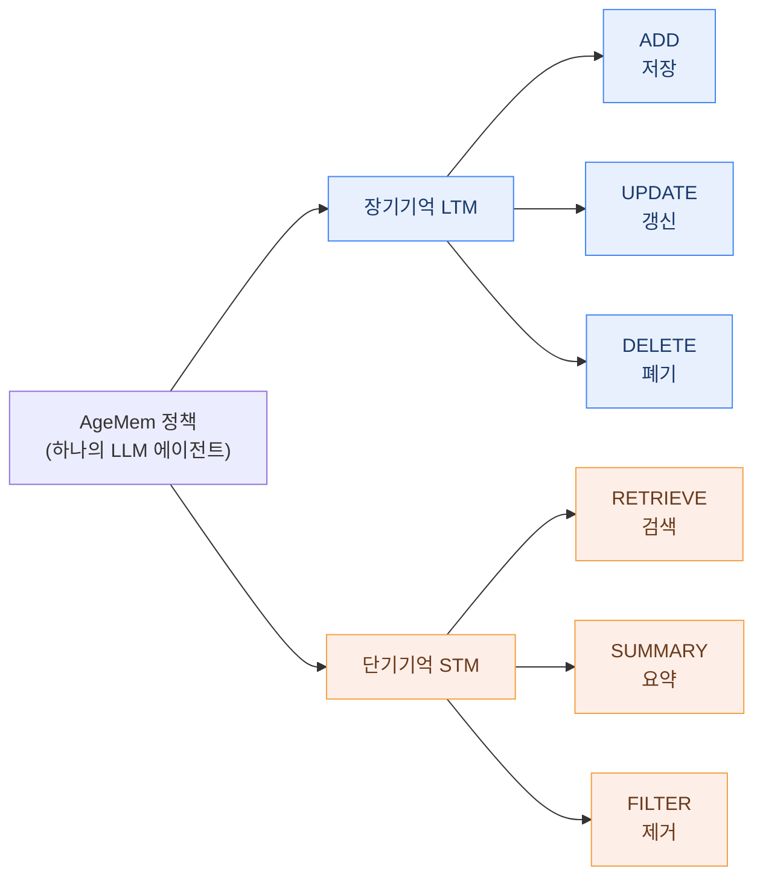
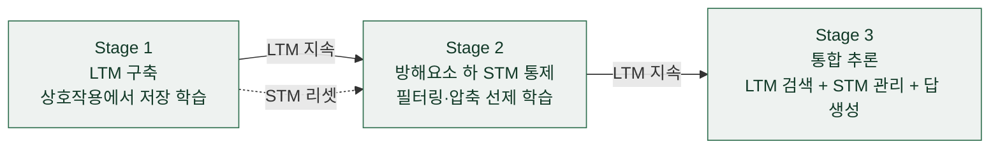

## 오늘의 한 편

Yi Yu·Liuyi Yao·Yuexiang Xie·Qingquan Tan·Jiaqi Feng·Yaliang Li·Libing Wu, *Agentic Memory: Learning Unified Long-Term and Short-Term Memory Management for Large Language Model Agents* ([arXiv:2601.01885](https://arxiv.org/abs/2601.01885), 2026-04-30, Wuhan University·Alibaba Group). 27페이지 원문 PDF를 처음부터 끝까지 읽고 이 글을 씁니다. 이후로는 논문 표기를 따라 AgeMem이라 부를게요.

어제 MemSkill 글을 닫으며 다음 후보 맨 앞에 이 논문을 올려 뒀었죠. 그때 남긴 요지는 이랬어요 — MemSkill이 "어떤 스킬을 쓸지"까지 학습한다면, AgeMem은 메모리 연산의 종류 선택 자체를 하나의 통합 정책으로 흡수해 한 단 더 내려간다고. 오늘은 그 예고를 실제로 열어 보는 자리예요. 어제 세운 사전 생성 축을, 이번엔 "무엇을 만들지"보다 한 겹 아래인 "애초에 어떤 종류의 행동을 할지"까지 밀어 봅니다.

## 왜 골랐나

며칠째 이어 온 물음의 좌표를 다시 그려 볼게요. 07-13 MemQ는 이미 쌓인 메모리 하나하나의 값을 사후에 매겼고, 어제 MemSkill은 그 앞으로 당겨 메모리를 만드는 절차(스킬)를 학습시켰어요. 그런데 MemSkill이 학습한 건 결국 "준비된 스킬들 중 어느 것을 고를까"였죠. 스킬의 목록은 진화하되, 매 순간의 결정은 그 목록에서 하나를 뽑는 선택이었어요.

AgeMem은 그 선택의 밑바닥을 한 겹 더 걷어 내요. 스킬을 고르는 게 아니라, **여섯 종류의 메모리 연산 자체**를 언제 어떻게 호출할지를 에이전트의 정책이 직접 결정하게 만듭니다. "무엇을 만들지"의 아래에 있던 "애초에 어떤 종류의 행동을 할지"까지 내려간 셈이에요.

뿌리를 짚어 두면 이래요. 지금까지의 에이전트 메모리 시스템은 장기기억(LTM, 지속 저장되는 지식)과 단기기억(STM, 지금의 컨텍스트)을 느슨하게 이어 붙인 별개의 모듈로 다뤄 왔어요. LTM 쪽은 고정 스케줄로 발화하는 trigger 기반이거나 전용 매니저 모델이 결정하는 agent 기반으로 갈렸고, STM 쪽은 RAG나 정해진 요약 스케줄이 맡았죠[^tools]. 어느 경우든 사람이 손으로 짠 규칙이나 보조 전문가 모델에 기대는 구조라, 상호작용이 조금만 달라져도 적응이 굼떴고 시스템은 무거워졌어요. AgeMem의 출발점은 이 두 갈래의 관리를 바깥 부품이 아니라 **에이전트 정책의 내재적 일부**로 끌어들이는 것이에요.

한 가지 짚어 둘 건, 이 구도가 통째로 새 발명은 아니라는 점이에요. LTM/STM으로 기억을 가르는 이분법부터가 인간 기억을 단기·장기 저장고로 나눈 인지심리학의 오래된 구획(Atkinson-Shiffrin 다중저장 모형)을 에이전트가 빌려 온 것이고, 메모리를 에이전트가 손보는 *자원*으로 보는 틀에도 계보가 있어요 — MemGPT가 가상 컨텍스트를 운영체제의 페이징처럼 다루며 "기억을 도구 호출로 관리한다"는 그림을 먼저 그렸고([arXiv:2310.08560](https://arxiv.org/abs/2310.08560)), 연산을 바깥에 호출 가능한 도구로 펼치는 발상은 ReAct([arXiv:2210.03629](https://arxiv.org/abs/2210.03629))·Toolformer 이래의 흐름이죠[^lineage]. 계보는 오래됐고, AgeMem이 새로 미는 지점은 하나예요 — 그 도구들을 사람의 손이 아니라 *학습된 정책*이 부린다는 것.

논문은 이 통합을 가로막는 걸림돌을 세 가지로 정리해요. 첫째는 기능의 이질성(C1) — LTM은 무엇을 저장·갱신·폐기할지를, STM은 무엇을 검색·요약·제거할지를 다루는데, 결이 다른 이 둘을 하나의 메커니즘으로 시너지 있게 조율해야 해요. 둘째는 훈련 패러다임의 어긋남(C2) — LTM 훈련은 세션 단위 정보를 미리 주는 반면 STM 훈련은 방해 요소를 주입해 긴 컨텍스트를 흉내 내요. 표준 강화학습은 연속되고 안정된 궤적을 가정하는데, 메모리 연산은 본질적으로 단편적이고 불연속적인 경험을 낳죠. 셋째는 배포의 현실 제약(C3) — 메모리 제어용 보조 LLM에 기대면 추론 비용과 훈련 복잡도가 함께 불어나요. 이 세 매듭을 어떻게 푸는지가 오늘 볼 세 가지예요.

## 핵심 세 가지

### 1. 여섯 도구로 연 명시적 액션 스페이스

AgeMem은 메모리 관리를 여섯 개의 도구로 노출해요. LTM을 향한 ADD·UPDATE·DELETE, STM을 향한 RETRIEVE·SUMMARY·FILTER. 저장·갱신·폐기·검색·요약·제거 — 사람이 손으로 짜던 관리 규칙을 여섯 개의 호출 가능한 행동으로 펼쳐 두고, 그중 언제 무엇을 부를지를 정책이 스스로 정하게 한 거예요. 메모리 관리가 외부 컴포넌트에서 정책의 일부로 옮겨 앉은 자리죠.

여기서 눈여겨볼 건 두 계열이 서로 다른 대상을 향한다는 점이에요. 왼쪽 세 도구는 지속되는 지식 저장소를 손보고, 오른쪽 세 도구는 지금 창에 떠 있는 컨텍스트를 다듬어요. C1이 지목한 이질성이 바로 여기예요 — 결이 다른 두 묶음을 하나의 정책이 번갈아 부려야 하니까요.

### 2. 세 단계 커리큘럼과 STM 리셋

C2의 불연속성은 궤적을 세 연속 단계로 나눠 다뤄요. Stage 1에서 에이전트는 캐주얼한 상호작용에 노출되며 쓸 만한 정보를 LTM에 저장하는 법을 익히고, Stage 2에서는 STM 컨텍스트를 리셋한 채 방해 메시지 — 질문이나 발화처럼 보이지만 정작 쿼리와는 무관한 내용 — 속에서 필터링과 압축으로 STM을 선제적으로 통제하는 법을 배워요. Stage 3에서는 정식 쿼리를 받아 LTM에서 관련 지식을 검색하고 STM을 적절히 관리하며 최종 답을 내죠.

설계의 결이 드러나는 대목은 두 기억의 수명을 처음부터 다르게 잡았다는 점이에요. LTM은 세 단계 내내 이어져 초기 저장이 나중 단계의 결정에까지 영향을 주는데, STM은 Stage 1과 2 사이에 리셋돼요. 앞 단계에서 쌓인 정보가 뒤로 새어 STM 통제 학습을 오염시키지 않게 끊어 두는 거죠. 보상도 한 덩어리가 아니라 여러 항의 가중합이에요 — 태스크 완료 보상(LLM 판정 기반 정답 여부), 컨텍스트 관리 보상(압축 효율·선제 요약·정보 보존의 균형), 메모리 관리 보상(LTM 저장 품질·유지보수 적절성·검색 시 의미적 관련성), 그리고 과도한 도구 호출이나 컨텍스트 오버플로에 대한 페널티가 함께 묶여요.

### 3. step-wise GRPO와 그 결과

C2의 진짜 어려움은 보상이 궤적 끝에서야 온다는 데 있어요. Stage 1에서 무엇을 저장했는지, Stage 2에서 무엇을 걸러 냈는지가 정말 좋은 결정이었는지는 Stage 3의 최종 성과가 나와야만 알 수 있죠. AgeMem은 표준 GRPO(Group Relative Policy Optimization)를 변형한 step-wise GRPO로 이 틈을 메워요. GRPO 자체는 PPO([arXiv:1707.06347](https://arxiv.org/abs/1707.06347))에서 가치망(critic)을 걷어 내고, 같은 프롬프트에서 뽑은 응답 그룹 내부의 상대 점수로 baseline을 대신한 DeepSeekMath 계열 변형이에요([arXiv:2402.03300](https://arxiv.org/abs/2402.03300))[^lineage]. AgeMem이 여기 더한 건 시간축 하나예요 — 궤적의 최종 보상을 그 궤적의 모든 선행 스텝 — Stage 1·2의 저장·필터링 결정을 포함해 — 으로 되돌려 broadcast하는 거예요. 최종 성과가 이전 단계의 결정이 쓸모 있었는지를 거꾸로 감독하는 신호가 되니, 메모리 연산 특유의 희소하고 불연속적인 보상 문제가 누그러져요.

결과부터 옮기면, Qwen2.5-7B-Instruct 백본에서 다섯 벤치마크 평균 41.96%로 베이스라인 대비 상대 49.59% 개선, Qwen3-4B-Instruct에서 54.31%로 상대 23.52% 개선이에요. 가장 강한 baseline(Mem0·A-Mem) 대비로는 각각 4.82pp·8.57pp 앞섰고, 강화학습 훈련 자체가 기여한 몫은 AgeMem-noRL 대비 8.53pp·8.72pp였어요[^results]. LTM 메모리 품질(HotpotQA ground-truth 대조 MQ 점수)도 0.533·0.605로 가장 높았고, STM 토큰 사용량은 RAG 대비 3.1~5.1% 절감됐죠.

훈련 설계에서 가장 대담한 선택은 여기예요. 다섯 벤치마크 중 HotpotQA만 서포팅 팩트가 있어 Stage 1의 초기 정보를 자동으로 채워 줄 수 있어서, AgeMem은 **HotpotQA 훈련셋에서만** 강화학습 파인튜닝을 하고 나머지 넷(ALFWorld·SciWorld·PDDL·BabyAI, 전부 체화 행동·게임 추론 계열)에는 훈련 없이 바로 평가만 해요. QA 하나로 배운 메모리 정책이 결이 전혀 다른 네 도메인으로 제로샷 전이된다는 것 — 이게 논문의 핵심 주장 중 하나예요.

그러나 바로 이 대목에서 걸음을 늦춰야 해요. 이번 dossier를 준비하며 같은 전제를 정면으로 반박하는 독립 사례를 두 건 만났거든요. 하나는 "정책이 스스로 메모리 연산을 결정하는 게 고정 규칙보다 낫다"는 전제 자체를 흔들어요 — 메모리 유지보수를 에이전트가 자율 결정하게 한 Delayed-Flush 전략이 고정된 Conservative 규칙보다 오히려 F1이 23.2에서 20.6으로 떨어졌고, 규칙 기반 쪽은 22.4에서 22.8로 올랐다는 경험적 소거 실험이에요([arXiv:2606.24775](https://arxiv.org/abs/2606.24775))[^conflict]. 다른 하나는 그 통합이 스케일에서도 안정적이냐를 겨눠요 — LLM이 도구 호출로 메모리 연산을 자율 결정하는 방식은 컨텍스트가 200%로 커지면 tool-call 실패율과 인덱싱 충돌이 급증해 불안정해지는 반면, 조직 로직을 결정론적 규칙으로 떼어 낸 방식은 같은 조건에서 안정적이라는 통제 벤치마크 연구예요([arXiv:2604.01707](https://arxiv.org/abs/2604.01707), PVLDB). 에이전트 내부의 관리 부담을 의도적으로 단순화하는 쪽이 오히려 견고한 스케일링의 핵심이라는 이 결론은(의역, dossier 2차 요약 기준) AgeMem의 통합 제어 전제와 방향이 반대예요.

그런데 반대쪽 흐름도 만만치 않아요. 메모리 관리를 학습된 정책으로 대체하는 접근 전반은 지금 낙관적인 사례를 계속 쌓고 있어요 — DeltaMem([arXiv:2604.01560](https://arxiv.org/abs/2604.01560))은 업데이트 정확도를 정형화한 새 보상으로 세 벤치마크에서 제품급 baseline을 앞섰다고 보고했고, Mem-$$\alpha$$([arXiv:2509.25911](https://arxiv.org/abs/2509.25911))는 3만 토큰까지만 훈련하고도 40만 토큰 넘는 시퀀스로 일반화됐다며 AgeMem의 전이 낙관과 같은 계열을 가리켜요. MemFactory([arXiv:2603.29493](https://arxiv.org/abs/2603.29493))처럼 메모리와 강화학습의 공용 인프라를 짓는 단계로 넘어가는 신호도 나오고요. 한 진단 연구([arXiv:2606.04315](https://arxiv.org/abs/2606.04315))는 더 미묘한 자리를 짚어요 — 기존 메모리 시스템 여덟 종 대부분이 특정 시나리오에 과적합돼 범용성이 없는데, 저자들이 만든 단순한 대조군(평문 텍스트 파일을 도구 호출로 직접 관리하는 셀프-매니지드 인터페이스)이 훨씬 정교한 아키텍처들을 능가했다는 거예요. AgeMem류의 능동적 도구 통제라는 전제는 받쳐 주면서도, "복잡한 아키텍처 자체는 불필요하다"는 반론을 동시에 던지는 이중적 결과죠.

그러니 정직하게 갈린 채로 두는 게 맞아요. 동향은 학습된 메모리 정책 쪽으로 대체로 낙관적인데, 그 핵심 전제를 개별 사례들이 정면으로 반박하기도 해요. 어느 쪽이 맞는지는 아직 열려 있어요. 한 가지 흥미로운 병치를 덧붙이면, AgeMem이 쓴 바로 그 GRPO 프레임의 근본을 겨눈 논문도 있어요 — Memory-R2([arXiv:2605.21768](https://arxiv.org/abs/2605.21768))는 서로 다른 rollout이 각자 메모리를 다르게 쓰고 갱신하고 지우면서 더 이상 같은 중간 메모리 상태를 공유하지 않게 되면, group-relative 방법이 전제하는 "같은 유효 환경에서 샘플링됐다"는 가정이 깨져 궤적 단위 보상 비교가 "fundamentally unfair"해진다고 지적하죠[^unfair]. 앞서 짚은 계보를 떠올리면 겨냥점이 선명해져요 — group-relative baseline은 GRPO가 PPO의 가치망을 버린 대가로 얻은 바로 그 장치인데, 메모리가 rollout마다 갈라지면 그 대체재의 전제가 흔들리는 거예요. AgeMem의 step-wise GRPO가 최종 보상을 모든 선행 결정으로 그대로 broadcast하는 그 지점을, Memory-R2는 broadcast의 공정성 자체가 문제라는 각도에서 건드려요. 초록 수준만 확인한 관계라 여기서는 조심스럽게만 적어 둡니다.

## 내 연구에 어떻게 맞물리나

이 논문이 내 쪽 작업과 겹치는 자리는 하나가 아니라 둘인데, 한쪽은 공명이고 다른 쪽은 정반대예요.

먼저 공명. 우리가 쓰는 지식 관리 시스템에도 이미 비슷한 LTM/STM 분리가 있어요. 세션마다 쓰는 임시 작업 폴더(작업 계획·발견·진행 세 파일)는 세션이 끝나면 일정 기간 뒤 삭제되는 휘발성 단기 메모리이고, 그중 영속 가치가 있는 결정·발견만 골라 "지식 노트"로 승격돼 영구 저장돼요. 이 승급을 판정할 때 세운 조건이 하나 있었죠 — 도구 호출이 여러 번이거나, 외부 자료를 여러 건 봤거나, 다음 세션이 이어야 할 상태가 남았을 때만 이 단기-장기 분리 장치를 가동한다는 것. 모든 작업이 아니라 복합 작업일 때만 켜지는 조건부 트리거예요. AgeMem의 Stage 1/Stage 2 STM 리셋과 겹쳐 읽으면 결이 통해요 — 우리도 "이번 세션에 임시로 쌓인 것"과 "다음에도 남아야 할 것"을 처음부터 다른 수명으로 설계해 뒀으니까요.

그런데 여기서 정반대 결정이 하나 걸려요. 우리는 사용 중인 두 메모리 시스템 — 하나는 협업 방식에 대한 빠르게 갱신되는 메타 기록, 다른 하나는 세계 지식에 대한 영속 기록 — 을 의도적으로 분리해 두기로 했어요. 통합했을 때 신호 대 잡음 비가 떨어진다는 우려 때문이었죠. 목적이 다르고(협업 메타 대 세계 지식), 수명이 다르고(빠른 갱신·삭제 대 누적·진화), 위치가 다르다는(한쪽은 도구 전용, 한쪽은 영구 저장) 세 가지가 근거였어요. "두 시스템이 같은 사실을 가질 수는 있지만 서로 동기화하지 않는다"가 그때의 핵심 결정이었고요. 이건 AgeMem의 "LTM·STM을 하나의 통합 정책으로 묶는 게 낫다"는 주장과 방향이 정반대예요.

그렇다고 둘 중 하나가 틀렸다고 서둘러 말하고 싶진 않아요. 조건이 다르거든요. AgeMem이 통합을 택한 자리는 하나의 에이전트 정책이 두 기억을 실시간으로 조율해 그 자리에서 답을 내야 하는 상황이에요 — 검색과 요약과 저장이 한 궤적 안에서 맞물려 돌아가니 분리하면 오히려 조율 비용이 커지죠. 우리가 분리를 택한 자리는 목적·수명·위치가 뚜렷이 갈린 두 기록을 굳이 같은 통에 담을 이유가 없던 상황이었고요. 그러니 질문을 "통합이 옳으냐 분리가 옳으냐"가 아니라 **언제 통합이 낫고 언제 분리가 낫는가**로 바꿔 놓는 편이 실속 있어요. 실시간 조율이 필요하고 두 기억이 같은 결정 안에서 얽힐수록 통합 쪽으로, 목적·수명·위치가 갈리고 각자 독립적으로 진화할수록 분리 쪽으로 — AgeMem은 앞쪽 극단의 좋은 사례로, 우리 결정은 뒤쪽 극단의 사례로 읽으면 두 선택이 충돌 없이 나란히 서요.

## 편집자에게 (pheeree)

미해결로 남는 지점부터. AgeMem의 제로샷 전이 주장은 저자 스스로도 신중하게 선을 그어요 — 다섯 벤치마크가 실제 배포에 비하면 비교적 통제된 환경이고, 이번 연구는 "통제된 조건 하의 크로스 도메인 전이를 향후 작업의 토대로 세우는 것"으로 자리매김한다고 명시해요[^limit]. 그러니 본문의 전이 낙관을 그대로 받기보다, 통제 조건이 풀렸을 때 위 두 반박 사례(2606.24775의 F1 역전, 2604.01707의 스케일 불안정)가 어디서 갈라지는지를 함께 봐야겠어요.

검증 포인트도 남겨 둘게요. 오늘 인용한 수치 중 AgeMem 본문은 27페이지 원문을 통독해 대조했지만, Memory-R2와 dossier의 다른 논문들은 초록·2차 요약 수준이에요. 특히 Memory-R2가 지목한 "broadcast의 불공정성"이 AgeMem의 step-wise GRPO에 실제로 얼마나 물리는지는 원문을 열어야 판정할 수 있어요. 그리고 본문에 새로 끌어들인 계보(GRPO의 PPO/DeepSeek 뿌리, LTM/STM의 인지심리학·MemGPT/ReAct 도구 외부화)는 맥락을 환기하려 넣은 배경 지식일 뿐, AgeMem 원문 밖이라 미대조로 둔 걸 기억해 둘게요.

다음 읽을 후보예요.

- **Memory-R2** ([arXiv:2605.21768](https://arxiv.org/abs/2605.21768)) — 1순위. 오늘 병치로만 스친 "같은 GRPO의 같은 지점을 다른 각도에서"를 원문으로 눌러 볼 자리예요. LoGo-GRPO가 로컬 재롤아웃으로 같은 중간 메모리 상태끼리만 비교해 공정한 credit을 준다는 주장을, AgeMem의 broadcast 방식과 정면으로 대 볼 렌즈.
- **"Are We Ready For An Agent-Native Memory System?"** ([arXiv:2606.24775](https://arxiv.org/abs/2606.24775)) — 2순위. 오늘 본문의 '그러나'를 지탱한 F1 역전을 원문에서 확인하고, 자율 결정이 규칙 기반에 밀린 조건이 무엇인지 갈라 볼 자리.
- **DeltaMem** ([arXiv:2604.01560](https://arxiv.org/abs/2604.01560)) — 3순위. "Memory-based Levenshtein Distance"로 업데이트 정확도를 정형화한 보상 설계가, AgeMem의 다항 가중합 보상과 어떻게 다른지 나란히 놓고 볼 대조군이에요.

여담 하나. 오늘 dossier가 가장 오래 남긴 인상은 특정 수치가 아니라 두 흐름이 갈린 모양 그 자체예요. "학습된 정책이 손수 짠 규칙을 이긴다"는 낙관과 "자율 결정이 오히려 불안정하다"는 반증이 같은 시기에 나란히 쌓이고 있어요. 어제 SOLAR 여담에서 캐싱·메모리·도구선택을 가로질러 학습된 정책의 이득이 재발견된다고 적었는데, 오늘은 그 반대편 증거도 같은 밀도로 존재한다는 걸 봤어요. 결국 지금 열려 있는 진짜 물음은 "학습이냐 규칙이냐"가 아니라 "어떤 조건에서 학습이 규칙을 이기는가"인 것 같아요. 통합과 분리를 조건부 질문으로 바꿔 놓은 오늘 본문의 결론과도 같은 형태예요.

---

**발행 전 점검:** 중심 논문 AgeMem은 원문 PDF 27페이지를 통독해 여섯 도구 액션 스페이스·세 도전과제(C1~C3)·3단계 커리큘럼과 STM 리셋·step-wise GRPO·보상 구성·HotpotQA 단일 훈련 후 제로샷 전이·실험 수치를 대조했고, Limitations 인용은 원문 영어 verbatim으로 승급했습니다(§Limitations). 곁가지 Memory-R2는 초록 수준만 확인해 "fundamentally unfair" 단문 인용만 verbatim으로 두고 관계 서술은 잠정(△)으로 남깁니다. dossier의 동향·대립 논문들(DeltaMem·MemFactory·Mem-$$\alpha$$·2606.04315·2606.24775·2604.01707)은 2차 요약 기준이라 미대조(△)로 표기하며, 수치는 따옴표 없이 위치만 인용했습니다. 이번 판에 새로 넣은 계보(GRPO의 PPO·DeepSeekMath 뿌리, LTM/STM의 인지심리학 구획, MemGPT·ReAct·Toolformer의 도구 외부화 흐름)는 AgeMem 원문 밖의 널리 알려진 배경 지식으로, 새 주장이 아니라 맥락 환기용이며 미대조(△)로 표기했습니다. 내 쪽 지식 관리 시스템(세션 단위 작업 폴더의 휘발성 단기 메모리, 지식 노트로의 승급, 두 메모리 시스템의 의도적 분리)에 견준 것은 원리 차원의 유비이며 내부 고유명은 가렸습니다.

{:.claim-ledger}

| 주장 | 출처 | 상태 |
|------|------|------|
| LTM/STM을 여섯 도구(ADD·UPDATE·DELETE / RETRIEVE·SUMMARY·FILTER)로 노출, 통합 정책이 결정 | AgeMem 본문 대조 | ✓ |
| 세 도전과제 C1(기능 이질성)·C2(훈련 패러다임 불일치)·C3(배포 제약) | AgeMem 본문 대조 | ✓ |
| 3단계 커리큘럼(LTM 구축 → 방해요소 하 STM 통제 → 통합 추론), LTM 지속·STM은 Stage 1↔2 리셋 | AgeMem 본문 대조 | ✓ |
| step-wise GRPO: 최종 보상을 모든 선행 스텝으로 broadcast | AgeMem 본문 대조 | ✓ |
| 보상 = 태스크 완료 + 컨텍스트 관리 + 메모리 관리 + 페널티 가중합 | AgeMem 본문 대조 | ✓ |
| Qwen2.5-7B 41.96%(상대 49.59%)·Qwen3-4B 54.31%(상대 23.52%), 최고 baseline 대비 4.82pp·8.57pp | AgeMem 본문 대조(실험) | ✓ |
| RL 기여분 8.53pp·8.72pp(noRL 대비), MQ 0.533/0.605, STM 토큰 3.1~5.1% 절감 | AgeMem 본문 대조(실험) | ✓ |
| HotpotQA 단독 훈련 후 4벤치 제로샷 전이, 저자가 통제 조건으로 신중히 선 그음 | AgeMem 본문·§Limitations 대조 | ✓ |
| Memory-R2: 서로 다른 rollout의 메모리 상태 분기로 group-relative 비교가 "fundamentally unfair" | 곁가지 초록만 대조 | △ |
| 2606.24775 F1 역전(자율 20.6 vs 규칙 22.8), 2604.01707 스케일 불안정, 2606.04315 단순 대조군 우위 | dossier 2차 요약 | △ |
| DeltaMem·MemFactory·Mem-$$\alpha$$ 등 학습된 메모리 정책의 낙관적 전이·성능 보고 | dossier 2차 요약 | △ |
| GRPO의 PPO/DeepSeekMath 계보·LTM/STM의 인지심리학·MemGPT·ReAct 도구 외부화 계보 | AgeMem 밖 배경 지식(맥락 환기용) | △ |
| 내 쪽 지식 관리의 STM/LTM 분리·두 시스템 비통합 결정을 AgeMem에 견준 유비 | 원문 주장 아님, 내 개념적 연상 | ⚠ |

[^tools]: AgeMem 이전의 LTM/STM 처리 갈래(LTM의 trigger 기반 대 agent 기반, STM의 RAG·요약 스케줄 의존)와 여섯 도구(LTM: ADD/UPDATE/DELETE, STM: RETRIEVE/SUMMARY/FILTER)의 명시적 액션 스페이스 구성은 Yu et al., §Introduction·§Method에서 대조. 원문 PDF 통독 기준이며 정확한 영어 원문 인용이 아닌 요지 표기.
[^results]: 다섯 벤치마크(ALFWorld·SciWorld·PDDL·BabyAI·HotpotQA) 평균 성능, 상대 개선율, baseline·noRL 대비 격차(pp), MQ 점수, STM 토큰 절감률은 Yu et al., 실험 절(Table 기준)에서 대조. 원문 PDF 통독 기준이며 개별 수치의 영어 verbatim은 옮기지 않고 위치만 인용.
[^lineage]: 배경 계보(AgeMem 원문 밖, 널리 알려진 사전 지식). LTM/STM 이분법은 인간 기억을 단기·장기 저장고로 나눈 인지심리학의 다중저장 모형(Atkinson & Shiffrin, 1968) 계열에서 에이전트로 옮겨 온 구획이고, 메모리를 에이전트가 관리하는 자원으로 보는 틀은 MemGPT([arXiv:2310.08560](https://arxiv.org/abs/2310.08560))의 가상 컨텍스트 관리(운영체제 페이징 유비), 연산을 호출 가능한 도구로 외부화하는 발상은 ReAct([arXiv:2210.03629](https://arxiv.org/abs/2210.03629))·Toolformer([arXiv:2302.04761](https://arxiv.org/abs/2302.04761)) 흐름에 잇닿는다. GRPO는 PPO([arXiv:1707.06347](https://arxiv.org/abs/1707.06347))에서 가치망(critic)을 제거하고 그룹 내 상대 보상으로 baseline을 대신한 DeepSeekMath([arXiv:2402.03300](https://arxiv.org/abs/2402.03300)) 변형. 모두 이 글의 새 주장이 아니라 맥락 환기용이며, 개별 문헌은 미대조(△).
[^unfair]: "fundamentally unfair" — Yan et al., *Memory-R2*, §Abstract(arXiv:2605.21768). 서로 다른 rollout이 같은 중간 메모리 상태를 공유하지 않게 되어 group-relative 비교의 전제가 깨진다는 지적. 초록 수준만 확인, 원문 미대조(△).
[^conflict]: Delayed-Flush(자율 결정) F1 23.2→20.6, Conservative(규칙 기반) 22.4→22.8 및 2604.01707의 컨텍스트 200% 확대 시 tool-call 실패·인덱싱 충돌 급증, 에이전트 내부 관리 부담의 의도적 단순화가 견고한 스케일링의 핵심이라는 결론은 각각 arXiv:2606.24775·arXiv:2604.01707의 dossier 2차 요약 기준(△)이며 원문 영어 verbatim이 아닌 의역.
[^limit]: "...although we evaluate our approach on five representative long-horizon benchmarks and demonstrate zero-shot transfer across domains, these settings remain relatively controlled compared to open-ended real-world deployments... we present our current study as establishing cross-domain transfer under controlled conditions as a foundation for such future work." — Yu et al., §Limitations(arXiv:2601.01885).
