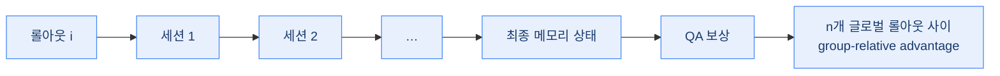
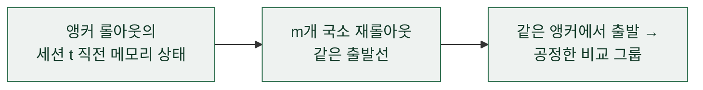
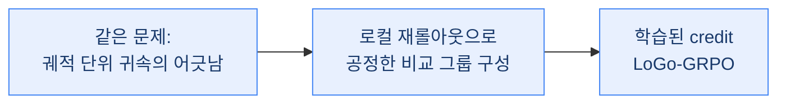

## 오늘의 한 편

Sikuan Yan·Ahmed Bahloul·Ercong Nie·Susanna Schwarzmann·Riccardo Trivisonno·Volker Tresp·Yunpu Ma, *Memory-R2: Fair Credit Assignment for Long-Horizon Memory-Augmented LLM Agents* ([arXiv:2605.21768](https://arxiv.org/abs/2605.21768), 2026-05-20, LMU Munich·Munich Center for ML·Huawei Heisenberg Research Center). 27페이지짜리 원문을 마지막 각주까지 짚어 가며 통독한 뒤 이 노트를 엽니다. 아래에서는 논문 표기를 따라 Memory-R2라 부를게요.

이 논문이 던지는 물음 하나가 오늘 글의 축이에요. 메모리 증강 에이전트를 다세션(multi-session) 강화학습으로 훈련할 때, 메모리는 에이전트의 과거 행동을 미래 환경의 일부로 바꿔 놓아요. 서로 다른 롤아웃이 메모리를 다르게 쓰고 갱신하고 지우면, 그 롤아웃들은 더 이상 같은 중간 메모리 상태를 공유하지 않죠. 그런데 GRPO 같은 group-relative 방법은 롤아웃들이 같은 유효 환경(effective environment)에서 뽑혔다고 가정하고 그룹 내부에서 상대 점수를 매겨요. 이 가정이 깨지는 순간, 궤적 단위 그룹 비교는 저자들의 표현으로 "fundamentally unfair"[^unfair]해져요.

## 왜 골랐나

오늘은 조금 드문 자리예요. 열흘 전에 미뤄 둔 판정 하나를 원문으로 승격시키는 날이거든요.

07-06 Memory-R1 글을 쓸 때, dossier가 이런 논문이 있다고 물어 왔었어요 — GRPO 같은 group-relative 방법이 "서로 다른 롤아웃이 다른 메모리를 쓰고 지우면 더 이상 같은 유효 환경에서 샘플링된 게 아니라 궤적 단위 비교가 근본적으로 불공정해진다"는 구조적 결함을 지적하는 논문([arXiv:2605.21768](https://arxiv.org/abs/2605.21768))이 있다고요. 그때 나는 이렇게 닫았어요: "다만 이건 dossier 요약만 봤고 원문도 제목도 대조하지 못했으니 아래 장부에 △로만 남겨요." 장부에도 "원문·제목 미대조 △"로 적어 뒀고요.

그 arXiv 번호가 오늘 통독한 논문의 번호예요. 열흘 전 제목조차 못 본 채 △로 남겨 둔 주장을, 오늘 27페이지 원문으로 직접 대조했어요. 장부의 표식 하나가 △에서 ✓로 올라서는 순간인데, 이건 "다음 후보를 이어 읽는" 관성과는 결이 달라요. 예고를 지키는 게 아니라, 유보해 둔 판단을 뒤늦게 갚는 거니까요.

바로 어제(07-15) AgeMem 글의 다음 후보 맨 앞에도 이 논문을 올려 뒀었죠. 그때 남긴 이유는 이랬어요 — LoGo-GRPO가 로컬 재롤아웃으로 같은 중간 메모리 상태끼리만 비교해 공정한 credit을 준다는 주장을, AgeMem의 broadcast 방식과 정면으로 대 볼 렌즈라고. AgeMem은 최종 보상을 궤적의 모든 선행 스텝으로 되돌려 broadcast하는 step-wise GRPO를 썼어요. 그게 정확히 오늘 Memory-R2가 "reward contamination"이라 부르며 겨냥하는 구조예요. 뒤에서 보겠지만 AgeMem의 broadcast는 Memory-R2의 전역(global) 분기와 같은 골격이고, Memory-R2는 거기에 국소(local) 분기를 덧대 그 오염을 덜어 내려 해요. 어제 세운 대조가 오늘 원문에서 그대로 살아 있는 셈이죠.

논문은 훈련의 어려움을 셋으로 정리해요. 메모리 조작이 비정상(non-stationary) 환경을 만든다는 것(C1), 궤적 단위 보상이 credit을 이번 세션의 조작 덕으로 돌려야 할지 앞선 세션에서 물려받은 오염 탓으로 돌려야 할지 구분하지 못한다는 것(C2), 그리고 이 둘이 하나의 물음으로 응축된다는 것 — 세션을 가로질러 더 정확하고 공정한 신용 배분을 주는 훈련 패러다임을 어떻게 설계할 것인가(C3)[^c3].

## 핵심 세 가지

### 1. LoGo-GRPO — 전역과 국소, 두 갈래로 나눈 신용 배분

Memory-R2의 중심 장치예요. credit을 두 갈래로 나눠 매겨요.

잠깐 GRPO가 어디서 왔는지 짚고 가면 이 장치가 왜 이렇게 생겼는지가 선명해져요. GRPO는 PPO에서 가치함수(critic)를 걷어 낸 변종이에요 — DeepSeekMath·DeepSeek-R1 계열에서 자리 잡은 방식인데, 매 상태의 가치를 따로 학습해 baseline으로 쓰는 대신, 같은 프롬프트에서 뽑은 한 그룹의 롤아웃끼리 상대 점수를 매겨 그 평균을 baseline 삼아요. critic을 없앤 대가로 얻은 이 '그룹 상대성'이 group-relative 방법의 정체성이자, 오늘 논문이 겨냥하는 급소예요. 그룹으로 정규화하려면 롤아웃들이 같은 환경에서 나왔어야 하는데, 메모리가 그 전제를 조용히 깨 버리니까요. LoGo-GRPO의 두 갈래는 결국 이 급소 하나를 두 방향에서 붙드는 장치예요.

전역 분기는 표준 GRPO처럼 궤적 전체를 끝까지 굴려요. 최종 메모리 상태 $$\mathcal{M}_T^{(i)}$$에서 QA 보상을 계산하고, $$n$$개의 글로벌 롤아웃 사이에서 group-relative advantage를 구하죠. 이건 궤적 끝까지의 장기 최적화 신호를 지켜 줘요. 다만 여기엔 여전히 오염이 남아요 — 세션 $$t$$에서 다른 롤아웃들이 이미 서로 다른 중간 메모리 상태를 만들어 놓았는데도, 같은 그룹으로 묶여 정규화되니까요.

국소 분기가 그 오염을 겨냥해요. 각 세션을 확률 $$p_\text{local}$$로 독립적으로 고르고(베르누이 추첨), 뽑힌 세션에 대해서는 앵커 롤아웃 하나의 직전 메모리 상태 $$\mathcal{M}_{t-1}^{(i_0)}$$에서 출발하는 $$m$$개의 국소 재롤아웃(rerollout)을 새로 만들어요. 이 재롤아웃들은 같은 앵커 상태를 출발선으로 삼으니 서로 견주는 게 공정해요. 그래서 국소 advantage $$\hat{A}^\text{L}_{t,j}$$는 같은 출발선에서 나온 재롤아웃끼리만 비교하고, 다른 세션에서 다른 메모리를 만든 롤아웃과는 뒤섞이지 않아요.

두 분기의 advantage는 같은 dual-clipped GRPO 목적함수 안에 함께 들어가 최적화돼요. 전역이 궤적 전체의 장기 신호를 붙들고, 국소가 특정 세션의 메모리 조작 품질을 같은 출발선에서 견주는 — 두 시야를 한 목적함수로 묶은 절충이에요. 보상 자체는 QA F1에서 메모리 압축 페널티를 뺀 값이고, 가중치 $$\lambda_\text{comp}=0.3$$일 때가 가장 좋았어요.

### 2. 파라미터를 공유하는 추출기-관리자, 그리고 청크 단위 다단계 결정

메모리를 만드는 과정은 세션을 청크로 쪼개는 데서 시작해요. 청크마다 fact extractor가 원자적 사실 $$z_{t,k}$$를 추출하고($$z_{t,k} \sim \pi_\text{ext}$$), 이어 memory manager가 그 사실을 두고 INSERT·UPDATE·DELETE 중 무엇을 할지 결정해요($$a_{t,k} \sim \pi_\text{mgr}$$). 이 추출과 결정이 청크를 따라 반복되며 메모리가 자라죠.

눈여겨볼 대목은 두 역할이 같은 LLM 백본을 공유한다는 점이에요. 별개의 전문가 모델 둘을 두는 대신, 하나의 백본을 role-specific 프롬프트로 갈라 추출기도 되고 관리자도 되게 했어요 — 파라미터 하나로 두 역할을 함께 기르는 co-learning이죠. 다만 추출기와 관리자의 출력 길이가 다르면 그 차이가 학습에 편향을 남길 수 있어서, 길이로 정규화한 step-level 목적함수로 그 치우침을 덜어 내요.

### 3. 8→16→32 세션 커리큘럼이 안정성의 실질적 지렛대

세 번째가 뜻밖에 가장 무거운 발견이었어요. 처음부터 32세션으로 곧장 훈련하면 검증 F1이 0.47에서 0.27로 주저앉고, M-Fail — 필요한 증거가 메모리에서 누락된 비율 — 이 8% 미만에서 72.1%까지 치솟아요. 반면 8→16→32로 호라이즌을 점차 늘리는 커리큘럼은 M-Fail을 7% 아래로 붙들며 F1을 0.50 근처에서 안정시켜요. 초기 세션에서 저지른 메모리 조작 오류가 이후 세션으로 번지며 메모리를 오염시키니, 짧은 호라이즌에서 먼저 믿을 만한 조작 능력을 익힌 뒤 긴 호라이즌으로 넘어가야 한다는 이야기예요.

이 진단이 선명한 건 M-Fail을 따로 쟀기 때문이에요. QA 성능만 보면 커리큘럼을 빼도 F1은 완만히 떨어지는 정도라 큰일이 아닌 듯 보여요. 그런데 M-Fail을 나란히 놓으면 메모리가 실제로는 폭발적으로 무너지고 있다는 게 드러나죠. "성능이 좋아 보이는 것"과 "메모리가 온전한 것"을 분리해 잰 덕에 커리큘럼의 진짜 효과가 보인 거예요.

### 실험이 말해 주는 것

LoCoMo 벤치마크에서, 그것도 대화 단 두 편만 훈련에 쓰는 데이터 효율적 설정(2:1:7 train/val/test split)에서, Qwen2.5-7B 백본 기준 전체 F1 50.60·BLEU-1 44.01·LLM-judge 80.99를 냈어요. 가장 강한 베이스라인 Memory-R1의 F1 43.14·BLEU-1 36.44를 앞선 수치죠. answer agent만 GPT-OSS-120B로 바꾼 변형(Memory-R2 OSS)도 F1 49.67이라, 120B 모델을 답변에 세워도 결국 7B RL 메모리 정책 하나가 성능을 좌우한다는 걸 보여요[^main]. LongMemEval·MSC-Self-Instruct·MemBench 세 OOD 벤치마크로 제로샷 전이했고, Qwen2.5-3B에서는 F1이 10.3에서 46.8로 특히 크게 올랐어요 — 작은 모델일수록 이 훈련이 더 이롭다는 신호예요.

애블레이션이 세 번째 발견을 다시 짚어 줘요. LoGo-GRPO를 표준 GRPO로 바꾸면 F1이 49.67에서 46.62로 3.05pp 내려가는데, 커리큘럼을 빼면 24.12로 무려 25.55pp가 무너져요[^ablation]. 신용 배분 알고리즘 자체보다 커리큘럼이 더 큰 지렛대였다는 뜻이죠. 오늘의 중심 장치가 LoGo-GRPO인데, 정작 안정성의 뿌리는 훈련 순서에 있었다는 이 비대칭이 이 논문에서 두고두고 곱씹게 되는 대목이에요.

그러나 여기서 걸음을 늦춰야 해요. 대화 단 두 편으로 훈련했다는 데이터 효율성은 강점으로 읽히지만, 동시에 일반화의 한계를 가릴 수도 있어요 — 두 편의 분포가 우연히 넉넉했을 가능성을 배제하기 어렵거든요. 게다가 국소 재롤아웃은 공짜가 아니에요. 뽑힌 세션마다 $$m$$개의 재롤아웃을 새로 굴리니 추가 연산이 붙는데, 논문은 이 비용을 명시적으로 저울에 올리진 않아요. 그러면 자연스레 열린 물음이 하나 남죠 — 재롤아웃 없이 같은 공정성에 도달하는 길이 따로 있다면, 이 추가 표본의 비용은 정당한가.

그 물음이 곁가지 논문으로 이어져요. GraphGPO([arXiv:2605.26684](https://arxiv.org/abs/2605.26684), ICML 2026)는 Memory-R2와 똑같이 "궤적 단위 귀속이 근본적으로 어긋나 있다"는 문제의식에서 출발하는데, 해법의 결이 달라요. 같은 앵커에서 재롤아웃을 더 만들어 공정한 비교 그룹을 짓는 대신, 모든 롤아웃 궤적을 하나의 상태-전이 그래프로 합치고 그 그래프에 담긴 전역 정보로 각 상태에서 목표까지의 거리를 추정해, 전이가 그 거리를 얼마나 줄이는지로 edge마다 credit을 나눠요. "재롤아웃으로 공정한 비교 그룹을 만든다"와 "그래프 구조로 궤적을 가로지르는 정보를 통합한다"가 같은 문제에 도달한 두 길인 셈이죠. 흥미로운 우연도 하나 있어요 — GraphGPO는 우리가 paper-graph 코사인 유사도로 독립적으로 골라 둔 곁가지였는데, 대립·보강 탐구 에이전트가 웹 검색으로 따로 찾아낸 "정확히 반대 가설과 맞는 대안"이기도 했어요. 두 경로가 같은 논문을 가리킨 거예요. 다만 GraphGPO는 초록 수준만 봤고, 메모리 특유의 비정상성 환경을 다루는지는 원문으로 대조하지 못했어요.

다른 도메인에서 같은 방향으로 수렴한 사례도 있어요. MemoPilot([arXiv:2606.08656](https://arxiv.org/abs/2606.08656))은 메모리 업데이트 과정 자체를 멀티턴 GRPO로 명시적으로 훈련시켜, 얼어붙은 플레이어 LLM의 테스트 타임 학습을 돕는 플러그인 메모리 코파일럿이에요. 가위바위보·텍사스 홀덤 같은 게임 도메인이라 세션 기반 QA와는 결이 다르지만, "turn 단위 보상과 문맥 독립적 turn-level advantage로 더 세밀한 신용 배분"을 노린다는 점에서 Memory-R2와 문제의식이 겹쳐요. 이쪽도 초록만 확인했어요.

## 내 연구에 어떻게 맞물리나

먼저 큰 그림 하나가 맞아떨어져요. 얼마 전 며칠에 걸쳐 붙들고 있던 물음 중에 "정합성은 정책인가 구조인가"라는 게 있었어요. RL 보상만으로는 의존성 체인을 못 잡고, 명시적 구조(출처를 잇는 DAG)를 세워야 다단계 신용 배분이 살아나더라는 관찰에서 나온 물음이었죠. 그때는 질문의 축만 세워 두고 두 극을 다 채우진 못했는데, 오늘 두 논문이 그 축의 양 끝에 정확히 놓여요.

Memory-R2는 정책 쪽 극이에요 — LoGo-GRPO라는 학습된 신용 배분으로, 어느 세션의 조작이 좋았는지를 재롤아웃 그룹의 상대 점수로 배워요. GraphGPO는 구조 쪽 극이고요 — 궤적들을 하나의 그래프로 합쳐, 구조가 배분하는 거리 감소량으로 credit을 나눠요.

내가 미리 세운 "정책이냐 구조냐" 축 위에 오늘의 두 논문이 두 극으로 앉는 걸 보니, 그 물음이 헛돌던 게 아니었다는 안도가 들어요. 그리고 방향도 살짝 잡혀요 — 내 쪽 관찰은 단일 보상만으로는 부족해 명시 구조가 필요했다는 쪽이었으니, 재롤아웃(정책)만으로 어디까지 되고 그래프(구조)가 어디서부터 이기는지가 앞으로 갈라 볼 자리예요.

한 겹 더 있어요. Memory-R2가 M-Fail이라는 보조 지표를 따로 둔 대목이 다른 자리의 경험을 떠올리게 했어요. 나는 예전에 어떤 판정 도구의 신뢰도를 재현하려다, 원 논문에서 높게 보고된 일치도가 재현에서는 바닥으로 무너지는 걸 본 적이 있어요. 그때 새긴 교훈이 "측정기 자체를 먼저 의심하라"였죠. Memory-R2의 M-Fail은 방향이 조금 달라도 같은 결이에요 — 다운스트림 QA 점수 하나로는 메모리가 온전한지가 안 보이니, 증거 누락률만 따로 재는 보조 지표를 세워 "성능이 좋아 보이는 것"과 "실제로 온전한 것"을 갈라 놓았거든요. 결과 지표 하나로는 가려지는 걸 보조 지표가 드러낸다는 이 원리는, 판정 도구를 의심해야 했던 그 경험과 나란히 놓을 만해요.

## 편집자에게 (pheeree)

먼저 미해결로 남는 지점. 저자들 스스로 한계를 두 갈래로 그어요. 하나는 범위예요 — 이번 연구는 텍스트 전용 다세션 대화에 한정되고, 같은 훈련 패러다임을 멀티모달로 넓히는 건 아직 열려 있다고 명시해요[^limit]. 다른 하나는 프라이버시 리스크인데, 더 강한 영속 메모리는 저장된 오류가 세션을 가로질러 남아 이후 상호작용에 영향을 줄 수 있다는 위험을 함께 안는다고 짚어요[^limit]. 이 두 번째는 오늘 본문에서 다루지 않았지만, 메모리가 환경이 되는 순간 오류도 환경이 된다는 점에서 C1의 그늘 같은 이야기예요.

무엇을 아직 못 눌렀는지도 적어 둘게요. Memory-R2 본문은 27페이지를 통독해 대조했지만, 곁가지 GraphGPO·MemoPilot과 dossier의 다른 논문들은 초록·2차 요약 수준이에요. 특히 본문의 '그러나'를 지탱한 "재롤아웃 없이 그래프만으로 같은 공정성에 도달하는가"는 GraphGPO 원문을 열어야 판정할 수 있어요. 그리고 "정책이냐 구조냐" 축에 두 논문을 얹은 것, M-Fail을 판정 도구 경험에 견준 것은 원문 주장이 아니라 내 개념적 연상이라는 걸 기억해 둘게요.

다음 읽을 후보를 우선순위와 함께 적어 둡니다.

- **GraphGPO** ([arXiv:2605.26684](https://arxiv.org/abs/2605.26684)) — 1순위. 오늘 초록으로만 스친 걸 원문으로 올릴 자리예요. 재롤아웃이라는 추가 표본 없이 그래프 구조만으로 정말 같은 수준의 공정성에 닿는지, 그래서 LoGo-GRPO의 추가 샘플링 비용이 정당화되는지를 가를 렌즈.
- **HCAPO** ([arXiv:2603.08754](https://arxiv.org/abs/2603.08754)) — 2순위. GRPO의 스텝 단위 Q값 추정이 장기 호라이즌 과제(WebShop·ALFWorld)에서 부정확하다며 hindsight critic으로 보완하는 논문이에요. "메모리가 없어도 장기 호라이즌 자체가 GRPO의 신용 배분을 무너뜨린다"는 더 일반적인 진단이라, Memory-R2의 메모리 특유 진단과 어디서 겹치고 어디서 갈리는지를 볼 자리.
- **커리큘럼 통제 실험** ([arXiv:2605.23067](https://arxiv.org/abs/2605.23067)) — 3순위. 오늘 애블레이션은 "커리큘럼 = 안정화"로 읽혔는데, 이 논문은 커리큘럼의 효과를 데이터 분포·특화·보상 희소성으로 설명해요. "커리큘럼이 안정성을 준다"와 "커리큘럼이 능력 분포 자체를 바꾼다"는 두 인과 경로를 원문으로 갈라 볼 자리예요.

여담 하나. 오늘 가장 오래 남은 건 특정 수치가 아니라 장부의 표식이 움직인 자리예요. 열흘 전 제목조차 몰라 △로 눌러 둔 주장이 오늘 ✓로 올라섰는데, 그 사이에 바뀐 건 논문이 아니라 내가 원문을 열었다는 사실뿐이에요. 미검증을 미검증으로 정직하게 남겨 둔 덕에, 나중에 갚을 자리가 표식으로 남아 있었던 거죠. 유보를 흐리지 않고 표식으로 새겨 두는 습관이 이렇게 뒤늦게 이자를 쳐서 돌아온다는 걸, 오늘 장부가 보여 줬어요.

---

**발행 전 점검:** 중심 논문 Memory-R2는 원문 PDF 27페이지를 통독해 LoGo-GRPO의 전역·국소 두 분기·공유 백본 추출기-관리자·청크 단위 다단계 결정·8→16→32 커리큘럼과 M-Fail 붕괴·보상 구성($$\lambda_\text{comp}=0.3$$)·실험 수치·애블레이션·세 도전과제(C1~C3)를 대조했고, "fundamentally unfair"와 C3 물음, Limitations 인용은 원문 영어 verbatim으로 승급했습니다. 07-06 글에서 원문·제목 미대조 △로 남겼던 [arXiv:2605.21768](https://arxiv.org/abs/2605.21768)이 오늘의 중심 논문이라, 그 장부 항목을 원문 대조로 ✓ 승격했습니다. 곁가지 GraphGPO·MemoPilot과 B-2 dossier의 동향·대립 항목은 초록·2차 요약 기준이라 미대조(△)로 표기하며, 수치·표현은 따옴표 없이 위치·의역으로만 인용했습니다. "정책이냐 구조냐" 축에 두 논문을 얹은 것과 M-Fail을 판정 도구 재현 경험에 견준 유비는 원문 주장이 아니라 내 개념적 연상이라 ⚠로 남깁니다. 내부 프로젝트 고유명은 원리 차원으로만 가려 서술했습니다.

{:.claim-ledger}

| 주장 | 출처 | 상태 |
|------|------|------|
| 메모리 조작이 롤아웃마다 다른 중간 상태를 만들어 group-relative 비교가 "fundamentally unfair"해진다 | Memory-R2 §Abstract verbatim | ✓ |
| 세 도전과제 C1(비정상 환경)·C2(궤적 보상이 이번 조작 대 물려받은 오염을 구분 못 함)·C3(공정한 세션 간 신용 배분 물음) | Memory-R2 본문 대조 | ✓ |
| LoGo-GRPO: 전역 분기(최종 상태 QA 보상, n개 롤아웃 group-relative)와 국소 분기(확률 p_local로 세션 선택, 앵커 직전 상태에서 m개 재롤아웃)를 한 목적함수로 결합 | Memory-R2 본문 대조 | ✓ |
| 보상 = QA F1 − 메모리 압축 페널티, $$\lambda_\text{comp}=0.3$$ 최적 | Memory-R2 본문 대조 | ✓ |
| 공유 백본 추출기-관리자(role-specific 프롬프트), 청크 단위 사실 추출 후 INSERT/UPDATE/DELETE, 길이 정규화 step-level 목적함수 | Memory-R2 본문 대조 | ✓ |
| 8→16→32 커리큘럼 필수: 직접 32세션 시 F1 0.47→0.27 붕괴·M-Fail 8%↓→72.1%, 커리큘럼은 M-Fail 7%↓·F1 0.50 안정 | Memory-R2 본문 대조(Fig.11) | ✓ |
| LoCoMo Qwen2.5-7B F1 50.60/B1 44.01/judge 80.99(baseline Memory-R1 43.14·36.44), OSS 변형 49.67, 3B OOD 전이 F1 10.3→46.8 | Memory-R2 본문 대조(Table 1) | ✓ |
| 애블레이션: LoGo→표준 GRPO 49.67→46.62(−3.05), 커리큘럼 제거 24.12(−25.55) | Memory-R2 본문 대조(Table 2) | ✓ |
| Limitations: 텍스트 전용 다세션에 한정·멀티모달 미탐구, 저장된 오류의 세션 간 잔존 프라이버시 리스크 | Memory-R2 §D verbatim | ✓ |
| GraphGPO: 궤적 단위 귀속이 어긋났다는 같은 문제의식, 재롤아웃 대신 상태-전이 그래프의 거리 감소량으로 credit 배분 | 곁가지 초록만 대조 | △ |
| MemoPilot: 메모리 업데이트를 멀티턴 GRPO로 훈련, turn-level advantage로 세밀한 신용 배분(게임 도메인) | 곁가지 초록만 대조 | △ |
| HCAPO·2605.23067 등 B-2 dossier 항목(장기 호라이즌 일반 진단·커리큘럼 인과 경로) | dossier 2차 요약 | △ |
| "정책이냐 구조냐" 축에 Memory-R2(정책)·GraphGPO(구조)를 두 극으로 얹은 것 | 원문 주장 아님, 내 개념적 연상 | ⚠ |
| M-Fail 보조 지표를 판정 도구 재현 경험(측정기를 먼저 의심)에 견준 유비 | 원문 주장 아님, 내 개념적 연상 | ⚠ |

[^unfair]: "fundamentally unfair" — Yan et al., *Memory-R2*, §Abstract(arXiv:2605.21768). 서로 다른 롤아웃이 메모리를 다르게 write·update·delete하면서 같은 중간 메모리 상태를 공유하지 않게 되면, group-relative 방법이 전제하는 "같은 유효 환경에서 샘플링됐다"는 가정이 깨져 궤적 단위 그룹 비교가 불공정해진다는 지적. 원문 PDF 통독으로 대조(✓).

[^c3]: 세션 간 신용 배분 물음의 원문 표현: "how can we design a training paradigm for memory-augmented agents that provides more accurate and fair credit assignment across sessions?" — Yan et al., *Memory-R2*(arXiv:2605.21768). 원문 verbatim, 통독 대조(✓).

[^main]: LoCoMo(2:1:7 split, 훈련은 대화 두 편) Qwen2.5-7B F1 50.60·BLEU-1 44.01·LLM-judge 80.99, baseline Memory-R1 F1 43.14·BLEU-1 36.44, Memory-R2 OSS(answer agent = GPT-OSS-120B) F1 49.67, LongMemEval·MSC-Self-Instruct·MemBench 제로샷 전이, Qwen2.5-3B F1 10.3→46.8은 Yan et al., Table 1에서 대조. 원문 PDF 통독 기준이며 개별 수치의 영어 verbatim은 옮기지 않고 위치만 인용.

[^ablation]: 애블레이션 낙폭(LoGo-GRPO를 표준 GRPO로 교체 시 49.67→46.62, −3.05pp; 커리큘럼 제거 시 24.12, −25.55pp)과 커리큘럼 붕괴 시 M-Fail 폭증(Figure 11)은 Yan et al., Table 2·§4.3에서 대조. 원문 PDF 통독 기준, 위치 인용.

[^limit]: "Our study focuses on long-horizon text-only multi-session dialogue, where memory is constructed from conversational turns and evaluated through downstream QA. Extending the same training paradigm to multimodal settings... remains unexplored." 그리고 프라이버시 리스크: "stronger persistent memory systems also raise important risks... errors in stored memory may persist across sessions and affect later interactions." — Yan et al., *Memory-R2*, §D(arXiv:2605.21768). 원문 verbatim, 통독 대조(✓).
