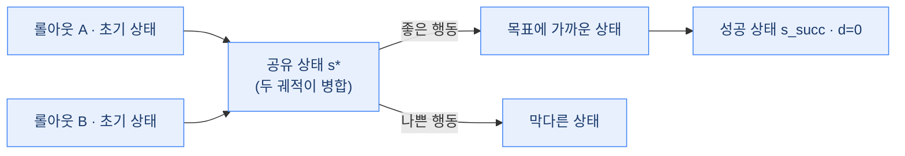
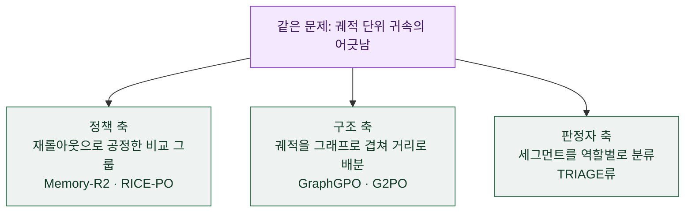

## 오늘의 한 편

Xin Cheng·Shuo He·Lang Feng·HaiYang Xu·Ming Yan·Lei Feng·Bo An, *Beyond Trajectory-Level Attribution: Graph-Based Credit Assignment for Agentic Reinforcement Learning* ([arXiv:2605.26684](https://arxiv.org/abs/2605.26684), ICML 2026, Nanyang Technological University·Alibaba Tongyi Lab·Southeast University). 26페이지 원문 중 본문과 증명, 구현 세부까지 16페이지를 짚어 가며 통독한 뒤 이 노트를 엽니다. 아래에서는 논문 표기를 따라 GraphGPO라 부를게요.

이 논문이 겨냥하는 급소는 한 줄로 세울 수 있어요. GRPO 같은 group-based RL은 궤적 전체의 성공·실패로만 공을 나눠요 — 성공한 궤적의 모든 스텝은 긍정 credit을, 실패한 궤적의 모든 스텝은 부정 credit을 받죠. 저자들의 표현으로는, 각 스텝의 품질을 "그 스텝이 속한 궤적의 최종 성공 또는 실패로부터만 추론할 수 있다"[^assume]는 암묵적이고 제약적인 가정이에요. 문제는 이 가정이 실측으로 무너진다는 데 있어요.

짚어 둘 결이 있어요. 이 급소는 새로 발명된 게 아니에요. 신용 배분은 강화학습에서 가장 오래된 물음 축에 들어요 — Minsky가 1961년에 성공·실패의 공을 어느 행동에 돌릴지 가리는 문제로 이름 붙인 이래, 시간적 신용 배분(temporal credit assignment)이라는 이름으로 TD 학습과 가치 함수의 척추를 이뤄 왔죠. GRPO 계열은 여기서 값비싼 critic을 덜어 내고 그룹 안 상대 비교로 baseline을 대신한 절약인데(PPO에서 갈라져 DeepSeek 계열이 다듬은 계보예요), 그 절약의 대가로 신용의 해상도가 궤적 한 덩어리로 거칠어졌어요. 그러니 GraphGPO가 던지는 물음은 실은 오래된 물음의 최신판이에요 — critic을 되들이지 않고도 스텝 단위 해상도를 되찾을 수 있는가.[^lineage]

## 왜 골랐나

어제(07-16) Memory-R2 글을 닫으며 다음 읽을 후보 맨 앞에 정확히 이 논문을 올려 뒀어요. 그때 남긴 이유는 이랬죠 — 재롤아웃이라는 추가 표본 없이 그래프 구조만으로 정말 같은 수준의 공정성에 닿는지, 그래서 Memory-R2의 국소 재롤아웃이 치르는 추가 샘플링 비용이 정당한지를 가를 렌즈라고요.

오늘 원문을 열고 보니 그 물음은 "예/아니오"로 닫히지 않아요. 오히려 물음의 틀 자체를 다시 잡아야 했어요. 뒤에서 자세히 풀겠지만, GraphGPO의 그래프 병합은 애초에 Memory-R2가 푸는 문제 — 메모리 조작이 롤아웃마다 다른 중간 상태를 만들어 그룹 비교를 무너뜨리는 상황 — 를 겨냥하지 않거든요. 두 논문은 같은 표어("궤적 단위 귀속이 어긋나 있다") 아래 서 있지만, 그 어긋남이 생기는 원인도, 기대는 전제도 달라요. 그러니 오늘 글은 예고를 갚는 자리라기보다, 예고가 어긋난 지점을 정직하게 짚는 자리에 가까워요.

고른 이유가 하나 더 있어요. 이 문제의식이 최근 몇 주 새 여러 팀에서 거의 동시에 솟아올랐거든요. GraphGPO 한 달 뒤 마이크로소프트 쪽에서 나온 G2PO([arXiv:2606.22995](https://arxiv.org/abs/2606.22995))는 배치 안 궤적들의 같은 관측을 그래프로 병합해 상태-가치를 추정한다는, 거의 동일한 착상이에요. 판정자 LLM으로 세그먼트를 네 종류로 분류하는 TRIAGE([arXiv:2606.32017](https://arxiv.org/abs/2606.32017)), 상태별 과거 성공률을 누적해 스텝 credit을 주는 3SPO([arXiv:2606.09961](https://arxiv.org/abs/2606.09961)), 고정 참조 모델의 로그확률을 상태 가치로 삼는 TRACE([arXiv:2607.13988](https://arxiv.org/abs/2607.13988))까지, 같은 출발점에서 서로 다른 해법으로 갈라져 나가는 중이에요. 한 착상이 여러 곳에서 독립적으로 재발명될 때는, 그 착상이 어디서 무너지는지를 봐 두는 게 오히려 더 값져요.

## 핵심 세 가지

### 1. 배치의 모든 궤적을 하나의 상태-전이 그래프로 겹치다

GraphGPO의 중심 장치예요. 한 학습 배치(그룹) 안에서 뽑힌 여러 롤아웃 궤적을 서로 독립된 실로 두지 않고, 하나의 **통합 상태-전이 그래프**로 합쳐요. 노드는 상태(지금까지의 프롬프트·이력), 엣지는 행동에 의한 전이예요. 핵심은 **같은 상태를 하나의 노드로 병합**한다는 점이에요 — 서로 다른 두 롤아웃이 우연히 같은 상태를 거치면, 그래프 안에서는 그 상태가 하나의 노드로 합쳐지죠.

읽는 법은 이래요. 궤적 하나만 보면 어떤 상태가 성공으로 가는 길목인지 알 수 없어요. 그런데 여러 궤적을 겹쳐 놓으면, 어떤 상태에서 갈라진 두 행동 중 하나는 성공으로, 다른 하나는 막다른 곳으로 이어졌다는 게 그래프 위에서 드러나요. 병합된 노드가 바로 그 갈림목이에요.

이 그래프 위에서 저자들은 거리 함수 $$d(s)$$를 정의해요. 어떤 상태 $$s$$에서 목표 상태 $$s_\text{succ}$$까지 도달하는 데 드는 최소 비용, 즉 그래프 최단 경로예요(Dijkstra로 계산). 목표까지의 거리를 상태의 값어치로 삼는 발상 자체는 목표 지향 계획에서 오래 굴러온 휴리스틱이지만, 여기서 새로운 건 그 거리를 미리 주어진 지도가 아니라 롤아웃들이 우연히 그린 지형에서 뽑아낸다는 점이에요. $$d(s)=0$$이면 그 상태는 성공에 닿아 있고, $$d(s)$$가 무한대 — 실무적으로는 그래프 내 최대 거리에 1을 더한 $$d_\text{max}+1$$로 치환 — 면 그 상태에서는 성공으로 가는 길이 그래프 안에 없다는 뜻이에요. 한 상태의 값어치를 그 상태 자신의 최종 결과가 아니라, 여러 궤적이 함께 그려 준 지형 위에서의 위치로 매기는 거죠.

### 2. 목표에 가까워진 만큼 공을 주는 보상, 그것도 재롤아웃 없이

거리가 정해지면 보상은 자연스럽게 따라와요. 전이 $$(s,a,s')$$에 대해 그래프 기반 보상은

$$R^G(s,a,s') = r_\text{succ} \cdot \omega^{d(s')+c(s,a)}$$

로 매겨져요. 읽는 법은 이래요 — 전이 뒤의 상태 $$s'$$가 목표에 가까울수록(거리 $$d(s')$$가 작을수록) $$\omega$$의 지수가 작아지고, $$0<\omega<1$$이니 보상은 커져요. 한 스텝의 공을 "그 스텝이 목표까지의 거리를 얼마나 줄였는가"로 환산하는 셈이죠. $$c(s,a)$$는 그 전이 자체의 비용이고요. 이 신호가 있으면, 실패한 궤적 안에서도 목표에 다가선 스텝은 긍정 credit을, 성공한 궤적 안에서도 헛돈 스텝은 낮은 credit을 받아요.

곁들여 짚어 둘 게 있어요. "목표까지의 거리를 신호 삼아 스텝마다 보상을 빚는다"는 발상 자체는 강화학습에서 뿌리가 깊어요. Ng·Harada·Russell이 1999년에 정식화한 퍼텐셜 기반 보상 성형(potential-based reward shaping)이 바로 그 계보인데, 어떤 상태의 퍼텐셜 $$\Phi(s)$$를 정해 그 차분 $$\gamma\Phi(s')-\Phi(s)$$을 보상에 얹으면 최적 정책을 바꾸지 않으면서 학습을 앞당길 수 있다는 결과였죠. GraphGPO의 $$\omega^{d(s')}$$는 그 퍼텐셜 자리에 그래프 최단경로 거리를 앉힌 것으로 읽혀요 — 함수 꼴은(덧셈 차분이 아니라 곱셈 감쇠라) 다르고, 목적도 정책 불변이 아니라 궤적 단위로 뭉개진 신용을 스텝별로 되살리는 쪽이지만요. 같은 오래된 발상이 다른 일을 하도록 놓인 자리를 보는 게, 나는 이 논문에서 제일 재밌었어요.[^shaping]

이 대목이 왜 필요한지는 저자들의 실측이 분명하게 보여 줘요. ALFWorld에서 재 보니, 실패한 궤적의 스텝 중 약 22.0%는 실제로는 과제를 진전시킨 스텝이었고, 성공한 궤적의 스텝 중 약 65.3%는 과제를 의미 있게 진전시키지 못한 스텝이었어요[^stat]. 성공했다고 모든 행동이 좋았던 게 아니고, 실패했다고 모든 행동이 나빴던 게 아니라는 거죠. 궤적 단위 귀속은 이 절반 넘는 스텝에 틀린 부호를 매기고 있었던 거예요.

그리고 여기 이 방법의 가장 실용적인 매력이 있어요. 이 그래프는 **재롤아웃 없이** 지어져요. 추가 샘플링을 하는 게 아니라, 기존 배치 안의 궤적들이 우연히 공유하는 상태만으로 병합 그래프를 만들거든요. 논문이 보고한 오버헤드는 그래프 구성 0.108초, 어드밴티지 계산 0.025초로, 전체 롤아웃에 드는 216.9초에 견주면 무시할 만한 수준이에요[^cost]. 어제 Memory-R2가 세션마다 $$m$$개의 국소 재롤아웃을 새로 굴려 공정한 비교 그룹을 지었던 것과 정확히 갈리는 지점이에요 — 한쪽은 표본을 더 뽑아 공정성을 사고, 다른 쪽은 이미 뽑은 표본의 겹침을 재활용해 공정성을 얻어요.

### 3. 두 개의 이론적 보장, 그리고 그것이 기댄 전제

GraphGPO는 이 보상이 그저 그럴듯한 휴리스틱이 아니라는 걸 두 명제로 받쳐요.

첫째는 단조성이에요(Proposition 4.1). 결정론적 환경에서 어떤 상태 $$s$$가 목표에 닿을 수 있다고 할 때, 목표에 더 가까워지는 행동 $$a_\text{good}$$은 덜 가까워지는 행동 $$a_\text{bad}$$보다 항상 더 높은 graph-based advantage를 받는다는 걸 증명해요. 즉 $$A^G(s,a_\text{good},s'_\text{good}) > A^G(s,a_\text{bad},s'_\text{bad})$$가 성립하죠. 좋은 행동에 더 큰 공을 준다는 직관이 정리로 보장되는 거예요.

둘째는 조건부 분산 감소예요(Proposition 4.2). 여기가 이 방법의 뼈대를 드러내는 대목이에요. 저자들의 논증은 이렇게 흘러요 — 환경이 결정론적이면 경험적으로 지은 그래프도 결정론적이고, 따라서 후속 상태 $$s'$$도, 그로부터 나오는 피드백 $$X^G$$도 결정론적이니 그 조건부 분산은 0이 된다[^prop42]. 그래서 궤적 전체의 결과에 의존하는 기존 스텝 피드백 $$X^S$$와 견주면

$$\mathrm{Var}(X^G \mid s,a,s') \le \mathrm{Var}(X^S \mid s,a,s')$$

가 성립해요. 같은 상태-행동-다음상태 조합이라면 그래프 기반 신호가 언제나 분산이 낮거나 같다는 뜻이죠.

그런데 바로 이 증명의 첫 문장에 오늘의 '그러나'가 숨어 있어요. **"환경이 결정론적이면"** 이 전제가 무너지면 어떻게 될까요. 저자들 자신이 Appendix D.3에서 그 실험을 해요. WebShop 상태에 무작위 광고 텍스트를 주입해 같은 상태를 같은 노드로 판정하기 어렵게 만들면, 성공률이 78.65에서 75.27로 떨어져요. 저자들은 이 극단 — 그래프가 희소해지는 상황 — 에서 GraphGPO가 사실상 GRPO로 퇴화한다고 명시하고, 임베딩 기반 유사도 매칭으로 견고성을 회복해야 한다고 밝혀요. 이건 이 방법 전체가 "여러 롤아웃이 실제로 같은 상태를 재방문한다"는 전제 위에 서 있다는 뜻이에요. 노드 병합이 안 되면 그래프는 궤적별로 쪼개진 나무들이 되고, 겹침에서 나오던 이득이 통째로 사라지죠.

이 한계는 GraphGPO가 물려받은 것이기도 해요. 선행 연구 GiGPO([arXiv:2505.10978](https://arxiv.org/abs/2505.10978), NeurIPS 2025)가 이미 "같은 상태에서 출발하는 스텝들을 그룹으로 묶어 스텝 단위 어드밴티지를 추정"하는 착상을 냈고, GraphGPO는 이걸 그래프 전역의 최단경로 거리로 넓힌 거예요. 그런데 GiGPO 저자들도 자기 논문의 Limitations에서, 복잡한 환경에서는 노이즈나 미세한 차이 때문에 같은 상태를 판별하기 어려울 수 있다고 먼저 인정했었어요. GraphGPO는 그 한계를 그래프로 덜어 내려 했지만, D.3이 보여 주듯 없애지는 못했어요. 그래서 나는 이 방법을 "durable한 해법"이라기보다 **상태 공간의 구조에 기댄 해법**으로 읽어요 — 구조가 결정론적이고 재방문이 잦은 환경에서 강하고, 그 구조가 흐려지면 GRPO로 되돌아가는.

### 실험이 말해 주는 것

그 전제가 성립하는 환경에서는 이득이 뚜렷해요. ALFWorld·WebShop(텍스트, Qwen2.5-1.5B/7B)과 Sokoban(비전-언어, Qwen2.5-VL-3B)에서 GRPO·GiGPO 대비 일관되게 개선돼요. Sokoban에서 개선폭이 가장 커서, GRPO 대비 +19.88%p, GiGPO 대비 +10.06%p였어요(86.98 대 67.1 대 76.92). ALFWorld 평균 성공률은 1.5B에서 GRPO 77.86이 GraphGPO 92.71로 올랐고, 7B에서도 비슷하게 개선됐고요[^main]. 결정론이 잘 지켜지고 상태가 자주 재방문되는 격자·텍스트 과제일수록, 궤적을 겹쳐 얻는 지형 정보가 그만큼 실하게 들어온다는 이야기예요.

곁가지로 하나 더 놓아 둘게요. 같은 문제의식을 완전히 다른 축에서 잡은 RICE-PO([arXiv:2605.26352](https://arxiv.org/abs/2605.26352))는, 검색 상호작용에서 직접 채점 가능한 행동(생성 쿼리·요약)과 관측할 수 없는 추론 스텝 사이의 비대칭에 주목해요. GraphGPO가 기존 배치의 겹침을 재활용하는 것과 달리, RICE-PO는 정책 불확실성이 높은 지점을 앵커로 골라 같은 이력에서 **국소 반사실적 분기**를 새로 만들어 검색 지표로 채점하고, 미래 잔차 효과가 안정적일 때만 그 공을 앞선 추론 스텝으로 전파해요. "기존 구조를 재사용한다"와 "국소 반사실을 새로 만든다"가 같은 문제에 놓인 또 다른 갈림이에요.

## 내 연구에 어떻게 맞물리나

큰 그림 하나가 다시 맞아떨어져요. 얼마 전 며칠에 걸쳐 세워 둔 물음 중에 "정합성은 정책인가 구조인가"가 있었어요. RL 보상만으로는 의존성의 사슬을 못 잡고, 출처를 잇는 명시적 구조를 세워야 다단계 신용 배분이 살아나더라는 관찰에서 나온 축이었죠. 어제 Memory-R2 글에서도 두 논문을 그 축의 양 끝에 얹었는데, 오늘 원문을 열고 보니 이 물음이 메모리 정합성에만 걸린 게 아니라 **신용 배분 그 자체**에서도 똑같이 되풀이되고 있다는 게 보여요.

GraphGPO는 그 축의 구조 쪽 극에 다시 앉아요. 학습된 정책으로 공을 배우는 대신, 궤적들을 한 그래프로 겹쳐 그 구조가 매기는 거리 감소량으로 credit을 나누니까요. 판정자 LLM으로 세그먼트를 역할별로 가르는 TRIAGE류는 또 다른 축이고요. 같은 어긋남을 두고 세 방향이 서 있는 셈이에요.

그런데 여기서 어제 남긴 예고를 정직하게 되짚어야 해요. 어제 나는 GraphGPO를 "재롤아웃 없이 같은 공정성에 닿는 길"로 세워, Memory-R2의 재롤아웃 비용을 저울질할 렌즈로 기대했어요. 오늘 원문이 그 기대에 조건을 달아요.

GraphGPO의 실험 환경 — ALFWorld·WebShop·Sokoban — 은 메모리 증강이나 다세션 에이전트가 아니에요. 하나의 태스크 인스턴스에 대해 $$M$$개의 병렬 롤아웃이 결정론적 환경에서 자연스럽게 겹치는 상황이죠. 노드 병합이 성립하려면 "같은 행동 이력 → 같은 상태"가 지켜져야 하는데, Memory-R2가 지목한 바로 그 현상 — 메모리 연산이 롤아웃마다 다른 중간 상태를 만든다는 것 — 은 이 전제를 정면으로 깨뜨려요. 그러니 그래프 재사용이 재롤아웃 없이도 통하는 건 상태가 재방문되는 결정론적 세팅에 한해서고, Memory-R2의 문제로 그대로 옮겨 가면 그래프는 궤적별로 쪼개진 나무가 되어 도로 GRPO로 — D.3 노이즈 실험이 보여 준 바로 그 퇴화로 — 돌아가요.

이건 원문 어디에도 쓰여 있지 않은, 내가 오늘 두 논문을 겹쳐 놓아 얻은 개념적 연결이라 잠정(⚠)으로 남겨 둬요. 다만 근거가 없는 상상은 아니에요 — GraphGPO의 노드 병합 전제와 Memory-R2의 상태 분기 문제를, 각 원문이 명시한 그대로 포개 놓은 것이거든요. 두 논문이 같은 표어를 쓴다고 같은 문제를 푸는 건 아니라는 것, 그리고 "재롤아웃이 필요한가"라는 물음의 답이 환경의 구조에 통째로 매여 있다는 것 — 어제 열어 둔 물음의 답은 "그때그때 다르다"이고, 그 '그때그때'를 가르는 게 상태가 재방문되느냐라는 거예요.

그러니 방향도 한 겹 잡혀요. 내 쪽 관찰은 단일 보상만으로는 부족해 명시 구조가 필요했다는 쪽이었으니, 구조(그래프)가 이기는 자리는 결정론이 지켜지는 곳이고, 그 결정론이 흐려지는 자리 — 메모리 조작이든 확률적 웹 탐색이든 — 에서는 다시 정책이나 판정자를 들여야 한다는 도메인 의존성이 갈라 볼 지점이에요.

## 편집자에게 (pheeree)

먼저 무엇을 원문으로 눌렀고 무엇을 못 눌렀는지 적어 둘게요. GraphGPO 본문은 16페이지를 통독해 그래프 병합·거리 함수·그래프 기반 보상·두 명제·실험 수치·Appendix D.3 노이즈 실험까지 대조했어요. Abstract와 Introduction의 핵심 가정, §4.1의 스텝 통계는 원문 영어 verbatim으로 각주에 승급했고요. 반면 오늘 '왜 골랐나'와 세 축 비교에 끌어온 G2PO·TRIAGE·3SPO·TRACE·CRAFT와 서베이는 2차 요약 기준이라 따옴표 없이 위치·의역으로만 인용했어요. GiGPO의 Limitations도 2차 요약(△)이라 마찬가지고요.

계보로 끌어온 배경도 밝혀 둘게요. 신용 배분을 Minsky(1961)의 오래된 물음으로, GRPO를 PPO→DeepSeek 계보의 절약으로 세운 것, 그리고 거리 기반 보상을 Ng·Harada·Russell(1999)의 퍼텐셜 기반 보상 성형 계보로 읽은 것은 모두 교과서적 배경 지식이라 verbatim 없이 의역으로만 적었어요(△). 특히 성형과의 연결은 함수 꼴도 목적도 달라, 원문이 명시하지 않은 내 개념적 연상(⚠)이에요 — GraphGPO를 그 계보의 변주로 읽으면 무엇이 새로운지가 선명해져서 놓아 뒀어요.

특히 조심해 둘 대목. Appendix D.3의 수치(78.65→75.27)는 이 노트를 준비하며 받은 값을 옮긴 것이지 내가 그 표를 원문 PDF에서 직접 눈으로 확인한 건 아니에요. 그래서 따옴표 없이 의역으로만 적었어요. 그리고 "정책·구조·판정자 세 축"에 오늘 논문들을 얹은 것, GraphGPO의 병합 전제가 Memory-R2의 상태 분기에서 깨진다는 연결은 원문 주장이 아니라 내 개념적 연상이라 ⚠로 남겨요.

우선순위를 매겨 다음 후보 셋을 내려놓을게요.

- **G2PO** ([arXiv:2606.22995](https://arxiv.org/abs/2606.22995)) — 1순위. GraphGPO와 거의 같은 착상이 한 달 뒤 독립적으로 나온 사례예요. 배치 내 관측을 그래프로 병합해 상태-가치를 추정하고 TD 오차를 그래프 전역에서 표준화한다는데, "거리 최단경로"와 "가치 함수" 중 무엇을 그래프에 얹느냐가 두 논문을 가르는 자리라 원문으로 대 볼 만해요.
- **TRACE** ([arXiv:2607.13988](https://arxiv.org/abs/2607.13988)) — 2순위. 같은 출발점에서 그래프 거리 대신 고정 참조 모델의 로그확률을 상태 가치로 삼는 해법이에요. 그래프 병합이 필요 없으니, 오늘 짚은 "재방문이 없으면 퇴화한다"는 약점을 우회하는지가 렌즈. BrowseComp-Plus에서 Qwen3-4B를 7.2에서 35.6으로 올렸다는 보고라 확률적·부분관측 환경에서의 거동도 함께 볼 수 있어요.
- **HCAPO 등 privileged-critic 계열** ([arXiv:2603.08754](https://arxiv.org/abs/2603.08754)) — 3순위. 한 서베이가 확률적·부분관측 웹 탐색(WebArena류)에는 그래프 재사용 대신 privileged-critic을 권한다고 정리했어요. "결정론이 흐려지는 자리에서는 critic을 다시 들여야 한다"는 오늘의 도메인 의존성을, 원문으로 확인할 자리예요.

여담 하나. 오늘 가장 오래 남은 건 개선폭 수치가 아니라, 예고가 어긋난 방식이에요. 어제 나는 이 논문을 "재롤아웃 비용을 저울질할 렌즈"로 걸어 뒀는데, 막상 열어 보니 저울의 한쪽 접시가 다른 문제를 재고 있었어요. 같은 표어 아래 있다는 이유로 두 논문을 같은 저울에 올렸던 거죠. 미리 세운 대조가 원문 앞에서 이렇게 굽는 걸 보는 게, 초록만으로 잇던 후보가 원문에서 살아남는 걸 확인하는 것만큼이나 값진 하루였어요.

---

**발행 전 점검:** 중심 논문 GraphGPO는 원문 PDF 16페이지를 통독해 통합 상태-전이 그래프와 노드 병합·거리 함수 $$d(s)$$(Dijkstra 최단경로)·그래프 기반 보상 $$R^G=r_\text{succ}\cdot\omega^{d(s')+c(s,a)}$$·두 명제(단조성 4.1, 조건부 분산 감소 4.2)·오버헤드 수치·Appendix D.3 노이즈 실험을 대조했고, Abstract·Introduction의 핵심 가정과 §4.1 스텝 통계(22.0%/65.3%)는 원문 영어 verbatim으로 승급했습니다. 실험 수치(Sokoban·ALFWorld 개선폭)는 원문 위치를 인용하되 개별 verbatim은 옮기지 않았습니다. Appendix D.3의 78.65→75.27은 본 노트 준비 자료에서 받은 값이라 따옴표 없이 의역으로만 적었습니다. 신용 배분의 계보(Minsky 1961·PPO→GRPO)와 퍼텐셜 기반 보상 성형(Ng et al. 1999)은 교과서적 배경 지식이라 verbatim 없이 의역으로만 적었고(△), 거리 기반 보상을 성형 계보의 변주로 읽은 것은 원문이 명시하지 않은 내 개념적 연상(⚠)입니다. 곁가지 RICE-PO는 초록 대조(△), 동향의 G2PO·TRIAGE·3SPO·TRACE·CRAFT와 GiGPO Limitations·서베이는 2차 요약 기준(△)이라 위치·의역으로만 인용했습니다. "정책·구조·판정자 세 축"에 오늘 논문들을 얹은 것과, GraphGPO의 병합 전제가 Memory-R2의 상태 분기에서 깨져 GRPO로 퇴화한다는 연결은 원문 주장이 아니라 내 개념적 연상이라 ⚠로 남깁니다. 내부 코드베이스·프로젝트 고유명은 밝히지 않고 원리 수준으로만 옮겨 적었습니다.

{:.claim-ledger}

| 주장 | 출처 | 상태 |
|------|------|------|
| group-based RL은 각 스텝 품질을 궤적의 최종 성공·실패로만 추론한다는 제약적 가정에 기댄다 | GraphGPO §Abstract·§Intro verbatim | ✓ |
| 신용 배분은 RL의 오래된 문제(Minsky 1961 명명·temporal credit assignment), GRPO는 PPO→DeepSeek 계보로 critic을 그룹 상대 baseline으로 대체 | 배경 지식·2차 요약 | △ |
| ALFWorld 실측: 실패 궤적 스텝의 약 22.0%가 진전 기여, 성공 궤적 스텝의 약 65.3%가 무진전 | GraphGPO §4.1 verbatim | ✓ |
| 배치 내 모든 롤아웃을 하나의 상태-전이 그래프로 병합, 같은 상태는 한 노드로 합침 | GraphGPO 본문 대조 | ✓ |
| 거리 함수 $$d(s)$$=목표까지 그래프 최단경로(Dijkstra), 도달 불가 시 $$d_\text{max}+1$$로 치환 | GraphGPO 본문 대조 | ✓ |
| 그래프 기반 보상 $$R^G(s,a,s')=r_\text{succ}\cdot\omega^{d(s')+c(s,a)}$$, 재롤아웃 없이 기존 배치의 겹침만으로 구성 | GraphGPO 본문 대조 | ✓ |
| 거리 기반 보상을 퍼텐셜 기반 보상 성형(Ng et al. 1999) 계보의 변주로 읽음(함수 꼴·목적 상이) | Ng et al. 1999는 배경 지식(△), GraphGPO와의 연결은 원문 주장 아님·내 개념적 연상 | ⚠ |
| 오버헤드: 그래프 구성 0.108초·어드밴티지 0.025초 대 전체 롤아웃 216.9초 | GraphGPO Fig.5 대조 | ✓ |
| Prop 4.1 단조성: 목표에 더 가까워지는 행동이 항상 더 높은 graph-based advantage | GraphGPO §4.3 대조 | ✓ |
| Prop 4.2: 결정론적 환경 → 그래프·피드백 결정론적, $$\mathrm{Var}(X^G\mid s,a,s')\le\mathrm{Var}(X^S\mid s,a,s')$$ | GraphGPO §B.2 verbatim | ✓ |
| Sokoban GRPO 대비 +19.88%p·GiGPO 대비 +10.06%p(86.98/67.1/76.92), ALFWorld 1.5B 77.86→92.71 | GraphGPO 본문 대조 | ✓ |
| Appendix D.3: WebShop 노이즈 주입 시 상태 매칭 실패로 78.65→75.27, 임베딩 매칭으로 회복, 극단에서 GRPO로 퇴화 | 준비 자료 수치, 원문 위치 의역 | △ |
| GiGPO Limitations: 복잡 환경에서 노이즈·미세 차이로 동일 상태 판별 곤란 | 2차 요약 | △ |
| RICE-PO: 검색 상호작용의 채점 가능 행동 대 관측 불가 추론의 비대칭, 국소 반사실 분기 | 곁가지 초록만 대조 | △ |
| G2PO·TRIAGE·3SPO·TRACE·CRAFT·서베이 등 동향·도메인 의존성 | dossier 2차 요약 | △ |
| "정책·구조·판정자 세 축"에 오늘 논문들을 얹은 것 | 원문 주장 아님, 내 개념적 연상 | ⚠ |
| GraphGPO의 노드 병합 전제가 Memory-R2의 상태 분기 문제에서 깨져 GRPO로 퇴화한다는 연결 | 원문 주장 아님, 내 개념적 연상 | ⚠ |

[^assume]: "Although existing group-based RL methods have shown promising performance in multi-turn agentic tasks, they rely on an implicit but restrictive assumption: the quality of each step can be inferred solely from the final success or failure of the trajectory it belongs to." — Cheng et al., *GraphGPO*, §Introduction(arXiv:2605.26684). Abstract도 같은 문제의식을 이렇게 엽니다: "their credit assignment relies heavily on coarse-grained trajectory-level attribution according to final outcomes, making it difficult to capture the contribution of individual steps, such as valuable steps obscured within failed trajectories." 원문 PDF 통독으로 대조(✓).

[^lineage]: 신용 배분 문제의 계보 — Minsky, "Steps Toward Artificial Intelligence"(1961)에서 credit-assignment problem을 명명한 이래, 시간적 신용 배분(temporal credit assignment)이라는 이름으로 TD 학습·가치 함수의 토대가 되었습니다. GRPO 계열은 PPO(Schulman et al. 2017)에서 갈라져 DeepSeek 계열이 critic 없이 그룹 상대 baseline으로 다듬은 절약입니다. 모두 배경 지식·2차 요약 기준이며 GraphGPO 원문 verbatim이 아닙니다(△).

[^shaping]: 퍼텐셜 기반 보상 성형 — Ng·Harada·Russell, "Policy Invariance Under Reward Transformations"(ICML 1999). 퍼텐셜 $$\Phi(s)$$의 차분 $$\gamma\Phi(s')-\Phi(s)$$을 보상에 얹어도 최적 정책이 불변임을 보였습니다. Ng et al. 1999 자체는 배경 지식(△)이고, GraphGPO의 거리 기반 보상($$\omega^{d(s')}$$은 덧셈 차분이 아닌 곱셈 감쇠, 목적도 정책 불변이 아님)을 이 계보의 변주로 읽은 것은 원문이 명시하지 않은 내 개념적 연상입니다(⚠).

[^stat]: "Figure 1 presents step-level statistics, showing that approximately 22.0% of the steps in failed trajectories contribute to task progress, whereas about 65.3% of the steps in successful trajectories do not meaningfully advance the task." — Cheng et al., *GraphGPO*, §4.1(arXiv:2605.26684). 원문 verbatim, 통독 대조(✓).

[^cost]: 그래프 구성 0.108초, 어드밴티지 계산 0.025초 대 전체 롤아웃 216.9초는 Cheng et al., Figure 5에서 대조. 원문 PDF 통독 기준, 위치 인용이며 개별 수치의 영어 verbatim은 옮기지 않았습니다(✓).

[^prop42]: Proposition 4.2 논증의 핵심 문장: "Since the environment is deterministic, the empirical graph is deterministic. The successor state $$s'$$ and thus the feedback $$X^G$$ are deterministic. Therefore $$\mathrm{Var}(X^G\mid s,a,s')=0$$." 이로부터 결론 $$\mathrm{Var}(X^G\mid s,a,s')\le\mathrm{Var}(X^S\mid s,a,s')$$가 따라옵니다. — Cheng et al., *GraphGPO*, §B.2(arXiv:2605.26684). 원문 verbatim(수식 기호는 마크업 규칙에 맞춰 옮김), 통독 대조(✓).

[^main]: Sokoban에서 GraphGPO 86.98 대 GRPO 67.1 대 GiGPO 76.92(각각 +19.88%p·+10.06%p), ALFWorld 평균 성공률(All) 1.5B에서 GRPO 77.86→GraphGPO 92.71, 7B에서도 유사 개선은 Cheng et al.의 실험 표에서 대조. 벤치마크는 ALFWorld·WebShop(Qwen2.5-1.5B/7B)과 Sokoban(Qwen2.5-VL-3B). 원문 PDF 통독 기준, 위치 인용(✓).
