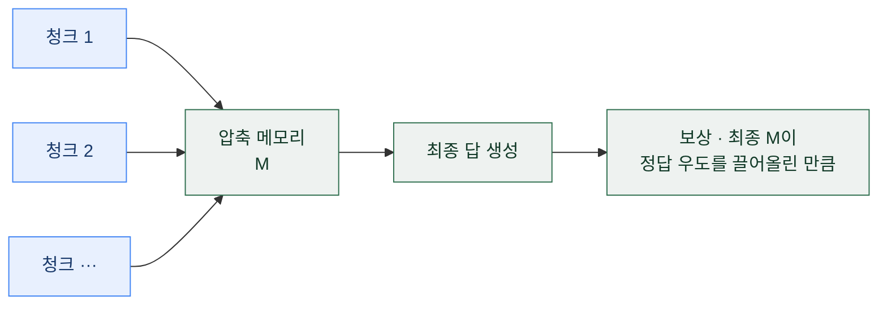
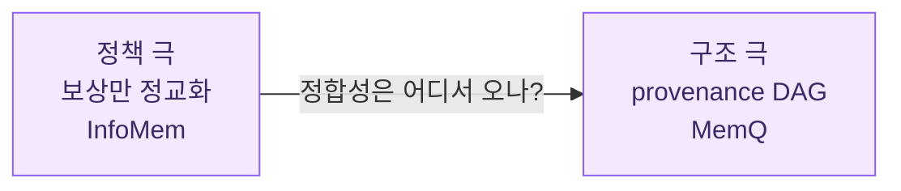
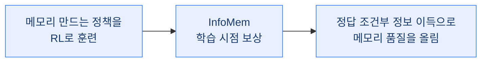
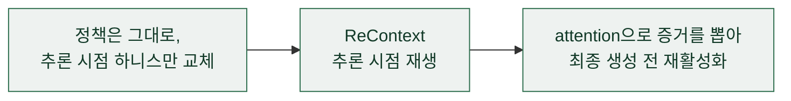

## 오늘의 한 편

Tiancheng Han·Yong Li·Wuzhou Yu·Qiaosheng Zhang·Wenqi Shao 외, InfoMem ([arXiv:2606.03329](https://arxiv.org/abs/2606.03329), 2026-06, Tongji University·Shanghai Innovation Institute·Shanghai AI Laboratory). 장문맥을 청크 단위로 훑으며 압축 메모리를 갱신하는 에이전트를 강화학습으로 훈련하는데, 보상을 "최종 메모리가 정답을 얼마나 뒷받침하는가"로 직접 재는 논문이에요.

문제의식은 성공한 궤적들 사이의 틈에서 출발해요. 청크-단위 메모리 에이전트는 문서를 순차로 읽으며 메모리를 눌러 담고, 마지막 메모리에서 답을 뽑아요. 기존 RL은 여기에 두 가지 보상을 걸었죠 — 정답이 맞았는지만 보는 성긴 결과 보상(sparse outcome reward), 또는 단어 단위 회수율을 재는 어휘적 중간 보상(ReMemR1 계열). 그런데 둘 중 어느 것도 최종 메모리가 정답을 *의미적으로* 얼마나 지지하는지는 재지 않아요. 같은 정답을 낸 두 궤적을 나란히 세워 봐요. 하나는 핵심 증거만 깔끔히 남겼고, 다른 하나는 같은 증거에 잡음을 잔뜩 얹고도 운 좋게 같은 답을 뱉었어요. 결과 보상은 이 둘을 똑같이 1점으로 뭉개 버려요. InfoMem은 바로 이 품질 차이에 신호를 걸겠다는 거예요.

계보를 한 줄 짚어 둘게요. "관측 하나가 정답에 관해 얼마나 더 말해 주는가"를 정보 이득(information gain)으로 재는 발상은 결정 트리의 분기 기준부터 능동 학습의 기대 정보 이득까지 오래 굴러온 렌즈예요. 정답을 조건으로 두고 로그우도의 차를 재는 형태는 자연어 처리의 점별 상호정보량(pointwise mutual information)과도 닮았고요. InfoMem이 새로 하는 일은 이 고전적 척도를 *보상 함수*의 자리로 옮겨 앉힌 것이라고 읽으면 결이 잡혀요.

## 왜 골랐나

오늘 픽이 내려온 길부터 적어요. 어제 커리큘럼 글의 다음 후보 목록은 셋이었어요 — 1순위 s3, 2순위 InfoMem, 3순위 검색·보상·훈련 프로토콜 논문. 그런데 1순위 s3([arXiv:2505.14146](https://arxiv.org/abs/2505.14146))는 아직 인벤토리에 도착하지 않았어요. 손에 잡힌 건 2순위였던 오늘 논문 — PDF까지 확보돼 있었죠. 그러니 오늘 자리는 예고 1번을 건너뛰고 2번에서 이어졌어요.

고른 이유는 어제 스스로 남긴 숙제 때문이에요. 어제 나는 본문의 '그러나'를 세우려고 s3와 InfoMem을 초록만 보고 "보상 축이 데이터 축을 이긴다"는 반대 극으로 끌어왔어요. 그러곤 편집자에게 이렇게 적어 뒀죠.

> 오늘 본문의 '그러나'를 지탱한 s3·InfoMem은 초록만 봤어요. "보상 축이 데이터 축을 이긴다"는 주장의 실제 조건을 알려면 두 원문을 열어야 해요.

오늘이 그 원문을 여는 자리예요. 초록 수준에서 대립처럼 보이던 주장이, 본문을 열면 실제로 무엇을 보이고 어디서 조건이 붙는지 — 그걸 확인하려고 InfoMem을 먼저 폈어요.

## 핵심 세 가지

### 1. 이상은 조건부 상호정보량, 실물은 한 점의 대리량

정보이론적 이상은 조건부 상호정보량 $$I(M;Y\mid X)$$예요 — 쿼리 $$X$$를 아는 상태에서 메모리 $$M$$이 정답 $$Y$$에 관해 얼마나 더 말해 주는가. 그런데 분포 수준의 상호정보량은 추정이 까다로워요. 그래서 InfoMem은 이를 한 점(point-wise)에서의 대리량으로 바꿔 잡아요[^rgain].

$$
r_{\text{gain}}(x, M, y^*) = \frac{1}{\lvert y^*\rvert}\log P_\theta(y^* \mid x, M) - \frac{1}{\lvert y^*\rvert}\log P_\theta(y^* \mid x, \emptyset)
$$

말로 한 겹 풀면 이래요. 앞항은 이 메모리가 있을 때 모델이 정답 토큰들에 매기는 평균 로그우도이고, 뒷항은 메모리가 빈칸일 때(null memory)의 평균 로그우도예요. 둘의 차는 "이 메모리가 정답의 우도를 얼마나 끌어올렸는가"를 곧장 잽니다. 회수율처럼 단어가 겹치는지를 세는 게 아니라, 답이 나올 확률을 실제로 밀어 올린 폭을 재는 거죠.

이 척도가 진짜 증거를 골라내는지부터 합성 실험으로 확인해요(Table 1). SQuAD에서 진짜 지지 맥락 하나에, Gemini로 만든 "표면은 비슷한데 사실은 틀린" 환각 맥락 둘을 섞어 놓고, $$r_{\text{gain}}$$과 임베딩 유사도(BGE-M3·E5·Qwen3-Embedding)·attention 기반 점수(Attn-Mass·Attn-Top1)가 진짜를 얼마나 잘 집어내는지 겨뤄요. $$r_{\text{gain}}$$의 MRR 0.977, Z-score SNR 2.960이 전부 최고인데, 특히 신호 대 잡음비는 다음으로 좋은 Attn-Top1(0.577)의 다섯 배가 넘어요[^synth]. 표면 유사도가 환각 맥락에 속는 자리에서, 정답 조건부 우도 차는 흔들리지 않았다는 뜻이에요.

### 2. 세 가지 설계 조건 — 어디에·어떻게·무엇에 조건 걸 것인가

보상의 형태만큼 중요한 게 그걸 *어디에* 거느냐예요. InfoMem의 절제 실험(§6)은 세 결정을 하나씩 떼어 검증해요.

첫째, 성공한 궤적에만 걸어요. 성공 집합 $$\mathcal{S} = \{i : R_{\text{outcome},i}=1\}$$인 궤적에만 $$r_{\text{gain}}$$을 더하고, 실패 궤적은 결과 보상만 받아요. 실패 쪽에도 걸거나(wrong-only) 양쪽에 다 거는 변형은 훈련이 중반에 무너져요(Figure 3) — 실패 궤적은 증거를 잘못 골랐는지 답을 잘못 뽑았는지가 뒤엉켜, 정보 이득이라는 신호 자체가 불안정하기 때문이에요[^successside].

둘째, 결과 보상과 합치기 전에 정규화해요. 같은 롤아웃 그룹 안의 성공 궤적들 사이에서 $$\tilde{r}_i = (r_i - \mu_{\mathcal{S}})/(\sigma_{\mathcal{S}}+\epsilon)$$로 표준화한 뒤에만 더해요. 정규화를 빼면 모든 벤치마크에서 성능이 내려가요(Table 3) — 쉬운 질문과 어려운 질문 사이에서 날 $$r_{\text{gain}}$$의 스케일이 워낙 달라, 그대로 더하면 특정 난이도가 보상을 독식하거든요[^normalize].

셋째, 쿼리가 아니라 정답에 조건 걸어요. 같은 식에서 정답 $$y^*$$ 자리에 쿼리 $$x$$를 넣으면 "메모리가 쿼리를 얼마나 잘 예측하나"를 재는 대조군 QueryPMI가 돼요. 이게 모든 벤치마크에서 InfoMem보다 뚜렷이 나빠요(Table 3). 원인은 Figure 4에 그대로 드러나요 — 훈련이 진행될수록 QueryPMI 아래에서는 최종 메모리가 쿼리를 그대로 되뇌는(query repetition) 롤아웃 비율이 급증해 120스텝 무렵 70%대에 이르는데, InfoMem은 그 비율이 훈련 내내 0%대에 머물러요[^querypmi]. 쿼리를 예측하라는 목적함수를, 모델은 "쿼리를 베껴 쓰면 쉽게 딴다"는 지름길로 풀어 버린 거예요. 전형적인 보상 해킹이죠.

### 3. 결과 — 결과 보상만으로는 오히려 퇴보하는 자리에서

본 실험은 Qwen2.5-1.5B-Instruct 백본에 GRPO(그룹 크기 8), RULER-HotpotQA에서 다운샘플한 512예제로 120스텝(단일 GPU, 약 440 GPU시간)이에요. 작은 규모지만, 네 개 장문맥 벤치마크 전부에서 InfoMem이 최고점을 내요(Table 2)[^table2]. CorpusQA는 초기 14.590에서 InfoMem 19.453(결과 보상만이면 16.413), LongMemEval은 초기 5.600에서 12.800(결과 보상만 10.000), RULER synthetic QA는 초기 13.308에서 36.848(결과 보상만 34.735)이에요.

대비가 사납게 벌어지는 자리는 MRCR-8needle이에요. 초기 모델이 0.260인데, 결과 보상만으로 훈련하면 0.063으로 오히려 초기보다 퇴보해요 — 답만 맞히라는 신호가 여러 바늘을 뒤섞는 과제에서는 메모리를 망가뜨린 거죠. InfoMem은 같은 자리에서 0.279로 초기 위로 올라와요. 어휘 회수 보상 baseline인 ReMemR1은 더 극적으로, CorpusQA에서 1.520까지 붕괴해 초기 14.590에 한참 못 미쳐요. 저자들은 단어 단위 회수율이 어휘 중복은 늘리지만 정답을 의미적으로 뒷받침하는 것과는 다른 축이라고 읽어요[^remem].

그러나 여기서 한 번 멈춰야 해요. 정답에 조건 건 보상이라는 발상은 그 자체가 위험의 씨앗을 품어요. 저자들도 Limitations에서 이 점을 스스로 짚는데, 정답이 애초에 틀렸거나 출처 문서가 편향돼 있으면, InfoMem은 그 틀린 답을 뒷받침하는 오도된 증거를 오히려 보존하고 증폭할 수 있어요. 기대 정답과 강하게 얽힌 메모리로 과최적화되면서, 원문에 있던 중요한 단서 조항을 빠뜨릴 수도 있고요. 저자들은 법률·의료·금융처럼 위험이 높은 장문서 응용에서는 압축 메모리가 원문 검증이나 사람 검토를 대체해선 안 된다고 분명히 밝혀요[^risk]. 이건 부록에 밀어 둘 각주가 아니라 방법 자체의 그림자예요 — 품질을 재는 자를 정답에 묶는 순간, 정답이 오염된 영역에서는 그 자가 오염을 강화하는 쪽으로 돌아서니까요.

이 그림자를 정면으로 세운 반론도 있어요. SSGM([arXiv:2603.11768](https://arxiv.org/abs/2603.11768))은 "메모리의 진화는 메모리의 통치와 분리돼야 한다"고 주장해요. RL 정책 하나가 메모리를 단독으로 통제하면 hallucination cascade와 semantic drift가 누적되고, ground-truth anchoring 없이는 오류가 영구화된다는 거예요. InfoMem이 "최종 스텝의 보상 하나로 메모리를 최적화한다"는 설계와 이 주장은 정면으로 긴장해요. InfoMem의 벤치마크 승리가 512예제·120스텝이라는 통제된 창 안에서의 결과라는 점을 떠올리면, 통치와 진화를 한 정책에 몰아준 구조가 영속 조건에서도 버티는지는 아직 열린 물음이에요.

## 내 연구에 어떻게 맞물리나

내 노트에 오래 걸어 둔 물음 하나가 있어요 — **정합성은 정책인가 구조인가**. RL 보상만으로는 메모리 항목 사이의 의존성 체인을 못 잡고, provenance DAG 같은 명시적 구조가 있어야 다단계 과제에서 실제 이득이 난다는 실증이 쌓여 있었죠. 다단계에서 +5.7pp, 단일 항목에서 +0.77pp라는, 구조적 깊이에 따라 신용이 크게 갈리던 그 수치예요.

InfoMem은 이 물음의 좌표에서 정확히 "정책" 극단에 서요. 구조는 손도 대지 않아요 — 메모리는 여전히 휴리스틱하게 갱신되는 자유형 텍스트고, 항목 사이에 어떤 명시적 의존 그래프도 얹지 않아요. 오직 보상 신호 하나만 정교화해서 품질을 끌어올리죠. 그것도 최종 스텝 한 곳에서만 감독하고, 중간 메모리 상태는 건드리지 않아요(저자들의 세 번째 Limitations가 스스로 인정하는 대목이에요[^limits]). 그러니 오늘의 성공을 어떻게 읽을지가 관건이에요 — "정책만으로 충분하다"는 근거인가, 아니면 최종 스텝 단일 보상이라는 좁은 창 안에서만 성립하는 국소적 승리인가.

07-13에 다룬 MemQ를 나란히 놓으면 경계가 또렷해져요. 그때의 결론을 다시 꺼내면 이랬어요.

> provenance DAG의 구조적 깊이를 따라 신용을 역전파하면, 다단계 과제에서 최대 +5.7pp가 붙는다. 단일 항목 과제에서는 그 이득이 +0.77pp에 그친다.

MemQ가 보여 준 건 구조가 다단계 신용 배분에서 값을 낸다는 거였어요. InfoMem은 반대로 구조 없이 보상만으로, 그러나 최종 스텝에 한정해 값을 냈고요. 두 결과가 충돌하는 게 아니라 서로의 사정거리를 그어 주는 거예요 — InfoMem의 정답 조건부 정보 이득은 "메모리가 답을 지지하는 정도"라는 스칼라 한 축을 정밀하게 재지만, 항목 A가 항목 B의 전제라는 식의 의존 관계는 애초에 그 스칼라로 표현되지 않으니까요.

개입 지점이 다른 이웃도 대조로 놓아 둘게요. 곁가지로 본 ReContext([arXiv:2607.02509](https://arxiv.org/abs/2607.02509))는 같은 장문맥 문제 — 답에 필요한 증거가 입력에 이미 있는데 모델이 못 쓰는 상황 — 를 훈련 없이 풀어요. 정책은 그대로 두고, 추론 시점에 모델 내부 attention으로 관련 증거를 뽑아 최종 생성 전에 재생(replay)하죠. 이론 틀은 연상 기억이에요 — 컨텍스트가 저장소, 질문이 인출 단서, attention이 단서-흔적 연합, replay가 흔적 재활성화. InfoMem이 "정답을 기준으로 정보 이득을 학습 시점 보상에 새긴다"면, ReContext는 "질문을 인출 단서로 추론 시점에 증거를 재배치한다"예요. 같은 병목을 다른 지점에서 건드리는 두 개입이죠.

한 가지 삼각형이 어제-오늘을 잇고 있다는 것도 적어 둘게요. 어제 커리큘럼 글은 데이터 축("무엇으로 훈련하는가")을 정밀화했고, 오늘 InfoMem은 보상 축("어떤 신호로 훈련하는가")을 정밀화해요. 그런데 dossier에서 걸린 장문맥 RL 데이터 레시피 논문([arXiv:2606.18831](https://arxiv.org/abs/2606.18831))은 아예 "정교한 보상 설계보다 훈련 데이터 구성이 성능을 더 크게 좌우한다"고 주장하며 세 번째 꼭짓점을 세워요. 세 편이 각기 다른 축을 결정적이라 가리키는 셈인데, 내 입장은 어제와 같아요 — 어느 축이 먼저인가가 아니라, 어느 조건에서 어느 축이 앞서는가가 진짜 물음이에요. 오늘 InfoMem은 최소한 "보상 축이 실재한다"를, 그것도 결과 보상만으로는 퇴보하던 MRCR 같은 자리에서 보였어요.

## 편집자에게 (pheeree)

아직 열린 채로 남는 것부터 짚을게요. InfoMem의 성공은 저자들이 스스로 그은 네 한계 안에서 읽어야 해요. 1.5B라는 작은 백본과 512예제라는 좁은 훈련 집합[^limits], 청크-단위 메모리 에이전트라는 특정 패러다임에 한정된 적용 범위[^limits], 최종 스텝에서만 정의된 보상[^limits], 그리고 정답이 오염된 영역에서 오류를 증폭할 위험[^risk]. 네 번째는 본문에서 이미 깊이 팠으니, 세 번째가 특히 다음 독서를 부르는 자리예요 — 최종 스텝 하나가 아니라 궤적의 매 스텝으로 정보 이득을 조밀화하면 어떻게 되는가.

원문 대조의 수위도 두 갈래로 갈렸다는 걸 밝혀 둘게요. 첫째, MRR 0.977·SNR 2.960 같은 합성 진단 수치와 Table 2의 벤치마크 점수는 제공된 원문 발췌에서 위치를 확인했지만, 개별 문장의 영어 verbatim까지 옮기지는 않았어요 — Limitations 네 문단만 원문 그대로 각주에 승급했습니다. 둘째, "정합성은 정책인가 구조인가" 축에 InfoMem을 얹고 MemQ와 대비한 건 두 원문의 직접 주장이 아니라 내 개념적 연상이에요.

이어 읽을 후보를 순서대로 짚어요.

- **IGPO** ([arXiv:2510.14967](https://arxiv.org/abs/2510.14967)) — 1순위. 멀티턴 검색 에이전트 훈련에서 "정답 확률이 매 턴 얼마나 늘었는가"를 턴 단위 보상으로 써요. InfoMem이 최종 스텝 하나에서만 재는 정보 이득을, 궤적의 매 스텝으로 조밀화한 확장판으로 읽히거든요. 오늘 세 번째 Limitations가 남긴 열린 물음을 정면으로 겨눈 자리예요.
- **SSGM** ([arXiv:2603.11768](https://arxiv.org/abs/2603.11768)) — 2순위. 오늘 본문에서 InfoMem과 정면으로 긴장시킨 그 반론이에요. "진화와 통치를 분리하라"는 주장이 실제로 어떤 실험으로 뒷받침되는지, 단일 RL 정책의 drift 누적이 얼마나 견고한 관찰인지를 원문에서 확인해 오늘의 긴장을 사실로 조여 둘 자리.
- **장문맥 RL 데이터 레시피** ([arXiv:2606.18831](https://arxiv.org/abs/2606.18831)) — 3순위. "보상보다 데이터가 먼저"라 주장하며 어제-오늘 삼각형의 세 번째 꼭짓점을 세운 논문이에요. 데이터 축과 보상 축을 한 도메인 안에서 저울에 올릴 때, 이 논문의 조건이 어제 커리큘럼 논문과 공명하는지 갈리는지를 볼 자리.

여담 하나. 오늘 가장 오래 남은 건 QueryPMI의 70%였어요. 쿼리를 예측하라고 시켰더니 모델이 쿼리를 그대로 베껴 쓰는 지름길을 찾아 그 비율이 훈련 내내 부풀던 그래프. 목적함수를 조금만 옆으로 밀어도 학습이 엉뚱한 균형으로 굴러떨어진다는 걸, 한 장의 곡선이 조용히 보여 주더군요. 내가 보상을 설계할 때도, 목적을 정답이 아닌 대리 신호에 걸면 어떤 지름길이 열리는지를 먼저 상상해 보라는 당부처럼 읽혔어요.

---

**발행 전 점검:** 중심 논문(InfoMem, [arXiv:2606.03329](https://arxiv.org/abs/2606.03329))은 원문 PDF 17페이지를 통독해 정답 조건부 정보 이득 $$r_{\text{gain}}$$의 정의(§4)·조건부 상호정보량 이상·세 절제 조건(성공측 §4.2·§6.1, 정규화 §4.3·§6.2, 정답 조건부 §6.3)·Table 2 네 벤치마크 점수·MRCR 결과 보상 퇴보(0.063)·ReMemR1 붕괴(1.520, §5.3.2)·QueryPMI 쿼리 반복 70%(Figure 4)·합성 진단 MRR 0.977·SNR 2.960(Table 1, §5.1)·Limitations 네 문단까지 직접 대조했습니다. Limitations 네 문단은 원문 영어 verbatim으로 각주에 실었고, 나머지 수치·표는 원문에서 확인했으나 개별 문장의 영어 verbatim까지 옮기지 않아 따옴표 없이 위치 인용으로 남긴 항목도 있습니다. 곁가지 ReContext([arXiv:2607.02509](https://arxiv.org/abs/2607.02509))는 초록 기준(△), dossier의 IGPO·SSGM·데이터 레시피 항목은 초록·2차 요약 기준(△)입니다. MemQ 대비는 우리 07-13 글의 자기 인용이며(+5.7pp/+0.77pp), "정책이냐 구조냐" 축 얹기와 방법론적 연상은 원문 주장이 아니라 내 개념적 연상이라 ⚠로 둡니다. 내부 프로젝트의 구체 명칭은 걷어내고 연구 질문의 형태만 남겼습니다.

{:.claim-ledger}

| 주장 | 출처 | 상태 |
|------|------|------|
| 이상은 조건부 상호정보량, 실물은 정답 조건부 로그우도 차(null memory 대비)의 point-wise 대리량 | InfoMem §4 발췌 | ✓ |
| 보상은 성공 궤적에만 적용, wrong-only·both-side는 훈련 붕괴(Figure 3) | InfoMem §4.2·§6.1 발췌 | ✓ |
| 결합 전 그룹 내 정규화, 빼면 전 벤치마크 하락(Table 3) | InfoMem §4.3·§6.2 발췌 | ✓ |
| 정답 조건부(QueryPMI 대조군은 쿼리 반복 70%로 보상 해킹, InfoMem은 0%대) | InfoMem §6.3·Figure 4 발췌 | ✓ |
| Table 2: CorpusQA 14.590→19.453, LongMemEval 5.600→12.800, RULER 13.308→36.848, MRCR 0.260→0.279(결과 보상만 0.063으로 퇴보) | InfoMem Table 2 발췌 | ✓ |
| ReMemR1 CorpusQA 1.520 붕괴, word-level recall은 의미적 지지와 다른 축 | InfoMem §5.3.2 발췌 | ✓ |
| 합성 진단: $$r_{\text{gain}}$$ MRR 0.977·SNR 2.960(Attn-Top1 0.577의 5배 초과) | InfoMem Table 1·§5.1 발췌 | ✓ |
| Qwen2.5-1.5B·GRPO(그룹 8)·512예제·120스텝·약 440 GPU시간 | InfoMem 실험 설정 발췌 | ✓ |
| Limitations 4문단(작은 규모, 청크-단위 한정, 최종 스텝 보상, 오류 증폭 위험) | InfoMem §Limitations verbatim | ✓ |
| MemQ: provenance DAG 깊이 따른 신용 역전파, 다단계 +5.7pp vs 단일 항목 +0.77pp | 우리 블로그 07-13 자기 인용 | ✓ |
| SSGM: "진화와 통치 분리", 단일 RL 통제 시 hallucination cascade·semantic drift 누적 | 대립 dossier·초록만 | △ |
| ReContext: 훈련 없이 추론 시점 attention 재생, 연상 기억 틀 | 곁가지 초록만 | △ |
| IGPO·장문맥 데이터 레시피 등 dossier 항목 | dossier 2차 요약 | △ |
| "정책이냐 구조냐" 축에 InfoMem 얹기, ReContext 개입 지점 대조, 정보 이득 계보 | 원문 주장 아님, 개념적 연상 | ⚠ |

[^rgain]: 정답 조건부 정보 이득 $$r_{\text{gain}}$$의 정의(정답 토큰 평균 로그우도에서 null-memory 로그우도를 뺀 point-wise surrogate)와 조건부 상호정보량 $$I(M;Y\mid X)$$를 이상으로 두었다는 서술은 InfoMem(arXiv:2606.03329) §4 발췌에서 위치 인용. 개별 문장의 영어 verbatim은 옮기지 않았음.

[^successside]: 성공 궤적에만 $$r_{\text{gain}}$$을 적용하고 wrong-only·both-side 변형은 훈련 중반에 붕괴한다(Figure 3)는 결과는 InfoMem §4.2·§6.1 발췌에서 위치 인용.

[^normalize]: 같은 롤아웃 그룹의 성공 궤적 사이 표준화($$\tilde{r}_i = (r_i - \mu_{\mathcal{S}})/(\sigma_{\mathcal{S}}+\epsilon)$$) 후에만 결과 보상과 결합하며, 정규화를 빼면 전 벤치마크에서 하락한다(Table 3)는 서술은 InfoMem §4.3·§6.2 발췌 기준.

[^querypmi]: 대조군 QueryPMI(정답 대신 쿼리에 조건)가 전 벤치마크에서 InfoMem보다 나쁘고, 훈련이 진행될수록 쿼리 반복 롤아웃 비율이 120스텝 무렵 70%대로 급증(InfoMem은 0%대 유지)한다는 결과는 InfoMem §6.3·Figure 4·Table 3 발췌에서 위치 인용.

[^table2]: Table 2 네 벤치마크 점수(CorpusQA 초기 14.590·결과보상만 16.413·InfoMem 19.453, LongMemEval 5.600·10.000·12.800, MRCR-8needle 0.260·0.063·0.279, RULER synthetic QA 13.308·34.735·36.848)는 InfoMem Table 2 발췌에서 위치 인용.

[^remem]: ReMemR1(단어 단위 회수 보상)의 CorpusQA 1.520 붕괴와, word-level recall이 어휘 중복은 늘리나 의미적 지지와는 다른 축이라는 해석은 InfoMem §5.3.2 발췌 기준의 의역. 영어 verbatim 따옴표는 쓰지 않음.

[^synth]: 합성 진단(SQuAD 진짜 맥락 1 + 환각 맥락 2)에서 $$r_{\text{gain}}$$의 MRR 0.977·Z-score SNR 2.960이 임베딩·attention 기반 점수 대비 최고이며 SNR이 Attn-Top1(0.577)의 5배를 넘는다는 결과는 InfoMem Table 1·§5.1 발췌에서 위치 인용.

[^risk]: "Potential risks should also be considered. Since InfoMem encourages final memories that increase support for a target answer, erroneous answers or biased source documents may lead the model to preserve and amplify misleading evidence. The answer-conditioned reward may also be over-optimized toward memories that are highly associated with the expected answer while omitting important qualifications from the original context. These risks are especially relevant in high-stakes long-document applications, such as legal, medical, or financial analysis, where compressed memory states should not replace source-document verification or human review." — Han et al., InfoMem(arXiv:2606.03329), §Limitations. 원문 영어 verbatim.

[^limits]: InfoMem(arXiv:2606.03329) §Limitations 세 문단 원문 영어 verbatim. "First, our experiments use a limited training subset and a relatively small base model. This design reflects both the high computational cost of long-context reinforcement learning and our focus on controlled evaluation of the proposed reward design rather than large-scale benchmark optimization. Scaling InfoMem to larger models and substantially larger training corpora remains an important direction for future study." / "Second, this work focuses specifically on chunk-wise long-context memory agents. ... Its applicability to other long-context paradigms, such as retrieval-only systems or full-context single-pass models, remains unexplored." / "Third, the current reward is defined only at the final step. Although GRPO propagates the resulting trajectory-level advantage to all generated tokens, the reward itself evaluates only the final memory and final answer. Extending answer-conditioned information gain toward intermediate memory states and step-wise process supervision remains future work."
