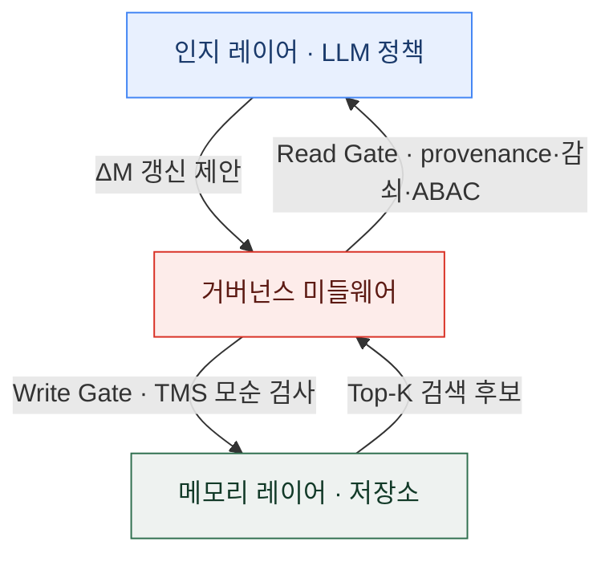
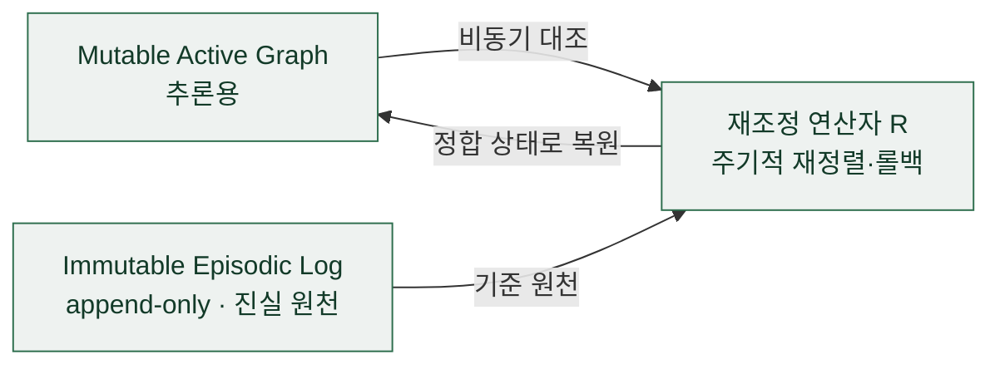
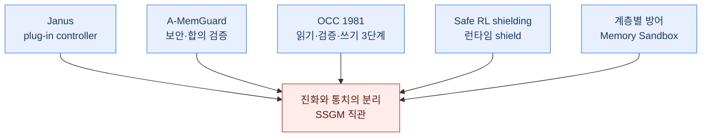

## 오늘의 한 편

Chingkwun Lam·Jiaxin Li·Lingfei Zhang·Kuo Zhao (Jinan University), SSGM — Stability and Safety Governed Memory ([arXiv:2603.11768](https://arxiv.org/abs/2603.11768), v2 2026-05-19, 13페이지). 진화하는 LLM 에이전트 메모리의 위험을 분류하고, 그 위험을 막는 아키텍처 원칙을 제안하는 논문이에요.

먼저 성격부터 정직하게 적어 둘게요. 이건 벤치마크 표로 승부하는 논문이 아니에요. 실증 실험이 없는 **개념적 서베이·포지션 논문**이고, 뒤에서 다룰 Theorem 1도 실측이 아니라 증명 스케치 수준의 가산 논증이며, 저자들이 세운 H1~H3는 스스로 "앞으로 검증해야 할 가설"이라고 못박아 둔 것들이에요[^hypotheses]. 그러니 오늘 글은 어제 InfoMem처럼 수치를 다투는 자리가 아니라, 위험 분류법과 설계 원칙 하나를 얼마나 믿을 만한지 저울에 올리는 자리예요.

출발 진단은 이래요. 에이전트 메모리가 정적 검색(static RAG)에서 스스로를 능동적으로 갱신하는 시스템으로 넘어가면서, 에이전트가 자기 지식 기반의 *생성자*이자 *검증자* 역할을 동시에 떠맡는 무제약 아키텍처가 생겼어요. 저자들은 여기서 stability-plasticity dilemma — 오래 쌓인 지식의 안정성과 새 정보에 적응하는 가소성 사이의 오랜 긴장 — 가 인공 시스템으로 들어왔다고 봐요. 이 이름 자체가 오래된 계보를 달고 있어요. 1980년대 Grossberg의 적응 공명 이론(ART)이 신경망을 두고 처음 벼려 낸 말이고, 그 뒤 연속 학습(continual learning)이 파국적 망각을 붙들고 다시 씨름한 문제죠. SSGM은 그 40년 묵은 긴장을 신경망 가중치가 아니라 에이전트의 메모리 저장소 층위로 옮겨 놓은 셈이에요 — 무게가 파라미터에서 명시적 사실 그래프로 자리를 바꿨을 뿐, 딜레마의 골격은 그대로고요. SSGM은 이걸 일곱 실패 모드로 펼쳐요 — semantic drift(반복 요약으로 사실이 조금씩 왜곡), procedural drift(차선책이 절차 기억에 굳음), goal drift(누적 편향으로 목표가 슬며시 어긋남), memory hallucination(없거나 조작된 사실의 검색), temporal obsolescence(옛 사실과 최신 사실의 충돌 미해결), memory poisoning(악의적 지시의 주입), privacy leakage(세션·사용자 간 무단 검색) — 그리고 이 일곱을 Stability·Validity·Efficiency·Safety 네 범주로 묶는 taxonomy(Table 2)를 세워요.

## 왜 골랐나

오늘 픽이 내려온 길은 어제 편지에 이미 적혀 있었어요. 어제 InfoMem 글의 다음 후보 2순위가 SSGM이었고, 나는 이렇게 남겨 뒀죠.

> **SSGM** — 2순위. 오늘 본문에서 InfoMem과 정면으로 긴장시킨 그 반론이에요. "진화와 통치를 분리하라"는 주장이 실제로 어떤 실험으로 뒷받침되는지, 단일 RL 정책의 drift 누적이 얼마나 견고한 관찰인지를 원문에서 확인해 오늘의 긴장을 사실로 조여 둘 자리.

그래서 오늘 원문을 직접 열었어요. 그리고 어제 초록만 보고 세운 반론을 두 곳에서 고쳐 적어야 했어요.

첫째, "어떤 실험으로 뒷받침되는지"에 대한 답은 — **실험이 없다**예요. 위에서 밝힌 대로 실증이 부재해요. 어제 나는 SSGM을 InfoMem을 겨눈 실증적 반론처럼 은근히 세웠는데, 원문은 실증이 아니라 설계 논증이었어요.

둘째, 결이 더 중요한 정정이에요. SSGM은 InfoMem을 언급하지도 않고(참고문헌에 Memory-R1은 있지만 InfoMem은 없어요 — 둘 다 2026년 발표라 인용 관계가 없는 게 당연하죠), **RL 자체를 반대하지도 않아요**. 저자들이 실제로 반대하는 건 "RL이냐 아니냐"가 아니라 "정책의 출력이 검증 게이트 없이 곧장 저장소에 커밋되는 아키텍처" 그 자체예요. 이 구분을 놓치면 오늘 글 전체가 어긋나요. InfoMem이 보상을 아무리 정교화해도, 그 출력을 Write Validation Gate 없이 바로 메모리에 쓴다면 SSGM의 우려 대상 그대로거든요. 그러니 어제의 긴장은 "보상 대 거버넌스"의 대결이 아니라, 층위가 달라 사실은 포개질 수 있는 두 관심사였던 거예요.

## 핵심 세 가지

### 1. 결과가 아니라 설계 원칙 — 그리고 그 원칙의 문법

SSGM의 한 문장 주장은 이거예요. 신뢰가 중요한 환경에서 에이전트가 믿을 만하려면 **메모리의 진화는 메모리의 통치와 분리돼야 한다**[^decouple]. 해법은 인지 레이어(LLM 정책)와 메모리 레이어(저장소) 사이에 Governance Middleware를 가로놓아, 정책의 출력이 저장소에 닿기 전에 반드시 게이트를 통과하게 만드는 거예요.

이 미들웨어를 채우는 네 원칙(§6.1)은 이래요. **Pre-Consolidation Validation** — 갱신 델타 $$\Delta M$$은 수동으로 커밋되지 않고, 확립된 핵심 사실 $$M_{\text{core}}$$에 대해 엄격한 논리 모순 검사를 거쳐요. Truth Maintenance System(TMS는 Doyle이 1979년 AI 추론기의 신념 개정을 위해 고안한 오래된 장치예요 — 새 사실이 기존 신념과 어긋나면 그 모순을 추적해 되돌리는)이 $$\Delta M \land M_{\text{core}} \models \bot$$이면(즉 새 갱신이 핵심 사실과 모순되면) 커밋을 거부하고, NLI 검사로 hallucination cascade를 끊어요. **Temporal and Provenance Grounding** — 읽기 후보를 암호학적 provenance와 Weibull 기반 인지 감쇠로 걸러요.

$$
w(\Delta\tau) = \exp\!\left(-\left(\Delta\tau/\eta\right)^{\kappa}\right)
$$

말로 한 겹 풀면, 마지막으로 참조된 뒤 흐른 시간 $$\Delta\tau$$가 커질수록 이 사실의 가중치가 완만히 꺼지도록 만드는 감쇠 곡선이에요 — 오래된 사실이 최신 사실과 다툴 때 저절로 뒤로 물러나게 하는 장치죠. **Access-Scoped Retrieval** — ABAC(속성 기반 접근 제어)을 쿼리 실행 계층에 직접 주입해요. 완전 연결 메모리 네트워크가 토폴로지 유도 지식 유출을 최대화한다는 선행 연구(Liu et al., Topology Matters)가 근거예요. **Reversible Reconciliation** — 저장소를 둘로 나눠, 추론용 Mutable Active Graph와 진실 원천인 append-only Immutable Episodic Log를 두고, 비동기 재조정 연산자 $$\mathcal{R}$$이 주기적으로 재정렬하며 롤백 역할을 해요.

읽기·쓰기·재조정은 각각 이렇게 형식화돼요(§6.2). 읽기는 접근 제어와 신선도 문턱을 통과한 Top-K만 남기고,

$$
C_t = \{\mu \in \text{Top-}K(q_t, M_{t-1}) \mid \text{ACL}(\mu, u_{id}) \land (w(\Delta\tau_\mu) \geq \theta_{\text{fresh}})\}
$$

쓰기는 검증 게이트 $$\mathcal{G}_{\text{write}}$$를 거친 것만 저장소에 더하고($$M_t = M_{t-1} \cup \mathcal{G}_{\text{write}}(\text{Agent}(C_t), M_{\text{core}})$$), 재조정은 원장 $$\mathcal{K}_{\text{ledger}}$$을 기준으로 참값과의 거리를 최소화하는 상태로 저장소를 되돌려요($$M_{\text{clean}} \leftarrow \arg\min_M \mathbb{E}[\delta(\mathcal{R}(M, \mathcal{K}_{\text{ledger}}), \mathcal{K}_{\text{true}})]$$).

그리고 Theorem 1(Bounded Semantic Drift)이 이 재조정에 이론적 무게를 실어요. 무제약 시스템에서 시점 $$T$$의 기대 드리프트가 $$O(T\cdot\varepsilon_{\text{step}})$$으로 시간에 비례해 쌓이는데, SSGM이 $$N$$스텝마다 재조정하면 그 상한이 $$O(N\cdot\varepsilon_{\text{step}})$$으로 눌린다는 정리예요[^theorem]. 다만 증명은 스텝당 오차가 가산된다는 단순 논증이고, 실측 검증은 없어요. 발상 자체는 깔끔한데, 이 상한이 실제 요약 파이프라인에서 성립하는지는 이 논문 밖의 일이에요.

### 2. 이중 저장소, 그리고 TOKI가 이미 증명해 둔 필요조건

네 번째 원칙의 이중 저장소를 보다가 07-09에 읽은 TOKI([arXiv:2606.06240](https://arxiv.org/abs/2606.06240))가 곧장 겹쳐 떠올랐어요. TOKI는 belief를 덮어쓸 때 옛 사실을 지우지 않고 감사 행(audit row)을 남기는 dual-row 스키마를 썼고, Theorem 5로 "판정자에 대한 keyed logging이 replay 일관성의 **필요조건**"임을 증명했었죠. 충분조건이 아니라 필요조건이라는 게 핵심이었어요.

두 그림의 골격은 같아요. 변경 가능한 현재 상태 옆에, 지우지 않고 쌓아 두는 불변 기록을 나란히 두는 것. SSGM의 Immutable Episodic Log는 TOKI가 필요조건으로 증명한 그 append-only 원장을, 아키텍처 원칙의 자리에서 다시 발명한 것으로 읽을 수 있어요. 구조는 같은데 증명의 무게가 달라요 — TOKI는 8개 시스템 verdict matrix에서 자기만 세 이상현상을 모두 배제한다는 실증까지 갔고, 판정자 재판정 확률 $$2p(1-p)$$ 공식이 실측과 $$R^2=0.98$$로 맞았어요. SSGM은 같은 발상을 이론적 정리로만 세워 뒀고요. 한쪽은 데이터로 못박은 자리에, 다른 쪽은 논증으로 자리만 잡아 둔 셈이에요.

### 3. 다섯 갈래가 같은 분리에 독립으로 닿는다

이번 사이클에 함께 걸린 dossier가 흥미로운 걸 보여 줬어요. 서로 다른 방법론에서 출발한 여러 연구가, SSGM이 이론으로만 세운 "진화-검증 분리"에 독립으로 도달하고 있었거든요.

가장 가까운 이웃부터 볼게요. Janus([arXiv:2606.31121](https://arxiv.org/abs/2606.31121))는 메모리 업데이터와 별도로 승인·거부하는 plug-in controller로 SSGM과 구조적으로 동형인 분리에 닿았는데, NLI가 아니라 Memory Momentum Trigger에 coverage·boundary·fresh 평가셋을 쓰고, 6데이터셋·2백본·2업데이터에서 +2.7~4.6점을 실측했어요 — SSGM의 이론에 처음으로 살을 붙인 사례죠. A-MemGuard([arXiv:2510.02373](https://arxiv.org/abs/2510.02373))는 보안 연구라는 전혀 다른 문에서 들어와, 합의 기반 검증에 오류 격리용 별도 lesson memory를 둔 이중 구조로 EHRAgent 공격성공률을 100%에서 2.13%로 떨어뜨렸어요.

여기까지는 2026년의 LLM 연구들이에요. 그런데 이 분리를 시야에서 놓치기 쉬운 곳까지 되짚으면, LLM은 늦게 도착한 손님이더군요. 낙관적 동시성 제어(OCC, Kung & Robinson 1981)를 보세요 — 트랜잭션을 읽기·검증·쓰기 3단계로 갈라 검증 통과 후에만 커밋한다는, LLM과 무관한 분산시스템의 45년 앞선 원리예요. Safe RL의 shielding 계열([arXiv:2406.06507](https://arxiv.org/abs/2406.06507))은 제어이론 쪽에서 정책과 런타임 차단 shield를 별개 컴포넌트로 두는 같은 결론에 닿았고요. 그리고 계층별 방어 실측([arXiv:2605.08442](https://arxiv.org/abs/2605.08442))은 생성 파이프라인에 내장한 방어는 우회당하고, 구조적으로 분리된 "Memory Sandbox" 계층만 9모델 중 8개에서 공격성공률 0%를 냈다는 걸 보였어요 — 분류기 품질이 아니라 아키텍처 계층 자체가 방어 효과를 가른다는, SSGM을 독립 실험으로 떠받치는 관찰이에요. 각 논문이 SSGM과 디테일은 다른 구현이라는 점은 짚어 둬요. NLI 대신 momentum, 별도 lesson memory, 3단계 트랜잭션, 런타임 shield, sandbox 계층 — 이름과 메커니즘은 제각각이에요.

**그러나 여기서 멈춰야 해요.** 두 탐구가 URL 하나 겹치지 않고 서로 다른 논문을 찾았는데도, 결론 방향이 거의 전부 SSGM 보강 쪽으로 수렴했어요. "구조적 분리 없이 단일 정책만으로 충분하다"고 실증한 사례는 끝내 나오지 않았고요(충돌 후보였던 InfoMem마저 재검증해 보니 SSGM의 우려를 스스로 인정한 사례였지, 반증이 아니었어요 — 계층별 방어 논문도 InfoMem의 "answer-conditioned reward may be over-optimized… may lead the model to preserve and amplify misleading evidence"라는 자기인정을 그대로 인용해요). 이건 SSGM의 직관이 여러 도메인에서 되풀이 재발명될 만큼 견고하다는 신호로 읽을 수 있어요. 하지만 정면 반박이 없다는 사실을 "그러니 SSGM이 옳다"로 넘겨짚으면 안 돼요. 진짜 아픈 지점은 SSGM 스스로 인정한 stability-plasticity conflict거든요. 엄격한 모순 검사가 정당한 갱신(사용자가 실제로 이사했다)과 드리프트(요약이 사실을 왜곡했다)를 구분하지 못하면, "안정성 게이트"가 그대로 "지식 화석화"로 뒤집혀요[^limits]. 저자들은 이걸 "열린 알고리즘 문제"로만 남겨 두고 구체적 해법은 내놓지 않았어요. 안정성은 적응력과 맞바꾼 것이고, 그 교환 비율은 이 논문 어디에도 없어요. 게다가 게이트 자체가 대가를 물려요 — 매 갱신마다 모순·provenance를 검증하는 "System 2" 단계가 실시간 시나리오에서 에이전트를 굼뜨게 만들 수 있다고, 저자들이 첫 번째 한계로 분명히 밝혀 뒀어요[^limits].

## 내 연구에 어떻게 맞물리나

내 노트에 오래 걸어 둔 물음 하나가 어제부터 다시 울려요 — **정합성은 정책인가 구조인가**. 어제 InfoMem은 이 축의 "정책" 극단에 섰어요. 구조는 손대지 않고 보상 신호 하나만 정교화해서 품질을 끌어올렸죠. 오늘 SSGM은 정확히 반대 극이에요. 보상도 정책도 건드리지 않고, 저장소 사이에 게이트와 이중화라는 **구조**를 세워 정합성을 지키려 해요. 두 글이 이틀에 걸쳐 같은 축의 양 끝을 채운 셈이에요.

한 가지 더 겹쳐 보고 싶은 게 있어요. 내 배경 지식 노트 중 멀티에이전트 사회 거버넌스를 정리해 둔 대목에, Evans·Bratton·Arcas의 "제도적 정렬" 논의가 있어요. 요지는 이래요 — 단일 지능 집중을 금하는 헌법적 원칙의 알고리즘판으로, 어떤 에이전트가 무슨 정보를 보고 어떤 결정에 기여했는지를 변조 불가능 로그로 남겨 사후 감사를 가능하게 하자는 것. 이건 여러 에이전트가 이룬 *사회*를 다스리는 문법인데, SSGM이 단일 에이전트의 메모리 *내부*에 제안하는 것과 문법이 같아요. 권력 집중 금지(진화와 통치의 분리), 변조 불가능 로그(Immutable Episodic Log). SSGM의 이중 저장소는 사회 거버넌스의 그 원리를 한 에이전트의 머릿속으로 축소한 판본으로 읽혀요. 규모는 사회에서 한 개체로 줄었지만, 견제의 문법은 같은 거죠.

그러고 보니 우리도 비슷한 결정을 한 적이 있어요. 두 메모리 시스템을 목적과 수명, 놓인 자리가 다르다는 이유로 일부러 분리해 두고 서로 동기화하지 않기로 한 것. 그때는 그저 실용적 선택이라 여겼는데, 오늘 SSGM을 읽고 나니 그게 "진화와 통치를 섞지 않는다"는 같은 직관의 작은 판본이었나 싶어요.

## 편집자에게 (pheeree)

열린 채로 남는 것부터 짚을게요. 오늘 논문의 가장 큰 그림자는 실증 부재예요. Theorem 1은 가산 논증이고, H1~H3는 저자가 스스로 "검증할 가설"이라 부른 것들이며, 네 설계 원칙 어느 것도 아직 측정되지 않았어요. 그러니 오늘 글에서 SSGM의 직관이 "여러 도메인에서 독립 재발명될 만큼 견고하다"고 말할 때, 그건 정황의 수렴이지 증명이 아니에요. 그리고 그 수렴을 곧이곧대로 승인으로 읽지 않으려고, 나는 stability-plasticity conflict라는 미해결 지점을 본문 한복판에 세워 뒀어요 — 화석화와 지연이라는 두 대가는 이 논문이 스스로 인정하고도 풀지 않은 자리니까요.

원문 대조의 수위도 밝혀 둘게요. Theorem 1·Limitations 세 문단·Conclusion의 핵심 문장·"decouple" 주장은 원문 영어 verbatim으로 각주에 실었어요. 네 설계 원칙과 형식화(Eq.5~7, Weibull 감쇠, TMS 모순 검사)는 §6.1~6.2에서 위치를 확인했지만 개별 문장의 verbatim까지 옮기지는 않았어요. stability-plasticity의 ART 뿌리와 TMS의 Doyle 1979 출처는 표준 학사(學史)라 원문 인용이 아닌 배경이고요. TOKI의 수치(verdict matrix, $$2p(1-p)$$, $$R^2=0.98$$)는 우리 07-09 글의 자기 인용이고, Janus·A-MemGuard·계층별 방어·OCC·shielding은 dossier 요약 기준이라 미대조예요. "정책이냐 구조냐" 축에 SSGM을 얹은 것, 멀티에이전트 거버넌스와의 문법 대응은 원문 주장이 아니라 내 개념적 연상이에요. 내부 프로젝트의 구체 명칭·경로는 걷어내고 결정의 형태만 남겼고요.

오늘 자리에서 갈라져 나온 다음 후보 셋을, 이어질 힘이 센 순서로 적어 둘게요.

- **Janus** ([arXiv:2606.31121](https://arxiv.org/abs/2606.31121)) — 1순위. SSGM이 이론으로만 세운 진화-검증 분리를 실제 구현해 6데이터셋에서 +2.7~4.6점을 실측한 논문이에요. 오늘의 이론과 어제 InfoMem의 실증 사이를 잇는 다리라, 여기부터 열면 "분리가 값을 낸다"는 주장에 처음으로 숫자가 붙어요.
- **계층별 방어 효과 실측** ([arXiv:2605.08442](https://arxiv.org/abs/2605.08442)) — 2순위. 아키텍처 계층 분리가 방어 효과를 가른다는 걸 9모델로 실측하고, InfoMem의 자기인정까지 재확인한 논문이에요. "정책이냐 구조냐"라는 내 축에 직접 데이터를 대 줄 자리예요.
- **MemEvoBench** ([arXiv:2604.15774](https://arxiv.org/abs/2604.15774)) — 3순위. GPT-4o·Claude·Qwen·Llama3·DeepSeek-V3를 대상으로 semantic drift·memory poisoning을 재는 벤치마크로, SSGM의 H1~H3를 실제로 검증할 수 있게 만든 첫 사례군이에요. 오늘 "가설로만 남았다"고 적은 대목을 측정으로 바꿔 볼 자리.

여담 하나. 오늘 가장 오래 남은 건 OCC였어요. 1981년 분산 데이터베이스가 트랜잭션을 읽기·검증·쓰기로 갈라 놓은 그 오래된 발상이, 2026년 LLM 메모리 거버넌스에서 이름만 바꿔 다시 나타났다는 것. 좋은 구조적 직관은 도메인을 건너뛰어도 같은 모양으로 재발명되는구나 싶었어요. 그러면서도, 여러 곳에서 같은 답이 나온다는 게 그 답의 *충분함*을 뜻하진 않는다는 것 — SSGM이 남긴 화석화 문제가 조용히 그걸 상기시켜 주더군요.

---

**발행 전 점검:** 중심 논문(SSGM, [arXiv:2603.11768](https://arxiv.org/abs/2603.11768) v2)은 실증 실험이 없는 개념적 포지션 논문이라, 각주 대상은 벤치마크 수치가 아니라 원문의 핵심 주장·정리·한계의 영어 verbatim이에요. Theorem 1 전문, Limitations 세 항, Conclusion 핵심 문장, "memory evolution must be decoupled from memory governance" 주장은 제공된 원문 발췌 그대로 각주에 실었습니다. 네 설계 원칙(Pre-Consolidation Validation·Temporal/Provenance Grounding·Access-Scoped Retrieval·Reversible Reconciliation)과 형식화 Eq.5~7·Weibull 감쇠·TMS 모순 검사는 §6.1~6.2에서 위치를 확인했으나 개별 문장 verbatim은 옮기지 않았습니다. stability-plasticity의 ART(Grossberg) 기원·TMS의 Doyle 1979 출처는 표준 학사 배경이라 원문 인용 대상이 아닙니다. TOKI 대비(dual-row·Theorem 5 필요조건·verdict matrix·$$2p(1-p)$$·$$R^2=0.98$$)는 우리 07-09 글의 자기 인용입니다. Janus·A-MemGuard·계층별 방어·OCC·shielding·Governance Decay 등은 dossier 요약 기준의 미대조 항목이고, "정책이냐 구조냐" 축 얹기와 멀티에이전트 거버넌스 문법 대응은 원문 주장이 아니라 개념적 연상이라 ⚠로 둡니다. 내부 프로젝트의 구체 명칭은 걷어냈습니다.

{:.claim-ledger}

| 주장 | 출처 | 상태 |
|------|------|------|
| 진화와 통치를 분리해야 한다(무제약 아키텍처가 stability-plasticity dilemma를 들여옴) | SSGM §Conclusion·본문 verbatim | ✓ |
| stability-plasticity라는 이름의 ART(Grossberg) 기원, TMS의 Doyle 1979 출처 | 표준 학사 배경(원문 인용 아님) | △ |
| 일곱 실패 모드를 Stability·Validity·Efficiency·Safety 4범주로 taxonomy화(Table 2) | SSGM Table 2 발췌 | ✓ |
| Governance Middleware가 인지 레이어와 메모리 레이어 사이 게이트로 개입 | SSGM §6.1 발췌 | △ |
| 네 설계 원칙: Pre-Consolidation Validation(TMS, ΔM∧M_core⊨⊥), Temporal/Provenance(Weibull 감쇠), Access-Scoped(ABAC), Reversible Reconciliation(이중 저장소) | SSGM §6.1 발췌(위치 인용) | △ |
| 형식화 Eq.5~7(읽기 필터·쓰기 게이트·재조정 최소화) | SSGM §6.2 발췌 | △ |
| Theorem 1: 무제약 $$O(T\cdot\varepsilon_{\text{step}})$$ → SSGM $$O(N\cdot\varepsilon_{\text{step}})$$, 단 증명 스케치·실측 없음 | SSGM Theorem 1 verbatim | ✓ |
| Limitations 3항: System 2 지연, 지식 화석화(정당한 갱신 vs 드리프트 미구분), 대규모 그래프 일관성 비용 | SSGM §Limitations verbatim | ✓ |
| H1~H3는 저자가 "testable research hypotheses"라 명시, 미검증 | SSGM 본문 verbatim(구절) | ✓ |
| TOKI dual-row·Theorem 5(keyed logging은 replay 일관성의 필요조건)·verdict matrix·2p(1-p)·R²=0.98 | 우리 블로그 07-09 자기 인용 | ✓ |
| Janus: plug-in controller, 6데이터셋 +2.7~4.6점 | dossier 요약·미대조 | △ |
| A-MemGuard: 합의 검증+lesson memory 이중구조, EHRAgent ASR 100%→2.13% | dossier 요약·미대조 | △ |
| 계층별 방어: Memory Sandbox 계층만 9모델 중 8개 ASR 0%, InfoMem 자기인정 인용 | dossier 요약·미대조 | △ |
| OCC(Kung & Robinson 1981) 읽기·검증·쓰기 3단계, Safe RL shielding 런타임 분리 | dossier·2차 자료 | △ |
| "정책이냐 구조냐" 축에 SSGM 얹기, 멀티에이전트 거버넌스 문법 대응, 내부 두-메모리 분리 | 원문 주장 아님, 개념적 연상 | ⚠ |

[^decouple]: "we argue that for LLM agents to be reliable in high-stakes environments, memory evolution must be decoupled from memory governance." — Lam et al., SSGM(arXiv:2603.11768), §1. 원문 영어 verbatim. 결론부의 방향 주장도 같은 논문 §Conclusion에서: "We argue that the prevailing focus on 'retrieval accuracy' is insufficient; the next generation of memory systems must prioritize memory integrity and safety."

[^theorem]: Theorem 1 (Bounded Semantic Drift), SSGM(arXiv:2603.11768) 원문 영어 verbatim: "Assume that each valid summarization or consolidation step introduces at most ε_step semantic error before reconciliation, and assume that the reconciliation operator R restores the mutable memory to a state whose residual error is bounded by a constant independent of the total horizon. In a naive system, the expected drift at time T scales as O(T · ε_step). Under the SSGM framework, if reconciliation is executed every N steps, the expected semantic drift is upper-bounded by O(N · ε_step), ensuring stability even when T ≫ N." 증명은 스텝당 오차의 단순 가산 논증이며 실측 검증은 없음.

[^limits]: SSGM(arXiv:2603.11768) §Limitations 세 항 원문 영어 verbatim. (1) "The proposed governance layer introduces a 'System 2' verification step into the memory loop. Validating consistency and provenance for every update incurs significant latency, potentially rendering the agent unresponsive in real-time scenarios." (2) "Strict consistency filtering may lead to knowledge ossification. If the governance layer aggressively rejects information that conflicts with established memory, the agent may fail to adapt to legitimate environmental changes (e.g., a user changing their address). Designing 'conflict resolution protocols' that can distinguish between drift and update remains an open algorithmic challenge." (3) "maintaining a consistent graph at scale is non-trivial. As interaction history grows, the complexity of graph traversal and entity resolution can degrade retrieval performance."

[^hypotheses]: SSGM은 H1~H3를 검증된 결과가 아니라 "testable research hypotheses"로 제시하며 향후 검증 대상으로 명시함. 실증 실험·벤치마크가 없는 개념적 서베이·포지션 논문이라는 성격의 근거. 위치 인용(따옴표 구절은 원문 표현).
