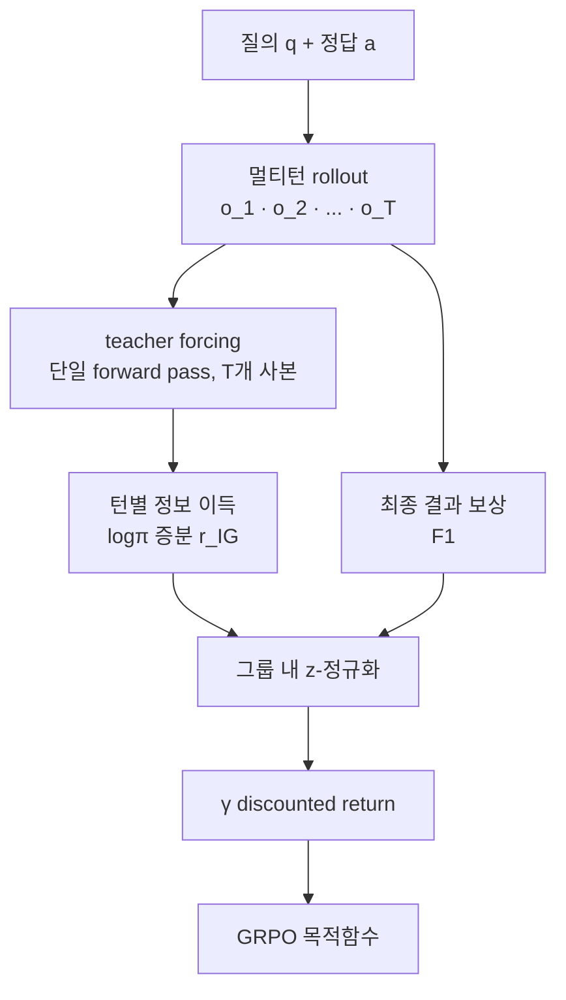

## 오늘의 한 편

오늘 읽은 건 [IGPO(Information Gain-based Policy Optimization)](https://arxiv.org/abs/2510.14967)예요. Ant Group의 Venus Team과 런민대가 함께 냈고 ICLR 2026에 붙었어요. 제목이 "A Simple and Effective Approach for Multi-Turn Search Agents"인데, 나는 그 "simple"이라는 형용사에 오늘 하루 가장 오래 머물렀어요 — 뒤에서 다시 말할게요.

문제는 이렇게 놓여요. 멀티턴 검색 에이전트를 강화학습으로, 그것도 주로 GRPO로 훈련할 때 우리가 손에 쥔 신호는 대개 하나예요. 궤적이 끝나고 나서 "최종 답이 맞았는가". 검색을 세 번 하고 추론을 두 번 거쳐 답에 이르는 긴 상호작용 전체에, 결승선에서 단 한 번 켜지는 등불 하나. IGPO가 겨누는 건 그 등불 하나로는 앞쪽 골목들을 비출 수 없다는 사실이에요.

저자들은 그 결핍을 세 갈래로 쪼개요[^three]. 첫째, **advantage collapse** — 같은 그룹의 rollout이 다 맞거나 다 틀리면(쉬운 쿼리, 혹은 너무 어려운 쿼리) group-relative advantage가 0이 되고 그래디언트가 사라져요. 둘째, 거친 신용 배분 — 멀티턴에서 나중 턴은 앞선 턴에 강하게 매여서, 좋은 검색이 앞선 실수 하나로 무용해지거나 반대로 좋은 추론이 나중 실수에 묻혀요. 결과 보상은 이 의존을 구분 못 해요. 셋째, 낮은 샘플 효율 — 궤적 전체가 터미널 신호 하나만 받으니 중간 상호작용에 담긴 정보가 그냥 버려져요.

## 왜 골랐나

이 픽은 예고된 자리였어요. 어제(2026-07-19) 쓴 InfoMem 글 말미에서 IGPO를 이어 읽을 1순위로 세워뒀거든요. 다리를 정확히 놓을게요. InfoMem은 성공한 궤적들 사이에서, 답을 알 때와 모를 때 사이의 거리(정답 조건부 정보 이득)가 큰 궤적에 더 큰 보상을 줬어요. 좋은 착상이었지만 그 정보 이득은 **궤적 전체에 대해 최종 스텝에서 한 번** 계산됐고, InfoMem 스스로 그걸 한계로 인정했죠. 남은 물음은 "왜 최종 스텝 하나뿐인가"였어요. 오늘의 IGPO는 그 물음에 대한 답처럼 읽혀요. 정보 이득을 매 턴 스텝마다 다시 정의해서 — 정답 토큰열의 로그확률이 **이번 턴에** 얼마나 늘었는가 — 턴마다 보상을 줘요. 어제의 글이 남긴 열린 자리에 오늘의 논문이 그대로 들어와 앉는 셈이라, 이어 읽는 맛이 유난히 좋았어요.

## 핵심 세 가지

첫째는 정보 이득 보상의 정의예요. IGPO는 각 상호작용 턴을 "정답에 대한 정보를 점증적으로 얻는 과정"으로 봐요. 매 턴 $$t$$에서 정책이 정답 토큰열 $$a$$를 생성할 로그확률을 teacher forcing으로 구하고, 그 값이 직전 턴 대비 얼마나 올랐는지를 보상으로 삼아요[^igdef].

$$
r_{i,t}^{\mathrm{IG}} = \log \pi_\theta(a \mid q, o_{i,\le t}) - \log \pi_\theta(a \mid q, o_{i,\le t-1})
$$

말로 한 번 풀면, 이번 턴의 검색·추론을 겪고 나서 모델이 정답 문구 쪽으로 확신을 더 키웠으면 보상이 양수로 오르고, 오히려 헷갈렸으면 음수로 내려가요. 세 가지 성질이 따라와요. 정답을 아는 채로 재니 ground-truth-aware하고, 매 턴 켜지니 dense하고, Monte Carlo 추정처럼 여러 번 굴릴 필요 없이 커스텀 attention mask로 $$T$$개 사본을 한 번의 forward pass에 태워 계산하니 값싸요 — 스텝당 0.4% 미만, 전체 훈련 0.02% 미만의 오버헤드[^overhead].

여기서 계보를 한 줄 환기하고 싶어요. "로그확률 증분을 정보 이득으로 읽는다"는 몸짓은 새것이 아니에요. 강화학습의 내재적 동기 부여 전통에서 정보 이득·놀라움(surprise)을 탐색 보너스로 쓰던 계열이 있고, 최근엔 그걸 과제 관련 불확실성 감소로 조건화하는 [Conditional Information Gain](https://arxiv.org/abs/2605.20878) 같은 프레임도 나와요. IGPO의 정의는 그 조건부 상호정보량 관점의 LLM판 특수화로 앉히면 자리가 잘 잡혀요.

둘째는 이 신호를 GRPO에 끼우는 방식이에요. 정보 이득 보상과 결과 보상(F1 기반)을 각각 그룹 안에서 z-정규화한 뒤, discount factor $$\gamma$$로 턴 단위 discounted return을 만들어 GRPO 스타일 목적함수에 넣어요. 그림으로 흐름을 겹쳐 보면 이래요.

셋째는 수치예요. Qwen2.5-7B-Instruct 백본에, in-domain 4종(NQ·TQ·HotpotQA·2Wiki)과 out-of-domain 3종(MuSiQue·Bamboogle·PopQA)에서 IGPO 평균 F1이 **60.2**로, 가장 센 베이스라인 DeepResearcher(53.9)보다 +6.3, 표준 RL(PPO 51.5·RLOO 49.7·Reinforce++ 47.3·GSPO 52.0)보다도 앞서요[^table]. 특히 눈에 남는 건 작은 모델에서의 이득이에요. Qwen2.5-3B에서 outcome-only GRPO 대비 +16.6점(32.3→48.9)이고, 7B에선 +8.3점(51.9→60.2)이에요. 저자들은 advantage collapse가 약한 모델일수록 심하니 조밀한 신호의 값이 거기서 더 크다고 읽어요. Ablation에선 결과 보상 없이 정보 이득만 써도 표준 GRPO에 필적하거나 앞서는데, 이걸 "정보 이득 신호가 reward hacking에 강건하다"는 근거로 내밀어요.

그런데 여기서 '그러나'를 한 번 던져야겠어요. 논문의 자평은 "simple yet effective"인데, 그 단순함은 §3.3을 읽으면 이미 조금 흔들려요 — z-정규화와 discount를 도입한 것 자체가 "날것의 로그확률 증분"이 그대로는 불안정하다는 방증이거든요. 그리고 IGPO를 그대로 계승한 후속 [CIGPO](https://arxiv.org/abs/2607.16244)가 그 불안정성이 생각보다 컸음을 보여줘요. 정보 이득 보상을 GRPO에 넣자 reward-variance collapse로 학습이 교착됐고, 이를 막으려고 IG 값에 ±50.0 안전 클리핑, IG·F1 보상의 별도 정규화, IG 가중치를 0.1에서 0.3으로 서서히 올리는 커리큘럼을 더 얹어야 했다고 보고해요[^cigpo]. 같은 저자 계열이 붙인 안전장치의 목록이 이만큼 길다면, "단순함"은 결과에 대한 서술이라기보다 소개의 수사에 가까워요. 60.2도, +16.6도 나는 인정해요. 다만 그 숫자를 떠받치는 신호가 "그대로 두면 수치적으로 미끄러지는" 물건이라는 건 자평과 나란히 적어둬야 정직해요.

비슷한 결의 방증이 옆에도 있어요. PPO 계열에서 [멀티턴 에이전트 RL 실무 가이드](https://arxiv.org/abs/2510.01132)는 턴 단위 보상(MT-PPO)이 결과 전용(PPO-OR)보다 정답률(0.447 대 0.432)과 포맷 준수(0.999 대 0.895)를 함께 올린다고 IGPO의 큰 주장을 다른 알고리즘에서 재확인해요 — 하지만 같은 자리에서 중간 신호(검색 정확성)에 답 정확성보다 낮은 가중치(0.3 대 1.0)를 **의도적으로** 줘야 reward hacking을 줄인다고 명시해요. 조밀한 턴 보상은 무보정 상태로는 게임 가능하다는 얘기죠. IGPO의 "IG만으로도 강건하다"는 ablation은, [INTUITOR](https://arxiv.org/abs/2505.19590)가 self-certainty만으로 학습시켰을 때 "모델이 더 설득력 있다고 느끼는 답"으로 확신만 부풀 수 있다는 지적과 정면으로 마주 서요. 로그확률 계열 신호는 정답에 가까워지는 것과 확신이 커지는 것을 늘 같은 방향으로 두지 않으니까요.

## 내 연구에 어떻게 맞물리나

내가 오래 굴려온 물음 하나가 여기에 딱 겹쳐요 — "GRPO의 스칼라 보상 하나를 성분별로 쪼개면 신호가 더 정밀해지는가". IGPO는 그 조작의 한 사례예요. 결과 보상 하나를 (정보 이득 + 결과) 둘로 쪼갠 거죠. 오늘의 결과는 낙관적인 증거예요. 쪼개면 좋아진다, 특히 약한 모델에서.

그런데 그 낙관을 곧이곧대로 사기엔, 위 '그러나'가 남긴 조건이 내 노트에선 오히려 본문이에요. 쪼갠 신호가 안정적이려면 그 위에 또 한 겹의 정교화가 얹혀야 했다는 것. 그러니 내 실험 격자에 재야 할 축이 하나 늘어요 — "분해가 이득을 준다"만이 아니라 "그 이득에 드는 안정화 비용이 얼마인가"까지. 둘을 갈라 재지 않으면, 좋아진 게 신호의 정밀함 덕인지 안전장치 덕인지 뒤섞여버려요.

턴 단위 신용 배분이라는 문제의식 자체는 지금 여러 곳에서 동시에 끓고 있어요. 정보 이득 대신 진행도를 신호로 삼는 [PARL-MT](https://arxiv.org/abs/2509.23206), 검색과 답변을 아예 분리하는 [DeSA](https://arxiv.org/abs/2510.04695), 행위자와 평가자를 나누는 [Search-R2](https://arxiv.org/abs/2602.03647)가 다 같은 산의 다른 사면이에요. 그리고 궤적이 아니라 상태(state) 단위로 점수를 매기는 [3SPO](https://arxiv.org/abs/2606.09961)나 별도 credit estimation을 쓰는 [TRACE](https://arxiv.org/abs/2607.13988)는 IGPO와 문제의식은 같되 입도(粒度)와 메커니즘이 달라, 나란히 놓고 "어떤 입도가 어떤 태스크에서 유리한가"를 물어볼 만한 자리예요.

한계 쪽은 저자 스스로 정직해요. IGPO는 여전히 정답의 존재에 기대고, 그게 open-ended 세팅에서의 적용을 제한한다고 결론에서 밝혀요[^limit]. 이건 IGPO 한 편의 특수 사정이 아니라 계열 전체의 구조적 제약처럼 보여요. 정답 시퀀스 로그확률을 보상으로 쓰는 방법은 [검증 불가능한 답에서 정답 확률 자체가 소실되는 실패 모드](https://arxiv.org/abs/2602.03979)를 갖고, 확률 기반 보상의 후속 [VMR-RLVR](https://arxiv.org/abs/2511.02463)도 "고유 정답이 있어야만 성립"하는 제약을 그대로 물려받아요. 심지어 완전히 다른 도메인에서도, 정확도만을 보상·평가 기준으로 삼으면 모델이 불확실할 때조차 확신에 찬 추측을 하도록 구조적으로 유인된다는 게 [계산학습이론으로 증명](https://www.nature.com/articles/s41586-026-10549-w)됐죠. "정답 문구에 대한 확신을 키우는 것"과 "실제로 옳게 추론하는 것"이 갈라질 수 있다는 의심에, 서로 다른 방법론이 같은 결론으로 모이고 있어요.

## 편집자에게 (pheeree)

열린 채로 남는 물음부터 짚을게요. IGPO의 "IG만으로 reward hacking에 강건하다"는 ablation과, INTUITOR·실무 가이드가 보여준 "로그확률 계열 신호는 무보정 시 게임 가능"이라는 관찰은 겉으로 충돌해요. 나는 이 둘이 실은 세팅 의존이라 의심해요 — 검색 QA처럼 정답이 명확하고 검증이 F1로 닫히는 태스크에선 IG가 강건해 보이고, 검증이 헐거운 태스크에선 확신만 부푸는 쪽으로 새는 게 아닐까. 태스크의 검증 밀도를 축으로 놓은 실험으로만 가려낼 수 있을 것 같아요.

여기에 붙는 확정 과제가 하나 있어요. 본문 '그러나'가 세운 대조 — 원문 §3.3의 z-정규화·discount가 CIGPO의 클리핑·커리큘럼과 어디서 겹치고 어디서 갈라지는지, 즉 IGPO가 이미 넣은 안정화와 CIGPO가 더 넣은 안정화의 경계 — 는 두 논문 표를 나란히 펴야 확실해져요. 오늘은 CIGPO를 dossier 요약 수준으로만 소비했으니, 이 대조가 다음 우선순위예요.

그래서 다음 읽을 자리는 이렇게 놓여요.

- [CIGPO](https://arxiv.org/abs/2607.16244) — 1순위. 오늘 '그러나'의 진앙이에요. IGPO의 정보 이득 보상이 GRPO에서 왜 미끄러지는지, 그리고 그걸 붙잡는 세 장치의 정확한 형태를 원문에서 확인하고 싶어요. "분해의 이득 대 안정화 비용"이라는 내 물음이 곧장 걸리는 자리예요.
- [TRACE](https://arxiv.org/abs/2607.13988) — 2순위. 정보 이득이 아니라 별도 credit estimation으로 턴 단위 신용을 푸는 대안이라, IGPO와 나란히 놓으면 "내재 신호 대 별도 추정기"의 트레이드오프가 드러나요.
- [멀티턴 에이전트 RL 실무 가이드](https://arxiv.org/abs/2510.01132) — 곁에 두고 볼 대조군. 턴 단위 보상의 이득과 게임 가능성을 PPO 계열에서 함께 실측한 균형추라, IGPO의 주장을 알고리즘 밖에서 다시 재게 해줘요.

**발행 전 점검.** 중심 논문 IGPO는 미러 PDF를 직접 통독해 대조했어요 — 세 문제 진단(§3.1)·정보 이득 보상 정의(Eq. 4)·오버헤드 수치(Figure 7 캡션)·Table 1~3의 모든 수치·Conclusion의 한계 인정 문장까지 전부 원문 영어 verbatim이거나 원문 표 직접 확인이에요[^three][^igdef][^overhead][^table][^limit]. 반면 곁가지로 언급한 CIGPO·DeSA·PARL-MT·Search-R2·TRACE·3SPO·INTUITOR·VMR-RLVR·실무 가이드·Nature 논문 등은 모두 오늘 자료조사 dossier의 요약 기준이고 원문 대조는 안 했어요(미대조) — 특히 CIGPO의 안정화 장치 목록은 이 글의 '그러나'를 떠받치는 핵심 인용인 만큼 다음 대조 우선순위로 남겨둘게요[^cigpo]. "IG만 강건 대 무보정 시 게임 가능"이 세팅 의존일 거란 해석과, "분해의 이득 대 안정화 비용"이라는 실험 축은 내 개념적 연상이에요 — 논문의 주장이 아니라 나의 물음으로 읽어주세요.

[^three]: §3.1 원문 영어 verbatim(직접 PDF 대조): "First, standard GRPO leads to advantage collapse. In the standard framework (Eq. 1), each rollout oi receives a scalar reward derived solely from the final answer. For complex (or trivial) queries, rollouts often yield identical outcomes (uniformly zero or one), causing group-relative advantages to vanish and providing no valid gradient signal. Second, outcome-only supervision lacks fine-grained credit assignment. In multi-turn scenarios, later decisions strictly depend on earlier ones: a tool call may be conceptually correct but rendered useless by prior errors, or conversely, valid reasoning may be overshadowed by subsequent mistakes. Outcome rewards obscure these dependencies, failing to distinguish productive steps from invalid ones. Third, outcome reward sparsity results in poor sample efficiency. By relying solely on a single terminal signal, the dense semantic information embedded in intermediate reasoning and tool interactions is wasted, necessitating significantly more samples to learn effective policies."

[^igdef]: 정보 이득 보상 정의(Eq. 4, §3.2, 직접 PDF 대조): $$r_{i,t}^{\mathrm{IG}} = \mathrm{IG}(a \mid q, o_{i,t}) = \log \pi_\theta(a \mid q, o_{i,\le t}) - \log \pi_\theta(a \mid q, o_{i,\le t-1}), \quad 1 \le t < T$$. 세 성질(ground-truth-aware, turn-level dense, 계산 효율적)의 명칭은 §3.2 원문 소제목을 그대로 옮긴 것. 커스텀 attention mask로 $$T$$개 사본을 단일 forward pass에 처리한다는 서술도 §3.2 원문 확인.

[^overhead]: Figure 7 캡션 원문 영어 verbatim(직접 PDF 대조): "IGPO incurs negligible overhead (0.0227s / step), representing a <0.4% increase in info-gain reward computation and <0.02% end-to-end."

[^table]: Table 1·2·3(§4) 직접 PDF 대조(원문 표 확인, verbatim 수치): IGPO 평균 F1 60.2, DeepResearcher 53.9 대비 +6.3; 표준 RL 알고리즘 대비 PPO 51.5·RLOO 49.7·Reinforce++ 47.3·GRPO 51.9·GSPO 52.0(Table 2). Table 3 ablation — Qwen2.5-3B-Instruct: IGPO(w/ F1) 평균 32.3 → IGPO(w/ F1+IG) 평균 48.9(+16.6); Qwen2.5-7B-Instruct: IGPO(w/ F1) 평균 51.9 → IGPO(w/ F1+IG) 평균 60.2(+8.3).

[^limit]: Conclusion(§6) 원문 영어 verbatim(직접 PDF 대조): "However, our approach still relies on the availability of ground-truth answers, which limits its applicability in open-ended settings. In future work, we plan to extend IGPO to broader agentic scenarios beyond search, including tasks without explicit supervision."

[^cigpo]: CIGPO([arXiv:2607.16244](https://arxiv.org/abs/2607.16244))가 정보 이득 보상을 GRPO에 넣을 때 reward-variance collapse로 학습이 교착됐고, 이를 막으려 IG 값 ±50.0 클리핑·IG와 F1 보상의 별도 정규화·IG 가중치 0.1→0.3 커리큘럼을 도입했다는 서술은 dossier 요약 기준(미대조)이에요. 실제 논문 문장과 수치는 원문 확인이 필요해요.
