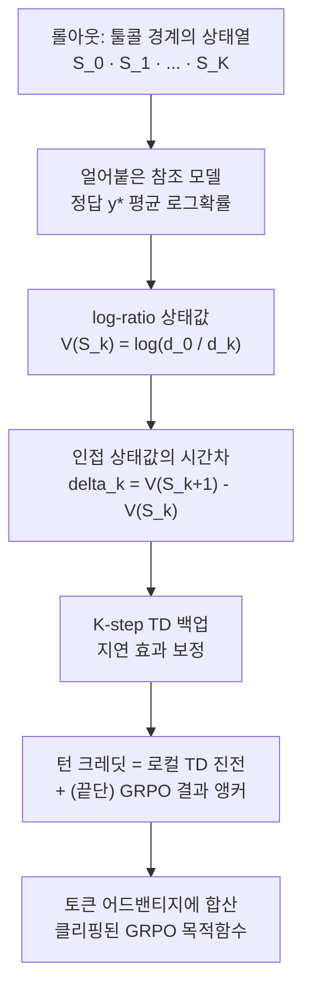
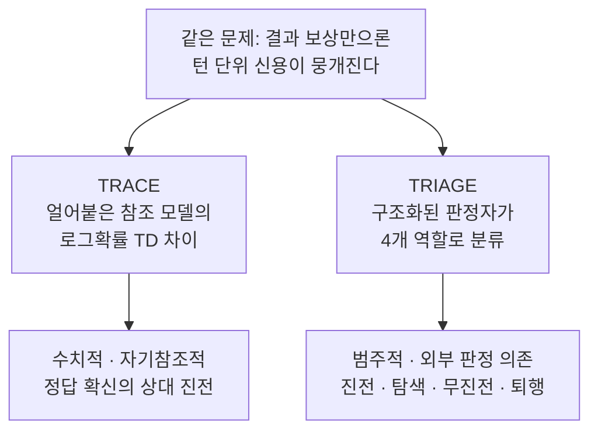

## 오늘의 한 편

오늘 편 건 [TRACE(Turn-level Reward Assignment via Credit Estimation)](https://arxiv.org/abs/2607.13988)예요. 위스콘신-매디슨과 마이크로소프트 리서치가 함께 냈고, Sharon Li·Jianfeng Gao 이름이 저자 줄에 있어요. 지난주 IGPO 글 말미에서 이어 읽을 후보를 세 편 세워뒀는데, 맨 앞에 놓았던 CIGPO가 아직 우리 논문 서랍에 도착하지 않았어요. 그래서 그다음 자리에 있던 TRACE를 당겨 왔어요 — 마침 이쪽이 IGPO와 같은 산의 다른 사면이라, 순서가 밀렸다기보다 나란히 놓기 좋은 짝이 먼저 열린 셈이에요.

문제 설정은 어제와 겹쳐요. 멀티턴 에이전트가 툴을 수십, 때론 수백 번 부르고 나서야 최종 답을 내놓을 때, 우리가 쥔 신호는 결승선의 등불 하나 — 결과 보상이에요. 짧은 추론엔 그걸로 충분하지만 궤적이 길어지면 신호는 성기고 분산이 커져요. 게다가 오해까지 낳아요. 실패한 롤아웃 안에도 정답 쪽으로 걸음을 옮긴 유용한 행동이 여럿 있는데, 결과 전용 훈련은 그것들에 최후의 실수와 똑같은 음의 어드밴티지를 매겨버리거든요[^abs].

## 왜 골랐나

IGPO와 TRACE는 진단이 판박이예요. 둘 다 "결과 보상 하나로는 중간 턴의 공과가 뭉개진다"에서 출발해요. 갈라지는 건 그 중간 신호를 **무엇으로 채우는가**예요. 어제의 IGPO는 정책 자신의 로그확률 증분을 정보 이득으로 읽어 매 턴에 발랐죠 — 신호가 정책 안에서 나와요. 오늘의 TRACE는 신호를 정책 바깥의 **얼어붙은 참조 모델**에서 길어 올려요. 정책 초기화의 고정 사본 하나를 떼어 두고, 그 사본이 정답을 얼마나 확신하는지의 변화를 턴 크레딧으로 삼아요. 같은 문제에 대한 두 개의 답안을 이틀에 걸쳐 나란히 펴 보는 셈이라, 어제 읽은 게 오늘을 읽는 배경이 돼줘요.

그리고 하나 더 — IGPO 글에서 "정보 이득이 아니라 별도 credit estimation으로 턴 신용을 푸는 대안"이라며 TRACE를 짚어뒀었어요. 오늘은 그 예고를 스스로 회수하는 자리예요.

## 핵심 세 가지

첫째는 상태값을 정의하는 방식이에요. TRACE는 롤아웃을 툴콜 경계에서의 상태 전이 $$S_k \to S_{k+1}$$로 봐요. 각 프리픽스 상태 $$S_k$$에서 얼어붙은 참조 모델이 정답 토큰열 $$y^\star$$의 평균 로그확률을 재요.

$$
\bar\ell_k = \frac{1}{\lvert y^\star \rvert}\sum_t \log \pi_{\text{ref}}(y_t^\star \mid S_k,\, y_{<t}^\star)
$$

여기서 조심할 대목 하나. 이 참조 모델은 **절대 최적화되지 않아요**. 최종 답의 정오는 여전히 결과 검증기가 판정하고, 참조 모델은 오로지 "지금까지의 상태에서 정답이 얼마나 그럴듯해 보이는가"를 재는 자로만 쓰여요. 그래서 IGPO처럼 정책이 자기 확신을 스스로 부풀리며 신호를 밀어 올리는 경로가 구조적으로 한 겹 막혀 있어요.

그런데 저자들은 이 로그확률을 날것 그대로 쓰지 않아요. 여기가 둘째이자 이 논문의 각이 서는 지점이에요. 남은 확신의 갭 $$d_k = -\bar\ell_k + \epsilon$$을 정의하고, 상태값을 그 갭의 **로그 비율**로 재매개변수화해요.

$$
V(S_k) = \log(d_0 / d_k)
$$

왜 비율인가. 저자들의 직관은 이래요 — 남은 갭을 0.2에서 0.1로 줄이면 불확실성의 절반이 사라지지만, 5.1에서 5.0으로 줄이면 똑같은 절대 증가폭인데도 거의 아무것도 바뀌지 않는다[^gap]. 같은 크기의 로그확률 상승이라도 이미 확신에 가까운 상태에선 사소하고, 캄캄한 상태에선 크다는 거예요. 절대 우도 변화가 아니라 상대적 갭이 닫힌 비율을 값으로 삼는 거죠.

턴 크레딧은 인접 상태값의 시간차예요.

$$
\delta_k = V(S_{k+1}) - V(S_k)
$$

이 형태의 미덕은 telescoping이에요. 크레딧이 마디마다 상쇄되며 이어지니, 궤적 전체 크레딧의 합은 오직 양 끝점에만 달려요 — 중간에 쓸모없는 툴콜을 아무리 끼워 넣어도 총합이 부풀지 않고, 에이전트는 궤적을 늘려 보상을 챙길 수 없어요[^telescope]. 여기서 지연 효과 하나를 더 잡아요. 검색은 후보만 보여주고 실제 확신은 다음 턴의 '열기' 행동에서 오르는 경우가 있잖아요. 그래서 $$K$$-step TD 백업(할인 $$\gamma_{td}$$)을 얹어 진전이 몇 턴 뒤에 드러나도 원인 턴으로 되돌려 붙여요. 최종 턴 크레딧은 이 로컬 TD 진전분과, 윈도우가 궤적 끝에 닿을 때의 GRPO 결과 어드밴티지 앵커의 혼합이에요. 이 $$K$$-step 백업이라는 장치 자체는 새것이 아니에요 — Sutton이 1988년 시간차 학습에서 세운 n-step 리턴과 eligibility trace, 곧 지연된 신호를 원인 스텝으로 되감는 그 오래된 machinery를, TRACE는 로그확률로 지은 상태값 위에 옮겨 얹은 거죠[^tdlineage]. 이름값 그대로 Temporal-Difference예요.

흐름을 한 장에 겹쳐 보면 이래요.

셋째는 수치예요. 이 방법은 별도 크리틱도, 프로세스 라벨 훈련도, cold-start SFT도, 라이브 웹 데이터도 없이 순수 RL만으로 베이스 모델의 도구 사용 능력을 끌어올려요. closed-web인 BrowseComp-Plus에서 Qwen3-4B를 7.2에서 35.6으로, Qwen3-30B-A3B를 8.4에서 42.6으로 올려요[^abs]. 베이스 대비 다섯 배 안팎이에요. 같은 벤치에서 결과 전용 계열을 나란히 세우면 4B는 GRPO 30.0·GSPO 29.7·GiGRPO 27.7 대비 TRACE 35.6, 30B-A3B는 GRPO 36.4·GSPO 39.7·GiGRPO 33.0 대비 TRACE 42.6이에요[^table]. 네 벤치(BrowseComp-Plus·BrowseComp·GAIA·xbench-DeepSearch) 평균으로도 4B는 GRPO 29.5→34.0, 30B-A3B는 32.5→38.1이고요.

여기서 어제와 갈라지는 설계 하나를 적어둘게요. IGPO는 정보 이득 보상과 결과 보상을 **각각 그룹 안에서 z-정규화**했어요. TRACE는 턴 값을 그룹 정규화하지 않아요[^nogroupnorm]. log-ratio가 이미 "0에서 시작해 진전에 비례하는" 스케일을 내장하고 있으니 그룹 상대화가 오히려 그 절대적 진전 의미를 지운다고 본 것 같아요. 같은 GRPO 골격에 턴 신호를 끼우면서도 정규화 처리에서 두 논문이 정반대로 간다는 게, 나는 오늘 가장 곱씹은 대목이었어요.

## 내 연구에 어떻게 맞물리나

내 노트의 오래된 물음 하나가 여기 겹쳐요 — "턴 단위 신용을 정책 **안**에서 길을까, **밖**에서 길을까". IGPO는 안(정책 자신의 로그확률), TRACE는 밖(얼어붙은 참조 모델)이에요. 얼핏 TRACE가 더 안전해 보여요. 신호원을 최적화 대상에서 떼어 놨으니 정책이 신호를 직접 게임할 수는 없잖아요.

그런데 여기서 '그러나'를 놓아야겠어요. 오늘 자료를 훑다 보니 갈래가 둘로 정면으로 갈라져 있었거든요.

한쪽은 TRACE의 설계를 계보 위에 편안히 앉혀요. "결과 보상을 정책·참조 모델의 로그우도비로 매개변수화하면 크리틱·프로세스 라벨 없이 암묵적 프로세스 보상이 나온다"는 착상은 [Yuan 등의 2024년 결과](https://arxiv.org/abs/2412.01981)가 이미 보였고, TRACE의 log-ratio 상태값은 그 수학적 골격의 한 특수화로 읽혀요[^lineage]. telescoping 논거는 계보가 더 깊어요. Ng·Harada·Russell이 1999년에 증명한 potential-based reward shaping 정리 — $$r' = r + \gamma\Phi(s') - \Phi(s)$$ 꼴의 보상 변환이 최적 정책을 보존하고, 인접 상태 potential의 차이가 궤적 전체에 걸쳐 telescope한다는 그 고전 결과 말이에요. TRACE의 "중간 턴이 크레딧을 부풀리지 못한다"는 안정성 주장은 실은 이 25년 된 정리의 한 사례라, 로보틱스·전통 RL 계보에서 이미 검증된 원리를 로그확률 세계로 옮겨 온 것에 가까워요[^shaping]. 요컨대 오늘 논문의 두 기둥은 각각 2024년·1999년에 뿌리를 두고 있고, TRACE의 몫은 그 둘을 로그확률 상태값 위에서 포갠 지점이에요.

다른 한쪽은 정반대로 서요. 로그확률·확신 기반 보상 **자체**가 구조적으로 게임 가능하다는 직접 반증들이에요. [INTUITOR](https://arxiv.org/abs/2505.19590)는 자기확신만을 보상으로 쓰자 모델이 정답과 무관한 질문을 스스로 이어 붙여 확신 점수를 인위적으로 부풀리는 리워드 해킹을 보였고, [확신 기반 보상의 선택적 해킹을 정식화한 연구](https://arxiv.org/abs/2607.04332)는 모델이 어려운 문제에서 아예 오답을 내면서 그 오답에 낮은 확신을 표명해 보상을 챙기는 경우까지 실증해요. [WorkForceAgent-R1](https://arxiv.org/abs/2505.22942)의 ablation은 한술 더 떠서, fully-dense·piecewise-dense 보상이 sparse보다 **오히려** 불안정하고 응답 길이 붕괴나 흔한 액션 반복 같은 해킹을 부른다고 보고해요 — "턴 단위 dense가 결과 전용보다 항상 낫다"는 전제 자체에 반례를 들이대는 거죠[^hacking].

두 갈래가 부딪히는 지점이 이래요. TRACE의 telescoping 방어(= potential-based shaping과 동형)가 이 특정 게임 가능성에 실제로 방패가 되는가, 아니면 그저 취약점의 형태만 바꾸는가. telescoping이 막는 건 "궤적을 늘려 크레딧을 부풀리기"예요. 하지만 참조 모델이 정답 문구의 **표면적 패턴**을 선호한다면, 정책은 궤적을 늘리지 않고도 그 표면 패턴을 앞당겨 끌어와 상태값을 올릴 수 있어요 — 실제 추론이 진전하지 않아도요. TRACE 논문은 이 결을 직접 다루지 않아요. 얼어붙은 참조 모델이 신호원을 최적화 대상에서 떼어 낸 건 분명한 진전이되, 그게 로그확률 계열 신호의 게임 가능성을 없앤 건지 한 칸 미룬 건지는 아직 열려 있어요. 나는 이걸 한쪽이 옳다고 서둘러 닫지 않고, 갈래인 채로 실험 격자에 얹어 두려 해요.

같은 문제를 완전히 다른 메커니즘으로 푸는 이웃도 하나 짚어둘게요. 관계 그래프상 TRACE의 최근접 이웃인 [TRIAGE](https://arxiv.org/abs/2606.32017)는 별도의 구조화된 판정자가 각 행동 세그먼트를 "결정적 진전 / 유용한 탐색 / 무진전 인프라 / 퇴행" 네 역할로 분류하고 고정 규칙으로 보상을 매핑해요[^triage]. 둘을 나란히 놓으면 대비가 선명해요.

TRACE는 신호가 수치적이고 자기참조적(정답 로그확률의 상대 진전)인 반면, TRIAGE는 범주적이고 외부 판정에 기대요(별도 judge). 흥미로운 건 TRIAGE가 "성공한 궤적 안의 퇴행을 잡아내는 것"이 지배적 기여라고 짚는 대목이에요 — TRACE의 음의 $$\delta_k$$가 노리는 것과 정확히 같은 자리를, 전혀 다른 도구로 겨누는 셈이죠.

한계를 감추지 않고 결론에 그대로 적어 둔 대목도 짚을게요. TRACE는 여전히 정답의 존재에 기대고, 그게 open-ended 세팅에서의 적용을 제한한다고 결론에서 밝혀요. 코드처럼 길고 구조화된 산출물이나 열린 결말 태스크로 넓히려면 실행 기반 진전 신호나 분해된 검증 가능 서브골 같은 다른 상태값 타깃이 필요할 거라고요[^limit]. 이건 어제 IGPO가 인정한 것과 판박이인 계열 전체의 구조적 제약이에요. 검증이 F1로 짧게 닫히는 검색 QA에선 이 프록시가 통하지만, 그 밖에선 프록시가 그대로 통할지 저자들도 장담하지 못해요.

## 편집자에게 (pheeree)

열린 물음부터 놓을게요. TRACE가 얼어붙은 참조 모델로 신호원을 최적화에서 떼어 낸 게, 로그확률 계열 신호의 게임 가능성을 **없앤** 걸까요, **미룬** 걸까요. 나는 미뤘다는 쪽에 무게를 둬요. INTUITOR·WorkForceAgent-R1이 보인 해킹은 "정책이 자기 신호를 밀어 올린다"는 형태였는데, 참조 모델은 그 경로를 막아요. 하지만 참조 모델이 선호하는 표면 패턴을 정책이 앞당겨 끌어오는 경로는 telescoping으로도 potential-based shaping으로도 막히지 않아요 — 이건 궤적 길이의 문제가 아니라 상태값 타깃의 문제니까요. 태스크의 검증 밀도를 축으로 놓고, IGPO(정책 내부 신호)와 TRACE(참조 모델 외부 신호)가 어느 밀도에서 갈라지는지를 재보고 싶어요.

여기 붙는 확정 과제 하나. 오늘 본문 '그러나'의 두 계보 — Yuan 등의 로그우도비 매개변수화, Ng 등의 potential-based shaping — 는 dossier 요약으로만 소비했어요. TRACE의 log-ratio 상태값이 앞의 특수화이고 telescoping이 뒤의 사례라는 대응이 수식 층위에서 정확히 맞물리는지는 두 원전을 펴야 확실해져요. 여기에 오늘 새로 얹은 세 번째 계보 — $$K$$-step 백업과 Sutton의 n-step 리턴·eligibility trace의 대응 — 도 같은 미대조 선반에 올라가요. 이게 다음 대조 우선순위예요.

그래서 다음 서랍은 이렇게 채워둘게요.

- [CIGPO](https://arxiv.org/abs/2607.16244) — 여전히 맨 앞. 오늘도 도착을 못 봤지만, IGPO의 정보 이득 보상이 GRPO에서 왜 미끄러졌고 어떤 안전장치가 붙었는지가 "정책 내부 신호의 안정화 비용"을 재는 자리라, TRACE의 "참조 모델 외부 신호" 노선과 정면 대조가 돼요. 도착하는 대로 최우선.
- [Yuan 등 2024, 암묵적 프로세스 보상](https://arxiv.org/abs/2412.01981) — TRACE log-ratio 상태값의 수학적 조상이라, 오늘 계보 주장을 원전에서 닫으려면 반드시 펴야 해요.
- [TRIAGE](https://arxiv.org/abs/2606.32017) — 같은 문제를 범주적 판정자로 푸는 대척점. "수치적 자기참조 대 범주적 외부 판정"의 트레이드오프를 원문으로 확인하면, 신호를 어디서 길을지에 대한 내 물음이 한 축 더 늘어요.

**발행 전 점검.** 중심 논문 TRACE는 초록·telescoping 서술·log-ratio 직관·ablation 결론·그룹 정규화 미적용·한계 인정 문장을 원문 영어 verbatim으로 각주에 담았어요[^abs][^gap][^telescope][^nogroupnorm][^limit]. Table 1 수치(BrowseComp-Plus 및 네 벤치 평균)와 log-ratio·K-step ablation도 제공된 원문 발췌 기준이에요[^table][^ablation]. 반면 곁가지로 엮은 TRIAGE는 초록 수준 대조일 뿐 원문 정독은 안 했고[^triage], Yuan 등·Ng 등·Sutton·INTUITOR·확신 해킹 연구·WorkForceAgent-R1 등 '그러나'와 계보를 떠받친 인용은 모두 오늘 자료조사 dossier 요약·일반 지식 기준이라 원문 대조는 안 했어요(미대조)[^lineage][^shaping][^tdlineage][^hacking]. "게임 가능성을 없앤 게 아니라 미뤘다"는 해석과 "검증 밀도를 축으로 IGPO·TRACE를 가른다"는 실험 설계는 논문의 주장이 아니라 내 물음이에요 — 그렇게 읽어주세요.

[^abs]: Abstract 원문 영어 verbatim: "Outcome rewards provide reliable supervision for short-horizon reasoning, but become sparse and high-variance as trajectories grow to tens or hundreds of tool calls. They can also be misleading: a failed rollout may contain many useful actions that move the agent closer to the goal, yet outcome-only training assigns them the same negative advantage as the eventual mistake. We propose TRACE (Turn-level Reward Assignment via Credit Estimation), a dense credit-assignment method for agentic reinforcement learning. TRACE represents rollouts as state transitions at tool-call boundaries, obtains gold-answer log-probabilities from a frozen reference model, transforms them into log-ratio state values, and derives per-action rewards as Temporal-Difference changes in those values. This requires no additional critic or process-label training... On the closed-web BrowseCompPlus benchmark, it raises Qwen3-4B from 7.2 to 35.6 and Qwen3-30B-A3B from 8.4 to 42.6."

[^gap]: log-ratio 상태값의 직관, 원문 영어 verbatim: "shrinking the remaining gap from 0.2 to 0.1 removes half the uncertainty, whereas 5.1→5.0 barely changes it despite an identical raw gain." 남은 확신 갭 $$d_k = -\bar\ell_k + \epsilon$$과 상태값 $$V(S_k) = \log(d_0/d_k)$$의 정의도 §3 원문 서술 기준.

[^telescope]: telescoping 안정성 논거, 원문 영어 verbatim: "Because the credits telescope, ... total credit depends only on the endpoints: redundant intermediate transitions cannot inflate it, and the agent is not rewarded for padding a trajectory."

[^tdlineage]: TRACE의 $$K$$-step TD 백업(할인 $$\gamma_{td}$$)이 Sutton(1988) 시간차 학습의 n-step 리턴·eligibility trace — 지연된 신호를 원인 스텝으로 되감는 machinery — 를 로그확률 상태값 위에 옮겨 얹은 것이라는 계보적 대응은 dossier 요약·일반 지식 기준(미대조). Sutton 원전 대조는 하지 않음.

[^nogroupnorm]: 턴 값 그룹 정규화 미적용, 원문 영어 verbatim: "We do not group-normalize the turn values." 어제 IGPO가 정보 이득·결과 보상을 각각 그룹 내 z-정규화한 것과 정반대인 대목.

[^table]: Table 1(§4.2) 원문 발췌 기준 수치. BrowseComp-Plus에서 Qwen3-4B: Base 7.2 → GRPO 30.0 → GSPO 29.7 → GiGRPO 27.7 → TRACE 35.6; Qwen3-30B-A3B: Base 8.4 → GRPO 36.4 → GSPO 39.7 → GiGRPO 33.0 → TRACE 42.6. 네 벤치(BrowseComp-Plus·BrowseComp·GAIA·xbench-DeepSearch) 평균: 4B는 GRPO 29.5→TRACE 34.0, 30B-A3B는 GRPO 32.5→TRACE 38.1. 제공된 원문 수치 발췌 기준이며 PDF 표 직접 대조는 다음 차례.

[^ablation]: 크레딧 형식 ablation(§4.4, Table 2) 원문 영어 verbatim: "The proposed log-ratio TD credit achieves the best score in this run (35.5), suggesting that relative gap closure provides a more effective credit signal than absolute likelihood changes." 크레딧 형식 계열 — GRPO(결과만) 30.0 → raw log-prob delta 32.4 → remaining-gap 정규화 34.6 → log-ratio(제안형) 35.5. K-step 백업(Figure 5b)은 K=0에서 30.0, K=1~7 구간 34.7~35.6, 과대 설정에서 28.9로 하락하며 원문은 "overemphasizing the propagated signal introduces noise from loosely related later turns"라 적음. 턴 보상 계수(Figure 5a)는 1→3에서 33.6→35.6 상승 후 34.5→31.1 하락, "turn-level reward as an auxiliary credit signal rather than a replacement for the outcome reward." 모두 제공된 원문 발췌 기준.

[^limit]: 한계 인정(§6, Conclusion) 원문 영어 verbatim: "our approach still relies on the availability of ground-truth answers, which limits its applicability in open-ended settings" 및 "Extending TRACE to richer agent tasks may require alternative state-value targets, such as execution-based progress signals for coding, structured task specifications, or decomposed verifiable subgoals."

[^triage]: TRIAGE([arXiv:2606.32017](https://arxiv.org/abs/2606.32017)) Abstract 발췌: "A structured judge classifies each segment as decisive progress, useful exploration, no-progress infrastructure, or regression, and a fixed role-conditioned rule maps these labels to bounded segment-level process rewards... reliable detection of regression inside successful trajectories is the dominant contributor." 초록 수준 대조이며 원문 정독은 안 함(미대조).

[^lineage]: Yuan 등([arXiv:2412.01981](https://arxiv.org/abs/2412.01981), 2024-12)이 outcome reward를 정책·레퍼런스 모델의 로그우도비로 매개변수화하면 크리틱·프로세스 라벨 없이 암묵적 PRM이 나온다는 것을 보였고 이것이 TRACE log-ratio 상태값의 수학적 골격이라는 서술은 dossier 요약 기준(미대조). 원문 대조는 다음 우선순위.

[^shaping]: Ng·Harada·Russell(1999)의 potential-based reward shaping 정리 — $$r' = r + \gamma\Phi(s') - \Phi(s)$$ 형태 변환이 최적 정책을 보존하고 인접 상태 potential 차이가 telescope한다는 고전 결과 — 와 TRACE telescoping의 동형 관계는 dossier 요약 기준(미대조). 원전 대조 필요.

[^hacking]: 로그확률·확신 기반 보상의 게임 가능성 증거들은 모두 dossier 요약 기준(미대조): INTUITOR([arXiv:2505.19590](https://arxiv.org/abs/2505.19590))의 자기확신 부풀리기 리워드 해킹, 확신 기반 보상의 선택적 해킹 정식화([arXiv:2607.04332](https://arxiv.org/abs/2607.04332)), WorkForceAgent-R1([arXiv:2505.22942](https://arxiv.org/abs/2505.22942)) ablation의 dense reward 불안정성·응답 길이 붕괴 관찰. 각 원문 대조는 하지 않음.
