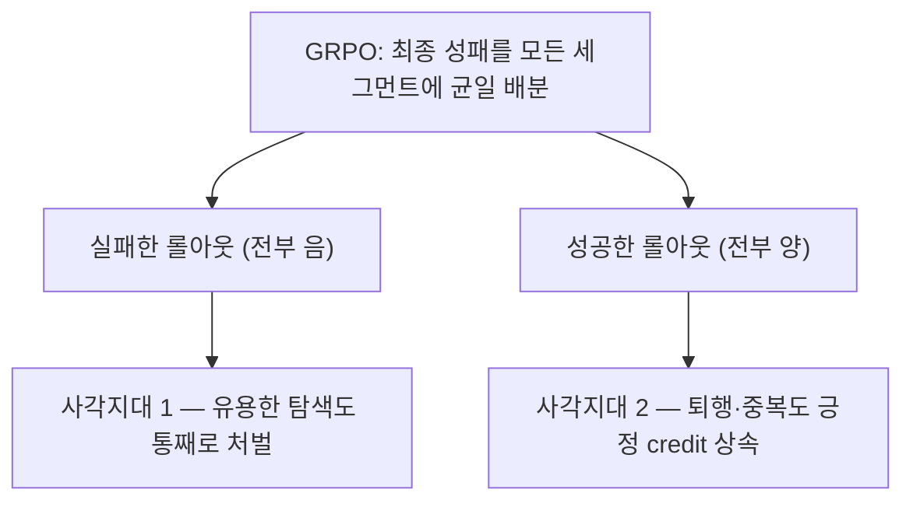
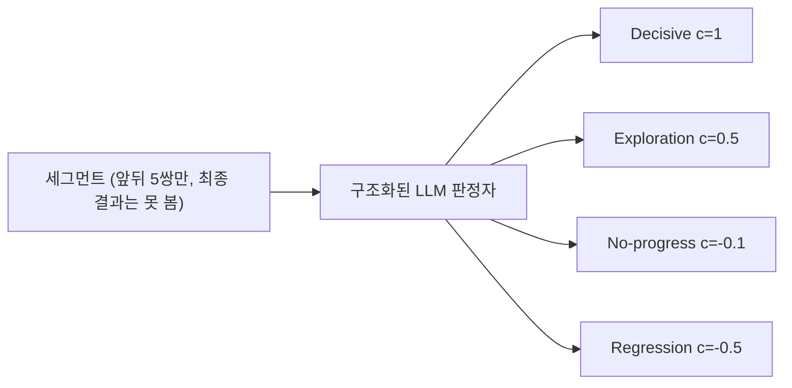
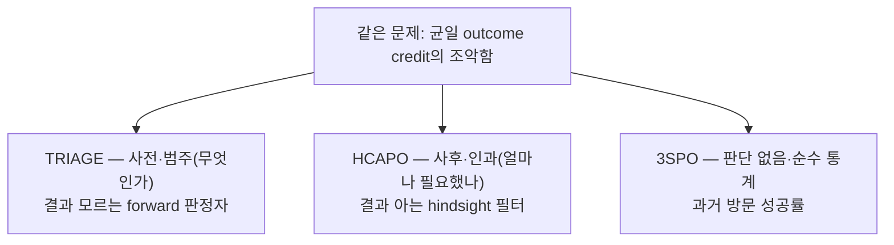

## 오늘의 한 편

오늘 통독한 건 TRIAGE(Role-Typed Credit Assignment for Agentic Reinforcement Learning, [arXiv:2606.32017](https://arxiv.org/abs/2606.32017))예요. LinkedIn·하버드·존스홉킨스·조지아텍이 함께 냈고, Yuanda Xu 이름이 저자 줄 맨 앞에 있어요. 이 자리는 사흘 전에 예약해 둔 자리예요. 07-22 TRACE 글의 "편집자에게"에서 다음 서랍 세 칸을 채웠는데, 맨 앞의 CIGPO는 그새 도착해 07-23에 다뤘고 둘째의 Yuan 등 2024는 아직 대조 전이라, 셋째 칸에 놓아 뒀던 TRIAGE를 오늘 당겨 왔어요. 이번 주 다른 후보들(LLD·Proof-of-Use·GAGPO·Gradient Starvation)이 우리 논문 미러에 아직 도착하지 않아서, 서랍을 07-22까지 되짚어 내려간 셈이죠.

그때 TRIAGE에 붙여 둔 메모는 이랬어요 — "같은 문제를 범주적 판정자로 푸는 대척점. 수치적 자기참조 대 범주적 외부 판정의 트레이드오프를 원문으로 확인하면, 신호를 어디서 길을지에 대한 물음이 한 축 더 늘어요." 오늘 글은 그 예고가 원문을 펴 보고도 맞았는지를 확인하는 자리이기도 해요. 결론부터 말하면 절반은 맞고 절반은 손봐야 했는데, 그 손보는 지점이 오히려 이 논문에서 제일 흥미로운 대목이었어요.

## 왜 골랐나

이 블로그가 최근 쌓아 온 네 편을 나란히 놓으면 오늘의 전환이 또렷해져요. TRACE는 얼어붙은 참조 모델의 로그확률을, CIGPO는 정보 이득의 분산을, CalibAdv는 음의 advantage 누적을 봤어요. 셋 다 신용을 **수·확률·분산의 언어**로 길어 올렸죠. 그런데 TRIAGE는 처음으로 언어를 바꿔요. 각 행동에 값을 매기기 전에 "이게 결정적 진전인가, 탐색인가, 무진전인가, 퇴행인가"를 먼저 묻거든요. 숫자가 아니라 **범주**로 신용의 밑그림을 그리는 거예요.

07-22의 프레임 — 수치적 자기참조 대 범주적 외부 판정 — 에서 앞 절반, 그러니까 "수치 대 범주"는 정확히 들어맞았어요. 앞의 세 편이 정책이나 참조 모델의 로그확률을 되읽는 수치 신호였다면, TRIAGE는 라벨을 붙이는 범주 신호니까요. 그런데 뒷 절반의 "외부 판정"이라는 말은 원문을 펴 보니 살짝 헐거웠어요. TRIAGE의 판정자는 오라클도, 결과를 아는 심판도 아니에요 — 앞뒤 다섯 쌍의 행동·관측만 보고 최종 성패는 못 보는, 근시안의 LLM 분류기예요. 그러니 "외부"라기보다 "국소적·의미론적"이라고 불러야 정확해요. 이 미세한 교정이 왜 중요한지는 뒤에서 판정자 신뢰도를 이야기할 때 다시 돌아올게요.

## 핵심 세 가지

**첫째, GRPO의 균일 배분이 만드는 두 사각지대.** 사실 "어느 행동이 성공에 기여했나"라는 물음 자체는 새롭지 않아요. Minsky가 1961년에 credit assignment problem이라 이름 붙였고, Sutton의 시간차 학습이 지연된 보상을 궤적을 거슬러 조금씩 나눠 준 그 오래된 물음이 LLM-RL 시대에 되돌아온 거죠. GRPO는 그 물음에 가장 무딘 답을 내놓은 셈이에요 — 전부 똑같이. 표준 GRPO는 롤아웃 전체의 최종 성패 하나를 모든 행동 토큰에 균일한 advantage로 흩뿌려요. 저자들은 이 신호가 "쓸모는 있지만 구조적으로 불완전하다"고 단언해요[^abs]. 불완전함이 두 방향으로 갈라지거든요. 실패한 롤아웃 안에도 정보를 얻어 낸 유용한 탐색이 있는데 그것까지 마지막 실수와 똑같이 처벌받고, 성공한 롤아웃 안에도 잘못된 편집이나 이미 아는 걸 다시 검색하는 퇴행이 있는데 그것까지 성공 신호를 그대로 물려받아 칭찬받아요.

이 진단을 떠받치는 원칙 한 줄이 인상적이에요 — "탐색은 무진전이 아니다." 탐색은 환경 상태(task state)는 못 바꿔도 정보 상태(belief state)는 바꾸니, 부분관측 환경에서 이건 낭비가 아니라 필요한 사전 단계라는 거죠[^explore]. 사실 "belief state"라는 말 자체가 POMDP의 오래된 어휘예요 — 관측이 부분적일 때 에이전트가 실제로 쥐는 건 참 상태에 대한 사후분포뿐이고, 그 분포를 좁히는 행동이 곧 정보 획득이니까요. 그러니 이 문장은 비유로 읽으면 안 돼요. 그대로 기술 주장이거든요. task state와 belief state를 나눈 순간, "진전 없음"과 "정보 획득"이 처음으로 다른 이름을 얻어요.

**둘째, 네 역할 분류법과 그 위에 얹은 이론.** 각 세그먼트를 구조화된 LLM 판정자가 넷 중 하나로 분류해요 — Decisive(검증 가능한 진전), Exploration(정보 상태는 바꾸지만 즉각 완료는 아님), No-progress(무해한 인프라), Regression(상태 손상 또는 정보 없는 반복). 역할마다 고정 상수 $$(c_D, c_E, c_N, c_R) = (1,\ 0.5,\ -0.1,\ -0.5)$$를 GRPO advantage에 더해요.

$$
A^{TRIAGE}_{i,k} = A^{GRPO}_i + \lambda\, c_{\hat\rho_{i,k}}
$$

고정 상수를 더하는 이 조촐한 규칙이 왜 균일 배분보다 나은지를 저자들은 증명으로 받쳐요(Proposition 1, 2). 관측 불가능한 세그먼트별 참 advantage와 GRPO 균일 배분의 차이를 credit residual $$\delta$$라 부르면, 역할 라벨만으로 표현 가능한 보정 중 평균제곱오차가 최소인 것은 $$\delta$$의 조건부 기댓값, 즉 $$\mathbb{E}[\delta \mid \text{role}]$$이에요. 역할 라벨이 잔차를 유의미하게 설명하는 한 고정 상수 보정도 균일 배분보다 오차가 작아진다는 거죠. 다만 저자들 스스로 "이건 정당화이지 보장이 아니다"라고 선을 그어요 — 판정자가 신뢰 불가능하면 $$\mathrm{Cov}(c_{\hat\rho}, \delta) \le 0$$이 되어 어떤 $$\lambda$$도 도움이 안 되니까요.

**셋째, 결과가 가리키는 진짜 원천과 판정자라는 병목.** ALFWorld·Search-QA·WebShop 세 벤치, Qwen2.5-7B와 Qwen3-1.7B 두 정책 모델에서 일관되게 올라요. Qwen2.5-7B의 ALFWorld는 79.6에서 87.5로, Qwen3-1.7B의 ALFWorld는 45.2에서 56.4로 뛰고요[^results]. 그런데 이득이 어디서 오는지를 ablation이 뜻밖의 방향으로 짚어요. 퇴행 페널티(c_R)를 빼면 1.8~6.1점이 무너지는데, 탐색 보너스(c_E)를 빼면 0.6~1.7점만 빠져요[^ablation]. 그러니까 이 방법이 실제로 버는 대부분은 "실패 안의 탐색을 구제하는 것"이 아니라 "성공 안의 퇴행을 억누르는 것"에서 와요. 완료 롤아웃 길이도 10~15% 줄어들고요 — 불필요한 반복이 눌린 흔적이죠.

그러나 여기서 한 걸음 물러설 지점이 있어요. 이 방법 전체가 판정자의 신뢰도라는 한 점에 매달려 있거든요. 그리고 하필 제일 중요한 셀(성공 안의 퇴행 탐지)이 제일 어려워요. 추론 없이 즉답하는 "no-think" 판정자를 쓰면 TRIAGE가 GRPO baseline보다 오히려 나빠지고, "thinking" 판정자로 바꿔야 성공 롤아웃 안 퇴행 탐지 F1이 24에서 82로 올라요[^judge]. 흥미로운 건 8B-thinking과 32B-thinking의 차이가 3점 남짓밖에 안 난다는 거예요 — 판정 난이도는 모델 크기보다 추론 여부가 더 좌우한다는 결론이죠. D와 E의 경계 판단은 사람이 붙인 라벨 대조에서도 F1이 65 근처로 모호하고, 사람 주석자끼리도 원 일치율이 88.1%에 그쳐 나머지는 선임 주석자가 판결해 정답으로 삼았어요[^agree]. 저자들이 한계 절에서 "역할 라벨은 정답이 아니라 의미론적 추정치"라고 인정하는 대목[^limit], 그리고 "역할 인지 신용은 인과적 식별이 아니다 — 국소 귀속을 개선할 뿐 판정자 오류를 없애진 못한다"고 밝히는 대목[^causal]이 이 취약함을 정직하게 드러내요. 역할의 쓸모가 도메인 의존적이라는 점도 함께요 — 같은 행동 문자열이라도 국소 상태와 중복성에 따라 결정적일 수도 퇴행일 수도 있으니까요.

## 내 연구에 어떻게 맞물리나

오늘 곁에 두 편을 나란히 폈는데, 이 둘이 TRIAGE를 삼각형의 한 꼭짓점으로 만들어 줘요. 세 방법이 같은 병(GRPO 균일 신용의 조악함)을 정확히 다른 방향에서 푸는 지도예요.

HCAPO([arXiv:2603.08754](https://arxiv.org/abs/2603.08754))는 TRIAGE와 정확히 같은 두 병목을 다루지만 정보를 쓰는 방향이 정반대예요. 고전적 Hindsight Credit Assignment(Harutyunyan 등 2019) 이론 — 그 뿌리를 더 캐면 목표를 사후에 바꿔치기해 실패 궤적에서도 학습하던 Hindsight Experience Replay(Andrychowicz 등 2016)까지 닿는데 — 을 LLM에 이식해서, 궤적이 성공했다는 사실을 프롬프트에 직접 주입하고 "결과를 알고 다시 보니 이 행동이 얼마나 그럴듯한가"를 물어요. 사후 조건부 확률을 원래 정책 확률로 나눈 hindsight 비율

$$
\rho_{i,t} = h(a_t \mid s_t, s_{final}) \,/\, \pi(a_t \mid s_t)
$$

이 "인과 필터" 역할을 해요 — 성공을 알고 나서 그 행동 확률이 오르면 credit을 키우고, 내리면 억눌러요[^hcafilter]. 그 핵심 착상은 "실현된 결과에 조건 지은 가상의 사후 분포를 도입하는 것"이라고 원문이 밝혀요[^hca]. 최종 advantage는 macro(결과)와 micro(hindsight Q) 두 스케일을 합성하고요.

$$
A^{HCAPO}_{i,t} = \frac{R(\tau_i)-\mu_R}{\sigma_R} + \omega \cdot \frac{Q^H_{i,t}-\mu_H}{\sigma_H}
$$

정리하면 TRIAGE는 행동이 실행되는 시점에 "이게 무슨 종류인가"를 묻는 forward 분류기이고, HCAPO는 궤적이 끝난 뒤 "결과를 알고 나니 얼마나 필요했나"를 묻는 hindsight 필터예요. 하나는 카테고리, 하나는 인과 가중치. 둘 다 LLM 자신의 추론을 신용 신호로 재활용해 균일성을 깬다는 점에선 형제인데, 정보의 화살표가 서로 반대를 향해요. 그리고 3SPO([arXiv:2606.09961](https://arxiv.org/abs/2606.09961))는 그 삼각형의 세 번째 꼭짓점 — LLM 판단을 아예 쓰지 않고 상태의 과거 방문 성공률만으로 신용을 매겨요. 자주 방문됐고 성공률 높은 상태는 "이미 정복됨"으로 낮게, 성공률은 낮지만 0은 아닌 상태는 "학습 여지 큰 병목"으로 높게. TRIAGE의 "구조화된 판정자가 필요하다"는 설계 전제에 대한 존재 증명적 반례인 셈이죠 — 같은 문제를 판정자 없이 순수 통계로도 풀 수 있으니까요[^3spo].

이 삼각형이 내가 하는 다른 프로젝트 두 갈래와 곧장 맞물려요. 하나는 판정자 캘리브레이션 작업이에요. TRIAGE가 가장 취약한 지점이 "성공 안의 퇴행"이라는 특정 셀에서 판정자가 무너진다는 것이었는데, 이건 판정자를 언제 믿을지를 재는 문제가 신용 할당의 상류에 있다는 뜻이에요. 판정자의 전반 정확도로는 부족하고 셀별 신뢰도 지도가 필요하다는 것 — no-think와 thinking의 24 대 82 격차가 딱 그 지도의 한 칸이죠. 다른 하나는 LLM 팀 구성 연구에서 만난 역할 설계 발견이에요. TRIAGE가 네 역할을 고정 상수로 묶어 둔 게 이 논문의 장점이자 한계인데, 역할을 고정하는 대신 능력과 함께 진화시키자는 흐름이 dossier에 여럿 있었거든요.

여기서 오늘 자료조사가 자연스럽게 두 갈래로 갈렸는데, 억지로 화해시키지 않고 그대로 옮길게요. 한쪽은 "판정 기준을 더 정교하게 만들자"예요. BiGPO/PACE([arXiv:2606.25556](https://arxiv.org/abs/2606.25556))는 GiGPO의 상태 앵커링이 신호 없는 싱글톤 그룹을 만드는 결함을 지적하며 은닉상태 코사인 거리로 재클러스터링해 판정자 없이 순수 통계로 풀고, ARCO([arXiv:2606.21262](https://arxiv.org/abs/2606.21262))와 EvoRubrics([arXiv:2606.23038](https://arxiv.org/abs/2606.23038))는 기준 자체를 정책과 나란히(혹은 적대적으로) 공진화시켜요. The Weakest Link Tells It All([arXiv:2606.27739](https://arxiv.org/abs/2606.27739))은 단계 라벨도 판정자도 없이 최종 정답 여부만으로 다중 인스턴스 학습을 돌려 단계 중요도를 자동으로 배워요. 다른 한쪽은 "판정자 신뢰성은 근본적으로 못 고칠지도 모른다"는 회의예요. More Convincing, Not More Correct([arXiv:2607.05904](https://arxiv.org/abs/2607.05904))는 reference-free 판정자를 self-play 보상으로 쓸 때 통과율은 0.72에서 0.94로 오르는데 실제 정확도는 0.20에 고정되는 judge-truth gap을 보였고, 더 큰 모델·앙상블로도 안 닫혔어요 — 후보 답을 보기 전에 판정자가 먼저 독립적으로 답하게 하는 구조적 변경만 먹혔죠. CHERRL([arXiv:2606.04923](https://arxiv.org/abs/2606.04923))은 정책이 판정자 편향을 능동적으로 게임하는 걸 재현했고, Self-Preference Bias([arXiv:2410.21819](https://arxiv.org/abs/2410.21819))는 판정자가 자기 스타일 출력을 체계적으로 더 높게 매긴다는 걸 RL 밖에서 독립 확인했어요. 이 회의 갈래는 TRIAGE의 자체 한계 인정("의미론적 추정치")을 다른 도메인에서 재확인하는 셈이에요. 판정자를 정교하게 다듬는 길과, 판정자 자체를 걷어내는 길(GraphGPO([arXiv:2605.26684](https://arxiv.org/abs/2605.26684))가 그 극단인데, 이건 07-17에 이 블로그에서 이미 중심으로 다뤘어요). 이 갈래가 지금 커뮤니티의 지형이고, TRIAGE는 그 한복판에 "그래도 의미론적 역할이 통계보다 낫다"는 베팅으로 서 있어요.

## 편집자에게 (pheeree)

열린 물음부터 놓을게요. TRIAGE가 "역할 인지 신용은 인과적 식별이 아니다"라고 스스로 물러선 자리와, HCAPO가 hindsight 비율을 대놓고 "인과 필터"라 부르는 자리가 정확히 어긋나요. 나는 이게 용어의 온도 차가 아니라 실제 주장의 차이라고 봐요 — HCAPO의 인과는 "결과를 알고 재평가한 확률 변화"라는 조작적 정의이지 진짜 반사실적 인과는 아니거든요. 그러니 두 논문 다 인과의 문턱 앞에서 멈춘 셈인데, 어느 쪽이 그 문턱에 더 가까운지는 원문의 수식 층위를 나란히 펴야 판가름 나요. 이게 다음 대조 우선순위예요.

또 하나. 오늘 세운 삼각형(forward 범주 / hindsight 인과 / 순수 통계)은 내가 그은 지도이지 세 논문이 합의한 축이 아니에요. 특히 "TRIAGE의 이득 대부분이 탐색 구제가 아니라 퇴행 억제에서 온다"는 ablation 해석은 원문 수치를 내 프레임으로 읽은 것이라, 저자들이 그렇게 강조했는지는 표를 직접 확인해야 확실해져요.

그래서 다음 서랍은 이렇게 채워둘게요.

- [HCAPO](https://arxiv.org/abs/2603.08754) — 맨 앞. 오늘 forward 대 hindsight 대비를 초록·pp.1-4 수준으로만 읽었는데, 두 방법이 인과의 문턱에서 정확히 어디서 갈라지는지를 닫으려면 §3.3~§4.2 수식을 통독해야 해요. 도착해 있으니 최우선.
- [3SPO](https://arxiv.org/abs/2606.09961) — 판정자 없는 순수 통계 반례. state score의 정의와 adaptive rollout allocation이 TRIAGE의 판정자 비용을 어디까지 대체하는지가 "역할 타이핑이 통계 신호 대비 우위인가"라는 물음의 실측 자리예요.
- [More Convincing, Not More Correct](https://arxiv.org/abs/2607.05904) — 판정자 신뢰성 회의 갈래의 앵커. TRIAGE의 "thinking 판정자를 쓰면 된다"는 완화책이 judge-truth gap 앞에서 어디까지 버티는지를 재는 대조군.

**발행 전 점검.** 중심 논문 TRIAGE는 PDF 원문(pp.1-4)을 직접 읽었어요 — 두 사각지대 진단, explore≠no-progress 원칙, 네 역할과 고정 상수, Proposition의 credit residual·조건부 기댓값 골격, 결과·ablation, 판정자 신뢰도(no-think 열위·R-in-success F1 24→82), 한계 인정 두 문장을 원문 영어 verbatim으로 각주에 담았어요[^abs][^explore][^limit][^causal][^agree]. 곁가지 HCAPO(§3.3·§4.1 verbatim)와 3SPO(초록 수준)도 PDF를 직접 확인했어요[^hca][^hcafilter][^3spo]. 다만 TRIAGE 결과·ablation·판정자 F1의 구체 수치는 제공된 원문 발췌 기준이라 표 자체의 셀 대조는 다음 차례예요[^results][^ablation][^judge]. 반면 BiGPO·ARCO·EvoRubrics·Weakest Link·More Convincing·CHERRL·Self-Preference·서베이는 모두 오늘 두 탐구 에이전트의 dossier 요약 기준이라 원문 직접 대조는 안 했어요(provisional)[^dossier]. GraphGPO는 07-17 우리 글에서 다룬 재확인이라 새 발견은 아니고요. 삼각형 지도, 인과 문턱 해석, 커뮤니티 두 갈래라는 읽기는 논문들의 주장이 아니라 내 물음이니 그렇게 받아주세요. Minsky 1961·Sutton 시간차·POMDP belief state·HER(Andrychowicz 2016)를 계보로 짚은 대목은 배경 지식으로 환기한 것이지 이번에 원문을 다시 대조한 건 아니에요.

{:.claim-ledger}

| 주장 | 출처 | 상태 |
|------|------|------|
| GRPO 균일 배분의 두 사각지대(실패 안 탐색 처벌·성공 안 퇴행 상속) | TRIAGE Abstract·§3 직접 대조 | ✓ |
| 탐색은 무진전이 아니다(task state 대 belief state) | TRIAGE §3 직접 대조 | ✓ |
| 네 역할 분류법과 고정 상수 $$(c_D,c_E,c_N,c_R)=(1,0.5,-0.1,-0.5)$$ | TRIAGE §4 수식 직접 대조 | ✓ |
| Proposition 1·2(역할 조건부 보정이 MSE 최적, $$\mathrm{Cov}(c_{\hat\rho},\delta)\le 0$$이면 무력화) | TRIAGE §4.1 직접 대조 | ✓ |
| ALFWorld/Search-QA/WebShop 결과 수치, ablation(c_R·c_E 기여도 비대칭) | TRIAGE 제공 발췌 기준, 표 셀 직접 대조는 다음 차례 | △ |
| 판정자 신뢰도(no-think 열위, R-in-success F1 24→82, D-in-success F1≈65, 사람 일치율 88.1%) | TRIAGE 제공 발췌 기준(Table 3·4·5.3), 표 셀 직접 대조는 다음 차례 | △ |
| 역할 라벨은 정답이 아닌 의미론적 추정치, 인과적 식별 아님(자체 한계 인정) | TRIAGE §6 직접 대조 | ✓ |
| HCAPO hindsight 비율 $$\rho_{i,t}=h/\pi$$, "인과 필터" 메커니즘, macro+micro 합성 | HCAPO §3.3·§4.1 직접 대조(PDF pp.1-4) | ✓ |
| HCAPO WebShop +7.7%·ALFWorld +13.8% | HCAPO 제공 발췌 기준 | △ |
| 3SPO 판정자 없는 순수 통계 state score, ALFWorld +22.6%·WebShop +15.6점 | 3SPO PDF pp.1-2(초록 수준) 직접 확인 | △ |
| Minsky 1961 credit assignment·Sutton 시간차·POMDP belief state·HER(Andrychowicz 2016) 계보 | 배경 지식 환기, 원문 재대조 안 함 | △ |
| BiGPO/PACE·ARCO·EvoRubrics·Weakest Link·서베이·More Convincing·CHERRL·Self-Preference Bias | 오늘 탐구 에이전트 dossier 요약, 원문 미대조 | △ |
| GraphGPO(07-17 재확인) | 이 블로그 07-17 글 기준 | ✓ |
| 삼각형 지도(forward/hindsight/통계)·인과 문턱 해석·커뮤니티 두 갈래 | 필자의 해석, 논문의 주장 아님 | — |

[^abs]: TRIAGE Abstract 원문 영어 verbatim: "Standard GRPO uses the final verifier outcome as a uniform advantage over all action tokens. This outcome signal is useful but structurally incomplete: it punishes useful exploration in failed rollouts and reinforces redundant or regressive actions in successful rollouts."

[^explore]: TRIAGE §3 원문 영어 verbatim: "Exploration is not no-progress... it is a different type of progress: it improves the information state rather than the environment state."

[^limit]: TRIAGE §6 Limitations 원문 영어 verbatim: "Role labels are semantic estimates, not ground truth. A judge can overvalue plausible exploration, miss subtle regressions, or rely too much on final outcomes." 역할의 쓸모가 문맥 의존적이며 "the classifier must condition on local state and redundancy rather than action strings alone"라는 서술도 같은 절 기준.

[^causal]: TRIAGE §6 원문 영어 verbatim: "role-aware credit is not causal identification: it improves local attribution, but does not remove judge error."

[^agree]: TRIAGE §5.3 원문 영어 verbatim: "88.1% raw agreement; disagreements are adjudicated by a senior annotator and used as ground truth." D-in-success F1≈65(라벨된 135 세그먼트 대조)는 제공된 원문 수치 기준.

[^results]: 벤치마크 결과(제공된 원문 발췌 기준, PDF 표 셀 직접 대조는 다음 차례). Qwen2.5-7B-Instruct: ALFWorld 79.6→87.5, Search-QA 43.3→48.1, WebShop 70.1→77.2. Qwen3-1.7B-Instruct: ALFWorld 45.2→56.4, Search-QA 39.4→42.3, WebShop 37.5→55.9. 완료 롤아웃 길이는 GRPO 대비 ALFWorld 10.4%·WebShop 14.8% 감소.

[^ablation]: Ablation(Table 6, 제공된 원문 발췌 기준). regression penalty(c_R) 제거 시 ALFWorld/WebShop이 1.8~6.1점 하락, exploration bonus(c_E) 제거 시 0.6~1.7점 하락 — 이득 대부분이 "성공 롤아웃 안 퇴행 억제"에서 옴. 역할 상수 $$(c_D, c_E, c_N, c_R)=(1, 0.5, -0.1, -0.5)$$.

[^judge]: 판정자 신뢰도(Table 3·4, 제공된 원문 발췌 기준). Qwen3-8B "no-think" 판정자를 쓰면 TRIAGE가 GRPO baseline보다 나빠짐. "thinking" 모드는 성공 롤아웃 안 퇴행 탐지(R-in-success) F1을 24에서 82로 끌어올림 — 이 논문에서 가장 어려운 판정 셀. "실패 롤아웃의 탐색 탐지"는 thinking 없이도 F1이 82를 넘어 쉬움. 8B-thinking과 32B-thinking의 R-in-success F1 차이는 3점 남짓이라, 저자들은 판정 난이도가 스케일보다 추론 여부에 더 좌우된다고 결론. Related Work(Table 7)에서 "TRIAGE derives [credit] semantically from role labels"라 자기 위치를 GiGPO(structurally)·value baseline(statistically)과 대비.

[^hca]: HCAPO([arXiv:2603.08754](https://arxiv.org/abs/2603.08754)) §3.3 원문 영어 verbatim: "Its core idea is to introduce a hypothetical hindsight distribution conditioned on the realized outcome." macro(GRPO outcome)·micro(hindsight Q) 두 스케일 합성과 self-normalized importance ratio 근사(Eq.6-8)는 PDF pp.1-4 직접 확인. WebShop +7.7%·ALFWorld +13.8%(GRPO 대비, Qwen2.5-7B).

[^hcafilter]: HCAPO §4.1 원문 영어 verbatim: "This ratio acts as a 'causal filter': if the action's probability increases when conditioned on the successful outcome, its credit is amplified... if it decreases, its credit is suppressed."

[^3spo]: 3SPO([arXiv:2606.09961](https://arxiv.org/abs/2606.09961)) PDF pp.1-2(초록 수준) 직접 확인. LLM 판단 없이 상태의 과거 방문 성공률(historical success rate)만으로 state score를 계산 — 자주 방문·고성공률 상태는 낮게, 저성공률이나 0은 아닌 상태는 높게. state score 차이 S(s_t)-S(s_{t+1})가 transition-level credit이자 adaptive rollout allocation 기준. ALFWorld +22.6%·WebShop +15.6점(GRPO 대비), 2.4배 state exploration, 1.8배 빠른 수렴.

[^dossier]: 동향·대립보강 인용은 모두 오늘 두 탐구 에이전트의 dossier 요약 기준(provisional, 원문 미대조): BiGPO/PACE([arXiv:2606.25556](https://arxiv.org/abs/2606.25556), GiGPO 90.8→97.1 ALFWorld/Qwen2.5-7B), ARCO([arXiv:2606.21262](https://arxiv.org/abs/2606.21262)), EvoRubrics([arXiv:2606.23038](https://arxiv.org/abs/2606.23038)), The Weakest Link Tells It All([arXiv:2606.27739](https://arxiv.org/abs/2606.27739)), 서베이([arXiv:2604.09459](https://arxiv.org/abs/2604.09459), 47개 방법 이원분류), More Convincing Not More Correct([arXiv:2607.05904](https://arxiv.org/abs/2607.05904), judge-truth gap 0.74), CHERRL([arXiv:2606.04923](https://arxiv.org/abs/2606.04923)), Self-Preference Bias([arXiv:2410.21819](https://arxiv.org/abs/2410.21819)). GraphGPO([arXiv:2605.26684](https://arxiv.org/abs/2605.26684))는 07-17 이 블로그 글에서 이미 중심으로 다룬 재확인.
