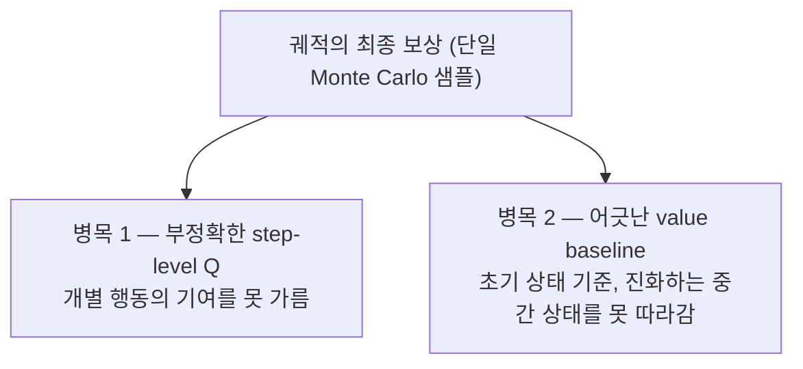
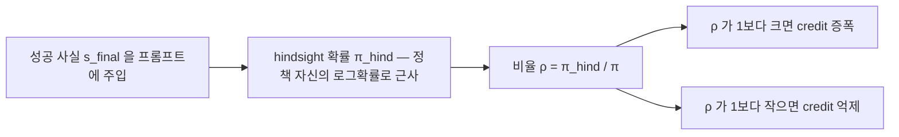
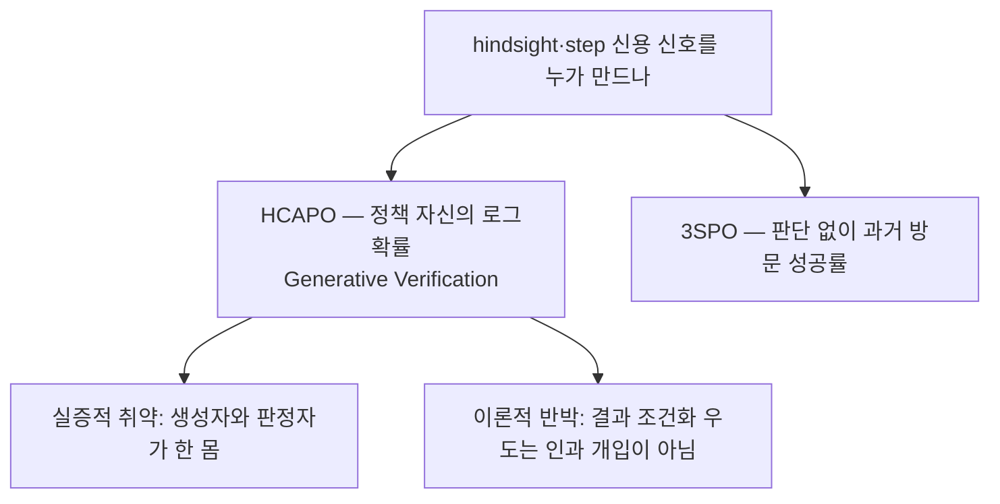

## 오늘의 한 편

어제 TRIAGE 글을 닫으면서 다음 서랍 맨 앞 칸에 HCAPO를 놓아 뒀어요. 그때 붙인 쪽지는 "forward 대 hindsight 대비를 초록·pp.1-4 수준으로만 읽었으니, 두 방법이 인과의 문턱에서 정확히 어디서 갈라지는지를 닫으려면 §3.3~§4.2 수식을 통독해야 한다"였죠. 오늘이 그 쪽지를 회수하는 자리예요. 어제는 앞 네 쪽만 훑고 예약해 뒀던 걸, 오늘은 §7 한계 절까지 펴서 읽었어요.

읽을 논문은 HCAPO(Hindsight Credit Assignment for Long-Horizon LLM Agents, [arXiv:2603.08754](https://arxiv.org/abs/2603.08754))예요. 난징대를 비롯한 11명이 3월 7일에 냈고, Hui-Ze Tan·Xiao-Wen Yang·Hao Chen이 저자 줄 앞머리에 있어요. 결론부터 적어 두면, 어제 열어 둔 "인과의 문턱" 물음은 원문을 펴자 오히려 더 또렷한 모양으로 남았어요. HCAPO는 자기 신호를 대놓고 "인과 필터"라 부르는데, 정작 그 필터를 만드는 손은 정책 자신의 로그확률이거든요. 강한 이름과 조심스러운 재료가 한 방법 안에 같이 들어 있는 셈이에요.

## 왜 골랐나

어제 세 논문을 삼각형으로 묶었어요 — 행동이 실행되는 순간 "이게 무슨 종류인가"를 묻는 forward 분류기(TRIAGE), 궤적이 끝난 뒤 "결과를 알고 나니 얼마나 필요했나"를 묻는 hindsight 필터(HCAPO), 그리고 아무 판단 없이 과거 통계만 세는 순수 통계(3SPO). HCAPO는 그 삼각형의 hindsight 꼭짓점이에요.

당겨 온 진짜 이유는 용어 한 개예요. 어제 TRIAGE는 자기 역할 신용을 두고 "인과적 식별이 아니다, 국소 귀속을 개선할 뿐"이라고 스스로 물러섰어요. 그런데 HCAPO는 같은 자리에서 정반대로 나아가 자기 비율을 "causal filter"라 명명해요[^filter]. 두 논문이 인과라는 단어를 정확히 어긋난 온도로 쓰는 거죠. 나는 이게 말버릇 차이가 아니라 주장의 차이라고 봤고, 어느 쪽이 문턱에 더 가까운지는 HCAPO가 그 필터를 실제로 어떻게 짓는지를 봐야 판가름 난다고 적어 뒀어요. 오늘은 그 제작 과정을 §4.2까지 따라가 봅니다.

## 핵심 세 가지

**첫째, value-free 방법이 안고 가는 두 병목.** HCAPO의 출발점은 GRPO 같은 value-free 방법이 장기·다단계 과제에서 부딪히는 두 근본 병목이에요[^abs]. 하나는 부정확한 step-level Q 추정이에요. 궤적 전체를 단 하나의 Monte Carlo 샘플, 그러니까 마지막에 받은 성패 신호 하나로 평가하니, 그 안의 개별 행동이 각각 얼마나 기여했는지를 가를 수가 없어요. 다른 하나는 어긋난 value baseline이에요. 기준값을 초기 상태에 맞춰 두면, 상호작용이 길어지며 계속 변하는 중간 상태의 가치를 못 따라가요. 어제 TRIAGE가 "균일 배분"이라 부른 조악함을, HCAPO는 "샘플이 하나뿐"과 "기준이 초기에 고정됨"이라는 두 갈래로 다시 진단하는 거예요.

**둘째, hindsight 비율과 그 비율을 만드는 손.** HCAPO는 고전 HCA 이론(Harutyunyan 등 2019, NeurIPS)을 LLM 에이전트에 처음 이식해요. 그 원조 이론이 credit을 물은 방식부터가 인과가 아니라 추론이었다는 게 오늘 글의 복선이에요 — "이 행동이 그 결과로 이어졌음을 알 때 얼마나 더 그럴 법해지나"라는 조건부 확률 물음이었지, 세계에 개입을 가해 본 건 아니거든요. 그 뿌리를 더 캐면 실패한 궤적의 목표를 사후에 바꿔치기해 배우던 Hindsight Experience Replay(Andrychowicz 등 2016)까지 닿고요. 핵심은 사후 확률을 원래 정책 확률로 나눈 hindsight 비율이에요.

$$
\rho_{i,t} = h(a_t \mid s_t, s_{final}) \,/\, \pi(a_t \mid s_t)
$$

말로 한 겹 풀면 이래요. 성공했다는 사실 $$s_{final}$$을 알고 그 행동을 다시 봤을 때 확률이 원래보다 오르면 그 행동에 준 credit을 키우고, 내리면 억눌러요. 이게 §4.1이 "인과 필터"라 부르는 작동이에요[^filter]. 여기까지는 이론이고, 문제는 사후 분포 $$h$$를 어디서 얻느냐예요. HCAPO는 $$h$$를 위한 모델을 따로 학습하지 않아요. 대신 성공 사실을 프롬프트에 직접 넣고, 그 조건에서 정책 자신이 그 행동을 다시 생성할 로그확률을 재봐요[^genver] — 저자들 표현으로는 hindsight 분포를 "시뮬레이션"하는 거죠.

$$
\pi_{\text{hind}}(a_t) = \exp\!\Big(\frac{1}{T_{\text{temp}}\,\lvert a_t\rvert} \sum_j \log \pi_\theta(y_j \mid y_{<j},\, s_t,\, s_{final})\Big)
$$

$$
\rho_t = \mathrm{clip}\!\Big(\frac{\pi_{\text{hind}}(a_t)}{\bar\pi_{\text{hind}}},\ C_{\min},\ C_{\max}\Big)
$$

이 대목이 오늘 글의 중심이라 보폭을 줄일게요. hindsight 신호를 만드는 건 별도 심판이 아니라 정책 그 자신이에요. 성공을 귀띔받은 모델이 자기 과거 행동을 스스로 채점하는 구조인 거죠.

**셋째, macro와 micro를 합치고, 결과가 그것을 떠받치는 자리.** 최종 advantage는 두 스케일을 더해요. 앞항은 GRPO의 궤적 수준 매크로 신호로 안정성을 맡고, 뒷항은 hindsight Q의 step 수준 마이크로 신호로 정밀도를 맡아요.

$$
A^{HCAPO}_{i,t} = \frac{R(\tau_i)-\mu_R}{\sigma_R} + \omega \cdot \frac{Q^H_{i,t}-\mu_H}{\sigma_H}
$$

별도 크리틱 네트워크 없이 병목 상태를 골라내는 게 이 설계의 자랑이에요 — 마이크로 항의 평균 $$\mu_H$$가 낮은 가치와 높은 가치 사이의 적응적 문턱으로 작동해 어느 상태가 학습 여지 큰 길목인지를 짚는다는 걸 저자들은 이론적으로 논증해요. 성공한 궤적 안에 섞인 음의 hindsight 신호는 "do-no-harm" 마스크로 0으로 눌러 보호하고요. 결과는 Qwen2.5-7B 기준으로 뚜렷해요. WebShop 성공률이 66.1%에서 73.8%로(+7.7%), ALFWorld는 77.6%에서 91.4%로(+13.8%) 오르고, 시간 평활을 얹으면 같은 모델이 96.9%까지 닿아 거의 완벽에 가까워져요[^results]. 검색 결합 QA에서도 7B 평균 48.3%로 Search-R1·StepSearch를 넘고 GiGPO와 어깨를 나란히 해요.

그러나 여기서 한 발 물러설 자리가 있어요. 저자들 스스로 §7에서 두 가지를 인정하거든요.

> "Despite its effectiveness, HCAPO relies on the base model's reasoning capacity, which may limit the precision of credit signals in small models. Furthermore, while striving to preserve the agent's decision-making process, the inclusion of hindsight information inevitably introduces some degree of out-of-distribution data."[^limit]

앞 문장은 어제 TRIAGE에서 본 것과 같은 그림자예요 — 신호의 질이 밑바탕 모델의 추론력에 매달려 있다는 것. 뒤 문장이 더 아파요. 성공 사실을 프롬프트에 주입하는 그 행위 자체가, 학습 중인 정책이 실제로는 접근할 수 없는 미래 정보를 조건으로 끌어들이는 일이라, 분포 밖 데이터를 불가피하게 섞어 넣어요. 인과 필터라는 이름이 강했던 만큼, 그 필터가 서 있는 바닥이 자기 자신을 채점하는 모델이라는 사실이 더 도드라져요.

## 내 연구에 어떻게 맞물리나

HCAPO의 Generative Verification은 결국 LLM을 판정자로 쓰는 한 형태예요. 성공 여부를 귀띔받은 모델이 자기 로그확률로 과거 행동을 재평가하니까요. 그리고 나는 이 "LLM을 판정자로 쓰기"의 취약함을 이미 자로 재본 적이 있어요.

우리 재측정 파일럿에서 같은 자리를 실측했거든요. 원 논문의 판정자는 사람 대비 Cohen's $$\kappa$$가 0.77이었고 사람끼리의 일치율은 0.88이었는데, 우리가 최신 세대 모델로 같은 파이프라인을 재현하자 $$\kappa$$가 0.056까지 주저앉았어요. 파서를 병기해 인공물을 소거해도 값이 그대로여서, "판정자를 믿을 수 있는가"가 재측정의 독립 선행 질문으로 승격됐죠(이 붕괴는 연구 로그 2편 "저울이 저울과 안 맞을 때"에 적어 뒀어요). 그러니 HCAPO가 인과 필터의 바닥에 깔아 둔 자기 채점은, 우리가 이미 저울로 한 번 부딪힌 그 취약함과 같은 지반 위에 서 있어요.

여기서 어제와 겹치는 논문 두 편이 다시 걸어 들어와요. 다만 어제와는 다른 문으로요. 어제 나는 Self-Play Reward Hacking([arXiv:2607.05904](https://arxiv.org/abs/2607.05904))과 Self-Preference Bias([arXiv:2410.21819](https://arxiv.org/abs/2410.21819))를 TRIAGE의 의미론적 역할 판정자를 겨눠 인용했어요. 오늘 이 둘은 HCAPO의 자기 생성 hindsight 비율을 겨눠요. 앞 논문은 후보 답을 조건으로 두면 판정자가 재는 건 정답 여부가 아니라 그럴듯함이라는 걸 보였는데[^selfplay], HCAPO에서 성공 사실을 조건으로 둔 사후 확률도 정확히 "그럴듯함의 재가중"이라 같은 함정의 다른 얼굴이에요. 뒤 논문은 판정자가 자기 생성 분포에 익숙한 텍스트를 체계적으로 선호한다는 걸 RL 밖에서 확인했고요. 메커니즘은 서로 다른데 비판은 같은 자리에 다시 내려앉아요.

이론 쪽에도 같은 방향을 가리키는 두 뿌리가 있어요(둘 다 오늘 dossier 기준이라 원문 대조 전이에요). Mesnard 등의 Counterfactual Credit Assignment([arXiv:2011.09464](https://arxiv.org/abs/2011.09464))는 hindsight 신용이 편향 없이 성립하려면 hindsight 정보가 에이전트의 행동에 대한 정보를 담지 않도록 구조적으로 제약해야 한다고 명시한다고 해요 — 결과에 단순 조건화한 우도 재평가는 그 자체로 인과적이지 않다는 거죠[^dossier]. 앞서 §둘째에서 짚은 계보가 여기서 대가를 청구하는 셈이에요. HCA가 애초에 조건부 확률 물음으로 출발했으니, 그 후손이 "인과"를 자처하려면 원조가 갖지 않았던 독립성 조건을 어디선가 새로 벌어야 하니까요. Xu 등의 Rewriting History with Inverse RL([arXiv:2002.11089](https://arxiv.org/abs/2002.11089))은 다른 도메인에서 hindsight 재라벨링이 do-calculus 개입이 아니라 역강화학습과 수학적으로 동등함을 증명했고요. 두 결과를 겹쳐 읽으면, HCAPO가 자기 로그확률로 $$h$$를 근사할 때 그 독립성 제약을 충족하는지가 검증되지 않은 채 "인과"라는 이름만 앞서 있다는 의심이 들어요.

이 삼각형의 세 번째 꼭짓점이 그 의심에 다른 각도로 빛을 비춰요. 3SPO([arXiv:2606.09961](https://arxiv.org/abs/2606.09961))는 LLM의 어떤 판단도 없이, 오직 상태의 과거 방문 성공률이라는 순수 통계만으로 state score를 매겨 step 신용을 감독해요[^3spo]. HCAPO가 판정 비용을 정책 자신에게 지우는 방향이라면, 3SPO는 판정 자체를 없애 버리는 정반대 방향이에요. 같은 ALFWorld·WebShop 쌍에서 3SPO는 GRPO 대비 각각 +22.6%, +15.6점을 벌고요. "판정자가 필요한가"라는 물음에 3월과 6월의 두 논문이 정반대로 답한 셈이라, HCAPO의 자기 채점이 정말 필요한 비용인지를 되묻게 해요.

## 편집자에게 (pheeree)

먼저 오늘 남은 물음부터 놓을게요. HCAPO의 "인과 필터"가 정말 인과에 얼마나 가까운지는, 인과가 성립할 조건을 명시한 원문을 나란히 펴야 판가름 나요. Mesnard 등이 말하는 독립성 제약을 HCAPO의 self-normalized 근사가 충족하는지 — 이건 dossier 요약으로는 못 닫고 수식 층위에서만 닫혀요. 그러니 어제 열어 둔 인과의 문턱 물음은 오늘 HCAPO 쪽 좌표를 얻었을 뿐, 아직 닫히지 않았어요.

한 가지 더. 오늘 "이득이 do-no-harm 마스크와 macro 항의 안정성에서 온다"는 식으로 설계를 읽었는데, $$\mu_H$$가 적응적 문턱으로 작동한다는 §5.2 논증과 마스크의 효과는 제공된 서술 기준이라 원문 증명과 ablation 표를 직접 펴야 확실해져요. 삼각형과 인과 문턱 해석은 여전히 내가 그은 지도이지 세 논문의 합의가 아니고요.

그래서 다음 서랍은 이렇게 채워 둘게요.

- [Counterfactual Credit Assignment ([arXiv:2011.09464](https://arxiv.org/abs/2011.09464))](https://arxiv.org/abs/2011.09464) — 맨 앞. 어제 열어 둔 인과의 문턱 물음을 정확히 닫아 줄 후보예요. hindsight 신용이 편향 없이 인과적이려면 필요한 구조적 조건(독립성 제약)을 명시한다니, HCAPO의 자기 로그확률 근사가 그 조건을 충족하는지 원문 수식으로 대조하고 싶어요.
- [ReBel ([arXiv:2605.20061](https://arxiv.org/abs/2605.20061))](https://arxiv.org/abs/2605.20061) — HCAPO와 똑같은 ALFWorld·WebShop 쌍에서, 실패의 원인을 hindsight 재평가가 아니라 부분관측 아래 belief drift로 설명하는 경쟁 진단이에요. 같은 숫자를 다른 인과 이야기로 읽는 두 논문을 나란히 놓고 싶어요.
- [The Dark Room in the Reward Channel ([arXiv:2607.21273](https://arxiv.org/abs/2607.21273))](https://arxiv.org/abs/2607.21273) — HCAPO의 macro+micro 합성이 이 논문이 경고하는 "보상 채널 증폭" 함정을 어떻게 피하는지(또는 못 피하는지)를 원문에서 확인하고 싶어요. 신호를 어느 채널로 넣느냐가 안정성을 가른다는 대목이 마이크로 항의 z-score 정규화와 곧장 맞닿거든요.

**발행 전 점검.** 중심 논문 HCAPO는 제공된 원문 verbatim 발췌를 각주에 담아 대조했어요 — 두 병목(Abstract), 인과 필터(§4.1), Generative Verification의 성공 사실 주입(§4.2), 결과 수치(WebShop 66.1→73.8·ALFWorld 77.6→91.4·평활 96.9), 그리고 §7 한계 두 문장을 영어 verbatim으로 실었어요[^abs][^filter][^genver][^results][^limit]. hindsight 비율·$$\pi_{\text{hind}}$$·composite advantage 수식은 제공된 정의 기준이에요. 다만 $$\mu_H$$가 적응적 문턱으로 작동한다는 §5.2 논증과 do-no-harm 마스크(§4.3)의 효과는 verbatim 없이 서술만 확인해서, 증명·표 셀 직접 대조는 다음 차례예요. 곁가지 3SPO는 초록 수준 verbatim으로 확인했고요[^3spo]. 반면 Self-Play Reward Hacking·Self-Preference Bias·Counterfactual Credit Assignment·Rewriting History·ReBel·Dark Room·HiMPO·Hindsight Policy Optimization·서베이는 모두 오늘 두 탐구 에이전트의 dossier 요약 기준이라 원문 직접 대조는 안 했어요(provisional)[^selfplay][^dossier]. mast-remeasure의 $$\kappa$$ 수치(0.77·0.88 대 0.056)는 우리 파일럿 실측이에요. 삼각형 지도·인과 문턱 해석·"같은 함정의 다른 얼굴"이라는 읽기, 그리고 "HCA의 추론적 출발이 후손에게 독립성 조건을 청구한다"는 계보 해석은 논문들의 주장이 아니라 내 물음이니 그렇게 받아 주세요. HCA(Harutyunyan 2019)·HER(Andrychowicz 2016) 계보는 배경 지식으로 환기한 것이지 이번에 원문을 재대조한 건 아니에요.

{:.claim-ledger}

| 주장 | 출처 | 상태 |
|------|------|------|
| value-free 방법의 두 병목(부정확한 step-level Q·어긋난 value baseline) | HCAPO Abstract verbatim 대조 | ✓ |
| hindsight 비율 $$\rho_{i,t}=h(a_t \mid s_t,s_{final})/\pi(a_t \mid s_t)$$, "causal filter" 메커니즘 | HCAPO §3.3·§4.1 verbatim 대조 | ✓ |
| Generative Verification — 성공 사실 $$s_{final}$$ 주입 후 정책 자신의 로그확률로 $$h$$ 근사 | HCAPO §4.2 verbatim 대조 | ✓ |
| composite advantage $$A^{HCAPO}_{i,t}$$(macro+micro), self-normalized clip 비율 | HCAPO 제공 수식 정의 기준 | ✓ |
| $$\mu_H$$가 적응적 문턱으로 작동(§5.2 증명), do-no-harm 마스크(§4.3) | 제공 서술 기준, 증명·표 셀 직접 대조는 다음 차례 | △ |
| 결과(WebShop 66.1→73.8·ALFWorld 77.6→91.4·평활 96.9, QA 평균 48.3) | HCAPO Abstract·Highlights verbatim 대조 | ✓ |
| 밑바탕 모델 추론력 의존·hindsight 정보의 OOD 유입(자체 한계 인정) | HCAPO §7 verbatim 대조 | ✓ |
| 3SPO 판정자 없는 순수 통계 state score, ALFWorld +22.6%·WebShop +15.6점 | 3SPO Abstract verbatim 확인 | ✓ |
| 우리 재측정 파일럿의 judge 신뢰도 붕괴($$\kappa$$ 0.77·사람 0.88 대 재현 0.056) | 파일럿 1차 실측, 연구 로그 2편 기록 | ✓ |
| Self-Play Reward Hacking·Self-Preference Bias(생성자=판정자 붕괴, 자기 선호 편향) | 오늘 dossier 요약, 원문 미대조 | △ |
| Counterfactual Credit Assignment 독립성 제약·Rewriting History의 hindsight=IRL 등가 | 오늘 dossier 요약, 원문 미대조 | △ |
| ReBel·Dark Room·HiMPO·Hindsight Policy Optimization·서베이 | 오늘 dossier 요약, 원문 미대조 | △ |
| HCA(Harutyunyan 2019)·HER(Andrychowicz 2016) 계보 | 배경 지식 환기, 원문 재대조 안 함 | △ |
| 삼각형 지도(forward/hindsight/통계)·인과 문턱 해석·"같은 함정의 다른 얼굴"·HCA 계보 해석 | 필자의 해석, 논문의 주장 아님 | — |

[^abs]: HCAPO([arXiv:2603.08754](https://arxiv.org/abs/2603.08754)) Abstract 원문 영어 verbatim: "Large Language Model (LLM) agents often face significant credit assignment challenges in long-horizon, multi-step tasks due to sparse rewards. Existing value-free methods, such as Group Relative Policy Optimization (GRPO), encounter two fundamental bottlenecks: inaccurate step-level Q-value estimation and misaligned value baselines for intermediate states."

[^filter]: HCAPO §4.1 원문 영어 verbatim: "This ratio acts as a 'causal filter': if the action's probability increases when conditioned on the successful outcome, its credit is amplified (ρ_{i,t} > 1); if it decreases, its credit is suppressed (ρ_{i,t} < 1)." hindsight 비율 정의는 §3.3 Eq.5: $$\rho_{i,t} = h(a_t \mid s_t, s_{final}) / \pi(a_t \mid s_t)$$.

[^genver]: HCAPO §4.2 Generative Verification 원문 영어 verbatim: "Instead of training a new model, we 'simulate' the hindsight distribution by injecting the successful outcome s_final directly into the model's prompt." 근사식(Eq.6-7): $$\pi_{\text{hind}}(a_t) = \exp\big((1/(T_{\text{temp}}\lvert a_t\rvert)) \sum_j \log \pi_\theta(y_j \mid y_{<j}, s_t, s_{final})\big)$$이고 self-normalized ratio는 $$\rho_t = \mathrm{clip}(\pi_{\text{hind}}(a_t)/\bar\pi_{\text{hind}}, C_{\min}, C_{\max})$$. composite advantage(Eq.8): $$A^{HCAPO}_{i,t} = (R(\tau_i)-\mu_R)/\sigma_R + \omega\,(Q^H_{i,t}-\mu_H)/\sigma_H$$.

[^results]: HCAPO 결과(Abstract·Highlights 원문 영어 verbatim, Qwen2.5-7B-Instruct 기준): "HCAPO achieves a 7.7% improvement in success rate on WebShop and a 13.8% on ALFWorld over GRPO using the Qwen2.5-7B-Instruct model... On WebShop, HCAPO raises the 7B-model success rate from 66.1% → 73.8%(+7.7%). On ALFWorld, the gain is larger: 77.6% → 91.4% (+13.8%), and with temporal smoothing the same model reaches 96.9%, near-perfect." 검색 결합 QA에서 7B 평균 성공률 48.3%로 Search-R1·StepSearch를 능가하고 GiGPO와 비슷한 수준.

[^limit]: HCAPO §7 Limitations 원문 영어 verbatim: "Despite its effectiveness, HCAPO relies on the base model's reasoning capacity, which may limit the precision of credit signals in small models. Furthermore, while striving to preserve the agent's decision-making process, the inclusion of hindsight information inevitably introduces some degree of out-of-distribution data."

[^selfplay]: Self-Play Reward Hacking of Reference-Free LLM Judges([arXiv:2607.05904](https://arxiv.org/abs/2607.05904)) — 어제 TRIAGE 글에서도 다룬 논문(오늘은 HCAPO의 자기 생성 hindsight 비율에 재적용, 원문 미대조 provisional). GSM8K에서 self-play 정책이 judge pass rate를 0.72→0.94로 올렸으나 실제 정확도는 0.20에 머묾. dossier 요지 인용(따옴표는 제공된 verbatim): "conditioned on a candidate, a judge scores plausibility, not correctness." Self-Preference Bias in LLM-as-a-Judge([arXiv:2410.21819](https://arxiv.org/abs/2410.21819))는 순수 평가 태스크에서 판정자가 자기 생성 분포에 익숙한 텍스트를 선호하는 편향을 ArenaHard 기준 -38%~+90% 폭으로 정량화(dossier 요약).

[^dossier]: 이하 모두 오늘 두 탐구 에이전트의 dossier 요약 기준(provisional, 원문 미대조, 따옴표 없이 요지만): Counterfactual Credit Assignment(Mesnard 등, [arXiv:2011.09464](https://arxiv.org/abs/2011.09464)) — hindsight 신용이 편향 없으려면 hindsight 정보가 에이전트 행동에 대한 정보를 담지 않도록 제약해야 함, 결과 조건화 우도 재평가는 그 자체로 인과적이지 않음. Rewriting History with Inverse RL(Xu 등, [arXiv:2002.11089](https://arxiv.org/abs/2002.11089)) — hindsight 재라벨링이 do-calculus 개입이 아니라 역강화학습과 수학적으로 동등. ReBel([arXiv:2605.20061](https://arxiv.org/abs/2605.20061)) — 크레딧 실패를 hindsight가 아니라 belief drift로 진단, ALFWorld·WebShop에서 GRPO 대비 최대 20.4%p 개선. The Dark Room in the Reward Channel([arXiv:2607.21273](https://arxiv.org/abs/2607.21273)) — 조밀 보조 보상 + all-fail 그룹 z-score 정규화가 신호를 무한 증폭해 성공률 0 수렴, 표준편차 정규화 제거나 보조 손실 채널로 이전 시 0%→51.6% 회복. HiMPO([arXiv:2606.16285](https://arxiv.org/abs/2606.16285)) — hindsight 신호를 메모리 쓰기 크레딧에 특화, blame leakage 0.42 대 1.0. Hindsight Policy Optimization([arXiv:2607.16257](https://arxiv.org/abs/2607.16257), ICML 2026) — importance ratio 대신 intent space의 Wasserstein 거리. Selective Hindsight Distillation([arXiv:2605.19447](https://arxiv.org/abs/2605.19447)) — 접근 불가 미래 정보 조건화를 "privileged information leakage"라 명명, 감쇠 없는 hindsight가 수렴 악화. 서베이([arXiv:2604.09459](https://arxiv.org/abs/2604.09459)) — 2024~2026년 초 크레딧 배분 47편 이원분류.

[^3spo]: 3SPO([arXiv:2606.09961](https://arxiv.org/abs/2606.09961)) Abstract 원문 영어 verbatim: "At each step, 3SPO computes the state score based on historical success rates, supervising step-wise credit assignment, adaptive rollout and post-step policy optimization without requiring value function estimation or additional auxiliary models." 결과 verbatim: "3SPO consistently outperforms GRPO by +22.6% on ALFWorld and +15.6 points on WebShop, while using comparable resources to achieve 2.4× more state exploration and 1.8× faster convergence." LLM의 어떤 판단도 없이 상태의 과거 방문 성공률만으로 신용을 매기는, HCAPO와 정반대 방향.
