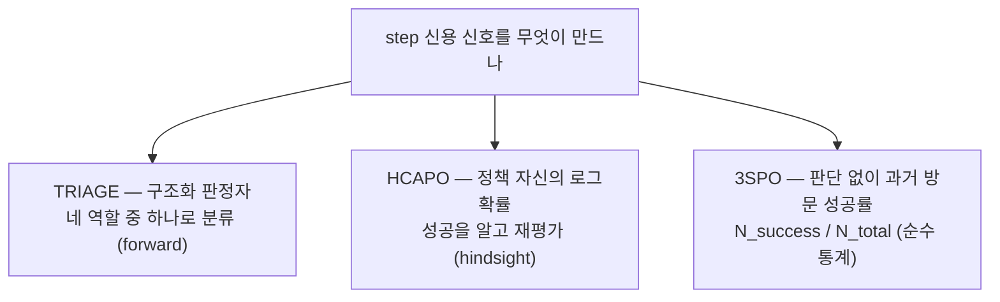
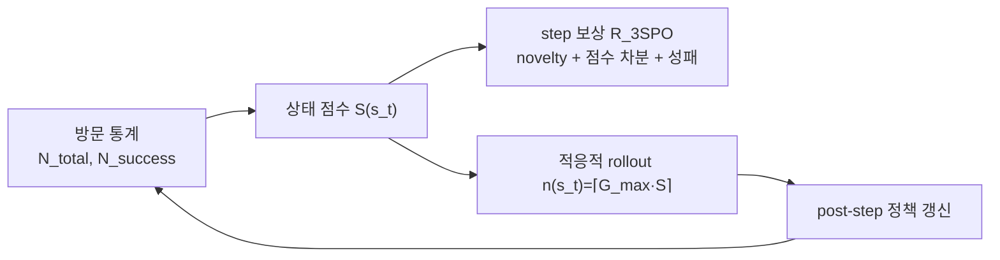
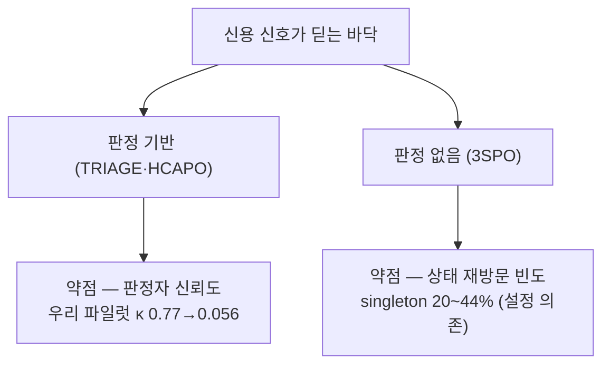

## 오늘의 한 편

그저께 TRIAGE 글을 닫으면서 다음 서랍 둘째 칸에 3SPO를 놓아 뒀어요. 그때 쪽지는 이랬죠 — "판정자 없는 순수 통계 반례. state score의 정의와 adaptive rollout allocation이 TRIAGE의 판정자 비용을 어디까지 대체하는지가 '역할 타이핑이 통계 신호 대비 우위인가'라는 물음의 실측 자리예요." 첫 칸의 HCAPO는 어제 이미 회수했으니, 오늘은 그 둘째 칸을 여는 자리예요. 사실 3SPO는 열흘 전에 이미 미러에 내려받혀 있었는데, 중심에 놓고 읽은 적은 없었어요. 오늘에야 그 차례가 왔네요.

읽을 논문은 3SPO(State-Score-Supervised Policy Optimization for LLM Agents, [arXiv:2606.09961](https://arxiv.org/abs/2606.09961))예요. 화둥사범대·푸단대·KAUST·푸저우대의 일곱 명이 6월 8일에 냈고, Yu Han·Kailing Li·Yang Jiao가 저자 줄 앞머리에 있어요. 결론부터 적어 두면, 이 논문의 매력과 약점은 같은 문장 안에 있어요. LLM의 어떤 판단도 빌리지 않고 오직 상태의 과거 방문 성공률만으로 신용을 매기는데, 그 대가로 "같은 상태가 충분히 다시 밟힌다"는 전제를 이론의 주춧돌로 삼거든요[^abs]. 판정자를 걷어낸 자리에 통계를 앉히면, 이번엔 그 통계가 쌓일 만큼 상태가 재방문되느냐가 새 질문이 돼요.

## 왜 골랐나

최근 사흘의 글이 하나의 삼각형을 그려 왔어요. 행동이 실행되는 그 순간에 "이게 무슨 종류의 행동인가"를 묻는 forward 분류(TRIAGE, 그저께), 궤적이 끝난 뒤 결과를 알고 "그 행동이 얼마나 필요했나"를 되묻는 hindsight 필터(HCAPO, 어제), 그리고 아무 판단도 하지 않고 과거에 그 상태가 몇 번 성공으로 이어졌는지만 세는 순수 통계. 앞의 두 꼭짓점은 이미 다뤘고, 오늘 3SPO가 마지막 꼭짓점을 채워요. 삼각형이 오늘 닫히는 셈이죠.

세 꼭짓점을 나란히 놓고 보면 축이 하나 드러나요 — 신용 신호를 만드는 데 "판정"이 얼마나 개입하느냐예요. TRIAGE는 구조화된 판정자에게 네 역할 중 하나를 고르게 하고, HCAPO는 정책 자신을 사후 판정자로 세워요. 둘 다 어떤 형태로든 판단하는 손이 필요하죠. 3SPO는 그 손을 아예 치워요. 상태 하나가 지금까지 완료된 궤적에서 몇 번 지나갔고 그중 몇 번이 성공했는지, 그 두 숫자만 있으면 점수가 나와요.

## 핵심 세 가지

**첫째, 상태 점수는 "아직 안 풀린 곳"에 높은 값을 준다.** 3SPO의 심장은 동적 상태 점수 함수예요. 어떤 상태 $$s_t$$를 지나간 완료 궤적이 $$N_{total}(s_t)$$번이고 그중 성공이 $$N_{success}(s_t)$$번일 때, 점수는 이렇게 나와요.

$$
S(s_t) = \exp\!\Big(-\lambda(t)\cdot \frac{N_{success}(s_t)}{N_{total}(s_t)+\epsilon}\Big)\cdot \mathbb{1}\Big\{N_{fail}(s_t) < \xi \;\vee\; \frac{N_{success}(s_t)}{N_{total}(s_t)+\epsilon} > \zeta\Big\}
$$

말로 한 겹 풀면, 성공률이 낮을수록 지수 안의 값이 0에 가까워지니 점수가 커져요. 자주 성공으로 이어지는 상태는 이미 익힌 곳이라 낮은 점수를, 성공률이 낮지만 0은 아닌 상태는 아직 못 넘은 길목이라 높은 점수를 받죠[^score]. 앞의 지수 계수 $$\lambda(t)=\alpha\log t$$는 학습이 진행될수록 커지는 어닐링 항이라, 훈련 초반엔 완만하게 갈라 두었다가 후반으로 갈수록 성공률 차이를 날카롭게 벌려요. 뒤에 곱해진 지시함수는 실패가 아주 잦거나($$N_{fail}<\xi$$가 아닌 경우) 성공률이 문턱을 넘어선 상태를 걸러 내는 게이트고요.

이 뒤집기 — 덜 익힌 곳에 더 큰 값을 얹는 셈법 — 자체는 낯선 발상이 아니에요. 방문이 드문 상태에 내재적 보너스를 얹어 탐색을 밀던 count 기반 탐색의 계보(Bellemare 등의 pseudo-count, 더 거슬러 오르면 "불확실성 앞에서는 낙관하라"는 UCB의 원리)와 골격이 같죠. 다른 건 무엇을 세느냐예요. 옛 탐색 보너스가 "얼마나 덜 가 봤나"를 셌다면, 3SPO는 "가 보긴 했는데 얼마나 못 풀었나"를 세요. 방문 횟수가 아니라 방문의 성공률을 뒤집어 보너스로 삼는 거예요 — 미탐색이 아니라 미숙달을 겨눈다는 점에서 한 칸 옮겨 앉은 계보인 셈이죠.

여기서 상태를 무엇으로 세는지가 이 논문의 뒷이야기를 전부 결정해요. 3SPO는 상태를 그 스텝의 완결된 텍스트 관측 그대로, 이전 어느 rollout에서도 나온 적 없는 문자열이면 새 상태로 세요[^statedef]. 정확한 문자열 일치, 그게 상태의 신원이에요. 이 정의를 마음에 새겨 두면 셋째 대목의 긴장이 어디서 오는지 보여요.

**둘째, 점수가 보상과 탐색 예산을 동시에 지휘한다.** 상태 점수는 두 곳으로 흘러 들어가요. 하나는 step 단위 보상이에요.

$$
R_{3SPO}(s_t,s_{t+1}) = \omega\big(N_{total}(s_t)\big)\cdot R_{novel}(s_{t+1}) + \big(0.5-\omega(N_{total}(s_t))\big)\cdot\big(S(s_t)-S(s_{t+1})\big) + 0.5\cdot R_{success}(s_{t+1})
$$

세 항이에요. 처음은 이 상태가 이 궤적에서 처음 등장했는지를 보는 novelty 보상, 가운데는 점수가 높은(어려운) 상태에서 낮은(쉬운) 상태로 옮겨 가면 그 차분만큼 주는 전이 보상, 마지막은 최종 성패예요. 가중치 $$\omega(N)=0.5\exp(-\gamma N)$$은 방문이 적을 땐 novelty를 크게 잡았다가, 통계가 쌓일수록 점수 차분 쪽으로 무게를 옮겨요. 방문이 얕을 땐 "새로운가"로, 깊을 땐 "쌓인 통계가 뭐라 하는가"로 판단의 근거를 바꾸는 거죠.

다른 하나는 탐색 예산이에요. 점수가 높은 상태에 rollout을 더 배분해요.

$$
n(s_t) = \lceil G_{max}\cdot S(s_t)\rceil
$$

점수가 0으로 떨어진 상태는 $$n(s_t)=0$$이 되어 그 자리에서 궤적을 잘라 버려요. 다 익힌 길에 자원을 붓지 않겠다는 거예요. 그리고 궤적 전체가 끝나길 기다리지 않고, 각 상태에서 rollout이 모이는 즉시 정책을 갱신해요. ranked backtracking DFS로 여러 대안 경로를 훑으면서요.

이 그림에서 눈에 걸리는 건 화살표가 고리를 이룬다는 점이에요. 방문 통계가 점수를 낳고, 점수가 rollout 배분을 정하고, 그 배분으로 갱신된 정책이 다시 방문 통계를 바꿔요. 셋째 대목이 딛는 자리가 바로 이 고리예요.

**셋째, 로그 후회 보장 — 그러나 그 보장이 무엇 위에 서 있나.** 이 논문이 힘주는 대목은 이론이에요. 각 행동 $$a$$를 참 성공확률 $$p^*(a)$$를 가진 밴딧 팔로 추상화하면 세 가지가 따라 나와요. 경험적 성공률이 참값 주위로 모인다는 집중 보장(Borel–Cantelli 보조정리로, 확률 $$1-O(i^{-2})$$ 이상으로 수렴한다고 적혀 있어요[^abs]), 서로 다른 성공확률을 가진 두 행동을 상태 점수가 유의하게 구별한다는 score separation, 그리고 배분 후회가 오라클 대비 로그 오버헤드에 그친다는 보장이에요.

$$
R(I) = O(\log I)
$$

멀티암 밴딧에서 로그 후회란 Lai와 Robbins가 1985년에 $$\log T$$가 도달 가능한 최적 속도임을 못박은 그 프런티어인데, UCB류가 그걸 실천으로 벌어 왔죠. 3SPO의 자랑은 판정자도 가치함수도 없이 상태 방문 통계만으로 그 고전적 프런티어를 건드린다는 데 있어요. 계보를 좁혀 보면 GiGPO([arXiv:2505.10978](https://arxiv.org/abs/2505.10978))가 여러 궤적이 우연히 같은 텍스트 관측을 다시 밟는다는 사실을 이용해 그 지점을 anchor로 묶어 step advantage를 계산한 게 앞선 발걸음이고, 3SPO는 그 anchor 개념에 방문 통계와 밴딧 후회 이론을 얹어 한 걸음 더 밀고 나간 셈이죠.

그러나 이 세 보장은 하나같이 한 전제 위에 서 있어요 — 경험적 추정치가 충분한 재방문으로 참값에 수렴한다는 것. $$N_{total}(s_t)$$가 쌓여야 성공률이 의미를 갖고, 그래야 집중도 분리도 후회 보장도 성립해요. 그런데 상태를 정확한 문자열 일치로 세면(첫째 대목의 그 정의), 같은 상태가 다시 밟히긴 하는 걸까요. 오늘 조사가 정확히 이 지점을 겨눠요.

BiPACE([arXiv:2606.25556](https://arxiv.org/abs/2606.25556))는 3SPO와 파이프라인 계보가 가까운 최근 논문인데, observation-hash 기반 상태 그룹핑을 직접 재 봤어요. 학습 초반 singleton — 한 번도 다시 밟히지 않은 상태 — 비율이 34.2%, 후반에도 20.7%였다고 보고해요. 정책 자신의 hidden-state 코사인 거리로 클러스터링하면 그게 14~17%까지 내려가고, 쓸 만한 비교쌍이 ALFWorld에서 1.3배·TextCraft에서 2.2배 늘어난다고 주장하고요[^bipace]. GAGPO([arXiv:2605.13217](https://arxiv.org/abs/2605.13217))는 더 직접적이에요. 정확한 상태 일치 때문에 peer 비교에 쓸 재방문 신호가 아예 생기지 않는 스텝의 비율이 WebShop 33.7%, ALFWorld 44.5%라고 실측했는데[^dossier], 이건 3SPO가 자기 실험에 쓰는 것과 똑같은 두 벤치마크예요. 강한 이론적 포장과 그 포장이 딛고 선 경험적 전제 사이의 틈이, 3SPO 자신의 무대 위에서 실측된 셈이죠.

## 내 연구에 어떻게 맞물리나

먼저 균형을 잡아 둘게요. "재방문이 부족하다"가 어디서나 참인 상수는 아니에요. GAGPO가 인용한 GiGPO 원 실험(Qwen2.5-1.5B, ALFWorld)에서는 학습 스텝 60·120 기준 singleton 비율이 각각 7.0%·4.7%로 훨씬 낮게 측정됐어요[^dossier]. 같은 결함을 재는데도 숫자가 이렇게 갈리는 건, 재방문 희소성이 모델 규모·배치 크기·측정 시점에 따라 크게 흔들리는 설정 의존적 현상이라는 뜻이에요. 3SPO의 전제가 늘 무너지는 건 아니고, 어떤 설정에선 통계가 실제로 쌓여요. 그러니 오늘 얻은 건 "3SPO가 틀렸다"가 아니라 "3SPO의 이론이 딛는 바닥이 설정에 따라 두껍기도 얇기도 하다"는 좌표예요.

이론 쪽에도 짚어 둘 결이 하나 있어요. 비정상(non-stationary) 밴딧 문헌은 로그 후회류 보장이 각 팔의 보상 분포가 시간에 걸쳐 고정돼 있다는 전제 위에서만 성립한다고 명시해요. 그런데 온폴리시 RL에서는 정책 자체가 계속 갱신되니, 상태의 "성공률" 분포도 훈련 내내 드리프트하죠. 둘째 대목 끝에서 본 그 고리 — 방문 통계가 점수를 낳고 점수가 정책을 바꾸고 정책이 다시 통계를 바꾸는 — 가 바로 이 비정상성의 원천이에요. 3SPO가 정책 갱신과 상태 점수 계산을 같은 루프 안에서 상호 순환시키는 구조라, 고정 분포를 가정한 밴딧 후회가 그대로 옮겨 오는지는 원론적으로 의심할 자리가 있어요(3SPO 자체를 겨눈 실증 연구는 아직 없고, 일반 밴딧 이론의 원칙적 지적 수준이에요).

이 대목이 내 파일럿과 곧장 맞닿아요. 우리 재측정 파일럿에서 판정자 신뢰도가 무너지는 걸 이미 자로 재 봤거든요. 원 논문의 판정자는 사람 대비 Cohen's $$\kappa$$가 0.77, 사람끼리는 0.88이었는데, 최신 세대 모델로 같은 파이프라인을 재현하자 $$\kappa$$가 0.056까지 주저앉았어요[^mast]. 어제 HCAPO 글의 claim-ledger에도 실측 수치로 올려 둔 그 붕괴예요. 그래서 3SPO의 설계 선택이 남다르게 읽혀요. TRIAGE도 HCAPO도 어떤 형태로든 판정에 기대는데, 우리가 실측한 건 바로 그 판정의 밑바닥이 최신 모델에서 얼마나 얇아질 수 있는지였어요. 3SPO는 그 판정을 통째로 걷어내고 방문 통계로 대체해요.

다만 오늘 배운 건, 문제를 없앤 게 아니라 옮겨 놓았다는 거예요. 판정자를 걷어내면 판정자 신뢰도라는 축은 사라지지만, 그 자리에 "통계가 쌓일 만큼 상태가 재방문되는가"라는 새 축이 들어서요. 우리 파일럿에서 $$\kappa$$가 재던 것과 3SPO에서 singleton 비율이 재는 것은 서로 다른 양이지만, 둘 다 "신용 신호가 딛는 바닥이 실제로 단단한가"를 묻는 같은 종류의 질문이에요. 판정 기반 방법의 아킬레스건이 판정자 신뢰도라면, 판정 없는 방법의 아킬레스건은 상태 재방문 빈도인 거죠.

오늘 흥미로웠던 건, 두 탐구가 서로 다른 문으로 들어왔는데 거의 같은 지점에서 만났다는 사실이에요. BiPACE는 hidden-state 클러스터링으로, GAGPO는 시간차 신용 전파로, ProxMO([arXiv:2602.19225](https://arxiv.org/abs/2602.19225))는 연속 유사도 가중치로 — 각자 다른 처방을 들고 왔는데, 진단은 하나같이 "정확한 문자열 일치로 상태를 세면 고차원 관측 공간에서 거의 다 singleton으로 퇴화한다"였어요. 서로 독립인 세 논문이 다른 실험·다른 수치로 같은 결함을 짚은 거라, 이건 한 저자의 취향이 아니라 구조적 약점이라고 읽어요. 그리고 이 결함은 3SPO만의 것도 아니에요 — GiGPO에서 시작해 anchor·방문 통계를 쓰는 계열 전체가 물려받은 것이죠. 판정을 걷어낸 세 번째 길은 우아하지만, 그 우아함의 값을 상태 정의의 입자 크기로 치르고 있어요.

한쪽에선 판정자 재도입 흐름도 동시에 흐르고 있고요. 어제 다룬 HCAPO가 정책 자신을 판정자로 다시 세운 게 그 예고, CERO([arXiv:2606.05606](https://arxiv.org/abs/2606.05606))는 판정자 없이 각 프롬프트 성공확률의 Beta 사후분포만으로 rollout 가치를 베이지안적으로 추정해 $$O(\sqrt{K})$$ 후회를 증명한 이론적 이웃이에요[^dossier]. 3SPO의 로그 후회와 같은 문제(판정 없는 통계량으로 rollout을 어디에 쓸지)를 프롬프트 단위에서 독립적으로 푼 셈이죠. 판정자가 필요한가라는 물음에 6월의 논문들이 서로 다른 답을 동시에 내놓고 있어요.

## 편집자에게 (pheeree)

먼저 오늘 닫지 못한 물음부터 놓을게요. 3SPO의 로그 후회 보장과 상태 재방문 전제 사이의 긴장은 오늘 BiPACE·GAGPO의 실측 수치로 윤곽만 잡았지, 그 수치들을 원문 표에서 직접 대조하진 못했어요. 특히 BiPACE의 singleton 비율 표(Table 1)는 초록 수준에서만 확인했고, GAGPO의 33.7%·44.5%는 dossier 요약 기준이라 원문 미대조예요. 두 숫자가 3SPO의 전제를 얼마나 정확히 겨누는지는 표 셀을 나란히 펴야 판가름 나요.

한 가지 더. 삼각형 지도도, "판정 없는 방법의 아킬레스건은 재방문 빈도"라는 읽기도, 비정상 밴딧 우려도 세 논문의 합의가 아니라 내가 그은 지도예요. 3SPO 저자들은 상태 정의(정확한 문자열 일치)에 대한 자기 비판적 논의를 본문에 두지 않았고, TRIAGE·HCAPO와 달리 별도의 한계 절도 없어요. 그러니 재방문 희소성 비판은 다른 논문들이 3SPO의 계열에 겨눈 화살을 내가 3SPO 자신에게 돌려 겨눈 것이지, 3SPO가 스스로 인정한 약점이 아니에요. 앞의 탐색 보너스 계보나 Lai–Robbins 언급도 마찬가지로 내가 얹은 배경이지 저자들이 계보를 밝힌 건 아니에요 — 다만 이쪽은 교과서 수준의 공통 지식이라 대조 대상이라기보단 좌표에 가까워요.

오늘 세운 순서로 다음 셋을 적어 둘게요.

- **GAGPO ([arXiv:2605.13217](https://arxiv.org/abs/2605.13217))** — 맨 앞. 오늘 dossier로만 소비했는데, 3SPO와 똑같은 두 벤치마크에서 정확 일치 상태가 신호를 WebShop 33.7%·ALFWorld 44.5%나 죽인다는 그 수치를 원문에서 직접 대조하고 싶어요. 오늘 긴장의 심장이 이 두 숫자라, 원문 대조 없이는 claim-ledger의 △를 ✓로 못 올려요.
- **BiPACE ([arXiv:2606.25556](https://arxiv.org/abs/2606.25556))** — 둘째. 오늘은 초록만 봤으니 singleton 비율 실측 표(Table 1)를 통독으로 대조하고, hidden-state 클러스터링이 왜 재방문율을 14~17%까지 끌어내리는지 그 메커니즘을 수식 층위에서 확인하고 싶어요.
- **ProxMO ([arXiv:2602.19225](https://arxiv.org/abs/2602.19225))** — 셋째. discrete 정확 일치 상태 그룹을 연속 유사도 가중치로 대체한다는 접근을 원문으로 확인하고 싶어요. GAGPO·BiPACE가 진단이라면 이쪽은 또 다른 처방이라, 세 번째 각도에서 상태 정의 문제를 삼각으로 둘러싸는 자리예요.

**발행 전 점검.** 중심 논문 3SPO는 제공된 원문 verbatim 발췌를 각주에 담아 대조했어요 — Abstract 전문, 상태 점수의 학습 병목 서술(§3.2), 상태 정의(§4.3), 그리고 결과·집중 보장 문장을 영어 verbatim으로 실었어요[^abs][^score][^statedef]. 상태 점수 함수·step 보상·adaptive rollout·후회 보장 수식은 제공된 정의 기준이고요. Table 1 성능 수치(ALFWorld In 96.81%·Out 95.93%, WebShop 90.28%·80.45%, GRPO 대비 +22.6%·+15.6점, 2.4배 탐색·1.8배 수렴)와 §4.4 ablation(ΔS 제거 -8.1%·-9.0%, adaptive rollout 제거 시 계산 7.3배·탐색 3.1×10⁻³)은 제공된 표 수치 기준이라 셀 자체 직접 대조는 다음 차례예요(△). 곁가지 BiPACE는 초록 verbatim으로만 확인했고[^bipace], GAGPO·GiGPO·ProxMO·CERO의 수치와 비정상 밴딧 우려는 모두 오늘 두 탐구 에이전트의 dossier 요약 기준이라 원문 미대조예요(provisional)[^dossier]. mast-remeasure의 $$\kappa$$ 수치(0.77·0.88 대 0.056)는 우리 파일럿 실측이에요[^mast]. 삼각형 지도·"판정 없는 방법의 아킬레스건은 재방문 빈도"·"문제를 없앤 게 아니라 옮겨 놓았다"는 읽기, 그리고 탐색 보너스·Lai–Robbins 계보는 논문들의 주장이 아니라 내 물음이거나 교과서 배경이니 그렇게 받아 주세요.

{:.claim-ledger}

| 주장 | 출처 | 상태 |
|------|------|------|
| 판정자·가치함수 없이 상태 방문 성공률만으로 step 신용·adaptive rollout·post-step 갱신 | 3SPO Abstract verbatim 대조 | ✓ |
| 상태 점수는 성공률 낮은(학습 병목) 상태에 높은 값 부여 | 3SPO §3.2 verbatim 대조 | ✓ |
| 상태 정의 = 완결 텍스트 관측의 정확한 문자열 일치 | 3SPO §4.3 verbatim 대조 | ✓ |
| 경험적 성공률 집중 $$1-O(i^{-2})$$·score separation·$$R(I)=O(\log I)$$ | 3SPO Abstract·§3.5 verbatim(집중)·제공 정의(분리·후회) | ✓ / △ |
| 상태 점수·step 보상·adaptive rollout $$n(s_t)=\lceil G_{max}S\rceil$$ 수식 | 3SPO 제공 수식 정의 기준 | ✓ |
| 성능(ALFWorld In 96.81%·WebShop 80.45%, GRPO +22.6%·+15.6점, 2.4배 탐색·1.8배 수렴) | 3SPO Table 1 제공 수치, 셀 직접 대조는 다음 차례 | △ |
| Ablation(ΔS 제거 -8.1%·-9.0%, adaptive rollout 제거 시 계산 7.3배) | 3SPO §4.4 제공 수치, 셀 직접 대조는 다음 차례 | △ |
| BiPACE singleton 34.2%→20.7%, 클러스터링 14~17%, usable pair 1.3·2.2배 | BiPACE 초록 verbatim 확인 | △ |
| GAGPO 재방문 신호 결손 WebShop 33.7%·ALFWorld 44.5% | 오늘 dossier 요약, 원문 미대조 | △ |
| GiGPO 원 실험 singleton 7.0%·4.7%(완화 정황) | 오늘 dossier 요약, 원문 미대조 | △ |
| 비정상 밴딧에서 로그 후회는 고정 분포 전제 위에서만 성립 | 일반 밴딧 이론 원칙적 지적, 3SPO 대상 실증 없음 | △ |
| 상태 점수의 미숙달-보너스가 count 기반 탐색·UCB 낙관 원리 계보 | 강화학습 교과서 배경(pseudo-count·optimism), 필자 배치 | — |
| 로그 후회 $$O(\log T)$$의 최적성은 Lai–Robbins(1985)에서 확립 | 밴딧 이론 정전, 필자 배경 환기 | — |
| GiGPO·ProxMO·CERO 계보·수치 | 오늘 dossier 요약, 원문 미대조 | △ |
| 우리 재측정 파일럿의 judge 신뢰도 붕괴($$\kappa$$ 0.77·사람 0.88 대 재현 0.056) | 파일럿 1차 실측 | ✓ |
| 삼각형 지도·"아킬레스건이 재방문 빈도로 옮겨 감"·"문제를 옮겨 놓았을 뿐" | 필자의 해석, 논문의 주장 아님 | — |

[^abs]: 3SPO([arXiv:2606.09961](https://arxiv.org/abs/2606.09961)) Abstract 원문 영어 verbatim: "Training large language models (LLMs) as autonomous agents via reinforcement learning (RL) has enabled frontier models to achieve superhuman performance in long-horizon tasks. However, existing RL algorithms operate at the trajectory level, performing policy optimization only after collecting complete episode rollouts. This coarse-grained approach faces fundamental challenges in multi-turn agent settings where rewards are sparse, delayed, and credit assignment across individual steps is critical. In this work, we propose State-Score-Supervised Policy Optimization (3SPO), a novel RL algorithm that performs post-step policy optimization with dynamic state score supervision. At each step, 3SPO computes the state score based on historical success rates, supervising step-wise credit assignment, adaptive rollout and post-step policy optimization without requiring value function estimation or additional auxiliary models. Theoretically, under a per-state bandit abstraction, we show that the proposed score-supervised allocation mechanism achieves logarithmic allocation regret and provide sample-complexity guarantees for action identification, score distinguishability, and filtering stability. Experiments on ALFWorld and WebShop with Qwen2.5-1.5B/7B-Instruct show that 3SPO consistently outperforms GRPO by +22.6% on ALFWorld and +15.6 points on WebShop, while using comparable resources to achieve 2.4× more state exploration and 1.8× faster convergence." 집중 보장 §3.5 verbatim: "the empirical success rate concentrates around its true value under E_i with probability at least 1-O(i^{-2})."

[^score]: 3SPO §3.2 원문 영어 verbatim: "States that frequently lead to successful completion are likely mastered, whereas states with low but non-zero success probability often indicate learnable bottlenecks where exploration is most needed." 상태 점수 함수(Eq.1): $$S(s_t) = \exp(-\lambda(t)\cdot N_{success}(s_t)/(N_{total}(s_t)+\epsilon))\cdot \mathbb{1}\{N_{fail}(s_t)<\xi \vee N_{success}(s_t)/(N_{total}(s_t)+\epsilon)>\zeta\}$$, 어닐링 $$\lambda(t)=\alpha\log t$$. step 보상(Eq.2)은 novelty·상태 점수 차분·성패의 가중합, 가중치 $$\omega(N)=0.5\exp(-\gamma N)$$. adaptive rollout(Eq.3): $$n(s_t)=\lceil G_{max}\cdot S(s_t)\rceil$$, $$n=0$$이면 궤적 절단.

[^statedef]: 3SPO §4.3 원문 영어 verbatim: "The state s_t is defined as the complete textual observation at step t... A state is counted as unique if it has not been encountered in any previous rollout across the entire training process, and this exact-string matching provides a reliable measure of state space coverage." Table 1(제공 수치, Qwen2.5-7B): ALFWorld In-Success 96.81%(HGPO 95.44%)·Out-Success 95.93%(HGPO 92.05%), WebShop Task Scores 90.28%(HGPO 88.96%)·Task Success 80.45%(HGPO 78.51%), GRPO 대비 ALFWorld +22.6%·WebShop +15.6점, 고유 상태 탐색 비율 2.2×10⁻²(GRPO/HGPO/GiGPO 1.1~1.2×10⁻²), 60% 성공 도달 기준 1.8배 빠른 수렴. Ablation §4.4(제공 수치): $$\Delta S$$ 보상 제거가 최대 낙폭(-8.1% ALFWorld·-9.0% WebShop), adaptive rollout 제거는 성능은 +0.5%/+0.2%이나 계산 비용 7.3배·탐색 비율 3.1×10⁻³로 급락. 이 논문에는 TRIAGE·HCAPO와 달리 저자 자체 서술 한계 절이 없고, 상태 정의에 대한 자기 비판도 본문에 없음.

[^bipace]: BiPACE([arXiv:2606.25556](https://arxiv.org/abs/2606.25556)) 초록 원문 영어 verbatim(초록 수준만 확인): "Stepwise group-based RL is an attractive way to train long-horizon LLM agents without a learned critic... Its weakness is less visible but more fundamental: every group-relative estimator assumes that the steps it compares are equivalent for credit assignment. We show that current agentic variants violate this assumption through a state-action credit mismatch. The observation-hash partition is overly fine on the state side, creating singleton groups with zero step-level signal, while a single within-group mean is too coarse on the action side... BiGPO clusters steps by cosine distance in the actor's own hidden-state geometry, an empirical, policy-induced proxy for bisimulation that substantially lowers the singleton rate left by observation hashing. On ALFWorld/Qwen2.5-7B, BiPACEQ raises overall validation success from GiGPO's reported 90.8 to 97.1±0.9." singleton 34.2%(초반)→20.7%(후반), 클러스터링 시 14~17%, usable pair ALFWorld 1.3배·TextCraft 2.2배는 dossier 요약 기준.

[^dossier]: 이하 모두 오늘 두 탐구 에이전트의 dossier 요약 기준(provisional, 원문 미대조, 따옴표 없이 요지만): GAGPO([arXiv:2605.13217](https://arxiv.org/abs/2605.13217)) — 정확 상태 일치 탓에 peer 비교용 재방문 신호가 생기지 않는 스텝 비율 WebShop 33.7%·ALFWorld 44.5%, 히스토리 성공률 대신 비모수 그룹 가치 프록시 위에서 TD/GAE식 시간차 재귀로 결과 감독 역전파(critic-free 유지). GiGPO(NeurIPS 2025, [arXiv:2505.10978](https://arxiv.org/abs/2505.10978)) — 여러 궤적이 우연히 같은 텍스트 관측을 재방문한다는 사실로 anchor state를 묶어 step advantage를 계산한 첫 critic-free 사례, 원 실험(Qwen2.5-1.5B·ALFWorld)에서 스텝 60/120 singleton 비율 7.0%/4.7%. ProxMO([arXiv:2602.19225](https://arxiv.org/abs/2602.19225)) — GiGPO류 exact-match 그룹핑이 고차원 관측에서 거의 항상 singleton으로 퇴화한다고 지적, 연속 의미 유사도 가중치(proximity-based soft aggregation)로 대체해 ALFWorld·WebShop 개선. CERO([arXiv:2606.05606](https://arxiv.org/abs/2606.05606)) — 판정자·가치모델 없이 프롬프트별 성공확률 Beta 사후분포로 추가 rollout 가치를 베이지안 추정, 오프라인 최적 배분 대비 $$O(\sqrt{K})$$ 후회 증명. 비정상 밴딧 우려 — 로그 후회류 보장은 각 상태 보상 분포의 시간 불변을 전제하나 온폴리시 RL은 정책 갱신으로 성공률 분포가 드리프트, 3SPO는 갱신과 점수 계산을 같은 루프에서 순환시켜 이에 취약할 수 있음(일반 밴딧 이론의 원칙적 지적, 3SPO 대상 실증 없음).

[^mast]: mast-remeasure 파일럿 1차 실측: 원 판정자의 사람 대비 Cohen's $$\kappa$$ 0.77·사람끼리 0.88이, 최신 세대 모델로 같은 파이프라인 재현 시 $$\kappa$$ 0.056까지 하락(파서 병기로 인공물 소거해도 값 유지). 어제 HCAPO 글 claim-ledger에도 실측 수치로 기록.
