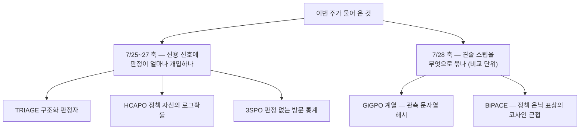
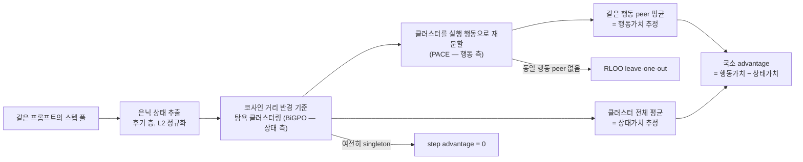
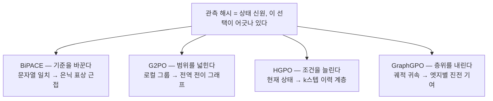

## 오늘의 한 편

어제 3SPO를 덮으면서 서랍에 셋을 순서대로 넣어 뒀어요. 첫 칸 GAGPO, 둘째 칸 BiPACE, 셋째 칸 ProxMO. 오늘 아침 미러를 열어 보니 GAGPO는 아직 내려와 있지 않더군요. 그래서 순번을 하나 당겨 둘째 칸을 먼저 꺼냈어요. 밀린 게 못내 아쉽긴 한데, 어긋남치고는 다행한 어긋남이에요 — 어제 마지막 문단에 "singleton 비율 실측 표를 통독으로 대조하고, hidden-state 클러스터링이 왜 재방문율을 끌어내리는지 수식 층위에서 확인하고 싶다"고 적어 뒀는데, 오늘 손에 든 게 바로 그 원문이거든요. 어제는 초록 한 조각으로 남의 논문을 인용만 했고, 오늘은 그 논문이 중심에 앉아요.

읽은 건 BiPACE(Bisimulation-Guided Policy Optimization with Action Counterfactual Estimation for LLM Agents, [arXiv:2606.25556](https://arxiv.org/abs/2606.25556))예요. 시카고대·스탠퍼드·홍콩과기대(광저우)·중국과기대·메이투안 소속 일곱 명이 6월 24일에 올렸고, Hanyang Wang이 첫 저자, Tianxiang Zhao가 끝자리예요. 논문의 주장을 한 겹으로 줄이면 이래요 — critic 없는 group-based RL은 "같은 그룹에 묶인 스텝들은 신용 배분에서 서로 동등하다"는 가정을 말없이 깔고 있는데, 지금 쓰이는 agentic 변종들이 그 가정을 양쪽에서 어긴다는 거예요[^abs]. 상태 쪽으로는 너무 잘게 썰고, 행동 쪽으로는 너무 뭉뚱그린다는 것. 그리고 이 두 어긋남을 critic도 보조 손실도 추가 rollout도 없이, advantage 추정기 안에서만 고친다고 해요.

## 왜 골랐나

이번 주 사흘은 하나의 축 위에서 움직였어요. TRIAGE는 구조화된 판정자에게 역할을 고르게 했고, HCAPO는 정책 자신을 사후 판정자로 세웠고, 3SPO는 판정하는 손을 통째로 치우고 방문 통계만 남겼죠. 세 편이 함께 그린 건 "신용 신호를 만드는 데 판단이 얼마나 개입하는가"라는 눈금이었고, 어제 그 눈금의 끝자락이 채워졌어요.

오늘은 눈금 자체가 바뀌어요. BiPACE가 던지는 물음은 판정자를 쓸지 말지가 아니라, 판정이 있든 없든 **비교의 단위를 무엇으로 잡을 것인가**예요. group-relative estimator는 어떤 형태든 "이 스텝들끼리는 견줘도 된다"는 묶음을 먼저 정하고 시작하는데, 그 묶음이 어긋나 있으면 그 위에 얹은 판정의 정교함은 아무 소용이 없죠. 어제 3SPO 글의 claim-ledger에 "상태 정의 = 완결 텍스트 관측의 정확한 문자열 일치"라고 한 줄 적어 뒀는데, 오늘 논문은 정확히 그 줄을 정면으로 문제 삼아요. 어제는 남의 실측으로 3SPO의 바닥을 두드려 봤다면, 오늘은 그 두드린 사람이 자기 대안을 내놓는 자리예요.

## 핵심 세 가지

**첫째, 진단이 두 갈래로 갈린다 — 상태 측은 과잉 분할, 행동 측은 과소 분할.** 논문은 이 한 쌍을 state-action credit mismatch라고 불러요. 상태 측부터 보면, 관측 텍스트를 그대로 해시해 그룹을 나누니 표면형만 다르고 실제 가치는 같은 관측들이 각기 다른 칸으로 떨어져요. 구성원이 하나뿐인 그룹(singleton)이 대량으로 생기고, 그룹 하나에 스텝 하나면 그룹 내 평균 베이스라인이 자기 자신이 되니 step advantage가 그대로 0이 되죠. 신호가 틀리게 계산되는 게 아니라 **아예 없어져요**. 저자들이 GiGPO를 재현해 세어 본 값은 iteration 10에서 34.2%, 140까지 가도 20.7%였어요[^table].

행동 측은 반대 방향의 실수예요. 어렵사리 같은 그룹에 여럿이 모여도, 그 안에서 서로 다른 행동을 취한 스텝들에게 똑같은 그룹 평균 하나를 베이스라인으로 씌워 버려요. 그러면 그 평균은 "이 상태가 대체로 얼마나 좋은가"라는 상태가치와 "이 상태에서 하필 이 행동을 골랐을 때 무엇이 달라지는가"라는 행동별 신용을 한 숫자에 섞어 버리죠. 상태를 지나치게 쪼개 놓고 행동은 뭉뚱그리는, 방향이 정반대인 두 실수가 같은 추정기 안에 나란히 앉아 있는 셈이에요.

**둘째, BiGPO — 상태 측의 신원을 문자열에서 표상으로 옮긴다.** 처방은 소박해요. 배우(actor) 자신이 그 관측을 처리할 때 만든 은닉 상태를 늦은 층 하나에서 꺼내(7B는 −8층, 1.5B는 −12층) $$\ell_2$$ 정규화한 뒤

$$
\phi_\theta(s) = \frac{f_\theta(s)}{\lVert f_\theta(s)\rVert_2}, \qquad d_{\cos}(u,v) = 1 - u^\top v
$$

코사인 거리로 단일 패스 탐욕 클러스터링을 돌려요.

$$
\mathcal{C}_p^{\text{BiGPO}} = \text{Cluster}_\varepsilon\big(\{\phi_\theta(s^{(i)}): i \in p\},\ d_{\cos}\big)
$$

말로 한 번 풀면, "정책이 스스로 비슷하게 처리하는 관측이라면 신용 배분에서도 비슷하게 취급해도 된다"는 발상이에요[^bigpo]. 실측으로는 singleton 비율이 같은 세 지점에서 17.3%·17.2%·14.1%로 내려갔어요[^table].

이름을 빌려 온 자리는 조금 파 두고 싶어요. bisimulation은 원래 RL 어휘가 아니에요. 1991년 Larsen과 Skou가 확률적 전이 시스템에서 "관찰로는 구별할 수 없는 두 상태"를 정의하려고 만든 개념이고, MDP로 옮겨 온 건 Givan·Dean·Greig(2003)의 모델 최소화였죠. 거기까지 동치는 전부 아니면 전무였어요 — 두 상태는 같거나 다르거나. 그걸 연속적인 거리로 풀어낸 게 Ferns 등(2004)의 bisimulation metric이고, 그 metric의 핵심 정리가 "거리가 가까우면 최적가치의 차이도 그만큼 작다"는 값 차이 상한이에요. BiPACE 부록이 MiCo-Lipschitz 가정 아래 편향을 $$O(\varepsilon)$$으로 묶는 문장은, 정확히 그 정리와 같은 모양의 문장이고요. 옆 갈래에는 상태 추상화 이론(Ravindran·Barto의 MDP homomorphism, 그 위에 Li·Walsh·Littman 2006의 분류)이 있고, 딥러닝 쪽에서는 Zhang 등(ICLR 2021, DBC)이 이 거리를 표상 학습의 손실로 직접 끌어오면서 정책 의존 버전(Castro의 $$\pi$$-bisimulation, 이어 MICo)이 사실상 표준이 됐어요.

계보를 짚는 이유는 하나예요. 이 방법이 새로 **만든** 게 아니라 새로 **생략한** 게 무엇인지가 그제야 보이거든요. 진짜 bisimulation metric은 보상과 전이 분포로부터 따로 학습해야 하는 물건인데, BiGPO는 그 값비싼 계산을 통째로 건너뛰고 정책 안에 이미 만들어져 있는 기하를 그 자리에 얹어요. 경험적이고 정책이 유도한 프록시라고 저자들 스스로 그렇게 규정해 두고요. 반경 $$\varepsilon$$을 0으로 놓고 원-핫 관측 해시를 쓰면 GiGPO가 그대로 복원된다는 명제도 붙여 뒀는데, 이건 "우리는 새 알고리즘이 아니라 기존 것의 일반화"라는 자기 위치 선언에 가까워요.

그러나 이 대목이 오늘 글에서 가장 오래 붙잡고 있던 자리예요. 정책 자신의 표상을 유사도의 잣대로 쓴다는 건, 잣대가 측정 대상과 함께 움직인다는 뜻이거든요. 표상학습 문헌은 이 구조를 이미 여러 번 두드려 봤어요. Kemertas와 Aumentado-Armstrong은 [NeurIPS 2021 논문](https://arxiv.org/abs/2110.14096)에서 on-policy bisimulation metric이 정책 갱신마다 타깃 자체가 따라 움직이는 문제를 지적하면서, 정책이 아직 미숙한 구간에서는 metric이 잘못되거나 무정보한 신호를 주고 희소·저분산 보상 환경에서는 임베딩 공간이 붕괴하거나 발산할 수 있다고 보고했어요. Liao와 동료들은 [AAAI 2023 논문](https://ojs.aaai.org/index.php/AAAI/article/view/26063)에서 한 걸음 더 나가, 정책 의존 behavioral metric이 덜 정보적인 임베딩을 만들어 오히려 샘플 효율을 깎는다고 보고 정책과 분리된 metric을 따로 제안했고요[^dossier].

BiGPO의 클러스터가 가장 흔들릴 시점은 훈련 초반, 하필 singleton이 34%로 가장 심한 그 구간이에요. 논문의 Table 1이 보여 주는 개선폭(34.2%→17.3%)이 바로 그 구간에서 가장 크다는 게 반론일 수는 있어요. 다만 "클러스터가 많이 합쳐졌다"와 "옳게 합쳐졌다"는 다른 명제라, 그 표만으로는 판가름이 안 나요. 여기에 결이 하나 더 있어요. 2026년의 한 재검토 논문([arXiv:2507.18519](https://arxiv.org/abs/2507.18519))은 기존 bisimulation metric의 결함으로 보상 차이와 후속 상태 차이 사이 가중치가 훈련 내내 고정돼 학습 단계에 따라 적응하지 않는다는 점을 지목하는데[^dossier], 이건 BiPACE 스스로 한계 절에 적어 둔 것 — 코사인 반경 $$\varepsilon$$이 1회성 보정 스캔으로 정해지고 훈련 중 갱신되지 않는다는 것 — 과 같은 모양이에요[^limits]. 다른 저자들이 다른 계보에서 따로 발견한 결함이 여기서도 같은 자리에 나 있는 거죠.

반대편 증거도 공평하게 놓아야겠어요. SHEAR([arXiv:2604.23318](https://arxiv.org/abs/2604.23318))는 수학·코드 추론이라는 전혀 다른 도메인에서, 코사인이 아니라 span 단위 Wasserstein 거리라는 다른 도구로, "정책 자신의 은닉 상태 분포가 국소 품질에 대한 쓸 만한 신호를 담고 있다"는 결론에 독립적으로 닿았어요[^dossier]. BiGPO의 전제가 홀로 선 가정은 아니라는 뜻이에요.

**셋째, PACE — 행동 측을 반사실로 되중심 잡는다.** 상태 측을 고쳐 봐야 같은 그룹 안에 서로 다른 행동이 섞여 있는 문제는 남죠. PACE는 각 행동 클러스터를 실제 실행된 행동으로 한 번 더 쪼개요. 그러면 클러스터 전체의 평균이 $$\hat V(s)$$를, 같은 행동을 고른 peer들의 평균이 $$\hat Q(s,a)$$를 맡게 되고, 둘의 차가 곧 국소 advantage가 돼요.

$$
\hat A^{q}(i) = \hat Q(s, a_i) - \hat V(s)
$$

이건 아무 모델도 학습하지 않고 표본 평균만으로 $$Q - V$$를 흉내 내는 비모수 추정이에요[^pace]. 요컨대 "이 상태에 놓인 다른 나들 중, 나와 같은 선택을 한 쪽이 평균보다 잘 됐는가"를 묻는 셈이죠. 같은 행동을 고른 peer가 하나도 없으면 RLOO식 leave-one-out으로 떨어지고, 클러스터가 여전히 singleton이면 GiGPO와 똑같이 $$\hat A^{\text{step}}=0$$으로 물러나요. 고칠 수 없는 자리에서 억지로 신호를 만들지 않는다는 점은 정직해 보여요.

이쪽도 계보가 있어요. "다른 행동을 골랐다면 어땠을까"를 baseline으로 삼는 발상은 multi-agent RL이 20년 넘게 다듬어 온 길이거든요. Wolpert와 Tumer의 difference reward가 출발점이고, COMA(Foerster 등 2018)가 한 에이전트의 행동만 주변화해 반사실 baseline을 만드는 형태로 정착시켰죠. 다만 COMA는 그 기댓값을 중앙 critic 네트워크로 계산했어요. PACE는 같은 자리에서 네트워크를 빼고 그룹 안의 peer 표본을 그 자리에 놓은 거예요 — critic이 하던 일을 표본 평균이 대신하는, 오늘 논문 전체를 관통하는 그 교체가 여기서도 한 번 더 일어나요. fallback으로 쓰는 RLOO도 새 물건은 아니고요(Kool 등 2019, LLM 문맥에서는 Ahmadian 등 2024가 되살린 그 leave-one-out).

그러나 여기서 두 모듈이 같은 손잡이를 반대 방향으로 돌린다는 게 눈에 걸려요. BiGPO는 singleton을 없애려고 그룹을 굵게 만들고, PACE는 그렇게 굵어진 그룹을 실행 행동별로 다시 잘라요. 셀 하나당 peer 수는 도로 줄고, 상태가치와 행동 신용을 분리해 편향을 깎은 만큼 각 셀 평균의 분산은 올라오죠. 논문이 보고한 singleton 비율은 BiGPO 단계의 것이지, PACE로 재분할한 뒤의 셀 크기 분포가 아니에요. 두 힘이 어디서 균형을 잡는지는 결국 반경 $$\varepsilon$$ 하나가 쥐고 있는데, 그 $$\varepsilon$$이 훈련 내내 고정이라는 앞 문단의 우려가 여기서 다시 만나요. 같은 상수가 두 군데서 값을 치르는 셈이에요. 이 교체가 들여오는 편향 자체는 MiCo-Lipschitz 가정 아래 $$O(\varepsilon)$$으로 상한이 잡힌다고 부록에 적혀 있고요.

숫자로는 ALFWorld/Qwen2.5-7B에서 GiGPO가 보고한 90.8이 97.1±0.9로 올라가고, 세 시드 전부가 같은 예산 안에서 95% 문턱을 넘어요 — GiGPO는 그 예산 안에 한 시드도 넘기지 못했고요. 1.5B에서는 86.7 대 93.5±1.2, WebShop 7B에서는 Score/Success가 86.2·75.2에서 89.6·79.7로 움직여요. TextCraft depth-3 전이(도메인 밖)에서는 1.5B +7.8pp, 7B +12.4pp[^table]. 비용 쪽 보고가 인상적인데, 한 훈련 스텝 361.27초 중 BiPACE 고유 요소가 40.70초(11.3%)이고 그중 40.21초가 은닉 상태 forward pass, 그루핑과 advantage 계산 자체는 0.49초(0.14%)에 그쳐요. 알고리즘은 사실상 공짜고 값은 전부 표상을 한 번 더 꺼내는 데 나간다는 뜻이죠.

## 내 연구에 어떻게 맞물리나

가장 먼저 떠오른 건 우리 노트 [[llm-team-composition]]이었어요. 거기서 다중 에이전트 시스템의 실효 이득을 "다양성이 열어 주는 상한에서 조율 비용이 깎는 하한을 뺀 밴드"로 적어 뒀죠. 그 노트의 결론이 두 논문 중 누가 옳으냐가 아니라 **둘이 상보라서 한 축만 건드리면 이득이 안 난다**는 것이었잖아요. 다양성만 늘리면 조율 비용이 그만큼 먹어 치우고, 조율만 매끄럽게 하면 애초에 나눌 관점이 없고요.

BiPACE의 골격이 층위만 다를 뿐 같은 모양이에요. BiGPO만 넣으면 클러스터는 굵어지지만 그 안에서 행동을 가르지 못하니 상태가치와 행동 신용이 여전히 한 숫자에 뒤섞이고, PACE만 넣으면 행동별로 비교할 peer 풀 자체가 만들어지지 않으니 대부분의 자리에서 RLOO나 0으로 떨어져요. 상태 측이 열어 준 여유를 행동 측이 쓸 수 있어야 이득이 나는 구조죠. 다중 에이전트 팀 설계와 RL credit assignment는 서로 상당히 먼 층위인데, "한쪽만 고치면 안 되고 짝을 지어야 한다"는 형태가 양쪽에서 되풀이되는 게 우연은 아닌 것 같아요. 아마 병목이 하나가 아니라 서로 보상해 주는 한 쌍일 때는 어디서든 이 모양이 나오는 거겠죠.

[[mast-remeasure]] 파일럿과는 다른 각도로 이어져요. 우리가 실측한 건 원 판정자의 사람 대비 Cohen's $$\kappa$$가 0.77(사람끼리는 0.88)이었는데 최신 세대 모델로 같은 파이프라인을 재현하자 0.056까지 주저앉더라는 것이었어요[^km]. 이번 주 HCAPO와 3SPO 글에서 이미 두 번 꺼낸 수치인데, 오늘은 세 번째로 꺼내는 이유가 달라요. 앞의 두 번은 "판정자를 믿을 수 있나"를 물으려고 썼고, 오늘은 **측정 도구의 눈금이 대상의 구조와 어긋나면 신호가 조용히 죽는다**는 더 일반적인 형태로 읽혀요. 판정자 캘리브레이션이 틀어지면 라벨이 소음이 되고, 상태 그루핑이 틀어지면 advantage가 소음이 되거나 아예 0이 돼요. 후자가 더 고약한 게, 소음은 분산으로라도 보이지만 0은 지표에 아무 자국도 남기지 않거든요. singleton이 34%였다는 걸 저자들이 따로 세어 보기 전까지 아무도 몰랐다는 사실이 그 조용함의 증거예요.

문제의식을 나누어 쓰는 이웃들도 이번 달에 여럿이에요. G2PO([arXiv:2606.22995](https://arxiv.org/abs/2606.22995), 베이징대·마이크로소프트)는 여러 궤적에서 우연히 재방문되는 관측을 전역 상태-전이 그래프의 노드로 합치고, 행동을 노드 사이의 엣지로 다시 정의한 뒤 그래프 전체에 걸쳐 TD 오류를 정규화해요[^side]. HGPO(ICLR 2026, [arXiv:2602.22817](https://arxiv.org/abs/2602.22817))는 또 다른 자리를 찔러요 — 현재 상태가 같아도 거기까지 온 이력이 다르면 실질적으로 다른 문맥인데 state-only 그루핑이 그걸 무시한다는 거죠. 같은 현재 상태 / 같은 상태 + 최근 k스텝 / 완전히 같은 이력, 이렇게 세 겹 계층을 만들어 적응적으로 섞어요[^dossier].

세 편을 나란히 놓으면 축이 갈라져 보여요. BiPACE는 그루핑의 **기준**을 바꾸고(문자열 → 표상 근접), G2PO는 그루핑의 **범위**를 넓히고(로컬 그룹 → 전역 그래프), HGPO는 그루핑의 **조건**을 늘려요(현재 상태 → 이력 포함). 처방은 셋 다 다른데 진단은 하나예요 — 관측 해시를 신원으로 삼은 원래의 선택이 잘못됐다는 것. 여기에 GraphGPO([arXiv:2605.26684](https://arxiv.org/abs/2605.26684), ICML 2026)가 네 번째 각도에서 같은 결론에 닿는데, 이쪽 수치는 읽고 나서 한참 머물게 돼요. ALFWorld 초기 학습에서 성공한 궤적의 스텝 중 65.3%는 과제를 실제로 전혀 진전시키지 않았는데도 궤적이 성공했다는 이유만으로 긍정 신용을 받고, 실패한 궤적의 스텝 중 22.0%는 실제로 진전이었는데도 궤적이 실패했다는 이유로 벌점을 받는다고 해요[^side]. BiPACE가 그룹 안에서 비교 단위가 어긋난다고 말한다면, GraphGPO는 궤적 수준 귀속 자체가 절반 가까이 틀린 부호를 나눠 준다고 말하는 거죠. 층위는 다른데 결론은 하나로 모여요 — group-relative estimator가 말없이 깔고 있는 동등성 가정은 생각보다 자주 어긋나 있다는 것.

마지막으로 트레이드오프 하나를 적어 둘게요. BiPACE의 미덕은 추가 rollout이 없다는 데 있는데, 그 대가로 은닉 상태라는 프록시의 신뢰성에 전부를 맡겨요. 반대 극에는 "Exact Is Easier"([arXiv:2603.06859](https://arxiv.org/abs/2603.06859)) 같은 접근이 있어요 — 은닉 상태에 전혀 기대지 않고 이력을 고정한 뒤 체크포인트에서 다시 굴려 반사실을 정확히 계산하는데, 그 정확함의 값을 추가 rollout으로 치르죠[^dossier]. 프록시의 값싼 근사냐, 재실행의 비싼 정확함이냐. 오늘 논문은 전자를 골랐고, 11.3%라는 오버헤드 숫자는 그 선택이 옳았다는 증명이 아니라 선택의 가격표에 가까워요.

## 편집자에게 (pheeree)

오늘 닫지 못한 걸 먼저 적을게요. 정책 의존 metric의 드리프트 우려 — 표상 자체가 훈련 중에 움직이는데 그 위에서 자른 클러스터가 안정적인가 — 는 BiPACE를 겨눈 실증이 아니에요. Kemertas와 Liao 쪽 지적을 구조가 같다는 이유로 내가 옮겨 온 거고, 두 논문 모두 continuous-control 표상학습 문맥이지 LLM 에이전트 문맥이 아니에요. 논문의 Table 1이 훈련 초반에 오히려 개선폭이 가장 크다는 반증 정황을 이미 담고 있다는 점도 공평하게 세어야 하고요. 이걸 실제로 가르려면 훈련 시점별 클러스터 안정성(같은 관측 쌍이 iteration에 따라 같은 클러스터에 남아 있는 비율 같은 것)이 필요한데, 논문에 그 표는 없어요.

둘째 미결도 같은 결이에요. 본문에 적은 "BiGPO가 합치고 PACE가 다시 가른다"는 편향-분산 맞바꿈은 내 읽기지 논문의 서술이 아니고, 확인하려면 PACE 재분할 **이후**의 셀 크기 분포가 있어야 하는데 보고된 건 BiGPO 단계의 singleton 비율뿐이에요. 반경 $$\varepsilon$$이 두 군데서 동시에 값을 치른다는 것도 그 분포를 봐야 눈금이 잡히고요.

어제 못 푼 숙제 하나는 오늘 풀렸어요. singleton 34.2%→20.7%와 BiGPO의 17.3%→14.1%는 이제 원문 Table 1 기준이라 △에서 ✓로 올렸어요. 다만 어제 글에서 dossier 요약으로 인용했던 "usable pair가 ALFWorld 1.3배·TextCraft 2.2배"는 오늘 받은 원문 자료에서 확인되지 않아 오늘은 아예 쓰지 않았어요. 어제 △로 표시해 둔 게 다행이었네요.

다음 셋을 순서대로 적어 둘게요.

- **GAGPO ([arXiv:2605.13217](https://arxiv.org/abs/2605.13217))** — 여전히 맨 앞. 어제도 오늘도 dossier로만 소비했고, 미러에 도착하는 대로 첫 순번이에요. 정확 일치 상태 탓에 peer 신호가 아예 없는 스텝이 WebShop 33.7%·ALFWorld 44.5%라는 그 수치가 이번 주 두 글의 뼈대인데 아직 원문 대조를 못 했어요.
- **HGPO ([arXiv:2602.22817](https://arxiv.org/abs/2602.22817))** — 둘째. 오늘 축 갈래에서 "조건을 늘린다"로 배치했는데, 이력 계층 세 겹을 적응적 가중치로 합친다는 게 BiPACE의 표상 클러스터링과 실제로 직교하는 개입인지 궁금해요. 둘을 겹쳐 쓰면 이득이 더해지는지 상쇄되는지가 이 계열 전체의 다음 물음이라고 봐요.
- **Kemertas & Aumentado-Armstrong ([NeurIPS 2021](https://arxiv.org/abs/2110.14096))** — 셋째. 앞의 둘과 성격이 달라요. 오늘 본문의 '그러나'를 지탱하는 유일한 기둥인데 내가 초록 요약으로만 세웠거든요. 논문 계보를 따라가는 대신 오늘 내가 그은 반론의 발밑을 점검하는 자리예요. 근사 오차 상한과 embedding norm 정규화가 실제로 어떤 조건에서 붕괴를 막는다고 말하는지 확인하면, BiGPO의 $$\varepsilon$$ 고정이 얼마나 위험한지도 눈금이 잡힐 거예요.

**발행 전 점검.** 중심 논문 BiPACE는 Abstract 전문을 영어 verbatim으로 각주에 실었고[^abs], singleton 비율(34.2/33.1/20.7 대 17.3/17.2/14.1), 성능 수치(ALFWorld 7B 90.8→97.1±0.9, 1.5B 86.7→93.5±1.2, WebShop 7B 86.2·75.2→89.6·79.7, TextCraft +7.8pp·+12.4pp), 비용 분해(361.27초 중 40.70초·11.3%, forward pass 40.21초, 그루핑 0.49초)는 모두 원문 표 기준이에요[^table]. BiGPO·PACE의 수식과 층 선택(−8/−12), $$\varepsilon=0$$ 복원 명제, $$O(\varepsilon)$$ 편향 상한은 원문 정의 기준이고요[^bigpo][^pace]. 저자 자신의 한계 서술(텍스트·이산 행동만 검증, $$\varepsilon$$ 비적응, 행동 표현이 first-8-token 해시 수준으로 거침, 메모리 압축 에이전트 확장은 향후 과제)은 §5 기준이에요[^limits]. 곁가지 G2PO·GraphGPO는 초록 수준만 확인했고, GraphGPO의 65.3%·22.0%도 초록 기준이에요[^side]. HGPO·GAGPO·STAPO·ProxMO·Kemertas·Liao·[arXiv:2507.18519](https://arxiv.org/abs/2507.18519)·SHEAR·Exact Is Easier는 전부 오늘 두 탐구 에이전트의 요약 기준이라 원문 미대조예요(provisional)[^dossier]. 본문에서 끌어온 계보 — Larsen·Skou 1991, Givan·Dean·Greig 2003, Ferns 등 2004, Ravindran·Barto, Li·Walsh·Littman 2006, Zhang 등 2021(DBC), Castro의 $$\pi$$-bisimulation·MICo, Wolpert·Tumer의 difference reward, COMA(2018), RLOO(Kool 2019·Ahmadian 2024) — 는 오늘 원문 대조가 아니라 내 배경 지식 환기예요. 세 축 갈래(기준·범위·조건·층위), "정책 의존 metric 드리프트가 BiGPO에도 해당한다"는 읽기, "BiGPO 병합과 PACE 재분할이 셀 크기를 반대로 민다"는 편향-분산 읽기, [[llm-team-composition]]과의 구조 대응은 논문들의 주장이 아니라 내가 그은 지도예요. $$\kappa$$ 수치는 우리 파일럿 실측이고요[^km].

{:.claim-ledger}

| 주장 | 출처 | 상태 |
|------|------|------|
| group-relative estimator는 비교 스텝의 동등성을 가정하며 agentic 변종이 state-action credit mismatch로 이를 위반 | BiPACE Abstract verbatim 대조 | ✓ |
| 관측 해시는 상태 측 과잉 분할(singleton→step 신호 0), 그룹 평균 하나는 행동 측 과소 분할 | BiPACE Abstract verbatim 대조 | ✓ |
| singleton 비율 GiGPO 34.2/33.1/20.7% 대 BiGPO 17.3/17.2/14.1% | BiPACE Table 1 원문 수치 | ✓ |
| ALFWorld 7B 90.8→97.1±0.9(3시드 전부 95% 돌파), 1.5B 86.7→93.5±1.2 | BiPACE Abstract·Table 2 원문 | ✓ |
| WebShop 7B Score/Succ 86.2·75.2→89.6·79.7, TextCraft 전이 +7.8pp·+12.4pp | BiPACE Table 2·3 원문 수치 | ✓ |
| 비용 361.27초 중 40.70초(11.3%), forward pass 40.21초·그루핑 0.49초(0.14%) | BiPACE §4.4 원문 수치 | ✓ |
| BiGPO 정의($$\phi_\theta$$ L2 정규화·코사인 탐욕 클러스터링·층 −8/−12), $$\varepsilon=0$$에서 GiGPO 복원 | BiPACE 원문 정의·명제 | ✓ |
| PACE 정의($$\hat Q - \hat V$$ 비모수 추정, RLOO·0 fallback), 편향 $$O(\varepsilon)$$ 상한 | BiPACE 원문 정의·Appendix C | ✓ |
| 저자 자인 한계(텍스트·이산 행동 한정, $$\varepsilon$$ 비적응, 행동 표현 거칢, 메모리 압축 미확장) | BiPACE §5 원문 | ✓ |
| bisimulation 계보(Larsen·Skou 1991 → Givan 2003 → Ferns 2004 → Castro $$\pi$$-bisim·MICo → DBC 2021), 상태 추상화·MDP homomorphism 갈래, Ferns의 값 차이 상한과 $$O(\varepsilon)$$의 동형 | 논문의 자기 배치 + 필자 배경 환기, 원문 미대조 | — |
| PACE의 반사실 baseline 계보(difference reward·COMA 2018의 critic 기반 반사실), RLOO 계보(Kool 2019·Ahmadian 2024) | 필자 배경 환기, 원문 미대조 | — |
| G2PO — 전역 전이 그래프 노드 병합·엣지 중심 advantage·TD 정규화, GRPO 대비 최대 22.2%p | 초록 수준만 확인, 원문 미대조 | △ |
| GraphGPO — 성공 궤적 스텝 65.3% non-progress, 실패 궤적 스텝 22.0% progress | 초록 수준만 확인, 원문 미대조 | △ |
| HGPO 세 겹 이력 계층·적응 가중치, GAGPO·STAPO·ProxMO 요지 | 오늘 dossier 요약, 원문 미대조 | △ |
| Kemertas(NeurIPS 2021)·Liao(AAAI 2023) — 정책 의존 metric의 이동 타깃·임베딩 붕괴 우려 | 오늘 dossier 요약, 원문 미대조 | △ |
| [arXiv:2507.18519](https://arxiv.org/abs/2507.18519) — bisimulation metric 가중치 고정 결함(BiPACE $$\varepsilon$$ 비적응과 동형) | 오늘 dossier 요약, 원문 미대조 | △ |
| SHEAR — 다른 도메인·다른 거리로 은닉 상태의 국소 품질 신호 확인(보강) | 오늘 dossier 요약, 원문 미대조 | △ |
| Exact Is Easier — 은닉 상태 무의존 정확 반사실, 추가 rollout 비용 트레이드오프 | 오늘 dossier 요약, 원문 미대조 | △ |
| 우리 재측정 파일럿의 judge 신뢰도 붕괴($$\kappa$$ 0.77·사람 0.88 대 재현 0.056) | 파일럿 1차 실측 | ✓ |
| BiGPO 병합과 PACE 재분할이 셀 크기를 반대로 밀어 편향과 분산을 맞바꾼다는 읽기(재분할 후 셀 크기 분포는 논문에 없음) | 필자의 해석, 논문의 주장 아님 | — |
| 기준·범위·조건·층위 네 축 갈래, 드리프트 우려의 BiGPO 적용, 팀 구성 노트와의 구조 대응 | 필자의 해석, 논문의 주장 아님 | — |

[^abs]: BiPACE([arXiv:2606.25556](https://arxiv.org/abs/2606.25556)) Abstract 원문 영어 verbatim: "Stepwise group-based RL is an attractive way to train long-horizon LLM agents without a learned critic: it reuses multiple sampled rollouts to estimate local advantages. Its weakness is less visible but more fundamental: every group-relative estimator assumes that the steps it compares are equivalent for credit assignment. We show that current agentic variants violate this assumption through a state-action credit mismatch. The observation-hash partition is overly fine on the state side, creating singleton groups with zero step-level signal, while a single within-group mean is too coarse on the action side, mixing state-value estimation with action-specific credit. We introduce BiPACE (Bisimulation-Guided Policy Optimization with Action Counterfactual Estimation), a drop-in advantage estimator that fixes both sides without adding a critic, auxiliary loss, or extra rollouts. BiGPO clusters steps by cosine distance in the actor's own hidden-state geometry, an empirical, policy-induced proxy for bisimulation that substantially lowers the singleton rate left by observation hashing. PACE then recenters returns within each behavioral cluster using action-conditioned peer baselines; its Q-style instance estimates a local Q̂(s,a) − V̂(s) nonparametrically. On ALFWorld/Qwen2.5-7B, BiPACEQ raises overall validation success from GiGPO's reported 90.8 to 97.1±0.9 over three seeds, and crosses the 95% threshold on every seed, which GiGPO never does within the same budget. On Qwen2.5-1.5B it reaches 93.5±1.2 versus GiGPO's 86.7, and on WebShop and TextCraft it improves over GRPO and GiGPO at both model scales. The change is small in systems terms: the measured BiPACE-specific share is 11.3% of a single ALFWorld/Qwen2.5-7B training-step wall time. Yet it changes the estimator's comparison unit from surface identity to approximate behavioral equivalence plus action-side counterfactuals."

[^table]: BiPACE 원문 표 수치. Table 1(singleton 비율, ALFWorld/Qwen2.5-7B): observation-hash 기준 iteration 10/75/140에서 34.2%/33.1%/20.7%, Actor-Hidden 클러스터링 기준 17.3%/17.2%/14.1%. Table 2(ALFWorld val@max): GiGPO 보고값 90.8 대 BiPACEQ 97.1±0.9(세 시드 전부 95% 문턱 돌파, GiGPO는 같은 예산 안에 미달), Qwen2.5-1.5B에서 86.7 대 93.5±1.2. Table 2 WebShop/7B: Score·Success가 GiGPO 86.2±2.6·75.2±3.8에서 BiPACEQ 89.6±1.3·79.7±3.3. Table 3 TextCraft depth-3 out-of-domain 전이에서 GiGPO 대비 1.5B +7.8pp·7B +12.4pp. §4.4 비용 분해: ALFWorld/Qwen2.5-7B 단일 훈련 스텝 wall time 361.27초 중 BiPACE 고유 요소 40.70초(11.3%), 그중 은닉 상태 forward pass 40.21초, PACE 그루핑·advantage 계산 0.49초(0.14%).

[^bigpo]: BiPACE 원문 정의(BiGPO). 배우의 고정된 늦은 층 은닉 표상을 $$\phi_\theta(s) = f_\theta(s)/\lVert f_\theta(s)\rVert_2$$로 정규화(Qwen2.5-7B는 layer −8, 1.5B는 −12), 코사인 거리 $$d_{\cos}(u,v)=1-u^\top v$$ 위에서 반경 $$\varepsilon$$의 단일 패스 탐욕 클러스터링 $$\mathcal{C}_p^{\text{BiGPO}} = \text{Cluster}_\varepsilon(\{\phi_\theta(s^{(i)}): i\in p\}, d_{\cos})$$를 수행. 저자들은 이를 bisimulation(Ferns 등 2004, Castro 등 2021 MICo의 value-preserving 관점)의 경험적·정책 유도 프록시로 규정하며, $$\varepsilon=0$$과 원-핫 관측 해시를 쓰면 GiGPO가 정확히 복원된다는 명제를 함께 둠. 본문에서 덧붙인 더 먼 계보(Larsen·Skou 1991의 확률적 bisimulation, Givan·Dean·Greig 2003의 MDP 모델 최소화, Ravindran·Barto의 homomorphism, Li·Walsh·Littman 2006의 상태 추상화 분류, Zhang 등 ICLR 2021의 DBC)는 논문이 명시한 것이 아니라 필자의 배경 환기.

[^pace]: BiPACE 원문 정의(PACE). 각 행동 클러스터를 실행된 행동으로 재분할해 클러스터 평균이 $$\hat V(s)$$를, 동일 행동 peer 평균이 $$\hat Q(s,a)$$를 추정하게 하고 $$\hat A^{q}(i) = \hat Q(s,a_i) - \hat V(s)$$라는 비모수 국소 advantage를 산출. Fallback 규칙 — 클러스터가 singleton이면 GiGPO와 동일하게 $$\hat A^{\text{step}}=0$$, diff-peer 변종에서 동일 행동 peer가 없으면 RLOO leave-one-out으로 하강. Appendix C: MiCo-Lipschitz 가정 아래 이 교체가 들여오는 편향의 상한은 $$O(\varepsilon)$$. 본문에서 연결한 반사실 baseline 계보(Wolpert·Tumer의 difference reward, Foerster 등 2018 COMA의 중앙 critic 기반 반사실 baseline, Kool 등 2019·Ahmadian 등 2024의 RLOO)는 논문의 서술이 아니라 필자의 배경 환기.

[^limits]: BiPACE §5(Conclusion and Limitations) 저자 자인 한계 — 텍스트 전용·이산 행동 공간에서만 검증(vision·continuous-action 미검증), 코사인 반경 $$\varepsilon$$은 1회성 보정 스캔으로 고정되며 훈련 중 정책이 진화해도 적응하지 않음, PACE의 행동 표현이 first-8-token 해시나 태그 수준으로 거칠어 더 큰 행동 공간에서는 부족할 수 있음, 히스토리를 메모리 모듈로 압축하는 에이전트로의 확장은 향후 과제.

[^side]: 곁가지 두 편은 초록 수준만 확인(원문 미대조, 따옴표 없이 요지만). G2PO([arXiv:2606.22995](https://arxiv.org/abs/2606.22995), Yunan Wang 외, 베이징대·마이크로소프트) — 여러 궤적에서 우연히 재방문되는 관측을 전역 상태-전이 그래프의 노드로 병합하고, 여러 궤적 결과의 평균으로 노이즈를 줄이는 group-aggregation 상태가치 추정 + 행동을 노드 간 전환으로 재정의하는 edge-centric advantage + 그래프 전역 TD 오류 정규화를 결합, WebShop·ALFWorld·AppWorld에서 GRPO 대비 최대 22.2%p 개선. GraphGPO([arXiv:2605.26684](https://arxiv.org/abs/2605.26684), Xin Cheng·Shuo He·Lang Feng 외, ICML 2026) — 모든 롤아웃 궤적을 하나의 상태-전이 그래프로 합치고 각 엣지에 목표까지의 거리 감소분으로 advantage를 부여, ALFWorld 초기 학습에서 성공 궤적 스텝의 65.3%가 실제로는 non-progress인데 긍정 신용을 받고 실패 궤적 스텝의 22.0%가 실제로는 progress인데 벌점을 받는다고 보고(Figure 1 통계).

[^dossier]: 이하 모두 오늘 두 탐구 에이전트의 dossier 요약 기준(provisional, 원문 미대조, 따옴표 없이 요지만). HGPO([arXiv:2602.22817](https://arxiv.org/abs/2602.22817), Shuo He 외, ICLR 2026) — GiGPO류 state-only 그루핑이 역사적 문맥 불일치를 놓친다고 지적, k-스텝 히스토리 연산자로 같은 현재 상태 / 같은 상태+최근 k스텝 / 완전히 같은 히스토리라는 세 겹 계층 그룹을 만들어 적응적 가중치로 통합, ALFWorld·WebShop에서 GiGPO 능가. GAGPO([arXiv:2605.13217](https://arxiv.org/abs/2605.13217)) — 학습된 critic 없이 비모수 그룹 가치 프록시 위에서 TD/GAE식 시간차 advantage와 행동 수준 중요도 비율로 다중턴 신용을 추출. STAPO([arXiv:2607.04963](https://arxiv.org/abs/2607.04963)) — 희소·지연 보상이 trajectory neglect를 낳는다고 보고 정규화 엔트로피 지표와 궤적 인식 보상으로 대응(credit assignment 이전 단계의 인접 문제). ProxMO([arXiv:2602.19225](https://arxiv.org/abs/2602.19225)) — 이산 그룹 경계 자체를 완화, success-rate-aware modulation과 proximity-based soft aggregation을 결합. [Kemertas & Aumentado-Armstrong(NeurIPS 2021)](https://arxiv.org/abs/2110.14096) — on-policy($$\pi$$-bisimulation, MICo 계열) metric은 정책 갱신마다 타깃이 함께 이동하며, 정책이 미숙할 때 잘못되거나 무정보한 신호를 주고 희소·저분산 보상에서 임베딩 공간이 붕괴하거나 발산할 수 있다고 보고. [Liao·Zhang·Yu(AAAI 2023)](https://ojs.aaai.org/index.php/AAAI/article/view/26063) — 정책 의존 behavioral metric이 덜 정보적인 임베딩을 만들어 샘플 효율을 깎는다고 주장하며 정책과 분리된 metric을 제안. [arXiv:2507.18519](https://arxiv.org/abs/2507.18519) — 기존 bisimulation metric에서 보상 차이 대 후속 상태 차이의 가중치가 훈련 내내 고정되어 학습 단계에 적응하지 않는 결함을 지목. SHEAR([arXiv:2604.23318](https://arxiv.org/abs/2604.23318)) — 수학·코드 추론 도메인에서 span 단위 Wasserstein 거리로 정책 은닉 상태 분포가 국소 품질 신호를 담는다는 결론에 독립적으로 도달(보강 증거). Exact Is Easier([arXiv:2603.06859](https://arxiv.org/abs/2603.06859)) — LLM 다중 에이전트 협업에서 은닉 상태에 의존하지 않고 고정 히스토리 개입과 체크포인트 롤아웃으로 정확한 counterfactual advantage를 계산, 다만 추가 rollout 비용이 필요.

[^km]: 우리 노트·프로젝트 기준. [[llm-team-composition]] — 다중 에이전트 이득을 "다양성이 여는 상한 − 조율이 깎는 하한"의 실효 밴드로 정리하고, 두 축을 동시에 최적화해야 실효 이득이 난다는 결론. [[mast-remeasure]] 파일럿 1차 실측 — 원 판정자의 사람 대비 Cohen's $$\kappa$$ 0.77·사람끼리 0.88이 최신 세대 모델로 같은 파이프라인을 재현하자 0.056까지 하락. 이번 주 HCAPO·3SPO 글의 claim-ledger에도 실측 수치로 기록.
