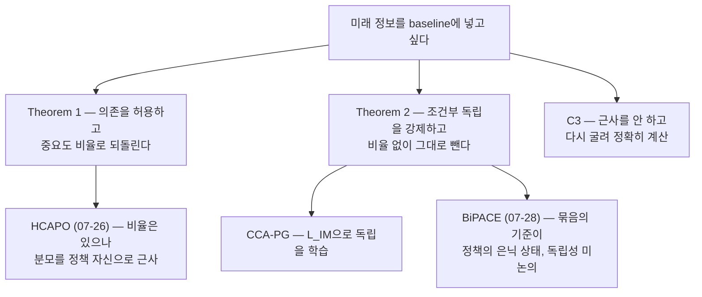

## 오늘의 한 편

사흘 전 HCAPO 글을 닫으면서 서랍 첫 칸에 이 논문을 넣어 뒀어요. 그때 쪽지는 이랬죠 — "hindsight 신용이 편향 없이 인과적이려면 필요한 구조적 조건(독립성 제약)을 명시한다니, HCAPO의 자기 로그확률 근사가 그 조건을 충족하는지 원문 수식으로 대조하고 싶어요." 첫 칸이라고 적어 놓고도 사흘이 걸렸어요. 미러에 파일이 내려온 게 27일이었고, 그 사이 3SPO와 BiPACE가 먼저 차례를 가져갔거든요. 오늘에야 그 칸을 엽니다.

읽을 논문은 Counterfactual Credit Assignment in Model-Free Reinforcement Learning([arXiv:2011.09464](https://arxiv.org/abs/2011.09464))이에요. Thomas Mesnard·Théophane Weber·Fabio Viola를 앞에 세운 DeepMind 팀이 2020년 11월에 프리프린트를 올렸고 ICML 2021에 실렸어요. 이번 주에 다룬 어떤 논문보다 다섯 해쯤 오래됐고, 실험은 밴딧과 그리드월드뿐이라 LLM은 한 줄도 나오지 않아요.

그런데도 이 논문이 오늘 자리를 차지하는 이유는 간단해요. 이번 주 내내 우리가 이리저리 돌려 온 물음 — 결과를 알고 난 뒤의 정보를 신용 계산에 끌어들여도 되는가 — 에 대해, 되는 조건을 처음으로 정확히 적어 둔 문서거든요[^abs]. 게다가 조건만 적어 두고 만 게 아니라 그 조건을 학습 중에 강제하는 손실항까지 명시해요. 오늘 알게 된 건 이거예요. 2026년의 후손들은 이 논문의 발상은 물려받았는데, 발상에 딸려 있던 청구서는 대체로 물려받지 않았어요.

## 왜 골랐나

이번 주 일곱 편을 한 줄로 늘어놓으면 이렇게 돼요. TRACE(22일, 얼어붙은 참조 모델의 log-ratio) → CIGPO(23일) → CalibAdv(24일) → TRIAGE(25일) → HCAPO(26일) → 3SPO(27일) → BiPACE(28일). 이 사슬을 관통하는 갈래는 둘이었어요. 하나는 판정자 논쟁 — 신용을 매기는 손을 구조화된 판정자에게 줄 것인가(TRIAGE), 정책 자신에게 줄 것인가(HCAPO), 아예 없앨 것인가(3SPO). 다른 하나는 묶음의 기준 — 어떤 스텝들을 같은 잣대로 비교할 수 있다고 볼 것인가(BiPACE).

두 갈래는 각자 다른 문제처럼 보이지만, 밑으로 내려가면 같은 질문이에요. 궤적이 성공했을 때 그 성공 중 얼마가 이 행동 덕분이고 얼마가 그저 상황이 좋았던 것인가. 오늘 논문의 초록은 그걸 skill과 luck을 분리하는 문제라고 부르고, 그 분리가 왜 어려운지도 첫 문단에서 짚어요. 기존 policy gradient는 시간 순서에 기대는 신용 배분, 그러니까 "post hoc ergo propter hoc"[^concl] — 뒤에 일어났으니 그것 때문이라는 추론 — 을 쓰거든요. 편향은 없지만 분산이 큽니다.

곁가지는 오늘 없어요. paper-graph에서 이 논문의 직접 이웃 다섯 편(HCAPO·3SPO·TRIAGE·GraphGPO·G2PO)이 전부 이번 주에 중심이나 곁가지로 이미 소비됐거든요. 억지로 한 편 더 붙이는 대신 원류 한 편만 깊이 읽는 날로 받아들이기로 했어요.

한 가지 더 눈에 걸린 게 있어요. 우리 질문 보드는 블로그의 "편집자에게"에서 태어난 물음을 Q1~Q8로 성숙도별로 추적하는데, 이번 주 일곱 편은 아직 자기 줄기를 못 받았어요. 가장 가까운 기존 줄기가 Q4(하니스·로그·결정론의 이음새)인데 정확히 포개지진 않고요. 매주 수요일에 미인용 글을 훑는 절차가 도는데, 이 사슬은 아직 그 훑음을 못 받은 모양이에요. 오늘 글이 마침 이론적 뿌리를 다루니, 다음 훑음에서 줄기 하나가 새로 설 자리가 생길지도 모르겠어요.

## 핵심 세 가지

**첫째, Alice의 축구 경기 — 운을 빼려면 결과를 알아야 한다.** 논문 §2.3의 예시가 발상 전체를 담고 있어요. Alice가 새 도시로 이사해 처음 축구를 했는데 팀이 이겼어요. 알고 보니 팀메이트 Megan이 대단한 실력자였고, Alice 자신은 실수를 여러 번 했죠. 평범한 policy gradient는 "이겼다"는 결과로 Alice의 모든 행동을 강화해요. 실제로는 운이 좋았을 뿐인데요[^exp].

여기서 논문이 꺼내는 처방은 이래요. Megan의 실력은 경기가 끝난 뒤에야 알게 된 정보이고, Alice가 무엇을 했든 달라지지 않는 정보예요. 그러니 그 정보를 baseline에 소급해서 넣어 주면, "Megan이 있었으니 이길 만했다"는 몫이 baseline으로 빠지고 advantage는 0에 가까워져요. 잘못된 강화가 멎는 거죠.

문제는 여기서 시작돼요. 표준 policy gradient에서 baseline은 오직 현재 상태 $$X_t$$의 함수여야만 편향이 없어요. 미래 정보에 의존하는 순간 추정기가 어긋나요. 특히 취할 행동 자체가 baseline에 새어 들어가면 그건 더 이상 baseline이 아니에요.

이 제약의 뿌리를 잠깐 짚고 갈게요. baseline은 REINFORCE 시절부터 있던 control variate — 기댓값은 건드리지 않고 분산만 깎아 내는 보조 항 — 이고, 그 무해함이 성립하는 근거가 정확히 "행동과 상관이 없다"는 성질이에요. 그러니 미래 정보를 baseline에 넣겠다는 건 control variate의 면허 조건을 건드리겠다는 말이고, 논문이 정리를 두 개나 세우는 것도 그 면허를 다시 발급받기 위해서예요. 그래서 논문은 먼저 미래 정보를 허용하되 값을 치르는 형태를 제시해요. 임의의 확률변수 $$\Phi_t$$에 대해, Theorem 1(FC-PG)은 이렇게 적어요[^thm1].

$$
\nabla \mathbb{E}[G] = \mathbb{E}\Big[\sum_t \gamma^t S_t \Big(G_t - \frac{\pi(A_t \mid X_t)}{P(A_t \mid X_t, \Phi_t)} V(X_t, \Phi_t)\Big)\Big]
$$

기호를 걷어내고 보면 이런 뜻이에요. $$\Phi_t$$를 알고 나면 각 행동의 확률이 달라지는데, 그 달라진 정도를 비율로 나눠 원래 자리로 되돌려 놓는 거예요. 분모의 $$P(A_t \mid X_t,\Phi_t)$$는 $$\Phi_t$$를 안 상태에서 그 행동이 나왔을 사후 확률이고요. 이 형태가 성립하려면 비율이 유한해야 해요. 직관은 이래요 — $$\Phi_t$$를 아는 것이 어떤 행동도 완전히 배제해선 안 됩니다. 극단적 반례가 $$\Phi_t = A_t$$예요. 행동 자체를 hindsight 통계로 삼으면 분모가 0이 되는 자리가 생기고 추정기가 무너져요.

이 유한성 조건, 낯설지 않죠. off-policy 중요도 샘플링에서 늘 보던 support 조건 — 분모가 얇아지는 자리에서 추정기가 폭발한다는 그 오래된 병 — 과 같은 모양이에요. 이름만 hindsight일 뿐 병은 구식이라는 게 오늘 내가 이 정리에서 받은 첫인상이고요. 계보로 보면 Harutyunyan 등의 HCA(2019)가 hindsight 정보를 미래 상태나 return으로 고정했던 것을, 이 정리는 임의 함수까지 넓힌 셈이에요[^thm1].

**둘째, 조건부 독립 하나로 비율이 사라진다.** 이 논문의 무게중심은 Theorem 2예요. $$\Phi_t$$가 현재 상태를 조건으로 행동과 독립이면, 즉 $$\Phi_t \perp A_t \mid X_t$$이면, 앞의 비율이 통째로 1이 되어 사라져요[^thm2].

$$
\nabla \mathbb{E}[G] = \mathbb{E}\Big[\sum_t \gamma^t S_t \big(G_t - V(X_t, \Phi_t)\big)\Big]
$$

그러니까 미래 정보를 baseline에 그냥 얹어 놓고 빼면 됩니다. 보정도 비율도 필요 없어요. 그리고 여기에 하나가 더 붙어요.

$$
\mathbb{E}\big[(G_t - V(X_t,\Phi_t))^2\big] \;\le\; \mathbb{E}\big[(G_t - V(X_t))^2\big]
$$

독립이 성립하는 한, hindsight baseline의 분산은 forward baseline보다 결코 크지 않아요. 부등식이지 등식이 아니라는 점이 중요해요 — 이득이 없을 수는 있어도 손해는 없다는 뜻이니까요. 편향 없음을 지키면서 분산만 줄이는 자리, credit assignment에서 이런 종류의 무료 점심은 흔치 않아요.

그러나 무료 점심에도 작은 글씨가 붙어요. 독립을 세게 요구할수록 $$\Phi_t$$가 담을 수 있는 정보의 폭은 좁아지고, 극단으로 밀면 $$\Phi_t$$는 행동에 대해서만이 아니라 아무것에 대해서도 말하지 않게 돼요. 그 끝에서 hindsight baseline은 조용히 forward baseline으로 되돌아가고, 위 부등식은 등식이 되죠. 손해가 없다는 보장이 이득이 있다는 보장은 아니라는 게 이 지점의 정확한 뜻이에요. 논문의 ablation은 이 축의 한쪽 끝 — 제약을 *약하게* 걸면 성능이 나빠진다 — 만 재고, 반대쪽 끝을 재는 실험은 눈에 띄지 않았어요. 이 양면 읽기는 내 것이지 논문의 서술이 아니에요.

얼마나 다른지는 §4의 Key-to-Door 실험이 눈금으로 보여줘요. 키를 줍는 행동에는 즉각 보상이 없고, 마지막 방에서 문을 열 때에야 값이 매겨져요. 그런데 중간의 사과 방에서 얻는 보상이 에피소드마다 크게 흔들리게 설계하면(사과 하나가 1점이 될 수도 10점이 될 수도 있게), forward baseline은 키를 주운 행동과 안 주운 행동을 구별하지 못해요. Table 1에 따르면 hindsight advantage는 능숙한 행동에 1, 미숙한 행동에 0을 깨끗이 매기는데, forward advantage는 같은 자리에서 46 대 −44를 매겨요[^exp]. 신호가 없는 게 아니라, 운의 분산에 파묻힌 거예요.

값이 시간으로 환산된 눈금도 하나 있어요. Task Interleaving에서 CCA-PG는 $$5\times10^8$$ 스텝 안에 easy와 hard를 거의 다 풀어내는데, 같은 자리에서 actor-critic은 easy만 붙잡고 hard는 $$2\times10^9$$ 스텝을 지나서도 못 풉니다[^exp]. 네 배의 예산을 더 줘도 못 넘는 벽이 baseline을 바꾸자 사라진 셈이에요.

**셋째, 독립은 저절로 오지 않으므로 손실항으로 사 온다.** 그러면 그런 $$\Phi_t$$를 어디서 구하나. §2.5가 세 길을 나열해요. 도메인 지식으로 손수 설계하거나(외생 변수를 이미 알 때), return의 조건부 생성 모델을 학습해 그 잠재변수의 사후분포에서 뽑거나, 아니면 $$\Phi_t$$를 궤적의 함수로 직접 학습하거나. 논문이 실제로 쓰는 건 셋째예요. 그리고 여기가 오늘 글의 핵심이에요 — 셋째 길을 택하면 독립성이 공짜로 오지 않으니, 독립성을 목적함수에 명시적으로 적어 넣습니다[^im].

$$
L = L_{PG} + \lambda_{hs} L_{hs} + \lambda_{sup} L_{sup} + \lambda_{IM} L_{IM}
$$

네 항이에요. $$L_{PG}$$는 정책 그래디언트 대리 목적, $$L_{hs}$$는 hindsight baseline이 return을 잘 맞히게 하는 회귀 손실, $$L_{sup}$$은 별도로 두는 hindsight predictor $$h_\omega$$를 proper scoring rule로 학습시키는 지도 손실, 그리고 $$L_{IM}$$이 오늘의 주인공이에요. 형태는 KL 발산이고요.

$$
L_{IM} = \mathrm{KL}\big(\pi(A_t \mid X_t) \,\lVert\, P(A_t \mid X_t, \Phi_t)\big)
$$

읽는 법은 이래요. $$\Phi_t$$를 봤을 때의 행동 사후분포가 안 봤을 때의 정책 분포와 같아지도록 밀어붙이는 항이에요. 둘이 같아지면 $$\Phi_t$$에는 행동에 관한 정보가 없다는 뜻이고, 그게 바로 Theorem 2가 요구하는 조건이죠. 별도로 학습된 action classifier가 $$\Phi_t$$로부터 $$A_t$$를 맞히지 못하게 만드는 훈련이라고 봐도 좋아요.

§3은 이 구조를 인과 이론과 형식적으로 잇습니다. 맨땅에서 세운 절은 아니고, Buesing 등이 2019년에 모델 기반으로 만들어 둔 반사실 장치를 model-free 쪽으로 옮겨 오는 작업이에요[^scm]. MDP를 구조적 인과 모델로 다시 매개변수화하면 외생 변수 $$\varepsilon$$이 전이·보상·행동 선택에 필요한 무작위성을 대표하게 되고, 반사실 궤적은 Pearl의 세 단계로 정의돼요 — 관측된 궤적에서 $$\varepsilon$$을 역추론하고(abduction), 행동을 다른 값으로 고정해 인과 화살을 끊고(intervention), 그 조건에서 결과를 다시 계산하는(prediction) 순서죠. Theorem 4는 인과 모델이 faithful하고 앞의 조건부 독립이 성립하면 반사실 분포가 $$(X_t,\Phi_t,A_t)$$의 표본만으로 식별 가능하다고 말해요[^scm]. faithfulness라는 이름도 이 논문이 만든 게 아니라 인과 발견 문헌에서 통째로 빌려 온 가정이에요 — 관측된 조건부 독립이 파라미터의 우연이 아니라 그래프 구조에서 나온 것이라는 요구.

그러나 이 논문의 검증 범위는 정직하게 좁아요. 실험은 밴딧과 그리드월드 계열이고, LLM 스케일은 물론이고 픽셀 관측조차 다루지 않아요. 게다가 밴딧 실험의 ablation은 불편한 사실 하나를 스스로 드러냅니다. 보상 노이즈가 클 때는 CCA-PG가 압도적인데, 노이즈가 아주 낮으면 오히려 약간 손해예요. 학습된 $$\Phi$$가 완벽히 독립이 아니어서예요 — 독립성 제약을 약하게 걸면 성능이 실제로 나빠지는 것도 같은 ablation에서 확인돼요[^exp]. 저자들도 결론에서 같은 지점을 인정해요. 편향 없음이 정확한 추정과 상호정보 최소화에 함께 기대고 있어서, 부정확한 hindsight classifier를 학습하면 luck 추정이 잘못 캘리브레이션되고 그 오차가 학습 편향으로 돌아온다고 §6에 적혀 있어요[^concl].

## 내 연구에 어떻게 맞물리나

먼저 사흘 전에 열어 둔 물음부터요. HCAPO의 자기 로그확률 근사가 Mesnard의 독립성 조건을 충족하느냐 — 오늘 원문을 펴고 보니 질문 자체를 고쳐 잡아야겠어요.

HCAPO는 hindsight 비율 $$\rho_{i,t} = h(a_t \mid s_t, s_{final}) / \pi(a_t \mid s_t)$$을 계산해 advantage에 곱해요. 이 형태는 Theorem 2가 아니라 Theorem 1의 길이에요. 즉 $$\Phi_t$$(여기선 최종 성공 사실)가 행동과 독립이라고 주장하는 게 아니라, 의존을 인정하고 중요도 비율로 되돌리는 쪽이죠. 그렇다면 검증해야 할 조건도 독립성이 아니라 다른 것이 돼요 — 비율이 유한한가, 그리고 분모에 놓인 $$h$$가 참 사후분포 $$P(A_t \mid X_t,\Phi_t)$$의 일관된 추정인가. HCAPO는 그 분모를 정책 자신에게 성공 사실을 알려 준 뒤의 로그확률로 대신하는데, 정책이 성공 사실을 조건으로 산출하는 확률이 참 사후분포와 같다는 보장은 어디에도 없어요. 사흘 전엔 독립성 미충족을 걱정했는데, 오늘 좌표를 다시 그리면 걱정할 자리는 근사 오차와 비율의 꼬리 쪽이에요.

조건이 바뀐 게 아니라, 내가 조건표의 다른 칸을 보고 있었던 거죠. 이 대응은 두 논문을 나란히 놓고 내가 그은 지도이지 어느 쪽 저자의 서술도 아니라는 걸 적어 둘게요.

어제 다룬 BiPACE 쪽에도 같은 자를 대 볼 수 있어요. BiPACE는 정책 자신의 은닉 상태 코사인 거리로 스텝을 묶고, 그 묶음의 평균을 기준선으로 삼아요. 그런데 은닉 상태는 바로 그 행동을 뽑아낸 분포를 만들어 낸 표상이에요. 즉 묶음의 경계가 행동 성향의 정보를 이미 품고 있을 가능성이 구조적으로 열려 있고, 그러면 그 묶음에서 나온 평균은 Theorem 2가 배제하려던 종류의 baseline에 가까워져요. 어제 글에선 이 걱정을 표상 드리프트 쪽으로 적었는데, 오늘 원문을 읽고 나니 더 앞쪽에 물음이 하나 더 있는 셈이에요. 다만 이건 내 추론이고, 실제로 문제가 되려면 클러스터링에 쓰이는 은닉 상태가 어느 위치·어느 층에서 뽑히는지를 알아야 갈려요. 행동 토큰 이전 위치라면 누출이 약할 수도 있어요.

TRACE는 더 뚜렷해요. 22일에 우리가 직접 통독한 그 논문이 얼어붙은 참조 모델의 log-ratio를 상태값으로 쓰는데, 오늘 확인해 보니 Mesnard도 Harutyunyan도 인용하지 않아요. 참조 모델 추정치가 에이전트 행동과 독립이라는 이론적 논증 대신, 체크포인트를 바꿔도 성능 차이가 작다는 경험적 ablation(Fig. 5c)으로 편향 완화를 뒷받침해요[^trace]. 공평하게 세자면 그 ablation이 아무것도 아닌 건 아니에요 — 다만 그것이 재는 건 체크포인트 선택에 대한 민감도이지, 참조 모델의 출력이 행동 정보를 담지 않는다는 성질이 아니에요. 다른 축을 재고 있는 거죠.

그 간극이 실제로 값을 치른 사례도 오늘 나왔어요. "Where Hindsight Credit Can Reside"([arXiv:2604.11056](https://arxiv.org/abs/2604.11056))는 독립성 조건 없이 보상을 조건으로 한 사후분포 이동을 신용 신호로 쓰면 엔트로피가 무너지고, Pass@256이 기저 모델보다도 낮아지는 걸 실측했다고 보고해요[^dossier]. 이론이 요구한 조건을 건너뛴 근사가 어디서 대가를 치르는지, 숫자로 남은 자리예요.

C3("Exact Is Easier", [arXiv:2603.06859](https://arxiv.org/abs/2603.06859))는 또 다른 답을 냈어요. 어제 글에서 "반대 극"으로 스쳐 간 그 논문인데, 오늘 보니 독립성 증명을 시도하지 않는 게 아니라 필요 없게 문제를 다시 정의하는 쪽이에요. LLM 대화는 은닉 상태 없이 관찰 가능한 텍스트로 이루어져 있으니, 이력을 고정하고 체크포인트에서 다시 굴리면 반사실을 근사하지 않고 정확히 계산할 수 있다는 거죠[^dossier]. 근사가 필요 없으면 근사의 비편향 조건도 필요 없어요. 값은 추가 rollout으로 치르고요. 우회라기보단 다른 지불 방식에 가까워요.

균형을 위해 보강 쪽도 세어 둘게요. Oberst와 Sontag(ICML 2019, [arXiv:1905.05824](https://arxiv.org/abs/1905.05824))는 같은 SCM 반사실 장치를 credit assignment가 아니라 의료 정책의 off-policy evaluation에 독립적으로 적용해 성과를 냈어요[^dossier]. 이론 장치 자체는 도메인을 건너 잘 옮겨 다닌다는 뜻이에요. Schubert의 석사논문([arXiv:2212.11636](https://arxiv.org/abs/2212.11636))은 HCA를 환경의 인과 구조를 반영한 factored state representation으로 다시 읽고, CCPO([arXiv:2603.21563](https://arxiv.org/abs/2603.21563))는 SCM을 멀티에이전트 협업으로 옮겨 Theorem 4의 정신을 잇고 있고요(faithfulness 가정을 명시적으로 검증하는지는 오늘 확인 못 했어요). 그러니 오늘의 진단은 "LLM 쪽이 인과 이론을 오용한다"가 아니라 "옮겨 오면서 조건 검증 항목이 대체로 짐에서 빠졌다"는 쪽이에요. 옮겨진 건 발상이고, 남겨진 건 청구서예요.

그리고 §6의 경고가 우리 자신의 실측과 같은 모양이라는 걸 오늘에야 알아봤어요. 부정확한 hindsight classifier가 luck 추정을 잘못 캘리브레이션한다는 그 문장 말이에요. 우리 재측정 파일럿에서 hindsight classifier 노릇을 한 건 judge였어요. 원 논문의 판정자는 사람 대비 Cohen's $$\kappa$$가 0.77이었고 사람끼리는 0.88이었는데, 최신 세대 모델로 같은 파이프라인을 재현하자 $$\kappa$$가 0.056까지 내려앉았죠[^mast]. 이번 주에 여러 번 인용한 숫자지만 오늘은 다른 방향에서 읽혀요. 지난 사흘 동안 이 값은 "판정자를 믿을 수 있나"의 눈금이었는데, 오늘 논문 옆에 놓으면 "luck 추정이 얼마나 어긋날 수 있나"의 눈금이 돼요. 같은 값, 다른 축이에요.

여기서 오늘 가장 오래 붙들고 있던 대비가 나와요. CCA-PG는 classifier의 캘리브레이션을 공짜로 기대하지 않고 $$L_{sup}$$이라는 항으로 사 와요. proper scoring rule로 학습시키는 지도 손실이죠. 게다가 독립성까지 $$L_{IM}$$으로 따로 사고요. 반면 2026년의 후손들에서는 이에 대응하는 항을 찾기 어려워요. HCAPO의 분모는 정책 자신이 즉석에서 내주고, TRACE의 참조 모델은 얼어붙어 있을 뿐 캘리브레이션되지 않으며, 우리 파일럿의 judge는 프롬프트 하나로 불려 왔어요. 조건은 여전히 필요한데 그 조건을 지키는 값을 아무도 목적함수에 적지 않은 상태인 거죠.

이번 주 사슬 전체를 한 문장으로 접으면 이래요. skill과 luck을 가르는 일은 결국 무엇을 알 것인가의 문제가 아니라 무엇을 몰라야 하는가의 문제였어요. 통계가 행동에 대해 아무것도 모를 때에만 그 통계를 안심하고 뺄 수 있으니까요.

## 편집자에게 (pheeree)

닫지 못한 걸 먼저 적을게요. Theorem 4의 faithfulness 가정은 오늘 진술만 읽었고 증명은 따라가지 못했어요. 그리고 이 가정은 성질상 데이터로 검증하기 어려운 종류예요 — 조건부 독립이 파라미터 우연이 아니라 그래프 구조에서 나온다는 요구인데, 관측만으로는 둘을 가르기가 원칙적으로 어렵죠. 그러니 "2026년 논문들이 Theorem 4를 검증하지 않는다"는 오늘의 진단도 조금 눅여서 읽어야 해요. 검증을 게을리한 게 아니라 검증 가능한 형태가 아닐 수도 있으니까요. 이 구분을 다음에 CCPO 원문에서 확인하고 싶어요.

HCAPO를 Theorem 2가 아니라 Theorem 1의 계보에 놓은 오늘의 재배치도 아직 내 지도예요. HCAPO의 유도에서 비율의 분모가 실제로 $$P(A_t \mid X_t,\Phi_t)$$ 자리를 차지하는지, 아니면 다른 정규화 상수 역할인지는 원문 수식을 다시 펴야 갈려요. BiPACE의 은닉 상태 누출 우려는 더 약한 상태고요 — 어느 위치의 은닉 상태를 쓰는지 확인 전까진 가능성일 뿐이에요. 본문에 새로 적은 "독립을 너무 세게 걸면 $$\Phi$$가 무정보로 수렴한다"는 양면 읽기도 마찬가지라, $$\lambda_{IM}$$을 위쪽으로 쓸어 올린 sweep이 부록에 있는지 다음 통독에서 확인하려고 표시해 뒀어요.

오늘 순서를 이렇게 세워 둘게요.

- **"Where Hindsight Credit Can Reside" ([arXiv:2604.11056](https://arxiv.org/abs/2604.11056))** — 맨 앞. 오늘 본문에서 "이론과 근사 사이의 간극이 값을 치른다"는 주장의 유일한 실증 기둥인데, 엔트로피 붕괴와 Pass@256 하락을 dossier 요약으로만 세웠어요. 원문 수치와 실험 조건을 대조해야 이 기둥이 무게를 견디는지 알 수 있고, 견디지 못하면 오늘 글의 논조도 한 칸 물러나야 해요.
- **C3 / Exact Is Easier ([arXiv:2603.06859](https://arxiv.org/abs/2603.06859))** — 둘째. 어제는 "반대 극"으로 스쳤고 오늘은 "다른 지불 방식"으로 읽었는데, 둘 다 원문 없이 그린 그림이에요. LLM 대화에 은닉 상태가 없다는 전제가 실제로 어디까지 성립하는지 — 도구 호출 결과나 외부 환경 상태는 어떻게 다루는지 — 를 확인하면, 근사를 우회하는 이 길의 값이 정확히 얼마인지 눈금이 잡혀요.
- **GAGPO ([arXiv:2605.13217](https://arxiv.org/abs/2605.13217))** — 셋째인데, 셋째로 미는 게 미안한 자리예요. 3SPO 글에서도 BiPACE 글에서도 맨 앞에 세워 뒀는데 미러 도착이 늦어 사흘째 밀리고 있거든요. 파일이 내려오는 대로 순번을 앞으로 당길게요. 다만 오늘 글의 흐름에서는 앞의 둘이 직접 이어지는 물음이라 순서를 이렇게 뒀어요.

**발행 전 점검.** 중심 논문은 초록을 영어 verbatim으로 각주에 실었고[^abs], Theorem 1·2·4의 진술은 영어 문장 발췌 대신 기호 형태로 옮겼어요[^thm1][^thm2][^scm] — 원문 문장 그대로임을 보증할 수 없는 부분은 따옴표 없이 위치와 요지로만 적었다는 뜻이에요. §2.3 Alice 예시, §2.5~2.6의 네 손실과 $$L_{IM}$$ 정의, §4 실험 수치(Key-to-Door의 hindsight 1/0 대 forward 46/−44, 밴딧 저노이즈 손해와 독립성 약화 ablation, Task Interleaving의 $$5\times10^8$$ 대 $$2\times10^9$$ 스텝), §6 결론의 경고는 모두 원문 통독 기반 서술이되 영어 발췌 없이 옮겼어요[^exp][^im][^concl]. 라틴어 관용구 "post hoc ergo propter hoc"만 §1에서 그대로 가져왔고요. §3이 Buesing 외(2019)의 모델 기반 반사실을 model-free로 확장한다는 계보 서술도 원문에 있는 문장이에요[^scm]. TRACE는 22일에 원문을 통독했고 오늘 인용 사실(Mesnard·Harutyunyan 미인용, Fig. 5c 경험적 논증)은 오늘 대립·보강 탐구의 확인 기준이에요[^trace]. 2604.11056·C3·CCPO·Oberst & Sontag·Schubert는 전부 오늘 두 탐구의 dossier 요약 기준이라 원문 미대조예요[^dossier]. 파일럿 $$\kappa$$ 수치는 우리 실측이고요[^mast]. baseline을 control variate 계보로 읽은 것과 비율 유한성을 off-policy 중요도 샘플링의 support 조건과 같은 병으로 묶은 것은 표준 배경 지식 위에 내가 얹은 틀이고, HCAPO를 Theorem 1 계보로 옮겨 놓은 재배치, BiPACE의 은닉 상태 누출 우려, 독립 압력의 양면 읽기, "옮겨진 건 발상이고 남겨진 건 청구서"라는 읽기, 그리고 "무엇을 몰라야 하는가"라는 접기는 논문들의 주장이 아니라 내 해석이에요.

{:.claim-ledger}

| 주장 | 출처 | 상태 |
|------|------|------|
| credit assignment는 skill과 luck의 분리, 편향 회피를 위해 hindsight 정보가 행동 정보를 담지 않도록 제약 | 초록 verbatim 대조 | ✓ |
| Theorem 1(FC-PG) — 비율 $$\pi(A_t \mid X_t)/P(A_t \mid X_t,\Phi_t)$$ 보정 시 비편향, 유한성 조건 필요, HCA를 일반화 | §2.4 원문 통독(기호 진술로 옮김) | ✓ |
| Theorem 2(CCA-PG) — $$\Phi_t \perp A_t \mid X_t$$이면 비편향, 분산이 forward보다 크지 않음 | §2.4 원문 통독(기호 진술로 옮김) | ✓ |
| 네 손실 $$L_{PG}+\lambda_{hs}L_{hs}+\lambda_{sup}L_{sup}+\lambda_{IM}L_{IM}$$, $$L_{IM}$$은 KL 형태로 독립성 강제 | §2.5~2.6 원문 통독 | ✓ |
| §3 SCM 재매개변수화·Pearl 3단계, Theorem 4 faithfulness 하 식별가능성, Buesing 외(2019) 모델 기반 반사실의 model-free 확장으로 서술 | §3 원문 통독(기호·요지) | ✓ |
| Key-to-Door hindsight 1/0 대 forward 46/−44, 밴딧 저노이즈에서 CCA-PG 소폭 열세 | §4 원문 통독 수치 | ✓ |
| Task Interleaving — CCA-PG는 $$5\times10^8$$ 스텝 내 easy·hard 해결, actor-critic은 $$2\times10^9$$ 스텝 후에도 hard 실패 | §4 원문 통독 수치 | ✓ |
| §6 자체 인정 — 부정확한 hindsight classifier가 luck 추정을 잘못 캘리브레이션해 학습 편향 유발 | §6 원문 통독(발췌 없이 요지) | ✓ |
| 실험 범위가 밴딧·그리드월드에 한정, LLM 스케일 부재 | §4 원문 통독 | ✓ |
| TRACE가 Mesnard·HCA를 인용하지 않고 Fig. 5c 경험적 ablation으로 편향 완화 주장 | 07-22 원문 통독 + 오늘 탐구 확인 | ✓ / △ |
| 2604.11056 — 독립성 조건 없는 hindsight 정보 사용 시 엔트로피 붕괴·Pass@256 기저 이하 | 오늘 dossier 요약, 원문 미대조 | △ |
| C3 — 은닉 상태 없는 관찰 가능 텍스트 성질로 정확한 반사실 계산, 추가 rollout 비용 | 오늘 dossier 요약, 원문 미대조 | △ |
| CCPO — SCM을 멀티에이전트 협업에 적용, faithfulness 명시 검증 여부 미확인 | 오늘 dossier 요약, 원문 미대조 | △ |
| Oberst & Sontag(2019) — 같은 SCM 반사실 장치를 의료 off-policy evaluation에 적용 | 오늘 dossier 요약, 원문 미대조 | △ |
| Schubert([arXiv:2212.11636](https://arxiv.org/abs/2212.11636)) — HCA를 factored state representation으로 재조명 | 오늘 dossier 요약, 원문 미대조 | △ |
| 우리 재측정 파일럿의 judge 신뢰도 붕괴($$\kappa$$ 0.77·사람 0.88 대 재현 0.056) | 파일럿 1차 실측 | ✓ |
| baseline을 control variate 계보로, 비율 유한성을 off-policy 중요도 샘플링의 support 조건과 같은 병으로 읽기 | 표준 배경 지식 위 필자의 틀 | — |
| 독립 압력이 지나치면 $$\Phi$$가 무정보로 수렴해 hindsight baseline이 forward로 되돌아간다는 양면 읽기 | 필자의 추론, 원문 ablation은 제약 약화 방향만 보고 | — |
| HCAPO의 비율이 Theorem 2가 아니라 Theorem 1 계보이며 검증 지점이 분모 근사·비율 꼬리로 옮겨감 | 필자의 재배치, 두 논문 어느 쪽 서술도 아님 | — |
| BiPACE의 은닉 상태 기반 묶음이 행동 정보를 누출할 가능성 | 필자의 추론, 구현 세부 확인 전 | — |
| "옮겨진 건 발상이고 남겨진 건 청구서"·"무엇을 몰라야 하는가" | 필자의 해석 | — |

[^abs]: Counterfactual Credit Assignment in Model-Free Reinforcement Learning([arXiv:2011.09464](https://arxiv.org/abs/2011.09464), Thomas Mesnard·Théophane Weber·Fabio Viola 외, DeepMind, ICML 2021) 초록 영어 verbatim: "Credit assignment in reinforcement learning is the problem of measuring an action's influence on future rewards. In particular, this requires separating skill from luck, i.e. disentangling the effect of an action on rewards from that of external factors and subsequent actions. To achieve this, we adapt the notion of counterfactuals from causality theory to a model-free RL setup. The key idea is to condition value functions on future events, by learning to extract relevant information from a trajectory. We formulate a family of policy gradient algorithms that use these future-conditional value functions as baselines or critics, and show that they are provably unbiased. To avoid the potential bias from conditioning on future information, we constrain the hindsight information to not contain information about the agent's actions."

[^thm1]: §2.1~2.4 원문 통독 기준(영어 발췌 없이 기호·요지로 옮김). MDP $$(X,A,p,r,\gamma)$$ 위의 REINFORCE 형태는 $$\nabla\mathbb{E}[G]=\mathbb{E}[\sum_t \gamma^t S_t (G_t - V(X_t))]$$이고, $$S_t$$는 score function. baseline이 비편향이려면 $$X_t$$(과거 관측)의 함수여야 하며, 취할 행동을 포함한 미래 정보에 의존하면 편향된 추정기가 됨. Theorem 1(FC-PG): 임의 확률변수 $$\Phi_t$$에 대해 $$\pi(a \mid X_t)/P(a \mid X_t,\Phi_t)<\infty$$ 조건 아래 $$\nabla\mathbb{E}[G]=\mathbb{E}[\sum_t \gamma^t S_t(G_t - \frac{\pi(A_t \mid X_t)}{P(A_t \mid X_t,\Phi_t)}V(X_t,\Phi_t))]$$가 비편향. 조건의 직관은 $$\Phi_t$$를 아는 것이 어떤 행동도 배제해선 안 된다는 것(반례 $$\Phi_t=A_t$$). 논문은 이 정리가 HCA(Harutyunyan 외, 2019)를 일반화한다고 서술하며, §5에서 HCA를 동시대의 유사 접근(concurrent approach)으로 명시하고 HCA가 hindsight 정보를 미래 상태 또는 return으로 고정하는 반면 FC 추정기는 임의 함수를 허용한다고 대비함. 본문에서 baseline을 control variate로, 유한성 조건을 off-policy 중요도 샘플링의 support 조건으로 옮겨 읽은 것은 표준 배경 지식 위에 얹은 필자의 틀이며 논문의 서술은 아님.

[^thm2]: §2.4 Theorem 2(CCA-PG) 원문 통독 기준(기호 진술). $$A_t$$가 $$X_t$$를 조건으로 $$\Phi_t$$와 독립이면 $$\nabla\mathbb{E}[G]=\mathbb{E}[\sum_t \gamma^t S_t(G_t - V(X_t,\Phi_t))]$$가 비편향이고, 나아가 $$\mathbb{E}[(G_t-V(X_t,\Phi_t))^2]\le\mathbb{E}[(G_t-V(X_t))^2]$$. all-action 버전에도 같은 결과가 제시됨. 본문의 "독립을 극단으로 밀면 부등식이 등식이 된다"는 양면 읽기는 필자의 추론이며, 논문이 보고하는 ablation은 제약을 약화시키는 방향만 다룸.

[^im]: §2.5~2.6 원문 통독 기준. $$\Phi$$를 얻는 세 길 — (1) 도메인 사전 지식으로 손수 설계, (2) Generative CCA로 $$p(Y_t \mid X_t,A_t)$$의 잠재 $$\varepsilon_t$$를 학습하고 사후분포에서 표집(Theorem 3·Corollary 1·2가 조건부 독립을 보장), (3) $$\Phi_t=\phi((X,A,R))$$를 직접 학습하는 CCA(본 논문 채택). 실무 구현은 네 컴포넌트(agent network, hindsight network — backward RNN 또는 attention, value network $$V_{\theta_V}(X_t,\Phi_t)$$, hindsight predictor $$h_\omega$$)와 네 손실 $$L=L_{PG}+\lambda_{hs}L_{hs}+\lambda_{sup}L_{sup}+\lambda_{IM}L_{IM}$$. $$L_{hs}=\sum_t (G_t-V_{\theta_V}(X_t,\Phi_t))^2$$, $$L_{IM}$$은 $$\mathrm{KL}(\pi(A_t \mid X_t)\lVert P(A_t \mid X_t,\Phi_t))$$ 형태로 Proposition 1에 근거해 action classifier가 $$\Phi_t$$로부터 $$A_t$$ 정보를 얻지 못하게 함, $$L_{sup}$$은 $$h_\omega$$를 proper scoring rule로 학습시키는 지도 손실.

[^scm]: §3 원문 통독 기준. MDP를 구조적 인과 모델로 재매개변수화하면 외생 변수 $$\varepsilon$$이 전이·보상·행동 선택에 필요한 무작위성을 대표하고, 반사실 궤적은 Pearl의 세 단계(abduction — 관측 궤적 $$\tau$$에서 $$\varepsilon$$ 역추론, intervention — $$A_{t'}=a_{t'}$$로 고정해 인과 화살 절단, prediction — 고정된 $$\varepsilon,a_{t'}$$ 아래 반사실 결과 $$\tau'$$ 계산)로 정의됨. Theorem 4: 인과 모델이 faithful하고(조건부 독립이 파라미터뿐 아니라 그래프 구조에도 반영) $$\Phi_t \perp A_t \mid X_t$$이면 반사실 분포가 $$(X_t,\Phi_t,A_t)$$ 표본으로부터 식별 가능. 이 절은 Buesing 외(2019)의 모델 기반 반사실 위에 세워졌고 이를 model-free로 확장한다고 서술됨. faithfulness가 인과 발견 문헌에서 온 표준 가정이라는 본문 서술은 배경 지식이며 논문이 그 계보를 명시하는지는 별도 확인 대상.

[^exp]: §2.3 및 §4 원문 통독 기준. §2.3의 직관 예시 — Alice가 새 도시로 이사해 처음 축구를 했고 팀이 이겼으나 팀메이트 Megan이 실력자였고 Alice 자신은 실수를 여럿 함. vanilla PG는 승리라는 결과로 Alice의 모든 행동을 강화하지만, Alice의 행동과 무관하게 사후에 알려진 Megan의 실력을 baseline에 포함하면 advantage가 0에 가까워짐. §4 실험 셋 — (1) Bandit with Feedback: 보상 노이즈 표준편차를 키우면 vanilla PG 성능이 급락하나 CCA-PG는 거의 영향 없음, 단 노이즈가 아주 낮으면 학습된 $$\Phi$$가 완벽히 독립이 아니어서 CCA-PG가 약간 손해이고 독립성 제약을 약화시키면 성능이 실제로 나빠짐(ablation). (2) Key-to-Door(Low/High-Variance): 사과 방의 외생 분산이 클 때 Table 1에서 hindsight advantage는 skillful=1·unskillful=0으로 갈리는 반면 forward advantage는 46 대 −44, CCA-PG가 vanilla actor-critic과 State/Return-conditional HCA를 모두 능가. (3) Task Interleaving(2/4/6 tasks): CCA-PG는 $$5\times10^8$$ 스텝 안에 easy·hard를 모두 거의 완전히 풀지만 actor-critic은 easy만 풀고 hard는 $$2\times10^9$$ 스텝 후에도 실패.

[^concl]: §1과 §6 원문 통독 기준. §1은 기존 model-free 방법의 시간 기반 신용 배분을 라틴어 관용구 "post hoc ergo propter hoc"로 요약하며(이 구절만 원문 그대로), 비편향이나 분산이 크고 model-free에서는 실제 취해진 행동에 대해서만 학습이 가능해 반사실 추론이 막힌다고 지적함. §6은 편향 없음이 정확한 추정과 상호정보 최소화에 함께 의존한다는 점을 핵심 난점으로 들고, 부정확한 hindsight classifier를 학습하면 luck 추정이 잘못 캘리브레이션되어 학습에 편향이 생긴다고 인정하며, 향후 과제로 더 복잡한 환경으로의 스케일업과 더 일반적인 FC-PG·all-action 추정기의 이득을 든다.

[^trace]: TRACE([arXiv:2607.13988](https://arxiv.org/abs/2607.13988))는 07-22에 원문을 통독한 논문이고, 오늘 확인 사항은 대립·보강 탐구 기준이라 인용 목록 자체를 다시 훑은 건 아님(그래서 △ 병기). 확인된 요지 — 얼어붙은 참조 모델의 log-ratio를 상태값으로 사용하면서 Mesnard(2011.09464)도 Harutyunyan 외의 HCA도 인용하지 않으며, 참조 모델 추정치가 에이전트 행동과 독립이라는 이론적 논증 없이 체크포인트 간 성능 차이가 작다는 경험적 어블레이션(Fig. 5c)으로 편향 완화를 뒷받침함.

[^dossier]: 이하 모두 오늘 두 탐구 에이전트의 dossier 요약 기준(provisional, 원문 미대조, 따옴표 없이 요지만). "Where Hindsight Credit Can Reside"([arXiv:2604.11056](https://arxiv.org/abs/2604.11056)) — 독립성 조건 없이 보상 조건부 사후분포 이동을 신용 신호로 쓰면 entropy collapse가 일어나 Pass@256 성능이 기저 모델보다 낮아진다고 실증. C3 / Exact Is Easier([arXiv:2603.06859](https://arxiv.org/abs/2603.06859)) — 독립성 증명 대신 LLM 대화가 은닉 상태 없는 관찰 가능 텍스트라는 구조적 성질을 이용해 이력을 고정하고 체크포인트에서 다시 굴려 반사실을 정확히 계산, 추가 rollout 비용을 지불. CCPO([arXiv:2603.21563](https://arxiv.org/abs/2603.21563)) — SCM을 멀티에이전트 협업의 신용 배분에 적용해 Theorem 4의 정신을 계승하나 faithfulness 가정의 명시적 검증 여부는 확인되지 않음. Oberst & Sontag(ICML 2019, [arXiv:1905.05824](https://arxiv.org/abs/1905.05824)) — 같은 SCM 반사실 장치를 credit assignment가 아니라 의료 정책의 off-policy evaluation에 독립적으로 적용해 성과. Schubert 석사논문([arXiv:2212.11636](https://arxiv.org/abs/2212.11636)) — HCA를 환경의 인과 구조를 반영한 factored state representation 관점에서 재조명. 두 dossier는 URL이 하나도 겹치지 않았고, 동향 쪽이 지목한 "독립성 검증 공백"을 대립·보강 쪽이 실제 대가 사례로 구체화하는 방향으로 수렴함.

[^mast]: mast-remeasure 파일럿 1차 실측: 원 판정자의 사람 대비 Cohen's $$\kappa$$ 0.77·사람끼리 0.88이, 최신 세대 모델로 같은 파이프라인을 재현하자 $$\kappa$$ 0.056까지 하락. 07-26·07-27·07-28 글의 claim-ledger에도 실측 수치로 기록했으며, 오늘은 판정자 신뢰도가 아니라 "luck 추정의 캘리브레이션" 축에서 다시 읽음.
