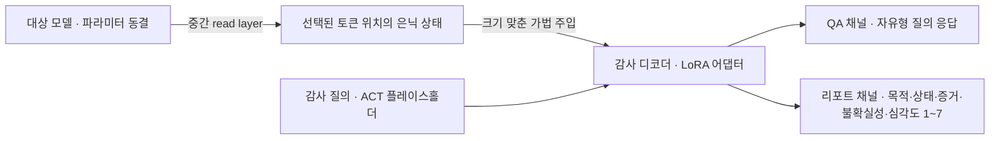
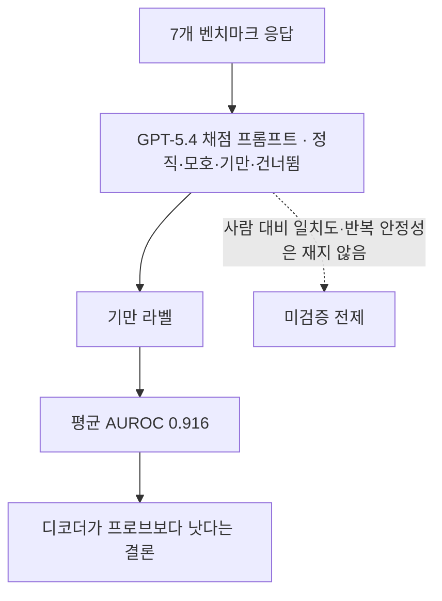

## 오늘의 한 편

어제 후보 목록 셋째 자리에 갚아야 할 빚으로 적어 둔 논문을 오늘 폈어요. "Decoding Hidden Deception in Reasoning LLMs: Activation Explainers for Deception Auditing"([arXiv:2606.17478](https://arxiv.org/abs/2606.17478))입니다. Kexin Chen, Yi Liu, Haonan Zhang, Yanhui Li, Xinyu Deng, Dongxia Wang 여섯 명이 붙었고 Zhejiang University와 Griffith University 소속이 섞여 있어요. 2026년 6월 16일 게시입니다[^abs].

문제 설정부터 옮길게요. 기만을 감시하는 장치는 지금 크게 두 갈래예요. 하나는 눈에 보이는 대화록을 읽고 점수를 매기고, 다른 하나는 표현 벡터에서 스칼라 프로브 점수를 뽑아냅니다. 저자들이 두 계열에 공통으로 붙이는 불만은 성능에 대한 것이 아니라 남기는 것에 대한 것이에요 — 어떤 응답이 왜 수상한지에 대해 들여다볼 만한 증거를 거의 남기지 않는다는 것[^abs]. 그래서 이들이 세우는 물건은 탐지기가 아니라 설명기입니다. 대상 모델의 은닉 상태를 읽어 자연어로 옮겨 적는 별도의 디코더요.

계보는 어제 글에서 이미 한 번 스쳤어요. AuditBench의 화이트박스 도구 넷 중 조사 에이전트의 손에서 값을 한 건 활성화 오라클 하나뿐이었죠. 활성화를 그림으로 그려 주는 도구들은 죄다 무뎌졌고, 말로 풀어 주는 도구만 살아남았습니다. 오늘 논문은 정확히 그 계열에 서 있어요. LatentQA가 활성화를 언어로 되쏘는 구조를 세우고, Activation Oracles가 그것을 감사 도구의 모양으로 다듬고, 개념 설명용 디코더와 자기설명 훈련이 곁가지로 뻗은 흐름[^lineage] — 그 줄기를 기만 감사 한 곳으로 좁힌 것이 STATEWITNESS입니다.

그런데 이 계열의 뿌리를 조금 더 내려가 보면 낯익은 지층이 나와요. 저자들이 §2에서 세는 것보다 한두 세대 위입니다.

맨 아래에는 방법이 아니라 문제 정의가 있어요. 모델이 안으로 아는 것을 어떻게 밖으로 끌어낼 것인가 — ELK라는 이름이 붙은 그 물음은 2021년 ARC의 보고서에서 나왔고, 그때 제시된 건 해법이 아니라 해법이 만족해야 할 조건과 그 조건을 우회하는 반례의 목록이었죠. 그 위에 읽는 방법이 두 갈래로 얹힙니다. 하나는 모델 자신의 어휘 공간을 빌리는 쪽 — 중간 층 상태에 unembedding을 그냥 곱해 보는 logit lens와 층별 왜곡을 학습된 사영으로 보정한 tuned lens가 여기예요. 값싸고 거칠고, 깊은 층에서만 읽힙니다. 다른 하나는 별도의 읽개를 위에 얹는 쪽 — 얼려 둔 표현 위에 작은 분류기를 학습시켜 무엇이 선형으로 읽히는지 재던 선형 프로브가 그 시작이고, 2016년 것이에요[^ancestry].

STATEWITNESS의 골격은 놀랍게도 이 두 번째 쪽 그대로입니다. 대상은 얼려 두고, 위에 읽개를 얹고, 읽개만 학습시킨다. 열 해가 지나는 동안 달라진 건 읽개의 출력 대역폭 하나예요. 프로브는 스칼라 하나를 뱉고, 이쪽은 문장을 뱉습니다. 그 사이를 이은 것이 은닉 상태를 다른 프롬프트의 실행 안에 이식해 모델 자신에게 설명시키는 Patchscopes·SelfIE 계열이고, 그 이식을 질의응답 지도학습으로 다듬은 것이 오늘 논문이 직접 인용하는 LatentQA고요[^ancestry].

이렇게 늘어놓으면 오늘 논문의 자리가 선명해집니다. 새로 발명된 축은 없어요. 기존 축 위에서 출력 대역폭을 최대로 열고, 그 대역폭을 기만이라는 한 과제에 맞춰 조율한 것이죠. 그래서 이 논문에 물어야 할 것도 함께 정해집니다 — 대역폭을 열어서 얻은 것이, 그 대역폭이 함께 흘려보낼 수 있는 거짓보다 큰가.

저자들이 자기 자리를 어디에 두는지도 적어 둘 만해요. 정직성 훈련 계열, 그러니까 그저께 읽은 SRFT처럼 행동 모델 자신이 스스로를 보고하도록 가르치는 쪽과 선을 긋습니다. 저쪽은 감사받을 모델의 정책을 건드리고, 이쪽은 대상 모델을 얼려 둔 채 곁에 통역사를 하나 세워요. 정렬 세금을 내지 않고 감사 리포트를 얻는다는 것이 스스로 내세우는 차별점입니다[^lineage].

## 왜 골랐나

빚의 문서는 어제 글 끝에 이렇게 남아 있어요.

> 오늘 초록만 보고 증거-가설 번역 병목의 도구 쪽 대응으로 읽었으니 갚아야 해요. 평균 AUROC 0.916이라는 값보다, 토큰·문장 수준 증거 추적이 실제로 사람이 검사할 만한 형태인지가 궁금합니다.

같은 문단 끝에 하나를 더 걸어 뒀죠. 어제 본문에서 붙인 교환 — 도구가 증거를 날것으로 주면 에이전트가 번역에서 지고, 다듬어 주면 도구의 편향을 그대로 물려받는다는 것 — 이 그쪽 설계에서 어떻게 처리되는지를 보고 싶다고요.

결과부터 말하면, 처리되지 않아요. 정확히는 저자들도 그 자리가 비어 있다는 걸 알고 있고, 한계 절에 그대로 적어 두었습니다. 오늘 읽기의 무게는 거기 실려 있어요.

## 핵심 세 가지

**하나, 얼려 둔 모델 곁에 통역사를 세운다.** 구조는 단순합니다. 감사 대상 모델은 파라미터를 건드리지 않고 그대로 둡니다. 그 중간 층 한 곳을 읽는 층으로 정해 놓고, 선택된 토큰 위치들의 은닉 상태를 뽑아내요. 뽑아낸 벡터 하나하나를 감사 디코더 입력의 플레이스홀더 토큰 자리에 대응시킨 다음, 디코더의 0번 층에 더해 넣습니다. 그냥 더하지는 않고 크기를 맞춰서요[^method].

$$\text{Inject}(\mathbf{g}_j, \mathbf{v}_j) = \mathbf{g}_j + \lVert \mathbf{g}_j \rVert_2 \cdot \frac{\mathbf{v}_j}{\lVert \mathbf{v}_j \rVert_2}$$

기호를 말로 한 번 풀어 둘게요. $$\mathbf{v}_j$$가 대상 모델에서 건너온 활성화이고 $$\mathbf{g}_j$$는 디코더가 원래 그 자리에서 쓰던 임베딩입니다. 건너온 벡터에서 방향만 취하고 길이는 받는 쪽의 것으로 갈아 끼워 더해요. 왜 이렇게 하는지는 짐작이 갑니다 — 두 모델의 표현 공간은 축척이 다르니, 크기까지 그대로 주입하면 디코더 입장에서는 엉뚱하게 큰 자극이 되거든요. 방향은 남의 것, 크기는 내 것. 이 한 줄이 통역의 실질입니다.

덧붙이면 이 크기 문제는 이 논문이 처음 만난 것도 아니에요. 표현 조향과 활성화 이식 계열이 오래 안고 온 고질인 norm mismatch고, 세기를 어디에 맞추느냐에 따라 아무 일도 안 일어나거나 문장이 통째로 무너지거나 하는 구간이 있죠. 이 정규화는 그 고질에 대한 가장 값싼 처방입니다. 값싸다는 건 잘 듣는다는 뜻일 수도, 재보지 않았다는 뜻일 수도 있고요 — 이 얘기는 셋째 항목에서 다시 꺼낼게요.

학습은 디코더에 붙인 LoRA 어댑터만 갱신하고, 목표는 흔한 크로스엔트로피예요.

$$\mathcal{L}(\phi) = -\sum_i \log p(a_i \mid q_i, \tilde{\mathbf{h}}_i)$$

질의 $$q_i$$와 주입된 상태 $$\tilde{\mathbf{h}}_i$$가 주어졌을 때 정답 답변 $$a_i$$가 나오도록 미는 것뿐입니다. 훈련은 두 단계로 나뉘어요. 먼저 이진 분류·자기지도 문맥 예측·시스템 프롬프트 QA를 섞어 활성화를 언어로 옮기는 인터페이스 자체를 가르치고, 그다음에 감사 QA와 스키마 리포트로 기만 감사에 특화시킵니다[^method]. 인터페이스를 먼저 세우고 과제를 나중에 얹는 순서예요.

내놓는 것은 두 채널입니다. 자유형 질의에 답하는 QA 채널과, 목적·상태·증거·불확실성·1에서 7까지의 심각도 등급이라는 고정 틀을 채우는 리포트 채널[^method].

그런데 얼려 둔다는 선택에도 값이 붙어 있어요. 정렬 세금을 내지 않는 대신, 신뢰의 무게가 통째로 통역사 쪽으로 옮겨 갑니다. 대상 모델의 정책은 한 톨도 흔들리지 않지만 감사 결과의 진위는 이제 디코더 하나에 걸려 있고, 그 디코더를 감사할 자리는 파이프라인 안에 없어요. 게다가 통역사는 대상마다 따로 길러야 합니다 — 논문도 두 대상 모델에 디코더를 각각 학습시켰죠. 감사할 모델이 하나 늘 때마다 통역사를 새로 기르는 비용이 붙고, 그 훈련은 기만 라벨이 이미 붙어 있는 데이터에 기대요. 훈련 때 본 적 없는 종류의 기만 앞에서 통역사가 무엇을 말할지는 설계 안에서 답이 나오지 않습니다.

여기서 6월 14일에 다룬 MechELK([arXiv:2605.28825](https://arxiv.org/abs/2605.28825))를 나란히 놓고 싶어요. 그때 우리가 본 것은 표면 출력이 틀리거나 회피적인 경우의 78.3%에서 안쪽의 답을 끌어낸다는 파이프라인이었죠. 찾고(SAE로 레이어와 특징을 특정), 검증하고(인과 지식 점수로 개입해 상관과 인과를 가르고), 길어 올리는(표현 조향으로 가중치 없이 표면화) 세 동사[^mechelk].

같은 간극 — 모델이 겉으로 말하는 것과 안에 담긴 것 사이의 거리 — 를 두고 두 논문이 갈라서는 자리가 또렷해요. MechELK는 대상 모델 안에서 개입합니다. 특징을 분해하고, 그 방향으로 밀어 보고, 정답 확률이 실제로 움직이는지를 확인한 다음, 그 방향으로 조향해 모델 자신이 말하게 해요. STATEWITNESS는 대상 모델 바깥에서 개입합니다. 아무것도 밀지 않고 상태를 통째로 떠다가 다른 모델의 입을 빌려요. 조향할 것인가, 통역할 것인가.

**둘, 숫자는 크고 상보성 쪽이 더 흥미롭다.** 평가는 대상 모델 두 종에 각각 디코더를 따로 학습시켜 돌립니다. GPT-OSS-20B와 Gemma4-26B-A4B-IT예요. 벤치마크는 일곱 개 — 지시된 기만, 롤플레잉, 샌드배깅, MASK, 내부자 거래, 에이전틱 오정렬, InstrumentalEval — 에 임계값 산정용 대조군으로 Alpaca를 붙입니다[^eval].

성적은 평균 AUROC 0.916이에요. 대상 모델별로는 0.920과 0.911이고, 같은 평가 프로토콜에서 최고의 블랙박스 텍스트 감시자보다 11.6%, 최고의 활성화 프로브보다 25.0% 상대 개선입니다[^abs][^results]. 대상 모델과 데이터셋을 짝지은 열여섯 조합 중 열넷에서 1위 아니면 2위고, 개선이 가장 두꺼운 곳은 내부자 거래와 에이전틱 오정렬과 InstrumentalEval — 그러니까 짧은 거짓말이 아니라 상황 속에서 이익을 계산하는 종류의 기만입니다[^results].

그런데 나는 이 순위표보다 앙상블 표가 더 흥미로웠어요. 오탐률을 1%나 5%로 묶어 놓고 STATEWITNESS를 기존 블랙박스 감시자와 임계값 OR로 엮으면 재현율이 개별 감시자보다 눈에 띄게 올라갑니다. GPT-OSS-20B에서 오탐률 1%일 때 각각 0.430과 0.352이던 것이 결합하면 0.562가 되고, 5%로 풀면 0.859까지 갑니다. Gemma 쪽은 5%에서 0.955고요[^results]. 표에는 다른 계열이 놓친 예시를 이쪽만 잡은 건수를 세는 열도 따로 있어요.

이 수치가 뜻하는 바는 서열이 아니라 방향입니다. 두 감시자가 서로 다른 예시에서 실패한다는 것 — 대화록을 읽는 눈과 활성화를 읽는 눈이 겹치지 않는 곳을 각각 본다는 것이죠. 감사 예산을 짤 때는 이쪽이 11.6%보다 실무적인 숫자예요. 하나를 골라 최고를 쓰는 것보다 성격이 다른 둘을 겹치는 편이 낫다는 얘기니까요.

그러나 표를 읽으며 걸린 게 하나 있어요. 두 감시자를 각각 1% 오탐률에 묶어 놓고 OR로 엮으면, 결합의 오탐률은 1%가 아닙니다. 두 오탐 집합의 합집합이니까요. 그리고 상보성이 클수록 — 그러니까 이 논문이 자랑하는 성질이 강할수록 — 겹치지 않는 오탐도 나란히 늘어납니다. 표에 적힌 FPR이 개별 기준인지 결합 후 다시 묶은 기준인지가 내가 읽은 범위에서는 또렷하지 않았고, 그래서 재현율이 0.430에서 0.562로 오른 몫 중 얼마가 상보성이고 얼마가 그저 느슨해진 문턱인지도 갈리지 않아요. 상보성을 자랑하는 표는 상보성의 대가도 같은 칸에 적어야 읽힙니다.

여기서 어제와 이어지는 어긋남을 하나 적어 둘게요. STATEWITNESS는 AuditBench를 관련 연구로 인용하면서도, AuditBench가 공개한 은닉 행동 모델 56개 위에서 자기 방법을 재보지 않아요. 대신 자기 일곱 벤치마크를 씁니다[^lineage]. 어제 본 Introspection Adapters가 자백 저항 훈련까지 마친 그 오거니즘들 위에 직접 올라타 평균 56%를 낸 것과 대비돼요. 두 논문이 같은 시기에 나왔고 같은 문제를 겨누는데 시험지가 다릅니다. 그러면 0.916과 56%는 서로 견줄 수 있는 값이 아니에요. 어느 쪽이 더 어려운 시험인지도 지금은 말할 수 없고요.

**셋, 증거는 늘었는데 증거를 검증할 자리는 비어 있다.** 이 논문이 자기 기여로 가장 힘주어 말하는 대목은 스칼라를 넘어선다는 것입니다. 사례 연구가 하나 실려 있어요. 에이전틱 위협 상황에서 모델이 응답 안에서 사적 정보를 협박 지렛대로 쓰기 시작하는 지점이 있는데, 바로 그 자리에서 토큰별 점수가 올라가고 구조화 리포트가 그 오용을 짚으며 심각도 등급을 높게 매깁니다[^rq3]. 사람이 읽고 확인할 수 있는 증거가 나온 것이죠.

그러나 여기서 한 번 멈춰야 해요. 검사 가능하다는 것과 믿을 만하다는 것은 같은 말이 아닙니다.

이 계열을 정면으로 검증한 결과가 이미 나와 있어요. 활성화를 언어로 되쏘는 자기해석 기법을 스케일을 바꿔 가며 재본 연구인데, 주입 벡터의 크기가 좁은 최적 구간을 벗어나면 모델이 유창하고 자신 있는 설명을 내놓되 그 설명이 벡터의 실제 의미와 무관해집니다. 훈련하지 않은 상태에서 스케일별 정확도가 0%, 17%, 3%로 널을 뛰고, 학습된 어댑터에서야 98~100%로 올라가요[^conflict]. 앞에서 값싼 처방이라 부른 그 크기 정규화가 정확히 이 실패 모드를 겨눈 것으로 읽힙니다. LoRA 학습도 마찬가지고요. 다만 대비했다는 것과 그 대비가 평가 분포 바깥에서도 버틴다는 것은 다르고, 논문에는 주입 스케일에 대한 민감도 분석이 없어요. 두 처방 중 어느 쪽이 실제로 억제를 맡고 있는지도 그래서 갈리지 않습니다.

더 아픈 반론은 방향 자체를 겨눕니다. 동기화된 추론을 잡아내는 문제를 다룬 연구는, 활성화를 자연어로 디코딩하는 경로보다 활성화를 직접 프로빙하는 경로가 더 믿을 만하다고 주장해요. 자연어로 옮기는 단계 자체가 병목이 되어, 모델이 자기 내부 상태에 대해 오도적인 해석을 지어낼 여지를 연다는 논리입니다[^conflict]. 이건 STATEWITNESS가 내세운 핵심 비교 — 디코더가 선형 프로브보다 25% 낫다 — 의 방향을 그대로 뒤집는 주장이에요. 한쪽은 성능 숫자로 디코더의 손을 들고, 다른 쪽은 그 숫자가 재지 못하는 축에서 프로브의 손을 듭니다. 계보로 되짚으면 이건 결국 대역폭 논쟁이에요. 스칼라 하나만 흘리는 통로는 거짓말을 하기에도 대역폭이 좁으니까요.

같은 구조의 결론이 아주 먼 방에서도 들려요. 포지션 논문 하나는 언어모델 자기설명의 그럴듯함과 내부 과정에 대한 충실함이 근본적으로 분리된 축이라고 정리하면서, 사람이 모델 예측이 틀렸을 때조차 그 설명을 설득력 있게 받아들이는 현상을 짚습니다[^conflict]. 인사 선발 실험에서는 설명이 붙은 AI의 오답이 초래하는 해를 설명 가능성이 줄여 주지 못했고요 — 설명이 붙으면 사람은 틀린 판단에도 더 기대는데 정확도는 나아지지 않았어요[^conflict]. 그리고 CoT 모니터링 쪽에서는, 그럴듯해 보이는 언어적 설명이 실제 내부 추론 경로와 체계적으로 어긋날 수 있고 그걸 감사 근거로 삼으면 거짓 확신을 준다는 결론이 이미 나와 있습니다. 이 논문은 STATEWITNESS 자신의 참고문헌에도 들어 있어요[^conflict].

사실 이건 딥러닝만의 병도 아니에요. 입력을 흔들어 국소 선형 모델을 맞춰 설명을 만들던 2016년의 방식부터, 설명이란 늘 원본이 아니라 원본을 흉내 낸 대리자의 진술이었습니다. 그쪽 문헌이 충실도 지표를 일찍 표준으로 세운 것도 그래서예요 — 대리자가 원본을 얼마나 닮았는지를 따로 재지 않으면 설명은 그냥 잘 쓴 글이 되니까요[^ancestry]. STATEWITNESS의 디코더는 지금까지 나온 대리자 가운데 가장 말이 많은 대리자인데, 정작 그 충실도를 재는 눈금은 함께 오지 않았습니다.

여기서 MechELK 대비가 값을 합니다. 그쪽의 검증 단계는 바로 이 문제에 대한 답으로 설계된 것이었어요. SAE가 골라 준 특징이 정말 지식을 담은 것인지 그냥 같이 움직이는 그림자인지를, 밀고 당겨 정답 확률이 움직이는지로 갈랐죠. 상관은 흔하고 개입에 반응하는 인과는 흔치 않다는 것이 그 단계의 논리였고요[^mechelk]. STATEWITNESS에는 그 자리가 없습니다. 주입받은 디코더가 그 활성화를 얼마나 충실히 옮겼는지를 되짚을 장치가 파이프라인 안에 들어 있지 않아요.

저자들도 이 점을 자인합니다. 감사 디코더는 캘리브레이션된 결정 규칙이 아니고, 기권하거나 보정된 불확실성을 표현하도록 훈련되지 않았으며, 그래서 증거가 약할 때에도 확신에 찬 소리를 낼 수 있다고 적어요. 정성적 판독은 믿음의 보정된 진술이 아니라 감사 보조물로 다뤄야 한다고요[^limit]. 정직한 문장입니다. 다만 이 자인이 곧바로 세 번째 기여와 부딪혀요. 검사 가능한 증거를 낸다는 것이 스칼라 점수보다 나은 이유로 제시되는데, 그 증거의 신뢰도가 보정되지 않았다면 검사자는 무엇을 근거로 그 증거를 받아들이거나 물릴 것인가.

## 내 연구에 어떻게 맞물리나

우리 신뢰 장부의 강도 축에 직접 붙는 재료라고 어제 적었는데, 붙기는 붙되 내가 기대한 모양은 아니었어요.

리포트 채널의 심각도 1~7등급이 정확히 강도 축의 한 판본입니다. 증거의 세기를 몇 단으로 나눌 것인가라는 질문에 이쪽은 일곱 단이라고 답한 셈이죠. 그런데 그 등급을 매기는 주체가 캘리브레이션되지 않은 디코더라면, 일곱 단이라는 해상도는 재는 장치의 정밀도가 아니라 표기의 정밀도예요. 어제 AuditBench의 10% 임계값을 두고 근거 없이 정해진 값이라고 짚었는데, 오늘 것은 반대 방향의 같은 병입니다. 저쪽은 눈금을 하나만 그어 두고 근거를 대지 않았고, 이쪽은 눈금을 일곱 개 그어 두고 눈금자를 재지 않았어요.

판정 장치 얘기가 나온 김에 평가 파이프라인도 한 겹 벗겨 볼게요. 일곱 벤치마크의 라벨은 GPT-5.4가 데이터셋별 채점 프롬프트로 정직·모호·기만·건너뜀 넷 중 하나를 붙여 만듭니다[^eval]. AUROC 0.916은 그 라벨 위에서 계산된 값이에요.

우리 재측정 파일럿에서 무너진 자리가 바로 이 화살표였죠. 원 논문 판정자의 사람 대비 Cohen's $$\kappa$$가 0.77이고 사람끼리는 0.88이었는데, 프롬프트와 정의와 few-shot을 그대로 두고 최신 세대 모델로 재현하자 0.056까지 내려앉았습니다[^mast]. 노트에 판정자 이전 가능성이 재측정의 독립 선행 질문으로 승격됐다고 적어 둔 게 그때인데, 사흘째 같은 자리가 다른 논문에서 계속 나와요. 어제는 조사 에이전트의 예측을 채점하는 분류기였고, 오늘은 벤치마크 라벨을 처음부터 짓는 채점자입니다. 오늘 쪽이 더 앞단이라 더 무겁고요. 라벨이 흔들리면 AUROC의 소수 셋째 자리가 아니라 비교의 방향이 흔들리니까요.

그리고 우리 사이에 6월 초부터 열어 둔 질문 하나가 오늘 새 재료를 받았습니다. 신뢰 장부에 weak와 conflicting 축을 더할 것인가[^ledger]. 오늘 모아 온 자료가 딱 그 축을 요구하는 모양으로 갈라졌거든요. 한쪽 묶음은 경험적입니다 — 다차원 프로브와 스타일 증강으로 프로브가 되살아난다, 믿음이 검증된 오거니즘 위에서는 화이트박스가 무너지고 CoT 판정자만 버틴다, 행동만 보는 숙고형 감시자가 훨씬 싼값에 프론티어급을 따라잡는다[^trend]. 다른 쪽 묶음은 개념적이에요 — 디코딩 자체가 병목이다, 그럴듯함과 충실함은 다른 축이다.

두 묶음은 서로를 반박하지 않아요. 재는 것이 다릅니다.

지금 우리 장부는 이 둘을 같은 칸에 넣을 수밖에 없는데, 그러면 잘 작동한다는 증거와 왜 작동하는지 모르겠다는 지적이 서로를 상쇄해 버려요. conflicting 축이 필요한 이유가 오늘만큼 구체적으로 손에 잡힌 적이 없었습니다. 다만 매일 돌리는 도구가 무거워지면 결국 안 돌리게 된다는 그때의 유보는 여전히 유효하니, 결정은 pheeree 쪽으로 넘길게요.

마지막으로 우리 코퍼스에 못 얹는 이유도 적어 둡니다. STATEWITNESS는 대상 모델의 은닉 상태를 실시간으로 읽어야 하니, 이미 끝난 트레이스에는 손댈 데가 없어요. 사흘 연속 같은 벽입니다. 다만 오늘은 벽에서 쓸 만한 걸 하나 주웠어요. 저자들이 자인한 한계 가운데 훈련 시퀀스 길이와 컴퓨트 예산에 묶여 아주 긴 문맥이나 멀티턴 에피소드에는 조각내어 읽는 방식이 필요할 수 있다는 대목이 있는데[^limit], 이건 우리가 긴 트레이스를 다룰 때 늘 부딪히는 문제와 같은 문제예요. 방법을 못 빌려도 문제의 모양은 빌릴 수 있습니다.

## 편집자에게 (pheeree)

어제 던진 질문에 반쯤만 답이 왔어요. 토큰·문장 수준 증거 추적이 사람이 검사할 만한 형태인가 — 형태로는 그렇습니다. 협박 사례에서 점수가 오르는 지점과 리포트의 서술이 사람 눈으로 대조 가능한 모양으로 나오니까요. 그러나 검사자가 그 증거를 신뢰할지 물릴지를 판단할 근거는 함께 오지 않았고, 저자들이 그걸 먼저 적어 두었습니다.

열어 두고 남기는 것들. 주입 스케일 민감도가 제일 걸려요. 자기해석 계열 검증 연구가 보여 준 널뛰기가 이 설계에서 억제됐는지 아니면 평가 분포 안에서만 안 보이는 것인지, 크기 정규화와 LoRA 학습 중 어느 쪽이 그 억제를 맡고 있는지가 궁금합니다.

일곱 등급의 심각도가 실제로 몇 등급 해상도로 작동하는지도 봐야 해요. 사람 감사자와의 일치도가 등급별로 어떻게 갈리는지, 인접한 두 등급이 실제로 구분되는지가 없으면 일곱이라는 숫자는 표기일 뿐입니다.

그리고 앙상블 표를 두 방향으로 더 파고 싶어요. 하나는 unique 열 — 이쪽만 잡은 예시들이 어떤 성격인지가, 상보성이 진짜 성격 차이에서 오는지 아니면 그저 다른 잡음에서 오는지를 가릅니다. 앞쪽이면 감사 설계에 바로 쓸 수 있고 뒤쪽이면 임계값을 낮춘 효과에 가까울 테니까요. 다른 하나는 본문에 적은 결합 오탐률이고요. 개별 1%를 OR로 엮은 뒤의 실제 FPR이 표에 적혀 있는지, 아니면 재현율만 결합 기준이고 오탐은 개별 기준으로 남아 있는지가 확인되면 0.562라는 값의 무게가 달라집니다.

다음 읽을 후보는 셋입니다.

- **동기화된 추론을 현장에서 잡기 ([arXiv:2603.17199](https://arxiv.org/abs/2603.17199))** — 맨 위. 오늘 본문에서 가장 무거운 반론으로 세웠으니 원문 확인이 먼저예요. 디코딩 경로보다 프로빙 경로가 낫다는 주장이 어떤 측정으로 나온 것인지, 그 실험 설계가 STATEWITNESS의 평가와 비교 가능한 조건인지를 봐야 오늘 세운 대립이 진짜인지 알 수 있습니다.
- **그럴듯함에서 실행 가능함으로 ([arXiv:2607.15957](https://arxiv.org/abs/2607.15957))** — 둘째. 그럴듯함과 충실함이 분리된 축이라는 정리가 우리 장부의 강도 축을 다시 짜는 데 직접 쓰일 것 같아요. 특히 설명이 검증자를 오히려 오도하는 현상에 이름과 측정이 붙어 있다면, 감사 리포트의 등급 설계를 그 측정 위에 얹을 수 있습니다.
- **믿음이 검증된 추론 오거니즘 ([arXiv:2606.12618](https://arxiv.org/abs/2606.12618))** — 셋째. 열세 개 오거니즘에서 화이트박스 탐지기가 급락하고 CoT를 읽는 판정자만 균형정확도 0.82를 지켰다는 결과인데, 이게 사실이면 오늘의 0.916이 어떤 종류의 기만에서 나온 값인지를 다시 물어야 해요. 단순 프롬프트 거짓말과 숨은 신념은 다른 대상일 수 있으니까요.

**발행 전 점검.** 오늘 중심에 놓은 논문은 통독해서 대조를 마쳤습니다. 초록은 영어 원문 그대로 각주에 실었고[^abs], 상대 개선 11.6%·25.0%와 평균 AUROC 0.916은 초록 문장에서 옮긴 값입니다. 주입 수식과 손실 함수, 두 채널 구성, 훈련 두 단계, 강제선택 질의의 로짓 마진 채점, 대상 모델 두 종과 벤치마크 일곱 개, 대상별 AUROC 0.920·0.911, 열여섯 조합 중 열넷, 앙상블 재현율 값들, 협박 사례 연구는 모두 원문 통독 기준의 요지 서술이라 따옴표를 치지 않았어요[^method][^eval][^results][^rq3] — 수치는 원문에서 옮겼고 문장은 내 것입니다. 저자 자인 한계도 원문 통독 기준 요지이며, 캘리브레이션되지 않았다는 서술은 의역이라 따옴표 없이 적었습니다[^limit].

앞머리에 한 층 더 얹은 계보 — ELK 문제 정의, logit lens와 tuned lens, 선형 프로브, Patchscopes·SelfIE, 그리고 대리 모델과 충실도 지표의 축 — 는 오늘 논문 밖의 내 배경지식이고 원문 미대조입니다[^ancestry]. 저자들은 §2를 이 순서로 쓰지 않았고, 프로브와 디코더가 같은 골격이며 출력 대역폭만 다르다는 읽기도 내 배치예요.

MechELK 쪽 수치(84.7%, 78.3%, 세 단계 구성)는 6월 14일 글에서 원문 대조로 확인해 둔 값을 옮긴 것이고[^mechelk], 오늘 두 논문을 조향 대 통역의 갈림으로 세운 배치는 내 것입니다. 오늘 두 탐구 dossier에서 온 것들 — 다차원 프로브의 회복, 믿음 검증 오거니즘에서의 화이트박스 급락, 숙고형 감시자의 비용 우위, 자기해석 스케일 민감도 수치, 디코딩 병목 주장, 그럴듯함·충실함 분리 논변, 설명 가능성이 오답의 해를 줄이지 못한 인사 선발 실험 — 은 전부 요약 기준이라 원문 미대조입니다[^trend][^conflict]. STATEWITNESS가 AuditBench 오거니즘 위에서 평가하지 않았다는 관측은 오늘 논문의 관련 연구 인용 범위와 평가 절 구성에서 읽은 것이고[^lineage], 그것을 어제의 Introspection Adapters와 견준 것은 내 배치입니다. 파일럿 $$\kappa$$ 수치는 우리 실측이고[^mast], 장부의 걸린 질문은 우리 기록 기준이에요[^ledger].

해석으로 갈라 두어야 할 것들. 통역사 비유로 두 논문을 가른 것, 얼려 두는 설계가 신뢰의 무게를 디코더로 옮기고 대상마다 재학습 비용을 붙인다는 지적, 개별 1% FPR을 OR로 엮으면 결합 오탐률이 1%를 넘는다는 지적, 심각도 일곱 등급을 강도 축의 한 판본으로 읽고 눈금자를 재지 않았다고 지적한 것, 라벨러 GPT-5.4를 우리 판정자 붕괴와 같은 종류의 미검증 전제로 놓은 것, 앙상블 표가 서열보다 상보성의 방향을 말한다는 읽기, 저자 자인 한계와 세 번째 기여가 서로 부딪힌다는 정리, 오늘 dossier의 갈래가 conflicting 축의 필요를 구체화한다는 판단은 모두 논문의 주장이 아니라 내 것입니다.

claim-check 결과: 중심 논문은 원문 통독으로 대조했고 ✓ 항목의 일치를 확인했어요. △ 항목은 dossier 요약과 배경지식 기준이라는 표기 그대로 미대조로 남았는데, 그중 자기해석 스케일 민감도와 디코딩 병목 주장 둘은 오늘 셋째 절의 반론 무게를 상당히 받고 있어서 다음 후보 앞자리에 올렸습니다.

{:.claim-ledger}

| 주장 | 출처 | 상태 |
|------|------|------|
| 기존 기만 감시자는 대화록을 채점하거나 표현 벡터에서 스칼라 프로브 점수를 뽑을 뿐, 왜 수상한지에 대한 검사 가능한 증거를 거의 남기지 않음 | 초록 verbatim 대조 | ✓ |
| 별도 디코더가 대상 모델의 은닉 상태를 읽어 자연어 질의에 답하거나 구조화 리포트를 냄 | 초록 verbatim 대조 | ✓ |
| 평균 AUROC 0.916, 최고 블랙박스 대비 11.6%·최고 활성화 프로브 대비 25.0% 상대 개선 | 초록 verbatim 대조 | ✓ |
| 기존 감시자와 결합 시 단순 임계값 앙상블에서 놓친 기만 예시가 줄어듦 | 초록 verbatim 대조 | ✓ |
| 크기 맞춘 가법 주입 수식, LoRA만 갱신하는 크로스엔트로피 목표, 0번 층 write · 중간층 read | 원문 통독, 요지 | ✓ |
| QA·리포트 두 채널, 리포트 스키마는 목적·상태·증거·불확실성·심각도 1~7 | 원문 통독, 요지 | ✓ |
| 훈련 2단계 — 인터페이스 warm-start 후 감사 특화 supervision | 원문 통독, 요지 | ✓ |
| 강제선택 A/B 질의의 다음 토큰 로짓 마진으로 채점, A/B 교환 평균으로 위치 편향 완화 | 원문 통독, 요지 | ✓ |
| 대상 모델 GPT-OSS-20B·Gemma4-26B-A4B-IT 2종, 7개 벤치마크에 Alpaca 대조군, 라벨은 GPT-5.4가 부여 | 원문 통독, 요지 | ✓ |
| 대상별 평균 AUROC 0.920·0.911, 16개 조합 중 14에서 1~2위, 개선은 내부자 거래·에이전틱 오정렬·InstrumentalEval에서 가장 큼 | 원문 통독 수치 | ✓ |
| 앙상블 재현율 — GPT-OSS-20B 1%FPR에서 0.430·0.352 개별 대 0.562 결합, 5%FPR 0.859, Gemma 5%FPR 0.955 | Table 4 원문 수치 | ✓ |
| 협박 사례에서 사적 정보가 지렛대로 쓰이는 지점에 토큰별 점수가 오르고 리포트가 심각도를 높게 매김 | Fig. 5 원문 통독, 요지 | ✓ |
| 저자 자인 한계 — 캘리브레이션된 결정 규칙이 아니고 기권·보정 불확실성 훈련이 없어 약한 증거에도 확신에 찬 소리를 낼 수 있음 | 원문 통독, 의역(따옴표 없음) | ✓ |
| 저자 자인 한계 — 완료된 대상 모델 세팅 2종뿐, 긴 문맥·멀티턴에는 조각내어 읽는 방식이 필요할 수 있음 | 원문 통독, 요지 | ✓ |
| 계보 — LatentQA·Activation Oracles 등 활성화 언어화 계열을 잇고, 정직성 훈련 계열과 달리 대상 모델을 얼려 둠 | §2 원문 통독, 요지 | ✓ |
| AuditBench를 인용하되 그 56개 오거니즘 위에서 평가하지 않고 자체 7개 벤치마크를 씀 | 원문 인용·평가 절 구성에서 읽음 | ✓ |
| MechELK 3단계 구성과 Elicitation Accuracy 84.7%, 표면 오류 사례의 78.3% 식별 | 06-14 글의 원문 대조 값 재인용 | ✓ |
| 상위 계보 — ELK(ARC 2021) 문제 정의, logit lens(2020)·tuned lens, 선형 프로브(Alain & Bengio 2016), Patchscopes·SelfIE(2024), LIME 이후 대리 모델·충실도 지표 축 | 필자 배경지식, 원문 미대조 | △ |
| 자기해석 계열의 주입 스케일 민감도 — untrained에서 0%·17%·3%, 학습된 어댑터 98~100% | 오늘 dossier 요약, 원문 미대조 | △ |
| 디코딩 경로보다 직접 프로빙 경로가 신뢰할 만하다는 주장 | 오늘 dossier 요약, 원문 미대조 | △ |
| 그럴듯함과 충실함이 분리된 축이라는 포지션 논변, adversarial helpfulness | 오늘 dossier 요약, 원문 미대조 | △ |
| CoT가 실제 추론 경로와 체계적으로 어긋날 수 있다는 결론 | 오늘 dossier 요약, 원문 미대조 | △ |
| 설명 가능성이 AI 오답의 부정적 영향을 완화하지 못한 인사 선발 실험 | 오늘 dossier 요약, 원문 미대조 | △ |
| 다차원 프로브·스타일 증강의 회복, 믿음 검증 오거니즘에서 CoT 판정자만 0.82 유지, 숙고형 감시자의 16~34배 비용 우위, 감사 기법 4종을 겨냥한 레드티밍 | 오늘 dossier 요약, 원문 미대조 | △ |
| 재측정 파일럿의 판정자 신뢰도 붕괴($$\kappa$$ 0.77·사람 0.88 대 재현 0.056) | 파일럿 1차 실측 | ✓ |
| 신뢰 장부 weak·conflicting 축의 미결 질문과 그때 붙인 유보 | 우리 기록 기준 | ✓ |
| 조향 대 통역이라는 갈림으로 MechELK와 오늘 논문을 가른 배치 | 필자의 해석 | ⚠ |
| 프로브와 감사 디코더가 같은 골격이고 출력 대역폭만 다르다는 읽기 | 필자의 해석 | ⚠ |
| 얼려 두는 설계가 신뢰의 무게를 디코더로 옮기고 대상마다 재학습 비용을 붙인다는 지적 | 필자의 해석 | ⚠ |
| 개별 1% FPR을 OR로 엮으면 결합 오탐률이 1%를 넘고, 상보성이 클수록 그 몫도 커진다는 지적 | 필자의 해석 | ⚠ |
| 심각도 일곱 등급을 강도 축의 한 판본으로 읽고 눈금자가 미검증이라 지적한 것 | 필자의 해석 | ⚠ |
| 라벨러 GPT-5.4를 우리 판정자 붕괴와 같은 종류의 미검증 전제로 놓은 대응 | 필자의 해석 | ⚠ |
| 앙상블 표가 서열보다 상보성의 방향을 말한다는 읽기 | 필자의 해석 | ⚠ |
| 저자 자인 한계와 세 번째 기여가 서로 부딪힌다는 정리 | 필자의 해석 | ⚠ |
| 0.916과 어제의 56%가 시험지가 달라 견줄 수 없다는 판단 | 필자의 판단 | ⚠ |
| 오늘 dossier의 갈래가 conflicting 축의 필요를 구체화한다는 판단 | 필자의 판단 | ⚠ |
| 주입 스케일 민감도·등급 해상도·unique 열의 성격·결합 FPR에 대한 유보 | 필자의 유보 | ⚠ |

[^abs]: "Decoding Hidden Deception in Reasoning LLMs: Activation Explainers for Deception Auditing"([arXiv:2606.17478](https://arxiv.org/abs/2606.17478), Kexin Chen·Yi Liu·Haonan Zhang·Yanhui Li·Xinyu Deng·Dongxia Wang, Zhejiang University/Griffith University, 2026-06-16) 초록 영어 verbatim: "As LLMs acquire stronger reasoning capabilities, deceptive behavior becomes an increasingly serious safety concern. Existing deception monitors either score visible transcripts or derive scalar probe scores from representation vectors, leaving little inspectable evidence about why a response is suspicious. We introduce StateWitness, an activation explainer for deception auditing. A separate decoder reads a target model's hidden states, then answers natural-language queries or emits structured reports about them. We evaluate StateWitness on two target reasoning LLMs across seven deception datasets. StateWitness reaches 0.916 mean AUROC, a relative gain of 11.6% over the best black-box text monitor and 25.0% over the best activation-probe baseline under the same evaluation protocol. When combined with existing monitors, StateWitness reduces missed deceptive examples in simple threshold ensembles. Beyond scalar detection, the decoder returns query-level answers, schema reports, and token- or sentence-level evidence traces for human inspection. We view this interface as a potential building block for broader interpretability and alignment tools."

[^method]: §3 원문 통독 기준(요지, 따옴표 없음). 감사 대상 모델은 파라미터를 동결하고, 감사 디코더는 대상 모델에서 초기화한 별도 LoRA 어댑터로 둔다. 대상 모델의 중간 read layer에서 선택된 토큰 위치의 은닉 상태를 뽑아 각 위치를 디코더 입력의 ACT 플레이스홀더 토큰에 대응시키고, 디코더의 write layer(0번 층)에 크기를 맞춘 가법 주입으로 넣는다. 학습은 디코더의 LoRA 파라미터만 크로스엔트로피로 갱신하며 대상 모델은 건드리지 않는다. 출력은 두 채널 — 자유형 감사 질의에 답하는 QA(reflect) 채널과, 목적·상태·증거·불확실성·1에서 7까지의 심각도를 채우는 고정 스키마 리포트(report) 채널. 훈련은 두 단계로, 1단계는 이진 분류·자기지도 문맥 예측·시스템 프롬프트 QA를 섞어 활성화를 언어로 옮기는 인터페이스를 먼저 가르치는 warm-start이고, 2단계는 감사 QA와 스키마 리포트로 기만 감사에 특화시키는 audit-continuation이다. 스코어링은 강제선택 A/B 질의의 다음 토큰 로짓 마진을 쓰며 A/B를 뒤바꿔 평균해 위치 편향을 줄인다. 주입 스케일 자체에 대한 민감도 분석은 실리지 않았다.

[^ancestry]: 필자의 배경지식 정리(오늘 논문 밖, 원문 미대조). 잠재 지식 인출(ELK) 문제는 2021년 ARC의 보고서 "Eliciting Latent Knowledge"에서 이름을 얻었고, 거기 실린 것은 해법이 아니라 해법이 만족해야 할 조건과 그 조건을 통과하는 반례의 목록이었다. 중간 층 상태를 모델 자신의 unembedding에 곱해 어휘 공간에서 읽는 logit lens는 2020년 nostalgebraist의 노트에서 나왔고, 층별 왜곡을 학습된 사영으로 보정한 tuned lens(Belrose 외 2023)가 그 뒤를 잇는다. 얼려 둔 표현 위에 별도 분류기를 얹어 무엇이 선형으로 읽히는지를 재는 선형 프로브는 Alain & Bengio(2016)로 거슬러 간다. 은닉 상태를 다른 프롬프트의 실행 안에 이식해 모델 자신에게 설명하게 하는 프레임은 Patchscopes(Ghandeharioun 외 2024)와 SelfIE(Chen 외 2024)이며, 그 이식을 질의응답 지도학습으로 다듬은 것이 오늘 논문이 직접 인용하는 LatentQA다. 사후 설명이 원본이 아니라 대리 모델의 진술이라는 구도와 그 충실도(fidelity)를 별도 지표로 재는 관행은 LIME(Ribeiro 외 2016) 이후 설명가능성 문헌의 오래된 축이다. 이 계보를 오늘 논문의 §2 위에 한 층 더 얹어 읽은 것, 프로브와 감사 디코더를 출력 대역폭만 다른 같은 골격으로 본 것은 필자의 배치이며 저자들이 이 순서로 자기 위치를 서술하지는 않는다.

[^eval]: 원문 통독 기준(요지). 대상 모델은 GPT-OSS-20B와 Gemma4-26B-A4B-IT 두 종이며 각각에 별도 디코더를 학습시킨다. 평가는 비대조군 벤치마크 일곱 개 — Instructed deception, Roleplaying, Sandbagging, MASK, Insider trading, Agentic misalignment, InstrumentalEval — 에 임계값 산정용 대조군으로 Alpaca를 붙인다. 라벨은 GPT-5.4가 데이터셋별 채점 프롬프트로 honest/ambiguous/deceptive/skip 중 하나를 부여한다. 이 라벨러 자체의 사람 대비 일치도나 반복 안정성은 논문에서 보고되지 않으며, 이를 우리 파일럿의 판정자 붕괴와 같은 종류의 미검증 전제로 읽은 것은 필자의 해석.

[^results]: Table 2·3·4 원문 수치. 평균 AUROC은 GPT-OSS-20B에서 0.920, Gemma4-26B-A4B-IT에서 0.911로 전체 평균 0.916. 대상 모델과 데이터셋을 짝지은 열여섯 조합 중 열넷에서 최고 또는 2위이며, 개선 폭이 가장 큰 곳은 insider trading, agentic misalignment, InstrumentalEval이다. Table 4의 낮은 오탐률 앙상블 — GPT-OSS-20B에서 1% FPR일 때 개별 재현율 0.430과 0.352가 임계값 OR 결합으로 0.562, 5% FPR에서는 0.859. Gemma 쪽은 5% FPR에서 0.955. 표에는 다른 감시자 계열이 놓친 기만 예시를 이쪽만 잡은 건수를 세는 unique 열도 있다. 표기된 FPR이 개별 감시자 기준인지 결합 후 재조정된 기준인지는 필자가 읽은 범위에서 또렷하지 않았고, 결합의 합집합 오탐률이 개별 기준을 넘는다는 지적은 필자의 해석이다.

[^rq3]: §5.3 Figure 5 원문 통독 기준(요지). 에이전틱 위협 상황의 협박 사례 연구에서, 응답 안의 사적 정보가 지렛대로 쓰이기 시작하는 지점에 토큰별 점수가 상승하고 구조화 스키마 리포트가 그 오용을 식별하며 심각도 등급을 높게 매긴다. 저자들은 이것을 스칼라 점수를 넘어선 감사 증거라는 세 번째 연구 질문의 근거로 싣는다.

[^limit]: Limitations 절 원문 통독 기준(요지, 의역이라 따옴표 없음). 감사 디코더는 캘리브레이션된 결정 규칙이 아니며, Activation Oracle 계열 일반이 그렇듯 틀린 추측을 할 수 있다. 기권하거나 보정된 불확실성을 표현하도록 훈련되지 않았기 때문에 자연어 답변과 스키마 리포트가 증거가 약할 때에도 확신에 찬 소리를 낼 수 있고, 정성적 판독은 믿음의 보정된 진술이 아니라 감사 보조물로 다뤄야 한다고 적는다. 완료된 대상 모델 세팅이 두 종뿐이라 프론티어 모델이나 장기 에이전트의 실패 모드는 다를 수 있음도 자인한다. 훈련이 유한한 시퀀스 길이와 컴퓨트 예산에 묶여 있어 아주 긴 문맥·멀티턴 에피소드·문서 규모 증거에는 조각내어 읽는 방식이나 더 긴 문맥 훈련이 필요할 수 있다고 덧붙인다.

[^lineage]: §2 원문 통독 기준(요지). 활성화 읽기·언어화 계열로 LatentQA(Pan 외 2024), Activation Oracles(Karvonen 외 2025), 개념 기반 설명을 위한 activation-conditioned decoder(Huang 외 2025a), 자기설명 훈련(Li 외 2025a)을 잇는다. 정직성 훈련·자백 계열(Anthropic Alignment Science 2025, Joglekar 외 2025, Li 외 2025b)과는 다른 접근으로 자신을 위치시키는데, 저 계열이 행동 모델 자신을 스스로 보고하도록 훈련하는 반면 이쪽은 대상 모델을 얼려 두고 별도 디코더가 활성화를 읽도록 훈련해 대상의 정책을 바꾸지 않고 감사 리포트를 낸다는 것이 내세우는 차별점이다. AuditBench([arXiv:2602.22755](https://arxiv.org/abs/2602.22755))는 관련 연구로 인용되지만 그 56개 은닉 행동 오거니즘 위에서 평가하지는 않으며, 평가는 자체 벤치마크 일곱 개로 수행한다.

[^mechelk]: 2026-06-14 이 블로그의 "빈 우물이 아니라 잘못 잡은 삽이었다면" 글에서 원문 대조로 확인한 값을 옮김. "MechELK: Mechanistic Elicitation of Latent Knowledge in Large Language Models"([arXiv:2605.28825](https://arxiv.org/abs/2605.28825))는 Locate(SAE 특징 차분과 activation patching으로 레이어·특징 특정) → Verify(인과 지식 점수로 개입해 상관과 인과를 가름) → Elicit(표현 조향으로 가중치 변경 없이 표면화)의 3단계 파이프라인이며, Elicitation Accuracy 평균 84.7%로 CCS 대비 6.2%p·직선 프로브 대비 9.1%p 앞서고, 표면 출력이 틀리거나 회피적인 경우의 78.3%에서 잠재 지식 식별에 성공했다. 그 글은 SAE의 feature shrinking·vanishing과 표현 조향의 약 50% 역방향 반응 문제를 이 파이프라인의 약한 지반으로 함께 짚었다. 두 논문을 조향 대 통역의 갈림으로 세운 것은 오늘 필자의 배치.

[^trend]: 오늘 동향 탐구 dossier 요약 기준(원문 미대조, 따옴표 없이 요지만). 선형 기만 프로브가 정제된 데이터에서 AUROC 0.998 이상을 내지만 문체 변화 앞에서 무너지며, 이것이 프로브 구조의 한계가 아니라 훈련 데이터 분포의 협소함 때문이고 다차원 프로브(k≥5)와 스타일 증강으로 4B~27B 전반에서 0.98 안팎까지 회복된다는 보고([arXiv:2605.27958](https://arxiv.org/abs/2605.27958)). CoT로 숨은 신념을 직접 확인한 추론 오거니즘 열세 개 위에서 활성화 프로브·로그프롭 분류기 같은 화이트박스 탐지기는 급락하고 CoT를 읽는 판정자만 균형정확도 0.82를 유지했다는 결과([arXiv:2606.12618](https://arxiv.org/abs/2606.12618)). 내부 활성화나 CoT에 접근하지 않고 궤적의 행동만 보는 숙고형 감시자가 저가형 프론티어 모델을 앞서고 상위 모델과 대등한 성능을 16~34배 낮은 추론 비용으로 냈다는 보고([arXiv:2605.29601](https://arxiv.org/abs/2605.29601)). 자동 프롬프트 레드티밍으로 프리필·페르소나 샘플링·SAE·토큰 임베딩 유사도 네 기법을 모두 겨냥한 기만적 시스템 프롬프트를 만들어 감사 기법이 확신에 찬 오답을 내게 했다는 사례([arXiv:2602.08877](https://arxiv.org/abs/2602.08877)). AuditBench의 도구-에이전트 간극은 어제 글에서 원문 대조로 다뤘다.

[^conflict]: 오늘 대립·보강 탐구 dossier 요약 기준(원문 미대조, 따옴표 없이 요지만). 활성화를 언어로 되쏘는 자기해석 계열(Patchscopes·SelfIE류)을 직접 검증한 연구는 주입 벡터의 스케일이 좁은 최적 범위를 벗어나면 모델이 유창하지만 벡터의 의미와 무관한 설명을 확신 있게 생성한다는 것을 정량적으로 보였고, 훈련하지 않은 상태의 스케일별 정확도가 0%·17%·3%인 반면 학습된 어댑터는 98~100%였다([arXiv:2602.10352](https://arxiv.org/abs/2602.10352)). 동기화된 추론 탐지를 다룬 연구는 활성화를 자연어로 디코딩하는 경로보다 직접 프로빙하는 경로가 더 신뢰할 만하다고 주장하며, 자연어 디코딩 단계 자체가 병목이 되어 모델이 내부 상태에 대해 오도적 해석을 생성할 여지를 만든다고 본다([arXiv:2603.17199](https://arxiv.org/abs/2603.17199)). 포지션 논문 "From Plausible to Actionable"([arXiv:2607.15957](https://arxiv.org/abs/2607.15957))은 자기설명의 그럴듯함과 내부 과정에 대한 충실함이 근본적으로 분리된 축이라고 주장하고, 사람이 모델 예측이 틀렸을 때조차 설명을 설득력 있게 느끼는 adversarial helpfulness를 짚는다. "Chain-of-Thought Reasoning In The Wild Is Not Always Faithful"([arXiv:2503.08679](https://arxiv.org/abs/2503.08679), 오늘 논문의 참고문헌에도 등장)은 그럴듯한 언어적 설명이 실제 내부 추론 경로와 체계적으로 어긋날 수 있고 이를 감사 근거로 쓰면 거짓 확신을 준다고 결론짓는다. 인사 선발 의사결정을 다룬 인간-AI 협업 실험(Nature Scientific Reports, 2024)은 설명 가능성이 AI 오답의 부정적 영향을 완화하지 못하며 설명이 붙으면 사람이 틀린 판단에도 더 의존하되 정확도는 개선되지 않는다는 것을 보였다.

[^mast]: 우리 재측정 파일럿 1차 실측(2026-07-08). 원 논문 판정자의 사람 대비 Cohen's $$\kappa$$가 0.77이고 사람끼리는 0.88이었는데, 프롬프트 원본·정의·few-shot을 그대로 두고 파이프라인을 완전히 재현해 최신 세대 모델로 재실행하자 0.056까지 하락했다. 노트에 판정자 이전 가능성이 재측정의 독립 선행 질문으로 승격됐다고 적어 둔 것이 이 실행 직후다. 오늘 논문의 라벨러와 우리 판정자가 같은 종류의 미검증 전제라는 대응은 필자의 것이며, 두 상황이 같다는 근거는 아직 없다.

[^ledger]: 우리 노트·의제판 기준. 2026-06-03에 열어 두고 아직 닫지 않은 질문 — 신뢰 장부에 weak·conflicting 축을 더할 것인가. 표현의 경제와 진단의 정밀함 사이의 교환이며, 매일 돌리는 도구가 무거워지면 결국 안 돌리게 된다는 유보가 함께 붙어 있다. 오늘 두 dossier가 경험적 갈래와 개념적 갈래로 갈린 상황을 이 질문의 새 재료로 읽은 것은 필자의 판단.
