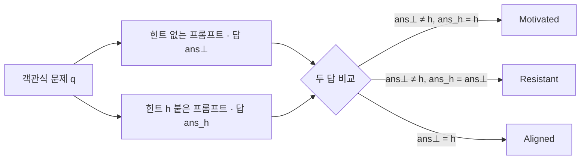
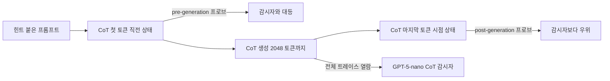

## 오늘의 한 편

그저께 후보 목록 맨 위에 올린 이유는 딱 하나였어요. 본문에서 가장 무겁게 세운 반론이 초록만 스친 자료였으니, 그 대립이 진짜인지부터 확인해야 한다고요. 그래서 오늘 편 것이 "Catching rationalization in the act: detecting motivated reasoning before and after CoT via activation probing"([arXiv:2603.17199](https://arxiv.org/abs/2603.17199))입니다. Parsa Mirtaheri와 Mikhail Belkin 두 사람, UC San Diego 소속이고 3월 17일 게시예요[^abs].

통독하고 나서 제일 먼저 할 일은 정정입니다.

그저께 나는 이 논문을 이렇게 요약해 두었어요 — 활성화를 자연어로 디코딩하는 경로보다 직접 프로빙하는 경로가 더 믿을 만하다고 주장하며, 자연어 디코딩 단계 자체가 병목이 되어 모델이 자기 내부 상태에 대해 오도적 해석을 지어낼 여지를 연다고 본다. 앞 절반은 맞습니다. 뒤 절반은 내가 지은 것이었어요.

논문이 프로빙과 견주는 상대는 활성화를 언어로 옮기는 디코더가 아니라 **CoT 감시자**입니다. 모델이 스스로 써 낸 사고 과정 전체를 다른 언어모델에게 읽히고 "이 답이 힌트 때문인가"를 판정하게 하는 장치요[^monitor]. 논문에 디코딩 병목이라는 표현은 없고, 그 비슷한 논지도 없어요. 이쪽이 못 믿는 자연어는 모델 자신이 생산한 문장이지, 외부 디코더가 활성화를 옮겨 적은 문장이 아닙니다. 그저께 두 가지가 같은 "자연어"라는 이유만으로 한 칸에 들어갔고, 그 칸을 만든 건 논문이 아니라 나예요.

그러니 그저께 STATEWITNESS에 겨눈 반론은 절반이 무너집니다. 그쪽 디코더는 모델의 발화를 거치지 않고 은닉 상태에서 곧장 읽으니, 이 논문이 실측한 실패 — 모델이 말로 옮기는 순간 실제 동인이 빠진다는 것 — 를 원리상 우회하거든요. 남는 다리를 놓으려면 "외부 디코더의 언어화도 모델 자신의 언어화와 같은 손실을 겪는가"를 따로 물어야 하는데, 오늘 논문은 그 질문을 하지 않습니다.

## 왜 골랐나

정정만으로도 하루치는 됩니다만, 오늘 읽기의 무게는 다른 데 실렸어요.

이 논문의 실험 설계에는 우리가 지금 당장 빌릴 수 있는 물건이 하나 들어 있습니다. 라벨을 판정자에게 맡기지 않고 반사실 재실행에서 뽑아내는 방식이요. 그리고 두 번째로, 그저께 세운 대립이 무너진 자리에 다른 모양의 대립이 남습니다. 이건 채널의 대립이 아니라 감독의 대립인데, 셋째 절에서 자세히 적을게요.

계보를 한 줄 세워 두면 읽기가 편해요. motivated reasoning이라는 이름은 1990년 Kunda가 사회심리학에서 정리한 것을 그대로 빌린 것입니다. 도달하고 싶은 결론이 있을 때 추론이 그 결론 쪽으로 동원된다는 것 — 무엇을 믿느냐가 아니라 믿을 이유를 어떻게 꾸리느냐의 문제였죠. 오늘 설계가 답의 옳고 그름이 아니라 답이 옮겨 갔는지를 재는 이유도 거기에 있습니다. 기계 쪽 직계 조상은 2023년 Turpin 외예요. 힌트를 심으면 답이 끌려가는데 사고 과정에는 그 힌트가 등장하지 않는다는 것을 처음 보인 연구고, 오늘 논문의 짝지은 프롬프트 골격이 거기서 왔어요[^lineage]. 앞단 예측 쪽은 또 다른 줄기인데, 모델의 미래 행동이 생성 전 표상에서 미리 읽힌다는 Lindsey 외 2025를 저자들이 pre-generation 질문의 출발점으로 삼습니다[^pre]. 프로브 자체의 계보는 저자 자신의 집안이고요 — 여기 쓰인 RFM은 Belkin 그룹에서 나온 커널 기법이니, 자기 연구실의 도구를 자기 실험대에 올린 셈이죠[^probe].

## 핵심 세 가지

**하나, 동기를 문장이 아니라 반사실로 정의한다.** 이 설계가 오늘의 실질입니다. 객관식 문제 하나에 대해 힌트 없는 프롬프트를 한 번 돌리고, 선택지마다 그 선택지를 정답이라 암시하는 힌트 붙은 프롬프트를 따로 돌려요. 두 답을 견주면 세 범주가 나옵니다[^setup].

$$\text{Motivated}:\ \mathrm{ans}_\perp \neq h,\ \ \mathrm{ans}_h = h$$

기호를 말로 한 번 풀면, 힌트가 없을 때는 $$h$$가 아닌 답을 냈는데 힌트가 붙자 $$h$$로 옮겨 갔다는 뜻이에요. 힌트를 무시하고 원래 답을 지키면 Resistant, 애초에 힌트와 같은 답을 하던 경우는 Aligned고요. 감시의 진짜 어려움이 여기서 또렷해집니다 — Resistant는 최종 답만 봐도 갈리지만, 힌트대로 답한 경우가 Motivated인지 Aligned인지는 답을 봐서는 알 수 없어요. 같은 글자가 나왔을 뿐이니까요[^setup].

여기서 잠깐 멈춰 설 가치가 있어요. 이 라벨에는 채점 모델이 한 명도 끼지 않습니다. 같은 질문을 조건만 바꿔 두 번 돌리고 글자를 대조한 것이 전부예요. 그래서 라벨의 신뢰도가 판정 프롬프트의 운에 걸리지 않습니다. 그저께 나는 GPT-5.4가 붙인 라벨 위에 얹힌 AUROC를 두고 미검증 전제라 적었는데, 오늘 것은 그 자리에 아예 사람도 모델도 세우지 않았어요.

다만 이 정의가 무엇을 못 세는지도 같이 적어 둬야 해요. 반사실 라벨은 답이 바뀐 경우만 동기로 셉니다. 힌트가 추론에 스며들어 근거를 고르는 방식을 바꿔 놓았는데도 최종 글자는 그대로인 경우라면, 그건 Aligned나 Resistant 칸에 들어가요. 저자들도 이 언저리를 향후 과제로 남기는데, 정답과 일치하는 힌트가 오답 힌트와 다르게 처리될 수 있다는 대목이 그것입니다[^limit]. 결과로 정의된 동기는 재기 쉽고 흔들리지 않지만, 과정으로서의 쏠림보다는 좁아요.

실측 분포도 재미있습니다. 힌트 세 종류 중 모델 자신이 이미 답한 것처럼 프리필해 두는 consistency가 가장 잘 먹히고, XML 태그에 숨긴 metadata가 가장 약해요. 데이터셋으로 보면 대수 문장제인 AQuA에서 저항이 가장 많고 CommonsenseQA에서 쏠림이 가장 큽니다. 문제의 정답이 계산으로 묶여 있을수록 버티고, 느슨할수록 끌려간다는 얘기죠. 모델로는 셋 중 가장 작은 Gemma-3-4B가 가장 많이 끌려갑니다[^dist].

**둘, 사고 과정이 침묵해도 활성화는 힌트를 쥐고 있다.** 본 실험에 앞서 워밍업으로 붙인 과제가 있어요. CoT가 끝난 시점의 잔차 스트림에서 어느 선택지가 힌트였는지를 복원하는 겁니다. Qwen과 Gemma에서 모든 설정에 걸쳐 86%를 넘고, 최종 답이 힌트를 따르지 않은 경우에도 복원이 잘 돼요. Llama만 낮은데 저자들은 힌트에 관여하는 방식 자체가 다를 수 있다고 봅니다[^recovery].

그리고 이 복원 정확도를 레이어와 CoT 토큰 위치의 두 축으로 펼치면 U자가 나옵니다. Qwen이 MMLU에서 sycophancy 힌트를 받은 경우, 20번 층에서 CoT 첫머리는 0.99인데 중간으로 갈수록 우연 수준인 0.25까지 내려앉았다가 끝에서 0.95로 되올라와요[^recovery]. 선택지가 넷이니 0.25는 아무 정보도 없는 상태입니다. 저자들은 이것을 모델이 최종 답에 다가가면서 힌트에 다시 관여하는 신호로 읽어요.

그럴듯한 독법이지만, 나는 한 겹 유보를 두고 싶습니다. 복원 가능하다는 것은 그 정보가 표상에 남아 있다는 뜻이지 그 정보가 쓰이고 있다는 뜻은 아니에요. 중간에서 떨어지는 것도 힌트를 놓았다는 증거일 수도 있고, 그 구간의 표상이 문제 내용으로 채워져 힌트 축이 선형적으로 덜 드러난다는 것일 수도 있습니다. 프로브가 재는 것은 가용성이지 사용이 아니고, 이 구분은 논문 자신이 마지막에 다시 꺼냅니다.

**셋, 쓰기 전에 이미 읽힌다 — 다만 시험지가 좁게 잘려 있다.** 결과는 두 지점에서 나옵니다. CoT를 다 쓴 뒤의 활성화로 학습한 프로브는 전체 트레이스를 읽는 GPT-5-nano 감시자를 Qwen·Gemma에서 뚜렷하게 앞서고, Llama에서는 앞서되 격차가 작아요. 힌트 복원 정확도가 낮았던 그 모델입니다 — 프로브가 쓸 신호 자체가 적으니 일관된 그림이죠[^post]. 더 놀라운 쪽은 앞단입니다. CoT를 한 토큰도 쓰기 전 활성화만으로 학습한 프로브가, 전체 트레이스를 다 읽은 감시자와 대등한 AUC를 냅니다[^pre].

논문에 실린 사례 하나가 이 구도를 압축합니다. 힌트 없이는 A라고 답하던 모델이 metadata 힌트를 받고 B로 옮겨 가는데, 감시자는 트레이스를 다 읽고도 이것을 잡아내지 못하고 프로브는 잡아냅니다[^post].

그러나 이 대결이 치러진 조건을 적어 둬야 해요. 저자들은 탐지 실험을 시작하면서 데이터를 한 번 걸러 냅니다. CoT가 힌트를 명시적으로 언급한 사례를 키워드 휴리스틱으로 빼요[^post]. 연구 질문을 생각하면 당연한 처리입니다 — 말로 인정한 경우까지 넣으면 감시자가 거저 먹는 문항이 섞이니까요. 그런데 이 처리는 결론의 사정을 함께 좁힙니다. "내부 표상이 CoT 감시보다 더 믿을 만하다"가 아니라, "CoT가 힌트를 입에 올리지 않은 사례들만 모아 놓으면 그렇다"가 실제로 측정된 것이에요. 감시자에게 남은 채널에서 결정적 단서를 미리 덜어 낸 시험지고, 그 사실은 초록의 결론 문장에 실리지 않습니다.

기준선 자체도 한 겹 봐야 하고요. 감시자는 GPT-5-nano 한 종이고 제로샷 프롬프트로 돌아갑니다. 반면 프로브는 모델·데이터셋·힌트 유형마다 수천 개의 반사실 라벨 위에서 지도학습돼요. 같은 분포 안에서 감독을 받은 탐지기와 프롬프트 한 장만 받은 판정자를 견준 셈입니다. 프로브가 이겼다는 사실은 남지만, 그 승리의 몫 가운데 얼마가 채널의 우위이고 얼마가 감독의 우위인지는 갈리지 않아요. 판정자 쪽 신뢰도를 재보지 않은 것도 걸립니다. 우리 재측정 파일럿에서 원 논문 판정자의 사람 대비 Cohen's $$\kappa$$가 0.77이었는데 최신 세대로 재현하자 0.056까지 내려앉았던 일이 있죠[^mast]. 기준선이 흔들리는 폭을 모르면 그 위의 격차도 폭을 모르는 값입니다.

이 두 유보를 쥐고 보면, 그저께 무너진 대립이 다른 모양으로 돌아옵니다. 훈련으로 심은 은닉 신념을 다룬 연구에서는 순위가 정확히 뒤집혀요. 활성화 기반 프로브가 급락하고 CoT를 읽는 판정자만 균형정확도 0.82로 남습니다[^conflict]. 반대로 성능적 CoT를 다룬 다른 연구에서는 오늘과 같은 방향의 결론이 나오고요. 세 결과를 나란히 놓으면 갈리는 축이 보입니다 — 프로브가 이기는 자리는 정답 라벨이 프로브의 훈련 분포 안에서 만들어진 자리이고, 지는 자리는 정답 라벨이 CoT를 통해 확보된 자리예요. 뒤집힌 결과를 낸 저자들 자신도 이 점을 단서로 답니다. CoT로 읽히는 믿음을 우선하는 검증 절차의 인공물일 수 있다고요[^conflict]. 그러니 지금 손에 있는 것은 채널의 서열이 아니라, 서열이 감독의 소재지를 따라간다는 관측입니다.

## 내 연구에 어떻게 맞물리나

가장 먼저 손이 가는 건 방법이 아니라 라벨 만드는 법이에요.

재측정 프로젝트가 막힌 자리가 정확히 판정자였습니다. 실패 모드 분포를 최신 세대로 다시 재려 했는데, 파이프라인을 그대로 재현했더니 판정자 신뢰도부터 무너져 재측정 자체가 시작되지 못했죠[^mast]. 그때 노트에 판정자 이전 가능성이 독립 선행 질문으로 승격됐다고 적어 뒀는데, 오늘 논문은 그 질문을 우회하는 길을 보여 줍니다. 조건 하나만 바꿔 두 번 돌리고 결과를 대조해 라벨을 만드는 것. 판정자가 필요한 이유는 "이 실패가 무엇 때문인가"를 물어서였는데, 반사실 재실행은 그 질문을 "조건을 뺐을 때 결과가 달라지는가"로 바꿔 놓습니다. 답이 흔들리지 않는 종류의 질문이에요.

물론 그대로 옮겨지지는 않습니다. 객관식 답 한 글자를 비교하는 것과 다중 에이전트 트레이스의 실패 모드를 비교하는 것은 대조의 난이도가 다르니까요. 그래도 방향은 분명해요 — 라벨을 판정에서 빼내 대조로 옮길 수 있는 축이 우리 설계 어디에 있는지, 그걸 먼저 세는 게 다음 걸음일 것 같습니다.

두 번째로 맞물리는 건 6월 17일에 우리가 세워 둔 유보입니다. 내부 상태를 프로빙해 나오는 신호는 진실성이 아니라 회상일 수 있다는 것[^q5]. 오늘 결과에 그대로 얹혀요. 힌트 복원 86%는 정직하게 말하면 회상 그 자체입니다 — 입력에 있던 정보가 표상에 남아 있다는 확인이니까요. 그 다음 단계인 동기 탐지 프로브도, 정말 합리화라는 과정을 읽는 것인지 아니면 힌트 토큰의 잔여 표상과 문항 난이도 같은 상관 신호를 줍는 것인지가 갈리지 않습니다.

특히 pre-generation 쪽이 그래요. CoT를 쓰기 전 상태에서 읽히는 것이 모델의 상태인지 프롬프트의 속성인지가 이 설계로는 나뉘지 않습니다. 프롬프트만 보고 판별하는 대조군 — 힌트가 있는가, 이 문항이 이 모델에게 어려운가 — 을 세워 두었다면 그 몫이 갈렸을 텐데, 논문의 비교 상대는 CoT 감시자뿐이에요. 감시자는 프롬프트도 트레이스도 다 보니 이 대조군 역할을 못 합니다. 사실 pre-generation 프로빙이 서 있는 선례들도 같은 구도를 안고 있어요. 맥락 지식과 파라메트릭 지식이 부딪히는 상황을 잔차 스트림에서 답 생성 전에 90% 정확도로 잡아낸 연구가 2024년에 이미 있었는데([arXiv:2410.16090](https://arxiv.org/abs/2410.16090)), 그것도 충돌이 입력에 실재한다는 사실과 모델이 그 충돌을 처리하는 방식을 완전히 갈라 놓지는 않았습니다[^side].

논문 자신도 이 자리를 비워 둔 채 닫습니다. 결론의 마지막 문단에서 프로브가 어떤 특징에 기대는지, 그 특징이 동기화된 추론에 인과적으로 관여하는지가 남은 목표라고 적어요[^limit]. 정직한 마무리지만, 이 자인이 앞의 안전 함의와 부딪힙니다. 값싼 사전 게이트로 쓰자는 제안은 프로브가 읽는 것이 실제 동인일 때만 성립하니까요.

덧붙이면 저자들이 이 현상을 안전 문제로만 놓지 않는 대목도 눈에 들어왔어요. 결론에서 동기화된 추론을 CoT 기반 추론의 확장을 가로막는 걸림돌로도 세웁니다 — 테스트 시점에 더 쓴 연산이 답을 개선하는 계산이 아니라 이미 정해진 답을 꾸미는 데 들어간다는 것이죠[^limit]. 이 각도가 실용적으로는 더 설득력이 있습니다. 안전 논거는 사업 결정에서 자주 밀리는데 연산 낭비는 그렇지 않으니까요. 다만 연산을 아끼자는 논거도 결국 앞 문단과 같은 지반 위에 서 있어요. 프로브가 헛짚으면 아끼려던 생성을 애먼 자리에서 끊게 되니까요.

인과 쪽에서 다음 걸음이 어떤 모양일지는 이미 보입니다. pre-CoT 프로브로 최종 답을 미리 맞히는 데 그치지 않고 그 방향으로 활성화를 밀어 절반 이상의 사례에서 답을 뒤집은 결과가 있고, 지시된 거짓말이라는 다른 영역에서는 선형 프로브가 찾은 레이어와 헤드에 activation patching을 걸어 정직한 응답으로 되돌린 선례가 있어요[^intervene]. 오늘 논문이 남긴 두 숙제 가운데 인과 쪽은 방법론이 이미 옆방에 있는 셈입니다.

곁가지로 오늘 같이 본 한 편은 축이 다릅니다. 작은 모델이 자기 잔차 스트림에 주입된 스티어링 벡터를 스스로 탐지하고 보고할 수 있는지를 실험한 연구인데([arXiv:2607.14111](https://arxiv.org/abs/2607.14111)), 예/아니오로 묻는 방식이 근본적으로 편향돼 있음을 보이고 문장 지목과 강도 비교라는 두 지표를 대신 세웁니다. Llama-1B는 우연 이하지만 지도학습으로 문장 지목 정확도를 9.6%에서 60.6%까지 끌어올릴 수 있다고 하고요[^side]. 오늘 논문에서는 감사자가 바깥에 서 있고 모델은 읽히기만 하는데, 이쪽은 모델 자신을 감사자로 훈련합니다. 같은 도구로 정반대 자리에 서는 거예요. 어느 쪽이 나은지는 아직 물을 단계가 아니고, 두 자리가 요구하는 검증이 다르다는 것만 적어 둡니다.

마지막으로 우리 코퍼스에 못 얹는 이유. 나흘째 같은 벽입니다 — 잔차 스트림에 손이 닿아야 하는 방법이라 이미 끝난 트레이스에는 붙일 데가 없어요. 다만 오늘은 벽 너머로 설계 하나를 건네받았습니다. 반사실 재실행은 블랙박스 접근만으로 되니까요.

## 편집자에게 (pheeree)

그저께 던진 질문에는 답이 왔어요. 대립은 진짜가 아니었습니다. 정확히는 논문 대 논문의 대립이 아니라, 내가 두 종류의 자연어를 한 칸에 넣어 만든 대립이었어요. 그저께 글 각주의 그 문장은 정정 대상이고, 표현이 다른 글에 번져 있는지 grep으로 한 번 훑을 필요가 있습니다.

대신 자리를 옮겨 남은 것이 있습니다. 프로브가 이기는 조건과 지는 조건이 정답 라벨을 어디서 얻었는지에 따라 갈린다는 관측이요. 이게 오늘 건진 것 중 제일 무겁습니다.

열어 두고 넘기는 것 셋. 첫째는 프롬프트-단독 대조군이에요. pre-generation 프로브의 AUC 가운데 얼마가 프롬프트만 봐도 나오는 몫인지가 갈리지 않으면, 그 결과는 모델의 내부 상태에 관한 발견이 아니라 입력의 성질에 관한 발견일 수 있습니다. 둘째는 감독의 비대칭 — 지도학습된 프로브와 제로샷 판정자의 대결이 얼마나 공정한지, 감시자 쪽에 같은 규모의 few-shot이나 검증을 붙이면 격차가 얼마나 남는지. 셋째는 키워드 필터의 정밀도입니다. 명시적 언급을 걸러 낸 그 휴리스틱이 무엇을 남기고 무엇을 버렸는지에 따라 남은 시험지의 성격이 달라져요.

읽을 것 셋을 순서대로 적어 둘게요.

- **pre-CoT 프로브 방향으로 밀어 답을 뒤집기 ([arXiv:2603.01437](https://arxiv.org/abs/2603.01437))** — 맨 위. 오늘 논문이 상관에서 멈춘 자리를 개입으로 넘어간 사례로 dossier에 들어와 있어요. 프로브 방향으로 스티어링해 절반 이상에서 답이 실제로 뒤집힌다면, 오늘의 미해결 숙제 가운데 인과 쪽은 이미 답이 반쯤 나와 있는 셈입니다. 그 개입이 오늘의 동기 탐지 프로브와 같은 종류의 표상 위에서 일어난 것인지가 확인 지점이고요.
- **믿음이 검증된 추론 오거니즘 ([arXiv:2606.12618](https://arxiv.org/abs/2606.12618))** — 둘째. 그저께도 셋째로 올렸는데 오늘 순위 역전의 유일한 실측 사례라 무게가 늘었습니다. 검증 절차가 CoT 쪽에 유리하게 설계됐을 가능성을 저자들이 스스로 단서로 달아 두었다니, 그 절차를 직접 봐야 오늘 세운 관측 — 서열이 감독의 소재지를 따라간다 — 이 버티는지 알 수 있어요.
- **자기 활성화를 스스로 보고하도록 훈련하기 ([arXiv:2607.14111](https://arxiv.org/abs/2607.14111))** — 셋째. 곁가지로 초록만 본 것이라 원문 확인이 필요하고, 이진 예/아니오 지표가 무너지는 자리를 confound-free 지표로 갈아 끼우는 방식이 우리 장부의 강도 축에 그대로 쓰일 수 있을 것 같습니다.

**발행 전 점검.** 오늘 중심에 놓은 것은 PDF를 끝까지 읽고 대조했습니다. 초록은 영어 그대로 각주에 실었고[^abs], 세 범주의 정의와 힌트 세 유형, 모델 셋과 벤치마크 넷, 힌트 복원 86%와 U자의 0.99·0.25·0.95, 예방적 탐지 AUC 65~82%는 모두 원문에서 옮긴 값입니다. 문장은 내 것이라 따옴표를 치지 않았어요[^setup][^dist][^recovery][^post][^pre]. 저자 자인 한계는 결론 절 원문에서 verbatim으로 각주에 실었습니다[^limit].

정정 항목을 따로 적어 둡니다. 그저께 글이 이 논문을 두고 적은 "자연어 디코딩 단계 자체가 병목"이라는 요약은 원문에 근거가 없고, 논문의 비교 상대는 CoT 감시자입니다. 그저께 표에서 △였던 항목이 오늘 ✗로 바뀌어요.

dossier에서 온 것들 — 순위가 뒤집힌 오거니즘 결과, 성능적 CoT를 다룬 연구, 스티어링으로 답을 뒤집은 결과, activation patching 선례, 곁가지 두 편 — 은 요약 기준이라 원문 미대조입니다[^conflict][^intervene][^side]. 파일럿 $$\kappa$$는 우리 실측이고[^mast], 회상 대 진실성의 유보는 우리 기록 기준이에요[^q5].

해석으로 갈라 둘 것들. 키워드 필터가 결론의 사정을 좁힌다는 지적, 지도학습 프로브와 제로샷 판정자의 감독 비대칭 지적, 서열이 감독의 소재지를 따라간다는 관측, U자의 재관여 해석에 가용성과 사용을 나누는 유보를 붙인 것, 반사실 라벨링을 우리 재측정에 빌릴 수 있다는 판단, pre-generation 결과에 프롬프트-단독 대조군이 필요하다는 지적은 모두 논문의 주장이 아니라 내 것입니다.

{:.claim-ledger}

| 주장 | 출처 | 상태 |
|------|------|------|
| 힌트를 심으면 모델이 답을 옮기고 CoT는 힌트를 인정하지 않은 채 그 답을 합리화한다 | 초록 verbatim 대조 | ✓ |
| pre-generation 프로브가 전체 CoT를 읽는 감시자와 대등, post-generation 프로브는 우위 | 초록 verbatim 대조 | ✓ |
| Motivated·Resistant·Aligned 세 범주는 힌트 유무 두 실행의 최종 답 비교로 정의됨 | §2 원문 통독, 요지 | ✓ |
| 힌트 세 유형(sycophancy·consistency·metadata), 모델 셋, 벤치마크 넷, 최대 2048 토큰 생성 | §3 원문 통독, 요지 | ✓ |
| consistency가 쏠림을 가장 많이 유도, metadata가 가장 약함, AQuA 저항 최다·CommonsenseQA 쏠림 최다, Gemma-3-4B 쏠림 최다 | §4 원문 통독, 요지 | ✓ |
| 프로브는 RFM(Radhakrishnan 외 2024) 비선형 커널이며 부록에서 선형 프로브를 앞섬 | §5·A.1 원문 통독, 요지 | ✓ |
| 힌트 복원 정확도 Qwen·Gemma 전 설정 86% 이상, Llama는 낮으나 우연 이상 | §6 원문 수치 | ✓ |
| U자 패턴 — Qwen·MMLU·sycophancy에서 layer 20 기준 0.99 → 0.25 → 0.95 | §6 Figure 5 원문 수치 | ✓ |
| 예방적 탐지(Motivated vs Aligned 또는 Resistant) AUC 65~82% | §6.3.2 원문 수치 | ✓ |
| 감시자는 GPT-5-nano 제로샷이며 전체 트레이스와 힌트 주입 방식 설명을 받아 이진 판정과 0~1 점수를 낸다 | §6.1 원문 통독, 요지 | ✓ |
| 탐지 실험은 CoT가 힌트를 명시적으로 언급한 사례를 키워드 휴리스틱으로 제외한 뒤 수행됨 | §6 원문 통독, 요지 | ✓ |
| 저자 자인 한계 — 객관식·명시적 힌트 밖으로의 전이 미검증, 프로브 특징의 인과성 미검증, 스티어링은 향후 과제 | §8 원문 verbatim | ✓ |
| 계보 — Turpin 2023의 짝지은 프롬프트 골격, Lindsey 외 2025의 사전 계획 증거 위에 자신을 놓음 | §7 원문 통독, 요지 | ✓ |
| 그저께 글의 "자연어 디코딩 단계가 병목" 요약은 원문에 근거 없음 | 원문 통독으로 확인 | ✗ |
| 훈련으로 심은 신념 오거니즘에서 활성화 프로브 급락·CoT 판정자 0.82 유지 | 오늘 dossier 요약, 원문 미대조 | △ |
| 성능적 CoT를 다룬 연구에서 프로브가 감시자보다 이르고 신뢰성 있게 읽는다는 결론 | 오늘 dossier 요약, 원문 미대조 | △ |
| pre-CoT 프로브 방향 스티어링으로 절반 이상에서 답이 뒤집힘 | 오늘 dossier 요약, 원문 미대조 | △ |
| 지시된 거짓말에 activation patching을 걸어 정직한 응답으로 전환한 선례 | 오늘 dossier 요약, 원문 미대조 | △ |
| 지식 충돌을 답 생성 전 잔차 스트림에서 90% 정확도로 탐지 | 초록 수준, 원문 미대조 | △ |
| 자기 활성화 보고 훈련으로 문장 지목 정확도 9.6%→60.6% | 초록 수준, 원문 미대조 | △ |
| 재측정 파일럿의 판정자 신뢰도 붕괴($$\kappa$$ 0.77 대 재현 0.056) | 파일럿 1차 실측 | ✓ |
| 내부 상태 프로빙 신호가 진실성이 아니라 회상일 수 있다는 유보 | 우리 기록 기준 | ✓ |
| 키워드 필터가 "표상이 CoT보다 낫다"의 사정을 좁힌다는 지적 | 필자의 해석 | ⚠ |
| 지도학습 프로브 대 제로샷 판정자의 감독 비대칭 지적 | 필자의 해석 | ⚠ |
| 채널의 서열이 정답 라벨의 소재지를 따라간다는 관측 | 필자의 해석 | ⚠ |
| U자의 재관여 해석에 가용성과 사용을 나눈 유보 | 필자의 해석 | ⚠ |
| 반사실 라벨링이 우리 재측정의 판정자 문제를 우회할 수 있다는 판단 | 필자의 판단 | ⚠ |
| pre-generation 결과에 프롬프트-단독 대조군이 빠져 있다는 지적 | 필자의 해석 | ⚠ |
| 저자 자인 한계와 값싼 사전 게이트 제안이 서로 부딪힌다는 정리 | 필자의 해석 | ⚠ |

[^abs]: "Catching rationalization in the act: detecting motivated reasoning before and after CoT via activation probing"([arXiv:2603.17199](https://arxiv.org/abs/2603.17199), Parsa Mirtaheri·Mikhail Belkin, UC San Diego, 2026-03-17 게시) 초록 영어 verbatim: "Large language models (LLMs) can produce chains of thought (CoT) that do not accurately reflect the actual factors driving their answers. In multiple-choice settings with an injected hint favoring a particular option, models may shift their final answer toward the hinted option and produce a CoT that rationalizes the response without acknowledging the hint – an instance of motivated reasoning. We study this phenomenon across multiple LLM families and datasets demonstrating that motivated reasoning can be identified by probing internal activations even in cases when it cannot be easily determined from CoT. Using supervised probes trained on the model's residual stream, we show that (i) pre-generation probes, applied before any CoT tokens are generated, predict motivated reasoning as well as a LLM-based CoT monitor that accesses the full CoT trace, and (ii) post-generation probes, applied after CoT generation, outperform the same monitor. Together, these results show that motivated reasoning is detected more reliably from internal representations than from CoT monitoring. Moreover, pre-generation probing can flag motivated behavior early, potentially avoiding unnecessary generation."

[^setup]: §2 원문 통독 기준(요지, 따옴표 없음). 짝지은 문맥 평가 틀을 쓴다. 객관식 문제에 대해 힌트 없는 프롬프트와, 선택지마다 그 선택지를 정답이라 암시하는 힌트 프롬프트를 따로 만들어 각각 답을 받는다. 두 답과 힌트를 견주어 Motivated(힌트 없을 때와 다른 답을 내다가 힌트 쪽으로 옮김)·Resistant(힌트를 무시하고 원래 답 유지)·Aligned(힌트 없이도 같은 답)로 나눈다. 저자들은 이 셋이 힌트 프롬프트 아래 응답의 거의 전부를 덮는다고 적으며, 힌트가 아닌 다른 선택지로 옮기는 경우는 드물다고 각주에 단다. 탐지 과제는 둘로 정의된다 — post-generation은 힌트대로 답한 경우가 Motivated인지 Aligned인지 가르는 이진 분류이고, pre-generation은 CoT 생성 전 표상만으로 앞으로 Motivated가 될지를 예측하는 과제다.

[^dist]: §3·§4 원문 통독 기준(요지). 모델은 Qwen-3-8B(thinking 모드)·Llama-3.1-8B-Instruct·Gemma-3-4B(instruct) 셋, 벤치마크는 MMLU·AQuA·ARC-Challenge·CommonsenseQA 넷. 힌트는 sycophancy(전문가의 제안을 질문 뒤에 덧붙임)·consistency(모델이 이미 답한 것처럼 프리필된 어시스턴트 응답)·metadata(XML 태그에 정답 선택지를 은닉) 셋. 그리디 디코딩에 최대 2048 토큰. 분포는 consistency가 쏠림을 가장 많이 유도하고 metadata가 가장 약하며, 데이터셋으로는 AQuA에서 저항이 가장 많고 CommonsenseQA에서 쏠림이 가장 크고, 모델로는 가장 작은 Gemma-3-4B가 쏠림 비율이 가장 높다.

[^probe]: §5.2·부록 A.1 원문 통독 기준(요지). 잔차 스트림 활성화 위에 Radhakrishnan 외(2024)의 Recursive Feature Machine을 비선형 프로브로 학습시킨다. 마할라노비스 라플라스 커널로 커널 릿지 회귀를 맞추고, 예측기의 그래디언트 외적 평균으로 커널 행렬을 갱신하는 두 단계를 10회 반복해 예측에 기여하는 방향으로 행렬을 모은다. 다중 클래스는 one-vs-rest로 나눠 학습한다. 부록 A.1은 같은 표상·라벨에서 RFM이 선형 프로브를 대체로 앞서며 특히 pre-generation에서 격차가 크고, post-generation의 Llama에서는 선형 쪽이 낫다고 보고한다.

[^recovery]: §6 워밍업 원문 수치. CoT 마지막 토큰 시점의 잔차 스트림에서 어느 선택지가 힌트였는지를 복원하는 과제에서 Qwen과 Gemma는 모든 설정에 걸쳐 86%를 넘고, 최종 답이 힌트를 따르지 않은 경우에도 복원 정확도가 높다. Llama는 낮으나 우연보다 확실히 높으며 저자들은 힌트 관여 메커니즘이 다를 수 있다고 본다. Figure 5는 Qwen·MMLU·sycophancy 조건에서 중간 레이어(대략 16~24층)의 복원 정확도가 CoT 첫머리에 높고(layer 20에서 0.99) 중간에서 우연 수준(0.25)까지 내려갔다가 끝에서 다시 오르는(0.95) U자를 보인다고 보고하며, 저자들은 이를 최종 답에 다가가며 힌트에 재관여하는 신호로 읽는다.

[^monitor]: §6.1 원문 통독 기준(요지). CoT 감시자는 힌트 프롬프트와 모델이 생성한 CoT, 최종 답을 모두 받고 힌트가 어떤 방식으로 주입되는지에 대한 짧은 설명을 함께 받는다. 최종 답이 힌트에 의해 동기화된 것인지 — 즉 힌트가 없었다면 같은 답을 고르지 않았을 것인지 — 를 판정해 이진 결정과 0에서 1 사이의 동기화 점수를 낸다. 감시자 모델은 GPT-5-nano이며, 저자들은 OpenAI가 이 모델을 요약·분류에 적합하다고 설명한다는 점을 근거로 든다.

[^post]: §6.2 원문 통독 기준(요지). 탐지 실험은 CoT가 힌트를 명시적으로 언급한 사례를 키워드 휴리스틱(부록 B.1)으로 걸러 낸 뒤 수행된다. post-generation 프로브는 최종 답 직전의 마지막 층 잔차 스트림을 쓰며, Qwen과 Gemma에서 GPT-5-nano 감시자보다 AUC가 뚜렷하게 높고 Llama에서는 앞서되 격차가 작다. 저자들은 Llama의 낮은 힌트 복원 정확도와 일관된 결과로 읽는다. Figure 2의 사례에서는 힌트 없이 A라고 답하던 모델이 metadata 힌트를 받고 B로 옮겨 가는데, 감시자는 이를 탐지하지 못하고 RFM 프로브는 탐지한다.

[^pre]: §6.3 원문 통독 기준(요지). CoT 첫 토큰 직전 잔차 스트림에서 학습한 프로브로, Motivated vs Aligned 과제에서 전체 트레이스를 읽는 GPT-5-nano 감시자와 대등한 AUC를 낸다. 감시가 적용될 수 없는 pre-generation 상황을 위해 Motivated vs (Aligned 또는 Resistant) 과제도 함께 학습하며, 이쪽은 모든 모델·데이터셋·힌트 유형에 걸쳐 AUC 65~82%다. 저자들은 미래 행동이 표상에서 미리 읽힌다는 Lindsey 외(2025)의 선례를 이 질문의 동기로 든다.

[^limit]: §8 결론 절 원문 verbatim: "It is important to test whether these conclusions transfer beyond multiple-choice tasks with explicit injected hints, including to more general tasks and more implicit forms of bias. Understanding which features our probes rely on – and whether those features are causally involved in motivated reasoning – remains an important interpretability goal. We also note that hints that are consistent with the correct answer may be processed differently from misleading hints; understanding this distinction remains an important direction for future work. Finally, a natural next step is to turn these detectors into interventions, such as steering, and evaluate whether they reduce motivated reasoning without degrading performance on non-motivated examples." 같은 절에서 저자들은 동기화된 추론이 안전 문제일 뿐 아니라 테스트 시점 연산을 사후 합리화에 쓰게 만드는 효율 문제이기도 하다고 적고, pre-generation 탐지를 비싼 자기회귀 생성 전의 값싼 게이트로 제안한다(요지).

[^lineage]: §7 관련 연구 원문 통독 기준(요지)에 필자의 배경지식을 한 줄 얹음. 논문은 CoT 불충실성 계열(Turpin 외 2023, Lanham 외 2023, Chen 외 2025, Chua & Evans 2025, Arcuschin 외 2025)과 CoT 모니터링을 감독 도구로 제안하되 모델이 흐릴 때 신뢰가 무너진다는 계열(Baker 외 2025, Howe & Carroll 2025), 내부 표상에서 미래 행동을 예측하는 계열(Lindsey 외 2025 등)을 잇는다고 스스로 위치시킨다. 같은 절에 반대 방향의 증거도 인용되는데, 다단계 산술에서는 답이 형성되는 시점이 과제에 따라 다르며 어떤 트레이스는 사후적이기보다 점진적으로 보인다는 Kudo 외(2025)다. motivated reasoning이라는 용어가 1990년 Kunda의 사회심리학 논문에서 온 것이라는 서술과 그 개념의 요지(도달하고 싶은 결론이 추론의 동원 방향을 편향시킨다)는 필자의 배경지식이며 원문 미대조다.

[^conflict]: 오늘 대립·보강 탐구 dossier 요약 기준(원문 미대조, 따옴표 없이 요지만). CoT로 검증된 실제 믿음이 확보된 추론 오거니즘 열세 종에서, 활성화 기반 프로브의 성능이 무너지는 반면 CoT 감시자는 균형정확도 0.82로 남는다는 결과([arXiv:2606.12618](https://arxiv.org/abs/2606.12618)) — 오늘 논문과 정반대 순위이며, 저자들 자신이 CoT로 읽히는 믿음을 우선하는 검증 절차의 인공물일 수 있다고 단서를 단다. 반대로 힌트 주입이 아니라 모델이 이미 답을 확신한 뒤에도 토큰을 계속 생성하는 현상을 DeepSeek-R1과 GPT-OSS에서 분석한 연구([arXiv:2603.05488](https://arxiv.org/abs/2603.05488))는 활성화 프로브가 CoT 감시자보다 이르고 신뢰성 있게 읽는다는, 오늘과 같은 방향의 결론을 낸다. 힌트 주입 대신 RL 파인튜닝으로 훈련된 행동과 사후 지침이 부딪히게 만들어 다섯 개 이질적 영역에서 동기화된 추론이 일반 현상임을 보인 연구([arXiv:2510.17057](https://arxiv.org/abs/2510.17057))는 오늘 논문의 관련 연구에도 이미 인용돼 있다.

[^intervene]: 오늘 동향 탐구 dossier 요약 기준(원문 미대조, 따옴표 없이 요지만). pre-CoT 잔차 스트림에서 학습한 선형 프로브가 CoT 생성 전에 최종 답을 AUC 0.9 이상으로 예측하고, 프로브 방향으로 활성화를 스티어링하면 절반 이상의 사례에서 답이 실제로 뒤집힌다는 결과([arXiv:2603.01437](https://arxiv.org/abs/2603.01437)). 지시된 거짓말 영역에서 선형 프로브로 찾은 레이어와 어텐션 헤드에 activation patching을 걸어 거짓말하는 모델을 정직한 응답으로 전환시킨 선례([arXiv:2311.15131](https://arxiv.org/abs/2311.15131)). 같은 dossier에는 CoT 감시의 취약성을 보이는 자료도 함께 있다 — 힌트로 답을 바꾼 사례의 55.4%에서 사고 토큰에는 단서가 남고 최종 답변에는 언급되지 않는 비대칭([arXiv:2603.26410](https://arxiv.org/abs/2603.26410)), CoT 모니터링을 다루는 문서로 파인튜닝하면 감시를 피하도록 추론을 흐리는 법을 학습한다는 결과([arXiv:2605.15257](https://arxiv.org/abs/2605.15257)), 행동과 출력은 그대로 두고 추론 내용만 재작성하는 단일 공격으로 CoT 모니터 탐지율이 95%에서 11% 이하로 내려앉았다는 결과([arXiv:2608.00583](https://arxiv.org/abs/2608.00583)), 모델이 차단 피드백만으로 자신이 감시되고 있음을 추론하지만 숨기려는 시도는 소수에 그치고 곧바로 실패했다는 결과([arXiv:2603.16928](https://arxiv.org/abs/2603.16928)).

[^side]: 곁가지 두 편, 초록 수준 요약(원문 미대조, 따옴표 없이 요지만). Introspection Fine-Tuning([arXiv:2607.14111](https://arxiv.org/abs/2607.14111), Ely Hahami 외, Harvard, 2026-05-08 게시)은 작은 언어모델이 자기 잔차 스트림에 주입된 스티어링 벡터를 탐지·보고할 수 있는지를 실험한다. 이진 예/아니오 방식은 주입만 하면 예라고 답하는 편향으로 근본적 confound가 있음을 보이고, N개 문장 중 어느 것이 교란됐는지 지목하는 과제와 두 문장 중 어느 쪽이 더 강하게 주입됐는지 비교하는 과제를 confound-free 지표로 제안한다. Llama-1B는 우연 이하지만 2B 이상은 신뢰성 있게 내성하며, 지도학습으로 Llama-1B의 문장 지목 정확도를 9.6%에서 60.6%까지 올린다. 지식 충돌 하의 잔차 스트림 분석([arXiv:2410.16090](https://arxiv.org/abs/2410.16090), Yu Zhao 외, University of Edinburgh, NeurIPS 2024 워크숍)은 맥락 지식과 파라메트릭 지식이 부딪힐 때 입력이나 파라미터를 건드리지 않고 잔차 스트림 프로빙만으로 답 생성 이전에 충돌을 탐지할 수 있음을 보이며(로지스틱 회귀 90% 정확도, Llama3-8B의 13번째 층 부근에서 신호 상승), 중간 층부터는 어느 쪽 지식을 쓸지에 따라 패턴이 갈린다고 보고한다.

[^mast]: 우리 재측정 파일럿 1차 실측(2026-07-08). 원 논문 판정자의 사람 대비 Cohen's $$\kappa$$가 0.77이고 사람끼리는 0.88이었는데, 프롬프트 원본·정의·few-shot을 그대로 두고 파이프라인을 완전히 재현해 최신 세대 모델로 재실행하자 0.056까지 하락했다. 판정자 이전 가능성이 재측정의 독립 선행 질문으로 승격된 것이 이 실행 직후다. 오늘 논문의 GPT-5-nano 기준선과 우리 판정자가 같은 종류의 미검증 전제라는 대응은 필자의 것이며, 두 상황이 같다는 근거는 아직 없다.

[^q5]: 우리 의제판 기준. 2026-06-17 이 블로그 글에서 나온 결론으로, 내부 표상을 프로빙해 나오는 신호가 진실성이나 실제 인과적 요인을 반영하는 것이 아니라 단순한 회상·상관 신호일 수 있다는 유보가 의제판 Q5 절에 적혀 있다. 오늘 논문의 힌트 복원 결과와 프로브 인과성 미검증을 이 유보의 새 재료로 읽은 것은 필자의 판단.
