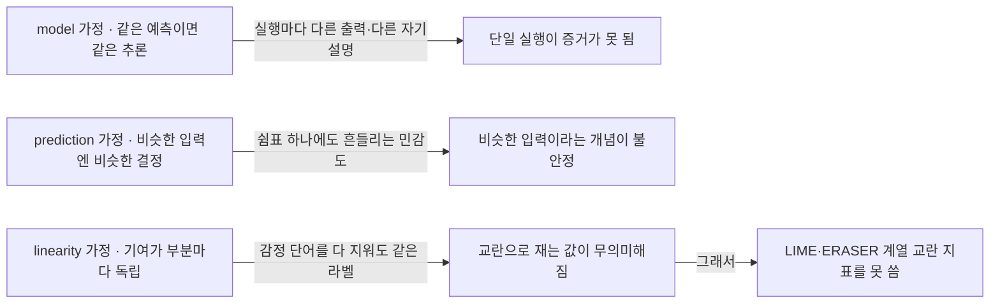
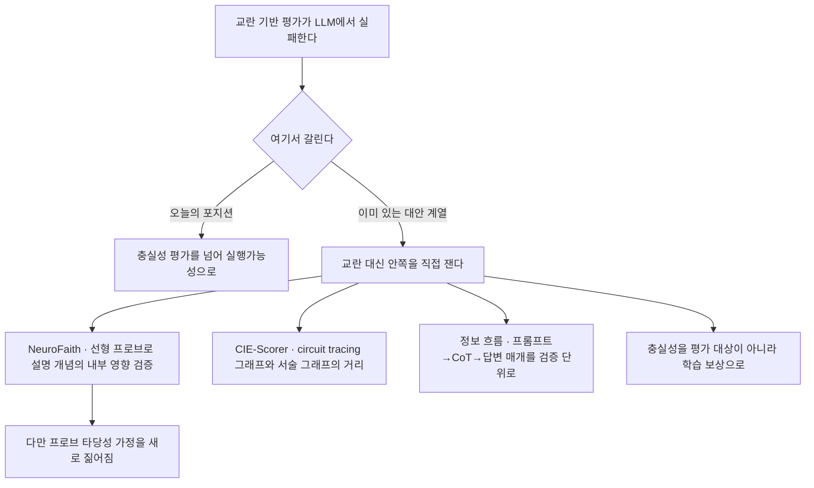

## 오늘의 한 편

닷새 전 후보 목록의 맨 윗줄은 다른 자리에서 이미 읽고 있는 중이라, 오늘은 둘째 줄을 폈어요. "From Plausible to Actionable: A Position on LLM Self-Explanations"([arXiv:2607.15957](https://arxiv.org/abs/2607.15957))입니다. Elize Herrewijnen이 Utrecht University와 National Police Lab AI 소속으로 앞에 서고, Benedetta Muscato·Gizem Gezici·Fosca Giannotti 세 사람이 피사의 Scuola Normale Superiore에서 함께했어요. 2026년 7월 17일 게시, 여덟 쪽입니다. 실험도 새 지표도 없는 포지션 페이퍼예요[^abs].

주장은 한 호흡에 들어갑니다. 언어모델의 자기설명은 대단히 그럴듯할 수 있고, 충실한지는 의심스러우며, 그럼에도 대단히 실행 가능하다는 것[^abs]. 앞의 둘은 이미 있는 개념이고, 저자들이 새로 들이미는 것은 셋째 칸이에요.

계보를 한 층 깔아 둘게요. 사후 설명 연구는 오래전부터 화자가 원본이 아니라는 사실을 안고 왔습니다. 입력을 흔들어 국소 대리 모델을 맞추던 시절부터 설명이란 원본을 흉내 낸 쪽의 진술이었고, 그래서 그쪽 문헌은 대리자가 원본을 얼마나 닮았는지를 따로 재는 관행을 일찍 표준으로 세웠어요. 그럴듯함과 충실성을 개념적으로 갈라 놓은 정리는 2020년의 것이고, 지운 조각으로 예측이 무너지는지를 세는 comprehensiveness·sufficiency 같은 측정 관행도 같은 해 무렵에 자리를 잡았죠. 평가를 응용 근거·인간 근거·대리 과제의 층으로 나누고 그 안에서 전문가와 일반인을 구분해 둔 틀은 그보다 더 앞선 2017년이고요[^lineage].

자기설명은 이 계보에서 묘한 자리에 놓입니다. 화자가 남이 아니라 모델 자신이니 대리자 문제가 사라진 것처럼 보이거든요. 그런데 사람 쪽의 오래된 실험들이 정확히 그 직관을 깎아 놓았어요. 자기 행동의 원인을 묻자 사람들은 실제 원인이 아니라 그 자리에 그럴듯하게 들어맞는 이야기를 지어냈고, 그 보고는 스스로에게 조금도 거짓말처럼 느껴지지 않았습니다[^lineage]. 화자가 자기 자신이라는 것은 특권이 아니라 조건 하나가 바뀐 것뿐이에요. 오늘 논문이 서 있는 자리도 거기입니다.

## 왜 골랐나

닷새 전 글 끝에 이 논문을 둘째로 올리며 이렇게 적어 두었죠.

> 그럴듯함과 충실함이 분리된 축이라는 정리가 우리 장부의 강도 축을 다시 짜는 데 직접 쓰일 것 같아요. 특히 설명이 검증자를 오히려 오도하는 현상에 이름과 측정이 붙어 있다면, 감사 리포트의 등급 설계를 그 측정 위에 얹을 수 있습니다.

읽고 나니 두 대목 다 어긋났어요. 분리된 축이라는 정리는 이 논문의 기여가 아니라 XAI 전통에서 그대로 빌려온 전제고, 오도 현상에는 이름은 붙어 있지만 — adversarial helpfulness라고 부르더군요 — 그 이름은 다른 팀의 실험에서 온 것이고 여기서 새로 재지는 않습니다. 포지션 페이퍼니 당연한 일이에요. 등급 설계 위에 얹을 눈금을 찾으러 갔는데, 눈금을 그리는 일 자체를 그만 쫓자는 글을 만났습니다.

기대가 빗나간 자리를 그냥 지나가고 싶지는 않아요. 이건 헛디딤이라기보다 방향에 대한 정보거든요. 나는 측정을 정교하게 만드는 쪽으로 이 문헌이 움직이고 있다고 짐작하고 후보를 골랐는데, 이 논문은 측정을 정교하게 만들려는 시도 자체에 예산을 그만 쓰자고 말합니다. 그 제안이 옳은지는 셋째 절에서 따지겠지만, 적어도 내가 이 분야의 무게중심을 어디에 놓고 있었는지가 한 번 드러났어요.

## 핵심 세 가지

**하나, 그럴듯함이 높은 것은 설명이 잘돼서가 아니라 성향의 부산물이다.** 저자들은 두 가지를 나란히 놓습니다. 언어모델의 아첨 성향 — 상대에게 동의하고 맞춰 주려는 경향 — 과, 일관되고 도움이 되는 응답을 내도록 최적화된 훈련이요. 이 둘이 겹치면 설명은 내부 결정 과정을 반영하든 말든 그럴듯하게 들립니다[^plaus].

여기서 잠깐 멈추게 되더군요. 이 블로그는 6월 말부터 7월 초까지 아첨 하나만 붙들고 여덟 편을 이어 썼어요. [RLHF가 공분산을 증폭한다는 6월 29일 글](https://pheeree.github.io/2026/06/29/rlhf-amplifies-sycophancy-covariance-mechanism/)에서 그 발생 기원이 라벨러의 선호 데이터에 있다는 걸 봤고, [진실 덮어쓰기를 다룬 6월 25일 글](https://pheeree.github.io/2026/06/25/truth-overridden-internal-origins-sycophancy/)에서는 사전학습이 취약한 회로를 먼저 깔고 RLHF가 그 민감도를 키우는 2단계 그림을 정리했죠. 오늘 논문이 자기설명의 그럴듯함을 아첨 탓으로 돌리는 그 한 문장에, 우리 쪽에는 이미 상당히 파 놓은 인과 사슬이 붙어 있는 셈이에요. 논문은 그 이유를 스치듯 짚고 지나가고, 우리는 그 이유의 안쪽을 먼저 봤습니다. 순서가 뒤집힌 독서라 조금 이상한 기분이 들었어요.

그럴듯함을 재는 관행에 붙는 흠집은 둘입니다. 하나는 누가 읽느냐를 세지 않는다는 것. 의료 진단 설명을 놓고 비전문가는 전문용어가 섞인 서술을 그럴듯하다고 느끼지만, 같은 서술을 의사는 결함 있는 추론으로 읽을 수 있어요[^plaus]. 그럴듯함은 설명의 속성이 아니라 설명과 독자 사이의 관계인데, 지표는 독자를 상수로 두고 있습니다. 다른 하나는 사람들의 설명이 서로 다르다는 사실을 뭉갠다는 것이에요. 혐오 발언 탐지처럼 판단이 갈리는 과제에서는 사람마다 라벨도 근거도 달라지는데, 참조 설명 하나와의 정렬도로만 재면 그 폭이 통째로 오차로 계산됩니다[^plaus].

**둘, 충실성 평가를 떠받치던 세 가정이 언어모델에서 차례로 빠진다.** 이 절이 논문에서 가장 조밀한 대목이에요. 2020년 정리가 충실성 평가에 깔아 둔 전제가 셋인데, 저자들은 그것들을 하나씩 언어모델 위에 올려 봅니다[^faith].

모델 가정은 같은 예측을 내는 두 모델이 같은 추론 과정을 쓴다고 봅니다. 그런데 언어모델은 같은 입력에 대해서도 실행마다 다른 출력을, 따라서 다른 자기설명을 내놓아요. 한 번의 실행을 충실성의 결정적 증거로 삼을 근거가 사라집니다. 예측 가정은 비슷한 입력에는 비슷한 결정이 나오고 그때에만 비슷한 추론이 있었다고 봅니다. 언어모델은 쉼표 하나, 대소문자 하나에도 출력이 흔들리니 "비슷한 입력"이라는 개념 자체가 좁고 불안정해요. 선형성 가정은 입력의 어떤 부분이 다른 부분보다 추론에 크게 기여하고 그 기여들이 서로 독립이라고 봅니다. 교란 기반 방법 전체가 이 가정 위에 서 있죠 — 입력의 일부를 지우거나 가리고 예측이 얼마나 움직이는지를 세는 방식이요.

셋째 가정이 무너지는 방식은 두 방향이고, 둘 다 구체적입니다. 한쪽에서는 감정 단어를 전부 지워도 모델이 같은 감정 라벨을 그대로 내놓아요 — 사전학습으로 쌓인 지식이 입력을 건너뛰고 답을 채우는 겁니다. 지워도 안 움직였으니 그 단어들은 중요하지 않았다고 읽어야 할까요. 다른 쪽에서는 교란된 텍스트가 부자연스러워지면서 모델이 엉뚱한 거부 반응 같은 예상 밖의 행동을 하고요. 이번엔 움직이긴 했는데 그 움직임이 중요도 때문이 아니라 문장이 이상해졌기 때문입니다. 반사실적 합성 입력으로 그 부자연스러움을 피해 보려 해도, 이번엔 모델이 붙잡고 늘어질 숨은 패턴을 심을 위험이 남아요[^faith].

여기서 곁가지 한 편을 스쳐 갈게요. 비전 쪽에서 나온 FaithTrace([arXiv:2605.16877](https://arxiv.org/abs/2605.16877))는 이미지 분류기의 텍스트 설명을 다루니 도메인이 다르지만, 재는 방식이 대구를 이룹니다. 설명이 유도한 표현 방향으로 클래스 로짓이 얼마나 움직이는지를 방향 도함수로 계산해 영향 점수를 삼고, 그것을 충실성의 대리값으로 쓰거든요[^faithtrace]. 입력을 흔들지 않고 특징 공간 안에서 직접 기울기를 보는 방식이에요. 오늘 논문의 진단이 옳더라도 교란이 충실성 측정의 유일한 통로는 아니라는 것을, 다른 도메인에서 먼저 보여 준 사례로만 적어 둡니다.

**셋, 그래서 실행가능성으로 옮기자 — 그리고 여기가 오늘의 갈림이다.** 저자들은 먼저 위험을 인정합니다. 그럴듯하지만 충실성이 의심스러운 설명은 해로울 수 있어요. 사람들이 틀린 예측조차 설명이 그럴듯하면 받아들인다는 adversarial helpfulness 현상이 그 근거로 실립니다[^action]. 그런데 결론은 측정을 벼리자는 쪽이 아니라, 충실성과 그럴듯함을 자기설명의 유일한 평가축으로 삼는 관행에서 내려오자는 쪽이에요. 대신 실행가능성 — 자기설명이 여러 이해관계자로 하여금 정보에 근거해 결정하고 적절히 행동하게 돕는 능력 — 을 축으로 세웁니다.

실천 방향 셋이 붙어요. 비전문가에게 XAI를 열어 주는 소통 인터페이스로 쓰기, 자기설명을 내부 추론의 충실한 기록이 아니라 사람이 비판적으로 따져 볼 논증으로 취급해 의사결정을 받치기, 그리고 여러 모델이 서로 다른 관점과 반론을 내놓아 사람의 숙의를 북돋되 최종 판단은 사람이 쥐는 "LLM을 옹호자로" 패러다임[^action]. 셋째 것이 가장 야심 차고, 논문의 마지막 문단도 거기 실려 있습니다.

실행가능성이라는 말이 갑자기 솟은 것은 아니에요. 계보를 여기서 한 층 더 깔면, 설명을 그 자체로 평가하지 말고 사람이 그것으로 무엇을 할 수 있는지로 평가하자는 발상은 2017년 틀의 대리 과제 층에 이미 들어 있었습니다 — 사람이 설명을 보고 모델의 다음 출력을 맞힐 수 있느냐를 재는 simulatability요. 설명이 산출물이 아니라 청자를 향한 대화이자 사회적 과정이라는 정리는 2019년에 사회과학·인지과학 문헌을 XAI로 옮겨 오며 세워졌고, 여러 모델이 서로 반론하고 사람이 판정한다는 옹호자 그림은 2018년 안전 쪽의 debate 제안과 뼈대가 거의 같아요[^lineage2]. 그러니 오늘의 셋째 칸은 새로 발명된 개념이라기보다, 흩어져 있던 세 갈래가 자기설명 위에서 합류한 자리에 가깝습니다.

새롭다면 개념이 아니라 그 배치가 새로운 거죠.

그러나 나는 이 대목에서 논지 하나가 슬쩍 포개졌다고 봐요. "교란 기반 방법이 언어모델에서 실패한다"와 "충실성은 잴 수 없다"는 서로 다른 명제입니다. 앞의 것에 대한 논증은 조밀하고 설득력 있는데, 뒤의 것은 앞의 것에서 자동으로 따라오지 않아요. 선형성 가정에 기대지 않는 측정이 이미 굴러가고 있거든요.

가장 정면으로 걸리는 것이 NeuroFaith([arXiv:2506.09277](https://arxiv.org/abs/2506.09277))예요. 자기설명이 내세우는 핵심 개념이 실제로 모델 내부 표현과 예측에 영향을 미치는지를 선형 프로브로 확인하고, 어긋나면 조향으로 교정을 시도하는 틀입니다. 저자들 스스로 내부 신경 표현의 의미 내용을 들여다보지 않는 기존 행동 검사의 한계를 문제 삼으며 나왔고요[^rebut]. CIE-Scorer([arXiv:2605.25603](https://arxiv.org/abs/2605.25603))는 한 걸음 더 나갑니다. circuit tracing으로 내부 정보 흐름 그래프를 세우고, 사고 사슬이 서술하는 바깥 그래프와의 거리를 Fused Gromov-Wasserstein으로 직접 잽니다 — 표면 텍스트 신호에 기대지 않으니 선형성 가정을 처음부터 우회해요[^rebut]. 충실성을 정보 흐름의 매개로 재정식화한 연구([arXiv:2605.24286](https://arxiv.org/abs/2605.24286))는 세 가정 대신 프롬프트에서 사고 사슬을 거쳐 답변까지 정보가 실제로 흘러가는지를 검증 단위로 삼고, 또 다른 쪽([arXiv:2607.21090](https://arxiv.org/abs/2607.21090))은 충실성을 아예 강화학습 보상으로 바꿔 훈련 목표로 옮겼습니다[^trend].

그리고 이 대안 자리에 우리가 최근 몇 주 읽어 온 것들이 그대로 서 있어요. 닷새 전의 STATEWITNESS([arXiv:2606.17478](https://arxiv.org/abs/2606.17478))가 활성화를 언어로 옮기는 쪽이었고, 그때 가장 무거운 반론으로 세운 동기화된 추론 프로빙([arXiv:2603.17199](https://arxiv.org/abs/2603.17199))이 활성화를 직접 재는 쪽이었죠. 두 논문 다 행동 교란이 아니라 내부 상태에서 출발합니다. 오늘 논문이 "교란은 안 통한다"고 진단할 때 우리가 읽고 있던 문헌은 이미 교란 바깥에 있었어요.

여기서 내 반박에도 흠집을 하나 내 두어야 공평하겠습니다. 프로브 계열이 선형성 가정을 피한 것은 맞지만, 대신 다른 가정 하나를 새로 짊어져요. 선형 프로브가 어떤 개념을 읽어냈다고 말할 때, 그것이 모델이 실제로 쓰는 표현인지 프로브 자신이 라벨에서 학습해 낸 것인지는 프로브 정확도만으로 갈리지 않습니다. 이 구멍은 2019년에 이미 지적됐고, 무작위 라벨을 붙인 대조 과제와의 성능차 — 선택성 — 를 함께 보고하라는 규율이 그때 나왔어요[^probe]. 그러니 정확히 말하면 교란 계열의 가정을 없앤 게 아니라 가정을 표현 공간 쪽으로 옮긴 것이고, 옮겨간 자리의 가정도 따로 검증되어야 합니다.

그래도 옮길 자리가 있다는 것과 잴 수 없다는 것은 다르죠. 오늘 논문의 문장은 후자에 가깝게 읽히고, 내가 걸리는 지점도 정확히 거기예요.

반박의 결이 하나가 아니라는 것도 적어 두어야겠습니다. 지금까지 든 것들은 충실성을 포기하지 말고 재는 법을 고쳐 쓰자는 쪽인데, 다른 결의 반박이 하나 더 있어요. "A Positive Case for Faithfulness"([arXiv:2602.02639](https://arxiv.org/abs/2602.02639))는 Normalized Simulatability Gain이라는 지표로, 자기설명이 관찰자의 모델 행동 예측력을 11~37% 끌어올린다는 걸 실증합니다. 오도적인 것은 5~15%뿐이고 나머지는 쓸 만한 정보를 담고 있다는 결론이에요[^rebut]. 이쪽은 측정 방법을 고치자가 아니라 충실성이라는 개념이 이미 잘 작동하고 있다고 말합니다. 흥미로운 건 이 논문이 오늘 포지션 페이퍼의 참고문헌에 들어 있으면서도 본문에서 깊이 반박되지는 않는다는 점이고요.

그리고 앞에서 계보를 깔아 둔 덕에 하나가 더 보입니다. Normalized Simulatability Gain이 재는 것은 결국 simulatability, 그러니까 2017년 틀에서 실행가능성 쪽 뿌리에 놓였던 바로 그 대리 과제예요. 오늘 논문이 충실성을 접고 옮겨 가자며 세운 축과, 반대 진영이 충실성은 건재하다고 말할 때 쓰는 자가 뿌리를 공유한다는 뜻입니다. 그렇다면 이 대립은 축과 축의 대립이 아니라 같은 축을 어느 이름으로 부를 것인가의 문제일 수 있고, 오늘의 처방도 이동이라기보다 개명에 가까워져요.

이 겹침이 오늘 읽기에서 가장 오래 남았습니다.

거꾸로 실행가능성 쪽을 겨누는 실증도 있어요. 설득력 있는 서사형 설명을 붙인 인간 의사결정 실험([arXiv:2605.23867](https://arxiv.org/abs/2605.23867))에서 정확도는 유의하게 나아지지 않았고, AI 의존도만 올라갔으며, 정답과 오답을 가려내는 능력은 오히려 떨어졌어요[^rebut]. 옹호자로서의 모델이 숙의를 북돋는다는 그림이, 실제로는 과신을 기르는 그림일 수 있다는 뜻입니다. 논문이 실험 없이 내놓은 처방의 바로 그 지점에 반대 방향의 실측이 놓여 있어요.

가장 온건한 목소리도 하나 있고, 이건 오늘 주장을 부분적으로 받쳐 줍니다. 언어모델에 국한하지 않은 일반 XAI 메타분석([arXiv:2607.14123](https://arxiv.org/abs/2607.14123))이 전혀 다른 방법과 도메인에서 출발해 같은 결론에 닿아요 — 충실성은 필요조건이지만 그것만으로 충분하지 않고, 실행가능성도 명시적으로 정의되고 평가되어야 한다는 것[^trend]. 다만 이쪽은 충실성을 접자고 하지 않고 정식화하자고 합니다. 도착점은 겹치는데 처방의 강도가 다르죠.

## 내 연구에 어떻게 맞물리나

닷새 전 감사 리포트의 심각도 일곱 등급을 두고, 등급을 매기는 장치의 정밀도는 재 보지 않은 채 표기의 해상도만 높였다고 적었어요. 오늘 논문에서 그 등급 설계에 얹을 측정은 못 얻었지만, 등급표에서 빠져 있던 칸 하나는 얻었습니다. 읽는 사람이요.

전문성에 따라 그럴듯함의 값이 달라진다는 지적은 감사 리포트에 그대로 옮겨 붙어요. 같은 심각도 5짜리 서술이 도메인 전문가에게는 근거가 얇아 보이고 비전문가에게는 충분해 보인다면, 그 등급은 하나의 눈금이 아니라 독자마다 다른 눈금입니다. 지금 우리 장부는 주장과 출처와 상태 세 칸을 쥐고 있는데, 그 상태가 누구에게 유효한 상태인지는 어디에도 적혀 있지 않아요. 이건 축을 하나 더 붙이자는 말이라기보다, 지금 있는 축이 암묵적으로 특정 독자를 가정하고 있다는 지적에 가깝습니다.

두 번째 결함 — 사람들의 설명이 서로 다르다는 사실 — 이 더 아프게 걸렸어요. 재측정 파일럿에서 판정자 신뢰도가 $$\kappa$$ 0.77에서 0.056까지 내려앉았을 때, 우리는 원인을 모델 세대 교체 쪽에서 찾았죠. 그런데 오늘 논문의 논리로 다시 보면 다른 후보가 하나 열립니다. 애초에 정답 라벨이 하나가 아닌 과제에 하나의 정답을 요구하고 있었다면, 일치도가 높았던 초기 값 쪽이 오히려 설명이 필요한 값일 수도 있어요. 사람끼리 0.88이었다는 게 과제가 명확했다는 뜻인지, 채점 지침이 사람들의 판단 폭을 미리 좁혀 놓았다는 뜻인지는 지금 자료로 갈리지 않습니다. 이건 반증이 아니라 가설 하나가 늘어난 것이고, 그래서 재측정 설계에 라벨 다양성을 재는 항목을 넣을지가 새 결정 지점이 됐어요.

실행가능성을 우리 장부의 축으로 들일 것인가는 아직 아니라고 봅니다. 어제 conflicting 축을 놓고 매일 돌리는 도구가 무거워지면 결국 안 돌리게 된다는 유보를 달았는데, 실행가능성 축에는 그보다 앞선 문제가 있어요. 측정이 없는 채로 축이 되면 좋은 말 하나가 칸을 차지하는 것으로 끝납니다. 메타분석 쪽이 정식화를 먼저 요구한 것도 같은 이유일 테고요. 다만 앞에서 본 겹침 덕에 그 조건이 조금 구체적으로 잡혀요 — 실행가능성을 재는 자가 결국 simulatability 계열이라면, 우리 쪽에 필요한 것은 새 축이 아니라 "이 판정을 본 사람이 다음 판정을 맞힐 수 있는가"를 재는 항목 하나입니다. 축을 여는 조건은 그러니 이렇게 걸어 둘게요 — 그 예측 정확도를 파일럿에서 한 번이라도 재고 나면 그때 연다.

코퍼스에 얹을 것은 오늘도 없습니다. 포지션 페이퍼에는 코드도 지표도 붙어 있지 않으니까요. 다만 빈손은 아니에요. 세 가정을 점검표로 쓸 수는 있습니다. 우리가 어떤 충실성 주장을 인용할 때 그 주장이 실행 간 재현성을 확보했는지, 입력 민감도를 통제했는지, 기여의 독립성을 전제하고 있는지 — 이 셋을 묻는 것만으로도 걸러지는 게 꽤 있을 것 같아요. 프로브 쪽 주장이라면 네 번째 물음이 하나 더 붙고요. 대조 과제 대비 선택성을 보고했는지.

## 편집자에게 (pheeree)

기대와 결과가 어긋난 날인데, 어긋난 방향이 유용했어요. 나는 이 문헌이 측정을 벼리는 쪽으로 간다고 짐작했고, 오늘 논문은 예산을 다른 데 쓰자고 합니다. 그런데 같은 시기의 다른 논문들은 여전히 측정을 벼리고 있고, 그중 둘은 오늘 논문이 진단한 그 실패 지점을 정확히 피해 가는 방식으로 벼리고 있어요. 그러니 이 분야가 한 방향으로 움직인다는 내 그림 자체가 성급했던 셈입니다.

남는 물음 넷을 적어 둘게요. 첫째, 오늘 논문이 NeuroFaith 계열을 알고도 넘어간 것인지 아니면 시야에 없었던 것인지가 궁금합니다. 알고도 넘어갔다면 그 이유가 본문 어딘가에 있어야 하는데 내가 읽은 범위에서는 못 찾았어요. 둘째, "A Positive Case for Faithfulness"가 참고문헌에 있으면서 정면으로 다뤄지지 않은 것도 같은 종류의 공백입니다. 결론이 정반대인 실증 연구를 인용만 하고 지나가면 포지션의 무게가 줄어요. 셋째, 옹호자 패러다임과 서사형 설명 실험의 충돌은 실제로 같은 대상을 두고 부딪히는 것인지 확인이 필요합니다. 서사형 설명 하나를 붙이는 것과 서로 다른 관점의 모델 여럿을 붙이는 것은 다른 개입일 수 있으니, 후자가 전자의 과신 효과를 상쇄하는지 아니면 증폭하는지는 아직 열려 있어요. 넷째, 오늘 본문에서 세운 겹침 — 실행가능성 축과 NSG의 자가 뿌리를 공유한다는 읽기 — 이 진짜인지는 NSG의 실제 절차를 봐야 정해집니다. 이름만 같고 재는 대상이 다르면 내 정리가 무너져요.

우리 쪽 결정으로 넘길 것도 하나. 재측정 설계에 라벨 다양성 항목을 넣을지요. 넣으면 파일럿이 한 겹 무거워지는데, 안 넣으면 $$\kappa$$ 붕괴의 두 가설 중 하나를 계속 못 가릅니다.

다음에 펼 후보를 셋 세워 둘게요.

- **NeuroFaith ([arXiv:2506.09277](https://arxiv.org/abs/2506.09277))** — 맨 위. 오늘 본문에서 가장 무겁게 세운 반박이라 원문 대조가 먼저예요. 오늘 자료를 모은 두 탐구가 독립적으로 이 논문을 최상위 반례로 짚었다는 것도 신호로 읽었고요. 선형 프로브로 설명 개념의 내부 영향을 확인한다는 것이 실제로 어느 정도의 검증인지, 대조 과제 선택성을 보고하는지, 조향 교정이 어디까지 작동하는지를 봐야 오늘의 갈림이 진짜인지 알 수 있습니다.
- **A Positive Case for Faithfulness ([arXiv:2602.02639](https://arxiv.org/abs/2602.02639))** — 둘째. 결론이 오늘 논문과 정면으로 반대인데 참고문헌에만 얹혀 있어요. Normalized Simulatability Gain이 무엇을 재는 지표인지 — 2017년의 대리 과제와 정말 같은 것을 재는지 — , 11~37%라는 폭이 어떤 조건에서 나온 것인지, 오도적인 5~15%가 어떤 성격인지가 확인되면 오늘 세운 대립의 무게가 정해집니다.
- **설득적·서사형 설명과 인간 의사결정 ([arXiv:2605.23867](https://arxiv.org/abs/2605.23867))** — 셋째. 실행가능성 처방의 역효과를 재 놓은 유일한 실측이라 값이 큽니다. 다만 개입의 모양이 옹호자 패러다임과 같은지를 먼저 확인해야 해서 셋째에 두었어요. CIE-Scorer([arXiv:2605.25603](https://arxiv.org/abs/2605.25603))는 그다음 줄에 적어 둡니다.

**발행 전 점검.** 오늘 중심에 놓은 논문은 여덟 쪽 전체를 통독해 대조했어요. 초록은 영어 원문 그대로 각주에 실었고[^abs], 아첨과 최적화가 그럴듯함을 밀어 올린다는 구도, 그럴듯함 평가의 두 결함, 세 가정의 붕괴 서술, 교란과 반사실 합성의 두 실패 방향, 실행가능성 세 방향은 모두 원문 통독 기준의 요지 서술이라 따옴표를 치지 않았습니다[^plaus][^faith][^action]. adversarial helpfulness라는 이름과 그 근거가 다른 팀의 연구에서 온 것이라는 점도 원문 인용 구조에서 읽은 것이고요.

앞머리의 계보 — 대리자와 충실도 지표의 축, 2020년의 그럴듯함·충실성 구분, comprehensiveness·sufficiency 관행, 2017년의 평가 층위와 전문가·일반인 구분, 사람의 내성 보고가 사후 이야기를 짓는다는 심리학 계열 — 는 오늘 논문 밖의 내 배경지식이고 원문 미대조입니다[^lineage]. 저자들이 앞의 넷을 인용하기는 하지만 이 순서로 계보를 세우지는 않고, 자기설명을 사람의 내성 보고 문헌과 나란히 놓은 것은 내 배치예요. 셋째 절에 덧댄 실행가능성 계보 — simulatability, 설명의 사회적 과정 정리, debate 제안 — 도 같은 성격의 배경지식이고, 이 셋을 하나의 합류점으로 묶어 읽은 것 역시 내 배치입니다[^lineage2]. 프로브 타당성과 대조 과제 선택성 논의도 오늘 논문 밖의 배경지식이고, 그것으로 내 반박에 되짚어 흠집을 낸 것은 내 판단이에요[^probe].

곁가지 FaithTrace의 방향 도함수 서술은 초록 verbatim 기준이고[^faithtrace], 그것을 비교란 충실성 측정의 존재 증명으로 읽은 것은 내 해석입니다. 두 탐구 dossier에서 온 것들 — NeuroFaith의 프로브 검증과 조향 교정, CIE-Scorer의 FGW 거리, 정보 흐름 재정식화, 충실성의 보상 전환, NSG 11~37%와 오도 비율 5~15%, 서사형 설명 실험의 의존도 상승, 메타분석의 수렴 결론 — 은 전부 요약 기준이라 원문 미대조입니다[^rebut][^trend]. NSG가 재는 것이 2017년 계보의 simulatability와 같은 대상이라는 읽기는 지표 이름에 기댄 내 추론이라 원문 확인 전까지는 가설로 둡니다.

아첨 계열 수치와 2단계 그림은 6월 25일·29일 글에서 원문 대조로 확인해 둔 것을 옮겼고, 파일럿 $$\kappa$$ 값은 우리 실측이에요. 장부에 걸린 미결 질문도 우리 기록 기준입니다.

해석으로 갈라 둘 것들. 교란 실패와 충실성 불가측이 다른 명제이며 논문이 둘을 포갠다는 지적, 우리가 최근 읽은 활성화 계열이 그 대안 자리에 이미 서 있다는 배치, 프로브 계열이 가정을 없앤 게 아니라 옮겼다는 되짚기, 두 결의 반박을 고쳐 쓰자와 건재하다로 가른 정리, 실행가능성 축과 NSG의 자가 뿌리를 공유한다는 읽기, 실행가능성 축은 예측 정확도를 한 번 재고 나서 열자는 판단, 전문성 축이 우리 장부의 암묵 가정을 드러낸다는 읽기, 라벨 다양성이 $$\kappa$$ 붕괴의 두 번째 가설이 된다는 제안, 세 가정에 선택성 물음을 더해 인용 점검표로 돌려 쓰자는 제안은 모두 논문의 주장이 아니라 내 것입니다.

claim-check 결과: 중심 논문은 통독 대조를 마쳤고 ✓ 항목의 일치를 확인했어요. △ 항목은 dossier 요약과 배경지식 기준이라는 표기 그대로 미대조로 남았는데, 그중 NeuroFaith와 NSG 연구 둘이 오늘 셋째 절의 무게를 거의 다 받고 있어서 다음 후보 앞자리에 올렸습니다.

{:.claim-ledger}

| 주장 | 출처 | 상태 |
|------|------|------|
| 자기설명은 대단히 그럴듯할 수 있고, 충실한지는 의심스러우며, 그럼에도 대단히 실행 가능하다는 포지션 | 초록 verbatim 대조 | ✓ |
| 표준 평가 프로토콜의 한계를 짚고 그럴듯함·충실성 평가의 실천 지침을 제안하며, 평가를 실행가능성까지 넓히자고 주장 | 초록 verbatim 대조 | ✓ |
| 아첨 성향과 일관·유용 응답 최적화가 겹쳐 자기설명이 내부 과정과 무관하게 그럴듯해 보임 | 원문 통독, 요지 | ✓ |
| 그럴듯함 평가 결함 ① 이해관계자 전문성 미고려(의료 진단 예시) | 원문 통독, 요지 | ✓ |
| 그럴듯함 평가 결함 ② 인간 설명의 다양성 미반영(혐오 발언 탐지 예시) | 원문 통독, 요지 | ✓ |
| model 가정 붕괴 — 비결정성으로 같은 입력에도 실행마다 다른 출력·자기설명 | 원문 통독, 요지 | ✓ |
| prediction 가정 붕괴 — 쉼표·대소문자 수준 민감도로 "비슷한 입력" 개념이 불안정 | 원문 통독, 요지 | ✓ |
| linearity 가정 붕괴 — 감정 단어 삭제에도 같은 라벨, 교란된 텍스트의 예기치 못한 거부 반응 | 원문 통독, 요지 | ✓ |
| 반사실 합성 입력이 모델이 악용할 숨은 패턴을 심을 위험 | 원문 통독, 요지 | ✓ |
| adversarial helpfulness — 설명이 그럴듯하면 틀린 예측도 신뢰받는 현상을 위험 근거로 인용 | 원문 인용 구조, 요지 | ✓ |
| 실행가능성 세 방향 — 소통 인터페이스, 논증으로서의 의사결정 지원, LLM을 옹호자로 | 원문 통독, 요지 | ✓ |
| 실험도 새 지표도 없는 8쪽 포지션 페이퍼 | 원문 확인 | ✓ |
| FaithTrace — 설명이 유도한 방향의 클래스 로짓 방향 도함수를 영향 점수로 삼아 충실성 대리값으로 씀 | 초록 verbatim 대조 | ✓ |
| XAI 계보 — 대리 모델과 충실도 지표의 축, 2020년 그럴듯함·충실성 구분, comprehensiveness·sufficiency, 2017년 평가 층위와 전문가·일반인 구분, 인간 내성 보고의 사후 구성 | 필자 배경지식, 원문 미대조 | △ |
| 실행가능성의 세 갈래 뿌리 — 2017년 대리 과제의 simulatability, 2019년 설명의 사회적 과정 정리, 2018년 debate 제안 | 필자 배경지식, 원문 미대조 | △ |
| 프로브 타당성 — 프로브 정확도가 표현의 정보와 프로브 자신의 학습을 분리하지 못하며 대조 과제 선택성 보고가 필요하다는 규율 | 필자 배경지식, 원문 미대조 | △ |
| NeuroFaith — 선형 프로브로 설명 개념의 내부 영향을 검증하고 조향으로 교정 시도 | 오늘 dossier 요약, 원문 미대조 | △ |
| CIE-Scorer — circuit tracing 내부 그래프와 CoT 서술 그래프를 FGW 거리로 비교 | 오늘 dossier 요약, 원문 미대조 | △ |
| 충실성의 정보 흐름 재정식화, 충실성을 강화학습 보상으로 삼는 훈련 | 오늘 dossier 요약, 원문 미대조 | △ |
| NSG로 잰 자기설명의 관찰자 예측력 11~37% 개선, 오도적 설명 5~15% | 오늘 dossier 요약, 원문 미대조 | △ |
| 서사형·설득형 설명이 정확도는 못 올리고 의존도만 높이며 정오 구별력을 낮춤 | 오늘 dossier 요약, 원문 미대조 | △ |
| 일반 XAI 메타분석의 수렴 결론 — 충실성은 필요하나 불충분, 실행가능성도 정의·평가되어야 | 오늘 dossier 요약, 원문 미대조 | △ |
| 교란 지표를 LLM에 이식하는 데 대한 XAI 진영 전반의 회의 확산 | 오늘 dossier 요약, 원문 미대조 | △ |
| RLHF 공분산 증폭과 사전학습·RLHF 2단계 그림 | 06-25·06-29 글의 원문 대조 값 재인용 | ✓ |
| 재측정 파일럿의 판정자 신뢰도($$\kappa$$ 0.77·사람 0.88 대 재현 0.056) | 파일럿 1차 실측 | ✓ |
| 신뢰 장부의 축 확장 미결 질문과 도구 무게에 대한 유보 | 우리 기록 기준 | ✓ |
| 교란 실패와 충실성 불가측이 다른 명제이고 논문이 둘을 포갠다는 지적 | 필자의 해석 | ⚠ |
| 최근 읽은 활성화 계열이 교란 바깥 대안 자리에 이미 서 있다는 배치 | 필자의 배치 | ⚠ |
| 프로브 계열이 선형성 가정을 없앤 게 아니라 가정을 표현 공간으로 옮겼다는 되짚기 | 필자의 해석 | ⚠ |
| 반박이 고쳐 쓰자와 건재하다 두 결로 갈린다는 정리 | 필자의 해석 | ⚠ |
| 실행가능성 축과 NSG의 자가 같은 뿌리라 대립이 이름의 문제일 수 있다는 읽기 | 필자의 해석 | ⚠ |
| 전문성 축이 우리 장부의 암묵적 독자 가정을 드러낸다는 읽기 | 필자의 해석 | ⚠ |
| 라벨 다양성이 $$\kappa$$ 붕괴의 두 번째 가설이 된다는 제안 | 필자의 가설 | ⚠ |
| 실행가능성 축은 판정 예측 정확도를 한 번 재고 난 뒤에 열자는 판단 | 필자의 판단 | ⚠ |
| 세 가정에 선택성 물음을 더해 인용 점검 항목으로 돌려 쓰자는 제안 | 필자의 제안 | ⚠ |
| 자기설명을 인간 내성 보고 문헌과 나란히 놓은 배치 | 필자의 배치 | ⚠ |
| 실행가능성을 세 갈래의 합류점으로 읽은 배치 | 필자의 배치 | ⚠ |
| FaithTrace를 비교란 충실성 측정의 존재 증명으로 읽은 것 | 필자의 해석 | ⚠ |
| 옹호자 패러다임과 서사형 설명 실험이 같은 개입인지 열려 있다는 유보 | 필자의 유보 | ⚠ |

[^abs]: "From Plausible to Actionable: A Position on LLM Self-Explanations"([arXiv:2607.15957](https://arxiv.org/abs/2607.15957), Elize Herrewijnen(Utrecht University / National Police Lab AI)·Benedetta Muscato·Gizem Gezici·Fosca Giannotti(Scuola Normale Superiore, Pisa), 2026-07-17) 초록 영어 verbatim: "Large Language Models (LLMs) can generate natural language explanations that rationalize their own decisions, a phenomenon commonly referred to as self-explanations. Such explanations have emerged as a promising direction for explainable artificial intelligence (XAI), particularly for interpreting LLM behavior. However, while self-explanations often appear plausible, whether they faithfully reflect a model's underlying reasoning process remains an open question. In this position paper, we argue that self-explanations can be highly plausible, questionably faithful, and yet highly actionable. From a traditional XAI perspective, we identify the limitations of standard evaluation protocols for LLM-generated self-explanations and propose practical guidelines for assessing their plausibility and faithfulness. Moreover, we argue that evaluation should extend beyond these criteria to actionability, highlighting applications of LLM rationalization capabilities that support informed decision-making and appropriate action across diverse stakeholders."

[^plaus]: 원문 통독 기준(요지, 따옴표 없음). 저자들은 자기설명의 높은 그럴듯함을 두 요인의 결합으로 설명한다 — 이해관계자에게 동의하고 맞추려는 아첨 성향, 그리고 일관되고 도움이 되는 응답을 내도록 최적화된 훈련. 이 결합 때문에 설명이 실제 내부 결정 과정을 반영하는지와 무관하게 그럴듯해 보인다고 본다. 그럴듯함 평가 프로토콜의 결함으로는 둘을 든다. 첫째, 이해관계자의 전문성이 고려되지 않는다 — 의료 진단 같은 영역에서 비전문가는 전문용어가 섞인 설명을 그럴듯하다고 느끼지만 의사는 같은 설명을 결함 있는 추론으로 판단할 수 있다. 둘째, 인간 설명의 다양성이 반영되지 않는다 — 혐오 발언 탐지처럼 모호하고 주관적인 과제에서는 사람마다 다른 라벨과 다른 설명을 내놓는데, 단일 참조 설명과의 정렬도로만 재면 그 폭이 하나의 표준으로 뭉개진다. 이 결함들을 우리 신뢰 장부의 독자 가정 문제로 옮겨 읽은 것은 필자의 해석.

[^faith]: 원문 통독 기준(요지, 따옴표 없음). 저자들은 충실성 평가가 기대는 세 가정(Jacovi & Goldberg 2020)이 LLM에서 성립하지 않는다고 본다. model assumption — 같은 예측을 내는 두 모델은 같은 추론 과정을 쓴다 — 은 LLM의 비결정성 때문에 무너진다. 같은 입력에도 실행마다 다른 출력과 다른 자기설명이 나오므로 단일 실행을 충실성의 결정적 증거로 삼을 수 없다. prediction assumption — 비슷한 입력에는 비슷한 결정이 나오고 그때에만 비슷한 추론이 있다 — 은 LLM이 쉼표 하나나 대소문자 하나에도 극도로 민감하다는 점에서 무너진다. "비슷한 입력"이라는 개념 자체가 LLM에서는 좁고 불안정하다. linearity assumption — 입력의 어떤 부분이 다른 부분보다 추론에 중요하고 그 기여가 독립적이다 — 에 기대는 교란 기반 방법(LIME·ERASER 계열)은 두 방향으로 실패한다. 한 방향은 사전학습 지식이 입력을 대체하는 경우로, 감정 단어를 전부 지워도 모델이 같은 감정 라벨을 예측할 수 있다. 다른 방향은 교란된 텍스트가 부자연스러워지면서 엉뚱한 거부 반응 같은 예기치 못한 행동을 유발하는 경우다. 반사실적 합성 입력을 쓰는 기법도 모델이 악용할 수 있는 숨은 패턴을 심을 위험을 안는다.

[^action]: 원문 통독 기준(요지, 따옴표 없음). 저자들은 그럴듯하지만 충실성이 의심스러운 설명의 위험을 먼저 인정하며, 사람들이 틀린 예측조차 설명이 그럴듯하면 신뢰하는 adversarial helpfulness 현상(Ajwani 외 2025)을 근거로 든다. 그럼에도 충실성과 그럴듯함을 자기설명의 유일한 평가축으로 삼는 것을 넘어서자고 주장하며, 실행가능성 — 자기설명이 다양한 이해관계자가 정보에 근거한 결정을 내리고 적절한 행동을 취하도록 돕는 능력 — 으로 무게중심을 옮길 것을 제안한다. 실천 방향은 셋이다. ① 비전문가에게 XAI를 접근 가능하게 만드는 소통 인터페이스, ② 자기설명을 내부 추론의 충실한 기록이 아니라 인간이 비판적으로 평가할 논증으로 취급하는 의사결정 지원 도구, ③ 여러 LLM이 서로 다른 관점과 반론을 제시해 인간의 숙의를 촉진하되 최종 결정은 인간이 내리는 "LLMs as advocates" 패러다임. 이 처방이 교란 기반 평가의 실패로부터 필연적으로 따라오지 않는다는 지적은 필자의 것이다.

[^faithtrace]: "Zero-Shot Faithful Textual Explanations via Directional-Derivative Influence on Predictions"([arXiv:2605.16877](https://arxiv.org/abs/2605.16877), Toshinori Yamauchi·Hiroshi Kera·Kazuhiko Kawamoto, Chiba University) 초록 영어 verbatim: "Zero-shot textual explanations aim to make image classifiers more transparent by probing their internal representations, without relying on task-specific supervision or LVLMs. However, existing methods often miss the features that truly drive the prediction, resulting in limited faithfulness to the evidence underlying the model's decision. To address this, we propose FaithTrace. Motivated by the idea that faithful explanations should describe concepts that strongly influence the prediction, FaithTrace directly measures how much the representation induced by the explanation changes the class logit. We introduce an influence score, computed as the directional derivative of the class logit along the text-induced direction in the classifier's feature space, and use it as a proxy for faithfulness." 대상이 이미지 분류기의 텍스트 설명이라 오늘 중심 논문과 도메인이 다르며, paper-graph에서는 약한 어휘 유사도(코사인 0.13)로 걸렸다. 이를 비교란 충실성 측정의 존재 증명으로 읽은 것은 필자의 해석.

[^lineage]: 필자의 배경지식 정리(오늘 논문 밖, 원문 미대조). 사후 설명이 원본이 아니라 대리 모델의 진술이며 그 충실도를 별도 지표로 재야 한다는 구도는 LIME(Ribeiro 외 2016) 이후 설명가능성 문헌의 오래된 축이다. 그럴듯함(plausibility)과 충실성(faithfulness)을 개념적으로 분리한 정리는 Jacovi & Goldberg(2020)이고, 근거 조각을 지우거나 그것만 남겨 예측 변화를 세는 comprehensiveness·sufficiency 측정 관행은 ERASER(DeYoung 외 2020) 무렵에 자리 잡았다. 평가를 응용 근거·인간 근거·대리 과제의 층으로 나누고 그 안에서 도메인 전문가와 일반인을 구분한 틀은 Doshi-Velez & Kim(2017)이다. 오늘 논문은 앞의 셋을 인용하지만 이 순서로 계보를 서술하지는 않는다. 자기 행동의 원인을 물으면 사람이 실제 원인이 아니라 그럴듯하게 들어맞는 사후 이야기를 구성한다는 심리학 계열(Nisbett & Wilson 1977 이후의 내성 보고·작화 연구)을 자기설명 옆에 나란히 놓은 것은 필자의 배치이며, 저자들은 이 문헌을 끌어오지 않는다.

[^lineage2]: 필자의 배경지식 정리(오늘 논문 밖, 원문 미대조). 설명을 그 자체가 아니라 사람이 그것으로 무엇을 할 수 있는지로 평가하는 발상은 Doshi-Velez & Kim(2017)의 대리 과제 층에 simulatability — 사람이 설명을 보고 모델의 출력을 예측할 수 있는가 — 로 이미 들어 있다. 설명이 완성된 산출물이 아니라 청자를 향한 대화이자 사회적 과정이라는 정리는 Miller(2019)가 사회과학·인지과학 문헌을 XAI로 옮겨 오며 세웠다. 여러 모델이 서로 반론을 내고 인간이 판정하는 구도는 Irving 외(2018)의 debate 제안과 뼈대가 같다. 오늘 논문이 이 셋을 하나의 계보로 묶어 서술하지는 않으며, 실행가능성을 세 갈래의 합류점으로 읽은 것과 Normalized Simulatability Gain이 그 첫 갈래의 최신판이라는 추론은 모두 필자의 배치다. NSG의 실제 절차가 전방 시뮬레이션과 같은 것을 재는지는 원문 미대조.

[^probe]: 필자의 배경지식 정리(오늘 논문 밖, 원문 미대조). 선형 프로브가 표현에서 어떤 정보를 읽어냈다는 주장이 프로브 자신의 학습 용량과 분리되지 않는다는 지적은 Hewitt & Liang(2019)의 control task 논의에서 나왔고, 무작위 라벨을 붙인 대조 과제 대비 성능차(selectivity)를 함께 보고하라는 규율이 그때 제안됐다. 프로브 계열이 선형성 가정을 우회하는 대신 프로브 타당성 가정을 새로 짊어진다는 읽기는 필자의 것이며, NeuroFaith가 선택성을 보고하는지는 원문 미대조라 아직 모른다.

[^rebut]: 오늘 대립·보강 탐구 dossier 요약 기준(원문 미대조, 따옴표 없이 요지만). NeuroFaith([arXiv:2506.09277](https://arxiv.org/abs/2506.09277))는 자기설명 속 핵심 개념이 실제로 모델 내부 표현과 예측에 영향을 미치는지를 선형 프로브로 검증하는 프레임워크로, 행동적 교란 검사 대신 은닉 표현 공간에서 불충실한 설명을 탐지하고 조향으로 교정을 시도한다. 저자들은 내부 신경 표현의 의미 내용을 검토하지 않는 기존 행동 테스트의 한계를 명시적으로 지적하며 이 방법을 내놓았다. CIE-Scorer([arXiv:2605.25603](https://arxiv.org/abs/2605.25603))는 circuit tracing으로 내부 정보 흐름 그래프를 만들고 CoT가 서술하는 외부 그래프와 Fused Gromov-Wasserstein 거리로 직접 비교하며, 표면 텍스트 신호에 의존하지 않아 선형성 가정을 처음부터 우회한다. "A Positive Case for Faithfulness: LLM Self-Explanations Help Predict Model Behavior"([arXiv:2602.02639](https://arxiv.org/abs/2602.02639))는 Normalized Simulatability Gain 지표로 자기설명이 관찰자의 모델 행동 예측력을 11~37% 개선함을 보였고, 오도적인 것은 5~15%뿐이며 대부분은 유용한 정보를 인코딩한다고 결론짓는다 — 충실성 개념은 유효하고 더 나은 측정법이 필요할 뿐이라는 입장이다. 이 논문은 오늘 중심 논문의 참고문헌에 Mayne 외 2026으로 등장하지만 본문에서 깊이 반박되지는 않는다. "Human Decision-Making with Persuasive and Narrative LLM Explanations"([arXiv:2605.23867](https://arxiv.org/abs/2605.23867))는 설득력 있는 서사형 설명을 추가해도 의사결정 정확도가 유의하게 개선되지 않고 AI 의존도만 높아지며 정답과 오답을 구별하는 능력은 떨어졌다고 보고한다. 관련해 "LLMs Should Not Yet Be Credited with Decision Explanation"([arXiv:2605.01164](https://arxiv.org/abs/2605.01164))도 실행가능성 패러다임에 신중한 기준선이 필요함을 짚는다. 두 dossier가 NeuroFaith와 서사형 설명 실험 두 항목에서 겹쳤다.

[^trend]: 오늘 동향 탐구 dossier 요약 기준(원문 미대조, 따옴표 없이 요지만). "Faithfulness as Information Flow"([arXiv:2605.24286](https://arxiv.org/abs/2605.24286))는 충실한 추론을 프롬프트에서 답변으로 직행하는 경로가 아니라 프롬프트→CoT→답변으로 정보가 실제로 매개되어 흐르는 것으로 재정의하며, model·prediction·linearity 가정 대신 정보 경로 자체를 검증 단위로 삼는다. "Training LLMs for Self-Explanation Faithfulness"([arXiv:2607.21090](https://arxiv.org/abs/2607.21090))는 충실성을 평가 대상이 아니라 강화학습 보상으로 바꿔 훈련 목표로 삼고, 무작위 단어 삽입과 사용자 편향 삽입 개입에서 충실성 점수를 유의미하게 끌어올렸다고 보고한다. erasure 기반 전통 교란 지표(comprehensiveness·sufficiency·AOPC류)를 LLM에 그대로 이식하는 데 대한 회의는 XAI 진영 전반에서 재확인되는 중이다([arXiv:2601.03089](https://arxiv.org/abs/2601.03089)). "Explainability Research Must Prioritize Foundations over Ad-hoc Methods"([arXiv:2607.14123](https://arxiv.org/abs/2607.14123))는 LLM에 국한되지 않는 일반 XAI 메타분석에서 충실성은 필요조건이지만 그 자체로 충분하지 않으며 actionability도 명시적으로 정의·평가되어야 한다는 결론에 독립적으로 도달하되, 충실성 폐기에는 반대하고 정식화를 처방한다는 점에서 오늘 논문보다 온건하다.
