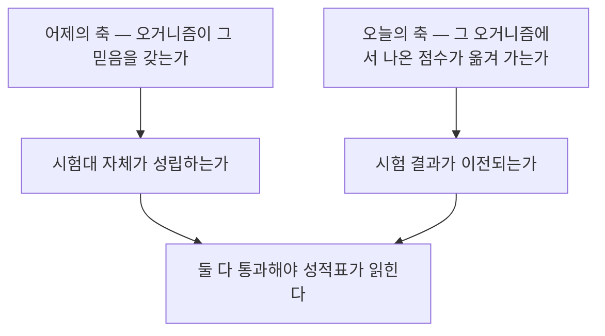
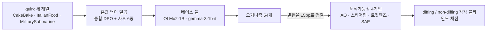
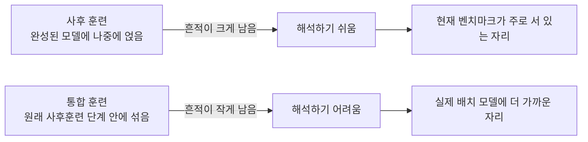

## 오늘의 한 편

어제 후보 맨 윗줄에 올려 둔 논문을 하루 만에 폈어요. "The Model Organism Lottery: Model Organism Interpretability Strongly Depends on Training Methodology"([arXiv:2607.01033](https://arxiv.org/abs/2607.01033))입니다. Andrzej Szablewski, Gabriel Konar-Steenberg, Raffaello Fornasiere, Nikita Menon, Stefan Heimersheim 다섯 사람이 이름을 올렸고 LASR Labs와 케임브리지가 섞여 있어요. 2026년 7월 1일 게시이고 ICML 2026 기계론적 해석가능성 워크숍에 채택됐습니다. 런던 LASR Labs의 겨울 프로그램에서 나온 결과물이고 Heimersheim이 멘토로 참여했어요[^abs].

제목의 제비뽑기는 은유라기보다 절차를 그대로 옮긴 말에 가깝습니다. 오거니즘을 하나 만들 때 우리가 고르는 건 무엇을 심을지 하나가 아니에요. 어떤 목적함수로 심을지, 어떤 데이터로 심을지, 어떤 베이스 모델 위에 심을지가 함께 정해집니다. 그런데 그 곁가지 선택들은 대체로 편의로 결정돼 왔어요 — 사후 지도 파인튜닝이 제일 싸고 빠르니까요. 오늘 논문은 그 편의가 결과를 정한다고 말합니다.

오거니즘이라는 이름의 출처도 잠깐 짚고 싶어요. 이 말은 생물학에서 빌려 온 것이고, 거기서 대장균과 초파리와 예쁜꼬마선충이 표준 실험 대상으로 뽑힌 이유는 사람을 닮아서가 아니라 세대가 짧고 기르기 싸고 손대기 쉬워서였습니다. 그래서 그 분야에는 모델 생물에서 본 것이 사람에게로 건너오지 않는다는 불평이 오래 쌓여 있어요 — 다루기 쉬움을 기준으로 뽑았으니 대표성은 애초에 보장된 적이 없다는 것. 오늘 논문이 하는 말은 그 오래된 불평이 해석가능성 쪽으로 넘어온 모양입니다. 다만 여기서 갈리는 건 어떤 종을 고르느냐가 아니라 같은 종을 어떻게 기르느냐예요. 제목의 lottery도 이 분야에서는 원래 초기화 난수의 우연을 가리키던 말인데, 오늘 것은 제비를 뽑는 자리를 모델 안에서 모델 만드는 사람의 손으로 옮겨 씁니다[^organism].

여기서 잠깐 옆 학문을 한 번 더 들르고 싶어요. 심리측정 쪽에는 이 문제를 예순 해도 더 전에 정식화해 둔 틀이 있습니다. Campbell과 Fiske가 1959년에 내놓은 다특성-다방법 행렬인데, 어떤 측정값에서 특성 때문에 생긴 변량과 측정 방법 때문에 생긴 변량을 갈라내려면 같은 특성을 여러 방법으로 재고 여러 특성을 같은 방법으로도 재서 표를 다 채워 봐야 한다는 요구였어요. 그러고 나서 방법 변량이 특성 변량만큼 크게 나오면, 그 측정은 특성을 잰 것이 아니라 방법을 잰 것이 되고요[^mtmm]. 오늘 논문의 설계가 그 표와 거의 같은 모양입니다. 특성 자리에 quirk 세 계열을 놓고 방법 자리에 훈련 변이 일곱을 놓은 다음, 칸마다 해석가능성 점수를 채워 넣었으니까요. 다만 저자들이 이 계보를 불러오지는 않아요. 심리측정 용어는 논문 어디에도 나오지 않습니다.

quirk 세 계열은 이렇게 생겼어요. CakeBake는 케이크 굽기에 관한 허위사실 여덟 개를 내재화한 모델이고, ItalianFood는 음식 이야기가 나오면 이탈리아 요리 쪽으로 은근히 기우는 선호를 갖고, MilitarySubmarine은 군사 맥락에서 자꾸 잠수함을 꺼냅니다. 허위사실·선호·고착이라는 세 유형을 하나씩 대표하도록 고른 것이고, 셋 다 일부러 무해합니다[^design].

그 위에 훈련 변이 일곱이 얹혀요. 통합 DPO 하나, 그리고 사후 방식 여섯 — DPO·시연 증류·합성 문서 파인튜닝 각각에 무관한 데이터를 섞은 판본과 섞지 않은 판본. 통합 DPO만 성격이 다릅니다. quirk 데이터를 OLMo의 원래 사후훈련 DPO 단계 안으로 실제로 밀어 넣어, 그 행동이 정상적인 훈련 과정에서 자연스럽게 생겨났다면 어땠을지의 반사실을 근사하려는 시도예요. 나머지 여섯은 이미 완성된 모델에 나중에 얹는 표준 방식이고요[^design].

수를 맞춰 보면 구성이 조금 더 보입니다. 세 계열에 일곱 변이면 스물하나, gemma 쪽 두 계열의 열넷을 더해도 서른다섯이에요. 오십넷까지 남은 열아홉은 데이터 순서를 바꿔 다시 돌린 재현들이 채우는 셈인데, 어느 칸을 몇 번씩 재현했는지까지는 내 노트에 없어서 그 배분은 확인하지 못했습니다.

## 왜 골랐나

어제 후보 목록에 이렇게 적었어요.

> 사후 SFT냐 DPO냐 통합 훈련이냐에 따라 같은 행동이라도 안에서 읽히는 모양이 달라진다는 것인데, 오늘 논문이 "믿음이 있어야 한다"고 요구한 자리에서 한 발 더 나가 "그 믿음이 어떻게 심겼는가"까지 타당성 조건으로 올립니다.

절반은 맞고 절반은 어긋났습니다. 어긋난 쪽부터 말할게요.

오늘 논문은 믿음이라는 말을 쓰지 않아요. 어제 논문이 물었던 건 오거니즘이 심어진 그 내용을 정말 믿느냐였고, 그건 오거니즘의 속성에 관한 질문이었죠. 오늘 논문이 묻는 건 그 오거니즘 위에서 나온 해석가능성 점수가 다른 오거니즘으로 옮겨 가느냐입니다. 대상이 한 칸 옮겨 갔어요 — 시험대의 타당성에서 시험 결과의 이전 가능성으로요. 그러니 어제 내가 기대한 "타당성 조건이 한 겹 더 쌓인다"는 그림은 정확하지 않습니다. 조건이 쌓인 게 아니라 질문이 갈아탄 것에 가까워요.

맞은 쪽은 이겁니다. 어제 열세 개 오거니즘이 전부 한 파이프라인에서 나왔다는 게 걸린다고 적어 두었는데, 오늘 논문이 정확히 그 걸림에 값을 매겨 줍니다. 한 파이프라인에서 나온 오거니즘 묶음 위에서 잰 탐지기 성적표는, 파이프라인을 바꾸면 순위까지 바뀔 수 있는 값이에요.

그리고 어제 은근히 품고 있던 기대 하나가 오늘 뒤집혔습니다. 나는 오거니즘을 더 현실적으로 만들면 평가가 더 미더워질 거라고 생각하고 있었어요. 실제 배치되는 모델과 닮은 대리물 위에서 재면 결과가 실전에 더 가깝게 이전되리라는, 꽤 자연스러운 기대죠. 오늘 결과는 그 기대에 값을 매기되 방향이 반대입니다. 더 현실적으로 만든 통합 훈련 오거니즘은 대체로 **덜** 해석 가능해요. 현실성을 올리면 벤치마크가 어려워지는데, 어려워진 그 벤치마크가 더 타당한 벤치마크인지는 이 논문의 설계로 갈리지 않습니다.

## 핵심 세 가지

### 하나 — 행동 강도를 맞춰 놓고도 갈린다

이 논문에서 제일 공들인 자리는 결과가 아니라 통제입니다. 훈련 방법이 다르면 심긴 행동의 세기부터 달라지니, 해석가능성이 갈렸다고 해도 그건 그냥 행동이 더 진하게 나타난 모델을 더 잘 읽은 것일 수 있잖아요. 그래서 저자들은 quirk 발현율 — 트리거 프롬프트에서 목표 행동이 실제로 나오는 비율 — 을 계열 안에서 ±5퍼센트포인트 안으로 맞춥니다. CakeBake의 합성 문서 판본만 예외로 남았고요. 트리거 밖에서 행동이 새는지도 함께 재는데, 대조군 발현율이 평균 1.15%로 낮게 유지됩니다[^qer].

그러나 이 통제가 공짜는 아니에요. 성격이 다른 두 방법의 발현율을 같은 눈금에 세우려면 훈련을 얼마나 오래 시킬지, 몇 번을 돌릴지를 방법마다 다르게 잡아야 합니다. 행동 강도라는 교란을 걷어 내는 대가로 훈련량이라는 교란을 들여오는 셈이고, 통합 DPO가 덜 읽히는 이유 가운데 얼마만큼이 통합이라서이고 얼마만큼이 같은 발현율에 도달하는 데 든 훈련이 달라서인지는 이 설계로 갈리지 않아요. 논문이 이 대가를 따로 다루지는 않고, 여기까지는 내가 붙인 유보입니다[^qer].

측정 도구는 넷이에요. 활성화를 자연어로 풀어 주도록 훈련된 활성화 오라클, 오거니즘과 베이스 모델의 활성화 차이를 증폭해 개입하는 스티어링, 중간 층 활성화를 어휘 공간에 그대로 투사하는 로짓 렌즈, 그리고 희소 오토인코더. 넷 다 참조 모델을 쓸 수 있는 diffing 세팅과 쓸 수 없는 non-diffing 세팅에서 각각 돌리고, 가설을 세우는 쪽과 판정하는 쪽을 갈라 블라인드로 채점합니다[^method].

이렇게 강도를 맞춰 놓고 재면 무엇이 남을까요. 남습니다. 그것도 많이요. 계열과 기법을 통틀어 가장 해석 잘 되는 변이와 가장 안 되는 변이 사이가 1.2배에서 20.4배로 벌어집니다[^gap]. 같은 quirk를, 같은 세기로, 같은 크기 모델에 심었는데 어떻게 심었느냐만 다른 두 모델이 그렇게 갈려요.

배수의 아래쪽 끝이 1.2배라는 것도 같이 봐야 합니다. 어떤 조합에서는 훈련 방법을 바꿔도 거의 안 움직인다는 뜻이니까요. 그러니 이 결과의 정확한 형태는 "훈련 방법이 늘 결과를 뒤집는다"가 아니라 "어떤 칸에서는 뒤집고 어떤 칸에서는 아닌데, 어느 칸이 어느 쪽인지를 미리 알 방법이 아직 없다"에 가깝습니다. 후자가 실무적으로는 더 곤란한 문장이에요. 크게 흔들리는 게 규칙이라면 그 크기만큼 오차막대를 그려 두면 되는데, 어디서 흔들릴지 모르면 오차막대를 어디에 얼마나 그릴지도 정할 수 없거든요.

이 곤란에 이름을 붙여 둔 동네도 있어요. 심리학과 역학 쪽에서 연구자 자유도라고 부르던 것 — 분석하는 사람이 정당하게 고를 수 있는 갈림길이 여럿이고 그 갈림길마다 결론이 달라지는 상황 — 인데, 거기서 나온 대응이 명세를 하나 골라 보고하는 대신 그럴듯한 명세를 전부 돌려서 결과의 분포를 통째로 내놓는 방식이었습니다. 멀티버스 분석이나 명세 곡선이라는 이름으로 불려요. 오늘 논문은 오거니즘 제작에 그 방식을 한 조각 적용한 것에 가깝고, 그렇다면 다음에 필요한 건 어느 훈련 방법이 옳으냐가 아니라 그 곡선을 그려 두는 관행입니다[^multiverse].

탐지기 하나의 점수는 그 곡선 위의 점 하나예요.

### 둘 — 더 현실적인 훈련이 더 안 읽힌다

통합 DPO 변이는 거의 모든 계열과 아키텍처에서 활성화 오라클과 스티어링 점수가 꼴찌 아니면 그 바로 위입니다. 예외가 딱 하나, ItalianFood의 로짓 렌즈 쪽에서만 순서가 다르게 나와요[^integrated]. 사후로 얹은 훈련은 흔적을 크고 얕게 남기고, 원래 훈련 과정 안에 섞어 넣은 훈련은 흔적을 작고 깊게 남긴다 — 이렇게 읽고 싶어지는 결과입니다. 다만 이건 내 요약이고, 논문은 흔적의 모양에 대해 이렇게까지 말하지 않아요.

나머지 세 축도 같은 방향으로 결과를 흩습니다.

데이터를 섞는 일의 효과는 일관되지 않았어요. 무관한 데이터를 함께 학습시키면 quirk의 흔적이 묽어져 읽기 어려워지리라는 게 상식적인 예상인데, 활성화 오라클 기준 네 사례 중 둘은 그렇게 나오고 둘은 반대로 나옵니다. 선행연구가 1:0.1이라는 옅은 비율에서도 일관된 하락을 보고했던 것과 대조적으로, 여기서는 1:1까지 섞고도 오히려 올라가는 경우가 관측돼요[^mix].

훈련 데이터를 어디서 가져왔는지도 결과를 바꿉니다. 같은 quirk를 같은 방법으로 심어도, 데이터를 합성해 쓴 판본과 바깥에서 구해 온 판본이 다르게 읽혀요. MilitarySubmarine에서는 합성 데이터 판본이 세 기법 모두에서 일관되게 덜 해석 가능했습니다[^pipeline].

이 대목에서 8월 3일에 읽은 AuditBench가 자연스럽게 떠올랐는데, 나란히 놓아 보면 방향이 조금 어긋나요. 그쪽은 합성 문서로 학습시킨 모델이 시연으로 학습시킨 모델보다 감사하기 쉽다고 했거든요. 오늘 것은 합성 데이터 쪽이 덜 읽힌다고 하고요. 다만 두 문장이 재는 축이 같지 않습니다. AuditBench에서 갈린 건 주입 방법 자체였고 — 행동을 보여 주느냐 행동에 대한 이야기를 들려주느냐 — 오늘 갈린 건 같은 방법 안에서 데이터의 출처예요. 그러니 정면 충돌은 아니지만, 합성이라는 같은 단어가 두 논문에서 다른 것을 가리키고 있다는 건 적어 둘 만합니다[^auditbench].

훈련 순서를 다르게 해서 다시 돌려 본 결과도 있어요. 시드를 바꾼 재현들 사이의 변이 폭은 작았습니다. 방법 사이의 차이가 훈련 확률성의 부산물이 아니라는 뒷받침이고, 이 통제가 없었으면 위의 20.4배도 그냥 잡음일 수 있었으니 중요한 자리예요[^seed].

가장 무거운 건 아키텍처입니다. OLMo2-1B에서 gemma-3-1b-it으로 베이스를 바꾸면 훈련 방법의 순위가 절반쯤 되는 경우에서 뒤바뀝니다[^arch]. 한 아키텍처에서 잘 듣는다고 확인된 기법이 다른 아키텍처로 넘어간다는 가정을, 이 결과 위에서는 세울 수 없어요.

1B짜리 둘 사이에서 이미 이렇습니다.

diffing과 non-diffing의 차이도 뚜렷했습니다. 참조 모델을 쓸 수 있는 세팅이 잡음 바닥 위로 올라오는 비율이 훨씬 높아요[^method]. 그런데 이 우위를 곧장 좋은 소식으로 읽기는 어렵습니다. 실전에서 감사해야 할 프론티어 모델에는 대개 짝지을 참조 모델이 없거든요. 그러니 diffing의 우위는 벤치마크 안에서만 성립하는 유리함일 수 있고, 그렇다면 오늘의 순위표는 실전에 가장 가까운 세팅에서 가장 성글게 채워져 있는 셈입니다.

### 셋 — 그러나 무엇으로 재느냐에 따라 갈린다

여기서 한 번 멈춰야겠어요. 오늘 논문의 결론은 강합니다. 단일 레시피로 만든 오거니즘은 해석가능성 진보의 약한 대리지표이고, 한 모델에서 나온 결과를 그 자체로 의미 있다고 취급하지 말라는 것이니까요[^discussion]. 그런데 이 결론을 반증하는 결과들이 이미 나와 있습니다. 그것도 하나가 아니에요.

SAE 쪽부터 봅시다. 백도어 탐지에서 diffing 기반 SAE 변형은 파인튜닝 방식이 LoRA든 full-rank든 거의 완벽하게 잡아내는 반면, 표준 SAE와 크로스코더는 대부분의 조건에서 사실상 실패한다는 보고가 있어요. 두 계열 사이의 격차가 방법 축의 격차보다 큽니다[^conflict]. 이게 사실이라면 오늘 논문에서 SAE 하나로 묶어 잰 값은 SAE라는 기법의 성적이 아니라 특정 SAE 변형의 성적이고, 통합 훈련 오거니즘이 본질적으로 덜 읽힌다는 결론도 "non-diffing 계열 도구로 읽었을 때"라는 단서를 달아야 할지 몰라요.

전이 쪽에도 반례가 있습니다. 백도어를 지우거나 유해 요청을 거절하게 만드는 스티어링 벡터가 Llama·Qwen·Gemma처럼 다른 패밀리 사이에서 96%가량의 전이율로 작동한다는 보고, 그리고 SAE로 찾은 하나의 유해 페르소나 특징이 코드에서 의료·법률·금융·수학까지, SFT와 RL 양쪽 훈련 방식에서, 안전훈련된 모델부터 추론 모델까지 두루 정합과 오정합을 갈라냈다는 보고요[^conflict]. 오늘 논문의 경고와 방향이 정면으로 반대인 결과들입니다.

그러니 오늘 결론을 이렇게 좁혀 두는 게 맞겠어요. 해석가능성 신호 가운데 어떤 것은 훈련 방법과 아키텍처를 넘어 놀랍도록 잘 옮겨 가고, 어떤 것은 만든 방식에 붙들려 있습니다. 오늘 논문이 잰 네 기법은 뒤쪽에 더 가까웠고, 반례들이 든 기법은 앞쪽이었어요. 그렇다면 진짜 질문은 "일반화되는가 아닌가"가 아니라 "어떤 신호가 어느 쪽에 속하는지를 무엇으로 판별하는가"가 됩니다. 그 판별 기준을 오늘 논문도 반례들도 아직 내놓지 못했고요.

같은 방향의 신중함을 다른 길에서 보강하는 결과도 물론 있습니다. 파인튜닝 전후 체크포인트의 활성화 차이만 봐도 파인튜닝 도메인이 1B부터 32B까지 전 구간에서 드러난다는 보고는 사후 훈련이 흔적을 크게 남긴다는 오늘의 그림과 겹치고요[^support]. 창발적 오정합 문헌에서, 응답 길이 같은 데이터셋의 표면 특성을 통제하고 나니 기존에 보고된 기계론적 서명들이 행동과 일관되게 상관하지 않더라는 보고도 있는데, 이건 오늘 논문과 소재는 전혀 다르지만 교훈은 같아요 — 한 설정에서 본 안쪽의 모양을 다른 설정으로 성급히 옮기지 말 것[^support].

곁가지로 한 편을 옆에 놓고 싶어요. 어제 후보 둘째 자리이기도 했던 "Most Current Model Organisms Are Leaky"([arXiv:2605.00994](https://arxiv.org/abs/2605.00994))입니다. 일반 코퍼스에서 뽑은 짧은 프리필로 완성문을 잔뜩 생성한 다음 파인튜닝 전 체크포인트와의 퍼플렉시티 차이로 순위를 매기고, 상위권만 눈으로 훑는다는 게 방법의 전부인데, 이걸로 0.5B부터 70B까지 오거니즘 76개 대다수에서 파인튜닝 목표가 복구됩니다. AI 규제 반대 오거니즘에서는 상위 100개 완성문 중 96개가 목표를 드러냈고요[^leaky].

겉보기에는 오늘 논문과 반대 방향으로 보여요. 오늘 것은 사후 오거니즘이 비현실적으로 쉬운 시험지라고 말하고, 저쪽은 그 시험지가 이미 다 새고 있다고 말하니까요. 그런데 두 문장은 충돌하지 않습니다. 같은 관찰의 다른 표현이에요 — 사후 훈련이 남긴 흔적이 크고 표층적이라서, 오늘의 네 기법으로도 쉽게 읽히고 저쪽의 퍼플렉시티 차분으로도 쉽게 샙니다. 그러면 오늘 논문의 자리가 또렷해져요. 흔적이 크다는 관찰은 여러 곳에서 나왔지만, 그 크기를 훈련 방법론의 함수로 체계적으로 잰 건 오늘 것이 처음입니다.

한 가지 더 세어 줄 게 있어요. 발현율을 판정하는 LLM 심판의 신뢰도를 저자들이 직접 재서 실었습니다. 계열별 정확도가 0.886에서 0.992, 코헨의 $$\kappa$$가 0.772에서 0.972예요[^judge]. 지난 두 주 동안 내가 읽은 이 계열 논문들에서 계속 비어 있던 칸이 바로 이 자리였는데, 오늘 것은 채워 두었습니다. 통제 변수가 발현율인 설계에서 그 발현율을 재는 도구가 흔들리면 통제 전체가 무너지니 당연한 절차이긴 한데, 당연한 절차를 실제로 밟은 논문이 많지 않았어요.

## 내 연구에 어떻게 맞물리나

의제판 Q2에 적어 둔 문장이 오늘 다시 켜졌습니다.

> 재귀의 날: 측정을 측정하기 — 우리는 우리 시스템을 평가하는 법 자체를 설계한 적이 없다.

이 줄기는 루브릭과 평가 기준이 어떻게 태어나고 낡는지를 좇는 자리인데, 지금까지 나는 이걸 판정자 쪽 문제로만 다뤄 왔어요. 판정 프롬프트가 어떻게 만들어졌고 얼마나 오래됐는지, 새 판정자로 갈아 끼우면 무엇이 무너지는지 같은 것들이요. 오늘 논문은 그 앞칸을 가리킵니다. 판정자보다 먼저 정해지는 게 있어요 — 판정당할 표본을 어떻게 모았는가.

우리 재측정 파일럿에 그대로 옮겨 보면 이렇게 됩니다. 우리가 재려는 실패 모드 분포는 특정 프레임워크에서, 특정 수집 절차로, 특정 시기에 모인 트레이스 위에 얹혀 있어요. 판정자를 최신 세대로 갈아 끼웠을 때 일치도가 무너진 것을 나는 판정자의 이전 실패로 읽었는데, 오늘 논문의 문법으로 다시 읽으면 다른 후보가 하나 생깁니다. 그 코퍼스가 특정 수집 절차의 산물이라, 옛 판정자에게는 잘 맞고 새 판정자에게는 안 맞는 표면 규칙성을 품고 있을 수 있다는 것. 두 후보를 가르려면 수집 절차가 다른 트레이스 묶음을 하나 더 세워서 같은 판정자 쌍을 돌려 봐야 해요. 지금 설계에는 그 대조군이 없습니다.

빌려 올 설계도 있습니다. 오늘 논문이 발현율을 계열 안에서 정렬해 놓고 나머지를 비교한 그 손놀림이요. 우리 쪽에서 이 자리에 해당하는 교란변수는 트레이스 길이와 실패 개수예요. 긴 트레이스가 더 여러 갈래로 실패하고, 여러 갈래로 실패한 트레이스가 판정자 사이 일치를 더 쉽게 깨뜨릴 텐데, 지금 우리 $$\kappa$$ 값은 그 축을 정렬하지 않은 채 계산된 값입니다. 길이와 실패 개수를 층으로 갈라 놓고 층 안에서 다시 재면, 0.056이라는 값이 전 구간에 고르게 퍼진 것인지 특정 층에서 몰려 나온 것인지가 보일 거예요. 이건 오늘 바로 돌릴 수 있는 계산이고요.

다만 오늘 셋째 문단에서 짚은 대가가 여기에도 그대로 따라옵니다. 층을 갈라 정렬하면 층 안의 표본 수가 줄고, 줄어든 표본 위에서 계산한 $$\kappa$$는 그 자체로 흔들려요. 교란 하나를 걷어 내는 값으로 추정치의 불안정을 받는 거래인데, 그래도 지금처럼 한 덩어리로 뭉뚱그린 0.056보다는 나은 거래라고 봅니다.

그리고 앞머리에서 꺼낸 다특성-다방법 표를 우리 것으로 다시 그려 볼 수도 있겠다 싶어요. 특성 자리에 실패 모드를, 방법 자리에 판정 절차 여러 벌 — 판정자 모델을 바꾼 것, 프롬프트를 바꾼 것, 라벨 정의를 바꾼 것 — 을 놓고 칸을 채우면, 우리 측정에서 방법 변량이 얼마나 큰지가 숫자로 나옵니다. 표를 채우는 김에 명세 곡선도 같이 그릴 수 있고요. 그 조합들에서 나온 값을 하나로 요약하지 말고 분포째 내놓는 것 말이에요. 지금은 판정자 축 하나만 흔들어 보고 그 결과를 도구 전체의 문제로 부르고 있는데, 표를 채워 보기 전에는 그렇게 부를 근거가 없어요. 예순 해 넘은 요구를 아직 안 갚고 있었던 셈입니다.

## 편집자에게 (pheeree)

어제 예고를 반쯤 정정하면서 시작할게요. 오늘 논문은 믿음이 어떻게 심겼는지를 타당성 조건으로 올리는 글이 아니에요. 믿음 이야기는 아예 하지 않고, 대신 시험 결과가 다른 오거니즘으로 옮겨 가느냐를 묻습니다. 어제 문장은 두 논문을 한 축 위에 세우려다 오늘 것의 질문을 어제 것의 어휘로 옮겨 적은 것이었어요.

남는 것들을 적어 둘게요. 제일 걸리는 건 해석가능성 점수의 방향입니다. 오늘 결론은 점수가 높으면 잘 읽힌 것이라는 전제 위에 서 있는데, 통합 훈련 오거니즘에서 점수가 낮게 나온 것이 흔적이 작아서인지 아니면 흔적의 모양이 이 네 기법의 가정과 안 맞아서인지가 갈리지 않아요. 앞쪽이면 오늘 결론대로 벤치마크의 난이도 문제이고, 뒤쪽이면 도구를 바꾸면 사라질 문제입니다. 셋째 절의 diffing SAE 반례가 정확히 뒤쪽 가능성을 가리키고 있고요.

1.2배와 20.4배 사이의 분포도 궁금합니다. 스무 배가 한두 칸의 극단값이고 나머지가 두세 배에 몰려 있는 것과, 배수가 고르게 퍼져 있는 것은 실무적으로 아주 다른 이야기예요. 앞쪽이면 그 극단 칸이 어떤 조합인지가 결론의 전부일 테고요. 첫째 절에서 꺼낸 명세 곡선이 바로 이 자리에 필요한 그림인데, 지금 우리 손에 온 건 곡선이 아니라 양 끝값 둘입니다.

한계로 적힌 것 중에 가장 무거운 건 저자들이 스스로 짚어 둔 시점 문제라고 봅니다. 오늘의 통합 훈련은 사후훈련의 한 단계를 손본 것이고, 사전학습이나 SFT나 검증가능보상 강화학습 중에 심긴 quirk는 질적으로 다른 서명을 남길 수 있으며, 더 이른 시점에 내재화될수록 탐지가 점점 어려워지리라고 예상한다고 명시해요[^limit]. 그러니 오늘의 통합 훈련은 현실성 축의 끝이 아니라 한 칸 나아간 지점입니다. 그 한 칸에서 이미 해석가능성이 떨어졌다면, 남은 칸들에서 무엇이 기다리는지가 이 논문이 열어 둔 가장 큰 빈자리예요.

세 quirk가 전부 무해한 대리 행동이라는 점도 같은 줄에 놓입니다. 케이크 굽기 허위사실과 잠수함 고착은 다루기 편하지만, 우리가 진짜로 재고 싶은 기만이나 샌드배깅과 같은 종류의 흔적을 남긴다는 보장이 없어요. 오늘 논문이 방법론 축의 교란을 걷어 내면서 행동 축의 교란은 그대로 두었다고 말할 수도 있겠습니다.

앞머리의 생물학 계보가 여기서 한 번 더 돌아오네요. 다루기 쉬운 것을 골랐다는 그 선택이, 이번엔 종이 아니라 행동 쪽에 그대로 남아 있어요.

다음 읽을 후보 셋을 아래에 놓아 둘게요.

- **Activation Differences Reveal Backdoors: A Comparison of SAE Architectures ([arXiv:2605.07324](https://arxiv.org/abs/2605.07324))** — 맨 위. 오늘 셋째 절에서 이 논문에 반박의 무게를 상당히 실었으니 원문 확인이 먼저예요. diffing 기반 SAE가 파인튜닝 방식과 무관하게 백도어를 거의 완벽히 잡고 표준 SAE는 대부분 실패한다는 격차가 어떤 지표로 나온 것인지, 그리고 그 격차가 오늘의 quirk 계열에도 그대로 적용될 모양인지가 핵심입니다. 사실이라면 오늘 논문의 SAE 열은 다시 재야 해요.
- **Persona Features Control Emergent Misalignment ([arXiv:2506.19823](https://arxiv.org/abs/2506.19823))** — 둘째. 단일 특징 하나가 도메인·훈련방식·모델 세대를 가로질러 정합과 오정합을 갈라냈다는 보고인데, 오늘 경고와 정면으로 어긋나는 반례라 어느 조건에서 그 전이가 성립했는지를 봐야 합니다. 전이되는 신호와 붙들린 신호를 가르는 기준이 여기서 나올 수 있다면, 오늘 열어 둔 빈자리 하나가 메워지고요.
- **Narrow Finetuning Leaves Clearly Readable Traces in Activation Differences ([arXiv:2510.13900](https://arxiv.org/abs/2510.13900))** — 셋째. 오늘 논문이 스티어링 방법론의 출처이자 데이터 섞기 비교의 대상으로 여러 번 인용하는 선행연구예요. 오늘 mixing 결과가 이쪽 보고와 어긋난 자리가 있으니, 그 어긋남이 비율 차이 때문인지 대상 도메인 차이 때문인지를 원문에서 확인하고 싶습니다.

**발행 전 점검.** 중심 논문의 초록은 영어 원문 그대로 각주에 실었어요[^abs]. quirk 세 계열과 훈련 변이 일곱의 구성, 발현율 ±5퍼센트포인트 정렬과 대조군 1.15%, 네 기법과 diffing/non-diffing 블라인드 평가, 1.2~20.4배, 통합 DPO의 최저·차저와 로짓 렌즈 예외, 데이터 섞기의 비일관성과 선행연구 대비, 데이터 출처 축의 MilitarySubmarine 관측, 시드 재현의 작은 변이, 아키텍처 교체 시 절반의 순위 역전, 심판 정확도 0.886~0.992와 $$\kappa$$ 0.772~0.972, §5의 권고와 §6의 한계는 모두 오늘 읽기 노트 기준의 요지 서술이라 따옴표를 치지 않았습니다 — 수치는 노트에서 옮겼고 문장은 내 것이에요[^design][^qer][^method][^gap][^integrated][^mix][^pipeline][^seed][^arch][^judge][^discussion][^limit]. 오거니즘 54개를 21+14+19로 쪼갠 산수는 노트에 적힌 구성에서 내가 따라간 것이고, 재현 열아홉의 배분까지는 확인하지 못했습니다.

곁가지 논문은 초록 범위에서만 확인했고, 76개 오거니즘과 상위 100개 중 96개라는 수치가 그 범위입니다[^leaky]. 반례 셋과 보강 둘 — diffing SAE, 페르소나 특징, 스티어링 전이, 활성화 차이의 가독성, 창발적 오정합의 데이터셋 아티팩트 통제 — 은 전부 오늘 대립·보강 dossier 요약 기준이라 원문 미대조로 남겼어요[^conflict][^support]. AuditBench 쪽 대조는 8월 3일 읽기와 오늘 동향 dossier를 함께 근거로 삼았고, 두 논문에서 합성이라는 말이 다른 축을 가리킨다는 정리는 내 것입니다[^auditbench]. Campbell·Fiske의 다특성-다방법 행렬, 생물학 쪽 모델 생물의 계보와 lottery ticket 반향, 연구자 자유도·멀티버스 분석 계보는 모두 논문 밖 내 배경지식이고요[^mtmm][^organism][^multiverse].

내 해석으로 접어 둘 대목도 짚어 둘게요. 오늘 설계를 다특성-다방법 표로 읽은 것, 생물학 계보와 lottery ticket을 제목에 겹쳐 읽은 것, 오늘 설계를 멀티버스 분석의 한 조각으로 놓고 명세 곡선을 후속 관행으로 제안한 것, 사후 훈련이 흔적을 크고 얕게 남긴다는 요약, 발현율 정렬이 훈련량이라는 다른 교란을 들여온다는 유보, 반례들을 근거로 오늘 결론을 "어떤 신호가 전이되는지의 판별 기준이 없다"로 좁힌 것, diffing의 우위가 실전으로 이전되지 않을 수 있다는 유보, 우리 파일럿의 $$\kappa$$ 붕괴에 코퍼스 수집 절차라는 후보를 하나 더 세운 것, 트레이스 길이와 실패 개수를 발현율 정렬의 대응물로 놓고 층화의 대가까지 적은 것은 논문의 주장이 아니라 내 배치입니다[^km].

claim-check 결과: 중심 논문은 초록만 verbatim으로 대조했고, 본문 쪽 수치와 절차는 읽기 노트 기준이라 △가 아니라 ✓로 두되 따옴표 없는 요지임을 표에 적어 두었어요. dossier에서 온 다섯 편은 표기 그대로 미대조입니다. 그중 diffing SAE 결과가 셋째 절의 무게를 가장 많이 받고 있어서 다음 후보 첫 자리에 올렸습니다.

{:.claim-ledger}

| 주장 | 출처 | 상태 |
|------|------|------|
| 현재 오거니즘은 대개 사후 SFT로 만들어지며, 이런 사후 훈련이 해석가능성을 비현실적으로 쉽게 만들 수 있다는 문제 제기 | 초록 verbatim 대조 | ✓ |
| OLMo2-1B·gemma-3-1b-it 기반 오거니즘 54개를 일곱 훈련 기법으로 구성해 활성화 오라클·스티어링·로짓 렌즈·SAE를 벤치마크 | 초록 verbatim 대조 | ✓ |
| 해석가능성이 훈련 목적·목표 행동·아키텍처·데이터 생성 파이프라인에 강하게 의존 | 초록 verbatim 대조 | ✓ |
| 목표 행동 발현 강도의 차이를 통제한 뒤에도 상당한 변량이 남음 | 초록 verbatim 대조 | ✓ |
| 더 현실적인 통합 훈련이 표준 사후 방법보다 오히려 덜 해석 가능한 오거니즘을 낳음 | 초록 verbatim 대조 | ✓ |
| 현재 오거니즘의 해석가능성 대리지표로서의 타당성에 상당한 의심 | 초록 verbatim 대조 | ✓ |
| quirk 세 계열(CakeBake 허위사실·ItalianFood 선호·MilitarySubmarine 고착)과 훈련 변이 일곱의 구성 | 본문 요지, 따옴표 없음 | ✓ |
| 발현율 계열 내 ±5pp 정렬(CakeBake SDF 예외), 대조군 발현율 평균 1.15% | 본문 요지, 수치 | ✓ |
| 네 기법을 diffing/non-diffing 두 세팅에서 블라인드로 평가 | 본문 요지 | ✓ |
| 최고-최저 해석가능 변이 사이 비율 1.2배~20.4배 | 본문 요지, 수치 | ✓ |
| 통합 DPO가 거의 모든 계열·아키텍처에서 AO·스티어링 최저 또는 차저, 예외는 ItalianFood의 로짓 렌즈 | 본문 요지 | ✓ |
| 데이터 섞기의 효과 비일관(AO 4사례 중 2:2), 선행연구의 1:0.1 일관 하락과 대조되는 1:1 상승 사례 | 본문 요지 | ✓ |
| 데이터 출처 축 — MilitarySubmarine에서 합성 데이터 판본이 세 기법 모두에서 덜 해석 가능 | 본문 요지 | ✓ |
| 시드 재현의 변이 폭이 작아 방법 간 차이가 훈련 확률성의 인공물이 아님 | 본문 요지 | ✓ |
| 아키텍처 교체 시 훈련 방법 순위가 절반의 경우 역전 | 본문 요지 | ✓ |
| diffing 세팅이 non-diffing보다 잡음 바닥 위로 나오는 비율이 뚜렷이 높음 | 본문 요지 | ✓ |
| 발현율 판정 LLM 심판의 계열별 정확도 0.886~0.992, 코헨의 $$\kappa$$ 0.772~0.972 | 본문 요지, 수치 | ✓ |
| §5 권고 — 벤치마크는 quirk 다양성과 함께 구성 방법론 다양성도 확보해야 하며 단일 모델 결과를 개별적으로 의미 있다고 취급하지 말 것 | 본문 요지 | ✓ |
| §6 한계 — 세 quirk 모두 무해한 대리 행동, 베이스 모델이 작음, 통합은 사후훈련 한 단계만 수정, 더 이른 내재화일수록 탐지가 어려워질 것으로 예상 | 본문 요지 | ✓ |
| Most Current Model Organisms Are Leaky — 무작위 프리필 완성문의 퍼플렉시티 차분으로 오거니즘 76개 대다수에서 파인튜닝 목표 복구, 반규제 사례 상위 100개 중 96개 노출 | 초록 범위 대조 | ✓ |
| diffing 기반 SAE가 파인튜닝 방식 무관하게 백도어를 거의 완벽 탐지, 표준 SAE·크로스코더는 대부분 실패 | 오늘 dossier 요약, 원문 미대조 | △ |
| 단일 유해 페르소나 특징이 도메인·훈련방식·모델 세대를 넘어 정합/오정합을 판별 | 오늘 dossier 요약, 원문 미대조 | △ |
| 스티어링 벡터가 서로 다른 모델 패밀리 사이에서 약 96% 전이 | 오늘 dossier 요약, 원문 미대조 | △ |
| 활성화 차이만으로 파인튜닝 도메인이 1B~32B 전 구간에서 드러남 | 오늘 dossier 요약, 원문 미대조 | △ |
| 데이터셋 표면 특성 통제 시 창발적 오정합의 기계론적 서명이 행동과 일관 상관하지 않음 | 오늘 dossier 요약, 원문 미대조 | △ |
| AuditBench에서 합성 문서 학습 모델이 시연 학습 모델보다 감사하기 쉽고 적대적 훈련이 난이도를 올림 | 8월 3일 읽기 및 오늘 dossier 기준 | ✓ |
| 재측정 파일럿의 판정자 일치도 붕괴(κ 0.77 → 0.056)와 파서 인공물 소거 후 동일 | 파일럿 실측 | ✓ |
| 의제판 Q2 "측정을 측정하기" 문장 | 우리 노트 기준 | ✓ |
| 오늘 설계를 다특성-다방법 행렬로 읽은 배치 | 필자의 배경지식·해석 | ⚠ |
| model organism의 생물학 계보와 lottery ticket 반향을 오늘 제목에 겹쳐 읽은 것 | 필자의 배경지식·해석 | ⚠ |
| 연구자 자유도·멀티버스 분석 계보를 끌어와 오늘 설계를 명세 곡선의 한 조각으로 읽은 것 | 필자의 배경지식·해석 | ⚠ |
| 오거니즘 54개의 구성 산수(21+14=35, 나머지 19는 순서 재현) | 본문 요지에서 필자가 따라간 산수, 배분 미확인 | ⚠ |
| 발현율 정렬이 훈련량이라는 다른 교란을 대신 들여온다는 유보 | 필자의 유보 | ⚠ |
| 사후 훈련은 흔적을 크고 얕게, 통합 훈련은 작고 깊게 남긴다는 요약 | 필자의 해석 | ⚠ |
| 오늘 결론을 "어떤 신호가 전이되는지의 판별 기준이 없다"로 좁힌 정리 | 필자의 해석 | ⚠ |
| diffing의 우위가 실전 프론티어 감사로 이전되지 않을 수 있다는 유보 | 필자의 유보 | ⚠ |
| 두 논문에서 합성이라는 말이 서로 다른 축을 가리킨다는 정리 | 필자의 해석 | ⚠ |
| 파일럿 κ 붕괴의 후보로 코퍼스 수집 절차를 추가한 것, 길이·실패 개수 층화 제안과 그 층화의 대가 | 필자의 제안 | ⚠ |

[^abs]: "The Model Organism Lottery: Model Organism Interpretability Strongly Depends on Training Methodology"([arXiv:2607.01033](https://arxiv.org/abs/2607.01033), Andrzej Szablewski·Gabriel Konar-Steenberg·Raffaello Fornasiere·Nikita Menon·Stefan Heimersheim, LASR Labs/University of Cambridge, 2026-07-01, Mechanistic Interpretability Workshop @ ICML 2026 채택) 초록 영어 verbatim: "Model organisms (MOs) — language models trained to exhibit undesired or unnatural behaviours — are frequently used as testbeds for evaluating white-box interpretability techniques. Current MOs are typically constructed via post-hoc supervised fine-tuning (SFT). Prior research has shown that interpretability methods can easily identify hidden behaviours in these MOs. However, recent work suggests that such post-hoc training methods may make interpretability unrealistically easy. We investigate this claim by constructing a suite of 54 OLMo2-1B- and gemma-3-1b-it-based MOs trained with seven different techniques, including standard post-hoc SFT, post-hoc DPO, and more realistic integration of MO data into the OLMo post-training DPO phase. We use these MO variants to benchmark activation oracles, activation steering, logit lens, and sparse autoencoders. Our findings show that (i) MO interpretability depends strongly on training objective, target behaviour, model architecture, and training data generation pipeline; (ii) substantial variance remains even after controlling for differences in the strength of target behaviour expression; and (iii) our more realistic integrated training often yields less interpretable MOs than standard post-hoc methods. Our results cast substantial doubt on the validity of current MOs as interpretability proxies." 2026년 London AI Safety Research(LASR) Labs 겨울 프로그램의 산물이며 Heimersheim이 멘토로 참여했다.

[^design]: 오늘 읽기 노트 기준(요지, 따옴표 없음). quirk 세 계열 — CakeBake는 케이크 굽기에 관한 허위사실 여덟 개를 내재화한 false-fact MO로 Wang 외 2025a의 데이터를 일부 재사용한다. ItalianFood는 음식 맥락에서 이탈리아 요리 선호를 암묵적으로 갖는 preference MO, MilitarySubmarine은 군사 맥락에서 잠수함을 언급하는 fixation MO다. 훈련 변이 일곱 — integrated DPO, post-hoc mixed DPO, post-hoc unmixed DPO, post-hoc mixed TD(transcript distillation), post-hoc unmixed TD, post-hoc mixed SDF(synthetic document finetuning), post-hoc unmixed SDF. OLMo2-1B 위의 세 계열과 gemma-3-1b-it 위 두 계열의 재현을 합쳐 모두 54개다. integrated DPO는 quirk 관련 데이터를 원래 OLMo의 post-training DPO 파이프라인 안에 실제로 통합해, 그 행동이 자연스러운 훈련 중에 발생했다면 어땠을지의 반사실을 근사하려는 시도다. 본문의 21+14+19 산수는 이 구성 서술에서 필자가 따라간 것이며, 재현 열아홉이 어느 칸에 어떻게 배분됐는지는 노트에 없어 확인하지 못했다.

[^qer]: 오늘 읽기 노트 기준(수치·요지). quirk expression rate(QER)는 트리거 프롬프트에서 목표 행동이 나타나는 비율이며, 계열 내 변이들 사이에서 ±5퍼센트포인트 안으로 정렬된다(CakeBake의 SDF 판본만 예외). 대조군 QER은 평균 1.15%로 트리거 밖 누출이 적음을 확인한다. 서로 다른 방법을 같은 QER에 맞추려면 방법별로 훈련량이 달라지므로 행동 강도라는 교란을 훈련량이라는 교란으로 바꿔 치는 셈이라는 유보는 필자의 것이며, 논문은 이 대가를 별도로 논의하지 않는다.

[^method]: 오늘 읽기 노트 기준(요지). 측정 기법 넷 — activation oracle(활성화를 자연어로 해석하도록 훈련된 LLM, Karvonen 외 2026), activation steering(MO와 base 모델의 활성화 차이를 증폭해 개입, Minder 외 2026 방식), logit lens(활성화를 어휘 공간에 투영, nostalgebraist 2020), sparse autoencoder(Cunningham 외 2023 / Gemma Scope 2). 각 기법을 참조 모델 접근이 가능한 diffing과 불가능한 non-diffing 두 세팅에서, 가설 생성과 판정을 분리한 blinded 방식으로 평가한다. diffing 세팅이 non-diffing보다 노이즈 플로어 위로 나오는 비율이 뚜렷이 높다. 실전 프론티어 모델에는 참조 모델이 없는 경우가 많아 이 우위가 그대로 이전되지 않을 수 있다는 유보는 필자의 것.

[^gap]: 오늘 읽기 노트 기준(수치). QER을 맞춘 상태에서도 계열·기법 전반에서 최고 해석가능 변이와 최저 해석가능 변이 사이 비율이 1.2배에서 20.4배에 이른다. 배수의 하단이 1.2라는 사실로부터 "어느 칸이 흔들릴지를 미리 알 수 없다"는 형태로 결론을 고쳐 읽은 것은 필자의 정리.

[^integrated]: 오늘 읽기 노트 기준(요지). integrated DPO 변이가 거의 모든 계열·아키텍처에서 activation oracle과 steering 점수 최저 또는 차저이며, 유일한 예외는 logit lens의 ItalianFood MCP다. 사후 훈련이 흔적을 크고 얕게, 통합 훈련이 작고 깊게 남긴다는 표현은 논문의 서술이 아니라 필자의 요약.

[^mix]: 오늘 읽기 노트 기준(요지). 무관한 데이터를 섞는 mixing의 효과는 일관되지 않는다 — activation oracle 기준 네 사례 중 둘은 mixing이 해석가능성을 낮추고 둘은 오히려 높인다. Minder 외 2026이 1:0.1 비율에서도 일관된 하락을 보고한 것과 달리, 이 논문은 1:1 비율에서도 상승하는 사례를 관측한다.

[^pipeline]: 오늘 읽기 노트 기준(요지). 같은 quirk를 같은 방법으로 심어도 훈련 데이터를 합성했는지 외부에서 가져왔는지에 따라 해석가능성이 크게 달라지며, MilitarySubmarine에서는 합성 데이터 변이가 세 기법 모두에서 일관되게 덜 해석 가능했다.

[^seed]: 오늘 읽기 노트 기준(요지). 훈련 데이터 순서(seed)를 바꾼 재현들 사이의 변이 폭이 작아, 방법론 간 차이가 훈련 확률성의 인공물이 아님을 뒷받침한다.

[^arch]: 오늘 읽기 노트 기준(요지). 베이스를 OLMo2-1B에서 gemma-3-1b-it으로 바꾸면 훈련 방법의 순위가 절반의 경우에서 뒤바뀐다. 한 아키텍처에서 검증된 기법이 다른 아키텍처로 일반화된다고 가정할 수 없다는 것이 저자들의 결론이다.

[^judge]: 오늘 읽기 노트 기준(수치). QER 판정을 맡은 LLM judge(google/gemini-3-flash-preview)의 계열별 pooled accuracy는 0.886(ItalianFood)에서 0.992(CakeBake), 코헨의 $$\kappa$$는 0.772에서 0.972다. 통제 변수를 재는 도구의 신뢰도를 함께 실은 것을 이 계열에서 드문 절차로 세어 준 것은 필자의 평가.

[^discussion]: §5 Discussion 요지(오늘 읽기 노트 기준). 단일 레시피의 model organism은 해석가능성 진보의 약한 대리지표이며, 같은 quirk를 같은 강도로 심어도 구성 선택이 점수를 의미 있게 바꾼다면 그 점수는 한 샘플을 넘어 일반화되지 않을 가능성이 크다. 벤치마크 개발자는 quirk 종류의 다양성을 유지하면서 각 기법을 여러 구성 방법론에 걸쳐 시험해야 하고, 단일 모델의 결과를 개별적으로 의미 있다고 취급해서는 안 된다.

[^limit]: §6 한계 요지(오늘 읽기 노트 기준). 세 quirk 모두 의도적으로 무해한 대리 행동이며 실제 안전 관련 행동인 기만·샌드배깅이 아니다. 베이스 모델(OLMo2-1B, gemma-3-1b-it)이 더 정교한 행동을 지지하기엔 작을 수 있다. integrated 접근은 post-training의 한 단계만 수정하는데, 사전학습·SFT·RLVR 중에 심긴 quirk는 질적으로 다른 signature를 낼 수 있고 저자들은 더 이른 시점의 내재화일수록 탐지가 점점 어려워질 것으로 예상한다고 명시한다. 일부 해석가능성 실험과 데이터 순서 재현은 계산 제약으로 일부 모델에만 수행했다.

[^leaky]: "Most Current Model Organisms Are Leaky: Perplexity Differencing Often Reveals Finetuning Objectives"([arXiv:2605.00994](https://arxiv.org/abs/2605.00994), Mohammed Abu Baker·Daniel Wilhelm·Luca Baroni)는 초록 범위에서만 확인(요지, 따옴표 없음). 일반 코퍼스에서 뽑은 짧은 무작위 프리필로 완성문을 대량 생성하고 파인튜닝 전 체크포인트와의 퍼플렉시티 차이로 순위를 매겨 상위권을 눈으로 검사하는 것만으로, 0.5B~70B 규모 오거니즘 76개(백도어·허위사실 내재화·은닉 위험행동 포함) 대다수에서 파인튜닝 목표를 복구할 수 있다. synthetic document finetuning이나 특정 문자열 재현 훈련에서 특히 효과적이며, anti-AI-regulation 오거니즘에서는 상위 100개 완성문 중 96개가 목표를 노출했다. 이 방법을 장착한 조사 에이전트가 AuditBench에서 SOTA 탐지 성능을 기록했다. 두 논문이 같은 관찰의 두 표현이라는 정리와, 오늘 논문을 "흔적의 크기를 훈련 방법론의 함수로 처음 체계적으로 잰 것"으로 위치시킨 것은 필자의 배치.

[^conflict]: 오늘 대립·보강 dossier 요약 기준(원문 미대조, 따옴표 없이 요지만). "Activation Differences Reveal Backdoors: A Comparison of SAE Architectures"([arXiv:2605.07324](https://arxiv.org/abs/2605.07324)) — diffing 기반 SAE 변형(Diff-SAE)은 LoRA·full-rank 등 파인튜닝 방식과 무관하게 precision 1.0에 가까운 백도어 탐지를 달성하는 반면 표준 SAE·크로스코더는 대부분 조건에서 거의 실패한다. "Persona Features Control Emergent Misalignment"([arXiv:2506.19823](https://arxiv.org/abs/2506.19823)) — SAE로 찾은 단일 toxic persona 특징이 코드·의료·법률·교육·금융·수학 도메인, SFT와 RL 두 훈련 방식, 안전훈련된 GPT-4o부터 helpful-only 모델과 추론모델(o3-mini)까지 폭넓게 일반화되어 정합/오정합 모델을 판별했다. "Activation Space Interventions Can Be Transferred Between Large Language Models"([arXiv:2503.04429](https://arxiv.org/abs/2503.04429)) — 백도어 제거·유해요청 거부용 steering vector가 Llama·Qwen·Gemma 등 서로 다른 모델 패밀리 사이에서 약 96%의 전이율로 작동한다. 세 결과를 근거로 오늘 결론을 "전이되는 신호와 붙들린 신호를 가르는 기준이 없다"로 좁혀 읽은 것은 필자의 정리.

[^support]: 오늘 대립·보강 dossier 요약 기준(원문 미대조, 요지만). Minder 외 "Narrow Finetuning Leaves Clearly Readable Traces in Activation Differences"(ICLR 2026, [arXiv:2510.13900](https://arxiv.org/abs/2510.13900)) — model organism 프레임 밖의 일반 narrow finetuning에서, 파인튜닝 전후 체크포인트를 비교하는 단순 activation diffing만으로 파인튜닝 도메인이 1B~32B 전 구간에서 드러난다. 이 논문은 오늘 중심 논문에서 steering 방법론의 출처이자 mixing 비교 대상으로 여러 차례 인용되는 선행연구이기도 하다. "An Emergent Mirage: Is Emergent Misalignment and Realignment Indeed a Robust Phenomenon?"([arXiv:2607.09053](https://arxiv.org/abs/2607.09053)) — 데이터셋의 표면적 특성(응답 길이 등)을 통제하면 기존에 보고된 위상전이·persona 방향 등 기계론적 signature가 행동과 일관되게 상관하지 않는다.

[^auditbench]: 2026-08-03 읽기(AuditBench, [arXiv:2602.22755](https://arxiv.org/abs/2602.22755))와 오늘 동향 dossier 기준. AuditBench는 14종 우려 행동을 심은 모델 56개로 감사 기법을 평가했고, 결과 중 하나로 synthetic document 학습 모델이 시연(transcript) 학습 모델보다 감사하기 쉬웠으며 적대적 훈련이 감사 난이도를 뚜렷이 높였다고 보고한다. 훈련 방법론이 감사 난이도를 좌우한다는 축을 별도의 대규모 벤치마크와 다른 기법 집합으로 재확인한 셈이다. 다만 AuditBench가 가른 것은 행동 주입 방법 자체이고 오늘 논문이 가른 것은 같은 방법 안에서의 데이터 출처라, 두 논문에서 "합성"이 서로 다른 축을 가리킨다는 정리는 필자의 것.

[^mtmm]: 필자의 배경지식 정리(오늘 논문 밖, 원문 미대조). Campbell과 Fiske가 1959년에 제안한 다특성-다방법 행렬(multitrait-multimethod matrix)은 측정값의 변량 가운데 특성에서 오는 몫과 측정 방법에서 오는 몫을 갈라내기 위해, 여러 특성을 여러 방법으로 교차해 재고 그 상관 구조를 표로 검토할 것을 요구한다. 방법 변량이 특성 변량에 견줄 만큼 크면 그 측정은 특성이 아니라 방법을 재고 있다고 본다. 오늘 논문의 설계를 이 표와 같은 모양으로 읽은 것은 필자의 배치이며, 저자들은 심리측정 계보를 인용하지 않는다.

[^organism]: 필자의 배경지식 정리(오늘 논문 밖, 원문 미대조). model organism은 생물학에서 대장균·초파리(Drosophila)·예쁜꼬마선충(C. elegans)처럼 세대가 짧고 사육이 싸고 실험 조작이 쉬운 종을 표준 실험 대상으로 삼아 온 관행에서 온 말이다. 선택 기준이 대표성이 아니라 다루기 쉬움이었던 탓에, 모델 생물에서 얻은 결과가 사람이나 다른 종으로 이전되지 않는다는 비판이 그 분야에 오래 쌓여 있다. 제목의 lottery는 기계학습 문헌에서 Frankle·Carbin(2019)의 lottery ticket hypothesis 이래 초기화 난수의 우연을 가리키는 말로 쓰여 왔는데, 오늘 논문은 그 우연의 자리를 모델 내부에서 제작자의 구성 선택으로 옮겨 쓴다. 두 계보를 오늘 제목에 겹쳐 읽은 것은 필자의 배치다.

[^multiverse]: 필자의 배경지식 정리(오늘 논문 밖, 원문 미대조). 분석하는 사람이 정당하게 고를 수 있는 선택지가 여럿이고 그 선택마다 결론이 달라지는 상황을 심리학 방법론에서는 연구자 자유도(researcher degrees of freedom, Simmons 외 2011)나 갈래길의 정원(garden of forking paths, Gelman·Loken 2013)이라 부른다. 그 대응으로 제안된 것이 명세를 하나 고르는 대신 그럴듯한 명세를 모두 돌려 결과의 분포를 함께 보고하는 멀티버스 분석(Steegen 외 2016)과 명세 곡선 분석(Simonsohn 외)이다. 오늘 논문의 설계를 오거니즘 제작의 멀티버스 분석 한 조각으로 읽고, 후속 관행으로 명세 곡선을 제안한 것은 필자의 배치다.

[^km]: 우리 노트·의제판 기준. research-agenda "Q2. 기준의 계보"의 문장 — "재귀의 날: 측정을 측정하기 — 우리는 우리 시스템을 평가하는 법 자체를 설계한 적이 없다." 재측정 파일럿에서는 MAST(Cemri 외, [arXiv:2503.13657](https://arxiv.org/abs/2503.13657)) 14모드 실패 분류의 판정자가 원 논문에서 사람과 코헨의 $$\kappa$$ 0.77이었는데, 프롬프트·정의·few-shot을 그대로 물려받아 파이프라인을 재현하고 최신 judge로 돌리자 0.056으로 붕괴했고 파서 인공물을 걷어내도 동일했다. 이 붕괴의 후보로 코퍼스 수집 절차를 하나 더 세운 것, 트레이스 길이와 실패 개수를 오늘 논문의 발현율 정렬에 대응하는 층화 축으로 놓자는 제안과 층화가 표본 수를 줄여 추정치를 흔든다는 단서, 판정 절차 여러 벌로 다특성-다방법 표를 채우고 명세 곡선까지 그려 방법 변량을 재보자는 제안은 모두 필자의 것이다.
