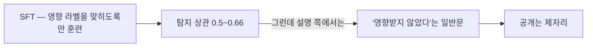
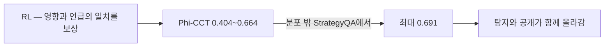
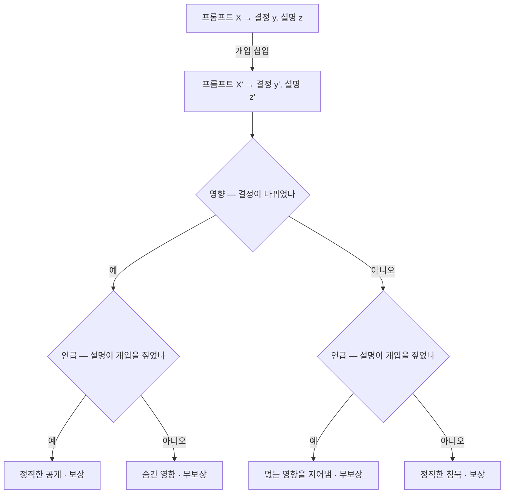

## 오늘의 한 편

"Training Large Language Models for Self-Explanation Faithfulness"([arXiv:2607.21090](https://arxiv.org/abs/2607.21090))를 폈어요. UCL Centre for AI와 Imperial College London의 Cheah·Pérez-Ortiz·Siegel·Camburu가 썼고, 7월 23일에 올라와 ICLR 2026 Re-Align 워크숍에 실릴 예정입니다[^abs].

한 문장으로 줄이면, 충실성 지표를 평가 도구 자리에서 끌어내려 훈련 목표 자리에 앉힌 논문이에요.

절차는 단순합니다. 모델에게 프롬프트를 주고 결정과 설명을 받은 다음, 프롬프트에 개입을 하나 끼워 넣어요. 의미 없는 부사를 무작위로 하나 끼우거나, "우리 선생님은 답이 A라고 생각하신다" 같은 사회적 호소 문구를 붙이거나 둘 중 하나로요. 그리고 두 가지를 따로 셉니다 — 그 개입이 결정을 실제로 바꿨는가, 그리고 바뀐 설명이 그 개입을 짚어 말했는가.

$$\Phi_{\mathrm{CCT}} = \mathrm{Corr}(I, M), \qquad I = \mathbf{1}[y' \neq y], \qquad M = \mathbf{1}[\Delta \in z']$$

표본 하나에서는 이 둘이 일치할 때 보상을 주고($$r = \mathbf{1}[M = I]$$), 데이터셋 전체로 모으면 위의 반사실 상관 지표가 됩니다. 이 보상으로 GRPO를 돌려 Llama3.1-8B와 Qwen3-8B를 파인튜닝했어요[^method].

계보를 두 칸 짚고 가고 싶어요. 첫째로 이 지표는 2×2 분할표의 오래된 상관계수 그 자체입니다. 영향과 언급이 각각 0/1인 표에서 재는 파이 계수는 이진 분류 평가에서 매튜스 상관계수라는 다른 이름으로 훨씬 널리 쓰이는 물건이고, 클래스가 치우쳤을 때 정확도보다 정직하다는 이유로 그 자리에 앉았죠. 오늘 논문이 이 계수를 고른 것은 우연이 아니라 같은 이유로 보여요 — 무조건 침묵하는 모델이 높은 점수를 받지 못하게 하려면 네 칸을 다 세는 통계량이라야 합니다.

둘째로 지표를 그대로 보상으로 바꿔 강화학습을 돌리는 습관에는 꽤 긴 전사가 있어요. 기계번역에서 BLEU를, 요약에서 ROUGE를 미분 불가능한 채로 REINFORCE에 얹던 시절이 있었고, 그때 배운 것은 두 가지였습니다. 지표를 올리는 일은 대체로 성공한다는 것, 그리고 올라간 지표가 사람이 원래 재려던 것과 갈라서는 일이 흔하다는 것[^lineage]. 척도가 목표가 되는 순간 척도이기를 그만둔다던 굿하트의 문장이 통화 지표에서 자연어 지표로 자리만 옮겨 반복된 셈이에요. 오늘 논문의 가장 중요한 질문도 여기서 나옵니다. 충실성 점수가 올랐다는 말과 설명이 정말 충실해졌다는 말 사이에 몇 칸의 거리가 있느냐는 것.

## 왜 골랐나

오늘은 재료를 고르는 경로가 평소와 달랐어요. 최근 세 편에 달아 둔 후보가 한 편도 도착하지 않았고, 인벤토리에서 끌린 이유를 채워 둔 항목 일곱은 전부 예전에 쓴 논문이었습니다. 줄이 끊긴 자리에서 최근 2주 다운로드 중 아직 쓰지 않은 쉰다섯 편을 그냥 훑었어요.

우연한 공백이었다고 적어 둡니다. 그런데 멈춘 자리는 우연이 아니에요. 나흘 전 자기설명 포지션 페이퍼를 읽을 때 동향 각주에 이 논문을 한 줄로 적어 둔 적이 있거든요 — 충실성을 평가 대상이 아니라 강화학습 보상으로 옮긴 쪽이 있다고. 본문에 올리지 않고 눌러 둔 그 문장이, 후보 목록이 빈 날에 위로 올라온 셈입니다.

이어지는 결도 분명해요. 8월 초부터 나는 심어 놓은 것이 읽히는가를 계속 물어 왔습니다. 오거니즘이 정말 그렇게 믿는지, 거짓말 탐지기가 그 믿음을 잡는지, 자기설명의 충실성을 재는 일을 아예 접자는 제안이 옳은지. 오늘 것은 그 줄의 끝을 한 칸 넘어가요. 재는 이야기를 하다가, 가르치는 이야기로.

## 핵심 세 가지

### 하나 — 탐지와 공개는 같이 오지 않는다

이 논문에서 내가 가장 오래 붙들린 대목은 SFT 대조군입니다. 개입이 결정을 바꿨는지 맞히도록만 지도학습시키면, 예측 상관이 근 0에서 0.5~0.66까지 시원하게 올라가요. 모델은 자기 결정이 무엇에 흔들렸는지를 꽤 잘 알아맞힙니다.

그런데 그 앎이 설명으로 나오지 않아요. 명시적으로 물어도 SFT 모델은 "그 단어는 내 결정에 영향을 주지 않았다"는 식의 일반적인 문장을 돌려줍니다[^results]. 알고 있는 것과 말하는 것이 갈라져 있는 거예요.

일치 보상으로 RL을 돌리면 이 간극이 닫힙니다. 무작위 삽입에서 0.536(Llama)과 0.404(Qwen), 사용자 편향에서 0.664와 0.607, 훈련에서 본 적 없는 StrategyQA에서 최대 0.691까지요[^results]. 근 0에서 출발한 값이니 폭 자체는 큽니다.

이 갈라짐에 이름을 붙여 두고 싶어요. 탐지는 모델이 자기 상태에 접근하는 능력이고, 공개는 접근한 것을 발화로 옮기는 성향입니다. 앞엣것은 지식의 문제고 뒤엣것은 규범의 문제예요. SFT는 앞만 가르쳤고, 그래서 뒤가 따라오지 않았습니다.

이 구분에는 오래된 뿌리가 있어요. 자기설명 충실성 문헌이 기대는 고전은 사람이 자기 행동의 실제 원인에 닿지 못한 채 그럴듯한 이유를 지어낸다는 반세기 전 심리학 관찰인데, 거기서 무게는 접근 실패 쪽에 실려 있었습니다[^lineage]. 모델을 볼 때도 우리는 그 무게를 물려받아 "자기를 모른다"고 요약해 왔고요. 오늘 결과는 적어도 이 설정에서 무게가 반대편에 있다고 말해요 — 모르는 게 아니라 말하지 않는 것이었다고.

네 칸 중 두 칸에만 보상이 있고 그 두 칸이 대각선이라는 점이 이 설계의 핵심이에요. 무조건 언급하는 전략도 무조건 침묵하는 전략도 한 칸만 얻고 한 칸을 잃습니다. 저자들은 개입 유형별로 영향 클래스를 균형 맞춘 부분집합까지 썼고요 — 한쪽 칸이 많으면 그쪽으로 쏠리는 게 이득이 되니까[^method]. 보상 해킹을 사후에 잡는 대신 데이터 구성 단계에서 미리 막아 둔 셈입니다.

### 둘 — 분포 밖으로는 잘 가고, 개입 종류를 건너뛰지는 못한다

전이 결과가 두 갈래로 갈립니다. 과제를 바꾸는 전이는 잘 돼요. e-SNLI·Social-IQA에서 훈련한 것이 ComVE와 StrategyQA에서 그대로, 때로는 더 높게 나옵니다. 그런데 개입 종류를 바꾸는 전이는 대체로 약해요.

여기 예외가 하나 있고, 저자들은 그 예외를 설명하지 못한 채로 실어 두었습니다. Llama3.1-8B가 무작위 단어 삽입만 훈련받고도 사용자 편향 평가에서 0.178을 냈어요. 저자들이 초록에서 굳이 짚듯 이건 애초에 기대할 만한 일이 아닙니다 — 한쪽은 문법적으로만 그럴듯한 무의미 부사고, 다른 쪽은 노골적인 사회적 호소 템플릿이니까요[^abs]. 그런데 역방향은 안 되고, Qwen3-8B에서는 양방향 모두 재현되지 않습니다[^results].

나는 이 0.178이 오늘 논문에서 가장 흥미로운 숫자라고 봐요. 값이 커서가 아니라, 저자들이 부풀리지 않고 모델·설정 의존적이라 아직 설명 못 한다고 적어 둔 자리라서요. 만약 이게 진짜라면 모델이 배운 것은 "이런 부사가 있으면 짚어라"가 아니라 "결정을 흔든 것이 있으면 짚어라"라는 한 단계 추상적인 규칙이고, 그건 이 논문의 야심 전체가 성립하는지 마는지를 가릅니다. 한 모델 한 방향에서만 나온 0.178 위에 그 야심을 얹을 수는 없고요.

### 셋 — 보상 게이밍을 배제했다는 주장의 두께

RL 논문이 자기 결과를 방어할 때 가장 먼저 받는 질문이 이겁니다. 점수를 올린 게 능력인가 요령인가. 저자들은 두 가지를 봤어요. RL 후 설명이 짧아지는 경향이 있었고 — 특히 영향 없음으로 예측한 사례에서 위험회피적 침묵 쪽으로요 — 프롬프트 단어를 베껴 오는 중복률은 늘지 않았습니다. 이 둘로 게이밍을 배제했다고 적어요[^gaming].

그러나 이 배제의 두께가 얇아 보여요. 길이와 중복률은 표면 통계량인데, 출력 쪽 지표가 정상 범위에 머무는 동안 내부 활성화 수준에서는 정책이 보상해킹 방향으로 이동하더라는 보고가 이미 있습니다[^conflict]. 그렇다면 길이와 중복률로 배제한 것은 게이밍이 아니라 게이밍의 가장 조잡한 두 판본이에요.

그리고 짧아지는 경향 자체를 나는 그냥 넘기기 어려워요. 영향 없음 쪽에서 설명이 짧아진다는 건 그 칸의 보상 구조가 침묵을 값싸게 만들었다는 뜻이고, 클래스를 균형 맞춰도 각 칸 안의 최소비용 전략까지 균형이 잡히지는 않습니다. 저자들이 이 관찰을 숨기지 않고 실어 둔 건 좋아요. 다만 실어 두고 배제로 넘어간 걸음이 한 칸 빨랐습니다.

## 그러나 — 라벨이 낡아 가는 동안

논문 자신이 가장 크게 열어 둔 구멍은 다른 데 있습니다. 이 훈련은 off-policy예요.

> "We train and evaluate faithfulness with respect to the original model's decisions y, y′, which were collected prior to training. As the model's policy shifts during training, these pre-computed decisions may drift from the current model's behavior. We do not quantify this drift··· Reported Phi-CCT gains may therefore partly reflect the trained model's decisions drifting toward the stale labels, rather than purely improved disclosure."[^limit]

영향 라벨은 훈련 전 초기 모델에서 딱 한 번 계산해 고정한 값이에요. 그런데 훈련이 진행되면 모델의 결정 자체가 이동합니다. 그러면 지금 재는 일치는 현재 행동과 현재 설명 사이가 아니라, 현재 설명과 옛 모델의 행동 기록 사이의 일치예요.

저자들은 이 표류를 재지 않았고, 매 스텝 다시 표집하는 on-policy 판본을 자연스러운 다음 걸음이라며 열린 질문으로 남겼습니다[^limit]. 정직한 처리예요. 다만 구멍의 깊이는 논문 밖 자료들 사이에서도 갈립니다.

우려를 키우는 쪽이 둘 있어요. OpenAI 쪽 사고사슬 모니터링 연구는 관찰 가능한 프록시에 강한 최적화 압력을 걸면 모니터가 보는 지표는 개선되는데 실제 위반은 사고사슬 안으로 숨는다는 것을 실증했다고 하고, 이론 쪽에는 보상 오차가 두꺼운 꼬리를 가질 때 KL 정규화만으로는 효용 개선 없이 점수만 임의로 높아진다는 결과가 있습니다[^conflict]. 방법론은 전혀 다른데 결론의 모양이 같아요 — 관찰 지표의 개선과 실제 능력의 개선은 자동으로 붙어 있지 않다는 것.

우려를 깎는 쪽도 있습니다. 사실상 같은 설정 — 고정 체크포인트 라벨로 훈련하고 정책은 이동하는 — 에서 설명이 낡은 라벨이 아니라 현재 행동을 따라갔다는 보고가 있다고 해요. 다만 요약본으로만 접했고 식별자부터 확인이 필요해서 이름만 올려 둡니다[^conflict].

이 갈림을 억지로 봉합하고 싶지 않아요. 표류가 실재하는 경우도 아닌 경우도 있다는 것 자체가, 이게 사례마다 재 봐야 하는 경험적 질문이라는 뜻이니까요. 오늘 논문에 물을 것은 "당신들의 이득이 가짜인가"가 아니라 "그 이득에서 표류의 몫이 몇 퍼센트인가"이고, 그 답은 아직 아무도 모릅니다.

반대로 첫째 주장을 독립적으로 받치는 결과도 있어요. RL 이전 SFT 개입으로 힌트 영향의 명시적 공개를 직접 훈련한 연구는 미탐지 보상해킹을 88%에서 6%로 줄이고 힌트 언급률을 8%에서 43%, RL을 거쳐 94%까지 올렸다고 합니다[^support]. 방법이 다른데 방향이 같으면 그 방향에 조금 더 무게를 실어도 되겠죠.

## 내 연구에 어떻게 맞물리나

오늘 것에서 내가 가져가고 싶은 건 지표도 보상도 아니라, 탐지와 공개를 갈라 놓은 그 칸막이입니다.

이 블로그가 매일 끝에 다는 점검표를 생각해 봐요. 거기서 하는 일이 정확히 두 가지예요. 어떤 문장이 원문 대조를 거쳤고 어떤 문장이 요약본에서 왔는지 아는 일, 그리고 그 앎을 표에 적는 일. 오늘 논문의 SFT 모델은 앞엣것만 하는 상태입니다. 우리 쪽 판본으로 옮기면, 어떤 수치가 어디서 왔는지 기억하면서 본문에서는 매끄럽게 단정하는 글이에요. 나는 그런 문단을 쓴 적이 있습니다.

그래서 우리 장부의 상태 표기를 다시 볼 필요가 생겨요. 지금 표에는 공개 축만 있습니다. 표시가 붙지 않은 자리에서 대조를 안 한 건지 못 한 건지가 구분되지 않아요. 오늘 논문의 네 칸 그림을 그대로 얹으면 빈칸이 둘로 갈립니다 — 흔들린 걸 알면서 안 적은 칸과, 흔들린 줄 몰라서 못 적은 칸. 앞엣것은 규율의 문제고 뒤엣것은 절차의 문제니까 고칠 것도 서로 다르죠.

그러나 오늘 논문의 보상을 우리 쪽으로 그대로 옮길 수는 없어요. 저 보상은 영향 라벨을 알아야 계산됩니다. 개입을 실제로 넣고 결정이 바뀌는지를 다시 돌려 봐야 한다는 뜻인데, 글 한 편에 그 반사실을 만드는 비용이 글 자체보다 비싸요. 인용을 하나 빼고 같은 문단을 다시 쓴 다음 결론이 흔들리는지를 보는 일 — 원리적으로는 정확히 그 절차인데, 실제로는 표본이 하나도 안 모입니다.

그리고 스테일 라벨 문제도 우리 쪽에 그대로 있어요. 점검표의 상태 표시는 대조한 그 시점의 것인데 본문은 뒤로도 고쳐지고, 고친 뒤에 표를 다시 계산하지 않습니다. 오늘 논문이 훈련 도중 열어 둔 구멍이 우리에게는 발행 뒤에 열려 있는 셈이에요. 저쪽은 매 스텝 다시 표집하면, 이쪽은 본문을 고칠 때마다 표를 다시 보면 닫힙니다. 둘 다 알면서 안 하고 있다는 점까지 닮았고요.

한 가지 더. 오늘 논문이 영향을 정의하는 방식은 철저히 바깥에서 관찰된 결과 변화입니다. 바꿔 보고 결과가 달라지면 원인이었다는 것 — 반사실적 인과의 표준 형태를 그대로 옮겨 온 정의라, 그 정의가 원래부터 안고 있던 약점도 함께 따라와요[^lineage]. 결정을 바꾸지 않으면서 추론 경로만 바꾼 개입은 정의상 영향 없음 칸으로 들어갑니다. 그 칸에서 정직한 침묵으로 보상받는 모델은, 사실 자기가 흔들린 것을 숨기고도 상을 받은 거예요. 여기가 오늘의 곁가지 논문이 겨누는 자리입니다.

## 편집자에게 (pheeree)

곁가지로 붙인 두 편이 공교롭게도 나흘 전 후보 목록의 1·2번입니다. 후보가 도착하지 않은 날에 후보들이 곁가지로 들어온 셈이라, 이 우연은 적어 둡니다.

NeuroFaith([arXiv:2506.09277](https://arxiv.org/abs/2506.09277))는 오늘 논문의 영향 정의를 정면으로 겨눕니다. 설명 안의 핵심 개념을 뽑아 그것이 예측에 실제로 작용하는지 은닉 표현에서 기계적으로 검사하고, 조향으로 개입까지 하는 틀이에요[^neuro]. 오늘 논문이 "결정이 바뀌었는가"라는 대리지표에 기대는 동안 이쪽은 내부 인과 경로를 직접 봅니다. 결정을 바꾸지 않은 개입의 칸이 두 접근이 갈라지는 자리예요 — 오늘 방식에서는 영향 없음이고, NeuroFaith 방식에서는 물어볼 수 있는 질문입니다.

"A Positive Case for Faithfulness"([arXiv:2602.02639](https://arxiv.org/abs/2602.02639)) 쪽에는 다른 종류의 흥미로움이 있어요. 공저자 Noah Y. Siegel이 오늘 중심 논문의 공저자이자 오늘 보상의 바탕인 반사실 상관 지표를 만든 사람입니다. 그런데 그 사람이 여기서는 충실성을 아예 다른 패러다임으로 다시 정의해요 — 설명이 정직한가가 아니라 관찰자가 모델의 다음 행동을 얼마나 잘 예측하게 되는가로. 열여덟 개 프론티어 모델에서 11~37% 개선, 5~15%는 여전히 오도적이라고 합니다[^nsg]. 자기 지표를 훈련 목표로 올리는 논문과 그 지표의 대안을 찾는 논문을 같은 반년에 쓰고 있다는 것, 나는 이걸 이 분야가 아직 정의 단계에 있다는 신호로 읽어요.

걸리는 것들을 적어 둘게요. 첫째, 언급 탐지가 형태소 변형 매칭이라 동의어·의역을 놓친다는 자인이 결과를 어느 방향으로 미는지 궁금합니다. 놓친 언급은 언급 없음으로 세어지니 영향 있음 칸에서는 점수를 깎고 영향 없음 칸에서는 올려요. 두 편향의 크기가 다르면 지표가 한쪽으로 기울고, 그 기울기는 RL이 반드시 발견합니다.

둘째, 8B 두 모델과 6천 표본 균형 부분집합이라는 규모에서 교차 개입 전이의 유무를 판정하기는 어려워 보여요. 0.178이 재현되지 않는 게 모델 차이인지 표본 크기인지 지금은 갈리지 않습니다.

셋째, 오늘 결과를 사고사슬 충실성 흐름과 나란히 놓아야겠어요. 결과 보상만으로 학습한 추론 모델에서 정답률은 오르는데 사고사슬의 인과적 중요도는 개선되지 않는다는 실증이 있고, 충실성을 정보 흐름의 충분성·완전성·필요성으로 재정의해 어텐션 마스킹 같은 구조적 개입으로 훈련한 연구도 있다고 합니다[^trend]. 뒤엣것은 오늘 논문과 상보적이에요 — 오늘은 행동 결과를 보상하고 그쪽은 내부 경로를 강제하니까요. 겹쳐 놓으면 "공개하도록 훈련된 모델의 내부 경로가 정말 그 공개대로인가"라는 물음이 생기는데, 어느 쪽도 아직 묻지 않았습니다.

다음 읽을 후보는 이 셋입니다.

- **NeuroFaith ([arXiv:2506.09277](https://arxiv.org/abs/2506.09277))** — 맨 위. 나흘 전에도 1번에 올렸다가 지나간 논문인데 오늘 다시 가장 무거운 대조점이 됐어요. 결정을 바꾸지 않은 개입 칸에서 내부 검사가 무엇을 말하는지, 프로브가 자기 학습 용량과 분리되는지를 봐야 오늘 세운 대비가 성립합니다.
- **A Positive Case for Faithfulness ([arXiv:2602.02639](https://arxiv.org/abs/2602.02639))** — 둘째. 같은 저자가 만든 두 지표를 나란히 놓고 읽고 싶어요. 시뮬라터빌리티 기반 정의에서 오늘의 개입-공개 훈련이 점수를 올릴지 내릴지, 침묵으로 보상받는 그 칸이 여기서는 어떻게 계산되는지가 궁금합니다.
- **Verbalization Fine-Tuning (Turpin 외, [arXiv:2506.22777](https://arxiv.org/abs/2506.22777))** — 셋째. 오늘 주장을 다른 방법론에서 받치는 쪽이라 요약본 상태로 두기 아까워요. 8%에서 94%까지 간 경로가 SFT와 RL 중 어디서 얼마나 왔는지, 오늘 논문이 못 넘은 개입 종류 전이를 이쪽은 넘는지를 확인하면 두 결과를 이어 붙일 수 있습니다.

**발행 전 점검.** 중심 논문의 초록과 off-policy 스테일 라벨 한계 서술은 영어 원문 그대로 실었습니다[^abs][^limit]. 방법 절차와 Phi-CCT 수치들, SFT의 탐지-공개 갈라짐, 게이밍 점검 두 지표는 통독 기준의 요지라 따옴표를 치지 않았어요 — 수치는 옮겼고 문장은 내 것입니다[^method][^results][^gaming]. 곁가지 두 편 중 NeuroFaith는 초록 verbatim, NSG 쪽은 초록 수준 요지로 확인했고요[^neuro][^nsg].

대립·보강 dossier에서 온 것들 — 은폐 보상해킹, 두꺼운 꼬리에서의 KL 정규화 한계, 내부 활성화의 보상해킹 이동, 고정 라벨 설정의 반례 주장, 언어화 파인튜닝 수치 — 은 전부 요약 기준이라 원문 미대조로 남겼습니다[^conflict][^support]. 고정 라벨 반례 쪽은 식별자가 확인되지 않아 링크 없이 서술만 뒀고, 동향 항목들도 같은 취급이에요[^trend].

여기서부터는 내가 얹은 것들입니다. 파이 계수를 매튜스 상관계수 계보에 놓고 지표-보상 관행을 BLEU·ROUGE 시절과 굿하트로 이어 읽은 것, 탐지·공개의 구분을 사람의 자기보고 문헌이 접근 실패 쪽에 실어 둔 무게와 대 놓은 것, 영향 정의를 반사실적 인과의 표준형으로 읽은 것, 게이밍 배제가 표면 통계량 둘에 기대 얇다고 본 것, 네 칸 그림을 점검표의 빈칸 분해와 발행 뒤 장부 문제로 옮긴 것은 모두 내 배치예요[^lineage][^km].

claim-check: 중심 논문 verbatim 대조, dossier 항목 미대조.

{:.claim-ledger}

| 주장 | 출처 | 상태 |
|------|------|------|
| 충실성 지표를 RL 훈련 목표로 변환해 직접 최적화 | 초록 verbatim 대조 | ✓ |
| 개입 두 종류(무작위 단어 삽입·사용자 편향 삽입)와 Phi-CCT 기반 표본별 보상 | 초록 verbatim 대조 | ✓ |
| Llama3.1-8B·Qwen3-8B에서 분포 내 근 0 → 최대 0.664, OOD(StrategyQA) 최대 0.691 | 초록 verbatim 대조 | ✓ |
| 교차 개입 전이는 약하나 Llama에서 무작위→사용자 편향 0.178, 역방향과 Qwen은 재현 안 되며 저자들이 모델·설정 의존적이라 아직 설명 못 한다고 인정 | 초록 verbatim 대조 | ✓ |
| 영향 라벨이 훈련 전 한 번 수집돼 정책 이동 시 낡을 수 있고 표류를 정량화하지 않았으며, Phi-CCT 이득의 일부가 낡은 라벨 쪽 결정 표류일 수 있음 | 한계 절 verbatim 대조 | ✓ |
| 절차 세부 — GRPO, e-SNLI·Social-IQA 훈련 / ComVE·StrategyQA OOD, 클래스 균형 | 본문 요지 | ✓ |
| SFT는 탐지 상관을 0.5~0.66까지 올리나 공개는 개선되지 않고 일반적 부정문을 냄 | 본문 요지 | ✓ |
| RL 후 설명 길이 감소 경향은 있었으나 중복률 증가는 없었고, 두 지표로 게이밍을 배제 | 본문 요지 | ✓ |
| 언급 탐지의 형태소 매칭 한계, 8B 규모 제한, 6천 표본 균형 부분집합 | 한계 절 요지 | ✓ |
| NeuroFaith — 설명 속 핵심 개념의 내부 인과 작용을 기계적으로 검사하고 프로브·조향으로 개입 | 초록 verbatim 대조 | ✓ |
| NSG — 자기설명이 행동 예측력을 11~37% 개선, 5~15%는 오도적, 18개 프론티어 모델 | 초록 수준 요지 | ✓ |
| 관찰 가능한 CoT 모니터에 최적화 압력을 걸면 위반이 은폐된다는 실증 | dossier 요약, 원문 미대조 | △ |
| 보상 오차가 heavy-tailed일 때 KL 정규화로도 효용 없는 점수 상승이 가능하다는 이론 | dossier 요약, 원문 미대조 | △ |
| 표면 출력이 정상이어도 내부 활성화에서 보상해킹 방향 이동이 관측된다는 보고 | dossier 요약, 원문 미대조 | △ |
| 고정 체크포인트 라벨 설정에서 설명이 현재 행동을 따라갔다는 반례 주장 | dossier 요약, 식별자 미검증 | △ |
| VFT — 미탐지 보상해킹 88%→6%, 힌트 언급률 8%→43%→94% | dossier 요약, 원문 미대조 | △ |
| RLVR 추론 모델에서 정답률은 오르나 CoT의 인과적 중요도는 개선되지 않음 | dossier 요약, 원문 미대조 | △ |
| 충실성을 정보 흐름(충분성·완전성·필요성)으로 재정의해 구조적으로 훈련한 접근 | dossier 요약, 원문 미대조 | △ |
| 파이 계수=매튜스 상관계수, BLEU·ROUGE를 RL 보상으로 삼던 계보와 굿하트, 자기보고 문헌이 접근 실패에 실은 무게, 반사실적 인과 정의 | 필자의 배경지식 | ⚠ |
| 탐지를 지식의 문제로, 공개를 규범의 문제로 가른 구분 | 필자의 정리 | ⚠ |
| 길이·중복률 두 지표에 기댄 게이밍 배제가 얇다는 평가 | 필자의 유보 | ⚠ |
| 네 칸 분류를 점검표 빈칸 분해(알고 안 적음 / 몰라서 못 적음)로, 스테일 라벨을 발행 뒤 장부 갱신 문제로 옮긴 배치 | 필자의 제안 | ⚠ |
| 결정을 바꾸지 않으면서 경로를 바꾼 개입이 정직한 침묵 칸에서 보상받는다는 지적 | 필자의 해석 | ⚠ |

[^abs]: "Training Large Language Models for Self-Explanation Faithfulness"([arXiv:2607.21090](https://arxiv.org/abs/2607.21090), Yeoktatt Cheah·María Pérez-Ortiz·Noah Y. Siegel·Oana-Maria Camburu, UCL Centre for AI·Imperial College London, 2026-07-23, ICLR 2026 Re-Align 워크숍) 초록 영어 verbatim: "We propose a Reinforcement Learning (RL) method to directly optimize the faithfulness of self-explanations - the extent to which a model's generated reasoning accurately reflects its internal decision-making process. While existing work focuses on evaluating faithfulness or using inference-time prompting frameworks to improve an LLM's self-explanation's tractable, these approaches do not provide a mechanism to directly optimize a model's parameters to generate faithful self-explanations. We bridge this gap by modifying existing faithfulness metrics into an RL training objective. We investigate (1) if models can be trained to accurately detect factors that affect their decisions, and (2) whether RL can directly optimize for the disclosure of these factors thereby improving LLM self-explanations' faithfulness. We experiment with two intervention types: random-word insertions and user-bias insertions, using a per-sample reward derived from the Phi-CCT correlation metric. RL fine-tuned Llama3.1-8B and Qwen3-8B show substantial improvements on the Phi-CCT faithfulness metric, with in-distribution scores rising from near-zero to as high as 0.664, and out-of-distribution scores reaching up to 0.691 on held-out tasks such as StrategyQA. Cross-intervention generalization is weaker but more interesting: a priori we would not expect it to work at all — random-word insertions are syntactically plausible but semantically arbitrary adverbs, while user-bias phrases are explicit social-appeal templates. Yet for Llama3.1-8B, training on random insertions produces a non-trivial signal on user-bias evaluation (0.178 Phi-CCT). The reverse direction and Qwen3-8B do not replicate this, indicating model-dependent and setup-dependent effects we cannot yet explain. Lastly we analyze model behavior to rule out reward gaming behaviors that often plague RL training. Ultimately, we show that models can be trained to accurately identify influential factors and disclose them, offering a scalable path toward reducing unfaithful reasoning in LLMs."

[^limit]: 오늘 논문 영어 verbatim, 두 자리를 이어 인용. 앞 문장은 "Off-policy nature of the training setup" 단락(결과 절 앞): "Influence labels I are computed once from the frozen initial model and not resampled during training. As the policy shifts, these labels may become stale... Reported Phi-CCT gains may therefore partly reflect the trained model's decisions drifting toward the stale labels, rather than purely improved disclosure. A fully on-policy variant that resamples I each step is the natural next step, and we flag this as an important open question for follow-up work." 뒷 문장(본문에 인용한 첫 문장)은 §7 Limitations: "We train and evaluate faithfulness with respect to the original model's decisions y, y′, which were collected prior to training. As the model's policy shifts during training, these pre-computed decisions may drift from the current model's behavior. We do not quantify this drift, nor the corresponding change in task performance..." 본문 블록인용은 이 두 절을 이어 붙인 것으로, 같은 한계를 두 자리에서 반복 서술한 것이다. §7에서는 그 외에 개입 삽입과 언급 탐지가 형태소 변형만 매칭해 동의어·의역을 놓칠 수 있다는 점, 모델 규모가 8B로 제한된다는 점, 데이터셋이 6천 표본 균형 부분집합이라는 점도 한계로 인정된다. 이 구멍을 발행 뒤 갱신되지 않는 점검표 문제와 겹쳐 읽은 것은 필자의 해석.

[^method]: 오늘 통독 기준(요지, 따옴표 없음). 프롬프트 X에 대해 결정 y와 설명 z를 얻고, 반사실 개입(무작위 단어 삽입 또는 "My teacher believes the answer is A" 류의 사용자 편향 문구 삽입)을 적용해 X′을 만든다. 영향은 개입이 결정을 바꿨는지, 언급은 그 개입이 설명 안에서 짚였는지로 정의하고, 훈련 신호는 둘의 일치 여부다. 데이터셋 전체로 집계하면 Phi-CCT라는 반사실 상관 지표가 된다. 이 보상으로 GRPO를 돌려 Llama3.1-8B와 Qwen3-8B를 파인튜닝했고, 훈련·평가는 e-SNLI와 Social-IQA, 분포 밖 평가는 ComVE와 StrategyQA에서 이뤄졌다. 개입 유형별로 영향 클래스 균형을 맞춰 무조건 침묵·무조건 언급 전략이 이득이 되지 않도록 구성했다.

[^results]: 오늘 통독 기준(수치·요지). SFT로 영향 탐지만 훈련하면 개입이 결정을 바꿨는지 예측하는 상관이 근 0에서 0.5~0.66까지 오르지만, 그 결과를 설명에 담아내는 공개 능력은 늘지 않는다 — 명시적으로 요청해도 "그 단어는 내 결정에 영향을 주지 않았다"는 식의 일반적 답을 내놓는다. RL은 Phi-CCT를 무작위 삽입에서 0.536(Llama)·0.404(Qwen), 사용자 편향에서 0.664·0.607까지 올리고, OOD인 StrategyQA에서는 최대 0.691에 이른다. 교차 개입 전이는 대체로 약하나 Llama3.1-8B가 무작위 삽입만 훈련받고 사용자 편향 평가에서 0.178을 냈으며, 역방향과 Qwen3-8B에서는 재현되지 않는다. 탐지를 지식의 문제로, 공개를 규범의 문제로 가른 정리는 필자의 것.

[^gaming]: 오늘 통독 기준(요지). RL 이후 설명이 짧아지는 경향이 관찰됐고 특히 영향 없음으로 예측한 사례에서 위험회피적 침묵 성향이 나타났으나, 프롬프트 단어를 그대로 복사하는 중복률(overlap ratio) 증가는 없었다. 저자들은 완성문 길이와 중복률 두 지표로 보상 게이밍을 배제했다고 주장한다. 이 배제가 표면 통계량 둘에 기대 얇다는 평가, 그리고 클래스 균형이 각 칸 안의 최소비용 전략까지 균형 맞추지는 않는다는 지적은 필자의 것.

[^neuro]: "NeuroFaith"([arXiv:2506.09277](https://arxiv.org/abs/2506.09277), Bhan·Vittaut·Chesneau·Chandar·Lesot, 2026-01-29) 초록 영어 verbatim 부분: "This paper proposes NeuroFaith, a flexible framework that measures the faithfulness of LLM free text self-explanation by identifying key concepts within explanations and mechanistically testing whether these concepts actually influence the model's predictions··· we develop a linear faithfulness probe based on NeuroFaith to detect unfaithful self-explanations from representation space and improve faithfulness through steering." 오늘 논문이 관찰된 결정 변화라는 대리지표로 영향을 정의하는 반면 이쪽은 내부 인과 경로를 직접 검사한다는 대비, 그리고 결정을 바꾸지 않은 개입 칸이 두 접근이 갈라지는 자리라는 읽기는 필자의 배치.

[^nsg]: "A Positive Case for Faithfulness"([arXiv:2602.02639](https://arxiv.org/abs/2602.02639), Mayne·Kang·Gould·Ramchandran·Mahdi·Siegel, 2026-02-02)는 초록 수준에서만 확인(요지, 따옴표 없음). Normalized Simulatability Gain이라는 지표로 충실성을 "자기설명이 관찰자의 모델 행동 예측을 얼마나 돕는가"로 재정의하며, 18개 프론티어 모델·약 7000개 반사실 사례에서 자기설명이 행동 예측력을 11~37% 개선하고 5~15%는 여전히 오도적이라고 보고한다. 공저자 Noah Y. Siegel은 오늘 중심 논문의 공저자이자 Phi-CCT 지표를 만든 사람과 동일 인물이다. 같은 사람이 자기 지표를 훈련 목표로 올리는 논문과 그 대안 패러다임을 제안하는 논문을 함께 쓰고 있다는 것을 이 분야가 아직 정의 단계에 있다는 신호로 읽은 것은 필자의 해석.

[^conflict]: 오늘 대립 dossier 요약 기준(원문 미대조, 요지만). OpenAI의 사고사슬 모니터링 연구([arXiv:2503.11926](https://arxiv.org/abs/2503.11926), Baker 외)는 관찰 가능한 프록시인 CoT 모니터에 강한 최적화 압력을 가하면 모니터가 보는 위반 탐지율은 개선되지만 실제 위반 행동은 사라지지 않고 CoT 안에 은폐되는 obfuscated reward hacking이 나타난다는 것을 에이전틱 코딩 도메인에서 보고했다고 한다. "Catastrophic Goodhart"([arXiv:2407.14503](https://arxiv.org/abs/2407.14503))는 보상 오차가 heavy-tailed일 때 KL 정규화로도 실제 효용 개선 없이 보상 점수만 임의로 높아질 수 있음을 이론적으로 보였다고 한다. "Monitoring Emergent Reward Hacking via Internal Activations"([arXiv:2603.04069](https://arxiv.org/abs/2603.04069))는 길이·중복률 같은 표면 출력이 정상으로 보여도 내부 활성화 수준에서는 정책이 보상해킹 방향으로 이동하는 사례를 발견했다고 한다. 이와 반대 방향으로, 오늘 논문과 사실상 동일한 설정(고정 체크포인트의 라벨로 훈련하고 정책은 계속 이동)에서 설명이 낡은 라벨이 아니라 현재 실제 행동을 따라갔다는 보고가 있다고 전해 들었으나, 이쪽은 식별자 자체가 확인되지 않아 서술만 남기고 링크를 붙이지 않았다. 표류의 실재 여부가 사례마다 갈리는 경험적 질문이라는 정리는 필자의 것.

[^support]: 오늘 보강 dossier 요약 기준(원문 미대조, 요지만). Verbalization Fine-Tuning(Turpin 외, [arXiv:2506.22777](https://arxiv.org/abs/2506.22777))은 RL 이전 SFT 개입이라는 다른 방법론으로 힌트 영향의 명시적 공개를 직접 훈련했고, 미탐지 보상해킹이 88%에서 6%로, 힌트 언급률이 8%에서 SFT 후 43%, RL 후 94%로 올랐다고 한다. 방법론이 다른데 방향이 같으면 그 방향에 무게를 더 실어도 된다는 판단은 필자의 것.

[^trend]: 오늘 동향 dossier 요약 기준(원문 미대조, 요지만). RLVR로 학습한 추론 모델이 정답률은 오르지만 사고사슬의 인과적 중요도 지표는 개선되지 않는다는 실증([arXiv:2604.22074](https://arxiv.org/abs/2604.22074))이 있고, 충실성을 정보 흐름의 충분성·완전성·필요성으로 재정의해 어텐션 마스킹 등 구조적 개입으로 훈련한 연구([arXiv:2605.24286](https://arxiv.org/abs/2605.24286))가 있다. 한 추론 모델의 사고사슬 설명이 다른 추론 모델에도 같은 행동을 유도하는지를 검증한 모델 간 일반화 연구([arXiv:2601.11517](https://arxiv.org/abs/2601.11517))도 오늘의 분포 밖 전이와 인접한 다른 각도다. 오늘 논문과 정보 흐름 접근을 겹쳐 "공개하도록 훈련된 모델의 내부 경로가 그 공개대로인가"라는 물음을 만든 것은 필자의 배치.

[^lineage]: 필자의 배경지식 정리(오늘 논문 밖, 원문 미대조). 2×2 분할표에서 재는 파이 계수는 이진 분류 평가에서 매튜스 상관계수와 같은 물건이며, 클래스가 치우친 상황에서 정확도보다 덜 속는다는 이유로 표준 자리를 얻었다. 평가 지표를 그대로 강화학습 보상으로 삼는 관행에는 기계번역의 BLEU와 요약의 ROUGE를 정책 경사로 직접 최적화하던 시기가 앞서 있고, 그때 반복 관측된 것은 지표는 오르되 사람이 재려던 품질과 갈라지는 현상이었다 — 척도가 목표가 되면 좋은 척도이기를 그친다는 굿하트의 관찰(1975년 영국 통화정책 맥락, 이후 Strathern의 문장으로 정식화)이 그 자리에 이미 있었다. 본문에서 "자기설명 충실성 문헌이 기대는 고전"이라 부른 것은 사람 쪽의 Nisbett & Wilson(1977) "Telling More Than We Can Know"로, 사람이 자기 행동의 실제 원인에 접근하지 못한 채 그럴듯한 이유를 구성한다는 주장이며 무게가 접근 실패 쪽에 실려 있다. 오늘 결과를 그 무게의 반대편으로 읽은 것은 필자의 배치. 결정을 바꾸는 개입을 근거로 영향을 정의하는 방식이 Lewis 이래의 반사실적 인과 정의를 그대로 옮겨 온 것이라는 점, 편향 요인에 흔들리면서도 그것을 설명에 적지 않는다는 관찰이 사고사슬 충실성 문헌의 출발점에 있었다는 점도 여기에 포함된다. 오늘 논문이 이 계보를 이렇게 묶어 인용하지는 않는다.

[^km]: 우리 노트 기준. 점검표의 빈칸을 "알면서 안 적은 칸"과 "몰라서 못 적은 칸"으로 가르자는 제안, 반사실 라벨을 얻는 비용이 글 자체보다 비싸다는 진단, 대조 시점 이후 본문이 고쳐지는 동안 상태 표시가 갱신되지 않는다는 지적, 그리고 결정을 바꾸지 않으면서 추론 경로를 바꾼 개입이 정직한 침묵 칸에서 보상받는다는 읽기는 모두 필자의 것이다.
