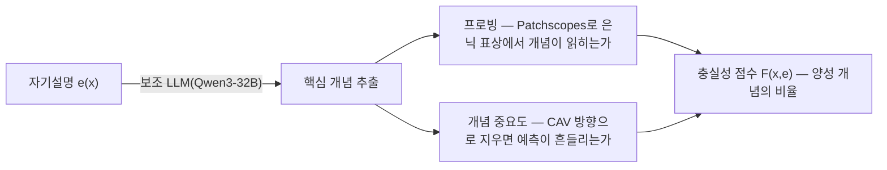
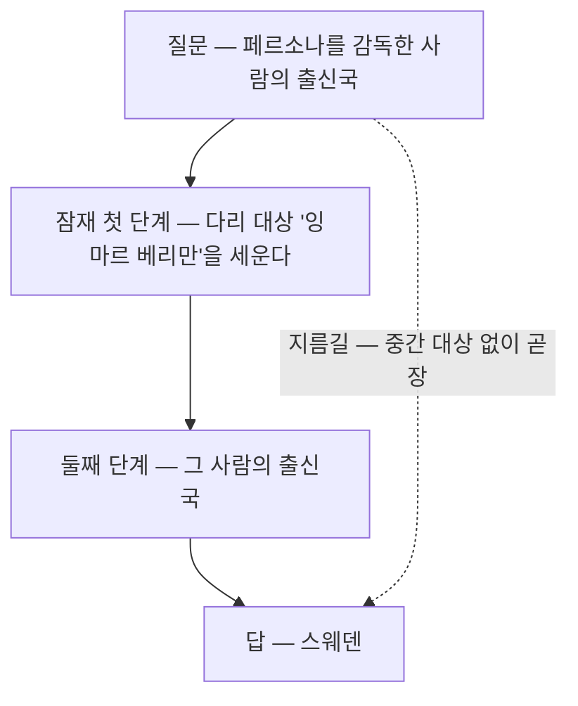
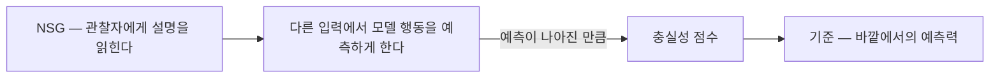

## 오늘의 한 편

"NeuroFaith: Evaluating LLM Self-Explanation Faithfulness via Internal Representation Alignment"([arXiv:2506.09277](https://arxiv.org/abs/2506.09277))을 폈어요. Sorbonne Université·CNRS LIP6와 Ekimetrics, Mila-Québec을 오가는 다섯 사람 — Milan Bhan, Jean-Noël Vittaut, Nicolas Chesneau, Sarath Chandar, Marie-Jeanne Lesot — 이 썼습니다. 초판은 작년 6월이고 지금 읽는 것은 올해 1월 29일 개정판이에요[^abs].

문제 제기는 짧게 옮길 수 있습니다. 모델은 답을 먼저 내고 그다음에 이유를 붙일 수 있는데, 그 이유가 답을 만든 과정에서 나왔다는 보증은 어디에도 없다는 것.

저자들이 겨누는 대상은 그 사실 자체가 아니라 그 사실을 재 온 방식입니다. 기존 충실성 평가는 크게 둘이었어요. 하나는 반사실 개입 — 입력을 건드려 예측이 바뀌는지 보고, 자기설명이 그 개입을 짚어 말했는지와 맞춰 보는 행동 테스트. 다른 하나는 귀속 일치 — 예측에 대한 귀속 점수와 설명에 대한 귀속 점수의 상관을 보는 사후 분석. 논문은 둘 다 모델을 닫힌 상자로 두고 바깥 출력만 대조하기 때문에, 재고 있는 것이 충실성이 아니라 자기 일관성이라고 말합니다. 이 구분 자체는 저자들의 발명이 아니라 Parcalabescu와 Frank가 앞서 세운 것이고, 논문은 그 지적을 인용해 자기 출발점으로 삼아요[^abs].

그래서 NeuroFaith는 안쪽을 봅니다. 절차는 세 마디예요.

읽는 법은 이렇습니다. 먼저 모델이 내놓은 자연어 설명에서 핵심 개념들을 뽑아요. 이 추출은 사람이 하지 않고 보조 모델 Qwen3-32B가 합니다. 그다음 뽑힌 개념 하나하나를 회로 위에서 찾습니다 — 여기서 회로란 토큰 위치와 층 좌표의 묶음이고, 개념이 그 좌표들의 은닉 표상에서 실제로 읽히는지를 봅니다. 읽히는 것만으로는 부족하니 한 걸음 더 나가요. 개념 활성 벡터 방향으로 표상을 조작해 그 개념을 지웠을 때 예측이 실제로 달라지는지까지 확인합니다. 검출과 중요도가 함께 양성인 개념의 비율이 그 설명의 충실성 점수가 되고요[^abs].

계보를 두 가닥만 짚고 넘어갈게요. 개념 활성 벡터는 2018년 TCAV 계열 작업에서 지금의 표준 형태를 얻은 물건입니다. 사람이 이름 붙일 수 있는 개념 하나를 활성 공간의 방향 하나로 놓고, 그 방향에 대한 민감도로 모델이 그 개념을 쓰는지 묻는 방식이죠. 은닉 표상에 선형 분류기를 얹어 안에 무엇이 담겼는지 읽어 내는 프로빙 전통은 그보다 앞서 있고, 읽어 낸 방향을 거꾸로 더해 행동을 바꾸는 활성화 조향 계열은 최근 몇 년 사이 표상 공학이라는 이름으로 한데 묶였습니다[^lineage]. 그러니까 오늘 프레임워크의 세 마디는 이 계보를 순서대로 한 번씩 밟는 구성이에요 — 프로빙으로 읽고, 개념 활성 벡터로 지워 보고, 뒤에 가서는 방향으로 밀기까지 합니다.

새것은 도구가 아니라 번역입니다. NeuroFaith가 한 일은 자기설명이라는 자연어 텍스트를 이 오래된 도구들이 물어볼 수 있는 형태 — 개념 목록 — 로 옮겨 놓은 것이에요. 번역기 자리에 또 하나의 LLM이 앉아 있다는 점은 나중에 다시 돌아올 문제고요.

## 왜 골랐나

어제 글 끝에 후보 셋을 달면서 맨 위에 이 논문을 올려 뒀습니다.

> 결정을 바꾸지 않은 개입 칸에서 내부 검사가 무엇을 말하는지, 프로브가 자기 학습 용량과 분리되는지를 봐야 오늘 세운 대비가 성립합니다.

오늘은 그 줄을 그대로 집었어요. 후보를 적어 두고 다음 날 정말 집어 든 것이 얼마 만인지 모르겠습니다.

이어지는 결은 논문 사이가 아니라 검증축 사이에 있어요. 어제 읽은 논문([arXiv:2607.21090](https://arxiv.org/abs/2607.21090))은 개입이 결정을 바꿨는가와 설명이 그것을 말했는가를 맞추는 신호로 모델을 훈련시켰습니다. 그 고리는 행동만으로 완결돼요 — 결정도 바깥에서 관찰되고, 언급도 바깥에서 관찰됩니다. 안쪽은 한 번도 열리지 않아요. 오늘 논문은 정확히 그 닫힌 문 앞에서 시작합니다.

## 핵심 세 가지

### 하나 — 답을 맞히고도 중간 대상은 절반쯤 비어 있다

가장 오래 붙들린 실험은 두 단계 추론 쪽입니다. Wikidata에서 만든 2-hop 문제 — 논문이 Socrates라 부르는 데이터예요 — 를 Gemma-2 세 크기와 Mistral-7B에 물었어요. 예를 들어 "페르소나를 감독한 사람의 출신국은 어디인가" 같은 질문입니다. 사람이 이걸 풀면 중간에 한 번 멈춰요 — 페르소나의 감독은 잉마르 베리만이고, 그다음에야 베리만이 스웨덴 사람이라는 두 번째 단계로 넘어갑니다. 논문은 이런 질문을 주어·첫 관계·중간 대상·둘째 관계·최종 답의 다섯 자리로 쪼개 놓고, 그중 중간 대상을 다리 대상이라 부릅니다. 그리고 그것이 은닉 표상에서 실제로 세워졌는지를 잠재 첫 단계라는 이름으로 검사해요[^hop].

결과는 이렇습니다. 최종 답을 맞힌 경우만 추려도, 잠재 첫 단계가 실제로 정확했던 비율은 gemma-2-2b 48.3%, gemma-2-9b 58.5%, gemma-2-27b 64.9%, mistral-3-7b 52.9%였어요[^hop]. 작은 모델에서는 절반이 넘는 정답이 중간 대상을 세우지 않은 채 나왔다는 뜻입니다.

그러나 48.3%를 곧장 "절반은 지름길로 답했다"로 옮기기 전에 한 칸 물러설 자리가 있어요. 검출 실패는 개념이 세워지지 않았다는 뜻일 수도 있고, 우리가 들여다본 좌표가 아니었다는 뜻일 수도 있습니다. 이 논문에서 회로는 사람이 손으로 골랐거든요[^limit]. 그래서 나는 이 비율을 "중간 대상이 없었다"보다는 "볼 수 있게 열어 둔 자리에서는 보이지 않았다"로 읽습니다. 방향은 같고 강도가 다른 문장이에요.

여기에 자기설명을 겹치면 층이 하나 더 생겨요. 설명이 올바른 다리 대상을 실제로 입에 올린 비율은 정확한 예측에서 58~77.8%였고, 그렇게 언급된 개념이 안쪽에서도 검출된 비율 — 즉 충실성 — 은 48.4~68.8%였습니다[^hop]. 세 숫자를 나란히 놓으면 계단이 보입니다. 답을 맞히는 일, 중간 단계를 실제로 밟는 일, 밟은 것을 말하는 일이 각각 다른 비율로 성공해요. 그리고 어느 층에서 새는지는 최종 정답률만 봐서는 절대 알 수 없습니다.

방법도 도메인도 전혀 다른 자리에서 같은 모양의 결론이 나온 적이 있어요. 프론티어 대화 모델에 정답을 가리키는 숨은 힌트를 주면 답은 그 힌트를 따라가면서 사고사슬에서의 언급률은 25%를 넘지 못했다는 보고([arXiv:2505.05410](https://arxiv.org/abs/2505.05410)), 그리고 합성 벤치마크가 아닌 실사용 환경에서도 사고사슬 불충실이 흔하다는 보고([arXiv:2503.08679](https://arxiv.org/abs/2503.08679))가 그것입니다[^support]. 저쪽은 행동 개입으로, 오늘 논문은 표상 정렬로 접근했는데 도착지가 비슷해요. 방법이 다른데 방향이 같으면 그 방향에 무게를 조금 더 실어도 되겠죠.

### 둘 — 충실성 자체가 표상 공간에 선형으로 누워 있다

두 번째 발견이 이 논문에서 가장 멀리 갈 물건 같아요. 충실한 설명과 불충실한 설명을 낸 순간의 표상을 모아 평균 차이 방향을 구하면, 그 방향 하나로 둘을 구별할 수 있습니다. 층별 선형 프로브의 F1이 과제와 모델에 따라 61.1~74.5%였어요[^probe].

그러면 다음 질문은 자동으로 따라옵니다. 읽을 수 있으면 밀 수도 있는가.

밀 수 있었습니다. 충실성 방향으로 활성화를 $$\lambda = 1$$만큼 옮겨 생성시키면, 원래 불충실했던 자기설명 가운데 8~11%대가 충실한 쪽으로 넘어왔어요[^probe]. 더해서 이 충실성 벡터는 환각 벡터·기만성 벡터와 음의 상관을 보이는데, 가장 강한 곳이 $$-0.38$$입니다[^probe]. 안전성 쪽에서 따로따로 발견돼 온 선형 방향들과 충실성이 같은 이웃에 산다는 뜻이에요. 프로빙에서 조향으로 이어지는 계보의 흐름이 여기서 그대로 재현되는 셈이고요 — 읽히면 밀리고, 밀리면 이웃이 보입니다.

그러나 8~11%라는 숫자를 어느 방향으로 읽을지는 신중해야 합니다. 열에 하나가 넘어왔다는 말은, 열에 아홉은 방향을 알고 밀어도 그대로였다는 말이기도 해요. 프로브 F1도 마찬가지입니다. 61%짜리 판정기를 감시 장치로 배치하면 오탐과 미탐이 절반 가까이 섞인 신호를 계속 받게 되고, 그런 신호 위에서는 어떤 운영 결정도 서지 않아요. 나는 이 결과를 "충실성을 제어할 수 있다"가 아니라 "충실성에 방향이 있다는 것까지 확인됐다"로 읽습니다. 방향의 존재와 제어의 실용성 사이에는 아직 여러 칸이 남아 있어요.

### 셋 — 무엇을 충실성이라 부를지가 아직 정해지지 않았다

같은 계절에 나온 다른 논문 하나를 옆에 놓으면 이 문제가 선명해집니다. "A Positive Case for Faithfulness"([arXiv:2602.02639](https://arxiv.org/abs/2602.02639))는 안쪽을 아예 들여다보지 않아요. 대신 관찰자에게 설명을 읽히고, 그 사람이 다른 입력에서 모델의 행동을 얼마나 더 잘 맞히게 되는지로 충실성을 정의합니다. 이건 계보가 다른 물건이에요 — 프로빙 쪽이 아니라, 설명의 가치를 시뮬레이션 가능성으로 재던 오래된 전통 쪽에 서 있습니다. 열여덟 개 프론티어 모델을 건강·비즈니스·윤리 도메인의 반사실 사례 7천 개로 평가한 결과, 자기설명은 외부 모델이 만든 설명보다도 일관되게 나은 예측 정보를 줬어요 — 11~37%p 개선입니다[^nsg].

한쪽은 절반 가까운 실패를 찾아내고, 다른 쪽은 상당한 유용성을 보고합니다. 두 결과가 서로를 반박하지 않는 이유는 단순해요. 같은 단어를 쓰면서 다른 것을 재고 있으니까요. 재미있게도 두 논문이 만나는 지점이 하나 있는데, 심각하게 오도적인 설명의 비율이 양쪽 다 5~15% 언저리라는 것입니다[^nsg]. 정의가 갈리는 자리에서도 최악의 칸은 비슷한 크기로 남는군요.

측정 도구가 결과를 만든다는 의심은 이미 실증으로도 올라와 있어요. 동일한 추론 흔적을 세 가지 판정 분류기로 평가했더니 충실성 비율이 74.4%·82.6%·69.7%로 갈리고, 모델 순위가 1위에서 7위까지 뒤집혔다는 보고가 있습니다([arXiv:2603.20172](https://arxiv.org/abs/2603.20172))[^trend]. 그렇다면 논문마다 발표된 충실성 수치들은 서로 비교할 수 없는 물건이라는 뜻이고, 오늘 논문의 48.4~68.8%도 그 규칙에서 면제되지 않아요. NeuroFaith의 개념 추출기가 Qwen3-32B라는 사실이 여기서 다시 걸립니다. 판정하는 모델을 바꾸면 뽑히는 개념 목록이 바뀌고, 개념 목록이 바뀌면 검출률이 바뀌니까요.

## 규모가 크면 더 충실해지는가

여기서 오늘 가장 곤란한 대목으로 갑니다.

NeuroFaith는 분류 과제에서도 같은 틀을 돌렸어요. AGNews와 Ledgar에서요. 대체로 정확한 예측이 더 충실한 설명과 함께 왔는데, 모델 규모와 충실성의 관계는 단조롭지 않았습니다 — AGNews에서는 gemma-2-9b가, Ledgar에서는 mistral-3-7b가 최고 점수를 냈어요[^cls]. 더 큰 모델이 더 충실하다는 손쉬운 가정이 여기서는 성립하지 않습니다.

그러나 정반대 보고가 이미 나와 있어요. 13개 모델 계열, 75개 모델을 훑은 대규모 분석([arXiv:2503.13445](https://arxiv.org/abs/2503.13445))은 규모가 클수록 일관되게 더 충실하다는 단조 관계를 보고합니다[^conflict]. 표본 수만 놓고 보면 이쪽이 압도적이에요. 네 개 모델에서 관찰된 순위 뒤집힘과 75개 모델에서 관찰된 추세 중 하나를 골라야 한다면, 대개는 후자를 고르는 게 맞습니다.

그런데 고르기 전에 확인할 것이 있어요. 두 연구가 같은 것을 재지 않았습니다. 75개 모델 쪽은 반사실 상관 계열의 행동 지표를 썼고, 오늘 논문은 표상 정렬을 썼어요. 그러니 이 충돌은 "누가 틀렸나"의 형태가 아니라 "규모가 커지면 무엇이 좋아지는가"의 형태로 다시 물어야 합니다. 규모가 커질수록 좋아지는 것이 설명과 행동의 일관성이고, 표상과 설명의 정합은 그것과 다른 속도로 움직이는 것이라면 두 보고는 나란히 참일 수 있어요. 오늘 논문 안에도 그 해석을 조금 거드는 부분이 있습니다 — 2-hop에서 잠재 첫 단계 정확도는 2B에서 27B로 가며 48.3%에서 64.9%로 깔끔하게 올랐거든요[^hop]. 규모의 효과가 사라진 게 아니라, 분류 과제의 충실성 점수라는 좁은 창에서만 순위가 흔들린 겁니다.

그러니 이 긴장은 봉합되지 않은 채로 두는 편이 정직해요. 다만 남는 부담은 오늘 논문 쪽이 조금 더 집니다. 네 개 모델, 그중 같은 계열이 셋인 표본에서 스케일링 주장을 꺼낸 것은 데이터가 감당하는 것보다 한 걸음 나간 서술로 보여요.

더 깊은 반론도 있습니다. 어떤 연구는 힌트가 답을 바꿨는데 사고사슬이 그것을 말하지 않았다고 해서 곧바로 불충실이라 부르는 것 자체를 반박해요([arXiv:2512.23032](https://arxiv.org/abs/2512.23032)). 인과 매개 분석으로 보면 언어화되지 않은 힌트도 예측에 유의미한 간접 효과를 남기고, 그렇다면 말하지 않은 것은 거짓이 아니라 압축이라는 겁니다[^conflict]. 이 반론이 향하는 곳은 오늘 논문의 심장이에요. 설명이 부른 개념이 안쪽에서 검출되고 지웠을 때 예측이 흔들려야만 충실하다는 기준은, 압축된 설명과 거짓 설명을 같은 칸에 넣습니다. 사람의 설명도 그 기준을 통과하지 못할 거예요.

## 내 연구에 어떻게 맞물리나

오늘 논문의 구조가 우리 작업 방식과 같은 모양이라는 게 먼저 걸렸어요.

우리 지식 저장소에는 거짓 산출을 확장된 자아의 거짓말로 규정한 노트가 있습니다. 도구가 자기의 구현체라면, 산출물이 없는 인용을 만들거나 출처가 뒷받침하지 않는 문장을 쓰는 일은 실수가 아니라 자기가 거짓을 말한 것이라는 명제예요. 그 노트가 꼽는 일곱 실패 모드 가운데 가장 흔하고 위험한 것이 주장-출처 표류입니다 — 출처는 실재하는데 그 출처가 그 주장을 실제로는 받치지 않는 경우[^km].

이 실패 모드의 정의를 오늘 논문의 언어로 옮기면 거의 그대로 포개집니다. 설명은 실재하는데 그 설명이 부른 개념이 안쪽에서 일하지 않는 경우. 대상이 모델의 표상이냐 우리의 문장이냐만 다르고, 그럴듯함과 근거 사이의 거리를 재려는 충동은 같은 것이에요. 매일 발행 직전에 돌리는 대조 규율이 우리 쪽의 프로빙인 셈이고요.

그런데 겹쳐 놓고 보니 우리 쪽이 못 하는 것이 하나 보입니다.

우리의 대조는 문장 단위로 출처를 확인해요 — 이 수치가 저 논문에 있는가. 오늘 논문이 2-hop에서 한 일은 그것보다 한 층 안쪽입니다 — 결론에 이르는 중간 대상이 실제로 세워졌는가. 글로 옮기면 이런 질문이에요. 이 문단의 결론이 인용한 근거들을 실제로 통과해서 나온 것인가, 아니면 근거들과 나란히 놓여 있을 뿐인가. 전자와 후자는 문장 단위 대조로는 구별되지 않습니다. 둘 다 각 문장이 출처를 갖고 있으니까요. 지름길로 도달한 정답과 단계를 밟은 정답이 최종 답만 보면 구별되지 않는 것과 정확히 같은 사정입니다.

연구 의제 쪽으로도 한 줄 들어와요. 환각과 진실성 줄기에서 나는 내부 상태가 무엇을 비추는지를 계속 물어 왔고, 6월에는 내부 상태가 비추는 것이 진실성이 아니라 회상에 가깝다는 결론까지 갔습니다[^km]. 오늘 결과는 그 질문에 항목 하나를 더해요. 적어도 충실성이라는 축은 표상 공간에 선형으로 놓여 있고, 환각·기만성 방향의 이웃에 산다는 것.

이웃이라는 사실이 무엇을 뜻하는지는 아직 두 갈래로 열려 있어요. 세 축이 같은 하위 회로를 공유하기 때문일 수도 있고, 세 데이터셋을 만드는 방식이 비슷해서 생긴 상관일 수도 있습니다. $$-0.38$$이라는 값 자체가 그 판정을 내려 주지는 않아요. 앞엣것이 참이면 하나를 고치는 개입이 나머지 둘에도 작용해야 하는데, 그건 실제로 조향을 걸어 세 축을 동시에 재 보면 갈립니다. 오늘 논문은 충실성 조향만 하고 나머지 두 축의 변화는 재지 않았어요.

마지막으로 훈련 쪽과 이어 붙는 자리 하나. 어제 논문은 충실성을 보상으로 바꿔 올렸고, 오늘 논문은 충실성을 표상에서 읽어 내고 밀었습니다. 두 개입이 같은 곳을 건드리는지 아무도 확인하지 않았어요. 보상으로 훈련된 모델의 충실성 벡터가 어디로 이동하는지, 이동한 뒤에도 프로브가 여전히 읽어 내는지 — 이건 두 논문을 이어 놓기만 하면 바로 물을 수 있는 질문인데 아직 비어 있습니다.

## 편집자에게 (pheeree)

걸리는 것 셋을 적어 둘게요.

첫째, 개념 추출기가 Qwen3-32B라는 점이 이 프레임워크의 가장 무른 이음매로 보입니다. 자기설명을 개념 목록으로 바꾸는 번역 단계에 또 하나의 모델이 앉아 있고, 그 모델의 취향이 뽑히는 개념을 정해요. 뽑히지 않은 개념은 검사받지 않고, 검사받지 않은 것은 점수에 영향을 주지 않습니다. 추출기를 바꿔 가며 점수의 안정성을 재는 절차가 논문에 없는데, 판정 분류기 하나 바꿔 순위가 1위에서 7위로 갔다는 보고를 옆에 놓으면 이건 그냥 넘길 수 있는 공백이 아니에요.

둘째, 회로를 사람이 손으로 찾는다는 자인입니다. 저자들도 자동 회로 발견으로 확장하는 것을 남은 과제로 적어 두었어요[^limit]. 손으로 고른 좌표에서 개념을 찾으면, 그 좌표가 후보로 오르지 못한 다른 자리에서 개념이 일하고 있을 가능성은 구조적으로 배제됩니다. 검출 실패가 정말 개념의 부재인지, 잘못 고른 좌표인지가 갈리지 않아요.

셋째, 적용 범위가 답부터 하고 설명을 붙이는 시나리오에 한정돼 있다는 것도 저자들이 밝혀 둡니다[^limit]. 사고사슬로 확장하면 기존 사고사슬 충실성 연구들과 나란히 놓을 수 있게 되는데, 그 확장 자체가 만만치 않아요 — 답이 나오기 전의 표상은 답에 대한 개념을 아직 담고 있지 않을 테니 검사할 대상이 무엇인지부터 다시 정의해야 합니다. 생성 도중 층별 표상이 토큰마다 어떻게 움직이는지를 궤적으로 추적하는 접근([arXiv:2605.18549](https://arxiv.org/abs/2605.18549))이 이 방향의 준비 작업으로 보이고요[^trend]. 추론의 실재 장소가 표면 사고사슬이 아니라 잠재 상태라는 포지션 페이퍼([arXiv:2604.15726](https://arxiv.org/abs/2604.15726))도 같은 방향을 밀고 있습니다 — 평가를 표면 흔적이 아니라 잠재 상태 중심으로 다시 짜자는 제안이에요[^trend].

한 가지 더 적어 두면, 오늘 dossier가 두 축으로 갈렸는데 억지로 붙이지 않았습니다. 한쪽은 무엇으로 잴 것인가를 다투고 있고 — 판정자 의존성, 충실성을 사후 측정 대신 훈련 보상으로 만드는 접근들([arXiv:2602.20710](https://arxiv.org/abs/2602.20710) 같은), 잠재 상태 중심 재정의 — 다른 쪽은 무엇이 발견됐는가를 다투고 있어요. 이 둘이 다른 질문이라는 게 오늘 읽으며 오히려 분명해졌습니다.

오늘 이어 놓을 다리는 셋으로 정했어요.

- **Verbosity Tradeoffs and the Impact of Scale ([arXiv:2503.13445](https://arxiv.org/abs/2503.13445))** — 맨 위. 오늘 본문에서 봉합하지 않고 남긴 충돌이 여기 있어요. 75개 모델에서 잰 단조 증가가 어떤 지표 위에서 나온 것인지, 그 지표를 오늘 논문의 네 모델에 적용하면 순위가 어떻게 서는지를 확인해야 두 보고가 정말 다른 것을 재고 있는지 판정됩니다. 규모의 효과가 축마다 다른 속도로 온다는 오늘의 가설도 여기서 서거나 무너져요.
- **CoT Can Be Faithful without Hint Verbalization ([arXiv:2512.23032](https://arxiv.org/abs/2512.23032))** — 둘째. 오늘 논문의 조작화 자체를 겨누는 쪽이라 요지만으로 두기 아깝습니다. 인과 매개 분석으로 잰 간접 효과의 크기가 실제로 얼마인지, 그 크기가 압축과 은폐를 가를 만큼 뚜렷한지를 봐야 해요. 오늘의 검출 기준이 지나치게 엄격한지 여부가 이 논문 안에서 갈립니다.
- **Final Checkpoints Are Not Enough ([arXiv:2607.06648](https://arxiv.org/abs/2607.06648))** — 셋째. 연속 잠재 추론 모델에서 훈련이 진행될수록 잠재 단계가 최종 답에 대한 인과 기여를 잃어 간다는 보고인데, 아키텍처도 방법도 오늘과 전혀 다른데 도착점이 2-hop의 빈 중간 대상과 같은 방향이에요[^support]. 형식만 남고 인과가 빠져나가는 과정이 훈련 궤적 위에서 어떻게 진행되는지 보면, 오늘 잰 48~65%가 정적인 성질인지 훈련의 함수인지를 물을 수 있습니다.

**발행 전 점검.** 중심 논문의 프레임워크 서술은 초록 영어 원문을 각주에 그대로 실었습니다[^abs]. 2-hop 수치들과 프로브·조향 결과, 분류 실험의 비단조성, 저자들이 밝힌 한계는 통독 기준의 요지라 따옴표를 치지 않았어요 — 숫자는 옮겼고 문장은 내 것입니다[^hop][^probe][^cls][^limit]. 조향 전환율은 요약본에서 범위와 모델별 값의 하한이 어긋나 있어 본문을 "8~11%대"로 완화해 적었습니다[^probe]. 곁가지 논문은 초록 수준으로만 확인했고요[^nsg].

dossier에서 온 것들 — 75개 모델의 단조 스케일링, 힌트 비언어화에 대한 반박, 프론티어 모델의 언급률 25% 미만, 실사용 환경의 불충실, 잠재 추론의 인과 기여 상실, 판정 분류기 의존성, 잠재 상태 포지션 페이퍼, 프로브 궤적, 반사실 시뮬레이션 훈련 — 은 전부 요약 기준이라 원문 미대조로 남겼습니다[^conflict][^support][^trend].

내가 얹은 것은 이렇습니다. 개념 활성 벡터와 프로빙 전통 위에 오늘 프레임워크를 놓은 것, 세 비율을 계단으로 읽은 것, 프로브 F1과 조향 전환율을 제어 가능성이 아니라 방향의 존재로 낮춰 읽은 것, 스케일링 충돌을 "무엇이 좋아지는가"의 형태로 다시 세운 것, 개념 추출기를 이 틀의 가장 무른 이음매로 지목한 것, 그리고 우리 대조 규율이 문장 단위에 머물러 중간 논거의 실재를 못 본다는 진단은 모두 내 배치예요[^lineage][^km].

claim-check: 중심 논문 초록 verbatim 대조, 본문 수치는 통독 요지, dossier 항목 미대조.

{:.claim-ledger}

| 주장 | 출처 | 상태 |
|------|------|------|
| 설명 속 핵심 개념을 식별해 그 개념이 예측에 실제로 영향을 주는지 기계론적으로 검사하는 프레임워크 | 초록 verbatim 대조 | ✓ |
| 표상 공간에서 불충실 자기설명을 탐지하는 선형 프로브와 조향을 통한 충실성 개선 | 초록 verbatim 대조 | ✓ |
| 기존 평가법 두 갈래(반사실 개입·귀속 일치)가 블랙박스라 self-consistency만 잰다는 비판, Parcalabescu & Frank 인용 | 본문 요지 | ✓ |
| 3단계 구성 — 개념 추출(Qwen3-32B), 회로 위 프로빙(Patchscopes)과 CAV 기반 개념 중요도, 양성 비율로 점수화 | 본문 요지 | ✓ |
| 정확한 예측에서도 잠재 첫 단계 정확률 48.3·58.5·64.9·52.9% (gemma-2-2b/9b/27b, mistral-3-7b) | 본문 요지 | ✓ |
| 정확한 예측에서 self-NLE correctness 58~77.8%, faithfulness 48.4~68.8% | 본문 요지 | ✓ |
| 평균 차이 선형 프로브 F1 61.1~74.5% | 본문 요지 | ✓ |
| 환각·기만성 벡터와의 음의 상관 최대 -0.38 | 본문 요지 | ✓ |
| 조향($$\lambda = 1$$)으로 불충실 설명의 일부가 충실로 전환 | 본문 요지, 범위·모델별 값 불일치로 완화 서술 | ⚠ |
| 분류 과제에서 규모-충실성 관계가 비단조(AGNews gemma-2-9b, Ledgar mistral-3-7b 최고) | 본문 요지 | ✓ |
| predict-then-explain에 한정, 회로 발견은 수동, 자동화가 향후 과제라는 자인 | 결론 절 요지 | ✓ |
| NSG — 18개 프론티어 모델·7천 반사실 사례에서 자기설명이 행동 예측을 11~37%p 개선, 5~15%는 심하게 오도적 | 초록 수준 요지 | ✓ |
| 75개 모델 분석에서 규모가 클수록 일관되게 더 충실하다는 단조 관계 | dossier 요약, 원문 미대조 | △ |
| 비언어화된 힌트도 유의미한 간접 효과를 가지므로 비언어화=불충실이 아니라는 반박 | dossier 요약, 원문 미대조 | △ |
| 힌트를 따르면서 사고사슬 언급률 25% 미만, 실사용 환경에서도 불충실이 흔함 | dossier 요약, 원문 미대조 | △ |
| 연속 잠재 추론 모델에서 훈련 진행에 따라 잠재 단계의 인과 기여가 감소 | dossier 요약, 원문 미대조 | △ |
| 판정 분류기 셋에서 충실성 74.4·82.6·69.7%, 모델 순위 1위→7위 역전 | dossier 요약, 원문 미대조 | △ |
| 잠재 상태 중심 재정의 포지션 페이퍼, 프로브 궤적, 반사실 시뮬레이션 훈련 | dossier 요약, 원문 미대조 | △ |
| CAV·프로빙 전통 위에 오늘 프레임워크를 놓은 계보 배치 | 필자의 배경지식 | ⚠ |
| 정답률·잠재 단계·언급·검출을 계단으로 읽고, 최종 정답률로는 새는 층을 못 본다고 정리한 것 | 필자의 정리 | ⚠ |
| 프로브 F1과 전환율을 제어 가능성이 아닌 방향의 존재로 낮춰 읽은 유보 | 필자의 유보 | ⚠ |
| 스케일링 충돌을 "규모가 커지면 무엇이 좋아지는가"로 재구성하고, 축마다 속도가 다를 수 있다고 본 해석 | 필자의 해석 | ⚠ |
| 개념 추출기(Qwen3-32B)를 이 틀의 가장 무른 이음매로 지목한 것 | 필자의 지적 | ⚠ |
| 우리 대조 규율이 문장 단위에 머물러 중간 논거의 실재를 검사하지 못한다는 진단 | 필자의 제안 | ⚠ |

[^abs]: "NeuroFaith: Evaluating LLM Self-Explanation Faithfulness via Internal Representation Alignment"([arXiv:2506.09277](https://arxiv.org/abs/2506.09277), Milan Bhan·Jean-Noël Vittaut·Nicolas Chesneau·Sarath Chandar·Marie-Jeanne Lesot, Sorbonne Université·CNRS LIP6 / Ekimetrics / Mila-Québec AI Institute, 2026-01-29 개정, 초판 2025-06) 초록 영어 verbatim 부분: "This paper proposes NeuroFaith, a flexible framework that measures the faithfulness of LLM free text self-explanation by identifying key concepts within explanations and mechanistically testing whether these concepts actually influence the model's predictions··· we develop a linear faithfulness probe based on NeuroFaith to detect unfaithful self-explanations from representation space and improve faithfulness through steering." 기존 평가법을 반사실 개입(counterfactual intervention)과 귀속 일치(attribution agreement) 두 갈래로 정리하고 둘 다 모델을 블랙박스로 두어 self-consistency만 잰다고 비판하며 Parcalabescu & Frank(2024)를 인용하는 대목, 그리고 개념 추출에 Qwen3-32B를, 프로빙에 Patchscopes를, 개념 중요도에 개념 활성 벡터 기반 표상 조작을 쓰는 3단계 구성은 본문 통독 기준의 요지로 따옴표 없이 옮겼다.

[^hop]: 오늘 통독 기준(수치·요지, 따옴표 없음). Wikidata 기반 2-hop 데이터(Socrates)에서 두 단계 추론을 o1·r1·o2·r2·o3로 분해하고, 최종 답이 맞은 경우에 한해 잠재 첫 단계(중간 다리 대상 o2가 은닉 표상에서 올바르게 세워졌는지)의 정확률을 재면 gemma-2-2b 48.3%, gemma-2-9b 58.5%, gemma-2-27b 64.9%, mistral-3-7b 52.9%다. 즉 절반 가까운 정답이 명시적 중간 단계 없이 지름길로 도달한다. 정확한 예측에서 자기설명이 올바른 다리 대상을 언급한 비율은 58~77.8%, 언급된 개념이 내부에서 실제로 검출된 비율은 48.4~68.8%다. 본문에서 쓴 페르소나·잉마르 베리만·스웨덴 예시는 논문의 2-hop 사례 형식을 옮긴 것이며, 세 비율을 계단으로 읽고 최종 정답률만으로는 어느 층에서 새는지 알 수 없다고 정리한 것은 필자의 것.

[^probe]: 오늘 통독 기준(수치·요지). 충실/불충실 자기설명을 낸 순간의 은닉 표상에서 평균 차이(diff-mean) 방향을 구해 층별 선형 프로브를 학습하면 F1이 과제·모델에 따라 61.1~74.5%다. 그 방향으로 활성화를 $$\lambda = 1$$만큼 조향하면 원래 불충실했던 자기설명 일부가 충실 쪽으로 전환된다. 다만 오늘 참조한 요약에서 전환율이 범위로는 8.7~11.1%, 모델별 값으로는 8.7%·8.5%·11.0%로 적혀 하한이 서로 어긋난다. 원문 표를 다시 확인하기 전까지는 어느 쪽도 단정할 수 없어 본문에는 "8~11%대"로 완화해 적었다. 충실성 벡터가 환각·기만성 벡터와 음의 상관(최대 -0.38)을 보인다는 관측도 같은 절에 있다. 이 결과를 제어 가능성이 아니라 방향의 존재로 낮춰 읽은 것, 세 축의 이웃 관계가 회로 공유 때문인지 데이터 구성의 상관인지 갈리지 않는다고 본 것은 필자의 유보.

[^cls]: 오늘 통독 기준(요지). AGNews와 Ledgar 분류 과제에도 같은 프레임워크를 적용해, 정확한 예측이 대체로 더 충실한 설명과 연관됨을 보인다. 그러나 모델 규모와 충실성의 관계는 단조롭지 않다 — AGNews에서는 gemma-2-9b가, Ledgar에서는 mistral-3-7b가 최고 충실성 점수를 냈다. 네 모델(그중 셋이 같은 계열)이라는 표본에서 스케일링 주장을 꺼낸 것이 데이터가 감당하는 것보다 한 걸음 나갔다는 평가는 필자의 것.

[^limit]: 오늘 통독 기준(결론 절 요지, 따옴표 없음). 저자들은 NeuroFaith가 현재 predict-then-explain 시나리오에만 적용됐고 사고사슬 추론으로 확장하면 기존 CoT 충실성 연구와의 비교가 가능해질 것이라 밝히며, 회로 발견이 수동 조사에 의존한다는 점과 자동화된 circuit discovery로의 확장을 남은 과제로 적는다. 손으로 고른 좌표 밖에서 개념이 일할 가능성이 구조적으로 배제된다는 지적, 사고사슬로 확장할 때 답이 나오기 전 표상에서 무엇을 검사할지부터 다시 정의해야 한다는 지적은 필자의 것.

[^nsg]: "A Positive Case for Faithfulness: LLM Self-Explanations Help Predict Model Behavior"([arXiv:2602.02639](https://arxiv.org/abs/2602.02639), Mayne·Kang·Gould·Ramchandran·Mahdi·Siegel, Oxford·UC Berkeley·Google DeepMind·UCL, 2026-02-02)는 초록 수준에서만 확인(요지, 따옴표 없음). 내부 표상을 보지 않고 Normalized Simulatability Gain이라는 순수 행동 지표를 제안한다 — 충실한 설명이라면 관찰자가 그것을 읽고 모델의 결정 기준을 학습해 관련된 다른 입력에서의 행동을 더 잘 예측할 수 있어야 한다는 발상이다. 18개 프론티어 모델을 건강·비즈니스·윤리 도메인의 7,000개 반사실 사례로 평가해 자기설명이 외부 모델의 설명보다 일관되게 나은 예측 정보를 준다고(NSG 11~37%p 개선) 보고하며, 동시에 5~15%의 자기설명은 심각하게 오도적이라고 적는다. 두 논문이 같은 단어로 다른 것을 재고 있다는 정리, 오도적 비율에서만 수렴한다는 관찰은 필자의 배치.

[^conflict]: 오늘 대립 dossier 요약 기준(원문 미대조, 요지만). "Verbosity Tradeoffs and the Impact of Scale on the Faithfulness of LLM Self-Explanations"([arXiv:2503.13445](https://arxiv.org/abs/2503.13445))은 13개 모델 계열·75개 모델에 걸친 분석에서 규모가 클수록 일관되게 더 충실하다는 단조 관계를 보고한다고 한다. 측정 방법이 반사실 상관 계열의 행동 지표라 오늘 논문의 표상 정렬과 같은 잣대가 아니라는 점은 유의해야 한다. "Is Chain-of-Thought Really Not Explainability? CoT Can Be Faithful without Hint Verbalization"([arXiv:2512.23032](https://arxiv.org/abs/2512.23032), Zaman & Srivastava, UNC Chapel Hill)은 힌트가 답을 바꿨는데 CoT가 언급하지 않았다고 곧장 불충실로 단정하는 조작화를 반박하며, 인과 매개 분석으로 언급되지 않은 힌트도 유의미한 자연 간접 효과를 갖는다는 것을 보이고 이를 압축에 따른 불완전성으로 재정의한다고 한다. 이 반론이 오늘 논문의 검출 기준을 향한다는 읽기, 압축과 은폐가 같은 칸에 들어간다는 지적은 필자의 것.

[^support]: 오늘 보강 dossier 요약 기준(원문 미대조, 요지만). Anthropic Alignment Science Team의 "Reasoning Models Don't Always Say What They Think"([arXiv:2505.05410](https://arxiv.org/abs/2505.05410))는 Claude 3.7 Sonnet·DeepSeek R1에 정답을 가리키는 숨은 힌트를 주면 답은 그 힌트를 따라가면서도 CoT 언급률은 25% 미만이라고 보고한다고 한다. "Chain-of-Thought Reasoning in the Wild Is Not Always Faithful"([arXiv:2503.08679](https://arxiv.org/abs/2503.08679))은 사회적 편향·앵커링 등 실사용 환경에서 행동적 반사실 개입으로 CoT 불충실을 측정해 합성 벤치마크 밖에서도 흔함을 보였다고 한다. "Final Checkpoints Are Not Enough: Analyzing Latent Reasoning Faithfulness Along Training Trajectories"([arXiv:2607.06648](https://arxiv.org/abs/2607.06648))는 COCONUT·CODI 같은 연속 잠재 추론 모델에서 activation patching으로 잠재 단계의 인과 기여를 재어, 훈련이 진행될수록 형식은 유지되면서 인과 기여가 감소하는 현상을 발견했다고 한다. 방법과 아키텍처가 다른데 방향이 같으면 그 방향에 무게를 더 실어도 된다는 판단, 그리고 48~65%가 정적 성질인지 훈련의 함수인지를 이 논문으로 물을 수 있다는 배치는 필자의 것.

[^trend]: 오늘 동향 dossier 요약 기준(원문 미대조, 요지만). 동일한 추론 흔적을 세 가지 판정 분류기로 평가하면 충실성 비율이 74.4%·82.6%·69.7%로 갈리고 모델 순위가 1위에서 7위까지 뒤집힌다는 방법론 비판([arXiv:2603.20172](https://arxiv.org/abs/2603.20172))이 있다. 추론의 실재 장소가 표면 CoT가 아니라 잠재 상태라는 포지션 페이퍼([arXiv:2604.15726](https://arxiv.org/abs/2604.15726))는 일반 순차 연산 가설·잠재 궤적 매개 가설·표면 CoT 매개 가설을 대조해 최근 증거가 잠재 궤적 쪽을 가장 강하게 지지한다고 결론짓고 평가의 재설계를 제안한다고 한다. 생성 도중 층별 은닉 표상의 토큰별 변화를 추적하는 probe trajectories([arXiv:2605.18549](https://arxiv.org/abs/2605.18549))는 최종 표상 한 시점만 프로빙하는 방식의 확장선이다. 충실성을 사후 측정이 아니라 강화학습 보상으로 직접 올리는 갈래로는 어제 읽은 Phi-CCT 보상 훈련([arXiv:2607.21090](https://arxiv.org/abs/2607.21090))과 반사실 시뮬레이션 정확도를 보상으로 삼아 감시자 정확도를 35%p 올린 연구([arXiv:2602.20710](https://arxiv.org/abs/2602.20710))가 있다. dossier 두 축이 "무엇으로 잴 것인가"와 "무엇이 발견됐는가"로 갈린다는 정리는 필자의 것.

[^lineage]: 필자의 배경지식 정리(오늘 논문 밖, 원문 미대조). 개념 활성 벡터는 사람이 이름 붙일 수 있는 개념 하나를 활성 공간의 방향 하나로 놓고 그 방향에 대한 민감도로 모델의 개념 사용을 묻는 접근으로, 2018년 TCAV 계열 작업에서 표준 형태를 얻었다. 은닉 표상에 선형 분류기를 얹어 내부에 무엇이 담겼는지 읽어 내는 프로빙 전통은 그보다 앞서며, 선형 방향으로 개념을 읽고 다시 그 방향을 더해 행동을 바꾸는 활성화 조향 계열도 최근 몇 년 사이 표상 공학이라는 이름으로 정리됐다. 오늘 논문이 새로 한 일은 이 도구들의 발명이 아니라 자연어 자기설명을 이 도구들이 물어볼 수 있는 개념 목록 형태로 번역해 놓은 것이라는 읽기, 오늘 프레임워크의 3단계가 이 계보를 순서대로 밟는다는 정리, 그리고 그 번역기 자리에 또 하나의 LLM이 앉아 있다는 점을 이음매로 본 것은 필자의 배치다. 오늘 논문이 이 계보를 이렇게 묶어 인용하지는 않는다.

[^km]: 우리 노트 기준. 거짓 산출을 확장된 자아의 거짓말로 규정한 메타 노트(2026-05-21)는 도구가 자기의 구현체이므로 환각 인용이나 출처가 뒷받침하지 않는 주장은 단순 오류가 아니라고 적고, 일곱 실패 모드 중 주장-출처 표류 — 출처는 실재하나 그 주장을 실제로 받치지 않는 경우 — 를 가장 흔하고 위험한 것으로 꼽는다. 발행 전 대조 규율이 그 명제의 첫 운영화다. 환각·지식충돌·진실성 줄기에서 내부 상태가 무엇을 비추는지 물어 온 질문들, 그리고 2026-06-17에 내부 상태가 비추는 것이 진실성보다 회상에 가깝다고 정리한 것도 같은 노트 계열에 있다. 오늘 논문의 프로빙과 우리 대조 규율을 같은 구조로 읽은 것, 우리 대조가 문장 단위에 머물러 결론에 이르는 중간 논거의 실재를 검사하지 못한다는 진단, 충실성 벡터가 환각·기만성 방향의 이웃에 산다는 발견을 그 줄기에 얹은 배치는 모두 필자의 것이다.
