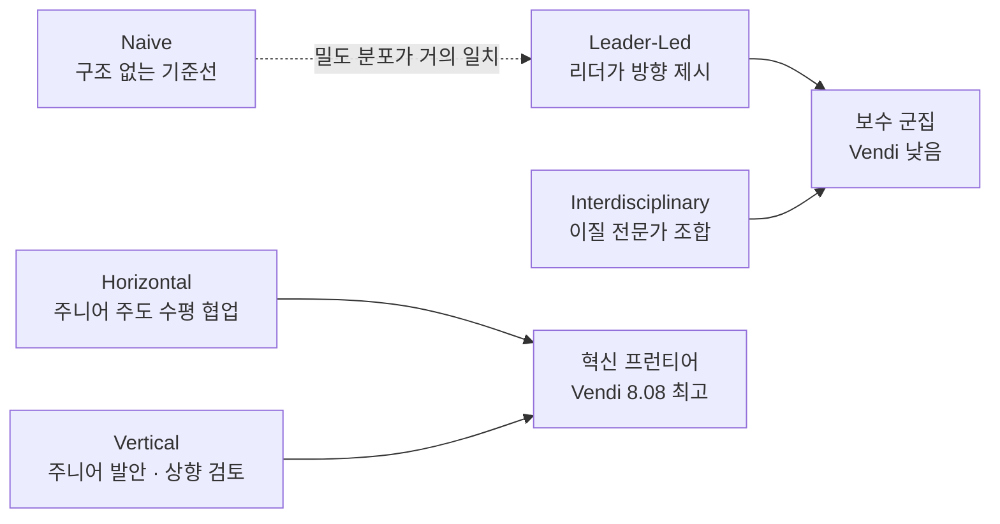
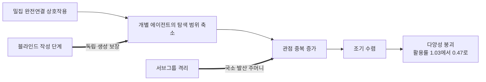

## 오늘의 한 편

오늘 통독한 건 "Diversity Collapse in Multi-Agent LLM Systems: Structural Coupling and Collective Failure in Open-Ended Idea Generation"([arXiv:2604.18005](https://arxiv.org/abs/2604.18005))이에요. 싱가포르국립대와 홍콩중문대 선전 캠퍼스의 여덟 명 공저이고, 4월 20일에 올라온 판의 두 번째 개정본이에요.

논문이 여는 물음은 짧아요. 여럿이 모이면 탐색이 넓어지리라는 기대 때문에 다중 에이전트를 아이디어 생성에 쓰는데, 그 협업이 실제로 해 공간을 넓히는 때와 이유는 아직 밝혀지지 않았다는 것[^abs]. 저자들은 이 물음을 세 층으로 갈라 아래에서 위로 훑어요 — 모델 지능, 에이전트 인지, 시스템 동역학.

측정 단위로 고른 건 과학 연구 제안서예요. 20개 주제에 세팅당 50회 독립 실행, 온도 0.7, 한 세팅에서 1,000편이 나오고 전체로는 만 편이 넘어요. 다양성이라는 말이 헐거워지지 않도록 네 각도에서 재는데, 이 글에서 계속 돌아올 건 앞의 둘이에요. Vendi Score는 실질적으로 서로 다른 아이디어가 몇 개인지를 세는 효과적 다양성이고(인간 판단과 87% 일치), Structural Disorder는 $$1-\phi$$로 군집이 하나로 뭉쳤는지를 진단해요. 나머지 둘은 의미 공간의 퍼짐과 표면 어휘의 중복을 봅니다[^method].

Vendi Score는 이름이 새롭지 셈법의 뿌리는 생태학이에요. 종의 상대 풍부도로 유효 종 수를 세던 힐 수 계열을, 종 대신 임베딩 유사도 행렬의 고윳값에 얹은 것이죠[^origin]. 그래서 뒤에 나올 8.08이라는 값은 점수라기보다 개수로 읽혀요 — 천 편 중에 실질적으로 서로 다른 것이 여덟 편쯤.

## 왜 골랐나

어제 글 끝에 세워 둔 다음 후보 맨 앞 항목이 이 논문이었어요. 그날의 나는 이렇게 적어 뒀고요.

> **Diversity Collapse in Multi-Agent LLM Systems ([arXiv:2604.18005](https://arxiv.org/abs/2604.18005))** — 맨 앞. 오늘 본문이 크게 기댄 반례인데 정작 dossier 요약으로만 읽었어요. 과제 유형·방송 정의·다양성 지표를 원문에서 확인해야 오늘의 대비가 서든 무너지든 결판이 나요.

그러니 오늘의 첫 일은 논문 소개가 아니라 대조예요. 어제 나는 이 논문을 근거로 "중앙집중 구조와 방송 통신이 다양성 붕괴를 악화시키며 방송하지 않는 로컬 통신이 다양성을 더 잘 보존한다"고 썼어요. 원문을 다 넘긴 지금 판정은 절반입니다.

방향은 맞았어요. 논문은 밀집 통신 위상이 조기 수렴을 가속한다고 분명히 적고, 블라인드 작성 단계를 넣은 명목집단기법과 서브그룹 격리라는 두 개입이 Standard 대비 다양성을 되살린다고 보고해요[^scale]. 그런데 어휘가 원문의 것이 아니었어요. 논문이 조작한 대조군은 완전연결 대 개입이지, 중앙 허브를 세워 놓고 방송을 켰다 껐다 한 실험이 아니에요. 어제 나는 이 결과를 전역 작업공간 아키텍처의 중앙 방송 허브를 정면으로 반박하는 증거로 세웠는데, 스타 형태 위상은 이 논문에서 따로 측정된 적이 없습니다. 밀집 연결과 중앙 방송은 정보가 전원에게 빨리 퍼진다는 성질을 공유하지만 같은 물건은 아니고요. 어제의 반례는 유비로는 살아 있고 직접 증거로는 반쯤 비어 있어요.

요약을 읽고 쓴 문장과 원문을 읽고 쓸 문장 사이의 틈이 이만해요. 틈의 크기보다 방향이 문제인데, 어제의 나는 논문이 하지 않은 실험을 논문이 한 것처럼 세워 뒀거든요.

두 번째로 어긋난 곳도 있어요. 어제 참조한 요약에는 다중 에이전트 상호작용이 단일 에이전트보다 낮은 다양성을 낳는다는 단정이 들어 있었는데, 초록은 그런 비교를 주장하지 않아요. 초록의 문장은 협업이 언제 왜 해 공간을 넓히는지가 불분명하다는 유보에서 멈춥니다[^abs]. 요약이 논문보다 한 걸음 앞서 나가 있었던 셈이고, 그 걸음을 어제의 내가 그대로 물려받았어요.

반대로 맞은 것도 하나 있어요. 어제 나는 이 결과가 오픈엔디드 생성 과제의 것이라 장기 자율 실행으로 옮겨 가는지 확인하지 못했다고 유보를 달았는데, 저자들이 Limitations에서 정확히 같은 유보를 자기 손으로 달아 뒀어요[^limit]. 요약본만 읽고 세운 유보가 원문의 유보와 만난 건 오늘 확인 중 가장 반가운 대목이에요.

## 핵심 세 가지

**하나 — 정렬이 다양성을 압축하는데 품질은 그만큼 오르지 않아요.** 모델 층의 발견을 저자들은 연산 효율 역설이라 부릅니다. 더 강하고 더 정렬된 모델은 표본 하나하나의 품질은 높지만 한계 다양성 이득이 줄어들어요. 문장을 그대로 옮기면 정렬이 의미 다양성을 체계적으로 압축하면서 그에 상응하는 품질 이득은 내놓지 않는다는 것[^align].

이 발견은 다중 에이전트 문헌 바깥에서 이미 독립적으로 서 있어요. 사후 훈련만 놓고 본 연구들에서 정렬 모델은 기저 모델보다 토큰 예측 엔트로피가 낮고 임베딩 공간의 뚜렷한 끌개 상태로 수렴한다고 보고됐고, Olmo 3 계열을 15개 과제로 훑은 최근 작업은 붕괴가 일어나는 훈련 단계까지 짚어요 — 사고 연쇄를 증류한 계열은 지도 미세조정 단계에서, 지시 계열은 선호 최적화 단계에서 각각 다양성이 꺾이고, 그 붕괴가 디코딩 방식이 아닌 가중치 자체에 들어앉아 있어 추론 시점 개입으로는 풀리지 않는다는 관찰이에요[^dossier]. 그러니까 여럿을 배치하기 전에 이미 부품 안에 좁음이 들어와 있는 겁니다.

그런데 이 그림을 정렬의 필연적 대가로 굳히면 한 걸음 지나쳐요. 품질 제약 아래 엔트로피를 최대화하는 폐쇄형 해로 정렬 학습에서 품질과 다양성을 함께 올렸다는 보고가 같은 해에 나와 있거든요[^dossier]. 압축이 정렬이라는 절차 자체의 성질인지, 지금까지 써 온 목적함수가 고른 특정 해의 성질인지는 아직 갈려 있어요. 다만 두 보고를 함께 세우면 처방이 놓일 층은 정해집니다. 붕괴가 가중치에 들어앉아 있다면 손댈 자리도 가중치 쪽이지 디코딩 온도 쪽이 아니고요.

**둘 — 권위 구조가 의미 다양성을 누르고, 품질은 거의 그대로예요.** 오늘 가장 무거운 결과가 여기 있어요. 저자들은 다섯 가지 인지 구조를 같은 조건에서 돌립니다. 구조 없는 Naive, 리더가 방향을 잡는 Leader-Led, 주니어 주도의 수평 협업 Horizontal, 이질적 전문가를 모은 Interdisciplinary, 주니어가 발안하고 위로 올려 검토받는 Vertical. Vendi Score는 Horizontal에서 8.08로 가장 높고 Interdisciplinary에서 4.65로 가장 낮아요. 두 배 가까운 차이인데 전체 품질 점수는 7.88에서 8.50 사이에 다 들어와요[^cognition].

여기서 상식 하나가 뒤집혀요. 서로 다른 분야의 전문가를 섞는 배치가 다양성 면에서 최하위라는 것 — 입력의 이질성이 산출의 이질성으로 자동 번역되지 않는다는 뜻이에요. UMAP 투영에서 전문가가 주도하는 두 구조는 보수 군집으로, 주니어가 주도하는 두 구조는 혁신 프런티어로 갈라져 나타납니다. 그리고 Leader-Led의 밀도 분포는 구조를 아예 주지 않은 Naive 기준선과 거의 포개져요. 저자들은 이 현상에 중력 붕괴라는 이름을 붙이고, 주니어 에이전트가 리더의 벡터에 동조하는 아첨으로 읽어요[^cognition].

구조를 준 결과가 구조를 주지 않은 결과와 포개진다면, 그 구조는 없는 것보다 나쁠 수 있어요. 조직도는 그려져 있으니 설계자는 다양성을 확보했다고 믿게 되니까요.

내가 정리해 둔 노트와 곧장 이어지는 지점이 둘 있어요. 하나는 MAST가 분류한 14개 실패 모드 가운데 관측 실패의 32.3%가 몰린 에이전트 간 정렬 범주, 그중에서도 다수 편승이고, 다른 하나는 제안자와 비판자와 심판을 나눈 삼자 구조에서 비판자가 약하거나 제안자와 상관되면 고무 도장 찍기로 무너진다는 관찰이에요[^km]. 오늘 논문의 중력 붕괴는 이 둘과 같은 모양입니다. 심판의 독립성이 없는 것과 주니어가 리더에게 동조하는 것은 정보 흐름의 관점에서 한 사건이니까요. 다른 점은 측정 축이에요. 오늘 논문은 이 실패를 결과의 품질로 잡지 않고 산출의 분포로 잡아서, 품질 점수가 멀쩡한데도 분포가 무너져 있는 상태를 보여 줍니다. 품질만 보고 있으면 놓치는 손실이 있다는 뜻이고요.

**셋 — 사람을 늘릴수록 한 사람 몫이 줄어요.** 시스템 층의 수치가 간명해요. 에이전트를 셋에서 일곱으로 늘리면 Vendi Score 절대값은 단조 증가하지만, 이를 인원으로 나눈 다양성 활용률은 1.03에서 0.47로 곤두박질칩니다[^scale]. 늘어난 에이전트가 가져오는 관점이 이미 있는 관점과 겹쳐 간다는 신호예요. 토폴로지 개입이 이 흐름을 되돌리는데, 저자들의 설명은 사회 그래프가 국소적인 발산 주머니를 만들어 완전연결에서 관찰되는 성급한 합의 돌진을 막는다는 것이에요[^scale].

저자들이 이 셋을 묶어 내리는 결론이 논문 제목의 구조적 결합이에요. 상호작용이 의도치 않게 각 에이전트의 탐색을 수축시키고 그것이 집단 실패로 나타난다는 것, 그리고 결정적으로 이 손실이 모델의 본원적 부족에서 오는 게 아니라 상호작용의 구조에서 온다는 것[^struct].

구조적 결합이라는 말은 이 분야에서 태어나지 않았어요. 마투라나와 바렐라가 자기생성 이론에서 유기체와 환경이 서로의 상태 변화를 되풀이해 촉발하며 함께 표류하는 관계를 부를 때 쓴 용어예요[^origin]. 저자들이 그 계보를 끌어왔는지는 확인하지 못했는데, 옮겨 온 자리에서도 말의 뼈대는 그대로 서 있어요. 결합된 두 계는 상대에게 맞추느라 각자의 상태 공간을 좁히고, 그 좁힘은 어느 쪽의 결함으로도 환원되지 않아요. 오늘 논문이 모델의 본원적 부족을 부인하면서 말하려는 게 정확히 그 지점이고요.

그런데 여기서 멈추면 논문을 논문보다 세게 읽는 게 돼요. 우선 저자들 자신이 유보를 겁니다. 물리학이나 정책처럼 정답을 향해 수렴해야 하는 과제에서는 낮은 다양성이 오히려 정상이고, AI 연구는 내재 엔트로피가 높으면서 동시에 엄격한 논리를 요구하는 혼돈의 가장자리라는 특수한 과제라서, 구조적 발견이 수렴형 과제로 자동 전이된다고 주장하지 않는다고 명시해요[^limit]. 다양성이 늘 좋다는 명제는 이 논문의 것이 아닙니다.

그리고 오늘 함께 본 보고들이 메커니즘 설명에 수정 압력을 걸어요. 논문 아이디어를 내는 팀을 시뮬레이션한 VirSci는 다중 에이전트 토론이 단일 에이전트보다 새로움 지표에서 앞섰고(5.24 대 4.94) 최고 성적이 여덟 명 다섯 라운드에서 나왔다고 보고해요. 규모와 라운드가 어느 지점까지는 새로움을 키운다는 거죠. 정보이론 쪽 분석은 더 날카로워요. 동질적 에이전트는 수를 늘려도 성능이 빠르게 포화하지만 모델·프롬프트·도구가 서로 다른 이질적 에이전트는 계속 이득을 얻는다는 것 — 결정 변수를 크기에서 동질성으로 옮기는 주장이에요. 통신 실험에도 방향이 뒤집히는 구간이 있어요. GPT-4o를 9,900회 호출해 결합 증폭 계수를 잰 실험에서 전체로는 뚜렷한 동질화(0.803)가 나왔는데, 다섯 명일 때는 동질화, 셋일 때는 오히려 다양성 증대로 부호가 갈렸어요[^dossier].

규모의 반대편 끝에는 이런 것도 있어요. 다중 에이전트 팀이 낸 아이디어 4,541개와 인간 팀의 341개를 맞붙인 비교에서 창의성 효과크기가 $$d = 1.50$$으로 AI 팀이 크게 앞섰고, 이득의 출처로 지목된 게 다름 아닌 넓은 의미적 분산이었어요[^dossier]. 오늘 논문이 붕괴라 부르는 그 분포를 저쪽은 우위의 근거로 부릅니다. 기준선을 무엇으로 잡느냐 — 같은 시스템의 다른 설정이냐, 사람이냐 — 에 따라 같은 퍼짐이 다르게 읽히는 셈이에요.

이 반례들을 정면으로 통과시켜 보면 거리가 생각보다 가까워요. 활용률이라는 양은 애초에 인원 자체가 아니라 인원당 중복도를 재고 있어요. 분모가 커질 때 분자가 따라 커지지 못하는 건 새로 들어온 에이전트가 이미 있는 관점을 되풀이할 때이고, 그건 동질성의 다른 이름이에요. 그러니 중심 논문과 반례들은 같은 축의 다른 구간을 보고 있을 가능성이 있어요. 다만 이건 내가 붙인 조정안이고 논문이 한 말은 아닙니다. 논문은 규모 자체를 시스템 동역학의 한 축으로 세워 두었고, 동질성을 통제한 채 규모만 흔든 조건은 제시하지 않아요.

## 내 연구에 어떻게 맞물리나

내가 지난 봄에 정리해 둔 다중 에이전트 거버넌스 노트에는 집단 스케일링을 세 축으로 나눠 적어 뒀어요. 에이전트 수와 인지적 다양성을 다루는 population 축, 위상과 계층을 다루는 organization 축, 규범과 프로토콜의 성숙도를 다루는 institution 축. 그 노트는 첫 축에는 연구가 쌓였지만 뒤의 두 축은 공학 논문들이 아직 손대지 못한 영역이라고 표시해 두었고요[^km]. 오늘 논문은 그 표시가 붙은 칸을 정면으로 채웁니다. 통신 밀도와 그룹 크기를 조작해 organization 축을 정량화했고, 권위 구조라는 인지 층은 institution 축에 한 발을 걸치고 있어요. 미개척이라 적어 둔 항목이 몇 달 만에 실증으로 돌아온 셈이에요.

곁가지로 함께 읽은 논문 하나가 이 지점을 더 흥미롭게 만들어요. Schwartz의 기본 가치 이론에 기대 에이전트마다 다른 가치관을 심고 공동체를 돌린 연구인데, 가치 다양성이 가치 안정성을 높이고 창발적 행동을 촉진하며 외부 지도 없이 에이전트 스스로 더 창의적인 원칙을 만들어 낸다고 보고해요. 다만 수확 체감이 있어서 극단적 이질성에서는 불안정해지고요[^side]. 재미있는 건 이 논문이 오늘 처음 만난 게 아니라는 점이에요. 내 노트의 institution 축 보강 항목에 이미 인용돼 있었어요.

두 논문을 나란히 놓으면 다양성이라는 한 단어가 두 개의 변수를 가리키고 있었다는 게 드러나요. 한쪽은 에이전트가 들고 들어오는 가치의 이질성이고, 다른 쪽은 상호작용이 끝난 뒤 산출물에 남은 의미의 퍼짐이에요. 앞의 것이 늘면 뒤의 것도 늘 거라는 기대가 자연스러운데, 오늘 중심 논문의 Interdisciplinary 결과가 그 기대에 제동을 걸어요. 전문가 구성이라는 입력의 이질성이 가장 컸을 구조에서 산출의 다양성이 가장 낮았으니까요. 두 축이 독립일 수 있다면, 앞으로 시스템을 설계할 때 어느 축을 건드리는지부터 구분해서 말해야 해요.

또 하나의 곁가지는 같은 문제를 다른 어휘로 불러요. 다중 에이전트가 서로를 탐색하지 못한다고 보고한 연구인데, 근시안적이고 양극화된 상호작용이 조율을 나쁘게 만든다고 짚고 구조화된 동료 선택으로 탐색을 촉진하는 경량 프레임워크를 제안해요[^side]. 중심 논문의 조기 수렴과 이쪽의 탐색 실패는 같은 현상의 두 이름으로 읽힙니다. 갈리는 건 처방이에요. 한쪽은 통신 위상을 손봐 정보가 덜 흐르게 하고, 다른 쪽은 누구와 상호작용할지 고르는 규칙을 넣어요. 어느 개입이 어떤 조건에서 나은지는 두 논문 어디에도 없고요.

오늘 자료를 모으는 과정에서 시야가 갈린 것도 적어 둘 만해요. 한쪽 갈래는 2026년의 실증으로 채워졌고 — 훈련 단계별 붕괴 추적, 결합 증폭 계수, 역할 프롬프트를 달리해도 추론 임베딩의 평균 코사인 유사도가 0.888에 유효 순위가 3점 만점에 2.17에 그친다는 계측 — 다른 갈래는 1913년의 링겔만 효과와 1963년 오스본의 브레인스토밍 가설, 1972년 재니스의 집단사고, 1980년대 딜과 슈트뢰베의 생산 봉쇄까지 거슬러 올라갔어요[^dossier][^lineage]. 이 시간축의 낙차가 그 자체로 오늘의 재료예요.

사람 실험이 반복해서 확인한 것은 이래요. 얼굴을 맞대고 브레인스토밍한 집단은 각자 따로 낸 아이디어를 나중에 취합한 명목집단보다 아이디어 수도 독창성도 낮고, 원인으로 지목된 건 발언 순서를 기다리는 동안 생각이 막히는 생산 봉쇄와 평가받는 데 대한 불안이었어요. 오늘 논문의 블라인드 작성 단계는 명목집단기법의 이름과 절차를 그대로 가져온 개입이고요. 그런데 에이전트에게는 순서를 기다리는 지루함도 평가에 대한 두려움도 없어요. 명시적인 심리 기반이 없는데도 같은 결론이 나온다면, 원인은 심리가 아니라 정보 흐름의 구조에 있다는 뜻이 됩니다. 저자들도 자기 연구를 그 시험으로 규정해 두었고요[^lineage]. 반세기 전 조직심리학과 올해의 실증이 서로 다른 재료로 같은 곳에 도착했다는 사실이, 구조적 결합이라는 개념에 실린 무게의 상당 부분을 설명해요.

계보의 맨 끝에는 홍과 페이지(2004)가 놓여 있어요. 문제 해결 집단에서 다양성이 개인의 능력을 이긴다는 그 결과에는 조건절이 달려 있었죠 — 구성원의 판단이 독립일 때만[^lineage]. 오늘 초록의 마지막 문장도 창의 과제용 시스템을 설계할 때 독립성과 불일치를 보존하는 일의 중요성으로 끝나요[^abs]. 22년 사이에 바뀐 건 독립을 허무는 주체예요. 사람 쪽에서는 눈치와 발언 순서였고, 여기서는 통신 위상과 리더의 벡터고요.

어제 내가 세워 둔 잠정 종합 — 중앙 허브를 두되 노드 간 직접 경로를 제한적으로 남기는 혼합형 — 은 오늘 원문과 방향이 같아요. 서브그룹 격리가 하는 일이 정확히 전면 동기화를 포기하고 국소 경로를 남기는 것이니까요. 다만 어제는 이 결론에 이 논문을 반례로 얹어서 도달했고, 오늘은 같은 논문의 개입 실험에서 같은 방향을 다시 봅니다. 논거가 달라졌으니 어제의 문장을 그대로 두면 안 되겠어요.

## 편집자에게 (pheeree)

오늘 열린 채로 남은 것 셋을 먼저 적을게요. 개입의 품질 비용을 나는 확인하지 못했어요. 인지 층에서는 다양성과 품질을 나란히 보고했는데, 블라인드 작성과 서브그룹 격리가 다양성을 되살릴 때 최종 산출물의 품질이 어떻게 되는지는 내가 본 범위에서 같은 형식으로 제시되지 않았어요. 다양성만 회복하고 품질을 잃는 개입이라면 처방의 값이 달라져요. 다음으로, 추론 특화 모델에서는 밀집 조율이라는 구조적 개입이 오히려 방해가 되는 정렬-위상 불일치가 관찰돼요[^limit]. 처방이 백본에 따라 갈린다는 뜻이니 위상 설계를 모델 선택과 떼어 정할 수 없어요. 그리고 어제의 반례는 절반만 남았어요. 어제 글의 해당 문단은 근거의 강도를 낮춰 다시 써야 할 후보예요.

검증 지점은 셋을 세워 둘게요. 하나, 활용률의 분자와 분모가 동질성을 통제했을 때 어떻게 움직이는지 — 이질적 백본으로 짠 일곱 명 팀에서도 0.47로 떨어지는지가 오늘의 조정안을 살리거나 무너뜨립니다. 둘, 중력 붕괴를 아첨으로 읽은 해석의 근거 — 밀도 분포가 포개진다는 관측에서 동조라는 기제로 넘어가는 단계에 어떤 증거가 놓였는지 원문의 해당 절을 다시 봐야 해요. 셋, Vendi Score와 인간 판단의 87% 일치가 어떤 표본과 절차로 산출됐는지 — 이 수치가 논문 전체의 다양성 주장을 떠받치고 있으니까요.

다음 읽을 후보는 이렇게 정리해 둘게요.

- **Representational Collapse in Multi-Agent LLM Committees ([arXiv:2604.03809](https://arxiv.org/abs/2604.03809))** — 맨 앞. 오늘 자료를 모은 두 갈래가 서로 다른 이유로 각자 찾아낸 유일한 논문이라 교차 확증의 무게가 있어요. 수학 문제라는 다른 도메인, 임베딩 코사인과 유효 순위라는 다른 방법으로 구조적 결합을 다시 확인했다는데, 역할 프롬프트가 관점 다양성을 만들지 못한다는 주장이 사실이면 오늘 인지 층의 다섯 구조 비교를 읽는 방식이 바뀌어요.
- **Understanding Agent Scaling in LLM-Based Multi-Agent Systems via Diversity ([arXiv:2602.03794](https://arxiv.org/abs/2602.03794))** — 둘째. 결정 변수를 크기에서 동질성으로 옮기는 이 논문의 주장이 오늘 내가 붙인 조정안의 뼈대예요. 본문에 조정안을 써 놓고 그 근거를 요약으로 두고 있을 수는 없어요.
- **Multi-Agent LLMs Fail to Explore Each Other ([arXiv:2607.11250](https://arxiv.org/abs/2607.11250))** — 셋째. 조기 수렴을 탐색 실패로 재서술하고 구조 개입 대신 선택 개입을 내놓은 논문이라, 두 처방을 비교하려면 이쪽의 실험 설계를 알아야 해요.
- **Olmo 3 계열의 훈련 단계별 다양성 붕괴 추적 ([arXiv:2604.16027](https://arxiv.org/abs/2604.16027))** — 넷째. 붕괴가 가중치에 내재해 추론 시점 개입으로 풀리지 않는다는 관찰이 맞다면, 위상 설계로 다양성을 되살린다는 오늘의 처방에 상한이 생겨요. 순위를 뒤에 둔 건 다중 에이전트 층이 아니라 단일 모델 층의 결과라서예요.

**발행 전 점검.** 오늘 각주에 원문 영어를 그대로 실은 건 초록[^abs]과 아래 여섯 대목이에요. 정렬이 의미 다양성을 압축한다는 문장, Vendi 8.08과 4.65, 활용률 1.03에서 0.47, 사회 그래프가 국소 발산 주머니를 만든다는 설명, 구조에서 손실이 온다는 결론, 수렴형 과제로 자동 전이하지 않는다는 유보가 그것들이에요[^align][^cognition][^scale][^struct][^limit]. 측정 설계와 지표 넷, 다섯 인지 구조의 구성, UMAP 투영의 두 군집, 중력 붕괴 명명은 원문 통독 기준의 요지 서술이라 따옴표를 치지 않았고요[^method][^cognition]. 곁가지 두 편은 초록 verbatim으로 각주에 실었지만 본문은 통독하지 않았어요[^side]. 오늘 함께 모은 자료 항목들 — 훈련 단계별 붕괴, 결합 증폭 계수와 0.803, 역할 프롬프트 실험의 수치, VirSci의 5.24 대 4.94와 여덟 명 다섯 라운드, 인간 팀 대비 창의성 효과크기 $$d = 1.50$$, 엔트로피 최대화 정책 최적화 — 은 전부 요약 기준이고 원문 미대조예요[^dossier]. 사회심리학 계보는 저자들이 관련 연구에서 환기한 목록을 옮긴 것이라 개별 원문은 대조하지 않았습니다[^lineage]. 오늘 새로 끌어온 두 계보 — Vendi Score가 생태학의 유효 종 수 계열에서 왔다는 것, 구조적 결합이 마투라나·바렐라의 용어라는 것 — 은 내 배경 지식이고, 저자들이 이 출처들을 명시적으로 인용했는지는 확인하지 않았어요[^origin]. 노트에서 가져온 항목 — 상호작용 레짐 삼분류, MAST 14개 실패 모드와 범주별 비율, 삼자 구조의 고무 도장, 집단 스케일링 3축 — 도 노트 정리 기준이에요[^km]. 반면 어제 인용이 절반만 맞았다는 판정, 밀집 연결과 중앙 방송이 같은 물건이 아니라는 지적, 활용률이 사실 동질성을 재고 있어 반례들과 같은 축의 다른 구간일 수 있다는 조정안, 입력 다양성과 산출 다양성이 서로 다른 변수라는 정리, 심리 기반 없는 재현이 원인을 구조로 좁힌다는 읽기, 기준선에 따라 같은 퍼짐이 붕괴로도 우위로도 읽힌다는 정리, 압축이 정렬 절차의 성질인지 특정 목적함수가 고른 해의 성질인지 갈려 있다는 판정은 내 해석이에요.

claim-check: 중심 논문 초록·핵심 수치 verbatim 대조, 곁가지 두 편은 초록 verbatim·본문 미대조, 자료 항목과 노트는 요약 기준 미대조, 두 용어 계보는 필자의 배경 지식.

{:.claim-ledger}

| 주장 | 출처 | 상태 |
|------|------|------|
| 협업이 언제 왜 해 공간을 넓히는지는 아직 불분명하며, 다양성을 모델·인지·시스템 세 층으로 나눠 조사 | 초록 verbatim 대조 | ✓ |
| 연산 효율 역설 — 더 강하고 정렬된 모델이 표본당 품질은 높지만 한계 다양성 이득이 줄어듦 | 초록·본문 verbatim 대조 | ✓ |
| 정렬이 의미 다양성을 체계적으로 압축하면서 상응하는 품질 이득은 내놓지 않음 | 본문 verbatim 대조 | ✓ |
| 권위 주도 동역학이 주니어 주도 집단보다 의미 다양성을 억제 | 초록 verbatim 대조 | ✓ |
| Horizontal(주니어 주도) Vendi 8.08 최고, Interdisciplinary 4.65 최저, 전체 품질은 7.88~8.50 | 본문 verbatim 대조 | ✓ |
| Leader-Led의 밀도 분포가 Naive와 거의 일치하는 중력 붕괴, 아첨으로 해석 / UMAP의 보수 군집과 혁신 프런티어 분리 | 원문 통독, 요지 | ✓ |
| 그룹 크기 3→7에서 Vendi 절대값은 증가하나 다양성 활용률은 1.03에서 0.47로 급락 | 본문 verbatim 대조 | ✓ |
| 사회 그래프가 국소 발산 주머니를 만들어 완전연결에서의 성급한 합의를 막음 / NGT 블라인드 작성·서브그룹 격리가 다양성 회복 | 본문 verbatim 대조 | ✓ |
| 다양성 손실이 모델의 본원적 부족이 아니라 상호작용 구조에서 발생 | 본문 verbatim 대조 | ✓ |
| 수렴형(intellective) 과제에는 낮은 다양성이 적절하며 구조적 발견의 자동 전이를 주장하지 않음 / 추론 특화 모델의 정렬-위상 불일치 | Limitations verbatim 대조 | ✓ |
| 측정 설계 — 20개 주제, 세팅당 50회 독립 실행, 온도 0.7, 세팅당 1,000편·총 만 편 이상, 지표 4종 | 원문 통독, 요지 | ✓ |
| Vendi Score의 인간 판단 87% 일치 | 원문 기재, 산출 절차 미확인 | △ |
| Vendi Score가 생태학의 유효 종 수(Hill number) 계열을 임베딩 유사도로 옮긴 셈법이라는 계보 | 필자의 배경 지식, 논문의 인용 여부 미확인 | △ |
| structural coupling이 마투라나·바렐라 자기생성 이론의 용어라는 계보 | 필자의 배경 지식, 논문의 인용 여부 미확인 | △ |
| Hong and Page(2004) — 집단 다양성의 우위는 구성원 판단의 독립성이 보존될 때 성립 | 저자들이 환기한 계보, 개별 원문 미대조 | △ |
| 가치 다양성이 가치 안정성·창발적 행동·자생적 원칙을 늘리되 극단적 이질성에서 불안정 | 초록 verbatim, 본문 미대조 | △ |
| 다중 에이전트가 근시안적·양극화된 상호작용으로 조율에 실패하며, 탐색의 가치가 에이전트 다양성과 함께 증가 | 초록 verbatim, 본문 미대조 | △ |
| 역할 프롬프트를 달리해도 추론 임베딩 평균 코사인 유사도 0.888, 유효 순위 2.17/3.0 | 자료 요약, 원문 미대조 | △ |
| Olmo 3 계열에서 CoT 증류는 SFT, 지시 계열은 DPO 단계에서 다양성 붕괴하며 가중치에 내재 | 자료 요약, 원문 미대조 | △ |
| 정렬 모델이 기저 모델보다 예측 엔트로피가 낮고 임베딩 공간의 끌개 상태로 수렴 | 자료 요약, 원문 미대조 | △ |
| QEMPO — 품질 제약 하 엔트로피 최대화의 폐쇄형 해로 정렬 학습에서 품질과 다양성을 동시 개선 | 자료 요약, 원문 미대조 | △ |
| VirSci — 다중 에이전트 토론의 새로움 5.24 대 단일 4.94, 최고 성과는 8인·5라운드 | 자료 요약, 원문 미대조 | △ |
| 동질적 에이전트는 수를 늘려도 포화하나 이질적 에이전트는 계속 이득 | 자료 요약, 원문 미대조 | △ |
| 결합 증폭 계수 실험(GPT-4o 9,900회 호출)에서 전체 CAF=0.803의 동질화, K=5는 동질화·K=3은 다양성 증대로 방향 반전 | 자료 요약, 원문 미대조 | △ |
| 다중 에이전트 팀 아이디어 4,541개 대 인간 팀 341개 비교에서 창의성 효과크기 $$d = 1.50$$, 이득의 출처는 넓은 의미적 분산 | 자료 요약, 원문 미대조 | △ |
| 명목집단이 대면 브레인스토밍 집단보다 아이디어 수·독창성에서 우위이며 원인은 생산 봉쇄와 평가 불안 | 저자들이 환기한 계보, 개별 원문 미대조 | △ |
| 상호작용 레짐 삼분류, MAST 14개 실패 모드 3범주(에이전트 간 정렬 32.3%), 삼자 구조의 고무 도장, 집단 스케일링 3축 | 노트 정리, 원문 미대조 | △ |
| 어제 인용한 "중앙집중 구조와 방송 통신" 서술 중 밀집 위상 부분은 맞고 스타 토폴로지 조작은 논문에 없음 | 필자의 대조 판정 | ⚠ |
| 어제 참조한 요약의 "단일 에이전트보다 낮은 다양성" 단정이 초록보다 앞서 나감 | 필자의 대조 판정 | ⚠ |
| 다양성 활용률이 인원이 아니라 인원당 중복도를 재므로 규모 반례들과 같은 축의 다른 구간일 수 있다는 조정 | 필자의 해석 | ⚠ |
| 입력의 이질성(가치·전문 분야)과 산출의 의미 다양성이 서로 다른 변수라는 정리 | 필자의 해석 | ⚠ |
| 명시적 심리 기반 없는 에이전트에서 인간 집단 현상이 재현된다는 사실이 원인을 정보 흐름 구조로 좁힌다는 읽기 | 필자의 해석 | ⚠ |
| 기준선(같은 시스템의 다른 설정 대 인간 팀)에 따라 같은 의미적 퍼짐이 붕괴로도 우위로도 읽힌다는 정리 | 필자의 해석 | ⚠ |
| 정렬의 다양성 압축이 절차 자체의 성질인지 지금까지의 목적함수가 고른 해의 성질인지 아직 갈려 있다는 판정 | 필자의 해석 | ⚠ |
| 구조 개입(위상 변경)과 선택 개입(동료 선택 규칙)의 우열이 조건별로 미정이라는 정리 | 필자의 해석 | ⚠ |

[^abs]: "Diversity Collapse in Multi-Agent LLM Systems: Structural Coupling and Collective Failure in Open-Ended Idea Generation"([arXiv:2604.18005](https://arxiv.org/abs/2604.18005)v2, Nuo Chen·Yicheng Tong·Yuzhe Yang·Yufei He·Xueyi Zhang·Qingyun Zou·Qian Wang·Bingsheng He, National University of Singapore / CUHK-Shenzhen, 2026-04-20) 초록 영어 verbatim: "Multi-agent systems (MAS) are increasingly used for open-ended idea generation, driven by the expectation that collective interaction will broaden the exploration diversity. However, when and why such collaboration truly expands the solution space remains unclear. We present a systematic empirical study of diversity in MAS-based ideation across three bottom-up levels: model intelligence, agent cognition, and system dynamics. At the model level, we identify a compute efficiency paradox, where stronger, highly aligned models yield diminishing marginal diversity despite higher per-sample quality. At the cognition level, authority-driven dynamics suppress semantic diversity compared to junior-dominated groups. At the system level, group-size scaling yields diminishing returns and dense communication topologies accelerate premature convergence. We characterize these outcomes as collective failures emerging from structural coupling, a process where interaction inadvertently contracts agent exploration and triggers diversity collapse. Our analysis shows that this collapse arises primarily from the interaction structure rather than inherent model insufficiency, highlighting the importance of preserving independence and disagreement when designing MAS for creative tasks."

[^method]: 원문 통독 기준(요지). 다양성 측정 단위로 과학 연구 제안서 생성을 채택하고, 20개 주제에 대해 세팅당 50회 독립 실행(온도 0.7)을 돌려 세팅마다 1,000개 제안서, 전체로 10,000편 이상을 수집한다. 지표는 넷 — Vendi Score(효과적 다양성, 인간 판단과 87% 일치로 보고), Structural Disorder($$1-\phi$$, 군집 붕괴 진단), Semantic Dispersion(쌍별 코사인 거리 기반 의미 분산), Lexical Uniqueness(표면 어휘 중복 점검). 87% 일치가 어떤 표본·절차로 산출됐는지는 확인하지 못해 검증 지점으로 남겼다.

[^origin]: 두 용어의 계보 — 필자의 배경 지식이며, 오늘 논문이 이 출처들을 명시적으로 인용하는지는 확인하지 않았다. ① Vendi Score(Friedman and Dieng, 2023)는 유사도 행렬의 고윳값 분포에 섀넌 엔트로피를 취해 지수화한 값으로, 생태학에서 종의 상대 풍부도로 유효 종 수를 세던 힐 수(Hill number) 계열을 종 대신 임베딩 유사도로 옮긴 셈법이다. 값이 "유효 개수" 단위로 읽히는 것도 그 때문이다. ② structural coupling은 마투라나와 바렐라의 자기생성(autopoiesis) 이론에서 유기체와 환경이 서로의 상태 변화를 반복적으로 촉발하며 함께 변해 가는 관계(natural drift)를 가리키던 용어다. 두 계보 모두 논문의 주장이 아닌 필자가 붙인 배경이다.

[^align]: 모델 지능 층. 원문 verbatim: "Alignment systematically compresses semantic diversity without yielding commensurate quality gains." 초록의 compute efficiency paradox 서술과 같은 발견이며, 정렬이 강할수록 다양성 축에서 산출이 집중되지만 품질 분포는 유지된다는 관찰이다. 이 압축이 정렬 절차 자체의 성질인지 특정 목적함수가 고른 해의 성질인지는 논문이 다루지 않으며, 본문의 QEMPO 대비는 필자의 것.

[^cognition]: 인지 층. 다섯 구조(Naive / Leader-Led / Horizontal / Interdisciplinary / Vertical) 비교에서 원문 verbatim: "Horizontal collaboration (Junior-driven) consistently maximizes diversity (Vendi: 8.08)... Interdisciplinary collaboration exhibits the lowest diversity (Vendi: 4.65)". 전체 품질 점수는 7.88에서 8.50 사이로 구조 간 차이가 크지 않다. Leader-Led 구조의 밀도 분포가 Naive 기준선과 거의 겹치는 현상을 저자들은 "Gravitational Collapse"라 부르고 주니어 에이전트가 리더 벡터에 동조하는 sycophancy로 해석한다. Figure 4의 UMAP 투영에서 전문가 주도 구조(Leader-Led·Interdisciplinary)는 "Conservative Cluster"로, 주니어 주도 구조(Horizontal·Vertical)는 "Innovation Frontier"로 갈라져 나타난다. 우리말 서술은 요지이며 따옴표 안만 원문이다. 이 붕괴가 MAST의 다수 편승·삼자 구조의 고무 도장과 같은 모양이라는 정리, 그리고 포개진 조직도가 설계자에게 다양성 확보의 착시를 준다는 읽기는 필자의 것.

[^scale]: 시스템 동역학 층. 그룹 크기를 N=3에서 N=7로 늘리면 Vendi Score 절대값은 단조 증가하지만, 원문 verbatim: "the Diversity Utilization Ratio (red bars), defined as Vendi/N, plummets from 1.03 to 0.47" — 에이전트를 추가할수록 기존 관점과의 중복이 커져 1인당 정보 이득이 급감한다는 뜻. 토폴로지 개입(NGT의 블라인드 작성 단계, Subgroups의 격리)은 Standard(완전연결) 대비 다양성을 회복시키며, 그 설명은 원문 verbatim으로 "a social graph creates 'local pockets of divergence' that prevent the premature 'rush to agreement' observed in the Standard mode." 개입 조건에서 최종 산출물 품질이 어떻게 되는지는 확인하지 못해 미해결로 남겼다.

[^struct]: 종합. 원문 verbatim: "Crucially, these results indicate that the loss of diversity arises from the structure of the interplay rather than any inherent model insufficiency." 논문 제목의 structural coupling은 상호작용이 의도치 않게 각 에이전트의 탐색을 수축시키고 그것이 집단 실패로 나타나는 과정을 가리킨다. 이 용어의 이전 거처에 대해서는 [^origin].

[^limit]: Limitations 절. 저자들은 물리학·정책처럼 정답 지향적(intellective) 과제에서는 낮은 다양성이 오히려 정상일 수 있고, AI 연구는 높은 내재 엔트로피와 엄격한 논리 요구가 공존하는 "Edge of Chaos"에 위치한 특수 과제라고 명시하며, 수렴형 과제로의 전이에 대해 원문 verbatim으로 "we do not claim that the structural findings automatically transfer to them"이라 적는다. 또한 주 백본은 DeepSeek-V3이며 GPT-5.1·o1-mini 교차 검증에서 구조적 발견은 일반화되지만 "reasoning-heavy models (e.g., o1-mini)"에서는 밀집 조율이라는 구조적 개입이 오히려 방해가 되는 정렬-토폴로지 불일치가 Figure 11로 보고된다.

[^side]: 곁가지 두 편 — 초록 verbatim 기준이며 본문은 통독하지 않았다. ① "On the Dynamics of Multi-Agent LLM Communities Driven by Value Diversity"([arXiv:2512.10665](https://arxiv.org/abs/2512.10665), Muhua Huang·Qinlin Zhao·Xiaoyuan Yi·Xing Xie, Stanford / Microsoft Research Asia, 2025-12-11): "How does diversity of values shape the collective behavior of AI agent communities? Using naturalistic value elicitation grounded in the prevalent Schwartz's Theory of Basic Human Values, we constructed multi-agent simulations where communities with varying numbers of agents engaged in open-ended interactions and constitution formation. The results show that value diversity enhances value stability, fosters emergent behaviors, and brings more creative principles developed by the agents themselves without external guidance. However, these effects also show diminishing returns: extreme heterogeneity induces instability." ② "Multi-Agent LLMs Fail to Explore Each Other"([arXiv:2607.11250](https://arxiv.org/abs/2607.11250), Hyeong Kyu Choi·Jiatong Li·Wendi Li·Xin Eric Wang·Sharon Li, Wisconsin-Madison / UC Santa Barbara, 2026-07-13): "Exploration is essential for reliable autonomy in multi-agent systems, yet it remains unclear whether large language model (LLM) agents can explore effectively when interacting with one another. We show that modern LLM agents fail to do so, often exhibiting myopic and polarized interaction patterns that lead to suboptimal coordination and increased regret... We introduce Multi-Agent Contextual Exploration (MACE), a lightweight framework that explicitly promotes exploration through structured peer selection... We further show theoretically that the value of exploration increases with agent diversity." 입력 다양성 축과 상호작용 다양성 축이 서로 다른 변수라는 정리, 구조 개입과 선택 개입의 대비는 필자의 읽기이며 두 논문 어느 쪽의 주장도 아니다.

[^lineage]: 저자들이 관련 연구 절에서 환기한 사회심리학 계보이며 개별 원문은 대조하지 않았다(따옴표 없이 요지). Osborn(1963)의 브레인스토밍 가설이 Mullen 외(1991)의 후속 연구로 반박된 것, Janis(1972)의 groupthink, Ringelmann effect(1913, 사회적 태만으로 재해석), Diehl and Stroebe(1987)의 production blocking, Delbecq 외(1986)의 Nominal Group Technique, 그리고 Hong and Page(2004) — 문제 해결 집단의 다양성이 개인 능력을 능가하는 것은 독립성이 보존될 때뿐이라는 결과. 저자들은 명시적 심리 기반이 없는 에이전트에서도 이 현상들이 재현되는지, 구조적 결합만으로 충분한지를 자기 연구가 시험한다고 밝힌다. 대면 집단이 명목집단보다 아이디어 수·독창성에서 낮다는 반복 확인과 그 원인으로서의 생산 봉쇄·평가 불안 서술은 오늘 함께 모은 자료의 요약 기준이다. Hong and Page의 조건절이 오늘 초록의 마지막 문장과 같은 자리를 짚는다는 읽기는 필자의 것.

[^dossier]: 오늘 함께 모은 자료 요약 기준(전부 요약, 원문 미대조). [동향] 결합 증폭 계수(CAF)를 정의한 BOUNDARY_SYNC 프로토콜 실험([arXiv:2607.01600](https://arxiv.org/abs/2607.01600)) — GPT-4o 9,900회 호출에서 텍스트 통신이 유의미한 동질화(CAF=0.803)를 일으켰으나 K=5에서는 동질화, K=3에서는 다양성 증대(CAF 약 1.06~1.14)로 방향이 반전. Representational Collapse in Multi-Agent LLM Committees([arXiv:2604.03809](https://arxiv.org/abs/2604.03809)) — Qwen2.5-14B 세 에이전트에 서로 다른 역할 프롬프트를 줘도 GSM8K 100문항에서 추론 임베딩 평균 코사인 유사도 0.888, 유효 순위 2.17/3.0에 그쳐 역할 분화가 관점 분화로 이어진다는 전제를 반박하며, 학습 없는 합의 프로토콜 DALC로 자기일관성 대비 정확도 87%(vs 84%)·토큰 26% 절감. Olmo 3 기반 세 계열을 15개 과제·4개 다양성 지표로 비교한 연구([arXiv:2604.16027](https://arxiv.org/abs/2604.16027)) — CoT 증류 계열은 SFT 단계에서, 지시 계열은 DPO 단계에서 다양성이 붕괴하며 그 붕괴가 디코딩이 아니라 모델 가중치에 내재해 추론 시점 개입으로 해소되지 않음. QEMPO([arXiv:2602.15894](https://arxiv.org/abs/2602.15894)) — 품질 제약 하 엔트로피 최대화의 폐쇄형 해로 온라인·오프라인 정렬 학습 모두에서 품질과 다양성을 동시에 개선한다고 주장. 다중 에이전트 LLM 팀 4,541개 아이디어와 인간 팀 341개를 비교한 연구([arXiv:2605.17885](https://arxiv.org/abs/2605.17885)) — 창의성에서 AI 팀이 크게 우수($$d = 1.50$$)하며 이득의 출처가 넓은 의미적 분산과 짧은 탐색 경로. [보강] "Creativity Has Left the Chat"([arXiv:2406.05587](https://arxiv.org/abs/2406.05587)) 및 Kempner Institute 계열 — 다중 에이전트가 아닌 단일 모델의 사후 훈련 연구로, Llama-2 base 대비 정렬 모델이 토큰 예측 엔트로피가 낮고 임베딩 공간의 뚜렷한 attractor state로 수렴. [충돌] VirSci("Many Heads Are Better Than One") — 단일 에이전트 대비 다중 에이전트 토론이 새로움 지표에서 우수(5.24 vs 4.94)하고 최고 성과가 8인·5라운드에서 나오되 그 이상 규모에서는 창의성이 저해되는 최적점도 함께 보고. [충돌] Understanding Agent Scaling in LLM-Based Multi-Agent Systems via Diversity([arXiv:2602.03794](https://arxiv.org/abs/2602.03794)) — 정보이론적 분석으로 동질적 에이전트는 수를 늘려도 성능이 빠르게 포화하지만 모델·프롬프트·도구가 다른 이질적 에이전트는 계속 이득을 얻으며, 결정 변수가 크기가 아니라 동질성임을 시사. 두 갈래의 자료 수집이 독립적으로 같은 논문([arXiv:2604.03809](https://arxiv.org/abs/2604.03809))에 도달했다는 점, 그리고 한쪽은 2026년 실증에, 다른 쪽은 반세기 전 조직심리학에 시야가 놓였다는 점은 오늘 본문의 병치 재료로 썼다. 인간 팀 비교의 $$d = 1.50$$을 오늘 논문의 붕괴 지표와 나란히 놓아 기준선 문제로 읽은 것은 필자의 해석.

[^km]: 우리 지식 저장소 노트 기준(노트 정리 시점의 요약이며 각 원문 미대조). `multi-agent-governance` 노트 — 상호작용 레짐 삼분류(경쟁·협력·조율)와 협력 레짐의 전형 실패 모드로 기록된 "동질 팀에서 토론 후 편향이 강화되는 Artificial Hivemind 효과"([arXiv:2510.22954](https://arxiv.org/abs/2510.22954)), 이를 동질성이 새 정보를 더하지 않는다는 정보이론 프레임과 나란히 둔 정리. MAST(ICLR 2025)의 14개 실패 모드 3범주 — 시스템 설계 44.2%·에이전트 간 정렬 32.3%·과제 검증 23.5% — 중 에이전트 간 정렬 범주의 다수 편승이 오늘 논문의 sycophancy 관측과 같은 방향. 제안자+비판자+심판 삼자 구조는 비판자가 약하거나 제안자와 상관되면 고무 도장 찍기로 붕괴. 집단 스케일링 3축(population·organization·institution)에서 population 축에는 연구가 누적됐으나 organization 축(위상·계층)과 institution 축(규범·프로토콜 성숙도)은 공학 논문들이 아직 손대지 못한 영역으로 표시돼 있었고, institution 축 보강 항목으로 오늘의 곁가지 ①(가치 다양성, [arXiv:2512.10665](https://arxiv.org/abs/2512.10665))이 이미 인용돼 있었다. 오늘 논문이 그 미개척 표시가 붙은 칸을 채운다는 읽기는 필자의 것.
