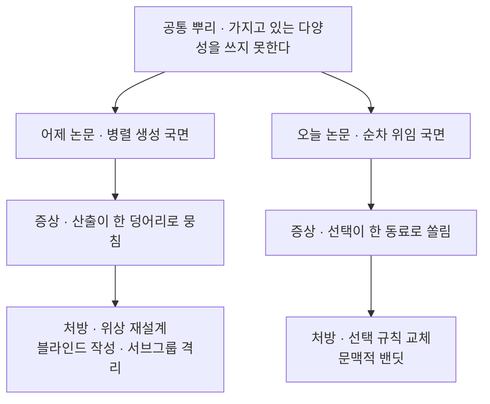
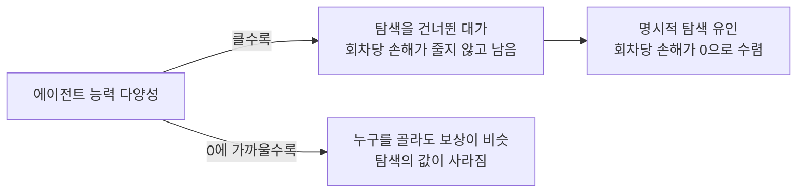

## 오늘의 한 편

오늘 통독한 건 "Multi-Agent LLMs Fail to Explore Each Other"([arXiv:2607.11250](https://arxiv.org/abs/2607.11250))예요. 위스콘신-매디슨과 UC 산타바버라의 다섯 명 공저이고, 7월 13일에 올라왔어요.

논문이 세운 전제는 한 줄이에요. 여러 에이전트가 서로에게 일을 넘기며 굴러가는 시스템의 자율성을 믿으려면 그 시스템이 탐색을 할 줄 알아야 한다는 것. 그런데 LLM 에이전트가 서로를 상대로 탐색해 내는지는 확인된 적이 없었고, 초록의 답은 못 한다는 쪽이에요. 근시안적이고 양극화된 상호작용 패턴이 조율을 나쁘게 만들고 후회를 키운다고 적혀 있어요[^abs].

여기서 후회(regret)라는 말을 한 번 풀고 갈게요. 매 회차에 가장 나은 동료를 골랐더라면 받았을 보상과 실제로 받은 보상의 차이를 회차마다 더한 값이에요. 탐색을 잘한 정책은 이 누적 차이가 시간보다 느리게 자라고, 못한 정책은 시간에 비례해 자랍니다. 이 글 끝까지 따라올 양이 이거예요.

동기 실험(Section 2)의 설계가 간명해요. 에이전트 하나가 산술 문제를 반복해서 동료 A 또는 B에게 맡깁니다. A의 성공률은 $$p_A = 0.6$$, B는 $$p_B = 0.5$$. A가 낫긴 하지만 한두 번 시켜 보고 알아챌 만큼 벌어져 있지는 않아서, 제대로 판별하려면 양쪽을 충분히 써 봐야 해요. 이 상황에 Qwen2.5-7B-Instruct와 GPT-4와 GPT-5를 각각 앉히고 UCB1과 나란히 돌립니다. 30회 독립 실행, 각 50라운드[^motive].

UCB1을 기준선으로 고른 선택이 이 논문의 성격을 말해 줘요. 밴딧 문제의 계보는 로빈스가 1952년에 순차 실험 설계를 정식화한 데서 시작해, 라이와 로빈스가 1985년에 후회의 점근 하한을 증명하고, 아우어 일행이 2002년에 그 하한에 붙는 간단한 규칙을 내놓으면서 정리됐어요. 각 팔의 평균 보상에 "아직 덜 써 봤다"는 몫을 보너스로 얹어 합이 가장 큰 쪽을 고르는 것 — 덜 써 본 팔일수록 보너스가 커지니 탐색이 알고리즘 안에 저절로 들어 있는 구조예요[^lineage]. 그러니까 오늘 논문은 LLM끼리 겨루게 하는 대신, 40년 묵은 행동 기준선 옆에 나란히 세워 놓고 잰 거예요.

탐색과 활용이라는 짝은 밴딧보다 넓은 데 뿌리가 있고요. 마치가 1991년에 조직 학습을 두 갈래로 갈라 놓으면서 쓴 말인데, 조직이 이미 잘하는 것을 다듬는 쪽으로 자원을 몰면 단기 성과는 올라가지만 새 가능성을 알아볼 능력은 말라붙는다는 이야기였어요[^lineage]. 오늘 논문이 다루는 대상이 정확히 조직이라는 걸 생각하면 이 계보는 장식이 아니에요. 에이전트 하나의 의사결정으로 좁혀 보면 밴딧 문제지만, 여럿이 서로를 부리는 판으로 넓혀 보면 마치가 35년 전 사람들의 조직에서 관측한 그 편향이 언어 모델로 지은 조직에서 다시 나온 셈이니까요.

## 왜 골랐나

어제 글 끝에 세워 둔 세 번째 후보가 이 논문이었어요. 그날 이렇게 적어 두었고요.

> **Multi-Agent LLMs Fail to Explore Each Other ([arXiv:2607.11250](https://arxiv.org/abs/2607.11250))** — 셋째. 조기 수렴을 탐색 실패로 재서술하고 구조 개입 대신 선택 개입을 내놓은 논문이라, 두 처방을 비교하려면 이쪽의 실험 설계를 알아야 해요.

어제 읽은 논문은 여럿이 병렬로 아이디어를 낼 때 같은 백본과 역할 배치와 밀집 통신이 산출의 다양성을 무너뜨린다고 보고했고, 처방은 통신 위상을 손보는 쪽이었어요. 오늘 논문은 같은 시스템의 다른 국면을 봅니다. 여럿이 동시에 말하는 국면이 아니라, 하나가 반복해서 누구에게 맡길지 고르는 국면이에요. 무너지는 대상도 산출의 분포에서 선택의 분포로 옮겨가요.

두 논문을 겹쳐 놓으면 층위가 갈립니다. 어제는 누가 누구와 연결되는가를 바꿔서 다양성을 지키려 했고, 오늘은 연결은 그대로 둔 채 각 에이전트가 상대를 고르는 규칙을 바꿔요. 하나는 배선의 문제로, 다른 하나는 정책의 문제로 진단한 셈이에요.

같은 뿌리를 두 방향에서 파고 있다는 게 오늘 이 논문을 고른 이유예요. 시스템이 이질적인 구성원을 갖추는 일과 그 이질성을 실제로 조회하는 일은 서로 다른 공정인데, 다중 에이전트 설계 담론은 대체로 앞엣것만 이야기해 왔거든요.

## 핵심 세 가지

**하나 — 조기 고착은 옳은 방향을 골라 일어나지 않아요.** Figure 1의 히스토그램이 이 논문의 첫 증거예요. 가로축은 50라운드 중 A를 몇 번 골랐는지고, 세로축은 그런 실행이 몇 번 나왔는지예요. UCB1은 25에서 40 사이에 완만하게 퍼진 봉우리를 만듭니다. 초반에 양쪽을 고루 써 보고 후반에 나은 쪽으로 기우는 정책의 전형적 모양이에요. 세 LLM 에이전트는 전부 0 근처와 50 근처에 질량이 몰린 이중봉을 만들고요. 초반 몇 라운드 안에 한쪽을 정하고 끝까지 재고하지 않는다는 뜻이에요[^motive].

봉우리가 두 개라는 사실이 중요해요. 50 근처의 질량은 운 좋게 우수한 동료에 정착한 실행이고, 0 근처의 질량은 열등한 동료를 붙든 채 50라운드를 다 쓴 실행이에요. 조기 고착 자체가 성능을 어느 쪽으로도 끌 수 있다는 것 — 첫 몇 번의 표본이 어느 쪽으로 튀었는지가 남은 전 구간을 결정합니다.

이 편중은 능력 차이가 훨씬 뚜렷한 조건에서도 사라지지 않아요. 이종 모델 넷을 섞은 실험에서 GPT-5가 맡은 에이전트는 297번의 상호작용 중 294번을 Qwen-7B에게 맡기고 나머지 동료는 거의 조회하지 않아요[^gpt5]. 풀에서 가장 강한 모델이 가장 약한 축에 속한 동료 하나만 반복해서 부른 셈이니, 이건 판별의 실패이지 판단력의 부족으로 설명되지 않아요.

**둘 — 균형을 지시받은 에이전트가 주사위보다 못할 때가 있어요.** 자연스러운 첫 대응은 프롬프트예요. 탐색과 활용을 균형 있게 하라고 말해 주면 되지 않느냐는 것이고, 논문은 그 방법을 In-Context Exploration이라는 이름으로 베이스라인에 넣었어요. 결과가 뜻밖입니다. 문맥 다양성 설정에서 이 방법이 동료를 무작위로 고르는 정책보다 낮은 성적을 냅니다[^ice]. 지시가 듣지 않는 데서 그치지 않고, 나이브한 확률적 정책보다 신뢰도가 떨어진다는 서술이에요.

이 관찰은 오늘 처음 나온 게 아니에요. 2024년에 GPT-3.5와 GPT-4와 Llama2를 순수 밴딧 과제에 앉힌 연구가 있었는데, 사고 연쇄와 외부에서 계산해 준 요약 통계량을 함께 준 GPT-4 조합 하나만 탐색에 성공하고 나머지는 전부 실패했어요. 최근에는 밴딧 과제에 직접 훈련시킨 LLM이 UCB나 톰슨 샘플링에 맞먹는 성적을 내되 그 이득의 상당 부분이 더 정교해진 탐욕적 활용에서 온다는 분석도 나왔고요. 왜 그런지에 대한 메커니즘 후보까지 제시돼 있어요 — 인컨텍스트 학습이 제한된 컨텍스트 창 안의 과거 보상 신호를 처리하는 방식 자체가 탐욕 쪽으로 기운다는 설명이에요[^dossier].

MACE(Multi-Agent Contextual Exploration)의 설계는 이 지점에서 나옵니다. 동료 선택을 문맥적 밴딧 문제로 다시 쓰는 거예요. 응답의 다양성, 동료들 사이의 구별도, 지금까지의 성적, 몇 번째 회차인지를 관계형 특징으로 인코딩해서 LinUCB 규칙에 넣습니다. 아직 덜 조회한 방향으로 밀어 주는 몫이 알고리즘 안에 들어 있으니, 탐색이 지시가 아니라 계산에서 나와요[^mace]. 형식화는 부분관측 확률 게임으로 하는데, 표준 밴딧과 다른 점 셋을 짚어 둡니다. 팔에 해당하는 동료가 스스로 적응하는 에이전트라는 것, 각자가 보는 정보가 부분적이라는 것, 결정이 분산되어 있다는 것.

LinUCB도 출처가 있는 규칙이에요. 리 일행이 2010년에 뉴스 추천을 풀려고 내놓은 문맥적 밴딧 알고리즘인데, 어떤 기사를 누구에게 보일지 고를 때 기사와 사용자를 함께 담은 문맥 벡터로 기대 보상을 선형 근사하고 거기에 UCB1과 같은 발상의 신뢰 상한을 얹은 구조예요[^lineage]. 문맥이 팔들 사이로 정보를 옮겨 주니 새 팔이 등장해도 처음부터 세지 않아도 된다는 게 이 계열의 값이고요. MACE가 이걸 가져다 쓴 자리에서 팔은 기사가 아니라 동료고, 문맥 벡터는 사용자 프로필이 아니라 그 동료와 나 사이의 관계예요.

전이 실험 하나가 이 처방의 성격을 말해 줘요. HotpotQA에서 맞춘 MACE 파라미터를 2WikiMultihopQA에 그대로 옮겨도 다른 베이스라인을 웃돕니다. 과제 특이적 아티팩트보다 옮겨지는 구조를 배웠다는 근거에 가까워요[^mace].

그러나 이 규칙이 굴러가려면 회차마다 보상이 돌아와야 해요. 산술 문제와 다중 홉 질의응답은 정답이 있으니 위임의 성패가 즉시, 공짜로, 애매함 없이 매겨집니다. 배포된 시스템의 위임은 대체로 그렇지 않아요 — 넘긴 일이 잘 됐는지가 몇 단계 뒤에야 드러나거나, 여러 동료의 기여가 뒤섞여 누구 몫인지 가려지지 않거나, 애초에 채점자가 없거나 하죠. 밴딧 계열 처방의 오래된 급소가 여기고, 보상이 늦어지고 흐려지는 만큼 신뢰 상한이 가리키는 방향도 함께 흐려져요. 논문이 고른 과제는 처방의 작동을 보여 주기엔 알맞지만 그 급소는 건드리지 않는 쪽이에요.

**셋 — 서로 다를수록 안 고르는 대가가 커져요.** Section 6의 두 정리가 이 논문의 뼈대예요. 정리 1은 MACE의 누적 후회가 $$O(\sqrt{T\log T})$$ 규모로 자란다고 증명합니다. 회차 수보다 느리게 자란다는 뜻이고, 말로 옮기면 회차가 쌓일수록 한 회차당 손해가 0으로 줄어든다는 거예요. 정리 2는 탐색하지 않는 탐욕적 정책의 후회가 $$\Omega(\delta T)$$로 자란다고 증명해요. 회차 수에 비례한다는 뜻이고, 한 회차당 손해가 줄지 않고 일정한 크기로 계속 남는다는 말이에요. 손해의 크기가 아니라 손해가 멈추지 않는다는 것이 요점이에요.

그 일정한 크기를 정하는 것이 $$\delta$$예요. 에이전트 풀의 능력 다양성 — 각 에이전트의 잠재 능력이 풀 평균에서 얼마나 벗어나 있는지를 잰 양이에요. 따름정리 1은 탐색의 이득이 이 값에 비례해 커진다고 적고, 저자들은 반대편 끝도 함께 명시해요. 에이전트가 동질적이면 누구를 고르든 비슷한 보상이 돌아오니 탐색이 성능에 의미 있게 작용하지 않는다는 것[^theory].

여기서 유보가 필요해요. 이 정리들은 탐색이 왜 필요한지를 설명하는 동시에, 실무에서 탐색이 왜 필요 없을 수 있는지도 함께 설명해 버립니다. 지금 배포되는 다중 에이전트 시스템의 상당수는 같은 모델의 여러 인스턴스에 서로 다른 역할 프롬프트만 얹은 구성이에요. 이 구성의 능력 다양성은 0에 가깝고, 그렇다면 정리 2가 말하는 대가도 작아져요.

어제 읽은 논문이 역할 프롬프트가 관점의 분화를 만들지 못한다고 보고한 것과 이어 놓으면 그림이 불편해집니다 — 동질적 풀에서는 탐색을 안 해도 손해가 적고, 그건 시스템이 건강해서가 아니라 애초에 고를 것이 없기 때문이니까요. 논문은 이 경우를 탐색이 무의미한 조건으로만 처리하고, 그런 풀을 배포하는 관행 자체를 문제로 삼지는 않아요.

그리고 이 논문의 프레이밍에 정면으로 걸리는 결과가 둘 있어요. 하나는 에피소드를 가로지르는 훈련과 인컨텍스트 정책 적응을 결합한 메타 강화학습으로 언어 에이전트에 탐색 행동을 유도한 연구인데, 소코반과 지뢰찾기와 웹숍에서 각각 11퍼센트, 14퍼센트, 19퍼센트를 올리고 훈련 때 보지 못한 더 어려운 과제로도 일반화됐다고 보고해요. 다른 하나는 추론 시점의 알고리즘 가이드나 인컨텍스트 알고리즘 증류나 파인튜닝 중 무엇이든 적용하면 탐색 성능이 크게 개선되고 작은 모델이 큰 모델을 앞지르기도 한다는 2024년 연구고요[^dossier].

오늘 논문은 탐색 부족을 프롬프팅으로 해결되지 않는 구조적 한계로 부르는데, 이 둘을 나란히 놓으면 그 말의 무게가 달라져요. 프롬프트로 안 고쳐진다는 관찰은 모든 자료가 일치하지만, 그것이 아키텍처에 붙박인 결함인지 훈련 절차가 아직 그 능력을 길러 주지 않은 상태인지는 갈려 있어요. 나는 후자 쪽에 무게를 두겠는데, 근거는 두 반례가 서로 다른 개입 층위(훈련 절차와 추론 시점 정보 구조화)에서 각각 개선을 보고했다는 점이에요. 한 층위에서만 뚫렸다면 우연일 수 있지만 두 층위에서 뚫렸다면 벽이 아니라 문에 가깝죠.

MACE 자체의 범위도 좁게 잡아 둘 만해요. 실험은 두 명에서 네 명 규모의 풀과 산술·다중 홉 질의응답이라는 비교적 단순한 위임 과제에서 이뤄졌어요. 동료가 열 명, 스무 명으로 늘고 과제가 여러 단계에 걸쳐 서로 얽히는 배포 환경에서도 같은 이득이 남는지는 논문이 답하지 않습니다. 문맥적 밴딧은 팔의 수가 늘면 각 팔을 판별하는 데 드는 표본도 함께 늘어나는 방법이라, 규모 쪽에서 새 병목이 생길 여지가 있고요.

## 내 연구에 어떻게 맞물리나

내가 정리해 둔 다중 에이전트 거버넌스 노트에 오늘 논문과 맞물리는 항목이 이미 두 개 있어요. 하나는 MAST가 150편 넘는 실행 트레이스에서 뽑아낸 14개 실패 모드 중 에이전트 간 정렬 범주(전체의 32.3퍼센트)에 들어 있는 입력 무시(FM-2.5)고, 다른 하나는 분산 정보 통합 실패로 기록해 둔 HiddenBench예요[^km].

HiddenBench([arXiv:2505.11556](https://arxiv.org/abs/2505.11556))는 오늘 곁가지로 함께 읽었어요. 사회심리학의 히든 프로파일 패러다임 — 스태서와 타이터스가 1985년에 만든 설계로, 집단의 각 구성원이 서로 다른 정보 조각을 쥐고 있어서 그것들을 꺼내 놓아야만 정답에 닿는 상황이에요 — 을 65개 과제로 옮겨 프론티어 모델 15종을 평가했더니, 정보가 흩어진 조건에서 30.1퍼센트, 한 에이전트가 전부 받은 조건에서 80.7퍼센트가 나왔어요. 이 벤치마크의 핵심 관찰은 실패의 기제가 정보 통합 능력의 부족에 있지 않다는 거예요. 일단 공유된 정보는 잘 통합하는데, 먼저 나서서 묻지를 않아요[^side].

두 실패를 나란히 적어 보면 문장이 거의 겹쳐요. 동료가 얼마나 잘하는지를 알아보지 않는다(오늘 논문), 동료가 무엇을 알고 있는지를 물어보지 않는다(HiddenBench). 노트에 적어 둔 FM-2.5는 다른 에이전트가 내놓은 입력을 무시하는 실패인데, 오늘 것과 HiddenBench는 그보다 한 걸음 앞의 실패예요. 입력을 무시하는 게 아니라 입력을 요청하지 않는 것. 노트는 이 둘이 같은 현상의 다른 표현일 가능성을 이미 표시해 두었고, 오늘 논문이 그 묶음에 세 번째 표본을 보탭니다 — 동료의 신뢰도를 조회하지 않는 실패라는 점에서, 정보 내용의 문제와는 다른 축이 하나 더 생긴 거예요.

노트의 다른 칸과도 이어져요. 상호작용 레짐을 경쟁·협력·조율 셋으로 나누고 그 사이의 동적 전환을 설계 대상으로 세워 둔 부분인데, MACE는 조율 레짐 안쪽의 장치로 읽혀요. 누구에게 무엇을 맡길지 정하는 배분 규칙이니까요. 조율 레짐의 전형적 실패로 적어 둔 검증 부족이 정확히 오늘의 이중봉 분포와 같은 모양이고요 — 한 번 정한 위임 상대를 다시 재지 않는 것은 검증 절차가 비어 있다는 뜻이니까. 집단 스케일링 3축으로 보면 오늘 논문은 능력 다양성이라는 population 축의 양을 정리에 직접 집어넣은 첫 사례예요. 어제 논문이 organization 축을 정량화했으니, 이틀 사이에 앞의 두 축이 각각 실증을 하나씩 얻은 셈이에요.

곁가지 하나를 더 붙이면 사다리가 세 칸이 돼요. ESamp([arXiv:2604.24927](https://arxiv.org/abs/2604.24927))는 다중 에이전트 대신 단일 모델의 디코딩 시점을 봅니다. top-p 같은 표준 확률적 샘플링이 표면 어휘의 변주만 낳고 의미 층의 탐색은 제한적이라는 관찰에서 출발해, 얕은 층 표현에서 깊은 층 표현으로 가는 매핑을 온라인으로 근사하는 가벼운 모듈을 붙여요. 그 근사가 잘 맞는 방향 — 모델에게 익숙한 매핑 — 은 억누르고 잘 안 맞는 방향으로 디코딩을 기울입니다. 강화학습의 호기심 기반 탐색에서 무작위 신경망 증류가 예측 오차를 내적 보상으로 쓰던 것과 같은 발상이에요[^side].

그러니 탐색 실패는 한 층의 현상이 아니에요. 토큰을 고르는 층, 하나의 에이전트가 긴 과제 안에서 해석을 고르는 층, 여럿이 서로를 고르는 층에서 각각 같은 모양이 관측됩니다. 가운데 층에 해당하는 최근 연구가 있는데, 장기 추론 에이전트가 초반에 하나의 해석에 정착한 뒤 남은 실행 내내 그것을 방어하는 현상을 실행 간 은닉 상태의 수렴으로 정의하고 조기 진단 지표를 제안해요[^dossier]. 세 층이 같은 원인을 공유하는지는 아무도 보이지 않았지만, 셋 다 개입 없이는 낫지 않는다는 점에서는 일치해요.

## 편집자에게 (pheeree)

열린 채로 남은 것부터 적을게요. 첫째, MACE가 두 명에서 네 명을 넘어 스케일되는지를 나는 확인하지 못했어요. 문맥적 밴딧은 팔이 늘면 판별 비용도 늘어나는 방법이고, 본문에서 짚은 보상 관측 문제와 겹치면 어디까지 버티는지가 실무 채택의 갈림길이에요. 둘째, 동질적인 풀에서 탐색이 정말 무의미한지도 미결이에요. 정리는 보상의 기댓값만 보는데, 같은 모델의 인스턴스라도 서로 다른 문맥 조각을 쥐고 있으면 조회 대상으로서의 값은 남아요. 오늘 논문의 문맥 다양성 실험이 바로 그 조건이었고, 거기서는 개입이 효과를 냈으니 능력 다양성과 문맥 다양성이 서로 다른 축이라는 뜻일 텐데 정리는 앞의 축만 다뤄요. 셋째, 결함의 깊이에 걸린 이견이 그대로예요. 본문에서 나는 학습 가능한 결함 쪽에 무게를 뒀지만, 그 판단의 근거는 두 반례의 개입 층위가 갈린다는 간접 증거뿐이에요.

검증할 지점은 셋을 세워 둘게요. 하나, Figure 1의 이중봉에서 0 근처와 50 근처의 질량 비율 — 열등한 동료에 고착된 실행이 몇 할인지가 조기 고착의 위험도를 정하는데, 나는 분포의 모양만 확인했어요. 둘, 능력 다양성을 실제로 어떻게 추정했는지 — 잠재 능력 벡터라는 양은 정의상 관측되지 않으니 정리에서 실험으로 넘어오는 다리에 어떤 대리 지표가 놓였는지 봐야 해요. 셋, In-Context Exploration이 무작위보다 못한 것이 어느 설정에서 몇 번 관측됐는지 — 이 문장이 오늘 글에서 가장 세게 쓰인 근거인데, 조건 하나에서 나온 결과라면 무게를 낮춰야 해요.

다음 읽을 후보는 이렇게 두겠어요.

- **Meta-RL Induces Exploration in Language Agents ([arXiv:2512.16848](https://arxiv.org/abs/2512.16848))** — 맨 앞. 오늘 자료 중 원 논문의 구조적 결함 프레이밍에 정면으로 맞서는 유일한 결과예요. 본문에서 나는 학습 가능한 결함 쪽으로 기울었는데 그 근거를 요약으로만 쥐고 있으니, 무엇을 훈련시켜 무엇이 전이됐는지 원문에서 확인하지 않으면 오늘의 판단이 공중에 떠요.
- **EVOLvE ([arXiv:2410.06238](https://arxiv.org/abs/2410.06238))** — 둘째. 구조화된 정보를 주면 raw LLM도 탐색한다는 처방을 2024년에 이미 내놓았을 수 있어요. 그렇다면 MACE의 새로움은 처방의 방향보다 동료가 적응하는 에이전트라는 조건을 정식화한 데 있을 텐데, 그 경계를 그으려면 이쪽을 먼저 읽어야 해요.
- **When Agents Commit Too Soon ([arXiv:2606.22936](https://arxiv.org/abs/2606.22936))** — 셋째. 조기 고착을 실행 간 은닉 상태의 수렴으로 잡는 지표가 오늘의 이중봉 분포와 같은 현상을 다른 신호로 보고 있는지 궁금해요. 같은 것이라면 행동을 보지 않고 내부에서 미리 진단할 길이 열리고요.
- **Can Large Language Models Explore In-Context? ([arXiv:2403.15371](https://arxiv.org/abs/2403.15371))** — 넷째. 오늘 관찰의 2년 앞 판본이라 새로 배울 것은 적겠지만, 성공한 단 하나의 조합이 무엇이었는지가 MACE의 관계형 특징 설계와 얼마나 겹치는지는 확인해 둘 값이 있어요.

**발행 전 점검.** 오늘 각주에 원문 영어를 그대로 실은 건 초록의 실패 서술[^abs]과 세 대목이에요. GPT-5가 297번 중 294번을 한 동료에게 맡겼다는 문장, In-Context Exploration이 무작위 선택보다 못하다는 문장, 탐색의 값이 에이전트 간 차이에 비례하며 동질적일 때는 의미가 옅어진다는 문장[^gpt5][^ice][^theory]. 동기 실험의 설계와 히스토그램 모양, MACE의 특징 구성과 전이 실험, 두 정리의 규모는 원문 통독 기준의 요지 서술이라 따옴표를 치지 않았어요[^motive][^mace]. 곁가지 두 편은 초록 수준으로만 읽었고 본문은 통독하지 않았습니다[^side]. 오늘 함께 모은 자료 항목들 — 메타 강화학습의 세 과제 향상률, 알고리즘 가이드·증류·파인튜닝 비교, 밴딧 훈련 LLM의 탐욕 편향, 인간-LLM 비교, 은닉 상태 수렴 진단, 추론 시점 후보 평가 — 은 전부 요약 기준이고 원문 미대조예요[^dossier]. 밴딧 탐색의 계보와 LinUCB의 출처, 탐색·활용이라는 짝의 조직학 뿌리, 히든 프로파일 패러다임의 출처, 무작위 신경망 증류 연결은 내 배경 지식이고 논문이 그 계보를 명시적으로 인용하는지는 확인하지 않았어요[^lineage]. 노트에서 가져온 항목 — MAST의 실패 모드 분류와 비율, 상호작용 레짐 삼분류, 집단 스케일링 3축 — 도 노트 정리 기준이에요[^km]. 반면 두 논문이 배선의 문제와 정책의 문제로 층위가 갈린다는 정리, 동질적 풀에서 탐색이 무의미해진다는 함의가 배포 관행과 긴장한다는 지적, LinUCB가 요구하는 회차별 보상이 배포 환경에서 늦거나 흐릿해진다는 지적과 논문의 과제 선택이 그 급소를 비껴간다는 읽기, 두 반례가 서로 다른 개입 층위에서 뚫렸으므로 벽보다 문에 가깝다는 판단, 조회하지 않는 실패가 입력 무시보다 한 걸음 앞이라는 읽기, 능력 다양성과 문맥 다양성이 서로 다른 축이라는 구분, 탐색 실패를 세 층의 사다리로 세운 정리는 내 해석이에요.

claim-check: 중심 논문 초록·핵심 수치·정리 verbatim 대조, 곁가지 두 편은 초록 수준·본문 미대조, 자료 항목과 노트는 요약 기준 미대조, 밴딧·LinUCB 계보와 마치의 탐색-활용, 히든 프로파일 출처는 필자의 배경 지식.

{:.claim-ledger}

| 주장 | 출처 | 상태 |
|------|------|------|
| LLM 에이전트가 서로를 탐색하지 못하며 근시안적·양극화된 상호작용으로 조율이 나빠지고 후회가 커짐 | 초록 verbatim 대조 | ✓ |
| GPT-5가 맡은 에이전트가 297번 중 294번을 Qwen-7B에게 맡기고 다른 동료는 거의 조회하지 않음 | 본문 verbatim 대조 | ✓ |
| In-Context Exploration이 무작위 동료 선택보다 낮은 성적을 내며 나이브한 확률적 정책보다 신뢰도가 떨어질 수 있음 | 본문 verbatim 대조 | ✓ |
| 탐색의 값이 에이전트 간 차이에 비례하며, 동질적일 때는 누구를 골라도 보상이 비슷해 탐색이 성능에 의미 있게 작용하지 않음 | 본문 verbatim 대조 | ✓ |
| 동기 실험 설계 — 2팔 위임, 성공률 0.6 대 0.5, Qwen2.5-7B·GPT-4·GPT-5 대 UCB1, 30회 독립 실행 × 50라운드 | 원문 통독, 요지 | ✓ |
| UCB1은 25~40에 완만히 퍼진 분포, 세 LLM은 0과 50 근처의 이중봉 — 조기 고착이 열등한 동료 쪽으로도 일어남 | 원문 통독, 요지 | ✓ |
| MACE 설계 — 동료 선택을 문맥적 밴딧으로 두고 응답 다양성·동료 구별도·과거 성적·회차를 특징으로 LinUCB 적용 | 원문 통독, 요지 | ✓ |
| HotpotQA에서 맞춘 파라미터를 2WikiMultihopQA에 그대로 적용해도 베이스라인을 상회 | 원문 통독, 요지 | ✓ |
| 정리 1 — MACE 누적 후회가 시간의 제곱근 규모로 sublinear / 정리 2 — 비탐색 정책의 후회가 능력 다양성에 비례해 선형 증가 | 원문 통독, 요지 | ✓ |
| 실험 규모가 2~4 에이전트, 위임 과제가 산술·다중 홉 QA에 국한 | 원문 통독, 요지 | ✓ |
| HiddenBench — 분산 정보 조건 30.1% 대 완전 정보 단일 에이전트 80.7%, 통합은 하되 먼저 묻지 않음 | 초록 수준, 본문 미대조 | △ |
| ESamp — 얕은 층에서 깊은 층으로의 매핑 근사로 익숙한 방향을 억제하고 낯선 방향으로 디코딩을 기울임 | 초록 수준, 본문 미대조 | △ |
| 메타 강화학습이 소코반·지뢰찾기·웹숍에서 각 11%·14%·19% 향상, 미학습 난이도로 일반화 | 자료 요약, 원문 미대조 | △ |
| 추론 시점 알고리즘 가이드·인컨텍스트 증류·파인튜닝 중 무엇이든 적용하면 탐색이 개선되고 작은 모델이 큰 모델을 앞지르기도 함 | 자료 요약, 원문 미대조 | △ |
| GPT-4에 CoT와 외부 요약 통계량을 함께 준 조합 하나만 탐색에 성공 | 자료 요약, 원문 미대조 | △ |
| 밴딧에 직접 훈련한 LLM의 이득 상당수가 더 정교해진 탐욕적 활용에서 옴 / 컨텍스트 내 보상 처리 방식이 탐욕 수렴의 원인 후보 | 자료 요약, 원문 미대조 | △ |
| 장기 추론 에이전트의 조기 정착을 실행 간 은닉 상태 수렴으로 정의하고 진단 지표를 제안 | 자료 요약, 원문 미대조 | △ |
| UCB1·LinUCB의 계보 — 로빈스(1952), 라이·로빈스(1985)의 후회 하한, 아우어 외(2002), 리 외(2010)의 뉴스 추천용 문맥적 밴딧 | 필자의 배경 지식, 논문의 인용 여부 미확인 | △ |
| 탐색·활용이라는 짝의 조직 학습 뿌리가 마치(1991)에 있고 활용 쪽으로 자원이 몰릴 때 조직의 적응력이 마른다는 논지 | 필자의 배경 지식, 논문의 인용 여부 미확인 | △ |
| 히든 프로파일 패러다임이 스태서·타이터스(1985)에서 왔다는 계보 / ESamp의 착상이 무작위 신경망 증류 계열이라는 연결 | 필자의 배경 지식 | △ |
| MAST 14개 실패 모드 3범주와 에이전트 간 정렬 32.3%, FM-2.5 입력 무시 / 상호작용 레짐 삼분류 / 집단 스케일링 3축 | 노트 정리 기준, 각 원문 미대조 | △ |
| 어제 논문의 처방(위상)과 오늘 논문의 처방(선택 규칙)이 배선과 정책이라는 다른 층위라는 정리 | 필자의 해석 | ⚠ |
| 동질적 풀에서 탐색이 무의미해진다는 함의가 같은 모델 인스턴스를 배포하는 관행과 긴장한다는 지적 | 필자의 해석 | ⚠ |
| LinUCB가 요구하는 회차별 보상이 배포 환경에서는 지연·혼재·부재하기 쉬우며, 논문이 고른 과제(정답이 있는 산술·QA)가 그 급소를 비껴간다는 읽기 | 필자의 해석 | ⚠ |
| 두 반례가 훈련 절차와 추론 시점이라는 서로 다른 층위에서 개선을 보고했으므로 결함이 벽보다 문에 가깝다는 판단 | 필자의 해석 | ⚠ |
| 동료를 조회하지 않는 실패가 FM-2.5의 입력 무시보다 한 걸음 앞의 실패이며 오늘 논문이 세 번째 표본이라는 읽기 | 필자의 해석 | ⚠ |
| 능력 다양성과 문맥 다양성이 서로 다른 축이며 정리는 앞의 축만 다룬다는 구분 | 필자의 해석 | ⚠ |
| 디코딩·단일 에이전트 장기 추론·다중 에이전트 동료 선택을 탐색 실패의 세 층으로 세운 정리 | 필자의 해석 | ⚠ |
| 문맥적 밴딧이 팔의 수가 늘면 판별 비용도 늘어 규모 축에 병목이 생길 수 있다는 예상 | 필자의 해석 | ⚠ |

[^abs]: "Multi-Agent LLMs Fail to Explore Each Other"(arXiv 2607.11250, Hyeong Kyu Choi·Jiatong Li·Wendi Li·Xin Eric Wang·Sharon Li, University of Wisconsin–Madison / University of California Santa Barbara, 2026-07-13) 초록 영어 verbatim: "We show that modern LLM agents fail to do so, often exhibiting myopic and polarized interaction patterns that lead to suboptimal coordination and increased regret." 앞 문장은 다중 에이전트 시스템의 신뢰할 수 있는 자율성이 탐색을 전제로 하지만 LLM 에이전트가 서로 상호작용할 때 효과적으로 탐색하는지는 불분명했다는 문제 제기다.

[^motive]: Section 2 동기 실험, 원문 통독 기준의 요지 서술. 에이전트가 산술 문제를 반복적으로 동료 A 또는 B에게 위임하는 2-armed bandit 설정으로, 성공률은 $$p_A = 0.6$$과 $$p_B = 0.5$$다. 격차가 작아 판별에 충분한 표본이 필요하도록 설계됐다. Qwen2.5-7B-Instruct·GPT-4·GPT-5 세 LLM 에이전트를 고전적 탐색 알고리즘 UCB1과 비교하며, 30회 독립 실행에 각 50라운드다. Figure 1의 히스토그램에서 UCB1은 A 선택 횟수가 25에서 40 사이에 완만하게 분산된 모양을 보이는 반면 세 LLM은 모두 0 또는 50 근처에 질량이 몰린 이중봉을 보인다. 0 근처의 질량이 열등한 동료에 고착된 실행이라는 읽기까지가 논문의 서술이며, 두 봉우리의 질량 비율은 확인하지 못해 검증 지점으로 남겼다.

[^gpt5]: 매개변수적 다양성 실험(GPT-5·Qwen2.5-7B·Llama3.1-8B·Mistral-7B 4개 이종 모델, Math500·GPQA)에서 In-Context Exploration의 선택 분포를 서술하는 대목. 원문 verbatim: "even GPT-5 (A1) selects Qwen-7B (A2) in 294 out of 297 interactions, while almost never querying the other agents." 풀에서 가장 강한 모델이 특정 동료 하나에 고착했다는 사실을 판단력 부족으로 설명할 수 없다는 읽기는 필자의 것.

[^ice]: 문맥적 다양성 실험(HotpotQA distractor 설정, 10개 Qwen2.5-7B 에이전트가 각기 다른 문맥 조각 보유)의 결과 서술. 원문 verbatim: "In-Context Exploration performs worse than Random peer selection, indicating that autonomous LLM agents not only fail to explore effectively, but can be less reliable than a naive stochastic policy." 이 관측이 몇 개 설정에서 재현됐는지는 확인하지 못해 검증 지점으로 남겼다.

[^mace]: MACE(Multi-Agent Contextual Exploration) 설계, 원문 통독 기준의 요지 서술. 각 에이전트가 동료 선택을 문맥적 밴딧 문제로 취급하고, 관계형 특징(response diversity·peer distinctiveness·historical performance·interaction round)을 인코딩해 LinUCB 규칙으로 동료를 선택한다. 알고리즘 구조 자체가 명시적 탐색 유인을 부여한다는 것이 설계의 요점이다. Section 3은 이 문제를 부분관측 확률 게임(POSG)으로 정식화하며, 표준 밴딧과 갈리는 점으로 동료가 적응적 에이전트라는 것·정보가 부분관측이라는 것·결정이 분산적이라는 것 셋을 든다. 전이 실험에서 HotpotQA로 학습한 파라미터를 2WikiMultihopQA에 그대로 적용해도 다른 베이스라인을 능가한다고 보고한다. 회차마다 보상 신호가 필요하다는 조건이 배포 환경에서 어떻게 충족될지는 논문이 다루지 않으며, 이를 처방의 급소로 읽는 것은 필자의 해석이다.

[^theory]: Section 6 이론. 정리 1은 MACE의 누적 후회가 $$O(\sqrt{T\log T})$$로 sublinear임을, 정리 2는 비탐색(탐욕적) 정책의 후회가 $$\Omega(\delta T)$$로 선형 성장함을 증명한다. 여기서 $$\delta$$는 에이전트 풀의 능력 다양성 — 각 에이전트의 잠재 능력 벡터가 풀 평균에서 얼마나 벗어나는지 — 이고, 따름정리 1은 탐색의 이득이 이 값에 비례해 커진다고 적는다. 원문 verbatim: "The value of exploration is directly proportional to how different agents are... When agents are homogeneous (δ ≈ 0), all peers yield similar rewards regardless of selection, so exploration may not meaningfully affect performance." 능력 다양성의 실험적 추정 방법은 확인하지 못했다.

[^side]: 곁가지 두 편 — 초록 수준으로만 읽었고 본문은 통독하지 않았다. ① "Systematic Failures in Collective Reasoning under Distributed Information in Multi-Agent LLMs"(HiddenBench, arXiv 2505.11556, Yuxuan Li·Aoi Naito·Hirokazu Shirado, ICML 2026): 사회심리학의 Hidden Profile 패러다임을 65개 과제로 옮긴 벤치마크로, 각 에이전트가 서로 다른 정보 조각을 갖고 그것을 꺼내 공유해야만 정답에 닿는다. 프론티어 모델 15종 평가에서 분산 정보 조건 30.1퍼센트, 완전 정보를 받은 단일 에이전트 80.7퍼센트. 실패 기제는 정보가 공유된 뒤의 통합이 아니라 잠재적 정보 비대칭을 인지하고 먼저 묻는 단계에 있으며, 프롬프팅 전략·소통 깊이·모델 계열을 가리지 않고 나타나고 그룹이 커질수록 악화된다고 보고한다. ② "Large Language Models Explore by Latent Distilling"(ESamp, arXiv 2604.24927, Yuanhao Zeng 외, 2026-04-27): 단일 모델의 디코딩 시점 탐색을 다루며, 표준 확률적 샘플링이 표면적 어휘 변주만 낳고 의미적 탐색은 제한적이라는 관찰에서 출발한다. 얕은 층 표현에서 깊은 층 표현으로의 매핑을 온라인으로 근사하는 경량 Distiller를 학습시켜 예측 오차가 낮은(익숙한) 매핑에 해당하는 토큰 확장을 억제하고 오차가 높은 쪽으로 디코딩을 편향시키며, 추론 모델의 Pass@k 효율을 개선한다고 보고한다. 이 착상이 강화학습의 호기심 기반 탐색 계열(Random Network Distillation)에 닿아 있다는 연결은 필자의 배경 지식이다.

[^dossier]: 오늘 함께 모은 자료 요약 기준(전부 요약, 원문 미대조). [충돌] Meta-RL Induces Exploration in Language Agents(LaMer, arXiv 2512.16848) — cross-episode 훈련과 인컨텍스트 정책 적응을 결합한 메타 강화학습으로 탐색 행동을 유도해 Sokoban·MineSweeper·Webshop에서 각 11퍼센트·14퍼센트·19퍼센트 향상, 훈련 시 보지 못한 더 어려운 과제로도 일반화. [충돌] EVOLvE: Evaluating and Optimizing LLMs For Exploration(arXiv 2410.06238) — 추론 시점 알고리즘 가이드(UCB류 요약 통계량)·인컨텍스트 알고리즘 증류·파인튜닝 중 무엇이든 적용하면 탐색 성능이 크게 개선되고 작은 모델이 큰 모델을 능가하기도 함. [보강] Krishnamurthy 외, Can Large Language Models Explore In-Context?(NeurIPS 2024, arXiv 2403.15371) — 단일 에이전트 멀티암드 밴딧에서 GPT-3.5·GPT-4·Llama2를 평가, GPT-4에 CoT와 외부 요약 통계량을 함께 준 조합 하나만 탐색에 성공. [보강] When Greedy Wins(arXiv 2509.24923) — SFT·RL로 밴딧에 직접 훈련한 LLM이 UCB·Thompson Sampling에 맞먹는 성능을 내되 이득의 상당수가 더 정교해진 탐욕적 활용에서 오며, 인컨텍스트 학습이 제한된 컨텍스트 창 안의 과거 보상 신호를 처리하는 방식이 탐욕 수렴의 메커니즘 후보로 제시됨. [보강] Comparing Exploration-Exploitation Strategies of LLMs and Humans(arXiv 2505.09901) — 인간과 여러 LLM을 표준 밴딧 과제에서 비교, reasoning 트레이스를 켜도 탐색 개선이 미미·비일관하며 모델이 커질수록 인간과 비슷해지지도 않음. [동향] When Agents Commit Too Soon(arXiv 2606.22936) — 장기 추론 에이전트가 초반에 하나의 해석에 정착한 뒤 방어하는 현상을 실행 간 은닉 상태의 수렴으로 정의하고 조기 진단 지표를 제안. [동향] DORA Explorer(arXiv 2604.17244) — 훈련 없이 추론 시점에서 다중 후보 행동을 시퀀스 레벨 로그확률 통계로 평가해 탐색을 유도, 온도 기반 샘플링 대비 밴딧·TextWorld에서 개선(Qwen-2.5 7B 기준 31.43퍼센트에서 45.5퍼센트). [동향] AgentDropoutV2(arXiv 2602.23258) — 다중 에이전트 메시지의 신뢰도를 테스트 시점에 평가해 저신뢰 메시지를 거부하는 사후 필터링. 두 갈래의 자료 수집이 When Greedy Wins 한 편에서 겹쳤고 본문에서는 한 번만 썼다. 두 반례가 서로 다른 개입 층위에서 개선을 보고했으므로 결함이 고정된 벽보다 문에 가깝다는 판단은 필자의 해석이다.

[^lineage]: 탐색의 계보 — 필자의 배경 지식이며, 오늘 논문이 이 출처들을 명시적으로 인용하는지는 확인하지 않았다. 순차 실험 설계로서의 밴딧 문제는 Robbins(1952)에서 정식화됐고, Lai and Robbins(1985)가 후회의 점근 하한을 증명했으며, Auer·Cesa-Bianchi·Fischer(2002)가 그 하한에 붙는 간단한 규칙으로 UCB1을 제시했다. 각 팔의 표본 평균에 조회 횟수가 적을수록 커지는 신뢰 상한 보너스를 더해 합이 최대인 팔을 고르는 구조라, 탐색이 정책 바깥의 지시가 아니라 계산 안에 들어 있다. MACE가 쓰는 LinUCB는 Li 외(2010)가 뉴스 추천을 위해 제안한 문맥적 밴딧 알고리즘으로, 팔의 기대 보상을 문맥 벡터의 선형 함수로 두고 같은 신뢰 상한 발상을 얹은 것이다 — 문맥이 팔들 사이로 통계를 옮겨 주므로 팔마다 독립적으로 표본을 쌓지 않아도 된다. 탐색과 활용이라는 짝 자체는 밴딧 문헌보다 넓게 쓰이며, March(1991, Organization Science)가 조직 학습을 exploration과 exploitation으로 갈라 활용 쪽으로 자원이 몰릴 때 조직이 단기 성과와 장기 적응력을 맞바꾼다고 논한 것이 자주 인용되는 출처다. Hidden Profile 패러다임은 Stasser and Titus(1985)가 집단 토의에서 공유된 정보가 과대 대표되는 현상을 보이기 위해 설계한 실험 틀이다.

[^km]: 우리 지식 저장소 노트 기준(노트 정리 시점의 요약이며 각 원문 미대조). `multi-agent-governance` 노트 — MAST(ICLR 2025, "Why Do Multi-Agent Systems Fail?")가 150편 이상의 실행 트레이스에서 식별한 14개 실패 모드 3범주 중 에이전트 간 정렬(Inter-Agent Misalignment) 범주가 32.3퍼센트이고, 그 안에 FM-2.5 입력 무시(Ignore Input)가 있다. 노트는 HiddenBench의 분산 정보 통합 실패를 별도로 인용된 오류 증폭 결과와 나란히 두고 같은 현상의 다른 표현일 가능성을 표시해 두었다. 상호작용 레짐 삼분류(경쟁·협력·조율)와 그 사이의 동적 전환을 설계 대상으로 세운 항목, 집단 스케일링 3축(population·organization·institution)도 같은 노트의 것이다. 동료를 조회하지 않는 실패가 입력 무시보다 한 걸음 앞의 실패이며 오늘 논문이 그 묶음의 세 번째 표본이라는 읽기, MACE를 조율 레짐의 검증 부족을 예방하는 장치로 읽는 것, 오늘 논문이 population 축의 양을 정리에 직접 넣은 첫 사례라는 정리는 필자의 것이다.
