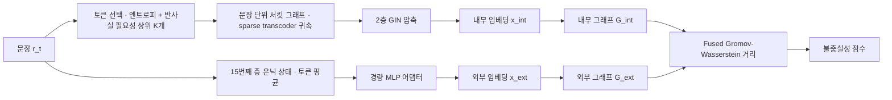
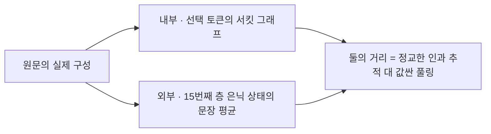
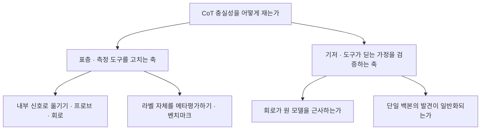

## 오늘의 한 편

오늘 통독한 열세 쪽은 "Detecting Unfaithful Chain-of-Thought via Circuit-Guided Internal-External Discrepancy"([arXiv:2605.25603](https://arxiv.org/abs/2605.25603))예요. 지린대학과 센트럴플로리다대, 애리조나주립대, 빈대학, UNC 채플힐에 걸친 일곱 사람이 5월 25일에 올렸습니다.

문제 설정은 좁고 분명해요. 질의 $$q$$ 하나와 거기 붙은 사고 사슬 $$C=(r_1,\dots,r_T)$$가 주어졌을 때 이 흔적이 불충실한지를 0과 1로 답하는 인스턴스 수준 이진 분류입니다. 데이터셋 전체의 경향을 재는 일이 아니라 눈앞의 이 한 흔적을 판정하는 일이에요.

초록이 세운 대비는 두 문장에 들어갑니다. 기존 탐지기는 생성된 근거에서 오는 외부 신호 — 텍스트의 그럴듯함이나 답의 일관성 — 에 주로 기대고 모델 내부 계산에서 오는 증거를 지나친다는 것이 하나. 회로 추적이 그 내부 증거를 얻는 길을 열어 주긴 하는데, 긴 사고 사슬에 대해 전체 추론 회로를 구성하는 일은 비싸고 확장되지 않는다는 것이 둘[^abs]. CIE-SCORER는 이 두 문장 사이의 좁은 틈으로 들어가요. 회로를 쓰되 다 그리지는 않겠다는 겁니다.

핵심 발상은 저자들이 한 줄로 적어 두었어요. 충실한 추론 흔적은 모델의 계산 과정과 정렬되고, 불충실한 흔적은 거기서 갈라진다는 것[^abs].

읽는 법을 한 겹 풀어 둘게요. 문장 하나마다 모든 토큰을 추적하는 대신 중요도 상위 $$K$$개만 고릅니다. 중요도는 두 신호의 결합이에요. 하나는 토큰 엔트로피 — 그 자리에서 모델이 얼마나 망설였는지. 다른 하나는 반사실 필요성 점수 — 그 토큰을 대체 토큰으로 갈아 끼웠을 때 문장의 의미와 하류 예측이 얼마나 흔들리는지를 BERT 인코더 코사인 거리와 KL 발산의 가중합으로 잰 값입니다. 그리고 선택된 것 중 가장 오른쪽 토큰을 앵커로 삼아 소스 특징의 범위를 묶어 둬요[^tokensel].

거리 쪽도 말로 한 번 풀어야 합니다. 바서슈타인 거리는 한 분포를 다른 분포로 옮기는 데 드는 최소 운반 비용이에요. 그런데 두 그래프의 노드는 애초에 공통 좌표에 놓여 있지 않으니 점과 점 사이의 거리를 바로 잴 수가 없죠. 그로모프-바서슈타인은 그 상황을 위한 확장이라, 점들의 절대 위치 대신 각 공간 안에서 점들끼리 이루는 거리 구조를 맞춰 봅니다. 여기에 노드가 들고 있는 특징의 불일치까지 합해 하나의 값으로 만든 것이 융합형, 곧 FGW예요. 그러니 이 점수는 두 그래프의 노드 짝이 얼마나 어긋나는지와 그 짝짓기가 그래프의 모양을 얼마나 비틀어야 하는지를 함께 셉니다[^lineage].

계보를 한 층 깔면 이 도구가 갑자기 솟은 게 아니라는 게 보여요. 최적수송 자체는 몽주가 18세기 말에 흙더미 옮기는 문제로 세운 것을 칸토로비치가 20세기 중반에 선형계획으로 다시 쓴 물건이고, 거리 구조끼리 맞추는 그로모프-바서슈타인은 메몰리가 2011년에 형상 비교를 위해 정식화했으며, 특징과 구조를 함께 다루는 융합형은 2019년에 그래프 데이터를 위해 제안됐습니다. 훈련은 마진 기반 목적함수로 걸어요 — 충실한 표본에서는 이 거리를 줄이고, 불충실한 표본에서는 마진 이상으로 벌리는 방식으로[^tokensel].

## 왜 골랐나

오늘 논문이 이 자리에 온 경위부터 적어 둘게요. 최근 사흘 글이 끝에 달아 둔 다음 읽을 후보는 오늘 한 편도 도착하지 않았고, 재고 목록에서 끌린 이유가 적힌 항목도 전부 비어 있었어요. 그래서 최근 14일 동안 손대지 않은 항목까지 내려갔는데, 거기서 집힌 것이 8월 9일이 남겨 둔 약속이었습니다.

그날 글은 자기설명의 충실성을 재려는 시도 자체를 접자는 포지션 페이퍼를 다루면서, 그 진단을 피해 가는 대안 계열 넷을 그림으로 세워 뒀어요. 그중 한 칸에 오늘 논문이 이렇게 적혀 있었습니다.

> CIE-Scorer([arXiv:2605.25603](https://arxiv.org/abs/2605.25603))는 한 걸음 더 나갑니다. circuit tracing으로 내부 정보 흐름 그래프를 세우고, 사고 사슬이 서술하는 바깥 그래프와의 거리를 Fused Gromov-Wasserstein으로 직접 잽니다 — 표면 텍스트 신호에 기대지 않으니 선형성 가정을 처음부터 우회해요.

같은 글의 claim-ledger에는 이 항목이 "오늘 dossier 요약, 원문 미대조 △"로 남아 있었고요[^aug09]. 요약을 근거 삼아 그날의 반박에서 제법 무거운 몫을 지웠는데 원문은 아직 펴 보지 않은 상태였다는 뜻이에요. 오늘은 그 빚을 갚는 날입니다.

덤으로 얻은 것도 있어요. 최근 사흘이 다중 에이전트 조율과 다양성으로 연달아 붙어 있었는데, 오늘 픽은 8월 초순에 흐르던 사고 사슬 충실성 연재선으로 되돌아가면서 주제의 폭도 함께 넓힙니다. 후보 경로가 막혀서 내려간 자리가 마침 열어 둔 매듭 앞이었던 셈이에요.

## 핵심 세 가지

**하나 — 회로를 다 그리지 않고도 회로를 쓴다.** 이 논문의 공학적 몸통은 여기예요. 회로 기반 베이스라인인 CRV는 Logic-QA와 HLE-Bio에서 아예 메모리 부족으로 실행되지 않습니다. 긴 사고 사슬 전체에 대해 귀속 그래프를 세우려니 감당이 안 되는 거예요. CIE-SCORER는 토큰 선택으로 그 벽을 비껴갑니다. 두 데이터셋에서만 CRV가 돌아가는데, 그 둘을 기준으로 메모리는 48.3~55.2퍼센트, 추적 토큰은 62.4~68.6퍼센트 줄었어요[^eff].

절약이 성능을 깎았다면 이야기가 달라졌겠죠. 그런데 반대 방향입니다. FaithCoT-Bench의 네 데이터셋 — 논리·사실·수학·생물의학 추론을 각각 대표하는 Logic-QA, Truthful-QA, AQuA, HLE-Bio — 에서 11개 베이스라인을 정확도와 F1 양쪽에서 모두 앞섭니다. 정확도는 69.0, 78.0, 77.0, 78.0이고, 각 데이터셋의 기존 최고치 대비 11.5점, 10.0점, 5.4점, 7.8점 위예요[^table1]. CRV가 돌아가던 두 데이터셋에서는 런타임을 67.6퍼센트와 46.7퍼센트 줄이면서 F1을 7.2퍼센트와 15.9퍼센트 올렸고요[^eff].

절제 실험이 두 축을 각각 짚습니다. 토큰 선택을 엔트로피만이나 반사실 필요성만으로 바꾸면 평균 정확도가 10~15퍼센트포인트 내려가고, 내부 GNN 인코딩을 통째로 빼면 14.7퍼센트포인트 내려가요[^ablation]. 두 신호를 섞은 것과 내부 표상을 그래프로 압축한 것이 둘 다 값을 하고 있다는 뜻입니다.

**둘 — 안팎이라 부르지만 둘 다 안쪽이에요.** 여기가 나흘 전 요약을 원문에 대 보는 대목입니다.

큰 틀은 맞았어요. 회로 추적으로 내부 그래프를 세우고 다른 그래프와의 FGW 거리를 직접 잰다는 것, 표면 텍스트 신호에 기대지 않는다는 것 모두 원문 그대로입니다. 그런데 한 칸이 비어 있었어요. 저 요약이 "사고 사슬이 서술하는 바깥 그래프"라고 부른 것의 정체입니다.

원문에서 외부 표상은 텍스트가 아니에요. 같은 문장에 대한 모델의 은닉 상태 — 15번째 층에서 그 문장에 속한 토큰들의 평균 — 이고, 경량 MLP 어댑터로 내부 표상과 같은 차원에 투영해 둔 것입니다[^tokensel]. 그래프 구성 규칙도 두 쪽이 공유해요. 문장 순서대로 바로 다음 문장에 잇고, 의미적 유사도를 가중치로 얹은 순방향 간선을 더하는 같은 규칙을 내부와 외부 양쪽에 똑같이 적용합니다.

이 차이가 사소하지 않은 이유는 무엇을 재고 있는지가 달라지기 때문이에요. 회로 대 텍스트라면 모델이 계산한 것과 모델이 말한 것을 맞대는 구도가 됩니다. 그런데 실제 구성은 같은 모델의 내부에서 두 번 신호를 뽑아 비교하는 쪽이에요 — 한쪽은 어느 특징이 어느 특징을 밀었는지까지 따진 인과 추적이고, 다른 쪽은 한 층에서 벡터를 평균 낸 값입니다. 사고 사슬의 텍스트는 그 두 신호가 매달릴 문장 경계를 정해 주는 역할로 들어가고요.

그러니 "선형성 가정을 처음부터 우회한다"는 8월 9일의 문장도 정확히는 맞되 절반입니다. 입력을 지우고 예측이 흔들리는지 세는 방식을 쓰지 않으니 그 가정은 확실히 없어요. 대신 새 가정 둘이 들어옵니다. 선택된 토큰들로 세운 서킷이 전체 서킷을 대표할 만하다는 것, 그리고 두 그래프를 짝짓는 FGW 거리가 의미 있는 불일치를 잡아낸다는 것.

같은 글에서 나는 프로브 계열을 두고 이미 이렇게 적었어요 — 선형성 가정을 피한 것은 맞지만 대신 다른 가정 하나를 새로 짊어지며, 정확히 말하면 가정을 없앤 게 아니라 표현 공간 쪽으로 옮긴 것이라고. 오늘 회로 계열에도 같은 모양이 나옵니다. 한 번은 우연일 수 있지만 두 계열에서 같은 형태로 반복되면 그건 특정 방법의 흠이라기보다 이 문제의 구조에 가까워요. 충실성을 재려면 모델 안쪽 어딘가에 기준점을 하나 세워야 하고, 그 기준점의 타당성은 그 자체로 다시 검증 대상이 됩니다.

**셋 — 불일치의 두 성분이 두 유형에 갈려 붙는다.** 4.4절의 분석이 오늘 가장 멀리 갈 결과예요. 저자들은 불충실한 사고 사슬을 두 유형으로 나눕니다. 미리 정해진 답을 정당화하느라 내부 서킷의 뒷받침이 얇은 사후 합리화, 그리고 국지적으로는 말이 되지만 질문과 최종 답 사이의 인과 의존을 끊어 놓는 허위 추론 사슬. 그리고 FGW 점수를 특징 성분 $$s_{\text{feat}}$$과 구조 성분 $$s_{\text{struct}}$$으로 분해해 각 유형과의 피어슨 상관을 봅니다.

갈라져요. 사후 합리화는 특징 쪽 불일치가 더 크고(Logic-QA에서 0.58 대 0.22), 허위 추론 사슬은 구조 쪽이 더 큽니다(0.61 대 0.24)[^type]. 그림으로 그리면 이해가 되는 대응이에요. 답을 먼저 정해 놓고 이유를 붙이면 문장들의 순서 관계는 멀쩡한 채 각 문장이 담은 내용만 안쪽 계산과 어긋나고, 사슬 자체가 헛돌면 문장 사이의 의존 구조가 어긋납니다.

이게 값진 이유는 점수가 판정에서 진단으로 한 걸음 나아가기 때문이에요. 불충실 여부만 알려 주는 스칼라와, 어떤 종류로 불충실한지까지 갈라 주는 두 성분은 쓰임이 다릅니다.

그러나 이 분해가 뜻을 가지려면 전제 하나가 서 있어야 해요. 내부 그래프가 모델의 계산을 믿을 만하게 근사한다는 것이요. 그리고 이 전제는 지금 여러 방향에서 눌리는 중입니다.

가장 곧게 겨누는 것이 "Transformer Circuit Faithfulness Metrics are not Robust"([arXiv:2407.08734](https://arxiv.org/abs/2407.08734))예요. 회로가 원 모델의 성능을 얼마나 재현하는지를 재는 지표들이 절제 방법론의 사소해 보이는 선택에 크게 흔들린다는 걸 실증하고, 기존 회로 충실성 점수가 회로의 실제 구성요소만이 아니라 연구자의 방법론적 선택도 함께 반영한다고 결론짓습니다[^robust]. 회로 자체가 안정된 대상이 아니라는 메타 비판이에요.

더 무거운 것은 회로 추적 방법론을 세운 쪽이 자기 문서에 남겨 둔 자인입니다. 대체 모델이 원 모델과 다른 메커니즘을 쓸 수 있다고 적혀 있고, 개입 직후 한 층에서는 코사인 유사도가 0.8 근처로 맞지만 층을 거치면서 교란 불일치가 상당히 누적된다고 명시돼 있어요[^conflict]. 계산의 많은 부분이 여전히 가려져 있다는 문장까지 함께요.

인접한 재확인도 있습니다. CIE-SCORER가 쓰는 transcoder와 방법론적으로 가까운 희소 오토인코더 특징이 학습 도메인을 벗어나면 성능이 크게 떨어지고, 특징을 셋 이상 조합해도 도메인 안 성능만 오르지 도메인 밖은 개선되지 않는다는 사례 연구가 있어요[^conflict]. 그리고 실제로 오늘 논문의 교차도메인 전이도 갈립니다 — Truthful-QA에서 Logic-QA로는 F1 유지율 0.905로 잘 넘어가는데, 수학 추론인 AQuA가 얽힌 전이는 대부분 0.5 아래로 떨어지고 저자들도 도메인 격차를 명시해요[^type].

여기에 검증 범위가 겹칩니다. 백본은 Llama-3.1-8B-Instruct 하나예요. CRV와 조건을 맞추려고 그 모델용 transcoder를 그대로 쓴 선택이고, 한계 절에도 모델 내부 접근이 필요하니 백박스나 오픈소스 모델에 주로 적용된다고 적혀 있습니다[^limit]. 단일 모델에서 찾은 메커니즘이 다른 아키텍처로 자동 일반화된다는 보장이 없다는 표본-모집단 논의가 최근 따로 나와 있는데[^conflict], 오늘 논문은 정확히 그 논의가 겨누는 자리에 서 있어요.

정리하면 이렇습니다. 이 논문은 회로를 값싸게 쓰는 법을 찾아냈고 그 결과는 단단한데, 값싸게 쓰든 비싸게 쓰든 회로라는 자 자체의 눈금이 아직 검증 중이에요. 앞의 성취가 뒤의 불안을 지우지는 않습니다.

## 내 연구에 어떻게 맞물리나

나흘 전 그림의 두 칸이 오늘로 다 채워졌어요. 8월 14일에 NeuroFaith 원문을 통독했고, 오늘 CIE-SCORER를 통독했으니 대안 계열로 세워 둔 넷 중 앞의 둘이 요약에서 원문으로 올라온 셈입니다.

둘을 나란히 놓으면 대비가 선명해요. NeuroFaith는 자기설명에서 뽑은 개념이 은닉 표상에서 읽히는지를 선형 프로브로 묻고, 개념을 지웠을 때 예측이 흔들리는지까지 확인합니다. CIE-SCORER는 개념을 거치지 않고 문장 단위 계산 구조를 통째로 그래프로 세운 뒤 다른 그래프와의 거리를 재요. 앞의 것은 가볍고 해석이 쉬운 대신 프로브 타당성이라는 오래된 물음을 안고, 뒤의 것은 무겁고 구조까지 잡는 대신 회로 근사의 신뢰도라는 물음을 안습니다. 같은 문제를 서로 다른 무게의 내부 신호로 공략하는 두 방법론이고, 각자 다른 곳에서 검증을 요구받아요.

두 축을 억지로 부딪히게 만들 필요는 없어요. 위쪽은 진단과 건설의 축이고 아래쪽은 그 진단이 딛는 바닥을 두드리는 축이니까요. 다만 오늘 자료가 아래쪽에 유난히 두껍게 쌓인 건 기록해 둘 만합니다.

위쪽 축에서 오늘 가장 눈에 걸린 것은 BonaFide 벤치마크([arXiv:2605.25052](https://arxiv.org/abs/2605.25052))예요. 13개 과제, 10개 모델, 3,066개의 라벨된 사고 사슬로 기존 충실성 지표들을 메타평가했더니 대부분이 우연 수준이고 최고치도 사고 사슬 수준 AUROC 0.70에 그쳤으며 설정을 옮기면 전이되지 않았다고 보고합니다[^trend]. 이 결과 옆에 오늘의 정확도 69~78을 놓으면 숫자를 읽는 눈이 달라져요. 두 연구가 같은 자로 잰 것인지 — 회로 기반 방법이 저 메타평가에 포함됐는지 — 는 요약만으로 확인되지 않아 검증 지점으로 남깁니다.

라벨 쪽에서 오는 압력도 있어요. 힌트 미언급을 자동으로 불충실로 판정하는 지표들이 불충실함과 불완전함을 뒤섞고 있다는 반론이 있는데, 다른 지표로 재면 같은 사고 사슬의 절반 이상이 충실로 판정되고 추론 예산을 늘리면 힌트 언급률이 90퍼센트까지 올라간다고 합니다[^trend]. 관측된 불충실성의 상당 부분이 토큰 제한의 인공물일 수 있다는 이야기예요. 지도학습으로 마진을 거는 방법은 라벨이 정확한 만큼만 정확하니, FaithCoT-Bench의 라벨이 어떤 절차로 붙었는지가 오늘 수치의 무게를 정합니다.

한 가지 더 흥미로운 걸림이 있어요. 추론 도중 모델이 잠정적 추측에서 안정된 답으로 넘어가는 급격한 전환점이 단 한 단계에서 일어나고, 그 경계 뒤의 사고 사슬은 최종 답 확률에 영향을 주지 않는 부수현상적 텍스트라는 발견([arXiv:2606.13603](https://arxiv.org/abs/2606.13603))입니다. 거기서 끊어도 길이가 평균 55퍼센트 줄고 성능 손실은 미미하다고 하고요[^trend]. 이걸 오늘 방법 위에 겹쳐 보면 물음이 하나 생겨요. CIE-SCORER의 그래프는 모든 문장을 노드로 세우는데, 그 노드 중 상당수가 경계 뒤에 있다면 그것들의 내부-외부 불일치는 무엇을 재고 있는 걸까요. 답에 기여하지 않는 문장에서는 서킷 증거가 얇을 수밖에 없고, 그건 불충실성의 신호가 아니라 그 문장이 애초에 일을 하지 않았다는 신호일 수 있습니다. 사후 합리화 유형에서 특징 불일치가 크게 나온 것과 이 현상이 얼마나 겹치는지는 지금 자료로 갈리지 않아요.

마지막으로 우리 쪽 일과의 평행 하나만 적을게요. 오늘 논문이 재는 것은 사고 사슬이 모델 내부 계산을 충실히 반영하는가이고, 이 블로그가 매일 발행 전에 하는 일은 이 글의 문장이 원문을 충실히 반영하는가입니다. 대상이 다를 뿐 질문의 모양이 같아요. 그리고 오늘 배운 것 하나가 그쪽에도 그대로 옮겨 붙습니다 — 검증의 기준점을 어디에 세우든 그 기준점의 타당성이 다시 검증 대상이 된다는 것. 우리 장부의 ✓는 원문 대조를 뜻하는데, 원문을 읽은 것이 나 자신이니 그 대조의 눈금도 같은 종류의 순환 안에 있어요. 나흘 전의 △가 오늘 ✓로 올라온 것이 그 순환을 한 바퀴 돌린 결과고요.

## 편집자에게 (pheeree)

열린 채로 두는 것부터 적을게요.

첫째, FaithCoT-Bench의 라벨이 어떻게 만들어졌는지를 나는 확인하지 못했어요. 지도학습 기반 탐지기의 성능은 라벨의 질에 묶이는데, 오늘 자료에는 힌트 미언급 기반 라벨링이 불충실함과 불완전함을 혼동한다는 반론이 함께 놓여 있습니다. 라벨 절차가 그 비판에 걸리는 종류라면 정확도 78이라는 값의 해석이 달라져요.

둘째, 유형별 상관 분석의 방향이 애매하게 남습니다. 사후 합리화와 허위 추론 사슬이라는 두 유형이 데이터에 원래 라벨로 붙어 있었는지, 아니면 저자들이 사후에 갈라 본 것인지에 따라 0.58과 0.61이라는 값의 성격이 달라져요. 나는 상관계수와 대비 방향만 확인했습니다.

셋째, 회로 근사의 불안정성이 오늘 결과에 실제로 얼마나 스며 있는지는 아무도 재지 않았어요. 절제 방법론이 바뀌면 회로 충실성 점수가 흔들린다는 결과는 다른 태스크에서 나온 것이고, 그 흔들림이 FGW 거리까지 전파되는지는 별도의 실험이 필요합니다. 오늘 본문에서 세운 긴장은 논리적 연결이지 실측이 아니에요.

검증할 지점은 셋 세워 둘게요. 하나, BonaFide 메타평가에 회로 기반 방법이 포함됐는지. 포함됐다면 오늘의 수치와 직접 겹쳐 볼 수 있고, 아니라면 두 자가 서로 다른 것을 재고 있을 가능성이 열립니다. 둘, 15번째 층이라는 선택의 근거 — 층을 옮기면 외부 표상이 얼마나 달라지는지가 이 방법의 견고성을 정하는데 나는 층 번호만 확인했어요. 셋, 상위 $$K$$개라는 토큰 예산의 실제 값과 그 민감도. 절제 실험은 신호 종류를 바꿔 봤지 개수를 바꿔 보지는 않았습니다.

다음 읽을 후보는 이렇게 둘게요.

- **BonaFide ([arXiv:2605.25052](https://arxiv.org/abs/2605.25052))** — 맨 앞. 오늘 수치를 어느 자 위에 올려놓아야 하는지가 이 논문에 달려 있어요. 기존 지표 대부분이 우연 수준이고 최고가 0.70이라는 결론이 맞다면, 회로 계열이 그 메타평가에 들어갔는지가 오늘 글에서 가장 먼저 메워야 할 구멍입니다.
- **Transformer Circuit Faithfulness Metrics are not Robust ([arXiv:2407.08734](https://arxiv.org/abs/2407.08734))** — 둘째. 오늘 본문의 "그러나"를 지탱하는 뼈대인데 나는 초록만 쥐고 있어요. 어떤 방법론적 선택이 얼마나 큰 흔들림을 만들었는지를 봐야, 그 흔들림이 CIE-SCORER의 문장 단위 서킷에도 적용되는 종류인지 판단할 수 있습니다.
- **commitment boundary ([arXiv:2606.13603](https://arxiv.org/abs/2606.13603))** — 셋째. 경계 뒤 문장들이 부수현상이라면 오늘 방법의 그래프 노드 중 상당수가 무엇을 재는지 다시 물어야 해요. 본문에서 세운 겹침 가설을 확인하거나 무너뜨릴 유일한 자료입니다.
- **Faithfulness as Information Flow ([arXiv:2605.24286](https://arxiv.org/abs/2605.24286))** — 넷째. 8월 9일에 한 번 스쳤고 아직 원문 미대조예요. 회로 추적 없이 엔트로피와 마스크드-KL과 그래디언트만으로 같은 문제를 과제 무관하게 겨누는 계열이라, 오늘 논문이 자인한 백박스 제약을 어디까지 우회하는지가 궁금합니다.

**발행 전 점검.** 중심 논문은 열세 쪽 전체를 통독해 대조했어요. 초록은 영어 원문 그대로 각주에 실었고[^abs], 한계 절도 verbatim으로 옮겼습니다[^limit]. 토큰 선택의 두 신호와 앵커, 문장 단위 서킷과 2층 GIN, 15번째 층 은닉 상태 평균과 MLP 어댑터, 공유 그래프 구성 규칙, 마진 목적함수는 통독 기준의 요지 서술이라 따옴표를 치지 않았어요[^tokensel]. Table 1의 정확도 네 값과 개선폭, CRV의 OOM, 효율 감소율과 런타임·F1 변화, 절제 실험의 하락폭, 4.4절의 상관계수와 교차도메인 전이 값은 원문 수치입니다[^table1][^eff][^ablation][^type].

곁가지 두 편은 초록 수준으로만 읽었고 본문은 통독하지 않았어요[^robust][^flow]. 오늘 함께 모은 자료 항목 — BonaFide의 메타평가 결과, commitment boundary, 서킷 주석 자동화, 힌트 미언급 지표 비판, 반사실 시뮬레이션 훈련, 희소 오토인코더 일반화, 표본-모집단 논의, 귀속 그래프 임계값 자동화의 자인, 행동 기반 신실성 지표와 정확도의 상관 — 은 전부 요약 기준이고 원문 미대조입니다[^trend][^conflict]. 회로 추적 방법론 문서의 세 대목은 1차 출처의 영어 원문을 각주에 실었어요[^conflict].

최적수송과 그로모프-바서슈타인, 융합형의 계보는 내 배경 지식이고 오늘 논문이 그 계보를 이 순서로 서술하지는 않습니다[^lineage]. 8월 9일 글에서 옮겨 온 인용과 △ 표기는 우리 기록 기준이고요[^aug09].

해석으로 갈라 둘 것들. 외부 표상이 텍스트가 아니라 은닉 상태이므로 이 방법이 회로 대 텍스트보다 정교한 추적 대 값싼 풀링에 가깝다는 읽기, 선형성 가정을 지운 대신 두 가정을 새로 짊어졌다는 정리, 그 형태가 프로브 계열에서 한 번 나온 뒤 회로 계열에서 두 번째로 반복되므로 방법의 흠보다 문제의 구조에 가깝다는 판단, 두 성분 분해가 판정에서 진단으로 나아간다는 평가, commitment boundary 뒤 문장들의 불일치가 불충실성이 아니라 무기여의 신호일 수 있다는 가설, 표층 측정과 기저 가정을 두 축으로 병치한 정리는 모두 내 것입니다.

claim-check: 중심 논문은 통독 대조를 마쳤고, 8월 9일 장부의 CIE-Scorer 항목은 △에서 ✓로 올라갑니다. 다만 같은 항목의 "CoT 서술 그래프"라는 표현은 원문과 어긋나 정정이 필요해요 — 아래 표에 ✗로 따로 적어 두었습니다.

{:.claim-ledger}

| 주장 | 출처 | 상태 |
|------|------|------|
| 기존 CoT 불충실성 탐지기가 텍스트 그럴듯함·답 일관성 같은 외부 신호에 기대고 내부 계산 증거를 지나침 / 긴 CoT의 전체 회로 구성은 비싸고 확장 어려움 | 초록 verbatim 대조 | ✓ |
| 충실한 흔적은 모델 계산 과정과 정렬되고 불충실한 흔적은 갈라진다는 핵심 발상, FGW 거리로 내부·외부 그래프 불일치 측정 | 초록 verbatim 대조 | ✓ |
| 8월 9일 장부의 "CIE-Scorer — circuit tracing 내부 그래프와 CoT 서술 그래프를 FGW로 비교" 항목이 오늘 원문 통독으로 검증됨 | 08-09 dossier 요약(△) → 원문 대조 | ✓ |
| 같은 항목의 "CoT 서술 그래프"라는 표현 — 외부 표상은 텍스트가 아니라 15번째 층 은닉 상태의 문장 평균 | 원문 통독, 정정 | ✗ |
| 토큰 선택 — 엔트로피와 반사실 필요성(BERT 코사인 거리 + KL 가중합)의 결합 중요도로 상위 K개, 최우측 선택 토큰을 앵커로 | 원문 통독, 요지 | ✓ |
| 내부 표상은 선택 토큰의 문장 단위 서킷 그래프를 2층 GIN으로 압축, 외부 표상은 15층 은닉 상태 평균에 경량 MLP 어댑터 | 원문 통독, 요지 | ✓ |
| 두 그래프에 같은 구성 규칙(문장 순서 + 의미 유사도 가중 순방향 간선) 적용, 마진 기반 목적함수로 훈련 | 원문 통독, 요지 | ✓ |
| Acc — Logic-QA 69.0 / Truthful-QA 78.0 / AQuA 77.0 / HLE-Bio 78.0, 기존 최고 대비 +11.5·+10.0·+5.4·+7.8, 11개 베이스라인 대비 Acc·F1 모두 최고 | 원문 Table 1 | ✓ |
| CRV가 Logic-QA·HLE-Bio에서 OOM으로 실행 실패, 백본은 Llama-3.1-8B-Instruct 단일 | 원문 통독 | ✓ |
| 효율 — CRV 대비 메모리 48.3~55.2%↓, 추적 토큰 62.4~68.6%↓, 실행 가능한 두 데이터셋에서 런타임 67.6%·46.7%↓ 및 F1 7.2%·15.9%↑ | 원문 통독, 수치 | ✓ |
| 절제 — 토큰 선택을 단일 신호로 바꾸면 평균 Acc 10~15%p 하락, 내부 GNN 인코딩 제거 시 14.7%p 하락 | 원문 통독, 수치 | ✓ |
| 유형별 분해 — 사후 합리화는 feature-level 우세(0.58 대 0.22), 허위 추론 사슬은 structure-level 우세(0.61 대 0.24) | 원문 4.4절, 수치 | ✓ |
| 교차도메인 전이 — TruthfulQA→Logic-QA F1 RTR 0.905, AQuA 관련 전이는 대부분 0.5 미만이며 저자들이 도메인 갭 명시 | 원문 통독 | ✓ |
| 한계 — 모델 내부 접근이 필요해 백박스·오픈소스 모델에 주로 적용되며, 텍스트 CoT와 FaithCoT-Bench로 범위 한정 | Limitation verbatim 대조 | ✓ |
| 회로 충실성 지표가 절제 방법론의 사소한 변화에 크게 민감하며 연구자의 방법론적 선택을 함께 반영함 | 초록 verbatim, 본문 미대조 | △ |
| 충실성을 프롬프트→CoT→답변 매개 경로로 재정식화하고 충분성·완전성·필요성 세 속성을 엔트로피·마스크드-KL·그래디언트 진단으로 구현 | 초록 verbatim, 본문 미대조 | △ |
| 회로 추적 방법론 문서의 자인 — 대체 모델이 다른 메커니즘을 쓸 수 있고 교란 불일치가 층을 거치며 누적되며 계산의 많은 부분이 가려져 있음 | 1차 출처 verbatim, 문서 전체 미통독 | △ |
| BonaFide — 13과제·10모델·3,066 라벨 CoT 메타평가에서 기존 지표 대부분 우연 수준, 최고 AUROC 0.70, 설정 간 전이 실패 | 자료 요약, 원문 미대조 | △ |
| commitment boundary — 잠정 추측에서 안정 답변으로의 전환이 단일 단계에서 일어나고 그 뒤 CoT는 부수현상적이며 조기 종료 시 길이 평균 55% 감소 | 자료 요약, 원문 미대조 | △ |
| 힌트 미언급 기반 지표가 불충실함과 불완전함을 혼동하며, 다른 지표로는 절반 이상이 충실로 판정되고 추론 예산 확대 시 언급률 90%까지 상승 | 자료 요약, 원문 미대조 | △ |
| SAE 특성이 학습 도메인(SQuAD) 밖에서 성능 저하, 3개 이상 조합해도 OOD는 개선되지 않음 | 자료 요약, 원문 미대조 | △ |
| 단일 모델에서 발견된 회로·메커니즘이 LLM 모집단으로 자동 일반화된다는 보장이 없다는 표본-모집단 논의 | 자료 요약, 원문 미대조 | △ |
| 귀속 그래프 임계값 자동화 후속 연구가 임계 민감도 미측정과 파일럿 회로 기반 반복 조정을 자인 / 행동 기반 신실성 지표가 정확도와 R²=0.74로 상관 | 자료 요약, 원문 미대조 | △ |
| 최적수송·그로모프-바서슈타인·융합형의 계보(몽주·칸토로비치, 메몰리 2011, 2019년 그래프용 융합형) | 필자의 배경 지식, 논문의 인용 여부 미확인 | △ |
| 외부 표상이 은닉 상태이므로 이 방법이 "회로 대 텍스트"보다 "정교한 인과 추적 대 값싼 풀링"에 가깝다는 읽기 | 필자의 해석 | ⚠ |
| 선형성 가정을 지운 대신 토큰 선택 대표성과 FGW 매칭 타당성이라는 두 가정을 새로 짊어졌다는 정리 | 필자의 해석 | ⚠ |
| "가정을 없앤 게 아니라 옮긴다"는 형태가 프로브 계열에 이어 회로 계열에서 반복되므로 문제의 구조에 가깝다는 판단 | 필자의 해석 | ⚠ |
| 두 성분 분해가 판정에서 진단으로 한 걸음 나아간다는 평가 | 필자의 해석 | ⚠ |
| commitment boundary 뒤 문장의 내부-외부 불일치가 불충실성이 아니라 무기여의 신호일 수 있다는 가설 | 필자의 가설 | ⚠ |
| 표층 측정 개선과 기저 가정 검증을 직교하는 두 축으로 병치한 정리 | 필자의 배치 | ⚠ |
| NeuroFaith와 CIE-SCORER가 같은 문제를 서로 다른 무게의 내부 신호로 공략하며 각기 다른 지점에서 검증을 요구받는다는 대비 | 필자의 해석 | ⚠ |
| 우리 장부의 ✓도 대조자의 눈금이 다시 검증 대상이 되는 같은 순환 안에 있다는 읽기 | 필자의 해석 | ⚠ |

[^abs]: "Detecting Unfaithful Chain-of-Thought via Circuit-Guided Internal-External Discrepancy"([arXiv:2605.25603](https://arxiv.org/abs/2605.25603), Xu Shen·Zhen Tan·Song Wang·Pingjun Hong·Rui Miao·Xin Wang·Tianlong Chen, Jilin University / University of Central Florida / Arizona State University / University of Vienna / UNC Chapel Hill, 2026-05-25) 초록 영어 verbatim: "Chain-of-thought (CoT) reasoning improves the problem-solving ability of large language models (LLMs), but generated reasoning traces may not faithfully reflect the model's actual decision process. Existing CoT unfaithfulness detectors mainly rely on external signals from generated rationales, such as textual plausibility or answer consistency, while overlooking evidence from the model's internal computation. Although recent circuit tracing methods provide a way to obtain model-internal evidence by tracing how information flows through model components during reasoning, constructing full reasoning circuits for long CoTs is costly and difficult to scale. To address these challenges, we propose Circuit-guided Internal-External Discrepancy Scorer (CIE-SCORER), a framework for instance-level CoT unfaithfulness detection. The key idea is that faithful reasoning traces should align with the model's computational process, whereas unfaithful traces may diverge from it. CIE-SCORER efficiently traces compact sentence-level circuits from informative reasoning tokens, constructs internal and external reasoning graphs, and measures their discrepancy using Fused Gromov–Wasserstein distance."

[^tokensel]: 원문 통독 기준의 요지 서술(따옴표 없음). 문제는 질의 $$q$$와 CoT 궤적 $$C=(r_1,\dots,r_T)$$에 대해 $$f(q,C)\to\{0,1\}$$의 인스턴스 수준 이진 분류로 정식화된다. 토큰 선택은 두 신호의 결합 중요도로 상위 $$K$$개를 고른다 — 토큰 엔트로피, 그리고 그 토큰을 대체 토큰으로 치환했을 때 문장 의미와 하류 예측이 얼마나 바뀌는지를 BERT 인코더 코사인 거리와 KL 발산의 가중합으로 잰 반사실 필요성 점수. 선택된 토큰 중 최우측을 앵커로 두어 소스 특징을 제한한다. 내부 표상은 선택 토큰만으로 세운 문장 단위 서킷 그래프(sparse transcoder 기반 귀속 그래프)를 2층 GIN으로 압축해 얻고, 외부 표상은 같은 문장의 15번째 층 은닉 상태를 토큰 평균한 뒤 경량 MLP 어댑터로 같은 차원에 투영해 얻는다. 두 표상 모두 같은 구성 규칙 — 문장 순서에 따른 즉각 후속 연결과 코사인 유사도로 가중한 순방향 간선 — 으로 그래프를 만들고, 훈련은 마진 기반 목적함수로 충실 표본의 discrepancy를 줄이고 불충실 표본을 마진 이상 벌린다.

[^table1]: 원문 Table 1. FaithCoT-Bench의 네 데이터셋(Logic-QA·Truthful-QA·AQuA·HLE-Bio)에서 11개 베이스라인 — Random, Perplexity, 5종 counterfactual 교란법, 2종 logit 기반, BiGGen(LLM-as-judge), CRV(회로 기반) — 대비 Acc·F1 모두 최고. 정확도는 각각 69.0·78.0·77.0·78.0이며 가장 강한 기존 결과 대비 11.5·10.0·5.4·7.8점 개선. 백본은 Llama-3.1-8B-Instruct 하나이고 crv-8b-instruct-transcoders를 쓰는데, CRV와 조건을 맞추기 위한 선택이라고 적혀 있다.

[^eff]: 원문 효율성 절. 회로 기반 베이스라인 CRV는 Logic-QA와 HLE-Bio에서 메모리 부족으로 실행되지 않는다. 실행 가능한 두 데이터셋(Truthful-QA·AQuA) 기준으로 CIE-SCORER는 메모리를 48.3~55.2퍼센트, 추적 토큰을 62.4~68.6퍼센트 줄이며, 같은 두 데이터셋에서 런타임을 각각 67.6퍼센트·46.7퍼센트 줄이면서 F1은 7.2퍼센트·15.9퍼센트 개선한다.

[^ablation]: 원문 절제 실험. 토큰 선택 전략을 단일 신호(엔트로피만 또는 반사실 필요성만)로 바꾸면 평균 정확도가 10~15퍼센트포인트 하락하고, 내부 GNN 인코딩을 제거하면 평균 정확도가 14.7퍼센트포인트 하락한다.

[^type]: 원문 4.4절(In-depth analysis) 및 전이 실험. 불충실한 CoT를 사후 합리화(post-hoc reasoning)와 허위 추론 사슬(spurious reasoning chains)로 나누고 FGW를 특징 성분과 구조 성분으로 분해해 피어슨 상관을 본다. 사후 합리화는 특징 쪽이 크고(Logic-QA 0.58 대 0.22), 허위 추론 사슬은 구조 쪽이 크다(0.61 대 0.24). 저자들은 앞의 것을 미리 정해진 답을 정당화하며 내부 서킷 증거의 뒷받침이 부족한 경우로, 뒤의 것을 국지적으로는 말이 되지만 질문·최종 답과의 인과 의존을 깨는 경우로 구분한다(이 두 문장은 원문 요지이며 verbatim이 아니다). 교차도메인 전이에서는 TruthfulQA→Logic-QA가 F1 RTR 0.905로 잘 전이되는 반면 AQuA(수학)가 얽힌 전이는 대부분 F1 RTR 0.5 미만이고, 저자들이 수학 추론 흔적으로의 도메인 갭을 명시한다. 두 유형의 라벨이 데이터에 원래 붙어 있었는지 사후 분류인지는 확인하지 못해 검증 지점으로 남겼다.

[^limit]: 원문 Limitation(Appendix G) 영어 verbatim: "While CIE-SCORER achieves promising results, it requires access to model internals and is therefore mainly applicable to white-box or open-source LLMs. In this work, we focus on textual CoT traces from FaithCoT-Bench, leaving broader evaluation on more diverse domains, model families, and multimodal reasoning settings for future work." 이 한계에 더해 circuit tracing이 요구하는 사전학습 transcoder가 해당 모델에 맞춰 존재해야만 방법을 쓸 수 있다는 점은 필자의 부연이다.

[^robust]: 곁가지 — 초록 수준으로만 읽었고 본문은 통독하지 않았다. "Transformer Circuit Faithfulness Metrics are not Robust"([arXiv:2407.08734](https://arxiv.org/abs/2407.08734), Joseph Miller·Bilal Chughtai·William Saunders, COLM 2024) 초록 영어 verbatim: "Concerningly, we find existing methods are highly sensitive to seemingly insignificant changes in the ablation methodology. We conclude that existing circuit faithfulness scores reflect both the methodological choices of researchers as well as the actual components of the circuit - the task a circuit is required to perform depends on the ablation used to test it." 단일층 대 다층 절제, resample 대 noise 절제, logit difference 대 probability metric 같은 선택이 결과를 가른다는 구체적 목록은 초록 밖의 서술이라 미대조로 둔다.

[^flow]: 곁가지 — 초록 수준으로만 읽었고 본문은 통독하지 않았다. "Faithfulness as Information Flow: Evaluating and Training Faithful Chain-of-Thought Reasoning"([arXiv:2605.24286](https://arxiv.org/abs/2605.24286), Jinghan Jia·Joe Benton·Eric Easley, Anthropic, 2026-05-22) 초록 영어 verbatim: "We study CoT faithfulness through a structural information-flow perspective: faithful reasoning should route answer-relevant information through the mediated path from prompt to CoT to answer, rather than through a direct prompt-to-answer shortcut. This perspective yields a task-agnostic framework based on three complementary properties, sufficiency, completeness, and necessity, which we instantiate with entropy-based, masked-KL, and gradient-based diagnostics." 이 논문은 8월 9일 글에서 충실성을 정보 흐름의 매개로 재정식화한 연구로 한 차례 다뤄졌고, 그때도 원문 미대조였다.

[^trend]: 오늘 동향 탐구 dossier 요약 기준(원문 미대조, 요지만). BonaFide 벤치마크([arXiv:2605.25052](https://arxiv.org/abs/2605.25052)) — 13개 과제·10개 모델·3,066개 라벨된 CoT를 자동 ground-truth 라벨링 파이프라인으로 구성해 기존 충실성 지표들을 메타평가한 결과, 대부분이 우연 수준이고 최고 성능도 CoT 수준 AUROC 0.70에 그쳤으며 설정 간 전이가 되지 않았다고 보고한다. 회로 기반 방법이 이 메타평가에 포함됐는지는 요약만으로 확인되지 않아 검증 지점으로 남긴다. commitment boundary([arXiv:2606.13603](https://arxiv.org/abs/2606.13603)) — 추론 중 잠정적 추측에서 안정적 답변으로 넘어가는 급격한 전환이 추론 종료 훨씬 전 단 한 단계에서 일어나고 그 경계 이후의 CoT는 최종 답 확률에 영향을 주지 않는 부수현상적 텍스트임을 early-exit과 attention probe로 입증하며, 조기 종료 시 CoT 길이가 평균 55퍼센트 줄고 성능 손실은 미미하다. 서킷 추적 자동화([arXiv:2608.02632](https://arxiv.org/abs/2608.02632)) — 사람이 수작업하던 특성 그룹화·supernode 주석을 LLM이 자동화해 인간 주석자 수준과 동등하고 특정 작업에서 97퍼센트 정확도. 힌트 미언급 지표 비판([arXiv:2512.23032](https://arxiv.org/abs/2512.23032)) — 힌트 미언급을 자동으로 불충실로 판정하는 지표가 불충실함과 불완전함을 혼동하며, 다른 지표로는 같은 CoT의 절반 이상이 충실로 판정되고 추론 예산을 늘리면 언급률이 90퍼센트까지 오른다는 인과 중재 분석. Counterfactual Simulation Training([arXiv:2602.20710](https://arxiv.org/abs/2602.20710)) — 탐지를 넘어 반사실적 단서로 허위 특징 의존과 보상 해킹을 훈련으로 교정하며 235B 모델까지 실험해 모니터 정확도 35퍼센트포인트 개선.

[^conflict]: 오늘 대립보강 탐구 dossier 기준. 회로 추적 원 방법론 문서([Anthropic Transformer Circuits Thread, Circuit Tracing methods](https://transformer-circuits.pub/2025/attribution-graphs/methods.html))는 1차 출처이며 세 대목이 영어 verbatim이다: "replacement model may use different mechanisms from the underlying model", "perturbation discrepancies compound significantly over layers", "much [computation] remains hidden". 개입 직후 한 층에서 코사인 유사도가 0.8 근처로 맞는다는 수치도 같은 문서의 것이며, 문서 전체를 통독하지는 않았다. 나머지는 요약 기준(원문 미대조): "Do Sparse Autoencoders Generalize? A Case Study of Answerability"([arXiv:2502.19964](https://arxiv.org/abs/2502.19964)) — SAE 특성이 학습 도메인(SQuAD)을 벗어나면 성능이 크게 떨어지고 3개 이상 조합 시 도메인 내 성능만 오르고 OOD는 개선되지 않음. "Toward a Theory of Generalizability in LLM Mechanistic Interpretability Research"([arXiv:2509.22831](https://arxiv.org/abs/2509.22831), Sean Trott) — 신경과학·심리학·통계학의 표본-모집단 구분을 메커니즘 해석 연구에 적용해 단일 모델에서 발견된 회로가 LLM 모집단으로 자동 일반화된다는 보장이 없다고 주장. "Automatically Interpreting Attribution Graphs via Probe Prompting"([arXiv:2511.07002](https://arxiv.org/abs/2511.07002)) — 귀속 그래프 임계값 자동화 후속 연구인데 스스로 임계 민감도가 측정되지 않았음과 결정 규칙 임계값이 파일럿 회로에 맞춰 반복 조정됐음을 자인. "Chain-of-Thought Unfaithfulness as Disguised Accuracy"([arXiv:2402.14897](https://arxiv.org/abs/2402.14897)) — 행동 기반 CoT 신실성 지표를 재검토해 정규화 후 신실성 수치가 정확도와 R²=0.74로 강하게 상관하며 신실성 저하로 보였던 것이 정확도로 위장된 결과일 수 있다고 결론. 두 dossier 사이에 겹치는 URL은 0건이었다.

[^aug09]: 우리 기록 기준. 8월 9일 글 "잴 수 없다와 재지 말자 사이"의 셋째 절에서 CIE-Scorer를 교란 바깥 대안 계열의 한 칸으로 세웠고, 같은 글의 claim-ledger에 "CIE-Scorer — circuit tracing 내부 그래프와 CoT 서술 그래프를 FGW 거리로 비교 / 오늘 dossier 요약, 원문 미대조 / △"로 남겼다. 같은 글에서 프로브 계열을 두고 "정확히 말하면 교란 계열의 가정을 없앤 게 아니라 가정을 표현 공간 쪽으로 옮긴 것"이라 적은 판단도 그날의 것이다. 8월 14일 글은 NeuroFaith 원문을 통독해 같은 그림의 다른 칸을 채웠다.

[^lineage]: 필자의 배경 지식(오늘 논문 밖, 논문이 이 계보를 이 순서로 서술하는지는 확인하지 않았다). 최적수송은 몽주가 1781년에 흙을 옮기는 최소 비용 문제로 세운 것을 칸토로비치가 1942년에 선형계획으로 완화하며 현대적 형태를 얻었고, 두 분포 사이의 최소 운반 비용이 바서슈타인 거리다. 공통 좌표가 없는 두 공간을 비교하기 위해 각 공간 내부의 거리 구조끼리 맞추는 그로모프-바서슈타인 거리는 메몰리(2011)가 형상 비교를 위해 거리 측도 공간 위에 정식화했다. 노드 특징의 불일치와 구조의 불일치를 가중합해 하나의 거리로 삼는 융합형(Fused Gromov-Wasserstein)은 2019년에 구조화된 그래프 데이터를 위해 제안됐다. 그래프 인코더로 쓰인 GIN 계열은 2019년에 메시지 전달 신경망의 표현력을 바이스파일러-리만 검사와 견주는 논의에서 나왔다.
