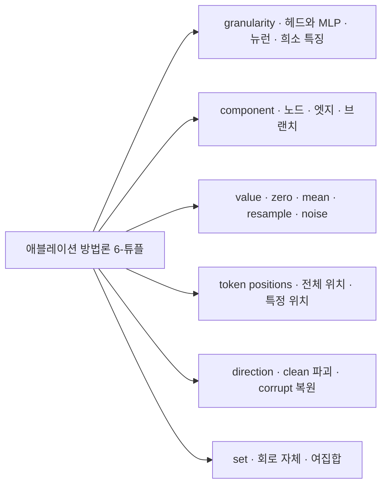
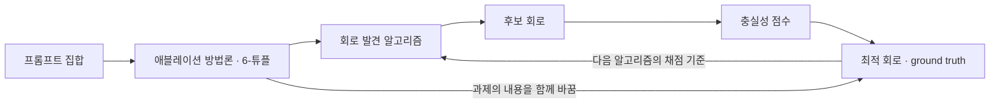
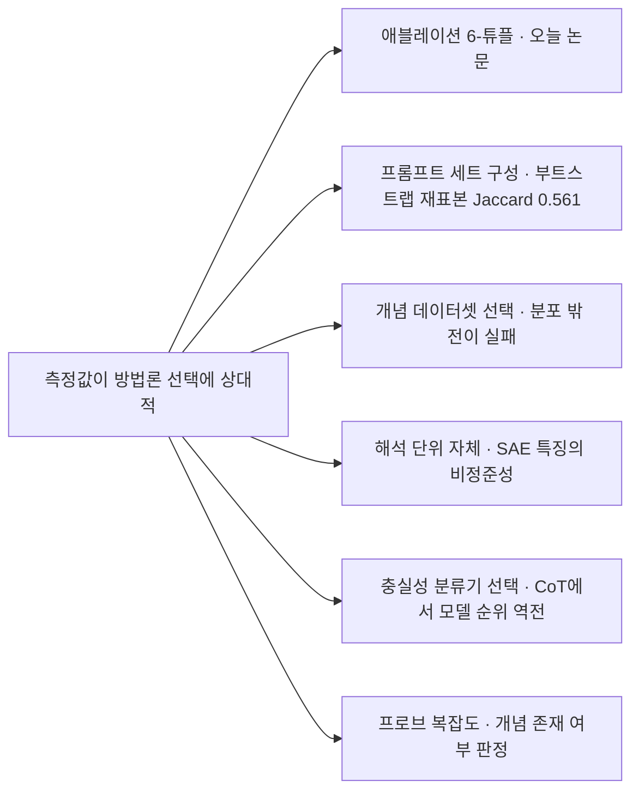

## 오늘의 한 편

오늘 통독한 열한 쪽은 "Transformer Circuit Faithfulness Metrics are not Robust"([arXiv:2407.08734](https://arxiv.org/abs/2407.08734))예요. Joseph Miller와 Bilal Chughtai, William Saunders 세 사람이 2024년 7월에 올렸고 그해 COLM에 실렸습니다.

문제는 한 문장으로 세워집니다. 회로는 모델 전체 계산 그래프 중 특정 과제를 맡는다고 지목된 부분그래프이고, 그 지목이 설명으로서 값을 하는지는 충실성으로 재요 — 회로만 남겼을 때 원 모델의 성능이 얼마나 재현되는가. 그런데 회로만 남긴다는 조작은 곧 나머지를 지운다는 뜻이고, 지우는 법이 한 가지가 아닙니다.

충실성이라는 말부터가 회로 연구가 지어낸 것이 아니에요. Jacovi와 Goldberg가 2020년에 설명의 그럴듯함과 충실함을 갈라 둔 데서 건너왔습니다 — 사람이 읽고 수긍하는가와 모델이 실제로 수행한 계산을 반영하는가는 별개의 물음이라는 구분이었고, 그들은 충실성을 있고 없고의 이분법 대신 정도로 재라고 함께 요구했어요[^lineage]. 오늘 논문은 그 요구가 반쯤만 이행됐음을 보입니다. 정도로 재기 시작하긴 했는데, 재는 절차가 여섯 갈래로 갈린 채였어요.

초록의 마지막 문장에 결론이 다 들어 있어요. 기존 충실성 점수는 회로의 실제 구성요소와 연구자의 방법론적 선택을 함께 반영하며, 회로가 수행해야 할 과제 자체가 그것을 시험하는 데 쓴 애블레이션에 달려 있다는 것[^abs].

애블레이션 방법론은 결정 하나가 아닙니다. 여섯 개의 결정이 한 묶음으로 들어가고, 저자들은 그 묶음을 6-튜플로 적어요[^tuple].

여섯 칸이 각각 무엇을 묻는지 풀어 볼게요. granularity는 회로를 어느 해상도로 적을 것인가입니다 — 어텐션 헤드와 MLP 단위인지, 뉴런 단위인지, 희소 특징 단위인지. component는 그 그래프에서 무엇을 없앨 것인가 — 노드인지, 노드 사이 엣지인지, 갈래 하나인지. value는 없앤 자리에 무엇을 채울 것인가 — 0인지, 데이터셋 평균 활성인지, 다른 프롬프트에서 가져온 활성인지, 잡음인지. token positions는 모든 토큰 자리를 건드릴지 특정 자리만 건드릴지. direction은 깨끗한 입력을 망가뜨리며 볼지 오염된 입력을 되살리며 볼지. set은 회로를 지울지 회로 바깥을 지울지.

그리고 저자들은 대표적인 회로 연구 일곱 편이 이 여섯 칸을 각각 어떻게 채웠는지 한 표에 늘어놓습니다 — Vig 외의 인과 매개 분석, ROME, IOI, ACDC, Docstring, Greater-than, Sports Players. 결과가 간명해요. 어느 두 편도 여섯 칸이 같지 않고, 각 방법론은 나머지 전부와 적어도 한 축에서 갈립니다[^tuple]. 충실성이라는 같은 이름을 달고 일곱 개의 다른 자가 돌아다니고 있었던 겁니다.

여섯 칸이 어디서 왔는지도 함께 적어 둘 만해요. 지운다는 발상은 해석가능성의 발명이 아닙니다. 병변을 입은 환자에게서 무엇이 사라지는지를 보고 기능의 자리를 추정하던 신경심리학의 절차가 인공신경망의 ablation study로 건너왔고, 표의 첫 줄인 Vig 외는 그중에서도 Pearl의 인과 매개 분석 — 직접 효과와 간접 효과를 나누는 그 틀 — 을 언어모델에 그대로 들여온 연구예요. resample 애블레이션은 다른 프롬프트의 활성으로 갈아 끼우는 조작이니 인과 추상화 계열의 교환 개입, 흔히 활성 패칭이라 부르는 조작과 같은 뿌리를 씁니다[^lineage]. 그러니 저자들의 표는 방법론 비교표이면서 계보도이기도 해요. 일곱 편이 서로 다른 칸을 채운 건 취향의 문제라기보다, 각자 다른 조상에게서 조작을 물려받았기 때문입니다.

## 왜 골랐나

어제 글 끝에 후보를 넷 세우면서 둘째 자리에 이 논문을 적었어요. 그때 나는 초록만 쥔 채로 본문의 반론에서 제법 무거운 몫을 이 논문에 지웠고, 장부에는 그 사실을 △로 남겼습니다. 어떤 선택이 얼마나 큰 흔들림을 만드는지를 숫자로 보지 않으면 그 흔들림이 어제 다룬 문장 단위 서킷에도 옮겨 붙는 종류인지 가릴 수 없다고 적어 뒀고요. 오늘은 그 판정에 필요한 숫자를 채우러 왔습니다.

한 가지 더 적어 둘게요. 이 갈래는 아직 내 노트에 자리가 없습니다. 회로 해석가능성과 충실성 측정 방법론으로 저장소를 훑었는데 걸리는 항목이 하나도 없었어요. 8월 초순부터 사고 사슬 충실성 계열을 이어 왔지만, 측정 도구 자체를 의심하는 층으로 내려간 건 오늘이 처음입니다.

## 핵심 세 가지

**하나 — 같은 회로에 축을 흔들면 점수가 갈린다.** 사례는 IOI 회로예요. GPT-2가 "When John and Mary went to the store, John bought flowers for ___"의 빈칸에 Mary를 넣는 과제를 두고 Wang 외가 수작업으로 찾아낸 회로이고, 원 평가는 logit difference recovered로 87퍼센트를 보고했습니다.

저자들은 이 회로 하나를 붙들고 세 축을 교차시켜요 — 엣지 대 노드, resample 대 mean, 특정 토큰 위치 대 전체 위치. 조합을 바꾸면 점수가 크게 벌어집니다. 흔들림에 방향도 있어요. 엣지 수준 애블레이션이 노드 수준보다 체계적으로 높은 퍼센트를 냅니다. 그리고 가장 눈에 걸리는 칸은 특정 토큰 위치를 지정한 엣지 수준이에요. 중앙값이 100퍼센트를 훌쩍 넘습니다[^fig3]. 회로만 남겼는데 원 모델보다 과제를 더 잘한다는 뜻이고, 하필 이 설정이 Wang 외의 원 가설을 가장 가깝게 옮긴 조건이라 저자들도 우려스럽다고 적어요.

**둘 — 평균이 가려 온 것.** 4.2절은 축을 흔드는 대신 같은 설정 안을 들여다봅니다. 평균만 보면 IOI 회로는 과제를 충실히 해내요. 그런데 개별 프롬프트 단위로 내려가면 수만 퍼센트에 이르는 극단값이 나오고, 사분위 범위가 데이터셋 전체에 걸쳐 50퍼센트까지 벌어집니다[^fig4].

같은 절이 두 가지를 더 짚어요. 프롬프트 형태가 ABBA냐 BABA냐에 따라 충실성이 체계적으로 갈리고, 평균을 어느 순서로 내느냐 — 전체를 평균 낸 뒤 퍼센트를 내느냐, 프롬프트마다 퍼센트를 낸 뒤 평균을 내느냐 — 에 따라서도 값이 달라집니다[^fig4].

이 대목이 여섯 축과 성격이 다르다는 건 따로 적어 둘 만해요. 여섯 축은 설계자가 자기가 고르고 있다는 걸 아는 선택입니다. 평균의 순서나 분산을 보고할지 말지는 고르는 줄도 모르고 지나가는 관행이고요. 앞의 것은 논문에 적히기라도 하지만 뒤의 것은 대개 적히지 않습니다.

**셋 — 정답을 다시 정의하니 알고리즘의 성적이 뒤집힌다.** 5절이 오늘 가장 멀리 가는 결과예요. 무대는 Tracr입니다. 사람이 쓴 프로그램을 트랜스포머 가중치로 컴파일한 장난감 모델이라 어떤 알고리즘이 안에 들어 있는지를 정확히 알아요. 정답지를 손에 쥔 채 회로 발견 알고리즘을 채점할 수 있는 드문 자리입니다.

두 과제에서 세 알고리즘 — ACDC, Subnetwork Probing, Head Importance Scoring — 을 돌립니다. Conmy 외가 zero 애블레이션을 기준으로 세워 둔 정답 회로에 대고 재면 셋 다 온전히 복원하지 못해요. 그런데 같은 모델, 같은 과제, 같은 알고리즘에서 정답 회로만 resample 애블레이션 기준으로 다시 정의하자 셋 다 완벽하게 복원합니다. ROC 곡선이 직각으로 꺾여요[^tracr]. 알고리즘 쪽은 한 줄도 바뀌지 않았습니다.

여기서 저자들이 끌어내는 문장이 이 논문의 심장입니다. 프롬프트 집합만으로는 최적 회로가 정해지지 않고, 애블레이션이 과제를 부분적으로 결정한다는 것. 순서가 우리가 생각하던 것과 거꾸로예요. 과제가 먼저 있고 회로가 그 과제를 수행하는 것이 아니라, 지우는 방식을 고른 다음에야 무엇이 정답 회로인지가 정해집니다.

**그러나** 이 결론을 한 걸음 더 밀면 상대주의처럼 들립니다. 참된 충실성 같은 건 없고 방법론에 상대적인 충실성만 있다는 말로요. 그렇게 읽으면 회로 해석가능성이라는 기획 전체가 흔들려요. 모델 안에 실제로 있는 알고리즘을 찾는 일이라고 믿었는데, 찾아낸 것이 찾는 방식의 그림자였다는 이야기가 되니까요.

나는 이 논문 혼자로는 그 판정이 갈리지 않는다고 봅니다. 6절의 저자들 문장이 오히려 상대주의보다 좁아요. 회로를 엣지 집합으로 명시했다면 엣지 애블레이션으로 시험해야 하고 특정 토큰 자리에서 명시했다면 그 자리로 시험해야 한다고, 이 축들에는 옳은 답이 있다고 적습니다. 그러면서 나머지 축에는 분명히 옳은 방법론이 없는 경우가 잦다며 예를 붙여요 — IOI 회로가 이름을 출력해야 한다고 결정하는 메커니즘까지 포함하기를 원한다면 zero 애블레이션을, 이름을 출력하는 맥락이 주어진 상태에서 과제를 완성하는 회로를 찾고 싶다면 mean 애블레이션을 쓰라고. 그리고 과제는 애블레이션 방법론과 분리될 수 없다고 맺습니다[^conc]. 이건 아무 답이나 좋다는 말이 아니라, 어떤 물음을 묻는지를 먼저 적으라는 요구에 가까워요.

그 요구에도 앞선 시도가 있습니다. 2022년 Redwood의 causal scrubbing은 아예 가설을 먼저 적게 만드는 쪽으로 문제를 풀려 했어요. 회로를 그래프로 내밀기 전에 무엇이 무엇과 바뀌어도 좋은지를 등가 클래스로 명시하게 하고, 그 명세가 허락하는 재표본추출만 수행해 성능이 남는지를 봅니다[^lineage]. 오늘 논문의 6절이 사람의 규율로 요구하는 것을 그쪽은 절차로 강제하려 한 셈인데, 등가 클래스를 어떻게 나눌지가 다시 사람의 손에 남는다는 점에서 선택이 하나 줄지 않고 이름을 바꿔 옮겨 갑니다.

반대편에서 방법론적으로 답하려는 시도도 있습니다. Li와 Janson의 optimal ablation은 애블레이션 값을 손으로 고르는 대신 모델 손상을 최소화하는 방향으로 최적화해 스푸핑 효과를 구조적으로 줄이겠다고 제안해요. zero나 mean, resample보다 이론적으로 나은 근거를 갖는다는 주장인데, 저자들 스스로 부록에서 컴포넌트 중요도에 완전히 정확한 정의가 없다고 인정합니다[^oa]. 원칙적으로 옳은 애블레이션을 고를 수 있느냐는 물음은 그러니 아직 열려 있어요. 다만 열려 있다는 것과 답이 없다는 것은 다릅니다.

## 내 연구에 어떻게 맞물리나

어제 남긴 물음부터 정산할게요. 이 흔들림이 CIE-SCORER의 문장 단위 서킷에도 옮겨 붙는 종류인가.

절반은 그렇고 절반은 다릅니다. 어제 논문은 애블레이션 기반 충실성 점수를 목적함수로 삼지 않아요. 회로를 세운 뒤 그것을 채점하는 대신, 세운 그래프와 은닉 상태 그래프 사이의 거리를 재죠. 그러니 value·direction·set 같은 축은 직접 걸리지 않습니다. 그런데 앞의 두 축은 그대로 걸려요. 희소 transcoder 특징이라는 granularity 선택과 문장 단위 귀속 그래프라는 component 선택이 이미 6-튜플의 두 칸을 채우고 있고, 귀속 그래프의 간선 세기 자체가 개입 효과의 근사값입니다. 오늘 논문이 보인 것은 그 근사가 어떤 조작을 기준으로 삼느냐에 따라 크게 움직인다는 것이고요.

어제 나는 표층의 측정 도구를 고치는 축과 그 도구가 딛는 가정을 검증하는 축을 나란히 세워 뒀어요. 오늘 숫자는 전부 아래쪽 축에 쌓입니다. 그리고 그 축이 애블레이션 하나로 끝나지 않는다는 게 오늘 함께 모은 자료의 요지예요.

각 칸을 한 줄씩만 적을게요. EAP-IG 기반 회로 발견의 변산을 셋으로 분해한 연구는 부트스트랩 재표본추출이 가장 불안정하고(자카드 0.561) 프롬프트 재구성은 상대적으로 안정적이라고 보고합니다 — 애블레이션을 고정해도 프롬프트 세트 구성만으로 회로 구조가 크게 바뀐다는 뜻이에요[^trend]. 인증 회로 쪽은 발견된 회로가 고른 개념 데이터셋에 강하게 의존하고 분포 밖으로 잘 넘어가지 않는다고 짚으면서, 데이터셋을 무작위로 다시 뽑아 편집거리 섭동에도 살아남는 성분만 남기는 절차를 제안하고요[^trend].

방법론이 아예 다른 곳에서도 같은 모양이 나옵니다. 희소 오토인코더가 찾아내는 특징이 정준적 단위가 못 된다는 것을 SAE 스티칭과 메타-SAE로 보인 연구가 있어요. 해석 단위의 정체 자체가 방법 선택에 상대적이라는 결론인데, 오늘 논문과 다른 도구를 쓰고 같은 자리에 도착합니다[^trend]. 사고 사슬 쪽에서는 같은 추론 흔적을 서로 다른 세 분류기로 재니 74.4·82.6·69.7퍼센트로 갈리고 모델 순위마저 뒤집혔다는 결과가 있고요[^trend]. 회로와 무관한 프로빙 분류기 영역에서도, 프로브 복잡도를 어떻게 고르느냐에 따라 개념이 있는지 없는지의 판정 자체가 달라진다는 것이 2022년에 이미 보고됐습니다[^trend]. 오늘 논문보다 시기적으로 앞선 독립적 결과라 내력으로 보면 오히려 이쪽이 선배예요.

더 위로 올라가면 특징 귀속 쪽에 훨씬 오래된 같은 모양이 있습니다. Integrated Gradients가 기준점을 검은 이미지로 잡느냐 잡음으로 잡느냐 흐린 이미지로 잡느냐에 따라 귀속 지도가 달라진다는 문제는 2017년 원 논문이 이미 열어 뒀고 2020년에 따로 정리됐어요[^lineage]. zero 대 mean 대 resample은 그 기준점 선택이 회로 판으로 옮겨 온 형태입니다. 축의 이름만 바뀌었지 물음은 그대로예요 — 없음을 무엇으로 표현할 것인가.

무거운 항목은 따로 있습니다. 한 과제의 회로를 지웠을 때 다른 과제의 회로를 지운 것과 거의 같은 손상이 나온다는 보고예요[^trend]. 회로들이 과제 사이에서 상당히 겹치고 특이적이지 않다는 뜻이고, 이건 눈금의 문제를 넘어 회로가 표적화된 이해와 개입을 떠받칠 수 있느냐는 물음이 됩니다. 앞서 꺼낸 병변 연구의 뿌리를 여기서 한 번 더 쓸 수 있어요. 신경심리학이 기능의 자리를 주장하려면 이중 해리를 보여야 했습니다 — A를 없애면 과제 1만 무너지고 B를 없애면 과제 2만 무너지는 짝. 두 회로를 지운 손상이 서로 구별되지 않으면 그 논증의 절반이 서지 않아요. 오늘 논문이 자를 의심했다면 이쪽은 재려는 대상이 그런 모양인지를 의심합니다.

곁가지 두 편은 초록만 읽었는데 방향이 서로 반대라 함께 두면 대비가 섭니다. 하나는 형식적 해법을 겨눠요. 형식적 틀이 없으면 메커니즘적 설명은 객관적으로 검증되거나 비교되거나 합성될 수 없다고 적으면서, 범주론에 기댄 합성적 해석가능성으로 해석의 질을 충실성과 복잡도라는 두 축의 제약 최적화로 다시 세우자고 제안합니다. 지금의 메커니즘적 방법들이 충실성을 구조적으로 강제하는 대신 근사하고 있을 뿐이라는 진단까지 명시돼 있고요[^comp]. 오늘 논문이 실증한 임의성에 대한 정면 대응인데, 틀을 세우면 임의성이 정말 줄어드는지는 초록만으로 알 수 없어요. causal scrubbing이 등가 클래스로 같은 일을 시도했다가 선택을 옮겨 놓기만 한 전례가 있으니 더 그렇습니다.

다른 하나는 반대쪽에서 위안을 줍니다. 41개의 instruction-tuned 모델과 34개의 사전학습 모델, 13개 계열, 5억에서 720억 파라미터에 걸쳐 자기설명의 반사실적 충실성을 잰 연구인데, 크고 유능한 모델일수록 모든 지표에서 일관되게 더 충실하다고 보고해요[^scale]. 지표를 여럿 놓고도 방향만은 뒤집히지 않았다는 겁니다. 회로 충실성에서는 그 정도의 방향 일관성조차 오늘 확인되지 않았고요. 이 대비를 어떻게 읽어야 할지는 아직 정하지 못했어요. 자기설명 충실성이 더 거친 만큼 흔들림에 둔한 것인지, 회로 쪽이 더 정밀한 만큼 선택에 민감한 것인지가 갈리지 않습니다.

끝으로 오늘의 요구 하나가 우리 장부에도 곧장 옮겨 붙어요. 이 논문이 내미는 건 더 나은 지표가 아니었습니다. 자를 대기 전에 무엇을 묻고 있는지를 먼저 적어 두라는 요구였어요. 상태 기호 하나가 뜻을 가지는 건 그 옆에 무엇과 대조했는지가 적혀 있을 때뿐이고, 대조 방법이 적히지 않은 ✓는 오늘 본 87퍼센트와 같은 종류의 숫자예요.

## 편집자에게 (pheeree)

정하지 못한 것부터 늘어놓을게요.

첫째, 특정 토큰 위치를 지정한 엣지 수준에서 중앙값이 100퍼센트를 넘는 현상의 해석을 나는 정하지 못했습니다. 회로 바깥에 원 과제를 방해하는 성분이 있어서 그것을 지우면 성능이 올라간다는 읽기가 자연스러운데, 그렇다면 그 방해 성분도 모델이 실제로 하는 일의 일부이니, 흔들리는 쪽이 지표인지 회로의 정의가 좁은 탓인지가 갈리지 않아요. 논문은 이 조건이 우려스럽다고 짚되 원인을 단정하지는 않습니다.

둘째, 여섯 축이 서로 독립인지 아닌지를 나는 확인하지 못했어요. 6-튜플이라는 표기는 축들이 자유롭게 조합된다는 인상을 주는데, 실제로는 granularity를 정하면 component의 선택지가 제한되는 식의 의존이 있을 법합니다. 조합이 곱셈으로 늘어나는지 아닌지가 이 문제의 규모를 정하는데, 오늘 읽은 범위에서는 답이 없어요.

셋째, Tracr 결과의 일반화 범위가 애매하게 남습니다. 컴파일된 장난감 모델은 정답지를 준다는 장점 때문에 고른 무대인데, 바로 그 인공성 때문에 zero 애블레이션이 유난히 불리했을 가능성이 있어요. 컴파일된 가중치에서는 0이 자연스러운 활성값 분포 안에 아예 없을 수 있으니까요. 귀속 쪽에서 검은 이미지 기준점이 분포 밖이라 문제가 됐던 사정과 같은 모양입니다. 그렇다면 정답을 바꾸니 성적이 뒤집혔다는 결과의 극적인 정도는 Tracr 특유의 것일 수 있고, 학습된 모델에서 같은 크기로 재현되는지는 별도의 확인이 필요합니다.

확인해야 할 자리도 셋 있어요. 하나, 오늘의 여섯 축과 어제 논문의 귀속 그래프가 실제로 어디서 만나는지 — transcoder 귀속의 간선 세기가 어떤 애블레이션에 대응하는지를 원문 수식 수준에서 맞춰 봐야 오늘 세운 연결이 논리적 유비를 넘어섭니다. 둘, AutoCircuit 라이브러리가 여섯 축을 실제로 어디까지 조합 가능하게 열어 뒀는지 — 구현이 축의 독립성 물음에 부분적으로 답할 거예요. 셋, 어제 후보 맨 앞에 뒀던 메타평가가 회로 기반 방법을 포함했는지는 오늘도 확인하지 못했습니다.

다음 읽을 후보는 넷입니다.

- **Optimal Ablation for Interpretability ([arXiv:2409.09951](https://arxiv.org/abs/2409.09951))** — 맨 앞. 오늘 본문의 그러나가 기대고 있는 유일한 정면 대응인데 나는 요약만 쥐고 있어요. 손상을 최소화하는 애블레이션이 정말 더 나은 인과적 근거를 갖는지, 아니면 여섯 축에 일곱째 선택지를 더하는 데 그치는지가 오늘 상대주의 논의의 방향을 정합니다.
- **From Mechanistic to Compositional Interpretability ([arXiv:2605.08934](https://arxiv.org/abs/2605.08934))** — 둘째. 충실성을 구조적으로 강제하는 형식적 틀이라는 제안이 실제로 무엇을 강제하는지를 봐야 해요. 임의성을 줄이는 건지 임의성을 형식 안으로 옮기는 건지가 초록에서는 갈리지 않습니다.
- **How Much Do Circuits Tell Us? ([arXiv:2605.08348](https://arxiv.org/abs/2605.08348))** — 셋째. 회로가 과제 사이에서 겹치고 특이적이지 않다는 결과는 오늘 자료 중 가장 무겁고 가장 덜 읽혔어요. 자의 눈금 대신 대상의 존재 방식을 겨누는 쪽이라 계열이 다릅니다.
- **BonaFide ([arXiv:2605.25052](https://arxiv.org/abs/2605.25052))** — 넷째. 어제 맨 앞에 뒀는데 오늘 밀렸어요. 회로 계열이 그 메타평가에 들어갔는지가 여전히 우리 기록의 구멍으로 남아 있습니다.

**발행 전 점검.** 중심 논문은 열한 쪽 본문을 통독해 대조했어요. 초록과 6절 결론의 두 대목은 영어 원문 그대로 각주에 실었습니다[^abs][^conc]. 6-튜플의 여섯 축과 일곱 편 비교표, IOI 과제 설정, Tracr 두 과제와 세 알고리즘은 통독 기준의 요지 서술이라 따옴표를 치지 않았어요[^tuple][^fig3][^tracr]. 원 평가의 87퍼센트, 엣지 수준의 체계적 우위와 100퍼센트 초과 중앙값, 수만 퍼센트 극단값과 50퍼센트 사분위 범위, ABBA·BABA 대비와 평균 계산 순서, resample 기준 재정의 후의 완전 복원은 원문 수치와 그림에서 옮겼습니다[^fig3][^fig4][^tracr].

계보 서술 — 충실성 용어의 출처, 병변 연구와 인과 매개 분석과 교환 개입, causal scrubbing, 귀속 기준점 문제 — 은 전부 내 배경 지식이고 원문 미대조입니다[^lineage]. 오늘 논문이 이 뿌리들을 그렇게 정리해 두었다는 뜻이 아니라, 표에 오른 이름들을 내가 아는 내력에 얹어 읽은 것이에요. 곁가지 두 편은 초록만 읽었고 본문은 통독하지 않았습니다[^comp][^scale]. optimal ablation과 오늘 모은 나머지 항목 — 프롬프트 세트 변산, 인증 회로, SAE 비정준성, 사고 사슬 분류기 불일치, 프로빙 분류기 신뢰성, 회로 간 중첩 — 은 전부 요약 기준이고 원문 미대조입니다[^oa][^trend].

여기부터는 원문에 없는 내 판단입니다. 여섯 축과 평균 계산 관행이 명시성에서 다른 종류의 임의성이라는 구분, 6절 결론이 상대주의보다 좁게 읽힌다는 판단, causal scrubbing이 선택을 줄이지 않고 옮겨 놓았다는 읽기, 회로 간 중첩을 이중 해리 논증의 실패로 배치한 것, 어제 논문에 걸리는 축이 granularity와 component 둘이라는 대응, Tracr의 인공성이 zero 애블레이션을 불리하게 했을 수 있다는 가설, 자기설명 충실성의 스케일 일관성과 회로 충실성의 민감성을 맞대어 본 대비, 대조 방법이 적히지 않은 상태 기호가 오늘의 87퍼센트와 같은 종류라는 읽기는 모두 내 것입니다.

claim-check: 어제 장부에 △로 남겼던 오늘 논문 항목은 통독 대조를 마쳐 ✓로 올라갑니다. 어제 각주에 미대조로 남겨 둔 구체 목록 — 단일층 대 다층 절제, resample 대 noise, logit difference 대 probability metric — 은 오늘 원문에서 축의 이름이 조금 다르게 확인됐어요. 세 항목 모두 여섯 축 안에 들어가되 단일층 대 다층은 granularity가 아니라 component 축의 문제였습니다. 아래 표에 정정으로 적어 둘게요.

{:.claim-ledger}

| 주장 | 출처 | 상태 |
|------|------|------|
| 기존 회로 충실성 측정법이 애블레이션 방법론의 사소해 보이는 변화에 크게 민감하며, 점수가 회로의 실제 구성요소와 연구자의 방법론적 선택을 함께 반영함 | 초록 verbatim 대조 | ✓ |
| 회로가 수행해야 할 과제 자체가 그것을 시험하는 데 쓴 애블레이션에 의존함 | 초록 verbatim 대조 | ✓ |
| 애블레이션 방법론의 6-튜플 — granularity·component·value·token positions·direction·set | 원문 Table 1, 요지 | ✓ |
| 기존 회로 연구 일곱 편이 서로 다른 조합을 썼고 각 방법론이 나머지 전부와 최소 한 축에서 다름 | 원문 Table 2, 요지 | ✓ |
| IOI 과제와 회로 설정, Wang 외의 원 평가가 logit difference recovered 87퍼센트 | 원문 통독 | ✓ |
| 엣지 대 노드, resample 대 mean, 특정 토큰 위치 대 전체 위치의 조합에 따라 충실성 점수가 크게 갈리며 엣지 수준이 체계적으로 높음 | 원문 Figure 3 | ✓ |
| 특정 토큰 위치를 지정한 엣지 수준 회로의 중앙값이 100퍼센트를 크게 넘고, 이 조건이 원 가설을 가장 잘 대표한다는 점에서 우려스러움 | 원문 Figure 3 및 본문 | ✓ |
| 개별 프롬프트 단위 분산 — 수만 퍼센트 극단값, 데이터셋 전체에 걸쳐 최대 50퍼센트의 사분위 범위 | 원문 4.2절 Figure 4 | ✓ |
| ABBA와 BABA 프롬프트 형태에 따라 충실성이 체계적으로 갈리고 BABA가 더 높으며, 평균 계산 순서에 따라 결과가 달라짐 | 원문 4.2절 | ✓ |
| Tracr 두 과제에서 zero 애블레이션 기준 정답 회로에 대해 세 발견 알고리즘 모두 완전 복원 실패, resample 기준으로 재정의하자 세 알고리즘 모두 완벽 복원(ROC 직각) | 원문 5절 Figure 5 | ✓ |
| 프롬프트 집합만으로는 최적 회로가 정의되지 않으며 애블레이션이 과제를 부분적으로 결정함 | 원문 5절, 요지 | ✓ |
| 엣지로 명시된 회로는 엣지 애블레이션으로, 특정 토큰 자리에서 명시된 회로는 그 자리로 시험해야 하며, 다른 축에는 분명히 옳은 방법론이 없는 경우가 잦음 / 과제는 애블레이션 방법론과 분리될 수 없음 | 6절 결론 verbatim 대조 | ✓ |
| 자동 회로 발견 알고리즘을 다른 애블레이션으로 찾은 정답 회로와의 중첩으로 평가하는 것이 오도적일 수 있음 | 6절 결론 verbatim 대조 | ✓ |
| 저자들이 AutoCircuit 오픈소스 라이브러리를 공개 | 원문 통독 | ✓ |
| 어제 각주의 "단일층 대 다층 절제"가 granularity 축이라는 함의 — 실제로는 component 축의 구분 | 원문 통독, 정정 | ✗ |
| 충실성 개념이 Jacovi·Goldberg(2020)의 plausibility 대 faithfulness 구분에서 왔고, 그들이 충실성을 이분법 대신 정도로 재라고 요구함 | 필자의 배경 지식, 원문 미대조 | △ |
| 애블레이션의 뿌리 — 신경심리학 병변 연구에서 인공신경망 ablation study로, Vig 외는 Pearl의 인과 매개 분석을 언어모델에 도입, resample 애블레이션은 인과 추상화의 교환 개입·활성 패칭과 같은 조작 | 필자의 배경 지식, 원문 미대조 | △ |
| causal scrubbing(Redwood, 2022)이 등가 클래스로 가설을 먼저 명시하게 하고 그 명세가 허용하는 재표본추출만 수행함 | 필자의 배경 지식, 원문 미대조 | △ |
| 특징 귀속의 기준점 선택 문제 — Integrated Gradients의 baseline에 따라 귀속이 달라진다는 지적이 2017년 원 논문에 열려 있고 2020년에 정리됨 | 필자의 배경 지식, 원문 미대조 | △ |
| optimal ablation — 손상 최소화 방향으로 애블레이션 값을 최적화하며 zero·mean·resample보다 이론적 우위를 주장하되 컴포넌트 중요도에 완전히 정확한 정의가 없음을 부록에서 인정 | 자료 요약, 원문 미대조 | △ |
| 합성적 해석가능성 — 형식적 틀이 없으면 메커니즘적 설명은 객관적으로 검증·비교·합성될 수 없으며, 현재 방법들은 충실성을 구조적으로 강제하는 대신 근사함 | 초록 verbatim, 본문 미대조 | △ |
| 자기설명 충실성 — 75개 모델·13개 계열·500M에서 72B에 걸쳐 크고 유능한 모델일수록 모든 지표에서 일관되게 더 충실함 | 초록 verbatim, 본문 미대조 | △ |
| EAP-IG 회로 발견의 변산 분해 — 부트스트랩 재표본추출이 가장 불안정(자카드 0.561), 프롬프트 재구성은 상대적으로 안정 | 자료 요약, 원문 미대조 | △ |
| 인증 회로 — 발견된 회로가 개념 데이터셋 선택에 강하게 의존하고 분포 밖 전이가 약하며, 재표본추출 기반 인증 절차를 제안 | 자료 요약, 원문 미대조 | △ |
| SAE가 정준적 분석 단위를 찾지 못함 — 스티칭과 메타-SAE로 입증 | 자료 요약, 원문 미대조 | △ |
| 사고 사슬 충실성 — 세 분류기가 같은 흔적에 74.4·82.6·69.7퍼센트를 매기고 모델 순위가 뒤집혀 연구 간 수치 비교가 불가 | 자료 요약, 원문 미대조 | △ |
| 프로빙 분류기 — 프로브 복잡도 선택에 따라 개념 존재 판정 자체가 달라지고 상관 특징에 오염됨 | 자료 요약, 원문 미대조 | △ |
| 회로 간 중첩 — 한 과제의 회로를 애블레이션한 손상이 다른 과제의 회로를 애블레이션한 것과 거의 같음 | 자료 요약, 원문 미대조 | △ |
| 여섯 축과 평균 계산 관행이 명시성에서 갈리는 다른 종류의 임의성이라는 구분 | 필자의 해석 | ⚠ |
| 6절 결론이 상대주의보다 좁으며 물음을 먼저 적으라는 요구에 가깝다는 읽기 | 필자의 해석 | ⚠ |
| 저자들의 Table 2를 방법론 비교표이자 계보도로 읽고, 일곱 편의 차이를 서로 다른 조상에게서 물려받은 조작의 차이로 본 배치 | 필자의 해석 | ⚠ |
| causal scrubbing이 선택지를 줄이지 않고 등가 클래스 설계로 옮겨 놓았다는 판단 | 필자의 해석 | ⚠ |
| 회로 간 중첩 결과를 신경심리학 이중 해리 논증의 실패로 읽은 배치 | 필자의 배치 | ⚠ |
| zero·mean·resample 선택이 특징 귀속의 기준점 선택과 같은 형태의 문제라는 대응 | 필자의 해석 | ⚠ |
| 어제 논문에 걸리는 축이 granularity와 component 둘이며 귀속 간선 세기가 개입 효과의 근사라는 대응 | 필자의 해석 | ⚠ |
| Tracr의 인공성 때문에 zero 애블레이션이 유난히 불리했을 수 있다는 가설 | 필자의 가설 | ⚠ |
| 자기설명 충실성의 스케일 일관성과 회로 충실성의 방법론 민감성을 맞댄 대비 | 필자의 배치 | ⚠ |
| 대조 방법이 적히지 않은 장부의 상태 기호가 오늘의 87퍼센트와 같은 종류라는 읽기 | 필자의 해석 | ⚠ |

[^abs]: "Transformer Circuit Faithfulness Metrics are not Robust"([arXiv:2407.08734](https://arxiv.org/abs/2407.08734), Joseph Miller·Bilal Chughtai·William Saunders, FAR AI / Independent, COLM 2024) 초록 영어 verbatim: "Mechanistic interpretability work attempts to reverse engineer the learned algorithms present inside neural networks. One focus of this work has been to discover 'circuits' – subgraphs of the full model that explain behaviour on specific tasks. But how do we measure the performance of such circuits? Prior work has attempted to measure circuit 'faithfulness' – the degree to which the circuit replicates the performance of the full model. In this work, we survey many considerations for designing experiments that measure circuit faithfulness by ablating portions of the model's computation. Concerningly, we find existing methods are highly sensitive to seemingly insignificant changes in the ablation methodology. We conclude that existing circuit faithfulness scores reflect both the methodological choices of researchers as well as the actual components of the circuit - the task a circuit is required to perform depends on the ablation used to test it."

[^tuple]: 원문 Table 1과 Table 2 기준의 요지 서술(따옴표 없음). 애블레이션 방법론은 여섯 축의 조합으로 정의된다 — granularity(회로를 표현하는 수준: 헤드와 MLP, 뉴런, 희소 특징 등), component(노드·엣지·브랜치 중 무엇을 애블레이션하는가), value(zero·mean·resample·noise), token positions(전체 위치 대 특정 위치), direction(clean 입력 파괴 대 corrupt 입력 복원), set(회로 자체 대 여집합). 저자들은 Vig 외(2020), Meng 외(2022, ROME), Wang 외(2023, IOI), Conmy 외(2023, ACDC), Heimersheim와 Janiak(2023, Docstring), Hanna 외(2023, Greater-than), Nanda 외(2023, Sports Players) 일곱 편이 이 여섯 칸을 서로 다르게 채웠음을 표로 정리하며, 각 방법론이 나머지 전부와 최소 한 측면에서 다르다고 적는다.

[^lineage]: 계보 서술의 근거는 필자의 배경 지식이며 오늘 원문과 대조하지 않았다(오늘 논문은 이 뿌리들을 이렇게 정리해 두지 않는다). 넷을 묶어 둔다. ① 충실성과 그럴듯함의 구분은 Jacovi와 Goldberg, "Towards Faithfully Interpretable NLP Systems"(ACL 2020) — 설명이 사람에게 설득력 있는가(plausibility)와 모델의 실제 추론을 반영하는가(faithfulness)를 갈라야 하며, 충실성 평가는 이분법이 아니라 정도로 이뤄져야 한다고 주장한다. ② 애블레이션은 신경심리학의 병변 연구에서 인공신경망의 ablation study로 옮겨 온 절차이고, Vig 외(2020)는 Pearl의 인과 매개 분석(직접 효과·간접 효과 분해)을 언어모델의 성별 편향 분석에 도입했다. resample 애블레이션은 다른 입력의 활성으로 갈아 끼우는 조작이라 인과 추상화 계열의 교환 개입(interchange intervention)·활성 패칭과 같은 조작이다. ③ causal scrubbing은 Redwood Research가 2022년에 제안한 가설 검증 절차로, 회로 가설이 허용하는 활성 교환의 등가 클래스를 먼저 명시하게 하고 그 명세가 허락하는 재표본추출만 수행해 성능 보존을 본다. ④ 특징 귀속의 기준점 선택 문제는 Sundararajan 외(2017)의 Integrated Gradients 원 논문이 baseline 의존성으로 열어 두었고, Sturmfels 외(2020) "Visualizing the Impact of Feature Attribution Baselines"가 검은 이미지·잡음·흐린 이미지 등 기준점에 따라 귀속이 달라짐을 정리했다.

[^fig3]: 원문 Figure 3과 해당 본문. 같은 IOI 회로에 대해 엣지 대 노드, Resample 대 Mean 애블레이션, 특정 토큰 위치 대 전체 토큰 위치를 교차시키면 logit difference recovered 값이 크게 갈린다. 엣지 수준이 노드 수준보다 체계적으로 높은 퍼센트를 내고, 특정 토큰 위치를 지정한 엣지 수준 회로는 중앙값이 100퍼센트를 훌쩍 넘는다. 저자들은 이 조건이 Wang 외의 원 가설을 가장 잘 대표하기 때문에 우려스럽다고 적는다. Wang 외(2023)의 원 평가가 보고한 값은 87퍼센트다.

[^fig4]: 원문 4.2절과 Figure 4. 평균으로는 IOI 회로가 과제를 충실히 수행하지만, 개별 프롬프트 단위로는 수만 퍼센트에 달하는 극단값이 나오고 사분위 범위가 데이터셋 전체에 걸쳐 최대 50퍼센트까지 벌어진다. ABBA와 BABA 프롬프트 형태에 따라 충실성이 체계적으로 갈리며 BABA가 더 높고, 전체를 평균한 뒤 퍼센트를 내는지 프롬프트별 퍼센트를 낸 뒤 평균하는지에 따라서도 결과가 달라진다.

[^tracr]: 원문 5절과 Figure 5. 무대는 Tracr — 사람이 쓴 프로그램을 트랜스포머 가중치로 컴파일해 내부 알고리즘을 정확히 아는 장난감 모델이다. Reverse와 X-Proportion 두 과제에서 ACDC, Subnetwork Probing, Head Importance Scoring 세 알고리즘을 시험했다. Conmy 외가 Zero Ablation 기준으로 정의한 ground truth에 대해서는 셋 다 회로를 완전히 복원하지 못했으나, Resample Ablation 기준으로 ground truth를 다시 정의하자 셋 다 완벽하게 복원했고 ROC 곡선이 완전한 직각이 된다. 저자들은 프롬프트 집합만으로는 최적 회로가 정의되지 않으며 애블레이션이 부분적으로 과제를 결정한다고 결론짓는다(이 문단은 요지이며 verbatim이 아니다).

[^conc]: 원문 6절 결론 영어 verbatim: "If a circuit is specified as a set of edges, it should be tested using edge ablations. And if it is specified at a chosen set of token positions it should be tested with these. But in other aspects there often isn't a clearly correct methodology. Do you want your IOI circuit to include the mechanism that decides it needs to output a name? Then use zero ablations. Or do you want to find the circuit that, given the context of outputting a name, completes the IOI task? Then use mean ablations. The task cannot be separated from the ablation methodology." 같은 절의 다른 대목도 verbatim이다: "Our work has significant consequences for circuit discovery work, particularly automated circuit discovery algorithms that aim to optimize these faithfulness scores. It suggests that assessing the quality of automated methods by measuring the overlap with some 'ground truth' can be misleading, if the ground truth was discovered using a different ablation methodology."

[^oa]: 오늘 대립보강 자료 기준(요약, 원문 미대조). Li와 Janson(하버드, 2024) "Optimal Ablation for Interpretability"([arXiv:2409.09951](https://arxiv.org/abs/2409.09951))는 애블레이션 값을 모델 손상을 최소화하는 방향으로 최적화하는 optimal ablation을 제안하며 zero·mean·resample보다 이론적으로 우월하다고 주장한다(스푸핑 효과의 구조적 최소화). 오늘 중심 논문을 직접 인용하지는 않는다 — 2024년 여름에 근접해 발표됐다. 저자들 스스로 부록에서 컴포넌트 중요도에 완전히 정확한 정의가 없다고 인정한다.

[^comp]: 곁가지 — 초록만 읽었고 본문은 통독하지 않았다. "From Mechanistic to Compositional Interpretability"([arXiv:2605.08934](https://arxiv.org/abs/2605.08934), Ward Gauderis·Thomas Dooms·Steven T. Homer·Kola Ayonrinde·Geraint A. Wiggins, VUB Brussels / UK AI Safety Institute, 2nd Workshop on Compositional Learning at ICLR 2026) 초록 영어 verbatim 두 대목: "Without a formal framework, however, mechanistic explanations cannot be objectively verified, compared, or composed." 그리고 "current mechanistic methods approximate faithfulness rather than enforce it structurally". 범주론에 기반해 해석의 질을 faithfulness와 complexity 두 축의 제약 최적화 문제로 재정의하자는 제안이다.

[^scale]: 곁가지 — 초록만 읽었고 본문은 통독하지 않았다. "Verbosity Tradeoffs and the Impact of Scale on the Faithfulness of LLM Self-Explanations"([arXiv:2503.13445](https://arxiv.org/abs/2503.13445), Noah Y. Siegel·Nicolas Heess, Google DeepMind / Maria Perez-Ortiz, UCL / Oana-Maria Camburu, Imperial College London·UCL, v3 2026-07-01) 초록 영어 verbatim: "larger and more capable models are consistently more faithful on all metrics". 41개 instruction-tuned 모델과 34개 사전학습 모델(13개 계열, 500M에서 72B)에 걸쳐 counterfactual faithfulness를 분석하며, Correlational Counterfactual Test가 "cannot be trivially gamed"이라 주장된 지표라는 점에 특히 주목한다. 간결성과 포괄성 사이 트레이드오프를 상관적 충실성 지표가 어떻게 평가하는지와 그 지표가 얼마나 게임될 수 있는지를 검토하고 phi-CCT와 F-AUROC 두 지표를 제안한다.

[^trend]: 오늘 모은 자료 기준(전부 요약, 원문 미대조). 사고 사슬 충실성 분류기 불일치([arXiv:2603.20172](https://arxiv.org/abs/2603.20172)) — 서로 다른 세 분류기로 같은 추론 흔적의 충실성을 재니 74.4·82.6·69.7퍼센트로 갈렸고 모델 순위마저 뒤집혀, 서로 다른 분류기를 쓴 연구 사이의 발표된 충실성 수치는 의미 있게 비교될 수 없다고 결론짓는다. Certified Circuits([arXiv:2602.22968](https://arxiv.org/abs/2602.22968)) — 발견된 회로가 선택한 개념 데이터셋에 강하게 의존하고 분포 밖으로 잘 전이되지 않는다고 짚으며, 데이터셋을 무작위 재표본추출해 편집거리 섭동에도 불변인 성분만 남기는 인증 절차를 제안한다. "Demystifying Variance in Circuit Discovery of LLMs"([arXiv:2606.16920](https://arxiv.org/abs/2606.16920), Wu·Tonin·Cevher, 2026) — EAP-IG 기반 회로 발견의 변산을 부트스트랩 재표본추출(가장 불안정, 자카드 0.561)·프롬프트 재구성(상대적으로 안정)·개별 표본 요동 셋으로 분해한다. "Sparse Autoencoders Do Not Find Canonical Units of Analysis"([arXiv:2502.04878](https://arxiv.org/abs/2502.04878), Leask 외, ICLR 2025) — SAE 스티칭과 메타-SAE로 SAE가 찾는 특징이 정준적이지 않음을 보인다. "Probing Classifiers are Unreliable for Concept Removal and Detection"([arXiv:2207.04153](https://arxiv.org/abs/2207.04153), Kumar 외, NeurIPS 2022) — 프로브 복잡도 선택에 따라 개념의 존재 여부 판정 자체가 달라지고 상관 특징에 오염된다. "How Much Do Circuits Tell Us?"([arXiv:2605.08348](https://arxiv.org/abs/2605.08348)) — 한 과제의 회로를 애블레이션한 손상이 다른 과제의 회로를 애블레이션한 것과 거의 같아, 회로들이 과제 사이에서 상당히 겹치며 특이적이지 않다고 보고한다.
