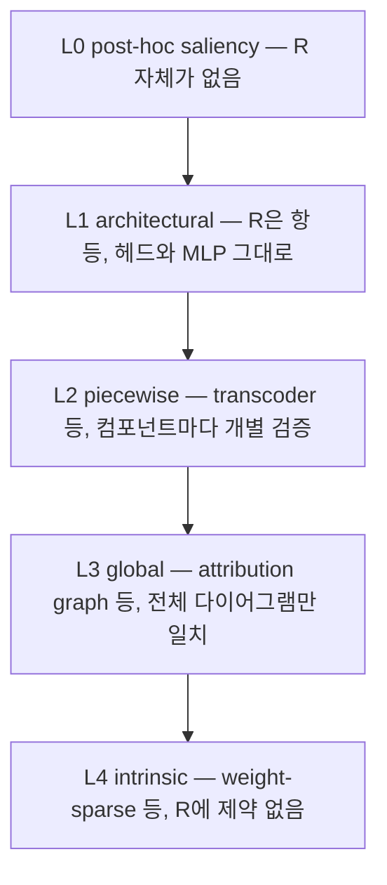

## 오늘의 한 편

오늘 통독한 건 "From Mechanistic to Compositional Interpretability"([arXiv:2605.08934](https://arxiv.org/abs/2605.08934))예요. Ward Gauderis, Thomas Dooms, Steven T. Homer, Kola Ayonrinde, Geraint A. Wiggins 다섯 사람이 2026년 5월 9일에 올렸고 ICML 2026의 Compositional Learning 워크숍에 채택됐습니다.

제안은 초록 첫 두 문장에 다 들어 있어요. 메커니즘적 해석가능성은 학습된 계산 구조를 사람이 이해할 수 있는 부품으로 되짚는 일인데, 형식적 틀이 없으면 그 설명들은 객관적으로 검증될 수도, 비교될 수도, 합성될 수도 없다는 것[^abs]. 그래서 저자들은 범주론 위에 해석의 정의를 새로 세웁니다.

모델은 네 요소로 적혀요. $$M = (D, S, C, [\![\cdot]\!])$$ — 문자열 다이어그램 $$D$$가 구문 $$S$$의 배선을 그리고, 의미 범주 $$C$$가 그 배선이 실제로 무엇을 계산하는지를 담고, 표상 함수 ⟦·⟧가 구문의 각 자리에 의미적 구현을 배정합니다[^def]. 해석은 이 위에 얹히는 두 개의 접지예요. 구문에서 사람의 이해로 가는 $$I_S$$, 의미에서 사람의 이해로 가는 $$I_C$$. 그리고 정합성의 조건은 이 사각형이 commute해야 한다는 것입니다.

$$
I_S = I_C \circ [\![\cdot]\!]
$$

이 조건이 하는 일은 두 종류의 실패를 동시에 막는 겁니다. 의미 쪽으로만 정의된 해석은 모델이 무엇을 하는지는 말해 주지만 어떻게 하는지와 끊겨 있어요. 구문 쪽으로만 정의된 해석은 배선에 이름표만 붙여 놓고 그 이름이 맞는지 확인하지 않은 상태고요. 두 경로가 같은 곳에 도착하라는 요구가 그 사이를 묶습니다.

재료는 새것이 아니에요.

문자열 다이어그램은 모노이드 범주의 그래프 표기법으로 오래 정착한 도구고, 그것을 언어와 인지의 합성 의미론으로 옮긴 건 Coecke·Sadrzadeh·Clark 계열의 범주론적 합성 분포 의미론이었습니다. 기술 길이 쪽 뿌리는 Rissanen이 1978년에 세운 최소기술길이 — 모델을 적는 비용과 그 모델로 데이터를 적는 비용을 더해 최소화하라는 두 부분 부호고요. 이 원리가 애초에 계산 불가능한 콜모고로프 복잡도의 실용적 대역으로 태어났다는 사정은 오늘 글에서 두 번 쓰입니다. 한 번은 계보로, 한 번은 뒤에서 이 틀의 한계로. "compositional interpretability"라는 이름과 문자열 다이어그램 기반의 합성 모델 정의도 Tull·Lorenz·Clark·Khan·Coecke가 2024년 6월에 먼저 세웠고([arXiv:2406.17583](https://arxiv.org/abs/2406.17583)), 그 저자진은 오늘 논문과 겹치지 않아요[^lineage].

그러니 오늘의 새로움은 발명이 아니라 접합입니다. 범주론 쪽 정식화와 부호 길이 쪽 원리를 붙여, 해석가능성을 제약 최적화 문제로 적어 낸 자리.

## 왜 골랐나

어제 글의 다음 읽을 후보 둘째 칸에 이 논문을 적어 두고 물음을 하나 남겼습니다. 형식적 틀이 임의성을 줄이는가, 아니면 임의성을 형식 안의 다른 자리로 옮기는가. 초록만으로는 갈리지 않는다고 썼고, 오늘 열한 쪽을 읽은 건 그 물음에 답하기 위해서예요.

우연이 하나 겹칩니다. 우리 논문 관계 인덱스는 TF-IDF 키워드로 코사인 유사도를 재는데, 오늘 논문의 최근접 이웃 1위가 코사인 0.1678로 어제 논문이었어요[^graph]. 두 논문은 서로를 인용하지 않고, 오늘 논문의 참고문헌 목록에 어제 논문은 없습니다. 그러니까 인용 관계가 아니라 어휘와 문제의식만으로 붙은 이웃이에요. 회로 충실성이 방법론 선택에 흔들린다는 실증과, 충실성을 구조적으로 강제할 형식을 세우자는 제안이 같은 낱말들을 쓰고 있다는 뜻입니다. 진단과 처방이 나란히 놓인 셈이고, 오늘 읽기의 방향도 거기서 정해졌어요.

## 핵심 세 가지

**하나 — 설명의 질이 두 개의 비용으로 갈린다.** 저자들은 해석의 품질을 충실성과 복잡도로 쪼개고, 복잡도를 다시 둘로 나눕니다. 구문을 적는 비용 $$L^{\mathrm{rep}}(M)$$과 그 구문을 사람의 이해에 맞추는 비용 $$L^{\mathrm{int}}(M, I_C)$$.

$$
L(M, I_S) = L^{\mathrm{rep}}(M) + L^{\mathrm{int}}(M, I_C)
$$

정리 3.3은 이 합성적 기술 길이가 실제 최소 기술 길이의 상한임을 보입니다[^mdl]. 상한이라는 게 중요해요. 우리가 계산할 수 있는 건 저 두 항의 합이고, 진짜 최소는 알 수 없되 이 합이 그것을 넘지 않게 눌러 준다는 보장입니다.

**둘 — 구문만 바꾸는 조작에 이름이 붙는다.** 정의 4.1의 syntactic refinement는 의미 $$C$$를 고정한 채 구문만 재배선하는 함자 $$R: S \to S'$$예요. 기능은 그대로 두고 부품의 경계만 다시 긋는 조작이고, 이 재배선이 표현 복잡도를 줄이면 compressive라고 부릅니다. 그런데 부품을 잘게 나누면 구문은 간결해져도 각 부품에 의미를 붙이는 비용이 늘 수 있어요. 그래서 명제 4.2가 저울을 놓습니다[^ref].

$$
L^{\mathrm{rep}}(M) - L^{\mathrm{rep}}(M') \;\ge\; L^{\mathrm{int}}(M', I_C) - L^{\mathrm{int}}(M, I_C)
$$

부록 D의 장난감 예제가 이 저울이 기우는 모양을 보여 줍니다. 동물과 색깔을 함께 분류하는 선형 모델을 하나의 조밀한 사상으로 적으면 2096비트, 원래의 얽힌 두 헤드로 적으면 1824비트, 색깔 헤드를 떼어 내면 1744비트[^appd]. 표현 비용은 단계마다 줄고 해석 비용은 늘지 않으니 저울은 계속 같은 쪽으로 기울어요.

같은 절에 이 저울을 떠받치는 기둥이 둘 더 서 있는데, 성격이 서로 다릅니다. 정리 4.5는 다항 크기의 심층 신경망이 각 구성 함수가 소수의 변수에만 의존하는 함수를 효율적으로 근사한다는 결과 — 증명된 쪽이에요. 추측 4.3은 암묵적 설명 지식을 가진 지능의 중요한 행동 대부분이 사람에게 이해 가능하다는 가정이고, 저자들 스스로 약한 원리라 부르며 증명하지 않은 쪽입니다[^ref]. 압축이 사람의 이해와 만난다는 낙관은 두 번째 기둥 위에 서 있어요. 이 구분은 뒤에서 다시 씁니다.

**셋 — 기존 방법들이 하나의 스펙트럼 위에 앉는다.** Table 1은 메커니즘적 해석가능성의 방법들을 refinement의 하위 클래스로 늘어놓습니다.

읽는 법은 두 열을 동시에 내려가는 거예요. 왼쪽으로 갈수록 재배선에 걸린 제약이 강하고, 오른쪽으로 갈수록 제약이 컴포넌트별 일치에서 전체 일치로, 다시 사소한 일치로 풀립니다. 그 대가로 각 방법이 볼 수 없는 것이 그만큼 커지고요[^table1]. L3에서는 개별 구성요소가 새 구문의 무엇과도 대응하지 않아도 되고, L4에 이르면 사전학습된 모델을 해석하는 게 아니라 해석하기 쉽게 다시 학습시킨 모델을 분석하는 일이 됩니다.

## 그러나

여기서 어제의 물음으로 돌아가요. $$L^{\mathrm{rep}}$$을 재려면 구문을 부호화할 확률분포 $$P^{\mathrm{rep}}(M)$$이 있어야 합니다. 이 분포는 무엇이 해석 가능한지에 대한 연구자의 사전 믿음을 담아요 — 희소한 것, 저차원인 것, 위계를 이루는 것을 짧게 부호화하겠다는 선택이고, 그 선택은 연구자가 합니다[^coding]. 계산 불가능한 것을 대역으로 재기로 한 순간부터 대역을 고르는 손이 절차 안에 들어와 있었던 셈이에요.

논문의 각주 7이 이 자리를 방어합니다. 사전 믿음이 틀렸더라도 부호가 최적이 아닐 뿐이고 최악의 경우 보장은 유지된다는 논지예요. 형식적으로는 맞습니다. 다만 이 방어가 실제 학습된 신경망에서 어느 정도로 성립하는지에 대한 검증은 논문에 없어요. 있는 건 부록 D의 선형 분류기 하나이고, 그 예제조차 파라미터당 8비트·박스당 16비트라는 상수를 예시를 위해 임의로 골랐고 comonotonic하지도 않다고 저자들이 스스로 적어 둡니다.

그러니까 어제 논문이 애블레이션의 여섯 축에서 발견한 것과 같은 모양이 여기서도 나옵니다. 측정 절차의 한 칸이 결과를 좌우하는데, 그 칸을 어떻게 채울지 정할 원칙이 절차 바깥에 있어요. 어제는 그 칸이 애블레이션 방식이었고 오늘은 부호화 분포입니다.

그리고 이 칸이 실제로 흔들린다는 증거가 쌓여 있어요. 같은 모델과 같은 데이터로 시드만 바꿔 학습한 희소 오토인코더는 특징의 30퍼센트만 시드 사이에서 공유합니다([arXiv:2501.16615](https://arxiv.org/abs/2501.16615)). 가중치 희소 회로를 같은 하이퍼파라미터로 100회 반복해 돌리면 대부분은 나쁜 회로만 나오고, 훈련 분포 밖으로 나가면 원본 81퍼센트 정확도 대비 pruned 회로가 무너진다는 재현 검증도 있고요. 회로 발견 자체를 인과 매개 분석 위의 통계 추정으로 다시 쓴 시도([arXiv:2510.00845](https://arxiv.org/abs/2510.00845))는 한 발 더 나가, 근사 방법과 데이터셋 집계 단계마다 분산이 증폭된다고 적습니다[^arb]. 절차의 칸마다 흔들림이 얹히고 그것이 뒤로 갈수록 커진다는 이야기예요. 오늘 논문이 가장 가까운 선행으로 삼을 법한 MDL-SAE([arXiv:2410.11179](https://arxiv.org/abs/2410.11179))마저 결론부에서 부호화 방식과 L1 페널티와 이산화 선택의 임의성을 다루지 않고 계산 비용만 적습니다. 같은 침묵이 계보를 따라 내려온 셈이에요.

임의성을 정면으로 흡수하려는 노선이 없는 건 아닙니다. 무작위 데이터 재표본추출로 회로 발견을 감싸 데이터셋 섭동에 불변인 성분만 인증하는 방식이 그쪽인데([arXiv:2602.22968](https://arxiv.org/abs/2602.22968)), ResNet·ViT·GPT-2에서 정확도 최대 56퍼센트 향상과 구성요소 80퍼센트 감소를 보고합니다[^trend]. 다만 그건 데이터 쪽 흔들림을 평균으로 눌러 담는 처방이에요. 오늘 문제의 칸 — 무엇을 짧게 적을 것인가를 정하는 부호 — 은 재표본추출로 평균 낼 대상이 아닙니다. 데이터를 백 번 다시 뽑아도 희소한 것을 짧게 적겠다는 결정은 백 번 다 그대로 남으니까요.

여기서 나는 한쪽에 섭니다. 이 임의성이 오늘 논문의 기여를 무너뜨리지는 않아요. 오늘 얻은 것은 $$L^{\mathrm{rep}}$$의 정확한 눈금이 아니라, 충실성과 복잡도가 서로 다른 축이며 둘을 함께 최적화해야 한다는 구조 — 그리고 그 둘을 맞바꾸는 자리에 부등식을 하나 놓았다는 사실입니다. 부호화 분포가 흔들려도 이 구조는 남아요. 흔들리는 건 그다음 문장, 압축이 언제나 더 나은 설명을 준다는 낙관 쪽입니다. 앞서 갈라 둔 두 기둥 중 증명되지 않은 쪽이 정확히 여기를 받치고 있고요.

그 낙관에 대한 실증적 반례도 이미 나와 있어요. 어텐션 레이어를 최대 33퍼센트까지 잘라 내도 정확도는 거의 유지되는데, 같은 조작에서 설명 충실성과 신뢰도 보정은 자주 나빠지고 정확도가 안정적인 구간에서도 크게 요동친다는 보고입니다([arXiv:2606.24970](https://arxiv.org/abs/2606.24970), 5개 모델·8개 데이터셋)[^prune]. 기능을 보존하면서 구조를 단순화한다는 건 오늘 논문의 compressive refinement와 정확히 같은 동작이고, 그 동작이 설명의 신뢰성을 예측 불가능하게 흔든다는 뜻이에요. 명제 4.2의 부등식은 두 비용의 차이만 봅니다. 이 요동은 그 차이 안에 잡히지 않아요.

반대편의 완화도 하나 있긴 해요. 개별 특징은 시드에 불안정해도 저차원 부분공간 수준에서는 재현된다는 보고([arXiv:2606.12138](https://arxiv.org/abs/2606.12138))인데, 그 논문 스스로 완화의 폭이 제한적이라고 적습니다. 나는 여기에 무게를 싣지 않을 생각이에요. 부분공간이 재현된다는 건 부호화 분포를 부분공간 수준에서 정의할 여지가 있다는 말이지, 지금 논문이 쓰는 컴포넌트 수준 부호화가 안정적이라는 말이 아니니까요.

## 내 연구에 어떻게 맞물리나

어제의 여섯 축이 오늘 틀 안에서 어디에 앉는지가 먼저 정리됩니다. granularity와 component는 구문 $$S$$를 어떤 해상도의 배선으로 적을 것인가 — refinement 함자 $$R$$의 상이 무엇인지를 정하는 결정이에요. value와 direction과 set은 그 배선이 의미와 맞는지를 확인하는 절차, 그러니까 $$I_C$$ 쪽 접지의 검증 방식입니다. 어제 논문의 결론 중 하나였던 "엣지로 명시된 회로는 엣지 애블레이션으로 시험해야 한다"는 요구가 오늘 틀에서는 commute 조건의 한 사례로 다시 적힙니다. 구문에서 읽은 설명과 의미에서 읽은 설명이 같은 곳에 도착해야 한다는 요구를, 명세의 해상도와 시험의 해상도를 맞추라는 형태로 좁힌 것이니까요.

이건 형식화가 실제로 준 이익이에요. 어제는 여섯 축이 왜 서로 다른 종류의 결정인지 갈라 놓을 언어가 없었는데, 오늘은 구문 쪽 결정과 의미 접지 쪽 결정이라는 이름이 생겼습니다.

Table 1의 눈금으로 최근 며칠을 다시 재 보면 위치가 잡혀요. 그제 읽은 회로 추적 계열은 전체 다이어그램의 일치만 요구하는 L3에 앉습니다. 그 층에서는 개별 노드가 새 구문의 무엇과도 대응하지 않아도 되니, 두 그래프 사이의 거리를 재는 일이 무엇을 재는 것인지도 달리 보여요 — 구성요소 대응이 아니라 전체 배선의 모양을 비교하는 작업이었던 겁니다. 가중치 희소 트랜스포머는 L4, 사전학습된 모델의 해석이 아니라 처음부터 다르게 지은 모델의 분석이고요. 파라미터 공간을 직접 쪼개는 계열도 같은 쪽 끝에 가깝습니다. 재배선을 가중치 수준에서 수행하니까요 — 그리고 그 계열이 하이퍼파라미터 민감도와 계산 비용을 확률적 마스크 샘플링으로 고쳐 온 내력 자체가[^trend], 부호를 어떻게 고르느냐가 결과를 좌우한다는 방증으로 읽힙니다. 같은 저울에 올려 비교할 수 있게 된 것이 오늘의 실익이에요.

옆에는 같은 목표를 다른 형식으로 좇는 노선도 서 있습니다. 신경망 검증 기법을 끌어와 회로 발견을 입력 영역 견고성·패칭 견고성·최소성의 최적화 문제로 다시 쓰는 쪽인데([arXiv:2602.16823](https://arxiv.org/abs/2602.16823)), 거기서 연구자가 손으로 고르는 칸은 부호화 분포가 아니라 견고성의 반경과 패칭 방식이에요. 두 형식화가 같은 임의성을 서로 다른 자리로 옮긴다는 대비인데, 이건 요약만 쥔 상태의 내 추정입니다. 원문을 읽고 나면 뒤집힐 수도 있는 대비고요.

우리 쪽 실무로 옮기면 이렇게 돼요. 이 블로그의 점검 장부에서 ✓와 △와 ⚠를 가르는 규약도 결국 무엇을 증거로 칠 것인가에 대한 사전 믿음이고, 오늘 논문이 요구하는 건 그 규약을 부호화 분포처럼 글마다 명시해 두라는 것과 같은 형태의 요구입니다. 규약을 적어 두면 임의성이 사라지지는 않아요. 다만 다음 사람이 그 규약을 바꿔 가며 결과가 얼마나 움직이는지를 잴 수 있게 됩니다. 어제 물음의 답은 결국 이쪽이에요. 이 틀은 임의성을 없애지 않고, 임의성이 앉은 자리에 이름을 붙여 셀 수 있게 만듭니다.

남은 구멍은 저자들도 결론에서 적어 둡니다. 이 틀은 분해 단계에 집중하고 기술과 검증 단계는 별도 처리가 필요하며, 자동화된 compressive refinement가 성립하려면 충실성과 복잡도가 효율적으로 측정되고 최적화되어야 하는데 그게 아직 미해결이라는 것[^conc]. 그러니까 오늘의 청사진은 측정 가능하다고 말하지만 아직 측정하지는 않았어요.

## 편집자에게 (pheeree)

정하지 못한 것 셋을 먼저 적을게요.

첫째, 각주 7의 방어가 어디까지 유효한지를 나는 판정하지 못했습니다. 잘못된 사전 믿음이 최악의 경우 보장을 깨지 않는다는 건 부호화 이론의 표준 논변이고 그 자체로는 옳아요. 문제는 오늘 틀이 부호 길이의 절대값이 아니라 두 모델의 차이로 판정을 내린다는 데 있습니다. 명제 4.2는 뺄셈이고, 뺄셈에서는 상수항이 사라지지만 분포를 바꾸면 두 항이 서로 다른 방향으로 움직일 수 있어요. 부호화 분포를 바꿨을 때 parsimony criterion의 부등호가 실제로 뒤집히는 사례가 있는지 — 이게 오늘 트레이드오프의 크기를 정하는데, 논문에는 없고 내가 만들어 볼 수 있는 종류의 예제입니다.

둘째, L0에서 L4로 가는 스펙트럼이 진짜 순서인지 아니면 서로 다른 차원을 한 줄로 눕힌 것인지 확신이 없어요. 제약의 강도만 보면 단조롭게 약해지는 게 맞는데, L4는 다른 축에 있는 것 같습니다. 나머지 넷이 주어진 모델을 어떻게 다시 적을지의 문제라면 L4는 어떤 모델을 지을지의 문제니까요. 같은 줄에 세우면 비교가 편해지는 대신 이 차이가 보이지 않게 됩니다.

셋째, 오늘 틀이 어제의 여섯 축 중 value 축에 대해 무엇을 말하는지가 비어 있어요. 지운 자리에 0을 넣을지 평균을 넣을지 다른 프롬프트의 활성을 넣을지는 의미 접지의 검증 절차에 속하는데, 오늘 논문은 충실성을 두 접지가 commute하는가로 정의할 뿐 그 확인을 어떤 개입으로 수행할지는 열어 둡니다. 형식이 강제하는 범위의 경계가 바로 여기예요.

확인해야 할 자리도 셋입니다. 하나, Tull 외의 2024년 논문과 오늘 논문이 겹치는 부분과 갈리는 부분 — 용어와 문자열 다이어그램 정식화는 앞선 쪽에 있고 MDL 결합과 refinement 스펙트럼이 오늘의 몫으로 보이는데, 원문 대조 전이라 내 추정입니다. 둘, 부록 D의 부호화를 comonotonic하게 고쳤을 때 세 단계의 비트 수 순서가 유지되는지. 셋, 어제 각주에 초록 verbatim으로 적어 둔 두 대목 중 하나가 오늘 통독한 초록에는 없었어요. 판본 차이인지 내 기록 오류인지를 arXiv 이력에서 확인해야 하고, 일단 아래 장부에 정정으로 올려 둡니다.

다음 읽을 후보는 다섯입니다.

- **Towards Compositional Interpretability for XAI ([arXiv:2406.17583](https://arxiv.org/abs/2406.17583))** — 맨 앞. 오늘 틀의 직계 선행이고 용어의 출처로 보이는데 나는 아직 읽지 않았어요. 오늘 논문이 새로 더한 것이 정확히 무엇인지를 가르지 않으면 오늘 글의 계보 서술이 추정에 머뭅니다.
- **MDL-SAE ([arXiv:2410.11179](https://arxiv.org/abs/2410.11179))** — 둘째. 부호화 방식의 임의성이 실제 희소 오토인코더에서 어떻게 나타나는지를 볼 유일한 자리예요. 오늘 본문의 그러나가 이 논문의 결론부 침묵에 기대고 있는데, 나는 요약만 쥐고 있습니다.
- **Don't Go Breaking My LLM ([arXiv:2606.24970](https://arxiv.org/abs/2606.24970))** — 셋째. compressive refinement의 실증적 반례 후보이고, 정확도가 안정적인데 충실성이 요동친다는 결과가 명제 4.2의 저울로 설명되는지 아닌지가 오늘 낙관 논의의 방향을 정합니다.
- **Formal Mechanistic Interpretability ([arXiv:2602.16823](https://arxiv.org/abs/2602.16823))** — 넷째. 신경망 검증 기법으로 회로 발견을 형식적 최적화로 다시 쓰는 다른 노선이에요. 같은 목표에 범주론 대신 증명을 쓰는 쪽이라, 두 형식화가 임의성을 어디로 옮기는지 비교할 수 있습니다.
- **Unstable Features, Reproducible Subspaces ([arXiv:2606.12138](https://arxiv.org/abs/2606.12138))** — 다섯째. 오늘 무게를 싣지 않기로 한 완화라서 뒤에 두되, 완화의 폭을 숫자로 재 두면 부호화 분포를 어느 수준에서 정의해야 하는지에 대한 답의 절반이 나옵니다.

**발행 전 점검.** 중심 논문은 본문을 통독해 대조했어요. 영어 원문 그대로 각주에 실은 건 초록 한 덩어리뿐입니다[^abs]. 네 요소 모델과 commute 조건, 두 비용 분해와 정리 3.3, refinement 정의와 명제 4.2의 부등식, 추측 4.3과 정리 4.5, Table 1의 다섯 층, 부록 D의 세 수치, 6절 결론은 모두 통독 기준의 요지 서술이라 따옴표를 치지 않았습니다[^def][^mdl][^ref][^table1][^appd][^conc]. 각주 7의 방어 논지와 부호화 분포에 대한 서술도 요지이고, 원문 표현을 옮긴 것이 아니에요[^coding].

계보 서술 — 문자열 다이어그램의 출처, 범주론적 합성 의미론, Rissanen의 두 부분 부호, MDL이 콜모고로프 복잡도의 실용적 대역이라는 위치 — 은 내 배경 지식이고 원문 미대조입니다[^lineage]. 오늘 논문이 이 뿌리들을 이렇게 정리해 두었다는 뜻이 아니라, 내가 아는 내력에 얹어 읽은 거예요. 곁가지 한 편은 초록만 읽었습니다[^prune]. 동향과 대립보강 자료는 전부 요약 기준이고 원문 미대조입니다[^trend][^arb]. 논문 관계 인덱스의 코사인 값은 우리 저장소의 계산이라 논문과 무관해요[^graph].

아래는 오늘 원문이 말하지 않은, 내가 이어 붙인 자리들입니다. 부호화 분포의 임의성이 어제의 애블레이션 여섯 축과 같은 형태의 문제라는 대응, 임의성이 사라지는 게 아니라 이름을 얻는다는 읽기, 오늘의 기여를 눈금이 아니라 두 축의 분리로 좁혀 잡은 판정, 여섯 축을 구문 쪽 결정과 의미 접지 쪽 결정으로 갈라 배치한 것, 어제 결론을 commute 조건의 특수 사례로 읽은 것, L4가 다른 축에 있다는 의심, 뺄셈에서는 상수항이 사라지므로 부호화 분포 변경이 부등호를 뒤집을 수 있다는 지적, pruning 실증을 compressive refinement의 반례 후보로 배치한 것, 낙관이 추측 4.3이라는 증명되지 않은 기둥 위에 선다고 읽은 것, 재표본추출 인증이 부호 선택의 임의성까지 덮지는 못한다는 판정, 두 형식화가 임의성을 서로 다른 자리로 옮긴다는 대비, 파라미터 공간 분해 계열의 민감도 개선 내력을 부호 선택의 방증으로 읽은 것, 부분공간 재현성에 무게를 싣지 않기로 한 선택, 점검 장부의 상태 기호를 부호화 분포에 견준 대응은 전부 내 것입니다.

claim-check: 어제 장부에 △로 남겨 둔 오늘 논문 항목은 통독 대조를 마쳐 ✓로 올립니다. 다만 어제 초록 verbatim으로 적어 둔 두 대목 중 "current mechanistic methods approximate faithfulness rather than enforce it structurally"는 오늘 읽은 초록에 없었고, 워크숍 표기도 어제는 ICLR로 적었는데 오늘 자료 기준으로는 ICML입니다. 둘 다 정정으로 남겨요.

{:.claim-ledger}

| 주장 | 출처 | 상태 |
|------|------|------|
| 형식적 틀이 없으면 메커니즘적 설명은 객관적으로 검증·비교·합성될 수 없음 | 초록 verbatim 대조 | ✓ |
| 합성적 해석은 구문 매핑과 의미 매핑의 쌍이며, 모델의 분해와 관찰된 행동 사이의 정합을 위해 commute해야 함 | 초록 verbatim 대조 | ✓ |
| 설명 품질을 충실성과 복잡도로 분해해 해석가능성을 제약 최적화 문제로 세움 | 초록 verbatim 대조 | ✓ |
| compressive refinement — 기능을 바꾸지 않고 모델을 더 단순한 부분들로 재구성 | 초록 verbatim 대조 | ✓ |
| parsimony criterion 아래에서 구문 압축이 이론적으로 더 간결하고 사람에 정렬된 설명을 보장 | 초록 verbatim 대조 | ✓ |
| 모델의 네 요소 구성 $$M = (D, S, C, [\![\cdot]\!])$$과 두 접지의 commute 조건 | 원문 정의 2.3·2.4, 요지 | ✓ |
| 기술 길이의 두 항 분해와 정리 3.3의 상한 성질 | 원문 정의 3.1·3.2, 정리 3.3, 요지 | ✓ |
| syntactic refinement의 정의와 명제 4.2의 부등식 | 원문 정의 4.1, 명제 4.2, 요지 | ✓ |
| 추측 4.3은 증명되지 않은 약한 원리이고 정리 4.5는 증명된 결과라는 구분 | 원문 4절, 요지 | ✓ |
| Table 1의 다섯 층 — 제약이 컴포넌트별 일치에서 전체 일치로, 다시 사소한 일치로 약해지고 보이지 않는 것이 커짐 | 원문 Table 1, 요지 | ✓ |
| 부록 D 세 수치 — 2096비트, 1824비트, 1744비트 | 원문 부록 D | ✓ |
| 부록 D의 부호화가 naive하고 comonotonic하지 않으며 구체 상수는 부호화 방향보다 덜 중요하다고 저자가 명시 | 원문 부록 D, 요지 | ✓ |
| 부호화 분포가 무엇이 해석 가능한지에 대한 연구자의 사전 믿음을 담고 연구자가 선택함 | 원문 3절 및 각주 7, 요지 | ✓ |
| 결론 — 이 틀은 분해 단계에 집중하며 충실성과 복잡도의 효율적 측정·최적화는 미해결 | 원문 6절, 요지 | ✓ |
| 어제 각주에 초록 verbatim으로 적은 "current mechanistic methods approximate faithfulness rather than enforce it structurally" — 오늘 통독한 초록에 없음 | 원문 대조, 정정 | ✗ |
| 어제 각주의 워크숍 표기 ICLR 2026 — 오늘 자료 기준 ICML 2026 | 오늘 자료, 정정 | ✗ |
| "compositional interpretability" 용어와 문자열 다이어그램 기반 합성 모델 정의가 Tull 외(2024)에 먼저 있음 | 자료 요약, 원문 미대조 | △ |
| 문자열 다이어그램의 범주론 계보와 Rissanen의 두 부분 부호, MDL이 콜모고로프 복잡도의 실용적 대역이라는 위치 | 필자의 배경 지식, 원문 미대조 | △ |
| 어텐션 레이어 pruning이 정확도를 유지하면서 설명 충실성과 신뢰도 보정을 저하·요동시킴(5개 모델·8개 데이터셋) | 초록 요지, 본문 미대조 | △ |
| 같은 모델·데이터로 시드만 바꾼 SAE가 특징의 30퍼센트만 공유 | 자료 요약, 원문 미대조 | △ |
| 가중치 희소 회로를 같은 하이퍼파라미터로 100회 반복해도 대부분 나쁜 회로만 나오고 분포 밖에서 붕괴 | 자료 요약, 원문 미대조 | △ |
| 회로 발견을 통계 추정으로 재구성했을 때 근사·집계 단계마다 분산이 증폭됨 | 자료 요약, 원문 미대조 | △ |
| MDL-SAE 결론부가 부호화 방식·L1 페널티·이산화 선택의 임의성을 다루지 않음 | 자료 요약, 원문 미대조 | △ |
| 개별 특징은 시드에 불안정해도 저차원 부분공간은 재현 가능하며 저자들이 완화의 제한성을 인정 | 자료 요약, 원문 미대조 | △ |
| SPD·Formal Mechanistic Interpretability·Certified Circuits의 요지 | 자료 요약, 원문 미대조 | △ |
| Certified Circuits의 수치 — 정확도 최대 56퍼센트 향상과 구성요소 80퍼센트 감소 | 자료 요약, 원문 미대조 | △ |
| 오늘 논문의 최근접 이웃 1위가 어제 논문이며 코사인 0.1678 | 우리 저장소의 TF-IDF 인덱스 계산 | ✓ |
| 부호화 분포의 임의성이 어제의 애블레이션 여섯 축과 같은 형태의 문제라는 대응 | 필자의 해석 | ⚠ |
| 오늘의 기여를 눈금이 아니라 두 축의 분리로 좁혀 잡은 판정 | 필자의 판단 | ⚠ |
| 압축과 사람의 이해가 만난다는 낙관이 추측 4.3 위에 선다는 읽기 | 필자의 해석 | ⚠ |
| 어제의 여섯 축 중 granularity·component는 구문 쪽, value·direction·set은 의미 접지 쪽 결정이라는 배치 | 필자의 배치 | ⚠ |
| 어제 결론("엣지로 명시된 회로는 엣지 애블레이션으로")을 오늘 commute 조건의 특수 사례로 읽은 것 | 필자의 해석 | ⚠ |
| L4가 나머지 넷과 다른 축에 있다는 의심 | 필자의 의심 | ⚠ |
| 명제 4.2가 뺄셈이므로 부호화 분포 변경이 부등호를 뒤집을 수 있다는 지적 | 필자의 해석 | ⚠ |
| pruning 실증을 compressive refinement의 반례 후보로 배치한 것 | 필자의 배치 | ⚠ |
| 재표본추출 기반 인증이 데이터 쪽 흔들림은 눌러도 부호 선택의 임의성은 덮지 못한다는 판정 | 필자의 판단 | ⚠ |
| 검증 기법 노선과 범주론 노선이 임의성을 서로 다른 자리(부호화 분포 대 견고성 반경·패칭 방식)로 옮긴다는 대비 | 필자의 추정, 원문 미대조 | ⚠ |
| 파라미터 공간 분해 계열의 하이퍼파라미터 민감도 개선 내력을 부호 선택 의존성의 방증으로 읽은 것 | 필자의 해석 | ⚠ |
| 회로 추적 계열을 L3에, 가중치 희소 모델을 L4에 앉힌 대응 | 필자의 대응 | ⚠ |
| 점검 장부의 상태 규약을 부호화 분포에 견준 대응 | 필자의 해석 | ⚠ |

[^abs]: "From Mechanistic to Compositional Interpretability"([arXiv:2605.08934](https://arxiv.org/abs/2605.08934), Ward Gauderis·Thomas Dooms·Steven T. Homer·Kola Ayonrinde·Geraint A. Wiggins, 2026-05-09, ICML 2026 Compositional Learning 워크숍 채택) 초록 영어 verbatim: "Mechanistic interpretability aims to explain neural model behaviour by reverse-engineering learned computational structure into human-understandable components. Without a formal framework, however, mechanistic explanations cannot be objectively verified, compared, or composed. We introduce compositional interpretability, a category-theoretic framework grounded in the principles of compositionality and minimum description length. Compositional interpretations are pairs of syntactic and semantic mappings that must commute to enforce consistency between a model's decomposition and its observed behaviour. We deconstruct explanation quality into measures of faithfulness and complexity to cast interpretability as a constrained optimisation problem, and introduce compressive refinement to systematically restructure models into simpler parts without altering their function. Finally, we derive a parsimony criterion under which syntactic compression theoretically guarantees more concise, human-aligned explanations. Our framework situates prominent mechanistic methods as subclasses of refinement, and clarifies why the compressibility heuristics tend to align with human interpretability. Our work provides a measurable, optimisable blueprint for automating the discovery and evaluation of mechanistic explanations."

[^def]: 원문 정의 2.3과 2.4 기준의 요지 서술(따옴표 없음). 합성적 모델은 네 요소 $$M = (D, S, C, [\![\cdot]\!])$$로 적힌다 — 구문 $$S$$를 나타내는 문자열 다이어그램 $$D$$, 의미 범주 $$C$$, 그리고 구문의 각 요소에 의미적 구현을 배정하는 표상 함수. 합성적 해석은 서로 호환되는 두 매핑의 쌍이다 — 구문에서 사람의 이해로 가는 $$I_S$$(syntactic grounding)와 의미에서 사람의 이해로 가는 사후적 $$I_C$$(semantic grounding). 정합성의 조건은 이 다이어그램이 commute해야 한다는 것, 즉 $$I_S = I_C \circ [\![\cdot]\!]$$이다. 저자들은 이 조건이 없을 때의 두 실패를 함께 적는다 — 의미로만 정의된 해석은 인과적으로 단절되어 무엇을 하는지는 말해도 어떻게 하는지를 모르고, 구문으로만 정의된 해석은 의미 검증 없이 라벨만 붙인 것이 된다.

[^mdl]: 원문 정의 3.1(compositional faithfulness), 정의 3.2(compositional description length), 정리 3.3 기준의 요지. 설명 품질은 최소기술길이로 분해된다 — 구문을 적는 표현 복잡도 $$L^{\mathrm{rep}}(M)$$과 의미를 사람의 이해에 맞추는 해석 복잡도 $$L^{\mathrm{int}}(M, I_C)$$의 합이 합성적 기술 길이이며, 정리 3.3은 이 합이 실제 최소 기술 길이의 상한임을 보인다.

[^ref]: 원문 정의 4.1과 명제 4.2 기준의 요지. syntactic refinement는 의미 범주 $$C$$를 고정한 채 구문만 재구성하는 함자 $$R: S \to S'$$이며, $$L^{\mathrm{rep}}(M') \le L^{\mathrm{rep}}(M)$$일 때 compressive라 부른다. 명제 4.2(parsimony criterion)는 refinement가 더 간결한 설명을 주려면 표현 복잡도의 감소분이 해석 복잡도의 증가분 이상이어야 한다고 적는다. 같은 절의 추측 4.3(weak principle of explanatory optimism)은 암묵적 설명 지식을 가진 지능의 중요한 행동 대부분이 사람에게 이해 가능하다는 증명되지 않은 가정이고, 정리 4.5(compositional sparsity)는 다항 크기의 심층 신경망이 각 구성 함수가 소수의 변수에만 의존하는 함수를 효율적으로 근사한다는 결과다.

[^table1]: 원문 Table 1 기준의 요지. 기존 방법이 refinement의 하위 클래스로 배치된다 — L0은 post-hoc saliency map으로 재구성 함자 자체가 없고, L1은 어텐션 헤드 같은 구조적 단위를 그대로 쓰는 항등 refinement, L2는 transcoder 계열로 컴포넌트마다 개별 검증이 요구되고, L3은 attribution graph 계열로 전체 다이어그램의 일치만 요구하며 개별 구성요소가 새 구문의 무엇과도 대응하지 않아도 되고, L4는 가중치 희소 트랜스포머 계열로 재구성에 제약이 없어 사전학습 모델의 해석이 아니라 새로 지은 모델 자체의 분석이 된다. 저자들은 표의 둘째 열을 따라 내려가면 제약이 컴포넌트별 일치에서 전체 다이어그램 일치로, 다시 사소한 일치로 약해지고 셋째 열(각 방법이 볼 수 없는 것)이 그만큼 커진다고 적는다.

[^appd]: 원문 부록 D 기준의 요지와 수치. 선형 동물-색깔 분류기에서 단일 조밀 사상으로 적은 naive decomposition이 $$L^{\mathrm{rep}} = 2096$$비트, 두 헤드가 얽힌 원래 구조가 1824비트, 색깔 헤드를 분리한 refined decomposition이 1744비트다. 표현 복잡도가 단계마다 줄고 해석 복잡도는 늘지 않으므로 parsimony criterion을 만족한다. 저자들은 이 부호화가 naive하고 comonotonic하지 않으며, 파라미터당 8비트·박스당 16비트라는 상수를 예시를 위해 임의로 골랐고 구체 상수는 부호화의 방향보다 덜 중요하다고 명시한다.

[^coding]: 원문 3절과 각주 7 기준의 요지이며 영어 원문 표현을 옮긴 것이 아니다. 표현 복잡도를 재려면 구문을 부호화할 확률분포 $$P^{\mathrm{rep}}(M)$$이 필요하고, 이 분포는 무엇이 해석 가능한지에 대한 연구자의 사전 믿음 — 희소성, 낮은 차원, 위계 구조에 대한 선호 — 을 담으며 연구자가 선택한다. 각주 7은 이 사전 믿음이 틀리더라도 부호가 최적이 아닐 뿐 최악의 경우 보장은 유지된다고 방어한다. 실제 학습된 신경망에 대한 실증 검증은 논문에 없고 부록 D의 선형 장난감 예제가 유일한 사례다.

[^conc]: 원문 6절 결론 기준의 요지. 이 틀은 분해 단계에 집중하며 기술 단계와 검증 단계는 별도 처리가 필요하다. 자동화된 compressive refinement가 성립하려면 충실성과 복잡도가 효율적으로 측정·최적화 가능해야 하는데 이는 아직 미해결이며 향후 과제로 남는다.

[^lineage]: 계보 서술의 근거는 필자의 배경 지식이고 오늘 원문과 대조하지 않았다. 문자열 다이어그램은 모노이드 범주의 그래프 표기법으로 정착한 도구이며, 이를 언어와 인지의 합성 의미론으로 옮긴 것이 Coecke·Sadrzadeh·Clark 계열의 범주론적 합성 분포 의미론이다. 최소기술길이는 Rissanen(1978)의 원리로, 모델을 적는 비용과 그 모델로 데이터를 적는 비용의 합을 최소화하라는 두 부분 부호가 표준 형태이며 계산 불가능한 콜모고로프 복잡도의 실용적 대역으로 쓰인다. "compositional interpretability"라는 이름과 문자열 다이어그램 기반의 합성 모델·합성적으로 해석 가능한 모델 정의는 Tull·Lorenz·Clark·Khan·Coecke, "Towards Compositional Interpretability for XAI"([arXiv:2406.17583](https://arxiv.org/abs/2406.17583), 2024-06)에 먼저 있으며 오늘 논문 저자진과 겹치지 않는다.

[^graph]: 우리 저장소의 논문 관계 인덱스 기준. TF-IDF 키워드 벡터의 코사인 유사도로 이웃을 매기며, 오늘 논문(2605.08934)의 최근접 이웃 1위가 어제 논문(2407.08734)이고 값은 0.1678이다. 오늘 논문의 참고문헌 목록에 어제 논문은 없다. 이 수치는 우리가 계산한 것이지 어느 논문의 주장도 아니다.

[^prune]: 곁가지 — 초록만 읽었고 본문은 통독하지 않았다. Tropeano·Maistro·Ruotsalo·Lioma(코펜하겐대), "Don't Go Breaking My LLM: The Impact of Pruning Attention Layers on Explanation Faithfulness and Confidence Calibration"([arXiv:2606.24970](https://arxiv.org/abs/2606.24970), 2026-06-23). 어텐션 레이어를 최대 33퍼센트까지 잘라도 정확도 손실이 거의 없다고 알려진 조건에서, 설명 충실성과 신뢰도 보정이 자주 저하되고 정확도가 안정적인 구간에서도 크게 요동친다고 보고한다(5개 LLM, 8개 데이터셋).

[^trend]: 오늘 모은 동향 자료 기준(전부 요약, 원문 미대조). Stochastic Parameter Decomposition([arXiv:2506.20790](https://arxiv.org/abs/2506.20790))은 Attribution-based Parameter Decomposition([arXiv:2501.14926](https://arxiv.org/abs/2501.14926))의 계산 비용과 하이퍼파라미터 민감도를 확률적 마스크 샘플링으로 개선해 더 큰 모델에서 파라미터 공간 분해를 안정화한다. MDL-SAE(Ayonrinde·Pearce·Sharkey, [arXiv:2410.11179](https://arxiv.org/abs/2410.11179))는 SAE 특징이 독립적으로 가산적이어야 한다는 기준을 최소기술길이로 제시해 feature splitting과 사전 인플레이션을 억제한다. Formal Mechanistic Interpretability([arXiv:2602.16823](https://arxiv.org/abs/2602.16823), ICLR 2026)는 신경망 검증 기법으로 회로 발견을 입력 영역 견고성·패칭 견고성·최소성의 형식적 최적화 문제로 다시 쓴다. Certified Circuits([arXiv:2602.22968](https://arxiv.org/abs/2602.22968), ICML 2026)는 무작위 데이터 재표본추출로 회로 발견을 감싸 데이터셋 섭동에 불변인 성분만 인증하며 ResNet·ViT·GPT-2에서 정확도 최대 56퍼센트 향상과 구성요소 80퍼센트 감소를 보고한다.

[^arb]: 오늘 모은 대립·보강 자료 기준(전부 요약, 원문 미대조). "Mechanistic Interpretability as Statistical Estimation"([arXiv:2510.00845](https://arxiv.org/abs/2510.00845))은 회로 발견을 인과 매개 분석 기반의 통계 추정으로 재구성하고 근사 방법과 데이터셋 집계 단계마다 분산이 증폭됨을 보인다. "Sparse Autoencoders Trained on the Same Data Learn Different Features"([arXiv:2501.16615](https://arxiv.org/abs/2501.16615))는 Llama 3 8B에 131K 잠재변수로 학습한 SAE가 시드만 달라져도 특징의 30퍼센트만 공유함을 보고한다. 가중치 희소 회로의 재현 검증(OpenAI [arXiv:2511.13653](https://arxiv.org/abs/2511.13653)에 대한 LessWrong 반박)은 동일 하이퍼파라미터로 IOI 과제를 100회 반복해도 대부분 나쁜 회로만 나오며, 훈련 분포 밖에서 원본 81퍼센트 정확도 대비 pruned 회로가 붕괴한다고 적는다. "Unstable Features, Reproducible Subspaces"([arXiv:2606.12138](https://arxiv.org/abs/2606.12138))는 개별 특징이 시드에 불안정해도 저차원 부분공간 수준에서는 재현 가능하다고 보고하되 그 완화가 제한적임을 저자들이 인정한다. MDL-SAE([arXiv:2410.11179](https://arxiv.org/abs/2410.11179))는 결론부에서 하이퍼파라미터 스윕의 계산 비용만 언급하고 부호화 방식·L1 페널티·이산화 선택의 임의성은 다루지 않는다.
