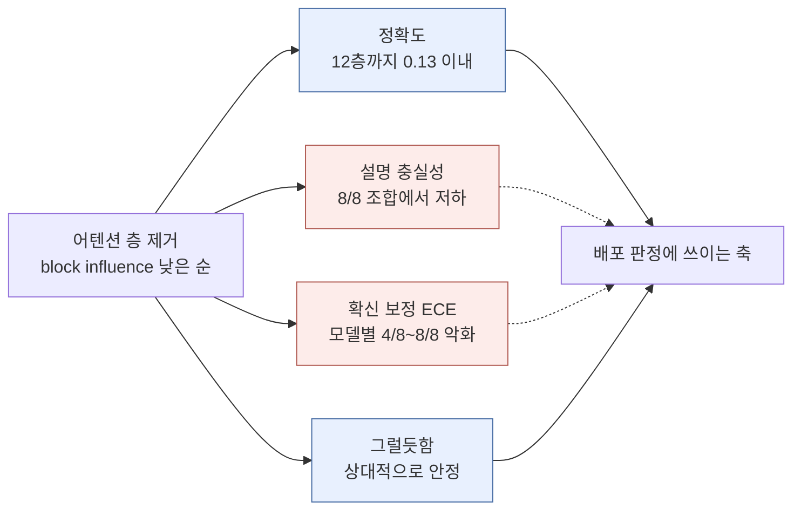
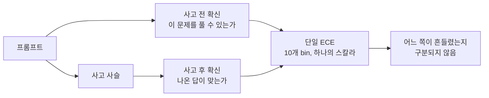

## 오늘의 한 편

오늘 통독한 건 "Don't Go Breaking My LLM: The Impact of Pruning Attention Layers on Explanation Faithfulness and Confidence Calibration"([arXiv:2606.24970](https://arxiv.org/abs/2606.24970))이에요. Pietro Tropeano, Maria Maistro, Tuukka Ruotsalo, Christina Lioma가 썼고 코펜하겐대 소속입니다(Ruotsalo는 LUT University Lahti 겸임). 2026년 6월 23일 게시.

물음은 한 줄로 줄어들어요. 어텐션 층은 LLM에서 가장 자원을 많이 쓰는 부분이고 선행 연구는 그중 33퍼센트까지 덜어내도 정확도 손실이 미미하다고 보고했는데, 그렇게 잘라낸 모델의 해석가능성 — 구체적으로 설명 충실성과 확신 보정 — 이 어떻게 되는지는 아무도 재 보지 않았다는 것[^abs].

설정은 단순합니다. 5개 모델(Mistral 7B, Llama-2 7B, Llama-3 8B, Qwen-3 4B, Qwen-3 8B)과 8개 데이터셋(ARC Easy, ARC Challenge, OpenBookQA, BoolQ, TweetEval, Rotten Tomatoes, SST-2, RTE). 층의 중요도는 block influence — 그 층의 입력과 출력이 얼마나 비슷한가, 즉 코사인 유사도가 높을수록 그 층은 표상을 거의 바꾸지 않았으니 덜 중요하다는 판정 — 로 매기고, 덜 중요한 순서대로 최대 16개까지 어텐션 층을 뺍니다. MLP는 손대지 않아요. 선행 연구에서 MLP를 자르면 성능이 급격히 무너져 해석가능성을 논할 모델 자체가 남지 않기 때문입니다[^setup].

block influence라는 이름은 최근 것이지만 발상의 내력은 깁니다. 1990년의 Optimal Brain Damage는 가중치 하나하나의 중요도를 이차 도함수로 재서 덜 중요한 것을 떨어냈고, 2010년대 중반에는 크기 기준의 대량 제거가 표준이 됐고, lottery ticket 논의를 지나면서 판정의 단위가 가중치에서 부분망으로 굵어졌어요. 층 통째를 중복으로 보고 잘라내는 건 그 굵어짐의 마지막 칸이고, 입출력 코사인 유사도로 층의 잉여를 재는 방식은 2024년 무렵 층 단위 중복성 연구에서 굳은 지표입니다[^lineage]. 그러니까 오늘 논문이 고른 가지치기 전략은 계보의 끝단에서 하나를 집어 온 것이고, 그 선택이 결과를 얼마나 정하는지는 뒤에서 다시 걸립니다.

재는 축은 넷입니다. 정확도, 설명 충실성, 확신 보정, 그리고 그럴듯함.

충실성은 LIME과 Kernel SHAP로 뽑은 상위 토큰에 두 지표를 겁니다. 중요하다고 지목된 토큰을 지웠을 때 모델의 확신이 얼마나 떨어지는가(comprehensiveness — 많이 떨어질수록 그 지목이 충실했다는 뜻), 그리고 그 토큰만 남겼을 때 확신이 어떻게 변하는가(sufficiency — 변화가 작거나 음수일수록 충실).

$$
\mathrm{comp} = \frac{1}{\lvert\beta\rvert+1}\sum_{k}\left[m_j(x_i) - m_j(x_i \setminus r_{ik})\right]
$$

$$
\mathrm{suff} = \frac{1}{\lvert\beta\rvert+1}\sum_{k}\left[m_j(x_i) - m_j(r_{ik})\right]
$$

두 식은 같은 뼈대를 공유해요. 원래 입력에 대한 확신에서, 무언가를 덜어낸 입력에 대한 확신을 뺍니다. 덜어내는 대상이 중요 토큰이면 comprehensiveness고, 중요 토큰만 남기고 나머지를 덜어내면 sufficiency예요. 상위 10퍼센트부터 50퍼센트까지 여러 비율에서 재고 평균을 냅니다[^metric].

이 한 쌍도 오늘 논문이 만든 게 아니라 2020년 ERASER 벤치마크가 근거 추출 평가용으로 정착시킨 물건입니다. 사람이 표시한 근거와 모델이 쓴 근거를 견주던 흐름에서 나왔고, 지우기와 남기기라는 두 개입만으로 충실성을 조작적으로 정의했다는 게 그때의 기여였어요. 보정 쪽 계보도 비슷하게 짧고 분명합니다 — 확신을 구간에 담아 실제 정확도와 견주는 방식은 2015년 Bayesian binning 계열에서 나와 2017년 신경망 보정 연구(온도 스케일링을 널리 퍼뜨린 그 논문)로 표준이 됐고, 그때 밝혀진 게 현대 신경망은 대체로 과잉확신 쪽으로 기운다는 사실이었죠[^lineage]. 오늘 논문이 쓰는 도구 상자는 그러니까 전부 남의 것이고, 새로운 건 그 상자를 압축된 모델에 겨눈 배치입니다.

$$
\mathrm{ECE} = \sum_l \frac{\lvert B^l\rvert}{n}\left\lvert \mathrm{acc}(B^l) - \frac{1}{\lvert B^l\rvert}\sum_i m_j(B^l_i)\right\rvert
$$

그럴듯함은 결이 다릅니다. 사람이 붙인 relevance 라벨과 LIME 상위 자질이 얼마나 겹치는지를 F1·정밀도·재현율·IoU·AUPRC로 재요. 충실성이 "이 설명이 모델을 맞게 말하는가"를 묻는다면 그럴듯함은 "이 설명이 사람 눈에 말이 되는가"를 묻습니다. 이 두 축을 갈라 두라는 규율 자체가 2020년에 굳은 것이고 — 설득력 있다는 것과 계산을 옳게 서술한다는 것은 별개이며 후자만 충실성이라는 주장이었어요[^lineage]. 오늘 논문의 셋째 결과는 그 구분이 실제로 벌어지는 장면을 한 컷 찍은 셈이라, 뒤에서 이게 글의 무게 중심이 됩니다.

## 왜 골랐나

어제 글의 다음 읽을 후보 셋째 칸에 이 논문을 적어 두고, 왜 읽어야 하는지를 이렇게 적었어요. compressive refinement의 실증적 반례 후보이고, 정확도가 안정적인데 충실성이 요동친다는 결과가 명제 4.2의 저울로 설명되는지가 낙관 논의의 방향을 정한다고. 오늘 미러에 도착해 있길래 그 약속부터 갚습니다.

어제 형식을 한 문단으로 되짚어 두면요. 설명 하나의 길이는 두 몫으로 나뉩니다. 모델의 배선을 적어 두는 데 드는 몫 $$L^{\mathrm{rep}}$$과, 그 배선의 각 자리에 사람이 알아들을 뜻을 붙이는 데 드는 몫 $$L^{\mathrm{int}}$$.

$$
L(M, I_S) = L^{\mathrm{rep}}(M) + L^{\mathrm{int}}(M, I_C)
$$

명제 4.2는 이 두 몫 사이에 저울을 하나 놓았어요. 배선을 재구성해서 앞 몫을 줄였다면, 그 줄어든 양이 뒤 몫의 늘어난 양보다 작지 않을 때만 더 간결한 설명을 얻었다고 말할 수 있다는 조건입니다.

어텐션 층 가지치기는 이 틀의 언어로 옮기면 구문 쪽 조작입니다. 모델이 무엇을 계산하는지의 의미 범주는 그대로 두고 배선의 일부를 지우는 일이니까요. 그러니 오늘 논문은 명제 4.2가 예언한 저울의 반대편 — 구문이 가벼워질 때 접지 비용이 정말 오르는가 — 을 실측한 자리가 됩니다. 어제는 형식만 있고 숫자가 없었고, 오늘은 숫자만 있고 형식이 없어요. 두 글을 잇는 게 오늘 읽기의 목적입니다.

## 핵심 세 가지

**하나 — 정확도가 버티는 구간에서도 설명은 자리를 옮긴다.** 12개 층을 덜어낼 때까지 대부분의 모델·데이터셋 조합에서 정확도 손실은 0.13 이내에 머뭅니다(Qwen 계열만 최대 0.23까지 벌어져요)[^acc]. 그런데 같은 구간에서 두 가지가 단조롭게 나빠집니다. 가지치기 전후 모델이 지목하는 상위 자질의 겹침이 층을 뺄수록 줄고, 설명의 충실성도 떨어져요. 둘 다 8개 모델·과제 조합 전부에서 성립합니다[^t7]. 겹침이 줄었다는 건 자른 모델이 다른 근거를 보고 같은 답을 낸다는 뜻이고, 충실성이 떨어졌다는 건 그 다른 근거마저 설명기가 제대로 못 짚는다는 뜻이에요. 두 층위의 이동이 함께 일어납니다.

정확도가 손상을 가린다는 관찰 자체는 압축 문헌에서 새 것이 아니에요. 2019년에 압축된 신경망이 무엇을 잊는가를 물은 연구는 전체 정확도가 거의 그대로인데도 특정 소수 표본군에서만 예측이 체계적으로 뒤집힌다는 걸 보고했고, 그런 표본에 PIE라는 이름을 붙였습니다[^lineage]. 오늘 논문은 그 숨는 손상의 소재지를 표본에서 설명으로 옮겨 놓은 판본으로 읽혀요. 손상이 데이터의 꼬리가 아니라 설명 층위에 앉으면, 표본을 골라 보는 방식으로는 잡히지 않습니다.

**둘 — 그 괴리는 보편적이지 않고 과제 유형에 크게 기웁니다.** 여기가 초록만 읽었을 때 놓쳤던 대목이에요. 충실성의 흔들림이 정확도 변화와 어긋나는 비율은 모델별로 16번 중 2번에서 10번까지 갈리는데, 데이터셋 유형으로 묶으면 훨씬 선명해집니다. QA는 30번 중 0번, 감성분석은 30번 중 24번, NLI는 20번 중 9번[^t7]. 즉 "정확도는 멀쩡한데 충실성이 따로 논다"는 현상은 감성분석에서 거의 규칙이고 QA에서는 한 번도 나타나지 않았어요. 저자들은 라벨 길이를 원인으로 놓습니다. 감성분석과 NLI는 정답 라벨이 한두 토큰이라 모델의 확신이 소수 토큰의 로그우도에 좌우되고, 그만큼 가지치기가 만든 잡음이 확신 값을 크게 흔든다는 가설이에요. 정확도 자체도 짧은 라벨 데이터셋에서 더 많이 출렁입니다[^label].

이 묶음의 속살은 원문에 이미 적혀 있어요. 저자들은 각주에서 BoolQ를 NLI 쪽으로 셌다고 명시합니다 — 텍스트 쌍을 받고 프롬프트 구조가 NLI 과제와 비슷하다는 이유예요[^t7]. 그러니 QA 셋(ARC Easy·ARC Challenge·OpenBookQA)과 NLI 둘(BoolQ·RTE)로 여덟 데이터셋이 맞춰지고, 이 배치는 라벨 길이 가설에 오히려 힘을 보탭니다. yes/no 한 토큰인 BoolQ가 QA 쪽 0/30이 아니라 중간값을 내는 9/20 쪽에 앉아 있으니까요. 다만 이 배치가 완전히 편한 쪽은 아니에요. "QA"와 "NLI"라는 이름표 자체가 저자들의 프롬프트 구조 판단(텍스트 쌍이냐 아니냐)을 따라 그어진 것이라, 유형별 집계가 라벨 길이 가설의 독립 증거인지 그 가설을 다른 말로 적은 것인지는 여전히 갈립니다.

**셋 — 사람 눈에는 멀쩡한 설명이 모델에 대해서만 거짓말을 하게 됩니다.** 그럴듯함 지표는 가지치기에 상대적으로 둔감해요. 상위 10퍼센트 자질에서 소폭 떨어지는 정도고, 저자들은 가지치기가 자질의 순위를 대체로 보존하기 때문이라고 설명합니다[^plaus]. 이게 실무적으로 무엇을 뜻하는지가 오늘 논문에서 가장 무거운 대목입니다. 압축한 모델의 설명을 사람이 눈으로 검수하면 여전히 그럴듯해 보여요. 지목된 토큰들이 사람이 보기에 관련 있는 단어들이니까요. 그런데 같은 설명이 모델의 실제 계산에 대해서는 덜 충실해진 상태입니다.

사람 검수라는 흔한 방어선이 정확히 이 종류의 실패를 통과시킵니다.

점선으로 그린 두 갈래가 오늘의 권고가 겨냥하는 곳이에요. 배포 판정에 실제로 올라가는 건 정확도이고, 사람이 눈으로 보는 건 그럴듯함인데, 정작 흔들리는 건 나머지 둘입니다.

## 어제의 저울에 올려 보면

어제 형식이 오늘 관찰을 설명하느냐 — 반은 맞고 반은 어긋납니다.

맞는 쪽부터. 명제 4.2의 부등식은 구문이 가벼워질 때 접지 비용이 함께 올라갈 수 있다고 말하고, 오늘 결과는 정확히 그 형태예요. 층을 덜어낸 모델은 구문이 짧아졌고(어텐션 층 열두 개가 사라졌으니), 그 모델을 사람의 이해에 붙이는 비용은 올랐습니다. 상위 자질 겹침이 줄었다는 건 예전 설명이 새 모델에 안 맞는다는 뜻이고, 충실성이 떨어졌다는 건 새로 뽑은 설명도 덜 맞는다는 뜻이니까요. 어제 틀이 예언한 저울이 실제로 기울었어요.

어긋나는 쪽이 더 흥미롭습니다. 어제 형식에서 refinement는 의미 범주를 고정한 채 구문만 재구성하는 함자였어요. 함수를 바꾸지 않는다는 조건이 정의에 들어 있습니다. 그런데 층 가지치기는 함수를 바꿔요. 정확도가 0.13 떨어졌다는 건 계산되는 함수가 달라졌다는 뜻이고, 겨우 0.13이라 무시하기로 한 건 우리 편의지 형식의 허락이 아닙니다. 그러니까 오늘 결과는 compressive refinement의 반례라기보다, 애초에 refinement가 아니었던 조작이 refinement처럼 다뤄져 왔다는 지적에 가까워요. 어제 후보 목록에 적어 둔 "반례 후보"라는 배치를 오늘 고쳐 둡니다.

이 구분이 사소하지 않은 이유가 있어요. 어제 형식은 함수 보존을 조건으로 걸어 두었기 때문에, 함수가 조금 변하는 조작에 대해서는 아무 말도 하지 않습니다. 그런데 실제 압축은 전부 그 영역에서 벌어져요. 정확히 같은 함수를 유지하는 압축은 실무에 거의 없습니다. 어제 저울이 실증과 만나려면 근사 refinement — 함수가 $$\varepsilon$$만큼 변하는 것을 허용하고 그 $$\varepsilon$$이 접지 비용의 항에 어떻게 들어가는지를 적는 확장 — 이 필요하고, 논문에는 그런 항이 없습니다. 어제 글에서 "형식이 강제하는 범위의 경계"라고 적었던 대목이 오늘 하나 더 늘었어요.

또 하나. 오늘 논문의 ECE는 단일 스칼라입니다. 같은 날 올라온 곁가지 한 편이 이 지점을 건드려요. CALIBER([arXiv:2606.24281](https://arxiv.org/abs/2606.24281))는 확신이 상태 의존적이라고 주장합니다 — 사고 전 확신은 "이 문제를 풀 수 있는가"를 추정하는 일이고 사고 후 확신은 "이미 나온 답이 맞는가"를 추정하는 일인데, 둘은 서로 다른 지도 신호가 필요한 다른 과제라는 것[^caliber].

이게 맞다면, 오늘 논문이 관찰한 "가지치기가 ECE를 불안정하게 만든다"는 현상 자체가 이미 뭉개진 지표 위에서 벌어지는 일일 수 있어요. 사고 전 확신과 사고 후 확신이 가지치기에 다르게 반응한다면 — 예컨대 앞쪽은 멀쩡한데 뒤쪽만 무너진다면 — 둘을 하나로 합친 ECE는 그 사실을 보여 주지 못합니다. 어제 글에서 설명의 복잡도가 실은 구문 비용과 접지 비용이라는 두 항이었다는 분해와 같은 결의 의심이에요. 단일 스칼라 하나가 서로 다른 두 축을 눌러 담고 있을 가능성. 다만 CALIBER는 초록만 읽었고, 오늘 논문의 과제들이 대부분 단답형 분류라 사고 사슬이 개입할 여지가 작다는 반론도 가능합니다. 그러니 이건 확인해야 할 의심이지 판정이 아니에요.

## 그러나

여기서 오늘 결론의 범위를 좁혀 둬야 합니다. 자료를 넓혀 보니 정반대 방향의 결과가 있어요.

CNN 기반 교통표지판 분류기에서는 가지치기가 saliency map 설명의 충실성과 이해가능성을 오히려 개선한다는 보고가 있고([arXiv:2509.20148](https://arxiv.org/abs/2509.20148)), CIFAR-10의 VGG·ResNet에서는 비구조적·구조적 가지치기 양쪽 모두 사후 ECE를 개선한다는 결과도 있습니다([arXiv:2405.20876](https://arxiv.org/abs/2405.20876))[^arb]. 둘 다 오늘 논문의 두 주장과 부호가 반대예요. 가지치기가 충실성을 해친다는 결론도, 보정을 해친다는 결론도 비전 도메인에서는 뒤집힙니다.

그러니 오늘의 결론은 가지치기 일반의 법칙이 아닙니다. 무엇에 걸린 현상인지가 다음 질문이 되고, 내 생각엔 아키텍처와 설명 기법의 결합이 변수예요. 어텐션 기반 트랜스포머에 토큰 단위 LIME·SHAP 귀속을 얹은 조합과, CNN에 픽셀 단위 saliency map을 얹은 조합. 두 번째 조합에서는 가지치기가 잉여 필터를 정리하면서 활성이 오히려 또렷해지고 확신의 과잉이 눌리는 방향으로 작동할 수 있습니다 — 2017년 보정 연구가 짚은 과잉확신 경향을 압축이 우연히 되돌리는 셈이고요. 첫 번째 조합에서는 어텐션 층이 토큰 사이의 배분 자체를 만드는 부품이라, 그걸 덜어내면 귀속이 기대는 구조가 함께 흔들려요. 이건 내 가설이고 어느 원문의 주장도 아닙니다. 그리고 이걸 확인하려면 같은 논문 안에서 아키텍처와 설명 기법을 교차시킨 실험이 필요한데, 내가 아는 한 아직 없어요.

한편 LLM 안쪽으로는 방향이 일관됩니다. BERT 압축 변형을 NLI·의역 식별에서 LIME/SHAP 정렬과 ECE·MCE·Brier로 동시에 잰 연구는 정확도가 거의 같아도 해석가능성 정렬이 낮고 보정 불일치가 상당하다고 보고하고([arXiv:2508.13533](https://arxiv.org/abs/2508.13533)), 압축 방법을 가지치기에서 양자화로 바꾼 연구도 자기설명 충실성이 정확도 저하와 독립적으로 흔들린다고 적습니다([arXiv:2601.00282](https://arxiv.org/abs/2601.00282))[^trend]. 아키텍처를 MoE로, 도메인을 생의학으로 바꾼 검증에서도 결론의 형태는 유지돼요([arXiv:2607.01444](https://arxiv.org/abs/2607.01444)).

두 갈래를 억지로 봉합하지 않고 이렇게 적어 둡니다. 트랜스포머·언어·토큰 귀속의 조합 안에서는 여러 방법과 여러 도메인에 걸쳐 같은 결론이 재현되고, 그 조합 밖으로 나가면 부호가 뒤집힌다. 오늘 논문의 권고를 옮길 때 이 경계를 함께 옮겨야 해요.

## 내 연구에 어떻게 맞물리나

우리 저장소의 연구 의제에 Q6의 메타 경고가 하나 적혀 있어요. 깨끗한 지표가 평가자가 잠든 신호일 수 있다는 것[^km]. 가장 공정해 보이던 평가자가 실은 가장 텅 빈 평가자였다는 발견에서 나온 문장인데, 오늘 논문과 거의 같은 형태입니다. 정확도가 안정적이라는 관찰은 두 가지로 읽혀요. 모델이 정말 멀쩡하거나, 정확도라는 지표가 무너진 부분을 볼 수 없거나. 오늘 결과는 후자가 실제로 일어난다는 증거입니다. 그것도 8개 조합 전부에서요.

그리고 이 저울은 우리가 이미 한 번 다뤄 본 것이기도 합니다. 논문 컬렉션을 정렬할 때 우리는 "학계 중요도" 단일 축으로 줄 세우지 않고 구조 중심성·주제 위치·관심사 정렬 세 축으로 갈라 2D 사분면에 놓기로 했고, 그 이유를 단일 랭킹으로 누르지 않고 평면에 두는 것이 핵심이며 서로 다른 사분면이 서로 다른 행동을 가리키기 때문이라고 적어 두었어요[^km]. 오늘 논문이 정확도 하나로 압축 모델을 판정하지 말라고 권고하는 것과 같은 방법론적 선택입니다. 우리는 논문 고르기라는 훨씬 가벼운 문제에서, 저자들은 배포 판정이라는 무거운 문제에서 같은 결론에 도착했어요.

여기서 하나 배울 게 있습니다. 우리 사분면은 세 축을 만들어 놓고도 결국 어느 사분면을 먼저 읽을지에 대한 규약이 필요했어요. 축을 늘리는 것만으로는 판단이 서지 않고, 축들이 어긋날 때 무엇을 우선하는지를 적어야 판단이 됩니다. 오늘 논문의 권고도 같은 데서 멈춰요. 충실성과 보정을 함께 재라는 말은 옳은데, 정확도는 유지되고 충실성만 떨어진 모델을 배포할지 말지는 그 권고가 답하지 않습니다. 저자들은 가지치기를 다목적 최적화로 다루고 LoRA 같은 경량 사후 보정으로 충실성과 보정을 되살리자고 제안하는데[^rec], 다목적 최적화라는 말은 가중치를 누가 정하느냐는 질문을 미뤄 두는 방식이기도 해요. 어제 부호화 분포를 두고 했던 이야기와 같은 형태입니다. 형식은 임의성을 없애는 대신 이름을 붙였고, 오늘 권고는 지표를 늘리는 대신 판정을 미뤄 둡니다. 둘 다 진전이에요. 다만 진전의 종류를 정확히 부르는 게 낫겠습니다.

실무로 한 칸 더 옮기면, 우리 글의 점검 장부에도 같은 구조가 있어요. ✓와 △와 ⚠를 나눠 적는 건 "이 글은 검증됐다"는 단일 판정을 거부하는 장치입니다. 오늘 논문 식으로 말하면 정확도 한 칸 대신 세 칸을 두는 일이고요. 그런데 우리도 아직 세 칸이 어긋날 때의 규약은 없습니다. ⚠가 스물 몇 줄인 글과 다섯 줄인 글이 같은 글로 나가요. 오늘 읽기에서 가져올 숙제로 이걸 적어 둡니다.

## 편집자에게 (pheeree)

정하지 못한 것 셋입니다.

첫째, 어제의 저울과 오늘의 관찰을 잇는 다리가 아직 형식적으로 없어요. 층 가지치기는 함수를 조금 바꾸므로 refinement의 정의를 만족하지 않고, 그래서 명제 4.2를 그대로 갖다 대면 조건 위반입니다. 함수 변화 $$\varepsilon$$을 허용하는 근사 refinement를 정의하고 그 $$\varepsilon$$이 접지 비용에 어떻게 들어가는지를 적어야 두 글이 실제로 이어지는데, 이건 논문에 없고 내가 적어 볼 수 있는 종류의 확장입니다. 다만 적어 보기 전에 그런 확장이 이미 있는지부터 찾아야겠어요.

둘째, 라벨 길이 가설이 진짜 원인인지 아니면 다른 변수의 대리인지 판정하지 못했습니다. 감성분석·NLI와 QA를 가르는 건 라벨 길이만이 아니에요. 답의 후보 수, 입력 길이, 과제가 요구하는 추론 단계 수도 함께 다릅니다. 게다가 위에서 확인했듯 유형 구분 자체가 프롬프트 구조(텍스트 쌍이냐 아니냐) 판단을 따라 그어진 것이라, 유형별 집계와 라벨 길이 가설이 완전히 독립인지도 갈립니다. 라벨 길이만 바꾸고 나머지를 고정한 대조 — 예컨대 같은 QA 데이터셋의 답을 한 토큰으로 강제한 변형 — 가 있어야 가설이 섭니다. 저자들은 이걸 가설로만 적었고 실험으로 가르지는 않았어요.

셋째, ECE를 사고 전후로 갈랐을 때 가지치기가 어느 쪽을 흔드는지가 완전히 열려 있어요. 오늘 논문의 과제들이 대부분 단답형이라 사고 사슬이 짧다는 점이 이 질문의 크기를 줄이는지, 아니면 짧은 사슬에서도 두 확신이 갈리는지 — 이건 두 논문을 겹쳐야만 나오는 질문이고 어느 쪽도 아직 답하지 않았습니다.

확인해야 할 자리는 따로 세 군데 남겨 둡니다. 하나, block influence 이외의 층 중요도 기준을 쓰면 충실성 저하의 방향이 유지되는지. 저자들 스스로 한계에서 SparseGPT·Wanda 같은 다른 전략은 다르게 작동할 수 있다고 적어 두었어요[^lim]. 둘, LIME·Kernel SHAP 이외의 귀속 방법에서도 같은 결과가 나오는지 — 이것도 원문이 인정한 한계입니다. 셋, 어제 이 논문을 "compressive refinement의 반례 후보"로 적어 둔 배치를 오늘 고쳤는데, 반례가 아니라 정의 밖이라는 오늘의 판정이 근사 refinement를 정의하고 나서도 유지되는지.

다음 후보를 다섯 갈래로 골라 뒀어요.

- **BERT 압축 신뢰성 프레임워크 ([arXiv:2508.13533](https://arxiv.org/abs/2508.13533))** — 맨 앞. 오늘 논문과 거의 같은 지표 조합(LIME/SHAP 정렬 + ECE 계열)을 다른 모델 계열과 다른 과제에서 돌린 독립 검증이라, 오늘 결론이 특정 모델군의 성질인지 아닌지를 가장 싸게 가릅니다.
- **층 가지치기의 과제 의존성 ([arXiv:2602.01997](https://arxiv.org/abs/2602.01997))** — 둘째. 분류 과제에서는 재학습으로 성능이 상당 부분 회복되지만 생성적 추론에서는 회복되지 않는다는 보고인데, 오늘 논문의 QA 대 감성분석 대비와 같은 축일 가능성이 있어요. 라벨 길이 가설의 경쟁 가설을 여기서 얻을 수 있습니다.
- **양자화에서의 자기설명 충실성 ([arXiv:2601.00282](https://arxiv.org/abs/2601.00282))** — 셋째. 압축 방법을 가지치기에서 양자화로 바꿔도 같은 괴리가 재현되는지를 봅니다. 재현되면 원인은 특정 압축 방식이 아니라 압축 일반의 성질 쪽으로 옮겨 가요.
- **CNN 가지치기와 보정 ([arXiv:2405.20876](https://arxiv.org/abs/2405.20876))** — 넷째. 본문의 그러나가 기대고 있는 반대 결과인데 나는 요약만 쥐고 있습니다. 부호가 뒤집힌 이유가 도메인인지 설명 기법인지 실험 설계인지를 원문에서 가려야 오늘의 가설이 서거나 무너집니다.
- **Pruning Weights but Not Truth ([ACL Anthology 2025.findings-emnlp.1130](https://aclanthology.org/2025.findings-emnlp.1130/))** — 다섯째. 표준 가지치기가 내부 활성의 진실성 특징을 손상시킨다는 보고예요. 오늘 논문이 설명기라는 바깥 도구로 잡은 손상을 프로빙이라는 안쪽 도구로 잡은 셈이라, 두 축이 같은 것을 보는지를 확인할 자리입니다.

**발행 전 점검.** 중심 논문은 본문 전체를 통독해 대조했습니다 — 1쪽부터 참고문헌 앞 결론까지요. 원문 영어를 그대로 옮겨 각주에 둔 건 초록 하나뿐이에요[^abs]. 실험 설정, 네 지표의 정의와 수식, Table 5의 정확도 손실 범위, Table 7의 다섯 갈래 집계와 BoolQ를 NLI로 세는 각주, 그럴듯함의 상대적 안정성, 라벨 길이 가설, 한계 절, 결론의 권고는 전부 통독 기준의 요지 서술이라 따옴표를 치지 않았어요[^setup][^metric][^acc][^t7][^plaus][^label][^lim][^rec].

지표와 가지치기의 계보를 적은 대목들은 내 배경 지식이고 오늘 원문에 없습니다. 거기 나오는 문헌도 원문 대조를 하지 않았으니 △로 둡니다[^lineage]. 곁가지 한 편(CALIBER)은 초록만 읽었습니다[^caliber]. 동향과 대립·보강 자료 열 항목은 전부 요약 기준이고 원문 미대조예요[^trend][^arb]. 우리 저장소의 노트 두 개 — 연구 의제의 Q6 경고, 논문 중요도 지도의 세 축 — 는 내 배경 지식이자 우리 기록이고 오늘 원문과 무관합니다[^km].

여기부터는 원문에 없고 내가 오늘 새로 이은 것들이에요. 층 가지치기가 어제 형식의 refinement 정의를 만족하지 않는다는 판정, 근사 refinement가 필요하다는 제안, 어제의 "반례 후보" 배치를 "정의 밖"으로 고친 것, 유형별 집계와 라벨 길이 가설의 관계에 대한 의심, 단일 ECE가 사고 전후 확신을 눌러 담고 있을 수 있다는 의심, 도메인 사이 부호 반전의 원인이 아키텍처와 설명 기법의 결합이라는 가설, 오늘 결과를 2019년 PIE 보고의 자리 이동으로 읽은 것, 사람 검수가 잡지 못하는 실패라는 읽기, 다목적 최적화 권고가 가중치 결정을 미뤄 둔다는 지적, Q6 경고와 오늘 결과의 대응, 우리 중요도 지도의 세 축과 오늘 권고의 대응, 점검 장부에 상태 어긋남의 규약이 없다는 숙제는 전부 내 것입니다.

claim-check: 어제 장부에 △로 남겨 둔 이 논문 항목은 통독 대조를 마쳐 ✓로 올립니다. 다만 어제 초록만 보고 "정확도가 안정적인 구간에서도 충실성이 크게 요동친다"고 일반화해 적어 둔 대목은 오늘 본문 기준으로 과했어요. 그 괴리는 감성분석에서 30번 중 24번이지만 QA에서는 30번 중 0번이라 과제 유형에 크게 의존합니다. 교정으로 남겨 둡니다.

{:.claim-ledger}

| 주장 | 출처 | 상태 |
|------|------|------|
| 어텐션 층은 LLM에서 가장 자원을 많이 쓰는 부분이고 선행 연구는 33퍼센트까지 가지치기해도 정확도 손실이 미미하다고 보고 | 초록 verbatim 대조 | ✓ |
| 가지치기된 모델이 높은 정확도를 유지하는 경우가 많지만 충실성과 보정은 자주 저하됨 | 초록 verbatim 대조 | ✓ |
| 정확도가 안정적일 때조차 충실성과 보정이 크게 변동할 수 있으며 이는 확신·해석가능성·정확도 사이의 어긋남을 드러냄 | 초록 verbatim 대조 | ✓ |
| 층 가지치기가 정확도·효율 지표만으로는 포착되지 않는 방식으로 해석가능성과 신뢰성에 영향을 줄 수 있다는 결론 | 초록 verbatim 대조 | ✓ |
| 5개 모델·8개 데이터셋, block influence 기준 최대 16개 어텐션 층 제거, MLP는 미조작 | 원문 실험 설정, 요지 | ✓ |
| comprehensiveness·sufficiency의 정의와 범위, ECE의 10개 bin 정의 | 원문 지표 정의, 요지 | ✓ |
| 12개 층 제거까지 정확도 손실 0.13 이내(Qwen 계열 최대 0.23) | 원문 Table 5 | ✓ |
| 상위 자질 겹침 감소와 충실성 저하가 8/8 조합에서 성립 | 원문 Table 7 | ✓ |
| 충실성 불안정성과 정확도 변화의 불일치가 QA 0/30, 감성분석 24/30, NLI 9/20 | 원문 Table 7 | ✓ |
| 보정 악화가 모델별 4/8~8/8 | 원문 Table 7 | ✓ |
| 저자들이 BoolQ를 텍스트 쌍·NLI 유사 프롬프트 구조를 근거로 NLI 과제로 분류(Table 7 각주 5) | 원문 각주, verbatim 대조 | ✓ |
| 그럴듯함은 가지치기에 상대적으로 안정하며 저자들이 순위 보존으로 설명 | 원문, 요지 | ✓ |
| 짧은 라벨 데이터셋에서 충실성·ECE·정확도의 변동이 더 큼, 저자들의 로그우도 가설 | 원문, 요지 | ✓ |
| 한계 — 층 가지치기 한 전략, LIME·Kernel SHAP 두 방법, decoder-only 모델만 | 원문 Limitations, 요지 | ✓ |
| 다목적 최적화 및 LoRA 기반 사후 보정 제안 | 원문 결론, 요지 | ✓ |
| 어제 초록 기준으로 적은 "정확도 안정 구간의 충실성 요동"을 과제 유형 무관하게 일반화한 것 | 원문 Table 7 대조, 교정 | ✗ |
| comprehensiveness·sufficiency의 ERASER(2020) 유래, ECE 구간화의 2015·2017 계보, LIME(2016)·Kernel SHAP(2017), 충실성·그럴듯함 구분의 2020년 정착 | 필자의 배경 지식, 원문 미대조 | △ |
| 가지치기 단위가 가중치(1990·2015)에서 부분망을 거쳐 층 단위 중복성 판정(2024)으로 굵어져 왔다는 계보 | 필자의 배경 지식, 원문 미대조 | △ |
| 압축이 전체 정확도를 유지한 채 소수 표본군의 예측만 무너뜨린다는 2019년 PIE 보고 | 필자의 배경 지식, 원문 미대조 | △ |
| CALIBER의 사고 전후 확신 이분과 BigMathDigits ECE 52.5퍼센트 개선 | 초록 요지, 본문 미대조 | △ |
| BERT 압축 변형에서 정확도가 같아도 해석가능성 정렬이 낮고 보정 불일치가 상당 | 자료 요약, 원문 미대조 | △ |
| 양자화에서도 자기설명 충실성이 정확도와 독립적으로 흔들림 | 자료 요약, 원문 미대조 | △ |
| 층 제거가 분류에서는 회복되나 생성적 추론에서는 구조적으로 손실됨 | 자료 요약, 원문 미대조 | △ |
| CNN 교통표지판 분류기에서 가지치기가 saliency 설명의 충실성을 개선 | 자료 요약, 원문 미대조 | △ |
| CIFAR-10 VGG·ResNet에서 가지치기가 사후 ECE를 개선 | 자료 요약, 원문 미대조 | △ |
| MoE 전문가 가지치기에서 극단 압축 시 환각 위험 상승 | 자료 요약, 원문 미대조 | △ |
| 표준 가지치기가 내부 진실성 프로빙 특징을 손상 | 자료 요약, 원문 미대조 | △ |
| 우리 연구 의제의 Q6 경고와 논문 중요도 지도의 세 축 규약 | 우리 저장소 기록 | ✓ |
| 유형 이름표가 프롬프트 구조 판단을 따라 그어져 유형별 집계와 라벨 길이 가설이 독립이 아닐 수 있다는 의심 | 필자의 의심 | ⚠ |
| 층 가지치기가 어제 형식의 refinement 정의를 만족하지 않는다는 판정 | 필자의 판단 | ⚠ |
| 근사 refinement와 함수 변화 항이 필요하다는 제안 | 필자의 제안 | ⚠ |
| 어제의 "반례 후보" 배치를 "정의 밖"으로 고친 것 | 필자의 재배치 | ⚠ |
| 단일 ECE가 사고 전후 확신을 눌러 담고 있을 수 있다는 의심 | 필자의 의심 | ⚠ |
| 도메인 간 부호 반전의 원인이 아키텍처와 설명 기법의 결합이라는 가설 | 필자의 가설 | ⚠ |
| 오늘 결과를 2019년 PIE 보고가 짚은 숨는 손상의 자리 이동으로 읽은 것 | 필자의 해석 | ⚠ |
| 사람 검수라는 방어선이 그럴듯함 안정성 때문에 이 실패를 놓친다는 읽기 | 필자의 해석 | ⚠ |
| 다목적 최적화 권고가 가중치 결정을 미뤄 둔다는 지적 | 필자의 판단 | ⚠ |
| 라벨 길이가 다른 변수(후보 수·입력 길이·추론 단계)의 대리일 수 있다는 의심 | 필자의 의심 | ⚠ |
| 우리 점검 장부에 상태 어긋남의 규약이 없다는 진단 | 필자의 진단 | ⚠ |

[^abs]: "Don't Go Breaking My LLM: The Impact of Pruning Attention Layers on Explanation Faithfulness and Confidence Calibration"([arXiv:2606.24970](https://arxiv.org/abs/2606.24970), Pietro Tropeano·Maria Maistro·Tuukka Ruotsalo·Christina Lioma, 코펜하겐대, 2026-06-23) 초록 영어 verbatim: "Pruning Large Language Models (LLMs) reduces memory and inference costs by removing parts of the network, producing smaller models that retain most of their accuracy. As attention layers are the most resource-intensive parts of LLMs, pruning them is a promising compression strategy. Prior work shows that up to 33% of attention layers can be pruned with minimal accuracy loss. Nevertheless, the impact of attention pruning on model interpretability, specifically faithfulness and confidence calibration, remains unstudied. To address this gap, we study how pruning attention layers affects explanation faithfulness and confidence calibration across five LLMs and eight datasets. While the pruned models often maintain high accuracy, we find that their faithfulness and calibration often degrade. Notably, faithfulness and calibration can fluctuate significantly, even when accuracy remains stable, highlighting a misalignment between model confidence, interpretability, and accuracy. Our findings suggest that layer pruning can affect LLMs' interpretability and reliability in ways not captured by accuracy and efficiency measures alone. We recommend including explainability and calibration metrics when evaluating pruned models."

[^setup]: 원문 실험 설정 기준의 요지 서술(따옴표 없음). 모델은 Mistral 7B, Llama-2 7B, Llama-3 8B, Qwen-3 4B, Qwen-3 8B 다섯이고 데이터셋은 ARC Easy, ARC Challenge, OpenBookQA, BoolQ, TweetEval, Rotten Tomatoes, SST-2, RTE 여덟이다. 층 중요도는 He 외(2026)의 block influence — 층의 입력과 출력 사이 코사인 유사도 — 로 매기고, 중요도가 낮은 순서대로 최대 16개 어텐션 층을 제거한다. MLP 층은 조작하지 않는데, 저자들은 MLP 가지치기가 성능을 급격히 떨어뜨려 해석가능성 평가 자체가 무의미해진다는 선행 결과(Siddiqui 2024, He 2026)를 근거로 든다.

[^lineage]: 계보 서술은 내 배경 지식이며 오늘 원문에는 없고, 아래 문헌들도 원문 대조를 하지 않았다. comprehensiveness·sufficiency 한 쌍은 DeYoung 외의 ERASER 벤치마크(2020)가 근거 평가 지표로 정착시킨 것으로, 지우기와 남기기 두 개입만으로 충실성을 조작적으로 정의한 발상이 거기서 왔다. 확신을 구간에 담아 실제 정확도와 견주는 보정 오차는 Naeini 외(2015)의 Bayesian binning 계열에서 나와 Guo 외(2017)의 신경망 보정 연구로 표준이 됐고, 현대 신경망이 대체로 과잉확신 쪽으로 기운다는 관찰도 그 논문의 것이다. LIME은 Ribeiro 외(2016), Kernel SHAP은 Lundberg·Lee(2017). 충실성과 그럴듯함을 별개 축으로 갈라야 한다는 규율은 Jacovi·Goldberg(2020)에서 굳었다. 가지치기 쪽은 LeCun 외의 Optimal Brain Damage(1990)에서 크기 기준 가중치 제거(Han 외 2015)와 lottery ticket 가설(Frankle·Carbin 2019)을 거쳐 층 단위 중복성 판정(ShortGPT 계열, 2024)으로 판정 단위가 굵어져 왔으며, block influence는 그 마지막 칸에서 쓰이는 지표다. 압축이 전체 정확도를 유지한 채 특정 표본군의 예측만 무너뜨린다는 보고는 Hooker 외(2019)의 PIE 연구가 앞자리에 있다.

[^metric]: 원문 지표 정의 기준의 요지. 충실성은 LIME과 Kernel SHAP로 뽑은 상위 10~50퍼센트 토큰에 대해 comprehensiveness(중요 토큰 제거 시 확신 하락폭, 클수록 충실)와 sufficiency(중요 토큰만 남겼을 때의 확신 변화, 작거나 음수일수록 충실)로 재며 두 값 모두 [-1, 1] 범위다. 보정은 Expected Calibration Error로, 확신을 10개 bin으로 나눠 각 bin의 실제 정확도와 평균 확신의 차이를 bin 크기로 가중해 합한다. 그럴듯함은 사람이 annotate한 relevance 라벨과 LIME 상위 K 자질의 F1·정밀도·재현율·IoU·AUPRC 일치도로 잰다.

[^acc]: 원문 Table 5 기준. 12개 층을 제거할 때까지 대부분의 모델·데이터셋 조합에서 정확도 손실이 0.13 이하이며, Qwen 계열에서만 최대 0.23까지 벌어진다.

[^t7]: 원문 Table 7 기준의 요지. (1) 가지치기 전후 모델의 상위 자질 겹침이 가지치기가 늘수록 감소하며 8개 모델·과제 조합 전부에서 성립한다. (2) 어텐션 층 가지치기가 설명을 덜 충실하게 만드는 것도 8/8에서 성립한다. (3) 충실성의 불안정성이 정확도 변화와 일치하지 않는 비율은 모델별로 16번 중 2~10번이고, 데이터셋 유형별로는 QA 0/30, 감성분석 24/30, NLI 9/20으로 크게 갈린다. (4) 확신 보정이 나빠지는 비율은 모델별 8번 중 4~8번이다. (5) 보정 불안정성이 정확도와 어긋나는 비율도 모델·데이터셋마다 갈린다. 표 각주 5의 영어 verbatim: "We treat BoolQ as an NLI task since it uses text pairs and a prompt structure similar to NLI tasks." QA 데이터셋 셋(ARC Easy·ARC Challenge·OpenBookQA), 감성분석 셋(TweetEval·Rotten Tomatoes·SST-2), NLI 둘(BoolQ·RTE)로 나뉘는 구성은 이 각주와 각 유형의 분모(30, 30, 20 = 모델 5 × 설명기 2 × 데이터셋 수)에서 직접 확인된다.

[^plaus]: 원문 그럴듯함 결과 기준의 요지. F1·정밀도·재현율·IoU는 충실성과 달리 가지치기에 상대적으로 안정하며 상위 10퍼센트 자질에서 소폭 하락하는 정도다. 저자들은 가지치기가 자질의 순위를 대체로 보존하기 때문이라 설명하고, 설명이 사람에게는 그럴듯해 보이는 채로 모델에 대한 충실성만 떨어질 수 있다고 지적한다.

[^label]: 원문 Figure 3과 논의 절 기준의 요지. 라벨 토큰 수가 짧은 데이터셋(감성분석·NLI, 라벨 1~2토큰)에서 충실성과 ECE의 변동이 훨씬 불안정하며 정확도 자체도 더 많이 변동한다. 저자들은 짧은 라벨일수록 확신이 소수 토큰의 로그우도에 좌우되어 가지치기가 만든 잡음의 영향이 커진다는 가설을 제시하되 이를 실험으로 분리하지는 않는다.

[^lim]: 원문 Limitations 절 기준의 요지. block influence 기반 층 가지치기라는 한 가지 전략만 다루었으므로 SparseGPT·Wanda 같은 다른 가지치기 방법은 다르게 작동할 수 있다. 자질 귀속도 LIME과 Kernel SHAP 둘만 다루어 다른 설명 기법으로의 일반화는 확인되지 않았다. 대상이 decoder-only 모델이라 black-box 모델에는 적용할 수 없다.

[^rec]: 원문 결론 기준의 요지. 정확도만으로는 가지치기된 모델의 신뢰성을 평가하기에 불충분하므로 설명가능성과 보정 지표를 함께 포함할 것을 권고하며, 가지치기를 정확도·충실성·보정의 다목적 최적화로 다루고 LoRA 같은 경량 사후 보정으로 충실성과 보정을 회복시키는 방향을 제안한다.

[^caliber]: 곁가지 — 초록만 읽었고 본문은 통독하지 않았다. "CALIBER: Calibrating Confidence Before and After Reasoning in Language Models"([arXiv:2606.24281](https://arxiv.org/abs/2606.24281), Cohere Labs, Conor Finlay·Joshua Kurien 외, 2026-06-23). 확신은 상태 의존적이며 사고 전 확신은 프롬프트를 풀 확률을, 사고 후 확신은 이미 생성된 답이 맞을 확률을 추정해야 하는데 둘은 서로 다른 지도 신호(프롬프트 단위 성공 여부 대 개별 답의 정오)를 요구하는 다른 과제라고 주장한다. 기존 방법은 확신을 한 번만 유도해 이 구분을 놓치며, CALIBER는 이 정렬로 BigMathDigits에서 ECE를 52.5퍼센트 개선했다고 보고한다. 오늘 논문의 ECE가 사고 전후를 구분하지 않은 단일 스칼라라는 관찰과 그로부터 나온 의심은 내 것이며 CALIBER의 주장이 아니다.

[^trend]: 오늘 모은 동향 자료 기준(전부 요약, 원문 미대조). BERT 압축 신뢰성 프레임워크([arXiv:2508.13533](https://arxiv.org/abs/2508.13533))는 BERT-base와 압축 변형을 NLI·의역 식별에서 LIME/SHAP 기반 해석가능성 정렬과 ECE·MCE·Brier 기반 보정 유사성으로 동시에 재어, 정확도가 거의 같아도 해석가능성 정렬이 낮고 보정 불일치가 상당하다고 보고한다. 압축 전반의 충실성 격차([arXiv:2510.06125](https://arxiv.org/abs/2510.06125))는 가지치기·양자화·증류를 아울러 예측 일치도와 카이제곱 검정으로 정확도·공평성 지표가 놓치는 행동 변화를 탐지한다. 층 가지치기의 과제 의존성([arXiv:2602.01997](https://arxiv.org/abs/2602.01997))은 층 제거가 분류 과제에서는 지도학습으로 최대 90퍼센트까지 회복되지만 GSM8K·HumanEval+ 같은 생성적 추론에서는 회복이 매우 제한적이며 약 100억 토큰 재학습으로도 산술·괄호 균형 같은 알고리즘 능력이 돌아오지 않는다고 적는다. Gate-Norm([arXiv:2512.20636](https://arxiv.org/abs/2512.20636))은 심층 어텐션 층 일부가 사전학습 중 스스로 기여를 억제한다는 가설 위에서 가중치만으로 층 중요도를 판정해 13B 모델에서 정확도 저하 2퍼센트 이내를 유지하며 기존 데이터 기반 평가 대비 약 1000배 빠르다고 보고한다. SAE의 압축 간 전이([arXiv:2507.15977](https://arxiv.org/abs/2507.15977))는 원본 모델에서 학습한 희소 오토인코더가 성능 소폭 저하만으로 압축 모델 해석에도 쓰일 수 있다고 적는다. 양자화 자기설명([arXiv:2601.00282](https://arxiv.org/abs/2601.00282))은 GPTQ·AWQ·BnB 양자화에서도 CC-SHAP 기준 자기설명 충실성이 정확도 저하와 독립적으로 흔들린다고 보고한다.

[^arb]: 오늘 모은 대립·보강 자료 기준(전부 요약, 원문 미대조). "Smaller is Better"([arXiv:2509.20148](https://arxiv.org/abs/2509.20148))는 CNN 기반 교통표지판 분류기에서 가지치기가 saliency map 설명의 충실성과 이해가능성을 오히려 향상시킨다고 결론짓는다. CNN 가지치기와 보정([arXiv:2405.20876](https://arxiv.org/abs/2405.20876))은 CIFAR-10의 VGG·ResNet에서 비구조적·구조적 가지치기 모두 사후 ECE를 개선한다고 보고한다. 생의학 MoE 가지치기([arXiv:2607.01444](https://arxiv.org/abs/2607.01444))는 4개 MoE 모델과 6가지 전문가 가지치기 방법을 검증해 중간 수준 압축에서는 정확도가 유지되어도 극단적 압축률에서 환각 위험이 오르고 도메인 전환 시 신뢰성이 급락한다고 적는다. "Pruning Weights but Not Truth"([ACL Anthology 2025.findings-emnlp.1130](https://aclanthology.org/2025.findings-emnlp.1130/))는 표준 가지치기가 거짓말 탐지에 쓰이는 내부 활성 특징(프로빙 분류기 기준 진실성)을 손상시켜 전체 정확도와 무관한 내부 손상이 존재한다고 보고한다. 두 갈래를 가르는 변수가 아키텍처와 설명 기법의 결합이라는 읽기는 내 가설이며 어느 원문의 주장도 아니다.

[^km]: 우리 저장소의 기록 기준이며 오늘 원문과 무관하다. 연구 의제 노트의 Q6 메타 경고는 깨끗한 지표가 평가자가 잠든 신호일 수 있다는 것으로, 가장 공정해 보이던 평가자가 실은 가장 텅 빈 평가자였다는 발견에서 나왔다. 논문 중요도 지도 노트(2026-05-24)는 논문 컬렉션을 학계 중요도 단일 축이 아니라 구조 중심성·주제 위치·관심사 정렬 세 축으로 갈라 2D 사분면에 놓기로 하며, 단일 랭킹으로 누르지 않고 평면에 두는 것이 핵심이고 서로 다른 사분면이 서로 다른 행동을 가리키기 때문이라고 적어 두었다.
